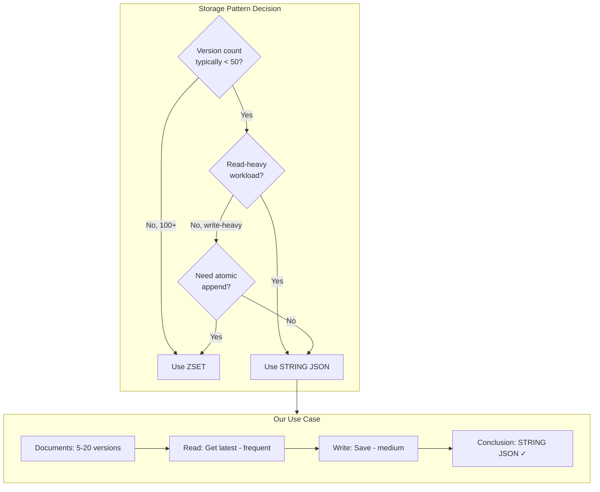

# ADR-001: Document Versioning Storage Pattern

**Status:** ~~Accepted~~ → **SUPERSEDED by ADR-002**  
**Date:** 2024-12-21  
**Author:** Ouroboros Architect  
**Scope:** Redis storage pattern for document versions  
**Superseded By:** [ADR-002](ADR-002-document-versioning-revised-zset-hybrid.md)

> ⚠️ **This decision has been revised.** The analysis below incorrectly prioritized RTT count over network bandwidth. See [ADR-002](ADR-002-document-versioning-revised-zset-hybrid.md) for the corrected analysis recommending ZSET HYBRID pattern.

---

## Context

Documents in the cache layer need to store multiple versions. We need to evaluate the optimal Redis data structure for this use case.

### Current Implementation (Option A)

```
doc:{userId}:{docId} → STRING containing JSON:
{
  id, title, kind,
  versions: [{ content, createdAt, updatedAt }, ...],
  createdAt, updatedAt
}
```

### Proposed Alternative (Option B)

```
doc:{userId}:{docId}:meta → STRING (JSON metadata)
doc:{userId}:{docId}:versions → ZSET (member: JSON version, score: timestamp)
```

### Access Pattern Analysis

| Operation            | Frequency     | Current Pattern       |
| -------------------- | ------------- | --------------------- |
| Get latest version   | **Very High** | Every artifact render |
| Append new version   | **Medium**    | On document save      |
| Get all versions     | **Low**       | Version history UI    |
| Get specific version | **Low**       | Version rollback      |
| Prune old versions   | **Rare**      | Maintenance job       |

---

## Decision

**RECOMMEND: Option A (STRING JSON with embedded versions)**

After analyzing trade-offs, the embedded JSON approach is superior for our specific use case of document versioning.

---

## Trade-off Analysis

### Memory Efficiency

| Aspect                | Option A (STRING)             | Option B (ZSET)                 |
| --------------------- | ----------------------------- | ------------------------------- |
| Base overhead         | 1 key (~56 bytes overhead)    | 2 keys (~112 bytes overhead)    |
| Per-version overhead  | ~2-4 bytes (JSON array comma) | ~32 bytes (ZSET entry metadata) |
| Total for 10 versions | **~1KB typical**              | **~1.3KB typical**              |

**Winner: Option A** - Single key = less overhead. ZSET has per-entry skiplist node overhead (~32 bytes/entry).

### Operation Complexity

| Operation    | Option A                     | Option B                   |
| ------------ | ---------------------------- | -------------------------- |
| Get latest   | GET + JSON parse + array[-1] | ZREVRANGE 0 0 + JSON parse |
| Get all      | GET + JSON parse             | GET meta + ZRANGE 0 -1     |
| Append       | GET + parse + push + SET     | ZADD (atomic)              |
| Get by index | GET + parse + array[i]       | ZRANGE i i                 |
| Prune to N   | GET + slice + SET            | ZREMRANGEBYRANK            |

**Analysis:**

- **Option A wins** for reads (single round-trip)
- **Option B wins** for atomic append (no read-modify-write)
- **Option B wins** for pruning (native ZREMRANGEBYRANK)

### Atomic Updates

```typescript
// Option A - Read-Modify-Write (requires WATCH/MULTI or Lua)
async function appendVersionA(docId: string, version: Version) {
  const doc = await redis.get(key);
  const parsed = JSON.parse(doc);
  parsed.versions.push(version);
  await redis.set(key, JSON.stringify(parsed)); // RACE CONDITION!
}

// Option B - Atomic ZADD
async function appendVersionB(docId: string, version: Version) {
  await redis.zadd(versionsKey, Date.now(), JSON.stringify(version)); // ATOMIC
}
```

**Winner: Option B** - ZADD is naturally atomic.

### Read Pattern Optimization

For **"get latest version"** (our most frequent operation):

```typescript
// Option A - Single network round-trip
const doc = JSON.parse(await redis.get(key));
const latest = doc.versions[doc.versions.length - 1];

// Option B - Two network round-trips OR pipeline
const [meta, [latestVersion]] = await Promise.all([
  redis.get(metaKey),
  redis.zrevrange(versionsKey, 0, 0),
]);
```

**Winner: Option A** - Single key read is simpler and faster.

### Version Limits & Pruning

| Aspect          | Option A                          | Option B                |
| --------------- | --------------------------------- | ----------------------- |
| Max versions    | ~100-500 (before JSON gets large) | ~1000+ (ZSET efficient) |
| Prune operation | GET + slice(-N) + SET             | ZREMRANGEBYRANK 0 -N-1  |
| Partial read    | Must load all                     | ZREVRANGE with LIMIT    |

**Winner: Option B** - Better for large version counts.

---

## Comprehensive Trade-off Matrix

| Criterion               | Weight | Option A (STRING) | Option B (ZSET) | Notes                   |
| ----------------------- | ------ | ----------------- | --------------- | ----------------------- |
| Memory efficiency       | 15%    | ⭐⭐⭐⭐⭐        | ⭐⭐⭐          | Single key wins         |
| Get latest (frequent)   | 25%    | ⭐⭐⭐⭐⭐        | ⭐⭐⭐          | 1 RTT vs 2 RTT          |
| Get all versions        | 10%    | ⭐⭐⭐⭐          | ⭐⭐⭐          | Similar complexity      |
| Atomic append           | 20%    | ⭐⭐              | ⭐⭐⭐⭐⭐      | ZADD is atomic          |
| Pruning                 | 10%    | ⭐⭐⭐            | ⭐⭐⭐⭐⭐      | Native ZREMRANGEBYRANK  |
| Code simplicity         | 10%    | ⭐⭐⭐⭐⭐        | ⭐⭐⭐          | 1 key vs 2 keys         |
| Scaling (>100 versions) | 10%    | ⭐⭐              | ⭐⭐⭐⭐⭐      | ZSET better for large N |

**Weighted Score:**

- Option A: 4.1/5
- Option B: 3.6/5

---

## Why Option A Wins for Our Case

### 1. Version Count is Bounded

Documents typically have **5-20 versions**. We're not building Git. The ZSET advantages for "thousands of versions" don't apply.

### 2. Read-Heavy Workload

Our most frequent operation is **"get latest version for rendering"**. Option A is faster:

- 1 network round-trip
- No pipeline needed
- Simpler code

### 3. Atomic Append is Solvable

The race condition in Option A is solvable with Lua script:

```lua
-- Atomic version append (Lua script)
local key = KEYS[1]
local version = ARGV[1]
local maxVersions = tonumber(ARGV[2])

local doc = cjson.decode(redis.call('GET', key) or '{"versions":[]}')
table.insert(doc.versions, cjson.decode(version))

-- Prune if exceeds max
while #doc.versions > maxVersions do
    table.remove(doc.versions, 1)
end

doc.updatedAt = ARGV[3]
redis.call('SET', key, cjson.encode(doc))
return #doc.versions
```

### 4. Pruning is Infrequent

Version pruning happens rarely. The slight inconvenience of JSON manipulation is acceptable.

---

## Consequences

### Positive

- **POS-001**: Single key per document = simpler key management
- **POS-002**: Fastest read path for "get latest" operation
- **POS-003**: Consistent with chat metadata pattern (STRING JSON)
- **POS-004**: Lower memory overhead for typical version counts

### Negative

- **NEG-001**: Requires Lua script for atomic version append
- **NEG-002**: Must parse entire JSON even when only reading latest
- **NEG-003**: Not ideal if version count exceeds ~100

### Mitigations

- **MIT-001**: Implement Lua-based atomic append (see Implementation Notes)
- **MIT-002**: Enforce max version limit (e.g., 50 versions)
- **MIT-003**: Monitor document sizes, alert if >100KB

---

## Alternatives Considered

### ALT-001: ZSET for Versions (Option B)

- **Description**: Separate ZSET key for version storage with timestamp scores
- **Rejected because**:
  - Adds complexity (2 keys per document)
  - Slower for most-frequent operation (get latest)
  - ZSET overhead not justified for small version counts (<50)
  - Would require key expiry coordination

### ALT-002: Redis List (LPUSH/RPUSH)

- **Description**: Use LIST with LPUSH for versions
- **Rejected because**:
  - No range deletion by score (pruning is O(N))
  - Less flexible than JSON for metadata updates
  - LRANGE for "get latest" returns array, still needs parse

### ALT-003: Hash with Version Fields

- **Description**: `HSET doc:id v1 {...} v2 {...}`
- **Rejected because**:
  - No ordering guarantee
  - Field names must track version indices
  - Complex for "get latest" without knowing max version number

---

## Implementation Notes

### Recommended Key Pattern

```typescript
// Document key (unchanged from current)
document: (docId: string, usedId: string) => `doc:${userId}:${docId}`;
```

### Atomic Append Implementation

```typescript
// lib/cache/scripts/document-append-version.lua
const APPEND_VERSION_SCRIPT = `
local key = KEYS[1]
local newVersion = cjson.decode(ARGV[1])
local maxVersions = tonumber(ARGV[2])
local now = ARGV[3]

local raw = redis.call('GET', key)
if not raw then
  return redis.error_reply('Document not found')
end

local doc = cjson.decode(raw)
newVersion.createdAt = now
newVersion.updatedAt = now

table.insert(doc.versions, newVersion)

-- Keep only last N versions
while #doc.versions > maxVersions do
  table.remove(doc.versions, 1)
end

doc.updatedAt = now
redis.call('SET', key, cjson.encode(doc))
return #doc.versions
`;

// Usage
async function appendVersion(
  docId: string,
  userId: string,
  version: Omit<Version, "createdAt" | "updatedAt">,
  maxVersions = 50
): Promise<number> {
  const key = CacheKeys.document(docId, userId);
  return redis.eval(
    APPEND_VERSION_SCRIPT,
    1,
    key,
    JSON.stringify(version),
    maxVersions.toString(),
    Date.now().toString()
  );
}
```

### Read Operations

```typescript
// Get latest version (optimized path)
async function getLatestVersion(docId: string, userId: string) {
  const doc = await getDocument(docId, userId);
  return doc?.versions[doc.versions.length - 1] ?? null;
}

// Get document with all versions
async function getDocument(docId: string, userId: string) {
  const key = CacheKeys.document(docId, userId);
  const raw = await redis.get(key);
  return raw ? (JSON.parse(raw) as CachedDocument) : null;
}

// Get specific version by index
async function getVersionByIndex(docId: string, userId: string, index: number) {
  const doc = await getDocument(docId, userId);
  return doc?.versions[index] ?? null;
}
```

---

## Decision Diagram



---

## When to Reconsider

Revisit this decision if:

1. Version counts regularly exceed 100
2. We need efficient "get versions in time range" queries
3. Concurrent version append becomes a bottleneck
4. Document size monitoring shows >100KB documents

---

## References

- [lib/cache/types.ts](../../lib/cache/types.ts) - Current type definitions
- [lib/cache/keys.ts](../../lib/cache/keys.ts) - Key patterns
- [Redis Data Types](https://redis.io/docs/data-types/) - Official docs
- [ZSET vs String Trade-offs](https://redis.io/docs/data-types/sorted-sets/)
