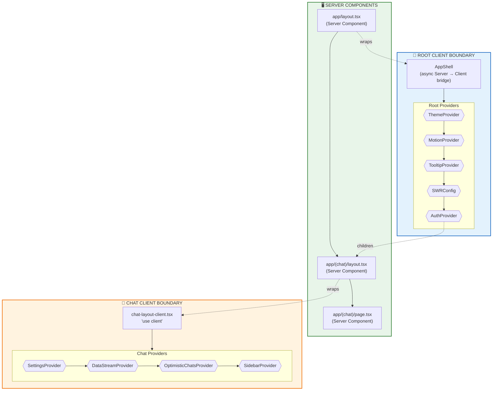
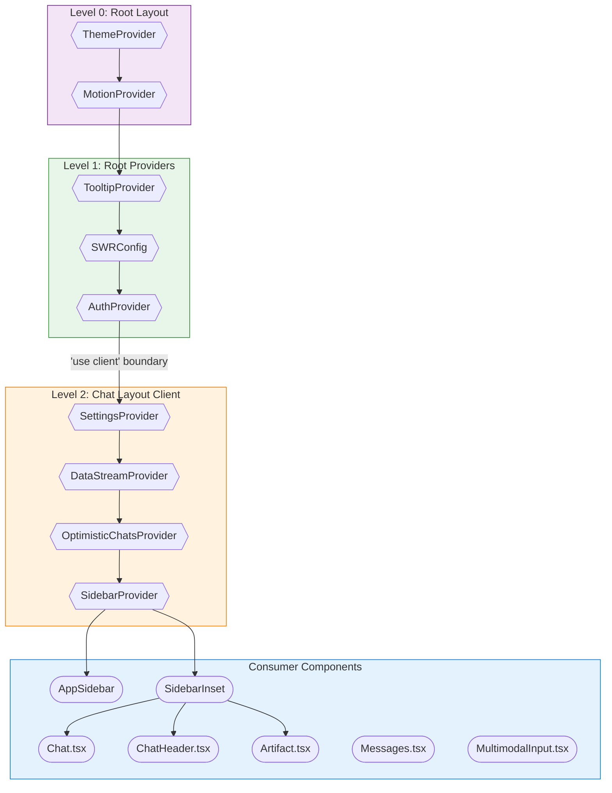
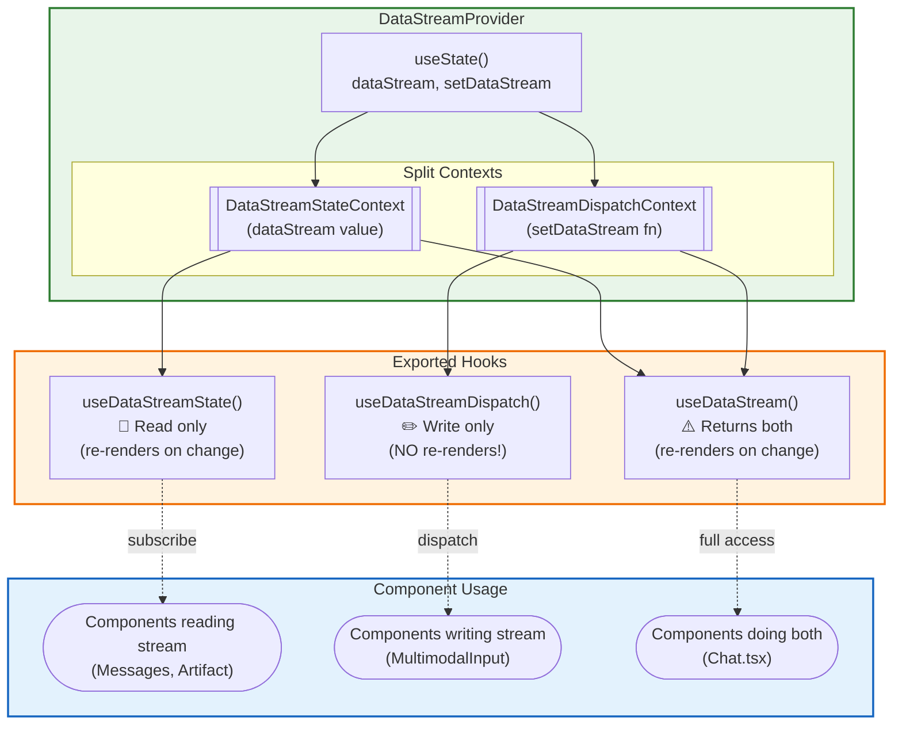
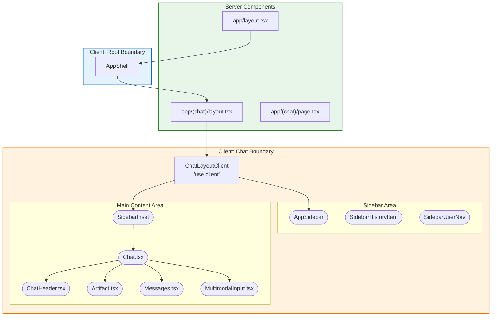
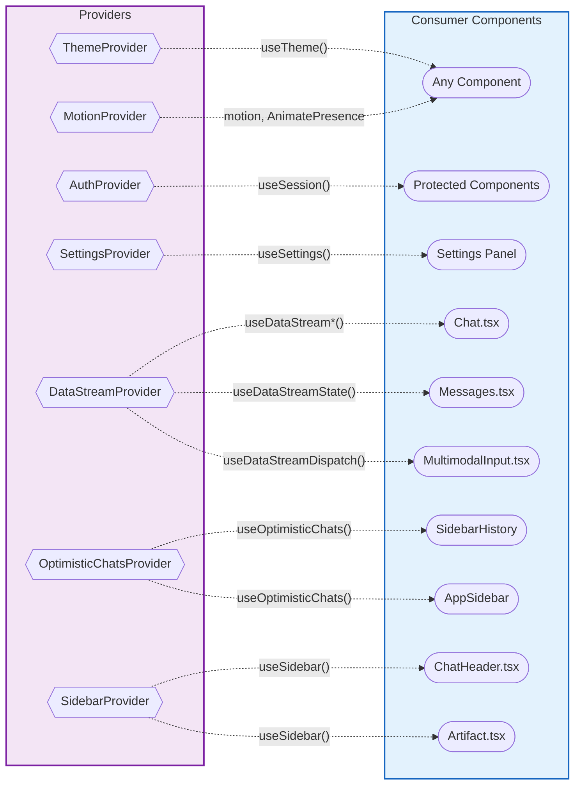

# Provider Architecture Diagram

> Generated: 2024-12-17  
> Source: Phase 1 Provider Consolidation

This document visualizes the provider architecture after consolidating all providers into `components/providers/`.

---

## 1. Server/Client Boundary Overview

---

## 2. Provider Nesting Hierarchy

---

## 3. DataStreamProvider Split Context Pattern

---

## 4. Component Tree with Client Boundaries

---

## 5. Provider → Consumer Mapping

---

## Legend

| Symbol               | Meaning                |
| -------------------- | ---------------------- |
| `[Rectangle]`        | Server Component       |
| `([Rounded])`        | Client Component       |
| `{{Diamond}}`        | Provider (Context)     |
| `[[Double Bracket]]` | Context Object         |
| `-->`                | Direct child / nesting |
| `-.->`               | Consumes / uses hook   |
| Green background     | Server-side            |
| Blue background      | Client-side (root)     |
| Orange background    | Client-side (chat)     |
| Purple background    | Provider layer         |

---

## File Locations

| Provider                | Path                                                 |
| ----------------------- | ---------------------------------------------------- |
| AuthProvider            | `components/providers/auth-provider.tsx`             |
| ThemeProvider           | `components/providers/theme-provider.tsx`            |
| DataStreamProvider      | `components/providers/data-stream-provider.tsx`      |
| SettingsProvider        | `components/providers/settings-provider.tsx`         |
| OptimisticChatsProvider | `components/providers/optimistic-chats-provider.tsx` |
| MotionProvider          | `components/providers/motion-provider.tsx`           |

---

## Key Architecture Decisions

1. **Split Context Pattern**: `DataStreamProvider` uses two separate contexts to allow dispatch-only components to avoid re-renders when state changes.

2. **Client Boundary Placement**: The main `'use client'` boundary is at `chat-layout-client.tsx`, keeping layout server-rendered while enabling client interactivity.

3. **Provider Hierarchy**: Providers are nested from most global (Theme) to most specific (Sidebar), ensuring each layer can access parent context.

4. **Lazy Loading**: `AppSidebar` is dynamically imported with `next/dynamic` to reduce initial bundle size.

5. **MotionProvider Integration**: Uses `LazyMotion` with `domAnimation` feature set (~40KB bundle savings vs full framer-motion). Strict mode is enabled for development warnings. Components use re-exported `motion` and `AnimatePresence` from the provider module for tree-shaking benefits.
