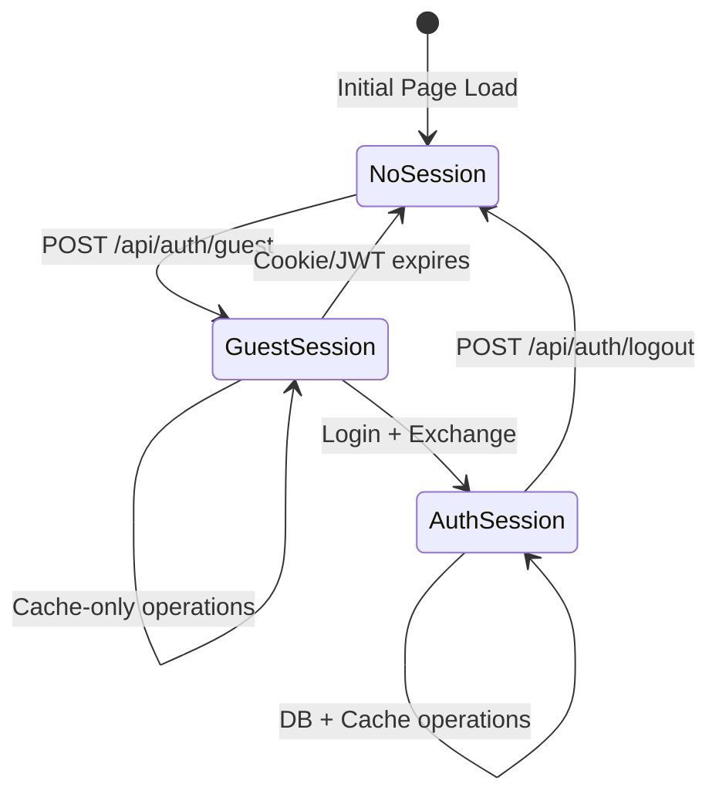
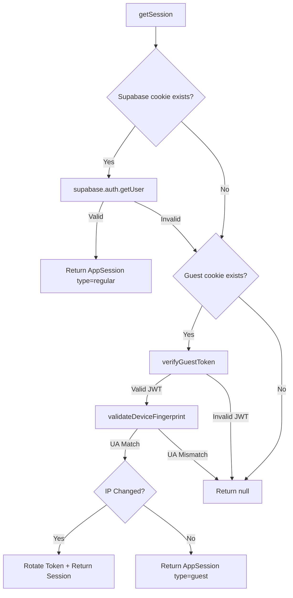
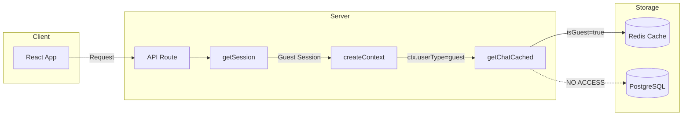
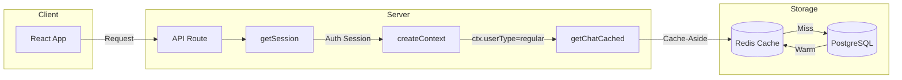
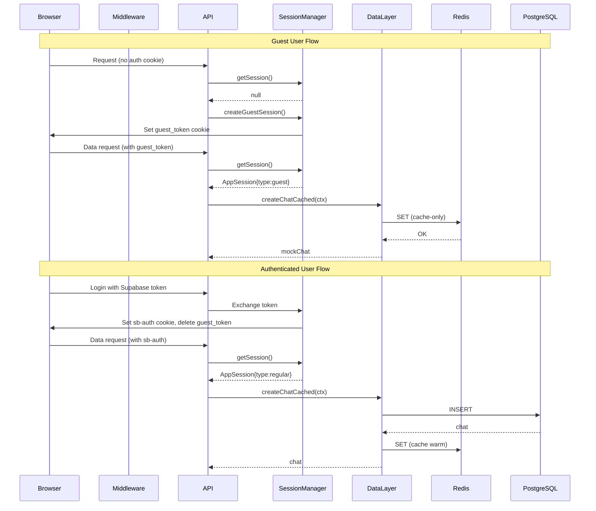

# Session & Authentication Architecture

**Related Documents:**

- [Session Analysis Report](session-analysis-report.md) v1.2
- [Optimization Roadmap](session-optimization-roadmap.md) v1.1
- [Implementation Tasks](session-implementation-tasks.md)


> **Comprehensive documentation of the dual-mode authentication system for the Next.js AI Chatbot**

---

## Table of Contents

1. [Executive Summary](#executive-summary)
2. [Architecture Diagrams](#architecture-diagrams)
   - [Authentication State Machine](#diagram-1-authentication-state-machine)
   - [Session Resolution Flow](#diagram-2-session-resolution-flow)
   - [Guest User Data Flow](#diagram-3-guest-user-data-flow)
   - [Authenticated User Data Flow](#diagram-4-authenticated-user-data-flow)
   - [Complete System Architecture](#diagram-5-complete-system-architecture)
3. [ASCII Architecture Diagram](#ascii-architecture-diagram)
4. [Token Lifecycle](#token-lifecycle)
5. [Security Features](#security-features)
6. [Files Reference](#files-reference)
7. [Key Functions Reference](#key-functions-reference)

---

## Executive Summary

The Next.js AI Chatbot implements a **dual-mode authentication system** that seamlessly supports both guest and authenticated users:

| Mode              | Description                                  | Storage                  | Persistence              |
| ----------------- | -------------------------------------------- | ------------------------ | ------------------------ |
| **Guest**         | Anonymous users with device-bound JWT tokens | Redis Cache only         | 7-day cookie, 1-hour JWT |
| **Authenticated** | Supabase-authenticated users                 | PostgreSQL + Redis Cache | Supabase session         |

### Key Characteristics

- **Zero-friction onboarding**: Users can start chatting immediately without registration
- **Seamless upgrade path**: Guest sessions can be upgraded to authenticated sessions
- **Cache-aside pattern**: Authenticated users benefit from Redis caching with PostgreSQL persistence
- **Device binding**: Guest tokens are bound to IP + User-Agent fingerprints
- **Automatic token rotation**: Proactive rotation at 30-minute threshold or IP change

---

## Architecture Diagrams

### Diagram 1: Authentication State Machine



**State Descriptions:**

| State          | Description                             |
| -------------- | --------------------------------------- |
| `NoSession`    | No valid auth cookies present           |
| `GuestSession` | Valid `guest_token` cookie with JWT     |
| `AuthSession`  | Valid Supabase `sb-*-auth-token` cookie |

---

### Diagram 2: Session Resolution Flow



**Resolution Priority:**

1. **Supabase session** (higher priority) → Returns `type: 'regular'`
2. **Guest session** (fallback) → Returns `type: 'guest'`
3. **No session** → Returns `null`

---

### Diagram 3: Guest User Data Flow



**Guest Data Rules:**

- All data operations are **cache-only**
- No database writes or reads
- Data expires with cache TTL (7 days)
- Perfect for try-before-signup experience

---

### Diagram 4: Authenticated User Data Flow



**Authenticated Data Strategy:**

- **Read**: Cache-first, DB fallback, background cache warm
- **Write**: DB first, then update cache
- **Delete**: DB first, then invalidate cache

---

### Diagram 5: Complete System Architecture



---

## ASCII Architecture Diagram

```
┌─────────────────────────────────────────────────────────────────────────────────┐
│                           NEXT.JS AI CHATBOT ARCHITECTURE                        │
├─────────────────────────────────────────────────────────────────────────────────┤
│                                                                                  │
│  ┌─────────────────────────────────────────────────────────────────────────────┐│
│  │                              CLIENT LAYER                                    ││
│  │  ┌────────────────┐    ┌────────────────┐    ┌────────────────┐            ││
│  │  │  React App     │───▶│  Auth Provider │───▶│  API Client    │            ││
│  │  │  (app/)        │    │  (AuthContext) │    │  (fetch)       │            ││
│  │  └────────────────┘    └────────────────┘    └────────────────┘            ││
│  └─────────────────────────────────────────────────────────────────────────────┘│
│                                      │                                           │
│                                      ▼                                           │
│  ┌─────────────────────────────────────────────────────────────────────────────┐│
│  │                           EDGE MIDDLEWARE LAYER                             ││
│  │  ┌────────────────────────────────────────────────────────────────────────┐ ││
│  │  │  middleware.ts                                                         │ ││
│  │  │  ├── Security Headers (X-Content-Type-Options, X-Frame-Options, etc.) │ ││
│  │  │  ├── Rate Limiting (auth/chat/upload/guest/standard limiters)         │ ││
│  │  │  ├── Request ID Generation (X-Request-ID header)                      │ ││
│  │  │  └── Session Cookie Detection (routing optimization)                  │ ││
│  │  └────────────────────────────────────────────────────────────────────────┘ ││
│  └─────────────────────────────────────────────────────────────────────────────┘│
│                                      │                                           │
│                                      ▼                                           │
│  ┌─────────────────────────────────────────────────────────────────────────────┐│
│  │                              API ROUTES LAYER                               ││
│  │  ┌──────────────────┐  ┌──────────────────┐  ┌──────────────────┐          ││
│  │  │ /api/auth/guest  │  │ /api/auth/       │  │ /api/auth/logout │          ││
│  │  │ Create guest     │  │ exchange         │  │ Clear cookies    │          ││
│  │  │ session          │  │ Token→Cookie     │  │                  │          ││
│  │  └──────────────────┘  └──────────────────┘  └──────────────────┘          ││
│  │  ┌──────────────────┐  ┌──────────────────┐  ┌──────────────────┐          ││
│  │  │ /api/chat        │  │ /api/document    │  │ /api/history     │          ││
│  │  │ Chat operations  │  │ Doc operations   │  │ Chat history     │          ││
│  │  └──────────────────┘  └──────────────────┘  └──────────────────┘          ││
│  └─────────────────────────────────────────────────────────────────────────────┘│
│                                      │                                           │
│                                      ▼                                           │
│  ┌─────────────────────────────────────────────────────────────────────────────┐│
│  │                           AUTH LAYER (lib/auth/)                            ││
│  │  ┌────────────────────────────────────────────────────────────────────────┐ ││
│  │  │  SessionManager (session.ts)                                           │ ││
│  │  │  ├── getSession()        → Resolve session (Supabase > Guest > null)  │ ││
│  │  │  ├── createGuestSession() → Create new guest with device fingerprint │ ││
│  │  │  ├── getOrCreateSession() → Get existing or create guest             │ ││
│  │  │  ├── rotateGuestTokenIfNeeded() → Proactive rotation               │ ││
│  │  │  └── buildContext()      → Create DataContext from session          │ ││
│  │  └────────────────────────────────────────────────────────────────────────┘ ││
│  │  ┌─────────────────┐  ┌─────────────────┐  ┌─────────────────┐            ││
│  │  │ jwt.ts          │  │ cookies.ts      │  │ guards.ts       │            ││
│  │  │ JWT operations  │  │ Cookie helpers  │  │ Auth guards     │            ││
│  │  └─────────────────┘  └─────────────────┘  └─────────────────┘            ││
│  └─────────────────────────────────────────────────────────────────────────────┘│
│                                      │                                           │
│                                      ▼                                           │
│  ┌─────────────────────────────────────────────────────────────────────────────┐│
│  │                          DATA LAYER (lib/data/)                             ││
│  │  ┌────────────────────────────────────────────────────────────────────────┐ ││
│  │  │  Cached Operations (cached/*.ts)                                       │ ││
│  │  │  ├── Guest Mode (isGuest=true):  Cache-only, no DB access            │ ││
│  │  │  └── Auth Mode (isGuest=false):  Cache-aside with DB persistence     │ ││
│  │  └────────────────────────────────────────────────────────────────────────┘ ││
│  │  ┌─────────────────────────────────────┐  ┌─────────────────────────────┐  ││
│  │  │ base.ts                             │  │ types.ts                    │  ││
│  │  │ isGuest(), createContext()          │  │ DataContext, PaginationParams││
│  │  └─────────────────────────────────────┘  └─────────────────────────────┘  ││
│  └─────────────────────────────────────────────────────────────────────────────┘│
│                                      │                                           │
│                     ┌────────────────┴────────────────┐                         │
│                     ▼                                  ▼                         │
│  ┌─────────────────────────────────┐  ┌─────────────────────────────────────┐  │
│  │         REDIS CACHE             │  │           POSTGRESQL                │  │
│  │  ┌───────────────────────────┐  │  │  ┌─────────────────────────────────┐│  │
│  │  │ Guest Data (cache-only)   │  │  │  │ Authenticated User Data        ││  │
│  │  │ ├── chat:{userId}:{id}    │  │  │  │ ├── users table                 ││  │
│  │  │ ├── messages:{chatId}     │  │  │  │ ├── chats table                 ││  │
│  │  │ └── user:chats:{userId}   │  │  │  │ ├── messages table              ││  │
│  │  │ TTL: 7 days               │  │  │  │ ├── documents table             ││  │
│  │  └───────────────────────────┘  │  │  │ └── votes table                 ││  │
│  │  ┌───────────────────────────┐  │  │  └─────────────────────────────────┘│  │
│  │  │ Auth User Cache (warm)    │  │  │                                     │  │
│  │  │ (same structure)          │  │  │                                     │  │
│  │  └───────────────────────────┘  │  │                                     │  │
│  └─────────────────────────────────┘  └─────────────────────────────────────┘  │
│                                                                                  │
└─────────────────────────────────────────────────────────────────────────────────┘

FILES MAPPING:
─────────────────────────────────────────────────────────────────────────────────

Client Layer:
  └── app/(chat)/, app/(auth)/

Middleware Layer:
  └── middleware.ts
  └── lib/middleware/

Auth Layer:
  ├── lib/auth/session.ts      ← SessionManager singleton
  ├── lib/auth/jwt.ts          ← JWT & device fingerprint
  ├── lib/auth/cookies.ts      ← Cookie utilities
  ├── lib/auth/guards.ts       ← requireAuth, verifyOwnership
  ├── lib/auth/constants.ts    ← TTL, cookie names
  └── lib/auth/types.ts        ← AppSession, DataContext, etc.

API Routes:
  ├── app/api/auth/guest/route.ts
  ├── app/api/auth/exchange/route.ts
  └── app/api/auth/logout/route.ts

Data Layer:
  ├── lib/data/base.ts         ← isGuest(), createContext()
  ├── lib/data/cached/*.ts     ← Cache-integrated operations
  ├── lib/cache-ops/           ← Cache operation implementations
  └── lib/db/                  ← Database operations
```

---

## Token Lifecycle

### Guest JWT Token

| Property               | Value               | Description                           |
| ---------------------- | ------------------- | ------------------------------------- |
| **Cookie Name**        | `guest_token`       | HttpOnly, Secure (prod), SameSite=Lax |
| **Cookie TTL**         | 7 days (604,800s)   | Browser cookie lifetime               |
| **JWT Expiration**     | 1 hour (3,600s)     | Token validity period                 |
| **Rotation Threshold** | 30 minutes (1,800s) | Rotate when < 30 min remaining        |
| **Algorithm**          | HS256               | HMAC SHA-256                          |
| **Issuer**             | `nextjs-ai-chatbot` | Token issuer claim                    |

**JWT Payload Structure:**

```typescript
interface GuestTokenPayload {
  sub: string; // 'guest:{nanoid}' - unique guest identifier
  type: "guest"; // Token type discriminator
  iat: number; // Issued at timestamp
  exp: number; // Expiration timestamp
  fp?: {
    // Device fingerprint (optional)
    ipHash: string; // SHA-256 truncated (16 chars)
    uaHash: string; // SHA-256 truncated (16 chars)
  };
}
```

**Token Lifecycle Events:**

```
Creation                     Rotation Triggers                  Expiration
    │                              │                                │
    ▼                              ▼                                ▼
┌───────┐  30 min remaining  ┌───────────┐  IP change      ┌───────────┐
│ POST  │ ─────────────────▶ │ ROTATE    │ ──────────────▶ │ ROTATE    │
│ guest │                    │ (time)    │                  │ (IP)      │
└───────┘                    └───────────┘                  └───────────┘
    │                              │                                │
    └──────────────────────────────┴────────────────────────────────┘
                                   │
                         1 hour (JWT exp) or
                         7 days (cookie exp)
                                   │
                                   ▼
                            ┌───────────┐
                            │  EXPIRED  │
                            │ New guest │
                            │ created   │
                            └───────────┘
```

### Supabase Auth Token

| Property        | Value                       | Description                  |
| --------------- | --------------------------- | ---------------------------- |
| **Cookie Name** | `sb-{projectId}-auth-token` | Supabase managed             |
| **Cookie TTL**  | 1 hour (3,600s)             | Set during exchange          |
| **Token Type**  | Supabase JWT                | OAuth2 access token          |
| **Refresh**     | Automatic                   | Supabase SDK handles refresh |

**Exchange Flow:**

```
┌─────────────┐     ┌─────────────┐     ┌─────────────┐
│  Supabase   │     │   /api/     │     │   Browser   │
│  OAuth/     │────▶│   auth/     │────▶│   Cookie    │
│  Login      │     │   exchange  │     │   Set       │
└─────────────┘     └─────────────┘     └─────────────┘
      │                   │                    │
      │ accessToken       │ Validate with      │ sb-*-auth-token
      │ (client-side)     │ Supabase API       │ (HttpOnly)
      │                   │                    │
      │                   │ Delete guest_token │
      │                   │ if present         │
      └───────────────────┴────────────────────┘
```

---

## Security Features

### 1. Device Fingerprinting

Device fingerprints bind guest sessions to specific browsers:

| Component      | Handling                | Purpose         |
| -------------- | ----------------------- | --------------- |
| **IP Address** | SHA-256 hash (16 chars) | Network binding |
| **User-Agent** | SHA-256 hash (16 chars) | Browser binding |

**Validation Rules:**

| Condition               | Action             | Reason                    |
| ----------------------- | ------------------ | ------------------------- |
| UA hash mismatch        | **Reject session** | Potential session theft   |
| IP hash change          | **Rotate token**   | Legitimate network change |
| No fingerprint (legacy) | **Allow**          | Backward compatibility    |

```typescript
// Fingerprint creation (lib/auth/jwt.ts)
async function createDeviceFingerprint(
  ip: string | null,
  userAgent: string | null
): Promise<DeviceFingerprint> {
  const normalizedIp = ip?.split(",")[0]?.trim() || "unknown";
  const normalizedUa = userAgent?.toLowerCase().trim() || "unknown";

  const [ipHash, uaHash] = await Promise.all([
    sha256Truncated(normalizedIp),
    sha256Truncated(normalizedUa),
  ]);

  return { ipHash, uaHash };
}
```

### 2. Rate Limiting

Edge middleware enforces tiered rate limits:

| Limiter    | Auth Limit   | Guest Limit | Use Case                 |
| ---------- | ------------ | ----------- | ------------------------ |
| `auth`     | Strict       | Strict      | Login/register endpoints |
| `chat`     | 50 req/min   | 20 req/min  | AI chat operations       |
| `upload`   | Very strict  | Very strict | File uploads             |
| `search`   | 1000 req/min | 100 req/min | Suggestions              |
| `standard` | 100 req/min  | 20 req/min  | General API              |
| `guest`    | N/A          | 20 req/min  | Guest-specific           |

**IP Identifier Format:**

```
Authenticated: auth:{ip-address}
Guest:         guest:{ip-address}
```

### 3. Cookie Security

| Attribute  | Value         | Purpose                  |
| ---------- | ------------- | ------------------------ |
| `httpOnly` | `true`        | Prevent XSS access       |
| `secure`   | `true` (prod) | HTTPS only in production |
| `sameSite` | `lax`         | CSRF protection          |
| `path`     | `/`           | Available site-wide      |

### 4. Security Headers

Applied via middleware to all responses:

```typescript
const securityHeaders = {
  "X-Content-Type-Options": "nosniff",
  "X-Frame-Options": "DENY",
  "X-XSS-Protection": "1; mode=block",
  "Referrer-Policy": "strict-origin-when-cross-origin",
  "Permissions-Policy": "camera=(), microphone=(), geolocation=()",
};
```

### 5. Request Tracing

Every request gets a correlation ID:

```
Header: X-Request-ID: {nanoid}
```

Used for:

- Log correlation
- Error tracking
- Debugging distributed requests

---

## Files Reference

### Core Authentication Files

| File                                                    | Purpose                         | Key Exports                                                               |
| ------------------------------------------------------- | ------------------------------- | ------------------------------------------------------------------------- |
| [lib/auth/session.ts](../../../lib/auth/session.ts)     | Session management singleton    | `SessionManager`, `getSession()`                                          |
| [lib/auth/jwt.ts](../../../lib/auth/jwt.ts)             | JWT operations & fingerprinting | `createGuestToken()`, `verifyGuestToken()`, `validateDeviceFingerprint()` |
| [lib/auth/cookies.ts](../../../lib/auth/cookies.ts)     | Cookie utilities                | `getGuestTokenCookie()`, `setGuestTokenCookie()`                          |
| [lib/auth/guards.ts](../../../lib/auth/guards.ts)       | Auth guards for routes          | `requireAuth()`, `requireAuthForRoute()`, `verifyOwnership()`             |
| [lib/auth/constants.ts](../../../lib/auth/constants.ts) | Configuration constants         | `GUEST_CACHE_TTL_SECONDS`, `JWT_EXPIRATION_SECONDS`                       |
| [lib/auth/types.ts](../../../lib/auth/types.ts)         | TypeScript types                | `AppSession`, `AppUser`, `DataContext`, `GuestTokenPayload`               |
| [lib/auth/index.ts](../../../lib/auth/index.ts)         | Barrel export                   | Re-exports all auth utilities                                             |

### API Routes

| File                                                                      | Endpoint                  | Purpose                            |
| ------------------------------------------------------------------------- | ------------------------- | ---------------------------------- |
| [app/api/auth/guest/route.ts](../../../app/api/auth/guest/route.ts)       | `POST /api/auth/guest`    | Create/retrieve guest session      |
| [app/api/auth/exchange/route.ts](../../../app/api/auth/exchange/route.ts) | `POST /api/auth/exchange` | Exchange Supabase token for cookie |
| [app/api/auth/logout/route.ts](../../../app/api/auth/logout/route.ts)     | `POST /api/auth/logout`   | Clear all auth cookies             |

### Middleware & Data Layer

| File                                                          | Purpose                                      |
| ------------------------------------------------------------- | -------------------------------------------- |
| [middleware.ts](../../../middleware.ts)                       | Rate limiting, security headers, request IDs |
| [lib/data/base.ts](../../../lib/data/base.ts)                 | `isGuest()`, `createContext()` helpers       |
| [lib/data/cached/chat.ts](../../../lib/data/cached/chat.ts)   | Cache-integrated chat operations             |
| [lib/data/cached/index.ts](../../../lib/data/cached/index.ts) | Barrel export for cached operations          |

---

## Key Functions Reference

### SessionManager Methods

```typescript
class SessionManager {
  // Get singleton instance
  static getInstance(): SessionManager;

  // Get current session (Supabase > Guest > null)
  async getSession(): Promise<AppSession | null>;

  // Create new guest session with device binding
  async createGuestSession(): Promise<AppSession>;

  // Get existing or create new session
  async getOrCreateSession(): Promise<{ session: AppSession; isNew: boolean }>;

  // Rotate token if needed (time-based or IP change)
  async rotateGuestTokenIfNeeded(): Promise<boolean>;

  // Build DataContext from session
  buildContext(session: AppSession, requestId?: string): DataContext;
}

// Convenience exports
function getSessionManager(): SessionManager;
async function getSession(): Promise<AppSession | null>;
```

### JWT Functions

```typescript
// Create device fingerprint from request context
async function createDeviceFingerprint(
  ip: string | null,
  userAgent: string | null
): Promise<DeviceFingerprint>;

// Validate fingerprint (returns valid + ipChanged flags)
async function validateDeviceFingerprint(
  stored: DeviceFingerprint | undefined,
  currentIp: string | null,
  currentUserAgent: string | null
): Promise<{ valid: boolean; ipChanged: boolean }>;

// Create signed guest JWT
async function createGuestToken(
  guestId: string,
  fingerprint?: DeviceFingerprint
): Promise<string>;

// Verify and decode guest JWT
async function verifyGuestToken(
  token: string
): Promise<GuestTokenPayload | null>;

// Check if token needs rotation (< 30 min remaining)
function needsRotation(payload: GuestTokenPayload): boolean;
```

### Auth Guards

```typescript
// Require auth for Server Actions (throws on failure)
async function requireAuth(surface: Surface): Promise<AuthResult>;

// Require auth for API Routes (returns Response on failure)
async function requireAuthForRoute(
  surface: Surface
): Promise<AuthResult | Response>;

// Verify resource ownership
function verifyOwnership(
  session: AppSession,
  resourceUserId: string,
  resourceType: string
): void;

// Restrict to non-guest users
function requireRegularUser(session: AppSession, feature: string): void;
```

### Data Layer Helpers

```typescript
// Check if context represents a guest user
function isGuest(ctx: DataContext): boolean;

// Create DataContext from user info
function createContext(
  userId: string,
  userType: UserType,
  requestId?: string
): DataContext;
```

---

## Quick Reference Card

```
┌─────────────────────────────────────────────────────────────────┐
│                    SESSION QUICK REFERENCE                       │
├─────────────────────────────────────────────────────────────────┤
│                                                                  │
│  GET SESSION:                                                    │
│    const session = await getSession();                          │
│    if (!session) { /* unauthenticated */ }                      │
│    if (session.user.type === 'guest') { /* guest */ }           │
│    if (session.user.type === 'regular') { /* auth */ }          │
│                                                                  │
│  REQUIRE AUTH (Server Action):                                   │
│    const { session, ctx } = await requireAuth('chat');          │
│    // Throws AppError if not authenticated                       │
│                                                                  │
│  REQUIRE AUTH (API Route):                                       │
│    const result = await requireAuthForRoute('chat');            │
│    if (isAuthResponse(result)) return result; // 401            │
│    const { session, ctx } = result;                              │
│                                                                  │
│  CHECK GUEST:                                                    │
│    if (isGuest(ctx)) { /* cache-only operations */ }            │
│                                                                  │
│  COOKIES:                                                        │
│    guest_token          → Guest JWT (7d cookie, 1h JWT)         │
│    sb-{pid}-auth-token  → Supabase access token                 │
│                                                                  │
│  ENDPOINTS:                                                      │
│    POST /api/auth/guest    → Create guest session               │
│    POST /api/auth/exchange → Login (token → cookie)             │
│    POST /api/auth/logout   → Clear all cookies                  │
│                                                                  │
└─────────────────────────────────────────────────────────────────┘
```

---

_Generated: 2024-12-23 | Next.js AI Chatbot Session Architecture v1.0_
