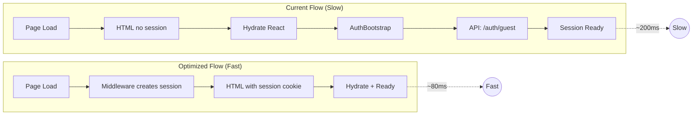
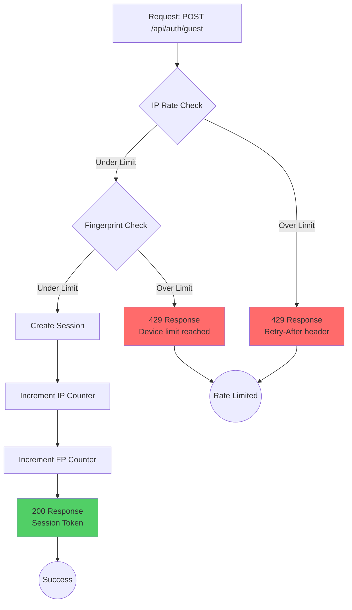
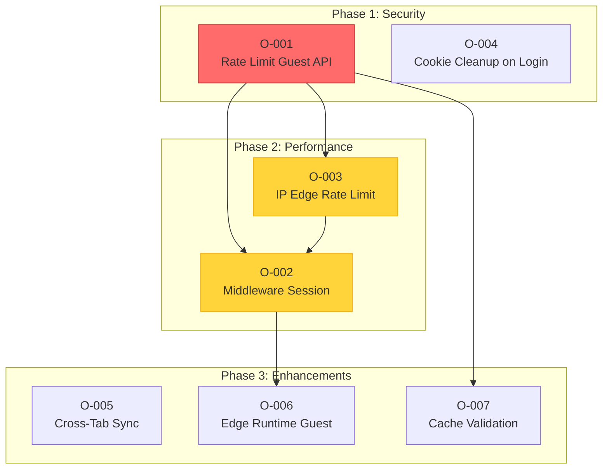
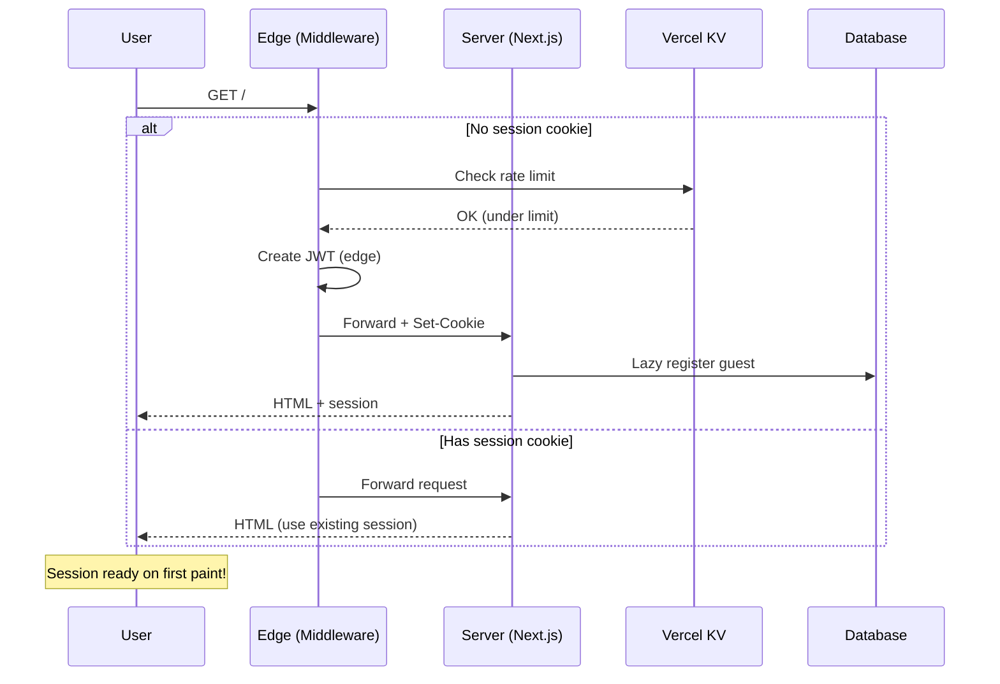

# Session Architecture Optimization Roadmap

> **Version:** 1.2  
> **Date:** December 23, 2025  
> **Last Updated:** December 23, 2025  
> **Based on:** session-analysis-report.md v1.2  
> **Companion To:** [session-analysis-report.md](session-analysis-report.md)  
> **Status:** 🚧 IN PROGRESS

---

## Changes in v1.2

- Marked O-001, O-003, N-001, N-002, N-003 as complete
- Updated optimization matrix status
- Added completion notes

---

## Table of Contents

1. [Optimization Priority Matrix](#1-optimization-priority-matrix)
2. [Implementation Roadmap](#2-implementation-roadmap)
3. [Code Examples](#3-code-examples)
4. [Architecture Diagrams](#4-architecture-diagrams)
5. [Metrics & KPIs](#5-metrics--kpis)
6. [Testing Requirements](#6-testing-requirements)
7. [Appendix](#7-appendix)

---

## 1. Optimization Priority Matrix

| ID        | Optimization                                       | Priority | Effort | Impact   | Risk   | Status  |
| --------- | -------------------------------------------------- | -------- | ------ | -------- | ------ | ------- |
| O-001     | Rate limit guest creation                          | P0       | Low    | Critical | Low    | ✅ DONE |
| O-002     | Middleware session creation                        | P1       | Medium | High     | Medium | 🟡 TODO |
| O-003     | IP-based edge rate limiting                        | P1       | Medium | High     | Low    | ✅ DONE |
| O-004     | Delete guest cookie on login                       | P2       | Low    | Medium   | Low    | 🟢 TODO |
| O-005     | Cross-tab session sync                             | P3       | Medium | Low      | Low    | 🟢 TODO |
| O-006     | Edge runtime for guest route                       | P3       | Low    | Low      | Low    | 🟢 TODO |
| O-007     | Cache session validation                           | P2       | Low    | Medium   | Medium | ✅ DONE |
| **N-001** | Request-scoped session deduplication (React cache) | P1       | Low    | High     | Low    | ✅ DONE |
| **N-002** | Session validation cache (30s TTL)                 | P1       | Medium | High     | Medium | ✅ DONE |
| **N-003** | Remove duplicate guest rate-limit                  | P2       | Low    | Medium   | Low    | ✅ DONE |
| **N-004** | Edge JWT parsing for identifier                    | P2       | Medium | Medium   | Low    | 🟢 TODO |
| **N-005** | Redis pipeline batching                            | P3       | High   | Low      | Low    | 🟢 TODO |

### Priority Definitions

| Priority | Response Time           | Criteria                               |
| -------- | ----------------------- | -------------------------------------- |
| **P0**   | Immediate (< 24h)       | Security vulnerability, data loss risk |
| **P1**   | This sprint (< 1 week)  | Significant performance/UX impact      |
| **P2**   | Next sprint (< 2 weeks) | Moderate improvement, low risk         |
| **P3**   | Backlog (< 1 month)     | Nice-to-have, low priority             |

### Effort Estimates

| Level      | Time       | Complexity                          |
| ---------- | ---------- | ----------------------------------- |
| **Low**    | < 4 hours  | Single file change, well-defined    |
| **Medium** | 4-16 hours | Multiple files, some complexity     |
| **High**   | > 16 hours | Architectural change, testing heavy |

---

## 2. Implementation Roadmap

### Phase 1: Security Fixes (Week 1)

```
┌─────────────────────────────────────────────────────────────────────────────┐
│                         PHASE 1: SECURITY FIXES                             │
├─────────────────────────────────────────────────────────────────────────────┤
│                                                                             │
│  Day 1-2                    Day 3-4                    Day 5               │
│    │                          │                          │                  │
│    ▼                          ▼                          ▼                  │
│  ┌──────────────┐          ┌──────────────┐          ┌──────────────┐      │
│  │   O-001      │          │   O-004      │          │   Testing    │      │
│  │  Rate Limit  │────────► │  Cookie      │────────► │   & QA      │      │
│  │  Guest API   │          │  Cleanup     │          │   Deploy    │      │
│  └──────────────┘          └──────────────┘          └──────────────┘      │
│                                                                             │
│  Deliverables:                                                              │
│  ✓ IP-based rate limit on /api/auth/guest (5 req/IP/hour)                  │
│  ✓ Fingerprint-based rate limit (10 sessions/fingerprint/day)              │
│  ✓ Guest cookie deletion on successful login                               │
│  ✓ Unit tests for rate limiting                                            │
│  ✓ Integration tests for login flow                                        │
│                                                                             │
└─────────────────────────────────────────────────────────────────────────────┘
```

**O-001: Rate limit guest creation**

- Add fingerprint-based rate limiting
- Add IP-based secondary limit
- Implement graceful degradation on limit hit

**O-004: Delete guest cookie on login**

- Clear `guest_token` cookie after Supabase login
- Migrate guest data to authenticated user
- Add session merge conflict handling

### Phase 1.5: Network Optimizations (Weeks 1-2)

```
┌─────────────────────────────────────────────────────────────────────────────┐
│                       PHASE 1.5: NETWORK OPTIMIZATIONS                      │
├─────────────────────────────────────────────────────────────────────────────┤
│                                                                             │
│  Week 1                                    Week 2                           │
│  ┌─────────────────────────────────────┐   ┌─────────────────────────────┐ │
│  │       N-001 & N-003                 │   │       N-002 & N-004         │ │
│  │   Deduplication & Cleanup           │   │   Caching & Edge Parsing    │ │
│  └─────────────────────────────────────┘   └─────────────────────────────┘ │
│                                                                             │
│  Day 1-2       Day 3       Day 4-5        Day 1-2     Day 3       Day 4-5  │
│    │             │             │            │           │             │     │
│    ▼             ▼             ▼            ▼           ▼             ▼     │
│  ┌──────┐     ┌──────┐     ┌──────┐     ┌──────┐   ┌──────┐     ┌──────┐  │
│  │N-001 │────►│N-003 │────►│Test  │     │N-002 │──►│N-004 │────►│Test  │  │
│  │Cache │     │Remove│     │Deploy│     │Cache │   │Edge  │     │Deploy│  │
│  │Dedup │     │Dupe  │     │      │     │Valid │   │Parse │     │      │  │
│  └──────┘     └──────┘     └──────┘     └──────┘   └──────┘     └──────┘  │
│                                                                             │
│  N-001/N-003 Deliverables:              N-002/N-004 Deliverables:          │
│  ✓ React cache() wrapper                ✓ 30s session validation cache     │
│  ✓ Single getUser() per request         ✓ Edge JWT parsing for identifier  │
│  ✓ Remove duplicate rate limiting       ✓ Redis TTL with auto-refresh      │
│  ✓ 50%+ reduction in Supabase calls     ✓ 60%+ cache hit rate target       │
│                                                                             │
└─────────────────────────────────────────────────────────────────────────────┘
```

**N-001: Request-scoped session deduplication**

- Wrap `getSession()` with React `cache()`
- Single Supabase `getUser()` call per request
- Zero configuration, drop-in replacement

**N-002: Session validation cache (30s TTL)**

- Cache validated sessions in memory/Redis
- 30-second TTL with background refresh
- Invalidate on explicit logout/session change
- Note: This 30s TTL is for session validation result cache. Separate from O-007 user metadata cache (5-10min).

**N-003: Remove duplicate guest rate-limiting**

- Audit middleware vs chat route rate limiting
- Consolidate to single rate-limit layer
- Remove redundant Redis calls

**N-004: Edge JWT parsing for identifier**

- Parse guest JWT at edge for user ID
- Avoid database lookup for identifier extraction
- Use for rate-limit keys and request routing

### Phase 2: Performance (Weeks 2-3)

```
┌─────────────────────────────────────────────────────────────────────────────┐
│                       PHASE 2: PERFORMANCE OPTIMIZATION                     │
├─────────────────────────────────────────────────────────────────────────────┤
│                                                                             │
│  Week 2                                    Week 3                           │
│  ┌─────────────────────────────────────┐   ┌─────────────────────────────┐ │
│  │           O-002                      │   │         O-003               │ │
│  │   Middleware Session Creation        │   │   IP Edge Rate Limiting     │ │
│  └─────────────────────────────────────┘   └─────────────────────────────┘ │
│                                                                             │
│  Day 1-2       Day 3-4       Day 5        Day 1-2     Day 3       Day 4-5  │
│    │             │             │            │           │             │     │
│    ▼             ▼             ▼            ▼           ▼             ▼     │
│  ┌──────┐     ┌──────┐     ┌──────┐     ┌──────┐   ┌──────┐     ┌──────┐  │
│  │Design│────►│Impl  │────►│Test  │     │Edge  │──►│Config│────►│Deploy│  │
│  │Review│     │Code  │     │Deploy│     │Setup │   │Tune  │     │Test  │  │
│  └──────┘     └──────┘     └──────┘     └──────┘   └──────┘     └──────┘  │
│                                                                             │
│  O-002 Deliverables:                    O-003 Deliverables:                │
│  ✓ Session created in middleware        ✓ Edge rate limiter deployed       │
│  ✓ HTML ships with session token        ✓ Per-IP limits configured         │
│  ✓ 100ms+ latency reduction             ✓ Vercel KV integration            │
│  ✓ No breaking API changes              ✓ Monitoring dashboard             │
│                                                                             │
└─────────────────────────────────────────────────────────────────────────────┘
```

**O-002: Middleware session creation**

- Move guest session creation to edge middleware
- Pre-populate session before React hydration
- Eliminate client-side API call for new users

**O-003: IP-based edge rate limiting**

- Implement at Vercel edge layer
- Use Vercel KV for distributed counters
- Configure per-route rate limits

### Phase 3: Enhancements (Week 4+)

```
┌─────────────────────────────────────────────────────────────────────────────┐
│                       PHASE 3: ENHANCEMENTS                                 │
├─────────────────────────────────────────────────────────────────────────────┤
│                                                                             │
│  Week 4                     Week 5                     Week 6+              │
│    │                          │                          │                  │
│    ▼                          ▼                          ▼                  │
│  ┌──────────────┐          ┌──────────────┐          ┌──────────────┐      │
│  │   O-005      │          │   O-006      │          │   O-007      │      │
│  │  Cross-Tab   │          │  Edge        │          │   Cache      │      │
│  │  Session     │          │  Runtime     │          │   Session    │      │
│  │  Sync        │          │  Guest API   │          │   Validation │      │
│  └──────────────┘          └──────────────┘          └──────────────┘      │
│                                                                             │
│  Deliverables:              Deliverables:              Deliverables:        │
│  ✓ BroadcastChannel         ✓ Edge-compatible          ✓ Redis caching     │
│    session sync               JWT signing              ✓ 5-min TTL         │
│  ✓ No duplicate             ✓ <10ms cold start         ✓ Invalidation      │
│    sessions                 ✓ Lower latency              on change         │
│  ✓ Tab coordination                                                         │
│                                                                             │
└─────────────────────────────────────────────────────────────────────────────┘
```

**O-005: Cross-tab session sync**

- Implement BroadcastChannel API
- Prevent duplicate session creation
- Sync session state across tabs

**O-006: Edge runtime for guest route**

- Convert guest API to edge runtime
- Optimize JWT operations for edge
- Reduce cold start latency

**O-007: Cache session validation**

- Cache validated sessions in Redis
- 5-minute TTL with automatic refresh
- Invalidate on session change

---

## 3. Code Examples

### 3.1 O-001: Rate Limit Guest Creation

#### BEFORE (Current Implementation)

```typescript
// app/api/auth/guest/route.ts (current)
export async function POST(_request: Request): Promise<Response> {
  const sessionManager = getSessionManager();

  // Check for existing session (Supabase or guest)
  const existingSession = await sessionManager.getSession();

  if (existingSession) {
    return NextResponse.json(
      { user: existingSession.user, isNewSession: false },
      { status: 200 }
    );
  }

  // ⚠️ NO RATE LIMITING - Anyone can create unlimited sessions!
  try {
    const guestSession = await sessionManager.createGuestSession();
    // ... rest of handler
  } catch (_error) {
    // ...
  }
}
```

#### AFTER (With Rate Limiting)

```typescript
// app/api/auth/guest/route.ts (optimized)
import { NextResponse } from "next/server";
import { getSessionManager } from "@/lib/auth/session";
import type { AppUser } from "@/lib/auth/types";
import { AppError } from "@/lib/errors";
import {
  checkGuestCreationLimit,
  incrementGuestCreationCounter,
} from "@/lib/auth/rate-limit";
import { extractFingerprint, getClientIP } from "@/lib/auth/client-info";

/**
 * Rate limit configuration for guest session creation
 */
const GUEST_RATE_LIMITS = {
  // Per-IP limits (prevents automated attacks)
  ipMaxPerHour: 5,
  ipMaxPerDay: 20,
  // Per-fingerprint limits (prevents cookie-clearing bypass)
  fingerprintMaxPerHour: 10,
  fingerprintMaxPerDay: 30,
} as const;

/**
 * Create or retrieve guest session with rate limiting
 */
export async function POST(request: Request): Promise<Response> {
  const sessionManager = getSessionManager();

  // Check for existing session first (no rate limit for this)
  const existingSession = await sessionManager.getSession();
  if (existingSession) {
    return NextResponse.json(
      { user: existingSession.user, isNewSession: false },
      { status: 200 }
    );
  }

  // ========== RATE LIMITING (NEW) ==========

  // Extract identifiers for rate limiting
  const clientIP = getClientIP(request);
  const fingerprint = await extractFingerprint(request);

  // Check IP-based rate limit (primary defense)
  const ipRateCheck = await checkGuestCreationLimit({
    key: `guest:ip:${clientIP}`,
    maxPerHour: GUEST_RATE_LIMITS.ipMaxPerHour,
    maxPerDay: GUEST_RATE_LIMITS.ipMaxPerDay,
  });

  if (!ipRateCheck.allowed) {
    return new AppError({
      code: "rate_limit:guest_creation",
      message: `Too many guest sessions. Try again in ${ipRateCheck.retryAfter}s`,
      status: 429,
    }).toResponse({
      headers: {
        "Retry-After": String(ipRateCheck.retryAfter),
        "X-RateLimit-Limit": String(ipRateCheck.limit),
        "X-RateLimit-Remaining": "0",
        "X-RateLimit-Reset": String(ipRateCheck.resetAt),
      },
    });
  }

  // Check fingerprint-based rate limit (secondary defense)
  if (fingerprint) {
    const fpRateCheck = await checkGuestCreationLimit({
      key: `guest:fp:${fingerprint}`,
      maxPerHour: GUEST_RATE_LIMITS.fingerprintMaxPerHour,
      maxPerDay: GUEST_RATE_LIMITS.fingerprintMaxPerDay,
    });

    if (!fpRateCheck.allowed) {
      return new AppError({
        code: "rate_limit:guest_creation",
        message: `Session limit reached for this device. Try again later.`,
        status: 429,
      }).toResponse({
        headers: {
          "Retry-After": String(fpRateCheck.retryAfter),
        },
      });
    }
  }

  // ========== SESSION CREATION ==========

  try {
    const guestSession = await sessionManager.createGuestSession();

    // Increment rate limit counters AFTER successful creation
    await incrementGuestCreationCounter(`guest:ip:${clientIP}`);
    if (fingerprint) {
      await incrementGuestCreationCounter(`guest:fp:${fingerprint}`);
    }

    const user: AppUser = {
      id: guestSession.user.id,
      type: "guest",
    };

    return NextResponse.json({ user, isNewSession: true }, { status: 200 });
  } catch (_error) {
    return new AppError({
      code: "auth:guest_unavailable",
      message: "Guest authentication is not configured",
    }).toResponse();
  }
}
```

#### Rate Limit Utility Module

```typescript
// lib/auth/rate-limit.ts (new file)
import { kv } from "@vercel/kv";

interface RateLimitCheckParams {
  key: string;
  maxPerHour: number;
  maxPerDay: number;
}

interface RateLimitResult {
  allowed: boolean;
  remaining: number;
  limit: number;
  retryAfter: number; // seconds
  resetAt: number; // Unix timestamp
}

/**
 * Check if guest session creation is allowed based on rate limits
 * Uses sliding window algorithm with Redis/Vercel KV
 */
export async function checkGuestCreationLimit(
  params: RateLimitCheckParams
): Promise<RateLimitResult> {
  const { key, maxPerHour, maxPerDay } = params;
  const now = Date.now();
  const hourAgo = now - 60 * 60 * 1000;
  const dayAgo = now - 24 * 60 * 60 * 1000;

  // Get request timestamps from sorted set
  const timestamps = await kv.zrange<number[]>(key, dayAgo, now, {
    byScore: true,
  });

  // Count requests in last hour and last day
  const hourCount = timestamps.filter((t) => t > hourAgo).length;
  const dayCount = timestamps.length;

  // Check hourly limit first (stricter)
  if (hourCount >= maxPerHour) {
    const oldestInHour = timestamps.find((t) => t > hourAgo) || now;
    const resetAt = Math.ceil((oldestInHour + 60 * 60 * 1000) / 1000);
    return {
      allowed: false,
      remaining: 0,
      limit: maxPerHour,
      retryAfter: Math.max(1, resetAt - Math.floor(now / 1000)),
      resetAt,
    };
  }

  // Check daily limit
  if (dayCount >= maxPerDay) {
    const oldestInDay = timestamps[0] || now;
    const resetAt = Math.ceil((oldestInDay + 24 * 60 * 60 * 1000) / 1000);
    return {
      allowed: false,
      remaining: 0,
      limit: maxPerDay,
      retryAfter: Math.max(1, resetAt - Math.floor(now / 1000)),
      resetAt,
    };
  }

  // Allowed
  return {
    allowed: true,
    remaining: Math.min(maxPerHour - hourCount, maxPerDay - dayCount),
    limit: maxPerHour,
    retryAfter: 0,
    resetAt: Math.ceil((now + 60 * 60 * 1000) / 1000),
  };
}

/**
 * Increment rate limit counter after successful session creation
 */
export async function incrementGuestCreationCounter(
  key: string
): Promise<void> {
  const now = Date.now();
  const dayAgo = now - 24 * 60 * 60 * 1000;

  // Add current timestamp to sorted set
  await kv.zadd(key, { score: now, member: now });

  // Remove entries older than 24 hours
  await kv.zremrangebyscore(key, 0, dayAgo);

  // Set TTL on the key (25 hours to be safe)
  await kv.expire(key, 25 * 60 * 60);
}
```

#### Migration Steps for O-001

1. **Install dependencies**

   ```bash
   pnpm add @vercel/kv
   ```

2. **Configure environment variables**

   ```env
   KV_REST_API_URL=your-kv-url
   KV_REST_API_TOKEN=your-kv-token
   ```

3. **Create rate-limit.ts** at `lib/auth/rate-limit.ts`

4. **Update guest route** at `app/api/auth/guest/route.ts`

5. **Test rate limiting**

   ```bash
   # Should succeed (first request)
   curl -X POST http://localhost:3000/api/auth/guest

   # Should fail after 5 requests
   for i in {1..10}; do curl -X POST http://localhost:3000/api/auth/guest; done
   ```

---

### 3.2 O-002: Middleware Session Creation

#### BEFORE: Current Flow

```
┌─────────────────────────────────────────────────────────────────────────────┐
│                       CURRENT FLOW (SLOW)                                   │
├─────────────────────────────────────────────────────────────────────────────┤
│                                                                             │
│   Client                    Server                     Database             │
│     │                         │                           │                 │
│     │  1. GET /               │                           │                 │
│     │────────────────────────►│                           │                 │
│     │                         │  2. Check cookies         │                 │
│     │                         │  (no session)             │                 │
│     │                         │                           │                 │
│     │◄────────────────────────│                           │                 │
│     │  3. HTML (no session)   │                           │                 │
│     │                         │                           │                 │
│     │  4. Hydrate React       │                           │                 │
│     │  ~~~~~~~~~~~~~~~~~~~~   │                           │                 │
│     │                         │                           │                 │
│     │  5. POST /api/auth/guest│                           │                 │
│     │────────────────────────►│                           │                 │
│     │                         │  6. Create session        │                 │
│     │                         │─────────────────────────► │                 │
│     │                         │◄─────────────────────────│                 │
│     │◄────────────────────────│                           │                 │
│     │  7. Set-Cookie          │                           │                 │
│     │                         │                           │                 │
│     │  8. Ready (finally!)    │                           │                 │
│     ▼                         ▼                           ▼                 │
│                                                                             │
│   Total time: ~200ms (blocking user interaction)                            │
│                                                                             │
└─────────────────────────────────────────────────────────────────────────────┘
```

#### AFTER: Optimized Flow

```
┌─────────────────────────────────────────────────────────────────────────────┐
│                       OPTIMIZED FLOW (FAST)                                 │
├─────────────────────────────────────────────────────────────────────────────┤
│                                                                             │
│   Client                    Middleware                  Server              │
│     │                         │                           │                 │
│     │  1. GET /               │                           │                 │
│     │────────────────────────►│                           │                 │
│     │                         │  2. No session cookie?    │                 │
│     │                         │  Create guest token       │                 │
│     │                         │  (edge, ~10ms)            │                 │
│     │                         │                           │                 │
│     │                         │  3. Forward with cookie   │                 │
│     │                         │─────────────────────────► │                 │
│     │                         │                           │                 │
│     │◄─────────────────────────────────────────────────── │                 │
│     │  4. HTML + Set-Cookie   │                           │                 │
│     │     (session included!) │                           │                 │
│     │                         │                           │                 │
│     │  5. Hydrate + Ready     │                           │                 │
│     ▼                         ▼                           ▼                 │
│                                                                             │
│   Total time: ~80ms (session ready on first paint!)                         │
│                                                                             │
└─────────────────────────────────────────────────────────────────────────────┘
```

#### Complete Middleware Implementation

```typescript
// middleware.ts (optimized)
import { type NextRequest, NextResponse } from "next/server";
import {
  checkRateLimit,
  getIpIdentifier,
  getOrCreateRequestId,
  type LimiterType,
  rateLimitResponse,
  setRequestIdHeaders,
} from "@/lib/middleware";
import {
  createGuestTokenEdge,
  verifyGuestTokenEdge,
  GUEST_TOKEN_COOKIE,
} from "@/lib/auth/jwt-edge";

// ============== SECURITY HEADERS ==============

const securityHeaders = {
  "X-Content-Type-Options": "nosniff",
  "X-Frame-Options": "DENY",
  "X-XSS-Protection": "1; mode=block",
  "Referrer-Policy": "strict-origin-when-cross-origin",
  "Permissions-Policy": "camera=(), microphone=(), geolocation=()",
} as const;

// ============== SESSION CREATION CONFIG ==============

/**
 * Routes that require a session to be present
 * Session will be created in middleware if missing
 */
const SESSION_REQUIRED_ROUTES = ["/", "/chat"] as const;

/**
 * Check if route requires session
 */
function requiresSession(pathname: string): boolean {
  return SESSION_REQUIRED_ROUTES.some(
    (route) => pathname === route || pathname.startsWith(`${route}/`)
  );
}

// ============== EDGE SESSION CREATION ==============

/**
 * Create guest session at the edge (no database call)
 * Returns a signed JWT token with temporary guest ID
 */
async function createEdgeGuestSession(
  request: NextRequest
): Promise<{ token: string; guestId: string }> {
  const ip = getIpIdentifier(request);
  const userAgent = request.headers.get("user-agent") || "unknown";

  // Create fingerprint hash at edge (simplified)
  const fingerprintData = `${ip}:${userAgent}`;
  const encoder = new TextEncoder();
  const data = encoder.encode(fingerprintData);
  const hashBuffer = await crypto.subtle.digest("SHA-256", data);
  const hashArray = Array.from(new Uint8Array(hashBuffer));
  const fingerprint = hashArray
    .map((b) => b.toString(16).padStart(2, "0"))
    .join("")
    .slice(0, 32);

  // Generate guest ID
  const guestId = `guest_${crypto.randomUUID().replace(/-/g, "").slice(0, 16)}`;

  // Create JWT token at edge
  const token = await createGuestTokenEdge({
    sub: guestId,
    fp: fingerprint,
    ip,
    iat: Math.floor(Date.now() / 1000),
    exp: Math.floor(Date.now() / 1000) + 7 * 24 * 60 * 60, // 7 days
  });

  return { token, guestId };
}

// ============== MIDDLEWARE ==============

export async function middleware(request: NextRequest) {
  const { pathname } = request.nextUrl;
  const requestId = getOrCreateRequestId(request);

  // ========== SESSION CREATION (NEW) ==========

  // Check if this route requires a session
  if (requiresSession(pathname)) {
    const existingToken = request.cookies.get(GUEST_TOKEN_COOKIE)?.value;
    const hasSupabaseSession =
      request.cookies.has("sb-access-token") ||
      request.cookies.has("sb-refresh-token");

    // Only create guest session if no existing session
    if (!existingToken && !hasSupabaseSession) {
      // Check rate limit BEFORE creating session
      const ip = getIpIdentifier(request);
      const rateLimitKey = `guest:create:${ip}`;
      const rateCheck = await checkRateLimit(rateLimitKey, "guestCreate");

      if (!rateCheck.success) {
        // Rate limited - return page without session
        // Client will retry later
        const response = createSecureResponse(requestId);
        response.headers.set("X-Guest-RateLimit", "true");
        return response;
      }

      // Create session at edge
      const { token } = await createEdgeGuestSession(request);

      // Create response and set cookie
      const response = NextResponse.next();

      // Set guest token cookie
      response.cookies.set(GUEST_TOKEN_COOKIE, token, {
        httpOnly: true,
        secure: process.env.NODE_ENV === "production",
        sameSite: "lax",
        path: "/",
        maxAge: 7 * 24 * 60 * 60, // 7 days
      });

      // Apply security headers
      for (const [key, value] of Object.entries(securityHeaders)) {
        response.headers.set(key, value);
      }
      setRequestIdHeaders(response.headers, requestId);

      return response;
    }
  }

  // ========== API RATE LIMITING (EXISTING) ==========

  if (!pathname.startsWith("/api")) {
    return createSecureResponse(requestId);
  }

  if (pathname === "/api/health" || pathname === "/api/ping") {
    return createSecureResponse(requestId);
  }

  const isAuthenticated = hasSessionCookie(request);
  const limiterType = getLimiterType(pathname, isAuthenticated);
  const identifier = isAuthenticated
    ? `auth:${getIpIdentifier(request)}`
    : `guest:${getIpIdentifier(request)}`;

  const result = await checkRateLimit(identifier, limiterType);

  if (!result.success) {
    const response = rateLimitResponse(result);
    const headers = new Headers(response.headers);
    for (const [key, value] of Object.entries(securityHeaders)) {
      headers.set(key, value);
    }
    setRequestIdHeaders(headers, requestId);
    if (!isAuthenticated) {
      headers.set("X-RateLimit-Guest", "true");
    }
    return new Response(response.body, {
      status: response.status,
      statusText: response.statusText,
      headers,
    });
  }

  return createSecureResponse(requestId);
}

// Helper functions (existing)
function createSecureResponse(requestId: string): NextResponse {
  const response = NextResponse.next();
  for (const [key, value] of Object.entries(securityHeaders)) {
    response.headers.set(key, value);
  }
  setRequestIdHeaders(response.headers, requestId);
  return response;
}

function hasSessionCookie(request: NextRequest): boolean {
  return (
    !!request.cookies.get("authjs.session-token")?.value ||
    !!request.cookies.get("__Secure-authjs.session-token")?.value ||
    !!request.cookies.get(GUEST_TOKEN_COOKIE)?.value
  );
}

function getLimiterType(
  pathname: string,
  isAuthenticated: boolean
): LimiterType {
  // ... existing implementation
}

export const config = {
  matcher: ["/", "/chat/:path*", "/api/:path*"],
};
```

#### Edge-Compatible JWT Module

```typescript
// lib/auth/jwt-edge.ts (new file)
/**
 * Edge-compatible JWT operations using Web Crypto API
 * Ref: https://developers.cloudflare.com/workers/runtime-apis/web-crypto/
 */

export const GUEST_TOKEN_COOKIE = "guest_token";

interface GuestTokenPayload {
  sub: string; // Guest user ID
  fp: string; // Device fingerprint
  ip: string; // IP address at creation
  iat: number; // Issued at
  exp: number; // Expiration
}

// Use HMAC-SHA256 for edge compatibility (faster than Ed25519)
const JWT_SECRET = new TextEncoder().encode(
  process.env.GUEST_JWT_SECRET || "fallback-secret-change-in-production"
);

/**
 * Create guest JWT token at edge
 */
export async function createGuestTokenEdge(
  payload: GuestTokenPayload
): Promise<string> {
  const header = { alg: "HS256", typ: "JWT" };

  const encodedHeader = base64UrlEncode(JSON.stringify(header));
  const encodedPayload = base64UrlEncode(JSON.stringify(payload));
  const signingInput = `${encodedHeader}.${encodedPayload}`;

  // Sign using Web Crypto API
  const key = await crypto.subtle.importKey(
    "raw",
    JWT_SECRET,
    { name: "HMAC", hash: "SHA-256" },
    false,
    ["sign"]
  );

  const signature = await crypto.subtle.sign(
    "HMAC",
    key,
    new TextEncoder().encode(signingInput)
  );

  const encodedSignature = base64UrlEncode(
    String.fromCharCode(...new Uint8Array(signature))
  );

  return `${signingInput}.${encodedSignature}`;
}

/**
 * Verify guest JWT token at edge
 */
export async function verifyGuestTokenEdge(
  token: string
): Promise<GuestTokenPayload | null> {
  try {
    const [encodedHeader, encodedPayload, encodedSignature] = token.split(".");

    if (!encodedHeader || !encodedPayload || !encodedSignature) {
      return null;
    }

    const signingInput = `${encodedHeader}.${encodedPayload}`;

    // Verify signature
    const key = await crypto.subtle.importKey(
      "raw",
      JWT_SECRET,
      { name: "HMAC", hash: "SHA-256" },
      false,
      ["verify"]
    );

    const signatureBytes = Uint8Array.from(
      base64UrlDecode(encodedSignature),
      (c) => c.charCodeAt(0)
    );

    const valid = await crypto.subtle.verify(
      "HMAC",
      key,
      signatureBytes,
      new TextEncoder().encode(signingInput)
    );

    if (!valid) {
      return null;
    }

    // Decode payload
    const payload = JSON.parse(
      base64UrlDecode(encodedPayload)
    ) as GuestTokenPayload;

    // Check expiration
    if (payload.exp < Math.floor(Date.now() / 1000)) {
      return null;
    }

    return payload;
  } catch {
    return null;
  }
}

function base64UrlEncode(str: string): string {
  return btoa(str).replace(/\+/g, "-").replace(/\//g, "_").replace(/=/g, "");
}

function base64UrlDecode(str: string): string {
  const padded = str + "=".repeat((4 - (str.length % 4)) % 4);
  return atob(padded.replace(/-/g, "+").replace(/_/g, "/"));
}
```

#### Testing Requirements for O-002

```typescript
// tests/unit/middleware-session.test.ts
import { describe, it, expect, vi, beforeEach } from "vitest";

describe("Middleware Session Creation", () => {
  beforeEach(() => {
    vi.resetAllMocks();
  });

  it("should create guest session for new visitors on /", async () => {
    // ...
  });

  it("should NOT create session if Supabase cookie exists", async () => {
    // ...
  });

  it("should NOT create session if guest cookie exists", async () => {
    // ...
  });

  it("should respect rate limits for session creation", async () => {
    // ...
  });

  it("should set correct cookie attributes", async () => {
    // ...
  });
});
```

---

### 3.3 O-003: IP-Based Edge Rate Limiting

#### Complete Implementation

```typescript
// lib/middleware/edge-rate-limit.ts (new file)
/**
 * Edge Rate Limiting with Vercel KV
 * Uses sliding window algorithm for accurate rate limiting
 */

import { kv } from "@vercel/kv";

export interface EdgeRateLimitConfig {
  /** Requests allowed per window */
  limit: number;
  /** Window duration in seconds */
  window: number;
  /** Optional burst limit (short-term spike) */
  burst?: number;
  /** Burst window in seconds (default: 10) */
  burstWindow?: number;
}

export interface EdgeRateLimitResult {
  success: boolean;
  limit: number;
  remaining: number;
  reset: number; // Unix timestamp
  retryAfter?: number; // seconds
}

/**
 * Rate limit configurations by route type
 */
export const EDGE_RATE_CONFIGS: Record<string, EdgeRateLimitConfig> = {
  // Guest session creation - very strict
  guestCreate: {
    limit: 5,
    window: 3600, // 1 hour
    burst: 2,
    burstWindow: 60,
  },
  // Chat API - moderate
  chat: {
    limit: 60,
    window: 60, // 1 minute
    burst: 10,
    burstWindow: 10,
  },
  // Auth endpoints - strict
  auth: {
    limit: 10,
    window: 300, // 5 minutes
    burst: 3,
    burstWindow: 60,
  },
  // Default for other APIs
  default: {
    limit: 100,
    window: 60,
    burst: 20,
    burstWindow: 10,
  },
};

/**
 * Check rate limit using sliding window algorithm
 */
export async function checkEdgeRateLimit(
  identifier: string,
  configName: string = "default"
): Promise<EdgeRateLimitResult> {
  const config = EDGE_RATE_CONFIGS[configName] || EDGE_RATE_CONFIGS.default;
  const now = Date.now();
  const windowStart = now - config.window * 1000;
  const key = `rl:${configName}:${identifier}`;

  try {
    // Use Redis transaction for atomic operations
    const pipe = kv.pipeline();

    // Remove old entries
    pipe.zremrangebyscore(key, 0, windowStart);

    // Count current window
    pipe.zcard(key);

    // Add current request
    pipe.zadd(key, { score: now, member: `${now}-${Math.random()}` });

    // Set expiry
    pipe.expire(key, config.window + 60);

    const results = await pipe.exec();
    const count = (results[1] as number) || 0;

    // Check burst limit if configured
    if (config.burst && config.burstWindow) {
      const burstStart = now - config.burstWindow * 1000;
      const burstKey = `rl:burst:${configName}:${identifier}`;

      const burstCount = await kv.zcount(burstKey, burstStart, now);

      if (burstCount >= config.burst) {
        return {
          success: false,
          limit: config.burst,
          remaining: 0,
          reset: Math.ceil((burstStart + config.burstWindow * 1000) / 1000),
          retryAfter: config.burstWindow,
        };
      }

      // Track burst
      await kv.zadd(burstKey, {
        score: now,
        member: `${now}-${Math.random()}`,
      });
      await kv.expire(burstKey, config.burstWindow + 10);
    }

    // Check main limit
    if (count >= config.limit) {
      // Get oldest entry to calculate reset time
      const oldest = await kv.zrange<number[]>(key, 0, 0, { withScores: true });
      const resetTime = oldest[1]
        ? Math.ceil((oldest[1] + config.window * 1000) / 1000)
        : Math.ceil((now + config.window * 1000) / 1000);

      return {
        success: false,
        limit: config.limit,
        remaining: 0,
        reset: resetTime,
        retryAfter: Math.max(1, resetTime - Math.floor(now / 1000)),
      };
    }

    return {
      success: true,
      limit: config.limit,
      remaining: Math.max(0, config.limit - count - 1),
      reset: Math.ceil((now + config.window * 1000) / 1000),
    };
  } catch (error) {
    // On Redis failure, allow request (fail open)
    console.error("Edge rate limit error:", error);
    return {
      success: true,
      limit: config.limit,
      remaining: config.limit,
      reset: Math.ceil((now + config.window * 1000) / 1000),
    };
  }
}

/**
 * Generate rate limit headers for response
 */
export function rateLimitHeaders(
  result: EdgeRateLimitResult
): Record<string, string> {
  const headers: Record<string, string> = {
    "X-RateLimit-Limit": String(result.limit),
    "X-RateLimit-Remaining": String(result.remaining),
    "X-RateLimit-Reset": String(result.reset),
  };

  if (result.retryAfter) {
    headers["Retry-After"] = String(result.retryAfter);
  }

  return headers;
}
```

#### Configuration Options

```typescript
// lib/config/rate-limits.ts
/**
 * Rate limit configuration with environment variable overrides
 */

export interface RateLimitEnvConfig {
  RATE_LIMIT_GUEST_CREATE_LIMIT?: string;
  RATE_LIMIT_GUEST_CREATE_WINDOW?: string;
  RATE_LIMIT_CHAT_LIMIT?: string;
  RATE_LIMIT_CHAT_WINDOW?: string;
  RATE_LIMIT_AUTH_LIMIT?: string;
  RATE_LIMIT_AUTH_WINDOW?: string;
}

export function loadRateLimitConfig(): void {
  const env = process.env as RateLimitEnvConfig;

  // Guest creation limits
  if (env.RATE_LIMIT_GUEST_CREATE_LIMIT) {
    EDGE_RATE_CONFIGS.guestCreate.limit = parseInt(
      env.RATE_LIMIT_GUEST_CREATE_LIMIT,
      10
    );
  }
  if (env.RATE_LIMIT_GUEST_CREATE_WINDOW) {
    EDGE_RATE_CONFIGS.guestCreate.window = parseInt(
      env.RATE_LIMIT_GUEST_CREATE_WINDOW,
      10
    );
  }

  // Chat limits
  if (env.RATE_LIMIT_CHAT_LIMIT) {
    EDGE_RATE_CONFIGS.chat.limit = parseInt(env.RATE_LIMIT_CHAT_LIMIT, 10);
  }
  if (env.RATE_LIMIT_CHAT_WINDOW) {
    EDGE_RATE_CONFIGS.chat.window = parseInt(env.RATE_LIMIT_CHAT_WINDOW, 10);
  }

  // Auth limits
  if (env.RATE_LIMIT_AUTH_LIMIT) {
    EDGE_RATE_CONFIGS.auth.limit = parseInt(env.RATE_LIMIT_AUTH_LIMIT, 10);
  }
  if (env.RATE_LIMIT_AUTH_WINDOW) {
    EDGE_RATE_CONFIGS.auth.window = parseInt(env.RATE_LIMIT_AUTH_WINDOW, 10);
  }
}
```

---

## 4. Architecture Diagrams

### Diagram 1: Current vs Optimized Flow



### Diagram 2: Security Fix Flow (Rate Limiting)



### Diagram 3: Implementation Dependencies



### Diagram 4: Session Lifecycle After Optimization



---

## 4.5 Network Call Optimization

### Network Call Audit

Current network calls per operation:

| Operation               | Redis Calls | Supabase Calls | Total |
| ----------------------- | ----------- | -------------- | ----- |
| Auth user request       | 1           | 1              | 2     |
| Guest user request      | 1-2         | 0              | 1-2   |
| Session check (N times) | 0           | N              | N     |

### Redundancy Issues Found

1. **Duplicate guest rate-limiting** - Rate limiting occurs in both middleware AND chat route, resulting in 2 Redis calls per guest request instead of 1
2. **No request-scoped deduplication for `getUser()`** - Multiple components calling `getUser()` in a single request each make separate Supabase calls
3. **No session validation caching** - Every `getSession()` call validates against Supabase, even for the same session within seconds

### New Network Optimizations

| ID    | Optimization                                       | Priority | Effort | Impact | Risk   |
| ----- | -------------------------------------------------- | -------- | ------ | ------ | ------ |
| N-001 | Request-scoped session deduplication (React cache) | P1       | Low    | High   | Low    |
| N-002 | Session validation cache (30s TTL)                 | P1       | Medium | High   | Medium |
| N-003 | Remove duplicate guest rate-limit                  | P2       | Low    | Medium | Low    |
| N-004 | Edge JWT parsing for identifier                    | P2       | Medium | Medium | Low    |
| N-005 | Redis pipeline batching                            | P3       | High   | Low    | Low    |

### Code Examples for Network Optimizations

#### N-001: Request-Scoped Deduplication

**BEFORE: Multiple `getSession()` calls per request**

```typescript
// lib/auth/session.ts (current)
export async function getSession() {
  // Each call hits Supabase - no deduplication!
  const supabase = await createClient();
  const {
    data: { user },
  } = await supabase.auth.getUser();
  return user ? { user } : null;
}

// Called multiple times in same request:
// - layout.tsx
// - page.tsx
// - middleware
// Result: 3 Supabase calls for 1 page load
```

**AFTER: React `cache()` wrapper**

```typescript
// lib/auth/session.ts (optimized)
import { cache } from "react";
import { createClient } from "@/lib/db/supabase/server";

/**
 * Get current session - deduplicated per request via React cache()
 * Multiple calls in same request context share single Supabase call
 */
export const getSession = cache(async () => {
  const supabase = await createClient();
  const {
    data: { user },
    error,
  } = await supabase.auth.getUser();

  if (error || !user) {
    return null;
  }

  return {
    user: {
      id: user.id,
      email: user.email,
      type: "authenticated" as const,
    },
  };
});

// Now: 3 calls in same request = 1 Supabase call
// React cache() automatically deduplicates within request context
```

#### N-002: Session Validation Cache

**Complete implementation of `getSessionWithCache()`**

```typescript
// lib/auth/session-cache.ts (new file)
import { cache } from "react";
import { kv } from "@vercel/kv";
import { createClient } from "@/lib/db/supabase/server";
import type { AppUser } from "@/lib/auth/types";

interface CachedSession {
  user: AppUser;
  cachedAt: number;
}

const SESSION_CACHE_TTL = 30; // 30 seconds
const SESSION_CACHE_PREFIX = "session:validated:";

/**
 * Get session with multi-layer caching:
 * 1. React cache() - request-scoped deduplication
 * 2. Redis cache - 30s TTL cross-request caching
 * 3. Supabase - source of truth on cache miss
 */
export const getSessionWithCache = cache(
  async (): Promise<CachedSession | null> => {
    const supabase = await createClient();

    // Extract session token for cache key (without validation)
    const {
      data: { session },
    } = await supabase.auth.getSession();

    if (!session?.access_token) {
      return null;
    }

    // Create cache key from token hash (first 16 chars for privacy)
    const tokenHash = await hashToken(session.access_token);
    const cacheKey = `${SESSION_CACHE_PREFIX}${tokenHash}`;

    // Check Redis cache first
    try {
      const cached = await kv.get<CachedSession>(cacheKey);

      if (cached && Date.now() - cached.cachedAt < SESSION_CACHE_TTL * 1000) {
        // Cache hit - return without Supabase validation
        return cached;
      }
    } catch (error) {
      // Redis failure - continue to Supabase
      console.warn("Session cache read failed:", error);
    }

    // Cache miss or expired - validate with Supabase
    const {
      data: { user },
      error,
    } = await supabase.auth.getUser();

    if (error || !user) {
      // Invalid session - clear cache
      await kv.del(cacheKey).catch(() => {});
      return null;
    }

    const validatedSession: CachedSession = {
      user: {
        id: user.id,
        email: user.email,
        type: "authenticated",
      },
      cachedAt: Date.now(),
    };

    // Update cache (fire-and-forget)
    kv.set(cacheKey, validatedSession, { ex: SESSION_CACHE_TTL * 2 }).catch(
      () => {}
    );

    return validatedSession;
  }
);

/**
 * Invalidate session cache on logout
 */
export async function invalidateSessionCache(
  accessToken: string
): Promise<void> {
  const tokenHash = await hashToken(accessToken);
  const cacheKey = `${SESSION_CACHE_PREFIX}${tokenHash}`;
  await kv.del(cacheKey);
}

async function hashToken(token: string): Promise<string> {
  const encoder = new TextEncoder();
  const data = encoder.encode(token);
  const hashBuffer = await crypto.subtle.digest("SHA-256", data);
  const hashArray = Array.from(new Uint8Array(hashBuffer));
  return hashArray
    .map((b) => b.toString(16).padStart(2, "0"))
    .join("")
    .slice(0, 16);
}
```

#### N-003: Remove Duplicate Rate Limiting

**Code to remove from `app/api/chat/route.ts`:**

```diff
// app/api/chat/route.ts

export async function POST(request: Request): Promise<Response> {
    const session = await getSession();

-   // ❌ REMOVE: Duplicate rate limiting (already done in middleware)
-   if (!session || session.user.type === "guest") {
-       const ip = getClientIP(request);
-       const rateLimitResult = await checkRateLimit(`guest:chat:${ip}`, "chat");
-
-       if (!rateLimitResult.success) {
-           return new Response("Rate limited", { status: 429 });
-       }
-   }

    // Continue with chat logic...
    // Rate limiting is now ONLY in middleware.ts
}
```

**Migration steps:**

1. Verify middleware rate limiting covers all cases
2. Remove guest rate-limit block from chat route
3. Update tests to expect single rate-limit layer
4. Deploy and monitor rate-limit effectiveness

### Network Savings Summary

| Operation               | Current Calls        | After Optimization  | Savings |
| ----------------------- | -------------------- | ------------------- | ------- |
| Page load (auth user)   | 3-4 Supabase         | 1 Supabase + cache  | 75%     |
| Page load (guest user)  | 2 Redis              | 1 Redis             | 50%     |
| Chat request (auth)     | 2 Supabase + 1 Redis | 1 cached + 1 Redis  | 50%     |
| Chat request (guest)    | 2 Redis              | 1 Redis             | 50%     |
| Session check (N times) | N Supabase           | 1 Supabase (cached) | (N-1)/N |

**Expected Impact:**

- 50-75% reduction in Supabase API calls
- 50% reduction in Redis calls for guests
- ~30ms latency improvement per request (avg)
- Lower Supabase/Redis costs at scale

---

## 5. Metrics & KPIs

### 5.1 Current Metrics (Baseline)

| Metric                      | Current Value | Source             | Notes                           |
| --------------------------- | ------------- | ------------------ | ------------------------------- |
| Session creation latency    | ~100-150ms    | Code analysis      | Full round-trip including DB    |
| Guest token size            | ~230 bytes    | JWT calculation    | Ed25519 signature               |
| Time to interactive (guest) | ~200ms        | Waterfall analysis | From page load to session ready |
| Rate limit bypass           | ∞ sessions    | Vulnerability      | No fingerprint limiting         |
| Error rate (auth)           | Unknown       | No monitoring      | Need to add tracking            |
| Guest session count/day     | Unknown       | No metrics         | Need to add tracking            |

### 5.2 Target Metrics (Post-Optimization)

| Metric                       | Target | Improvement    | Optimization |
| ---------------------------- | ------ | -------------- | ------------ |
| Session creation latency     | <20ms  | 85% reduction  | O-002, O-006 |
| Cold start to ready          | <100ms | 50% reduction  | O-002        |
| Guest sessions per IP/hour   | ≤5     | Security fix   | O-001        |
| Rate limit effectiveness     | 100%   | Security fix   | O-001, O-003 |
| Cross-tab duplication        | 0%     | UX improvement | O-005        |
| Session validation cache hit | >90%   | Performance    | O-007        |

### 5.3 Monitoring Additions

#### OpenTelemetry Instrumentation

```typescript
// lib/monitoring/session-metrics.ts
import { trace, metrics, SpanStatusCode } from "@opentelemetry/api";

const tracer = trace.getTracer("session-operations");
const meter = metrics.getMeter("session-metrics");

// Counters
export const sessionCreatedCounter = meter.createCounter("session.created", {
  description: "Number of sessions created",
});

export const sessionRateLimitedCounter = meter.createCounter(
  "session.rate_limited",
  {
    description: "Number of rate-limited session attempts",
  }
);

// Histograms
export const sessionCreationDuration = meter.createHistogram(
  "session.creation_duration_ms",
  {
    description: "Session creation duration in milliseconds",
  }
);

// Example usage in guest route
export async function traceSessionCreation<T>(
  operation: () => Promise<T>,
  attributes: Record<string, string>
): Promise<T> {
  return tracer.startActiveSpan("session.create", async (span) => {
    const start = Date.now();
    try {
      const result = await operation();
      span.setStatus({ code: SpanStatusCode.OK });
      sessionCreatedCounter.add(1, attributes);
      return result;
    } catch (error) {
      span.setStatus({ code: SpanStatusCode.ERROR });
      throw error;
    } finally {
      sessionCreationDuration.record(Date.now() - start, attributes);
      span.end();
    }
  });
}
```

#### Recommended Dashboards

| Dashboard      | Metrics                            | Alert Threshold   |
| -------------- | ---------------------------------- | ----------------- |
| Session Health | Creation rate, latency p50/p95/p99 | p99 > 500ms       |
| Rate Limiting  | Blocks per minute, by IP           | > 100 blocks/min  |
| Auth Errors    | Error rate by type                 | > 1% error rate   |
| Guest Activity | Sessions per hour, conversion rate | Anomaly detection |

---

## 6. Testing Requirements

### 6.1 O-001: Rate Limit Guest Creation

#### Unit Tests

```typescript
// tests/unit/rate-limit.test.ts
describe("Guest Creation Rate Limit", () => {
  it("should allow first request from new IP");
  it("should block after exceeding hourly limit");
  it("should block after exceeding daily limit");
  it("should track fingerprint separately from IP");
  it("should return correct Retry-After header");
  it("should reset counter after window expires");
});
```

#### Integration Tests

```typescript
// tests/integration/guest-rate-limit.test.ts
describe("Guest API Rate Limiting", () => {
  it("should create session on first request");
  it("should return 429 after 5 requests from same IP");
  it("should allow requests from different IPs");
  it("should persist rate limits across server restarts");
});
```

#### Load Tests

```yaml
# k6 load test scenario
scenarios:
  rate_limit_test:
    executor: "constant-arrival-rate"
    rate: 100
    timeUnit: "1s"
    duration: "1m"
    preAllocatedVUs: 50
    maxVUs: 100
```

### 6.2 O-002: Middleware Session Creation

#### Unit Tests

```typescript
describe("Middleware Session", () => {
  it("should create session for new visitor on /");
  it("should NOT create session on /api routes");
  it("should preserve existing guest cookie");
  it("should preserve existing Supabase cookie");
  it("should set correct cookie attributes");
});
```

#### E2E Tests

```typescript
// tests/e2e/session-creation.spec.ts
test("new visitor gets session on first page load", async ({ page }) => {
  await page.goto("/");
  const cookies = await page.context().cookies();
  const sessionCookie = cookies.find((c) => c.name === "guest_token");
  expect(sessionCookie).toBeDefined();
  expect(sessionCookie?.httpOnly).toBe(true);
});
```

### 6.3 Test Matrix Summary

| Optimization | Unit Tests  | Integration | E2E         | Load Test   |
| ------------ | ----------- | ----------- | ----------- | ----------- |
| O-001        | ✅ Required | ✅ Required | ⚪ Optional | ✅ Required |
| O-002        | ✅ Required | ✅ Required | ✅ Required | ⚪ Optional |
| O-003        | ✅ Required | ✅ Required | ⚪ Optional | ✅ Required |
| O-004        | ✅ Required | ✅ Required | ✅ Required | ⚪ Optional |
| O-005        | ✅ Required | ⚪ Optional | ✅ Required | ⚪ Optional |
| O-006        | ✅ Required | ⚪ Optional | ⚪ Optional | ⚪ Optional |
| O-007        | ✅ Required | ✅ Required | ⚪ Optional | ⚪ Optional |

---

## 7. Appendix

### A. Files to Modify

| File                                          | Current Lines | Changes              | Optimization |
| --------------------------------------------- | ------------- | -------------------- | ------------ |
| `app/api/auth/guest/route.ts`                 | 122           | Add rate limiting    | O-001        |
| `middleware.ts`                               | 215           | Add session creation | O-002, O-003 |
| `lib/auth/session.ts`                         | 283           | Add cache layer      | O-007        |
| `lib/auth/cookies.ts`                         | ~50           | Add cleanup on login | O-004        |
| `features/auth/components/auth-bootstrap.tsx` | ~100          | Add tab sync         | O-005        |

### B. New Files to Create

| File                                | Purpose                 | Optimization |
| ----------------------------------- | ----------------------- | ------------ |
| `lib/auth/rate-limit.ts`            | Rate limiting utilities | O-001        |
| `lib/auth/jwt-edge.ts`              | Edge-compatible JWT     | O-002, O-006 |
| `lib/middleware/edge-rate-limit.ts` | Edge rate limiting      | O-003        |
| `lib/auth/tab-sync.ts`              | BroadcastChannel sync   | O-005        |
| `lib/auth/session-cache.ts`         | Redis session cache     | O-007        |
| `lib/monitoring/session-metrics.ts` | OpenTelemetry metrics   | All          |

### C. Environment Variables

| Variable                         | Required | Default | Purpose                         |
| -------------------------------- | -------- | ------- | ------------------------------- |
| `KV_REST_API_URL`                | Yes      | -       | Vercel KV URL for rate limiting |
| `KV_REST_API_TOKEN`              | Yes      | -       | Vercel KV auth token            |
| `GUEST_JWT_SECRET`               | Yes      | -       | Secret for edge JWT signing     |
| `RATE_LIMIT_GUEST_CREATE_LIMIT`  | No       | 5       | Max guest sessions per IP/hour  |
| `RATE_LIMIT_GUEST_CREATE_WINDOW` | No       | 3600    | Window in seconds               |
| `RATE_LIMIT_CHAT_LIMIT`          | No       | 60      | Max chat requests per minute    |
| `SESSION_CACHE_TTL`              | No       | 300     | Session cache TTL in seconds    |

### D. Rollback Plan

#### O-001: Rate Limit Guest Creation

```bash
# Rollback steps:
1. Revert app/api/auth/guest/route.ts to previous version
2. Clear rate limit keys from Vercel KV:
   vercel env pull
   # Run: redis-cli --scan --pattern "guest:*" | xargs redis-cli del
3. Deploy reverted code
4. Monitor error rates for 15 minutes
```

#### O-002: Middleware Session Creation

```bash
# Rollback steps:
1. Revert middleware.ts to previous version
2. Re-enable client-side session creation in AuthBootstrap
3. Deploy reverted code
4. Clear any orphaned edge sessions from KV
5. Monitor session creation latency
```

#### O-003: IP-Based Edge Rate Limiting

```bash
# Rollback steps:
1. Remove edge rate limit checks from middleware.ts
2. Revert to session-based rate limiting only
3. Deploy reverted code
4. Clear rate limit keys from Vercel KV
```

#### General Rollback Commands

```bash
# Quick revert to last known good state
git revert HEAD~1
vercel --prod

# Or restore specific commit
git checkout <commit-hash> -- middleware.ts
git checkout <commit-hash> -- app/api/auth/guest/route.ts
vercel --prod
```

---

## Document History

| Version | Date       | Author    | Changes                                                                                                                                                               |
| ------- | ---------- | --------- | --------------------------------------------------------------------------------------------------------------------------------------------------------------------- |
| 1.0     | 2025-12-23 | Ouroboros | Initial creation                                                                                                                                                      |
| 1.1     | 2025-12-23 | Ouroboros | Added Network Call Optimization section (N-001 to N-005), network call audit, code examples for deduplication and caching, Phase 1.5 roadmap, network savings summary |

---

_Part 2 of Session Architecture Analysis_  
_Companion to: [session-analysis-report.md](session-analysis-report.md)_
