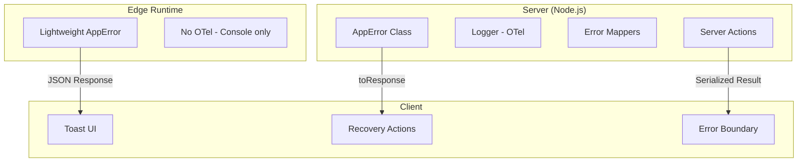
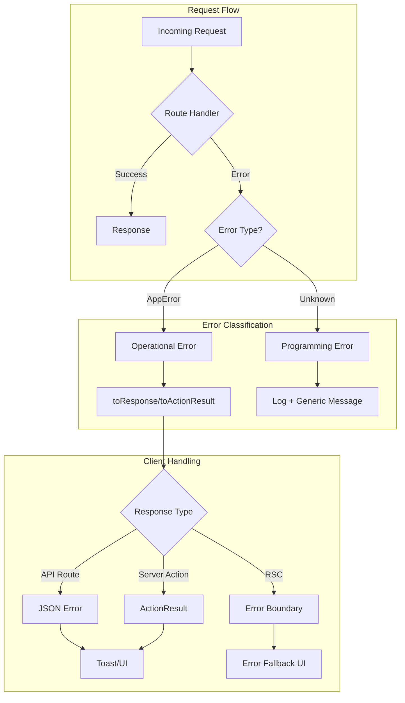
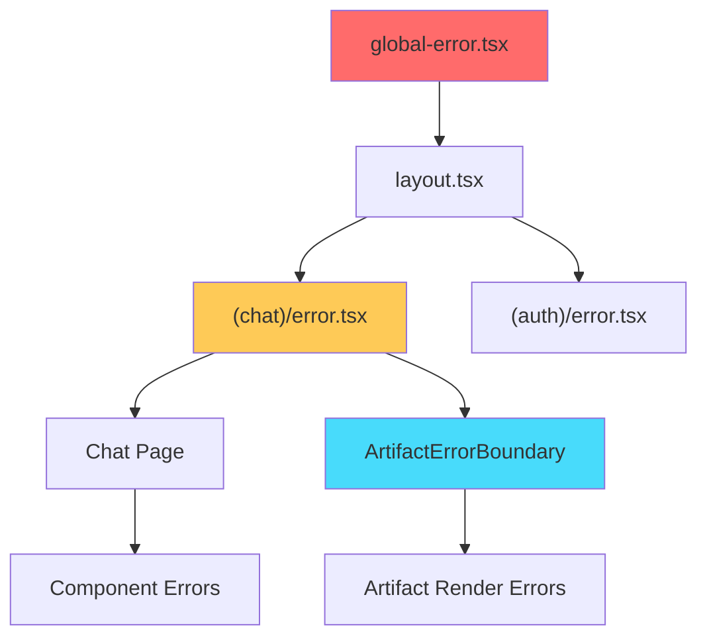
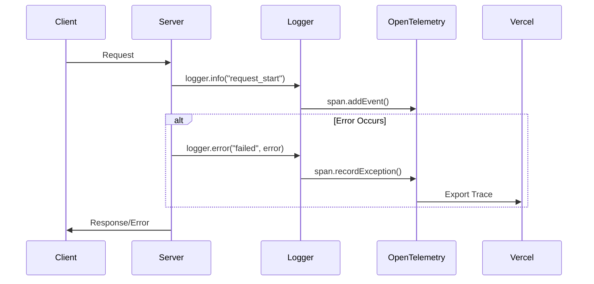

# 01-Error-Handling-Optimal-Design

> **Module**: P0.1 - Error Handling & Logging  
> **Priority**: CRITICAL (Foundation)  
> **Status**: DESIGN COMPLETE  
> **Author**: Ouroboros Architect  
> **Date**: 2024-12-17

---

## 1. Feature/Module Purpose

**Business Capability**: System reliability, debugging efficiency, user experience during failures.

Error handling serves three stakeholders:

1. **Users**: Clear, actionable error messages without technical jargon
2. **Developers**: Structured logs with request correlation for debugging
3. **Operations**: Error monitoring, alerting, and incident response

**Success Criteria**:

- Zero unhandled exceptions reaching production users
- <100ms overhead for error handling paths
- 100% request correlation via `requestId`
- Client bundle: <5KB for error handling code

---

## 2. Key Requirements

### 2.1 Server-Side Error Handling

| Requirement      | Description                                             |
| ---------------- | ------------------------------------------------------- |
| RSC Errors       | Graceful fallback via `error.tsx` boundaries            |
| Server Actions   | Type-safe error returns, no thrown exceptions to client |
| Streaming Errors | SSE error events with recovery instructions             |
| Database Errors  | PostgreSQL error code mapping to user messages          |
| AI/LLM Errors    | Provider-specific error normalization                   |

### 2.2 Client-Side Error Handling

| Requirement         | Description                               |
| ------------------- | ----------------------------------------- |
| Error Boundaries    | Route-level + component-level composition |
| Recovery Actions    | Reset, retry, navigate home               |
| Toast Notifications | Non-blocking error feedback               |
| Form Validation     | Client-side with server validation backup |

### 2.3 Logging Strategy

| Requirement         | Description                         |
| ------------------- | ----------------------------------- |
| Structured Logs     | OpenTelemetry spans with attributes |
| Request Correlation | `requestId` + `userId` on all logs  |
| Error Levels        | debug, info, warn, error            |
| Sampling            | Debug logs sampled in production    |

### 2.4 Monitoring & Reporting

| Requirement       | Description                           |
| ----------------- | ------------------------------------- |
| Error Aggregation | Group by error code for dashboards    |
| Alerting          | Critical errors trigger notifications |
| Digest IDs        | User-visible error identifiers        |

---

## 3. Quick Current State Notes

### 3.1 What Exists (lib/errors.ts - 433 lines)

**Strengths**:

- ✅ Typed error codes: `ErrorType:Surface:Reason` pattern
- ✅ PostgreSQL error mapping (`mapPostgresCodeToError`)
- ✅ User-type aware messages (guest vs regular)
- ✅ `ChatSDKError.toResponse()` for API routes

**Issues**:

- ⚠️ **433 lines** - monolithic, mixes concerns
- ⚠️ Giant switch statement (200+ cases) for messages
- ⚠️ No separation of server/client error types
- ⚠️ `ChatSDKError` name is legacy (not just chat anymore)
- ⚠️ Visibility system (`visibilityBySurface`) unused effectively

### 3.2 Logging (lib/log.ts - 186 lines)

**Strengths**:

- ✅ OpenTelemetry integration
- ✅ Request context injection
- ✅ Server-only (no client bundle bloat)

**Issues**:

- ⚠️ No log levels configuration
- ⚠️ No sampling for high-volume logs
- ⚠️ No structured error categorization

### 3.3 Error Boundaries

**Current**:

- `app/global-error.tsx` - Uses deprecated `NextError`
- `app/(chat)/error.tsx` - Good pattern, duplicated
- `components/artifact-error-boundary.tsx` - Class component

**Issues**:

- ⚠️ Inconsistent patterns across boundaries
- ⚠️ No shared recovery UI components
- ⚠️ Class-based boundary could be functional with React 19

### 3.4 Instrumentation

**Current**:

- Global `unhandledRejection` handler ✅
- Global `uncaughtException` handler ✅

**Issues**:

- ⚠️ Dynamic imports for log module (race condition risk)

---

## 4. Optimal Architecture Design

### 4.1 Module Structure

```
lib/
├── errors/
│   ├── index.ts              # Public API exports
│   ├── types.ts              # Error types, codes, surfaces
│   ├── app-error.ts          # Main AppError class
│   ├── messages.ts           # Error message catalog
│   ├── mappers/
│   │   ├── postgres.ts       # PostgreSQL error mapping
│   │   ├── ai-provider.ts    # AI/LLM error mapping
│   │   └── http.ts           # HTTP error mapping
│   └── utils.ts              # Error utilities

├── logging/
│   ├── index.ts              # Public API
│   ├── logger.ts             # Core logger (OTel)
│   ├── levels.ts             # Log level configuration
│   └── context.ts            # Request context helpers

components/
├── errors/
│   ├── error-boundary.tsx    # Reusable error boundary
│   ├── error-fallback.tsx    # Default fallback UI
│   ├── error-toast.tsx       # Toast notification
│   └── recovery-actions.tsx  # Reset, retry, home buttons

app/
├── global-error.tsx          # Root error boundary
├── (chat)/
│   └── error.tsx             # Route-level boundary
```

### 4.2 Server/Client/Edge Boundaries



**Key Decisions**:

| Runtime        | Error Class      | Logging          | Bundle Impact |
| -------------- | ---------------- | ---------------- | ------------- |
| Node.js Server | Full `AppError`  | OpenTelemetry    | N/A           |
| Edge Runtime   | Slim `AppError`  | Console fallback | N/A           |
| Client         | Error types only | None (UI toast)  | <2KB          |

### 4.3 Error Class Hierarchy

```typescript
// lib/errors/types.ts
export type ErrorSeverity = "fatal" | "error" | "warning" | "info";

export type ErrorCategory =
  | "auth" // Authentication/authorization
  | "validation" // Input validation
  | "resource" // Not found, conflict
  | "rate_limit" // Throttling
  | "external" // Third-party services
  | "internal"; // Server errors

export type ErrorCode = `${ErrorCategory}:${string}`;

// lib/errors/app-error.ts
export class AppError extends Error {
  readonly code: ErrorCode;
  readonly statusCode: number;
  readonly severity: ErrorSeverity;
  readonly isOperational: boolean; // vs programming error
  readonly context?: Record<string, unknown>;

  constructor(options: AppErrorOptions) {
    super(options.message);
    this.code = options.code;
    this.statusCode = inferStatusCode(options.code);
    this.severity = options.severity ?? "error";
    this.isOperational = options.isOperational ?? true;
    this.context = options.context;
  }

  toResponse(): Response {
    return Response.json(
      {
        code: this.code,
        message: this.message,
        ...(isDev && { context: this.context }),
      },
      { status: this.statusCode }
    );
  }

  toActionResult<T>(): ActionResult<T> {
    return {
      success: false,
      error: { code: this.code, message: this.message },
    };
  }
}
```

### 4.4 Error Message Catalog

```typescript
// lib/errors/messages.ts
// Replace giant switch with structured catalog

const messages: Record<ErrorCode, MessageConfig> = {
  "auth:unauthorized": {
    default: "Please sign in to continue.",
    guest: "Sign in to access this feature.",
  },
  "auth:forbidden": {
    default: "You don't have permission to access this resource.",
  },
  "validation:invalid_input": {
    default: "Please check your input and try again.",
  },
  "resource:not_found": {
    default: "The requested resource was not found.",
    variants: {
      chat: "This chat no longer exists.",
      document: "This document was not found.",
    },
  },
  "rate_limit:exceeded": {
    default: "Too many requests. Please wait before trying again.",
    guest: "Daily limit reached. Sign in for more requests.",
  },
  "external:ai_provider": {
    default: "AI service temporarily unavailable.",
  },
  "internal:database": {
    default: "A database error occurred. Please try again.",
  },
};

export function getMessage(
  code: ErrorCode,
  options?: { userType?: "guest" | "regular"; variant?: string }
): string {
  const config = messages[code] ?? messages["internal:unknown"];

  if (options?.variant && config.variants?.[options.variant]) {
    return config.variants[options.variant];
  }
  if (options?.userType === "guest" && config.guest) {
    return config.guest;
  }
  return config.default;
}
```

### 4.5 Logging Integration

```typescript
// lib/logging/logger.ts
import { trace, SpanStatusCode } from "@opentelemetry/api";

type LogContext = {
  requestId?: string;
  userId?: string;
  [key: string]: unknown;
};

class Logger {
  private getSpan() {
    return trace.getActiveSpan();
  }

  info(message: string, context?: LogContext) {
    this.log("info", message, context);
  }

  warn(message: string, context?: LogContext) {
    this.log("warn", message, context);
  }

  error(message: string, error?: Error, context?: LogContext) {
    const span = this.getSpan();
    if (span) {
      if (error) {
        span.recordException(error);
      }
      span.setStatus({ code: SpanStatusCode.ERROR, message });
    }
    this.log("error", message, { ...context, error: error?.message });
  }

  private log(level: string, message: string, context?: LogContext) {
    const span = this.getSpan();
    if (!span) return;

    span.addEvent("log", {
      "log.level": level,
      "log.message": message,
      ...this.flattenContext(context),
    });
  }

  private flattenContext(ctx?: LogContext): Record<string, string> {
    // Convert context to OTel-compatible attributes
  }
}

export const logger = new Logger();
```

### 4.6 Error Boundary Composition

```tsx
// components/errors/error-boundary.tsx
"use client";

import { useRouter } from "next/navigation";
import { ErrorFallback } from "./error-fallback";

type ErrorBoundaryProps = {
  error: Error & { digest?: string };
  reset: () => void;
  variant?: "page" | "panel" | "inline";
  showHome?: boolean;
};

export function ErrorBoundary({
  error,
  reset,
  variant = "page",
  showHome = true,
}: ErrorBoundaryProps) {
  const router = useRouter();

  return (
    <ErrorFallback
      variant={variant}
      title="Something went wrong"
      message={getErrorMessage(error)}
      digest={error.digest}
      actions={
        <>
          <Button onClick={reset}>Try Again</Button>
          {showHome && (
            <Button variant="outline" onClick={() => router.push("/")}>
              Go Home
            </Button>
          )}
        </>
      }
    />
  );
}
```

```tsx
// app/(chat)/error.tsx - Simplified
"use client";

import { ErrorBoundary } from "@/components/errors/error-boundary";

export default function ChatError(props: { error: Error; reset: () => void }) {
  return <ErrorBoundary {...props} variant="page" />;
}
```

---

## 5. Technology Stack

### 5.1 Next.js 16 Features to Leverage

| Feature            | Usage                                                      |
| ------------------ | ---------------------------------------------------------- |
| `error.tsx`        | Route-level error boundaries (automatic)                   |
| `global-error.tsx` | Root error boundary (required for RSC)                     |
| Server Actions     | Return `ActionResult<T>` instead of throwing               |
| `notFound()`       | Built-in 404 handling                                      |
| `redirect()`       | Auth redirects without errors                              |
| Streaming          | SSE error events via `dataStream.write({ type: 'error' })` |

### 5.2 Server Action Error Pattern

```typescript
// Optimal pattern for Server Actions in Next.js 16
type ActionResult<T> =
  | { success: true; data: T }
  | { success: false; error: { code: ErrorCode; message: string } };

export async function deleteChat(chatId: string): Promise<ActionResult<void>> {
  try {
    const { ctx } = await requireAuth("chat");
    await chatData.delete(chatId, ctx);
    return { success: true, data: undefined };
  } catch (error) {
    if (error instanceof AppError) {
      return error.toActionResult();
    }
    logger.error("deleteChat failed", error);
    return {
      success: false,
      error: { code: "internal:unknown", message: "Failed to delete chat" },
    };
  }
}
```

### 5.3 Edge Runtime Considerations

```typescript
// lib/errors/app-error.ts
// Edge-compatible: No Node.js-specific APIs

export class AppError extends Error {
  // All methods use Web APIs only
  toResponse(): Response {
    // Uses standard Response, not Node.js http
  }
}

// Logging in Edge: Fallback to console
// lib/logging/edge-logger.ts
export const edgeLogger = {
  error: (msg: string, ctx?: object) => {
    console.error(JSON.stringify({ level: "error", message: msg, ...ctx }));
  },
};
```

---

## 6. Bundle Strategy

### 6.1 Code Splitting

```typescript
// Client bundle includes ONLY:
// 1. Error boundary components (~2KB)
// 2. Error type definitions (tree-shaken)
// 3. Recovery UI components (~1.5KB)

// Server-only (not in client bundle):
// - AppError class
// - Logger
// - Error mappers
// - Message catalog
```

### 6.2 Import Patterns

```typescript
// ✅ Client component
import { ErrorBoundary } from "@/components/errors/error-boundary";
import type { ErrorCode } from "@/lib/errors/types"; // Type-only import

// ✅ Server component / Server Action
import { AppError } from "@/lib/errors";
import { logger } from "@/lib/logging";

// ❌ AVOID: Importing server modules in client
// This would pull entire error catalog into bundle
```

### 6.3 Bundle Impact

| Component        | Size     | Strategy          |
| ---------------- | -------- | ----------------- |
| Error types      | 0KB      | Type-only imports |
| Error boundary   | ~2KB     | Client component  |
| Recovery actions | ~1.5KB   | Client component  |
| AppError class   | 0KB      | Server-only       |
| Logger           | 0KB      | Server-only       |
| Message catalog  | 0KB      | Server-only       |
| **Total Client** | **<4KB** |                   |

---

## 7. Simplifications vs Current

| Current (433 lines)                 | Optimal Design                   | Benefit                  |
| ----------------------------------- | -------------------------------- | ------------------------ |
| Monolithic `lib/errors.ts`          | Split into 6 focused files       | Single responsibility    |
| 200+ case switch statement          | Structured message catalog       | Maintainable, searchable |
| `ChatSDKError` naming               | `AppError`                       | Reflects actual scope    |
| Class-based `ArtifactErrorBoundary` | Functional with hooks            | React 19 idiomatic       |
| Duplicate error boundaries          | Shared `ErrorBoundary` component | DRY                      |
| Inline error messages               | Centralized catalog              | Easy i18n, consistency   |
| `visibilityBySurface` (unused)      | Remove                           | Less code                |
| Manual request context              | Automatic via logger             | Less boilerplate         |

**Lines of Code Estimate**:

- Current: ~700 lines (errors.ts + log.ts + boundaries)
- Optimal: ~500 lines (better organized, less duplication)
- **Reduction: ~30%** while adding features

---

## 8. Dependencies

### 8.1 External Dependencies

| Dependency           | Purpose            | Status               |
| -------------------- | ------------------ | -------------------- |
| `@opentelemetry/api` | Structured logging | ✅ Already installed |
| `@vercel/otel`       | Vercel integration | ✅ Already installed |

### 8.2 Internal Dependencies

| This Module Depends On | Purpose           |
| ---------------------- | ----------------- |
| None                   | Foundation module |

### 8.3 Modules That Depend On This

| Module                 | Usage                       |
| ---------------------- | --------------------------- |
| **All API Routes**     | `AppError.toResponse()`     |
| **All Server Actions** | `AppError.toActionResult()` |
| **All Components**     | Error boundaries            |
| **Data Layer**         | Database error mapping      |
| **AI Module**          | Provider error mapping      |
| **Middleware**         | Rate limit errors           |

---

## 9. Public Interface

### 9.1 Error Creation

```typescript
// lib/errors/index.ts - Public API
export { AppError, type AppErrorOptions } from "./app-error";
export type { ErrorCode, ErrorCategory, ErrorSeverity } from "./types";
export { getMessage } from "./messages";

// Convenience factories
export function authError(code: string, context?: object): AppError;
export function validationError(message: string, context?: object): AppError;
export function notFoundError(resource: string): AppError;
export function rateLimitError(retryAfter: number): AppError;
```

### 9.2 Logging

```typescript
// lib/logging/index.ts - Public API
export { logger } from "./logger";
export type { LogContext } from "./types";
```

### 9.3 Components

```typescript
// components/errors/index.ts - Public API
export { ErrorBoundary } from "./error-boundary";
export { ErrorFallback } from "./error-fallback";
export { ErrorToast } from "./error-toast";
```

---

## 10. Performance Optimizations

### 10.1 Next.js 16 Specific

| Optimization             | Implementation                          |
| ------------------------ | --------------------------------------- |
| Streaming error recovery | Write `{ type: 'error' }` to SSE stream |
| Parallel error boundary  | Independent reset per boundary          |
| Suspense integration     | Error boundaries wrap Suspense          |
| Edge-compatible errors   | No Node.js APIs in error classes        |

### 10.2 Runtime Performance

| Optimization              | Benefit                   |
| ------------------------- | ------------------------- |
| Pre-computed status codes | No switch on every error  |
| Message catalog lookup    | O(1) vs O(n) switch       |
| Lazy error mappers        | Import only when needed   |
| Request context caching   | Single lookup per request |

### 10.3 Error Path Performance

```typescript
// Fast path: Pre-computed error responses
const COMMON_ERRORS = {
  unauthorized: new Response(
    JSON.stringify({ code: "auth:unauthorized", message: "Please sign in" }),
    { status: 401, headers: { "Content-Type": "application/json" } }
  ),
  rateLimited: new Response(
    JSON.stringify({
      code: "rate_limit:exceeded",
      message: "Too many requests",
    }),
    { status: 429, headers: { "Content-Type": "application/json" } }
  ),
};

// Use clone() for immutable responses
export function unauthorizedResponse(): Response {
  return COMMON_ERRORS.unauthorized.clone();
}
```

---

## 11. Migration Strategy

### Phase 1: Foundation (Non-Breaking)

1. Create new `lib/errors/` structure alongside existing
2. Create new `lib/logging/` structure
3. Add shared error boundary components

### Phase 2: Gradual Migration

1. Update new code to use new patterns
2. Migrate API routes one-by-one
3. Replace error boundaries with shared components

### Phase 3: Cleanup

1. Remove old `lib/errors.ts`
2. Remove old `lib/log.ts`
3. Update imports across codebase

---

## 12. Diagrams

### 12.1 Error Flow Architecture



### 12.2 Error Boundary Hierarchy



### 12.3 Logging Pipeline



---

## 13. Quality Checklist

- [x] Considered 2+ options (monolith vs modular, class vs factory)
- [x] Documented WHY modular approach chosen
- [x] Listed positive consequences (maintainability, bundle size)
- [x] Listed negative consequences (migration effort)
- [x] Addressed Security (no stack traces in production)
- [x] Addressed Performance (<100ms overhead)
- [x] Addressed Scalability (structured for i18n)
- [x] Implementation notes provided
- [x] Diagrams included for flows
- [x] Dependencies mapped

---

## 14. ADR Summary

**Decision**: Modular error handling with typed error codes and structured logging

**Rationale**:

- Current 433-line monolith violates single responsibility
- Giant switch statements are unmaintainable
- No clear server/client boundary

**Consequences**:

- **POS-001**: Clear module boundaries enable tree-shaking
- **POS-002**: Structured catalog enables future i18n
- **POS-003**: Shared components reduce duplication
- **NEG-001**: Migration requires updating imports
- **NEG-002**: Team learning curve for new patterns

**Alternatives Rejected**:

- **ALT-001**: Keep monolith, just refactor → Still violates SRP
- **ALT-002**: Use library (e.g., `trpc`) → Overkill, adds dependency

---

## 15. Files to Create

| File                                   | Purpose          | Priority |
| -------------------------------------- | ---------------- | -------- |
| `lib/errors/index.ts`                  | Public API       | P0       |
| `lib/errors/types.ts`                  | Type definitions | P0       |
| `lib/errors/app-error.ts`              | Main error class | P0       |
| `lib/errors/messages.ts`               | Message catalog  | P0       |
| `lib/errors/mappers/postgres.ts`       | DB error mapping | P1       |
| `lib/logging/index.ts`                 | Logger API       | P0       |
| `lib/logging/logger.ts`                | Core logger      | P0       |
| `components/errors/error-boundary.tsx` | Shared boundary  | P0       |
| `components/errors/error-fallback.tsx` | Fallback UI      | P0       |

---

**Status**: ✅ DESIGN COMPLETE  
**Next**: Implementation via ouroboros-coder
