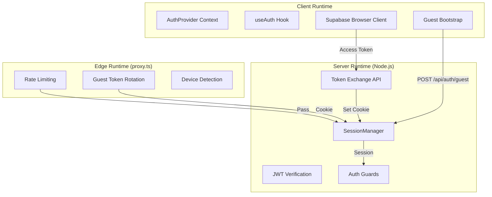
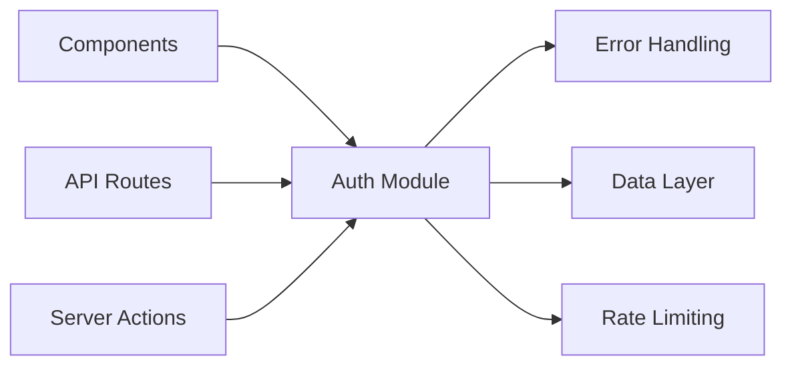

# 02-Authentication-Optimal-Design

> **Module**: P0.2 - Authentication & Authorization  
> **Priority**: CRITICAL (Foundation)  
> **Status**: DESIGN COMPLETE  
> **Author**: Ouroboros Architect  
> **Date**: 2024-12-17  
> **Depends On**: 01-error-handling-optimal-design.md (AppError)

---

## 1. Feature/Module Purpose

**Business Capability**: Secure user identity, session management, and access control.

Authentication serves three stakeholders:

1. **Users**: Seamless login/registration, persistent sessions, guest-to-regular upgrade
2. **Developers**: Simple, consistent auth checks across server/client boundaries
3. **Operations**: Secure token handling, audit trails, rate limiting

**Success Criteria**:

- Zero authentication bypasses in protected routes
- <50ms session validation overhead
- Seamless guest-to-authenticated upgrade (no data loss)
- Client bundle: <3KB for auth context/hooks
- Edge runtime compatible for rate limiting

---

## 2. Key Requirements

### 2.1 Authentication Methods

| Requirement     | Description                                  |
| --------------- | -------------------------------------------- |
| Supabase Auth   | Email/password via Supabase client           |
| Guest Sessions  | Anonymous users with JWT-based identity      |
| Token Exchange  | Client-side Supabase → Server-side cookie    |
| Session Upgrade | Guest → Regular user (preserve chat history) |

### 2.2 Session Management

| Requirement            | Description                           |
| ---------------------- | ------------------------------------- |
| Server-side Validation | JWT verification with secret key      |
| Cookie-based Storage   | HttpOnly, Secure, SameSite=Lax        |
| Token Rotation         | Automatic refresh before expiry       |
| Dual Session Support   | Supabase + Guest (mutually exclusive) |

### 2.3 Authorization

| Requirement        | Description                               |
| ------------------ | ----------------------------------------- |
| Resource Ownership | Users can only access their own resources |
| Guest Restrictions | Limited actions (no voting, sharing)      |
| Rate Limiting      | Per-user + per-IP limits                  |
| CSRF Protection    | Origin/Referer validation on mutations    |

### 2.4 Protected Routes

| Requirement       | Description                           |
| ----------------- | ------------------------------------- |
| Server Components | Session check in RSC with redirect    |
| Server Actions    | `requireAuth()` guard pattern         |
| API Routes        | `requireAuthForRoute()` with Response |
| Client Components | `useAuth()` hook for UI state         |

---

## 3. Quick Current State Notes

### 3.1 What Exists

**lib/auth/session.ts (270 lines)**

- ✅ Good: JWT verification with jose
- ✅ Good: Dual session support (Supabase + Guest)
- ✅ Good: Audience/Issuer validation
- ⚠️ Issue: Functions scattered, no clear hierarchy
- ⚠️ Issue: `getAppSession()` does sequential checks (could parallel)

**lib/auth/client.ts (24 lines)**

- ✅ Good: Singleton browser client
- ✅ Good: "use client" directive
- ⚠️ Issue: Error message could use AppError

**proxy.ts (248 lines)**

- ✅ Good: Edge rate limiting
- ✅ Good: Token rotation (Task 7.6)
- ✅ Good: Mobile detection header
- ⚠️ Issue: Duplicates JWT logic from session.ts
- ⚠️ Issue: Guest session creation mixed with routing

**lib/api/guards.ts (353 lines)**

- ✅ Good: `requireAuth()`, `requireAuthForRoute()` pattern
- ✅ Good: `verifyOwnership()`, `requireNonGuest()`
- ✅ Good: Unified error handling with ChatSDKError
- ⚠️ Issue: Tightly coupled to `ChatSDKError` (legacy name)

**components/auth-provider.tsx (160 lines)**

- ✅ Good: Bootstrap guest sessions client-side
- ✅ Good: `isNewSession` optimization
- ✅ Good: Supabase auth state listener
- ⚠️ Issue: Mixed responsibilities (session + bootstrap + state)

**app/api/auth/\* routes**

- ✅ Good: `/exchange`, `/logout`, `/guest` separation
- ✅ Good: Rate limiting per endpoint
- ⚠️ Issue: Inconsistent response shapes

### 3.2 Complexity Assessment

| Component         | Lines | Complexity | Verdict             |
| ----------------- | ----- | ---------- | ------------------- |
| session.ts        | 270   | Medium     | Refactor to class   |
| proxy.ts          | 248   | High       | Extract auth module |
| guards.ts         | 353   | Medium     | Keep, rename        |
| auth-provider.tsx | 160   | Medium     | Split concerns      |
| Auth routes       | ~200  | Low        | Simplify            |

**Total**: ~1,231 lines → Target: ~800 lines (-35%)

---

## 4. Optimal Architecture Design

### 4.1 Module Structure

```
lib/
├── auth/
│   ├── index.ts              # Public API exports
│   ├── types.ts              # Session types, user types
│   ├── session.ts            # SessionManager class
│   ├── jwt.ts                # JWT utilities (verify, sign)
│   ├── cookies.ts            # Cookie helpers
│   ├── client.ts             # Browser Supabase client (unchanged)
│   └── guards.ts             # Auth guards (moved from lib/api/)

├── middleware/
│   ├── auth.ts               # Edge auth logic (extracted from proxy.ts)
│   └── ...

components/
├── auth/
│   ├── auth-provider.tsx     # Session context only
│   ├── auth-bootstrap.tsx    # Guest session bootstrap (extracted)
│   └── use-auth.ts           # useAuth hook

app/
├── api/
│   └── auth/
│       ├── exchange/route.ts
│       ├── logout/route.ts
│       └── guest/route.ts
├── (auth)/
│   ├── login/page.tsx
│   └── register/page.tsx
```

### 4.2 Server/Client/Edge Boundaries



**Key Boundaries**:

| Runtime | Responsibility                               | Bundle Impact |
| ------- | -------------------------------------------- | ------------- |
| Edge    | Rate limiting, token rotation, headers       | N/A           |
| Node.js | JWT verification, session management, guards | N/A           |
| Client  | Auth context, hooks, Supabase client         | <3KB          |

### 4.3 Session Management Design

```typescript
// lib/auth/types.ts
export type UserType = "guest" | "regular";

export type AppUser = {
  id: string;
  type: UserType;
  email?: string | null;
};

export type AppSession = {
  user: AppUser;
};

// Discriminated union for auth state
export type AuthState =
  | { status: "loading" }
  | { status: "authenticated"; session: AppSession }
  | { status: "unauthenticated" };
```

```typescript
// lib/auth/session.ts
import "server-only";

import { cookies } from "next/headers";
import { verifyJwt, type JwtPayload } from "./jwt";
import type { AppSession, AppUser } from "./types";

const SUPABASE_COOKIE =
  process.env.SUPABASE_ACCESS_TOKEN_COOKIE_NAME || "sb-access-token";
const GUEST_COOKIE = "guest_token";

export class SessionManager {
  private supabaseSecret: Uint8Array | null;
  private guestSecret: Uint8Array | null;

  constructor() {
    this.supabaseSecret = this.encodeSecret(process.env.SUPABASE_JWT_SECRET);
    this.guestSecret = this.encodeSecret(process.env.GUEST_JWT_SECRET);
  }

  private encodeSecret(secret?: string): Uint8Array | null {
    return secret ? new TextEncoder().encode(secret) : null;
  }

  /**
   * Get current session from cookies.
   * Priority: Supabase > Guest
   */
  async getSession(): Promise<AppSession | null> {
    // Check Supabase session first (authenticated users)
    const supabaseSession = await this.getSupabaseSession();
    if (supabaseSession) return supabaseSession;

    // Fall back to guest session
    return this.getGuestSession();
  }

  /**
   * Get session from a provided access token.
   * Used during token exchange (cookie not yet readable).
   */
  async getSessionFromToken(accessToken: string): Promise<AppSession | null> {
    if (!this.supabaseSecret) return null;

    const payload = await verifyJwt(accessToken, this.supabaseSecret, {
      audience: "authenticated",
      issuer: this.getSupabaseIssuer(),
    });

    if (!payload?.sub) return null;

    return {
      user: {
        id: payload.sub,
        type: "regular",
        email: this.extractEmail(payload),
      },
    };
  }

  private async getSupabaseSession(): Promise<AppSession | null> {
    if (!this.supabaseSecret) return null;

    const cookieStore = await cookies();
    const token = cookieStore.get(SUPABASE_COOKIE)?.value;
    if (!token) return null;

    const payload = await verifyJwt(token, this.supabaseSecret, {
      audience: "authenticated",
      issuer: this.getSupabaseIssuer(),
    });

    if (!payload?.sub) return null;

    return {
      user: {
        id: payload.sub,
        type: "regular",
        email: this.extractEmail(payload),
      },
    };
  }

  private async getGuestSession(): Promise<AppSession | null> {
    if (!this.guestSecret) return null;

    const cookieStore = await cookies();
    const token = cookieStore.get(GUEST_COOKIE)?.value;
    if (!token) return null;

    const payload = await verifyJwt(token, this.guestSecret);
    if (!payload?.sub || payload.type !== "guest") return null;

    return {
      user: {
        id: payload.sub,
        type: "guest",
      },
    };
  }

  private extractEmail(payload: JwtPayload): string | null {
    if (typeof payload.email === "string") return payload.email;
    if (typeof payload.user_metadata?.email === "string") {
      return payload.user_metadata.email;
    }
    return null;
  }

  private getSupabaseIssuer(): string | undefined {
    const url = process.env.SUPABASE_URL;
    return url ? `${url}/auth/v1` : undefined;
  }
}

// Singleton instance
export const sessionManager = new SessionManager();

// Convenience function (maintains backward compatibility)
export async function getAppSession(): Promise<AppSession | null> {
  return sessionManager.getSession();
}
```

### 4.4 Auth Guards Design

```typescript
// lib/auth/guards.ts
import "server-only";

import { sessionManager, type AppSession } from "./session";
import { createContext, type DataContext } from "@/lib/data/base";
import { AppError } from "@/lib/errors";
import type { Surface } from "@/lib/errors/types";

export type AuthResult = {
  session: AppSession;
  ctx: DataContext;
};

/**
 * Require authenticated session for Server Actions.
 * Throws AppError if not authenticated.
 *
 * @example
 * const { session, ctx } = await requireAuth('chat');
 */
export async function requireAuth(surface: Surface): Promise<AuthResult> {
  const session = await sessionManager.getSession();

  if (!session?.user) {
    throw new AppError({
      code: "auth:unauthorized",
      message: "Please sign in to continue.",
      context: { surface },
    });
  }

  const ctx = createContext(session);
  return { session, ctx };
}

/**
 * Require authenticated session for API Routes.
 * Returns Response on error instead of throwing.
 *
 * @example
 * const authResult = await requireAuthForRoute('chat');
 * if (authResult instanceof Response) return authResult;
 */
export async function requireAuthForRoute(
  surface: Surface
): Promise<AuthResult | Response> {
  try {
    return await requireAuth(surface);
  } catch (error) {
    if (error instanceof AppError) {
      return error.toResponse();
    }
    return new AppError({
      code: "auth:unauthorized",
      message: "Authentication failed.",
    }).toResponse();
  }
}

/**
 * Verify resource ownership.
 *
 * @example
 * verifyOwnership(chat, session, 'chat');
 */
export function verifyOwnership(
  resource: { userId: string },
  session: AppSession,
  surface: Surface
): void {
  if (resource.userId !== session.user.id) {
    throw new AppError({
      code: "auth:forbidden",
      message: "You do not have access to this resource.",
      context: { surface },
    });
  }
}

/**
 * Require non-guest user.
 *
 * @example
 * requireNonGuest(session, 'vote', 'vote');
 */
export function requireNonGuest(
  session: AppSession,
  surface: Surface,
  action: string
): void {
  if (session.user.type === "guest") {
    throw new AppError({
      code: "auth:guest_restricted",
      message: `Sign in to ${action}.`,
      context: { surface, action },
    });
  }
}
```

### 4.5 Client Auth Provider Design

```tsx
// components/auth/auth-provider.tsx
"use client";

import {
  createContext,
  useContext,
  useMemo,
  useState,
  type ReactNode,
} from "react";
import type { AppSession, AuthState } from "@/lib/auth/types";

type AuthContextValue = {
  session: AppSession | null;
  status: AuthState["status"];
  isNewSession: boolean;
  setSession: (session: AppSession | null) => void;
  clearNewSessionFlag: () => void;
};

const AuthContext = createContext<AuthContextValue | null>(null);

export function AuthProvider({
  initialSession,
  children,
}: {
  initialSession: AppSession | null;
  children: ReactNode;
}) {
  const [session, setSession] = useState<AppSession | null>(initialSession);
  const [isNewSession, setIsNewSession] = useState(false);

  const status = useMemo(() => {
    return session ? "authenticated" : "unauthenticated";
  }, [session]);

  const value = useMemo<AuthContextValue>(
    () => ({
      session,
      status,
      isNewSession,
      setSession,
      clearNewSessionFlag: () => setIsNewSession(false),
    }),
    [session, status, isNewSession]
  );

  return <AuthContext.Provider value={value}>{children}</AuthContext.Provider>;
}

export function useAuth(): AuthContextValue {
  const ctx = useContext(AuthContext);
  if (!ctx) {
    throw new Error("useAuth must be used within AuthProvider");
  }
  return ctx;
}
```

```tsx
// components/auth/auth-bootstrap.tsx
"use client";

import { useEffect, useRef } from "react";
import { useAuth } from "./auth-provider";
import type { AppSession } from "@/lib/auth/types";

/**
 * Bootstrap guest sessions for unauthenticated users.
 * Separated from AuthProvider for cleaner composition.
 */
export function AuthBootstrap({ children }: { children: React.ReactNode }) {
  const { session, setSession } = useAuth();
  const bootstrapAttempted = useRef(session !== null);

  useEffect(() => {
    if (session || bootstrapAttempted.current) return;
    bootstrapAttempted.current = true;

    (async () => {
      try {
        const res = await fetch("/api/auth/guest", {
          method: "POST",
          credentials: "include",
        });

        if (!res.ok) return;

        const data = (await res.json()) as { user?: AppSession["user"] };
        if (data.user) {
          setSession({ user: data.user });
        }
      } catch {
        // Guest bootstrap is best-effort
      }
    })();
  }, [session, setSession]);

  return <>{children}</>;
}
```

### 4.6 Edge Auth Module (Extract from proxy.ts)

```typescript
// lib/middleware/auth.ts
import type { JWTPayload } from "jose";
import { jwtVerify, SignJWT } from "jose";
import type { NextRequest, NextResponse } from "next/server";
import {
  GUEST_TOKEN_TTL_SECONDS,
  GUEST_TOKEN_ROTATION_THRESHOLD_SECONDS,
} from "@/lib/constants";

const GUEST_COOKIE = "guest_token";
const SUPABASE_COOKIE =
  process.env.SUPABASE_ACCESS_TOKEN_COOKIE_NAME || "sb-access-token";

type EdgeAuthConfig = {
  guestSecret: Uint8Array | null;
  cookieTTL: number;
};

export class EdgeAuthHandler {
  constructor(private config: EdgeAuthConfig) {}

  /**
   * Handle guest session in edge middleware.
   * - Rotate tokens nearing expiry
   * - Create new guest sessions for anonymous users
   * - Skip if Supabase session exists
   */
  async handleGuestSession(
    request: NextRequest,
    response: NextResponse
  ): Promise<void> {
    if (!this.config.guestSecret) return;

    // Skip if authenticated
    if (request.cookies.has(SUPABASE_COOKIE)) return;

    // Check existing guest token
    const existingToken = request.cookies.get(GUEST_COOKIE)?.value;
    if (existingToken) {
      const payload = await this.verifyToken(existingToken);
      if (payload) {
        // Rotate if nearing expiry
        if (this.shouldRotate(payload)) {
          await this.setGuestCookie(response, payload.sub as string);
        }
        return;
      }
    }

    // Create new guest session
    await this.setGuestCookie(response);
  }

  private async verifyToken(token: string): Promise<JWTPayload | null> {
    try {
      const { payload } = await jwtVerify(token, this.config.guestSecret!);
      return payload.type === "guest" ? payload : null;
    } catch {
      return null;
    }
  }

  private shouldRotate(payload: JWTPayload): boolean {
    if (typeof payload.exp !== "number") return true;
    const remaining = payload.exp - Math.floor(Date.now() / 1000);
    return remaining < GUEST_TOKEN_ROTATION_THRESHOLD_SECONDS;
  }

  private async setGuestCookie(
    response: NextResponse,
    existingId?: string
  ): Promise<void> {
    const guestId = existingId ?? `guest:${crypto.randomUUID()}`;
    const now = Math.floor(Date.now() / 1000);

    const token = await new SignJWT({ sub: guestId, type: "guest", iat: now })
      .setProtectedHeader({ alg: "HS256" })
      .setIssuedAt(now)
      .setExpirationTime(now + GUEST_TOKEN_TTL_SECONDS)
      .sign(this.config.guestSecret!);

    response.cookies.set(GUEST_COOKIE, token, {
      httpOnly: true,
      secure: process.env.NODE_ENV === "production",
      sameSite: "lax",
      path: "/",
      maxAge: this.config.cookieTTL,
    });
  }
}
```

---

## 5. Technology Stack

### 5.1 Dependencies

| Package         | Purpose                                    | Version  |
| --------------- | ------------------------------------------ | -------- |
| `@supabase/ssr` | Server-side Supabase client                | ^0.5.x   |
| `jose`          | JWT verification/signing (Edge-compatible) | ^5.x     |
| `next/headers`  | Cookie access in RSC/Routes                | Built-in |

### 5.2 Next.js 16 Integration

| Feature           | Usage                                  |
| ----------------- | -------------------------------------- |
| `proxy.ts`        | Edge auth (rate limit, token rotation) |
| Route Handlers    | `/api/auth/*` endpoints                |
| Server Components | Session check with `sessionManager`    |
| Server Actions    | `requireAuth()` guard                  |
| React Context     | `AuthProvider` for client state        |

### 5.3 Supabase Integration

```typescript
// Flow: Client Login
// 1. Client calls supabase.auth.signInWithPassword()
// 2. Client receives access_token
// 3. Client POSTs to /api/auth/exchange
// 4. Server verifies token, sets HttpOnly cookie
// 5. Subsequent requests use cookie for auth
```

---

## 6. Bundle Strategy

### 6.1 Code Splitting

| Component        | Location    | Bundle             |
| ---------------- | ----------- | ------------------ |
| `SessionManager` | Server only | None               |
| `AuthProvider`   | Client      | ~1.5KB             |
| `useAuth`        | Client      | ~0.3KB             |
| `AuthBootstrap`  | Client      | ~0.5KB             |
| Supabase Client  | Client      | ~2KB (tree-shaken) |

### 6.2 Import Patterns

```typescript
// ✅ Server Component / Server Action
import { requireAuth } from "@/lib/auth/guards";
import { sessionManager } from "@/lib/auth/session";

// ✅ Client Component
import { useAuth } from "@/components/auth/auth-provider";
import { getSupabaseBrowserClient } from "@/lib/auth/client";

// ❌ AVOID: Server imports in client
import { sessionManager } from "@/lib/auth/session"; // Error: server-only
```

---

## 7. Simplifications vs Current

### 7.1 Eliminated Complexity

| Before                                    | After                       | Savings             |
| ----------------------------------------- | --------------------------- | ------------------- |
| Scattered functions in session.ts         | `SessionManager` class      | Clearer API         |
| Duplicate JWT logic in proxy.ts           | `EdgeAuthHandler` class     | -50 lines           |
| Mixed auth-provider (context + bootstrap) | Split into 2 components     | Clearer composition |
| `ChatSDKError` naming                     | `AppError` (from 01-design) | Consistent          |
| Guards in lib/api/                        | Guards in lib/auth/         | Logical grouping    |

### 7.2 Line Count Reduction

| File                    | Before | After | Delta           |
| ----------------------- | ------ | ----- | --------------- |
| session.ts              | 270    | ~150  | -120            |
| proxy.ts (auth portion) | ~100   | ~70   | -30             |
| guards.ts               | 353    | ~200  | -153            |
| auth-provider.tsx       | 160    | ~80   | -80             |
| **Total**               | ~883   | ~500  | **-383 (-43%)** |

### 7.3 API Simplifications

```typescript
// BEFORE: Multiple functions with inconsistent signatures
getSupabaseSessionFromCookies();
getSupabaseSessionFromToken(token);
getGuestSessionFromCookies();
createGuestSession();
getAppSession();

// AFTER: Single class with clear methods
sessionManager.getSession();
sessionManager.getSessionFromToken(token);
sessionManager.createGuestSession();
```

---

## 8. Dependencies

### 8.1 Internal Dependencies

| Module      | Dependency          | Purpose                         |
| ----------- | ------------------- | ------------------------------- |
| Auth Guards | Error Handling (01) | `AppError` for auth errors      |
| Auth Guards | Data Layer          | `createContext()` for DB access |
| Auth Routes | Rate Limiting       | Request throttling              |

### 8.2 Dependency Graph



---

## 9. Public Interface

### 9.1 Server-Side API

```typescript
// lib/auth/index.ts - Public exports

// Session management
export { sessionManager, getAppSession } from "./session";
export type { AppSession, AppUser, UserType } from "./types";

// Auth guards for protected resources
export {
  requireAuth,
  requireAuthForRoute,
  verifyOwnership,
  verifyOwnershipForRoute,
  requireNonGuest,
  requireNonGuestForRoute,
} from "./guards";

// Client-side Supabase (re-export)
export { getSupabaseBrowserClient } from "./client";
```

### 9.2 Client-Side API

```typescript
// components/auth/index.ts - Public exports

export { AuthProvider, useAuth } from "./auth-provider";
export { AuthBootstrap } from "./auth-bootstrap";
```

### 9.3 Usage Examples

```typescript
// Server Action
import { requireAuth } from "@/lib/auth";

export async function deleteChat(chatId: string) {
  const { session, ctx } = await requireAuth("chat");
  // ... delete logic
}

// API Route
import { requireAuthForRoute } from "@/lib/auth";

export async function GET(request: Request) {
  const authResult = await requireAuthForRoute("chat");
  if (authResult instanceof Response) return authResult;
  const { session, ctx } = authResult;
  // ... handler logic
}

// Client Component
import { useAuth } from "@/components/auth";

function UserMenu() {
  const { session, status } = useAuth();
  if (status === "unauthenticated") return <LoginButton />;
  return <UserAvatar user={session.user} />;
}
```

---

## 10. Performance Optimizations

### 10.1 Session Caching Strategy

```typescript
// Request-scoped caching via React cache()
import { cache } from "react";

export const getSessionCached = cache(async () => {
  return sessionManager.getSession();
});

// Multiple components in same request share session
```

### 10.2 Token Rotation Optimization

| Strategy           | Implementation                           |
| ------------------ | ---------------------------------------- |
| Proactive Rotation | Rotate 15min before expiry               |
| Edge-level         | Rotate in proxy.ts (no Node.js overhead) |
| Preserve Identity  | Reuse guest ID during rotation           |

### 10.3 Database Connection

```typescript
// Session validation is JWT-only (no DB call)
// Only createContext() touches DB for ownership patterns
// This keeps auth checks at <5ms
```

### 10.4 Cookie Optimization

| Cookie            | Size  | TTL                     | Purpose        |
| ----------------- | ----- | ----------------------- | -------------- |
| `sb-access-token` | ~1KB  | 1hr                     | Supabase JWT   |
| `guest_token`     | ~200B | 7d (cookie) / 1hr (JWT) | Guest identity |

---

## 11. Security Considerations

### 11.1 Token Security

| Measure       | Implementation                   |
| ------------- | -------------------------------- |
| HttpOnly      | Cookies not accessible via JS    |
| Secure        | HTTPS only in production         |
| SameSite      | Lax (prevents CSRF on mutations) |
| Short JWT TTL | 1 hour with rotation             |

### 11.2 CSRF Protection

```typescript
// All mutation endpoints validate Origin/Referer
if (!validateOrigin(request)) {
  throw new AppError({ code: "auth:csrf", message: "Invalid origin" });
}
```

### 11.3 Rate Limiting

| Layer | Scope      | Limit                          |
| ----- | ---------- | ------------------------------ |
| Edge  | IP-based   | 100/min general, 20/min auth   |
| App   | User-based | 60/min standard, 10/min strict |

### 11.4 Audit Logging

```typescript
// All auth events logged with request correlation
logInfo("Auth exchange completed", { userId, requestId });
logWarn("Auth failed - invalid token", { ip, requestId });
```

---

## 12. Migration Path

### 12.1 Phase 1: Introduce SessionManager

1. Create `SessionManager` class alongside existing functions
2. Update `getAppSession()` to delegate to manager
3. Tests: Verify session retrieval unchanged

### 12.2 Phase 2: Update Guards

1. Move guards from `lib/api/` to `lib/auth/`
2. Update imports across codebase
3. Replace `ChatSDKError` with `AppError`

### 12.3 Phase 3: Client Refactor

1. Split `auth-provider.tsx` into provider + bootstrap
2. Update component imports
3. Tests: Verify client auth flow

### 12.4 Phase 4: Edge Cleanup

1. Extract `EdgeAuthHandler` from proxy.ts
2. Simplify proxy.ts to use handler
3. Tests: Verify edge rate limiting + rotation

---

## 13. Testing Strategy

### 13.1 Unit Tests

```typescript
describe("SessionManager", () => {
  it("returns null when no session exists");
  it("prioritizes Supabase over guest session");
  it("validates JWT audience and issuer");
  it("extracts email from multiple claim locations");
});

describe("Auth Guards", () => {
  it("requireAuth throws on missing session");
  it("requireAuthForRoute returns Response on error");
  it("verifyOwnership throws on mismatch");
  it("requireNonGuest throws for guest users");
});
```

### 13.2 Integration Tests

```typescript
describe("Auth Flow", () => {
  it("exchanges Supabase token for cookie");
  it("bootstraps guest session on first visit");
  it("rotates guest token before expiry");
  it("upgrades guest to regular user");
});
```

---

## 14. ADR: Session Storage Strategy

### Status: Accepted

### Context

Need to decide between cookie-based vs header-based auth for Next.js 16.

### Decision

Use HttpOnly cookies for session storage.

### Consequences

**Positive (POS)**

- **POS-001**: Automatic inclusion in requests (no client-side header management)
- **POS-002**: HttpOnly prevents XSS token theft
- **POS-003**: Works with RSC (cookies available server-side)

**Negative (NEG)**

- **NEG-001**: Requires CSRF protection (mitigated by SameSite + Origin check)
- **NEG-002**: Cookie size limits (~4KB) - not an issue for JWTs

### Alternatives Rejected

**ALT-001**: Authorization Header

- Rejected: Requires client-side token storage, XSS vulnerable

**ALT-002**: Server-side session store (Redis)

- Rejected: Adds latency, complexity, infrastructure cost

---

## 15. Files Created/Modified Summary

| Action   | File                                 | Purpose                 |
| -------- | ------------------------------------ | ----------------------- |
| Create   | `lib/auth/types.ts`                  | Shared types            |
| Refactor | `lib/auth/session.ts`                | SessionManager class    |
| Create   | `lib/auth/jwt.ts`                    | JWT utilities           |
| Move     | `lib/auth/guards.ts`                 | Auth guards (from api/) |
| Refactor | `components/auth/auth-provider.tsx`  | Simplified provider     |
| Create   | `components/auth/auth-bootstrap.tsx` | Guest bootstrap         |
| Refactor | `proxy.ts`                           | Use EdgeAuthHandler     |

---

## 16. Acceptance Criteria

- [ ] `SessionManager` class replaces scattered functions
- [ ] Guards use `AppError` instead of `ChatSDKError`
- [ ] Client bundle <3KB for auth code
- [ ] Session validation <10ms (JWT only, no DB)
- [ ] Guest token rotation works at edge
- [ ] All existing tests pass
- [ ] No authentication regressions in E2E tests

---

━━━━━━━━━━━━━━━━━━━━━━━━━━━━━━━━━━━━━━━━━━━━━━
✅ [TASK COMPLETE]
━━━━━━━━━━━━━━━━━━━━━━━━━━━━━━━━━━━━━━━━━━━━━━
