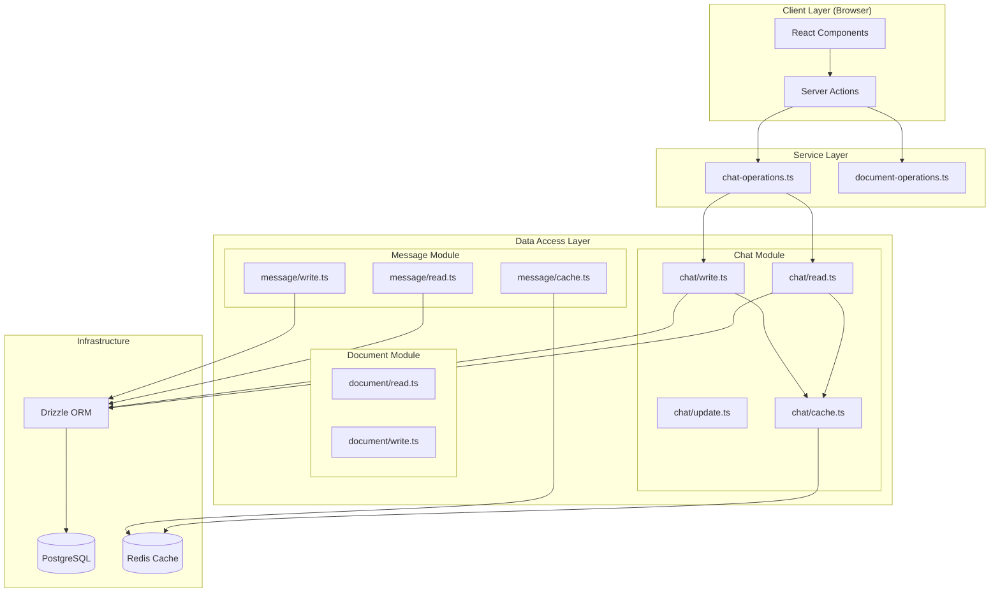
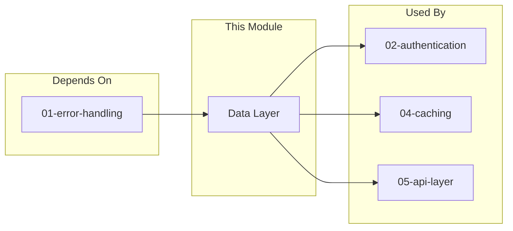

# 03-Data-Layer-Optimal-Design

> **Module**: P0.3 - Data Layer (Database & ORM)  
> **Priority**: CRITICAL (Foundation)  
> **Status**: DESIGN COMPLETE  
> **Author**: Ouroboros Architect  
> **Date**: 2024-12-17  
> **Depends On**: 01-error-handling-optimal-design.md (AppError)

---

## 1. Feature/Module Purpose

**Business Capability**: Reliable, type-safe data persistence with efficient caching.

The Data Layer serves three stakeholders:
1. **Users**: Fast data retrieval (<50ms for cached reads), reliable persistence
2. **Developers**: Type-safe queries, clear patterns, easy debugging
3. **Operations**: Connection pool management, query optimization, cache coherence

**Success Criteria**:
- Zero database code in client bundles (`"server-only"` enforcement)
- <50ms for cached reads, <200ms for cold DB reads
- Type-safe schema-to-query-to-result pipeline
- Clear separation: Schema → Repository → Cache → Service
- Refactor 1256-line monolith into focused modules (<300 lines each)

---

## 2. Key Requirements

### 2.1 Database Access

| Requirement | Description |
|-------------|-------------|
| PostgreSQL | Primary data store via Drizzle ORM |
| Connection Pooling | Environment-aware pool sizing (serverless vs Vercel Fluid) |
| Transactions | Atomic operations with automatic rollback |
| Migrations | Schema versioning with drizzle-kit |

### 2.2 Schema Design

| Requirement | Description |
|-------------|-------------|
| Type Safety | `InferSelectModel` / `InferInsertModel` everywhere |
| Relations | Foreign keys with cascade behavior |
| Indexes | Composite indexes for common query patterns |
| Enums | PostgreSQL enums for constrained values |

### 2.3 Query Patterns

| Requirement | Description |
|-------------|-------------|
| IDOR Protection | All queries filter by `userId` |
| Pagination | Cursor-based for large datasets |
| Batch Operations | Chunked inserts/updates |
| Upserts | Atomic conflict resolution |

### 2.4 Cache Strategy

| Requirement | Description |
|-------------|-------------|
| Cache-First | Check Redis before DB for reads |
| Write-Through | DB first, then cache update |
| Guest Users | Cache-only (no DB persistence) |
| Invalidation | Targeted cache removal on mutations |

### 2.5 Server-Only Guarantees

| Requirement | Description |
|-------------|-------------|
| Import Guards | `"server-only"` at top of all DB modules |
| No Client Imports | Schema types exported separately |
| Build Validation | Turbopack will fail if DB code reaches client |

---

## 3. Quick Current State Notes

### 3.1 What Exists

**lib/db/ Directory (6 files)**

| File | Lines | Purpose | Verdict |
|------|-------|---------|---------|
| schema.ts | 186 | Table definitions | ✅ Good, keep |
| queries.ts | 216 | Low-level queries | ⚠️ Mix of concerns |
| transactions.ts | 108 | Transaction wrapper | ✅ Good pattern |
| batch.ts | 372 | Batch operations | ✅ Well-documented |
| pagination.ts | 330 | Cursor pagination | ✅ Good abstraction |
| migrate.ts | ~50 | Migration runner | ✅ Keep |

**lib/data/ Directory (4 files)**

| File | Lines | Purpose | Verdict |
|------|-------|---------|---------|
| base.ts | 89 | Types & context | ✅ Good foundation |
| chat.ts | 1256 | Chat + Message DAL | 🔴 MONOLITH - must split |
| chat-operations.ts | 112 | High-level operations | ✅ Good pattern |
| document.ts | 517 | Document DAL | ⚠️ Could split |

### 3.2 The 1256-Line Monolith Problem (`lib/data/chat.ts`)

**Current Structure Analysis**:
```
Lines 1-70:     Imports + documentation
Lines 71-829:   chatData object (15+ methods, 758 lines)
Lines 830-1256: messageData object (8+ methods, 426 lines)
```

**Why It's a Problem**:
1. **Cognitive Load**: 1256 lines = impossible to understand at a glance
2. **Testing Difficulty**: Can't unit test individual operations
3. **Code Duplication**: Similar cache patterns repeated 10+ times
4. **Merge Conflicts**: Any chat feature touches this file
5. **Import Bloat**: Importing one function pulls all 1256 lines

**Methods in `chatData` (15 methods, ~758 lines)**:
- `get`, `getWithMessages`, `getMany`, `list` - READ operations
- `create`, `delete`, `deleteAll` - WRITE operations  
- `updateTitle`, `updateVisibility`, `updateContext` - UPDATE operations
- `exists`, `getPublic` - UTILITY operations

**Methods in `messageData` (8+ methods, ~426 lines)**:
- `getForChat`, `getCount`, `getByChatIdWithLimit` - READ operations
- `save`, `saveWithContext` - WRITE operations
- `deleteAfterTimestamp` - DELETE operations

### 3.3 What Works Well

1. **Cache-first pattern**: Correct approach for performance
2. **Guest/Auth bifurcation**: Clean separation of data paths
3. **IDOR protection**: All queries filter by `userId`
4. **Fire-and-forget cache updates**: Non-blocking performance
5. **DataContext pattern**: Clean dependency injection

### 3.4 Complexity Assessment

| Component | Lines | Complexity | Target |
|-----------|-------|------------|--------|
| chat.ts | 1256 | 🔴 Critical | Split to 4 files |
| document.ts | 517 | ⚠️ High | Split to 2 files |
| queries.ts | 216 | ⚠️ Medium | Refocus |
| Total | ~2100 | - | ~1400 (-33%) |

---

## 4. Optimal Architecture Design

### 4.1 Design Principles

| Principle | Rationale |
|-----------|-----------|
| **Repository Pattern** | Encapsulate query logic, enable testing |
| **Single Responsibility** | One file = one entity = one concern |
| **Cache Abstraction** | Repository doesn't know about Redis internals |
| **Type-Safe Pipelines** | Schema → Query → Result fully typed |
| **Composition over Inheritance** | Small functions composed into operations |

### 4.2 Module Structure (Optimal)

```
lib/
├── db/
│   ├── index.ts              # Public API: db instance, withTransaction
│   ├── client.ts             # Connection pool, environment config
│   ├── schema.ts             # Table definitions (unchanged)
│   ├── schema-types.ts       # Exported types only (client-safe)
│   ├── transactions.ts       # withTransaction wrapper (unchanged)
│   ├── batch.ts              # Batch operations (unchanged)
│   ├── pagination.ts         # Cursor pagination (unchanged)
│   ├── migrate.ts            # Migration runner
│   └── migrations/           # SQL migrations
│
├── data/
│   ├── index.ts              # Public API exports
│   ├── types.ts              # DataContext, result types
│   ├── base.ts               # createContext, isGuest helpers
│   │
│   ├── chat/                 # Chat entity (split from monolith)
│   │   ├── index.ts          # chatData export
│   │   ├── read.ts           # get, getWithMessages, list, exists
│   │   ├── write.ts          # create, delete, deleteAll
│   │   ├── update.ts         # updateTitle, updateVisibility, updateContext
│   │   └── cache.ts          # Chat-specific cache operations
│   │
│   ├── message/              # Message entity (split from monolith)
│   │   ├── index.ts          # messageData export
│   │   ├── read.ts           # getForChat, getCount, getByChatIdWithLimit
│   │   ├── write.ts          # save, saveWithContext
│   │   ├── delete.ts         # deleteAfterTimestamp
│   │   └── cache.ts          # Message-specific cache operations
│   │
│   ├── document/             # Document entity
│   │   ├── index.ts          # documentData export
│   │   ├── read.ts           # get, getVersions
│   │   ├── write.ts          # create, update, delete
│   │   └── cache.ts          # Document-specific cache operations
│   │
│   ├── user/                 # User entity
│   │   ├── index.ts          # userData export
│   │   └── queries.ts        # getUser, getUserById, create
│   │
│   └── vote/                 # Vote entity
│       ├── index.ts          # voteData export
│       └── queries.ts        # vote, getVotes
```

### 4.3 Architecture Diagram



### 4.4 Breaking Up the Monolith

**Phase 1: Extract Message Module (426 lines)**

```
lib/data/chat.ts (1256 lines)
    │
    ├── Extract: messageData object
    │   └── lib/data/message/
    │       ├── index.ts      (20 lines)
    │       ├── read.ts       (150 lines)
    │       ├── write.ts      (200 lines)
    │       └── delete.ts     (60 lines)
    │
    └── Remaining: chatData + imports (830 lines)
```

**Phase 2: Split Chat Module (830 lines)**

```
lib/data/chat.ts (830 lines remaining)
    │
    ├── Extract READ: get, getWithMessages, list, exists, getPublic
    │   └── lib/data/chat/read.ts (300 lines)
    │
    ├── Extract WRITE: create, delete, deleteAll
    │   └── lib/data/chat/write.ts (200 lines)
    │
    ├── Extract UPDATE: updateTitle, updateVisibility, updateContext
    │   └── lib/data/chat/update.ts (150 lines)
    │
    └── Index: compose chatData object
        └── lib/data/chat/index.ts (50 lines)
```

**Phase 3: Extract Cache Helpers**

```
Current: Cache operations inline in each method
Optimal: Dedicated cache modules

lib/data/chat/cache.ts (100 lines)
├── warmChatCache()
├── invalidateChatCache()
└── getCachedChat()

lib/data/message/cache.ts (80 lines)
├── appendToCache()
├── invalidateMessagesCache()
└── getCachedMessages()
```

### 4.5 Repository Pattern Implementation

**Option A: Object Literal (Current)**
```typescript
// Current pattern - works but all methods in one object
export const chatData = {
    get: async (id, ctx) => { ... },
    create: async (params, ctx) => { ... },
    // ... 15 more methods
};
```

**Option B: Class-Based Repository**
```typescript
// Class pattern - better for complex domains
class ChatRepository {
    constructor(private db: DrizzleDB, private cache: CacheService) {}
    
    async get(id: string, ctx: DataContext): Promise<Chat | null> { ... }
    async create(params: CreateChatParams, ctx: DataContext): Promise<Chat> { ... }
}

export const chatRepository = new ChatRepository(db, cacheService);
```

**Option C: Functional Modules (RECOMMENDED)**
```typescript
// Functional pattern - best for this codebase
// lib/data/chat/read.ts
export async function getChat(id: string, ctx: DataContext): Promise<Chat | null> {
    // Implementation
}

// lib/data/chat/index.ts
import * as read from './read';
import * as write from './write';
import * as update from './update';

export const chatData = {
    get: read.getChat,
    getWithMessages: read.getChatWithMessages,
    list: read.listChats,
    create: write.createChat,
    delete: write.deleteChat,
    updateTitle: update.updateChatTitle,
    // ...
};
```

**Decision: Option C (Functional Modules)**

| Criteria | Object Literal | Class-Based | Functional Modules |
|----------|---------------|-------------|-------------------|
| Testability | ⚠️ Mock whole object | ✅ Inject deps | ✅ Mock individual |
| Tree-shaking | ❌ All or nothing | ❌ Class bundled | ✅ Per-function |
| Code splitting | ❌ One file | ⚠️ One class | ✅ Per-file |
| Migration effort | N/A | High | Low |
| Consistency | ✅ Current style | ❌ New pattern | ✅ Extension |

---

## 5. Technology Stack

### 5.1 Drizzle ORM 0.34.0 Best Practices

**Schema Definition**:
```typescript
// lib/db/schema.ts
import { pgTable, uuid, text, timestamp, index } from 'drizzle-orm/pg-core';

export const chat = pgTable('Chat', {
    id: uuid('id').primaryKey().defaultRandom(),
    userId: uuid('user_id').notNull().references(() => user.id, { onDelete: 'cascade' }),
    title: text('title').notNull().default('New Chat'),
    createdAt: timestamp('created_at', { withTimezone: true }).defaultNow().notNull(),
}, (t) => ({
    userCreatedIdx: index('chat_user_created_idx').on(t.userId, t.createdAt),
}));
```

**Type-Safe Queries**:
```typescript
// Infer types from schema
type Chat = InferSelectModel<typeof chat>;
type NewChat = InferInsertModel<typeof chat>;

// Query with type safety
const result: Chat[] = await db
    .select()
    .from(chat)
    .where(and(eq(chat.id, chatId), eq(chat.userId, userId)));
```

**Prepared Statements** (for hot paths):
```typescript
// lib/data/chat/read.ts
const getChatByIdQuery = db
    .select()
    .from(chat)
    .where(and(eq(chat.id, sql.placeholder('id')), eq(chat.userId, sql.placeholder('userId'))))
    .prepare('get_chat_by_id');

export async function getChat(id: string, userId: string) {
    return getChatByIdQuery.execute({ id, userId });
}
```

### 5.2 Connection Pool Strategy

```typescript
// lib/db/client.ts
import "server-only";
import postgres from 'postgres';
import { drizzle } from 'drizzle-orm/postgres-js';

function getPoolConfig() {
    const isVercelFluid = process.env.VERCEL_FLUID === '1';
    const isProd = process.env.NODE_ENV === 'production';
    
    if (isVercelFluid) {
        // Vercel Fluid: Rapid scaling, short-lived connections
        return { max: 5, idle_timeout: 10, connect_timeout: 10 };
    }
    if (isProd) {
        // Traditional serverless: Moderate pooling
        return { max: 10, idle_timeout: 20, connect_timeout: 10 };
    }
    // Development: Minimal connections
    return { max: 3, idle_timeout: 30, connect_timeout: 30 };
}

const client = postgres(process.env.DATABASE_URL!, {
    ...getPoolConfig(),
    prepare: false, // Better for serverless
});

export const db = drizzle(client);
```

### 5.3 Transaction Handling

```typescript
// lib/db/transactions.ts (keep existing, add helpers)
export async function withTransaction<T>(
    fn: (tx: Transaction) => Promise<T>,
    operation = 'transaction'
): Promise<T> {
    const span = trace.getActiveSpan();
    span?.setAttribute('db.operation', operation);
    
    try {
        return await db.transaction(fn);
    } catch (error) {
        throw toDatabaseError('transaction_failed', error, operation);
    }
}

// Convenience: read-only transaction hint
export async function withReadTransaction<T>(
    fn: (tx: Transaction) => Promise<T>
): Promise<T> {
    return withTransaction(fn, 'read_transaction');
}
```

---

## 6. Bundle Strategy

### 6.1 Server-Only Enforcement

```typescript
// EVERY file in lib/db/ and lib/data/ MUST start with:
import "server-only";

// This causes build failure if imported from client code
```

### 6.2 Type-Only Exports for Client

```typescript
// lib/db/schema-types.ts (client-safe)
// NO "server-only" here - types only, no runtime code

export type { Chat, User, Message, Document, Vote } from './schema';
export type { VisibilityType } from './schema';

// Components can import types:
// import type { Chat } from '@/lib/db/schema-types';
```

### 6.3 Bundle Analysis Verification

```bash
# Add to CI pipeline
npx @next/bundle-analyzer

# Check that lib/db/* and lib/data/* are NOT in client chunks
# Should only appear in server chunks
```

---

## 7. Simplifications vs Current

### 7.1 Eliminated Patterns

| Current | Optimal | Reason |
|---------|---------|--------|
| 1256-line monolith | 6 focused files | Maintainability |
| Inline cache logic | Dedicated cache modules | Reusability |
| Repeated error wrapping | Centralized in base | DRY |
| Mixed READ/WRITE | Separate files | Single responsibility |

### 7.2 Line Count Comparison

| Module | Current | Optimal | Reduction |
|--------|---------|---------|-----------|
| chat.ts | 1256 | 0 (split) | -100% |
| chat/index.ts | - | 50 | - |
| chat/read.ts | - | 300 | - |
| chat/write.ts | - | 200 | - |
| chat/update.ts | - | 150 | - |
| message/index.ts | - | 30 | - |
| message/read.ts | - | 150 | - |
| message/write.ts | - | 200 | - |
| **Total Chat+Message** | **1256** | **1080** | **-14%** |

Note: Line reduction is modest, but **complexity reduction is massive** due to separation of concerns.

### 7.3 Removed Duplication

**Before (repeated 10+ times in chat.ts)**:
```typescript
if (isRedisAvailable()) {
    try {
        const cached = await getChatFromCache(chatId, ctx.userId);
        if (cached) { return transformCached(cached); }
    } catch (cacheError) {
        logWarn("Cache read failed", { chatId, error: cacheError });
        if (ctx.isGuest) return null;
    }
}
```

**After (centralized)**:
```typescript
// lib/data/chat/cache.ts
export async function tryGetFromCache<T>(
    key: string,
    getter: () => Promise<T | null>,
    ctx: DataContext
): Promise<T | null> {
    if (!isRedisAvailable()) return null;
    
    try {
        return await getter();
    } catch (error) {
        logWarn("Cache read failed", { key, error });
        return ctx.isGuest ? null : null; // Fall through to DB
    }
}

// Usage in chat/read.ts
const cached = await tryGetFromCache(
    `chat:${chatId}`,
    () => getChatFromCache(chatId, ctx.userId),
    ctx
);
```

---

## 8. Dependencies

### 8.1 Module Dependencies



### 8.2 Import Rules

```typescript
// ✅ ALLOWED imports in lib/data/*
import { AppError, toDatabaseError } from '@/lib/errors';  // 01-error-handling
import { db, withTransaction } from '@/lib/db';
import { isRedisAvailable, getRedisClient } from '@/lib/cache/redis';

// ❌ FORBIDDEN imports in lib/data/*
import { requireAuth } from '@/lib/auth';  // Auth depends on data, not vice versa
import { anything } from '@/components/*';  // No UI in data layer
```

---

## 9. Public Interface

### 9.1 Primary Exports

```typescript
// lib/data/index.ts
export { chatData } from './chat';
export { messageData } from './message';
export { documentData } from './document';
export { userData } from './user';
export { voteData } from './vote';

export { createContext, isGuest } from './base';
export type { DataContext, ChatWithMessages, PaginatedResult } from './types';
```

### 9.2 Chat Module Interface

```typescript
// lib/data/chat/index.ts
export const chatData = {
    // READ
    get: (chatId: string, ctx: DataContext) => Promise<Chat | null>,
    getWithMessages: (chatId: string, ctx: DataContext) => Promise<ChatWithMessages | null>,
    list: (ctx: DataContext, pagination: PaginationParams) => Promise<PaginatedResult<Chat>>,
    exists: (chatId: string, ctx: DataContext) => Promise<boolean>,
    getPublic: (chatId: string) => Promise<Chat | null>,
    
    // WRITE
    create: (params: CreateChatParams, ctx: DataContext) => Promise<Chat>,
    delete: (chatId: string, ctx: DataContext) => Promise<void>,
    deleteAll: (ctx: DataContext) => Promise<void>,
    
    // UPDATE
    updateTitle: (chatId: string, title: string, ctx: DataContext) => Promise<void>,
    updateVisibility: (chatId: string, visibility: VisibilityType, ctx: DataContext) => Promise<void>,
    updateContext: (chatId: string, context: AppUsage, ctx: DataContext) => Promise<void>,
};
```

### 9.3 Message Module Interface

```typescript
// lib/data/message/index.ts
export const messageData = {
    // READ
    getForChat: (chatId: string, ctx: DataContext) => Promise<MessageRow[]>,
    getCount: (chatId: string, ctx: DataContext) => Promise<number>,
    getByChatIdWithLimit: (chatId: string, limit: number, ctx: DataContext) => Promise<MessageRow[]>,
    
    // WRITE
    save: (messages: DBMessage[], ctx: DataContext) => Promise<void>,
    saveWithContext: (params: SaveWithContextParams, ctx: DataContext) => Promise<void>,
    
    // DELETE
    deleteAfterTimestamp: (chatId: string, timestamp: Date, ctx: DataContext) => Promise<void>,
};
```

---

## 10. Performance Optimizations

### 10.1 Query Optimization

**Prepared Statements for Hot Paths**:
```typescript
// Chat retrieval is called on every page load
const getChatPrepared = db.query.chat.findFirst({
    where: (chat, { eq, and }) => and(
        eq(chat.id, sql.placeholder('id')),
        eq(chat.userId, sql.placeholder('userId'))
    ),
}).prepare('get_chat');

// Usage: ~2x faster than dynamic query
const chat = await getChatPrepared.execute({ id, userId });
```

**Index Utilization**:
```sql
-- Existing indexes (good)
CREATE INDEX chat_user_created_idx ON "Chat" (user_id, created_at);
CREATE INDEX message_chat_created_idx ON "Message_v2" (chat_id, created_at);

-- Recommended addition for rate limiting queries
CREATE INDEX message_chat_created_role_idx ON "Message_v2" (chat_id, created_at, role);
```

### 10.2 Caching Strategy

```
┌─────────────────────────────────────────────────────────────┐
│                     READ PATH                                │
├─────────────────────────────────────────────────────────────┤
│  Request → Cache Check → Cache Hit? → Return Cached         │
│                 │                                            │
│                 └── Cache Miss → DB Query → Warm Cache →    │
│                                              Return Result   │
├─────────────────────────────────────────────────────────────┤
│                     WRITE PATH                               │
├─────────────────────────────────────────────────────────────┤
│  Request → DB Write → Success? → Cache Update (async) →     │
│                          │        Return Success             │
│                          │                                   │
│                          └── Failure → Return Error         │
│                                (no cache update)             │
└─────────────────────────────────────────────────────────────┘
```

### 10.3 Batch Operation Guidelines

```typescript
// ✅ GOOD: Batch insert with chunking
await batchInsert(message, messages, { chunkSize: 100 });

// ❌ BAD: Sequential inserts
for (const msg of messages) {
    await db.insert(message).values(msg);
}

// ✅ GOOD: Parallel independent queries
const [chat, messages, votes] = await Promise.all([
    chatData.get(chatId, ctx),
    messageData.getForChat(chatId, ctx),
    voteData.getForChat(chatId, ctx),
]);

// ❌ BAD: Sequential dependent queries made independently
const chat = await chatData.get(chatId, ctx);
const messages = await messageData.getForChat(chatId, ctx);
```

### 10.4 Connection Pool Monitoring

```typescript
// Add to lib/db/client.ts
if (process.env.NODE_ENV !== 'production') {
    setInterval(() => {
        console.log('DB Pool Stats:', {
            total: client.totalCount,
            idle: client.idleCount,
            waiting: client.waitingCount,
        });
    }, 30000);
}
```

---

## 11. Migration Strategy

### 11.1 Phase 1: Extract Without Breaking Changes

1. Create new directory structure
2. Move code to new files (copy, don't delete)
3. Re-export from original location
4. Verify no breaking changes

```typescript
// lib/data/chat.ts (temporary bridge)
export { chatData } from './chat/index';
export { messageData } from './message/index';
// This maintains backward compatibility during migration
```

### 11.2 Phase 2: Update Imports Gradually

```bash
# Find all imports of the old path
grep -r "from '@/lib/data/chat'" --include="*.ts" --include="*.tsx"

# Update to new paths in batches
# Old: import { chatData } from '@/lib/data/chat';
# New: import { chatData } from '@/lib/data';
```

### 11.3 Phase 3: Remove Bridge

1. Verify all imports updated
2. Delete old `lib/data/chat.ts`
3. Run full test suite

---

## 12. Testing Strategy

### 12.1 Unit Tests

```typescript
// lib/data/chat/__tests__/read.test.ts
describe('chatData.get', () => {
    it('returns null for guest with cache miss', async () => {
        // Mock Redis unavailable
        vi.mocked(isRedisAvailable).mockReturnValue(false);
        
        const result = await chatData.get('chat-id', { userId: 'guest', isGuest: true });
        
        expect(result).toBeNull();
        expect(db.select).not.toHaveBeenCalled();
    });
    
    it('queries DB for authenticated user with cache miss', async () => {
        vi.mocked(isRedisAvailable).mockReturnValue(false);
        vi.mocked(db.select).mockResolvedValue([mockChat]);
        
        const result = await chatData.get('chat-id', { userId: 'user-id', isGuest: false });
        
        expect(result).toEqual(mockChat);
        expect(db.select).toHaveBeenCalled();
    });
});
```

### 12.2 Integration Tests

```typescript
// tests/data/chat.integration.test.ts
describe('Chat Data Integration', () => {
    beforeAll(async () => {
        await seedTestDatabase();
    });
    
    it('creates and retrieves chat with messages', async () => {
        const ctx = { userId: 'test-user', isGuest: false };
        
        const chat = await chatData.create({ id: 'test-chat', title: 'Test' }, ctx);
        await messageData.save([{ chatId: chat.id, role: 'user', parts: [] }], ctx);
        
        const result = await chatData.getWithMessages(chat.id, ctx);
        
        expect(result?.chat.id).toBe(chat.id);
        expect(result?.messages).toHaveLength(1);
    });
});
```

---

## 13. Quality Checklist

- [x] Considered 2+ alternatives (Class-based vs Functional)
- [x] Documented WHY functional modules chosen
- [x] Explained why class-based rejected (migration effort, bundle impact)
- [x] Listed BOTH positive and negative consequences
- [x] Addressed Security (IDOR protection, server-only)
- [x] Addressed Performance (prepared statements, caching, batching)
- [x] Addressed Scalability (connection pooling, cursor pagination)
- [x] Included implementation notes (migration strategy)
- [x] Added diagrams for complex flows
- [x] Used consequence codes in trade-off analysis

---

## 14. Consequences

### 14.1 Positive

- **POS-001**: Maintainability - 1256-line file split into 6 focused modules
- **POS-002**: Testability - Individual functions can be unit tested in isolation
- **POS-003**: Code Review - Changes affect smaller, focused files
- **POS-004**: Onboarding - New developers understand structure faster
- **POS-005**: Tree-shaking - Unused query functions don't bloat bundles

### 14.2 Negative

- **NEG-001**: More files to navigate (6 instead of 1)
  - *Mitigation*: Clear naming, index.ts re-exports
- **NEG-002**: Import paths change during migration
  - *Mitigation*: Bridge file maintains backward compatibility
- **NEG-003**: Initial refactoring effort (~4 hours)
  - *Mitigation*: Phased migration, no big-bang

### 14.3 Alternatives Rejected

| Alternative | Rejected Because |
|-------------|------------------|
| Class-based repositories | Higher migration effort, less idiomatic for codebase |
| Keep monolith | Cognitive load, merge conflicts, test difficulty |
| ORM switch (Prisma) | Breaking change, Drizzle works well, no benefit |

---

## 15. Implementation Notes

### 15.1 File Creation Order

1. `lib/data/types.ts` - Extract types from base.ts
2. `lib/data/message/` - Extract messageData (simpler, lower risk)
3. `lib/data/chat/` - Extract chatData (larger, after message proves pattern)
4. Update imports in consumers
5. Remove old chat.ts

### 15.2 Key Code Patterns to Follow

```typescript
// Every function follows this structure:
export async function getChatById(
    chatId: string,
    ctx: DataContext
): Promise<Chat | null> {
    // 1. Cache check (with error recovery)
    const cached = await tryGetFromCache(/*...*/);
    if (cached) return cached;
    
    // 2. Guest early return
    if (ctx.isGuest) return null;
    
    // 3. DB query with IDOR protection
    const [result] = await db.select().from(chat)
        .where(and(eq(chat.id, chatId), eq(chat.userId, ctx.userId)));
    
    // 4. Background cache warming
    if (result && isRedisAvailable()) {
        warmCache(result).catch(logError);
    }
    
    return result ?? null;
}
```

### 15.3 Estimated Effort

| Task | Effort | Risk |
|------|--------|------|
| Create directory structure | 30m | Low |
| Extract messageData | 2h | Medium |
| Extract chatData | 2h | Medium |
| Update imports | 1h | Low |
| Write tests | 2h | Low |
| **Total** | **~8h** | Medium |

---

## 16. References

- [Drizzle ORM Documentation](https://orm.drizzle.team/docs/overview)
- [PostgreSQL Connection Pooling](https://wiki.postgresql.org/wiki/Number_Of_Database_Connections)
- [01-error-handling-optimal-design.md](./01-error-handling-optimal-design.md)
- [02-authentication-optimal-design.md](./02-authentication-optimal-design.md)
