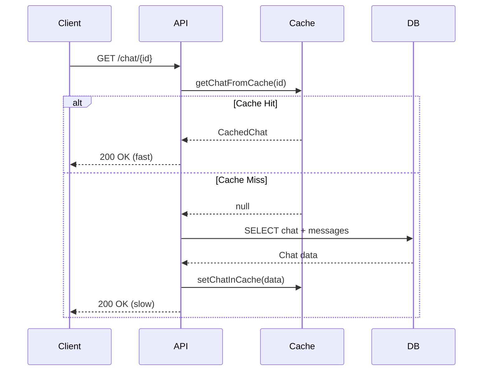
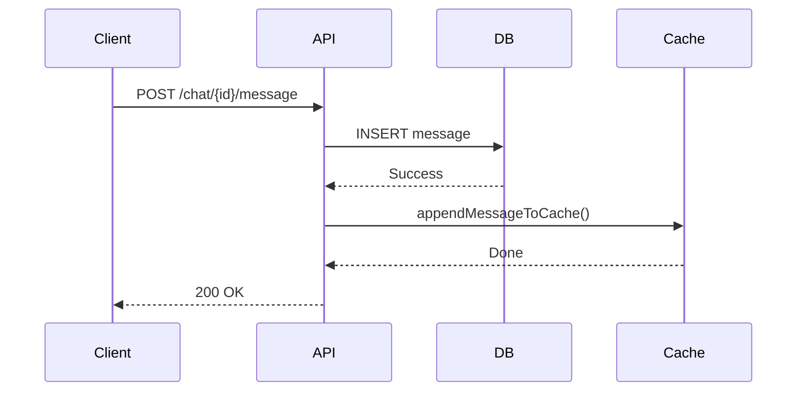
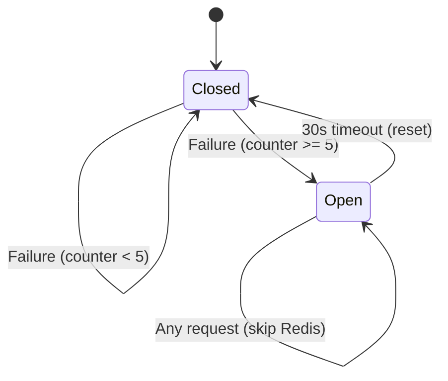
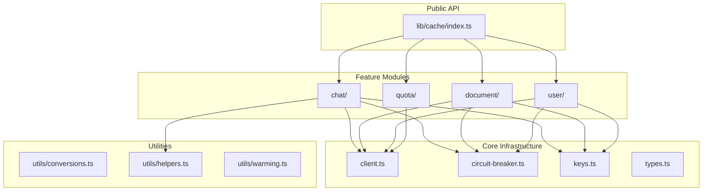

# 04-Cache-Layer-Optimal-Design

> **Module**: P0.4 - Cache Layer (Redis & Caching Strategy)  
> **Priority**: CRITICAL (Performance Foundation)  
> **Status**: DESIGN COMPLETE  
> **Author**: Ouroboros Architect  
> **Date**: 2024-12-17  
> **Depends On**: 01-error-handling-optimal-design.md (AppError)

---

## 1. Feature/Module Purpose

**Business Capability**: High-performance caching layer for sub-50ms reads.

The Cache Layer serves three stakeholders:
1. **Users**: Near-instant data retrieval (<50ms), graceful degradation when cache unavailable
2. **Developers**: Type-safe cache operations, clear patterns, predictable behavior
3. **Operations**: Circuit breaker protection, TTL management, resource efficiency

**Success Criteria**:
- <50ms cache reads (p95)
- Zero client bundle pollution (`"server-only"` enforcement)
- Graceful degradation when Redis unavailable
- Type-safe operations end-to-end
- Refactor 1080-line `operations.ts` into focused modules (<250 lines each)

---

## 2. Key Requirements

### 2.1 Redis Integration

| Requirement | Description |
|-------------|-------------|
| Upstash Redis | HTTP-based, Edge-compatible |
| Connection Singleton | Global instance, HMR-safe |
| Environment Config | `CACHE_KV_REST_API_URL` + `CACHE_KV_REST_API_TOKEN` |
| Graceful Unavailability | Return null/empty when Redis missing |

### 2.2 Caching Strategies

| Pattern | Use Case |
|---------|----------|
| Cache-Aside | Read: cache → miss → DB → populate cache |
| Write-Through | Write: DB → cache update |
| Guest-Only | Guest users: cache-only (no DB) |
| TTL-Based | Guest data auto-expires (GUEST_CACHE_TTL_SECONDS) |

### 2.3 Data Structures

| Data Type | Redis Structure | Rationale |
|-----------|----------------|-----------|
| Chat Metadata | STRING (JSON) | Fast O(1) access |
| Chat Messages | ZSET (score=timestamp) | O(log N) append, O(log N + M) range delete |
| User Chat List | ZSET (score=updatedAt) | Sorted pagination |
| Documents | STRING (JSON) | Simple versioned storage |
| Quota Counters | STRING (atomic INCRBY) | Rate limiting |

### 2.4 Reliability

| Requirement | Description |
|-------------|-------------|
| Circuit Breaker | Open after 5 consecutive failures, reset after 30s |
| Retry Logic | Exponential backoff for critical operations |
| Error Isolation | Cache failures never block DB operations |
| Logging | Structured error logging with context |

### 2.5 Performance

| Requirement | Description |
|-------------|-------------|
| Pipelining | Batch multiple commands in single round-trip |
| Lua Scripts | Atomic multi-step operations |
| Lazy Deletion | ZREMRANGEBYSCORE vs iteration |
| Connection Reuse | Singleton pattern for HTTP client |

---

## 3. Quick Current State Notes

### 3.1 What Exists

**lib/cache/ Directory (6 files)**

| File | Lines | Purpose | Verdict |
|------|-------|---------|---------|
| operations.ts | **1080** | All cache CRUD operations | 🔴 **MONOLITH** - must split |
| batch-operations.ts | 326 | Lua-based batch ops | ⚠️ Merge with chat-cache |
| helpers.ts | 183 | Conversion & key utilities | ✅ Keep, rename |
| types.ts | 98 | Cache type definitions | ✅ Keep as-is |
| redis.ts | 33 | Client singleton | ✅ Keep as-is |
| quota.ts | 186 | Rate limit counters | ✅ Keep as-is |

### 3.2 Problem Analysis: operations.ts (1080 lines)

**Current Structure** (identified sections):
```
Lines 1-79:    Circuit breaker implementation
Lines 80-200:  Chat read operations (getChatFromCache, getChatMetaFromCache)
Lines 200-400: Chat write operations (setChatInCache, appendMessageToCache)
Lines 400-550: Batch message operations (appendMessagesToCache, deleteMessagesFromCacheAfterTimestamp)
Lines 550-700: Metadata update operations (updateChatTitleInCache, etc.)
Lines 700-800: Chat deletion operations (deleteChatFromCache)
Lines 800-900: User chat list operations (getUserChatsFromCache)
Lines 900-1000: Document cache operations
Lines 1000-1080: Conversion helpers & cache warming
```

**Issues Identified**:
1. **Mixed Concerns**: Chat, document, and utility code in one file
2. **Duplicate Patterns**: Same circuit breaker check in every function
3. **Scattered Lua Scripts**: Embedded scripts make code hard to test
4. **Conversion Logic**: Mixed with cache operations

### 3.3 What's Good (Keep)

1. **ZSET for Messages**: O(log N) append, O(log N + M) range delete - excellent choice
2. **Lua Scripts**: Atomic operations reduce race conditions
3. **Circuit Breaker**: Prevents cascade failures
4. **Pipeline Usage**: Efficient batch operations
5. **Guest TTL**: Automatic cleanup via EXPIRE
6. **Type Safety**: CachedMessage, CachedChat types are well-defined

---

## 4. Optimal Architecture Design

### 4.1 Module Structure (Refactored)

```
lib/cache/
├── index.ts                 # Public API re-exports
├── client.ts                # Redis client singleton (rename from redis.ts)
├── types.ts                 # Type definitions (keep)
├── keys.ts                  # Cache key patterns (extract from types.ts)
├── circuit-breaker.ts       # Circuit breaker logic (extract)
├── chat/
│   ├── index.ts             # Chat cache public API
│   ├── read.ts              # getChatFromCache, getChatMetaFromCache
│   ├── write.ts             # setChatInCache, appendMessageToCache
│   ├── delete.ts            # deleteChatFromCache, deleteMessagesAfterTimestamp
│   └── scripts.ts           # Lua scripts for chat operations
├── document/
│   ├── index.ts             # Document cache public API
│   ├── operations.ts        # All document cache operations
│   └── scripts.ts           # Lua scripts for document operations
├── user/
│   ├── index.ts             # User cache public API
│   └── chats.ts             # User chat list operations
├── quota/
│   └── index.ts             # Rate limiting (keep quota.ts, rename)
└── utils/
    ├── conversions.ts       # chatToCache, documentsToCache
    ├── helpers.ts           # isGuestUserId, getMessageScore, etc.
    └── warming.ts           # Cache warming utilities
```

**Line Count Targets**:
| Module | Max Lines | Current Source |
|--------|-----------|----------------|
| circuit-breaker.ts | 80 | operations.ts L1-79 |
| chat/read.ts | 150 | operations.ts L80-200 |
| chat/write.ts | 200 | operations.ts L200-550 |
| chat/delete.ts | 100 | operations.ts L550-700 |
| chat/scripts.ts | 150 | Embedded Lua scripts |
| document/operations.ts | 200 | operations.ts L900-1000 |
| user/chats.ts | 100 | operations.ts L800-900 |
| utils/conversions.ts | 100 | operations.ts L1000-1080 |

### 4.2 Cache Key Naming Conventions

**Pattern**: `{entity}:{id}:{scope}:{subtype}`

```typescript
// lib/cache/keys.ts
export const CacheKeys = {
  // Chat keys - namespaced by userId for IDOR protection
  chat: {
    meta: (chatId: string, userId: string) => `chat:${chatId}:${userId}:meta`,
    messages: (chatId: string, userId: string) => `chat:${chatId}:${userId}:msgs`,
  },
  
  // User keys - user-level aggregations
  user: {
    chats: (userId: string) => `user:${userId}:chats`,
    quota: (userId: string, date: string) => `quota:{${userId}}:${date}`,
  },
  
  // Document keys
  document: (documentId: string, userId: string) => `document:${documentId}:${userId}`,
} as const;

// Type-safe key helpers
export type ChatCacheKeys = {
  metaKey: string;
  msgsKey: string;
  userChatsKey: string;
};

export function getChatKeys(chatId: string, userId: string): ChatCacheKeys {
  return {
    metaKey: CacheKeys.chat.meta(chatId, userId),
    msgsKey: CacheKeys.chat.messages(chatId, userId),
    userChatsKey: CacheKeys.user.chats(userId),
  };
}
```

### 4.3 Circuit Breaker (Extracted Module)

```typescript
// lib/cache/circuit-breaker.ts
import "server-only";
import { logError, logWarn } from "@/lib/log";

interface CircuitBreakerState {
  failures: number;
  openedAt: number | null;
}

const state: CircuitBreakerState = {
  failures: 0,
  openedAt: null,
};

const CONFIG = {
  threshold: 5,
  resetMs: 30_000,
} as const;

export function isCircuitOpen(): boolean {
  if (!state.openedAt) return false;
  
  if (Date.now() - state.openedAt > CONFIG.resetMs) {
    state.openedAt = null;
    state.failures = 0;
    logWarn("Redis circuit breaker reset");
    return false;
  }
  return true;
}

export function recordFailure(operation: string, error: unknown): void {
  state.failures++;
  logError(`Redis ${operation} failed (${state.failures}/${CONFIG.threshold})`, error);
  
  if (state.failures >= CONFIG.threshold && !state.openedAt) {
    state.openedAt = Date.now();
    logError("Redis circuit breaker OPENED", { resetAfterMs: CONFIG.resetMs });
  }
}

export function recordSuccess(): void {
  if (state.failures > 0) {
    state.failures = 0;
  }
}

// Decorator pattern for cache operations
export function withCircuitBreaker<T>(
  operation: string,
  fallback: T,
  fn: () => Promise<T>
): Promise<T> {
  if (isCircuitOpen()) return Promise.resolve(fallback);
  
  return fn()
    .then((result) => {
      recordSuccess();
      return result;
    })
    .catch((error) => {
      recordFailure(operation, error);
      return fallback;
    });
}
```

### 4.4 Chat Cache Operations (Example Split)

```typescript
// lib/cache/chat/read.ts
import "server-only";
import { getRedisClient } from "../client";
import { withCircuitBreaker } from "../circuit-breaker";
import { getChatKeys } from "../keys";
import type { CachedChat, CachedChatMeta, CachedMessage } from "../types";
import { parseMessagesFromRaw } from "../utils/helpers";

export async function getChatFromCache(
  chatId: string,
  userId: string,
  opts?: { maxMessages?: number }
): Promise<CachedChat | null> {
  const redis = getRedisClient();
  if (!redis) return null;

  return withCircuitBreaker("getChatFromCache", null, async () => {
    const keys = getChatKeys(chatId, userId);
    
    const [meta, messagesRaw] = await Promise.all([
      redis.get<CachedChatMeta>(keys.metaKey),
      opts?.maxMessages
        ? redis.zrange(keys.msgsKey, -opts.maxMessages, -1)
        : redis.zrange(keys.msgsKey, 0, -1),
    ]);

    if (!meta) return null;

    return {
      ...meta,
      messages: parseMessagesFromRaw(messagesRaw),
    };
  });
}

export async function getChatMetaFromCache(
  chatId: string,
  userId: string
): Promise<CachedChatMeta | null> {
  const redis = getRedisClient();
  if (!redis) return null;

  return withCircuitBreaker("getChatMetaFromCache", null, async () => {
    const keys = getChatKeys(chatId, userId);
    return redis.get<CachedChatMeta>(keys.metaKey);
  });
}

export async function getLastMessagesFromCache(
  chatId: string,
  userId: string,
  count: number
): Promise<CachedMessage[]> {
  const redis = getRedisClient();
  if (!redis) return [];

  return withCircuitBreaker("getLastMessagesFromCache", [], async () => {
    const keys = getChatKeys(chatId, userId);
    const raw = await redis.zrange(keys.msgsKey, -count, -1);
    return parseMessagesFromRaw(raw);
  });
}
```

### 4.5 Lua Scripts (Centralized)

```typescript
// lib/cache/chat/scripts.ts
import "server-only";

/**
 * Atomic message append with metadata update
 * - ARGV[1]: messageStr (JSON)
 * - ARGV[2]: now (ISO string)
 * - ARGV[3]: userChatsScore (timestamp ms)
 * - ARGV[4]: chatId
 * - ARGV[5]: msgScore (timestamp with role offset)
 * - ARGV[6]: ttl (0 for authenticated, >0 for guest)
 */
export const APPEND_MESSAGE_SCRIPT = `
local metaKey = KEYS[1]
local msgsKey = KEYS[2]
local userChatsKey = KEYS[3]

local meta = redis.call('GET', metaKey)
if not meta then return 0 end

redis.call('ZADD', msgsKey, tonumber(ARGV[5]), ARGV[1])

local data = cjson.decode(meta)
data.updatedAt = ARGV[2]
data.version = (data.version or 0) + 1
redis.call('SET', metaKey, cjson.encode(data))

redis.call('ZADD', userChatsKey, tonumber(ARGV[3]), ARGV[4])

local ttl = tonumber(ARGV[6])
if ttl > 0 then
  redis.call('EXPIRE', metaKey, ttl)
  redis.call('EXPIRE', msgsKey, ttl)
  redis.call('EXPIRE', userChatsKey, ttl)
end

return 1
`;

/**
 * Batch message append
 * - ARGV[1]: now (ISO string)
 * - ARGV[2]: userChatsScore
 * - ARGV[3]: chatId
 * - ARGV[4]: msgCount
 * - ARGV[5]: ttl
 * - ARGV[6+]: score1, msg1, score2, msg2, ...
 */
export const BATCH_APPEND_MESSAGES_SCRIPT = `
local metaKey = KEYS[1]
local msgsKey = KEYS[2]
local userChatsKey = KEYS[3]

local meta = redis.call('GET', metaKey)
if not meta then return 0 end

local msgCount = tonumber(ARGV[4])
for i = 6, 6 + (msgCount * 2) - 1, 2 do
  redis.call('ZADD', msgsKey, tonumber(ARGV[i]), ARGV[i + 1])
end

local data = cjson.decode(meta)
data.updatedAt = ARGV[1]
data.version = (data.version or 0) + 1
redis.call('SET', metaKey, cjson.encode(data))

redis.call('ZADD', userChatsKey, tonumber(ARGV[2]), ARGV[3])

local ttl = tonumber(ARGV[5])
if ttl > 0 then
  redis.call('EXPIRE', metaKey, ttl)
  redis.call('EXPIRE', msgsKey, ttl)
  redis.call('EXPIRE', userChatsKey, ttl)
end

return 1
`;

/**
 * Atomic metadata update
 * - ARGV[1]: updates (JSON)
 * - ARGV[2]: now (ISO string)
 */
export const UPDATE_META_SCRIPT = `
local meta = redis.call('GET', KEYS[1])
if not meta then return nil end

local data = cjson.decode(meta)
local updates = cjson.decode(ARGV[1])
for k, v in pairs(updates) do data[k] = v end
data.updatedAt = ARGV[2]
data.version = (data.version or 0) + 1

redis.call('SET', KEYS[1], cjson.encode(data))
return cjson.encode(data)
`;

/**
 * Delete all user chats atomically
 * - ARGV[1]: userId
 */
export const DELETE_ALL_USER_CHATS_SCRIPT = `
local userChatsKey = KEYS[1]
local userId = ARGV[1]

local chatIds = redis.call('ZRANGE', userChatsKey, 0, -1)
for _, chatId in ipairs(chatIds) do
  redis.call('DEL', 'chat:' .. chatId .. ':' .. userId .. ':meta')
  redis.call('DEL', 'chat:' .. chatId .. ':' .. userId .. ':msgs')
end

redis.call('DEL', userChatsKey)
return #chatIds
`;
```

### 4.6 Public API (index.ts)

```typescript
// lib/cache/index.ts
import "server-only";

// Client
export { getRedisClient, isRedisAvailable } from "./client";

// Types
export type {
  CachedChat,
  CachedChatMeta,
  CachedMessage,
  CachedDocument,
  DocumentVersion,
} from "./types";

// Chat operations
export {
  getChatFromCache,
  getChatMetaFromCache,
  getLastMessagesFromCache,
} from "./chat/read";

export {
  setChatInCache,
  appendMessageToCache,
  appendMessagesToCache,
} from "./chat/write";

export {
  deleteChatFromCache,
  deleteMessagesFromCacheAfterTimestamp,
  deleteAllChatsFromCache,
} from "./chat/delete";

export {
  updateChatTitleInCache,
  updateChatVisibilityInCache,
  updateChatLastContextInCache,
} from "./chat/update";

// Document operations
export {
  getDocumentFromCache,
  setDocumentInCache,
  appendDocumentVersionToCache,
  deleteDocumentVersionsFromCacheAfterTimestamp,
} from "./document";

// User operations
export { getUserChatsFromCache, getMessageCountFromCache } from "./user";

// Quota operations
export {
  getUserMessageCount,
  incrementUserMessageCount,
  setUserMessageCount,
} from "./quota";

// Utilities
export { chatToCache, documentsToCache } from "./utils/conversions";
export { warmChatCache, warmDocumentCache } from "./utils/warming";
```

---

## 5. Technology Stack

### 5.1 Core Dependencies

| Package | Version | Purpose |
|---------|---------|---------|
| @upstash/redis | 1.35.6 | HTTP-based Redis client |

### 5.2 Runtime Compatibility

| Environment | Supported | Notes |
|-------------|-----------|-------|
| Node.js Runtime | ✅ | Full feature support |
| Edge Runtime | ✅ | HTTP-based, no TCP needed |
| Serverless | ✅ | Stateless, connection per request |
| Vercel Fluid | ✅ | Persistent connections via singleton |

### 5.3 Next.js Integration

```typescript
// All cache modules start with:
import "server-only";

// Ensures:
// 1. Turbopack will fail build if imported in client bundle
// 2. Redis credentials never leak to browser
// 3. Cache operations only run on server
```

---

## 6. Bundle Strategy

### 6.1 Server-Only Enforcement

**ALL cache files MUST start with**:
```typescript
import "server-only";
```

**Build-time validation**: Turbopack will error if cache code reaches client.

### 6.2 Import Tree

```
app/(chat)/page.tsx (Client Component)
    ↓ cannot import
lib/cache/index.ts
    ↓ imports
lib/cache/client.ts → "server-only" ✅
lib/cache/chat/read.ts → "server-only" ✅
...
```

### 6.3 Type Exports (Client-Safe)

```typescript
// lib/cache/types.ts - NO "server-only" here
// Types can be imported anywhere (they're compile-time only)
export type CachedMessage = { ... };
export type CachedChat = { ... };
```

---

## 7. Simplifications vs Current

### 7.1 Breaking Up operations.ts (1080 lines)

| Current | After Refactor | Benefit |
|---------|----------------|---------|
| 1 file, 1080 lines | 12 files, <250 lines each | Maintainability |
| Mixed concerns | Single responsibility | Testability |
| Embedded Lua scripts | Centralized scripts.ts | Reusability |
| Repeated circuit breaker checks | `withCircuitBreaker` HOF | DRY |
| Inline error handling | Consistent error wrapper | Predictability |

### 7.2 Removing batch-operations.ts (326 lines)

**Merge into chat/write.ts**:
- `batchUpdateChat` → `appendMessagesToCache` with updates
- `createOrUpdateChat` → `setChatInCache` with upsert logic

### 7.3 Simplified API

**Before** (scattered exports):
```typescript
import { getChatFromCache } from "@/lib/cache/operations";
import { batchUpdateChat } from "@/lib/cache/batch-operations";
import { getUserMessageCount } from "@/lib/cache/quota";
```

**After** (unified exports):
```typescript
import { 
  getChatFromCache, 
  appendMessagesToCache, 
  getUserMessageCount 
} from "@/lib/cache";
```

---

## 8. Dependencies

### 8.1 Internal Dependencies

```mermaid
graph TD
    subgraph "lib/cache"
        A[index.ts] --> B[chat/]
        A --> C[document/]
        A --> D[user/]
        A --> E[quota/]
        
        B --> F[client.ts]
        B --> G[circuit-breaker.ts]
        B --> H[keys.ts]
        B --> I[types.ts]
        B --> J[utils/]
        
        C --> F
        C --> G
        D --> F
        D --> G
        E --> F
    end
    
    subgraph "External"
        F --> K[@upstash/redis]
        G --> L[lib/log]
    end
```

### 8.2 Upstream Dependencies

| Module | Depends On |
|--------|-----------|
| lib/cache | lib/log (logging) |
| lib/cache | lib/constants (TTL values) |
| lib/cache | 01-error-handling (future: AppError) |

### 8.3 Downstream Consumers

| Consumer | Uses |
|----------|------|
| lib/data/chat.ts | Chat cache operations |
| lib/data/document.ts | Document cache operations |
| lib/api/ (routes) | Quota operations |
| app/(chat)/ | Cache warming |

---

## 9. Public Interface

### 9.1 Chat Cache API

```typescript
// Read operations
function getChatFromCache(chatId: string, userId: string, opts?: { maxMessages?: number }): Promise<CachedChat | null>;
function getChatMetaFromCache(chatId: string, userId: string): Promise<CachedChatMeta | null>;
function getLastMessagesFromCache(chatId: string, userId: string, count: number): Promise<CachedMessage[]>;

// Write operations
function setChatInCache(chatId: string, userId: string, chat: CachedChat): Promise<void>;
function appendMessageToCache(chatId: string, userId: string, message: CachedMessage, opts?: { skipExistenceCheck?: boolean }): Promise<void>;
function appendMessagesToCache(chatId: string, userId: string, messages: CachedMessage[], opts?: { skipExistenceCheck?: boolean }): Promise<void>;

// Update operations
function updateChatTitleInCache(chatId: string, userId: string, title: string): Promise<void>;
function updateChatVisibilityInCache(chatId: string, userId: string, visibility: VisibilityType): Promise<void>;
function updateChatLastContextInCache(chatId: string, userId: string, context: AppUsage): Promise<void>;

// Delete operations
function deleteChatFromCache(chatId: string, userId: string, maxRetries?: number): Promise<void>;
function deleteMessagesFromCacheAfterTimestamp(chatId: string, userId: string, timestamp: Date): Promise<void>;
function deleteAllChatsFromCache(userId: string): Promise<number>;
```

### 9.2 Document Cache API

```typescript
function getDocumentFromCache(documentId: string, userId: string): Promise<CachedDocument | null>;
function setDocumentInCache(documentId: string, userId: string, document: CachedDocument): Promise<void>;
function appendDocumentVersionToCache(documentId: string, userId: string, version: DocumentVersion, opts?: { chatId?: string }): Promise<void>;
function deleteDocumentVersionsFromCacheAfterTimestamp(documentId: string, userId: string, timestamp: Date): Promise<void>;
```

### 9.3 Quota API

```typescript
function getUserMessageCount(userId: string): Promise<number>;
function incrementUserMessageCount(userId: string, delta?: number): Promise<number>;
function setUserMessageCount(userId: string, count: number): Promise<void>;
```

### 9.4 Utility API

```typescript
function chatToCache(chat: Chat, messages: DBMessage[]): CachedChat;
function documentsToCache(documents: Document[]): CachedDocument | null;
function warmChatCache(chatId: string, userId: string, chat: Chat, messages: DBMessage[]): Promise<void>;
function warmDocumentCache(documentId: string, userId: string, documents: Document[]): Promise<void>;
```

---

## 10. Performance Optimizations

### 10.1 Batch Operations (Pipelining)

```typescript
// Use pipeline for multiple independent operations
const pipeline = redis.pipeline();
pipeline.set(metaKey, meta);
pipeline.zadd(msgsKey, { score, member: message });
pipeline.zadd(userChatsKey, { score: Date.now(), member: chatId });
await pipeline.exec(); // Single round-trip!
```

### 10.2 Lua Scripts (Atomic Operations)

| Operation | Without Lua | With Lua |
|-----------|-------------|----------|
| Append message | GET + SET + ZADD (3 RTT) | EVAL (1 RTT) |
| Delete after timestamp | GET + filter + SET (3 RTT) | ZREMRANGEBYSCORE (1 RTT) |
| Increment quota | GET + INCRBY + EXPIRE (3 RTT) | EVAL (1 RTT) |

### 10.3 ZSET Advantages for Messages

| Operation | List Complexity | ZSET Complexity |
|-----------|-----------------|-----------------|
| Append message | O(1) RPUSH | O(log N) ZADD |
| Delete after timestamp | O(N) filter | O(log N + M) ZREMRANGEBYSCORE |
| Get last N | O(N) LRANGE | O(log N + M) ZRANGE |
| Count messages | O(N) LLEN | O(1) ZCARD |

**Winner**: ZSET for delete-heavy workloads (message regeneration)

### 10.4 Circuit Breaker Benefits

```
Without Circuit Breaker:
Request 1 → Redis timeout (3s) → Response 3s
Request 2 → Redis timeout (3s) → Response 3s
Request 3 → Redis timeout (3s) → Response 3s
Total: 9s of wasted time

With Circuit Breaker:
Request 1 → Redis timeout (3s) → Response 3s, CB failure++
...
Request 5 → Redis timeout (3s) → CB OPENS
Request 6 → CB open, skip Redis → Response 50ms (DB fallback)
Request 7 → CB open, skip Redis → Response 50ms
Total: 15s + fast fallback
```

### 10.5 Memory Optimization

```typescript
// Pagination for large message lists
const messages = await redis.zrange(msgsKey, -100, -1); // Last 100 only

// Metadata-only queries for list views
const meta = await getChatMetaFromCache(chatId, userId); // No message fetch
```

---

## 11. Diagrams

### 11.1 Cache-Aside Pattern Flow



### 11.2 Write-Through Pattern Flow



### 11.3 Circuit Breaker State Machine



### 11.4 Module Dependency Graph



---

## 12. Migration Strategy

### 12.1 Phase 1: Extract Infrastructure (Day 1)

1. Create `circuit-breaker.ts` from operations.ts L1-79
2. Create `keys.ts` from types.ts key patterns
3. Update imports in operations.ts

### 12.2 Phase 2: Split Chat Operations (Day 2-3)

1. Create `chat/read.ts` from operations.ts L80-200
2. Create `chat/write.ts` from operations.ts L200-550
3. Create `chat/delete.ts` from operations.ts L550-700
4. Create `chat/scripts.ts` (extract Lua scripts)
5. Create `chat/index.ts` (re-exports)

### 12.3 Phase 3: Split Remaining (Day 4)

1. Create `document/operations.ts` from operations.ts L900-1000
2. Create `user/chats.ts` from operations.ts L800-900
3. Create `utils/conversions.ts` from operations.ts L1000-1080
4. Merge `batch-operations.ts` into `chat/write.ts`

### 12.4 Phase 4: Cleanup (Day 5)

1. Update all imports across codebase
2. Delete `operations.ts`
3. Delete `batch-operations.ts`
4. Update `index.ts` with new exports

---

## 13. Testing Strategy

### 13.1 Unit Tests (per module)

```typescript
// lib/cache/chat/__tests__/read.test.ts
describe("getChatFromCache", () => {
  it("returns null when Redis unavailable");
  it("returns null when circuit breaker open");
  it("returns cached chat on hit");
  it("returns null on cache miss");
  it("limits messages with maxMessages option");
});
```

### 13.2 Integration Tests

```typescript
// tests/integration/cache.test.ts
describe("Cache Layer Integration", () => {
  it("write-through: DB write populates cache");
  it("cache-aside: cache miss falls back to DB");
  it("circuit breaker: opens after 5 failures");
  it("TTL: guest data expires after configured time");
});
```

### 13.3 Mock Strategy

```typescript
// tests/mocks/redis.ts
export const mockRedis = {
  get: vi.fn(),
  set: vi.fn(),
  zrange: vi.fn(),
  zadd: vi.fn(),
  pipeline: vi.fn(() => ({
    set: vi.fn().mockReturnThis(),
    zadd: vi.fn().mockReturnThis(),
    exec: vi.fn(),
  })),
  eval: vi.fn(),
};
```

---

## 14. ADR: ZSET vs List for Message Storage

### Status: ACCEPTED

### Context
Messages need efficient append, time-based deletion (regeneration), and ordered retrieval.

### Decision
Use Redis ZSET with timestamp scores for message storage.

### Consequences

#### Positive
- **POS-001**: O(log N + M) range deletion vs O(N) List filtering
- **POS-002**: Natural timestamp ordering without secondary index
- **POS-003**: Efficient "last N messages" queries

#### Negative
- **NEG-001**: O(log N) append vs O(1) List RPUSH
- **NEG-002**: Slightly higher memory overhead for scores

### Alternatives Considered

#### ALT-001: Redis List
- Description: RPUSH for append, LRANGE for retrieval
- Rejected because: Deletion requires O(N) filtering via Lua script

#### ALT-002: Redis Stream
- Description: XADD for append, XRANGE for retrieval
- Rejected because: Overkill for simple message storage, more complex API

---

## 15. Success Criteria Checklist

- [x] Module structure defined with <250 lines per file target
- [x] Cache key naming conventions documented
- [x] Circuit breaker extracted and documented
- [x] Public API defined with full type signatures
- [x] Performance optimizations (pipeline, Lua, ZSET) documented
- [x] Migration strategy with phases
- [x] Testing strategy outlined
- [x] Dependency graph documented
- [x] All diagrams included (flow, state, architecture)

---

## 16. Open Questions

1. **TTL for authenticated users?** Currently no expiration. Consider 7-day TTL for cold data?
2. **Cache warming strategy?** Proactive vs on-demand warming for frequently accessed chats?
3. **Monitoring?** Add cache hit/miss metrics via Upstash dashboard?

---

**Document Version**: 1.0  
**Last Updated**: 2024-12-17  
**Next Review**: After implementation phase begins
