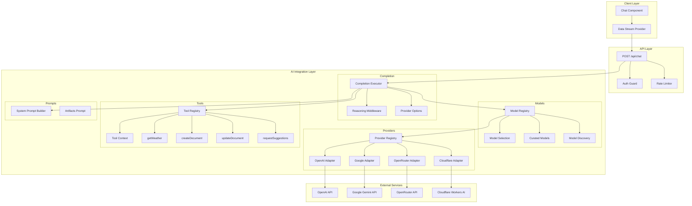
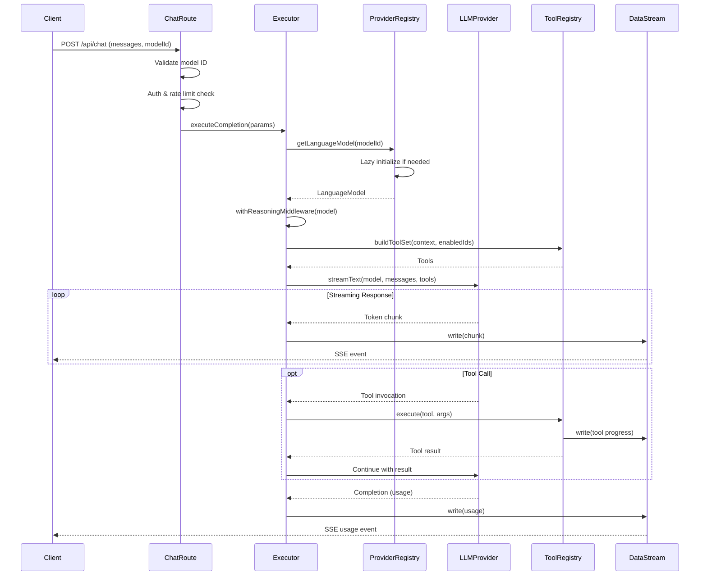
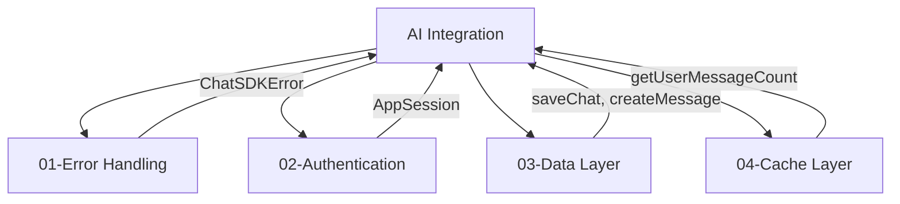

# 05-AI-Integration-Optimal-Design

> **Module**: P1.1 - AI/LLM Integration  
> **Priority**: HIGH (Core Feature)  
> **Status**: DESIGN COMPLETE  
> **Author**: Ouroboros Architect  
> **Date**: 2024-12-17  
> **Depends On**: 01-error-handling, 02-authentication, 03-data-layer, 04-cache-layer

---

## 1. Feature/Module Purpose

**Business Capability**: Multi-provider LLM integration with streaming, tool calling, and usage tracking.

The AI Integration Layer serves three stakeholders:

1. **Users**: Fast streaming responses, multiple model choices, tool interactions (documents, weather)
2. **Developers**: Type-safe model registry, pluggable providers, testable tool system
3. **Operations**: Usage tracking, rate limiting, provider fallbacks, cost management

**Success Criteria**:

- Sub-500ms Time-to-First-Token (TTFT) for streaming responses
- Type-safe model selection across all providers
- Pluggable provider architecture (add providers without code changes)
- Zero client bundle pollution (`"server-only"` enforcement)
- Testable mock provider for test environments
- Graceful degradation when providers fail

---

## 2. Key Requirements

### 2.1 Vercel AI SDK 5.0.26 Integration

| Requirement                  | Description                                    |
| ---------------------------- | ---------------------------------------------- |
| `streamText`                 | Core streaming function with UIMessage support |
| `createProviderRegistry`     | Multi-provider management                      |
| `UIMessageStreamWriter`      | Real-time data streaming to client             |
| `smoothStream`               | Controlled word-by-word streaming              |
| `extractReasoningMiddleware` | Chain-of-thought extraction                    |
| `tool()`                     | Type-safe tool definitions                     |

### 2.2 Provider Support

| Provider              | SDK                           | Environment Variable           | Features                |
| --------------------- | ----------------------------- | ------------------------------ | ----------------------- |
| OpenAI                | `@ai-sdk/openai`              | `OPENAI_API_KEY`               | GPT-4o, o1/o3 reasoning |
| Google                | `@ai-sdk/google`              | `GOOGLE_GENERATIVE_AI_API_KEY` | Gemini 2.5, Gemma 3     |
| Vercel Gateway        | `@ai-sdk/gateway`             | `AI_GATEWAY_API_KEY`           | Multi-provider routing  |
| OpenRouter            | `@openrouter/ai-sdk-provider` | `OPENROUTER_API_KEY`           | 100+ models             |
| Cloudflare Workers AI | `workers-ai-provider`         | `CLOUDFLARE_*`                 | Edge inference          |
| Cloudflare AI Gateway | `ai-gateway-provider`         | `CLOUDFLARE_AI_GATEWAY_*`      | Fallback routing        |

### 2.3 Streaming Requirements

| Requirement         | Description                                         |
| ------------------- | --------------------------------------------------- |
| Server-Sent Events  | HTTP streaming via `createUIMessageStream`          |
| Word-Level Chunking | `smoothStream({ delayInMs: 2, chunking: "word" })`  |
| Reasoning Stream    | Separate `sendReasoning: true` for chain-of-thought |
| Tool Results        | Stream tool invocation and results                  |
| Usage Data          | Stream token counts on completion                   |

### 2.4 Tool System

| Tool                 | Purpose                              | Schema                    |
| -------------------- | ------------------------------------ | ------------------------- |
| `getWeather`         | Weather data retrieval               | `{ latitude, longitude }` |
| `createDocument`     | Create artifacts (code, text, sheet) | `{ title, kind }`         |
| `updateDocument`     | Modify existing artifacts            | `{ id, description }`     |
| `requestSuggestions` | Generate follow-up suggestions       | `{ documentId }`          |

### 2.5 Usage Tracking

| Requirement      | Description                                  |
| ---------------- | -------------------------------------------- |
| Token Counting   | Input/output tokens via `LanguageModelUsage` |
| Cost Calculation | TokenLens integration for pricing            |
| Daily Quotas     | Per-user message limits                      |
| Rate Limiting    | Per-user requests/minute                     |

### 2.6 Reliability

| Requirement       | Description                                     |
| ----------------- | ----------------------------------------------- |
| Timeout           | 55s completion timeout (before 60s maxDuration) |
| Provider Fallback | Cloudflare AI Gateway: primary → flash-lite     |
| Model Validation  | `isValidModelId()` before execution             |
| Error Boundaries  | Structured `ChatSDKError` for AI failures       |

---

## 3. Quick Current State Notes

### 3.1 What Exists

**lib/ai/ Directory (15 files)**

| File                   | Lines   | Purpose                              | Verdict                  |
| ---------------------- | ------- | ------------------------------------ | ------------------------ |
| model-registry.ts      | 363     | Provider registration, model catalog | ⚠️ Good but complex      |
| chat-completion.ts     | 291     | `streamText` execution, tool binding | ✅ Well-structured       |
| providers.ts           | 85      | Mock vs real provider switch         | ⚠️ Tightly coupled       |
| curated-models.ts      | 583     | Static model definitions             | ✅ Good reference data   |
| model-catalog-types.ts | 57      | Type definitions                     | ✅ Clean types           |
| model-discovery.ts     | ?       | Dynamic model discovery              | ✅ Keep                  |
| prompts.ts             | 216     | System prompts, artifacts prompt     | ✅ Clean                 |
| entitlements.ts        | ?       | User type limits                     | ✅ Keep                  |
| tools/\*.ts            | 4 files | Tool implementations                 | ⚠️ Coupled to dataStream |

### 3.2 Architectural Analysis

**Strengths**:

1. **Provider Registry Pattern**: `createProviderRegistry` cleanly abstracts providers
2. **Reasoning Middleware**: Proper chain-of-thought extraction per provider
3. **Model Metadata**: Rich `ModelMetadata` type with capabilities, modalities
4. **Streaming Pipeline**: `UIMessageStreamWriter` + `smoothStream` works well
5. **Test Environment Support**: Mock provider for Playwright tests

**Weaknesses**:

1. **Model ID Coupling**: `providerId:modelId` format leaks through abstractions
2. **Provider Init at Module Load**: Side effects during import
3. **Tool Context Passing**: Session/dataStream threaded through tool factories
4. **No Provider Health Checks**: No detection of degraded providers
5. **Hardcoded Fallback Order**: `defaultModelOrder` array is static

### 3.3 Complexity Patterns

```
model-registry.ts:
├── Lines 1-100:   Provider initialization (side effects!)
├── Lines 100-160: Cloudflare AI Gateway composition
├── Lines 160-210: Catalog merging logic
├── Lines 210-300: Model discovery + refresh
├── Lines 300-363: Query functions (getById, list, etc.)
```

**Issue**: Provider initialization happens at module load, making testing harder.

---

## 4. Optimal Architecture Design

### 4.1 Design Principles

| Principle                      | Implementation                                 |
| ------------------------------ | ---------------------------------------------- |
| **Lazy Initialization**        | Providers initialized on first use, not import |
| **Dependency Injection**       | Tools receive context via factory pattern      |
| **Capability-Based Selection** | Select models by capability, not hardcoded ID  |
| **Provider Abstraction**       | Hide `providerId:modelId` from consumers       |
| **Server-Only Guarantee**      | `"server-only"` at module level                |

### 4.2 Module Structure (Optimal)

```
lib/ai/
├── index.ts                    # Public API re-exports
├── types.ts                    # Consolidated type definitions
├── constants.ts                # Keep as-is
│
├── providers/
│   ├── index.ts                # Provider registry factory
│   ├── registry.ts             # Lazy provider registry
│   ├── adapters/
│   │   ├── openai.ts           # OpenAI adapter
│   │   ├── google.ts           # Google/Gemini adapter
│   │   ├── openrouter.ts       # OpenRouter adapter
│   │   ├── cloudflare.ts       # Cloudflare Workers AI
│   │   └── gateway.ts          # Cloudflare AI Gateway (fallback)
│   └── health.ts               # Provider health tracking
│
├── models/
│   ├── index.ts                # Model registry public API
│   ├── registry.ts             # Model catalog management
│   ├── curated.ts              # Static curated models
│   ├── discovery.ts            # Dynamic model discovery
│   └── selection.ts            # Capability-based model selection
│
├── completion/
│   ├── index.ts                # Chat completion public API
│   ├── executor.ts             # streamText orchestration
│   ├── middleware.ts           # Reasoning extraction middleware
│   ├── options.ts              # Provider-specific options builder
│   └── timeout.ts              # Timeout handling
│
├── tools/
│   ├── index.ts                # Tool registry
│   ├── registry.ts             # Tool discovery and validation
│   ├── context.ts              # Tool execution context
│   ├── definitions/
│   │   ├── weather.ts          # getWeather tool
│   │   ├── document-create.ts  # createDocument tool
│   │   ├── document-update.ts  # updateDocument tool
│   │   └── suggestions.ts      # requestSuggestions tool
│   └── testing.ts              # Mock tools for tests
│
├── prompts/
│   ├── index.ts                # Prompt builder
│   ├── system.ts               # System prompt generation
│   ├── artifacts.ts            # Artifact-specific prompts
│   └── templates.ts            # Prompt templates
│
├── usage/
│   ├── index.ts                # Usage tracking public API
│   ├── tracker.ts              # Token counting, cost calculation
│   └── quota.ts                # Rate limits, daily quotas
│
└── testing/
    ├── mock-provider.ts        # Mock provider for tests
    └── fixtures.ts             # Test model fixtures
```

**Line Count Targets**:
| Module | Max Lines | Responsibility |
|--------|-----------|----------------|
| providers/registry.ts | 150 | Lazy provider initialization |
| providers/adapters/_.ts | 80 each | Provider-specific config |
| models/registry.ts | 200 | Catalog management |
| models/selection.ts | 100 | Capability-based selection |
| completion/executor.ts | 150 | streamText orchestration |
| tools/registry.ts | 100 | Tool management |
| tools/definitions/_.ts | 80 each | Individual tools |

### 4.3 Provider Registry (Lazy Initialization)

```typescript
// lib/ai/providers/registry.ts
import "server-only";
import type { ProviderV2 } from "@ai-sdk/provider";
import { experimental_createProviderRegistry as createProviderRegistry } from "ai";
import { ChatSDKError } from "@/lib/errors";
import { logInfo } from "@/lib/log";

// Provider configuration type
interface ProviderConfig {
  id: string;
  envVars: string[];
  factory: () => ProviderV2 | null;
}

// Provider definitions (declarative, no side effects)
const PROVIDER_CONFIGS: ProviderConfig[] = [
  {
    id: "openai",
    envVars: ["OPENAI_API_KEY"],
    factory: () => {
      const apiKey = process.env.OPENAI_API_KEY;
      if (!apiKey) return null;
      const { createOpenAI } = require("@ai-sdk/openai");
      return createOpenAI({ apiKey }) as ProviderV2;
    },
  },
  {
    id: "google",
    envVars: ["GOOGLE_GENERATIVE_AI_API_KEY", "GEMINI_API_KEY"],
    factory: () => {
      const apiKey =
        process.env.GOOGLE_GENERATIVE_AI_API_KEY ?? process.env.GEMINI_API_KEY;
      if (!apiKey) return null;
      const { createGoogleGenerativeAI } = require("@ai-sdk/google");
      return createGoogleGenerativeAI({ apiKey }) as ProviderV2;
    },
  },
  {
    id: "openrouter",
    envVars: ["OPENROUTER_API_KEY"],
    factory: () => {
      const apiKey = process.env.OPENROUTER_API_KEY;
      if (!apiKey) return null;
      const { createOpenRouter } = require("@openrouter/ai-sdk-provider");
      return createOpenRouter({ apiKey }) as ProviderV2;
    },
  },
  {
    id: "vercel-gateway",
    envVars: ["AI_GATEWAY_API_KEY", "VERCEL_OIDC_TOKEN"],
    factory: () => {
      if (!process.env.AI_GATEWAY_API_KEY && !process.env.VERCEL_OIDC_TOKEN)
        return null;
      const { gateway } = require("@ai-sdk/gateway");
      return gateway as ProviderV2;
    },
  },
];

// Lazy singleton
let registryInstance: ReturnType<typeof createProviderRegistry> | null = null;
let availableProviderIds: Set<string> | null = null;

/**
 * Initialize providers lazily on first use
 */
function initializeRegistry() {
  if (registryInstance) return;

  const providers: Record<string, ProviderV2> = {};
  availableProviderIds = new Set();

  for (const config of PROVIDER_CONFIGS) {
    try {
      const provider = config.factory();
      if (provider) {
        providers[config.id] = provider;
        availableProviderIds.add(config.id);
        logInfo(`[AI] Provider initialized: ${config.id}`);
      }
    } catch (error) {
      logInfo(`[AI] Provider ${config.id} skipped: ${error}`);
    }
  }

  registryInstance = createProviderRegistry(providers);
}

/**
 * Get the provider registry (lazy initialization)
 */
export function getProviderRegistry() {
  initializeRegistry();
  return registryInstance!;
}

/**
 * Check if a provider is available
 */
export function isProviderAvailable(providerId: string): boolean {
  initializeRegistry();
  return availableProviderIds!.has(providerId);
}

/**
 * Get list of available provider IDs
 */
export function getAvailableProviders(): string[] {
  initializeRegistry();
  return Array.from(availableProviderIds!);
}
```

### 4.4 Model Selection (Capability-Based)

```typescript
// lib/ai/models/selection.ts
import "server-only";
import type { ModelCapability, ModelMetadata } from "./types";
import { getModelCatalog } from "./registry";

interface ModelSelectionCriteria {
  capabilities?: ModelCapability[];
  requiredCapabilities?: ModelCapability[]; // Must have ALL
  preferredProviders?: string[];
  maxContextWindow?: number;
  excludeReasoning?: boolean;
}

/**
 * Select best model matching criteria
 * Priority: requiredCapabilities > preferredProviders > first match
 */
export function selectModel(
  criteria: ModelSelectionCriteria
): ModelMetadata | null {
  const catalog = getModelCatalog();

  let candidates = catalog.filter((model) => {
    // Filter by required capabilities
    if (criteria.requiredCapabilities) {
      const hasAll = criteria.requiredCapabilities.every((cap) =>
        model.capabilities.includes(cap)
      );
      if (!hasAll) return false;
    }

    // Filter by optional capabilities (any match)
    if (criteria.capabilities?.length) {
      const hasAny = criteria.capabilities.some((cap) =>
        model.capabilities.includes(cap)
      );
      if (!hasAny) return false;
    }

    // Exclude pure reasoning models if requested
    if (criteria.excludeReasoning) {
      if (
        model.capabilities.length === 1 &&
        model.capabilities[0] === "reasoning"
      ) {
        return false;
      }
    }

    // Context window filter
    if (criteria.maxContextWindow && model.contextWindow) {
      if (model.contextWindow > criteria.maxContextWindow) return false;
    }

    return true;
  });

  // Sort by preferred providers
  if (criteria.preferredProviders?.length) {
    candidates.sort((a, b) => {
      const aIndex = criteria.preferredProviders!.indexOf(a.providerId);
      const bIndex = criteria.preferredProviders!.indexOf(b.providerId);
      const aScore = aIndex === -1 ? Infinity : aIndex;
      const bScore = bIndex === -1 ? Infinity : bIndex;
      return aScore - bScore;
    });
  }

  return candidates[0] ?? null;
}

/**
 * Get default chat model based on availability
 */
export function getDefaultChatModel(): ModelMetadata | null {
  return selectModel({
    requiredCapabilities: ["chat"],
    preferredProviders: ["google", "vercel-gateway", "openai"],
    excludeReasoning: true,
  });
}

/**
 * Get best reasoning model
 */
export function getReasoningModel(): ModelMetadata | null {
  return selectModel({
    requiredCapabilities: ["chat", "reasoning"],
    preferredProviders: ["openai", "google", "openrouter"],
  });
}

/**
 * Get model suitable for tool use
 */
export function getToolingModel(): ModelMetadata | null {
  return selectModel({
    requiredCapabilities: ["chat", "tooling"],
    preferredProviders: ["google", "openai"],
    excludeReasoning: true,
  });
}
```

### 4.5 Tool Context Pattern

```typescript
// lib/ai/tools/context.ts
import "server-only";
import type { UIMessageStreamWriter } from "ai";
import type { AppSession } from "@/lib/auth/session";
import type { ChatMessage } from "@/lib/types";

/**
 * Tool execution context - injected into all tools
 */
export interface ToolContext {
  session: AppSession;
  dataStream: UIMessageStreamWriter<ChatMessage>;
  chatId: string;
}

/**
 * Create tool context for a request
 */
export function createToolContext(
  session: AppSession,
  dataStream: UIMessageStreamWriter<ChatMessage>,
  chatId: string
): ToolContext {
  return { session, dataStream, chatId };
}

// lib/ai/tools/registry.ts
import "server-only";
import type { ToolContext } from "./context";
import type { ModelMetadata } from "../models/types";
import { createWeatherTool } from "./definitions/weather";
import { createDocumentTool } from "./definitions/document-create";
import { updateDocumentTool } from "./definitions/document-update";
import { suggestionsTool } from "./definitions/suggestions";

// Tool IDs as const for type safety
export const TOOL_IDS = [
  "getWeather",
  "createDocument",
  "updateDocument",
  "requestSuggestions",
] as const;

export type ToolId = (typeof TOOL_IDS)[number];

/**
 * Get enabled tool IDs based on model capabilities
 */
export function getEnabledToolIds(model: ModelMetadata | undefined): ToolId[] {
  if (!model) return [];

  // Pure reasoning models: no tools
  if (
    model.capabilities.includes("reasoning") &&
    model.capabilities.length === 1
  ) {
    return [];
  }

  // Gemma models: no tools (limited support)
  if (model.providerId === "google" && model.modelId.startsWith("gemma-")) {
    return [];
  }

  // Tooling capability required
  if (!model.capabilities.includes("tooling")) {
    return [];
  }

  return [...TOOL_IDS];
}

/**
 * Build tool set from context
 */
export function buildToolSet(context: ToolContext, enabledIds: ToolId[]) {
  if (enabledIds.length === 0) return undefined;

  const toolSet: Record<string, unknown> = {};

  for (const id of enabledIds) {
    switch (id) {
      case "getWeather":
        toolSet.getWeather = createWeatherTool();
        break;
      case "createDocument":
        toolSet.createDocument = createDocumentTool(context);
        break;
      case "updateDocument":
        toolSet.updateDocument = updateDocumentTool(context);
        break;
      case "requestSuggestions":
        toolSet.requestSuggestions = suggestionsTool(context);
        break;
    }
  }

  return toolSet;
}
```

### 4.6 Reasoning Middleware Configuration

```typescript
// lib/ai/completion/middleware.ts
import "server-only";
import {
  extractReasoningMiddleware,
  wrapLanguageModel,
  type LanguageModelV2,
} from "ai";
import type { ModelMetadata, ReasoningType } from "../models/types";

/**
 * Map reasoning types to tag names for extraction
 */
const REASONING_TAG_MAP: Record<ReasoningType, string> = {
  "openai-thinking": "think",
  "anthropic-thinking": "thinking",
  "gemini-thinking": "think",
  "deepseek-thinking": "think",
  "internal-thinking": "think",
  none: "",
};

/**
 * Wrap model with reasoning middleware if applicable
 */
export function withReasoningMiddleware(
  model: LanguageModelV2,
  metadata: ModelMetadata | undefined
): LanguageModelV2 {
  if (!metadata?.reasoningType || metadata.reasoningType === "none") {
    return model;
  }

  if (!metadata.capabilities.includes("reasoning")) {
    return model;
  }

  const tagName = REASONING_TAG_MAP[metadata.reasoningType];
  if (!tagName) return model;

  return wrapLanguageModel({
    model,
    middleware: extractReasoningMiddleware({ tagName }),
  });
}

// lib/ai/completion/options.ts
import "server-only";
import type { ModelMetadata } from "../models/types";

type ProviderOptions = Record<string, Record<string, unknown>>;

/**
 * Build provider-specific options for reasoning models
 */
export function buildProviderOptions(
  model: ModelMetadata | undefined
): ProviderOptions {
  const options: ProviderOptions = {};

  if (!model?.reasoningType || model.reasoningType === "none") {
    return options;
  }

  switch (model.reasoningType) {
    case "openai-thinking":
      options.openai = { reasoningEffort: "high" };
      break;

    case "anthropic-thinking":
      options.anthropic = {
        thinkingBudget: model.thinkingBudget ?? 8000,
      };
      break;

    case "gemini-thinking":
      options.google = {
        thinkingConfig: {
          type: "enabled",
          includeThoughts: true,
          budgetTokens: model.thinkingBudget ?? 1024,
        },
      };
      break;

    case "deepseek-thinking":
      options.deepseek = { reasoningLevel: "high" };
      break;

    case "internal-thinking":
      options.reasoning = {
        enabled: true,
        budget: model.thinkingBudget ?? 6000,
      };
      break;
  }

  return options;
}
```

### 4.7 Streaming Pipeline

```typescript
// lib/ai/completion/executor.ts
import "server-only";
import {
  convertToModelMessages,
  smoothStream,
  stepCountIs,
  streamText,
  type UIMessage,
  type UIMessageStreamWriter,
} from "ai";
import type { ChatMessage } from "@/lib/types";
import type { AppSession } from "@/lib/auth/session";
import { getModelById, getLanguageModel } from "../models/registry";
import { buildProviderOptions } from "./options";
import { withReasoningMiddleware } from "./middleware";
import { createToolContext } from "../tools/context";
import { getEnabledToolIds, buildToolSet } from "../tools/registry";
import { systemPrompt, type RequestHints } from "../prompts";

const AI_COMPLETION_TIMEOUT_MS = 55_000;

export interface CompletionParams {
  modelId: string;
  messages: UIMessage[];
  chatId: string;
  session: AppSession;
  dataStream: UIMessageStreamWriter<ChatMessage>;
  requestHints: RequestHints;
  settings?: {
    systemPrompt?: string;
    sampling?: {
      temperature?: number;
      topP?: number;
      maxOutputTokens?: number;
    };
  };
  onUsage?: (usage: unknown) => void;
}

/**
 * Execute streaming chat completion
 */
export function executeCompletion(params: CompletionParams) {
  const {
    modelId,
    messages,
    chatId,
    session,
    dataStream,
    requestHints,
    settings,
    onUsage,
  } = params;

  // Get model metadata and language model
  const metadata = getModelById(modelId);
  const baseModel = getLanguageModel(modelId);
  const model = withReasoningMiddleware(baseModel, metadata);

  // Build tool set if model supports tooling
  const toolContext = createToolContext(session, dataStream, chatId);
  const enabledTools = getEnabledToolIds(metadata);
  const tools = buildToolSet(toolContext, enabledTools);

  // Build provider options for reasoning models
  const providerOptions = buildProviderOptions(metadata);

  // Execute streaming
  const result = streamText({
    model,
    system: systemPrompt({
      selectedChatModel: modelId,
      requestHints,
      selectedModel: metadata,
      userSystemPrompt: settings?.systemPrompt,
    }),
    messages: convertToModelMessages(messages),
    tools,
    experimental_activeTools: enabledTools,
    experimental_transform: smoothStream({
      delayInMs: 2,
      chunking: "word",
    }),
    stopWhen: stepCountIs(5),
    abortSignal: AbortSignal.timeout(AI_COMPLETION_TIMEOUT_MS),
    temperature: settings?.sampling?.temperature,
    topP: settings?.sampling?.topP,
    maxOutputTokens: settings?.sampling?.maxOutputTokens,
    ...(Object.keys(providerOptions).length > 0 ? { providerOptions } : {}),
    experimental_telemetry: {
      isEnabled: true,
      functionId: "chat-stream-text",
      recordInputs: true,
      recordOutputs: true,
    },
    onFinish: async ({ usage }) => {
      onUsage?.(usage);
    },
  });

  // Consume and merge streams
  result.consumeStream();
  dataStream.merge(result.toUIMessageStream({ sendReasoning: true }));

  return result;
}
```

### 4.8 Component Diagram



### 4.9 Data Flow Diagram



---

## 5. Technology Stack

### 5.1 Core Dependencies

| Package                       | Version | Purpose                 |
| ----------------------------- | ------- | ----------------------- |
| `ai`                          | 5.0.26  | Vercel AI SDK core      |
| `@ai-sdk/react`               | 2.0.26  | React hooks (useChat)   |
| `@ai-sdk/openai`              | 2.0.54  | OpenAI provider         |
| `@ai-sdk/google`              | 2.0.24  | Google/Gemini provider  |
| `@ai-sdk/gateway`             | 1.0.15  | Vercel Gateway provider |
| `@ai-sdk/provider`            | 2.0.0   | Provider interface      |
| `@openrouter/ai-sdk-provider` | 1.2.0   | OpenRouter provider     |
| `workers-ai-provider`         | -       | Cloudflare Workers AI   |
| `ai-gateway-provider`         | 2.0.1   | Cloudflare AI Gateway   |
| `tokenlens`                   | -       | Usage & cost tracking   |

### 5.2 Next.js 16 Features

| Feature        | Usage                          |
| -------------- | ------------------------------ |
| Route Handlers | `app/(chat)/api/chat/route.ts` |
| Streaming      | `createUIMessageStream` + SSE  |
| `use cache`    | TokenLens catalog caching      |
| `maxDuration`  | 60s function timeout           |
| Edge Runtime   | Optional for chat route        |

### 5.3 Runtime Considerations

| Consideration   | Decision                                |
| --------------- | --------------------------------------- |
| Default Runtime | Node.js (tool system needs file access) |
| Edge Optional   | Can enable for latency-sensitive routes |
| Streaming       | Server-Sent Events via HTTP             |
| Timeout         | 55s completion, 60s route max           |

---

## 6. Bundle Strategy

### 6.1 Server-Only Enforcement

```typescript
// lib/ai/index.ts
import "server-only";

// Re-export only server-side APIs
export { executeCompletion } from "./completion/executor";
export { getModelById, listChatModels } from "./models/registry";
export { selectModel, getDefaultChatModel } from "./models/selection";
export type { ModelMetadata, ModelCapability } from "./models/types";
```

### 6.2 Client-Safe Types

```typescript
// lib/ai/types/client.ts
// Safe to import on client - types only, no runtime code

export type ChatModelInfo = {
  id: string;
  name: string;
  description: string;
};

export type ModelCapabilityFlag = {
  chat: boolean;
  reasoning: boolean;
  vision: boolean;
  tooling: boolean;
};
```

### 6.3 API Route Exports

```typescript
// app/(chat)/api/models/route.ts
import { listChatModels } from "@/lib/ai";

export async function GET() {
  const models = listChatModels().map(({ id, name, description }) => ({
    id,
    name,
    description,
  }));
  return Response.json(models);
}
```

---

## 7. Dependencies on Other Modules

### 7.1 Module Dependencies



### 7.2 Dependency Details

| Dependency     | Interface                       | Usage                                              |
| -------------- | ------------------------------- | -------------------------------------------------- |
| Error Handling | `ChatSDKError`                  | `bad_request:api:invalid_model_id`, timeout errors |
| Authentication | `AppSession`, `getAppSession()` | User context for tools                             |
| Data Layer     | `chatData`, `saveChat`          | Persist AI responses                               |
| Cache Layer    | `getUserMessageCount`           | Daily quota checks                                 |

---

## 8. Public Interface

### 8.1 Completion API

```typescript
// Primary completion function
export function executeCompletion(params: CompletionParams): StreamTextResult;

// Params type
interface CompletionParams {
  modelId: string;
  messages: UIMessage[];
  chatId: string;
  session: AppSession;
  dataStream: UIMessageStreamWriter<ChatMessage>;
  requestHints: RequestHints;
  settings?: CompletionSettings;
  onUsage?: (usage: AppUsage) => void;
}
```

### 8.2 Model Registry API

```typescript
// Get model by ID
export function getModelById(id: string): ModelMetadata | undefined;

// List all chat-capable models
export function listChatModels(): ModelMetadata[];

// Validate model ID
export function isValidModelId(id: string): boolean;

// Get language model for provider registry
export function getLanguageModel(id: string): LanguageModelV2;

// Refresh model catalog
export function refreshModelCatalog(opts?: {
  force?: boolean;
}): Promise<RefreshResult>;
```

### 8.3 Model Selection API

```typescript
// Select model by criteria
export function selectModel(
  criteria: ModelSelectionCriteria
): ModelMetadata | null;

// Convenience selectors
export function getDefaultChatModel(): ModelMetadata | null;
export function getReasoningModel(): ModelMetadata | null;
export function getToolingModel(): ModelMetadata | null;
```

### 8.4 Tool Registry API

```typescript
// Get enabled tools for model
export function getEnabledToolIds(model: ModelMetadata | undefined): ToolId[];

// Build tool set with context
export function buildToolSet(
  context: ToolContext,
  enabledIds: ToolId[]
): ToolSet | undefined;
```

---

## 9. Performance Optimizations

### 9.1 Streaming Optimizations

| Optimization            | Implementation                                     |
| ----------------------- | -------------------------------------------------- |
| Word-Level Chunking     | `smoothStream({ chunking: "word", delayInMs: 2 })` |
| Parallel Tool Execution | `stepCountIs(5)` allows multi-step                 |
| Early Stream Start      | `result.consumeStream()` before merge              |
| Backpressure            | Automatic via `UIMessageStreamWriter`              |

### 9.2 Provider Optimizations

| Optimization        | Implementation                         |
| ------------------- | -------------------------------------- |
| Lazy Initialization | Providers init on first use            |
| Connection Reuse    | SDK handles HTTP/2 multiplexing        |
| Provider Fallback   | AI Gateway: primary → flash-lite       |
| Health Tracking     | Circuit breaker for degraded providers |

### 9.3 Caching Strategy

| Cache Target      | Strategy                          | TTL                  |
| ----------------- | --------------------------------- | -------------------- |
| TokenLens Catalog | `use cache` + `cacheLife("days")` | ~24h                 |
| Model Catalog     | In-memory singleton               | Until refresh        |
| Provider Registry | In-memory singleton               | Application lifetime |

### 9.4 Memory Optimizations

| Optimization      | Implementation                        |
| ----------------- | ------------------------------------- |
| Catalog Filtering | Filter by available providers at load |
| Model Selection   | Return reference, not copy            |
| Tool Instances    | Create per-request, not global        |

---

## 10. Implementation Phases

### Phase 1: Provider Restructure (Week 1)

1. Extract provider configs to `providers/adapters/`
2. Implement lazy initialization in `providers/registry.ts`
3. Add provider health tracking
4. Update tests for new structure

### Phase 2: Model Registry Cleanup (Week 1-2)

1. Split `model-registry.ts` into focused modules
2. Implement capability-based selection
3. Consolidate type definitions
4. Add model validation utilities

### Phase 3: Tool System Refactor (Week 2)

1. Extract tool context pattern
2. Move tools to `tools/definitions/`
3. Implement tool registry
4. Add tool testing utilities

### Phase 4: Completion Pipeline (Week 2-3)

1. Extract middleware configuration
2. Implement provider options builder
3. Consolidate streaming logic
4. Add timeout/abort handling

### Phase 5: Public API Finalization (Week 3)

1. Create clean `index.ts` exports
2. Document public interfaces
3. Add client-safe type exports
4. Integration testing

---

## 11. Alternatives Considered

### ALT-001: Edge Runtime for Chat

**Description**: Run chat completion on Edge runtime for lower latency.

**Rejected Because**:

- Tool system requires Node.js APIs (file operations for documents)
- Provider SDKs not all Edge-compatible
- Complex workaround needed for artifact tools
- Marginal latency benefit vs. complexity cost

### ALT-002: Global Tool Instances

**Description**: Create tool instances once at module load instead of per-request.

**Rejected Because**:

- Tools need request-specific context (session, dataStream, chatId)
- Global state causes issues with concurrent requests
- Memory leaks from stale dataStream references
- Factory pattern is cleaner and safer

### ALT-003: GraphQL for Model Selection

**Description**: Use GraphQL API for client model selection.

**Rejected Because**:

- Over-engineering for simple list/select operations
- Additional dependency and complexity
- REST endpoint sufficient for current needs
- Type safety already achieved with TypeScript

---

## 12. Success Metrics

| Metric                    | Target            | Measurement             |
| ------------------------- | ----------------- | ----------------------- |
| Time-to-First-Token       | <500ms (p95)      | OpenTelemetry spans     |
| Streaming Latency         | <50ms inter-chunk | Client-side measurement |
| Provider Fallback Success | >99%              | AI Gateway metrics      |
| Tool Execution Time       | <2s per tool      | OpenTelemetry spans     |
| Bundle Size (client)      | 0 KB AI code      | Bundle analyzer         |
| Test Coverage             | >80%              | Jest coverage report    |

---

## 13. References

- [Vercel AI SDK 5.0 Documentation](https://sdk.vercel.ai/docs)
- [01-error-handling-optimal-design.md](./01-error-handling-optimal-design.md)
- [02-authentication-optimal-design.md](./02-authentication-optimal-design.md)
- [03-data-layer-optimal-design.md](./03-data-layer-optimal-design.md)
- [04-cache-layer-optimal-design.md](./04-cache-layer-optimal-design.md)
