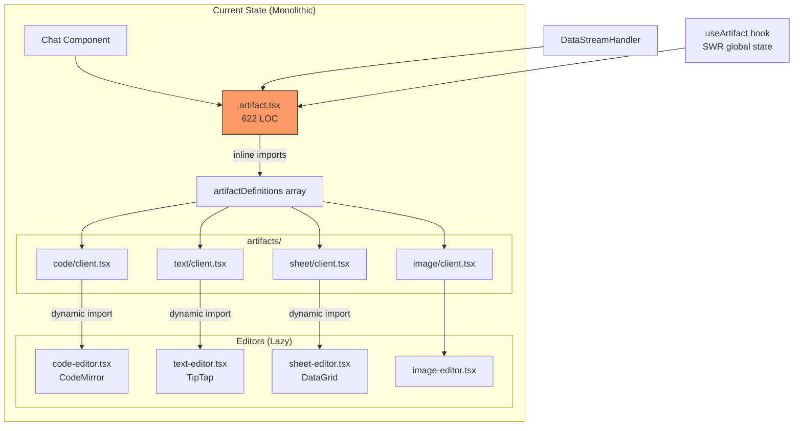
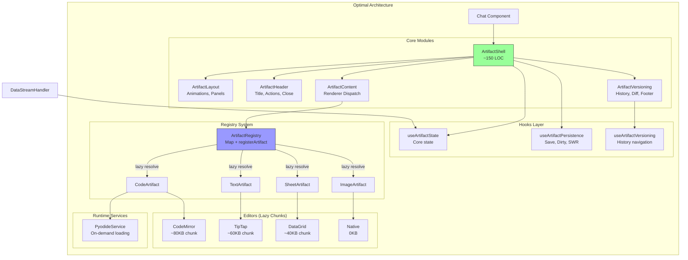
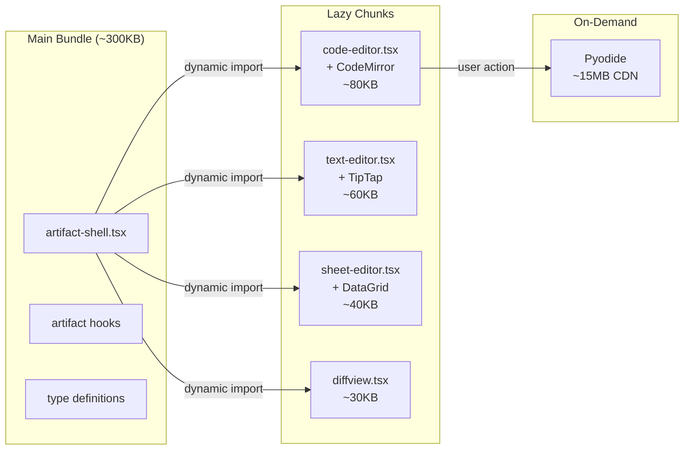
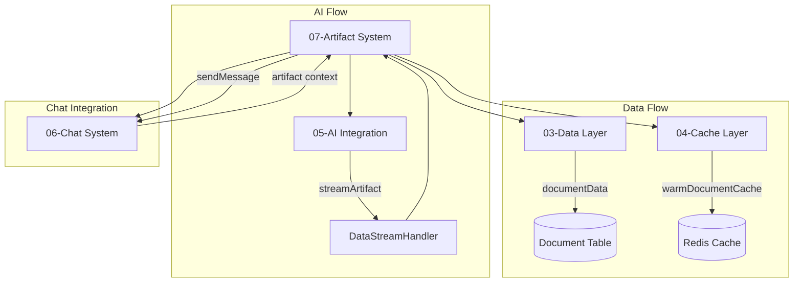

# 07-Artifact-System-Optimal-Design

> **Module**: P1.3 - Artifact System  
> **Priority**: HIGH (Core Feature)  
> **Status**: DESIGN COMPLETE  
> **Author**: Ouroboros Architect  
> **Date**: 2024-12-17  
> **Depends On**: 03-data-layer, 04-cache-layer, 05-ai-integration, 06-chat-system

---

## 1. Feature/Module Purpose

**Business Capability**: Multi-modal artifact editing system supporting code, text, images, and spreadsheets with real-time streaming, versioning, and persistence.

The Artifact System serves three stakeholders:
1. **Users**: Create, edit, preview, and version artifacts (code, documents, images, spreadsheets) generated by AI or manually edited
2. **Developers**: Extensible plugin architecture for adding new artifact types, lazy-loaded editors, type-safe content handling
3. **Operations**: Observable artifact lifecycle, efficient bundle sizes, error isolation per artifact type

**Success Criteria**:
- Sub-200ms artifact panel open animation
- Lazy-loaded editors (CodeMirror, TipTap, etc.) - no blocking initial load
- Streaming content updates without UI jank
- Version history with diff viewing
- Graceful error recovery per artifact type (one broken editor doesn't crash others)
- <100KB per editor chunk (excluding shared dependencies)

---

## 2. Key Requirements

### 2.1 Artifact Type System

| Requirement | Description |
|-------------|-------------|
| Multi-Type Support | Code, Text, Image, Sheet artifact types |
| Plugin Architecture | `Artifact<Kind, Metadata>` class for type-safe registration |
| Type-Specific Actions | Per-type toolbar and actions (run code, copy, diff) |
| Metadata Extensions | Custom metadata per type (console outputs, suggestions) |

### 2.2 Artifact Rendering Pipeline

| Requirement | Description |
|-------------|-------------|
| Lazy Loading | Dynamic imports for all editors (CodeMirror, TipTap, DataGrid) |
| Stream Processing | Real-time content updates via `DataStreamHandler` |
| Error Boundary | Per-artifact error isolation with `ArtifactErrorBoundary` |
| Animation | Smooth expand/collapse with Framer Motion |

### 2.3 Editor Integration

| Requirement | Description |
|-------------|-------------|
| Code Editor | CodeMirror 6 with Python syntax, dark theme, streaming support |
| Text Editor | TipTap with Markdown, math (KaTeX), tables, suggestions |
| Image Editor | Base64 display with loading states |
| Sheet Editor | react-data-grid with CSV parsing, 50+ rows |

### 2.4 Versioning & Persistence

| Requirement | Description |
|-------------|-------------|
| Version History | Multiple versions per document, navigate prev/next |
| Diff View | Side-by-side comparison between versions |
| Auto-Save | Debounced saves (2s) with dirty state tracking |
| Cache Strategy | SWR for document fetching, optimistic updates |

### 2.5 Artifact Actions

| Requirement | Description |
|-------------|-------------|
| Code Execution | Python execution via Pyodide (lazy-loaded) |
| Copy Actions | Type-specific clipboard (code, CSV, image) |
| Version Navigation | Prev/next/latest version controls |
| AI Interactions | Send artifact context to chat for modifications |

---

## 3. Quick Current State Notes

### 3.1 What Exists

**Component Inventory**

| File | Lines | Purpose | Verdict |
|------|-------|---------|---------|
| artifact.tsx | 622 | Main artifact orchestrator | ⚠️ **NEEDS REFACTORING** - mixed concerns |
| create-artifact.tsx | 92 | Artifact plugin class definition | ✅ Clean plugin pattern |
| artifact-actions.tsx | ~100 | Toolbar action rendering | ✅ Good separation |
| artifact-error-boundary.tsx | ~50 | Error isolation | ✅ Proper boundary |
| artifact-messages.tsx | ~150 | Side panel messages | ✅ Reasonable |
| artifact-close-button.tsx | ~30 | Close interaction | ✅ Simple |
| use-artifact.ts | 153 | Global artifact state (SWR) | ✅ Clean state pattern |
| data-stream-handler.tsx | 111 | Stream processing | ✅ Well-structured |

**Artifact Type Files**

| Path | Lines | Purpose | Verdict |
|------|-------|---------|---------|
| artifacts/code/client.tsx | 354 | Code artifact definition | ⚠️ Large, Pyodide logic mixed |
| artifacts/text/client.tsx | 203 | Text artifact definition | ✅ Clean |
| artifacts/image/client.tsx | 75 | Image artifact definition | ✅ Simple |
| artifacts/sheet/client.tsx | 133 | Sheet artifact definition | ✅ Reasonable |

**Editor Components**

| File | Lines | Technology | Verdict |
|------|-------|------------|---------|
| code-editor.tsx | 189 | CodeMirror 6 | ✅ Good lazy loading |
| text-editor.tsx | 162 | TipTap | ✅ Proper extensions |
| image-editor.tsx | 52 | Native img | ✅ Simple |
| sheet-editor.tsx | 162 | react-data-grid | ✅ Memoized |
| diffview.tsx | ~100 | TipTap diff | ✅ Lazy loaded |

### 3.2 Current Architecture Diagram



### 3.3 Key Issues

| Issue | Impact | Location |
|-------|--------|----------|
| **622 LOC monolith** | Hard to maintain, test | artifact.tsx |
| **Mixed responsibilities** | Versioning + rendering + animations + save logic | artifact.tsx |
| **Pyodide inline** | Runtime loading logic in component | code/client.tsx |
| **No registry pattern** | Static array, no dynamic registration | artifact.tsx:35-40 |
| **Tight coupling** | Artifact state spread across many hooks | Multiple files |
| **No loading skeletons** | Editors show brief flash | Dynamic imports |

---

## 4. Optimal Architecture Design

### 4.1 Design Decision: Plugin Registry with Lazy Loading

**Status:** Proposed  
**Date:** 2024-12-17

#### Context

The current artifact system works but has maintainability issues:
- artifact.tsx at 622 LOC combines versioning, animations, persistence, and rendering
- No clear separation between artifact "shell" and content rendering
- Adding new artifact types requires modifying the core file
- Pyodide loading logic is embedded in component code

#### Decision: Decomposed Architecture with Registry Pattern

Split artifact.tsx into focused modules with a centralized artifact registry.

#### Consequences

**Positive**
- **POS-001**: Each module <200 LOC, testable in isolation
- **POS-002**: New artifact types register via `registerArtifact()` without core changes
- **POS-003**: Version/persistence logic reusable across all artifact types
- **POS-004**: Clear bundle boundaries for code splitting

**Negative**
- **NEG-001**: More files to navigate (mitigated by clear naming)
- **NEG-002**: Registry pattern adds indirection (acceptable for extensibility)

### 4.2 Target Architecture



### 4.3 Module Breakdown

#### 4.3.1 ArtifactShell (Main Orchestrator)

```typescript
// components/artifact/artifact-shell.tsx (~150 LOC)
export function ArtifactShell({
  chatId,
  messages,
  sendMessage,
  // ... minimal props
}: ArtifactShellProps) {
  const { artifact, isVisible } = useArtifactState();
  const { document, saveContent, isContentDirty } = useArtifactPersistence(artifact.documentId);
  const versioning = useArtifactVersioning(artifact.documentId);
  
  if (!isVisible) return null;
  
  return (
    <ArtifactLayout isVisible={isVisible} boundingBox={artifact.boundingBox}>
      <ArtifactHeader
        title={artifact.title}
        isDirty={isContentDirty}
        document={document}
        onClose={closeArtifact}
      />
      <ArtifactContent
        kind={artifact.kind}
        content={versioning.isCurrentVersion ? artifact.content : versioning.versionContent}
        onSave={saveContent}
        metadata={metadata}
      />
      {!versioning.isCurrentVersion && (
        <ArtifactVersionFooter {...versioning} />
      )}
    </ArtifactLayout>
  );
}
```

#### 4.3.2 Artifact Registry Pattern

```typescript
// lib/artifacts/registry.ts
import type { ArtifactDefinition } from './types';

const artifactRegistry = new Map<string, () => Promise<ArtifactDefinition>>();

export function registerArtifact(
  kind: string, 
  loader: () => Promise<ArtifactDefinition>
) {
  artifactRegistry.set(kind, loader);
}

export async function getArtifactDefinition(kind: string): Promise<ArtifactDefinition> {
  const loader = artifactRegistry.get(kind);
  if (!loader) {
    // Fallback to text artifact
    return (await import('@/artifacts/text/client')).textArtifact;
  }
  return loader();
}

// Register built-in artifacts
registerArtifact('code', () => import('@/artifacts/code/client').then(m => m.codeArtifact));
registerArtifact('text', () => import('@/artifacts/text/client').then(m => m.textArtifact));
registerArtifact('image', () => import('@/artifacts/image/client').then(m => m.imageArtifact));
registerArtifact('sheet', () => import('@/artifacts/sheet/client').then(m => m.sheetArtifact));
```

#### 4.3.3 Hooks Decomposition

```typescript
// hooks/use-artifact-state.ts - Core UI state
export function useArtifactState() {
  const { data: artifact, mutate } = useSWR<UIArtifact>('artifact', null, {
    fallbackData: initialArtifactData,
  });
  
  const setArtifact = useCallback((updater) => {
    mutate(current => typeof updater === 'function' ? updater(current) : updater, false);
  }, [mutate]);
  
  const closeArtifact = useCallback(() => {
    setArtifact(current => ({ ...current, isVisible: false }));
  }, [setArtifact]);
  
  return { artifact, setArtifact, closeArtifact, isVisible: artifact?.isVisible };
}

// hooks/use-artifact-persistence.ts - Save/load logic
export function useArtifactPersistence(documentId: string) {
  const { data: documents, mutate } = useSWR<Document[]>(
    documentId !== 'init' ? `/api/document?id=${documentId}` : null,
    fetcher
  );
  
  const [isContentDirty, setIsContentDirty] = useState(false);
  const pendingSaveRef = useRef<AbortController | null>(null);
  
  const saveContent = useCallback(async (content: string, debounce: boolean) => {
    // ... save logic extracted from artifact.tsx
  }, [documentId, mutate]);
  
  const document = documents?.at(-1) ?? null;
  
  return { document, documents, saveContent, isContentDirty };
}

// hooks/use-artifact-versioning.ts - Version navigation
export function useArtifactVersioning(documentId: string) {
  const { documents } = useArtifactPersistence(documentId);
  const [currentVersionIndex, setCurrentVersionIndex] = useState(-1);
  const [mode, setMode] = useState<'edit' | 'diff'>('edit');
  
  // Auto-set to latest when documents load
  useEffect(() => {
    if (documents?.length) {
      setCurrentVersionIndex(documents.length - 1);
    }
  }, [documents?.length]);
  
  const isCurrentVersion = !documents?.length || currentVersionIndex === documents.length - 1;
  
  const navigate = useCallback((direction: 'prev' | 'next' | 'latest') => {
    // ... navigation logic
  }, [documents?.length, currentVersionIndex]);
  
  const versionContent = documents?.[currentVersionIndex]?.content ?? '';
  
  return { currentVersionIndex, isCurrentVersion, mode, setMode, navigate, versionContent };
}
```

#### 4.3.4 Editor Lazy Loading Pattern

```typescript
// components/artifact/artifact-content.tsx
import { Suspense, lazy, useMemo } from 'react';
import { ArtifactSkeleton } from './artifact-skeleton';

const editorLoaders = {
  code: lazy(() => import('@/components/code-editor').then(m => ({ default: m.CodeEditor }))),
  text: lazy(() => import('@/components/text-editor').then(m => ({ default: m.Editor }))),
  sheet: lazy(() => import('@/components/sheet-editor').then(m => ({ default: m.SpreadsheetEditor }))),
  image: lazy(() => import('@/components/image-editor').then(m => ({ default: m.ImageEditor }))),
};

export function ArtifactContent({ kind, content, onSave, metadata, ...props }: ArtifactContentProps) {
  const EditorComponent = useMemo(() => editorLoaders[kind] ?? editorLoaders.text, [kind]);
  
  return (
    <ArtifactErrorBoundary fallback={<ArtifactErrorFallback kind={kind} />}>
      <Suspense fallback={<ArtifactSkeleton kind={kind} />}>
        <EditorComponent
          content={content}
          onSaveContent={onSave}
          metadata={metadata}
          {...props}
        />
      </Suspense>
    </ArtifactErrorBoundary>
  );
}
```

#### 4.3.5 Pyodide Service Extraction

```typescript
// lib/artifacts/pyodide-service.ts
type PyodideInstance = any; // Pyodide types

class PyodideService {
  private instance: PyodideInstance | null = null;
  private loadPromise: Promise<PyodideInstance> | null = null;
  
  async load(): Promise<PyodideInstance> {
    if (this.instance) return this.instance;
    if (this.loadPromise) return this.loadPromise;
    
    this.loadPromise = this.initPyodide();
    this.instance = await this.loadPromise;
    return this.instance;
  }
  
  private async initPyodide(): Promise<PyodideInstance> {
    // Load script tag
    await this.loadScript('https://cdn.jsdelivr.net/pyodide/v0.23.4/full/pyodide.js');
    
    // Initialize Pyodide
    const win = window as any;
    const pyodide = await win.loadPyodide({
      indexURL: 'https://cdn.jsdelivr.net/pyodide/v0.23.4/full/',
    });
    
    return pyodide;
  }
  
  async execute(code: string, handlers: string[]): Promise<ExecutionResult> {
    const pyodide = await this.load();
    
    // Setup output handlers
    for (const handler of handlers) {
      await pyodide.runPythonAsync(OUTPUT_HANDLERS[handler]);
    }
    
    // Execute code
    try {
      const result = await pyodide.runPythonAsync(code);
      return { success: true, output: result };
    } catch (error) {
      return { success: false, error: String(error) };
    }
  }
  
  private loadScript(src: string): Promise<void> {
    return new Promise((resolve, reject) => {
      if ((window as any).loadPyodide) {
        resolve();
        return;
      }
      const script = document.createElement('script');
      script.src = src;
      script.onload = () => resolve();
      script.onerror = reject;
      document.head.appendChild(script);
    });
  }
}

export const pyodideService = new PyodideService();
```

---

## 5. Technology Stack

### 5.1 Editor Technologies

| Artifact Type | Editor | Bundle Size | Notes |
|---------------|--------|-------------|-------|
| Code | CodeMirror 6 | ~80KB | Python syntax, One Dark theme |
| Text | TipTap + ProseMirror | ~60KB | Markdown, KaTeX math, tables |
| Sheet | react-data-grid | ~40KB | CSV parsing, virtual scrolling |
| Image | Native `` | 0KB | Base64 display only |

### 5.2 State Management

| Concern | Technology | Rationale |
|---------|------------|-----------|
| Global artifact state | SWR (null fetcher) | Cross-component sync, no server fetch |
| Document data | SWR (API fetcher) | Auto-revalidation, optimistic updates |
| Local editor state | React useState | Editor-specific, no sharing needed |
| Dirty tracking | useRef + useState | Avoid re-renders during typing |

### 5.3 Animation

| Feature | Technology | Notes |
|---------|------------|-------|
| Panel open/close | Framer Motion | Spring physics, exit animations |
| Version overlay | AnimatePresence | Conditional rendering with fade |
| Streaming indicator | CSS animation | Simple pulse, no JS overhead |

---

## 6. Bundle Strategy

### 6.1 Code Splitting Plan



### 6.2 Loading Strategy

| Resource | Strategy | Trigger |
|----------|----------|---------|
| ArtifactShell | Eager (main bundle) | App load |
| Editor components | Lazy (Suspense) | Artifact opens |
| Pyodide | On-demand (CDN) | "Run Code" clicked |
| Diff view | Lazy (Suspense) | Version compare |

### 6.3 Preloading Hints

```typescript
// Preload likely-needed editors based on artifact kind
useEffect(() => {
  if (artifact.kind === 'code') {
    // Preload code editor when artifact metadata hints code
    import('@/components/code-editor');
  }
}, [artifact.kind]);
```

---

## 7. Simplifications vs Current

### 7.1 What Gets Simpler

| Current | Proposed | Benefit |
|---------|----------|---------|
| 622 LOC artifact.tsx | 5 modules ~150 LOC each | Testable, maintainable |
| Inline Pyodide loading | PyodideService class | Reusable, cacheable |
| Static artifact array | Registry + lazy loaders | Extensible, tree-shakeable |
| Mixed save logic | useArtifactPersistence hook | Single responsibility |
| Scattered version state | useArtifactVersioning hook | Centralized history logic |

### 7.2 Removed Complexity

| Removed | Rationale |
|---------|-----------|
| N/A | Current implementation is functional, just poorly organized |

### 7.3 Preserved Patterns

| Pattern | Reason to Keep |
|---------|----------------|
| SWR for document caching | Excellent cache invalidation |
| Debounced saves (2s) | Prevents API spam |
| Error boundary per artifact | Isolation working well |
| Framer Motion animations | Smooth UX, already integrated |
| Dynamic imports for editors | Already implemented correctly |

---

## 8. Dependencies

### 8.1 Module Dependencies



### 8.2 External Dependencies

| Dependency | Version | Purpose |
|------------|---------|---------|
| @codemirror/* | ^6.x | Code editing |
| @tiptap/* | ^2.x | Rich text editing |
| react-data-grid | ^7.x | Spreadsheet grid |
| framer-motion | ^11.x | Animations |
| papaparse | ^5.x | CSV parsing |
| pyodide (CDN) | 0.23.4 | Python execution |

### 8.3 Internal Module Interfaces

```typescript
// From 03-Data Layer
import { documentData } from '@/lib/data/document';
// Used for: get(), getAll(), save() document operations

// From 04-Cache Layer  
import { warmDocumentCache } from '@/lib/cache/operations';
// Used for: Background cache warming after DB fetch

// From 05-AI Integration
import type { CustomUIDataTypes } from '@/lib/types';
// Used for: DataUIPart stream typing

// From 06-Chat System
import { useDataStream } from '@/components/data-stream-provider';
// Used for: Receiving artifact stream updates
```

---

## 9. Public Interface

### 9.1 Component Exports

```typescript
// components/artifact/index.ts
export { ArtifactShell } from './artifact-shell';
export { ArtifactContent } from './artifact-content';
export { ArtifactSkeleton } from './artifact-skeleton';
export type { UIArtifact, ArtifactKind } from './types';
```

### 9.2 Hook Exports

```typescript
// hooks/index.ts (artifact-related)
export { useArtifactState } from './use-artifact-state';
export { useArtifactPersistence } from './use-artifact-persistence';
export { useArtifactVersioning } from './use-artifact-versioning';
export { useArtifactSelector } from './use-artifact-selector';
```

### 9.3 Registry Exports

```typescript
// lib/artifacts/index.ts
export { registerArtifact, getArtifactDefinition } from './registry';
export { Artifact } from './artifact-class';
export type { ArtifactDefinition, ArtifactConfig } from './types';
```

### 9.4 Type Definitions

```typescript
// lib/artifacts/types.ts
export type ArtifactKind = 'code' | 'text' | 'image' | 'sheet';

export type UIArtifact = {
  title: string;
  documentId: string;
  kind: ArtifactKind;
  content: string;
  isVisible: boolean;
  status: 'streaming' | 'idle';
  boundingBox: {
    top: number;
    left: number;
    width: number;
    height: number;
  };
};

export type ArtifactDefinition<M = any> = {
  kind: ArtifactKind;
  description: string;
  content: ComponentType<ArtifactContentProps<M>>;
  actions: ArtifactAction<M>[];
  toolbar: ArtifactToolbarItem[];
  initialize?: (params: InitializeParams<M>) => void | Promise<void>;
  onStreamPart: (args: StreamPartArgs<M>) => void;
};

export type ArtifactContentProps<M = any> = {
  title: string;
  content: string;
  mode: 'edit' | 'diff';
  isCurrentVersion: boolean;
  currentVersionIndex: number;
  status: 'streaming' | 'idle';
  onSaveContent: (content: string, debounce: boolean) => void;
  isLoading: boolean;
  metadata: M;
  setMetadata: Dispatch<SetStateAction<M>>;
};
```

---

## 10. Performance Optimizations

### 10.1 Virtualization

| Component | Strategy | Threshold |
|-----------|----------|-----------|
| Sheet Editor | react-data-grid virtual | Always (50+ rows) |
| Code Editor | CodeMirror built-in | Lines > viewport |
| Text Editor | TipTap lazy render | Large documents |

### 10.2 Lazy Rendering

```typescript
// Only render artifact content when visible
const ArtifactContent = memo(({ kind, content, ...props }) => {
  // Intersection observer for viewport entry
  const [isInViewport, ref] = useInView({ threshold: 0.1 });
  
  if (!isInViewport) {
    return <div ref={ref}><ArtifactSkeleton kind={kind} /></div>;
  }
  
  return <EditorComponent content={content} {...props} />;
});
```

### 10.3 Memoization Strategy

```typescript
// Memo boundaries for artifact components
export const Artifact = memo(PureArtifact, (prev, next) => {
  // Only re-render on meaningful changes
  if (prev.status !== next.status) return false;
  if (prev.selectedModelId !== next.selectedModelId) return false;
  if (!equal(prev.messages, next.messages)) return false;
  return true;
});

// Editor-specific memoization
export const CodeEditor = memo(PureCodeEditor, (prev, next) => {
  // Don't re-render during streaming unless content length changed significantly
  if (prev.status === 'streaming' && next.status === 'streaming') {
    return Math.abs(prev.content.length - next.content.length) < 100;
  }
  return prev.content === next.content;
});
```

### 10.4 Stream Throttling

```typescript
// Batch rapid stream updates
const useThrottledContent = (streamContent: string, interval = 50) => {
  const [displayContent, setDisplayContent] = useState(streamContent);
  
  useEffect(() => {
    const timer = setTimeout(() => {
      setDisplayContent(streamContent);
    }, interval);
    return () => clearTimeout(timer);
  }, [streamContent, interval]);
  
  return displayContent;
};
```

### 10.5 Bundle Optimization

```typescript
// next.config.ts - Artifact-specific chunking
experimental: {
  optimizePackageImports: [
    '@codemirror/state',
    '@codemirror/view', 
    '@tiptap/react',
    'react-data-grid',
  ],
}
```

---

## 11. File Structure

### 11.1 Proposed Directory Layout

```
components/
├── artifact/
│   ├── index.ts                    # Public exports
│   ├── artifact-shell.tsx          # Main orchestrator (~150 LOC)
│   ├── artifact-layout.tsx         # Animation wrapper (~80 LOC)
│   ├── artifact-header.tsx         # Title, dirty state, close (~60 LOC)
│   ├── artifact-content.tsx        # Editor dispatch + Suspense (~80 LOC)
│   ├── artifact-version-footer.tsx # Version navigation (~50 LOC)
│   ├── artifact-skeleton.tsx       # Loading states per type (~40 LOC)
│   ├── artifact-error-boundary.tsx # Error isolation (existing)
│   └── artifact-actions.tsx        # Toolbar actions (existing)
├── editors/
│   ├── code-editor.tsx             # CodeMirror wrapper (existing)
│   ├── text-editor.tsx             # TipTap wrapper (existing)
│   ├── sheet-editor.tsx            # DataGrid wrapper (existing)
│   ├── image-editor.tsx            # Image display (existing)
│   └── diffview.tsx                # Diff comparison (existing)

hooks/
├── use-artifact-state.ts           # Core UI state (~50 LOC)
├── use-artifact-persistence.ts     # Save/load logic (~100 LOC)
├── use-artifact-versioning.ts      # History navigation (~80 LOC)
└── use-artifact-selector.ts        # Optimized selectors (existing)

lib/
├── artifacts/
│   ├── index.ts                    # Public exports
│   ├── registry.ts                 # Artifact registration (~60 LOC)
│   ├── types.ts                    # Type definitions (~80 LOC)
│   └── pyodide-service.ts          # Python execution (~100 LOC)

artifacts/
├── code/
│   ├── client.tsx                  # Code artifact config (simplified)
│   └── server.ts                   # Server actions
├── text/
│   ├── client.tsx                  # Text artifact config
│   └── server.ts                   # Server actions  
├── image/
│   └── client.tsx                  # Image artifact config
├── sheet/
│   ├── client.tsx                  # Sheet artifact config
│   └── server.ts                   # Server actions
└── actions.ts                      # Shared actions (existing)
```

---

## 12. Migration Path

### 12.1 Phase 1: Extract Hooks (Low Risk)

1. Create `use-artifact-persistence.ts` from save logic in artifact.tsx
2. Create `use-artifact-versioning.ts` from version logic
3. Update artifact.tsx to use new hooks
4. **Verify**: All tests pass, no behavior change

### 12.2 Phase 2: Create Registry (Medium Risk)

1. Create `lib/artifacts/registry.ts`
2. Migrate artifact definitions to use registry
3. Update DataStreamHandler to use registry
4. **Verify**: All artifact types load correctly

### 12.3 Phase 3: Decompose Component (Medium Risk)

1. Create `artifact-shell.tsx` as new entry point
2. Extract `artifact-layout.tsx` for animations
3. Extract `artifact-header.tsx` for header UI
4. Extract `artifact-content.tsx` for editor dispatch
5. **Verify**: Animations, interactions work correctly

### 12.4 Phase 4: Extract Services (Low Risk)

1. Create `pyodide-service.ts` from code artifact
2. Update code artifact to use service
3. Add proper TypeScript types
4. **Verify**: Code execution still works

---

## 13. Alternatives Considered

### ALT-001: Keep Monolithic artifact.tsx

- **Description**: Continue with current 622 LOC file, just add comments
- **Rejected because**: Technical debt compounds, harder to test, harder to onboard

### ALT-002: Use Redux/Zustand for Artifact State

- **Description**: Replace SWR with dedicated state manager
- **Rejected because**: SWR already works well, simpler mental model, good caching

### ALT-003: Server Components for Editors

- **Description**: Use React Server Components for initial render
- **Rejected because**: Editors need client interactivity, no benefit for this use case

---

## 14. Implementation Notes

### 14.1 Critical Path

1. **Hooks extraction first** - Lowest risk, enables testing
2. **Registry second** - Enables extensibility without breaking changes
3. **Component decomposition third** - Higher risk, needs careful animation testing

### 14.2 Testing Requirements

| Component | Test Type | Priority |
|-----------|-----------|----------|
| useArtifactPersistence | Unit | HIGH |
| useArtifactVersioning | Unit | HIGH |
| ArtifactRegistry | Unit | MEDIUM |
| PyodideService | Integration | MEDIUM |
| ArtifactShell | E2E | HIGH |

### 14.3 Rollback Plan

- Each phase is independently deployable
- Keep original artifact.tsx until Phase 3 is verified
- Feature flag for new vs old artifact system during transition

---

## 15. References

- [06-Chat-System-Optimal-Design](./06-chat-system-optimal-design.md) - Chat integration patterns
- [03-Data-Layer-Optimal-Design](./03-data-layer-optimal-design.md) - Document data access
- [05-AI-Integration-Optimal-Design](./05-ai-integration-optimal-design.md) - Stream handling
- [CodeMirror 6 Docs](https://codemirror.net/docs/) - Editor reference
- [TipTap Docs](https://tiptap.dev/) - Rich text reference
- [Pyodide Docs](https://pyodide.org/en/stable/) - Python runtime
