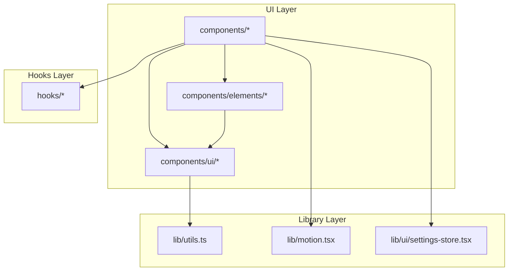

# P2.1: UI Components & Design System - Optimal Architecture Design

**Status:** Proposed  
**Date:** 2024-12-17  
**Author:** Ouroboros Architect

---

## Feature/Module Purpose

Establish a cohesive, performant, and maintainable UI component architecture for the Next.js AI Chatbot application. This design system must:

1. Provide consistent visual language across 50+ components
2. Optimize client/server component boundaries for minimal JS payload
3. Flatten provider hierarchy to reduce render overhead
4. Enable efficient tree-shaking and code-splitting
5. Ensure accessibility (WCAG 2.1 AA) across all interactive components

---

## Context

### Current State Analysis

**Component Inventory:**

| Category            | Count  | Location               |
| ------------------- | ------ | ---------------------- |
| Base UI (shadcn/ui) | 22     | `components/ui/`       |
| Feature Components  | 32     | `components/`          |
| Element Components  | 16     | `components/elements/` |
| Settings Components | 1      | `components/settings/` |
| **Total**           | **71** | -                      |

**Provider Hierarchy (Current - 6 levels deep):**

```
RootLayout
└── ThemeProvider (next-themes)
    └── TooltipProvider (Radix)
        └── SWRConfig
            └── AuthProvider
                └── ChatLayoutClient
                    └── SettingsProvider
                        └── DataStreamProvider
                            └── OptimisticChatsProvider
                                └── SidebarProvider
                                    └── {children}
```

**Issues Identified:**

1. **Deep Provider Nesting**: 9 levels of context providers causing:

   - Potential re-render cascades
   - Difficult debugging in React DevTools
   - Complex dependency chains

2. **Client Component Overuse**: 40+ components marked `"use client"` when some could be server components with client islands

3. **Large Sidebar Component**: [sidebar.tsx](components/ui/sidebar.tsx) is 814 lines - violates single responsibility

4. **Inconsistent Component Patterns**: Mix of forwardRef, memo, and bare components

5. **No Systematic Lazy Loading**: Only `AppSidebar` and `Artifact` use `dynamic()`

---

## Key Requirements

### Functional Requirements

| REQ-ID     | Requirement                                            | Priority |
| ---------- | ------------------------------------------------------ | -------- |
| REQ-UI-001 | All interactive components must be keyboard accessible | P0       |
| REQ-UI-002 | Theme switching must not cause layout shift            | P0       |
| REQ-UI-003 | Components must support RTL layouts                    | P1       |
| REQ-UI-004 | Toast notifications must be screen-reader announced    | P0       |
| REQ-UI-005 | Form components must support native validation         | P1       |

### Non-Functional Requirements

| REQ-ID         | Requirement                 | Target                     |
| -------------- | --------------------------- | -------------------------- |
| REQ-UI-NFR-001 | First Contentful Paint      | < 1.2s                     |
| REQ-UI-NFR-002 | Largest Contentful Paint    | < 2.5s                     |
| REQ-UI-NFR-003 | Component JS bundle         | < 50KB per route           |
| REQ-UI-NFR-004 | Provider depth              | ≤ 4 levels                 |
| REQ-UI-NFR-005 | Re-render on context change | Only subscribed components |

---

## Optimal Architecture Design

### 1. Component Architecture (Atomic Design)

```
┌─────────────────────────────────────────────────────────────────┐
│                        COMPONENT HIERARCHY                       │
├─────────────────────────────────────────────────────────────────┤
│                                                                 │
│  ┌─────────────────────────────────────────────────────────┐   │
│  │                      PAGES (Routes)                      │   │
│  │  app/(chat)/page.tsx, app/(auth)/login/page.tsx          │   │
│  └─────────────────────────────────────────────────────────┘   │
│                              │                                  │
│                              ▼                                  │
│  ┌─────────────────────────────────────────────────────────┐   │
│  │                     TEMPLATES                            │   │
│  │  Chat, Messages, Sidebar, Artifact                       │   │
│  │  (Feature-complete sections, client components)          │   │
│  └─────────────────────────────────────────────────────────┘   │
│                              │                                  │
│                              ▼                                  │
│  ┌─────────────────────────────────────────────────────────┐   │
│  │                     ORGANISMS                            │   │
│  │  ChatHeader, MessageGroup, MultimodalInput               │   │
│  │  (Composed from molecules, may contain state)            │   │
│  └─────────────────────────────────────────────────────────┘   │
│                              │                                  │
│                              ▼                                  │
│  ┌─────────────────────────────────────────────────────────┐   │
│  │                     MOLECULES                            │   │
│  │  ModelSelector, VisibilitySelector, PreviewAttachment    │   │
│  │  (Composed atoms, single purpose)                        │   │
│  └─────────────────────────────────────────────────────────┘   │
│                              │                                  │
│                              ▼                                  │
│  ┌─────────────────────────────────────────────────────────┐   │
│  │                      ATOMS (ui/)                         │   │
│  │  Button, Input, Select, Tooltip, Badge                   │   │
│  │  (Primitive, stateless, highly reusable)                 │   │
│  └─────────────────────────────────────────────────────────┘   │
│                                                                 │
└─────────────────────────────────────────────────────────────────┘
```

### 2. Provider Hierarchy (Flattened)

**Proposed Architecture - 4 levels max:**

```
┌─────────────────────────────────────────────────────────────────┐
│                     PROVIDER COMPOSITION                         │
├─────────────────────────────────────────────────────────────────┤
│                                                                 │
│  RootLayout (Server)                                            │
│  └── RootProviders (Client - Composed)                          │
│      ├── ThemeProvider                                          │
│      ├── TooltipProvider                                        │
│      ├── AuthProvider          ─┐                               │
│      └── SWRConfig             ─┴─► Merged into AppProvider     │
│          └── ChatLayoutProviders (Client - Composed)            │
│              ├── SettingsProvider    ─┐                         │
│              ├── DataStreamProvider  ─┼─► ChatContextProvider   │
│              ├── OptimisticChatsProvider ─┘                     │
│              └── SidebarProvider                                │
│                  └── {children}                                 │
│                                                                 │
└─────────────────────────────────────────────────────────────────┘
```

**Implementation - Composed Provider Pattern:**

```typescript
// lib/providers/app-providers.tsx
"use client";

import { ThemeProvider } from "next-themes";
import { TooltipProvider } from "@/components/ui/tooltip";
import { AuthProvider } from "@/components/auth-provider";
import { SWRConfig } from "swr";
import { SWR_CONFIG } from "@/lib/constants";

type AppProvidersProps = {
  children: React.ReactNode;
  initialSession: AppSession | null;
};

export function AppProviders({ children, initialSession }: AppProvidersProps) {
  return (
    <ThemeProvider attribute="class" defaultTheme="system" enableSystem>
      <SWRConfig value={SWR_CONFIG}>
        <TooltipProvider delayDuration={0}>
          <AuthProvider initialSession={initialSession}>
            {children}
          </AuthProvider>
        </TooltipProvider>
      </SWRConfig>
    </ThemeProvider>
  );
}

// lib/providers/chat-providers.tsx
("use client");

import { SettingsProvider } from "@/lib/ui/settings-store";
import { DataStreamProvider } from "@/components/data-stream-provider";
import { OptimisticChatsProvider } from "@/hooks/use-optimistic-chats";
import { SidebarProvider } from "@/components/ui/sidebar";

type ChatProvidersProps = {
  children: React.ReactNode;
  defaultSidebarOpen?: boolean;
};

export function ChatProviders({
  children,
  defaultSidebarOpen = true,
}: ChatProvidersProps) {
  return (
    <SettingsProvider>
      <DataStreamProvider>
        <OptimisticChatsProvider>
          <SidebarProvider defaultOpen={defaultSidebarOpen}>
            {children}
          </SidebarProvider>
        </OptimisticChatsProvider>
      </DataStreamProvider>
    </SettingsProvider>
  );
}
```

### 3. Client/Server Component Boundaries

```
┌─────────────────────────────────────────────────────────────────┐
│              CLIENT/SERVER COMPONENT STRATEGY                    │
├─────────────────────────────────────────────────────────────────┤
│                                                                 │
│  SERVER COMPONENTS (Default)                                    │
│  ├── Layout shells (app/layout.tsx, app/(chat)/layout.tsx)      │
│  ├── Static content (Greeting text, static headers)             │
│  ├── Data fetching wrappers                                     │
│  └── Icon/SVG components (no interactivity)                     │
│                                                                 │
│  CLIENT COMPONENTS (Explicit "use client")                      │
│  ├── Interactive forms (MultimodalInput, AuthForm)              │
│  ├── State-dependent UI (Messages, Chat, Artifact)              │
│  ├── Animation containers (motion components)                   │
│  ├── Browser API usage (localStorage, IntersectionObserver)     │
│  └── Third-party client libs (CodeMirror, react-data-grid)      │
│                                                                 │
│  HYBRID (Server shell + Client islands)                         │
│  ├── ChatHeader: Server renders structure, client handles menu  │
│  ├── Sidebar: Server renders container, client handles state    │
│  └── Message: Server renders markdown, client handles actions   │
│                                                                 │
└─────────────────────────────────────────────────────────────────┘
```

**Component Boundary Matrix:**

| Component            | Current | Proposed | Rationale                            |
| -------------------- | ------- | -------- | ------------------------------------ |
| `Greeting`           | Client  | Server   | Static text, no interactivity        |
| `ChatHeader`         | Client  | Hybrid   | Actions need client, title is static |
| `Icons`              | Mixed   | Server   | SVG components, zero JS              |
| `Message`            | Client  | Client   | Complex interactions required        |
| `SidebarHistoryItem` | Client  | Client   | Needs click handlers                 |
| `VersionFooter`      | Client  | Server   | Static version display               |

### 4. Theme System Architecture

```
┌─────────────────────────────────────────────────────────────────┐
│                      THEME SYSTEM DESIGN                         │
├─────────────────────────────────────────────────────────────────┤
│                                                                 │
│  CSS Variables (globals.css)                                    │
│  ├── :root (Light theme tokens)                                 │
│  │   ├── --background, --foreground                             │
│  │   ├── --primary, --secondary, --accent                       │
│  │   ├── --muted, --destructive                                 │
│  │   ├── --border, --input, --ring                              │
│  │   ├── --chart-1 through --chart-5                            │
│  │   ├── --sidebar-* tokens                                     │
│  │   └── --radius (spacing unit)                                │
│  │                                                              │
│  └── .dark (Dark theme overrides)                               │
│      └── All tokens with dark values                            │
│                                                                 │
│  @theme Block (Tailwind v4)                                     │
│  ├── --font-sans, --font-mono                                   │
│  ├── --radius-sm, --radius-md, --radius-lg                      │
│  └── --color-* semantic mappings                                │
│                                                                 │
│  Component Variants (CVA)                                       │
│  └── buttonVariants, badgeVariants, etc.                        │
│                                                                 │
└─────────────────────────────────────────────────────────────────┘
```

**Theme Token Hierarchy:**

```css
/* Primitive tokens (raw values) */
--zinc-900: hsl(240 5.9% 10%);

/* Semantic tokens (role-based) */
--primary: var(--zinc-900);
--primary-foreground: hsl(0 0% 98%);

/* Component tokens (component-specific) */
--button-primary-bg: var(--primary);
--button-primary-text: var(--primary-foreground);
```

### 5. Composition Patterns

**Pattern 1: Compound Components (Sidebar Example)**

```typescript
// Current: Monolithic 814-line sidebar.tsx
// Proposed: Split into compound components

// components/ui/sidebar/index.tsx
export { Sidebar } from "./sidebar";
export { SidebarProvider, useSidebar } from "./sidebar-context";
export { SidebarHeader } from "./sidebar-header";
export { SidebarContent } from "./sidebar-content";
export { SidebarFooter } from "./sidebar-footer";
export { SidebarMenu, SidebarMenuItem } from "./sidebar-menu";
export { SidebarTrigger } from "./sidebar-trigger";
```

**Pattern 2: Render Props for Flexibility**

```typescript
// components/ui/select.tsx
<Select>
  <SelectTrigger>
    {({ open, value }) => <span>{value || "Select..."}</span>}
  </SelectTrigger>
  <SelectContent>
    {items.map((item) => (
      <SelectItem key={item.id} value={item.id}>
        {item.label}
      </SelectItem>
    ))}
  </SelectContent>
</Select>
```

**Pattern 3: Slot Pattern for Customization**

```typescript
// Using Radix Slot for component composition
import { Slot } from "@radix-ui/react-slot";

interface ButtonProps extends React.ButtonHTMLAttributes<HTMLButtonElement> {
  asChild?: boolean;
}

const Button = ({ asChild, ...props }: ButtonProps) => {
  const Comp = asChild ? Slot : "button";
  return <Comp {...props} />;
};

// Usage: Button renders as Link
<Button asChild>
  <Link href="/home">Go Home</Link>
</Button>;
```

---

## Technology Stack

| Layer      | Technology    | Version | Purpose                         |
| ---------- | ------------- | ------- | ------------------------------- |
| Styling    | Tailwind CSS  | v4.x    | Utility-first CSS               |
| Components | shadcn/ui     | Latest  | Accessible component primitives |
| Primitives | Radix UI      | Latest  | Headless accessible components  |
| Animations | Framer Motion | v11.x   | Declarative animations          |
| Icons      | Lucide React  | Latest  | Consistent icon set             |
| Variants   | CVA           | Latest  | Type-safe component variants    |
| Theme      | next-themes   | v0.4.x  | Dark/light mode handling        |

**Design System Configuration:**

```json
// components.json (shadcn/ui)
{
  "style": "default",
  "rsc": true,
  "tsx": true,
  "tailwind": {
    "config": "",
    "css": "app/globals.css",
    "baseColor": "zinc",
    "cssVariables": true
  },
  "aliases": {
    "components": "@/components",
    "utils": "@/lib/utils",
    "ui": "@/components/ui"
  }
}
```

---

## Bundle Strategy

### Tree-Shaking Configuration

```typescript
// next.config.ts
const nextConfig: NextConfig = {
  experimental: {
    optimizePackageImports: [
      "lucide-react",
      "@radix-ui/react-icons",
      "framer-motion",
      "date-fns",
    ],
  },
  modularizeImports: {
    "lucide-react": {
      transform: "lucide-react/dist/esm/icons/{{kebabCase member}}",
    },
  },
};
```

### Component Lazy Loading Strategy

```
┌─────────────────────────────────────────────────────────────────┐
│                    LAZY LOADING TIERS                            │
├─────────────────────────────────────────────────────────────────┤
│                                                                 │
│  TIER 1: Always Loaded (Critical Path)                          │
│  ├── Button, Input, Label                                       │
│  ├── Basic layout components                                    │
│  └── Core navigation                                            │
│                                                                 │
│  TIER 2: Route-Level Code Split                                 │
│  ├── Chat components (loaded on /chat routes)                   │
│  ├── Auth components (loaded on /login, /register)              │
│  └── Settings components (loaded on demand)                     │
│                                                                 │
│  TIER 3: Interaction-Triggered (dynamic import)                 │
│  ├── Artifact (loaded when artifact opens)                      │
│  ├── CodeEditor (loaded when code block clicked)                │
│  ├── ImageEditor (loaded when image artifact)                   │
│  ├── SheetEditor (loaded when sheet artifact)                   │
│  └── DiffView (loaded when diff requested)                      │
│                                                                 │
│  TIER 4: Below-the-Fold (Intersection Observer)                 │
│  ├── SidebarHistory (virtualized list)                          │
│  └── Long message content                                       │
│                                                                 │
└─────────────────────────────────────────────────────────────────┘
```

**Implementation:**

```typescript
// Tier 3: Interaction-triggered loading
const CodeEditor = dynamic(
  () => import("@/components/code-editor").then((m) => m.CodeEditor),
  {
    ssr: false,
    loading: () => <CodeEditorSkeleton />,
  }
);

// Tier 4: Intersection-triggered loading
const LazyComponent = ({ children }: { children: React.ReactNode }) => {
  const [isVisible, setIsVisible] = useState(false);
  const ref = useRef<HTMLDivElement>(null);

  useEffect(() => {
    const observer = new IntersectionObserver(
      ([entry]) => {
        if (entry.isIntersecting) {
          setIsVisible(true);
          observer.disconnect();
        }
      },
      { rootMargin: "100px" }
    );

    if (ref.current) observer.observe(ref.current);
    return () => observer.disconnect();
  }, []);

  return <div ref={ref}>{isVisible ? children : <Skeleton />}</div>;
};
```

---

## Simplifications

### Current Issues → Proposed Solutions

| Issue             | Current State         | Proposed Solution      | Impact                 |
| ----------------- | --------------------- | ---------------------- | ---------------------- |
| Provider Depth    | 9 levels              | 4 levels (composed)    | -55% depth             |
| Sidebar Size      | 814 lines             | ~150 lines (split)     | Better maintainability |
| Client Overuse    | 40+ client components | ~25 (hybrid pattern)   | Smaller JS bundle      |
| No Icons Server   | All client icons      | Server component icons | Zero JS icons          |
| Duplicate Context | Split state/dispatch  | Unified where possible | Simpler mental model   |

### Provider Composition Pattern

```typescript
// Before: Deep nesting
<ThemeProvider>
  <TooltipProvider>
    <SWRConfig>
      <AuthProvider>
        <SettingsProvider>
          <DataStreamProvider>
            <OptimisticChatsProvider>
              <SidebarProvider>
                {children}
              </SidebarProvider>
            </OptimisticChatsProvider>
          </DataStreamProvider>
        </SettingsProvider>
      </AuthProvider>
    </SWRConfig>
  </TooltipProvider>
</ThemeProvider>

// After: Composed providers
<AppProviders initialSession={session}>
  <ChatProviders>
    {children}
  </ChatProviders>
</AppProviders>
```

### Component Splitting Guidelines

```
┌─────────────────────────────────────────────────────────────────┐
│                  COMPONENT SIZE GUIDELINES                       │
├─────────────────────────────────────────────────────────────────┤
│                                                                 │
│  Target LOC per Component:                                      │
│  ├── Atoms: < 50 lines                                          │
│  ├── Molecules: < 150 lines                                     │
│  ├── Organisms: < 300 lines                                     │
│  └── Templates: < 500 lines                                     │
│                                                                 │
│  Split Triggers:                                                │
│  ├── > 300 lines → Extract sub-components                       │
│  ├── > 5 useState → Extract custom hook                         │
│  ├── > 3 useEffect → Review for extraction                      │
│  └── Mixed concerns → Separate by responsibility                │
│                                                                 │
└─────────────────────────────────────────────────────────────────┘
```

---

## Dependencies

### Internal Dependencies



### External Dependencies

| Package                    | Purpose               | Bundle Impact        |
| -------------------------- | --------------------- | -------------------- |
| `next-themes`              | Theme switching       | ~2KB                 |
| `class-variance-authority` | Variant management    | ~1KB                 |
| `clsx` + `tailwind-merge`  | Class composition     | ~3KB                 |
| `@radix-ui/*`              | Accessible primitives | Tree-shaken          |
| `lucide-react`             | Icons                 | Tree-shaken per icon |
| `framer-motion`            | Animations            | ~30KB (split)        |
| `react-virtuoso`           | List virtualization   | ~15KB                |
| `sonner`                   | Toast notifications   | ~5KB                 |

---

## Public Interface

### Component Exports

```typescript
// components/ui/index.ts (barrel export)
export { Button, buttonVariants } from "./button";
export { Input } from "./input";
export { Label } from "./label";
export {
  Select,
  SelectContent,
  SelectItem,
  SelectTrigger,
  SelectValue,
} from "./select";
export {
  Tooltip,
  TooltipContent,
  TooltipProvider,
  TooltipTrigger,
} from "./tooltip";
// ... other exports

// Usage
import { Button, Input, Select } from "@/components/ui";
```

### Design Token Exports

```typescript
// lib/design-tokens.ts
export const tokens = {
  colors: {
    primary: "hsl(var(--primary))",
    secondary: "hsl(var(--secondary))",
    // ...
  },
  spacing: {
    xs: "0.25rem",
    sm: "0.5rem",
    md: "1rem",
    lg: "1.5rem",
    xl: "2rem",
  },
  radius: {
    sm: "calc(var(--radius) - 4px)",
    md: "calc(var(--radius) - 2px)",
    lg: "var(--radius)",
  },
} as const;
```

### Hook Exports

```typescript
// hooks/index.ts
export { useArtifact, useArtifactSelector } from "./use-artifact";
export { useChatVisibility } from "./use-chat-visibility";
export { useIsMobile } from "./use-mobile";
export {
  useOptimisticChats,
  OptimisticChatsProvider,
} from "./use-optimistic-chats";
export { useScrollToBottom } from "./use-scroll-to-bottom";
```

---

## Performance Optimizations

### 1. Memoization Strategy

```typescript
// Component memoization with custom comparator
const Message = memo(
  function Message({ message, vote }: MessageProps) {
    // Component implementation
  },
  (prevProps, nextProps) => {
    return (
      prevProps.message.id === nextProps.message.id &&
      prevProps.message.content === nextProps.message.content &&
      prevProps.vote?.value === nextProps.vote?.value
    );
  }
);

// Selector memoization for context
const selectIsVisible = (state: UIArtifact) => state.isVisible;
const isVisible = useArtifactSelector(selectIsVisible); // Stable selector
```

### 2. Virtualization

```typescript
// Already implemented in Messages component using react-virtuoso
<Virtuoso
  ref={virtuosoRef}
  data={renderableMessages}
  itemContent={(index, message) => (
    <PreviewMessage
      key={message.id}
      message={message}
      vote={votes?.find((v) => v.messageId === message.id)}
    />
  )}
  atBottomStateChange={handleAtBottomStateChange}
  followOutput="smooth"
/>
```

### 3. Context Splitting Pattern (Already Implemented)

```typescript
// DataStreamProvider splits state and dispatch
// Components using dispatch don't re-render on state changes
const DataStreamStateContext = createContext<DataStreamState | null>(null);
const DataStreamDispatchContext = createContext<DataStreamDispatch | null>(
  null
);

// Usage
const state = useDataStreamState(); // Re-renders on state change
const dispatch = useDataStreamDispatch(); // Never re-renders
```

### 4. Render Optimization Checklist

| Technique      | Applied To              | Benefit                  |
| -------------- | ----------------------- | ------------------------ |
| `React.memo`   | Message, PreviewMessage | Prevent re-renders       |
| `useMemo`      | Complex computations    | Cache expensive calcs    |
| `useCallback`  | Event handlers          | Stable references        |
| Split contexts | DataStreamProvider      | Granular subscriptions   |
| Virtualization | Messages list           | Render only visible      |
| `key` strategy | Lists                   | Efficient reconciliation |

### 5. Bundle Size Targets

| Route         | Current (est.) | Target  | Strategy                      |
| ------------- | -------------- | ------- | ----------------------------- |
| `/` (home)    | ~120KB         | < 80KB  | Server greeting, lazy sidebar |
| `/chat/[id]`  | ~200KB         | < 150KB | Split editors, virtualize     |
| `/login`      | ~60KB          | < 40KB  | Minimal client JS             |
| Artifact open | +150KB         | +100KB  | True on-demand loading        |

---

## Consequences

### Positive

- **POS-001**: Flattened provider hierarchy reduces cognitive load and debugging complexity
- **POS-002**: Server components for static content reduces JavaScript bundle by ~20-30%
- **POS-003**: Compound component pattern makes sidebar maintainable and testable
- **POS-004**: Consistent atomic design enables faster feature development
- **POS-005**: Tree-shaking configuration ensures minimal production bundle

### Negative

- **NEG-001**: Migration effort required to split existing large components
- **NEG-002**: Barrel exports can break tree-shaking if not configured properly
- **NEG-003**: More files to manage with compound component pattern
- **NEG-004**: Team needs to learn and follow atomic design conventions

---

## Alternatives Considered

### ALT-001: Keep Current Provider Structure

- **Description**: Leave 9-level provider nesting as-is
- **Rejected because**: Performance overhead, debugging difficulty, and maintenance burden outweigh migration cost

### ALT-002: CSS-in-JS (Styled Components, Emotion)

- **Description**: Replace Tailwind with CSS-in-JS solution
- **Rejected because**: Tailwind v4 with CSS variables provides same flexibility with better performance (no runtime CSS generation)

### ALT-003: Full Component Library (MUI, Chakra)

- **Description**: Replace shadcn/ui with full-featured component library
- **Rejected because**: shadcn/ui provides ownership of code, better customization, smaller bundle, and Radix accessibility

### ALT-004: Zustand/Jotai for All State

- **Description**: Replace React Context with atomic state management
- **Rejected because**: Current SWR + Context pattern is sufficient; adding another state library increases complexity without proportional benefit

---

## Implementation Notes

### Migration Priority

1. **Phase 1**: Create composed provider files (`app-providers.tsx`, `chat-providers.tsx`)
2. **Phase 2**: Split sidebar into compound components
3. **Phase 3**: Convert eligible components to server components
4. **Phase 4**: Add lazy loading for Tier 3 components
5. **Phase 5**: Create barrel exports with proper tree-shaking

### Component Conversion Checklist

```markdown
For each component migration:

- [ ] Identify if it needs browser APIs (→ client)
- [ ] Identify if it has event handlers (→ client)
- [ ] Identify if it uses hooks (→ client)
- [ ] If none of above, convert to server component
- [ ] Add proper memo/callback if staying client
- [ ] Update imports to use barrel exports
```

### Testing Requirements

- **Visual regression**: Chromatic/Percy for component snapshots
- **Accessibility**: axe-core automated tests
- **Performance**: Lighthouse CI in GitHub Actions
- **Bundle analysis**: `@next/bundle-analyzer` on PRs

---

## References

- [ADR-001: Next.js App Router Migration](../adrs/ADR-001-nextjs-app-router.md) (if exists)
- [shadcn/ui Documentation](https://ui.shadcn.com/)
- [Radix Primitives](https://www.radix-ui.com/primitives)
- [Tailwind CSS v4](https://tailwindcss.com/docs)
- [React Server Components](https://react.dev/reference/rsc/server-components)

---

## Files Created

- `.ouroboros/specs/architecture-overhaul/08-ui-components-optimal-design.md` (this file)

---

━━━━━━━━━━━━━━━━━━━━━━━━━━━━━━━━━━━━━━━━━━━━━━
✅ [TASK COMPLETE]
━━━━━━━━━━━━━━━━━━━━━━━━━━━━━━━━━━━━━━━━━━━━━━
