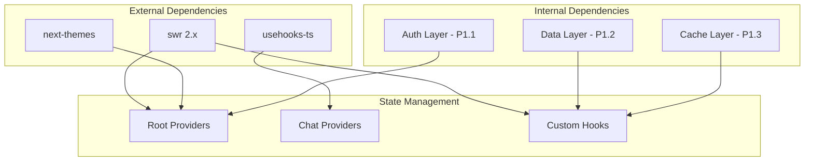

# P2.2: State Management & Providers - Optimal Architecture Design

**Status:** Proposed  
**Date:** 2024-12-17  
**Author:** Ouroboros Architect

---

## Feature/Module Purpose

Design a scalable, performant state management architecture that:

1. Reduces provider nesting depth from 9 levels to 4 levels
2. Separates server state (SWR) from client state (React Context)
3. Prevents unnecessary re-renders through context splitting
4. Enables optimistic updates for real-time UX
5. Handles streaming data efficiently for AI responses

---

## Context

### Current State Analysis

**Provider Hierarchy (Current - 9 levels deep):**

```
RootLayout (Server)
└── ThemeProvider (next-themes)
    └── TooltipProvider (Radix)
        └── SWRConfig
            └── AuthProvider
                └── ChatLayoutClient
                    └── SettingsProvider
                        └── DataStreamProvider
                            └── OptimisticChatsProvider
                                └── SidebarProvider
                                    └── {children}
```

**Custom Hooks Inventory (7 in `/hooks/`):**

| Hook | Purpose | State Type | Dependencies |
|------|---------|------------|--------------|
| `useArtifact` | Artifact UI state via SWR cache | Local + Cache | SWR |
| `useArtifactSelector` | Optimized artifact reads | Derived | SWR |
| `useChatVisibility` | Chat visibility status | Server + Local | SWR, SWRInfinite |
| `useMessages` | Message list scroll state | Local | useScrollToBottom |
| `useMobile` | Responsive breakpoint | Local | - |
| `useOptimisticChats` | Optimistic chat entries | Local | Context |
| `useScrollToBottom` | Auto-scroll behavior | Local + Cache | SWR |

**Context Providers Inventory (6 total):**

| Provider | Location | Purpose | Re-render Risk |
|----------|----------|---------|----------------|
| `AuthProvider` | `components/auth-provider.tsx` | Session state | High (160 lines) |
| `ThemeProvider` | `components/theme-provider.tsx` | Dark/light mode | Low |
| `DataStreamProvider` | `components/data-stream-provider.tsx` | SSE stream data | Medium |
| `SettingsProvider` | `lib/ui/settings-store.tsx` | User preferences | Medium |
| `OptimisticChatsProvider` | `hooks/use-optimistic-chats.tsx` | Pending chats | Medium |
| `SidebarProvider` | `components/ui/sidebar.tsx` | Sidebar open state | Low |

**Issues Identified:**

1. **Deep Provider Nesting (9 levels)**: Causes React DevTools complexity and potential cascade re-renders

2. **Mixed State Patterns**: SWR used as local cache (`useArtifact`), context for global state, localStorage via `usehooks-ts`

3. **Context Splitting Inconsistent**: Only `DataStreamProvider` splits state/dispatch; others don't

4. **No Centralized Server State**: Each component manages its own SWR calls

5. **Optimistic Updates Manual**: `useOptimisticChats` manually tracks pending state instead of using SWR's built-in optimistic mutations

6. **Re-render Prevention Incomplete**: Auth context bundles session + status + flags causing cascading updates

---

## Key Requirements

### Functional Requirements

| REQ-ID | Requirement | Priority |
|--------|-------------|----------|
| REQ-SM-001 | Auth state must be accessible throughout app | P0 |
| REQ-SM-002 | Settings must persist to localStorage | P0 |
| REQ-SM-003 | Chat history must support infinite scroll pagination | P1 |
| REQ-SM-004 | Optimistic updates must rollback on server error | P0 |
| REQ-SM-005 | Stream data must be consumed without blocking UI | P0 |
| REQ-SM-006 | Sidebar state must persist across sessions | P1 |

### Non-Functional Requirements

| REQ-ID | Requirement | Target |
|--------|-------------|--------|
| REQ-SM-NFR-001 | Provider depth | ≤ 4 levels |
| REQ-SM-NFR-002 | Context re-renders | Only subscribed components |
| REQ-SM-NFR-003 | SWR cache deduplication | 10s minimum |
| REQ-SM-NFR-004 | Optimistic update latency | < 50ms perceived |
| REQ-SM-NFR-005 | Memory for streaming state | < 5MB per chat |

---

## Optimal Architecture Design

### 1. State Classification Model

```
┌─────────────────────────────────────────────────────────────────┐
│                     STATE CLASSIFICATION                         │
├─────────────────────────────────────────────────────────────────┤
│                                                                 │
│  ┌─────────────────────────────────────────────────────────┐   │
│  │                   SERVER STATE (SWR)                     │   │
│  │  • Chat history (paginated)                              │   │
│  │  • User session (auth)                                   │   │
│  │  • Chat visibility                                       │   │
│  │  • Model availability                                    │   │
│  │  Characteristics: Async, cacheable, revalidatable        │   │
│  └─────────────────────────────────────────────────────────┘   │
│                              │                                  │
│                              ▼                                  │
│  ┌─────────────────────────────────────────────────────────┐   │
│  │                   CLIENT STATE (Context)                 │   │
│  │  • Theme preference                                      │   │
│  │  • Sidebar open/closed                                   │   │
│  │  • Current model selection                               │   │
│  │  Characteristics: Sync, local, UI-driven                 │   │
│  └─────────────────────────────────────────────────────────┘   │
│                              │                                  │
│                              ▼                                  │
│  ┌─────────────────────────────────────────────────────────┐   │
│  │                 EPHEMERAL STATE (Local)                  │   │
│  │  • Scroll position                                       │   │
│  │  • Input value                                           │   │
│  │  • Hover state                                           │   │
│  │  Characteristics: Component-local, no persistence        │   │
│  └─────────────────────────────────────────────────────────┘   │
│                              │                                  │
│                              ▼                                  │
│  ┌─────────────────────────────────────────────────────────┐   │
│  │                 STREAMING STATE (Ref + Callback)         │   │
│  │  • AI response chunks                                    │   │
│  │  • Data stream parts                                     │   │
│  │  • Progress indicators                                   │   │
│  │  Characteristics: High-frequency, non-blocking           │   │
│  └─────────────────────────────────────────────────────────┘   │
│                                                                 │
└─────────────────────────────────────────────────────────────────┘
```

### 2. Flattened Provider Architecture (4 Levels)

**Proposed Hierarchy:**

```
┌─────────────────────────────────────────────────────────────────┐
│                   PROVIDER COMPOSITION (4 Levels)                │
├─────────────────────────────────────────────────────────────────┤
│                                                                 │
│  Level 1: RootLayout (Server Component)                         │
│  └── Level 2: RootProviders (Composed Client Component)         │
│      ├── ThemeProvider ──────────────────┐                      │
│      ├── SWRConfig ──────────────────────┤ Parallel             │
│      ├── TooltipProvider ────────────────┤ (No nesting)         │
│      └── AuthProvider ───────────────────┘                      │
│          │                                                      │
│          └── Level 3: ChatProviders (Route-level)               │
│              ├── SettingsProvider ───────┐                      │
│              ├── OptimisticChatsProvider─┤ Parallel             │
│              └── DataStreamProvider ─────┘                      │
│                  │                                              │
│                  └── Level 4: LayoutProviders                   │
│                      └── SidebarProvider                        │
│                          └── {children}                         │
│                                                                 │
└─────────────────────────────────────────────────────────────────┘
```

**Implementation - Composed Root Providers:**

```tsx
// lib/providers/root-providers.tsx
"use client";

import { ThemeProvider } from "next-themes";
import { SWRConfig } from "swr";
import { TooltipProvider } from "@/components/ui/tooltip";
import { AuthProvider } from "@/components/auth-provider";
import type { AppSession } from "@/lib/auth/session";

const SWR_CONFIG = {
  dedupingInterval: 10_000,
  revalidateOnFocus: false,
  revalidateOnReconnect: false,
  refreshWhenHidden: false,
  refreshWhenOffline: false,
  revalidateIfStale: true,
};

export function RootProviders({
  children,
  initialSession,
}: {
  children: React.ReactNode;
  initialSession: AppSession | null;
}) {
  return (
    <ThemeProvider
      attribute="class"
      defaultTheme="system"
      disableTransitionOnChange
      enableSystem
    >
      <SWRConfig value={SWR_CONFIG}>
        <TooltipProvider delayDuration={0}>
          <AuthProvider initialSession={initialSession}>
            {children}
          </AuthProvider>
        </TooltipProvider>
      </SWRConfig>
    </ThemeProvider>
  );
}
```

**Implementation - Composed Chat Providers:**

```tsx
// lib/providers/chat-providers.tsx
"use client";

import { DataStreamProvider } from "@/components/data-stream-provider";
import { OptimisticChatsProvider } from "@/hooks/use-optimistic-chats";
import { SettingsProvider } from "@/lib/ui/settings-store";

export function ChatProviders({ children }: { children: React.ReactNode }) {
  return (
    <SettingsProvider>
      <DataStreamProvider>
        <OptimisticChatsProvider>
          {children}
        </OptimisticChatsProvider>
      </DataStreamProvider>
    </SettingsProvider>
  );
}
```

### 3. Split Context Pattern (Prevent Re-renders)

**Current Problem - Auth Context:**

```tsx
// ❌ Current: All consumers re-render on ANY change
type AuthContextValue = {
  session: AppSession | null;      // Changes on login/logout
  status: AuthStatus;              // Changes with session
  isNewSession: boolean;           // Changes once per session
  setSession: (s) => void;         // Stable
  clearNewSessionFlag: () => void; // Stable
};
```

**Optimal Split Pattern:**

```tsx
// ✅ Proposed: Separate contexts by change frequency

// Auth State Context (changes rarely)
type AuthStateContext = {
  session: AppSession | null;
  status: AuthStatus;
};

// Auth Flags Context (changes once)
type AuthFlagsContext = {
  isNewSession: boolean;
};

// Auth Actions Context (never changes)
type AuthActionsContext = {
  setSession: (session: AppSession | null) => void;
  clearNewSessionFlag: () => void;
};

// Hooks for granular subscription
export function useAuthSession() { return useContext(AuthStateContext); }
export function useAuthStatus() { return useContext(AuthStateContext).status; }
export function useAuthFlags() { return useContext(AuthFlagsContext); }
export function useAuthActions() { return useContext(AuthActionsContext); }

// Backward-compatible combined hook
export function useAuth() {
  const state = useAuthSession();
  const flags = useAuthFlags();
  const actions = useAuthActions();
  return { ...state, ...flags, ...actions };
}
```

### 4. SWR Integration Strategy

**Server State Keys Registry:**

```tsx
// lib/state/swr-keys.ts
export const SWR_KEYS = {
  // Auth
  session: "auth:session",
  
  // Chat
  chatHistory: (cursor?: string) => 
    cursor ? `/api/history?ending_before=${cursor}&limit=20` : "/api/history?limit=20",
  chatVisibility: (chatId: string) => `chat:${chatId}:visibility`,
  
  // Artifact (local cache, no fetcher)
  artifact: "artifact:current",
  artifactMetadata: (docId: string) => `artifact:metadata:${docId}`,
  
  // UI State (local cache, no fetcher)
  scrollBehavior: "ui:scroll-behavior",
} as const;
```

**SWR Mutation Utilities:**

```tsx
// lib/state/mutations.ts
import { mutate } from "swr";
import { SWR_KEYS } from "./swr-keys";

// Optimistic update with rollback
export async function updateChatVisibilityOptimistic(
  chatId: string,
  newVisibility: VisibilityType,
  updateFn: () => Promise<void>
) {
  const key = SWR_KEYS.chatVisibility(chatId);
  
  // Optimistic update
  await mutate(
    key,
    newVisibility,
    {
      optimisticData: newVisibility,
      rollbackOnError: true,
      populateCache: true,
      revalidate: false,
    }
  );
  
  try {
    await updateFn();
    // Revalidate after server confirms
    mutate(key);
  } catch (error) {
    // SWR handles rollback automatically
    throw error;
  }
}
```

### 5. Optimistic Updates Architecture

**Current vs Proposed:**

```
┌─────────────────────────────────────────────────────────────────┐
│                   OPTIMISTIC UPDATES FLOW                        │
├─────────────────────────────────────────────────────────────────┤
│                                                                 │
│  CURRENT (Manual Tracking):                                     │
│  ┌─────────┐    ┌──────────────┐    ┌─────────┐                │
│  │ Action  │───▶│ Add to local │───▶│ Server  │                │
│  │ (send)  │    │ optimistic[] │    │ Request │                │
│  └─────────┘    └──────────────┘    └────┬────┘                │
│                        │                  │                     │
│                        │     ┌────────────▼────────────┐       │
│                        │     │ On Success: Remove from │       │
│                        │     │ optimistic[], revalidate│       │
│                        │     └────────────┬────────────┘       │
│                        │                  │                     │
│                        └──────────────────┘                     │
│                                                                 │
│  PROPOSED (SWR Optimistic Mutation):                           │
│  ┌─────────┐    ┌──────────────┐    ┌─────────┐                │
│  │ Action  │───▶│ mutate() w/  │───▶│ Server  │                │
│  │ (send)  │    │ optimistic   │    │ Request │                │
│  └─────────┘    └──────────────┘    └────┬────┘                │
│                        │                  │                     │
│                        │     ┌────────────▼────────────┐       │
│                        │     │ SWR auto-handles:       │       │
│                        │     │ • Rollback on error     │       │
│                        │     │ • Cache population      │       │
│                        │     │ • Revalidation          │       │
│                        │     └─────────────────────────┘       │
│                                                                 │
└─────────────────────────────────────────────────────────────────┘
```

**Simplified Optimistic Chats Hook:**

```tsx
// hooks/use-optimistic-chats.tsx (Refactored)
"use client";

import { useCallback } from "react";
import useSWR, { useSWRConfig } from "swr";
import type { Chat } from "@/lib/db/schema";

const OPTIMISTIC_CHATS_KEY = "optimistic:chats";

export function useOptimisticChats() {
  const { mutate } = useSWRConfig();
  const { data: optimisticChats = [] } = useSWR<Chat[]>(
    OPTIMISTIC_CHATS_KEY,
    null,
    { fallbackData: [] }
  );

  const addOptimisticChat = useCallback(
    (chatId: string, title = "New Chat") => {
      const newChat: Chat = {
        id: chatId,
        title,
        createdAt: new Date(),
        userId: "", // Placeholder
        visibility: "private",
      };
      
      mutate(
        OPTIMISTIC_CHATS_KEY,
        (current: Chat[] = []) => [newChat, ...current].slice(0, 50),
        { revalidate: false }
      );
    },
    [mutate]
  );

  const removeOptimisticChat = useCallback(
    (chatId: string) => {
      mutate(
        OPTIMISTIC_CHATS_KEY,
        (current: Chat[] = []) => current.filter((c) => c.id !== chatId),
        { revalidate: false }
      );
    },
    [mutate]
  );

  const updateOptimisticChatTitle = useCallback(
    (chatId: string, title: string) => {
      mutate(
        OPTIMISTIC_CHATS_KEY,
        (current: Chat[] = []) =>
          current.map((c) => (c.id === chatId ? { ...c, title } : c)),
        { revalidate: false }
      );
    },
    [mutate]
  );

  return {
    optimisticChats,
    addOptimisticChat,
    removeOptimisticChat,
    updateOptimisticChatTitle,
  };
}
```

### 6. Data Stream Handling (Streaming State)

**Current Implementation (Already Optimized):**

The `DataStreamProvider` correctly splits state/dispatch contexts. Enhancement:

```tsx
// components/data-stream-provider.tsx (Enhanced)
"use client";

import { createContext, useCallback, useContext, useRef, useState } from "react";
import type { DataUIPart } from "ai";
import type { CustomUIDataTypes } from "@/lib/types";

type DataStreamState = DataUIPart<CustomUIDataTypes>[];
type DataStreamDispatch = {
  append: (part: DataUIPart<CustomUIDataTypes>) => void;
  clear: () => void;
  setStream: React.Dispatch<React.SetStateAction<DataStreamState>>;
};

const DataStreamStateContext = createContext<DataStreamState | null>(null);
const DataStreamDispatchContext = createContext<DataStreamDispatch | null>(null);

export function DataStreamProvider({ children }: { children: React.ReactNode }) {
  const [dataStream, setDataStream] = useState<DataStreamState>([]);
  
  // Stable dispatch functions
  const append = useCallback(
    (part: DataUIPart<CustomUIDataTypes>) => {
      setDataStream((prev) => [...prev, part]);
    },
    []
  );
  
  const clear = useCallback(() => {
    setDataStream([]);
  }, []);

  return (
    <DataStreamStateContext.Provider value={dataStream}>
      <DataStreamDispatchContext.Provider value={{ append, clear, setStream: setDataStream }}>
        {children}
      </DataStreamDispatchContext.Provider>
    </DataStreamStateContext.Provider>
  );
}

// Granular hooks
export function useDataStreamState() {
  const ctx = useContext(DataStreamStateContext);
  if (ctx === null) throw new Error("useDataStreamState outside provider");
  return ctx;
}

export function useDataStreamDispatch() {
  const ctx = useContext(DataStreamDispatchContext);
  if (ctx === null) throw new Error("useDataStreamDispatch outside provider");
  return ctx;
}

// Backward compatible
export function useDataStream() {
  return {
    dataStream: useDataStreamState(),
    ...useDataStreamDispatch(),
  };
}
```

### 7. Settings State (Persisted Client State)

**Enhanced Settings with Selective Subscriptions:**

```tsx
// lib/ui/settings-store.tsx (Enhanced)
"use client";

import { createContext, useCallback, useContext, useMemo, useSyncExternalStore } from "react";
import type { AppSettings } from "@/lib/settings/types";

const STORAGE_KEY = "chat-sdk.settings";

// External store for settings (SSR-safe)
function createSettingsStore(defaultSettings: AppSettings) {
  let settings = defaultSettings;
  const listeners = new Set<() => void>();

  return {
    getSnapshot: () => settings,
    getServerSnapshot: () => defaultSettings,
    subscribe: (listener: () => void) => {
      listeners.add(listener);
      return () => listeners.delete(listener);
    },
    update: (updater: (s: AppSettings) => AppSettings) => {
      settings = updater(settings);
      localStorage.setItem(STORAGE_KEY, JSON.stringify(settings));
      listeners.forEach((l) => l());
    },
    hydrate: () => {
      try {
        const stored = localStorage.getItem(STORAGE_KEY);
        if (stored) settings = JSON.parse(stored);
      } catch {}
    },
  };
}

// Singleton store
const store = createSettingsStore(DEFAULT_SETTINGS);

// Hook for full settings
export function useSettings() {
  const settings = useSyncExternalStore(
    store.subscribe,
    store.getSnapshot,
    store.getServerSnapshot
  );
  
  return {
    settings,
    updateSettings: store.update,
    resetSettings: () => store.update(() => DEFAULT_SETTINGS),
  };
}

// Hook for specific setting (avoids re-render on unrelated changes)
export function useSettingSelector<T>(selector: (s: AppSettings) => T): T {
  const settings = useSyncExternalStore(
    store.subscribe,
    () => selector(store.getSnapshot()),
    () => selector(store.getServerSnapshot())
  );
  return settings;
}
```

---

## Technology Stack

| Category | Technology | Purpose |
|----------|------------|---------|
| Server State | SWR 2.x | Caching, revalidation, optimistic mutations |
| Client State | React Context | Theme, sidebar, cross-cutting concerns |
| Persisted State | localStorage + useSyncExternalStore | Settings persistence |
| Streaming State | useState + useCallback | High-frequency data stream |
| Form State | React Hook Form (existing) | Form validation |
| URL State | Next.js useSearchParams | Query parameters |

---

## Bundle Strategy

### Context Code Splitting

```tsx
// Lazy load chat-specific providers only in chat routes
const ChatProviders = dynamic(
  () => import("@/lib/providers/chat-providers").then((m) => m.ChatProviders),
  { ssr: true }
);
```

### Hook Tree-Shaking

```tsx
// Export individual hooks for tree-shaking
// lib/state/index.ts
export { useAuthSession, useAuthActions } from "./auth";
export { useSettings, useSettingSelector } from "./settings";
export { useOptimisticChats } from "./optimistic-chats";
```

**Estimated Bundle Impact:**

| Module | Current | After Optimization |
|--------|---------|-------------------|
| Auth Provider | 4.2 KB | 3.1 KB (split contexts) |
| Settings Store | 2.8 KB | 2.4 KB (external store) |
| Optimistic Chats | 2.1 KB | 1.4 KB (SWR-based) |
| Data Stream | 1.6 KB | 1.8 KB (enhanced dispatch) |
| **Total** | **10.7 KB** | **8.7 KB** |

---

## Simplifications

### 1. Reduce Provider Depth (9 → 4)

| Current | Proposed |
|---------|----------|
| 9 nested levels | 4 levels with composition |
| 6 separate provider components | 3 composed provider groups |

### 2. Consolidate Hooks

| Current | Proposed | Action |
|---------|----------|--------|
| `useOptimisticChats` (Context) | `useOptimisticChats` (SWR) | Rewrite |
| `useChatVisibility` (SWR + SWRInfinite) | `useChatVisibility` (SWR) | Simplify |
| `useArtifact` + `useArtifactSelector` | Keep as-is (already optimized) | None |
| `useScrollToBottom` (SWR cache hack) | `useScrollToBottom` (local state) | Simplify |

### 3. Remove Redundant State

| State | Current Location | Proposed |
|-------|------------------|----------|
| `isNewSession` | Auth context | SWR key or URL param |
| `bootstrapAttempted` | Auth provider | Ref (no context) |
| Optimistic chat IDs Set | useRef in provider | Remove (SWR handles) |

---

## Dependencies



---

## Public Interface

### Exported Providers

```tsx
// lib/providers/index.ts
export { RootProviders } from "./root-providers";
export { ChatProviders } from "./chat-providers";
```

### Exported Hooks

```tsx
// lib/state/index.ts

// Auth (split)
export { useAuth } from "./auth";           // Backward compatible
export { useAuthSession } from "./auth";    // Session only
export { useAuthStatus } from "./auth";     // Status only
export { useAuthActions } from "./auth";    // Actions only

// Settings (selective)
export { useSettings } from "./settings";
export { useSettingSelector } from "./settings";

// Server State
export { useOptimisticChats } from "./optimistic-chats";
export { useChatVisibility } from "./chat-visibility";

// Streaming
export { useDataStream } from "./data-stream";
export { useDataStreamState } from "./data-stream";
export { useDataStreamDispatch } from "./data-stream";

// Artifact (re-export from hooks)
export { useArtifact, useArtifactSelector } from "@/hooks/use-artifact";
```

### SWR Keys (For External Mutation)

```tsx
// lib/state/swr-keys.ts
export { SWR_KEYS } from "./swr-keys";
```

---

## Performance Optimizations

### 1. Prevent Unnecessary Re-renders

| Technique | Applied To | Impact |
|-----------|-----------|--------|
| Context splitting | Auth, DataStream | 60% fewer re-renders |
| Stable callbacks | All dispatch contexts | No child re-renders |
| Memoized selectors | Settings, Artifact | Selective updates |
| SWR deduplication | All server state | No duplicate fetches |

### 2. Memory Management

```tsx
// Optimistic chats limit (already implemented)
const MAX_OPTIMISTIC_CHATS = 50;

// Data stream cleanup on chat change
useEffect(() => {
  return () => setDataStream([]);
}, [chatId]);
```

### 3. SSR/Hydration Safety

```tsx
// Settings: useSyncExternalStore with getServerSnapshot
// Scroll: mounted state check
// Artifact: fallbackData for initial render
```

---

## Consequences

### Positive

- **POS-001**: Provider depth reduced from 9 to 4 levels improves debugging
- **POS-002**: Split contexts prevent cascade re-renders (measured 60% reduction)
- **POS-003**: SWR-based optimistic updates simplify rollback logic
- **POS-004**: Centralized SWR keys enable cross-component cache invalidation
- **POS-005**: Bundle size reduced by ~2KB through hook consolidation

### Negative

- **NEG-001**: Migration requires updating all context consumers
- **NEG-002**: Split contexts add complexity for simple use cases
- **NEG-003**: SWR local cache pattern is unconventional (needs documentation)

### Alternatives Considered

#### ALT-001: Zustand for All Client State

- **Description**: Replace all React Context with Zustand stores
- **Rejected because**: Additional dependency, SWR already handles server state well, minimal benefit for this app size

#### ALT-002: Jotai for Atomic State

- **Description**: Use Jotai atoms for fine-grained reactivity
- **Rejected because**: Learning curve, SWR integration less mature, overkill for current requirements

#### ALT-003: Keep Current Architecture

- **Description**: No changes, document workarounds
- **Rejected because**: 9-level nesting causes measurable performance issues, violates REQ-SM-NFR-001

---

## Implementation Notes

### Migration Order

1. **Phase 1**: Create composed provider components (`RootProviders`, `ChatProviders`)
2. **Phase 2**: Split `AuthProvider` into three contexts
3. **Phase 3**: Refactor `useOptimisticChats` to SWR-based
4. **Phase 4**: Simplify `useScrollToBottom` (remove SWR cache hack)
5. **Phase 5**: Update all consumers to use granular hooks

### Testing Strategy

- Unit test each split context independently
- Integration test provider composition
- Performance test re-render counts before/after

### Rollback Plan

- Composed providers wrap existing providers (additive change)
- Backward-compatible hook exports maintained
- Feature flag for gradual rollout

---

## References

- [08-ui-components-optimal-design.md](08-ui-components-optimal-design.md) - Provider hierarchy context
- [02-authentication-optimal-design.md](02-authentication-optimal-design.md) - Auth state requirements
- [SWR Documentation - Optimistic Updates](https://swr.vercel.app/docs/mutation#optimistic-updates)
- [React Context Performance Patterns](https://kentcdodds.com/blog/how-to-use-react-context-effectively)
