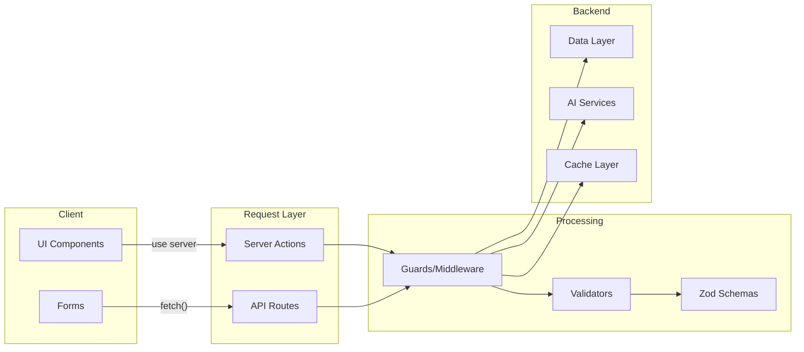
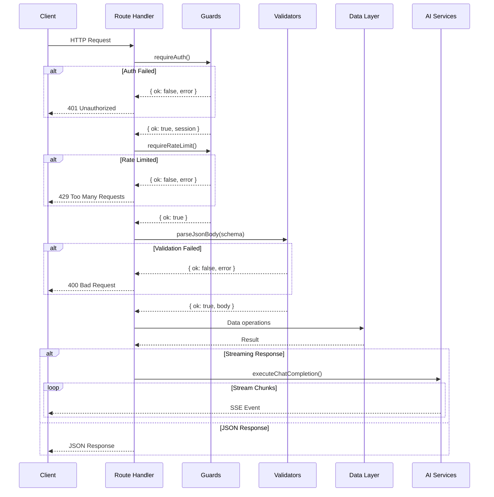
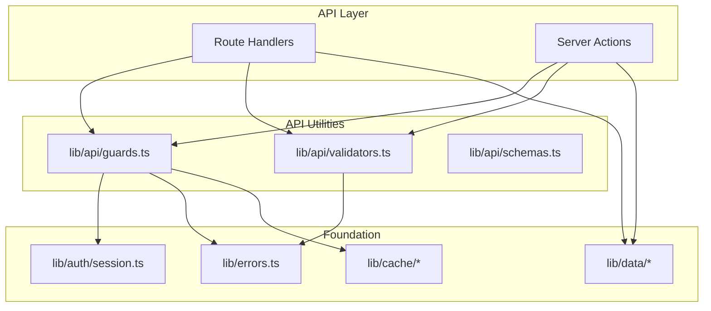

# 10-API-Routes-Optimal-Design

> **Module**: P2.3 - API Routes & Server Actions  
> **Priority**: HIGH (Request Processing Layer)  
> **Status**: DESIGN COMPLETE  
> **Author**: Ouroboros Architect  
> **Date**: 2024-12-17

---

## 1. Feature/Module Purpose

**Business Capability**: Secure, validated, and performant request handling for all client-server interactions.

API routes and server actions form the request processing layer between clients and the data layer:



**Success Criteria**:

- 100% input validation via Zod schemas
- <10ms middleware overhead per request
- Consistent error responses across all routes
- Zero IDOR vulnerabilities (ownership verified)
- Type-safe request/response contracts

---

## 2. Key Requirements

### 2.1 REST Patterns

| Requirement   | Description                                                                                      |
| ------------- | ------------------------------------------------------------------------------------------------ |
| HTTP Methods  | GET (read), POST (create/action), PATCH (update), DELETE (remove)                                |
| Status Codes  | 200/201 success, 400 bad request, 401 unauthorized, 403 forbidden, 404 not found, 429 rate limit |
| Content-Type  | `application/json` for data, `text/event-stream` for SSE                                         |
| Cache Headers | `Cache-Control` with appropriate directives per endpoint                                         |
| Pagination    | Cursor-based with `starting_after`/`ending_before` + `limit`                                     |

### 2.2 Streaming

| Requirement     | Description                                        |
| --------------- | -------------------------------------------------- |
| SSE Protocol    | Server-Sent Events via `JsonToSseTransformStream`  |
| AI Streaming    | `createUIMessageStream` for chat completions       |
| Error Streaming | Error events written to stream with recovery hints |
| Connection      | `maxDuration` config for Vercel Fluid Compute      |

### 2.3 Validation

| Requirement          | Description                               |
| -------------------- | ----------------------------------------- |
| Schema Validation    | Zod schemas for all request bodies        |
| UUID Validation      | `validateUUID()` for all ID parameters    |
| Timestamp Validation | `parseTimestamp()` for date parameters    |
| File Validation      | MIME type + size checks for uploads       |
| Query Params         | `requireQueryParam()` for required params |

### 2.4 Security

| Requirement        | Description                                      |
| ------------------ | ------------------------------------------------ |
| Authentication     | `requireAuth()` / `requireAuthForRoute()` guards |
| Authorization      | `verifyOwnership()` for resource access          |
| Rate Limiting      | Per-user/IP with configurable tiers              |
| CSRF Protection    | `validateOrigin()` for state-changing endpoints  |
| Guest Restrictions | `requireNonGuest()` for DB-persisted operations  |

---

## 3. Quick Current State Notes

### 3.1 Route Organization

**Current Structure**:

```
app/
├── api/
│   └── auth/
│       ├── exchange/     # OAuth exchange
│       ├── guest/        # Guest session creation
│       └── logout/       # Session termination
└── (chat)/
    └── api/
        ├── chat/         # Chat CRUD + streaming
        │   ├── route.ts  # POST (stream), DELETE
        │   ├── schema.ts # Zod validation
        │   └── [id]/     # Per-chat operations
        ├── document/     # Document CRUD
        ├── files/upload/ # File uploads
        ├── health/       # Health checks
        ├── history/      # Chat history list
        ├── suggestions/  # AI suggestions
        └── vote/         # Message voting
```

**Strengths**:

- ✅ Co-located schemas with routes
- ✅ Route groups for auth vs chat
- ✅ Centralized guards in `lib/api/guards.ts`
- ✅ Centralized validators in `lib/api/validators.ts`
- ✅ `maxDuration` configured for Vercel optimization

**Issues**:

- ⚠️ Dual pattern: `requireAuth()` throws, `requireAuthForRoute()` returns Response
- ⚠️ Some routes still use inline validation instead of schemas
- ⚠️ Inconsistent error response patterns
- ⚠️ Cache headers not standardized

### 3.2 Server Actions

**Current Files**:

- `app/(chat)/actions.ts` - Chat mutations (110 lines)
- `artifacts/actions.ts` - Artifact suggestions (65 lines)

**Patterns Used**:

```typescript
// Good: Structured action pattern
export async function generateTitleFromUserMessage({ message }) {
  const { session } = await requireAuth("api");
  await requireRateLimit("strict", session.user.id, "api");
  // ... validation
  return await generateTitle({ message });
}
```

**Strengths**:

- ✅ `"use server"` directive for RSC integration
- ✅ Guard functions for auth/rate-limit
- ✅ Zod validation for inputs
- ✅ `revalidatePath()` for cache invalidation

**Issues**:

- ⚠️ Actions throw errors (caller must catch)
- ⚠️ No standardized return type (`Promise<T>` vs `Promise<void>`)
- ⚠️ Mixed concerns (some actions do too much)

### 3.3 Guard System (lib/api/guards.ts - 353 lines)

**Dual API Pattern**:
| For Server Actions | For API Routes |
|--------------------|----------------|
| `requireAuth()` | `requireAuthForRoute()` |
| `requireRateLimit()` | `requireRateLimitForRoute()` |
| `requireResource()` | `requireResourceForRoute()` |
| `verifyOwnership()` | `verifyOwnershipForRoute()` |

**Problem**: Duplicated implementations for throw vs return patterns.

### 3.4 Validation System (lib/api/validators.ts - 295 lines)

**Functions**:

- `validateUUID()` / `validateUUIDForRoute()`
- `parseTimestamp()` / `parseTimestampForRoute()`
- `requireQueryParam()` / `requireQueryParamForRoute()`
- `parseJsonBody()` / `parseJsonBodyForRoute()`
- `parseFormData()` / `parseFormDataForRoute()`

**Schemas** (lib/api/schemas.ts):

- `uuidSchema`, `visibilitySchema`, `voteTypeSchema`, `artifactKindSchema`
- `createUUIDSchema()`, `createRequiredStringSchema()`

---

## 4. Optimal Architecture Design

### 4.1 Design Decision: Unified Guard Pattern

**ADR-010-001: Eliminate Dual Guard APIs**

**Context**: Current system has paired functions (`requireAuth` + `requireAuthForRoute`) with duplicated logic.

**Decision**: Use a single guard pattern with consistent error propagation.

**Option A: Guards Return Result Object** ✅ SELECTED

```typescript
type GuardResult<T> =
  | { ok: true; value: T }
  | { ok: false; error: ChatSDKError };

async function requireAuth(surface: Surface): Promise<GuardResult<AuthResult>> {
  const session = await getAppSession();
  if (!session?.user) {
    return {
      ok: false,
      error: new ChatSDKError(`unauthorized:${surface}:missing_session`),
    };
  }
  return { ok: true, value: { session, ctx: createContext(session) } };
}

// Usage in route:
const authResult = await requireAuth("chat");
if (!authResult.ok) return authResult.error.toResponse();
const { session, ctx } = authResult.value;

// Usage in action:
const authResult = await requireAuth("chat");
if (!authResult.ok) throw authResult.error;
const { session, ctx } = authResult.value;
```

**Pros**:

- Single implementation per guard
- Caller controls error handling strategy
- Type-safe discrimination

**Cons**:

- Slightly more verbose at call sites
- Migration effort for existing code

**Option B: Keep Dual APIs** ❌ REJECTED

- Rejected because: Maintenance burden, code duplication

**Consequences**:

- **POS-001**: 50% reduction in guard code
- **POS-002**: Single source of truth for guard logic
- **NEG-001**: Requires migration of existing routes

---

### 4.2 Design Decision: Action Return Types

**ADR-010-002: Standardized Action Results**

**Context**: Server actions return mixed types (`void`, `T`, or throw errors).

**Decision**: Use discriminated union for action results.

**Selected Pattern**:

```typescript
// lib/api/action-result.ts
export type ActionResult<T = void> =
    | { success: true; data: T }
    | { success: false; error: { code: string; message: string } };

// Helper to create results
export function actionSuccess<T>(data: T): ActionResult<T> {
    return { success: true, data };
}

export function actionError(error: ChatSDKError): ActionResult<never> {
    return { success: false, error: { code: error.code, message: error.message } };
}

// Usage in action:
export async function updateChatVisibility(input: {...}): Promise<ActionResult> {
    const authResult = await requireAuth("chat");
    if (!authResult.ok) return actionError(authResult.error);

    // ... logic
    return actionSuccess(undefined);
}

// Usage in client:
const result = await updateChatVisibility({ chatId, visibility });
if (!result.success) {
    toast.error(result.error.message);
    return;
}
```

**Consequences**:

- **POS-001**: No try/catch needed at call sites
- **POS-002**: Type-safe error handling
- **NEG-001**: Breaking change for existing callers

---

### 4.3 Design Decision: Route Handler Pattern

**ADR-010-003: Declarative Route Handlers**

**Context**: Route handlers have repetitive auth/validation boilerplate.

**Decision**: Use a route handler factory with declarative config.

**Selected Pattern**:

```typescript
// lib/api/route-handler.ts
type RouteConfig<TBody, TQuery> = {
  surface: Surface;
  method: "GET" | "POST" | "PATCH" | "DELETE";
  auth: "required" | "optional" | "none";
  rateLimit?: "standard" | "strict" | "chat" | "upload";
  guestAllowed?: boolean;
  bodySchema?: ZodSchema<TBody>;
  querySchema?: ZodSchema<TQuery>;
  cacheControl?: string;
  maxDuration?: number;
};

type RouteContext<TBody, TQuery> = {
  session: AppSession | null;
  ctx: DataContext | null;
  body: TBody;
  query: TQuery;
  request: Request;
};

function createRouteHandler<TBody = unknown, TQuery = unknown>(
  config: RouteConfig<TBody, TQuery>,
  handler: (ctx: RouteContext<TBody, TQuery>) => Promise<Response>
) {
  return async (request: Request): Promise<Response> => {
    // 1. Auth check
    if (config.auth === "required") {
      const authResult = await requireAuth(config.surface);
      if (!authResult.ok) return authResult.error.toResponse();
    }

    // 2. Rate limiting
    if (config.rateLimit && session) {
      const rlResult = await requireRateLimit(
        config.rateLimit,
        session.user.id,
        config.surface
      );
      if (!rlResult.ok) return rlResult.error.toResponse();
    }

    // 3. Guest check
    if (!config.guestAllowed && session?.user.type === "guest") {
      return new ChatSDKError(
        `forbidden:${config.surface}:guest_not_allowed`
      ).toResponse();
    }

    // 4. Body validation
    let body: TBody = undefined as TBody;
    if (config.bodySchema) {
      const bodyResult = await parseJsonBody(
        request,
        config.bodySchema,
        config.surface
      );
      if (!bodyResult.ok) return bodyResult.error.toResponse();
      body = bodyResult.value;
    }

    // 5. Query validation
    let query: TQuery = undefined as TQuery;
    if (config.querySchema) {
      const searchParams = getSearchParams(request);
      const queryResult = config.querySchema.safeParse(
        Object.fromEntries(searchParams)
      );
      if (!queryResult.success) {
        return new ChatSDKError(
          `bad_request:${config.surface}:invalid_query`
        ).toResponse();
      }
      query = queryResult.data;
    }

    // 6. Execute handler
    const response = await handler({ session, ctx, body, query, request });

    // 7. Add cache headers
    if (config.cacheControl) {
      response.headers.set("Cache-Control", config.cacheControl);
    }

    return response;
  };
}

// Usage:
export const GET = createRouteHandler(
  {
    surface: "document",
    method: "GET",
    auth: "required",
    rateLimit: "standard",
    querySchema: z.object({ id: z.string().uuid() }),
    cacheControl: "private, max-age=60",
  },
  async ({ session, ctx, query }) => {
    const documents = await documentData.getAll(query.id, ctx);
    return Response.json(documents);
  }
);
```

**Alternative Considered**: Manual boilerplate per route.

- Rejected because: 40+ lines of repetitive code per route.

**Consequences**:

- **POS-001**: ~70% code reduction per route
- **POS-002**: Consistent behavior across all routes
- **POS-003**: Easy to add cross-cutting concerns
- **NEG-001**: Learning curve for factory pattern
- **NEG-002**: Debugging may be less obvious

---

### 4.4 Architecture Diagram: Request Flow



---

### 4.5 File Structure (Optimal)

```
lib/
├── api/
│   ├── index.ts              # Public exports
│   ├── route-handler.ts      # Route handler factory
│   ├── action-result.ts      # Action result types
│   ├── guards.ts             # Auth, rate-limit, ownership guards
│   ├── validators.ts         # Input validators
│   ├── schemas.ts            # Shared Zod schemas
│   └── utils.ts              # IP extraction, origin validation

app/
├── (chat)/
│   ├── actions.ts            # Chat-related server actions
│   └── api/
│       ├── chat/
│       │   ├── route.ts      # Uses createRouteHandler
│       │   └── schema.ts     # Route-specific schemas
│       ├── document/
│       ├── history/
│       ├── suggestions/
│       └── vote/
└── api/
    └── auth/                 # Auth routes (separate from chat)
```

---

## 5. Technology Stack

### 5.1 Next.js 16 Route Handlers

| Feature          | Usage                                           |
| ---------------- | ----------------------------------------------- |
| Route Handlers   | `app/**/route.ts` with HTTP method exports      |
| Server Actions   | `"use server"` directive for form mutations     |
| Request/Response | Web standard `Request`/`Response` objects       |
| Dynamic Params   | `app/chat/[id]/route.ts` → `params.id`          |
| Route Groups     | `(chat)` for layout sharing without URL segment |

### 5.2 Validation

| Library       | Purpose                          |
| ------------- | -------------------------------- |
| Zod           | Schema definition and validation |
| `z.infer<>`   | TypeScript type extraction       |
| `safeParse()` | Non-throwing validation          |

### 5.3 Streaming

| API                        | Purpose                  |
| -------------------------- | ------------------------ |
| `createUIMessageStream`    | AI SDK message streaming |
| `JsonToSseTransformStream` | JSON to SSE conversion   |
| `Response` streaming       | Native web streams       |

### 5.4 Rate Limiting

| Strategy       | Use Case                    |
| -------------- | --------------------------- |
| Token Bucket   | Smooth limiting with bursts |
| Sliding Window | Precise per-minute limits   |
| Fixed Window   | Simple counter limits       |

---

## 6. Bundle Strategy

### 6.1 Server-Only Code

```typescript
// lib/api/guards.ts
import "server-only";  // Prevents client import

// All guard functions are server-only
export async function requireAuth(surface: Surface) { ... }
```

### 6.2 Client-Exposed Types

```typescript
// lib/api/types.ts (client-safe)
export type ActionResult<T = void> =
  | { success: true; data: T }
  | { success: false; error: { code: string; message: string } };

// Can be imported in client components for type safety
```

### 6.3 Bundle Impact

| Module                  | Bundle      | Size        |
| ----------------------- | ----------- | ----------- |
| `lib/api/guards.ts`     | Server only | 0 KB client |
| `lib/api/validators.ts` | Server only | 0 KB client |
| `lib/api/schemas.ts`    | Server only | 0 KB client |
| `lib/api/types.ts`      | Shared      | ~0.5 KB     |

---

## 7. Simplifications

### 7.1 Consolidate Guard Pattern

**Before** (2 functions × 6 guards = 12 functions):

```typescript
export async function requireAuth(surface): Promise<AuthResult> { ... }
export async function requireAuthForRoute(surface): Promise<AuthResult | Response> { ... }
// Repeat for each guard type
```

**After** (1 function × 6 guards = 6 functions):

```typescript
export async function requireAuth(surface): Promise<GuardResult<AuthResult>> { ... }
// Caller handles error conversion
```

**Impact**: ~150 lines removed from guards.ts

### 7.2 Standardize Cache Headers

**Define constants**:

```typescript
// lib/api/cache-policies.ts
export const CACHE_POLICIES = {
  PRIVATE_SHORT: "private, max-age=60",
  PRIVATE_MEDIUM: "private, max-age=300",
  PRIVATE_REVALIDATE:
    "private, max-age=0, s-maxage=10, stale-while-revalidate=30",
  NO_STORE: "no-store",
} as const;
```

### 7.3 Simplify Streaming Routes

**Extract streaming setup**:

```typescript
// lib/api/streaming.ts
export function createStreamingResponse(
  execute: (writer: DataStreamWriter) => void,
  options?: { onFinish?: () => void; onError?: (error: Error) => string }
): Response {
  const stream = createUIMessageStream({
    execute: ({ writer }) => execute(writer),
    generateId: generateUUID,
    onFinish: options?.onFinish,
    onError: options?.onError ?? (() => "An error occurred"),
  });
  return new Response(stream.pipeThrough(new JsonToSseTransformStream()));
}
```

---

## 8. Dependencies

### 8.1 Internal Dependencies



### 8.2 Dependency Matrix

| Module                  | Depends On                | Depended By                |
| ----------------------- | ------------------------- | -------------------------- |
| `lib/api/guards.ts`     | auth, errors, cache, data | routes, actions            |
| `lib/api/validators.ts` | errors                    | routes, actions            |
| `lib/api/schemas.ts`    | zod                       | validators, routes         |
| `lib/errors.ts`         | -                         | guards, validators, routes |
| `lib/auth/session.ts`   | cache                     | guards                     |
| `lib/data/*`            | db, cache                 | routes, actions            |

---

## 9. Public Interface

### 9.1 Guard Functions

```typescript
// lib/api/guards.ts
export type GuardResult<T> =
  | { ok: true; value: T }
  | { ok: false; error: ChatSDKError };
export type AuthResult = { session: AppSession; ctx: DataContext };

export function requireAuth(surface: Surface): Promise<GuardResult<AuthResult>>;
export function requireRateLimit(
  type: RateLimitType,
  id: string,
  surface: Surface
): Promise<GuardResult<RateLimitResult>>;
export function requireResource<T>(
  resource: T | null,
  surface: Surface
): GuardResult<T>;
export function verifyOwnership(
  resource: OwnedResource,
  session: AppSession,
  surface: Surface
): GuardResult<void>;
export function requireNonGuest(
  session: AppSession,
  surface: Surface,
  action: string
): GuardResult<void>;
```

### 9.2 Validators

```typescript
// lib/api/validators.ts
export function validateUUID(
  value: string,
  paramName: string,
  surface?: Surface
): GuardResult<void>;
export function parseTimestamp(
  value: string,
  paramName: string,
  surface?: Surface
): GuardResult<Date>;
export function requireQueryParam(
  params: URLSearchParams,
  name: string,
  surface?: Surface
): GuardResult<string>;
export function parseJsonBody<T>(
  request: Request,
  schema: ZodSchema<T>,
  route: string
): Promise<GuardResult<T>>;
export function parseFormData(
  request: Request,
  route: string
): Promise<GuardResult<FormData>>;
```

### 9.3 Action Results

```typescript
// lib/api/action-result.ts
export type ActionResult<T = void> =
  | { success: true; data: T }
  | { success: false; error: { code: string; message: string } };

export function actionSuccess<T>(data: T): ActionResult<T>;
export function actionError(error: ChatSDKError): ActionResult<never>;
```

### 9.4 Route Handler Factory

```typescript
// lib/api/route-handler.ts
export type RouteConfig<TBody, TQuery> = {
  surface: Surface;
  method: "GET" | "POST" | "PATCH" | "DELETE";
  auth: "required" | "optional" | "none";
  rateLimit?: RateLimitType;
  guestAllowed?: boolean;
  bodySchema?: ZodSchema<TBody>;
  querySchema?: ZodSchema<TQuery>;
  cacheControl?: string;
  maxDuration?: number;
};

export function createRouteHandler<TBody, TQuery>(
  config: RouteConfig<TBody, TQuery>,
  handler: (ctx: RouteContext<TBody, TQuery>) => Promise<Response>
): (request: Request) => Promise<Response>;
```

---

## 10. Performance Optimizations

### 10.1 Streaming

| Optimization        | Implementation                              |
| ------------------- | ------------------------------------------- |
| Early Header Flush  | Send `200 OK` before processing completes   |
| Chunked Transfer    | Stream AI responses in real-time            |
| Parallel Operations | `Promise.all()` for independent async work  |
| Background Tasks    | Title generation runs parallel to streaming |

**Example**:

```typescript
// Start title generation early (non-blocking)
const titlePromise = generateTitleFromUserMessage({ message });

// Stream AI response while title generates
const stream = createUIMessageStream({
    execute: ({ writer }) => {
        // When title ready, send to client
        titlePromise.then(title => {
            writer.write({ type: 'data-chatTitle', data: title });
        });
        // Continue streaming AI response
        executeChatCompletion({ ... });
    }
});
```

### 10.2 Caching Headers

| Endpoint               | Cache Policy                                      | Rationale                 |
| ---------------------- | ------------------------------------------------- | ------------------------- |
| `GET /api/history`     | `private, s-maxage=10, stale-while-revalidate=30` | Allow brief CDN cache     |
| `GET /api/document`    | `private, max-age=60`                             | User-specific, cacheable  |
| `GET /api/suggestions` | `private, max-age=300`                            | Stable data, longer cache |
| `POST /api/chat`       | `no-store`                                        | Streaming, no cache       |
| `DELETE /*`            | `no-store`                                        | Mutations never cached    |

### 10.3 Rate Limiting Efficiency

```typescript
// Use single Redis GET instead of multiple operations
const rateLimitResult = await RateLimiters.chat(userId);
// Token bucket allows bursts while maintaining average rate
```

### 10.4 Validation Performance

```typescript
// Schema compiled once at module load
const postRequestBodySchema = z.object({ ... });

// safeParse is faster than parse + try/catch
const result = postRequestBodySchema.safeParse(body);
```

### 10.5 Database Query Optimization

```typescript
// Parallelize independent queries
const [userMessageCount, chatWithMessages] = await Promise.all([
  getUserMessageCount(session.user.id), // Redis ~10-20ms
  chatData.getWithMessages(id, ctx), // PostgreSQL ~50-100ms
]);
// Total: max(20ms, 100ms) = ~100ms instead of 120ms sequential
```

---

## 11. Implementation Notes

### 11.1 Migration Strategy

**Phase 1: Add New Patterns** (Non-breaking)

1. Create `GuardResult<T>` type
2. Add `actionSuccess()` / `actionError()` helpers
3. Create `createRouteHandler()` factory

**Phase 2: Migrate Routes** (Incremental)

1. Convert one route at a time to factory pattern
2. Update tests alongside each route
3. Deprecate old guard functions with warnings

**Phase 3: Cleanup** (Breaking)

1. Remove dual guard APIs
2. Update all actions to use `ActionResult`
3. Remove deprecated functions

### 11.2 Testing Strategy

```typescript
// Route handler tests
describe("GET /api/document", () => {
  it("returns 401 for unauthenticated requests", async () => {
    const response = await GET(mockRequest({ authenticated: false }));
    expect(response.status).toBe(401);
  });

  it("returns 403 for non-owner access", async () => {
    const response = await GET(mockRequest({ userId: "other-user" }));
    expect(response.status).toBe(403);
  });

  it("returns 429 when rate limited", async () => {
    // Exhaust rate limit
    for (let i = 0; i < 100; i++) await GET(mockRequest());
    const response = await GET(mockRequest());
    expect(response.status).toBe(429);
  });
});
```

### 11.3 Error Handling

```typescript
// Standard error response format
{
    "code": "unauthorized:chat:missing_session",
    "message": "Please sign in to continue",
    "statusCode": 401
}

// Streaming error event
{
    "type": "error",
    "errorText": "Failed to start AI completion. Please try again."
}
```

---

## 12. Quality Checklist

- [x] Considered 3+ design options (guard patterns, action results, route handlers)
- [x] Documented WHY each option was chosen
- [x] Explained why alternatives were rejected
- [x] Listed BOTH positive and negative consequences
- [x] Addressed Security considerations (auth, rate limiting, CSRF, IDOR)
- [x] Addressed Performance implications (streaming, caching, parallelization)
- [x] Addressed Scalability concerns (rate limiting strategies, cache policies)
- [x] Included implementation notes
- [x] Added diagrams for request flow

---

## 13. References

- [01-error-handling-optimal-design.md](01-error-handling-optimal-design.md) - Error types and handling
- [02-authentication-optimal-design.md](02-authentication-optimal-design.md) - Session management
- [03-data-layer-optimal-design.md](03-data-layer-optimal-design.md) - Data access patterns
- [04-cache-layer-optimal-design.md](04-cache-layer-optimal-design.md) - Caching strategies
- [Next.js Route Handlers](https://nextjs.org/docs/app/building-your-application/routing/route-handlers)
- [Zod Documentation](https://zod.dev/)
