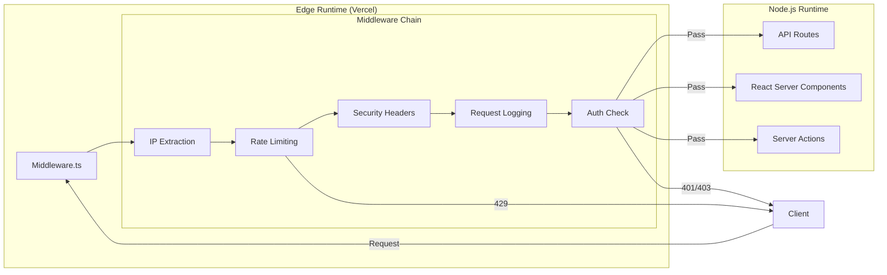
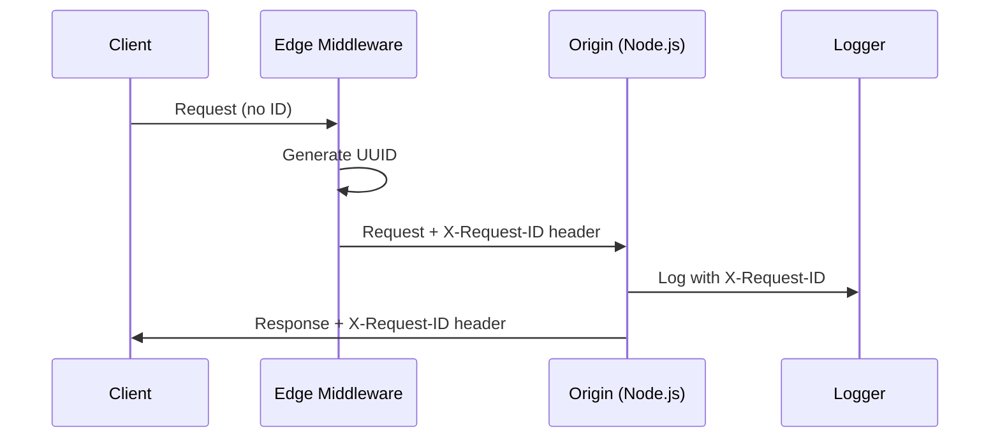
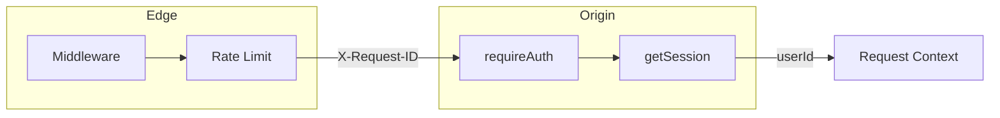
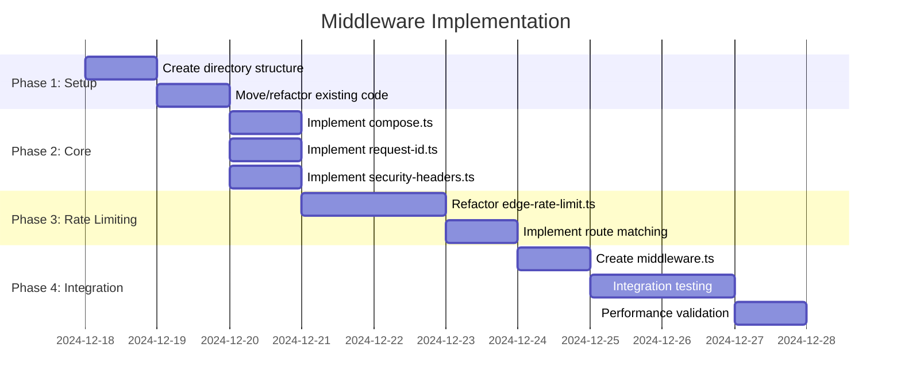

# 11-Middleware-Optimal-Design

> **Module**: P2.4 - Middleware & Infrastructure  
> **Priority**: HIGH (Cross-Cutting Concern)  
> **Status**: DESIGN COMPLETE  
> **Author**: Ouroboros Architect  
> **Date**: 2024-12-17

---

## 1. Feature/Module Purpose

**Business Capability**: Centralized request processing at the Edge for security, observability, and performance.

Next.js middleware operates at the Edge, intercepting requests before they reach the Node.js runtime:



**Why Edge Middleware?**

1. **Latency**: Sub-10ms response for blocked requests (no cold start)
2. **Security**: Block malicious requests before origin processing
3. **Cost**: Reduce origin compute for rate-limited/unauthorized requests
4. **Observability**: Single point for request logging and tracing

**Success Criteria**:

- <5ms middleware execution time (P95)
- Zero false-positive rate limit blocks
- 100% request correlation via `X-Request-ID`
- Security headers on all responses
- Graceful degradation if Redis unavailable

---

## 2. Key Requirements

### 2.1 Edge Runtime Constraints

| Constraint           | Impact                         | Solution                                |
| -------------------- | ------------------------------ | --------------------------------------- |
| No Node.js APIs      | Can't use `fs`, `crypto`, etc. | Use Web Crypto API, fetch-based clients |
| No `server-only`     | Can't import Node modules      | Separate Edge-compatible modules        |
| 25ms execution limit | Must be fast                   | Minimal logic, async operations         |
| 128KB bundle limit   | Keep dependencies small        | Tree-shake, no heavy libs               |
| No AsyncLocalStorage | Can't use Node context         | Headers-based context propagation       |

### 2.2 Rate Limiting

| Requirement      | Description                                 |
| ---------------- | ------------------------------------------- |
| Edge-Compatible  | Upstash Redis via HTTP (fetch-based)        |
| Route-Specific   | Different limits per endpoint type          |
| Fail-Open/Closed | Configurable per endpoint criticality       |
| IP Extraction    | Support X-Forwarded-For, X-Real-IP          |
| Burst Handling   | Sliding window for smooth limiting          |
| Response Headers | X-RateLimit-\* headers for client awareness |

### 2.3 Security Headers

| Header                                             | Purpose                                      |
| -------------------------------------------------- | -------------------------------------------- |
| `X-Frame-Options: DENY`                            | Prevent clickjacking                         |
| `X-Content-Type-Options: nosniff`                  | Prevent MIME sniffing                        |
| `X-XSS-Protection: 1; mode=block`                  | XSS protection (legacy)                      |
| `Referrer-Policy: strict-origin-when-cross-origin` | Privacy                                      |
| `Permissions-Policy`                               | Disable unnecessary browser features         |
| `Content-Security-Policy`                          | Script/style sources (report-only initially) |

### 2.4 Request Context Propagation

| Requirement           | Description                                  |
| --------------------- | -------------------------------------------- |
| Request ID Generation | UUID v4 at Edge, propagate via header        |
| Header Propagation    | `X-Request-ID` header added to all requests  |
| Correlation           | Same ID used in logs, responses, downstream  |
| Origin Extraction     | Read existing header if present (from proxy) |

### 2.5 Auth Pre-Check (Optional)

| Requirement        | Description                              |
| ------------------ | ---------------------------------------- |
| Session Validation | Quick cookie presence check              |
| Protected Routes   | Redirect unauthenticated to login        |
| Public Routes      | Skip auth check for marketing/docs       |
| Guest Allowance    | Allow guest sessions for specific routes |

---

## 3. Quick Current State Notes

### 3.1 File Structure

```
lib/middleware/
├── edge-rate-limit.ts    # 192 lines - Upstash-based Edge rate limiting
├── rate-limit.ts         # 476 lines - Full Node.js rate limiting (3 algorithms)
├── rate-limit-config.ts  # 128 lines - Centralized rate limit constants
└── deduplication.ts      # 387 lines - Request deduplication (Node.js only)
```

**No middleware.ts file exists** - Edge middleware not yet implemented.

### 3.2 What Exists

**Edge Rate Limiting** (edge-rate-limit.ts):

```typescript
// ✅ Strengths:
- Upstash @upstash/ratelimit for Edge
- Sliding window algorithm
- Pre-configured limiters (api, strict, auth)
- Fail-open/fail-closed per endpoint
- getClientIP() helper

// ⚠️ Issues:
- Not integrated into actual middleware
- No security headers
- No request ID generation
```

**Rate Limit Config** (rate-limit-config.ts):

```typescript
RATE_LIMITS = {
  EDGE_API: { limit: 100, window: 60, prefix: "edge:api" },
  EDGE_STRICT: { limit: 10, window: 60, prefix: "edge:strict" },
  EDGE_AUTH: { limit: 20, window: 60, prefix: "edge:auth" },
  // ... Node.js specific limits
};
```

**Request Context** (request-context.ts):

```typescript
// ✅ Strengths:
- AsyncLocalStorage for request scope
- generateRequestId() using UUID
- createContextFromHeaders() for X-Request-ID extraction

// ⚠️ Issues:
- Uses "server-only" - NOT Edge compatible
- Relies on AsyncLocalStorage - Node.js only
```

### 3.3 Gaps

| Gap                   | Impact                            |
| --------------------- | --------------------------------- |
| No middleware.ts      | Rate limiting not applied at Edge |
| No security headers   | Missing basic protections         |
| No Edge request ID    | Context not set at Edge           |
| No path-based routing | All requests treated same         |
| No auth pre-check     | Auth happens at route level       |

---

## 4. Optimal Architecture Design

### 4.1 Design Decision: Composable Middleware Chain

**ADR-011-001: Middleware Composition Pattern**

**Context**: Need to run multiple middleware functions (rate limit, security headers, logging, auth) without coupling them together.

**Decision**: Implement composable middleware using functional composition pattern:

```typescript
// Each middleware returns NextResponse or undefined (continue)
type MiddlewareFn = (
  request: NextRequest,
  event: NextFetchEvent
) =>
  | NextResponse
  | Response
  | undefined
  | Promise<NextResponse | Response | undefined>;

// Compose middleware in order
function composeMiddleware(...middlewares: MiddlewareFn[]) {
  return async (request: NextRequest, event: NextFetchEvent) => {
    for (const mw of middlewares) {
      const response = await mw(request, event);
      if (response) return response; // Short-circuit
    }
    return NextResponse.next(); // Continue to origin
  };
}
```

**Alternatives Considered**:

- **ALT-001: Monolithic middleware** - Single function with all logic → Rejected: Hard to test, maintain
- **ALT-002: Middleware stack pattern** - Express-style next() calls → Rejected: Doesn't fit Next.js model

**Consequences**:

- **POS-001**: Each middleware independently testable
- **POS-002**: Easy to reorder or disable middleware
- **POS-003**: Clear separation of concerns
- **NEG-001**: Multiple awaits (minor performance impact)

---

### 4.2 Design Decision: Edge-First Request ID

**ADR-011-002: Request ID at Edge**

**Context**: Request IDs need to be available for logging in both Edge and Node.js runtimes.

**Decision**: Generate request ID at Edge, propagate via headers:



**Alternatives Considered**:

- **ALT-001: Client-generated ID** → Rejected: Can't trust client
- **ALT-002: Origin-generated ID** → Rejected: Edge logs miss correlation

**Implementation**:

```typescript
function requestIdMiddleware(request: NextRequest): NextResponse | undefined {
  const existingId = request.headers.get("x-request-id");
  const requestId = existingId || crypto.randomUUID();

  // Clone request with header
  const requestHeaders = new Headers(request.headers);
  requestHeaders.set("x-request-id", requestId);

  return NextResponse.next({
    request: { headers: requestHeaders },
  });
}
```

---

### 4.3 Design Decision: Route-Based Rate Limiting

**ADR-011-003: Path-Based Rate Limit Tiers**

**Context**: Different routes have different rate limit requirements (auth stricter than public).

**Decision**: Pattern-matched route groups with specific limits:

```typescript
const ROUTE_RATE_LIMITS: RouteRateLimitConfig[] = [
  // Auth routes - strict, fail-closed
  { pattern: /^\/api\/auth\//, tier: "auth", failClosed: true },

  // Chat streaming - moderate, fail-open
  { pattern: /^\/api\/chat/, tier: "chat", failClosed: false },

  // File uploads - very strict
  { pattern: /^\/api\/files/, tier: "upload", failClosed: false },

  // General API - standard limits
  { pattern: /^\/api\//, tier: "api", failClosed: false },

  // Public routes - generous
  { pattern: /^\//, tier: "generous", failClosed: false },
];
```

**Tier Definitions** (using existing config):

```typescript
const TIERS = {
  auth: RATE_LIMITS.EDGE_AUTH, // 20/min, fail-closed
  strict: RATE_LIMITS.EDGE_STRICT, // 10/min
  chat: { limit: 50, window: 60 }, // 50/min
  api: RATE_LIMITS.EDGE_API, // 100/min
  upload: { limit: 10, window: 3600 }, // 10/hour
  generous: { limit: 1000, window: 60 }, // 1000/min
};
```

---

### 4.4 Design Decision: Security Headers via Middleware

**ADR-011-004: Centralized Security Headers**

**Context**: Security headers need to be on ALL responses, not just HTML pages.

**Decision**: Apply headers in middleware response modification:

```typescript
const SECURITY_HEADERS: Record<string, string> = {
  "X-Frame-Options": "DENY",
  "X-Content-Type-Options": "nosniff",
  "X-XSS-Protection": "1; mode=block",
  "Referrer-Policy": "strict-origin-when-cross-origin",
  "Permissions-Policy": "camera=(), microphone=(), geolocation=()",
};

// Optional: CSP for HTML responses only
const CSP_HEADER =
  "default-src 'self'; script-src 'self' 'unsafe-inline' 'unsafe-eval'; style-src 'self' 'unsafe-inline';";

function securityHeadersMiddleware(
  request: NextRequest,
  response: NextResponse
): NextResponse {
  for (const [key, value] of Object.entries(SECURITY_HEADERS)) {
    response.headers.set(key, value);
  }

  // CSP only for HTML responses
  if (request.headers.get("accept")?.includes("text/html")) {
    response.headers.set("Content-Security-Policy-Report-Only", CSP_HEADER);
  }

  return response;
}
```

**Note**: CSP is report-only initially to avoid breaking existing functionality.

---

### 4.5 Target Architecture

```
middleware.ts                    # Entry point - Edge runtime
├── imports from lib/middleware/edge/
│
lib/middleware/
├── edge/                        # NEW: Edge-compatible modules
│   ├── compose.ts              # Middleware composition
│   ├── rate-limit.ts           # Edge rate limiting (moved from edge-rate-limit.ts)
│   ├── security-headers.ts     # Security header middleware
│   ├── request-id.ts           # Request ID generation
│   ├── logging.ts              # Edge request logging
│   └── routes.ts               # Route matching utilities
│
├── node/                        # NEW: Node.js-only modules
│   ├── rate-limit.ts           # Full rate limiting (moved from rate-limit.ts)
│   ├── deduplication.ts        # Request deduplication (moved)
│   └── context.ts              # AsyncLocalStorage context (moved from request-context.ts)
│
└── config/
    └── rate-limits.ts          # Shared config (moved from rate-limit-config.ts)
```

---

## 5. Technology Stack

### 5.1 Edge Runtime

| Component        | Technology         | Rationale                         |
| ---------------- | ------------------ | --------------------------------- |
| Rate Limiting    | @upstash/ratelimit | Edge-native, Redis HTTP API       |
| Redis            | Upstash Redis      | Serverless, Edge-compatible       |
| UUID Generation  | Web Crypto API     | crypto.randomUUID() - Edge native |
| Pattern Matching | URLPattern         | Native Web API                    |

### 5.2 Node.js Runtime

| Component       | Technology        | Rationale                      |
| --------------- | ----------------- | ------------------------------ |
| Request Context | AsyncLocalStorage | Node.js native, request-scoped |
| Rate Limiting   | ioredis           | Full Redis protocol support    |
| Deduplication   | Redis + in-memory | Distributed + fast path        |

### 5.3 Shared

| Component         | Technology              | Rationale                   |
| ----------------- | ----------------------- | --------------------------- |
| Rate Limit Config | TypeScript constants    | Single source of truth      |
| Types             | Shared type definitions | Type safety across runtimes |

---

## 6. Bundle Strategy

### 6.1 Edge Bundle (<128KB limit)

**Target**: <50KB gzipped for middleware bundle

| Dependency         | Size (gzipped) | Action                       |
| ------------------ | -------------- | ---------------------------- |
| @upstash/ratelimit | ~8KB           | Keep - Essential             |
| @upstash/redis     | ~5KB           | Keep - Required by ratelimit |
| crypto (Web API)   | 0KB            | Native - No bundle impact    |
| URLPattern         | 0KB            | Native - No bundle impact    |

**Forbidden in Edge**:

- ❌ `server-only` imports
- ❌ AsyncLocalStorage
- ❌ Node.js `crypto` module
- ❌ ioredis (uses TCP sockets)
- ❌ OpenTelemetry SDK (too heavy)

### 6.2 Tree Shaking

```typescript
// middleware.ts - Edge entry point
// Only import Edge-compatible modules
import { composeMiddleware } from "./lib/middleware/edge/compose";
import { rateLimitMiddleware } from "./lib/middleware/edge/rate-limit";
import { securityHeadersMiddleware } from "./lib/middleware/edge/security-headers";
import { requestIdMiddleware } from "./lib/middleware/edge/request-id";

// Do NOT import:
// import { checkRateLimit } from './lib/middleware/node/rate-limit'; ❌
```

---

## 7. Simplifications

### 7.1 Removed Complexity

| Current                    | Simplified                          |
| -------------------------- | ----------------------------------- |
| Dual rate-limit files      | Split by runtime (edge/ vs node/)   |
| Mixed Edge/Node code       | Clear separation in directories     |
| No middleware.ts           | Single entry point with composition |
| Scattered security headers | Centralized in middleware           |

### 7.2 Deferred Features

| Feature             | Reason                 | When                |
| ------------------- | ---------------------- | ------------------- |
| Bot detection       | Requires ML/heuristics | Future iteration    |
| Geo-blocking        | Not currently needed   | On-demand           |
| A/B testing routing | Out of scope           | Separate initiative |
| WAF integration     | Handled by Vercel      | N/A                 |

---

## 8. Dependencies

### 8.1 Upstream Dependencies

| Module                                 | Depends On    | Interface                                                     |
| -------------------------------------- | ------------- | ------------------------------------------------------------- |
| `lib/middleware/edge/rate-limit.ts`    | Upstash Redis | `UPSTASH_REDIS_REST_URL`, `UPSTASH_REDIS_REST_TOKEN` env vars |
| `lib/middleware/config/rate-limits.ts` | None          | Exports `RATE_LIMITS` constant                                |

### 8.2 Downstream Dependents

| Module             | Used By                 | Interface                 |
| ------------------ | ----------------------- | ------------------------- |
| Request ID header  | All API routes, logging | `X-Request-ID` header     |
| Rate limit headers | Client error handling   | `X-RateLimit-*` headers   |
| Security headers   | Browser security        | Standard security headers |

### 8.3 Integration with Auth (02-authentication)



**Note**: Full auth validation happens at origin, not Edge. Edge only does quick cookie presence check for protected routes.

### 8.4 Integration with Cache (04-cache-layer)

```typescript
// Edge rate limiting uses Upstash Redis (separate from app cache)
// App cache may use different Redis instance or strategy

// Rate limit config is shared
import { RATE_LIMITS } from '@/lib/middleware/config/rate-limits';

// Edge uses:
const limiter = new Ratelimit({ redis: upstashRedis, ... });

// Node.js uses (for route-level rate limiting):
const result = await checkRateLimit({ ...RATE_LIMITS.CHAT, identifier });
```

---

## 9. Public Interface

### 9.1 Middleware Entry Point

```typescript
// middleware.ts
import { NextRequest, NextResponse, NextFetchEvent } from "next/server";
import { composeMiddleware } from "@/lib/middleware/edge/compose";
import { requestIdMiddleware } from "@/lib/middleware/edge/request-id";
import { rateLimitMiddleware } from "@/lib/middleware/edge/rate-limit";
import { securityHeadersMiddleware } from "@/lib/middleware/edge/security-headers";
import { loggingMiddleware } from "@/lib/middleware/edge/logging";

export const middleware = composeMiddleware(
  requestIdMiddleware, // 1. Generate/extract request ID
  loggingMiddleware, // 2. Log request start
  rateLimitMiddleware, // 3. Check rate limits
  securityHeadersMiddleware // 4. Add security headers
);

export const config = {
  matcher: [
    // Match all paths except static files
    "/((?!_next/static|_next/image|favicon.ico|.*\\.(?:svg|png|jpg|jpeg|gif|webp)$).*)",
  ],
};
```

### 9.2 Edge Module Exports

```typescript
// lib/middleware/edge/compose.ts
export type MiddlewareFn = (
  request: NextRequest,
  event: NextFetchEvent
) =>
  | NextResponse
  | Response
  | undefined
  | Promise<NextResponse | Response | undefined>;

export function composeMiddleware(
  ...middlewares: MiddlewareFn[]
): (request: NextRequest, event: NextFetchEvent) => Promise<NextResponse>;

// lib/middleware/edge/rate-limit.ts
export type EdgeRateLimitOptions = {
  identifier: string;
  limit: number;
  windowSeconds: number;
  prefix?: string;
  failClosed?: boolean;
};

export type EdgeRateLimitResult = {
  allowed: boolean;
  remaining: number;
  limit: number;
  retryAfter?: number;
};

export function rateLimitMiddleware(
  request: NextRequest,
  event: NextFetchEvent
): Promise<NextResponse | undefined>;

export function checkEdgeRateLimit(
  options: EdgeRateLimitOptions
): Promise<EdgeRateLimitResult>;
export function getClientIP(request: Request): string;

// lib/middleware/edge/security-headers.ts
export const SECURITY_HEADERS: Record<string, string>;
export function securityHeadersMiddleware(
  request: NextRequest
): NextResponse | undefined;

// lib/middleware/edge/request-id.ts
export function requestIdMiddleware(
  request: NextRequest
): NextResponse | undefined;
export function getRequestId(request: NextRequest): string;

// lib/middleware/edge/logging.ts
export function loggingMiddleware(
  request: NextRequest,
  event: NextFetchEvent
): undefined;

// lib/middleware/edge/routes.ts
export type RouteRateLimitConfig = {
  pattern: RegExp;
  tier: keyof typeof RATE_LIMITS;
  failClosed: boolean;
};

export function matchRoute(pathname: string): RouteRateLimitConfig | undefined;
export function isPublicRoute(pathname: string): boolean;
export function isApiRoute(pathname: string): boolean;
```

### 9.3 Node.js Module Exports (unchanged, reorganized)

```typescript
// lib/middleware/node/rate-limit.ts
export type RateLimitConfig = { ... }; // Existing types
export type RateLimitResult = { ... };
export function checkRateLimit(config: RateLimitConfig): Promise<RateLimitResult>;
export const RateLimiters: { ... }; // Pre-configured limiters

// lib/middleware/node/deduplication.ts
export type DeduplicationConfig = { ... };
export function deduplicateRequest<T>(...): Promise<{ wasDuplicate: boolean; response: T }>;
export function withDeduplication<T>(...): Promise<{ wasDuplicate: boolean; response: T }>;

// lib/middleware/node/context.ts
export type RequestContext = { ... };
export function runWithRequestContext<T>(...): T;
export function getRequestContext(): RequestContext | undefined;
export function getRequestId(): string | undefined;
```

### 9.4 Response Headers Contract

**Rate Limit Headers** (on 429 response):

```http
HTTP/1.1 429 Too Many Requests
X-RateLimit-Limit: 100
X-RateLimit-Remaining: 0
X-RateLimit-Reset: 1702857600000
Retry-After: 45
Content-Type: application/json

{"error":"Rate limit exceeded","retryAfter":45}
```

**Request ID Header** (on all responses):

```http
X-Request-ID: 550e8400-e29b-41d4-a716-446655440000
```

**Security Headers** (on all responses):

```http
X-Frame-Options: DENY
X-Content-Type-Options: nosniff
X-XSS-Protection: 1; mode=block
Referrer-Policy: strict-origin-when-cross-origin
Permissions-Policy: camera=(), microphone=(), geolocation=()
```

---

## 10. Performance Optimizations

### 10.1 Edge Execution Time Budget

**Target**: <5ms P95 execution time

| Operation             | Budget | Strategy                    |
| --------------------- | ------ | --------------------------- |
| Request ID generation | <0.1ms | crypto.randomUUID() is fast |
| Route matching        | <0.5ms | Pre-compiled RegExp         |
| Rate limit check      | <3ms   | Upstash HTTP API            |
| Header setting        | <0.1ms | Simple assignment           |
| Total                 | <4ms   | Buffer for variance         |

### 10.2 Cold Start Mitigation

```typescript
// Lazy initialization - only create client when needed
let rateLimiter: Ratelimit | null = null;

function getRateLimiter(): Ratelimit | null {
  if (rateLimiter) return rateLimiter;

  const redis = getEdgeRedis();
  if (!redis) return null;

  rateLimiter = new Ratelimit({
    redis,
    limiter: Ratelimit.slidingWindow(100, "60s"),
    analytics: false, // Disable in production for speed
  });

  return rateLimiter;
}
```

### 10.3 Skip Patterns

```typescript
// Skip middleware for static assets (handled by matcher, but double-check)
const SKIP_PATTERNS = [
  /^\/(_next|static)\//,
  /\.(ico|png|jpg|jpeg|gif|svg|webp|woff|woff2)$/,
];

function shouldSkip(pathname: string): boolean {
  return SKIP_PATTERNS.some((p) => p.test(pathname));
}
```

### 10.4 Fail-Open Strategy

```typescript
// For non-critical paths, allow request if rate limiting fails
async function rateLimitMiddleware(
  request: NextRequest
): Promise<NextResponse | undefined> {
  const route = matchRoute(request.nextUrl.pathname);

  try {
    const result = await checkEdgeRateLimit({
      identifier: getClientIP(request),
      limit: route.limit,
      windowSeconds: route.window,
      failClosed: route.failClosed,
    });

    if (!result.allowed) {
      return new NextResponse(
        JSON.stringify({ error: "Rate limit exceeded" }),
        { status: 429, headers: rateLimitHeaders(result) }
      );
    }
  } catch (error) {
    // Log error but don't block request (fail-open)
    console.error("Rate limit check failed:", error);
    // For auth routes, fail-closed
    if (route.failClosed) {
      return new NextResponse(
        JSON.stringify({ error: "Service temporarily unavailable" }),
        { status: 503 }
      );
    }
  }

  return undefined; // Continue to origin
}
```

### 10.5 Analytics Deferral

```typescript
// Use waitUntil for non-blocking analytics
export function loggingMiddleware(
  request: NextRequest,
  event: NextFetchEvent
): undefined {
  const requestId = getRequestId(request);
  const pathname = request.nextUrl.pathname;
  const ip = getClientIP(request);

  // Don't block response for analytics
  event.waitUntil(
    logRequestAsync({
      requestId,
      pathname,
      ip,
      timestamp: Date.now(),
    })
  );

  return undefined; // Continue chain
}
```

---

## 11. Implementation Sequence



### Task Breakdown

| Task                              | File                                      | Effort | Dependencies |
| --------------------------------- | ----------------------------------------- | ------ | ------------ |
| T1: Create edge/ directory        | `lib/middleware/edge/`                    | 0.5h   | None         |
| T2: Create node/ directory        | `lib/middleware/node/`                    | 0.5h   | None         |
| T3: Move rate-limit config        | `lib/middleware/config/rate-limits.ts`    | 1h     | T1, T2       |
| T4: Implement compose.ts          | `lib/middleware/edge/compose.ts`          | 2h     | T1           |
| T5: Implement request-id.ts       | `lib/middleware/edge/request-id.ts`       | 1h     | T1           |
| T6: Implement security-headers.ts | `lib/middleware/edge/security-headers.ts` | 1h     | T1           |
| T7: Implement logging.ts          | `lib/middleware/edge/logging.ts`          | 1h     | T5           |
| T8: Implement routes.ts           | `lib/middleware/edge/routes.ts`           | 2h     | T3           |
| T9: Refactor edge rate limit      | `lib/middleware/edge/rate-limit.ts`       | 3h     | T3, T8       |
| T10: Create middleware.ts         | `middleware.ts`                           | 2h     | T4-T9        |
| T11: Move Node.js modules         | `lib/middleware/node/*.ts`                | 2h     | T3           |
| T12: Update imports               | All consumers                             | 2h     | T11          |
| T13: Integration tests            | `tests/middleware/`                       | 4h     | T10          |
| T14: Performance validation       | Manual testing                            | 2h     | T13          |

**Total Estimated Effort**: ~24h (3 developer days)

---

## 12. Testing Strategy

### 12.1 Unit Tests

```typescript
// tests/middleware/compose.test.ts
describe("composeMiddleware", () => {
  it("executes middleware in order", async () => {});
  it("short-circuits on response", async () => {});
  it("continues on undefined", async () => {});
});

// tests/middleware/rate-limit.test.ts
describe("rateLimitMiddleware", () => {
  it("allows requests under limit", async () => {});
  it("blocks requests over limit", async () => {});
  it("fails open when Redis unavailable", async () => {});
  it("fails closed for auth routes", async () => {});
});

// tests/middleware/security-headers.test.ts
describe("securityHeadersMiddleware", () => {
  it("adds all security headers", async () => {});
  it("adds CSP for HTML requests", async () => {});
});
```

### 12.2 Integration Tests

```typescript
// tests/e2e/middleware.spec.ts
test.describe("Middleware", () => {
  test("adds X-Request-ID to all responses", async ({ request }) => {
    const response = await request.get("/api/health");
    expect(response.headers()["x-request-id"]).toMatch(/^[a-f0-9-]{36}$/);
  });

  test("returns 429 on rate limit exceeded", async ({ request }) => {
    // Send 100+ requests rapidly
    const responses = await Promise.all(
      Array(150)
        .fill(null)
        .map(() => request.get("/api/health"))
    );
    const rateLimited = responses.filter((r) => r.status() === 429);
    expect(rateLimited.length).toBeGreaterThan(0);
  });

  test("includes security headers", async ({ request }) => {
    const response = await request.get("/");
    expect(response.headers()["x-frame-options"]).toBe("DENY");
  });
});
```

---

## 13. Monitoring & Observability

### 13.1 Metrics

| Metric                     | Type      | Labels                |
| -------------------------- | --------- | --------------------- |
| `middleware_duration_ms`   | Histogram | `route`, `status`     |
| `rate_limit_blocked_total` | Counter   | `route`, `tier`       |
| `rate_limit_allowed_total` | Counter   | `route`, `tier`       |
| `middleware_errors_total`  | Counter   | `route`, `error_type` |

### 13.2 Logging

```typescript
// Edge logging format (minimal, JSON)
{
    "ts": 1702857600000,
    "rid": "550e8400-e29b-...",
    "path": "/api/chat",
    "method": "POST",
    "ip": "1.2.3.4",
    "rl": { "allowed": true, "remaining": 95 }
}
```

### 13.3 Alerting

| Alert                  | Condition        | Action                           |
| ---------------------- | ---------------- | -------------------------------- |
| High rate limit blocks | >50/min for 5min | Investigate abuse                |
| Middleware errors      | >10/min          | Check Redis connectivity         |
| Slow middleware        | P95 >10ms        | Review code, check Redis latency |

---

## 14. Migration Plan

### 14.1 Phase 1: Non-Breaking (Week 1)

1. Create new directory structure
2. Implement middleware.ts with logging only
3. Deploy to staging, monitor

### 14.2 Phase 2: Rate Limiting (Week 2)

1. Enable rate limiting in staging
2. Monitor false positives
3. Adjust limits if needed
4. Deploy to production (fail-open)

### 14.3 Phase 3: Security Headers (Week 3)

1. Add security headers
2. CSP in report-only mode
3. Review CSP violations
4. Transition to enforcing mode

### 14.4 Rollback Plan

```typescript
// middleware.ts - Emergency bypass
export const config = {
  matcher: [
    // Empty matcher = middleware disabled
    // '/((?!_next/static|...).*)',
  ],
};

// Or conditionally disable:
export function middleware(request: NextRequest) {
  if (process.env.MIDDLEWARE_DISABLED === "true") {
    return NextResponse.next();
  }
  // ... normal logic
}
```

---

## 15. Success Metrics

| Metric                    | Target | Measurement               |
| ------------------------- | ------ | ------------------------- |
| Middleware P95 latency    | <5ms   | Vercel Analytics          |
| False-positive rate limit | <0.1%  | Log analysis              |
| Security header coverage  | 100%   | Automated testing         |
| Request ID correlation    | 100%   | Log sampling              |
| Cold start impact         | <50ms  | Vercel cold start metrics |

---

## 16. References

- [Next.js Middleware Docs](https://nextjs.org/docs/app/building-your-application/routing/middleware)
- [Upstash Rate Limit](https://github.com/upstash/ratelimit)
- [Edge Runtime Limitations](https://nextjs.org/docs/app/api-reference/edge)
- [OWASP Security Headers](https://owasp.org/www-project-secure-headers/)
- **Related ADRs**: ADR-002 (Authentication), ADR-004 (Cache Layer)
- **Depends on**: 02-authentication-optimal-design.md, 04-cache-layer-optimal-design.md
