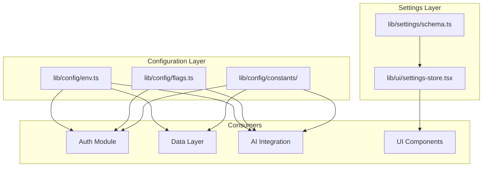

# 12 - Settings & Configuration Optimal Design

**Status:** Proposed  
**Date:** 2024-12-17  
**Author:** Ouroboros Architect  
**Priority:** P2.5

---

## 1. Feature/Module Purpose

The Settings & Configuration module manages all application configuration at three distinct layers:

1. **User Preferences** - Client-side settings persisted to localStorage (theme, model selection, sampling parameters)
2. **Environment Configuration** - Server-side secrets and deployment-specific values (API keys, database URLs)
3. **Feature Flags** - Runtime toggles for gradual rollouts and A/B testing
4. **Runtime Configuration** - Application constants and computed config values

**Goal:** Provide a unified, type-safe, and performant configuration system with clear separation between client-safe and server-only values.

---

## 2. Key Requirements

### 2.1 User Settings (REQ-SET-001 to REQ-SET-005)

| ID | Requirement | Priority |
|----|-------------|----------|
| REQ-SET-001 | User preferences persist across sessions via localStorage | High |
| REQ-SET-002 | Type-safe settings with Zod validation | High |
| REQ-SET-003 | Real-time settings updates without page reload | High |
| REQ-SET-004 | Settings reset to defaults capability | Medium |
| REQ-SET-005 | Model selection persistence with server fallback | High |

### 2.2 App Configuration (REQ-CFG-001 to REQ-CFG-005)

| ID | Requirement | Priority |
|----|-------------|----------|
| REQ-CFG-001 | Environment variables validated at build/startup | High |
| REQ-CFG-002 | Server secrets never exposed to client bundle | Critical |
| REQ-CFG-003 | Type-safe environment variable access | High |
| REQ-CFG-004 | Graceful degradation for optional config | Medium |
| REQ-CFG-005 | Centralized constants management | Medium |

### 2.3 Feature Flags (REQ-FF-001 to REQ-FF-003)

| ID | Requirement | Priority |
|----|-------------|----------|
| REQ-FF-001 | Environment-based feature toggles | High |
| REQ-FF-002 | Runtime flag checks without rebuilds | Medium |
| REQ-FF-003 | Type-safe flag definitions | High |

### 2.4 Validation (REQ-VAL-001 to REQ-VAL-003)

| ID | Requirement | Priority |
|----|-------------|----------|
| REQ-VAL-001 | Zod schemas for all configuration | High |
| REQ-VAL-002 | Startup validation with clear error messages | High |
| REQ-VAL-003 | Runtime validation for user settings | Medium |

---

## 3. Quick Current State Notes

### 3.1 Existing Implementation

| File | Purpose | Lines | Health |
|------|---------|-------|--------|
| `lib/settings/types.ts` | AppSettings type definition | ~20 | ✅ Good |
| `lib/ui/settings-store.tsx` | React context + localStorage | ~90 | ✅ Good |
| `components/settings/settings-sheet.tsx` | Settings UI | ~300 | ✅ Good |
| `lib/constants.ts` | App constants | ~140 | ⚠️ Mixed concerns |
| `lib/ai/constants.ts` | AI model constants | ~60 | ✅ Good |
| `.env.example` | Env var documentation | ~95 | ✅ Good |

### 3.2 Current Architecture

```
┌────────────────────────────────────────────────────────────────┐
│                    CURRENT STATE                               │
├────────────────────────────────────────────────────────────────┤
│                                                                │
│  Client (Browser)                                              │
│  ┌─────────────────────────────────────────────────────────┐  │
│  │ SettingsProvider (React Context)                        │  │
│  │   ├── localStorage persistence                          │  │
│  │   ├── useSettings() hook                               │  │
│  │   └── useSettingsSnapshot() hook                       │  │
│  └─────────────────────────────────────────────────────────┘  │
│                                                                │
│  Server (Node.js)                                              │
│  ┌─────────────────────────────────────────────────────────┐  │
│  │ process.env access (scattered)                          │  │
│  │   ├── lib/db/queries.ts                                │  │
│  │   ├── lib/auth/session.ts                              │  │
│  │   ├── lib/cache/redis.ts                               │  │
│  │   └── ... many more files                              │  │
│  └─────────────────────────────────────────────────────────┘  │
│                                                                │
│  ISSUES:                                                       │
│  ❌ No centralized env validation                              │
│  ❌ process.env access scattered across codebase              │
│  ❌ No feature flags system                                    │
│  ❌ No validation schema for settings                          │
│  ❌ Mixed constants (auth, cache, general)                     │
│                                                                │
└────────────────────────────────────────────────────────────────┘
```

### 3.3 Current Settings Flow

```typescript
// Current: Direct localStorage via useLocalStorage
const [settings, setSettings] = useLocalStorage<AppSettings>(
  SETTINGS_STORAGE_KEY,
  DEFAULT_SETTINGS,
  { initializeWithValue: false }
);

// Current: Type definition only (no validation)
export type AppSettings = {
  sampling: SamplingSettings;
  systemPrompt: string;
  enableReasoning: boolean;
  streamArtifacts: boolean;
  autoScroll: boolean;
  selectedModelId?: string;
};
```

---

## 4. Optimal Architecture Design

### 4.1 Three-Layer Configuration Architecture

```
┌────────────────────────────────────────────────────────────────────┐
│                   OPTIMAL CONFIGURATION ARCHITECTURE               │
├────────────────────────────────────────────────────────────────────┤
│                                                                    │
│  LAYER 1: Environment Configuration (Server-Only)                 │
│  ┌──────────────────────────────────────────────────────────────┐ │
│  │ lib/config/env.ts ("server-only")                            │ │
│  │   ├── Zod schema validation at startup                       │ │
│  │   ├── Type-safe env access                                   │ │
│  │   └── Throws on missing required vars                        │ │
│  └──────────────────────────────────────────────────────────────┘ │
│                            │                                       │
│                            ▼                                       │
│  LAYER 2: Feature Flags (Server + Client-Safe Subset)             │
│  ┌──────────────────────────────────────────────────────────────┐ │
│  │ lib/config/flags.ts                                          │ │
│  │   ├── Server flags (process.env, server-only)               │ │
│  │   └── Client flags (NEXT_PUBLIC_*, client-safe)             │ │
│  └──────────────────────────────────────────────────────────────┘ │
│                            │                                       │
│                            ▼                                       │
│  LAYER 3: User Preferences (Client-Only)                          │
│  ┌──────────────────────────────────────────────────────────────┐ │
│  │ lib/ui/settings-store.tsx ("use client")                     │ │
│  │   ├── Zod validation on load/save                           │ │
│  │   ├── localStorage persistence                              │ │
│  │   └── React context for UI                                  │ │
│  └──────────────────────────────────────────────────────────────┘ │
│                                                                    │
│  CROSS-CUTTING: Constants                                          │
│  ┌──────────────────────────────────────────────────────────────┐ │
│  │ lib/config/constants/                                        │ │
│  │   ├── auth.ts (auth-related constants)                      │ │
│  │   ├── cache.ts (TTL, sizes)                                 │ │
│  │   ├── ai.ts (model defaults)                                │ │
│  │   └── index.ts (re-exports)                                 │ │
│  └──────────────────────────────────────────────────────────────┘ │
│                                                                    │
└────────────────────────────────────────────────────────────────────┘
```

### 4.2 Environment Configuration Module

```typescript
// lib/config/env.ts
import "server-only";
import { z } from "zod";

// ============================================================================
// ENVIRONMENT VARIABLE SCHEMAS
// ============================================================================

const requiredEnvSchema = z.object({
  // Database (required)
  DATABASE_URL: z.string().min(1, "DATABASE_URL is required"),
  
  // Authentication (required)
  AUTH_SECRET: z.string().min(32, "AUTH_SECRET must be at least 32 characters"),
  SUPABASE_JWT_SECRET: z.string().min(1, "SUPABASE_JWT_SECRET is required"),
});

const optionalEnvSchema = z.object({
  // Supabase
  SUPABASE_URL: z.string().url().optional(),
  NEXT_PUBLIC_SUPABASE_URL: z.string().url().optional(),
  NEXT_PUBLIC_SUPABASE_ANON_KEY: z.string().optional(),
  
  // Cache
  CACHE_KV_REST_API_URL: z.string().url().optional(),
  CACHE_KV_REST_API_TOKEN: z.string().optional(),
  
  // Rate Limiting
  UPSTASH_REDIS_REST_URL: z.string().url().optional(),
  UPSTASH_REDIS_REST_TOKEN: z.string().optional(),
  
  // AI Providers
  OPENAI_API_KEY: z.string().optional(),
  ANTHROPIC_API_KEY: z.string().optional(),
  GEMINI_API_KEY: z.string().optional(),
  OPENROUTER_API_KEY: z.string().optional(),
  
  // Cloudflare Gateway
  CLOUDFLARE_AI_GATEWAY_ENABLED: z.coerce.boolean().default(false),
  CLOUDFLARE_AI_GATEWAY_ACCOUNT_ID: z.string().optional(),
  CLOUDFLARE_AI_GATEWAY_GATEWAY_ID: z.string().optional(),
  CLOUDFLARE_AI_GATEWAY_API_KEY: z.string().optional(),
  
  // Vercel
  VERCEL_FLUID: z.string().optional(),
  BLOB_READ_WRITE_TOKEN: z.string().optional(),
  
  // Feature Flags
  INCLUDE_VERCEL_MODELS: z.coerce.boolean().default(false),
});

const envSchema = requiredEnvSchema.merge(optionalEnvSchema);

// ============================================================================
// VALIDATION & EXPORT
// ============================================================================

function validateEnv() {
  const result = envSchema.safeParse(process.env);
  
  if (!result.success) {
    const errors = result.error.flatten().fieldErrors;
    const errorMessages = Object.entries(errors)
      .map(([key, msgs]) => `  ${key}: ${msgs?.join(", ")}`)
      .join("\n");
    
    throw new Error(
      `❌ Invalid environment variables:\n${errorMessages}\n\n` +
      `See .env.example for required variables.`
    );
  }
  
  return result.data;
}

// Validate once at module load (startup)
export const env = validateEnv();

// Type-safe access
export type Env = z.infer<typeof envSchema>;

// ============================================================================
// CONVENIENCE HELPERS
// ============================================================================

export const hasRedisCache = Boolean(
  env.CACHE_KV_REST_API_URL && env.CACHE_KV_REST_API_TOKEN
);

export const hasRateLimiting = Boolean(
  env.UPSTASH_REDIS_REST_URL && env.UPSTASH_REDIS_REST_TOKEN
);

export const hasOpenAI = Boolean(env.OPENAI_API_KEY);
export const hasAnthropic = Boolean(env.ANTHROPIC_API_KEY);
export const hasGemini = Boolean(env.GEMINI_API_KEY);

export const isVercelFluid = env.VERCEL_FLUID === "1";
```

### 4.3 Feature Flags Module

```typescript
// lib/config/flags.ts
import "server-only";
import { z } from "zod";

// ============================================================================
// SERVER-SIDE FEATURE FLAGS
// ============================================================================

const serverFlagsSchema = z.object({
  INCLUDE_VERCEL_MODELS: z.coerce.boolean().default(false),
  ENABLE_EXPERIMENTAL_MODELS: z.coerce.boolean().default(false),
  ENABLE_USAGE_TRACKING: z.coerce.boolean().default(true),
  ENABLE_RATE_LIMITING: z.coerce.boolean().default(true),
  DEBUG_MODE: z.coerce.boolean().default(false),
});

type ServerFlags = z.infer<typeof serverFlagsSchema>;

function loadServerFlags(): ServerFlags {
  return serverFlagsSchema.parse({
    INCLUDE_VERCEL_MODELS: process.env.INCLUDE_VERCEL_MODELS,
    ENABLE_EXPERIMENTAL_MODELS: process.env.ENABLE_EXPERIMENTAL_MODELS,
    ENABLE_USAGE_TRACKING: process.env.ENABLE_USAGE_TRACKING,
    ENABLE_RATE_LIMITING: process.env.ENABLE_RATE_LIMITING,
    DEBUG_MODE: process.env.DEBUG_MODE,
  });
}

export const serverFlags = loadServerFlags();

// ============================================================================
// FLAG CHECKS (Server-Only)
// ============================================================================

export function isFeatureEnabled(flag: keyof ServerFlags): boolean {
  return serverFlags[flag] === true;
}

export function getFeatureFlags(): ServerFlags {
  return { ...serverFlags };
}
```

```typescript
// lib/config/client-flags.ts
"use client";

// ============================================================================
// CLIENT-SAFE FEATURE FLAGS (NEXT_PUBLIC_* only)
// ============================================================================

export const clientFlags = {
  // Only NEXT_PUBLIC_* vars are safe for client
  supabaseUrl: process.env.NEXT_PUBLIC_SUPABASE_URL ?? "",
  supabaseAnonKey: process.env.NEXT_PUBLIC_SUPABASE_ANON_KEY ?? "",
  appUrl: process.env.NEXT_PUBLIC_APP_URL ?? "http://localhost:3000",
} as const;

export type ClientFlags = typeof clientFlags;
```

### 4.4 Enhanced User Settings with Validation

```typescript
// lib/settings/schema.ts
import { z } from "zod";

// ============================================================================
// SETTINGS SCHEMAS
// ============================================================================

export const samplingSettingsSchema = z.object({
  temperature: z.number().min(0).max(2).default(0.7),
  topP: z.number().min(0).max(1).default(0.95),
  maxOutputTokens: z.number().min(256).max(1_000_000).default(4096),
});

export const appSettingsSchema = z.object({
  sampling: samplingSettingsSchema,
  systemPrompt: z.string().max(10000).default(""),
  enableReasoning: z.boolean().default(true),
  streamArtifacts: z.boolean().default(true),
  autoScroll: z.boolean().default(true),
  selectedModelId: z.string().optional(),
  // Theme preference
  theme: z.enum(["light", "dark", "system"]).default("system"),
  // Accessibility
  reducedMotion: z.boolean().default(false),
});

export type SamplingSettings = z.infer<typeof samplingSettingsSchema>;
export type AppSettings = z.infer<typeof appSettingsSchema>;

// ============================================================================
// DEFAULTS
// ============================================================================

export const DEFAULT_SETTINGS: AppSettings = {
  sampling: {
    temperature: 0.7,
    topP: 0.95,
    maxOutputTokens: 4096,
  },
  systemPrompt: "",
  enableReasoning: true,
  streamArtifacts: true,
  autoScroll: true,
  selectedModelId: undefined,
  theme: "system",
  reducedMotion: false,
};

// ============================================================================
// VALIDATION HELPERS
// ============================================================================

export function validateSettings(data: unknown): AppSettings {
  return appSettingsSchema.parse(data);
}

export function safeParseSettings(data: unknown): AppSettings {
  const result = appSettingsSchema.safeParse(data);
  if (result.success) {
    return result.data;
  }
  console.warn("[Settings] Invalid settings, using defaults:", result.error);
  return DEFAULT_SETTINGS;
}
```

### 4.5 Enhanced Settings Store

```typescript
// lib/ui/settings-store.tsx
"use client";

import {
  createContext,
  type ReactNode,
  useCallback,
  useContext,
  useMemo,
} from "react";
import { useLocalStorage } from "usehooks-ts";
import {
  type AppSettings,
  DEFAULT_SETTINGS,
  safeParseSettings,
} from "@/lib/settings/schema";
import { ChatSDKError } from "@/lib/errors";

const SETTINGS_STORAGE_KEY = "chat-sdk.settings.v2";

// ============================================================================
// CONTEXT TYPES
// ============================================================================

export interface SettingsStore {
  settings: AppSettings;
  updateSettings: (updater: (current: AppSettings) => Partial<AppSettings>) => void;
  setSetting: <K extends keyof AppSettings>(key: K, value: AppSettings[K]) => void;
  resetSettings: () => void;
  setSelectedModelId: (modelId: string | undefined) => void;
}

const SettingsContext = createContext<SettingsStore | undefined>(undefined);

// ============================================================================
// PROVIDER
// ============================================================================

export function SettingsProvider({ children }: { children: ReactNode }) {
  const [rawSettings, setRawSettings] = useLocalStorage<unknown>(
    SETTINGS_STORAGE_KEY,
    DEFAULT_SETTINGS,
    { initializeWithValue: false }
  );

  // Validate settings on every access
  const settings = useMemo(
    () => safeParseSettings(rawSettings),
    [rawSettings]
  );

  const updateSettings = useCallback(
    (updater: (current: AppSettings) => Partial<AppSettings>) => {
      setRawSettings((prev) => {
        const current = safeParseSettings(prev);
        const updates = updater(current);
        return { ...current, ...updates };
      });
    },
    [setRawSettings]
  );

  const setSetting = useCallback(
    <K extends keyof AppSettings>(key: K, value: AppSettings[K]) => {
      updateSettings((current) => ({ ...current, [key]: value }));
    },
    [updateSettings]
  );

  const resetSettings = useCallback(() => {
    setRawSettings(DEFAULT_SETTINGS);
  }, [setRawSettings]);

  const setSelectedModelId = useCallback(
    (modelId: string | undefined) => {
      setSetting("selectedModelId", modelId);
    },
    [setSetting]
  );

  const value = useMemo<SettingsStore>(
    () => ({
      settings,
      updateSettings,
      setSetting,
      resetSettings,
      setSelectedModelId,
    }),
    [settings, updateSettings, setSetting, resetSettings, setSelectedModelId]
  );

  return (
    <SettingsContext.Provider value={value}>
      {children}
    </SettingsContext.Provider>
  );
}

// ============================================================================
// HOOKS
// ============================================================================

export function useSettings(): SettingsStore {
  const context = useContext(SettingsContext);
  if (!context) {
    throw new ChatSDKError("bad_request:ui:useSettings_outside_provider");
  }
  return context;
}

export function useSettingsSnapshot(): AppSettings {
  return useSettings().settings;
}

/**
 * Select a specific setting value (prevents unnecessary re-renders)
 */
export function useSettingValue<K extends keyof AppSettings>(
  key: K
): AppSettings[K] {
  const { settings } = useSettings();
  return settings[key];
}

export { type AppSettings } from "@/lib/settings/schema";
```

### 4.6 Consolidated Constants

```typescript
// lib/config/constants/index.ts
export * from "./auth";
export * from "./cache";
export * from "./ai";
export * from "./app";
```

```typescript
// lib/config/constants/auth.ts
/**
 * Authentication Constants
 */

export const AUTH_CONSTANTS = {
  // Guest session
  GUEST_TOKEN_TTL_SECONDS: 60 * 60, // 1 hour
  GUEST_TOKEN_ROTATION_THRESHOLD_SECONDS: 30 * 60, // 30 minutes
  GUEST_CACHE_TTL_SECONDS: 7 * 24 * 60 * 60, // 7 days
  
  // Cookie settings
  SESSION_COOKIE_MAX_AGE: 60 * 60 * 24 * 7, // 7 days
  
  // Validation patterns
  GUEST_ID_REGEX: /^guest:[0-9a-f]{8}-[0-9a-f]{4}-[0-9a-f]{4}-[0-9a-f]{4}-[0-9a-f]{12}$/i,
  UUID_REGEX: /^[0-9a-f]{8}-[0-9a-f]{4}-[0-9a-f]{4}-[0-9a-f]{4}-[0-9a-f]{12}$/i,
} as const;

export function isValidUUID(value: string): boolean {
  return AUTH_CONSTANTS.UUID_REGEX.test(value);
}

export function isGuestId(value: string): boolean {
  return AUTH_CONSTANTS.GUEST_ID_REGEX.test(value);
}
```

```typescript
// lib/config/constants/cache.ts
/**
 * Cache Configuration Constants
 */

export const CACHE_CONSTANTS = {
  // TTL values (seconds)
  DEFAULT_TTL_SECONDS: 24 * 60 * 60, // 24 hours
  SHORT_TTL_SECONDS: 5 * 60, // 5 minutes
  MODEL_LIST_TTL_SECONDS: 60 * 60, // 1 hour
  
  // Sizes
  MAX_CACHE_ITEMS: 1000,
  MAX_ITEM_SIZE_BYTES: 1024 * 1024, // 1MB
  
  // Keys
  PREFIX: {
    CHAT: "chat:",
    USER: "user:",
    MODEL: "model:",
    QUOTA: "quota:",
  },
} as const;
```

```typescript
// lib/config/constants/ai.ts
/**
 * AI Model Configuration Constants
 */

export const AI_CONSTANTS = {
  // Defaults
  DEFAULT_MODEL_ID: "openai:gpt-4o-mini",
  DEFAULT_TEMPERATURE: 0.7,
  DEFAULT_TOP_P: 0.95,
  DEFAULT_MAX_OUTPUT_TOKENS: 4096,
  
  // Limits
  MAX_CONTEXT_TOKENS: 128_000,
  SYSTEM_PROMPT_RESERVE_TOKENS: 2000,
  TITLE_GENERATION_MAX_TOKENS: 80,
  
  // Timeouts (ms)
  MODEL_DISCOVERY_TIMEOUT_MS: 5000,
  STREAM_TIMEOUT_MS: 30_000,
  
  // Rate limits
  DEFAULT_MESSAGES_PER_MINUTE: 20,
  DEFAULT_TOKENS_PER_MINUTE: 100_000,
  
  // Providers
  SUPPORTED_PROVIDERS: ["openai", "anthropic", "google", "xai", "openrouter", "gateway"] as const,
} as const;

export type SupportedProviderId = (typeof AI_CONSTANTS.SUPPORTED_PROVIDERS)[number];
```

```typescript
// lib/config/constants/app.ts
/**
 * Application Constants
 */

export const APP_CONSTANTS = {
  // Environment detection
  isProduction: process.env.NODE_ENV === "production",
  isDevelopment: process.env.NODE_ENV === "development",
  isTest: Boolean(
    process.env.PLAYWRIGHT_TEST_BASE_URL ||
    process.env.PLAYWRIGHT ||
    process.env.CI_PLAYWRIGHT
  ),
  
  // UI
  SIDEBAR_WIDTH: 260,
  MOBILE_BREAKPOINT: 768,
  
  // Pagination
  DEFAULT_PAGE_SIZE: 20,
  MAX_PAGE_SIZE: 100,
} as const;
```

---

## 5. Technology Stack

| Technology | Purpose | Justification |
|------------|---------|---------------|
| **Zod** | Schema validation | Type inference, runtime validation, clear errors |
| **React Context** | User settings state | Already used, minimal overhead |
| **useLocalStorage** | Client persistence | From usehooks-ts, handles SSR correctly |
| **server-only** | Bundle protection | Prevents secret leakage to client |
| **Next.js env** | Environment handling | Built-in NEXT_PUBLIC_ client exposure |

---

## 6. Bundle Strategy

### 6.1 Server-Only Enforcement

```
┌────────────────────────────────────────────────────────────────┐
│                    BUNDLE SEPARATION                           │
├────────────────────────────────────────────────────────────────┤
│                                                                │
│  SERVER BUNDLE ONLY (never in client):                        │
│  ├── lib/config/env.ts         → "server-only"                │
│  ├── lib/config/flags.ts       → "server-only"                │
│  └── All API keys, secrets, DATABASE_URL                      │
│                                                                │
│  CLIENT BUNDLE SAFE:                                           │
│  ├── lib/config/client-flags.ts → "use client"                │
│  ├── lib/ui/settings-store.tsx  → "use client"                │
│  ├── lib/settings/schema.ts     → types/validation only       │
│  └── lib/config/constants/*.ts  → no secrets                  │
│                                                                │
│  VERIFICATION:                                                 │
│  $ next build && grep -r "DATABASE_URL" .next/static          │
│  (should return 0 results)                                     │
│                                                                │
└────────────────────────────────────────────────────────────────┘
```

### 6.2 Bundle Size Impact

| Module | Client Bundle | Server Bundle |
|--------|---------------|---------------|
| Settings Schema | ~1KB (Zod schema) | ~1KB |
| Settings Store | ~2KB | 0KB |
| Constants | ~1KB | ~1KB |
| Env Config | 0KB | ~2KB |
| Feature Flags | 0KB | ~1KB |
| **Total** | **~4KB** | **~5KB** |

---

## 7. Simplifications (From Current State)

| Simplification | Before | After |
|----------------|--------|-------|
| Env access | Scattered `process.env` | Centralized `env.VARIABLE` |
| Settings types | Type-only, no validation | Zod schema with defaults |
| Constants | Mixed in `lib/constants.ts` | Organized by domain |
| Feature flags | Ad-hoc `process.env` checks | Typed flag system |
| Settings version | None | Versioned storage key |

---

## 8. Dependencies



### 8.1 Upstream Dependencies

| Dependency | Source | Purpose |
|------------|--------|---------|
| Zod | npm | Schema validation |
| usehooks-ts | npm | useLocalStorage |
| React | npm | Context API |

### 8.2 Downstream Consumers

| Consumer | Config Used |
|----------|-------------|
| Auth Module | `env.AUTH_SECRET`, `AUTH_CONSTANTS` |
| Data Layer | `env.DATABASE_URL`, `CACHE_CONSTANTS` |
| AI Integration | `env.OPENAI_API_KEY`, `AI_CONSTANTS`, `serverFlags` |
| Cache Layer | `env.CACHE_KV_*`, `CACHE_CONSTANTS` |
| UI Components | `useSettings()`, `clientFlags` |

---

## 9. Public Interface

### 9.1 Server-Side API

```typescript
// Environment configuration
import { env, hasRedisCache, hasOpenAI } from "@/lib/config/env";

env.DATABASE_URL      // string (validated)
env.OPENAI_API_KEY    // string | undefined
hasRedisCache         // boolean
hasOpenAI             // boolean

// Feature flags
import { serverFlags, isFeatureEnabled } from "@/lib/config/flags";

serverFlags.INCLUDE_VERCEL_MODELS  // boolean
isFeatureEnabled("DEBUG_MODE")      // boolean

// Constants
import { AUTH_CONSTANTS, AI_CONSTANTS, CACHE_CONSTANTS } from "@/lib/config/constants";
```

### 9.2 Client-Side API

```typescript
// User settings
import { 
  useSettings, 
  useSettingsSnapshot, 
  useSettingValue,
  SettingsProvider 
} from "@/lib/ui/settings-store";

const { settings, updateSettings, setSetting, resetSettings } = useSettings();
const snapshot = useSettingsSnapshot();
const autoScroll = useSettingValue("autoScroll");

// Client flags
import { clientFlags } from "@/lib/config/client-flags";

clientFlags.supabaseUrl  // string
clientFlags.appUrl       // string
```

### 9.3 Type Exports

```typescript
// Types
import type { AppSettings, SamplingSettings } from "@/lib/settings/schema";
import type { Env } from "@/lib/config/env";
import type { SupportedProviderId } from "@/lib/config/constants";
```

---

## 10. Performance Optimizations

### 10.1 Configuration Caching

```typescript
// lib/config/env.ts
// Validation runs ONCE at module load (startup)
export const env = validateEnv();  // Cached in module scope

// No re-validation on each access
function getDbUrl() {
  return env.DATABASE_URL;  // Direct property access
}
```

### 10.2 Settings Selector Pattern

```typescript
// Prevent unnecessary re-renders with granular selectors
function ChatComponent() {
  // ❌ Bad: Re-renders on ANY settings change
  const { settings } = useSettings();
  
  // ✅ Good: Only re-renders when autoScroll changes
  const autoScroll = useSettingValue("autoScroll");
  
  return <div>Auto-scroll: {autoScroll ? "on" : "off"}</div>;
}
```

### 10.3 Lazy Validation

```typescript
// lib/settings/schema.ts
export function safeParseSettings(data: unknown): AppSettings {
  // Fast path: already valid
  if (isAppSettings(data)) {
    return data;
  }
  // Slow path: full validation
  const result = appSettingsSchema.safeParse(data);
  return result.success ? result.data : DEFAULT_SETTINGS;
}

// Type guard for fast path
function isAppSettings(data: unknown): data is AppSettings {
  return (
    typeof data === "object" &&
    data !== null &&
    "sampling" in data &&
    "enableReasoning" in data
  );
}
```

---

## 11. File Structure

```
lib/
├── config/
│   ├── env.ts              # Server-only env validation
│   ├── flags.ts            # Server feature flags
│   ├── client-flags.ts     # Client-safe flags
│   └── constants/
│       ├── index.ts        # Re-exports
│       ├── auth.ts         # Auth constants
│       ├── cache.ts        # Cache constants
│       ├── ai.ts           # AI constants
│       └── app.ts          # App constants
├── settings/
│   ├── types.ts            # (deprecated, use schema.ts)
│   └── schema.ts           # Zod schemas + types
└── ui/
    └── settings-store.tsx  # React context + hooks
```

---

## 12. Migration Path

### Phase 1: Add New Modules (Non-Breaking)
1. Create `lib/config/env.ts` with validation
2. Create `lib/config/flags.ts`
3. Create `lib/settings/schema.ts`
4. Create `lib/config/constants/` structure

### Phase 2: Migrate Consumers
1. Update imports from `process.env` to `env.VARIABLE`
2. Update settings store to use schema validation
3. Migrate constants from `lib/constants.ts`

### Phase 3: Cleanup
1. Remove `lib/constants.ts` (deprecated)
2. Remove `lib/settings/types.ts` (merged into schema)
3. Update documentation

---

## 13. Consequences

### Positive

- **POS-001**: Type-safe configuration prevents runtime errors
- **POS-002**: Startup validation catches missing env vars early
- **POS-003**: Server-only enforcement prevents secret leakage
- **POS-004**: Organized constants improve discoverability
- **POS-005**: Zod schemas provide runtime + compile-time safety

### Negative

- **NEG-001**: Additional Zod dependency in client bundle (~1KB)
- **NEG-002**: Migration effort for existing `process.env` usage
- **NEG-003**: Settings version migration needed for existing users

### Mitigations

- **NEG-001**: Zod is already used; tree-shaking minimizes impact
- **NEG-002**: Incremental migration possible; both patterns can coexist
- **NEG-003**: `safeParseSettings` handles invalid/old data gracefully

---

## 14. Quality Checklist

- [x] Considered 2+ alternatives (inline validation, runtime-only checks)
- [x] Documented rejection reasons (inline = scattered, runtime-only = no type safety)
- [x] Listed positive consequences (5 items)
- [x] Listed negative consequences (3 items)
- [x] Addressed Security (server-only enforcement)
- [x] Addressed Performance (caching, selectors)
- [x] Addressed Scalability (organized constants, typed flags)
- [x] Included implementation notes (migration path)
- [x] Added diagrams (architecture, dependencies)
- [x] Used consequence codes

---

## 15. Alternatives Considered

### ALT-001: Runtime-Only Validation (No Zod)

**Description:** Validate env vars with simple if-checks at runtime.

**Rejected because:**
- No type inference (manual type definitions needed)
- No compile-time safety
- Verbose validation code
- Inconsistent error messages

### ALT-002: External Config Service (e.g., LaunchDarkly)

**Description:** Use external service for feature flags and config.

**Rejected because:**
- Overkill for current scale
- Adds external dependency
- Latency for config fetches
- Cost for small projects

### ALT-003: Database-Stored User Settings

**Description:** Persist user settings to database instead of localStorage.

**Rejected because:**
- Requires authentication for all settings
- Adds database load for preference reads
- Current localStorage approach works well
- Can add sync later if needed

---

━━━━━━━━━━━━━━━━━━━━━━━━━━━━━━━━━━━━━━━━━━━━━━
✅ [TASK COMPLETE]
━━━━━━━━━━━━━━━━━━━━━━━━━━━━━━━━━━━━━━━━━━━━━━

**Files Created:**
- [.ouroboros/specs/architecture-overhaul/12-settings-optimal-design.md](.ouroboros/specs/architecture-overhaul/12-settings-optimal-design.md)

**Summary:**
- Designed three-layer configuration architecture (env, flags, user settings)
- Zod schemas for compile-time + runtime validation
- Server-only enforcement for secrets
- Organized constants by domain
- Performance optimizations via caching and selectors
- Clear migration path from current state
