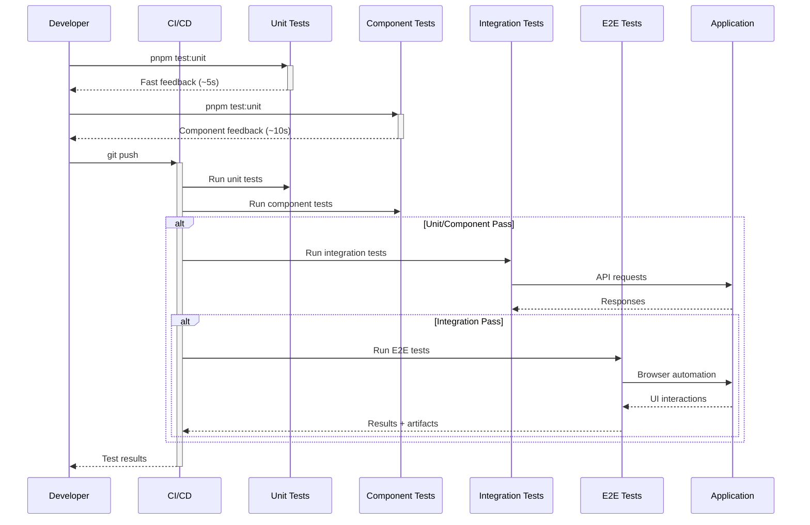

# 13 - Testing Infrastructure Optimal Design

**Status:** Proposed  
**Date:** 2024-12-17  
**Author:** Ouroboros Architect  
**Priority:** P3.1

---

## 1. Feature/Module Purpose

The Testing Infrastructure provides comprehensive quality assurance through a multi-layered testing strategy:

1. **E2E Testing** - Full user journey validation with Playwright (browser automation)
2. **API/Route Testing** - Backend endpoint verification with Playwright's request API
3. **Unit Testing** - Isolated function/module testing with Vitest
4. **Component Testing** - React component rendering/interaction testing with Vitest + Testing Library
5. **Mock Infrastructure** - Consistent test data and AI model simulation

**Goal:** Establish a robust, maintainable, and fast testing system that catches regressions early while enabling confident refactoring.

---

## 2. Key Requirements

### 2.1 E2E Testing (REQ-E2E-001 to REQ-E2E-006)

| ID | Requirement | Priority |
|----|-------------|----------|
| REQ-E2E-001 | Full user journey tests (auth → chat → artifacts) | Critical |
| REQ-E2E-002 | Page Object Model (POM) pattern for maintainability | High |
| REQ-E2E-003 | Authenticated user fixtures with session persistence | High |
| REQ-E2E-004 | Visual regression testing capability | Medium |
| REQ-E2E-005 | Cross-browser testing (Chrome, Firefox, Safari) | Low |
| REQ-E2E-006 | Mobile viewport testing | Medium |

### 2.2 API/Route Testing (REQ-API-001 to REQ-API-005)

| ID | Requirement | Priority |
|----|-------------|----------|
| REQ-API-001 | All API routes have test coverage | High |
| REQ-API-002 | Authorization boundary testing (user A can't access user B's data) | Critical |
| REQ-API-003 | Error response validation | High |
| REQ-API-004 | Streaming response testing for chat endpoints | High |
| REQ-API-005 | Rate limiting behavior verification | Medium |

### 2.3 Unit Testing (REQ-UNIT-001 to REQ-UNIT-005)

| ID | Requirement | Priority |
|----|-------------|----------|
| REQ-UNIT-001 | Utility function coverage ≥80% | High |
| REQ-UNIT-002 | Business logic isolation testing | High |
| REQ-UNIT-003 | Error handling path coverage | High |
| REQ-UNIT-004 | Edge case documentation through tests | Medium |
| REQ-UNIT-005 | Mock AI SDK responses for predictable testing | High |

### 2.4 Component Testing (REQ-COMP-001 to REQ-COMP-004)

| ID | Requirement | Priority |
|----|-------------|----------|
| REQ-COMP-001 | Critical UI components have render tests | High |
| REQ-COMP-002 | User interaction testing (click, type, submit) | High |
| REQ-COMP-003 | Accessibility testing (ARIA, keyboard navigation) | Medium |
| REQ-COMP-004 | Component state transitions testing | Medium |

### 2.5 CI/CD Integration (REQ-CI-001 to REQ-CI-004)

| ID | Requirement | Priority |
|----|-------------|----------|
| REQ-CI-001 | Tests run on every PR | Critical |
| REQ-CI-002 | Parallel test execution for speed | High |
| REQ-CI-003 | Test result reporting with failure artifacts | High |
| REQ-CI-004 | Selective test runs based on changed files | Medium |

### 2.6 Coverage & Reporting (REQ-COV-001 to REQ-COV-003)

| ID | Requirement | Priority |
|----|-------------|----------|
| REQ-COV-001 | Code coverage reporting | Medium |
| REQ-COV-002 | Test execution time tracking | Low |
| REQ-COV-003 | Flaky test detection and reporting | Medium |

---

## 3. Quick Current State Notes

### 3.1 Existing Implementation

| File/Directory | Purpose | Lines | Health |
|----------------|---------|-------|--------|
| `playwright.config.ts` | Playwright configuration | ~108 | ✅ Good |
| `tests/fixtures.ts` | Test user fixtures (ada, babbage, curie) | ~50 | ✅ Good |
| `tests/helpers.ts` | Auth helpers, user generation | ~75 | ✅ Good |
| `tests/pages/chat.ts` | ChatPage POM | ~279 | ✅ Good |
| `tests/pages/artifact.ts` | ArtifactPage POM | ~121 | ✅ Good |
| `tests/pages/auth.ts` | AuthPage POM | ~50 | ✅ Good |
| `tests/prompts/basic.ts` | Test prompt definitions | ~150 | ✅ Good |
| `tests/prompts/routes.ts` | Route test prompts | ~50 | ✅ Good |
| `tests/prompts/utils.ts` | Prompt comparison utilities | ~305 | ⚠️ Complex |
| `tests/e2e/*.test.ts` | E2E test files (4 files) | ~500 | ✅ Good |
| `tests/routes/*.test.ts` | API route tests (3 files) | ~600 | ✅ Good |
| `lib/ai/models.test.ts` | Mock AI models for testing | ~89 | ✅ Good |

### 3.2 Current Architecture

```
┌─────────────────────────────────────────────────────────────────────────────┐
│                          CURRENT STATE                                      │
├─────────────────────────────────────────────────────────────────────────────┤
│                                                                             │
│  tests/                                                                     │
│  ├── fixtures.ts          → Worker-scoped auth fixtures (ada/babbage/curie)│
│  ├── helpers.ts           → createAuthenticatedContext(), user generation  │
│  ├── e2e/                 → Browser-based E2E tests                        │
│  │   ├── chat.test.ts     → Chat flow tests                               │
│  │   ├── artifacts.test.ts→ Artifact creation tests (some test.fixme())   │
│  │   ├── reasoning.test.ts→ Reasoning model tests                         │
│  │   └── session.test.ts  → Session management tests                      │
│  ├── routes/              → API endpoint tests                             │
│  │   ├── chat.test.ts     → /api/chat endpoint tests                      │
│  │   ├── chat-title.test.ts→ Title generation tests                       │
│  │   └── document.test.ts → Document API tests                            │
│  ├── pages/               → Page Object Models                             │
│  │   ├── chat.ts          → ChatPage class                                │
│  │   ├── artifact.ts      → ArtifactPage class                            │
│  │   └── auth.ts          → AuthPage class                                │
│  └── prompts/             → Test data/prompts                              │
│      ├── basic.ts         → Base prompt definitions                        │
│      ├── routes.ts        → API route test data                           │
│      └── utils.ts         → Message comparison, stream generation         │
│                                                                             │
│  lib/ai/                                                                    │
│  └── models.test.ts       → MockLanguageModelV2 for testing               │
│                                                                             │
│  STRENGTHS:                                                                 │
│  ✅ Good POM pattern implementation                                         │
│  ✅ Worker-scoped fixtures for isolation                                    │
│  ✅ Mock AI models for predictable responses                                │
│  ✅ Separate E2E and route test projects                                    │
│                                                                             │
│  ISSUES:                                                                    │
│  ❌ No unit tests for lib/ utilities                                        │
│  ❌ No component tests for React components                                 │
│  ❌ No Vitest configuration                                                 │
│  ❌ Some E2E tests marked test.fixme()                                      │
│  ❌ 240s timeout is very long (indicates slow tests)                        │
│  ❌ No coverage reporting                                                   │
│  ❌ No CI/CD configuration visible                                          │
│  ❌ prompts/utils.ts has @ts-nocheck (tech debt)                            │
│                                                                             │
└─────────────────────────────────────────────────────────────────────────────┘
```

### 3.3 Current Test Flow

```typescript
// Playwright fixtures extend base test with authenticated contexts
export const test = baseTest.extend<object, Fixtures>({
    adaContext: [
        async ({ browser }, use, workerInfo) => {
            const ada = await createAuthenticatedContext({
                browser,
                name: `ada-${workerInfo.workerIndex}-${getUnixTime(new Date())}`,
            });
            await use(ada);
            await ada.context.close();
        },
        { scope: "worker" },  // Reused across tests in same worker
    ],
});

// Page Object Model usage
const chatPage = new ChatPage(page);
await chatPage.sendUserMessage("Why is grass green?");
await chatPage.isGenerationComplete();
```

### 3.4 Current Playwright Config Analysis

```typescript
// Good: Separate projects for e2e and routes
projects: [
    { name: "e2e", testMatch: /e2e\/.*.test.ts/ },
    { name: "routes", testMatch: /routes\/.*.test.ts/ },
]

// Issue: Very long timeouts suggest performance problems
timeout: 240 * 1000,  // 4 minutes per test!
expect: { timeout: 240 * 1000 },

// Good: Parallel execution
fullyParallel: true,
workers: process.env.CI ? 2 : 8,
```

---

## 4. Optimal Architecture Design

### 4.1 Target Architecture

```
┌─────────────────────────────────────────────────────────────────────────────┐
│                        OPTIMAL ARCHITECTURE                                 │
├─────────────────────────────────────────────────────────────────────────────┤
│                                                                             │
│  Testing Pyramid                                                            │
│  ═══════════════                                                            │
│                                                                             │
│              ╱╲                                                              │
│             ╱  ╲        E2E Tests (Playwright)                              │
│            ╱ E2E╲       • Critical user journeys only                       │
│           ╱──────╲      • Slow but high confidence                          │
│          ╱        ╲                                                          │
│         ╱Integration╲   Integration Tests (Playwright API)                  │
│        ╱────────────╲   • API routes, database queries                      │
│       ╱              ╲  • Medium speed, good coverage                        │
│      ╱   Component    ╲ Component Tests (Vitest + Testing Library)          │
│     ╱─────────────────╲ • React component behavior                          │
│    ╱                   ╲                                                     │
│   ╱      Unit Tests     ╲ Unit Tests (Vitest)                               │
│  ╱───────────────────────╲• Pure functions, utilities                       │
│ ╱                         ╲• Fast, many tests                               │
│╱___________________________╲                                                │
│                                                                             │
└─────────────────────────────────────────────────────────────────────────────┘
```

### 4.2 Proposed Directory Structure

```
tests/
├── __mocks__/                     # Shared mocks
│   ├── ai-sdk.ts                  # Mock AI SDK models
│   ├── supabase.ts                # Mock Supabase client
│   └── next-router.ts             # Mock Next.js router
│
├── fixtures/                      # Test fixtures (consolidated)
│   ├── index.ts                   # Main fixture exports
│   ├── auth.fixture.ts            # Authentication fixtures
│   ├── chat.fixture.ts            # Chat data fixtures
│   └── artifact.fixture.ts        # Artifact data fixtures
│
├── helpers/                       # Test helpers (consolidated)
│   ├── index.ts                   # Main helper exports
│   ├── auth.helper.ts             # createAuthenticatedContext
│   ├── stream.helper.ts           # Stream comparison utilities
│   └── render.helper.ts           # Component render helpers
│
├── pages/                         # Page Object Models (keep as-is)
│   ├── chat.page.ts               # ChatPage POM
│   ├── artifact.page.ts           # ArtifactPage POM
│   └── auth.page.ts               # AuthPage POM
│
├── e2e/                           # E2E tests (Playwright)
│   ├── auth.e2e.ts                # Authentication flows
│   ├── chat.e2e.ts                # Chat interactions
│   └── artifacts.e2e.ts           # Artifact creation/editing
│
├── integration/                   # API/Route tests (Playwright)
│   ├── chat-api.test.ts           # /api/chat
│   ├── document-api.test.ts       # /api/document
│   └── vote-api.test.ts           # /api/vote
│
├── unit/                          # Unit tests (Vitest)
│   ├── lib/
│   │   ├── utils.test.ts          # lib/utils.ts tests
│   │   ├── errors.test.ts         # lib/errors.ts tests
│   │   └── files.test.ts          # lib/files.ts tests
│   └── ai/
│       ├── prompts.test.ts        # AI prompt building tests
│       └── tools.test.ts          # AI tool tests
│
└── components/                    # Component tests (Vitest)
    ├── chat/
    │   ├── message.test.tsx       # Message component
    │   └── multimodal-input.test.tsx
    └── ui/
        ├── button.test.tsx        # UI primitives
        └── dialog.test.tsx
```

### 4.3 Configuration Files

```
project-root/
├── playwright.config.ts           # Playwright config (E2E + Integration)
├── vitest.config.ts               # Vitest config (Unit + Component)
├── vitest.workspace.ts            # Workspace config for parallel runs
└── .github/
    └── workflows/
        └── test.yml               # CI test workflow
```

---

## 5. Technology Stack

### 5.1 Testing Frameworks

| Layer | Tool | Purpose |
|-------|------|---------|
| E2E | Playwright | Browser automation, visual testing |
| Integration | Playwright Request API | API endpoint testing |
| Unit | Vitest | Fast unit testing, ESM native |
| Component | Vitest + @testing-library/react | React component testing |
| Mocking | MSW (Mock Service Worker) | API mocking (optional) |

### 5.2 Decision: Vitest over Jest

| Criteria | Vitest | Jest |
|----------|--------|------|
| ESM Support | ✅ Native | ⚠️ Experimental |
| Speed | ✅ Faster (Vite) | Slower |
| Next.js 16 | ✅ Better compat | ⚠️ Config heavy |
| Watch Mode | ✅ Instant | Slower |
| Config | ✅ Minimal | Complex |

**Decision:** Use **Vitest** for unit and component tests.

### 5.3 Alternatives Considered

#### ALT-001: Jest Only
- **Description:** Use Jest for all unit/component tests
- **Rejected because:** Slower, ESM configuration complexity, poor Vite ecosystem integration

#### ALT-002: Cypress for E2E
- **Description:** Replace Playwright with Cypress
- **Rejected because:** Playwright already implemented, better multi-browser support, faster execution

#### ALT-003: Single Test Runner
- **Description:** Use Playwright for everything including unit tests
- **Rejected because:** Playwright is overkill for unit tests, slower feedback loop

---

## 6. Detailed Design

### 6.1 Vitest Configuration

```typescript
// vitest.config.ts
import { defineConfig } from 'vitest/config';
import react from '@vitejs/plugin-react';
import tsconfigPaths from 'vite-tsconfig-paths';

export default defineConfig({
  plugins: [react(), tsconfigPaths()],
  test: {
    globals: true,
    environment: 'jsdom',
    setupFiles: ['./tests/setup.ts'],
    include: [
      'tests/unit/**/*.test.ts',
      'tests/components/**/*.test.tsx',
      'lib/**/*.test.ts',
    ],
    exclude: ['tests/e2e/**', 'tests/integration/**'],
    coverage: {
      provider: 'v8',
      reporter: ['text', 'json', 'html'],
      exclude: [
        'node_modules/',
        'tests/',
        '**/*.d.ts',
        '**/*.config.*',
      ],
      thresholds: {
        global: {
          statements: 70,
          branches: 70,
          functions: 70,
          lines: 70,
        },
      },
    },
    // Parallel by default
    pool: 'threads',
    poolOptions: {
      threads: {
        singleThread: false,
      },
    },
  },
});
```

### 6.2 Improved Playwright Configuration

```typescript
// playwright.config.ts (improved)
import { defineConfig, devices } from "@playwright/test";
import { config } from "dotenv";

config({ path: ".env.test" });

const PORT = process.env.PORT || 3000;
const baseURL = `http://localhost:${PORT}`;

export default defineConfig({
  testDir: "./tests",
  fullyParallel: true,
  forbidOnly: !!process.env.CI,
  retries: process.env.CI ? 2 : 0,
  workers: process.env.CI ? 4 : 8,
  reporter: [
    ['html', { open: 'never' }],
    ['json', { outputFile: 'test-results/results.json' }],
    process.env.CI ? ['github'] : ['line'],
  ],
  
  use: {
    baseURL,
    trace: 'on-first-retry',
    screenshot: 'only-on-failure',
    video: 'retain-on-failure',
  },

  // Reduced timeouts (fix slow tests instead!)
  timeout: 60_000,  // 60s max per test
  expect: {
    timeout: 10_000,  // 10s for assertions
  },

  projects: [
    // Setup project for auth
    {
      name: 'setup',
      testMatch: /global\.setup\.ts/,
    },
    
    // E2E tests
    {
      name: 'e2e-chrome',
      testMatch: /e2e\/.*.test.ts/,
      dependencies: ['setup'],
      use: { ...devices['Desktop Chrome'] },
    },
    
    // Integration/API tests (no browser needed for most)
    {
      name: 'integration',
      testMatch: /integration\/.*.test.ts/,
      dependencies: ['setup'],
      use: { ...devices['Desktop Chrome'] },
    },
    
    // Mobile viewport tests
    {
      name: 'mobile',
      testMatch: /e2e\/.*.test.ts/,
      dependencies: ['setup'],
      use: { ...devices['iPhone 13'] },
      grep: /@mobile/,  // Only tests tagged @mobile
    },
  ],

  webServer: {
    command: process.env.CI 
      ? 'pnpm build && pnpm start' 
      : 'pnpm dev',
    url: baseURL,
    reuseExistingServer: !process.env.CI,
    timeout: 120_000,
  },
});
```

### 6.3 Consolidated Fixtures

```typescript
// tests/fixtures/index.ts
import { test as base, expect } from "@playwright/test";
import { createAuthFixture, type UserContext } from "./auth.fixture";

type TestFixtures = {
  // Per-test fixtures
};

type WorkerFixtures = {
  // Worker-scoped (shared across tests in same worker)
  adaContext: UserContext;
  babbageContext: UserContext;
  curieContext: UserContext;
};

export const test = base.extend<TestFixtures, WorkerFixtures>({
  adaContext: [createAuthFixture("ada"), { scope: "worker" }],
  babbageContext: [createAuthFixture("babbage"), { scope: "worker" }],
  curieContext: [createAuthFixture("curie"), { scope: "worker" }],
});

export { expect };

// tests/fixtures/auth.fixture.ts
import type { Browser, BrowserContext, Page } from "@playwright/test";
import { getUnixTime } from "date-fns";
import { generateId } from "ai";

export type UserContext = {
  context: BrowserContext;
  page: Page;
  email: string;
  userId: string;
};

export function createAuthFixture(baseName: string) {
  return async (
    { browser }: { browser: Browser },
    use: (ctx: UserContext) => Promise<void>,
    workerInfo: { workerIndex: number }
  ) => {
    const name = `${baseName}-${workerInfo.workerIndex}-${getUnixTime(new Date())}`;
    const ctx = await createAuthenticatedUser(browser, name);
    
    await use(ctx);
    
    await ctx.context.close();
  };
}
```

### 6.4 Enhanced Page Object Model

```typescript
// tests/pages/chat.page.ts
import { expect, type Page, type Locator } from "@playwright/test";

/**
 * ChatPage Page Object Model
 * 
 * Encapsulates all chat-related page interactions.
 * Methods return Promises for async operations.
 * Getters return Locators for element access.
 */
export class ChatPage {
  readonly page: Page;
  
  // Locators (cached)
  readonly sendButton: Locator;
  readonly stopButton: Locator;
  readonly multimodalInput: Locator;
  readonly messageList: Locator;

  constructor(page: Page) {
    this.page = page;
    this.sendButton = page.getByTestId("send-button");
    this.stopButton = page.getByTestId("stop-button");
    this.multimodalInput = page.getByTestId("multimodal-input");
    this.messageList = page.getByTestId("messages");
  }

  // Navigation
  async goto() {
    await this.page.goto("/");
    await this.page.waitForLoadState("networkidle");
  }

  async gotoChat(chatId: string) {
    await this.page.goto(`/chat/${chatId}`);
    await this.page.waitForLoadState("networkidle");
  }

  // Actions
  async sendMessage(message: string) {
    await this.multimodalInput.fill(message);
    await this.sendButton.click();
  }

  async waitForResponse() {
    // Wait for streaming to start
    await expect(this.stopButton).toBeVisible({ timeout: 5000 });
    // Wait for streaming to complete
    await expect(this.sendButton).toBeVisible({ timeout: 30000 });
  }

  async stopGeneration() {
    await this.stopButton.click();
    await expect(this.sendButton).toBeVisible();
  }

  // Assertions
  async expectMessageCount(count: number) {
    const messages = this.messageList.getByRole("article");
    await expect(messages).toHaveCount(count);
  }

  async expectLastAssistantMessage(content: string | RegExp) {
    const lastMessage = this.messageList
      .getByTestId("message-assistant")
      .last()
      .getByTestId("message-content");
    await expect(lastMessage).toContainText(content);
  }

  async expectUrlContainsChatId() {
    await expect(this.page).toHaveURL(/\/chat\/[a-f0-9-]{36}$/);
  }
}
```

### 6.5 Unit Test Example

```typescript
// tests/unit/lib/utils.test.ts
import { describe, it, expect } from 'vitest';
import { cn, generateUUID, sanitizeUIMessages } from '@/lib/utils';

describe('cn (classNames utility)', () => {
  it('merges class names', () => {
    expect(cn('foo', 'bar')).toBe('foo bar');
  });

  it('handles conditional classes', () => {
    expect(cn('foo', false && 'bar', 'baz')).toBe('foo baz');
  });

  it('deduplicates Tailwind conflicts', () => {
    expect(cn('p-4', 'p-2')).toBe('p-2');
  });
});

describe('generateUUID', () => {
  it('returns valid UUID v4 format', () => {
    const uuid = generateUUID();
    expect(uuid).toMatch(
      /^[0-9a-f]{8}-[0-9a-f]{4}-4[0-9a-f]{3}-[89ab][0-9a-f]{3}-[0-9a-f]{12}$/i
    );
  });

  it('generates unique values', () => {
    const uuids = new Set(Array.from({ length: 100 }, () => generateUUID()));
    expect(uuids.size).toBe(100);
  });
});

describe('sanitizeUIMessages', () => {
  it('removes empty messages', () => {
    const messages = [
      { id: '1', role: 'user', content: 'Hello' },
      { id: '2', role: 'assistant', content: '' },
      { id: '3', role: 'assistant', content: 'Hi!' },
    ];
    const result = sanitizeUIMessages(messages);
    expect(result).toHaveLength(2);
    expect(result.map(m => m.id)).toEqual(['1', '3']);
  });
});
```

### 6.6 Component Test Example

```typescript
// tests/components/chat/message.test.tsx
import { describe, it, expect, vi } from 'vitest';
import { render, screen } from '@testing-library/react';
import userEvent from '@testing-library/user-event';
import { Message } from '@/components/message';

describe('Message Component', () => {
  const defaultProps = {
    message: {
      id: '1',
      role: 'user' as const,
      content: 'Hello world',
      createdAt: new Date(),
    },
    isLoading: false,
  };

  it('renders user message content', () => {
    render(<Message {...defaultProps} />);
    expect(screen.getByText('Hello world')).toBeInTheDocument();
  });

  it('renders assistant message with different styling', () => {
    render(
      <Message
        {...defaultProps}
        message={{ ...defaultProps.message, role: 'assistant' }}
      />
    );
    const message = screen.getByTestId('message-assistant');
    expect(message).toBeInTheDocument();
  });

  it('shows loading state', () => {
    render(<Message {...defaultProps} isLoading />);
    expect(screen.getByTestId('message-loading')).toBeInTheDocument();
  });

  it('calls onEdit when edit button clicked', async () => {
    const onEdit = vi.fn();
    render(<Message {...defaultProps} onEdit={onEdit} />);
    
    await userEvent.click(screen.getByRole('button', { name: /edit/i }));
    expect(onEdit).toHaveBeenCalledWith(defaultProps.message.id);
  });
});
```

### 6.7 Test Setup File

```typescript
// tests/setup.ts
import '@testing-library/jest-dom/vitest';
import { cleanup } from '@testing-library/react';
import { afterEach, vi } from 'vitest';

// Cleanup after each test
afterEach(() => {
  cleanup();
});

// Mock Next.js router
vi.mock('next/navigation', () => ({
  useRouter: () => ({
    push: vi.fn(),
    replace: vi.fn(),
    prefetch: vi.fn(),
    back: vi.fn(),
  }),
  useSearchParams: () => new URLSearchParams(),
  usePathname: () => '/',
}));

// Mock window.matchMedia
Object.defineProperty(window, 'matchMedia', {
  writable: true,
  value: vi.fn().mockImplementation((query) => ({
    matches: false,
    media: query,
    onchange: null,
    addListener: vi.fn(),
    removeListener: vi.fn(),
    addEventListener: vi.fn(),
    removeEventListener: vi.fn(),
    dispatchEvent: vi.fn(),
  })),
});

// Mock ResizeObserver
global.ResizeObserver = vi.fn().mockImplementation(() => ({
  observe: vi.fn(),
  unobserve: vi.fn(),
  disconnect: vi.fn(),
}));
```

---

## 7. Simplifications

### 7.1 Consolidate Test Helpers

**Before:** Scattered across `fixtures.ts`, `helpers.ts`, `prompts/utils.ts`

**After:**
```
tests/
├── fixtures/      # All fixtures in one place
│   └── index.ts   # Single export point
├── helpers/       # All helpers organized
│   └── index.ts   # Single export point
└── __mocks__/     # All mocks centralized
```

### 7.2 Remove @ts-nocheck from prompts/utils.ts

Fix the type issues instead of suppressing them:

```typescript
// Before
// @ts-nocheck
import type { LanguageModelV2StreamPart } from "@ai-sdk/provider";

// After - properly typed
import type { LanguageModelV2StreamPart, LanguageModelV2Prompt } from "@ai-sdk/provider";

export function compareMessages(
  firstMessage: LanguageModelV2Prompt[number],
  secondMessage: LanguageModelV2Prompt[number]
): boolean {
  // Properly typed implementation
}
```

### 7.3 Reduce Test Timeouts

The 240s timeout indicates performance issues. Fix root causes:

```typescript
// Before
timeout: 240 * 1000,  // 4 minutes!

// After - with faster tests
timeout: 60 * 1000,   // 1 minute max
expect: { timeout: 10 * 1000 },  // 10s for assertions

// Add specific longer timeout only where needed
test('slow operation', async () => {
  test.setTimeout(120_000);  // 2 min for this specific test
  // ...
});
```

### 7.4 Standardize Naming Convention

| Before | After |
|--------|-------|
| `chat.test.ts` | `chat.e2e.ts` (E2E) or `chat.test.ts` (unit) |
| `ChatPage` in `chat.ts` | `ChatPage` in `chat.page.ts` |
| Mixed naming | Consistent `.page.ts`, `.e2e.ts`, `.test.ts` suffixes |

---

## 8. Dependencies

### 8.1 New Dependencies

```json
{
  "devDependencies": {
    "vitest": "^2.1.0",
    "@vitest/coverage-v8": "^2.1.0",
    "@vitest/ui": "^2.1.0",
    "@testing-library/react": "^16.0.0",
    "@testing-library/user-event": "^14.5.0",
    "@testing-library/jest-dom": "^6.5.0",
    "jsdom": "^25.0.0",
    "@vitejs/plugin-react": "^4.3.0",
    "vite-tsconfig-paths": "^5.0.0"
  }
}
```

### 8.2 Existing Dependencies (Keep)

```json
{
  "devDependencies": {
    "@playwright/test": "existing",
    "dotenv": "existing"
  }
}
```

---

## 9. Performance Optimizations

### 9.1 Parallel Test Execution

```typescript
// vitest.config.ts - parallel by default
test: {
  pool: 'threads',
  poolOptions: {
    threads: {
      singleThread: false,
      minThreads: 4,
      maxThreads: 8,
    },
  },
}

// playwright.config.ts
workers: process.env.CI ? 4 : 8,
fullyParallel: true,
```

### 9.2 Selective Test Runs

```bash
# Run only unit tests
pnpm test:unit

# Run only E2E tests
pnpm test:e2e

# Run tests for changed files only
pnpm test:changed

# Run specific test file
pnpm test tests/unit/lib/utils.test.ts
```

### 9.3 Package.json Scripts

```json
{
  "scripts": {
    "test": "vitest run && playwright test",
    "test:unit": "vitest run",
    "test:unit:watch": "vitest",
    "test:unit:ui": "vitest --ui",
    "test:unit:coverage": "vitest run --coverage",
    "test:e2e": "playwright test --project=e2e-chrome",
    "test:integration": "playwright test --project=integration",
    "test:all": "pnpm test:unit && pnpm test:e2e && pnpm test:integration",
    "test:ci": "vitest run --coverage && playwright test"
  }
}
```

### 9.4 CI/CD Workflow

```yaml
# .github/workflows/test.yml
name: Tests

on:
  pull_request:
    branches: [main]
  push:
    branches: [main]

jobs:
  unit-tests:
    runs-on: ubuntu-latest
    steps:
      - uses: actions/checkout@v4
      - uses: pnpm/action-setup@v2
      - uses: actions/setup-node@v4
        with:
          node-version: '20'
          cache: 'pnpm'
      - run: pnpm install
      - run: pnpm test:unit:coverage
      - uses: codecov/codecov-action@v4
        with:
          files: ./coverage/coverage-final.json

  e2e-tests:
    runs-on: ubuntu-latest
    steps:
      - uses: actions/checkout@v4
      - uses: pnpm/action-setup@v2
      - uses: actions/setup-node@v4
        with:
          node-version: '20'
          cache: 'pnpm'
      - run: pnpm install
      - run: pnpm exec playwright install --with-deps chromium
      - run: pnpm test:e2e
      - uses: actions/upload-artifact@v4
        if: failure()
        with:
          name: playwright-report
          path: playwright-report/
          retention-days: 7

  integration-tests:
    runs-on: ubuntu-latest
    needs: [unit-tests]  # Only run if unit tests pass
    steps:
      - uses: actions/checkout@v4
      - uses: pnpm/action-setup@v2
      - uses: actions/setup-node@v4
      - run: pnpm install
      - run: pnpm exec playwright install --with-deps chromium
      - run: pnpm test:integration
```

### 9.5 Test Caching Strategy

```typescript
// Cache authenticated sessions to speed up tests
// tests/global.setup.ts
import { chromium, type FullConfig } from '@playwright/test';
import fs from 'fs';
import path from 'path';

const SESSION_DIR = path.join(__dirname, '../playwright/.sessions');

async function globalSetup(config: FullConfig) {
  // Create session directory if needed
  if (!fs.existsSync(SESSION_DIR)) {
    fs.mkdirSync(SESSION_DIR, { recursive: true });
  }

  // Pre-create auth sessions for test users
  const browser = await chromium.launch();
  
  for (const user of ['ada', 'babbage', 'curie']) {
    const sessionPath = path.join(SESSION_DIR, `${user}.json`);
    
    // Skip if session already exists and is recent
    if (fs.existsSync(sessionPath)) {
      const stats = fs.statSync(sessionPath);
      const hoursSinceModified = (Date.now() - stats.mtimeMs) / (1000 * 60 * 60);
      if (hoursSinceModified < 24) continue;
    }

    // Create new session
    const context = await browser.newContext();
    const page = await context.newPage();
    
    // Register user and save session
    await registerUser(page, user);
    await context.storageState({ path: sessionPath });
    await context.close();
  }

  await browser.close();
}

export default globalSetup;
```

---

## 10. Migration Path

### Phase 1: Add Vitest Infrastructure (Week 1)
1. Install Vitest and related dependencies
2. Create `vitest.config.ts`
3. Create `tests/setup.ts`
4. Add initial unit tests for `lib/utils.ts`

### Phase 2: Unit Test Coverage (Week 2-3)
1. Add unit tests for `lib/errors.ts`
2. Add unit tests for `lib/files.ts`
3. Add unit tests for AI prompt utilities
4. Remove `@ts-nocheck` from `prompts/utils.ts`

### Phase 3: Component Tests (Week 3-4)
1. Add component tests for `Message`
2. Add component tests for `MultimodalInput`
3. Add component tests for critical UI components

### Phase 4: E2E Optimization (Week 4)
1. Reduce timeouts
2. Fix `test.fixme()` tests
3. Add global setup for auth caching
4. Reorganize directory structure

### Phase 5: CI/CD Integration (Week 5)
1. Create GitHub Actions workflow
2. Add coverage reporting
3. Configure test result artifacts
4. Add selective test running

---

## 11. Consequences

### 11.1 Positive

- **POS-001**: Faster feedback loop with Vitest unit tests (~10x faster than E2E)
- **POS-002**: Better test coverage through pyramid approach
- **POS-003**: Clearer test organization with consistent naming
- **POS-004**: CI/CD integration catches regressions early
- **POS-005**: Type-safe test utilities (remove @ts-nocheck)
- **POS-006**: Parallel execution reduces total test time

### 11.2 Negative

- **NEG-001**: Additional tooling complexity (Vitest + Playwright)
- **NEG-002**: Learning curve for team members unfamiliar with Vitest
- **NEG-003**: Migration effort to reorganize existing tests
- **NEG-004**: Maintenance of two test configurations

### 11.3 Mitigations

- **MIT-001**: Clear documentation and examples for each test type
- **MIT-002**: Gradual migration, keeping existing tests working during transition
- **MIT-003**: Shared setup files reduce configuration duplication

---

## 12. Component Diagram

```mermaid
graph TB
    subgraph "Test Infrastructure"
        direction TB
        
        subgraph "Configuration"
            PC[playwright.config.ts]
            VC[vitest.config.ts]
            TS[tests/setup.ts]
        end
        
        subgraph "Fixtures & Helpers"
            F[fixtures/]
            H[helpers/]
            M[__mocks__/]
        end
        
        subgraph "Page Objects"
            CP[ChatPage]
            AP[ArtifactPage]
            AuthP[AuthPage]
        end
    end
    
    subgraph "Test Layers"
        direction TB
        
        subgraph "E2E Tests"
            E2E_Auth[auth.e2e.ts]
            E2E_Chat[chat.e2e.ts]
            E2E_Art[artifacts.e2e.ts]
        end
        
        subgraph "Integration Tests"
            INT_Chat[chat-api.test.ts]
            INT_Doc[document-api.test.ts]
        end
        
        subgraph "Unit Tests"
            UNIT_Utils[utils.test.ts]
            UNIT_Errors[errors.test.ts]
        end
        
        subgraph "Component Tests"
            COMP_Msg[message.test.tsx]
            COMP_Input[input.test.tsx]
        end
    end
    
    PC --> E2E_Auth
    PC --> E2E_Chat
    PC --> E2E_Art
    PC --> INT_Chat
    PC --> INT_Doc
    
    VC --> UNIT_Utils
    VC --> UNIT_Errors
    VC --> COMP_Msg
    VC --> COMP_Input
    
    TS --> COMP_Msg
    TS --> COMP_Input
    
    F --> E2E_Auth
    F --> E2E_Chat
    H --> E2E_Chat
    M --> UNIT_Utils
    M --> COMP_Msg
    
    CP --> E2E_Chat
    AP --> E2E_Art
    AuthP --> E2E_Auth
```



---

## 13. Data Flow Diagram



---

## 14. References

- [Vitest Documentation](https://vitest.dev/)
- [Playwright Documentation](https://playwright.dev/)
- [Testing Library](https://testing-library.com/)
- [Next.js Testing Guide](https://nextjs.org/docs/app/building-your-application/testing)
- [Test Pyramid](https://martinfowler.com/bliki/TestPyramid.html)

---

## 15. Files to Create/Modify

| File | Action | Priority |
|------|--------|----------|
| `vitest.config.ts` | Create | High |
| `tests/setup.ts` | Create | High |
| `tests/unit/lib/utils.test.ts` | Create | High |
| `tests/components/chat/message.test.tsx` | Create | Medium |
| `playwright.config.ts` | Modify (reduce timeouts) | High |
| `tests/fixtures/index.ts` | Create (consolidate) | Medium |
| `tests/helpers/index.ts` | Create (consolidate) | Medium |
| `tests/prompts/utils.ts` | Modify (fix types) | Medium |
| `.github/workflows/test.yml` | Create | High |
| `package.json` | Modify (add scripts) | High |
