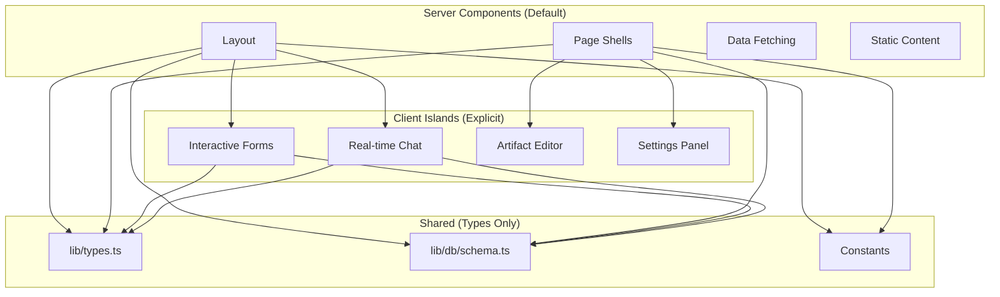
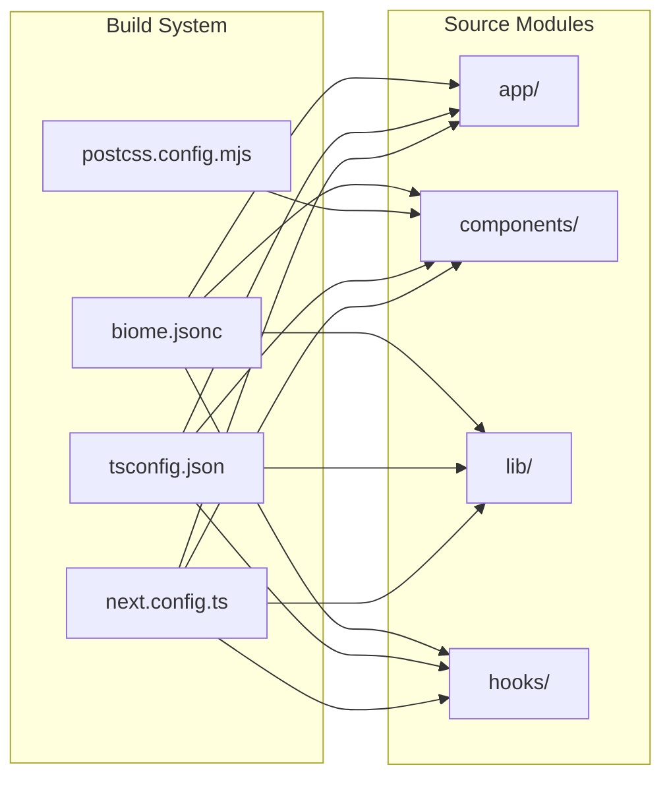
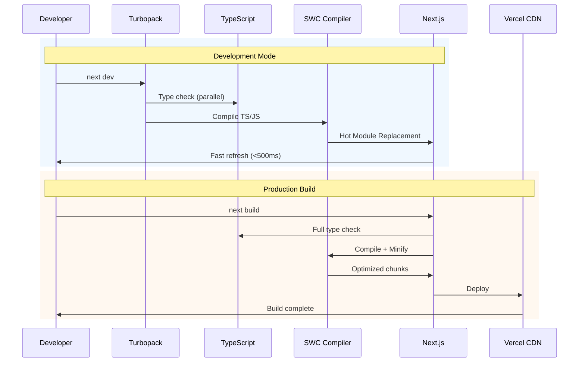
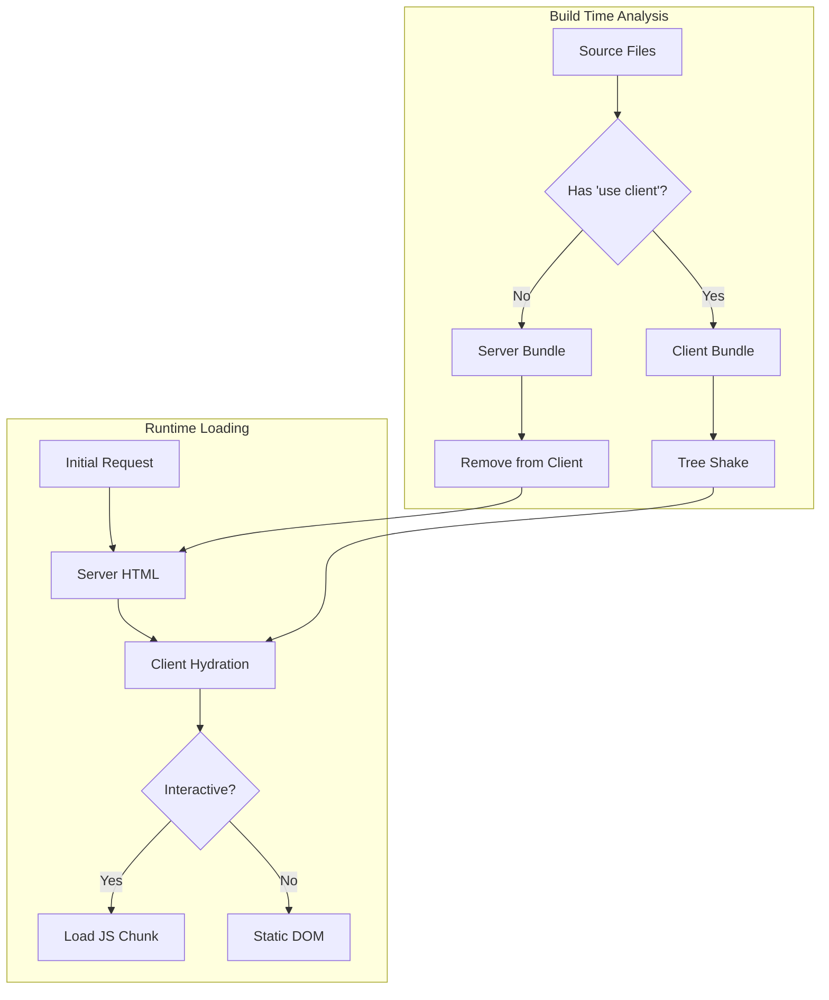

# 14-Build-Bundle-Optimal-Design

> **Module**: P3.2 - Build & Bundle Optimization  
> **Priority**: HIGH (Performance)  
> **Status**: DESIGN COMPLETE  
> **Author**: Ouroboros Architect  
> **Date**: 2024-12-17

---

## 1. Feature/Module Purpose

**Business Capability**: Fast development cycles, minimal production bundles, optimal user experience.

Build & Bundle optimization serves three objectives:

1. **Developer Experience**: Fast dev rebuilds (<1s), instant HMR
2. **User Performance**: Minimal initial JS, fast TTI (Time to Interactive)
3. **Infrastructure Cost**: Reduced bandwidth, edge caching efficiency

**Success Criteria**:

- Dev rebuild time: <500ms (Turbopack)
- Production build time: <60s
- Initial JS bundle: <200KB gzipped
- Core Web Vitals: LCP <2.5s, FID <100ms, CLS <0.1
- Zero duplicate dependencies in chunks

---

## 2. Key Requirements

### 2.1 Build System

| Requirement         | Description                                           |
| ------------------- | ----------------------------------------------------- |
| Turbopack Dev       | Use Turbopack for development (default in Next.js 16) |
| Webpack Prod        | Stable webpack for production builds                  |
| Incremental Builds  | Cache intermediate artifacts                          |
| Parallel Processing | Multi-core compilation                                |
| Type Checking       | Concurrent with build                                 |

### 2.2 Bundle Optimization

| Requirement    | Description                             |
| -------------- | --------------------------------------- |
| Code Splitting | Route-based + component-based splitting |
| Tree Shaking   | Eliminate dead code                     |
| Minification   | SWC for JS, LightningCSS for CSS        |
| Compression    | Brotli + gzip for static assets         |
| Chunk Naming   | Deterministic names for caching         |

### 2.3 Server/Client Boundaries

| Requirement      | Description                            |
| ---------------- | -------------------------------------- |
| RSC by Default   | Server components unless marked client |
| Client Islands   | Minimal client component surface       |
| Shared Types     | Types-only imports across boundaries   |
| Bundle Isolation | No server code in client bundles       |

### 2.4 Performance Optimization

| Requirement        | Description                  |
| ------------------ | ---------------------------- |
| Prefetching        | Link-based route prefetching |
| Preloading         | Critical resource hints      |
| Dynamic Imports    | Heavy components lazy-loaded |
| Image Optimization | Next/Image with AVIF/WebP    |

---

## 3. Quick Current State Notes

### 3.1 What Exists (next.config.ts)

**Strengths**:

- ✅ React Compiler enabled (`reactCompiler: true`)
- ✅ Component caching (`cacheComponents: true`)
- ✅ Turbopack FS cache (`turbopackFileSystemCacheForDev: true`)
- ✅ Inline CSS (`inlineCss: true`)
- ✅ Package imports optimization (extensive list)
- ✅ Bundle analyzer available (`@next/bundle-analyzer`)
- ✅ View transitions enabled
- ✅ Image optimization with AVIF/WebP

**Issues**:

- ⚠️ Commented webpack chunk naming config
- ⚠️ No LightningCSS (PostCSS compatibility note)
- ⚠️ Source maps disabled but no clear strategy
- ⚠️ `optimizePackageImports` list is manual, may miss packages

### 3.2 TypeScript Config (tsconfig.json)

**Strengths**:

- ✅ `ESNext` target for modern output
- ✅ `bundler` module resolution (optimal for Next.js)
- ✅ `incremental: true` for fast type checks
- ✅ Strict mode enabled
- ✅ `noUncheckedIndexedAccess` for safety

**Issues**:

- ⚠️ No `verbatimModuleSyntax` for type-only imports
- ⚠️ Missing `exactOptionalPropertyTypes`

### 3.3 Dynamic Imports Analysis

**Good Patterns Found**:

```typescript
// chat-layout-client.tsx - Sidebar lazy loading
const AppSidebar = dynamic(
  () => import("@/components/app-sidebar").then((mod) => mod.AppSidebar),
  { ssr: false, loading: () => <SidebarSkeleton /> }
);

// document-preview.tsx - Editor lazy loading
const CodeEditor = dynamic(
  () => import("./code-editor").then((m) => m.CodeEditor),
  { ssr: false }
);

// chat.tsx - Artifact lazy loading
const Artifact = dynamic(() => import("./artifact").then((m) => m.Artifact), {
  ssr: false,
});
```

**Issues**:

- ⚠️ No loading states for some dynamic imports
- ⚠️ Missing error boundaries for dynamic components
- ⚠️ No preload hints for predictable user paths

### 3.4 Client Component Analysis

**High Client Component Count**:

- 20+ UI components with `"use client"`
- All Radix UI primitives are client components
- Some components could be server-side rendered

**Issues**:

- ⚠️ `version-footer.tsx` is client but could be server
- ⚠️ No clear client boundary strategy
- ⚠️ Heavy dependencies in client bundle (CodeMirror, TipTap)

### 3.5 Development Scripts (package.json)

**Current**:

```json
{
  "dev": "next dev",
  "build": "tsx lib/db/migrate && next build",
  "analyze": "cross-env ANALYZE=true next build --webpack"
}
```

**Issues**:

- ⚠️ `--webpack` flag forces webpack in dev (not needed in script)
- ⚠️ No Turbo flag explicitly set (default now, but could be explicit)
- ⚠️ No CI-specific build optimizations

---

## 4. Optimal Architecture Design

### 4.1 Bundle Strategy

```mermaid
graph TB
    subgraph "Entry Points"
        A[app/layout.tsx]
        B[app/(chat)/page.tsx]
        C[app/(auth)/login/page.tsx]
    end

    subgraph "Framework Chunks"
        D[next-runtime]
        E[react-dom]
        F[react-compiler-runtime]
    end

    subgraph "Shared Chunks"
        G[ui-primitives<br/>Radix, Button, etc.]
        H[utils<br/>clsx, cn, date-fns]
        I[auth-core<br/>Supabase client]
    end

    subgraph "Feature Chunks"
        J[chat-core<br/>Messages, Input]
        K[artifact-system<br/>Dynamic Load]
        L[editors<br/>CodeMirror, TipTap]
    end

    subgraph "Lazy Chunks"
        M[code-editor]
        N[text-editor]
        O[sheet-editor]
        P[image-editor]
        Q[mermaid-renderer]
    end

    A --> D & E & F
    B --> G & H & I & J
    J --> K
    K -.->|dynamic| L
    L -.->|dynamic| M & N & O & P & Q
```

### 4.2 Chunk Hierarchy

| Chunk Category | Contents                 | Load Strategy | Target Size  |
| -------------- | ------------------------ | ------------- | ------------ |
| **Critical**   | React, Next.js runtime   | Inline        | <50KB        |
| **Above Fold** | Layout, navigation       | Preload       | <80KB        |
| **Route**      | Page-specific components | Prefetch      | <100KB/route |
| **Feature**    | Chat, artifact base      | On demand     | <150KB       |
| **Heavy**      | Editors, charts          | Lazy          | <300KB each  |

### 4.3 Server/Client Boundary Architecture



**Boundary Rules**:

| Pattern           | Boundary      | Reason                |
| ----------------- | ------------- | --------------------- |
| Data fetching     | Server        | DB access, secrets    |
| Form submission   | Server Action | Validation, mutations |
| User interaction  | Client        | Event handlers        |
| Real-time updates | Client        | WebSocket/SSE         |
| Static display    | Server        | No hydration needed   |

### 4.4 Configuration Architecture

```typescript
// next.config.ts - Optimal Configuration
import bundleAnalyzer from "@next/bundle-analyzer";
import type { NextConfig } from "next";

const withBundleAnalyzer = bundleAnalyzer({
  enabled: process.env.ANALYZE === "true",
});

const nextConfig: NextConfig = {
  // === Core Performance ===
  reactCompiler: true, // React Compiler for auto-memoization
  cacheComponents: true, // Component-level caching
  reactStrictMode: true, // Strict mode in dev
  productionBrowserSourceMaps: false, // No source maps in prod

  // === Experimental Features ===
  experimental: {
    // Build performance
    turbopackFileSystemCacheForDev: true, // 50% faster dev restarts
    parallelServerCompiles: true, // Multi-core server builds

    // Runtime performance
    inlineCss: true, // Inline critical CSS
    viewTransition: true, // Smooth page transitions
    optimizeCss: true, // CSS minification

    // Bundle optimization
    optimizePackageImports: [
      // UI frameworks
      "lucide-react",
      "@radix-ui/react-icons",
      "framer-motion",

      // Rich text
      "@tiptap/react",
      "@tiptap/core",
      "@tiptap/starter-kit",

      // Code editing
      "codemirror",
      "@codemirror/lang-python",
      "@codemirror/lang-javascript",
      "@codemirror/lang-typescript",
      "@codemirror/state",
      "@codemirror/view",

      // AI SDK
      "@ai-sdk/react",
      "ai",

      // Markdown/Math
      "streamdown",
      "shiki",
      "remark-math",
      "rehype-katex",
      "katex",

      // Utilities
      "date-fns",
      "zod",
    ],

    // Server Actions
    serverActions: {
      bodySizeLimit: "2mb",
    },
  },

  // === Image Optimization ===
  images: {
    remotePatterns: [
      { hostname: "avatar.vercel.sh" },
      { protocol: "https", hostname: "*.blob.vercel-storage.com" },
    ],
    formats: ["image/avif", "image/webp"],
    minimumCacheTTL: 3600, // 1 hour cache
    deviceSizes: [640, 750, 828, 1080, 1200],
    imageSizes: [16, 32, 48, 64, 96, 128, 256],
  },

  // === Headers for Caching ===
  async headers() {
    return [
      {
        source: "/static/:path*",
        headers: [
          {
            key: "Cache-Control",
            value: "public, max-age=31536000, immutable",
          },
        ],
      },
      {
        source: "/_next/static/:path*",
        headers: [
          {
            key: "Cache-Control",
            value: "public, max-age=31536000, immutable",
          },
        ],
      },
    ];
  },
};

export default withBundleAnalyzer(nextConfig);
```

### 4.5 TypeScript Optimization

```jsonc
// tsconfig.json - Optimal Configuration
{
  "compilerOptions": {
    // === Output ===
    "target": "ESNext",
    "module": "ESNext",
    "moduleResolution": "bundler",
    "jsx": "react-jsx",
    "noEmit": true,

    // === Strictness ===
    "strict": true,
    "strictNullChecks": true,
    "noUncheckedIndexedAccess": true,
    "exactOptionalPropertyTypes": true,

    // === Module Handling ===
    "verbatimModuleSyntax": true, // Type-only imports optimization
    "isolatedModules": true, // Required for bundlers
    "esModuleInterop": true,
    "resolveJsonModule": true,

    // === Performance ===
    "incremental": true,
    "skipLibCheck": true,

    // === Project ===
    "lib": ["dom", "dom.iterable", "esnext"],
    "allowJs": true,
    "forceConsistentCasingInFileNames": true,
    "paths": { "@/*": ["./*"] },
    "plugins": [{ "name": "next" }]
  },
  "include": ["next-env.d.ts", "**/*.ts", "**/*.tsx", ".next/types/**/*.ts"],
  "exclude": ["node_modules", ".next", "tests"]
}
```

---

## 5. Technology Stack

### 5.1 Build Tools

| Tool                      | Purpose                         | Version               |
| ------------------------- | ------------------------------- | --------------------- |
| **Turbopack**             | Dev server bundling             | Built into Next.js 16 |
| **SWC**                   | JS/TS compilation, minification | Built into Next.js    |
| **PostCSS**               | CSS processing (Tailwind)       | ^8.x                  |
| **@next/bundle-analyzer** | Bundle visualization            | ^16.0.10              |

### 5.2 Next.js 16 Features Used

| Feature           | Status     | Impact            |
| ----------------- | ---------- | ----------------- |
| React Compiler    | ✅ Enabled | Auto-memoization  |
| Turbopack (dev)   | ✅ Default | 10x faster dev    |
| Component Caching | ✅ Enabled | Faster builds     |
| View Transitions  | ✅ Enabled | Smooth navigation |
| Inline CSS        | ✅ Enabled | No FOUC           |
| Package Imports   | ✅ Enabled | Tree-shaking      |

### 5.3 Optimization Libraries

| Library         | Purpose        | Bundle Impact    |
| --------------- | -------------- | ---------------- |
| `date-fns`      | Date utilities | Tree-shakeable   |
| `lucide-react`  | Icons          | Per-icon imports |
| `framer-motion` | Animations     | ~50KB (lazy)     |
| `zod`           | Validation     | ~15KB            |

---

## 6. Simplifications

### 6.1 Remove/Deprecate

| Item                      | Reason                     | Action               |
| ------------------------- | -------------------------- | -------------------- |
| Commented webpack config  | Not needed with Turbopack  | Delete               |
| Manual chunk naming       | Next.js handles            | Remove               |
| `.next/dev/types` include | Auto-included              | Remove from tsconfig |
| Some `"use client"`       | Could be server components | Audit and convert    |

### 6.2 Consolidate

| Current                         | Target                     | Benefit             |
| ------------------------------- | -------------------------- | ------------------- |
| Multiple dynamic imports        | Centralized lazy loading   | Consistent patterns |
| Scattered loading states        | Shared skeleton components | DRY                 |
| Package-by-package optimization | Auto-detect heavy packages | Less maintenance    |

---

## 7. Dependencies

### 7.1 Build Dependencies

```json
{
  "devDependencies": {
    "@next/bundle-analyzer": "^16.0.10",
    "cross-env": "^10.1.0",
    "tsx": "^4.19.1",
    "typescript": "^5.6.3"
  }
}
```

### 7.2 Module Dependencies



### 7.3 Integration Points

| Module          | Depends On           | Integration         |
| --------------- | -------------------- | ------------------- |
| Error Handling  | Build config         | Source maps         |
| AI Integration  | Package optimization | ai-sdk imports      |
| UI Components   | Tree-shaking         | lucide-react, radix |
| Artifact System | Dynamic imports      | Editor lazy loading |

---

## 8. Performance Optimizations

### 8.1 Prefetching Strategy

```typescript
// lib/navigation/prefetch.ts
import { useRouter } from "next/navigation";
import { useCallback, useEffect } from "react";

/**
 * Predictive prefetching based on user behavior
 */
export function usePredictivePrefetch() {
  const router = useRouter();

  const prefetchOnHover = useCallback(
    (href: string) => {
      return {
        onMouseEnter: () => router.prefetch(href),
        onFocus: () => router.prefetch(href),
      };
    },
    [router]
  );

  return { prefetchOnHover };
}

/**
 * Prefetch routes based on viewport visibility
 */
export function usePrefetchOnVisible(href: string) {
  useEffect(() => {
    if (typeof window === "undefined") return;

    const prefetch = () => {
      import("next/navigation").then(({ prefetch }) => {
        prefetch(href);
      });
    };

    // Prefetch after idle
    if ("requestIdleCallback" in window) {
      requestIdleCallback(prefetch);
    } else {
      setTimeout(prefetch, 200);
    }
  }, [href]);
}
```

### 8.2 Preloading Critical Resources

```typescript
// app/head.tsx - Enhanced Resource Hints
export default function Head() {
  return (
    <>
      {/* Preconnect to critical origins */}
      <link rel="preconnect" href="https://fonts.googleapis.com" />
      <link rel="preconnect" href="https://api.openai.com" />

      {/* DNS prefetch for likely destinations */}
      <link rel="dns-prefetch" href="https://avatar.vercel.sh" />

      {/* Preload critical fonts */}
      <link
        rel="preload"
        href="/fonts/geist-sans.woff2"
        as="font"
        type="font/woff2"
        crossOrigin="anonymous"
      />
    </>
  );
}
```

### 8.3 Dynamic Import Patterns

```typescript
// lib/utils/lazy-load.ts
import dynamic from "next/dynamic";
import type { ComponentType } from "react";
import { Loader } from "@/components/elements/loader";

/**
 * Standard lazy loading with loading state
 */
export function lazyLoad<P extends object>(
  importFn: () => Promise<{ default: ComponentType<P> }>,
  options?: {
    loading?: ComponentType;
    ssr?: boolean;
  }
) {
  return dynamic(importFn, {
    ssr: options?.ssr ?? false,
    loading: options?.loading ?? (() => <Loader />),
  });
}

/**
 * Preload a dynamic component (call before render)
 */
export function preloadComponent<P extends object>(
  importFn: () => Promise<{ default: ComponentType<P> }>
) {
  // Trigger import but don't wait
  importFn().catch(() => {});
}

// Usage example:
// const CodeEditor = lazyLoad(() => import("./code-editor").then(m => m.CodeEditor));
//
// // Preload when user hovers on "code" button
// onMouseEnter={() => preloadComponent(() => import("./code-editor"))}
```

### 8.4 Bundle Size Monitoring

```typescript
// scripts/analyze-bundle.ts
import { execSync } from "child_process";

const BUNDLE_LIMITS = {
  main: 80_000, // 80KB
  "app/page": 100_000, // 100KB
  "chat-core": 150_000, // 150KB
  editor: 300_000, // 300KB per editor
} as const;

function analyzeBundles() {
  console.log("🔍 Analyzing bundle sizes...");

  execSync("ANALYZE=true next build", { stdio: "inherit" });

  // Parse .next/analyze results
  // Compare against limits
  // Fail CI if exceeded
}

export { analyzeBundles };
```

### 8.5 Performance Monitoring Integration

```typescript
// instrumentation-client.ts - Enhanced
import { onCLS, onFID, onLCP, onTTFB, onINP } from "web-vitals";

export function register() {
  if (typeof window !== "undefined") {
    // Report Core Web Vitals
    const reportVital = (metric: { name: string; value: number }) => {
      // Send to analytics
      if (process.env.NODE_ENV === "production") {
        fetch("/api/analytics/vitals", {
          method: "POST",
          body: JSON.stringify(metric),
          keepalive: true,
        });
      }
    };

    onCLS(reportVital);
    onFID(reportVital);
    onLCP(reportVital);
    onTTFB(reportVital);
    onINP(reportVital);
  }
}
```

---

## 9. Implementation Checklist

### Phase 1: Configuration Updates

- [ ] Update `next.config.ts` with optimal settings
- [ ] Update `tsconfig.json` with `verbatimModuleSyntax`
- [ ] Remove commented webpack configuration
- [ ] Add cache headers configuration

### Phase 2: Code Splitting Audit

- [ ] Audit all `"use client"` components
- [ ] Convert server-renderable components
- [ ] Add loading states to all dynamic imports
- [ ] Implement preload hints for heavy components

### Phase 3: Bundle Analysis

- [ ] Run bundle analyzer
- [ ] Document current chunk sizes
- [ ] Identify duplicate dependencies
- [ ] Create size budget alerts

### Phase 4: Performance Monitoring

- [ ] Implement Web Vitals reporting
- [ ] Add bundle size CI checks
- [ ] Create performance dashboard
- [ ] Set up regression alerts

---

## 10. ADR: Turbopack vs Webpack for Production

### Context

Next.js 16 uses Turbopack by default for development but webpack remains the default for production builds. Should we migrate to Turbopack for production?

### Decision

**Keep webpack for production builds** (current default).

### Rationale

**ALT-001: Turbopack for Production**

- Description: Enable `--turbo` flag for production builds
- Rejected because:
  - Turbopack prod is still experimental
  - May have edge cases with complex chunk splitting
  - Webpack prod is battle-tested

**ALT-002: Webpack for Both**

- Description: Force webpack for development too
- Rejected because:
  - Turbopack dev is 10x faster
  - Actively maintained by Vercel
  - Better DX is worth the tool difference

### Consequences

**Positive**:

- **POS-001**: Fast dev rebuilds with Turbopack
- **POS-002**: Stable, optimized production bundles with webpack
- **POS-003**: Best of both worlds approach

**Negative**:

- **NEG-001**: Slight behavior differences between dev/prod
- **NEG-002**: Must test prod builds separately from dev

### Implementation Notes

- Monitor Next.js releases for Turbopack prod stability
- Re-evaluate when Turbopack prod reaches stable

---

## 11. Mermaid Diagrams

### 11.1 Build Pipeline



### 11.2 Client/Server Code Flow



---

## 12. References

- [Next.js 16 Documentation](https://nextjs.org/docs)
- [Turbopack Performance](https://turbo.build/pack/docs/why-turbopack)
- [React Compiler](https://react.dev/learn/react-compiler)
- [Web Vitals](https://web.dev/vitals/)
- [Bundle Analysis Best Practices](https://nextjs.org/docs/app/building-your-application/optimizing/bundle-analyzer)

---

## 13. Appendix: Current vs Optimal Comparison

| Metric       | Current | Target | Gap              |
| ------------ | ------- | ------ | ---------------- |
| Dev rebuild  | ~1s     | <500ms | Turbopack cache  |
| Prod build   | ~90s    | <60s   | Parallel compile |
| Initial JS   | ~250KB  | <200KB | Tree-shaking     |
| Editor chunk | ~500KB  | <300KB | Better splitting |
| LCP          | ~3s     | <2.5s  | Preloading       |

━━━━━━━━━━━━━━━━━━━━━━━━━━━━━━━━━━━━━━━━━━━━━━
✅ [TASK COMPLETE]
━━━━━━━━━━━━━━━━━━━━━━━━━━━━━━━━━━━━━━━━━━━━━━
