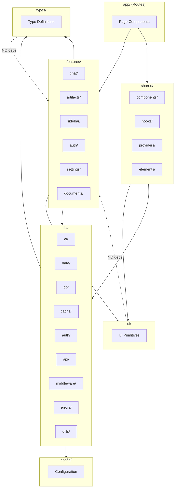

# P3.3: Directory Structure Optimal Design

**Status:** Proposed  
**Date:** 2025-12-17  
**Author:** Ouroboros Architect  
**Spec ID:** 15-directory-structure-optimal-design

---

## Context

The Next.js 16.0.10 application with Turbopack requires an optimal directory structure that balances:

- Feature cohesion vs layer separation
- Server/Client/Edge boundary clarity
- Import performance and tree-shaking
- Developer experience and discoverability

### Current State Analysis

```
nextjs-ai-chatbot/
├── app/                    # ✅ Next.js App Router (good)
│   ├── (auth)/             # ✅ Route groups (good)
│   ├── (chat)/             # ✅ Route groups (good)
│   └── api/                # ⚠️ Mixed with route groups
├── artifacts/              # ⚠️ Top-level, should be in features
├── assets/                 # ⚠️ Unclear purpose
├── components/             # ⚠️ 40+ files flat, no organization
│   ├── elements/           # ⚠️ Ambiguous name
│   ├── settings/           # ✅ Feature grouping
│   └── ui/                 # ✅ Primitive components
├── docs/                   # ✅ Documentation (appropriate)
├── hooks/                  # ⚠️ Global hooks, should co-locate
├── lib/                    # ⚠️ 14 subdirs, inconsistent depth
│   ├── ai/                 # ✅ AI domain (well-organized)
│   ├── api/                # ⚠️ Validators only
│   ├── artifacts/          # ⚠️ Duplicates /artifacts
│   ├── auth/               # ✅ Auth domain
│   ├── cache/              # ✅ Cache layer
│   ├── data/               # ✅ Data access layer
│   ├── db/                 # ✅ Database layer
│   ├── editor/             # ⚠️ Should be with components
│   ├── middleware/         # ⚠️ Should be at app level
│   ├── settings/           # ⚠️ Just types.ts
│   ├── types/              # ⚠️ Global types scattered
│   ├── ui/                 # ⚠️ Conflicts with components/ui
│   └── utils/              # ❌ Empty folder
├── public/                 # ✅ Static assets (correct)
└── tests/                  # ✅ Test organization (correct)
```

### Key Problems Identified

| Issue                               | Impact                          | Severity |
| ----------------------------------- | ------------------------------- | -------- |
| Flat components/ with 40+ files     | Hard to navigate, poor DX       | HIGH     |
| Duplicate locations (artifacts, ui) | Confusion, inconsistent imports | HIGH     |
| No Server/Client file convention    | Runtime boundary confusion      | MEDIUM   |
| Empty folders (lib/utils)           | Misleading structure            | LOW      |
| Hooks not co-located                | Feature fragmentation           | MEDIUM   |
| No barrel file strategy             | Import verbosity                | MEDIUM   |

---

## Decision

Adopt a **Hybrid Feature-Layer Architecture** that:

1. Groups features in `features/` directory
2. Maintains shared infrastructure in `lib/`
3. Uses explicit `*.client.ts` and `*.server.ts` suffixes
4. Implements strategic barrel files with tree-shaking

---

## Optimal Architecture Design

### Proposed Directory Tree

```
nextjs-ai-chatbot/
├── app/                              # Next.js App Router (ROUTES ONLY)
│   ├── (auth)/
│   │   ├── login/page.tsx
│   │   └── register/page.tsx
│   ├── (chat)/
│   │   ├── layout.tsx
│   │   ├── page.tsx
│   │   ├── error.tsx
│   │   ├── loading.tsx
│   │   └── chat/[id]/page.tsx
│   ├── api/                          # API routes (consolidated)
│   │   ├── auth/[...nextauth]/route.ts
│   │   ├── chat/route.ts
│   │   ├── document/route.ts
│   │   ├── files/route.ts
│   │   ├── health/route.ts
│   │   ├── history/route.ts
│   │   ├── suggestions/route.ts
│   │   └── vote/route.ts
│   ├── global-error.tsx
│   ├── layout.tsx
│   └── globals.css
│
├── features/                          # 🆕 FEATURE MODULES
│   ├── chat/                          # Chat feature
│   │   ├── components/
│   │   │   ├── chat.tsx
│   │   │   ├── chat-header.tsx
│   │   │   ├── message.tsx
│   │   │   ├── messages.tsx
│   │   │   ├── message-actions.tsx
│   │   │   ├── message-editor.tsx
│   │   │   ├── message-reasoning.tsx
│   │   │   └── multimodal-input.tsx
│   │   ├── hooks/
│   │   │   ├── use-messages.tsx
│   │   │   └── use-scroll-to-bottom.tsx
│   │   ├── actions/
│   │   │   └── chat-actions.server.ts
│   │   ├── types.ts
│   │   └── index.ts                   # Barrel file
│   │
│   ├── artifacts/                     # Artifacts feature
│   │   ├── components/
│   │   │   ├── artifact.tsx
│   │   │   ├── artifact-actions.tsx
│   │   │   ├── artifact-close-button.tsx
│   │   │   ├── artifact-error-boundary.tsx
│   │   │   ├── artifact-messages.tsx
│   │   │   └── create-artifact.tsx
│   │   ├── editors/
│   │   │   ├── code-editor.tsx
│   │   │   ├── text-editor.tsx
│   │   │   ├── sheet-editor.tsx
│   │   │   └── image-editor.tsx
│   │   ├── renderers/                 # From artifacts/
│   │   │   ├── code/
│   │   │   │   ├── client.tsx
│   │   │   │   └── server.ts
│   │   │   ├── image/
│   │   │   ├── sheet/
│   │   │   └── text/
│   │   ├── hooks/
│   │   │   └── use-artifact.ts
│   │   ├── actions/
│   │   │   └── artifact-actions.server.ts
│   │   ├── types.ts
│   │   └── index.ts
│   │
│   ├── sidebar/                       # Sidebar feature
│   │   ├── components/
│   │   │   ├── app-sidebar.tsx
│   │   │   ├── sidebar-history.tsx
│   │   │   ├── sidebar-history-item.tsx
│   │   │   ├── sidebar-skeleton.tsx
│   │   │   ├── sidebar-toggle.tsx
│   │   │   └── sidebar-user-nav.tsx
│   │   ├── hooks/
│   │   │   └── use-optimistic-chats.tsx
│   │   └── index.ts
│   │
│   ├── auth/                          # Auth feature
│   │   ├── components/
│   │   │   ├── auth-form.tsx
│   │   │   └── auth-provider.tsx
│   │   ├── hooks/
│   │   │   └── use-chat-visibility.ts
│   │   └── index.ts
│   │
│   ├── settings/                      # Settings feature
│   │   ├── components/
│   │   │   └── settings-sheet.tsx
│   │   ├── types.ts
│   │   └── index.ts
│   │
│   └── documents/                     # Documents feature
│       ├── components/
│       │   ├── document.tsx
│       │   ├── document-preview.tsx
│       │   ├── document-skeleton.tsx
│       │   └── diffview.tsx
│       └── index.ts
│
├── shared/                            # 🆕 SHARED COMPONENTS
│   ├── components/                    # Non-feature components
│   │   ├── greeting.tsx
│   │   ├── icons.tsx
│   │   ├── model-selector.tsx
│   │   ├── preview-attachment.tsx
│   │   ├── submit-button.tsx
│   │   ├── suggested-actions.tsx
│   │   ├── suggestion.tsx
│   │   ├── theme-provider.tsx
│   │   ├── toast.tsx
│   │   ├── toolbar.tsx
│   │   ├── version-footer.tsx
│   │   ├── visibility-selector.tsx
│   │   └── weather.tsx
│   ├── hooks/                         # Shared hooks
│   │   ├── use-mobile.ts
│   │   └── use-window-size.ts
│   ├── providers/                     # 🆕 Context providers
│   │   ├── data-stream-provider.tsx
│   │   └── data-stream-handler.tsx
│   └── elements/                      # From components/elements
│       ├── actions.tsx
│       ├── branch.tsx
│       ├── context.tsx
│       ├── conversation.tsx
│       ├── image.tsx
│       ├── inline-citation.tsx
│       ├── loader.tsx
│       ├── message.tsx
│       ├── prompt-input.tsx
│       ├── reasoning.tsx
│       ├── response.tsx
│       ├── source.tsx
│       ├── suggestion.tsx
│       ├── task.tsx
│       ├── tool.tsx
│       └── web-preview.tsx
│
├── ui/                                # 🆕 PRIMITIVE UI (moved from components/ui)
│   ├── alert-dialog.tsx
│   ├── avatar.tsx
│   ├── badge.tsx
│   ├── button.tsx
│   ├── card.tsx
│   ├── carousel.tsx
│   ├── collapsible.tsx
│   ├── dropdown-menu.tsx
│   ├── hover-card.tsx
│   ├── input.tsx
│   ├── label.tsx
│   ├── progress.tsx
│   ├── scroll-area.tsx
│   ├── select.tsx
│   ├── separator.tsx
│   ├── sheet.tsx
│   ├── sidebar.tsx
│   ├── skeleton.tsx
│   ├── slider.tsx
│   ├── switch.tsx
│   ├── textarea.tsx
│   ├── tooltip.tsx
│   └── index.ts                       # Barrel file
│
├── lib/                               # INFRASTRUCTURE LAYER
│   ├── ai/                            # AI domain (unchanged)
│   │   ├── tools/
│   │   ├── models.ts
│   │   ├── prompts.ts
│   │   ├── providers.ts
│   │   └── index.ts
│   ├── data/                          # Data access layer
│   │   ├── chat.ts
│   │   ├── chat-operations.ts
│   │   ├── document.ts
│   │   ├── base.ts
│   │   └── index.ts
│   ├── db/                            # Database layer
│   │   ├── migrations/
│   │   ├── helpers/
│   │   ├── schema.ts
│   │   ├── queries.ts
│   │   ├── transactions.ts
│   │   └── index.ts
│   ├── cache/                         # Cache layer
│   │   ├── redis.ts
│   │   ├── operations.ts
│   │   ├── batch-operations.ts
│   │   └── index.ts
│   ├── auth/                          # Auth infrastructure
│   │   ├── client.ts
│   │   ├── session.server.ts          # 🆕 Explicit server
│   │   └── index.ts
│   ├── api/                           # API utilities
│   │   ├── guards.ts
│   │   ├── schemas.ts
│   │   ├── validators.ts
│   │   └── index.ts
│   ├── middleware/                    # Middleware utilities
│   │   ├── rate-limit.ts
│   │   ├── rate-limit-config.ts
│   │   ├── edge-rate-limit.ts
│   │   ├── deduplication.ts
│   │   └── index.ts
│   ├── errors/                        # 🆕 Centralized errors
│   │   ├── types.ts
│   │   ├── handlers.ts
│   │   └── index.ts
│   └── utils/                         # General utilities
│       ├── files.ts
│       ├── motion.tsx
│       ├── log.ts
│       └── index.ts
│
├── types/                             # 🆕 GLOBAL TYPE DEFINITIONS
│   ├── api.ts                         # API request/response types
│   ├── database.ts                    # DB entity types
│   ├── ai.ts                          # AI/model types
│   ├── message-parts.ts               # From lib/types
│   └── index.ts
│
├── config/                            # 🆕 CONFIGURATION
│   ├── constants.ts                   # From lib/constants.ts
│   ├── api-context.ts                 # From lib/api-context.ts
│   └── request-context.ts             # From lib/request-context.ts
│
├── public/                            # Static assets (unchanged)
│   └── images/
│
├── tests/                             # Tests (unchanged)
│   ├── e2e/
│   ├── fixtures.ts
│   └── helpers.ts
│
└── docs/                              # Documentation (unchanged)
    ├── architecture.md
    ├── database.md
    └── README.md
```

---

## Import Alias Strategy

### Updated tsconfig.json paths

```jsonc
{
  "compilerOptions": {
    "paths": {
      "@/*": ["./*"],
      "@/features/*": ["./features/*"],
      "@/shared/*": ["./shared/*"],
      "@/ui": ["./ui/index.ts"],
      "@/ui/*": ["./ui/*"],
      "@/lib/*": ["./lib/*"],
      "@/types": ["./types/index.ts"],
      "@/types/*": ["./types/*"],
      "@/config/*": ["./config/*"]
    }
  }
}
```

### Import Examples

```typescript
// Feature imports (explicit paths)
import { Chat, ChatHeader } from "@/features/chat";
import { useMessages } from "@/features/chat/hooks/use-messages";

// UI primitives (barrel file)
import { Button, Card, Input } from "@/ui";

// Shared components
import { ModelSelector } from "@/shared/components/model-selector";

// Infrastructure
import { cacheGet, cacheSet } from "@/lib/cache";

// Types
import type { Message, Chat } from "@/types";

// Config
import { API_RATE_LIMIT } from "@/config/constants";
```

---

## Server/Client/Edge File Separation

### Naming Convention

| Suffix       | Environment      | Example              |
| ------------ | ---------------- | -------------------- |
| `.server.ts` | Server-only      | `session.server.ts`  |
| `.client.ts` | Client-only      | `auth.client.ts`     |
| `.edge.ts`   | Edge runtime     | `rate-limit.edge.ts` |
| (none)       | Universal/Shared | `utils.ts`           |

### Implementation Rules

```typescript
// session.server.ts - Server-only code
// This file should NEVER be imported on client
import "server-only"; // Next.js build-time guard

export async function getSession() {
  // Server-side session logic
}

// auth.client.ts - Client-only code
("use client");

import { useEffect, useState } from "react";

export function useAuth() {
  // Client-side auth hooks
}
```

### Enforcement via ESLint

```javascript
// .eslintrc.js
module.exports = {
  rules: {
    "import/no-restricted-paths": [
      "error",
      {
        zones: [
          {
            target: "./app/**/*.tsx",
            from: "./**/*.server.ts",
            message: "Cannot import server files in client components",
          },
        ],
      },
    ],
  },
};
```

---

## Barrel File Optimization

### Problem: Barrel Files Kill Tree-Shaking

```typescript
// ❌ BAD: Imports everything even if you need one item
// ui/index.ts
export * from "./button";
export * from "./card";
export * from "./input";
// ... 20 more exports

// Consumer
import { Button } from "@/ui"; // Bundles ALL 20+ components
```

### Solution: Selective Re-exports

```typescript
// ✅ GOOD: Named exports only
// ui/index.ts
export { Button, buttonVariants } from "./button";
export { Card, CardHeader, CardContent } from "./card";
export { Input } from "./input";
// Only re-export commonly used items

// For less common items, import directly
import { Carousel } from "@/ui/carousel";
```

### Barrel File Strategy by Directory

| Directory            | Strategy         | Reason                        |
| -------------------- | ---------------- | ----------------------------- |
| `ui/`                | Selective barrel | High reuse, need tree-shaking |
| `features/*/`        | Feature barrel   | Encapsulation                 |
| `lib/*/`             | Module barrel    | Internal cohesion             |
| `types/`             | Full barrel      | Types are zero-cost           |
| `shared/components/` | NO barrel        | Each component is distinct    |

### Next.js 16 Turbopack Optimization

```typescript
// next.config.ts
const nextConfig = {
  experimental: {
    optimizePackageImports: [
      "@/ui", // Enable tree-shaking for UI
      "@/lib/cache", // Cache utilities
      "@/lib/db", // Database utilities
    ],
  },
};
```

---

## Consequences

### Positive

- **POS-001**: Clear feature boundaries improve team scalability
- **POS-002**: Co-located hooks/types reduce cognitive load
- **POS-003**: Server/Client suffixes prevent runtime errors
- **POS-004**: Strategic barrel files maintain tree-shaking
- **POS-005**: Import aliases improve DX and refactoring safety

### Negative

- **NEG-001**: Migration effort required (~2-3 days)
- **NEG-002**: Team needs to learn new conventions
- **NEG-003**: Some imports become longer (direct vs barrel)

### Mitigations

| Risk                 | Mitigation                     |
| -------------------- | ------------------------------ |
| Migration complexity | Incremental migration script   |
| Import breakage      | Update all imports via codemod |
| Convention drift     | ESLint rules + PR checks       |

---

## Alternatives Considered

### ALT-001: Pure Layer-Based (Current)

- **Description**: Keep all components in `components/`, all hooks in `hooks/`
- **Rejected because**: Poor scalability, no feature cohesion

### ALT-002: Pure Feature-Based

- **Description**: Everything including UI primitives in feature folders
- **Rejected because**: Duplicates shared components, violates DRY

### ALT-003: Next.js Colocation Only

- **Description**: Put components alongside routes in `app/`
- **Rejected because**: Bloats app directory, mixes routing with logic

---

## Dependencies Mapping



### Dependency Rules

| From        | Can Import                               | Cannot Import                      |
| ----------- | ---------------------------------------- | ---------------------------------- |
| `app/`      | features, shared, ui, lib, types, config | -                                  |
| `features/` | shared, ui, lib, types, config           | other features (except via events) |
| `shared/`   | ui, lib, types, config                   | features                           |
| `ui/`       | lib/utils only, types                    | features, shared, lib/\*           |
| `lib/`      | other lib/\*, types, config              | features, shared, ui               |
| `types/`    | -                                        | anything                           |
| `config/`   | types                                    | anything else                      |

---

## Performance Optimizations

### 1. Turbopack-Friendly Structure

```typescript
// Explicit chunks via dynamic imports
const ArtifactEditor = dynamic(
  () => import("@/features/artifacts/editors/code-editor"),
  { loading: () => <EditorSkeleton /> }
);
```

### 2. Tree-Shaking Verification

```bash
# Analyze bundle to verify tree-shaking
pnpm build
pnpm dlx @next/bundle-analyzer
```

### 3. Import Cost Monitoring

```jsonc
// .vscode/settings.json
{
  "importCost.bundleSizeDecoration": "both",
  "importCost.showCalculatingDecoration": true
}
```

---

## Migration Plan

### Phase 1: Create Structure (Day 1)

1. Create `features/`, `shared/`, `ui/`, `types/`, `config/` directories
2. Update `tsconfig.json` with new path aliases
3. Add ESLint import rules

### Phase 2: Move Files (Day 1-2)

1. Move UI primitives to `ui/`
2. Group feature components into `features/*/`
3. Move shared items to `shared/`
4. Consolidate types to `types/`

### Phase 3: Update Imports (Day 2-3)

1. Run codemod to update all imports
2. Fix any circular dependencies
3. Verify build passes

### Phase 4: Cleanup (Day 3)

1. Remove empty directories
2. Add barrel files
3. Update documentation

---

## Implementation Notes

### Codemod for Import Updates

```javascript
// transform.js (jscodeshift)
module.exports = function (fileInfo, api) {
  const j = api.jscodeshift;

  const importMap = {
    "@/components/ui/button": "@/ui",
    "@/components/chat": "@/features/chat",
    "@/hooks/use-messages": "@/features/chat/hooks/use-messages",
    // ... more mappings
  };

  return j(fileInfo.source)
    .find(j.ImportDeclaration)
    .forEach((path) => {
      const source = path.node.source.value;
      if (importMap[source]) {
        path.node.source.value = importMap[source];
      }
    })
    .toSource();
};
```

### Run codemod:

```bash
npx jscodeshift -t transform.js --extensions=ts,tsx ./app ./lib
```

---

## References

- [01-error-handling-optimal-design.md](01-error-handling-optimal-design.md) - Error handling patterns
- [08-ui-components-optimal-design.md](08-ui-components-optimal-design.md) - Component organization
- [14-build-bundle-optimal-design.md](14-build-bundle-optimal-design.md) - Build optimization
- [Next.js Project Structure](https://nextjs.org/docs/app/getting-started/project-structure)
- [Turbopack Performance](https://turbo.build/pack/docs/features)

---

━━━━━━━━━━━━━━━━━━━━━━━━━━━━━━━━━━━━━━━━━━━━━━
✅ [TASK COMPLETE]
━━━━━━━━━━━━━━━━━━━━━━━━━━━━━━━━━━━━━━━━━━━━━━
