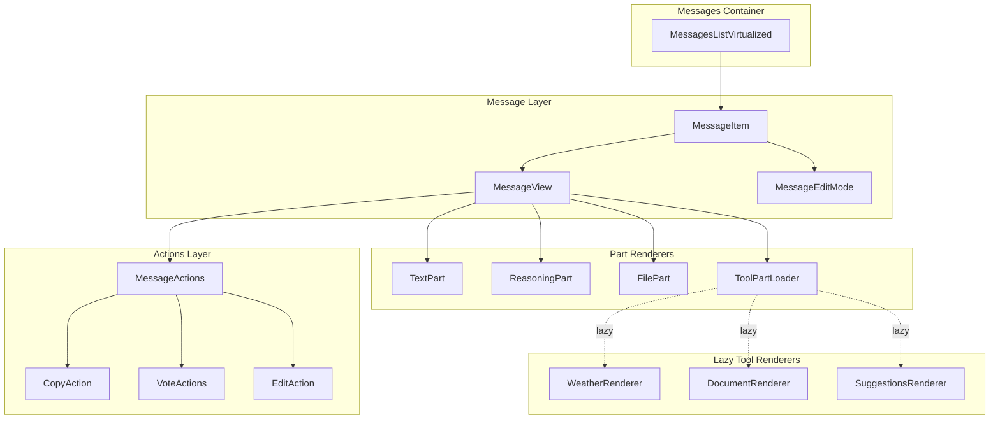
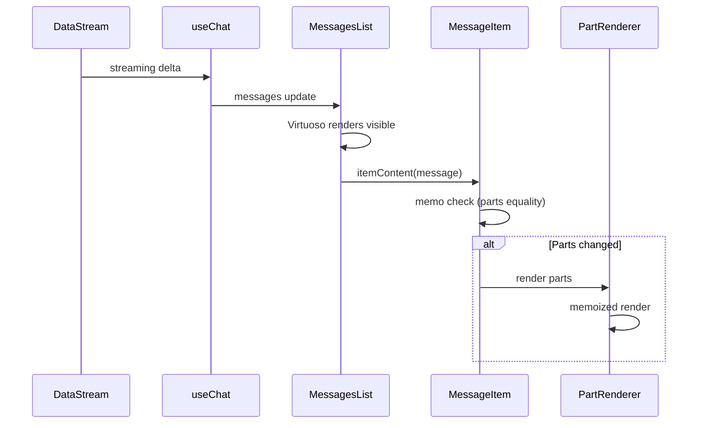
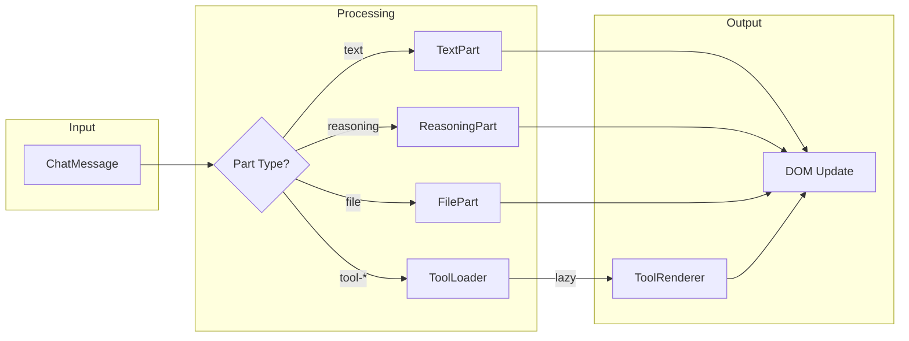
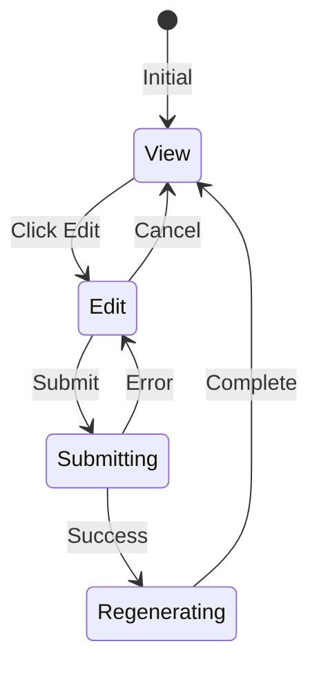

# P1.4 - Message System Optimal Design

**Status:** Proposed  
**Date:** 2024-12-17  
**Author:** Ouroboros Architect  
**Priority:** P1 (Critical Path)

---

## 1. Feature/Module Purpose

The Message System is responsible for rendering, displaying, editing, and managing user/assistant message interactions in the chat interface. It handles:

- Real-time streaming message display with incremental rendering
- Multi-part message content (text, reasoning, tools, attachments)
- Message actions (copy, edit, vote)
- Virtualized scrolling for performance
- Markdown/LaTeX rendering via `streamdown`

---

## 2. Key Requirements

| ID          | Requirement                                                 | Priority |
| ----------- | ----------------------------------------------------------- | -------- |
| REQ-MSG-001 | Render streaming messages with <50ms update latency         | Critical |
| REQ-MSG-002 | Support multi-part messages (text, reasoning, tools, files) | Critical |
| REQ-MSG-003 | Virtualized rendering for 1000+ message conversations       | High     |
| REQ-MSG-004 | Edit user messages with trailing message deletion           | High     |
| REQ-MSG-005 | Copy/Vote actions on assistant messages                     | Medium   |
| REQ-MSG-006 | Prevent unnecessary re-renders during streaming             | Critical |
| REQ-MSG-007 | Auto-scroll behavior with user override                     | Medium   |
| REQ-MSG-008 | Reasoning collapse/expand with streaming detection          | Medium   |

---

## 3. Current State Notes

### Architecture

```
components/
├── messages.tsx          # Container with Virtuoso + memo
├── message.tsx           # Individual message (387 lines, monolithic)
├── message-editor.tsx    # Edit mode component
├── message-actions.tsx   # Copy/vote actions
├── message-reasoning.tsx # Reasoning display
├── elements/
│   ├── message.tsx       # MessageContent primitive
│   ├── response.tsx      # Streamdown wrapper
│   ├── reasoning.tsx     # Collapsible reasoning
│   └── tool.tsx          # Tool call display
```

### Issues Identified

| Issue                      | Impact                                   | Evidence                                    |
| -------------------------- | ---------------------------------------- | ------------------------------------------- |
| **Monolithic message.tsx** | Hard to maintain, 387 lines              | Single file handles all part types          |
| **Inline tool renderers**  | No code reuse, duplicated error handling | tool-getWeather, tool-createDocument inline |
| **Complex memo logic**     | Fragile, easy to break                   | 15+ conditions in PreviewMessage memo       |
| **Mixed concerns**         | View/Edit mode in single component       | mode state changes cause full re-renders    |
| **No lazy loading**        | All tool UI loaded upfront               | DocumentPreview, Weather always bundled     |

---

## 4. Optimal Architecture Design

### 4.1 Component Hierarchy



### 4.2 Data Flow



### 4.3 Proposed File Structure

```
components/
├── messages/
│   ├── index.ts                    # Public exports
│   ├── messages-list.tsx           # Virtuoso container (extracted)
│   ├── message-item.tsx            # Single message wrapper
│   ├── message-view.tsx            # View mode renderer
│   ├── message-edit.tsx            # Edit mode (renamed)
│   ├── message-actions.tsx         # Actions container
│   └── parts/
│       ├── index.ts                # Part registry
│       ├── text-part.tsx           # Text content
│       ├── reasoning-part.tsx      # Reasoning display
│       ├── file-part.tsx           # Attachment display
│       └── tool-part-loader.tsx    # Dynamic tool loading
├── tools/                          # Lazy-loaded tool renderers
│   ├── weather-tool.tsx
│   ├── document-tool.tsx
│   └── suggestions-tool.tsx
```

---

## 5. Bundle Strategy

### 5.1 Critical Path (Initial Bundle)

| Module            | Size Target | Rationale           |
| ----------------- | ----------- | ------------------- |
| messages-list.tsx | <5KB        | Core virtualization |
| message-item.tsx  | <3KB        | Wrapper only        |
| message-view.tsx  | <4KB        | Part delegation     |
| text-part.tsx     | <2KB        | Most common part    |

### 5.2 Lazy-Loaded Modules

| Module               | Load Trigger          | Expected Size |
| -------------------- | --------------------- | ------------- |
| message-edit.tsx     | Edit button click     | ~3KB          |
| reasoning-part.tsx   | reasoning part exists | ~4KB          |
| tool-part-loader.tsx | tool part exists      | ~2KB (loader) |
| weather-tool.tsx     | tool-getWeather       | ~3KB          |
| document-tool.tsx    | tool-\*Document       | ~8KB          |

### 5.3 Dynamic Import Pattern

```typescript
// tool-part-loader.tsx
const toolRenderers = {
  "tool-getWeather": () => import("@/components/tools/weather-tool"),
  "tool-createDocument": () => import("@/components/tools/document-tool"),
  "tool-updateDocument": () => import("@/components/tools/document-tool"),
  "tool-requestSuggestions": () =>
    import("@/components/tools/suggestions-tool"),
} as const;

export function ToolPartLoader({ part }: { part: ToolUIPart }) {
  const Renderer = lazy(
    () =>
      toolRenderers[part.type]?.() ?? Promise.resolve({ default: UnknownTool })
  );
  return (
    <Suspense fallback={<ToolSkeleton type={part.type} />}>
      <Renderer part={part} />
    </Suspense>
  );
}
```

---

## 6. Performance Optimizations

### 6.1 Memoization Strategy

```typescript
// Simplified memo - delegate complexity to parts
export const MessageItem = memo(
  function MessageItem({ message, ...props }) {
    return message.role === "user" ? (
      <UserMessage message={message} {...props} />
    ) : (
      <AssistantMessage message={message} {...props} />
    );
  },
  (prev, next) => {
    // Simple equality - parts handle their own memo
    return (
      prev.message.id === next.message.id && prev.isLoading === next.isLoading
    );
  }
);

// Part-level memo
export const TextPart = memo(
  function TextPart({ text }) {
    return <Response>{text}</Response>;
  },
  (prev, next) => prev.text === next.text
);
```

### 6.2 Virtualization Config

```typescript
// Optimized Virtuoso settings
<Virtuoso
  increaseViewportBy={{ top: 400, bottom: 400 }} // Prerender buffer
  overscan={3} // Items to render beyond viewport
  defaultItemHeight={120} // Estimated height for CLS
  computeItemKey={(_, msg) => msg.id} // Stable keys
  itemContent={itemContent}
/>
```

### 6.3 Streaming Optimization

| Technique                    | Implementation                   | Benefit                      |
| ---------------------------- | -------------------------------- | ---------------------------- |
| **Batched updates**          | `requestAnimationFrame` wrapping | Reduce render frequency      |
| **Stable references**        | `useCallback` for itemContent    | Prevent Virtuoso re-renders  |
| **Part isolation**           | Each part memos independently    | Surgical re-renders          |
| **Artifact visibility skip** | Skip render when hidden          | Zero cost when artifact open |

---

## 7. Simplifications

### 7.1 Remove Redundancies

| Current                   | Proposed                     | Rationale             |
| ------------------------- | ---------------------------- | --------------------- |
| `message.tsx` (387 lines) | Split into 5 files           | Single responsibility |
| Inline tool switch/case   | Tool registry pattern        | Extensible, lazy      |
| Duplicate error UI        | Shared `ToolError` component | DRY                   |
| Complex memo conditions   | Part-level memoization       | Simpler, composable   |

### 7.2 Unified Part Interface

```typescript
// All parts implement this interface
interface PartRenderer<T extends MessagePart> {
  canRender: (part: MessagePart) => part is T;
  Component: React.ComponentType<{ part: T; isLoading: boolean }>;
  skeleton?: React.ComponentType;
}

// Registry for extensibility
const partRenderers: PartRenderer<any>[] = [
  textPartRenderer,
  reasoningPartRenderer,
  filePartRenderer,
  toolPartRenderer, // Handles all tool-* types
];
```

### 7.3 View/Edit Mode Separation

```typescript
// Clean separation - no mode state in MessageItem
function MessageItem({ message, isReadonly, ...props }) {
  const [isEditing, setIsEditing] = useState(false);

  if (isEditing && message.role === "user") {
    return (
      <MessageEdit
        message={message}
        onClose={() => setIsEditing(false)}
        {...props}
      />
    );
  }

  return (
    <MessageView
      message={message}
      onEdit={() => setIsEditing(true)}
      {...props}
    />
  );
}
```

---

## 8. Dependencies

### 8.1 Internal Dependencies

| Dependency                            | Type      | Purpose                |
| ------------------------------------- | --------- | ---------------------- |
| `lib/types.ts`                        | Type      | ChatMessage, ChatTools |
| `hooks/use-scroll-to-bottom.tsx`      | Hook      | Scroll behavior        |
| `components/data-stream-provider.tsx` | Context   | Stream subscription    |
| `components/elements/response.tsx`    | Component | Markdown rendering     |

### 8.2 External Dependencies

| Package           | Version | Purpose            | Bundle Impact  |
| ----------------- | ------- | ------------------ | -------------- |
| `react-virtuoso`  | ^4.x    | Virtualized list   | ~15KB gzipped  |
| `streamdown`      | ^0.x    | Streaming markdown | ~8KB gzipped   |
| `framer-motion`   | ^11.x   | Animations         | Tree-shakeable |
| `fast-deep-equal` | ^3.x    | Memo comparison    | ~0.3KB         |

### 8.3 Dependency Optimization

```typescript
// Replace framer-motion with CSS for simple cases
// Before
<motion.div animate={{ opacity: 1 }} initial={{ opacity: 0 }}>

// After (for non-streaming messages)
<div className="animate-in fade-in duration-200">
```

---

## 9. Migration Strategy

### Phase 1: Extract Components (Non-Breaking)

1. Create `components/messages/` directory
2. Extract `MessageView` from `message.tsx`
3. Extract `MessageEdit` from `message.tsx`
4. Create part renderers in `parts/`
5. Keep old `message.tsx` as facade

### Phase 2: Implement Lazy Loading

1. Create `tools/` directory with lazy components
2. Implement `ToolPartLoader` with dynamic imports
3. Add Suspense boundaries with skeletons

### Phase 3: Optimize Memoization

1. Simplify top-level memo logic
2. Add part-level memoization
3. Profile and validate performance

### Phase 4: Clean Up

1. Remove facade/old components
2. Update imports across codebase
3. Document new architecture

---

## 10. Trade-off Analysis

### Option 1: Incremental Refactor (SELECTED)

**Pros:**

- POS-001: No breaking changes during migration
- POS-002: Can validate performance at each step
- POS-003: Rollback possible at any phase

**Cons:**

- NEG-001: Longer total migration time
- NEG-002: Temporary code duplication

### Option 2: Full Rewrite

**Pros:**

- ALT-001: Cleaner final result
- ALT-002: Faster if done correctly

**Cons:**

- Rejected: High risk of regressions
- Rejected: Blocks other work during rewrite

### Option 3: Keep Current Structure

**Pros:**

- ALT-003: Zero effort

**Cons:**

- Rejected: Technical debt accumulates
- Rejected: Performance issues remain

---

## 11. Success Metrics

| Metric                    | Current      | Target        | Measurement     |
| ------------------------- | ------------ | ------------- | --------------- |
| message.tsx lines         | 387          | <100 (facade) | LOC count       |
| Initial bundle (messages) | ~25KB        | <15KB         | Bundle analyzer |
| Streaming render time     | ~16ms        | <8ms          | React DevTools  |
| Memory (1000 messages)    | TBD          | <50MB         | Chrome DevTools |
| Part re-renders           | Full message | Single part   | React Profiler  |

---

## 12. Component Diagrams

### 12.1 Message Rendering Pipeline



### 12.2 Edit Flow



---

## 13. Implementation Notes

### 13.1 Key Files to Modify

1. **Create:** `components/messages/` directory structure
2. **Split:** `components/message.tsx` into focused modules
3. **Create:** `components/tools/` for lazy-loaded tool renderers
4. **Update:** `components/messages.tsx` to use new structure
5. **Remove:** Inline tool rendering from message.tsx

### 13.2 Testing Strategy

- Unit tests for each part renderer
- Integration tests for edit flow
- Performance tests for streaming
- Visual regression tests for message layout

### 13.3 Rollback Plan

Keep `message.tsx.backup` until migration validated. Feature flag for new vs old rendering path during transition.

---

## References

- [06-chat-system-optimal-design.md](06-chat-system-optimal-design.md) - Parent chat system
- [08-ui-components-optimal-design.md](08-ui-components-optimal-design.md) - UI component patterns
- [09-state-management-optimal-design.md](09-state-management-optimal-design.md) - State patterns
- [react-virtuoso docs](https://virtuoso.dev/) - Virtualization reference
