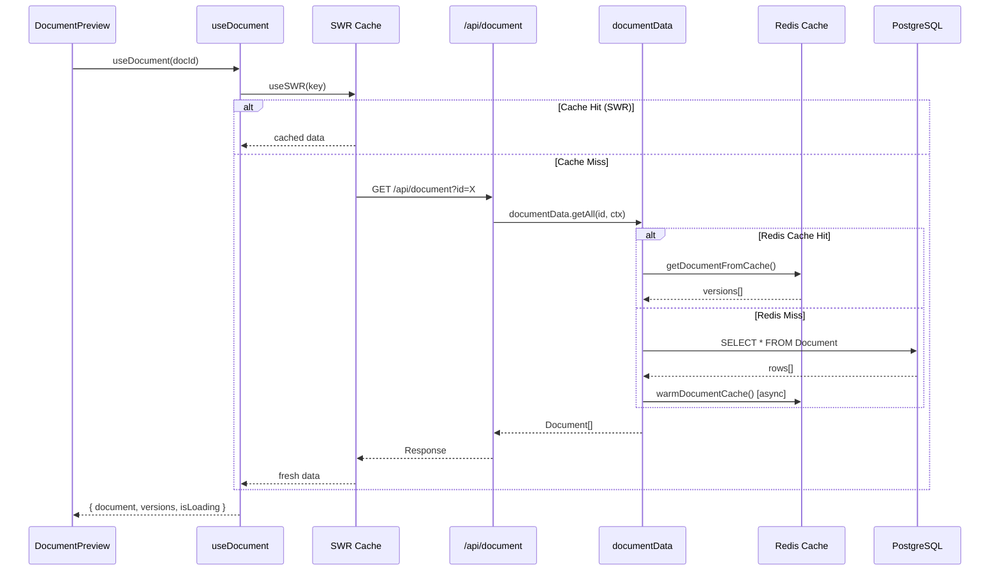
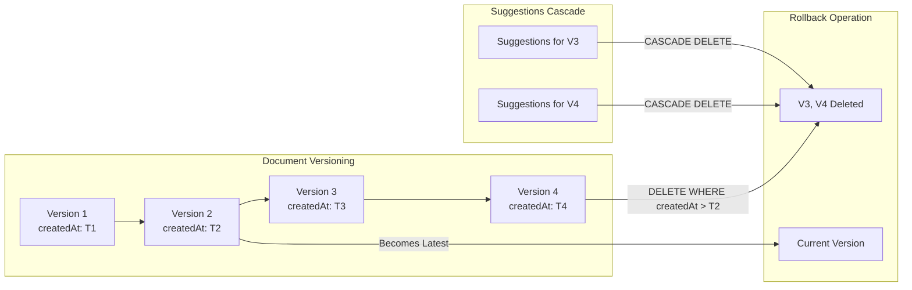
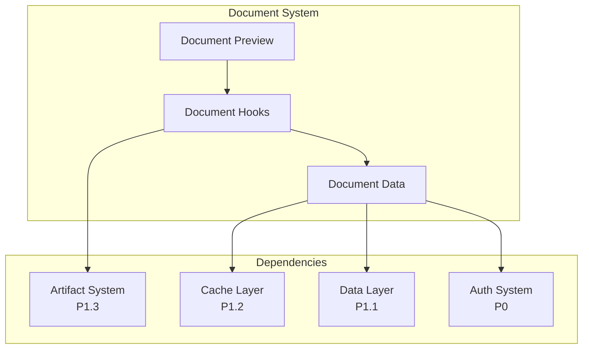

# P1.5 - Document System Optimal Design

**Status:** Proposed  
**Date:** 2024-12-17  
**Author:** Ouroboros Architect  
**Priority:** P1 (Critical Path)

---

## 1. Feature/Module Purpose

The Document System manages document handling, previews, versioning, storage, and type-specific rendering within the chat interface. It serves as the persistence and presentation layer for AI-generated artifacts (text, code, images, spreadsheets).

**Key Responsibilities:**
- Document creation, storage, and retrieval (cache-first with DB persistence)
- Multi-version document history with rollback capability
- Preview rendering in message stream (inline document cards)
- Type-specific handlers for content processing
- Suggestion system for AI-assisted edits

**Stakeholders:**
1. **Users**: Create, view, edit, and restore document versions
2. **Developers**: Extend document types, implement new handlers
3. **Operations**: Monitor storage, cache performance, version growth

---

## 2. Key Requirements

| ID | Requirement | Priority |
|----|-------------|----------|
| REQ-DOC-001 | Cache-first document retrieval with <50ms latency | Critical |
| REQ-DOC-002 | Multi-version document history (composite PK: id + createdAt) | Critical |
| REQ-DOC-003 | Type-safe document handlers (text, code, image, sheet) | High |
| REQ-DOC-004 | Inline preview rendering during streaming | High |
| REQ-DOC-005 | Version rollback with cascading suggestion cleanup | High |
| REQ-DOC-006 | Guest user support (cache-only, no DB) | Medium |
| REQ-DOC-007 | IDOR protection on all document operations | Critical |
| REQ-DOC-008 | Lazy-loaded preview editors to reduce bundle size | High |
| REQ-DOC-009 | Debounced auto-save (2s) with dirty state tracking | Medium |
| REQ-DOC-010 | Suggestion system integration with document versions | Medium |

---

## 3. Current State Notes

### 3.1 Component Inventory

```
┌─────────────────────────────────────────────────────────────────────┐
│ Document System Components                                           │
├─────────────────────────────────────────────────────────────────────┤
│ UI Layer                                                             │
│ ├── components/document.tsx (168 lines)                             │
│ │   └── DocumentToolCall, DocumentToolResult                        │
│ ├── components/document-preview.tsx (345 lines)                     │
│ │   └── DocumentPreview, HitboxLayer, DocumentHeader, DocumentContent│
│ ├── components/document-skeleton.tsx (52 lines)                     │
│ │   └── DocumentSkeleton, InlineDocumentSkeleton                    │
│ └── components/version-footer.tsx (~100 lines)                      │
│     └── VersionFooter (restore version UI)                          │
├─────────────────────────────────────────────────────────────────────┤
│ Data Layer                                                           │
│ ├── lib/data/document.ts (517 lines)                                │
│ │   └── documentData: { get, getAll, save, deleteAfterTimestamp,    │
│ │       getSuggestions }                                            │
│ ├── lib/db/schema.ts (document + suggestion tables)                 │
│ └── lib/cache/operations.ts (document caching)                      │
├─────────────────────────────────────────────────────────────────────┤
│ API Layer                                                            │
│ └── app/(chat)/api/document/route.ts (256 lines)                    │
│     └── GET (fetch versions), POST (save), PATCH (restore)          │
├─────────────────────────────────────────────────────────────────────┤
│ Handler Layer                                                        │
│ ├── lib/artifacts/server.ts (DocumentHandler interface)             │
│ ├── artifacts/text/server.ts                                        │
│ ├── artifacts/code/server.ts                                        │
│ ├── artifacts/sheet/server.ts                                       │
│ └── artifacts/image/server.ts                                       │
└─────────────────────────────────────────────────────────────────────┘
```

### 3.2 Current Architecture Diagram

```mermaid
graph TB
    subgraph "Message Stream"
        MSG[Message Component] --> DP[DocumentPreview]
        DP --> |tool-createDocument| DTR[DocumentToolResult]
        DP --> |streaming| DTC[DocumentToolCall]
    end
    
    subgraph "Preview Rendering"
        DP --> |useSWR| API[/api/document]
        DP --> |lazy load| Editors
        
        subgraph Editors["Lazy Editors"]
            CE[CodeEditor]
            TE[TextEditor]
            SE[SheetEditor]
            IE[ImageEditor]
        end
    end
    
    subgraph "Data Layer"
        API --> DD[documentData]
        DD --> |cache-first| Redis[(Redis Cache)]
        DD --> |fallback| PG[(PostgreSQL)]
    end
    
    subgraph "Schema"
        PG --> Doc[Document Table<br/>PK: id + createdAt]
        PG --> Sug[Suggestion Table<br/>FK: documentId + createdAt]
    end
```

### 3.3 Issues Identified

| Issue | Impact | Evidence |
|-------|--------|----------|
| **Preview component bloat** | 345 lines with mixed concerns | `document-preview.tsx` handles preview, editing, hitbox, streaming |
| **No preview virtualization** | Performance degradation with many documents | Each preview fetches independently |
| **Duplicate type definitions** | Maintenance burden | `DocumentToolArgs`, `DocumentToolResultData` redefined locally |
| **Tight coupling** | Hard to test preview isolation | Preview directly imports editors |
| **No bulk operations** | N+1 when loading chat with many docs | Each document version fetched separately |
| **Version index managed in parent** | State prop drilling | `currentVersionIndex` passed through multiple layers |

---

## 4. Optimal Architecture Design

### 4.1 Design Decision: Document-Artifact Separation

**Decision**: Separate Document System (persistence/preview) from Artifact System (editing/rendering).

| Aspect | Document System | Artifact System |
|--------|-----------------|-----------------|
| Focus | Storage, versioning, previews | Editing, streaming, actions |
| State | Server-side (DB/cache) | Client-side (React state) |
| Rendering | Inline previews in messages | Full panel editor |
| Coupling | Low (data contracts) | High (user interaction) |

### 4.2 Optimal Component Architecture

```mermaid
graph TB
    subgraph "Document Preview Layer"
        DPC[DocumentPreviewContainer]
        DPC --> |render mode| DPV[DocumentPreviewView]
        DPC --> |streaming| DPS[DocumentStreamingView]
        DPC --> |loading| DPL[DocumentLoadingSkeleton]
    end
    
    subgraph "Preview Renderers (Lazy)"
        DPV --> TPR[TextPreviewRenderer]
        DPV --> CPR[CodePreviewRenderer]
        DPV --> SPR[SheetPreviewRenderer]
        DPV --> IPR[ImagePreviewRenderer]
    end
    
    subgraph "Document Hooks"
        useDoc[useDocument]
        useDocVer[useDocumentVersions]
        useDocSave[useDocumentSave]
    end
    
    subgraph "Data Layer"
        DL[documentData]
        DL --> Cache[Cache Operations]
        DL --> DB[DB Queries]
    end
    
    DPC --> useDoc
    useDoc --> |SWR| API[/api/document]
    API --> DL
```

### 4.3 Module Breakdown

#### 4.3.1 Preview Components (Decomposed)

```typescript
// components/document/index.ts - Public exports only
export { DocumentPreview } from './document-preview';
export { DocumentToolResult, DocumentToolCall } from './document-tool';
export { DocumentSkeleton } from './document-skeleton';

// components/document/document-preview.tsx (~100 lines)
// Single responsibility: orchestrate preview rendering
export function DocumentPreview({ documentId, isReadonly }: Props) {
  const { document, isLoading, error } = useDocument(documentId);
  const { setArtifact } = useArtifact();
  
  if (isLoading) return <DocumentSkeleton kind={document?.kind} />;
  if (error) return <DocumentError error={error} />;
  
  return (
    <DocumentPreviewCard
      document={document}
      onExpand={() => setArtifact({ documentId, isVisible: true })}
    />
  );
}

// components/document/preview-card.tsx (~80 lines)
// Renders the preview card with lazy-loaded content
export function DocumentPreviewCard({ document, onExpand }: Props) {
  return (
    <div className="document-preview-card">
      <DocumentHeader title={document.title} kind={document.kind} />
      <DocumentContentPreview document={document} />
      <HitboxOverlay onClick={onExpand} />
    </div>
  );
}

// components/document/preview-renderers.tsx
// Lazy-loaded preview renderers by type
const previewRenderers: Record<ArtifactKind, React.ComponentType<PreviewProps>> = {
  text: lazy(() => import('./renderers/text-preview')),
  code: lazy(() => import('./renderers/code-preview')),
  sheet: lazy(() => import('./renderers/sheet-preview')),
  image: lazy(() => import('./renderers/image-preview')),
};
```

#### 4.3.2 Document Hooks (New)

```typescript
// hooks/use-document.ts
export function useDocument(documentId: string | null) {
  const { data, error, isLoading, mutate } = useSWR<Document[]>(
    documentId ? `/api/document?id=${documentId}` : null,
    fetcher,
    { 
      revalidateOnFocus: false,
      dedupingInterval: 5000 
    }
  );
  
  return {
    document: data?.at(-1) ?? null,
    versions: data ?? [],
    error,
    isLoading,
    refresh: mutate,
  };
}

// hooks/use-document-versions.ts
export function useDocumentVersions(documentId: string) {
  const { versions, refresh } = useDocument(documentId);
  const [currentIndex, setCurrentIndex] = useState(-1);
  
  // Auto-set to latest on load
  useEffect(() => {
    if (versions.length > 0 && currentIndex === -1) {
      setCurrentIndex(versions.length - 1);
    }
  }, [versions.length, currentIndex]);
  
  const isCurrentVersion = currentIndex === versions.length - 1;
  const currentVersion = versions[currentIndex] ?? null;
  
  return {
    versions,
    currentVersion,
    currentIndex,
    isCurrentVersion,
    goToPrevious: () => setCurrentIndex(i => Math.max(0, i - 1)),
    goToNext: () => setCurrentIndex(i => Math.min(versions.length - 1, i + 1)),
    goToLatest: () => setCurrentIndex(versions.length - 1),
    restore: async (index: number) => {
      await fetch(`/api/document?id=${documentId}`, {
        method: 'PATCH',
        body: JSON.stringify({ restoreIndex: index }),
      });
      await refresh();
    },
  };
}

// hooks/use-document-save.ts
export function useDocumentSave(documentId: string) {
  const { refresh } = useDocument(documentId);
  const [isDirty, setIsDirty] = useState(false);
  const pendingRef = useRef<AbortController | null>(null);
  
  const save = useCallback(async (content: string, metadata: DocMetadata) => {
    pendingRef.current?.abort();
    const controller = new AbortController();
    pendingRef.current = controller;
    
    setIsDirty(true);
    try {
      await fetch(`/api/document?id=${documentId}`, {
        method: 'POST',
        body: JSON.stringify({ content, ...metadata }),
        signal: controller.signal,
      });
      await refresh();
    } finally {
      setIsDirty(false);
      pendingRef.current = null;
    }
  }, [documentId, refresh]);
  
  const debouncedSave = useDebouncedCallback(save, 2000);
  
  return { save, debouncedSave, isDirty };
}
```

#### 4.3.3 Document Handler Registry (Improved)

```typescript
// lib/documents/handler-registry.ts
import type { ArtifactKind } from '@/components/artifact';

export interface DocumentHandler<K extends ArtifactKind = ArtifactKind> {
  kind: K;
  // Server-side: AI creates/updates document
  onCreateDocument: (params: CreateDocumentParams) => Promise<string>;
  onUpdateDocument: (params: UpdateDocumentParams) => Promise<string>;
  // Client-side: Preview rendering config
  previewConfig: {
    maxPreviewLines: number;
    supportsStreaming: boolean;
    mimeType: string;
  };
}

// Type-safe registry with validation
class DocumentHandlerRegistry {
  private handlers = new Map<ArtifactKind, DocumentHandler>();
  
  register<K extends ArtifactKind>(handler: DocumentHandler<K>) {
    if (this.handlers.has(handler.kind)) {
      console.warn(`Handler for ${handler.kind} already registered`);
    }
    this.handlers.set(handler.kind, handler);
  }
  
  get<K extends ArtifactKind>(kind: K): DocumentHandler<K> | undefined {
    return this.handlers.get(kind) as DocumentHandler<K> | undefined;
  }
  
  getAll(): DocumentHandler[] {
    return Array.from(this.handlers.values());
  }
}

export const documentHandlerRegistry = new DocumentHandlerRegistry();

// Registration at module load
documentHandlerRegistry.register(textDocumentHandler);
documentHandlerRegistry.register(codeDocumentHandler);
documentHandlerRegistry.register(sheetDocumentHandler);
documentHandlerRegistry.register(imageDocumentHandler);
```

### 4.4 Data Flow Diagram



### 4.5 Version Management Design



**Database Schema (Current - Verified Good)**:
```sql
-- Document table with composite PK for versioning
CREATE TABLE "Document" (
  id UUID NOT NULL DEFAULT gen_random_uuid(),
  created_at TIMESTAMPTZ NOT NULL DEFAULT NOW(),
  title TEXT NOT NULL,
  content TEXT,
  kind document_kind NOT NULL DEFAULT 'text',
  user_id UUID NOT NULL REFERENCES "User"(id) ON DELETE CASCADE,
  chat_id UUID NOT NULL REFERENCES "Chat"(id) ON DELETE CASCADE,
  updated_at TIMESTAMPTZ NOT NULL DEFAULT NOW(),
  PRIMARY KEY (id, created_at)
);

-- Suggestion with FK to document version
CREATE TABLE "Suggestion" (
  id UUID NOT NULL PRIMARY KEY DEFAULT gen_random_uuid(),
  document_id UUID NOT NULL,
  document_created_at TIMESTAMPTZ NOT NULL,
  original_text TEXT NOT NULL,
  suggested_text TEXT NOT NULL,
  description TEXT,
  is_resolved BOOLEAN NOT NULL DEFAULT FALSE,
  user_id UUID NOT NULL REFERENCES "User"(id) ON DELETE CASCADE,
  created_at TIMESTAMPTZ NOT NULL DEFAULT NOW(),
  FOREIGN KEY (document_id, document_created_at) 
    REFERENCES "Document"(id, created_at)
);
```

---

## 5. Bundle Strategy

### 5.1 Code Splitting Plan

| Chunk | Contents | Load Trigger | Target Size |
|-------|----------|--------------|-------------|
| `document-core` | DocumentPreview, hooks, types | Initial | <15KB |
| `document-text-preview` | TipTap readonly preview | Text doc visible | <25KB |
| `document-code-preview` | CodeMirror readonly | Code doc visible | <30KB |
| `document-sheet-preview` | DataGrid readonly | Sheet doc visible | <20KB |
| `document-image-preview` | Image display | Image doc visible | <5KB |

### 5.2 Dynamic Import Strategy

```typescript
// components/document/preview-renderers.tsx
import { lazy, Suspense } from 'react';
import type { ArtifactKind } from '@/components/artifact';

const TextPreview = lazy(() => 
  import('./renderers/text-preview').then(m => ({ default: m.TextPreview }))
);
const CodePreview = lazy(() => 
  import('./renderers/code-preview').then(m => ({ default: m.CodePreview }))
);
const SheetPreview = lazy(() => 
  import('./renderers/sheet-preview').then(m => ({ default: m.SheetPreview }))
);
const ImagePreview = lazy(() => 
  import('./renderers/image-preview').then(m => ({ default: m.ImagePreview }))
);

const renderers: Record<ArtifactKind, React.LazyExoticComponent<any>> = {
  text: TextPreview,
  code: CodePreview,
  sheet: SheetPreview,
  image: ImagePreview,
};

export function DocumentContentPreview({ document }: { document: Document }) {
  const Renderer = renderers[document.kind];
  
  return (
    <Suspense fallback={<InlineDocumentSkeleton />}>
      <Renderer content={document.content} />
    </Suspense>
  );
}
```

### 5.3 Shared Dependencies

```typescript
// Shared across all preview renderers - extracted to common chunk
// next.config.ts optimization
module.exports = {
  experimental: {
    optimizePackageImports: [
      // Document system shares these
      'date-fns',
      'fast-deep-equal',
    ],
  },
};
```

---

## 6. Simplifications

### 6.1 Remove Complexity

| Current | Proposed | Rationale |
|---------|----------|-----------|
| Inline type definitions in preview | Shared types from schema | Single source of truth |
| Manual version index management | `useDocumentVersions` hook | Encapsulated state logic |
| HitboxLayer as separate component | Integrated into preview card | Simpler click handling |
| Direct mutate calls in components | `useDocumentSave` hook | Abstracted save logic |

### 6.2 Unified Types

```typescript
// lib/types/document.ts - Single source for document types
import type { Document, Suggestion } from '@/lib/db/schema';
import type { ArtifactKind } from '@/components/artifact';

export type { Document, Suggestion };

// Tool invocation types (shared by message rendering)
export interface DocumentToolInput {
  title?: string;
  kind?: ArtifactKind;
  id?: string;
  description?: string;
}

export interface DocumentToolOutput {
  id: string;
  title: string;
  kind: ArtifactKind;
  success?: boolean;
  error?: string;
}

// Preview-specific types
export interface DocumentPreviewProps {
  documentId?: string;
  result?: DocumentToolOutput;
  args?: DocumentToolInput;
  isReadonly: boolean;
}
```

---

## 7. Dependencies

### 7.1 Internal Dependencies



### 7.2 Dependency Matrix

| Module | Depends On | Depended By |
|--------|------------|-------------|
| `document-preview` | `use-document`, `use-artifact` | `message.tsx` |
| `use-document` | SWR, `/api/document` | `document-preview`, `artifact.tsx` |
| `documentData` | `cache/operations`, `db/queries` | `/api/document` |
| `DocumentHandler` | AI types, DataStream | AI tools (`createDocument`) |

### 7.3 External Dependencies

| Package | Usage | Version |
|---------|-------|---------|
| `swr` | Document fetching/caching | ^2.0.0 |
| `usehooks-ts` | Debounced save | ^3.0.0 |
| `date-fns` | Version timestamp display | ^3.0.0 |
| `fast-deep-equal` | Memo comparison | ^3.0.0 |

---

## 8. Performance Optimizations

### 8.1 Caching Strategy

```typescript
// SWR Configuration for documents
const documentSwrConfig: SWRConfiguration = {
  // Don't refetch on window focus (documents rarely change externally)
  revalidateOnFocus: false,
  // Dedupe rapid requests
  dedupingInterval: 5000,
  // Keep data fresh for 1 minute
  refreshInterval: 0, // Manual refresh only
  // Cache stale data for 5 minutes
  errorRetryCount: 2,
};

// API response caching
// app/(chat)/api/document/route.ts
return Response.json(documents, {
  status: 200,
  headers: {
    'Cache-Control': 'private, max-age=60, stale-while-revalidate=300',
  },
});
```

### 8.2 Render Optimizations

```typescript
// Memoization strategy for previews
export const DocumentPreview = memo(PureDocumentPreview, (prev, next) => {
  // Only re-render when these change
  if (prev.documentId !== next.documentId) return false;
  if (prev.isReadonly !== next.isReadonly) return false;
  return true;
});

// Virtualized document list for conversations with many documents
import { Virtuoso } from 'react-virtuoso';

function DocumentListInMessage({ documents }: { documents: Document[] }) {
  if (documents.length < 5) {
    // Direct render for small lists
    return documents.map(doc => <DocumentPreview key={doc.id} {...doc} />);
  }
  
  // Virtualized for large lists
  return (
    <Virtuoso
      data={documents}
      itemContent={(_, doc) => <DocumentPreview {...doc} />}
      style={{ height: '300px' }}
    />
  );
}
```

### 8.3 Bundle Size Targets

| Component | Current | Target | Strategy |
|-----------|---------|--------|----------|
| `document-preview.tsx` | 345 lines | <150 lines | Decompose into sub-components |
| Text preview chunk | ~50KB | <25KB | Readonly TipTap config |
| Code preview chunk | ~80KB | <30KB | Minimal CodeMirror extensions |
| Total preview bundle | ~150KB | <80KB | Aggressive lazy loading |

### 8.4 Database Query Optimization

```sql
-- Current indexes (verified good)
CREATE INDEX document_user_idx ON "Document"(user_id);
CREATE INDEX document_chat_idx ON "Document"(chat_id);

-- Suggested addition: Composite for version queries
CREATE INDEX document_id_created_idx ON "Document"(id, created_at DESC);
```

---

## 9. Implementation Phases

### Phase 1: Hook Extraction (Low Risk)
1. Create `hooks/use-document.ts`
2. Create `hooks/use-document-versions.ts`
3. Create `hooks/use-document-save.ts`
4. Update `artifact.tsx` to use new hooks

### Phase 2: Preview Decomposition (Medium Risk)
1. Create `components/document/` directory structure
2. Extract `DocumentPreviewCard`, `DocumentHeader`
3. Create lazy-loaded preview renderers
4. Update imports in `message.tsx`

### Phase 3: Type Consolidation (Low Risk)
1. Create `lib/types/document.ts`
2. Update all document-related imports
3. Remove duplicate type definitions

### Phase 4: Performance Tuning (Low Risk)
1. Implement SWR configuration
2. Add response caching headers
3. Measure and validate bundle sizes

---

## 10. Risk Assessment

| Risk | Probability | Impact | Mitigation |
|------|-------------|--------|------------|
| Breaking preview rendering | Medium | High | Feature flag for gradual rollout |
| SWR cache inconsistency | Low | Medium | Comprehensive integration tests |
| Bundle size regression | Low | Medium | CI bundle size checks |
| Version navigation bugs | Medium | Medium | E2E tests for rollback flow |

---

## 11. Success Criteria

| Metric | Current | Target |
|--------|---------|--------|
| Document fetch latency (cache hit) | ~100ms | <50ms |
| Preview component lines | 345 | <150 |
| Preview bundle (text) | ~50KB | <25KB |
| Preview bundle (code) | ~80KB | <30KB |
| Version navigation time | ~200ms | <100ms |
| Save debounce working | Yes | Yes (preserved) |

---

## 12. Appendix: File Structure

```
components/
├── document/
│   ├── index.ts                    # Public exports
│   ├── document-preview.tsx        # Main preview container
│   ├── preview-card.tsx            # Card layout component
│   ├── document-header.tsx         # Title/icon header
│   ├── document-tool.tsx           # Tool call/result badges
│   ├── document-skeleton.tsx       # Loading states
│   └── renderers/
│       ├── text-preview.tsx        # TipTap readonly
│       ├── code-preview.tsx        # CodeMirror readonly
│       ├── sheet-preview.tsx       # DataGrid readonly
│       └── image-preview.tsx       # Image display

hooks/
├── use-document.ts                 # Document fetch hook
├── use-document-versions.ts        # Version navigation
└── use-document-save.ts            # Save with debounce

lib/
├── types/
│   └── document.ts                 # Unified document types
└── documents/
    └── handler-registry.ts         # Document handler registry
```

---

**Document Version**: 1.0  
**Last Updated**: 2024-12-17  
**Review Status**: Pending Architecture Review
