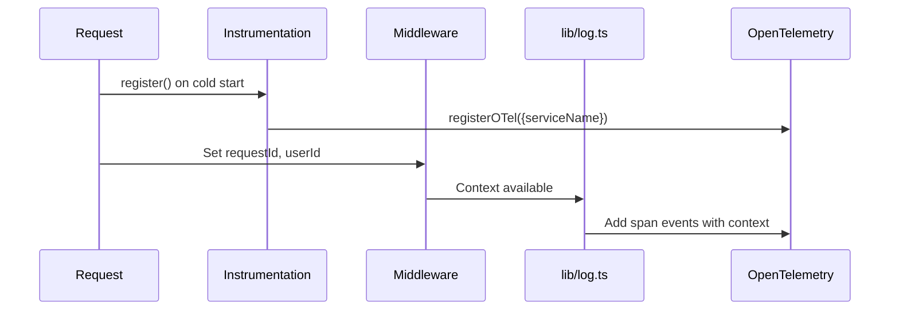
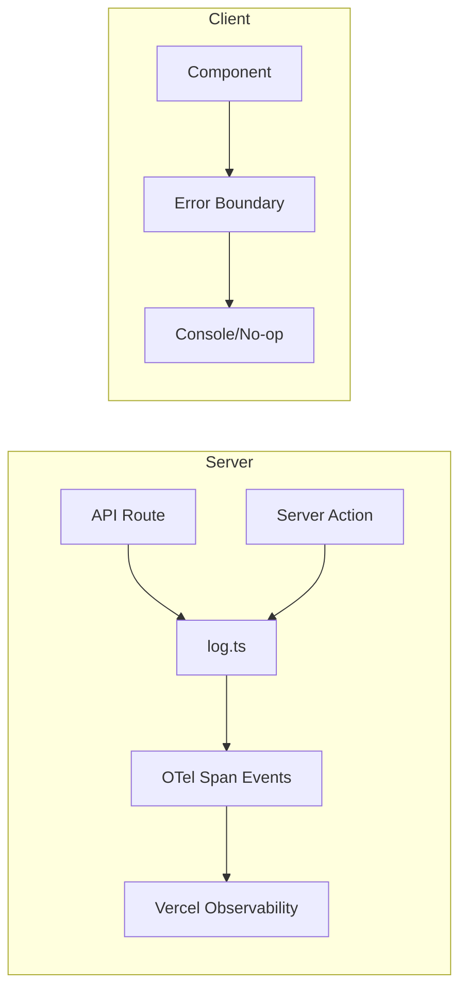

# P3.7: Observability Optimal Design

**Status:** Proposed  
**Date:** 2024-12-17  
**Author:** Ouroboros Architect

---

## Purpose

Define the observability architecture for instrumentation, logging, error tracking, and performance monitoring in the Next.js 16 application.

## Requirements

| ID | Requirement |
|----|-------------|
| REQ-O01 | Structured logging with request correlation |
| REQ-O02 | OpenTelemetry integration for distributed tracing |
| REQ-O03 | Global error handlers for unhandled exceptions |
| REQ-O04 | Performance monitoring via Vercel tools |
| REQ-O05 | Environment-aware logging levels |

---

## Current Architecture Analysis

### Components

| File | Role |
|------|------|
| `instrumentation.ts` | OTel registration, global error handlers |
| `instrumentation-client.ts` | Client-side instrumentation (if any) |
| `lib/log.ts` | Centralized logging with OTel span events |
| `lib/request-context.ts` | Request ID/user ID correlation |

### Current Flow



### Strengths
- **POS-001**: OpenTelemetry via `@vercel/otel` for tracing
- **POS-002**: Automatic request context injection
- **POS-003**: Global handlers for unhandledRejection/uncaughtException
- **POS-004**: Server-only logging (client is no-op)

### Issues
- **NEG-001**: No log level configuration per environment
- **NEG-002**: Missing client error boundary reporting
- **NEG-003**: No explicit sampling configuration

---

## Design Decision

### Option 1: Enhanced Current Pattern (SELECTED)
Extend existing OTel + custom logging with configuration.

### Option 2: Third-party Error Tracking (Sentry)
Add Sentry for error tracking alongside OTel.
- **Rejected**: Vercel's native observability sufficient for current scale. Sentry adds complexity and cost.

### Option 3: Custom Metrics Service
Build custom metrics collection.
- **Rejected**: SpeedInsights + Analytics already provide metrics. Custom service is over-engineering.

---

## Architecture

### Instrumentation Entry Points

```typescript
// instrumentation.ts (Server)
export function register() {
  registerOTel({ serviceName: "ai-assistant" });
  
  if (process.env.NEXT_RUNTIME === "nodejs") {
    // Context injection
    // Global error handlers
  }
}

// instrumentation-client.ts (Client)
export function register() {
  // Client-side error reporting setup
}
```

### Logging Architecture



### Log Levels Configuration

```typescript
// lib/log.ts - Recommended addition
const LOG_LEVELS: Record<string, number> = {
  debug: 0,
  info: 1,
  warn: 2,
  error: 3,
};

const currentLevel = LOG_LEVELS[process.env.LOG_LEVEL ?? 'info'];

function shouldLog(level: LogLevel): boolean {
  return LOG_LEVELS[level] >= currentLevel;
}
```

### Error Tracking Layers

| Layer | Handler | Purpose |
|-------|---------|---------|
| Route | `error.tsx` | User-facing recovery UI |
| Root | `global-error.tsx` | Catch-all with digest |
| Process | `unhandledRejection` | Async failures |
| Process | `uncaughtException` | Sync failures |
| OTel | Span status | Trace correlation |

### Performance Monitoring Stack

```
┌─────────────────────────────────────┐
│         Vercel Analytics            │  ← Page views, visitors
├─────────────────────────────────────┤
│       Vercel SpeedInsights          │  ← Core Web Vitals
├─────────────────────────────────────┤
│         @vercel/otel                │  ← Distributed tracing
├─────────────────────────────────────┤
│         lib/log.ts                  │  ← Structured events
└─────────────────────────────────────┘
```

---

## Consequences

### Positive
- **POS-001**: Zero external dependencies beyond Vercel stack
- **POS-002**: Automatic trace correlation via request context
- **POS-003**: Production-safe (no client-side logging leaks)

### Negative
- **NEG-001**: Vendor lock-in to Vercel observability
- **NEG-002**: No real-time alerting without Vercel Pro features

---

## Implementation Notes

1. **Add LOG_LEVEL env var** for environment-specific verbosity
2. **Add client error boundary** that reports to server endpoint
3. **Configure OTel sampling** for high-traffic routes
4. **Add health check endpoint** at `/api/health` for external monitoring

### Recommended Additions

```typescript
// app/api/health/route.ts
export async function GET() {
  return Response.json({
    status: 'ok',
    timestamp: Date.now(),
    version: process.env.NEXT_PUBLIC_VERSION,
  });
}
```

## Dependencies

- `@vercel/otel` - OpenTelemetry integration
- `@vercel/analytics` - Page analytics
- `@vercel/speed-insights` - Performance metrics
- `@opentelemetry/api` - Span/trace APIs
