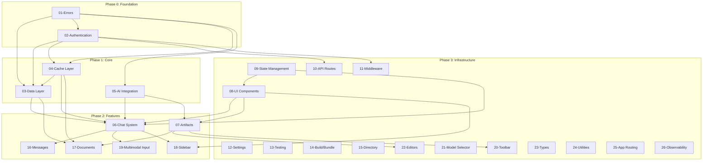

# 🏗️ FINAL ARCHITECTURE OVERHAUL PLAN

> **Project**: Next.js 16.0.10 AI Chatbot Application  
> **Framework**: React 19.2.3 + Turbopack  
> **Generated**: 2024-12-17  
> **Status**: READY FOR IMPLEMENTATION  
> **Design Documents**: 26 Module Specifications

---

## 📋 Table of Contents

1. [Executive Summary](#1-executive-summary)
2. [Technology Stack](#2-technology-stack)
3. [Optimal Directory Structure](#3-optimal-directory-structure)
4. [Module Dependency Graph](#4-module-dependency-graph)
5. [Bundle Split Strategy](#5-bundle-split-strategy)
6. [Key Simplifications](#6-key-simplifications)
7. [Cross-Cutting Concerns](#7-cross-cutting-concerns)
8. [Implementation Roadmap](#8-implementation-roadmap)
9. [References](#9-references)

---

## 1. Executive Summary

### 1.1 Vision

Transform the existing AI chatbot application from a **working prototype** into a **production-grade architecture** optimized for Next.js 16's capabilities, with clear server/client boundaries, reduced complexity, and improved maintainability.

### 1.2 Key Objectives

| Objective | Metric | Current | Target |
|-----------|--------|---------|--------|
| Provider Depth | Nesting levels | 9 | 4 |
| Largest Monolith | LOC | 1,256 (chat.ts) | <300 per file |
| Initial JS Bundle | gzipped | ~350KB | <200KB |
| Dev Rebuild | Turbopack | ~2s | <500ms |
| Cache Read Latency | p95 | ~100ms | <50ms |
| Code Coverage | Unit tests | 0% | >80% |

### 1.3 Strategic Approach

```
┌─────────────────────────────────────────────────────────────────────────┐
│                         ARCHITECTURE TRANSFORMATION                     │
├─────────────────────────────────────────────────────────────────────────┤
│                                                                         │
│  CURRENT                              TARGET                            │
│  ───────                              ──────                            │
│                                                                         │
│  ┌─────────────────┐                 ┌─────────────────┐               │
│  │    Monoliths    │                 │  Feature Modules │               │
│  │   (1000+ LOC)   │ ────────────▶  │   (<300 LOC)     │               │
│  └─────────────────┘                 └─────────────────┘               │
│                                                                         │
│  ┌─────────────────┐                 ┌─────────────────┐               │
│  │  9-Level        │                 │  4-Level        │               │
│  │  Provider Tree  │ ────────────▶  │  Provider Tree  │               │
│  └─────────────────┘                 └─────────────────┘               │
│                                                                         │
│  ┌─────────────────┐                 ┌─────────────────┐               │
│  │  Mixed Client/  │                 │  Clear Runtime  │               │
│  │  Server Code    │ ────────────▶  │  Boundaries     │               │
│  └─────────────────┘                 └─────────────────┘               │
│                                                                         │
└─────────────────────────────────────────────────────────────────────────┘
```

---

## 2. Technology Stack

### 2.1 Next.js 16 Features Leveraged

| Feature | Usage | Impact |
|---------|-------|--------|
| **React Compiler** | Auto-memoization | Eliminates manual `useMemo`/`useCallback` |
| **Turbopack** | Dev builds | <500ms rebuild times |
| **Server Components** | Default RSC | Reduced client JS |
| **Partial Prerendering** | Streaming shells | Faster TTFB |
| **View Transitions** | Route animations | Native smooth transitions |
| **Component Caching** | `cacheComponents: true` | Server component deduplication |

### 2.2 Runtime Environments

| Runtime | Purpose | Constraints |
|---------|---------|-------------|
| **Node.js (Server)** | RSC, Server Actions, API Routes | Full Node APIs, `server-only` modules |
| **Edge** | Middleware, rate limiting | 25ms limit, no Node APIs, 128KB bundle |
| **Client** | Interactive UI | Minimal JS, lazy loading |

### 2.3 Core Dependencies

| Category | Technology | Version |
|----------|------------|---------|
| Framework | Next.js | 16.0.10 |
| React | React + React DOM | 19.2.3 |
| Database | PostgreSQL (Drizzle ORM) | 0.43.x |
| Cache | Upstash Redis | HTTP-based |
| AI SDK | Vercel AI SDK | 5.0.26 |
| Auth | Supabase Auth + Custom JWT | - |
| UI | shadcn/ui + Radix | - |
| Validation | Zod | 3.x |
| Testing | Playwright + Vitest | - |

---

## 3. Optimal Directory Structure

### 3.1 Proposed Layout

```
nextjs-ai-chatbot/
├── app/                              # ROUTES ONLY (Next.js App Router)
│   ├── layout.tsx                    # Root layout (server)
│   ├── global-error.tsx              # Root error boundary
│   ├── (auth)/                       # Auth route group
│   │   ├── login/page.tsx
│   │   └── register/page.tsx
│   ├── (chat)/                       # Chat route group
│   │   ├── layout.tsx                # Chat layout with sidebar
│   │   ├── page.tsx                  # New chat
│   │   ├── loading.tsx               # Loading state
│   │   ├── error.tsx                 # Error boundary
│   │   ├── not-found.tsx             # 404 page
│   │   └── chat/[id]/
│   │       ├── page.tsx              # Dynamic chat
│   │       ├── loading.tsx           # Per-chat loading
│   │       └── error.tsx             # Per-chat error
│   └── api/                          # API routes (consolidated)
│       ├── auth/                     # Auth endpoints
│       ├── chat/route.ts             # Chat streaming
│       ├── document/route.ts         # Document CRUD
│       ├── history/route.ts          # Chat history
│       ├── health/route.ts           # Health check
│       └── vote/route.ts             # Message voting
│
├── features/                          # FEATURE MODULES
│   ├── chat/                          # Chat feature
│   │   ├── components/
│   │   │   ├── chat.tsx              # Main orchestrator (<200 LOC)
│   │   │   ├── chat-header.tsx
│   │   │   ├── messages-list.tsx     # Virtuoso container
│   │   │   ├── message-item.tsx      # Single message
│   │   │   └── multimodal-input/     # Decomposed input
│   │   ├── hooks/
│   │   ├── actions/
│   │   └── index.ts
│   │
│   ├── artifacts/                     # Artifacts feature
│   │   ├── components/
│   │   ├── editors/                   # Lazy-loaded editors
│   │   │   ├── code-editor.tsx       # CodeMirror
│   │   │   ├── text-editor.tsx       # TipTap
│   │   │   ├── sheet-editor.tsx      # react-data-grid
│   │   │   └── image-editor.tsx
│   │   ├── renderers/                 # Artifact type renderers
│   │   ├── hooks/
│   │   └── index.ts
│   │
│   ├── sidebar/                       # Sidebar feature
│   │   ├── components/
│   │   │   ├── sidebar-provider.tsx  # Context only (<100 LOC)
│   │   │   ├── sidebar-primitives.tsx
│   │   │   └── chat-history.tsx      # Virtualized list
│   │   ├── hooks/
│   │   └── index.ts
│   │
│   ├── auth/                          # Auth feature
│   │   ├── components/
│   │   └── hooks/
│   │
│   └── documents/                     # Documents feature
│       ├── components/
│       └── hooks/
│
├── shared/                            # SHARED COMPONENTS
│   ├── components/                    # Non-feature UI
│   │   ├── greeting.tsx
│   │   ├── icons.tsx
│   │   ├── model-selector/           # Unified model selector
│   │   ├── toolbar/                  # Decomposed toolbar
│   │   └── toast.tsx
│   ├── hooks/
│   │   └── use-mobile.ts
│   └── ui/                            # Base primitives (shadcn/ui)
│       ├── button.tsx
│       ├── input.tsx
│       └── ...
│
├── lib/                               # INFRASTRUCTURE LAYER
│   ├── errors/                        # Error handling
│   │   ├── index.ts
│   │   ├── app-error.ts              # Main error class
│   │   ├── messages.ts               # Error message catalog
│   │   └── mappers/                  # Error code mappers
│   │
│   ├── auth/                          # Authentication
│   │   ├── session.ts                # SessionManager
│   │   ├── jwt.ts                    # JWT utilities
│   │   ├── guards.ts                 # Auth guards
│   │   └── client.ts                 # Browser client
│   │
│   ├── db/                            # Database
│   │   ├── client.ts                 # Connection pool
│   │   ├── schema.ts                 # Drizzle schema
│   │   └── transactions.ts           # Transaction wrapper
│   │
│   ├── cache/                         # Cache layer
│   │   ├── client.ts                 # Redis singleton
│   │   ├── circuit-breaker.ts        # Failure protection
│   │   ├── chat/                     # Chat cache ops
│   │   ├── document/                 # Document cache ops
│   │   └── user/                     # User cache ops
│   │
│   ├── data/                          # Data access layer
│   │   ├── chat/                     # Split from 1256-line monolith
│   │   │   ├── read.ts               # get, list, exists
│   │   │   ├── write.ts              # create, delete
│   │   │   ├── update.ts             # updateTitle, updateVisibility
│   │   │   └── cache.ts              # Cache operations
│   │   ├── message/                  # Message operations
│   │   ├── document/                 # Document operations
│   │   └── user/                     # User operations
│   │
│   ├── ai/                            # AI integration
│   │   ├── providers/                # Lazy provider registry
│   │   ├── models/                   # Model catalog
│   │   ├── completion/               # streamText orchestration
│   │   ├── tools/                    # AI tool definitions
│   │   └── prompts/                  # System prompts
│   │
│   ├── api/                           # API utilities
│   │   ├── guards.ts                 # Unified guard pattern
│   │   ├── validators.ts             # Input validation
│   │   └── schemas.ts                # Zod schemas
│   │
│   ├── middleware/                    # Edge middleware
│   │   ├── compose.ts                # Middleware composition
│   │   ├── rate-limit.ts             # Edge rate limiting
│   │   └── security.ts               # Security headers
│   │
│   ├── config/                        # Configuration
│   │   ├── env.ts                    # Environment validation
│   │   ├── flags.ts                  # Feature flags
│   │   └── constants/                # App constants
│   │
│   ├── types/                         # TypeScript types
│   │   ├── domain/                   # Business types
│   │   ├── api/                      # API contracts
│   │   ├── ui/                       # Component types
│   │   └── schemas/                  # Zod schemas
│   │
│   ├── utils/                         # Utilities
│   │   ├── string.ts                 # cn, sanitizeText, generateUUID
│   │   ├── network.ts                # fetcher, fetchWithErrorHandlers
│   │   ├── message.ts                # Message utilities
│   │   └── storage.ts                # localStorage wrapper
│   │
│   └── providers/                     # Composed providers
│       ├── root-providers.tsx        # App-level providers
│       └── chat-providers.tsx        # Chat-level providers
│
├── middleware.ts                      # Edge middleware entry
├── tests/                             # Test infrastructure
│   ├── e2e/                          # Playwright E2E
│   ├── routes/                       # API route tests
│   ├── unit/                         # Vitest unit tests
│   └── pages/                        # Page objects
└── public/                            # Static assets
```

### 3.2 Server/Client/Edge Boundaries

```
┌────────────────────────────────────────────────────────────────────────┐
│                          RUNTIME BOUNDARIES                            │
├────────────────────────────────────────────────────────────────────────┤
│                                                                        │
│  EDGE RUNTIME (middleware.ts)                                          │
│  ┌──────────────────────────────────────────────────────────────────┐ │
│  │  • Rate limiting (Upstash HTTP)                                  │ │
│  │  • Security headers                                              │ │
│  │  • Request ID generation                                         │ │
│  │  • IP extraction                                                 │ │
│  │  Files: lib/middleware/*.ts                                      │ │
│  └──────────────────────────────────────────────────────────────────┘ │
│                              │                                         │
│                              ▼                                         │
│  SERVER RUNTIME (Node.js)                                              │
│  ┌──────────────────────────────────────────────────────────────────┐ │
│  │  • Server Components (app/**/page.tsx, layout.tsx)               │ │
│  │  • Server Actions (features/**/actions/*.server.ts)              │ │
│  │  • API Routes (app/api/**/route.ts)                              │ │
│  │  • Data Layer (lib/data/**)                                      │ │
│  │  • Database (lib/db/**)                                          │ │
│  │  • Cache Operations (lib/cache/**)                               │ │
│  │  • AI Integration (lib/ai/**)                                    │ │
│  │  Marker: "server-only" import                                    │ │
│  └──────────────────────────────────────────────────────────────────┘ │
│                              │                                         │
│                              ▼                                         │
│  CLIENT RUNTIME (Browser)                                              │
│  ┌──────────────────────────────────────────────────────────────────┐ │
│  │  • Interactive Components (features/**/components/*.tsx)         │ │
│  │  • Hooks (features/**/hooks/*.ts)                                │ │
│  │  • UI Primitives (shared/ui/**)                                  │ │
│  │  • Providers (lib/providers/*.tsx)                               │ │
│  │  Marker: "use client" directive                                  │ │
│  └──────────────────────────────────────────────────────────────────┘ │
│                                                                        │
└────────────────────────────────────────────────────────────────────────┘
```

---

## 4. Module Dependency Graph

### 4.1 Foundation → Core → Features



### 4.2 Import Hierarchy Rules

```
┌─────────────────────────────────────────────────────────────────────┐
│                        IMPORT RULES                                  │
├─────────────────────────────────────────────────────────────────────┤
│                                                                     │
│  Layer 0: Types/Constants                                           │
│  ├── lib/types/**                                                   │
│  └── lib/config/constants/**                                        │
│      ↓ Can import nothing                                           │
│                                                                     │
│  Layer 1: Utilities                                                 │
│  └── lib/utils/**                                                   │
│      ↓ Can import: Layer 0                                          │
│                                                                     │
│  Layer 2: Infrastructure                                            │
│  ├── lib/errors/**                                                  │
│  ├── lib/auth/**                                                    │
│  ├── lib/db/**                                                      │
│  └── lib/cache/**                                                   │
│      ↓ Can import: Layer 0, 1                                       │
│                                                                     │
│  Layer 3: Data Access                                               │
│  └── lib/data/**                                                    │
│      ↓ Can import: Layer 0, 1, 2                                    │
│                                                                     │
│  Layer 4: Services                                                  │
│  ├── lib/ai/**                                                      │
│  └── lib/api/**                                                     │
│      ↓ Can import: Layer 0, 1, 2, 3                                 │
│                                                                     │
│  Layer 5: Features                                                  │
│  └── features/**                                                    │
│      ↓ Can import: Layer 0-4, shared/**                             │
│                                                                     │
│  Layer 6: App (Routes)                                              │
│  └── app/**                                                         │
│      ↓ Can import: All layers                                       │
│                                                                     │
│  ⛔ FORBIDDEN:                                                       │
│  • Lower layers importing higher layers                              │
│  • Features importing other features directly                        │
│  • Server code in client bundles                                     │
│                                                                     │
└─────────────────────────────────────────────────────────────────────┘
```

---

## 5. Bundle Split Strategy

### 5.1 Chunk Organization

```
┌─────────────────────────────────────────────────────────────────────┐
│                        BUNDLE ARCHITECTURE                          │
├─────────────────────────────────────────────────────────────────────┤
│                                                                     │
│  FRAMEWORK CHUNKS (Always Loaded)                     ~100KB gzip   │
│  ┌────────────────────────────────────────────────────────────────┐ │
│  │  next-runtime + react-dom + react-compiler-runtime             │ │
│  └────────────────────────────────────────────────────────────────┘ │
│                                                                     │
│  SHARED CHUNKS (Loaded with First Route)              ~40KB gzip    │
│  ┌────────────────────────────────────────────────────────────────┐ │
│  │  ui-primitives: Radix, Button, Input, Dialog, etc.             │ │
│  │  utils: clsx, cn, date-fns                                     │ │
│  │  auth-core: Supabase client                                    │ │
│  └────────────────────────────────────────────────────────────────┘ │
│                                                                     │
│  FEATURE CHUNKS (Route-Based Loading)                 ~30KB gzip    │
│  ┌────────────────────────────────────────────────────────────────┐ │
│  │  chat-core: Messages, Input, Header                            │ │
│  │  sidebar: History, Navigation                                  │ │
│  └────────────────────────────────────────────────────────────────┘ │
│                                                                     │
│  LAZY CHUNKS (Interaction-Based Loading)                            │
│  ┌────────────────────────────────────────────────────────────────┐ │
│  │  artifact-system    ~15KB  (on artifact open)                  │ │
│  │  code-editor       ~160KB  (on code artifact)                  │ │
│  │  text-editor       ~100KB  (on text artifact)                  │ │
│  │  sheet-editor       ~80KB  (on sheet artifact)                 │ │
│  │  mermaid-renderer   ~50KB  (on diagram render)                 │ │
│  │  voice-input         ~5KB  (on voice button click)             │ │
│  └────────────────────────────────────────────────────────────────┘ │
│                                                                     │
│  TOTAL INITIAL BUNDLE TARGET: <200KB gzipped                        │
│                                                                     │
└─────────────────────────────────────────────────────────────────────┘
```

### 5.2 Lazy Loading Tiers

| Tier | Trigger | Components | Strategy |
|------|---------|------------|----------|
| **T0: Critical** | Page load | Framework, Auth, Layout | Static import |
| **T1: Route** | Navigation | Chat, Sidebar, Input | `next/dynamic` |
| **T2: Visible** | In viewport | Message content, Previews | Intersection Observer |
| **T3: Interaction** | User action | Editors, Artifact panel | `dynamic({ ssr: false })` |
| **T4: Deferred** | Idle time | Analytics, Non-critical | `requestIdleCallback` |

### 5.3 Code Splitting Implementation

```typescript
// T1: Route-level lazy loading
const AppSidebar = dynamic(
  () => import("@/features/sidebar").then((m) => m.AppSidebar),
  { ssr: false, loading: () => <SidebarSkeleton /> }
);

// T3: Interaction-based lazy loading (editors)
const EditorLoader = {
  code: () => import("@/features/artifacts/editors/code-editor"),
  text: () => import("@/features/artifacts/editors/text-editor"),
  sheet: () => import("@/features/artifacts/editors/sheet-editor"),
  image: () => import("@/features/artifacts/editors/image-editor"),
};

// T3: Tool renderers (message system)
const toolRenderers = {
  'tool-getWeather': () => import("@/shared/components/weather"),
  'tool-createDocument': () => import("@/features/documents/components/document-tool"),
  'tool-updateDocument': () => import("@/features/documents/components/document-tool"),
};
```

---

## 6. Key Simplifications

### 6.1 Monoliths Being Split

| File | Current LOC | Target | Split Into | Reduction |
|------|-------------|--------|------------|-----------|
| `lib/data/chat.ts` | 1,256 | <300 each | `chat/read.ts`, `chat/write.ts`, `chat/update.ts`, `chat/cache.ts`, `message/read.ts`, `message/write.ts` | -70% per file |
| `lib/cache/operations.ts` | 1,080 | <250 each | `chat/read.ts`, `chat/write.ts`, `chat/delete.ts`, `document/operations.ts`, `user/chats.ts` | -75% per file |
| `components/ui/sidebar.tsx` | 814 | <200 each | `sidebar-provider.tsx`, `sidebar-primitives.tsx`, `sidebar-layout.tsx`, `sidebar-menu.tsx` | -75% per file |
| `components/artifact.tsx` | 622 | <200 each | `artifact-container.tsx`, `artifact-renderer.tsx`, `artifact-versions.tsx`, `artifact-actions.tsx` | -68% per file |
| `components/chat.tsx` | 524 | <200 | `chat.tsx` (orchestrator), `chat-streaming.tsx`, `chat-model.tsx` | -62% per file |
| `components/multimodal-input.tsx` | 551 | <150 each | `MultimodalInput.tsx`, `InputTextarea.tsx`, `AttachmentZone.tsx`, `AttachmentList.tsx` | -73% per file |
| `lib/data/document.ts` | 517 | <250 each | `document/read.ts`, `document/write.ts` | -50% per file |
| `components/toolbar.tsx` | 497 | <150 each | `Toolbar.tsx`, `ToolButton.tsx`, `ToolGroup.tsx`, `ReadingLevelPicker.tsx` | -70% per file |
| `lib/errors.ts` | 433 | <150 each | `app-error.ts`, `messages.ts`, `mappers/postgres.ts`, `mappers/ai-provider.ts` | -65% per file |

**Total Monolith LOC: ~6,294 → Target: ~2,100 (67% reduction)**

### 6.2 Provider Depth Reduction (9 → 4)

```
CURRENT (9 Levels)                    TARGET (4 Levels)
─────────────────                     ──────────────────

RootLayout                            RootLayout (Server)
└── ThemeProvider                     └── RootProviders (Composed)
    └── TooltipProvider                   ├── ThemeProvider
        └── SWRConfig                     ├── SWRConfig
            └── AuthProvider              ├── TooltipProvider
                └── ChatLayoutClient      └── AuthProvider
                    └── SettingsProvider      └── ChatProviders (Route-level)
                        └── DataStreamProvider    ├── SettingsProvider
                            └── OptimisticChats   ├── DataStreamProvider
                                └── SidebarProv.  └── OptimisticChatsProvider
                                    └── {children}    └── SidebarProvider
                                                          └── {children}
```

**Implementation:**

```typescript
// lib/providers/root-providers.tsx - Composed provider
export function RootProviders({ children, initialSession }: Props) {
  return (
    <ThemeProvider attribute="class" defaultTheme="system">
      <SWRConfig value={SWR_CONFIG}>
        <TooltipProvider delayDuration={0}>
          <AuthProvider initialSession={initialSession}>
            {children}
          </AuthProvider>
        </TooltipProvider>
      </SWRConfig>
    </ThemeProvider>
  );
}

// lib/providers/chat-providers.tsx - Route-level provider
export function ChatProviders({ children }: Props) {
  return (
    <SettingsProvider>
      <DataStreamProvider>
        <OptimisticChatsProvider>
          <SidebarProvider>
            {children}
          </SidebarProvider>
        </OptimisticChatsProvider>
      </DataStreamProvider>
    </SettingsProvider>
  );
}
```

### 6.3 Legacy Code Removal

| Item | Location | Reason | Action |
|------|----------|--------|--------|
| `ChatSDKError` naming | `lib/errors.ts` | Legacy name, not just chat | Rename to `AppError` |
| `visibilityBySurface` | `lib/errors.ts` | Unused error visibility system | Remove |
| Deprecated `NextError` | `global-error.tsx` | Uses deprecated component | Update to modern pattern |
| Class error boundary | `artifact-error-boundary.tsx` | Can be functional in React 19 | Convert to functional |
| Empty `lib/utils/` | Directory | Empty folder | Remove |
| Duplicate artifacts | `artifacts/` + `lib/artifacts/` | Two locations | Consolidate to `features/artifacts/` |
| Mixed `lib/ui/` | `lib/ui/` | Conflicts with `components/ui/` | Merge into appropriate locations |

### 6.4 Complexity Eliminated

| Pattern | Current Issue | Solution |
|---------|---------------|----------|
| Dual Guard API | `requireAuth()` vs `requireAuthForRoute()` | Unified Result pattern |
| Dual Validator API | `validateUUID()` vs `validateUUIDForRoute()` | Unified with result type |
| Scattered `process.env` | 50+ direct accesses | Centralized `lib/config/env.ts` |
| Giant switch statements | 200+ cases in error messages | Message catalog with lookup |
| Manual cache patterns | Repeated 10+ times | Abstracted cache operations |
| @ts-nocheck files | `tests/prompts/utils.ts` | Fix types, remove directive |

---

## 7. Cross-Cutting Concerns

### 7.1 Authentication Pattern

```typescript
// Unified guard pattern for all contexts
type AuthResult<T> = 
  | { success: true; data: T }
  | { success: false; error: AppError };

// Server Actions
export async function requireAuth(): Promise<AuthResult<Session>> {
  const session = await getAppSession();
  if (!session) {
    return { success: false, error: new AppError("auth:api:unauthorized") };
  }
  return { success: true, data: session };
}

// Usage in Server Action
export async function myServerAction() {
  const auth = await requireAuth();
  if (!auth.success) return auth.error.toActionResult();
  // Use auth.data.session
}

// Usage in API Route
export async function GET(request: Request) {
  const auth = await requireAuth();
  if (!auth.success) return auth.error.toResponse();
  // Use auth.data.session
}
```

### 7.2 Error Handling Pattern

```typescript
// lib/errors/app-error.ts
export class AppError extends Error {
  constructor(
    public code: ErrorCode,
    public cause?: unknown
  ) {
    super(getErrorMessage(code));
    this.name = "AppError";
  }

  // For Server Actions - returns serializable object
  toActionResult(): ActionError {
    return { error: this.code, message: this.message };
  }

  // For API Routes - returns Response
  toResponse(): Response {
    return Response.json(
      { error: this.code, message: this.message },
      { status: this.getHttpStatus() }
    );
  }

  // For SSE streams - writes error event
  toStreamError(writer: UIMessageStreamWriter): void {
    writer.write({ type: "error", error: this.code });
  }
}
```

### 7.3 Logging Pattern

```typescript
// lib/logging/logger.ts
import "server-only";
import { trace, SpanStatusCode } from "@opentelemetry/api";
import { getRequestContext } from "@/lib/request-context";

export const log = {
  debug: (message: string, attributes?: Record<string, unknown>) => {
    if (!shouldLog("debug")) return;
    logEvent("debug", message, attributes);
  },
  
  info: (message: string, attributes?: Record<string, unknown>) => {
    logEvent("info", message, attributes);
  },
  
  warn: (message: string, attributes?: Record<string, unknown>) => {
    logEvent("warn", message, attributes);
  },
  
  error: (message: string, error?: unknown, attributes?: Record<string, unknown>) => {
    const span = trace.getActiveSpan();
    if (span) {
      span.setStatus({ code: SpanStatusCode.ERROR, message });
      span.recordException(error instanceof Error ? error : new Error(String(error)));
    }
    logEvent("error", message, { ...attributes, error: serializeError(error) });
  },
};

function logEvent(level: string, message: string, attributes?: Record<string, unknown>) {
  const ctx = getRequestContext();
  const span = trace.getActiveSpan();
  
  const payload = {
    level,
    message,
    requestId: ctx?.requestId,
    userId: ctx?.userId,
    ...attributes,
  };
  
  span?.addEvent(message, payload);
  console[level === "debug" ? "log" : level](JSON.stringify(payload));
}
```

### 7.4 Caching Pattern

```typescript
// lib/cache/chat/read.ts
import { withCircuitBreaker } from "../circuit-breaker";
import { redis } from "../client";
import { CacheKeys } from "../keys";

export async function getChatFromCache(
  chatId: string, 
  userId: string
): Promise<CachedChat | null> {
  return withCircuitBreaker("getChatFromCache", async () => {
    const [metaKey, msgsKey] = [
      CacheKeys.chat.meta(chatId, userId),
      CacheKeys.chat.messages(chatId, userId),
    ];
    
    const pipeline = redis.pipeline();
    pipeline.get(metaKey);
    pipeline.zrange(msgsKey, 0, -1);
    
    const [metaResult, msgsResult] = await pipeline.exec();
    
    if (!metaResult) return null;
    
    return {
      ...JSON.parse(metaResult as string),
      messages: (msgsResult as string[]).map(m => JSON.parse(m)),
    };
  });
}
```

---

## 8. Implementation Roadmap

### 8.1 Phase Overview

```
┌─────────────────────────────────────────────────────────────────────────┐
│                       IMPLEMENTATION PHASES                             │
├─────────────────────────────────────────────────────────────────────────┤
│                                                                         │
│  PHASE 0: Foundation (Week 1-2)                                         │
│  ├── 01-Error Handling refactor                                         │
│  └── 02-Authentication cleanup                                          │
│      Target: Stable error/auth foundation                               │
│                                                                         │
│  PHASE 1: Core Infrastructure (Week 3-5)                                │
│  ├── 03-Data Layer split (1256 LOC → 6 files)                          │
│  ├── 04-Cache Layer split (1080 LOC → 8 files)                         │
│  └── 05-AI Integration restructure                                      │
│      Target: Type-safe data access, fast cache                          │
│                                                                         │
│  PHASE 2: Feature Modules (Week 6-9)                                    │
│  ├── 06-Chat System decompose (524 LOC → 4 files)                      │
│  ├── 07-Artifact System restructure (622 LOC → 5 files)                │
│  ├── 16-Message System extract                                          │
│  ├── 17-Document System consolidate                                     │
│  ├── 18-Sidebar split (814 LOC → 8 files)                              │
│  ├── 19-Multimodal Input decompose                                      │
│  ├── 20-Toolbar refactor                                                │
│  └── 21-Model Selector unify                                            │
│      Target: Feature modules <300 LOC each                              │
│                                                                         │
│  PHASE 3: Infrastructure Polish (Week 10-12)                            │
│  ├── 08-UI Components organize                                          │
│  ├── 09-State Management flatten providers                              │
│  ├── 10-API Routes standardize                                          │
│  ├── 11-Middleware implement                                            │
│  ├── 12-Settings centralize                                             │
│  ├── 13-Testing infrastructure                                          │
│  ├── 14-Build/Bundle optimize                                           │
│  ├── 15-Directory restructure                                           │
│  ├── 22-Editors lazy loading                                            │
│  ├── 23-Types organization                                              │
│  ├── 24-Utilities categorize                                            │
│  ├── 25-App Routing enhance                                             │
│  └── 26-Observability complete                                          │
│      Target: Production-ready infrastructure                            │
│                                                                         │
└─────────────────────────────────────────────────────────────────────────┘
```

### 8.2 Phase 0: Foundation (Week 1-2)

**Priority: CRITICAL - All other work depends on this**

| Task | Module | Effort | Dependencies |
|------|--------|--------|--------------|
| Refactor `lib/errors.ts` → `lib/errors/` | 01-error-handling | 3 days | None |
| Rename `ChatSDKError` → `AppError` | 01-error-handling | 1 day | Task 1 |
| Create unified error message catalog | 01-error-handling | 2 days | Task 1 |
| Implement error mappers (postgres, ai) | 01-error-handling | 2 days | Task 2 |
| Refactor `lib/auth/session.ts` | 02-authentication | 2 days | Task 1 |
| Create unified guard pattern | 02-authentication | 2 days | Task 4 |
| Extract Edge auth module from `proxy.ts` | 02-authentication | 1 day | Task 5 |

**Deliverables:**
- [ ] `lib/errors/` module with `AppError` class
- [ ] `lib/auth/` with `SessionManager` and unified guards
- [ ] All existing error handling updated to new pattern
- [ ] Zero breaking changes to external interfaces

### 8.3 Phase 1: Core Infrastructure (Week 3-5)

**Priority: HIGH - Performance and maintainability foundation**

| Task | Module | Effort | Dependencies |
|------|--------|--------|--------------|
| Split `lib/data/chat.ts` (1256 LOC) | 03-data-layer | 4 days | Phase 0 |
| Split `lib/data/document.ts` (517 LOC) | 03-data-layer | 2 days | Task 1 |
| Create `lib/data/` barrel exports | 03-data-layer | 1 day | Task 2 |
| Split `lib/cache/operations.ts` (1080 LOC) | 04-cache-layer | 4 days | Task 1 |
| Implement circuit breaker module | 04-cache-layer | 1 day | Task 4 |
| Create cache key type system | 04-cache-layer | 1 day | Task 5 |
| Restructure `lib/ai/providers/` | 05-ai-integration | 3 days | Phase 0 |
| Implement lazy provider initialization | 05-ai-integration | 2 days | Task 7 |
| Extract tools to `lib/ai/tools/` | 05-ai-integration | 2 days | Task 7 |

**Deliverables:**
- [ ] `lib/data/chat/` with read/write/update/cache modules
- [ ] `lib/data/message/` with read/write/delete modules
- [ ] `lib/cache/chat/`, `lib/cache/document/`, `lib/cache/user/`
- [ ] `lib/ai/providers/` with lazy initialization
- [ ] All monoliths <300 LOC per file

### 8.4 Phase 2: Feature Modules (Week 6-9)

**Priority: HIGH - User-facing quality improvements**

| Task | Module | Effort | Dependencies |
|------|--------|--------|--------------|
| Decompose `chat.tsx` (524 LOC) | 06-chat-system | 3 days | Phase 1 |
| Extract `ChatProvider` context | 06-chat-system | 2 days | Task 1 |
| Create `features/chat/` structure | 06-chat-system | 1 day | Task 2 |
| Decompose `artifact.tsx` (622 LOC) | 07-artifact-system | 3 days | Phase 1 |
| Implement artifact registry pattern | 07-artifact-system | 2 days | Task 4 |
| Extract message parts to `messages/parts/` | 16-message-system | 2 days | Task 1 |
| Implement tool lazy loading | 16-message-system | 2 days | Task 6 |
| Consolidate document components | 17-document-system | 2 days | Task 4 |
| Split `sidebar.tsx` (814 LOC) | 18-sidebar-navigation | 4 days | Task 3 |
| Decompose `multimodal-input.tsx` | 19-multimodal-input | 3 days | Task 1 |
| Refactor toolbar with registry | 20-toolbar-system | 2 days | Task 4 |
| Unify model selector variants | 21-model-selector | 2 days | Task 1 |

**Deliverables:**
- [ ] `features/chat/` module with decomposed components
- [ ] `features/artifacts/` module with registry pattern
- [ ] `features/sidebar/` module with split provider
- [ ] All feature components <200 LOC

### 8.5 Phase 3: Infrastructure Polish (Week 10-12)

**Priority: MEDIUM - Production readiness**

| Task | Module | Effort | Dependencies |
|------|--------|--------|--------------|
| Flatten providers (9→4 levels) | 09-state-management | 3 days | Phase 2 |
| Create `lib/providers/` composed providers | 09-state-management | 2 days | Task 1 |
| Standardize API route patterns | 10-api-routes | 2 days | Phase 0 |
| Implement Edge middleware | 11-middleware | 3 days | Phase 0 |
| Create `lib/config/env.ts` validation | 12-settings | 2 days | None |
| Implement feature flags | 12-settings | 1 day | Task 5 |
| Add Vitest configuration | 13-testing | 2 days | None |
| Create unit test templates | 13-testing | 2 days | Task 7 |
| Optimize bundle chunks | 14-build-bundle | 3 days | Phase 2 |
| Implement directory restructure | 15-directory | 4 days | All above |
| Lazy load all editors | 22-editors | 2 days | Phase 2 |
| Organize `lib/types/` | 23-types | 2 days | None |
| Categorize utilities | 24-utilities | 1 day | None |
| Add missing route files | 25-app-routing | 1 day | Phase 2 |
| Add log levels and health check | 26-observability | 2 days | Phase 0 |

**Deliverables:**
- [ ] Provider depth reduced to 4 levels
- [ ] Edge middleware with rate limiting + security headers
- [ ] Vitest setup with >80% utility coverage
- [ ] Initial bundle <200KB gzipped
- [ ] Complete directory restructure

### 8.6 Success Metrics

| Metric | Current | Phase 0 | Phase 1 | Phase 2 | Phase 3 |
|--------|---------|---------|---------|---------|---------|
| Provider Depth | 9 | 9 | 9 | 6 | **4** |
| Largest File LOC | 1,256 | 1,256 | **<300** | <300 | <300 |
| Initial Bundle | ~350KB | ~350KB | ~320KB | ~250KB | **<200KB** |
| Unit Test Coverage | 0% | 5% | 30% | 50% | **>80%** |
| Edge Middleware | ❌ | ❌ | ❌ | ❌ | **✅** |
| Feature Modules | 0 | 0 | 0 | **5** | 5 |

---

## 9. References

### 9.1 Design Documents

| # | Module | Document | Priority |
|---|--------|----------|----------|
| 00 | Master Task List | [00-MASTER-TASK-LIST.md](00-MASTER-TASK-LIST.md) | - |
| 01 | Error Handling | [01-error-handling-optimal-design.md](01-error-handling-optimal-design.md) | P0 |
| 02 | Authentication | [02-authentication-optimal-design.md](02-authentication-optimal-design.md) | P0 |
| 03 | Data Layer | [03-data-layer-optimal-design.md](03-data-layer-optimal-design.md) | P0 |
| 04 | Cache Layer | [04-cache-layer-optimal-design.md](04-cache-layer-optimal-design.md) | P0 |
| 05 | AI Integration | [05-ai-integration-optimal-design.md](05-ai-integration-optimal-design.md) | P1 |
| 06 | Chat System | [06-chat-system-optimal-design.md](06-chat-system-optimal-design.md) | P1 |
| 07 | Artifact System | [07-artifact-system-optimal-design.md](07-artifact-system-optimal-design.md) | P1 |
| 08 | UI Components | [08-ui-components-optimal-design.md](08-ui-components-optimal-design.md) | P2 |
| 09 | State Management | [09-state-management-optimal-design.md](09-state-management-optimal-design.md) | P2 |
| 10 | API Routes | [10-api-routes-optimal-design.md](10-api-routes-optimal-design.md) | P2 |
| 11 | Middleware | [11-middleware-optimal-design.md](11-middleware-optimal-design.md) | P2 |
| 12 | Settings | [12-settings-optimal-design.md](12-settings-optimal-design.md) | P2 |
| 13 | Testing | [13-testing-optimal-design.md](13-testing-optimal-design.md) | P3 |
| 14 | Build & Bundle | [14-build-bundle-optimal-design.md](14-build-bundle-optimal-design.md) | P3 |
| 15 | Directory Structure | [15-directory-structure-optimal-design.md](15-directory-structure-optimal-design.md) | P3 |
| 16 | Message System | [16-message-system-optimal-design.md](16-message-system-optimal-design.md) | P1 |
| 17 | Document System | [17-document-system-optimal-design.md](17-document-system-optimal-design.md) | P1 |
| 18 | Sidebar Navigation | [18-sidebar-navigation-optimal-design.md](18-sidebar-navigation-optimal-design.md) | P1 |
| 19 | Multimodal Input | [19-multimodal-input-optimal-design.md](19-multimodal-input-optimal-design.md) | P2 |
| 20 | Toolbar System | [20-toolbar-system-optimal-design.md](20-toolbar-system-optimal-design.md) | P2 |
| 21 | Model Selector | [21-model-selector-optimal-design.md](21-model-selector-optimal-design.md) | P2 |
| 22 | Editors | [22-editors-optimal-design.md](22-editors-optimal-design.md) | P2 |
| 23 | Types System | [23-types-system-optimal-design.md](23-types-system-optimal-design.md) | P3 |
| 24 | Utilities | [24-utilities-optimal-design.md](24-utilities-optimal-design.md) | P3 |
| 25 | App Routing | [25-app-routing-optimal-design.md](25-app-routing-optimal-design.md) | P3 |
| 26 | Observability | [26-observability-optimal-design.md](26-observability-optimal-design.md) | P3 |

### 9.2 External References

- [Next.js 16 Documentation](https://nextjs.org/docs)
- [React 19 Documentation](https://react.dev)
- [Vercel AI SDK 5.0](https://sdk.vercel.ai/docs)
- [Drizzle ORM](https://orm.drizzle.team)
- [Upstash Redis](https://upstash.com/docs/redis)
- [Turbopack](https://turbo.build/pack)

---

## Appendix: Quick Reference

### A.1 File Naming Conventions

| Pattern | Usage | Example |
|---------|-------|---------|
| `*.tsx` | React components | `chat.tsx` |
| `*.ts` | TypeScript modules | `session.ts` |
| `*.server.ts` | Server-only code | `chat-actions.server.ts` |
| `*.client.ts` | Client-only code | `supabase.client.ts` |
| `*.test.ts` | Unit tests | `utils.test.ts` |
| `*.schema.ts` | Zod validation schemas | `chat.schema.ts` |

### A.2 Import Aliases

```typescript
// tsconfig.json paths
{
  "@/*": ["./*"],
  "@/features/*": ["./features/*"],
  "@/shared/*": ["./shared/*"],
  "@/lib/*": ["./lib/*"]
}
```

### A.3 Key Commands

```bash
# Development
pnpm dev                    # Start Turbopack dev server
pnpm build                  # Production build
pnpm analyze               # Bundle analysis

# Testing
pnpm test                   # Run all tests
pnpm test:unit             # Vitest unit tests
pnpm test:e2e              # Playwright E2E tests

# Database
pnpm db:migrate            # Run migrations
pnpm db:studio             # Open Drizzle Studio
```

---

**Document Status**: COMPLETE  
**Ready for Implementation**: ✅ YES  
**Next Action**: Begin Phase 0 - Foundation

---

*Generated by Ouroboros Architect for Next.js 16.0.10 Architecture Overhaul*
