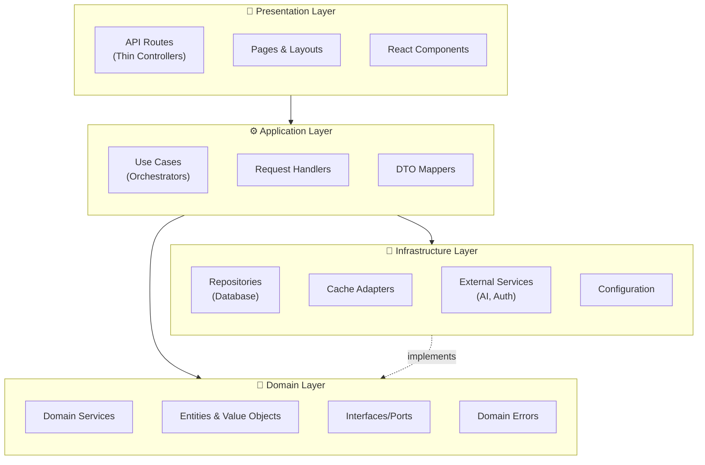
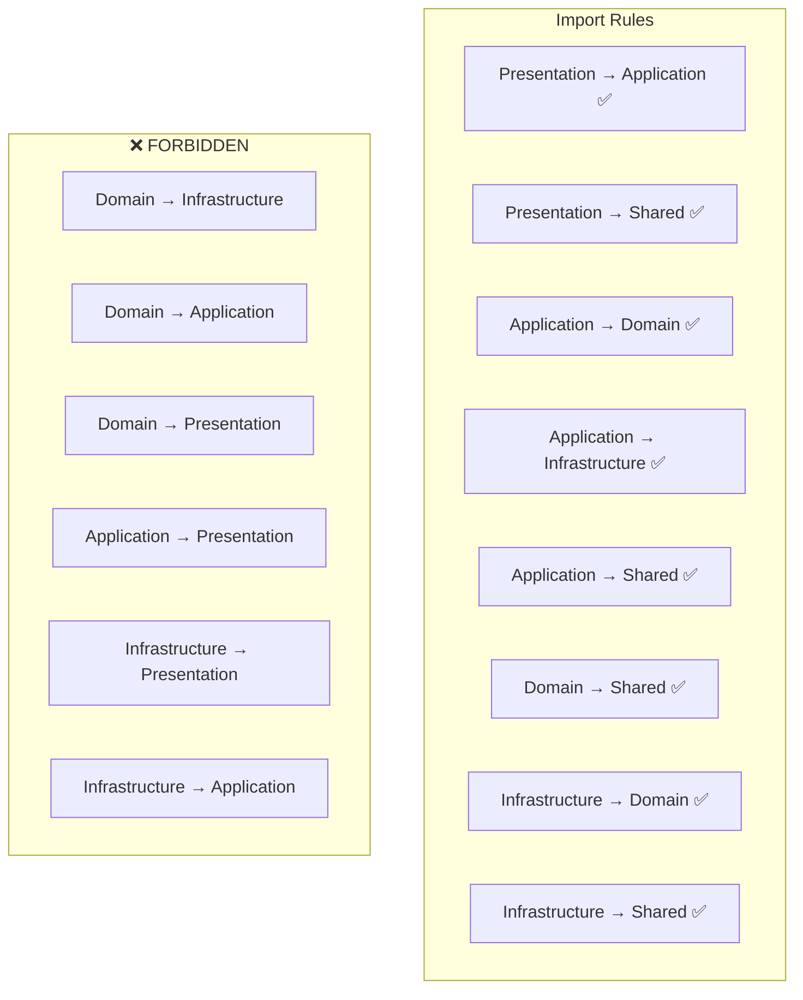
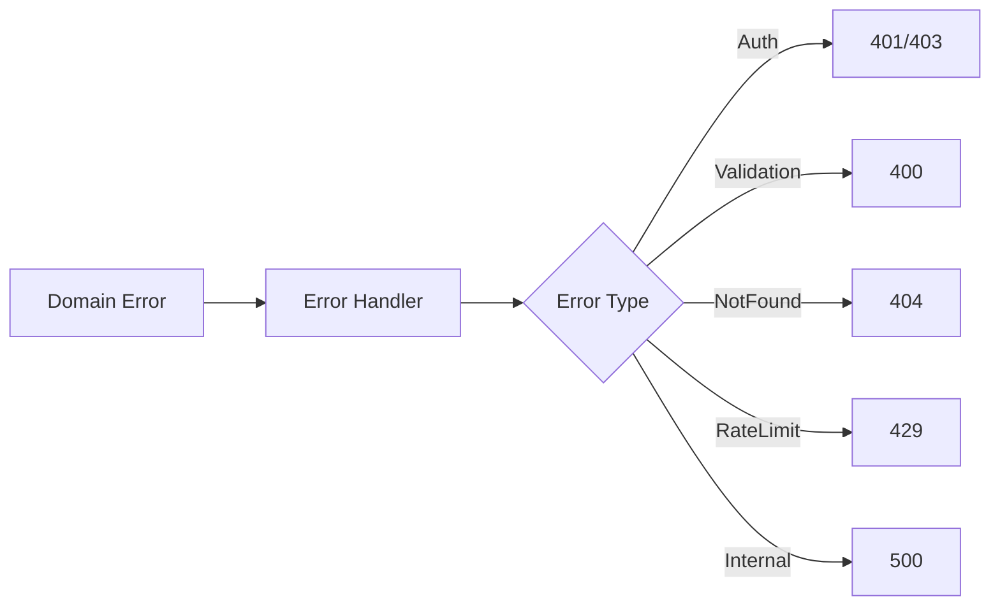
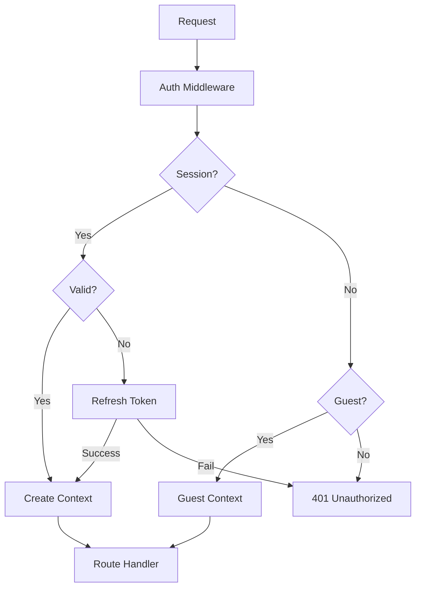
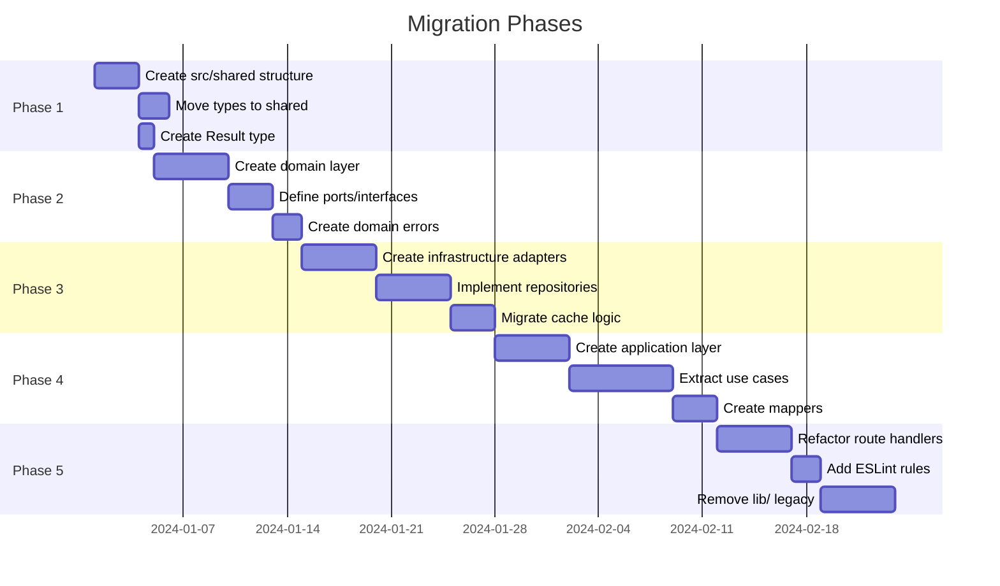

# Optimal Layered Architecture for Next.js AI Chatbot

> **Type**: System Architecture Design  
> **Created**: 2024-12-27  
> **Status**: 🟢 Proposed  
> **Author**: Ouroboros Architect

---

## Executive Summary

This document defines a comprehensive layered architecture for the nextjs-ai-chatbot project, addressing 580+ identified issues across 16 categories. The architecture follows Clean Architecture principles, Single Responsibility Principle (SRP), and establishes strict layer boundaries to eliminate the current fragmentation.

### Key Goals

1. **Single Responsibility**: Each layer/module has one reason to change
2. **Separation of Concerns**: Clear boundaries between layers
3. **No Layer Bypass**: Strict dependency direction (outer → inner only)
4. **DRY Principle**: Eliminate duplication through abstraction
5. **Testability**: Each layer independently testable

---

## 1. Architecture Vision

### 1.1 Design Principles

| Principle | Implementation |
|-----------|----------------|
| **Dependency Inversion** | Inner layers define interfaces, outer layers implement |
| **Single Responsibility** | Each module has one reason to change |
| **Open/Closed** | Extend behavior without modifying core code |
| **Interface Segregation** | Small, focused interfaces per use case |
| **Layer Isolation** | No layer bypass; strict import rules |

### 1.2 Constraints

- **Framework**: Next.js 14+ App Router
- **Runtime**: Node.js with Edge runtime support
- **State**: Server-first with selective client hydration
- **Cache**: Redis for distributed caching
- **Database**: PostgreSQL via Drizzle ORM
- **AI**: Vercel AI SDK streaming

---

## 2. Layer Definitions

### 2.1 Layered Architecture Diagram



### 2.2 Layer Responsibilities

#### Presentation Layer (Routes, Pages, Components)

| Responsibility | Description |
|----------------|-------------|
| HTTP handling | Parse requests, format responses |
| Input deserialization | Convert HTTP body to DTOs |
| Output serialization | Convert results to HTTP responses |
| Error response formatting | Map domain errors to HTTP status codes |
| UI rendering | React components and layouts |

**What it CANNOT do:**
- ❌ Business logic
- ❌ Direct database access
- ❌ Direct cache access
- ❌ Validation logic (beyond deserialization)

#### Application Layer (Use Cases, Handlers)

| Responsibility | Description |
|----------------|-------------|
| Orchestration | Coordinate domain services |
| Transaction boundaries | Define unit of work scope |
| DTO mapping | Transform between layers |
| Use case implementation | Single entry point per operation |
| Authorization enforcement | Check permissions before execution |

**What it CANNOT do:**
- ❌ Business rules (delegate to domain)
- ❌ Infrastructure details
- ❌ UI concerns

#### Domain Layer (Business Logic Core)

| Responsibility | Description |
|----------------|-------------|
| Business rules | Core logic and validations |
| Entity definitions | Domain models with behavior |
| Domain events | Business event definitions |
| Interface contracts | Ports for infrastructure |
| Domain errors | Business exception types |

**What it CANNOT do:**
- ❌ Know about HTTP/frameworks
- ❌ Depend on infrastructure
- ❌ UI concerns

#### Infrastructure Layer (Adapters)

| Responsibility | Description |
|----------------|-------------|
| Database access | Repository implementations |
| Cache operations | Redis client and operations |
| External API clients | AI SDK, NextAuth, etc. |
| Configuration loading | Environment variables |
| File system access | Storage operations |

**What it CANNOT do:**
- ❌ Business logic
- ❌ Orchestration
- ❌ UI concerns

---

## 3. Folder Structure

### 3.1 Optimal Directory Layout

```
nextjs-ai-chatbot/
├── app/                          # 🎨 PRESENTATION: Next.js App Router
│   ├── api/                      # API routes (thin controllers)
│   │   ├── chat/
│   │   │   ├── route.ts          # POST handler only
│   │   │   └── [id]/route.ts     # GET/DELETE handlers
│   │   ├── documents/
│   │   └── auth/
│   ├── (chat)/                   # Chat pages
│   ├── (auth)/                   # Auth pages
│   └── layout.tsx
│
├── src/                          # Application source
│   ├── application/              # ⚙️ APPLICATION LAYER
│   │   ├── use-cases/            # Use case implementations
│   │   │   ├── chat/
│   │   │   │   ├── send-message.use-case.ts
│   │   │   │   ├── get-chat-history.use-case.ts
│   │   │   │   └── index.ts
│   │   │   ├── documents/
│   │   │   │   ├── create-document.use-case.ts
│   │   │   │   └── index.ts
│   │   │   └── auth/
│   │   │       ├── authenticate.use-case.ts
│   │   │       └── index.ts
│   │   ├── handlers/             # Request handlers
│   │   │   ├── chat.handler.ts
│   │   │   └── document.handler.ts
│   │   ├── mappers/              # DTO mappers
│   │   │   ├── chat.mapper.ts
│   │   │   └── document.mapper.ts
│   │   └── index.ts
│   │
│   ├── domain/                   # 🔷 DOMAIN LAYER (Pure business logic)
│   │   ├── entities/             # Domain entities
│   │   │   ├── chat.entity.ts
│   │   │   ├── message.entity.ts
│   │   │   ├── document.entity.ts
│   │   │   ├── user.entity.ts
│   │   │   └── index.ts
│   │   ├── value-objects/        # Immutable value objects
│   │   │   ├── chat-id.vo.ts
│   │   │   ├── user-id.vo.ts
│   │   │   ├── message-content.vo.ts
│   │   │   └── index.ts
│   │   ├── services/             # Domain services (stateless)
│   │   │   ├── chat.service.ts
│   │   │   ├── message.service.ts
│   │   │   └── document.service.ts
│   │   ├── ports/                # Interface contracts
│   │   │   ├── repositories/
│   │   │   │   ├── chat.repository.port.ts
│   │   │   │   ├── message.repository.port.ts
│   │   │   │   └── document.repository.port.ts
│   │   │   ├── services/
│   │   │   │   ├── ai.service.port.ts
│   │   │   │   ├── cache.service.port.ts
│   │   │   │   └── auth.service.port.ts
│   │   │   └── index.ts
│   │   ├── errors/               # Domain-specific errors
│   │   │   ├── chat.errors.ts
│   │   │   ├── auth.errors.ts
│   │   │   └── base.error.ts
│   │   ├── events/               # Domain events
│   │   │   ├── chat-created.event.ts
│   │   │   └── message-sent.event.ts
│   │   └── index.ts
│   │
│   ├── infrastructure/           # 🔧 INFRASTRUCTURE LAYER
│   │   ├── database/             # Database adapters
│   │   │   ├── client.ts         # Drizzle client
│   │   │   ├── schema.ts         # Database schema
│   │   │   ├── migrations/
│   │   │   └── repositories/     # Repository implementations
│   │   │       ├── chat.repository.ts
│   │   │       ├── message.repository.ts
│   │   │       └── document.repository.ts
│   │   ├── cache/                # Cache adapters
│   │   │   ├── redis.client.ts
│   │   │   ├── cache.adapter.ts
│   │   │   └── strategies/
│   │   │       ├── chat.cache.ts
│   │   │       └── document.cache.ts
│   │   ├── ai/                   # AI service adapters
│   │   │   ├── vercel-ai.adapter.ts
│   │   │   ├── models.ts
│   │   │   └── tools/
│   │   │       ├── create-document.tool.ts
│   │   │       └── update-document.tool.ts
│   │   ├── auth/                 # Auth adapters
│   │   │   ├── next-auth.adapter.ts
│   │   │   ├── session.adapter.ts
│   │   │   └── guards.ts
│   │   ├── config/               # Configuration
│   │   │   ├── app.config.ts
│   │   │   ├── cache.config.ts
│   │   │   └── ai.config.ts
│   │   └── index.ts
│   │
│   └── shared/                   # Cross-cutting concerns
│       ├── types/                # Shared type definitions
│       │   ├── result.type.ts    # Result<T, E> type
│       │   ├── pagination.type.ts
│       │   └── index.ts
│       ├── utils/                # Pure utility functions
│       │   ├── validation.ts
│       │   ├── date.ts
│       │   └── string.ts
│       ├── constants/            # Application constants
│       │   ├── errors.ts
│       │   └── limits.ts
│       └── index.ts
│
├── components/                   # 🎨 PRESENTATION: React components
│   ├── ui/                       # Base UI components (shadcn)
│   ├── chat/                     # Chat feature components
│   ├── documents/                # Document feature components
│   └── layout/                   # Layout components
│
├── hooks/                        # React hooks
│   ├── use-chat.ts
│   ├── use-auth.ts
│   └── use-document.ts
│
├── stores/                       # Client state (Zustand)
│   ├── chat.store.ts
│   ├── ui.store.ts
│   └── index.ts
│
└── lib/                          # Legacy (to be migrated)
```

### 3.2 File Naming Conventions

| Layer | Pattern | Example |
|-------|---------|---------|
| Use Case | `{action}-{entity}.use-case.ts` | `send-message.use-case.ts` |
| Handler | `{entity}.handler.ts` | `chat.handler.ts` |
| Entity | `{entity}.entity.ts` | `chat.entity.ts` |
| Value Object | `{name}.vo.ts` | `chat-id.vo.ts` |
| Repository Port | `{entity}.repository.port.ts` | `chat.repository.port.ts` |
| Repository Impl | `{entity}.repository.ts` | `chat.repository.ts` |
| Service Port | `{name}.service.port.ts` | `ai.service.port.ts` |
| Adapter | `{provider}.adapter.ts` | `vercel-ai.adapter.ts` |
| Error | `{domain}.errors.ts` | `chat.errors.ts` |
| Mapper | `{entity}.mapper.ts` | `chat.mapper.ts` |

---

## 4. Dependency Rules

### 4.1 Allowed Imports



### 4.2 Import Rules Table

| From Layer | Can Import From | Cannot Import From |
|------------|-----------------|-------------------|
| **Presentation** | Application, Shared | Domain, Infrastructure |
| **Application** | Domain, Infrastructure, Shared | Presentation |
| **Domain** | Shared only | Application, Infrastructure, Presentation |
| **Infrastructure** | Domain (interfaces), Shared | Application, Presentation |

### 4.3 Enforcement via ESLint

```javascript
// eslint.config.js
{
  rules: {
    'import/no-restricted-paths': ['error', {
      zones: [
        // Domain cannot import from infrastructure
        {
          target: './src/domain/**/*',
          from: './src/infrastructure/**/*',
          message: 'Domain layer cannot depend on Infrastructure'
        },
        // Domain cannot import from application
        {
          target: './src/domain/**/*',
          from: './src/application/**/*',
          message: 'Domain layer cannot depend on Application'
        },
        // Infrastructure cannot import from application
        {
          target: './src/infrastructure/**/*',
          from: './src/application/**/*',
          message: 'Infrastructure cannot depend on Application'
        },
        // Presentation bypassing application
        {
          target: './app/**/*',
          from: './src/domain/**/*',
          message: 'Routes must use Application layer, not Domain directly'
        }
      ]
    }]
  }
}
```

---

## 5. SRP Guidelines

### 5.1 Route Handler Responsibilities (Thin Controllers)

**Before (9+ concerns mixed):**
```typescript
// ❌ WRONG: Route handler doing everything
export async function POST(request: Request) {
  // Auth check (concern 1)
  const session = await getSession();
  if (!session) return unauthorized();
  
  // Rate limiting (concern 2)
  if (await isRateLimited(session.user.id)) return rateLimited();
  
  // Validation (concern 3)
  const body = await request.json();
  if (!body.message) return badRequest();
  
  // Business logic (concern 4)
  const chat = await db.chats.findFirst({ where: { id: body.chatId } });
  if (chat.userId !== session.user.id) return forbidden();
  
  // AI call (concern 5)
  const response = await streamText({ model, messages });
  
  // Cache update (concern 6)
  await cache.invalidate(`chat:${body.chatId}`);
  
  // Database update (concern 7)
  await db.messages.create({ ... });
  
  // Logging (concern 8)
  logger.info('Message sent', { chatId: body.chatId });
  
  // Response formatting (concern 9)
  return new Response(response);
}
```

**After (1 concern: orchestration only):**
```typescript
// ✅ CORRECT: Thin controller
export async function POST(request: Request) {
  try {
    const dto = await parseRequest(request);
    const result = await sendMessageUseCase.execute(dto);
    return formatResponse(result);
  } catch (error) {
    return handleError(error);
  }
}
```

### 5.2 Responsibility Matrix

| Component | Single Responsibility |
|-----------|----------------------|
| **Route Handler** | Parse request → Call use case → Format response |
| **Use Case** | Orchestrate single business operation |
| **Domain Service** | Stateless business rule logic |
| **Entity** | Business data + behavior |
| **Repository** | Single aggregate persistence |
| **Mapper** | Transform between layer DTOs |
| **Validator** | Validate single schema |
| **Cache Strategy** | Cache single entity type |

### 5.3 File Size Limits

| Component Type | Max Lines | Reason |
|----------------|-----------|--------|
| Route Handler | ~30 | Thin orchestrator only |
| Use Case | ~100 | Single operation |
| Domain Service | ~150 | Focused business logic |
| Entity | ~100 | Data + essential behavior |
| Repository | ~150 | CRUD + specific queries |
| Mapper | ~50 | Simple transformations |
| Validator | ~50 | Single schema validation |

---

## 6. DRY Implementation

### 6.1 Current Duplication Issues

| Issue | Current State | DRY Solution |
|-------|---------------|--------------|
| Session validation | 10+ files checking auth | Single `AuthGuard` middleware |
| Error response formatting | 4 different patterns | Single `ErrorHandler` |
| Validation | Zod, manual, inline | Single `ValidationService` |
| Cache invalidation | Scattered across files | Single `CacheInvalidator` |
| DTO mapping | Inline transformations | Mapper classes |

### 6.2 Shared Utilities Location

```
src/shared/
├── types/
│   ├── result.type.ts        # Result<T, E> pattern
│   ├── pagination.type.ts    # Cursor pagination types
│   └── context.type.ts       # Request context type
├── utils/
│   ├── validation.utils.ts   # Validation helpers
│   ├── date.utils.ts         # Date formatting
│   ├── string.utils.ts       # String manipulation
│   └── async.utils.ts        # Async helpers (retry, debounce)
├── constants/
│   ├── error-codes.ts        # Unified error codes
│   ├── limits.ts             # Rate limits, pagination limits
│   └── features.ts           # Feature flag names
└── middleware/
    ├── auth.middleware.ts    # Auth check middleware
    ├── rate-limit.middleware.ts
    └── validation.middleware.ts
```

### 6.3 Abstraction Patterns

#### Pattern 1: Result Type (Eliminate try/catch duplication)

```typescript
// src/shared/types/result.type.ts
type Result<T, E = AppError> = 
  | { success: true; data: T }
  | { success: false; error: E };

// Usage in use case
async execute(dto: SendMessageDTO): Promise<Result<Message>> {
  const chatResult = await this.chatRepo.findById(dto.chatId);
  if (!chatResult.success) return chatResult;
  
  const authResult = this.authService.checkOwnership(chatResult.data, dto.userId);
  if (!authResult.success) return authResult;
  
  return this.messageRepo.create(dto);
}
```

#### Pattern 2: Base Repository (Eliminate CRUD duplication)

```typescript
// src/infrastructure/database/repositories/base.repository.ts
abstract class BaseRepository<T, ID> {
  abstract readonly table: Table;
  
  async findById(id: ID): Promise<Result<T>> { ... }
  async create(data: Partial<T>): Promise<Result<T>> { ... }
  async update(id: ID, data: Partial<T>): Promise<Result<T>> { ... }
  async delete(id: ID): Promise<Result<void>> { ... }
}

// Implementation
class ChatRepository extends BaseRepository<Chat, ChatId> {
  table = chats;
  
  // Only domain-specific methods
  async findByUserId(userId: UserId): Promise<Result<Chat[]>> { ... }
}
```

#### Pattern 3: Factory Functions (Eliminate construction duplication)

```typescript
// src/domain/errors/factories.ts
export const createAuthError = (code: AuthErrorCode, ctx?: ErrorContext) =>
  new DomainError({ category: 'auth', code, ...ctx });

export const createValidationError = (field: string, message: string) =>
  new DomainError({ category: 'validation', code: 'INVALID_FIELD', field, message });

// Usage
throw createAuthError('UNAUTHORIZED');
throw createValidationError('email', 'Invalid format');
```

---

## 7. Pattern Catalog

### 7.1 Result Type Pattern

**Why This Design**: Eliminates try/catch proliferation, makes error handling explicit, enables railway-oriented programming.

```typescript
// src/shared/types/result.type.ts
export type Result<T, E = AppError> =
  | { success: true; data: T }
  | { success: false; error: E };

export const Result = {
  ok: <T>(data: T): Result<T> => ({ success: true, data }),
  fail: <E>(error: E): Result<never, E> => ({ success: false, error }),
  
  map: <T, U>(result: Result<T>, fn: (data: T) => U): Result<U> =>
    result.success ? Result.ok(fn(result.data)) : result,
    
  flatMap: <T, U>(result: Result<T>, fn: (data: T) => Result<U>): Result<U> =>
    result.success ? fn(result.data) : result,
};
```

**Alternatives Rejected:**
| Alternative | Rejected Because |
|-------------|------------------|
| Throwing exceptions | Control flow as exceptions, hard to track |
| Nullable returns | No error information, null ambiguity |
| Tuple [data, error] | Less type-safe, easy to ignore errors |

### 7.2 Error Handling Pattern

**Why This Design**: Single source of truth for error definitions, consistent HTTP mapping, structured logging.



```typescript
// src/domain/errors/base.error.ts
export class DomainError extends Error {
  readonly code: ErrorCode;
  readonly category: ErrorCategory;
  readonly isOperational: boolean;
  readonly context?: Record<string, unknown>;
}

// src/application/handlers/error.handler.ts
export function handleError(error: unknown): Response {
  if (error instanceof DomainError) {
    return new Response(
      JSON.stringify({ error: { code: error.code, message: error.message } }),
      { status: getHttpStatus(error.category) }
    );
  }
  
  logger.error('Unhandled error', { error });
  return new Response(
    JSON.stringify({ error: { code: 'INTERNAL_ERROR', message: 'An error occurred' } }),
    { status: 500 }
  );
}
```

### 7.3 Validation Pattern

**Why This Design**: Single validation approach, schema-first, early validation at boundaries.

```typescript
// src/shared/validation/schemas/chat.schema.ts
export const sendMessageSchema = z.object({
  chatId: z.string().uuid(),
  content: z.string().min(1).max(10000),
  model: z.enum(['gpt-4', 'gpt-4o', 'claude-3']).optional(),
});

export type SendMessageDTO = z.infer<typeof sendMessageSchema>;

// src/shared/validation/validate.ts
export function validate<T>(schema: z.Schema<T>, data: unknown): Result<T> {
  const result = schema.safeParse(data);
  if (!result.success) {
    return Result.fail(createValidationError(result.error));
  }
  return Result.ok(result.data);
}

// Usage in route handler
export async function POST(request: Request) {
  const body = await request.json();
  const validated = validate(sendMessageSchema, body);
  if (!validated.success) return validated.error.toResponse();
  // ...
}
```

### 7.4 Auth Pattern

**Why This Design**: Single source of auth truth, consistent guest handling, session caching.



```typescript
// src/infrastructure/auth/auth.middleware.ts
export async function withAuth(
  handler: (req: Request, ctx: AuthContext) => Promise<Response>
): Promise<(req: Request) => Promise<Response>> {
  return async (request: Request) => {
    const session = await getSession(request);
    
    if (!session) {
      const guestId = getGuestId(request);
      if (guestId) {
        return handler(request, { type: 'guest', userId: guestId });
      }
      return unauthorized();
    }
    
    return handler(request, { type: 'user', userId: session.user.id, session });
  };
}
```

### 7.5 Cache Pattern

**Why This Design**: Unified cache interface, strategy per entity, automatic invalidation.

```typescript
// src/domain/ports/services/cache.service.port.ts
export interface CachePort<T> {
  get(key: string): Promise<T | null>;
  set(key: string, value: T, ttl?: number): Promise<void>;
  invalidate(key: string): Promise<void>;
  invalidatePattern(pattern: string): Promise<void>;
}

// src/infrastructure/cache/strategies/chat.cache.ts
export class ChatCacheStrategy implements CachePort<Chat> {
  private readonly prefix = 'chat';
  private readonly ttl = 3600; // 1 hour
  
  keyFor(chatId: string): string {
    return `${this.prefix}:${chatId}`;
  }
  
  async get(chatId: string): Promise<Chat | null> {
    const cached = await redis.get(this.keyFor(chatId));
    return cached ? JSON.parse(cached) : null;
  }
  
  async set(chatId: string, chat: Chat): Promise<void> {
    await redis.setex(this.keyFor(chatId), this.ttl, JSON.stringify(chat));
  }
  
  async invalidate(chatId: string): Promise<void> {
    await redis.del(this.keyFor(chatId));
  }
  
  async invalidateForUser(userId: string): Promise<void> {
    await redis.eval(
      `for _,k in ipairs(redis.call('keys','${this.prefix}:user:${userId}:*')) do redis.call('del',k) end`,
      0
    );
  }
}
```

### 7.6 Repository Pattern

**Why This Design**: Aggregate-oriented, domain-ignorant storage, testable via interfaces.

```typescript
// src/domain/ports/repositories/chat.repository.port.ts
export interface ChatRepositoryPort {
  findById(id: ChatId): Promise<Result<Chat>>;
  findByUserId(userId: UserId, pagination: Pagination): Promise<Result<PaginatedResult<Chat>>>;
  save(chat: Chat): Promise<Result<Chat>>;
  delete(id: ChatId): Promise<Result<void>>;
}

// src/infrastructure/database/repositories/chat.repository.ts
export class ChatRepository implements ChatRepositoryPort {
  constructor(
    private readonly db: DrizzleClient,
    private readonly cache: ChatCacheStrategy
  ) {}
  
  async findById(id: ChatId): Promise<Result<Chat>> {
    // Try cache first
    const cached = await this.cache.get(id.value);
    if (cached) return Result.ok(cached);
    
    // Query database
    const row = await this.db.query.chats.findFirst({
      where: eq(chats.id, id.value)
    });
    
    if (!row) return Result.fail(notFoundError('Chat'));
    
    const chat = ChatMapper.toDomain(row);
    await this.cache.set(id.value, chat);
    
    return Result.ok(chat);
  }
}
```

---

## 8. Migration Path

### 8.1 Phase Overview



### 8.2 Detailed Migration Steps

#### Phase 1: Foundation (Week 1)

| Priority | Task | Files Affected | Risk |
|----------|------|----------------|------|
| 🔴 P1 | Create `src/shared/types/result.type.ts` | New file | 🟢 Low |
| 🔴 P1 | Create `src/shared/types/context.type.ts` | New file | 🟢 Low |
| 🔴 P1 | Move `lib/errors/types.ts` → `src/shared/types/error.type.ts` | 1 file | 🟢 Low |
| 🟠 P2 | Create `src/shared/constants/error-codes.ts` | New file | 🟢 Low |
| 🟠 P2 | Create `src/shared/utils/validation.utils.ts` | New file | 🟢 Low |

#### Phase 2: Domain Layer (Week 2)

| Priority | Task | Files Affected | Risk |
|----------|------|----------------|------|
| 🔴 P1 | Create `src/domain/entities/` structure | 5 new files | 🟢 Low |
| 🔴 P1 | Create `src/domain/ports/repositories/` | 4 new files | 🟢 Low |
| 🔴 P1 | Create `src/domain/ports/services/` | 3 new files | 🟢 Low |
| 🔴 P1 | Create `src/domain/errors/` | 3 new files | 🟢 Low |
| 🟠 P2 | Create `src/domain/value-objects/` | 5 new files | 🟢 Low |

#### Phase 3: Infrastructure Layer (Week 3-4)

| Priority | Task | Files Affected | Risk |
|----------|------|----------------|------|
| 🔴 P1 | Create `src/infrastructure/database/repositories/` | 4 new files | 🟡 Medium |
| 🔴 P1 | Migrate `lib/data/` → infrastructure | 15 files | 🟡 Medium |
| 🔴 P1 | Create `src/infrastructure/cache/` | 5 new files | 🟡 Medium |
| 🟠 P2 | Create `src/infrastructure/auth/` adapters | 4 files | 🟡 Medium |
| 🟠 P2 | Create `src/infrastructure/ai/` adapters | 3 files | 🟡 Medium |

#### Phase 4: Application Layer (Week 5-6)

| Priority | Task | Files Affected | Risk |
|----------|------|----------------|------|
| 🔴 P1 | Create `src/application/use-cases/chat/` | 5 new files | 🟡 Medium |
| 🔴 P1 | Create `src/application/use-cases/auth/` | 3 new files | 🟡 Medium |
| 🔴 P1 | Create `src/application/use-cases/documents/` | 4 new files | 🟡 Medium |
| 🟠 P2 | Create `src/application/mappers/` | 4 new files | 🟢 Low |
| 🟠 P2 | Extract handlers from routes | 10 files | 🟡 Medium |

#### Phase 5: Presentation Refactor (Week 7-8)

| Priority | Task | Files Affected | Risk |
|----------|------|----------------|------|
| 🔴 P1 | Refactor `app/api/chat/route.ts` to thin controller | 1 file | 🟡 Medium |
| 🔴 P1 | Refactor all route handlers | 8 files | 🟡 Medium |
| 🟠 P2 | Add ESLint import restrictions | 1 file | 🟢 Low |
| 🟠 P2 | Remove deprecated `lib/services/` | 5 files | 🔴 High |
| 🟠 P2 | Remove deprecated `lib/data/` | 10 files | 🔴 High |
| 🟢 P3 | Clean up barrel exports | 15 files | 🟢 Low |

### 8.3 Migration Verification Checklist

```
┌─────────────────────────────────────────────────────────────┐
│ MIGRATION VERIFICATION                                      │
├─────────────────────────────────────────────────────────────┤
│ ☐ All domain code is framework-agnostic                    │
│ ☐ Domain layer has zero external dependencies              │
│ ☐ All business logic moved from routes to use cases        │
│ ☐ Route handlers are ≤30 lines                             │
│ ☐ Repository implementations satisfy ports                  │
│ ☐ Result type used consistently                            │
│ ☐ ESLint import rules passing                              │
│ ☐ All tests passing                                        │
│ ☐ No circular dependencies                                 │
│ ☐ Bundle size unchanged or smaller                         │
└─────────────────────────────────────────────────────────────┘
```

---

## 9. Design Decisions Summary

### Decision 1: src/ Directory for Layered Code

**Context**: Need clear separation between Next.js convention folders and layered architecture.

**Decision**: Use `src/` for application/domain/infrastructure, keep `app/` for Next.js routes.

**Why**:
- Clear visual separation of concerns
- Follows Clean Architecture conventions
- Easy to enforce import rules
- Next.js works seamlessly with `src/` folder

**Alternatives Rejected:**
| Alternative | Rejected Because |
|-------------|------------------|
| Keep everything in `lib/` | Already fragmented, unclear boundaries |
| Use `modules/` folder | Conflicts with feature-based structure |
| Move all to `app/` | Mixes framework with business logic |

### Decision 2: Domain Ports Instead of Direct Dependencies

**Context**: Domain layer should not depend on infrastructure details.

**Decision**: Define interface contracts (ports) in domain, implement in infrastructure.

**Why**:
- Domain remains pure and testable
- Easy to swap implementations
- Clear dependency inversion
- Infrastructure changes don't affect domain

**Alternatives Rejected:**
| Alternative | Rejected Because |
|-------------|------------------|
| Direct database access in domain | Couples domain to persistence |
| Abstract classes | More rigid than interfaces |
| Service locator pattern | Hidden dependencies, hard to test |

### Decision 3: Result Type Over Exceptions

**Context**: Current codebase has inconsistent error handling with try/catch everywhere.

**Decision**: Use Result<T, E> type for all fallible operations.

**Why**:
- Explicit error handling
- No surprise exceptions
- Composable (map, flatMap)
- Type-safe error propagation

**Trade-offs**:
- ✅ Explicit error paths
- ✅ Better type safety
- ⚠️ More verbose than throw/catch
- ⚠️ Learning curve for team

---

## 10. Requirements Traceability

| Issue Category | Current Count | Architecture Solution | Component |
|----------------|---------------|----------------------|-----------|
| SRP Violations | 30+ | Thin controllers + use cases | Application Layer |
| Fragmented Logic | 50+ | Domain services | Domain Layer |
| Direct process.env | 265+ | Config adapters | Infrastructure Layer |
| Duplicate Validation | 4 patterns | Single ValidationService | Shared Layer |
| Mixed Concerns in Services | 20+ | Use case extraction | Application Layer |
| Session Fragmentation | 5 files | Single AuthAdapter | Infrastructure Layer |
| Cache Duplication | 12 files | CacheStrategy per entity | Infrastructure Layer |
| Type Duplication | 10+ locations | Domain entities | Domain Layer |

---

## 11. Quality Self-Check

- [x] All layers clearly defined with responsibilities
- [x] Dependency rules documented with ESLint enforcement
- [x] Mermaid diagrams for architecture overview
- [x] SRP guidelines with before/after examples
- [x] DRY patterns cataloged with implementations
- [x] 5 core patterns documented (Result, Error, Validation, Auth, Cache)
- [x] Migration path with phases and priorities
- [x] Alternatives considered for major decisions
- [x] Trade-offs documented
- [x] File naming conventions specified
- [x] Folder structure complete

---

## → Next Steps

**Output**: This architecture design document  
**Next**: Create implementation tasks for Phase 1  
**Handoff**: Ready for orchestrator to delegate implementation

---

## Appendix A: Quick Reference Card

```
┌─────────────────────────────────────────────────────────────┐
│ LAYER QUICK REFERENCE                                       │
├─────────────────────────────────────────────────────────────┤
│ 🎨 PRESENTATION (app/, components/)                        │
│    → HTTP handling, UI rendering                           │
│    → Imports: Application, Shared                          │
│                                                             │
│ ⚙️ APPLICATION (src/application/)                          │
│    → Use cases, orchestration, mappers                     │
│    → Imports: Domain, Infrastructure, Shared               │
│                                                             │
│ 🔷 DOMAIN (src/domain/)                                    │
│    → Business logic, entities, ports                       │
│    → Imports: Shared ONLY                                  │
│                                                             │
│ 🔧 INFRASTRUCTURE (src/infrastructure/)                    │
│    → Database, cache, external services                    │
│    → Imports: Domain (ports), Shared                       │
│                                                             │
│ 📦 SHARED (src/shared/)                                    │
│    → Types, utils, constants                               │
│    → Imports: Nothing (leaf layer)                         │
└─────────────────────────────────────────────────────────────┘
```

## Appendix B: Current → Target Mapping

| Current Location | Target Location | Notes |
|------------------|-----------------|-------|
| `lib/services/chat-service.ts` | `src/domain/services/chat.service.ts` | Extract pure business logic |
| `lib/services/auth-service.ts` | `src/infrastructure/auth/auth.adapter.ts` | Infrastructure adapter |
| `lib/data/chat/` | `src/infrastructure/database/repositories/chat.repository.ts` | Implement port |
| `lib/data/cached/` | `src/infrastructure/cache/strategies/` | Strategy per entity |
| `lib/errors/` | `src/domain/errors/` + `src/shared/types/` | Split domain/shared |
| `lib/config/` | `src/infrastructure/config/` | Environment adapter |
| `lib/auth/` | `src/infrastructure/auth/` | NextAuth adapter |
| `lib/cache/` | `src/infrastructure/cache/` | Redis adapter |
| `features/chat/` | `components/chat/` + `src/application/use-cases/chat/` | Split UI/logic |
