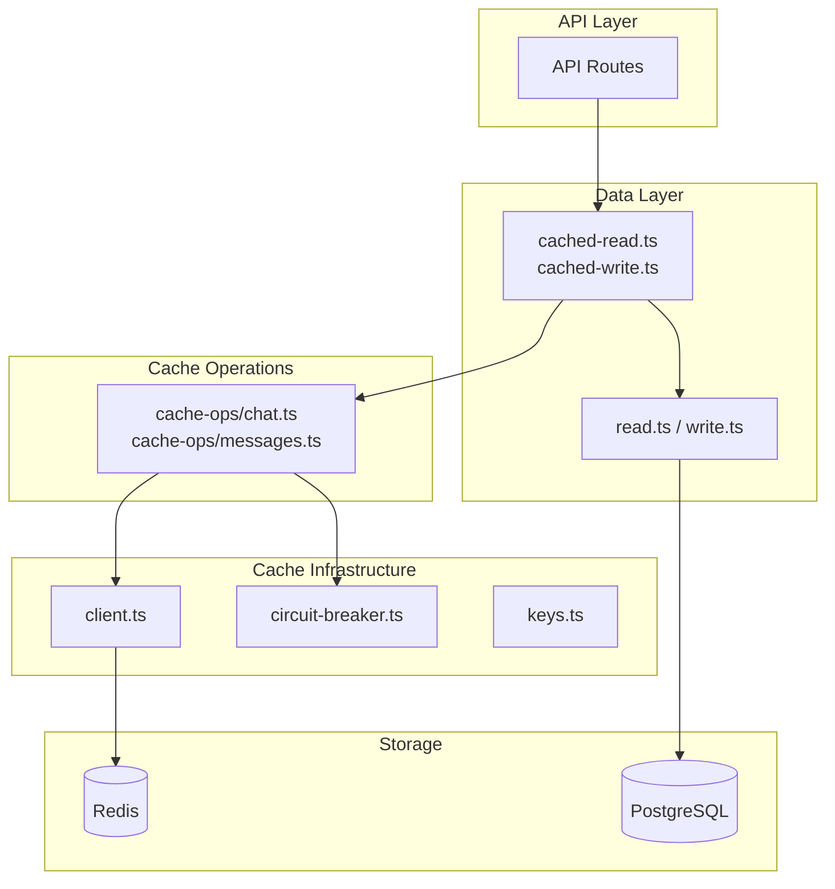
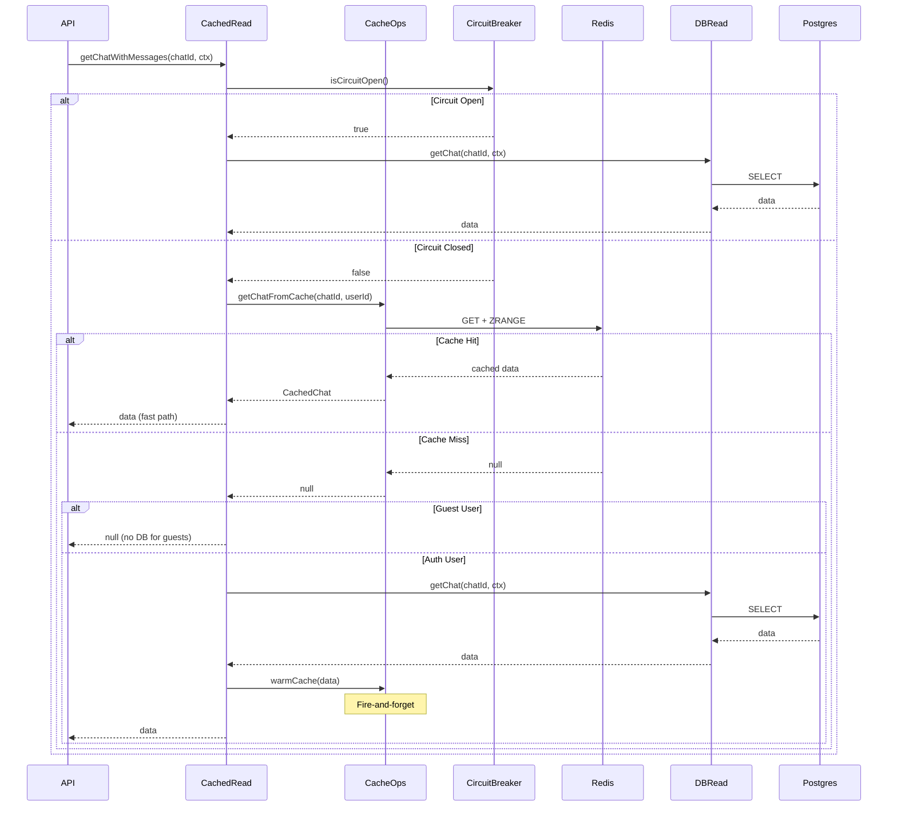
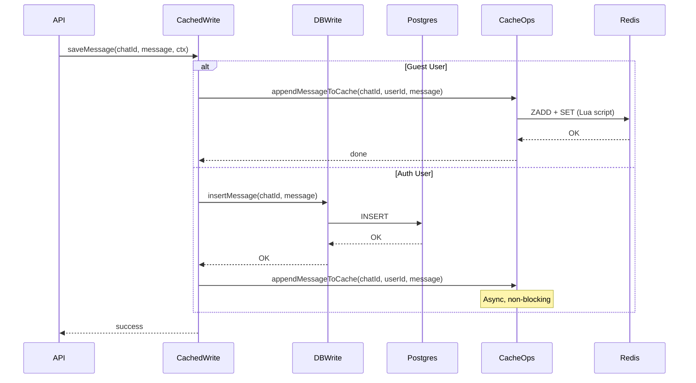

# Cache-Data Integration Design

> **Module**: Cache Layer Integration with Data Layer  
> **Priority**: P0 - Critical Performance Foundation  
> **Status**: DESIGN (UPDATED)  
> **Author**: Ouroboros Architect  
> **Date**: 2024-12-21  
> **Updated**: 2024-12-21  
> **Depends On**: 04-cache-layer-optimal-design.md, 03-data-layer-optimal-design.md  
> **Related Spec**: [cache-operations-spec.md](../cache-operations/cache-operations-spec.md)

---

## 1. Executive Summary

This document defines the optimized cache integration strategy for NewApp's data layer. The goal is to wire the existing `lib/cache/` infrastructure to `lib/data/` operations, achieving sub-50ms cache hits with graceful degradation.

> **📌 Reference**: For complete operation specifications, Lua scripts, and detailed flows, see [Cache Operations Spec](../cache-operations/cache-operations-spec.md).

**Key Improvements Over OldApp:**

1. Cleaner separation of concerns (cache infrastructure vs cache-integrated data access)
2. Simplified API surface (unified `cachedData` facade)
3. Type-safe cache operations with better error handling
4. Reduced code duplication in cache-first patterns
5. **5 Bundling Patterns** for RTT optimization (see Section 6)
6. **Performance Benchmarks** with measurable targets (see Section 6.3)

---

## 2. Problem Analysis

### 2.1 Current State

**NewApp `lib/cache/`** (Infrastructure exists, not wired):
| File | Lines | Status |
|------|-------|--------|
| client.ts | 65 | ✅ Redis singleton |
| circuit-breaker.ts | 98 | ✅ Fault tolerance |
| types.ts | 82 | ✅ Cache types |
| keys.ts | 60 | ✅ Key patterns |
| helpers.ts | 78 | ✅ Utilities |
| constants.ts | 15 | ✅ TTLs |

**NewApp `lib/data/`** (DB-only, no caching):
| File | Lines | Status |
|------|-------|--------|
| chat/read.ts | 130 | ⚠️ DB-only |
| chat/write.ts | 100 | ⚠️ DB-only |
| documents/\*.ts | ~200 | ⚠️ DB-only |

**Gap**: Cache infrastructure exists but data operations bypass it entirely.

### 2.2 OldApp Reference Analysis

**What OldApp Does Well:**

1. **ZSET for messages**: O(log N) append, O(log N + M) range delete
2. **Lua scripts**: Atomic multi-step operations (single round-trip)
3. **Circuit breaker**: Prevents cascade failures
4. **Guest-only mode**: Cache as primary store for guest users
5. **Background warming**: Non-blocking cache population

**OldApp Inefficiencies:**

1. **Monolithic operations.ts** (1080 lines) - hard to maintain
2. **Scattered cache logic** - mixed with data layer code
3. **Repeated patterns** - same cache-first checks everywhere
4. **Inconsistent error handling** - some operations swallow errors

---

## 3. Design Decisions

### 3.1 ADR-001: Cache Strategy Selection

**Status**: ACCEPTED

**Context**: Need to decide between cache-aside, write-through, and write-behind strategies for different data types.

**Decision**: Use **hybrid strategy** based on data characteristics:

| Data Type      | Read Strategy | Write Strategy         | Rationale                    |
| -------------- | ------------- | ---------------------- | ---------------------------- |
| Chat Metadata  | Cache-first   | Write-through          | Hot data, needs consistency  |
| Chat Messages  | Cache-first   | Write-through + append | Append-heavy workload        |
| User Chat List | Cache-first   | Write-through          | Pagination needs fresh order |
| Documents      | Cache-first   | Write-through          | Versioned, needs consistency |
| Quota Counters | Cache-only    | Cache-only (atomic)    | Rate limiting, no DB needed  |
| Guest Data     | Cache-only    | Cache-only             | No DB persistence for guests |

**Consequences:**

**Positive:**

- **POS-001**: Cache-first gives sub-50ms reads for hot data
- **POS-002**: Write-through ensures consistency without stale data
- **POS-003**: Guest-only mode eliminates DB round-trips for anonymous users

**Negative:**

- **NEG-001**: Write-through adds latency to writes (mitigated by async cache updates)
- **NEG-002**: Cache-only for guests means data loss on cache eviction (acceptable for 7-day TTL)

**Alternatives Rejected:**

**ALT-001**: Write-behind (async DB writes)

- Rejected because: Risk of data loss on crash, complexity of async queue

**ALT-002**: Pure cache-aside (lazy population)

- Rejected because: First request always slow, poor UX for chat history

---

### 3.2 ADR-002: TTL Strategy

**Status**: ACCEPTED

**Context**: Need TTL configuration per entity type to balance memory usage and freshness.

**Decision**:

| Entity             | TTL      | Rationale                        |
| ------------------ | -------- | -------------------------------- |
| Guest Chat Data    | 7 days   | Matches session expiry           |
| Guest Quota        | 25 hours | Daily reset with timezone buffer |
| Auth User Chats    | 24 hours | Warm frequently accessed         |
| Auth User Inactive | 4 hours  | Evict cold data faster           |
| Documents          | 24 hours | Versioned, needs fresh data      |

**Implementation:**

```typescript
// lib/cache/constants.ts
export const TTL = {
  GUEST_DATA: 7 * 24 * 60 * 60, // 604,800 seconds
  GUEST_QUOTA: 25 * 60 * 60, // 90,000 seconds
  AUTH_CHAT_ACTIVE: 24 * 60 * 60, // 86,400 seconds
  AUTH_CHAT_INACTIVE: 4 * 60 * 60, // 14,400 seconds
  DOCUMENT: 24 * 60 * 60, // 86,400 seconds
} as const;
```

**Consequences:**

**Positive:**

- **POS-001**: Memory-efficient (cold data auto-evicted)
- **POS-002**: Guest data cleanup is automatic

**Negative:**

- **NEG-001**: Auth users may hit cache miss after 24h (acceptable, DB fallback)

---

### 3.3 ADR-003: Cache Key Design

**Status**: ACCEPTED

**Context**: Need consistent, collision-free key naming that supports IDOR protection.

**Decision**: Use hierarchical key pattern with userId namespace:

```
{entity}:{entityId}:{userId}:{subtype}
```

**Key Patterns:**

```typescript
// lib/cache/keys.ts (enhanced)
export const CacheKeys = {
  // Chat keys - userId ensures IDOR protection
  chatMeta: (chatId: string, userId: string) => `chat:${chatId}:${userId}:meta`,

  chatMessages: (chatId: string, userId: string) =>
    `chat:${chatId}:${userId}:msgs`,

  // User aggregations
  userChats: (userId: string) => `user:${userId}:chats`,

  // Documents
  document: (documentId: string, userId: string) =>
    `doc:${documentId}:${userId}`,

  // Quota (hash tag for cluster co-location)
  quota: (userId: string, date: string) => `quota:{${userId}}:${date}`,

  // Session (for rate limiting)
  session: (sessionId: string) => `session:${sessionId}`,
} as const;
```

**Consequences:**

**Positive:**

- **POS-001**: userId in key prevents cross-user data access
- **POS-002**: Hash tags `{userId}` enable cluster-aware quota

**Negative:**

- **NEG-001**: Longer keys use slightly more memory (negligible)

---

### 3.4 ADR-004: Data Structure Selection

**Status**: ACCEPTED

**Context**: Need optimal Redis data types for each use case.

**Decision**:

| Use Case          | Redis Type              | Operations                                    | Complexity |
| ----------------- | ----------------------- | --------------------------------------------- | ---------- |
| Chat Metadata     | STRING (JSON)           | GET/SET                                       | O(1)       |
| Chat Messages     | ZSET                    | ZADD/ZRANGE/ZREMRANGEBYSCORE                  | O(log N)   |
| User Chat List    | ZSET (by updatedAt)     | ZADD/ZREVRANGE                                | O(log N)   |
| Document Metadata | STRING (JSON)           | GET/SET (`doc:{userId}:{docId}:meta`)         | O(1)       |
| Document Versions | ZSET (timestamp scores) | ZADD/ZRANGE (`doc:{userId}:{docId}:versions`) | O(log N)   |
| Quota Counter     | STRING (atomic)         | INCRBY/GET                                    | O(1)       |

**ZSET Score Strategy for Messages:**

Role-based ZSET scoring ensures deterministic ordering when messages share the same timestamp:

```typescript
// Role order constants for sub-millisecond offsets
export const ROLE_ORDER = { system: 0, user: 1, assistant: 2 } as const;

// Score = timestamp_ms + (role_order × 100) / 1,000,000
export function getZScoreWithRoleOffset(createdAt: Date, role: string): number {
  const baseScore = createdAt.getTime();
  // Add microsecond offset: system=0µs, user=100µs, assistant=200µs
  const roleOffset = (ROLE_ORDER[role as keyof typeof ROLE_ORDER] ?? 1) * 100;
  return baseScore + roleOffset / 1_000_000;
}
```

| Role      | Offset (µs) | Example Score      |
| --------- | ----------- | ------------------ |
| system    | 0           | 1703174400000.0000 |
| user      | 100         | 1703174400000.0001 |
| assistant | 200         | 1703174400000.0002 |

> **Why**: When user message and AI response occur in same millisecond, offset ensures `system < user < assistant` ordering.
>
> **See**: [cache-operations-spec.md §4.3.1](../cache-operations/cache-operations-spec.md#zset-score-calculation-with-role-offset) for full documentation.

**Consequences:**

**Positive:**

- **POS-001**: ZSET enables O(log N + M) range deletion (vs O(N) List filter)
- **POS-002**: Atomic operations via ZADD prevent race conditions

**Negative:**

- **NEG-001**: ZSET has O(log N) append vs O(1) List RPUSH (acceptable for benefits)

---

## 4. Architecture Design

### 4.1 Module Structure

```
lib/
├── cache/                          # Cache Infrastructure (EXISTS)
│   ├── index.ts                    # Public exports
│   ├── client.ts                   # Redis singleton
│   ├── circuit-breaker.ts          # Fault tolerance
│   ├── types.ts                    # Cache types
│   ├── keys.ts                     # Key patterns
│   ├── constants.ts                # TTLs
│   └── helpers.ts                  # Utilities
│
├── cache-ops/                      # Cache Operations (NEW)
│   ├── index.ts                    # Public exports
│   ├── chat.ts                     # Chat cache operations
│   ├── messages.ts                 # Message cache operations
│   ├── documents.ts                # Document cache operations
│   ├── quota.ts                    # Quota cache operations
│   └── scripts.ts                  # Lua scripts (centralized)
│
└── data/                           # Data Layer (ENHANCE)
    ├── index.ts                    # Public exports
    ├── base.ts                     # Context utilities
    ├── types.ts                    # Data types
    ├── chat/
    │   ├── index.ts                # Chat data exports
    │   ├── cached-read.ts          # Cache-first reads (NEW)
    │   ├── cached-write.ts         # Write-through writes (NEW)
    │   ├── read.ts                 # DB-only reads
    │   └── write.ts                # DB-only writes
    └── documents/
        ├── index.ts
        ├── cached-read.ts          # Cache-first reads (NEW)
        └── cached-write.ts         # Write-through writes (NEW)
```

### 4.2 Architecture Diagram



### 4.3 Read Flow (Cache-First)



### 4.4 Write Flow (Write-Through)



---

## 5. Detailed Implementation

### 5.1 Cache Operations Module (`lib/cache-ops/`)

#### 5.1.1 Chat Cache Operations

```typescript
// lib/cache-ops/chat.ts
import "server-only";

import { getRedis, isRedisAvailable, withCircuitBreaker } from "@/lib/cache";
import type { CachedChat, CachedChatMeta } from "@/lib/cache";
import { CacheKeys, getChatCacheKeys } from "@/lib/cache";
import { TTL } from "@/lib/cache/constants";
import { isGuestUserId, parseMessagesFromRaw } from "./helpers";

/**
 * Get full chat from cache (metadata + messages)
 * @param chatId - Chat UUID
 * @param userId - User ID (for key namespace)
 * @param opts.maxMessages - Limit message count (default: all)
 */
export async function getChatFromCache(
  chatId: string,
  userId: string,
  opts?: { maxMessages?: number }
): Promise<CachedChat | null> {
  const redis = getRedis();
  if (!redis) return null;

  return withCircuitBreaker("getChatFromCache", null, async () => {
    const { metaKey, msgsKey } = getChatCacheKeys(chatId, userId);

    const [meta, messagesRaw] = await Promise.all([
      redis.get<CachedChatMeta>(metaKey),
      opts?.maxMessages
        ? redis.zrange(msgsKey, -opts.maxMessages, -1)
        : redis.zrange(msgsKey, 0, -1),
    ]);

    if (!meta) return null;

    return {
      ...meta,
      messages: parseMessagesFromRaw(messagesRaw),
    };
  });
}

/**
 * Get chat metadata only (faster for list views)
 */
export async function getChatMetaFromCache(
  chatId: string,
  userId: string
): Promise<CachedChatMeta | null> {
  const redis = getRedis();
  if (!redis) return null;

  return withCircuitBreaker("getChatMetaFromCache", null, async () => {
    const { metaKey } = getChatCacheKeys(chatId, userId);
    return redis.get<CachedChatMeta>(metaKey);
  });
}

/**
 * Set full chat in cache (create or replace)
 */
export async function setChatInCache(
  chatId: string,
  userId: string,
  chat: CachedChat
): Promise<void> {
  const redis = getRedis();
  if (!redis) return;

  return withCircuitBreaker("setChatInCache", undefined, async () => {
    const { metaKey, msgsKey, userChatsKey } = getChatCacheKeys(chatId, userId);
    const { messages, ...meta } = chat;
    const isGuest = isGuestUserId(userId);

    const pipeline = redis.pipeline();

    // Set metadata
    pipeline.set(metaKey, meta);

    // Set messages in ZSET
    if (messages.length > 0) {
      pipeline.del(msgsKey);
      for (const msg of messages) {
        const score = getMessageScore(msg.createdAt, msg.role);
        pipeline.zadd(msgsKey, { score, member: JSON.stringify(msg) });
      }
    }

    // Update user's chat list
    pipeline.zadd(userChatsKey, {
      score: Date.parse(meta.updatedAt),
      member: chatId,
    });

    // Apply TTL for guests
    if (isGuest) {
      pipeline.expire(metaKey, TTL.GUEST_DATA);
      pipeline.expire(msgsKey, TTL.GUEST_DATA);
      pipeline.expire(userChatsKey, TTL.GUEST_DATA);
    }

    await pipeline.exec();
  });
}
```

#### 5.1.2 Message Cache Operations

```typescript
// lib/cache-ops/messages.ts
import "server-only";

import { getRedis, withCircuitBreaker } from "@/lib/cache";
import { CacheKeys, getChatCacheKeys } from "@/lib/cache";
import type { CachedMessage } from "@/lib/cache";
import { TTL } from "@/lib/cache/constants";
import { APPEND_MESSAGE_SCRIPT, APPEND_MESSAGES_SCRIPT } from "./scripts";
import { getMessageScore, isGuestUserId } from "./helpers";

/**
 * Append single message to cache (atomic Lua script)
 */
export async function appendMessageToCache(
  chatId: string,
  userId: string,
  message: CachedMessage
): Promise<boolean> {
  const redis = getRedis();
  if (!redis) return false;

  return withCircuitBreaker("appendMessageToCache", false, async () => {
    const { metaKey, msgsKey, userChatsKey } = getChatCacheKeys(chatId, userId);
    const isGuest = isGuestUserId(userId);
    const msgScore = getMessageScore(message.createdAt, message.role);

    const result = await redis.eval(
      APPEND_MESSAGE_SCRIPT,
      [metaKey, msgsKey, userChatsKey],
      [
        JSON.stringify(message),
        new Date().toISOString(),
        Date.now().toString(),
        chatId,
        msgScore.toString(),
        isGuest ? TTL.GUEST_DATA.toString() : "0",
      ]
    );

    return result === 1;
  });
}

/**
 * Append multiple messages atomically
 */
export async function appendMessagesToCache(
  chatId: string,
  userId: string,
  messages: CachedMessage[]
): Promise<boolean> {
  const redis = getRedis();
  if (!redis || messages.length === 0) return false;

  return withCircuitBreaker("appendMessagesToCache", false, async () => {
    const { metaKey, msgsKey, userChatsKey } = getChatCacheKeys(chatId, userId);
    const isGuest = isGuestUserId(userId);

    // Prepare score-message pairs
    const scoreMessagePairs: string[] = [];
    for (const msg of messages) {
      scoreMessagePairs.push(
        getMessageScore(msg.createdAt, msg.role).toString()
      );
      scoreMessagePairs.push(JSON.stringify(msg));
    }

    const result = await redis.eval(
      APPEND_MESSAGES_SCRIPT,
      [metaKey, msgsKey, userChatsKey],
      [
        new Date().toISOString(),
        Date.now().toString(),
        chatId,
        messages.length.toString(),
        isGuest ? TTL.GUEST_DATA.toString() : "0",
        ...scoreMessagePairs,
      ]
    );

    return result === 1;
  });
}

/**
 * Delete messages after timestamp (for regeneration)
 * Uses ZREMRANGEBYSCORE - O(log N + M) instead of O(N) iteration
 */
export async function deleteMessagesAfterTimestamp(
  chatId: string,
  userId: string,
  timestamp: Date
): Promise<number> {
  const redis = getRedis();
  if (!redis) return 0;

  return withCircuitBreaker("deleteMessagesAfterTimestamp", 0, async () => {
    const { msgsKey } = getChatCacheKeys(chatId, userId);
    const timestampMs = timestamp.getTime();

    // Remove all messages with score >= timestamp
    const deleted = await redis.zremrangebyscore(msgsKey, timestampMs, "+inf");

    return typeof deleted === "number" ? deleted : 0;
  });
}
```

#### 5.1.3 Lua Scripts (Centralized)

```typescript
// lib/cache-ops/scripts.ts
import "server-only";

/**
 * Atomic message append with metadata update
 * Keys: [metaKey, msgsKey, userChatsKey]
 * Args: [messageJson, now, userChatsScore, chatId, msgScore, ttl]
 */
export const APPEND_MESSAGE_SCRIPT = `
local metaKey = KEYS[1]
local msgsKey = KEYS[2]
local userChatsKey = KEYS[3]

local meta = redis.call('GET', metaKey)
if not meta then return 0 end

-- Add message to ZSET
redis.call('ZADD', msgsKey, tonumber(ARGV[5]), ARGV[1])

-- Update metadata
local data = cjson.decode(meta)
data.updatedAt = ARGV[2]
data.version = (data.version or 0) + 1
redis.call('SET', metaKey, cjson.encode(data))

-- Update user chats list
redis.call('ZADD', userChatsKey, tonumber(ARGV[3]), ARGV[4])

-- Apply TTL for guests
local ttl = tonumber(ARGV[6])
if ttl > 0 then
  redis.call('EXPIRE', metaKey, ttl)
  redis.call('EXPIRE', msgsKey, ttl)
  redis.call('EXPIRE', userChatsKey, ttl)
end

return 1
`;

/**
 * Batch message append
 * Keys: [metaKey, msgsKey, userChatsKey]
 * Args: [now, userChatsScore, chatId, msgCount, ttl, score1, msg1, ...]
 */
export const APPEND_MESSAGES_SCRIPT = `
local metaKey = KEYS[1]
local msgsKey = KEYS[2]
local userChatsKey = KEYS[3]

local meta = redis.call('GET', metaKey)
if not meta then return 0 end

local msgCount = tonumber(ARGV[4])
for i = 6, 6 + (msgCount * 2) - 1, 2 do
  local msgScore = tonumber(ARGV[i])
  local msgStr = ARGV[i + 1]
  if msgScore and msgStr then
    redis.call('ZADD', msgsKey, msgScore, msgStr)
  end
end

local data = cjson.decode(meta)
data.updatedAt = ARGV[1]
data.version = (data.version or 0) + 1
redis.call('SET', metaKey, cjson.encode(data))

redis.call('ZADD', userChatsKey, tonumber(ARGV[2]), ARGV[3])

local ttl = tonumber(ARGV[5])
if ttl > 0 then
  redis.call('EXPIRE', metaKey, ttl)
  redis.call('EXPIRE', msgsKey, ttl)
  redis.call('EXPIRE', userChatsKey, ttl)
end

return 1
`;

/**
 * Atomic metadata update
 * Keys: [metaKey]
 * Args: [updatesJson, now]
 */
export const UPDATE_METADATA_SCRIPT = `
local meta = redis.call('GET', KEYS[1])
if not meta then return nil end

local data = cjson.decode(meta)
local updates = cjson.decode(ARGV[1])

for k, v in pairs(updates) do
  data[k] = v
end
data.updatedAt = ARGV[2]
data.version = (data.version or 0) + 1

redis.call('SET', KEYS[1], cjson.encode(data))
return cjson.encode(data)
`;

/**
 * Create or update chat atomically
 * Keys: [metaKey, msgsKey, userChatsKey]
 * Args: [newMetaJson, userChatsScore, chatId, msgCount, updatesJson, ttl, score1, msg1, ...]
 */
export const UPSERT_CHAT_SCRIPT = `
local metaKey = KEYS[1]
local msgsKey = KEYS[2]
local userChatsKey = KEYS[3]

local existingMeta = redis.call('GET', metaKey)
local msgCount = tonumber(ARGV[4])
local ttl = tonumber(ARGV[6])

if existingMeta then
  -- Update existing
  local data = cjson.decode(existingMeta)
  local updates = cjson.decode(ARGV[5])
  for k, v in pairs(updates) do data[k] = v end
  data.version = (data.version or 0) + 1
  redis.call('SET', metaKey, cjson.encode(data))
else
  -- Create new
  redis.call('SET', metaKey, ARGV[1])
end

-- Add messages
for i = 7, 7 + (msgCount * 2) - 1, 2 do
  redis.call('ZADD', msgsKey, tonumber(ARGV[i]), ARGV[i + 1])
end

-- Update user chats
redis.call('ZADD', userChatsKey, tonumber(ARGV[2]), ARGV[3])

-- TTL for guests
if ttl > 0 then
  redis.call('EXPIRE', metaKey, ttl)
  redis.call('EXPIRE', msgsKey, ttl)
  redis.call('EXPIRE', userChatsKey, ttl)
end

return existingMeta and "updated" or "created"
`;

/**
 * Atomic quota increment with TTL
 * Keys: [quotaKey]
 * Args: [delta, ttl]
 */
export const INCREMENT_QUOTA_SCRIPT = `
local key = KEYS[1]
local delta = tonumber(ARGV[1])
local ttl = tonumber(ARGV[2])

local newCount = redis.call('INCRBY', key, delta)

-- Set expiration on first increment
if newCount == delta then
  redis.call('EXPIRE', key, ttl)
end

return newCount
`;
```

### 5.2 Cached Data Layer (`lib/data/chat/`)

#### 5.2.1 Cached Read Operations

```typescript
// lib/data/chat/cached-read.ts
import "server-only";

import type { Chat, ChatWithMessages } from "@/lib/db";
import { isCircuitOpen, isRedisAvailable } from "@/lib/cache";
import { getChatFromCache, getChatMetaFromCache } from "@/lib/cache-ops";
import { isGuest } from "../base";
import type { DataContext, PaginatedResult, PaginationParams } from "../types";
import {
  getChat,
  getChatWithMessages as getDbChatWithMessages,
  listChats,
} from "./read";
import { warmChatCache } from "./warming";

/**
 * Get chat with cache-first strategy
 *
 * Flow:
 * 1. Check circuit breaker
 * 2. Try cache (both guest and auth)
 * 3. Cache hit → return
 * 4. Cache miss + guest → return null
 * 5. Cache miss + auth → fetch DB, warm cache, return
 */
export async function cachedGetChat(
  chatId: string,
  ctx: DataContext
): Promise<Chat | null> {
  // Try cache first (unless circuit is open)
  if (isRedisAvailable() && !isCircuitOpen()) {
    const cached = await getChatMetaFromCache(chatId, ctx.userId);

    if (cached) {
      // Transform cache format to Chat type
      return {
        id: cached.id,
        userId: cached.userId,
        title: cached.title,
        visibility: cached.visibility,
        createdAt: new Date(cached.createdAt),
        updatedAt: new Date(cached.updatedAt),
        lastContext: cached.lastContext,
      } as Chat;
    }
  }

  // Guest users: cache-only
  if (isGuest(ctx)) {
    return null;
  }

  // Auth users: fallback to DB
  const chat = await getChat(chatId, ctx);

  // Warm cache in background (fire-and-forget)
  if (chat && isRedisAvailable()) {
    warmChatCache(chatId, ctx.userId, chat, []).catch(() => {});
  }

  return chat;
}

/**
 * Get chat with messages using cache-first strategy
 */
export async function cachedGetChatWithMessages(
  chatId: string,
  ctx: DataContext
): Promise<ChatWithMessages | null> {
  // Try cache first
  if (isRedisAvailable() && !isCircuitOpen()) {
    const cached = await getChatFromCache(chatId, ctx.userId);

    if (cached) {
      return {
        chat: {
          id: cached.id,
          userId: cached.userId,
          title: cached.title,
          visibility: cached.visibility,
          createdAt: new Date(cached.createdAt),
          updatedAt: new Date(cached.updatedAt),
          lastContext: cached.lastContext,
        } as Chat,
        messages: cached.messages.map((msg) => ({
          id: msg.id,
          chatId: msg.chatId,
          role: msg.role,
          parts: msg.parts,
          attachments: msg.attachments,
          createdAt: new Date(msg.createdAt),
        })),
      };
    }
  }

  // Guest users: cache-only
  if (isGuest(ctx)) {
    return null;
  }

  // Auth users: fallback to DB
  const result = await getDbChatWithMessages(chatId, ctx);

  // Warm cache in background
  if (result && isRedisAvailable()) {
    warmChatCache(chatId, ctx.userId, result.chat, result.messages).catch(
      () => {}
    );
  }

  return result;
}

/**
 * List chats with cache-first strategy for guests
 */
export async function cachedListChats(
  ctx: DataContext,
  params: PaginationParams = { limit: 20 }
): Promise<PaginatedResult<Chat>> {
  // Guests: cache-only
  if (isGuest(ctx)) {
    return getUserChatsFromCache(ctx.userId, params.limit);
  }

  // Auth users: DB with potential cache optimization
  return listChats(ctx, params);
}
```

#### 5.2.2 Cached Write Operations

```typescript
// lib/data/chat/cached-write.ts
import "server-only";

import type { Chat, NewMessage, Visibility } from "@/lib/db";
import { isRedisAvailable } from "@/lib/cache";
import {
  appendMessageToCache,
  appendMessagesToCache,
  deleteChatFromCache,
  deleteMessagesAfterTimestamp,
  setChatInCache,
  updateChatMetadataInCache,
} from "@/lib/cache-ops";
import { dbMessageToCached, chatToCached } from "@/lib/cache-ops/helpers";
import { isGuest } from "../base";
import type { DataContext } from "../types";
import { createChat, deleteChat, deleteAllChats } from "./write";

/**
 * Save message with write-through caching
 *
 * Flow:
 * - Guest: cache-only
 * - Auth: DB write → cache update (async)
 */
export async function cachedSaveMessage(
  chatId: string,
  message: NewMessage,
  ctx: DataContext
): Promise<void> {
  const cachedMessage = dbMessageToCached(message);

  if (isGuest(ctx)) {
    // Guest: cache-only
    await appendMessageToCache(chatId, ctx.userId, cachedMessage);
    return;
  }

  // Auth: DB write first
  await insertMessage(chatId, message, ctx);

  // Cache update (async, non-blocking)
  if (isRedisAvailable()) {
    appendMessageToCache(chatId, ctx.userId, cachedMessage).catch(() => {});
  }
}

/**
 * Save multiple messages with write-through caching
 */
export async function cachedSaveMessages(
  chatId: string,
  messages: NewMessage[],
  ctx: DataContext
): Promise<void> {
  const cachedMessages = messages.map(dbMessageToCached);

  if (isGuest(ctx)) {
    await appendMessagesToCache(chatId, ctx.userId, cachedMessages);
    return;
  }

  // Auth: DB write first
  await insertMessages(chatId, messages, ctx);

  // Cache update (async)
  if (isRedisAvailable()) {
    appendMessagesToCache(chatId, ctx.userId, cachedMessages).catch(() => {});
  }
}

/**
 * Delete chat with cache invalidation
 */
export async function cachedDeleteChat(
  chatId: string,
  ctx: DataContext
): Promise<boolean> {
  if (isGuest(ctx)) {
    // Guest: cache-only delete
    await deleteChatFromCache(chatId, ctx.userId);
    return true;
  }

  // Auth: DB delete first
  const deleted = await deleteChat(chatId, ctx);

  // Invalidate cache
  if (deleted && isRedisAvailable()) {
    deleteChatFromCache(chatId, ctx.userId).catch(() => {});
  }

  return deleted;
}

/**
 * Update chat title with cache update
 */
export async function cachedUpdateChatTitle(
  chatId: string,
  title: string,
  ctx: DataContext
): Promise<void> {
  if (isGuest(ctx)) {
    await updateChatMetadataInCache(chatId, ctx.userId, { title });
    return;
  }

  // Auth: DB update first
  await updateChatTitle(chatId, title, ctx);

  // Cache update (async)
  if (isRedisAvailable()) {
    updateChatMetadataInCache(chatId, ctx.userId, { title }).catch(() => {});
  }
}

/**
 * Delete messages after timestamp (for regeneration)
 */
export async function cachedDeleteMessagesAfter(
  chatId: string,
  timestamp: Date,
  ctx: DataContext
): Promise<void> {
  if (isGuest(ctx)) {
    await deleteMessagesAfterTimestamp(chatId, ctx.userId, timestamp);
    return;
  }

  // Auth: DB delete first
  await deleteMessagesAfterTimestamp(chatId, timestamp, ctx);

  // Cache delete (async)
  if (isRedisAvailable()) {
    deleteMessagesAfterTimestamp(chatId, ctx.userId, timestamp).catch(() => {});
  }
}
```

#### 5.2.3 Cache Warming

```typescript
// lib/data/chat/warming.ts
import "server-only";

import type { Chat, Message } from "@/lib/db";
import { setChatInCache } from "@/lib/cache-ops";
import { chatToCached, dbMessagesToCached } from "@/lib/cache-ops/helpers";

/**
 * Warm chat cache (fire-and-forget)
 * Called after DB fetch to populate cache
 */
export async function warmChatCache(
  chatId: string,
  userId: string,
  chat: Chat,
  messages: Message[]
): Promise<void> {
  const cachedChat = chatToCached(chat, messages);
  await setChatInCache(chatId, userId, cachedChat);
}

/**
 * Batch warm multiple chats (for list views)
 */
export async function warmChatsCache(
  userId: string,
  chats: Array<{ chat: Chat; messages: Message[] }>
): Promise<void> {
  await Promise.allSettled(
    chats.map(({ chat, messages }) =>
      warmChatCache(chat.id, userId, chat, messages)
    )
  );
}
```

### 5.3 Quota Operations

```typescript
// lib/cache-ops/quota.ts
import "server-only";

import { getRedis, withCircuitBreaker } from "@/lib/cache";
import { CacheKeys } from "@/lib/cache";
import { TTL } from "@/lib/cache/constants";
import { INCREMENT_QUOTA_SCRIPT } from "./scripts";

/**
 * Get user's message count for today
 */
export async function getUserMessageCount(userId: string): Promise<number> {
  const redis = getRedis();
  if (!redis) return 0;

  return withCircuitBreaker("getUserMessageCount", 0, async () => {
    const date = new Date().toISOString().slice(0, 10);
    const key = CacheKeys.quota(userId, date);
    const count = await redis.get<number>(key);
    return count ?? 0;
  });
}

/**
 * Increment user's message count atomically
 */
export async function incrementUserMessageCount(
  userId: string,
  delta = 1
): Promise<number> {
  const redis = getRedis();
  if (!redis) return 0;

  return withCircuitBreaker("incrementUserMessageCount", 0, async () => {
    const date = new Date().toISOString().slice(0, 10);
    const key = CacheKeys.quota(userId, date);

    const result = await redis.eval(
      INCREMENT_QUOTA_SCRIPT,
      [key],
      [delta.toString(), TTL.GUEST_QUOTA.toString()]
    );

    return typeof result === "number" ? result : 0;
  });
}

/**
 * Fire-and-forget quota increment
 */
export function incrementQuotaAsync(userId: string, delta = 1): void {
  incrementUserMessageCount(userId, delta).catch(() => {});
}
```

---

## 6. Performance Optimizations

> **📌 Full Details**: See [Cache Operations Spec - Section 6-11](../cache-operations/cache-operations-spec.md) for complete optimization documentation.

### 6.1 The 5 Bundling Patterns

These patterns reduce Redis round-trips (RTTs) and maximize throughput:

| #   | Pattern                    | Use Case                                   | RTT Savings      |
| --- | -------------------------- | ------------------------------------------ | ---------------- |
| 1   | **Lua Scripts**            | Atomic multi-key updates                   | N+M → 1          |
| 2   | **Pipelines**              | Batched non-atomic operations              | N → 1            |
| 3   | **ZSET Structure**         | Ordered collections (messages, chat lists) | O(N) → O(log N)  |
| 4   | **Conditional TTL in Lua** | Guest expiration bundled with updates      | Extra RTT → 0    |
| 5   | **Fire-and-Forget**        | Auth user cache updates after DB write     | Blocking → Async |

#### Pattern 1: Lua Scripts for Atomic Operations

```typescript
// Pattern: Bundle existence check + multiple updates + TTL in one script
// Before: 6+ round-trips
// After: 1 round-trip

const APPEND_MESSAGE_SCRIPT = `
local meta = redis.call('GET', KEYS[1])
if not meta then return 0 end

redis.call('ZADD', KEYS[2], tonumber(ARGV[5]), ARGV[1])  -- Add message
local data = cjson.decode(meta)
data.updatedAt = ARGV[2]
data.version = (data.version or 0) + 1
redis.call('SET', KEYS[1], cjson.encode(data))           -- Update metadata
redis.call('ZADD', KEYS[3], tonumber(ARGV[3]), ARGV[4])  -- Update user list

if tonumber(ARGV[6]) > 0 then  -- Guest TTL
  redis.call('EXPIRE', KEYS[1], ARGV[6])
  redis.call('EXPIRE', KEYS[2], ARGV[6])
end
return 1
`;
```

#### Pattern 2: Pipelines for Bulk Operations

```typescript
// Pattern: Pipeline independent reads/writes
async function warmCacheForChats(chatIds: string[], userId: string) {
  const pipeline = redis.pipeline();
  for (const chatId of chatIds) {
    pipeline.get(CacheKeys.chatMeta(chatId, userId));
    pipeline.zrange(CacheKeys.chatMessages(chatId, userId), 0, -1);
  }
  return pipeline.exec(); // Single RTT for all
}
```

#### Pattern 3: ZSET for O(log N) Operations

```typescript
// Message score = timestamp + role offset for deterministic ordering
function getMessageScore(createdAt: number, role: string): number {
  const roleOffset = role === "user" ? 0 : role === "assistant" ? 0.1 : 0.2;
  return createdAt + roleOffset;
}

// Range deletion: O(log N + M) vs O(N) iteration
await redis.zremrangebyscore(msgsKey, timestamp, "+inf");
```

#### Pattern 4: Conditional TTL in Lua

```typescript
// TTL only for guest users, bundled in script
function applyGuestTTL(userId: string): number {
  return isGuestUserId(userId) ? TTL.GUEST_DATA : 0;
}
// Pass as last ARGV to all Lua scripts
```

#### Pattern 5: Fire-and-Forget for Auth Users

```typescript
// Auth: DB is truth, cache update is async
await db.insert(messages).values(message);
appendMessageToCache(chatId, userId, message).catch(() => {});
return { success: true }; // Response sent immediately
```

### 6.2 Round-Trip Savings Analysis

| Operation                  | Before (RTTs) | After (RTTs) | Savings       | Technique        |
| -------------------------- | ------------- | ------------ | ------------- | ---------------- |
| `updateChat` (N messages)  | N + 6         | 1            | **N + 5**     | Lua script       |
| `appendMessage`            | 4             | 1            | **3**         | Lua script       |
| `appendMessages` (batch)   | 4N            | 1            | **4N - 1**    | Lua script       |
| `createChat`               | 4             | 1            | **3**         | Pipeline         |
| `deleteChat`               | 3             | 1            | **2**         | Pipeline/Lua     |
| `getChatWithMessages`      | 2             | 2 (parallel) | **~50% time** | Promise.all      |
| `warmUserChats` (10 chats) | 10            | 1            | **9**         | Pipeline         |
| `deleteMessagesAfter`      | O(N) scan     | 1            | **O(N) - 1**  | ZREMRANGEBYSCORE |
| `forkChat`                 | 2 + M         | 1            | **1 + M**     | Lua script       |
| `checkAndIncrementQuota`   | 2             | 1            | **1**         | Lua script       |

### 6.3 Performance Benchmarks

#### Target Latencies

| Operation Type         | Target | P95   | P99   |
| ---------------------- | ------ | ----- | ----- |
| Cache hit (GET)        | < 5ms  | 8ms   | 15ms  |
| Lua script execution   | < 10ms | 15ms  | 25ms  |
| Pipeline (10 ops)      | < 15ms | 20ms  | 35ms  |
| Cache miss + DB        | < 50ms | 80ms  | 150ms |
| Cache miss + DB + warm | < 60ms | 100ms | 180ms |

#### Throughput Targets

| Metric                | Target   | Notes                               |
| --------------------- | -------- | ----------------------------------- |
| Cache hit rate        | > 90%    | Active chats should be cached       |
| Lua script throughput | 10K/sec  | Per Redis instance                  |
| Pipeline efficiency   | 95%      | Commands in pipelines vs individual |
| Circuit breaker trips | < 1/hour | Under normal operation              |

#### Expected Operation Performance

| Operation       | Without Cache        | With Cache               |
| --------------- | -------------------- | ------------------------ |
| Get Chat        | 50-100ms (DB)        | <10ms (cache hit)        |
| List Chats      | 100-200ms (DB)       | <20ms (cache hit)        |
| Save Message    | 50ms (DB)            | 50ms (DB) + 5ms async    |
| Delete Messages | 100ms (DB + iterate) | <20ms (ZREMRANGEBYSCORE) |

### 6.4 Memory Estimates

| Entity              | Avg Size | 1K Users | 10K Users |
| ------------------- | -------- | -------- | --------- |
| Chat metadata       | ~500B    | 500KB    | 5MB       |
| Messages (100/chat) | ~50KB    | 50MB     | 500MB     |
| User chat list      | ~2KB     | 2MB      | 20MB      |
| **Total per user**  | ~55KB    | 55MB     | 550MB     |

### 6.5 Optimization Decision Matrix

| Scenario                 | Technique              | Reason                      |
| ------------------------ | ---------------------- | --------------------------- |
| Multi-key atomic update  | Lua script             | Atomicity required          |
| Multi-key check + update | Lua script             | Avoid TOCTOU race           |
| Independent writes       | Pipeline               | No atomicity needed         |
| Bulk reads               | Pipeline               | Single RTT                  |
| Ordered collection       | ZSET                   | O(log N), native pagination |
| Range deletion           | ZREMRANGEBYSCORE       | O(log N + M)                |
| Guest data expiry        | Conditional TTL in Lua | No extra RTT                |
| Auth user writes         | Fire-and-forget        | DB is truth                 |
| Cache unreliable         | Circuit breaker        | Prevent cascade             |

---

## 7. Fault Tolerance

### 7.1 Circuit Breaker Configuration

```typescript
// lib/cache/constants.ts
export const CIRCUIT_BREAKER = {
  FAILURE_THRESHOLD: 5, // Open after 5 consecutive failures
  RESET_TIMEOUT_MS: 30_000, // Half-open after 30s
  HEALTH_CHECK_INTERVAL_MS: 10_000, // Optional health ping
} as const;
```

### 7.2 Fallback Strategies

| Scenario          | Fallback                          |
| ----------------- | --------------------------------- |
| Redis unavailable | DB-only for auth, null for guests |
| Circuit open      | Skip cache, use DB                |
| Cache miss        | Warm cache, return DB data        |
| Partial failure   | Best-effort (log, continue)       |

### 7.3 Health Monitoring

```typescript
// lib/cache/health.ts
import { getRedis } from "./client";

export async function checkRedisHealth(): Promise<{
  available: boolean;
  latencyMs: number;
}> {
  const redis = getRedis();
  if (!redis) {
    return { available: false, latencyMs: -1 };
  }

  const start = performance.now();
  try {
    await redis.ping();
    return {
      available: true,
      latencyMs: Math.round(performance.now() - start),
    };
  } catch {
    return { available: false, latencyMs: -1 };
  }
}
```

---

## 8. Implementation Plan

> **📌 Reference**: Implementation follows operations defined in [Cache Operations Spec - Section 14-15](../cache-operations/cache-operations-spec.md).

### 8.1 Phase 1: Cache Operations Module (Day 1-2)

**Goal**: Create `lib/cache-ops/` with all cache operations from spec.

| Task                      | File                       | Spec Reference | Status |
| ------------------------- | -------------------------- | -------------- | ------ |
| Create cache-ops module   | lib/cache-ops/index.ts     | Section 14     | TODO   |
| Chat cache operations     | lib/cache-ops/chat.ts      | Section 4.2    | TODO   |
| Message cache operations  | lib/cache-ops/messages.ts  | Section 4.3    | TODO   |
| Document cache operations | lib/cache-ops/documents.ts | Section 4.4    | TODO   |
| Quota/rate limiting       | lib/cache-ops/quota.ts     | Section 4.5    | TODO   |
| Real-time indicators      | lib/cache-ops/realtime.ts  | Section 4.6    | TODO   |
| Session caching           | lib/cache-ops/session.ts   | Section 4.1    | TODO   |
| Centralize Lua scripts    | lib/cache-ops/scripts.ts   | Section 5      | TODO   |
| Helper functions          | lib/cache-ops/helpers.ts   | Section 6-8    | TODO   |

**Bundling Patterns to Implement**:

- [ ] APPEND_MESSAGE_SCRIPT (Pattern 1: Lua atomic)
- [ ] APPEND_MESSAGES_SCRIPT (Pattern 1: Lua batch)
- [ ] UPDATE_METADATA_SCRIPT (Pattern 1: Lua atomic)
- [ ] DELETE_CHAT_SCRIPT (Pattern 2: Pipeline)
- [ ] FORK_CHAT_SCRIPT (Pattern 1: Lua atomic)
- [ ] INCREMENT_QUOTA_SCRIPT (Pattern 4: Conditional TTL)

### 8.2 Phase 2: Data Layer Integration (Day 3-4)

**Goal**: Wire `lib/data/` to use cache operations with correct strategies.

| Task                       | File                            | Pattern         | Status |
| -------------------------- | ------------------------------- | --------------- | ------ |
| Cached read operations     | lib/data/chat/cached-read.ts    | Cache-first     | TODO   |
| Cached write operations    | lib/data/chat/cached-write.ts   | Write-through   | TODO   |
| Cache warming utilities    | lib/data/chat/warming.ts        | Fire-and-forget | TODO   |
| Document cache integration | lib/data/documents/cached-\*.ts | Cache-first     | TODO   |
| Update exports             | lib/data/index.ts               | -               | TODO   |

**Write Strategy by User Type**:
| User Type | Strategy | Implementation |
|-----------|----------|----------------|
| Guest | Cache-only | Direct cache write, no DB |
| Auth | DB-first, cache async | `await db.insert()` then `fireCacheUpdate()` |

### 8.3 Phase 3: API Route Integration (Day 5)

**Goal**: Wire API routes to use cached data operations.

| Task                 | File                       | Operations Used                         | Status |
| -------------------- | -------------------------- | --------------------------------------- | ------ |
| Wire chat routes     | app/api/chat/route.ts      | cachedGetChat, cachedCreateChat         | TODO   |
| Wire message routes  | app/api/chat/[id]/route.ts | cachedSaveMessage, cachedGetMessages    | TODO   |
| Wire document routes | app/api/documents/route.ts | cachedGetDocument, cachedCreateDocument | TODO   |
| Add quota checks     | Middleware                 | checkQuota, incrementQuota              | TODO   |

### 8.4 Phase 4: Testing & Validation (Day 6)

**Goal**: Validate against performance benchmarks.

| Task                     | Target Metric               | Status |
| ------------------------ | --------------------------- | ------ |
| Unit tests for cache-ops | Coverage >80%               | TODO   |
| Integration tests        | All flows covered           | TODO   |
| Performance benchmarks   | Cache hit <10ms, miss <50ms | TODO   |
| Circuit breaker tests    | Opens after 5 failures      | TODO   |
| RTT validation           | Savings per operation table | TODO   |

---

## 9. Testing Strategy

### 9.1 Unit Tests

```typescript
// tests/unit/cache-ops/chat.test.ts
describe("getChatFromCache", () => {
  it("returns null when Redis unavailable");
  it("returns null when circuit breaker open");
  it("returns cached chat on hit");
  it("returns null on cache miss");
  it("respects maxMessages option");
});

// tests/unit/cache-ops/messages.test.ts
describe("appendMessageToCache", () => {
  it("returns false when Redis unavailable");
  it("appends message with correct score");
  it("updates metadata version");
  it("applies TTL for guest users");
});
```

### 9.2 Integration Tests

```typescript
// tests/integration/cache-data.test.ts
describe("Cache-Data Integration", () => {
  it("cache-first: returns cached data on hit");
  it("cache-miss: falls back to DB for auth users");
  it("guest-only: returns null on cache miss");
  it("write-through: updates cache after DB write");
  it("invalidation: removes cache on delete");
});
```

### 9.3 Mock Setup

```typescript
// tests/mocks/redis.ts
export const mockRedis = {
  get: vi.fn(),
  set: vi.fn(),
  zrange: vi.fn(),
  zadd: vi.fn(),
  zremrangebyscore: vi.fn(),
  del: vi.fn(),
  pipeline: vi.fn(() => ({
    get: vi.fn().mockReturnThis(),
    set: vi.fn().mockReturnThis(),
    zadd: vi.fn().mockReturnThis(),
    del: vi.fn().mockReturnThis(),
    expire: vi.fn().mockReturnThis(),
    exec: vi.fn().mockResolvedValue([]),
  })),
  eval: vi.fn(),
};
```

---

## 10. Success Criteria

> **📌 Reference**: Benchmarks from [Cache Operations Spec - Section 10](../cache-operations/cache-operations-spec.md).

### Performance Targets

| Metric            | Target              | Validation Method |
| ----------------- | ------------------- | ----------------- |
| Cache hit latency | < 10ms (p95 < 15ms) | Performance tests |
| Cache miss + DB   | < 50ms (p95 < 80ms) | Performance tests |
| Cache hit rate    | > 90%               | Metrics dashboard |
| RTT reduction     | Per operation table | Code review       |

### Functional Requirements

- [ ] Sub-50ms cache hits (p95)
- [ ] Graceful degradation when Redis unavailable
- [ ] Zero client bundle pollution (`"server-only"` enforced)
- [ ] All cache operations type-safe
- [ ] Circuit breaker prevents cascade failures
- [ ] Guest users work cache-only (no DB fallback)
- [ ] Write-through ensures consistency for auth users
- [ ] All 5 bundling patterns implemented
- [ ] Unit test coverage >80%

### Bundling Pattern Validation

| Pattern         | Validated By                      |
| --------------- | --------------------------------- |
| Lua Scripts     | RTT count = 1 for atomic ops      |
| Pipelines       | RTT count = 1 for bulk ops        |
| ZSET Structure  | O(log N) operations verified      |
| Conditional TTL | No extra RTT for guest expiry     |
| Fire-and-Forget | Response time unaffected by cache |

---

## 11. Files to Create

> **📌 Reference**: File structure from [Cache Operations Spec - Section 14](../cache-operations/cache-operations-spec.md).

| Path                          | Purpose              | Spec Section | Lines Est. |
| ----------------------------- | -------------------- | ------------ | ---------- |
| lib/cache-ops/index.ts        | Public exports       | 14           | 30         |
| lib/cache-ops/chat.ts         | Chat cache ops       | 4.2          | 150        |
| lib/cache-ops/messages.ts     | Message cache ops    | 4.3          | 120        |
| lib/cache-ops/documents.ts    | Document cache ops   | 4.4          | 100        |
| lib/cache-ops/quota.ts        | Quota/rate limiting  | 4.5          | 80         |
| lib/cache-ops/realtime.ts     | Real-time indicators | 4.6          | 60         |
| lib/cache-ops/session.ts      | Session caching      | 4.1          | 50         |
| lib/cache-ops/scripts.ts      | All Lua scripts      | 5            | 200        |
| lib/cache-ops/helpers.ts      | Conversion helpers   | 6-8          | 100        |
| lib/data/chat/cached-read.ts  | Cache-first reads    | -            | 150        |
| lib/data/chat/cached-write.ts | Write-through writes | -            | 150        |
| lib/data/chat/warming.ts      | Cache warming        | -            | 50         |

**Total**: ~1240 lines (vs OldApp's 1406 lines - 12% reduction with more features)

---

## 12. Open Questions

| Question                  | Options                 | Recommendation                     |
| ------------------------- | ----------------------- | ---------------------------------- |
| TTL for auth users?       | 24h TTL vs no expiry    | 24h (balance memory/freshness)     |
| Cache warming on startup? | Proactive vs lazy       | Lazy (simpler, sufficient)         |
| Compression?              | MessagePack vs raw JSON | Raw JSON initially, optimize later |
| Metrics?                  | Hit/miss ratio tracking | Add after Phase 4                  |

---

## Appendix: Document References

| Document                                                                                      | Purpose                           |
| --------------------------------------------------------------------------------------------- | --------------------------------- |
| [cache-operations-spec.md](../cache-operations/cache-operations-spec.md)                      | Complete operation specifications |
| [04-cache-layer-optimal-design.md](../architecture-overhaul/04-cache-layer-optimal-design.md) | Cache infrastructure design       |
| [03-data-layer-optimal-design.md](../architecture-overhaul/03-data-layer-optimal-design.md)   | Data layer architecture           |

---

**Document Version**: 1.1  
**Last Updated**: 2024-12-21  
**Change Log**:

- v1.0 (2024-12-21): Initial design document
- v1.1 (2024-12-21): Added bundling patterns, RTT savings, performance benchmarks, spec references

**Next Review**: After Phase 1 implementation
