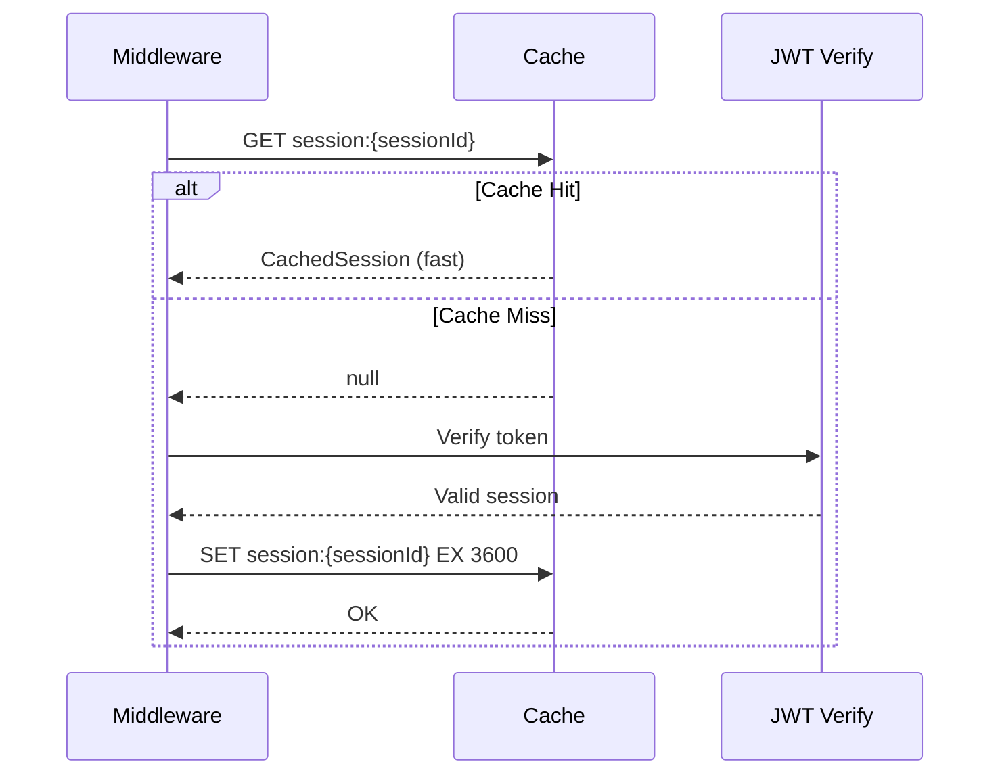
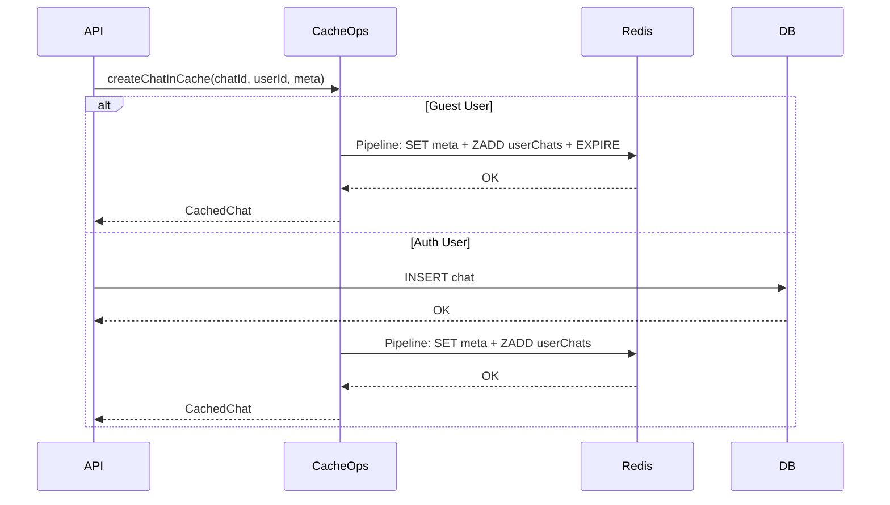
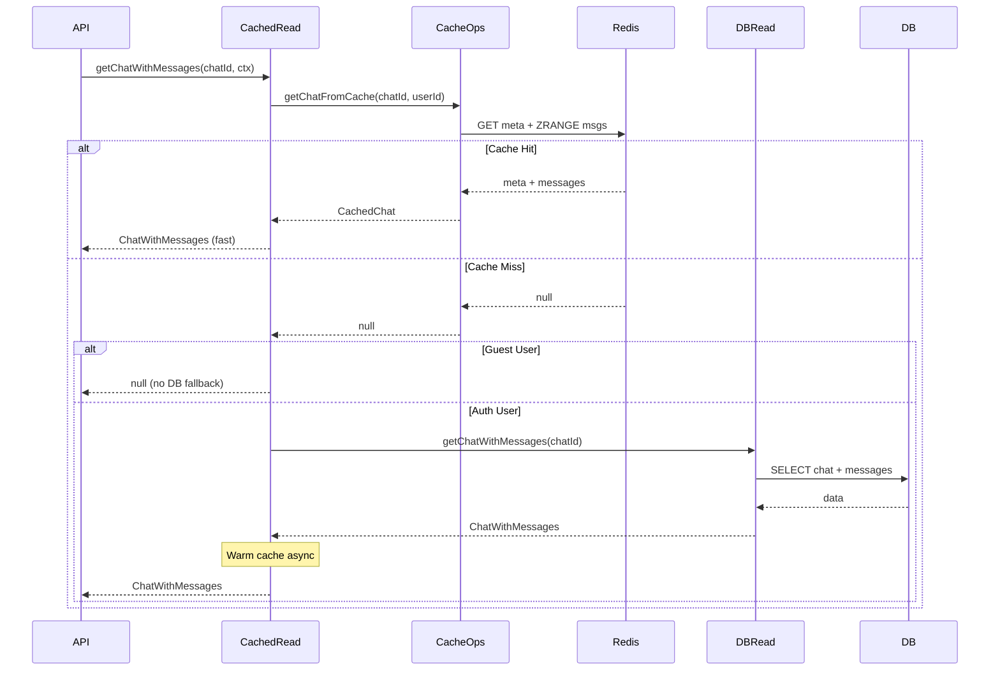
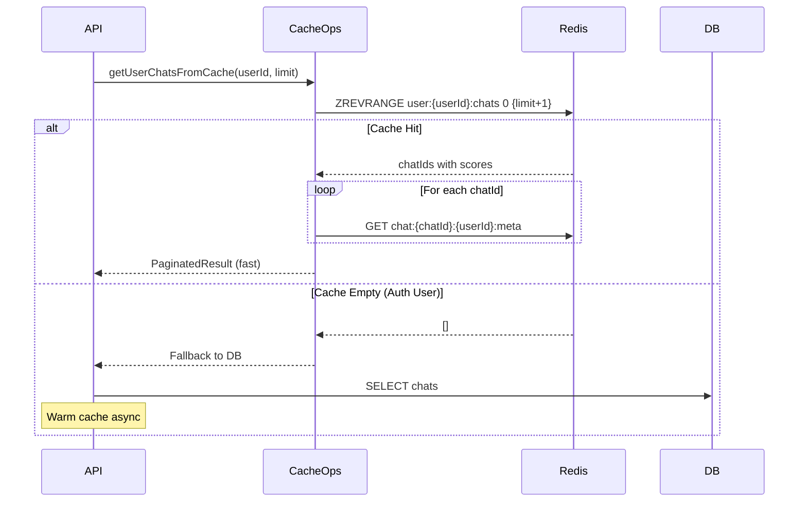
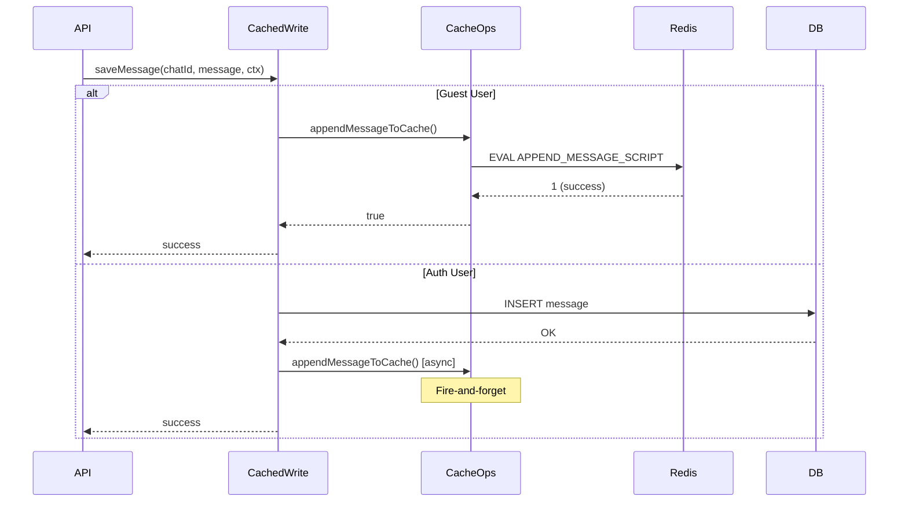
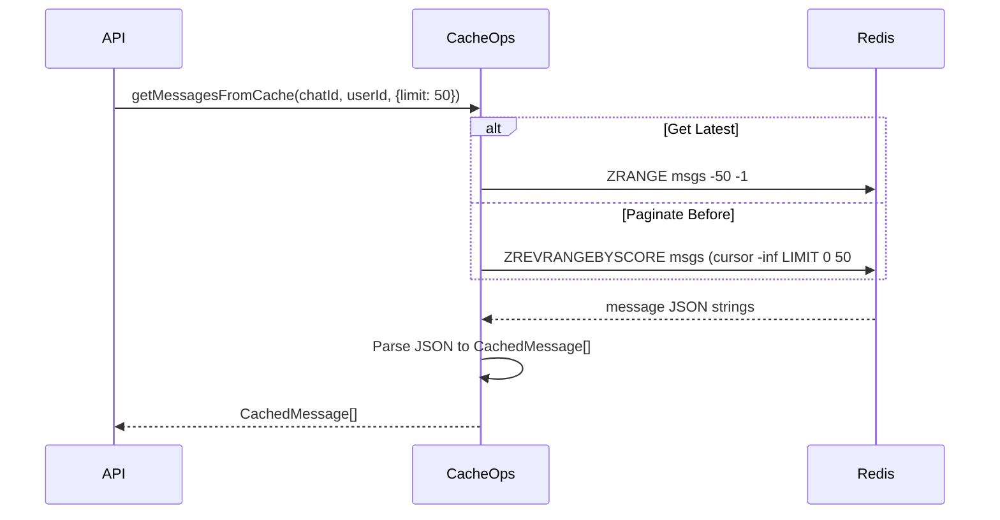
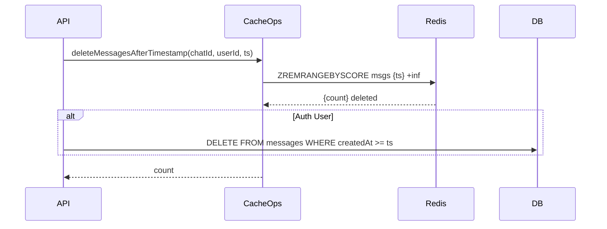
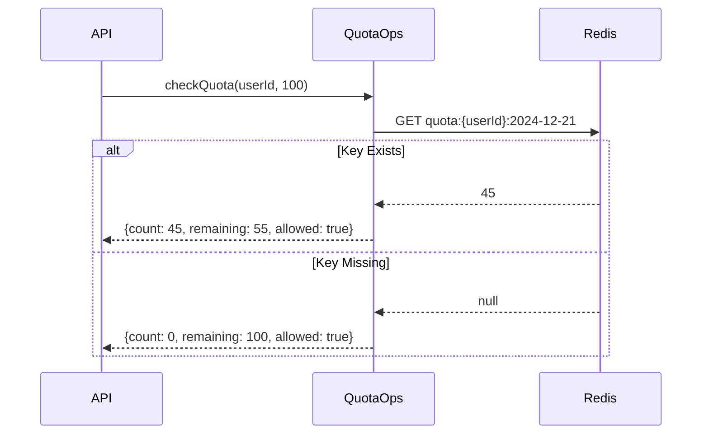

# Cache Operations Specification

> **Module**: Complete Cache Operations Reference  
> **Priority**: P0 - Critical  
> **Status**: SPECIFICATION  
> **Author**: Ouroboros Architect  
> **Date**: 2024-12-21  
> **Depends On**: 04-cache-layer-optimal-design.md, cache-data-integration/design.md

---

## 1. Executive Summary

This document provides a **complete specification** of all cache operations for the chat application. It serves as the authoritative reference for implementation, covering:

- All cache operations by domain
- Redis commands and Lua scripts
- Flow diagrams for each use case
- Key patterns and TTL configurations
- Error handling strategies
- **Bundling patterns and optimizations** (Section 6)
- **Performance benchmarks** (Section 10)
- **DB + Cache coordination** (Section 9)

### Document Structure

| Section | Content                                |
| ------- | -------------------------------------- |
| 2       | Key Patterns Reference                 |
| 3       | TTL Configuration                      |
| 4       | Cache Operations by Domain             |
| 5       | Lua Scripts Reference                  |
| **6**   | **Bundling Patterns & Optimizations**  |
| **7**   | **Round-Trip Savings Analysis**        |
| **8**   | **Additional Optimization Techniques** |
| **9**   | **DB + Cache Coordination Patterns**   |
| **10**  | **Performance Benchmarks**             |
| **11**  | **Optimization Decision Matrix**       |
| 12      | Error Handling                         |
| 13      | Complete Type Definitions              |
| 14      | File Structure                         |
| 15      | Operations Quick Reference             |

---

## 2. Key Patterns Reference

### 2.1 Key Naming Convention

**Pattern**: `{entity}:{entityId}:{userId}:{subtype}`

```typescript
export const CacheKeys = {
  // ═══════════════════════════════════════════════════════════════
  // CHAT KEYS (namespaced by userId for IDOR protection)
  // ═══════════════════════════════════════════════════════════════

  /** Chat metadata: chat:{chatId}:{userId}:meta */
  chatMeta: (chatId: string, userId: string) => `chat:${chatId}:${userId}:meta`,

  /** Chat messages ZSET: chat:{chatId}:{userId}:msgs */
  chatMessages: (chatId: string, userId: string) =>
    `chat:${chatId}:${userId}:msgs`,

  // ═══════════════════════════════════════════════════════════════
  // USER KEYS (user-level aggregations)
  // ═══════════════════════════════════════════════════════════════

  /** User's chat list ZSET: user:{userId}:chats */
  userChats: (userId: string) => `user:${userId}:chats`,

  /** User session: session:{sessionId} */
  session: (sessionId: string) => `session:${sessionId}`,

  // ═══════════════════════════════════════════════════════════════
  // DOCUMENT KEYS (ZSET Hybrid Pattern - ADR-002)
  // ═══════════════════════════════════════════════════════════════

  /** Document metadata: doc:{userId}:{docId}:meta */
  documentMeta: (userId: string, documentId: string) =>
    `doc:${userId}:${documentId}:meta`,

  /** Document versions ZSET: doc:{userId}:{docId}:versions (score = timestamp) */
  documentVersions: (userId: string, documentId: string) =>
    `doc:${userId}:${documentId}:versions`,

  /** User's document list: user:{userId}:docs */
  userDocuments: (userId: string) => `user:${userId}:docs`,

  // ═══════════════════════════════════════════════════════════════
  // QUOTA KEYS (hash tag for cluster co-location)
  // ═══════════════════════════════════════════════════════════════

  /** Daily quota: quota:{userId}:YYYY-MM-DD */
  quota: (userId: string, date: string) => `quota:{${userId}}:${date}`,

  /** Hourly quota: quota:{userId}:hour:YYYY-MM-DD-HH */
  quotaHourly: (userId: string, dateHour: string) =>
    `quota:{${userId}}:hour:${dateHour}`,

  // ═══════════════════════════════════════════════════════════════
  // REAL-TIME KEYS (ephemeral)
  // ═══════════════════════════════════════════════════════════════

  /** Typing indicator: typing:{chatId}:{userId} */
  typing: (chatId: string, userId: string) => `typing:${chatId}:${userId}`,

  /** User online status: online:{userId} */
  online: (userId: string) => `online:${userId}`,

  /** Active users in chat: chat:{chatId}:active */
  chatActiveUsers: (chatId: string) => `chat:${chatId}:active`,
} as const;
```

### 2.2 Helper Functions

```typescript
/** Get all keys for a chat operation */
export function getChatCacheKeys(chatId: string, userId: string) {
  return {
    metaKey: CacheKeys.chatMeta(chatId, userId),
    msgsKey: CacheKeys.chatMessages(chatId, userId),
    userChatsKey: CacheKeys.userChats(userId),
  };
}

/** Parse entity ID from cache key */
export function parseKeyId(key: string, prefix: string): string | null {
  if (!key.startsWith(prefix)) return null;
  const parts = key.slice(prefix.length).split(":");
  return parts[0] || null;
}

/** Get current date key for quota */
export function getQuotaDateKey(): string {
  return new Date().toISOString().slice(0, 10); // YYYY-MM-DD
}

/** Get current hour key for hourly quota */
export function getQuotaHourKey(): string {
  const now = new Date();
  return `${now.toISOString().slice(0, 10)}-${String(now.getHours()).padStart(
    2,
    "0"
  )}`;
}
```

---

## 3. TTL Configuration

### 3.1 TTL Constants

```typescript
// lib/cache/constants.ts
export const TTL = {
  // ═══════════════════════════════════════════════════════════════
  // GUEST USER TTLs (Auto-cleanup)
  // ═══════════════════════════════════════════════════════════════

  /** Guest chat/message data: 7 days */
  GUEST_DATA: 7 * 24 * 60 * 60, // 604,800 seconds

  /** Guest quota counter: 25 hours (timezone buffer) */
  GUEST_QUOTA: 25 * 60 * 60, // 90,000 seconds

  // ═══════════════════════════════════════════════════════════════
  // AUTHENTICATED USER TTLs (CRT-002: Prevent unbounded memory growth)
  // ═══════════════════════════════════════════════════════════════

  /** Auth chat data: 30 days (prevents unbounded growth while allowing reuse) */
  AUTH_CHAT_DATA: 30 * 24 * 60 * 60, // 2,592,000 seconds

  /** Auth session: 24 hours (security - force re-authentication) */
  AUTH_SESSION: 24 * 60 * 60, // 86,400 seconds

  /** Active chat cache (hot data): 24 hours */
  AUTH_CHAT_ACTIVE: 24 * 60 * 60, // 86,400 seconds

  /** Inactive chat cache: 4 hours */
  AUTH_CHAT_INACTIVE: 4 * 60 * 60, // 14,400 seconds

  /** Document cache: 30 days (same as chat data) */
  DOCUMENT: 30 * 24 * 60 * 60, // 2,592,000 seconds

  /** User chat list: 30 days (same as chat data) */
  USER_CHAT_LIST: 30 * 24 * 60 * 60, // 2,592,000 seconds

  // ═══════════════════════════════════════════════════════════════
  // REAL-TIME TTLs (Short-lived)
  // ═══════════════════════════════════════════════════════════════

  /** Typing indicator: 5 seconds */
  TYPING_INDICATOR: 5, // 5 seconds

  /** Online status: 60 seconds */
  ONLINE_STATUS: 60, // 60 seconds

  /** Active users in chat: 30 seconds */
  CHAT_ACTIVE_USERS: 30, // 30 seconds

  // ═══════════════════════════════════════════════════════════════
  // SESSION TTLs
  // ═══════════════════════════════════════════════════════════════

  /** Session cache: 1 hour */
  SESSION: 60 * 60, // 3,600 seconds
} as const;
```

### 3.2 TTL Strategy Matrix

> **CRITICAL (CRT-002)**: All cached data MUST have TTLs to prevent unbounded memory growth.

#### 3.2.1 TTL by User Type

| User Type     | Entity    | TTL      | Rationale                           |
| ------------- | --------- | -------- | ----------------------------------- |
| Guest         | All data  | 7 days   | Auto-cleanup, matches guest session |
| Authenticated | Chat data | 30 days  | Prevent unbounded growth            |
| Authenticated | Session   | 24 hours | Security - force re-authentication  |
| All           | Quota     | 25 hours | Daily reset + timezone buffer       |

#### 3.2.2 TTL by Entity

| Entity           | Guest TTL | Auth TTL | Rationale                                  |
| ---------------- | --------- | -------- | ------------------------------------------ |
| Chat Metadata    | 7 days    | 30 days  | Guest matches session, auth allows refresh |
| Chat Messages    | 7 days    | 30 days  | Same as metadata                           |
| User Chat List   | 7 days    | 30 days  | Pagination ordering                        |
| Documents        | 7 days    | 30 days  | Versioned content, prevent bloat           |
| Session          | 7 days    | 24 hours | Security - shorter for authenticated       |
| Quota Counter    | 25 hours  | 25 hours | Daily reset with TZ buffer                 |
| Typing Indicator | 5 sec     | 5 sec    | Ephemeral                                  |
| Online Status    | 60 sec    | 60 sec   | Heartbeat refresh                          |

---

## 4. Cache Operations by Domain

---

### 4.1 AUTHENTICATION OPERATIONS

#### 4.1.1 Session Cache (Get)

```typescript
/**
 * Get cached session
 *
 * @param sessionId - Session identifier (JWT jti or cookie ID)
 * @returns Cached session or null
 */
export async function getSessionFromCache(
  sessionId: string
): Promise<CachedSession | null>;
```

**Redis Commands:**

```redis
GET session:{sessionId}
```

**Flow:**



**Return Type:**

```typescript
type CachedSession = {
  userId: string;
  type: "guest" | "regular";
  email?: string;
  expiresAt: number;
};
```

**Error Handling:**

- Cache miss → JWT verification fallback
- Redis error → Circuit breaker, proceed without cache

---

#### 4.1.2 Session Cache (Set)

```typescript
/**
 * Cache session after validation
 *
 * @param sessionId - Session identifier
 * @param session - Session data to cache
 */
export async function setSessionInCache(
  sessionId: string,
  session: CachedSession
): Promise<void>;
```

**Redis Commands:**

```redis
SET session:{sessionId} {json} EX 3600
```

---

#### 4.1.3 Session Cache (Delete)

```typescript
/**
 * Invalidate session on logout
 *
 * @param sessionId - Session to invalidate
 */
export async function deleteSessionFromCache(sessionId: string): Promise<void>;
```

**Redis Commands:**

```redis
DEL session:{sessionId}
```

---

#### 4.1.4 Guest User Check

```typescript
/**
 * Check if userId is a guest
 * Guest IDs start with "guest:" or don't contain hyphens (nanoid)
 */
export function isGuestUserId(userId: string): boolean {
  return userId.startsWith("guest:") || !userId.includes("-");
}
```

---

### 4.2 CHAT OPERATIONS

#### 4.2.1 Create New Chat

```typescript
/**
 * Create new chat in cache
 *
 * @param chatId - New chat UUID
 * @param userId - Owner user ID
 * @param meta - Chat metadata
 * @returns Created chat
 */
export async function createChatInCache(
  chatId: string,
  userId: string,
  meta: NewChatMeta
): Promise<CachedChat>;
```

**Redis Commands (Pipeline):**

```redis
SET chat:{chatId}:{userId}:meta {metaJson}
ZADD user:{userId}:chats {timestamp} {chatId}
[If guest] EXPIRE chat:{chatId}:{userId}:meta 604800
[If guest] EXPIRE user:{userId}:chats 604800
```

**Flow:**



**Input Type:**

```typescript
type NewChatMeta = {
  title: string;
  visibility?: "public" | "private";
};
```

**Return Type:**

```typescript
type CachedChat = {
  id: string;
  userId: string;
  title: string;
  visibility: "public" | "private";
  createdAt: number; // Unix timestamp ms
  updatedAt: number;
  version: number;
  messages: CachedMessage[];
};
```

---

#### 4.2.2 Load Existing Chat

```typescript
/**
 * Get chat with messages from cache
 *
 * @param chatId - Chat UUID
 * @param userId - User ID (for IDOR protection)
 * @param opts.maxMessages - Limit messages returned
 * @returns Cached chat or null
 */
export async function getChatFromCache(
  chatId: string,
  userId: string,
  opts?: { maxMessages?: number }
): Promise<CachedChat | null>;
```

**Redis Commands (Parallel):**

```redis
GET chat:{chatId}:{userId}:meta
ZRANGE chat:{chatId}:{userId}:msgs 0 -1
# OR with limit:
ZRANGE chat:{chatId}:{userId}:msgs -{maxMessages} -1
```

**Flow:**



**Error Handling:**

```typescript
return withCircuitBreaker("getChatFromCache", null, async () => {
  // ... operation
});
```

---

#### 4.2.3 List User's Chats

```typescript
/**
 * Get user's chat list from cache
 *
 * @param userId - User ID
 * @param limit - Max chats to return
 * @param cursor - Pagination cursor (timestamp)
 * @returns Paginated chat list
 */
export async function getUserChatsFromCache(
  userId: string,
  limit: number = 20,
  cursor?: number
): Promise<PaginatedResult<CachedUserChatItem>>;
```

**Redis Commands:**

```redis
# Without cursor (latest):
ZREVRANGE user:{userId}:chats 0 {limit} WITHSCORES

# With cursor (pagination):
ZREVRANGEBYSCORE user:{userId}:chats ({cursor} -inf LIMIT 0 {limit} WITHSCORES
```

**Return Type:**

```typescript
type CachedUserChatItem = {
  chatId: string;
  title: string;
  updatedAt: number;
};

type PaginatedResult<T> = {
  items: T[];
  hasMore: boolean;
  nextCursor?: string;
};
```

**Flow:**



---

#### 4.2.4 Delete Chat

```typescript
/**
 * Delete chat from cache
 *
 * @param chatId - Chat to delete
 * @param userId - Owner user ID
 */
export async function deleteChatFromCache(
  chatId: string,
  userId: string
): Promise<void>;
```

**Redis Commands (Pipeline):**

```redis
DEL chat:{chatId}:{userId}:meta
DEL chat:{chatId}:{userId}:msgs
ZREM user:{userId}:chats {chatId}
```

**Lua Script (Atomic):**

```lua
-- DELETE_CHAT_SCRIPT
local metaKey = KEYS[1]
local msgsKey = KEYS[2]
local userChatsKey = KEYS[3]
local chatId = ARGV[1]

redis.call('DEL', metaKey)
redis.call('DEL', msgsKey)
redis.call('ZREM', userChatsKey, chatId)

return 1
```

---

#### 4.2.5 Update Chat Title

```typescript
/**
 * Update chat title in cache
 *
 * @param chatId - Chat UUID
 * @param userId - Owner user ID
 * @param title - New title
 */
export async function updateChatTitleInCache(
  chatId: string,
  userId: string,
  title: string
): Promise<void>;
```

**Lua Script (Atomic Update):**

```lua
-- UPDATE_METADATA_SCRIPT
local meta = redis.call('GET', KEYS[1])
if not meta then return nil end

local data = cjson.decode(meta)
local updates = cjson.decode(ARGV[1])

for k, v in pairs(updates) do
  data[k] = v
end
data.updatedAt = ARGV[2]
data.version = (data.version or 0) + 1

redis.call('SET', KEYS[1], cjson.encode(data))
return cjson.encode(data)
```

**Redis Commands:**

```redis
EVAL {UPDATE_METADATA_SCRIPT} 1 chat:{chatId}:{userId}:meta '{"title":"New Title"}' {now}
```

---

#### 4.2.6 Update Chat Visibility

```typescript
/**
 * Update chat visibility in cache
 *
 * @param chatId - Chat UUID
 * @param userId - Owner user ID
 * @param visibility - "public" | "private"
 */
export async function updateChatVisibilityInCache(
  chatId: string,
  userId: string,
  visibility: "public" | "private"
): Promise<void>;
```

**Redis Commands:**

```redis
EVAL {UPDATE_METADATA_SCRIPT} 1 chat:{chatId}:{userId}:meta '{"visibility":"public"}' {now}
```

---

### 4.3 MESSAGE OPERATIONS

#### 4.3.1 Send Message (Append)

```typescript
/**
 * Append single message to cache
 *
 * @param chatId - Chat UUID
 * @param userId - User ID
 * @param message - Message to append
 * @returns Success boolean
 */
export async function appendMessageToCache(
  chatId: string,
  userId: string,
  message: CachedMessage
): Promise<boolean>;
```

**Lua Script (Atomic Append):**

```lua
-- APPEND_MESSAGE_SCRIPT
-- Keys: [metaKey, msgsKey, userChatsKey]
-- Args: [messageJson, now, userChatsScore, chatId, msgScore, ttl]

local metaKey = KEYS[1]
local msgsKey = KEYS[2]
local userChatsKey = KEYS[3]

-- Verify chat exists
local meta = redis.call('GET', metaKey)
if not meta then return 0 end

-- Add message to ZSET with timestamp score
redis.call('ZADD', msgsKey, tonumber(ARGV[5]), ARGV[1])

-- Update metadata timestamp and version
local data = cjson.decode(meta)
data.updatedAt = ARGV[2]
data.version = (data.version or 0) + 1
redis.call('SET', metaKey, cjson.encode(data))

-- Update user's chat list ordering
redis.call('ZADD', userChatsKey, tonumber(ARGV[3]), ARGV[4])

-- Apply TTL for guest users
local ttl = tonumber(ARGV[6])
if ttl > 0 then
  redis.call('EXPIRE', metaKey, ttl)
  redis.call('EXPIRE', msgsKey, ttl)
  redis.call('EXPIRE', userChatsKey, ttl)
end

return 1
```

**Flow:**



**Input Type:**

```typescript
type CachedMessage = {
  id: string;
  chatId: string;
  role: "user" | "assistant" | "system";
  parts: MessagePart[];
  attachments?: Attachment[];
  createdAt: number; // Unix timestamp ms
};
```

**Message Score Calculation:**

See [ZSET Score Calculation with Role Offset](#zset-score-calculation-with-role-offset) below for detailed documentation.

---

#### ZSET Score Calculation with Role Offset

To maintain deterministic ordering when messages share the same timestamp (e.g., user message and AI response in same millisecond), we add sub-millisecond offsets based on role:

**Role Order Constants:**

```typescript
export const ROLE_ORDER = {
  system: 0,
  user: 1,
  assistant: 2,
} as const;
```

**Score Calculation:**

```typescript
/**
 * Calculate ZSET score for message ordering
 * Combines timestamp with microsecond role offset for deterministic ordering
 *
 * @param createdAt - Message creation timestamp
 * @param role - Message role (system, user, assistant)
 * @returns Score with sub-millisecond precision
 */
export function getZScoreWithRoleOffset(createdAt: Date, role: string): number {
  const baseScore = createdAt.getTime();
  // Add microsecond offset: system=0, user=100, assistant=200
  const roleOffset = (ROLE_ORDER[role as keyof typeof ROLE_ORDER] ?? 1) * 100;
  return baseScore + roleOffset / 1_000_000;
}
```

**Offset Values:**

| Role      | Order | Offset (µs) | Example Score      |
| --------- | ----- | ----------- | ------------------ |
| system    | 0     | 0           | 1703174400000.0000 |
| user      | 1     | 100         | 1703174400000.0001 |
| assistant | 2     | 200         | 1703174400000.0002 |

**Why This Matters:**

When user sends message and assistant responds in same millisecond, without offset the ZSET ordering would be non-deterministic. The microsecond offset ensures `system < user < assistant` ordering for same-timestamp messages.

**Example Scenario:**

```typescript
// User sends message at exactly 1703174400000ms
const userScore = getZScoreWithRoleOffset(new Date(1703174400000), "user");
// userScore = 1703174400000.0001

// Assistant responds in same millisecond
const assistantScore = getZScoreWithRoleOffset(
  new Date(1703174400000),
  "assistant"
);
// assistantScore = 1703174400000.0002

// ZSET ordering: user message appears before assistant response ✓
```

---

#### 4.3.2 Load Messages (Paginated)

```typescript
/**
 * Get messages from cache with pagination
 *
 * @param chatId - Chat UUID
 * @param userId - User ID
 * @param opts.limit - Messages to return
 * @param opts.before - Timestamp cursor for pagination
 * @returns Messages array
 */
export async function getMessagesFromCache(
  chatId: string,
  userId: string,
  opts?: { limit?: number; before?: number }
): Promise<CachedMessage[]>;
```

**Redis Commands:**

```redis
# Latest N messages:
ZRANGE chat:{chatId}:{userId}:msgs -{limit} -1

# Before timestamp (pagination):
ZREVRANGEBYSCORE chat:{chatId}:{userId}:msgs ({before} -inf LIMIT 0 {limit}

# Count messages:
ZCARD chat:{chatId}:{userId}:msgs
```

**Flow:**



---

#### 4.3.3 Branch Conversation (Fork)

```typescript
/**
 * Fork conversation from a specific message
 * Creates new chat with messages up to fork point
 *
 * @param sourceChatId - Original chat
 * @param newChatId - New forked chat ID
 * @param userId - User ID
 * @param forkTimestamp - Fork point (message timestamp)
 * @returns New cached chat
 */
export async function forkChatInCache(
  sourceChatId: string,
  newChatId: string,
  userId: string,
  forkTimestamp: number
): Promise<CachedChat | null>;
```

**Lua Script (Atomic Fork):**

```lua
-- FORK_CHAT_SCRIPT
-- Keys: [srcMetaKey, srcMsgsKey, newMetaKey, newMsgsKey, userChatsKey]
-- Args: [newChatId, forkTimestamp, now, ttl]

local srcMeta = redis.call('GET', KEYS[1])
if not srcMeta then return nil end

-- Get messages up to fork point
local messages = redis.call('ZRANGEBYSCORE', KEYS[2], '-inf', ARGV[2])

-- Create new metadata (copy with new ID)
local data = cjson.decode(srcMeta)
data.id = ARGV[1]
data.title = data.title .. " (Fork)"
data.createdAt = ARGV[3]
data.updatedAt = ARGV[3]
data.version = 1
redis.call('SET', KEYS[3], cjson.encode(data))

-- Copy messages to new chat
for i, msg in ipairs(messages) do
  local msgData = cjson.decode(msg)
  local score = msgData.createdAt
  msgData.chatId = ARGV[1]
  redis.call('ZADD', KEYS[4], score, cjson.encode(msgData))
end

-- Add to user's chat list
redis.call('ZADD', KEYS[5], tonumber(ARGV[3]), ARGV[1])

-- Apply TTL if guest
local ttl = tonumber(ARGV[4])
if ttl > 0 then
  redis.call('EXPIRE', KEYS[3], ttl)
  redis.call('EXPIRE', KEYS[4], ttl)
end

return cjson.encode(data)
```

---

#### 4.3.4 Delete Messages After Point

```typescript
/**
 * Delete messages after timestamp (for regeneration)
 *
 * @param chatId - Chat UUID
 * @param userId - User ID
 * @param timestamp - Delete messages >= this timestamp
 * @returns Number of deleted messages
 */
export async function deleteMessagesAfterTimestamp(
  chatId: string,
  userId: string,
  timestamp: Date | number
): Promise<number>;
```

**Redis Commands:**

```redis
# O(log N + M) deletion - much faster than iterating
ZREMRANGEBYSCORE chat:{chatId}:{userId}:msgs {timestamp} +inf
```

**Flow:**



**Error Handling:**

```typescript
return withCircuitBreaker("deleteMessagesAfterTimestamp", 0, async () => {
  const { msgsKey } = getChatCacheKeys(chatId, userId);
  const timestampMs =
    typeof timestamp === "number" ? timestamp : timestamp.getTime();

  const deleted = await redis.zremrangebyscore(msgsKey, timestampMs, "+inf");
  return typeof deleted === "number" ? deleted : 0;
});
```

---

### 4.4 DOCUMENT OPERATIONS (ZSET Hybrid Pattern)

> **Architecture Decision (CRT-001 CLARIFICATION)**: Documents use a **ZSET Hybrid** pattern.
>
> - **Document Metadata**: STRING at `doc:{userId}:{docId}:meta`
> - **Document Versions**: ZSET at `doc:{userId}:{docId}:versions` (score = timestamp)
>
> This separates metadata from version content, enabling O(1) latest version access
> and O(log N) version management. See ADR-002 in `design.md §3.2`.

#### 4.4.0 Document Operations Summary

| Operation          | Keys | Command                           | Complexity   |
| ------------------ | ---- | --------------------------------- | ------------ |
| Get latest version | 2    | MGET meta + ZRANGE versions -1 -1 | O(1) + O(1)  |
| Get all versions   | 2    | MGET meta + ZRANGE versions 0 -1  | O(1) + O(N)  |
| Append version     | 1    | ZADD versions {ts} {json}         | O(log N)     |
| Prune old versions | 1    | ZREMRANGEBYRANK versions 0 -11    | O(log N + M) |

**Bandwidth Savings**: ZSET hybrid eliminates re-serializing entire document JSON on each
version append. For a document with 50 versions (~500KB total), appending a new version
transfers only the new version (~10KB) vs entire document.

---

#### 4.4.1 Create Document

```typescript
/**
 * Create document in cache with ZSET hybrid pattern
 *
 * @param documentId - Document UUID
 * @param userId - Owner user ID
 * @param doc - Document metadata with initial version
 */
export async function createDocumentInCache(
  documentId: string,
  userId: string,
  doc: NewCachedDocument
): Promise<void>;
```

**Redis Commands (Pipeline):**

```redis
SET doc:{userId}:{documentId}:meta {metaJson}
ZADD doc:{userId}:{documentId}:versions {timestamp} {versionJson}
ZADD user:{userId}:docs {timestamp} {documentId}
[If guest] EXPIRE doc:{userId}:{documentId}:meta 604800
[If guest] EXPIRE doc:{userId}:{documentId}:versions 604800
```

**Input Type:**

```typescript
type NewCachedDocument = {
  id: string;
  chatId?: string;
  kind: "text" | "code" | "image" | "sheet";
  initialVersion: {
    title: string;
    content: string | null;
    createdAt: number;
  };
};

type CachedDocumentMeta = {
  id: string;
  userId: string;
  chatId?: string;
  kind: "text" | "code" | "image" | "sheet";
  createdAt: number;
  updatedAt: number;
};
```

---

#### 4.4.2 Update Document (Append Version)

```typescript
/**
 * Append new version to document using ZSET
 * O(log N) complexity - much more efficient than JSON array append
 *
 * @param documentId - Document UUID
 * @param userId - User ID
 * @param version - New version to append
 */
export async function appendDocumentVersionToCache(
  documentId: string,
  userId: string,
  version: CachedDocumentVersion
): Promise<void>;
```

**Lua Script (Atomic Version Append):**

```lua
-- APPEND_DOCUMENT_VERSION_ZSET_SCRIPT
-- Keys: [metaKey, versionsKey, userDocsKey]
-- Args: [versionJson, timestamp, docId, ttl]

local metaKey = KEYS[1]
local versionsKey = KEYS[2]
local userDocsKey = KEYS[3]

local meta = redis.call('GET', metaKey)
if not meta then return 0 end

-- Append version to ZSET (O(log N))
local timestamp = tonumber(ARGV[2])
redis.call('ZADD', versionsKey, timestamp, ARGV[1])

-- Update metadata timestamp
local data = cjson.decode(meta)
data.updatedAt = timestamp
redis.call('SET', metaKey, cjson.encode(data))

-- Update user docs ordering
redis.call('ZADD', userDocsKey, timestamp, ARGV[3])

-- Apply TTL for guests
local ttl = tonumber(ARGV[4])
if ttl > 0 then
  redis.call('EXPIRE', metaKey, ttl)
  redis.call('EXPIRE', versionsKey, ttl)
end

return 1
```

**Performance Note**: This script only writes the new version (~10KB) instead of
rewriting the entire document. For documents with many versions, this saves
significant bandwidth.

---

#### 4.4.3 Load Document (Latest Version)

```typescript
/**
 * Get document with latest version from cache
 * O(1) complexity for common case
 *
 * @param documentId - Document UUID
 * @param userId - User ID
 * @returns Cached document with latest version or null
 */
export async function getDocumentLatestFromCache(
  documentId: string,
  userId: string
): Promise<CachedDocumentWithVersion | null>;
```

**Redis Commands (Parallel):**

```redis
GET doc:{userId}:{documentId}:meta
ZRANGE doc:{userId}:{documentId}:versions -1 -1
```

**Return Type:**

```typescript
type CachedDocumentWithVersion = {
  meta: CachedDocumentMeta;
  version: CachedDocumentVersion;
};

type CachedDocumentVersion = {
  title: string;
  content: string | null;
  createdAt: number;
};
```

---

#### 4.4.4 Load Document (All Versions)

```typescript
/**
 * Get document with all versions from cache
 *
 * @param documentId - Document UUID
 * @param userId - User ID
 * @returns Cached document with all versions or null
 */
export async function getDocumentAllVersionsFromCache(
  documentId: string,
  userId: string
): Promise<CachedDocumentFull | null>;
```

**Redis Commands (Parallel):**

```redis
GET doc:{userId}:{documentId}:meta
ZRANGE doc:{userId}:{documentId}:versions 0 -1
```

**Return Type:**

```typescript
type CachedDocumentFull = {
  meta: CachedDocumentMeta;
  versions: CachedDocumentVersion[];
};
```

---

#### 4.4.5 List User's Documents

```typescript
/**
 * List user's documents from cache
 *
 * @param userId - User ID
 * @param limit - Max documents to return
 * @returns Document list items
 */
export async function getUserDocumentsFromCache(
  userId: string,
  limit: number = 20
): Promise<CachedDocumentItem[]>;
```

**Redis Commands:**

```redis
ZREVRANGE user:{userId}:docs 0 {limit-1}
# Then for each docId (pipelined):
GET doc:{userId}:{docId}:meta
```

---

#### 4.4.6 Delete Document Versions After Timestamp

```typescript
/**
 * Delete document versions after timestamp using ZSET
 * O(log N + M) complexity - much faster than JSON array iteration
 *
 * @param documentId - Document UUID
 * @param userId - User ID
 * @param timestamp - Delete versions >= this timestamp
 * @returns Number of deleted versions
 */
export async function deleteDocumentVersionsAfterTimestamp(
  documentId: string,
  userId: string,
  timestamp: number
): Promise<number>;
```

**Redis Commands:**

```redis
ZREMRANGEBYSCORE doc:{userId}:{documentId}:versions {timestamp} +inf
```

---

#### 4.4.7 Prune Old Document Versions

```typescript
/**
 * Keep only the latest N versions, prune older ones
 * Useful for storage management
 *
 * @param documentId - Document UUID
 * @param userId - User ID
 * @param keepCount - Number of versions to keep (default: 10)
 * @returns Number of pruned versions
 */
export async function pruneDocumentVersions(
  documentId: string,
  userId: string,
  keepCount: number = 10
): Promise<number>;
```

**Redis Commands:**

```redis
# Keep last 10, remove all before
ZREMRANGEBYRANK doc:{userId}:{documentId}:versions 0 -{keepCount + 1}
```

**Example**: To keep last 10 versions:

```redis
ZREMRANGEBYRANK doc:user123:doc456:versions 0 -11
```

---

### 4.5 RATE LIMITING OPERATIONS

#### 4.5.1 Check Quota Before AI Call

```typescript
/**
 * Check if user has remaining quota
 *
 * @param userId - User ID
 * @param limit - Max allowed messages
 * @returns Current count and remaining
 */
export async function checkQuota(
  userId: string,
  limit: number
): Promise<{ count: number; remaining: number; allowed: boolean }>;
```

**Redis Commands:**

```redis
GET quota:{userId}:YYYY-MM-DD
```

**Flow:**



---

#### 4.5.2 Increment Quota After AI Call

```typescript
/**
 * Increment user's message count atomically
 *
 * @param userId - User ID
 * @param delta - Amount to increment (default: 1)
 * @returns New count
 */
export async function incrementUserMessageCount(
  userId: string,
  delta: number = 1
): Promise<number>;
```

**Lua Script (Atomic Increment with TTL):**

```lua
-- INCREMENT_QUOTA_SCRIPT
-- Keys: [quotaKey]
-- Args: [delta, ttl]

local key = KEYS[1]
local delta = tonumber(ARGV[1])
local ttl = tonumber(ARGV[2])

local newCount = redis.call('INCRBY', key, delta)

-- Set expiration on first increment (when count equals delta)
if newCount == delta then
  redis.call('EXPIRE', key, ttl)
end

return newCount
```

**Redis Commands:**

```redis
EVAL {INCREMENT_QUOTA_SCRIPT} 1 quota:{userId}:YYYY-MM-DD 1 90000
```

---

#### 4.5.3 Check Hourly Limit

```typescript
/**
 * Check hourly rate limit (burst protection)
 *
 * @param userId - User ID
 * @param hourlyLimit - Max per hour
 */
export async function checkHourlyLimit(
  userId: string,
  hourlyLimit: number
): Promise<{ allowed: boolean; retryAfter?: number }>;
```

**Redis Commands:**

```redis
GET quota:{userId}:hour:YYYY-MM-DD-HH
```

---

#### 4.5.4 Reset Quota (Admin)

```typescript
/**
 * Reset user's quota (admin operation)
 *
 * @param userId - User ID
 */
export async function resetUserQuota(userId: string): Promise<void>;
```

**Redis Commands:**

```redis
DEL quota:{userId}:YYYY-MM-DD
DEL quota:{userId}:hour:*
```

---

### 4.6 REAL-TIME OPERATIONS

#### 4.6.0 Typing Indicator Pattern Options

> **Current Implementation**: Individual SET keys with TTL (simple, works for most cases)
>
> **Recommended Upgrade (ADR-003)**: ZSET with timestamp scores for per-user expiry management

| Pattern       | Pros                                  | Cons                             | Use When                          |
| ------------- | ------------------------------------- | -------------------------------- | --------------------------------- |
| SET per user  | Simple, auto-expiry                   | All expire together, SCAN needed | Single chat, few users            |
| ZSET per chat | Per-user expiry control, atomic reads | Manual cleanup needed            | Multi-user chats, precise control |

---

#### 4.6.1 Set Typing Indicator (Current: SET Pattern)

```typescript
/**
 * Set user typing indicator
 *
 * @param chatId - Chat UUID
 * @param userId - Typing user ID
 */
export async function setTypingIndicator(
  chatId: string,
  userId: string
): Promise<void>;
```

**Redis Commands (SET Pattern - Current):**

```redis
SET typing:{chatId}:{userId} 1 EX 5
```

---

#### 4.6.1b Set Typing Indicator (Alternative: ZSET Pattern)

```typescript
/**
 * Set user typing indicator using ZSET
 * Allows per-user expiry management and atomic reads
 *
 * @param chatId - Chat UUID
 * @param userId - Typing user ID
 */
export async function setTypingIndicatorZset(
  chatId: string,
  userId: string
): Promise<void>;
```

**Redis Commands (ZSET Pattern - Alternative):**

```redis
# Add/update user with current timestamp as score
ZADD typing:{chatId} {timestamp} {userId}

# Clean expired entries (older than 5 seconds)
ZREMRANGEBYSCORE typing:{chatId} -inf {timestamp - 5000}
```

**Lua Script (Atomic Set + Cleanup):**

```lua
-- SET_TYPING_ZSET_SCRIPT
-- Keys: [typingKey]
-- Args: [userId, now, expiryWindow]

local key = KEYS[1]
local userId = ARGV[1]
local now = tonumber(ARGV[2])
local expiryWindow = tonumber(ARGV[3]) -- 5000ms

-- Add/update this user
redis.call('ZADD', key, now, userId)

-- Clean expired entries
redis.call('ZREMRANGEBYSCORE', key, '-inf', now - expiryWindow)

-- Set key TTL for auto-cleanup if chat becomes inactive
redis.call('EXPIRE', key, 60)

return 1
```

---

#### 4.6.2 Get Typing Users (Current: SET Pattern)

```typescript
/**
 * Get users currently typing in a chat
 *
 * @param chatId - Chat UUID
 * @returns Array of typing user IDs
 */
export async function getTypingUsers(chatId: string): Promise<string[]>;
```

**Redis Commands (SET Pattern - requires SCAN):**

```redis
SCAN 0 MATCH typing:{chatId}:* COUNT 100
```

**Note:** SCAN is O(N) on keyspace. For high-traffic chats, consider ZSET pattern.

---

#### 4.6.2b Get Typing Users (Alternative: ZSET Pattern)

```typescript
/**
 * Get users currently typing using ZSET pattern
 * Returns only non-expired users in single O(log N + M) operation
 *
 * @param chatId - Chat UUID
 * @returns Array of typing user IDs
 */
export async function getTypingUsersZset(chatId: string): Promise<string[]>;
```

**Redis Commands (ZSET Pattern - O(log N + M)):**

```redis
# Get users with timestamp > (now - 5 seconds)
ZRANGEBYSCORE typing:{chatId} {now - 5000} +inf
```

---

#### 4.6.3 Set Online Status

```typescript
/**
 * Mark user as online (heartbeat)
 *
 * @param userId - User ID
 */
export async function setUserOnline(userId: string): Promise<void>;
```

**Redis Commands:**

```redis
SET online:{userId} 1 EX 60
```

---

#### 4.6.4 Get Online Status

```typescript
/**
 * Check if user is online
 *
 * @param userId - User ID
 * @returns Online status
 */
export async function isUserOnline(userId: string): Promise<boolean>;
```

**Redis Commands:**

```redis
EXISTS online:{userId}
```

---

#### 4.6.5 Track Active Users in Chat

```typescript
/**
 * Add user to chat's active users set
 *
 * @param chatId - Chat UUID
 * @param userId - User ID
 */
export async function addActiveChatUser(
  chatId: string,
  userId: string
): Promise<void>;
```

**Redis Commands:**

```redis
SADD chat:{chatId}:active {userId}
EXPIRE chat:{chatId}:active 30
```

---

#### 4.6.6 Get Active Users in Chat

```typescript
/**
 * Get all active users in a chat
 *
 * @param chatId - Chat UUID
 * @returns Array of active user IDs
 */
export async function getActiveChatUsers(chatId: string): Promise<string[]>;
```

**Redis Commands:**

```redis
SMEMBERS chat:{chatId}:active
```

---

## 5. Lua Scripts Reference

### 5.1 Complete Lua Scripts

```typescript
// lib/cache-ops/scripts.ts

/**
 * APPEND_MESSAGE_SCRIPT
 * Atomic message append with metadata update
 * Keys: [metaKey, msgsKey, userChatsKey]
 * Args: [messageJson, now, userChatsScore, chatId, msgScore, ttl]
 */
export const APPEND_MESSAGE_SCRIPT = `
local metaKey = KEYS[1]
local msgsKey = KEYS[2]
local userChatsKey = KEYS[3]

local meta = redis.call('GET', metaKey)
if not meta then return 0 end

redis.call('ZADD', msgsKey, tonumber(ARGV[5]), ARGV[1])

local data = cjson.decode(meta)
data.updatedAt = ARGV[2]
data.version = (data.version or 0) + 1
redis.call('SET', metaKey, cjson.encode(data))

redis.call('ZADD', userChatsKey, tonumber(ARGV[3]), ARGV[4])

local ttl = tonumber(ARGV[6])
if ttl > 0 then
  redis.call('EXPIRE', metaKey, ttl)
  redis.call('EXPIRE', msgsKey, ttl)
  redis.call('EXPIRE', userChatsKey, ttl)
end

return 1
`;

/**
 * APPEND_MESSAGES_SCRIPT (Batch)
 * Keys: [metaKey, msgsKey, userChatsKey]
 * Args: [now, userChatsScore, chatId, msgCount, ttl, score1, msg1, ...]
 */
export const APPEND_MESSAGES_SCRIPT = `
local metaKey = KEYS[1]
local msgsKey = KEYS[2]
local userChatsKey = KEYS[3]

local meta = redis.call('GET', metaKey)
if not meta then return 0 end

local msgCount = tonumber(ARGV[4])
for i = 6, 6 + (msgCount * 2) - 1, 2 do
  redis.call('ZADD', msgsKey, tonumber(ARGV[i]), ARGV[i + 1])
end

local data = cjson.decode(meta)
data.updatedAt = ARGV[1]
data.version = (data.version or 0) + 1
redis.call('SET', metaKey, cjson.encode(data))

redis.call('ZADD', userChatsKey, tonumber(ARGV[2]), ARGV[3])

local ttl = tonumber(ARGV[5])
if ttl > 0 then
  redis.call('EXPIRE', metaKey, ttl)
  redis.call('EXPIRE', msgsKey, ttl)
  redis.call('EXPIRE', userChatsKey, ttl)
end

return 1
`;

/**
 * UPDATE_METADATA_SCRIPT
 * Keys: [metaKey]
 * Args: [updatesJson, now]
 */
export const UPDATE_METADATA_SCRIPT = `
local meta = redis.call('GET', KEYS[1])
if not meta then return nil end

local data = cjson.decode(meta)
local updates = cjson.decode(ARGV[1])

for k, v in pairs(updates) do
  data[k] = v
end
data.updatedAt = ARGV[2]
data.version = (data.version or 0) + 1

redis.call('SET', KEYS[1], cjson.encode(data))
return cjson.encode(data)
`;

/**
 * DELETE_CHAT_SCRIPT
 * Keys: [metaKey, msgsKey, userChatsKey]
 * Args: [chatId]
 */
export const DELETE_CHAT_SCRIPT = `
redis.call('DEL', KEYS[1])
redis.call('DEL', KEYS[2])
redis.call('ZREM', KEYS[3], ARGV[1])
return 1
`;

/**
 * DELETE_ALL_USER_CHATS_SCRIPT
 * Keys: [userChatsKey]
 * Args: [userId]
 */
export const DELETE_ALL_USER_CHATS_SCRIPT = `
local userChatsKey = KEYS[1]
local userId = ARGV[1]

local chatIds = redis.call('ZRANGE', userChatsKey, 0, -1)
for _, chatId in ipairs(chatIds) do
  redis.call('DEL', 'chat:' .. chatId .. ':' .. userId .. ':meta')
  redis.call('DEL', 'chat:' .. chatId .. ':' .. userId .. ':msgs')
end

redis.call('DEL', userChatsKey)
return #chatIds
`;

/**
 * INCREMENT_QUOTA_SCRIPT
 * Keys: [quotaKey]
 * Args: [delta, ttl]
 */
export const INCREMENT_QUOTA_SCRIPT = `
local key = KEYS[1]
local delta = tonumber(ARGV[1])
local ttl = tonumber(ARGV[2])

local newCount = redis.call('INCRBY', key, delta)

if newCount == delta then
  redis.call('EXPIRE', key, ttl)
end

return newCount
`;

/**
 * UPSERT_CHAT_SCRIPT
 * Keys: [metaKey, msgsKey, userChatsKey]
 * Args: [newMetaJson, userChatsScore, chatId, msgCount, updatesJson, ttl, score1, msg1, ...]
 */
export const UPSERT_CHAT_SCRIPT = `
local metaKey = KEYS[1]
local msgsKey = KEYS[2]
local userChatsKey = KEYS[3]

local existingMeta = redis.call('GET', metaKey)
local msgCount = tonumber(ARGV[4])
local ttl = tonumber(ARGV[6])

if existingMeta then
  local data = cjson.decode(existingMeta)
  local updates = cjson.decode(ARGV[5])
  for k, v in pairs(updates) do data[k] = v end
  data.version = (data.version or 0) + 1
  redis.call('SET', metaKey, cjson.encode(data))
else
  redis.call('SET', metaKey, ARGV[1])
end

for i = 7, 7 + (msgCount * 2) - 1, 2 do
  redis.call('ZADD', msgsKey, tonumber(ARGV[i]), ARGV[i + 1])
end

redis.call('ZADD', userChatsKey, tonumber(ARGV[2]), ARGV[3])

if ttl > 0 then
  redis.call('EXPIRE', metaKey, ttl)
  redis.call('EXPIRE', msgsKey, ttl)
  redis.call('EXPIRE', userChatsKey, ttl)
end

return existingMeta and "updated" or "created"
`;

/**
 * FORK_CHAT_SCRIPT
 * Keys: [srcMetaKey, srcMsgsKey, newMetaKey, newMsgsKey, userChatsKey]
 * Args: [newChatId, forkTimestamp, now, ttl]
 */
export const FORK_CHAT_SCRIPT = `
local srcMeta = redis.call('GET', KEYS[1])
if not srcMeta then return nil end

local messages = redis.call('ZRANGEBYSCORE', KEYS[2], '-inf', ARGV[2])

local data = cjson.decode(srcMeta)
data.id = ARGV[1]
data.title = data.title .. " (Fork)"
data.createdAt = ARGV[3]
data.updatedAt = ARGV[3]
data.version = 1
redis.call('SET', KEYS[3], cjson.encode(data))

for i, msg in ipairs(messages) do
  local msgData = cjson.decode(msg)
  local score = msgData.createdAt
  msgData.chatId = ARGV[1]
  redis.call('ZADD', KEYS[4], score, cjson.encode(msgData))
end

redis.call('ZADD', KEYS[5], tonumber(ARGV[3]), ARGV[1])

local ttl = tonumber(ARGV[4])
if ttl > 0 then
  redis.call('EXPIRE', KEYS[3], ttl)
  redis.call('EXPIRE', KEYS[4], ttl)
end

return cjson.encode(data)
`;
```

---

## 6. Bundling Patterns & Optimizations

> **Derived from**: OldApp analysis and Redis best practices

This section documents the 5 key bundling strategies used to minimize Redis round-trips and maximize throughput.

### 6.1 Lua Scripts for Atomic Multi-Key Updates

**When to Use**: Operations requiring atomicity across multiple keys.

Lua scripts execute atomically on the Redis server, eliminating race conditions and reducing round-trips from N+M to 1.

```typescript
// Pattern: Bundle existence check + multiple updates + TTL in one script
const UPDATE_CHAT_SCRIPT = `
local metaKey = KEYS[1]
local msgsKey = KEYS[2]
local userChatsKey = KEYS[3]
local ttl = tonumber(ARGV[ARGV_TTL_POS]) -- TTL at fixed position

-- 1. Existence check (bundled)
local meta = redis.call('GET', metaKey)
if not meta then return 0 end

-- 2. Update operations
local data = cjson.decode(meta)
data.updatedAt = tonumber(ARGV[1])
data.version = (data.version or 0) + 1
redis.call('SET', metaKey, cjson.encode(data))

-- 3. ZSET update
redis.call('ZADD', userChatsKey, tonumber(ARGV[2]), ARGV[3])

-- 4. Conditional TTL (only for guests)
if ttl > 0 then
  redis.call('EXPIRE', metaKey, ttl)
  redis.call('EXPIRE', msgsKey, ttl)
  redis.call('EXPIRE', userChatsKey, ttl)
end

return 1
`;
```

**Key Benefits**:

- Atomic execution (no partial updates)
- Single network round-trip
- Server-side conditional logic

---

### 6.2 Pipelines for Batched Non-Atomic Operations

**When to Use**: Multiple independent operations that don't require atomicity.

```typescript
// Pattern: Pipeline independent reads
async function warmCacheForChats(chatIds: string[], userId: string) {
  const pipeline = redis.pipeline();

  for (const chatId of chatIds) {
    const metaKey = CacheKeys.chatMeta(chatId, userId);
    const msgsKey = CacheKeys.chatMessages(chatId, userId);
    pipeline.get(metaKey);
    pipeline.zrange(msgsKey, 0, -1);
  }

  // All commands sent in single round-trip
  const results = await pipeline.exec();
  return parseResults(results);
}

// Pattern: Pipeline independent writes
async function deleteMultipleChats(chatIds: string[], userId: string) {
  const pipeline = redis.pipeline();

  for (const chatId of chatIds) {
    pipeline.del(CacheKeys.chatMeta(chatId, userId));
    pipeline.del(CacheKeys.chatMessages(chatId, userId));
  }
  pipeline.zrem(CacheKeys.userChats(userId), ...chatIds);

  await pipeline.exec();
}
```

**Key Benefits**:

- Single round-trip for N operations
- No blocking between commands
- Ideal for bulk operations

---

### 6.3 ZSET Structure for O(log N) Operations

**When to Use**: Ordered collections requiring fast insertion, deletion, and range queries.

```typescript
// Messages stored as ZSET with timestamp score
// O(log N) insertion instead of O(N) list operations

// Fast range deletion (much faster than iterating)
await redis.zremrangebyscore(msgsKey, timestamp, "+inf");

// Fast pagination
await redis.zrevrangebyscore(
  userChatsKey,
  `(${cursor}`,
  "-inf",
  "LIMIT",
  0,
  limit
);

// Role-based deterministic ordering
function getMessageScore(createdAt: number, role: string): number {
  // Add offset for role ordering within same timestamp
  const roleOffset = role === "user" ? 0 : role === "assistant" ? 0.1 : 0.2;
  return createdAt + roleOffset;
}
```

**Key Benefits**:

- O(log N) insert/delete vs O(N) for lists
- Native range operations (ZRANGEBYSCORE)
- Built-in pagination support

---

### 6.4 Conditional TTL Inside Lua

**When to Use**: Guest users requiring automatic expiration.

```lua
-- TTL at fixed ARGV position (always last parameter)
-- Pattern: Only apply TTL for guest users (ttl > 0)

local ttl = tonumber(ARGV[ARGV_LENGTH])  -- Fixed position

if ttl > 0 then
  redis.call('EXPIRE', KEYS[1], ttl)
  redis.call('EXPIRE', KEYS[2], ttl)
  redis.call('EXPIRE', KEYS[3], ttl)
end
```

**Implementation Helper**:

```typescript
function applyGuestTTL(userId: string): number {
  return isGuestUserId(userId) ? TTL.GUEST_DATA : 0;
}

// Usage in script invocation
await redis.eval(
  SCRIPT,
  3, // num keys
  metaKey,
  msgsKey,
  userChatsKey,
  messageJson,
  now,
  chatId,
  msgScore,
  applyGuestTTL(userId) // TTL always last
);
```

---

## 7. Round-Trip Savings Analysis

### 7.1 Before/After Comparison Table

| Operation                  | Before (RTTs) | After (RTTs) | Savings   | Technique        |
| -------------------------- | ------------- | ------------ | --------- | ---------------- |
| `updateChat` (N messages)  | N + 6         | 1            | N + 5     | Lua script       |
| `appendMessage`            | 4             | 1            | 3         | Lua script       |
| `appendMessages` (batch)   | 4N            | 1            | 4N - 1    | Lua script       |
| `createChat`               | 4             | 1            | 3         | Pipeline         |
| `deleteChat`               | 3             | 1            | 2         | Pipeline/Lua     |
| `getChatWithMessages`      | 2             | 2 (parallel) | ~50% time | Promise.all      |
| `warmUserChats` (10 chats) | 10            | 1            | 9         | Pipeline         |
| `deleteMessagesAfter`      | O(N) scan     | 1            | O(N) - 1  | ZREMRANGEBYSCORE |
| `forkChat`                 | 2 + M         | 1            | 1 + M     | Lua script       |
| `checkAndIncrementQuota`   | 2             | 1            | 1         | Lua script       |

### 7.2 Detailed Breakdown: `updateChat` Operation

**Before** (N messages + 6 keys):

```
RTT 1: EXISTS meta
RTT 2: GET meta
RTT 3: SET meta
RTT 4: ZADD userChats
RTT 5-N+4: ZADD msgs (per message)
RTT N+5: EXPIRE meta
RTT N+6: EXPIRE msgs
```

**After** (Lua script):

```
RTT 1: EVALSHA UPSERT_CHAT_SCRIPT (all operations atomic)
```

---

## 8. Additional Optimization Techniques

### 8.1 TTL at Fixed ARGV Position

**Convention**: TTL is always the LAST argument in Lua scripts.

```lua
-- Scripts follow this convention:
-- ARGV[n] = ttl (where n = total ARGV count)

-- This makes scripts consistent and easier to maintain
local ttl = tonumber(ARGV[#ARGV])  -- Always last
```

```typescript
// TypeScript helper ensures consistency
function buildScriptArgs(...args: unknown[]): unknown[] {
  const ttl = args.pop(); // TTL always last
  return [...args, ttl];
}
```

### 8.2 `applyGuestTTL()` Helper Pattern

```typescript
/**
 * Returns TTL value based on user type
 * - Guest users: TTL.GUEST_DATA (7 days)
 * - Auth users: 0 (no expiration, DB is source of truth)
 */
export function applyGuestTTL(userId: string): number {
  return isGuestUserId(userId) ? TTL.GUEST_DATA : 0;
}

// Usage: Pass to all Lua scripts as last ARGV
const ttl = applyGuestTTL(ctx.userId);
await redis.eval(SCRIPT, keys, ...args, ttl);
```

### 8.3 Role-Based ZSET Scoring for Deterministic Order

```typescript
/**
 * Score calculation ensures:
 * 1. Chronological ordering by timestamp
 * 2. Deterministic ordering within same millisecond
 * 3. User message always before assistant response
 */
export function getMessageScore(createdAt: number, role: MessageRole): number {
  const roleOffsets: Record<MessageRole, number> = {
    user: 0, // User messages first
    assistant: 0.1, // Assistant responses second
    system: 0.2, // System messages last
  };
  return createdAt + (roleOffsets[role] ?? 0);
}
```

### 8.4 Parallel Promise.all() for Cache + DB Reads

```typescript
/**
 * Pattern: Race cache and DB for faster response
 * Use when cache might miss and DB is acceptable fallback
 */
async function getChatWithFallback(chatId: string, userId: string) {
  // Parallel fetch - return whichever resolves first with data
  const [cacheResult, dbResult] = await Promise.allSettled([
    getChatFromCache(chatId, userId),
    getChatFromDB(chatId), // Start DB query immediately
  ]);

  // Prefer cache if hit
  if (cacheResult.status === "fulfilled" && cacheResult.value) {
    return cacheResult.value;
  }

  // Fallback to DB
  if (dbResult.status === "fulfilled" && dbResult.value) {
    // Warm cache async
    warmCache(chatId, userId, dbResult.value);
    return dbResult.value;
  }

  return null;
}
```

---

## 9. DB + Cache Coordination Patterns

### 9.1 Write Strategy by User Type

| User Type | Write Order          | Rationale                                         |
| --------- | -------------------- | ------------------------------------------------- |
| **Guest** | Cache only           | No DB record, cache is source of truth            |
| **Auth**  | DB first, then cache | DB is source of truth, cache is performance layer |

### 9.2 DB-First Write Pattern (Auth Users)

```typescript
async function createChatAuth(
  chatId: string,
  userId: string,
  meta: ChatMeta
): Promise<Chat> {
  // Step 1: DB write (blocking, source of truth)
  const dbChat = await db
    .insert(chats)
    .values({
      id: chatId,
      userId,
      title: meta.title,
      visibility: meta.visibility ?? "private",
      createdAt: new Date(),
    })
    .returning();

  // Step 2: Cache update (fire-and-forget)
  createChatInCache(chatId, userId, meta).catch((err) => {
    console.warn("[Cache] Write-behind failed:", err);
    // Don't throw - DB succeeded, cache will warm on next read
  });

  return dbChat[0];
}
```

### 9.3 Fire-and-Forget Cache Update Pattern

```typescript
/**
 * Non-blocking cache update with error swallowing
 * Used after successful DB writes for auth users
 */
function fireCacheUpdate<T>(operation: string, promise: Promise<T>): void {
  promise.catch((error) => {
    // Log but don't propagate
    console.warn(`[Cache] ${operation} failed:`, error.message);
    recordCacheFailure(operation);
  });
  // Function returns immediately, promise runs in background
}

// Usage
await db.insert(messages).values(message);
fireCacheUpdate("appendMessage", appendMessageToCache(chatId, userId, message));
return { success: true }; // Response sent immediately
```

### 9.4 Failure Handling with Circuit Breaker

```typescript
async function withCacheFallback<T>(
  operation: string,
  cacheOp: () => Promise<T | null>,
  dbOp: () => Promise<T>,
  warmCache: (data: T) => Promise<void>
): Promise<T | null> {
  // Check circuit breaker first
  if (isCircuitOpen()) {
    // Skip cache entirely, go to DB
    const dbResult = await dbOp();
    // Try to warm cache (might fail, that's ok)
    warmCache(dbResult).catch(() => {});
    return dbResult;
  }

  try {
    const cached = await cacheOp();
    if (cached) {
      recordSuccess();
      return cached;
    }

    // Cache miss - fetch from DB
    const dbResult = await dbOp();
    warmCache(dbResult).catch(() => {});
    return dbResult;
  } catch (error) {
    recordFailure(operation, error);
    // Fallback to DB
    return dbOp();
  }
}
```

### 9.5 Retry with Exponential Backoff

```typescript
const RETRY_CONFIG = {
  maxRetries: 3,
  baseDelayMs: 100,
  maxDelayMs: 2000,
  backoffMultiplier: 2,
};

async function withRetry<T>(
  operation: string,
  fn: () => Promise<T>,
  config = RETRY_CONFIG
): Promise<T> {
  let lastError: Error | null = null;
  let delay = config.baseDelayMs;

  for (let attempt = 0; attempt <= config.maxRetries; attempt++) {
    try {
      return await fn();
    } catch (error) {
      lastError = error as Error;

      if (attempt < config.maxRetries) {
        await sleep(delay);
        delay = Math.min(delay * config.backoffMultiplier, config.maxDelayMs);
      }
    }
  }

  throw lastError;
}
```

---

## 10. Performance Benchmarks

### 10.1 Expected Latencies

| Operation Type         | Target Latency | P95 Latency | P99 Latency |
| ---------------------- | -------------- | ----------- | ----------- |
| Cache hit (GET)        | < 5ms          | 8ms         | 15ms        |
| Lua script execution   | < 10ms         | 15ms        | 25ms        |
| Pipeline (10 ops)      | < 15ms         | 20ms        | 35ms        |
| Cache miss + DB        | < 50ms         | 80ms        | 150ms       |
| Cache miss + DB + warm | < 60ms         | 100ms       | 180ms       |

### 10.2 Throughput Targets

| Metric                | Target   | Notes                               |
| --------------------- | -------- | ----------------------------------- |
| Cache hit rate        | > 90%    | Active chats should be cached       |
| Lua script throughput | 10K/sec  | Per Redis instance                  |
| Pipeline efficiency   | 95%      | Commands in pipelines vs individual |
| Circuit breaker trips | < 1/hour | Under normal operation              |

### 10.3 Memory Estimates

| Entity              | Avg Size | 1K Users | 10K Users |
| ------------------- | -------- | -------- | --------- |
| Chat metadata       | ~500B    | 500KB    | 5MB       |
| Messages (100/chat) | ~50KB    | 50MB     | 500MB     |
| User chat list      | ~2KB     | 2MB      | 20MB      |
| Total per user      | ~55KB    | 55MB     | 550MB     |

---

## 11. Optimization Decision Matrix

### 11.1 When to Use Each Technique

| Scenario                 | Technique              | Reason                                 |
| ------------------------ | ---------------------- | -------------------------------------- |
| Multi-key atomic update  | Lua script             | Atomicity required, no partial state   |
| Multi-key check + update | Lua script             | Avoid TOCTOU race conditions           |
| Independent writes       | Pipeline               | No atomicity needed, max throughput    |
| Bulk reads               | Pipeline               | Single RTT for multiple gets           |
| Ordered collection       | ZSET                   | O(log N) operations, native pagination |
| Range deletion           | ZREMRANGEBYSCORE       | O(log N + M) vs O(N) iteration         |
| Guest data expiry        | Conditional TTL in Lua | Consistent handling, no extra RTT      |
| Auth user writes         | Fire-and-forget        | DB is truth, don't block on cache      |
| Cache unreliable         | Circuit breaker        | Prevent cascade failures               |
| Transient errors         | Exponential backoff    | Don't hammer failing service           |

### 11.2 Anti-Patterns to Avoid

| Anti-Pattern           | Problem             | Solution                 |
| ---------------------- | ------------------- | ------------------------ |
| KEYS command           | Blocks Redis, O(N)  | Use SCAN or ZSET         |
| Per-message RTT        | N round trips       | Pipeline or Lua batch    |
| TTL per operation      | Extra RTT           | Bundle TTL in Lua        |
| Blocking cache updates | Slow response       | Fire-and-forget for auth |
| No circuit breaker     | Cascade failures    | Always wrap cache ops    |
| WATCH/MULTI/EXEC       | Complex, race-prone | Use Lua instead          |

### 11.3 Pattern Selection Flowchart

```
Need atomic operation?
├─ YES → Need existence check first?
│        ├─ YES → Lua script (bundle check + update)
│        └─ NO  → Lua script or Pipeline
└─ NO  → Multiple operations?
         ├─ YES → Pipeline
         └─ NO  → Simple command

Ordered data?
├─ YES → ZSET (with score-based ordering)
└─ NO  → Need fast membership?
         ├─ YES → SET
         └─ NO  → STRING or HASH

Guest user?
├─ YES → Apply TTL in Lua (conditional)
└─ NO  → No TTL (DB is source of truth)

Write operation (auth user)?
├─ YES → DB first, fire-and-forget cache
└─ NO  → N/A (guests = cache only)
```

---

## 12. Error Handling

### 12.1 Circuit Breaker Pattern

```typescript
// lib/cache/circuit-breaker.ts

interface CircuitBreakerState {
  failures: number;
  lastFailure: number | null;
  isOpen: boolean;
}

const state: CircuitBreakerState = {
  failures: 0,
  lastFailure: null,
  isOpen: false,
};

const CONFIG = {
  threshold: 5,
  resetMs: 30_000,
};

export function isCircuitOpen(): boolean {
  if (!state.isOpen) return false;

  if (state.lastFailure && Date.now() - state.lastFailure > CONFIG.resetMs) {
    state.isOpen = false;
    state.failures = 0;
    return false;
  }
  return true;
}

export function recordFailure(operation: string, error: unknown): void {
  state.failures++;
  state.lastFailure = Date.now();

  if (state.failures >= CONFIG.threshold) {
    state.isOpen = true;
    console.error(`[Cache] Circuit OPEN after ${state.failures} failures`);
  }
}

export function recordSuccess(): void {
  if (state.failures > 0) {
    state.failures = 0;
  }
}

/**
 * Wrapper for cache operations with circuit breaker
 */
export async function withCircuitBreaker<T>(
  operation: string,
  fallback: T,
  fn: () => Promise<T>
): Promise<T> {
  if (isCircuitOpen()) {
    return fallback;
  }

  try {
    const result = await fn();
    recordSuccess();
    return result;
  } catch (error) {
    recordFailure(operation, error);
    return fallback;
  }
}
```

### 12.2 Error Handling Strategy

| Error Type         | Handling             | Fallback                    |
| ------------------ | -------------------- | --------------------------- |
| Redis unavailable  | Circuit breaker      | DB for auth, null for guest |
| Circuit open       | Skip cache           | DB for auth, null for guest |
| Connection timeout | Record failure       | Return fallback             |
| Lua script error   | Log + record failure | Return fallback             |
| Parse error        | Log + continue       | Skip invalid entry          |

---

## 13. Complete Type Definitions

```typescript
// lib/cache/types.ts

/** Visibility enum */
export type Visibility = "public" | "private";

/** Message role enum */
export type MessageRole = "user" | "assistant" | "system";

/** Document kind enum */
export type DocumentKind = "text" | "code" | "image" | "sheet";

/** Cached chat metadata */
export type CachedChatMeta = {
  id: string;
  userId: string;
  title: string;
  visibility: Visibility;
  createdAt: number; // Unix timestamp ms
  updatedAt: number;
  lastContext?: Record<string, unknown>;
  version: number;
};

/** Cached message */
export type CachedMessage = {
  id: string;
  chatId: string;
  role: MessageRole;
  parts: unknown[];
  attachments?: unknown[];
  createdAt: number; // Unix timestamp ms
};

/** Full cached chat (metadata + messages) */
export type CachedChat = CachedChatMeta & {
  messages: CachedMessage[];
};

/** User chat list item */
export type CachedUserChatItem = {
  chatId: string;
  title: string;
  updatedAt: number;
};

/** Cached document version */
export type CachedDocumentVersion = {
  title: string;
  content: string | null;
  kind: DocumentKind;
  createdAt: number;
  updatedAt: number;
};

/** Cached document */
export type CachedDocument = {
  id: string;
  userId: string;
  chatId?: string;
  versions: CachedDocumentVersion[];
  updatedAt: number;
};

/** Cached session */
export type CachedSession = {
  userId: string;
  type: "guest" | "regular";
  email?: string;
  expiresAt: number;
};

/** Circuit breaker state */
export type CircuitBreakerState = {
  failures: number;
  lastFailure: number | null;
  isOpen: boolean;
};

/** Cache operation options */
export type CacheOptions = {
  ttl?: number;
  skipOnCircuitOpen?: boolean;
};

/** Paginated result */
export type PaginatedResult<T> = {
  items: T[];
  hasMore: boolean;
  nextCursor?: string;
};

/** Quota check result */
export type QuotaCheckResult = {
  count: number;
  remaining: number;
  allowed: boolean;
  retryAfter?: number;
};
```

---

## 14. File Structure

```
lib/
├── cache/                          # Cache Infrastructure
│   ├── index.ts                    # Public exports
│   ├── client.ts                   # Redis singleton
│   ├── circuit-breaker.ts          # Fault tolerance
│   ├── types.ts                    # Type definitions
│   ├── keys.ts                     # Key patterns
│   ├── constants.ts                # TTL constants
│   └── helpers.ts                  # Utility functions
│
├── cache-ops/                      # Cache Operations (NEW)
│   ├── index.ts                    # Public exports
│   ├── chat.ts                     # Chat cache operations
│   ├── messages.ts                 # Message cache operations
│   ├── documents.ts                # Document cache operations (ZSET hybrid)
│   ├── quota.ts                    # Rate limiting operations
│   ├── realtime.ts                 # Real-time indicators
│   ├── session.ts                  # Session caching
│   ├── scripts.ts                  # All Lua scripts
│   └── helpers.ts                  # Conversion helpers
│
└── data/                           # Data Layer
    ├── chat/
    │   ├── cached-read.ts          # Cache-first reads
    │   ├── cached-write.ts         # Write-through writes
    │   └── warming.ts              # Cache warming
    └── documents/
        ├── cached-read.ts
        └── cached-write.ts
```

### 14.1 Related Architecture Decision Records (ADRs)

> **Note (CRT-004)**: ADRs are embedded in the design document, not in a separate `adr/` folder.
> Location: `.ouroboros/specs/cache-data-integration/design.md` (Sections 3.1-3.4)

| ADR     | Title                    | Location       | Impact                                                                   |
| ------- | ------------------------ | -------------- | ------------------------------------------------------------------------ |
| ADR-001 | Cache Strategy Selection | design.md §3.1 | Cache-Aside pattern with write-through for guests                        |
| ADR-002 | TTL Strategy             | design.md §3.2 | Documents use `meta` + `versions` ZSET instead of monolithic JSON        |
| ADR-003 | Cache Key Design         | design.md §3.3 | Standardized key patterns with userId namespacing                        |
| ADR-004 | Data Structure Selection | design.md §3.4 | Confirms optimal patterns for all entities; typing ZSET optional upgrade |

---

## 15. Summary: Operations Quick Reference

### 15.1 Chat Operations

| Operation         | Function                      | Redis Command(s) |
| ----------------- | ----------------------------- | ---------------- |
| Create            | `createChatInCache`           | SET + ZADD       |
| Read              | `getChatFromCache`            | GET + ZRANGE     |
| Read Meta         | `getChatMetaFromCache`        | GET              |
| Update Title      | `updateChatTitleInCache`      | EVAL (Lua)       |
| Update Visibility | `updateChatVisibilityInCache` | EVAL (Lua)       |
| Delete            | `deleteChatFromCache`         | DEL + ZREM       |
| List              | `getUserChatsFromCache`       | ZREVRANGE        |

### 15.2 Message Operations

| Operation    | Function                       | Redis Command(s) |
| ------------ | ------------------------------ | ---------------- |
| Append       | `appendMessageToCache`         | EVAL (Lua)       |
| Append Batch | `appendMessagesToCache`        | EVAL (Lua)       |
| Read         | `getMessagesFromCache`         | ZRANGE           |
| Delete After | `deleteMessagesAfterTimestamp` | ZREMRANGEBYSCORE |
| Fork         | `forkChatInCache`              | EVAL (Lua)       |

### 15.3 Document Operations (ZSET Hybrid Pattern)

| Operation          | Function                               | Redis Command(s)          | Complexity   |
| ------------------ | -------------------------------------- | ------------------------- | ------------ |
| Create             | `createDocumentInCache`                | SET meta + ZADD versions  | O(1) + O(1)  |
| Get Latest Version | `getDocumentLatestFromCache`           | GET meta + ZRANGE -1 -1   | O(1) + O(1)  |
| Get All Versions   | `getDocumentAllVersionsFromCache`      | GET meta + ZRANGE 0 -1    | O(1) + O(N)  |
| Append Version     | `appendDocumentVersionToCache`         | ZADD versions             | O(log N)     |
| Delete Versions    | `deleteDocumentVersionsAfterTimestamp` | ZREMRANGEBYSCORE          | O(log N + M) |
| Prune Old Versions | `pruneDocumentVersions`                | ZREMRANGEBYRANK           | O(log N + M) |
| List               | `getUserDocumentsFromCache`            | ZREVRANGE + pipelined GET | O(log N + K) |

### 15.4 Quota Operations

| Operation    | Function                    | Redis Command(s) |
| ------------ | --------------------------- | ---------------- |
| Check        | `checkQuota`                | GET              |
| Increment    | `incrementUserMessageCount` | EVAL (Lua)       |
| Check Hourly | `checkHourlyLimit`          | GET              |
| Reset        | `resetUserQuota`            | DEL              |

### 15.5 Real-time Operations

| Operation  | Function             | Redis Command(s) |
| ---------- | -------------------- | ---------------- |
| Set Typing | `setTypingIndicator` | SET EX           |
| Get Typing | `getTypingUsers`     | SCAN             |
| Set Online | `setUserOnline`      | SET EX           |
| Is Online  | `isUserOnline`       | EXISTS           |
| Add Active | `addActiveChatUser`  | SADD + EXPIRE    |
| Get Active | `getActiveChatUsers` | SMEMBERS         |

---

## Appendix A: Document History

| Version | Date       | Changes                                                                                                                |
| ------- | ---------- | ---------------------------------------------------------------------------------------------------------------------- |
| 1.0     | 2024-12-21 | Initial specification                                                                                                  |
| 1.1     | 2024-12-21 | Added bundling patterns, optimization techniques, performance benchmarks                                               |
| 1.2     | 2024-12-21 | Documents → ZSET hybrid pattern (ADR-002), Typing ZSET alternative (ADR-003)                                           |
| 1.3     | 2024-12-21 | Critical fixes: CRT-001 (ZSET clarification), CRT-002 (Auth TTLs 30d), CRT-003 (key patterns), CRT-004 (ADR locations) |

---

**Document Version**: 1.3  
**Last Updated**: 2024-12-21  
**Status**: COMPLETE SPECIFICATION (with Optimizations + ZSET Patterns + Critical Fixes)
