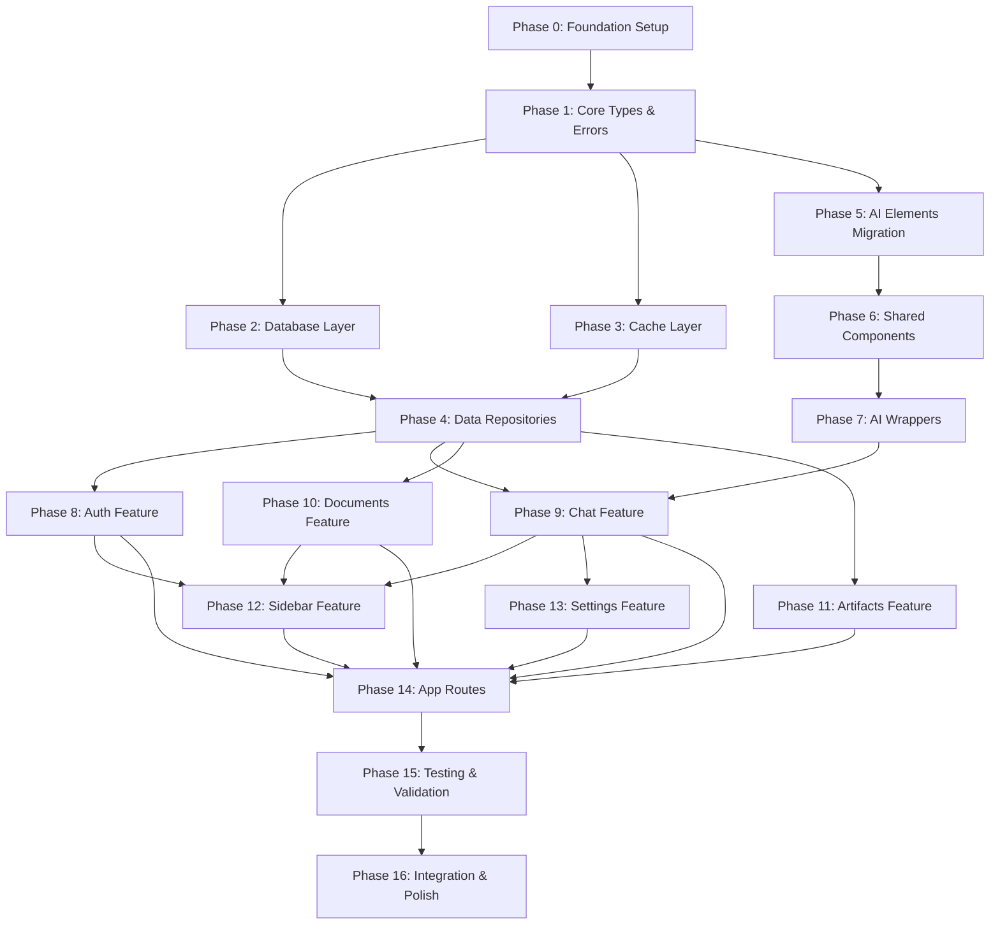

# Implementation Plan v5: OPTIMAL Architecture Migration

> **Version**: 5.0 (Final)  
> **Target**: Architecture v5 (OPTIMAL)  
> **Created**: 2024-12-27  
> **Last Validated**: 2024-12-27  
> **Status**: ✅ APPROVED

> [!CRITICAL]
> **MANDATORY FULL IMPLEMENTATION**
> - All code must be production-ready
> - Reference `archive/oldapp/` for existing logic
> - NO placeholders, TODOs, or stubs allowed

---

## Overview

This implementation plan transforms the existing codebase to Architecture v5 OPTIMAL, following:
- **Strong SRP** with explicit responsibility boundaries
- **SDK Wrapper Pattern** for AI elements
- **DRY Pattern Catalog** with centralized types, errors, and utilities
- **Repository Pattern** for data access abstraction
- **Result Type** for explicit error handling

### Quick Stats

| Metric | Value |
|--------|-------|
| **Total Phases** | 17 (0-16) |
| **Total Tasks** | 137 |
| **Estimated Duration** | ~68 hours |
| **Critical Path** | P0 → P1 → P2 → P4 → P5 → P6 → P9 → P14 → P15 → P16 |
| **AI Elements** | 30 components (5,626 LOC) to migrate |

> ✅ **Validated**: Task count verified 2024-12-27

---

## ⚠️ CRITICAL IMPLEMENTATION STANDARDS

### Reference Codebase

The **original codebase** is preserved at `archive/oldapp/` for reference:

```
archive/oldapp/
├── app/           # Original Next.js routes
├── components/    # Original React components
├── lib/           # Original utilities and services
├── hooks/         # Original custom hooks
├── tests/         # Original test files
└── ...
```

**AI agents MUST:**
1. **READ** the old implementation before creating new files
2. **MIGRATE** existing logic, not rewrite from scratch
3. **PRESERVE** working functionality
4. **REFERENCE** old file paths in task descriptions

### ⛔ MANDATORY: FULL IMPLEMENTATION ONLY

```
┌─────────────────────────────────────────────────────────────┐
│  🚨 NO PLACEHOLDERS • NO STUBS • NO TODOs • NO SHORTCUTS 🚨  │
└─────────────────────────────────────────────────────────────┘
```

Every file created MUST be:
- ✅ **Production-ready** - Ready to deploy
- ✅ **Fully functional** - All methods implemented
- ✅ **Type-safe** - No `any` types (except explicit escape hatches)
- ✅ **Error-handled** - All error cases covered
- ✅ **Tested** - Unit tests for business logic

**FORBIDDEN patterns:**
```typescript
// ❌ NEVER DO THIS:
export function processData() {
  // TODO: implement
  throw new Error("Not implemented");
}

// ❌ NEVER DO THIS:
export const handler = async () => {
  // Placeholder for future implementation
  return null;
};

// ❌ NEVER DO THIS:
export interface Config {
  // Add more fields as needed
  [key: string]: any;
}
```

**REQUIRED patterns:**
```typescript
// ✅ ALWAYS DO THIS:
export function processData(input: DataInput): Result<ProcessedData, ProcessingError> {
  // Validate input
  const validation = validateInput(input);
  if (!validation.success) {
    return err(new ProcessingError('Invalid input', validation.errors));
  }
  
  // Process data
  const result = transform(input);
  return ok(result);
}
```

### Quality Gates

Before marking any task complete:

| Gate | Requirement |
|------|-------------|
| **Types** | `pnpm typecheck` passes |
| **Lint** | `pnpm lint` passes |
| **Tests** | `pnpm test:unit` passes for affected files |
| **No Placeholders** | `grep -r "TODO\|FIXME\|Not implemented" src/` returns empty |

### Universal Acceptance Criteria

**In addition to task-specific criteria, EVERY task MUST meet:**

```markdown
**Standard Acceptance Criteria** (applies to ALL tasks):
- [ ] **FULL IMPLEMENTATION** - No TODOs, no placeholders, no stubs
- [ ] **Reference checked** - Old code at `archive/oldapp/` consulted
- [ ] TypeScript compiles without errors
- [ ] All exports match specification
- [ ] Tests pass (if applicable)
```

**When implementing, ALWAYS:**
1. Read the corresponding old file from `archive/oldapp/` first
2. Understand the existing logic before writing new code
3. Migrate functionality, don't reinvent
4. Verify with `pnpm typecheck && pnpm lint`

---

## Phase Dependency Graph



---

## Phase Summary Table

| Phase | Name | Tasks | Est. Duration | Dependencies | Status |
|-------|------|-------|---------------|--------------|--------|
| 0 | Foundation Setup | 5 | 2h | None | 🔲 Not Started |
| 1 | Core Types & Errors | 6 | 3h | P0 | 🔲 Not Started |
| 2 | Database Layer | 5 | 3h | P1 | 🔲 Not Started |
| 3 | Cache Layer | 4 | 2h | P1 | 🔲 Not Started |
| 4 | Data Repositories | 6 | 4h | P2, P3 | 🔲 Not Started |
| **5** | **AI Elements Migration** | **9** | **4h** | **P1** | 🔲 Not Started |
| 6 | Shared Components | 8 | 4h | P5 | 🔲 Not Started |
| 7 | AI Wrappers | 5 | 3h | P6 | 🔲 Not Started |
| 8 | Auth Feature | 9 | 4h | P4 | 🔲 Not Started |
| 9 | Chat Feature | 10 | 6h | P4, P7 | 🔲 Not Started |
| 10 | Documents Feature | 10 | 4h | P4 | 🔲 Not Started |
| 11 | Artifacts Feature | 9 | 3h | P4 | 🔲 Not Started |
| 12 | Sidebar Feature | 10 | 3h | P8, P9, P10 | 🔲 Not Started |
| 13 | Settings Feature | 9 | 3h | P9 | 🔲 Not Started |
| 14 | App Routes | 12 | 6h | P8-P13 | 🔲 Not Started |
| 15 | Testing | 12 | 8h | P14 | 🔲 Not Started |
| 16 | Integration & Polish | 6 | 4h | P15 | 🔲 Not Started |
| **TOTAL** | | **137** | **~68h** | | |

---

## Phase 0: Foundation Setup

**Goal**: Establish project structure, tooling, and configuration for v5 architecture.

**Duration**: 2h  
**Dependencies**: None  
**Priority**: P0 (Critical)

---

### Task 0.1: Create ESLint Boundary Rules

**Type**: CREATE  
**Duration**: 30m  
**Dependencies**: None  
**Priority**: P0 (Critical)

**Description**:
Configure ESLint boundary rules to enforce layer dependencies and prevent import violations. This is the foundation for architectural compliance - without these rules, the codebase will drift from the intended architecture.

**Files**:
- CREATE: `.eslintrc.boundaries.js` (Purpose: Boundary rule definitions)
- MODIFY: `package.json` (Change: Add `eslint-plugin-boundaries` dependency)
- MODIFY: `.eslintrc.json` (Change: Extend boundaries config)

**Code Skeleton**:
```javascript
// .eslintrc.boundaries.js
module.exports = {
  plugins: ['boundaries'],
  settings: {
    'boundaries/elements': [
      { type: 'app', pattern: 'app/**' },
      { type: 'features', pattern: 'features/**' },
      { type: 'shared', pattern: 'shared/**' },
      { type: 'lib', pattern: 'lib/**' },
      { type: 'src', pattern: 'src/**' },
    ],
    'boundaries/ignore': ['**/*.test.ts', '**/*.spec.ts'],
  },
  rules: {
    'boundaries/element-types': [
      2,
      {
        default: 'disallow',
        rules: [
          // app can import from features, shared, lib, src
          { from: 'app', allow: ['features', 'shared', 'lib', 'src'] },
          // features can import from shared, lib, src (NOT other features)
          { from: 'features', allow: ['shared', 'lib', 'src'] },
          // shared can import from lib, src
          { from: 'shared', allow: ['lib', 'src'] },
          // lib can import from src
          { from: 'lib', allow: ['src'] },
          // src is leaf - no outgoing imports
          { from: 'src', allow: [] },
        ],
      },
    ],
    'boundaries/no-unknown-files': 2,
    'boundaries/no-unknown': 2,
  },
};
```

**Imports Required**:
- Package: `eslint-plugin-boundaries@^3.0.0`

**Acceptance Criteria**:
- [ ] `pnpm add -D eslint-plugin-boundaries` executed
- [ ] `.eslintrc.boundaries.js` file exists
- [ ] `.eslintrc.json` extends `./. eslintrc.boundaries.js`
- [ ] Rules prevent cross-feature imports (`features/X` → `features/Y`)
- [ ] Rules prevent SDK direct imports (must use wrappers)
- [ ] Rules enforce `src/` as leaf node (no outgoing imports)
- [ ] Rules prevent `lib/` from importing `features/`
- [ ] `pnpm lint` runs without config errors

**Test File**: N/A (tooling configuration)

**Related Tasks**: T0.3 (Path Aliases)

**Pattern**: N/A (tooling)

---

### Task 0.2: Create Directory Structure

**Type**: CREATE  
**Duration**: 20m  
**Dependencies**: None  
**Priority**: P0 (Critical)

**Description**:
Create v5 directory structure with placeholder files for new folders. This establishes the physical folder layout that matches our architectural layers. The `.gitkeep` files ensure empty directories are tracked in git.

**Files**:
- CREATE: `src/types/.gitkeep` (Purpose: Core type definitions)
- CREATE: `src/errors/.gitkeep` (Purpose: Error class hierarchy)
- CREATE: `src/services/.gitkeep` (Purpose: Cross-cutting services)
- CREATE: `shared/components/ai/.gitkeep` (Purpose: AI wrapper components)
- CREATE: `shared/hooks/.gitkeep` (Purpose: Shared React hooks)
- CREATE: `shared/constants/.gitkeep` (Purpose: Shared constants)
- CREATE: `lib/cache/.gitkeep` (Purpose: Cache layer)
- CREATE: `lib/data/repositories/.gitkeep` (Purpose: Repository pattern)

**Commands to Execute**:
```powershell
# Create all directories with .gitkeep files
$dirs = @(
    "src/types",
    "src/errors", 
    "src/services",
    "shared/components/ai",
    "shared/hooks",
    "shared/constants",
    "lib/cache",
    "lib/data/repositories"
)

foreach ($dir in $dirs) {
    New-Item -ItemType Directory -Force -Path $dir
    New-Item -ItemType File -Force -Path "$dir/.gitkeep"
}
```

**Expected Directory Tree**:
```
.
├── src/
│   ├── types/
│   │   └── .gitkeep
│   ├── errors/
│   │   └── .gitkeep
│   └── services/
│       └── .gitkeep
├── shared/
│   ├── components/
│   │   └── ai/
│   │       └── .gitkeep
│   ├── hooks/
│   │   └── .gitkeep
│   └── constants/
│       └── .gitkeep
└── lib/
    ├── cache/
    │   └── .gitkeep
    └── data/
        └── repositories/
            └── .gitkeep
```

**Acceptance Criteria**:
- [ ] All 8 directories exist
- [ ] `.gitkeep` files present in each directory
- [ ] Directories visible in git status
- [ ] No permission errors on creation
- [ ] Directory structure matches architecture spec

**Test File**: N/A (structure)

**Related Tasks**: T0.3 (Path Aliases), T0.4 (Barrel Exports)

**Pattern**: N/A (structure)

---

### Task 0.3: Create Path Aliases Configuration

**Type**: MODIFY  
**Duration**: 20m  
**Dependencies**: T0.2  
**Priority**: P0 (Critical)

**Description**:
Add path aliases for new v5 directories to TypeScript configuration. These aliases enable clean imports like `@/src/types` instead of relative paths, and ensure consistent import patterns across the codebase.

**Files**:
- MODIFY: `tsconfig.json` (Change: Add path aliases for src/, shared/, lib/)

**Code Skeleton**:
```jsonc
// tsconfig.json - paths section to add/modify
{
  "compilerOptions": {
    "paths": {
      // Existing aliases (preserve these)
      "@/*": ["./*"],
      
      // NEW: Core types and errors (leaf layer)
      "@/src/*": ["./src/*"],
      "@/src/types": ["./src/types/index.ts"],
      "@/src/errors": ["./src/errors/index.ts"],
      "@/src/services": ["./src/services/index.ts"],
      
      // NEW: Shared layer
      "@/shared/*": ["./shared/*"],
      "@/shared/components": ["./shared/components/index.ts"],
      "@/shared/components/ai": ["./shared/components/ai/index.ts"],
      "@/shared/hooks": ["./shared/hooks/index.ts"],
      "@/shared/constants": ["./shared/constants/index.ts"],
      
      // NEW: Library layer
      "@/lib/*": ["./lib/*"],
      "@/lib/cache": ["./lib/cache/index.ts"],
      "@/lib/data": ["./lib/data/index.ts"],
      "@/lib/db": ["./lib/db/index.ts"],
      
      // Features layer
      "@/features/*": ["./features/*"]
    }
  }
}
```

**Imports Required**:
- None (TypeScript built-in)

**Acceptance Criteria**:
- [ ] `@/src/*` alias configured and resolves
- [ ] `@/shared/*` alias configured and resolves
- [ ] `@/lib/*` alias configured and resolves
- [ ] TypeScript compiles without path resolution errors
- [ ] VS Code IntelliSense recognizes new paths
- [ ] `tsc --noEmit` passes after changes

**Validation Command**:
```powershell
# Test TypeScript can resolve the new paths
npx tsc --noEmit --pretty
```

**Test File**: N/A (tooling)

**Related Tasks**: T0.1 (ESLint), T0.4 (Barrel Exports)

**Pattern**: N/A (tooling)

---

### Task 0.4: Create Barrel Export Templates

**Type**: CREATE  
**Duration**: 20m  
**Dependencies**: T0.2, T0.3  
**Priority**: P0 (Critical)

**Description**:
Create empty barrel export files for consistent module imports. Barrel exports centralize re-exports from a directory, enabling clean imports like `import { Result } from '@/src/types'` instead of importing from individual files.

**Files**:
- CREATE: `src/types/index.ts` (Purpose: Export all type definitions)
- CREATE: `src/errors/index.ts` (Purpose: Export all error classes)
- CREATE: `src/services/index.ts` (Purpose: Export all services)
- CREATE: `shared/components/index.ts` (Purpose: Export all shared components)
- CREATE: `shared/hooks/index.ts` (Purpose: Export all shared hooks)
- CREATE: `shared/constants/index.ts` (Purpose: Export all constants)
- CREATE: `lib/cache/index.ts` (Purpose: Export cache utilities)
- CREATE: `lib/data/index.ts` (Purpose: Export data layer)

**Code Skeletons**:

```typescript
// src/types/index.ts
/**
 * Core Type Definitions
 * @module @/src/types
 * 
 * This barrel export provides all cross-cutting type definitions.
 * Types here are used across all layers of the application.
 */

// Result type for explicit error handling (add in T1.1)
// export * from './result';

// API response types (add in T1.2)
// export * from './api.types';

// Domain model types (add in T1.3)
// export * from './models.types';
```

```typescript
// src/errors/index.ts
/**
 * Error Class Hierarchy
 * @module @/src/errors
 * 
 * This barrel export provides all error classes.
 * All application errors extend from AppError.
 */

// Base error class (add in T1.4)
// export * from './base.error';

// API-specific errors (add in T1.5)
// export * from './api.errors';
```

```typescript
// src/services/index.ts
/**
 * Cross-cutting Services
 * @module @/src/services
 * 
 * This barrel export provides cross-cutting service instances.
 * Services here are singletons used across the application.
 */

// Add service exports as they are created
```

```typescript
// shared/components/index.ts
/**
 * Shared Components
 * @module @/shared/components
 * 
 * This barrel export provides all shared React components.
 */

// UI components (add in P6)
// export * from './ui';

// AI wrapper components (add in P5/P7)
// export * from './ai';
```

```typescript
// shared/hooks/index.ts
/**
 * Shared Hooks
 * @module @/shared/hooks
 * 
 * This barrel export provides all shared React hooks.
 */

// Add hook exports as they are created
// export * from './use-query';
```

```typescript
// shared/constants/index.ts
/**
 * Shared Constants
 * @module @/shared/constants
 * 
 * This barrel export provides application-wide constants.
 */

export const APP_NAME = 'AI Chatbot';
export const APP_VERSION = '5.0.0';
```

```typescript
// lib/cache/index.ts
/**
 * Cache Layer
 * @module @/lib/cache
 * 
 * This barrel export provides caching utilities.
 */

// Add cache exports in P3
// export { cache, redis } from './redis';
// export { cacheKeys, type CacheKey } from './keys';
```

```typescript
// lib/data/index.ts
/**
 * Data Access Layer
 * @module @/lib/data
 * 
 * This barrel export provides data access abstractions.
 */

// Add repository exports in P4
// export * from './repositories';
```

**Acceptance Criteria**:
- [ ] All 8 `index.ts` files created
- [ ] Each file contains module JSDoc comment
- [ ] Each file contains placeholder export comments
- [ ] Files compile without TypeScript errors
- [ ] Imports work: `import {} from '@/src/types'`
- [ ] VS Code shows correct IntelliSense

**Test File**: N/A (structure)

**Related Tasks**: T0.3 (Path Aliases), T1.6 (Populate Exports)

**Pattern**: N/A (structure)

---

### Task 0.5: Validate Project Structure

**Type**: CREATE  
**Duration**: 30m  
**Dependencies**: T0.1, T0.2, T0.3, T0.4  
**Priority**: P1 (High)

**Description**:
Create a validation script to verify v5 architecture compliance. This script will be run during CI/CD and locally to ensure the architecture constraints are maintained as the codebase evolves.

**Files**:
- CREATE: `scripts/validate-structure.ts` (Purpose: Architecture validation script)
- MODIFY: `package.json` (Change: Add validate:structure script)

**Code Skeleton**:
```typescript
// scripts/validate-structure.ts
import * as fs from 'fs';
import * as path from 'path';

interface ValidationResult {
  passed: boolean;
  errors: string[];
  warnings: string[];
}

const REQUIRED_DIRECTORIES = [
  'src/types',
  'src/errors',
  'src/services',
  'shared/components',
  'shared/components/ai',
  'shared/hooks',
  'shared/constants',
  'lib/cache',
  'lib/data',
  'lib/data/repositories',
  'lib/db',
  'features',
  'app',
] as const;

const REQUIRED_BARREL_EXPORTS = [
  'src/types/index.ts',
  'src/errors/index.ts',
  'src/services/index.ts',
  'shared/components/index.ts',
  'shared/hooks/index.ts',
  'shared/constants/index.ts',
  'lib/cache/index.ts',
  'lib/data/index.ts',
] as const;

const FORBIDDEN_IMPORTS: Record<string, string[]> = {
  'src/': ['features/', 'app/', 'shared/', 'lib/'],
  'lib/': ['features/', 'app/'],
  'shared/': ['features/', 'app/'],
};

function validateDirectories(): ValidationResult {
  const errors: string[] = [];
  const warnings: string[] = [];
  
  for (const dir of REQUIRED_DIRECTORIES) {
    const fullPath = path.join(process.cwd(), dir);
    if (!fs.existsSync(fullPath)) {
      errors.push(`Missing required directory: ${dir}`);
    }
  }
  
  return { passed: errors.length === 0, errors, warnings };
}

function validateBarrelExports(): ValidationResult {
  const errors: string[] = [];
  const warnings: string[] = [];
  
  for (const file of REQUIRED_BARREL_EXPORTS) {
    const fullPath = path.join(process.cwd(), file);
    if (!fs.existsSync(fullPath)) {
      errors.push(`Missing barrel export: ${file}`);
    }
  }
  
  return { passed: errors.length === 0, errors, warnings };
}

function validateNoCircularDeps(): ValidationResult {
  // Implement circular dependency detection
  // Using madge or custom implementation
  return { passed: true, errors: [], warnings: [] };
}

async function main(): Promise<void> {
  console.log('🔍 Validating v5 Architecture Structure...\n');
  
  const results = [
    { name: 'Directories', result: validateDirectories() },
    { name: 'Barrel Exports', result: validateBarrelExports() },
    { name: 'Circular Dependencies', result: validateNoCircularDeps() },
  ];
  
  let hasErrors = false;
  
  for (const { name, result } of results) {
    const status = result.passed ? '✅' : '❌';
    console.log(`${status} ${name}`);
    
    for (const error of result.errors) {
      console.log(`   ❌ ${error}`);
      hasErrors = true;
    }
    
    for (const warning of result.warnings) {
      console.log(`   ⚠️  ${warning}`);
    }
  }
  
  console.log('');
  
  if (hasErrors) {
    console.log('❌ Validation FAILED');
    process.exit(1);
  } else {
    console.log('✅ Validation PASSED');
    process.exit(0);
  }
}

main();
```

**Package.json Addition**:
```json
{
  "scripts": {
    "validate:structure": "tsx scripts/validate-structure.ts"
  }
}
```

**Imports Required**:
- Built-in: `fs`, `path`
- Dev: `tsx` (for running TypeScript scripts)

**Acceptance Criteria**:
- [ ] `scripts/validate-structure.ts` exists
- [ ] Script checks all required directories exist
- [ ] Script validates index.ts presence in folders
- [ ] Script runs without errors on v5 structure
- [ ] `pnpm run validate:structure` command works
- [ ] Exit code 0 on success, 1 on failure
- [ ] Clear error messages for failures

**Validation Command**:
```powershell
pnpm run validate:structure
```

**Test File**: `tests/unit/scripts/validate-structure.test.ts`

**Related Tasks**: T0.2 (Directories), T0.4 (Barrel Exports)

**Pattern**: N/A (tooling)

---

## Phase 1: Core Types & Errors

**Goal**: Establish cross-cutting type definitions and error hierarchy.

**Duration**: 3h  
**Dependencies**: Phase 0  
**Priority**: P0 (Critical)

---

### Task 1.1: Create Result Type

**Type**: CREATE  
**Duration**: 30m  
**Dependencies**: T0.4  
**Priority**: P0 (Critical)

**Description**:
Implement the Result<T, E> pattern for explicit error handling. This is the foundation for all fallible operations throughout the codebase. The Result type makes error handling explicit at the type level, eliminating unexpected exceptions and making error flows visible in the code.

**Files**:
- CREATE: `src/types/result.ts` (Purpose: Result type and utilities)

**Code Skeleton**:
```typescript
// src/types/result.ts
/**
 * Result Type Pattern
 * @module @/src/types/result
 * 
 * Provides explicit error handling without exceptions.
 * Use this for all fallible operations.
 * 
 * @example
 * ```typescript
 * function divide(a: number, b: number): Result<number, string> {
 *   if (b === 0) return err('Division by zero');
 *   return ok(a / b);
 * }
 * 
 * const result = divide(10, 2);
 * if (isOk(result)) {
 *   console.log(result.value); // 5
 * } else {
 *   console.error(result.error);
 * }
 * ```
 */

/**
 * Represents a successful result containing a value
 */
export interface Ok<T> {
  readonly ok: true;
  readonly value: T;
}

/**
 * Represents a failed result containing an error
 */
export interface Err<E> {
  readonly ok: false;
  readonly error: E;
}

/**
 * A discriminated union representing either success (Ok) or failure (Err)
 * @typeParam T - The success value type
 * @typeParam E - The error type (defaults to Error)
 */
export type Result<T, E = Error> = Ok<T> | Err<E>;

/**
 * Creates a successful Result
 * @param value - The success value
 * @returns An Ok result containing the value
 */
export function ok<T>(value: T): Ok<T> {
  return { ok: true, value };
}

/**
 * Creates a failed Result
 * @param error - The error value
 * @returns An Err result containing the error
 */
export function err<E>(error: E): Err<E> {
  return { ok: false, error };
}

/**
 * Type guard to check if a Result is Ok
 * @param result - The result to check
 * @returns true if the result is Ok
 */
export function isOk<T, E>(result: Result<T, E>): result is Ok<T> {
  return result.ok === true;
}

/**
 * Type guard to check if a Result is Err
 * @param result - The result to check
 * @returns true if the result is Err
 */
export function isErr<T, E>(result: Result<T, E>): result is Err<E> {
  return result.ok === false;
}

/**
 * Extracts the value from a Result, throwing if it's an error
 * @param result - The result to unwrap
 * @returns The value if Ok
 * @throws The error if Err
 */
export function unwrap<T, E>(result: Result<T, E>): T {
  if (isOk(result)) return result.value;
  throw result.error;
}

/**
 * Extracts the value from a Result, returning a default if it's an error
 * @param result - The result to unwrap
 * @param defaultValue - The default value to return if Err
 * @returns The value if Ok, otherwise the default
 */
export function unwrapOr<T, E>(result: Result<T, E>, defaultValue: T): T {
  return isOk(result) ? result.value : defaultValue;
}

/**
 * Maps a Result's Ok value using a transformation function
 * @param result - The result to map
 * @param fn - The transformation function
 * @returns A new Result with the transformed value
 */
export function map<T, U, E>(
  result: Result<T, E>,
  fn: (value: T) => U
): Result<U, E> {
  if (isOk(result)) {
    return ok(fn(result.value));
  }
  return result;
}

/**
 * Maps a Result's Err value using a transformation function
 * @param result - The result to map
 * @param fn - The transformation function
 * @returns A new Result with the transformed error
 */
export function mapErr<T, E, F>(
  result: Result<T, E>,
  fn: (error: E) => F
): Result<T, F> {
  if (isErr(result)) {
    return err(fn(result.error));
  }
  return result;
}

/**
 * Chains Result operations (flatMap)
 * @param result - The result to chain
 * @param fn - A function that returns a new Result
 * @returns The chained Result
 */
export function flatMap<T, U, E>(
  result: Result<T, E>,
  fn: (value: T) => Result<U, E>
): Result<U, E> {
  if (isOk(result)) {
    return fn(result.value);
  }
  return result;
}

/**
 * Wraps a promise that might reject into a Result
 * @param promise - The promise to wrap
 * @returns A Result containing either the resolved value or the error
 */
export async function fromPromise<T, E = Error>(
  promise: Promise<T>
): Promise<Result<T, E>> {
  try {
    const value = await promise;
    return ok(value);
  } catch (error) {
    return err(error as E);
  }
}

/**
 * Wraps a function that might throw into a Result
 * @param fn - The function to wrap
 * @returns A Result containing either the return value or the error
 */
export function fromThrowable<T, E = Error>(fn: () => T): Result<T, E> {
  try {
    return ok(fn());
  } catch (error) {
    return err(error as E);
  }
}

/**
 * Combines multiple Results into a single Result containing an array
 * @param results - Array of Results to combine
 * @returns Ok with array of values if all Ok, first Err otherwise
 */
export function combine<T, E>(results: Result<T, E>[]): Result<T[], E> {
  const values: T[] = [];
  for (const result of results) {
    if (isErr(result)) {
      return result;
    }
    values.push(result.value);
  }
  return ok(values);
}
```

**Imports Required**:
- None (standalone module)

**Exports**:
- Types: `Ok<T>`, `Err<E>`, `Result<T, E>`
- Functions: `ok`, `err`, `isOk`, `isErr`, `unwrap`, `unwrapOr`, `map`, `mapErr`, `flatMap`, `fromPromise`, `fromThrowable`, `combine`

**Acceptance Criteria**:
- [ ] File exists at `src/types/result.ts`
- [ ] `Ok<T>` interface exported with `ok: true` discriminant
- [ ] `Err<E>` interface exported with `ok: false` discriminant
- [ ] `Result<T, E>` union type exported
- [ ] `ok()` constructor creates Ok result
- [ ] `err()` constructor creates Err result
- [ ] `isOk()` type guard narrows to Ok
- [ ] `isErr()` type guard narrows to Err
- [ ] `unwrap()` returns value or throws
- [ ] `unwrapOr()` returns value or default
- [ ] `map()` transforms Ok value
- [ ] `mapErr()` transforms Err value
- [ ] `flatMap()` chains Result operations
- [ ] `fromPromise()` wraps async operations
- [ ] `fromThrowable()` wraps sync operations
- [ ] `combine()` aggregates multiple Results
- [ ] No TypeScript errors

**Test File**: `tests/unit/types/result.test.ts`

**Related Tasks**: T1.2 (API Types), T1.4 (Base Error), T4.1 (Base Repository)

**Pattern**: #3 (Result Type)

---

### Task 1.2: Create API Response Types

**Type**: CREATE  
**Duration**: 30m  
**Dependencies**: T1.1  
**Priority**: P0 (Critical)

**Description**:
Define standardized API response shapes for consistent client-server communication. These types ensure all API endpoints return predictable structures, making client-side handling simpler and more type-safe.

**Files**:
- CREATE: `src/types/api.types.ts` (Purpose: API response type definitions)

**Code Skeleton**:
```typescript
// src/types/api.types.ts
/**
 * API Response Types
 * @module @/src/types/api.types
 * 
 * Standardized response shapes for all API endpoints.
 * Ensures consistent client-server communication.
 */

/**
 * Metadata included with API responses
 */
export interface ApiMeta {
  /** ISO timestamp of response generation */
  timestamp: string;
  /** Unique request identifier for tracing */
  requestId?: string;
  /** Response processing duration in milliseconds */
  duration?: number;
}

/**
 * Successful API response wrapper
 * @typeParam T - The data payload type
 */
export interface ApiResponse<T> {
  success: true;
  data: T;
  meta?: ApiMeta;
}

/**
 * Error details in API error responses
 */
export interface ApiErrorDetail {
  /** Machine-readable error code */
  code: string;
  /** Human-readable error message */
  message: string;
  /** Additional error context */
  details?: Record<string, unknown>;
  /** Field-level validation errors */
  fieldErrors?: Record<string, string[]>;
}

/**
 * Failed API response wrapper
 */
export interface ApiErrorResponse {
  success: false;
  error: ApiErrorDetail;
  meta?: ApiMeta;
}

/**
 * Pagination information for list endpoints
 */
export interface PaginationInfo {
  /** Current page number (1-indexed) */
  page: number;
  /** Items per page */
  pageSize: number;
  /** Total number of items across all pages */
  totalItems: number;
  /** Total number of pages */
  totalPages: number;
  /** Whether there's a next page */
  hasNextPage: boolean;
  /** Whether there's a previous page */
  hasPrevPage: boolean;
}

/**
 * Paginated API response for list endpoints
 * @typeParam T - The individual item type
 */
export interface PaginatedResponse<T> {
  success: true;
  data: T[];
  pagination: PaginationInfo;
  meta?: ApiMeta;
}

/**
 * Union type for all API responses
 * @typeParam T - The success data type
 */
export type ApiResult<T> = ApiResponse<T> | ApiErrorResponse;

/**
 * Union type for paginated API responses
 * @typeParam T - The individual item type
 */
export type PaginatedApiResult<T> = PaginatedResponse<T> | ApiErrorResponse;

// ============================================================================
// Factory Functions
// ============================================================================

/**
 * Creates a successful API response
 * @param data - The response data
 * @param meta - Optional metadata
 */
export function apiSuccess<T>(data: T, meta?: Partial<ApiMeta>): ApiResponse<T> {
  return {
    success: true,
    data,
    meta: {
      timestamp: new Date().toISOString(),
      ...meta,
    },
  };
}

/**
 * Creates an error API response
 * @param code - Machine-readable error code
 * @param message - Human-readable message
 * @param details - Additional error context
 */
export function apiError(
  code: string,
  message: string,
  details?: Record<string, unknown>
): ApiErrorResponse {
  return {
    success: false,
    error: {
      code,
      message,
      details,
    },
    meta: {
      timestamp: new Date().toISOString(),
    },
  };
}

/**
 * Creates a paginated API response
 * @param data - Array of items
 * @param pagination - Pagination information
 */
export function apiPaginated<T>(
  data: T[],
  pagination: PaginationInfo
): PaginatedResponse<T> {
  return {
    success: true,
    data,
    pagination,
    meta: {
      timestamp: new Date().toISOString(),
    },
  };
}

// ============================================================================
// Type Guards
// ============================================================================

/**
 * Type guard to check if response is successful
 */
export function isApiSuccess<T>(
  response: ApiResult<T>
): response is ApiResponse<T> {
  return response.success === true;
}

/**
 * Type guard to check if response is an error
 */
export function isApiError<T>(
  response: ApiResult<T>
): response is ApiErrorResponse {
  return response.success === false;
}

// ============================================================================
// Common API Error Codes
// ============================================================================

export const API_ERROR_CODES = {
  // Client errors (4xx)
  BAD_REQUEST: 'BAD_REQUEST',
  UNAUTHORIZED: 'UNAUTHORIZED',
  FORBIDDEN: 'FORBIDDEN',
  NOT_FOUND: 'NOT_FOUND',
  VALIDATION_ERROR: 'VALIDATION_ERROR',
  CONFLICT: 'CONFLICT',
  RATE_LIMITED: 'RATE_LIMITED',
  
  // Server errors (5xx)
  INTERNAL_ERROR: 'INTERNAL_ERROR',
  SERVICE_UNAVAILABLE: 'SERVICE_UNAVAILABLE',
  
  // Domain-specific
  CHAT_NOT_FOUND: 'CHAT_NOT_FOUND',
  MESSAGE_NOT_FOUND: 'MESSAGE_NOT_FOUND',
  DOCUMENT_NOT_FOUND: 'DOCUMENT_NOT_FOUND',
  USER_NOT_FOUND: 'USER_NOT_FOUND',
  INVALID_CREDENTIALS: 'INVALID_CREDENTIALS',
  USER_EXISTS: 'USER_EXISTS',
} as const;

export type ApiErrorCode = typeof API_ERROR_CODES[keyof typeof API_ERROR_CODES];
```

**Imports Required**:
- None (standalone module)

**Exports**:
- Types: `ApiMeta`, `ApiResponse<T>`, `ApiErrorDetail`, `ApiErrorResponse`, `PaginationInfo`, `PaginatedResponse<T>`, `ApiResult<T>`, `PaginatedApiResult<T>`, `ApiErrorCode`
- Functions: `apiSuccess`, `apiError`, `apiPaginated`, `isApiSuccess`, `isApiError`
- Constants: `API_ERROR_CODES`

**Acceptance Criteria**:
- [ ] File exists at `src/types/api.types.ts`
- [ ] `ApiResponse<T>` interface with `success: true` discriminant
- [ ] `ApiErrorResponse` interface with `success: false` discriminant
- [ ] `PaginatedResponse<T>` for list endpoints
- [ ] `ApiResult<T>` union type exported
- [ ] Meta fields include timestamp and requestId
- [ ] Factory functions create correct response shapes
- [ ] Type guards narrow response types correctly
- [ ] Error codes cover all common scenarios
- [ ] No TypeScript errors

**Test File**: `tests/unit/types/api.types.test.ts`

**Related Tasks**: T1.1 (Result Type), T1.5 (API Errors), T8.4 (Auth API)

**Pattern**: #2 (API Response Types)

---

### Task 1.3: Create Model Types

**Type**: CREATE  
**Duration**: 20m  
**Dependencies**: T0.4  
**Priority**: P0 (Critical)

**Description**:
Create domain model types that will be derived from Drizzle schema. Initially created as placeholder types, these will be updated in Phase 2 to use Drizzle's `InferSelectModel` and `InferInsertModel` for type-safe database operations.

**Files**:
- CREATE: `src/types/models.types.ts` (Purpose: Domain model type definitions)

**Code Skeleton**:
```typescript
// src/types/models.types.ts
/**
 * Domain Model Types
 * @module @/src/types/models.types
 * 
 * Type definitions for domain entities.
 * After Phase 2, these will be inferred from Drizzle schema.
 * 
 * @see {@link lib/db/schema.ts} for schema definitions
 */

// ============================================================================
// Common Mixins
// ============================================================================

/**
 * Mixin for entities with timestamps
 */
export interface WithTimestamps {
  createdAt: Date;
  updatedAt: Date;
}

/**
 * Mixin for entities owned by a user
 */
export interface WithUserId {
  userId: string;
}

/**
 * Mixin for soft-deletable entities
 */
export interface WithSoftDelete {
  deletedAt: Date | null;
}

// ============================================================================
// User Domain
// ============================================================================

/**
 * User entity - represents an authenticated user
 */
export interface User extends WithTimestamps {
  id: string;
  email: string;
  name: string | null;
  image: string | null;
  emailVerified: Date | null;
}

/**
 * User creation payload (excludes auto-generated fields)
 */
export interface NewUser {
  email: string;
  name?: string | null;
  image?: string | null;
}

/**
 * User update payload (all fields optional)
 */
export interface UpdateUser {
  email?: string;
  name?: string | null;
  image?: string | null;
}

// ============================================================================
// Chat Domain
// ============================================================================

/**
 * Chat visibility options
 */
export type ChatVisibility = 'public' | 'private';

/**
 * Chat entity - represents a conversation
 */
export interface Chat extends WithTimestamps, WithUserId {
  id: string;
  title: string;
  visibility: ChatVisibility;
}

/**
 * Chat creation payload
 */
export interface NewChat {
  userId: string;
  title: string;
  visibility?: ChatVisibility;
}

/**
 * Chat update payload
 */
export interface UpdateChat {
  title?: string;
  visibility?: ChatVisibility;
}

/**
 * Chat with messages included
 */
export interface ChatWithMessages extends Chat {
  messages: Message[];
}

// ============================================================================
// Message Domain
// ============================================================================

/**
 * Message role in conversation
 */
export type MessageRole = 'user' | 'assistant' | 'system' | 'tool';

/**
 * Message content part types
 */
export interface TextPart {
  type: 'text';
  text: string;
}

export interface ImagePart {
  type: 'image';
  image: string; // URL or base64
  mimeType?: string;
}

export interface ToolCallPart {
  type: 'tool-call';
  toolCallId: string;
  toolName: string;
  args: Record<string, unknown>;
}

export interface ToolResultPart {
  type: 'tool-result';
  toolCallId: string;
  result: unknown;
}

export type MessagePart = TextPart | ImagePart | ToolCallPart | ToolResultPart;

/**
 * Message entity - represents a single message in a chat
 */
export interface Message extends WithTimestamps {
  id: string;
  chatId: string;
  role: MessageRole;
  content: string;
  parts?: MessagePart[];
}

/**
 * Message creation payload
 */
export interface NewMessage {
  chatId: string;
  role: MessageRole;
  content: string;
  parts?: MessagePart[];
}

// ============================================================================
// Document Domain
// ============================================================================

/**
 * Document kind types
 */
export type DocumentKind = 'text' | 'code' | 'image' | 'sheet';

/**
 * Document entity - represents user-created content
 */
export interface Document extends WithTimestamps, WithUserId, WithSoftDelete {
  id: string;
  title: string;
  content: string;
  kind: DocumentKind;
}

/**
 * Document creation payload
 */
export interface NewDocument {
  userId: string;
  title: string;
  content: string;
  kind: DocumentKind;
}

/**
 * Document update payload
 */
export interface UpdateDocument {
  title?: string;
  content?: string;
  kind?: DocumentKind;
}

// ============================================================================
// Vote Domain
// ============================================================================

/**
 * Vote type for message feedback
 */
export type VoteType = 'up' | 'down';

/**
 * Vote entity - represents user feedback on a message
 */
export interface Vote extends WithTimestamps {
  id: string;
  messageId: string;
  chatId: string;
  vote: VoteType;
}

/**
 * Vote creation payload
 */
export interface NewVote {
  messageId: string;
  chatId: string;
  vote: VoteType;
}

// ============================================================================
// Suggestion Domain
// ============================================================================

/**
 * Suggestion entity - represents AI-generated suggestions
 */
export interface Suggestion extends WithTimestamps {
  id: string;
  documentId: string;
  content: string;
  description: string;
  isResolved: boolean;
}

/**
 * Suggestion creation payload
 */
export interface NewSuggestion {
  documentId: string;
  content: string;
  description: string;
}

// ============================================================================
// Re-exports for convenience
// ============================================================================

export type {
  User,
  NewUser,
  UpdateUser,
  Chat,
  NewChat,
  UpdateChat,
  ChatWithMessages,
  Message,
  NewMessage,
  Document,
  NewDocument,
  UpdateDocument,
  Vote,
  NewVote,
  Suggestion,
  NewSuggestion,
};
```

**Imports Required**:
- None (standalone module)

**Exports**:
- Mixins: `WithTimestamps`, `WithUserId`, `WithSoftDelete`
- User types: `User`, `NewUser`, `UpdateUser`
- Chat types: `Chat`, `NewChat`, `UpdateChat`, `ChatWithMessages`, `ChatVisibility`
- Message types: `Message`, `NewMessage`, `MessageRole`, `MessagePart`, `TextPart`, `ImagePart`, `ToolCallPart`, `ToolResultPart`
- Document types: `Document`, `NewDocument`, `UpdateDocument`, `DocumentKind`
- Vote types: `Vote`, `NewVote`, `VoteType`
- Suggestion types: `Suggestion`, `NewSuggestion`

**Acceptance Criteria**:
- [ ] File exists at `src/types/models.types.ts`
- [ ] All entity types have proper interfaces
- [ ] Mixins for common patterns (timestamps, userId, soft delete)
- [ ] Message parts support text, image, tool-call, tool-result
- [ ] New* types exclude auto-generated fields
- [ ] Update* types have all fields optional
- [ ] ChatWithMessages includes messages relation
- [ ] No TypeScript errors

**Migration Note**:
After T2.1 (Database Schema), update this file to use Drizzle inference:
```typescript
import type { InferSelectModel, InferInsertModel } from 'drizzle-orm';
import { user, chat, message } from '@/lib/db/schema';
export type User = InferSelectModel<typeof user>;
export type NewUser = InferInsertModel<typeof user>;
```

**Test File**: `tests/unit/types/models.types.test.ts`

**Related Tasks**: T2.1 (Database Schema), T2.4 (Update with Drizzle)

**Pattern**: #4 (DB Model Types)

---

### Task 1.4: Create Base Error Class

**Type**: CREATE  
**Duration**: 30m  
**Dependencies**: T0.4  
**Priority**: P0 (Critical)

**Description**:
Implement the base AppError class that all application errors extend. This establishes a consistent error structure with error codes, HTTP status codes, and serialization support for API responses.

**Files**:
- CREATE: `src/errors/base.error.ts` (Purpose: Base error class definition)

**Code Skeleton**:
```typescript
// src/errors/base.error.ts
/**
 * Base Error Class
 * @module @/src/errors/base.error
 * 
 * Foundation for all application errors.
 * Provides consistent error structure, codes, and serialization.
 * 
 * @example
 * ```typescript
 * class ChatNotFoundError extends AppError {
 *   constructor(chatId: string) {
 *     super(
 *       `Chat not found: ${chatId}`,
 *       'CHAT_NOT_FOUND',
 *       404,
 *       { chatId }
 *     );
 *   }
 * }
 * ```
 */

/**
 * Serialized error format for API responses
 */
export interface SerializedError {
  name: string;
  code: string;
  message: string;
  statusCode: number;
  details?: Record<string, unknown>;
  stack?: string;
}

/**
 * Base application error class
 * All domain-specific errors should extend this class.
 */
export class AppError extends Error {
  /**
   * Creates a new AppError instance
   * @param message - Human-readable error message
   * @param code - Machine-readable error code (e.g., 'NOT_FOUND')
   * @param statusCode - HTTP status code for API responses
   * @param details - Additional error context
   */
  constructor(
    message: string,
    public readonly code: string,
    public readonly statusCode: number = 500,
    public readonly details?: Record<string, unknown>
  ) {
    super(message);
    this.name = this.constructor.name;
    
    // Maintains proper stack trace for where error was thrown
    if (Error.captureStackTrace) {
      Error.captureStackTrace(this, this.constructor);
    }
  }

  /**
   * Serializes the error for API responses
   * @param includeStack - Whether to include stack trace (false in production)
   */
  toJSON(includeStack = false): SerializedError {
    return {
      name: this.name,
      code: this.code,
      message: this.message,
      statusCode: this.statusCode,
      details: this.details,
      ...(includeStack && { stack: this.stack }),
    };
  }

  /**
   * Creates error suitable for client response (no sensitive data)
   */
  toClientError(): SerializedError {
    return {
      name: this.name,
      code: this.code,
      message: this.message,
      statusCode: this.statusCode,
      // Only include details if they are safe for client
      details: this.sanitizeDetails(),
    };
  }

  /**
   * Override in subclasses to filter sensitive details
   */
  protected sanitizeDetails(): Record<string, unknown> | undefined {
    return this.details;
  }

  /**
   * Check if an unknown error is an AppError
   */
  static isAppError(error: unknown): error is AppError {
    return error instanceof AppError;
  }

  /**
   * Wrap unknown errors as AppError
   * @param error - The error to wrap
   * @param defaultCode - Code to use if not an AppError
   * @param defaultStatus - Status to use if not an AppError
   */
  static from(
    error: unknown,
    defaultCode = 'INTERNAL_ERROR',
    defaultStatus = 500
  ): AppError {
    if (AppError.isAppError(error)) {
      return error;
    }

    if (error instanceof Error) {
      return new AppError(
        error.message,
        defaultCode,
        defaultStatus,
        { originalName: error.name }
      );
    }

    return new AppError(
      String(error),
      defaultCode,
      defaultStatus
    );
  }
}

/**
 * Type for error constructors
 */
export type AppErrorConstructor = new (
  message: string,
  code: string,
  statusCode?: number,
  details?: Record<string, unknown>
) => AppError;

/**
 * Maps HTTP status codes to error codes
 */
export const HTTP_STATUS_TO_CODE: Record<number, string> = {
  400: 'BAD_REQUEST',
  401: 'UNAUTHORIZED',
  403: 'FORBIDDEN',
  404: 'NOT_FOUND',
  409: 'CONFLICT',
  422: 'VALIDATION_ERROR',
  429: 'RATE_LIMITED',
  500: 'INTERNAL_ERROR',
  502: 'BAD_GATEWAY',
  503: 'SERVICE_UNAVAILABLE',
} as const;

/**
 * Utility to get error code from status
 */
export function codeFromStatus(status: number): string {
  return HTTP_STATUS_TO_CODE[status] ?? 'UNKNOWN_ERROR';
}
```

**Imports Required**:
- None (standalone module)

**Exports**:
- Classes: `AppError`
- Types: `SerializedError`, `AppErrorConstructor`
- Constants: `HTTP_STATUS_TO_CODE`
- Functions: `codeFromStatus`

**Acceptance Criteria**:
- [ ] File exists at `src/errors/base.error.ts`
- [ ] `AppError` class extends `Error`
- [ ] Constructor accepts message, code, statusCode, details
- [ ] `name` property set to constructor name
- [ ] `toJSON()` serializes for API responses
- [ ] `toClientError()` filters sensitive data
- [ ] `isAppError()` static type guard works
- [ ] `from()` wraps unknown errors
- [ ] Stack trace captured correctly
- [ ] No TypeScript errors

**Test File**: `tests/unit/errors/base.error.test.ts`

**Related Tasks**: T1.5 (API Errors), T14.10 (Error Boundaries)

**Pattern**: #1 (Error Classes)

---

### Task 1.5: Create API Error Classes

**Type**: CREATE  
**Duration**: 40m  
**Dependencies**: T1.4  
**Priority**: P0 (Critical)

**Description**:
Implement specific error classes for common API error scenarios. Each error class encapsulates the appropriate HTTP status code, error code, and contextual details, making error handling consistent and type-safe.

**Files**:
- CREATE: `src/errors/api.errors.ts` (Purpose: API-specific error classes)

**Code Skeleton**:
```typescript
// src/errors/api.errors.ts
/**
 * API Error Classes
 * @module @/src/errors/api.errors
 * 
 * Specific error classes for common API error scenarios.
 * Each class encapsulates HTTP status, code, and context.
 * 
 * @example
 * ```typescript
 * // In repository
 * if (!chat) {
 *   return err(new NotFoundError('Chat', chatId));
 * }
 * 
 * // In API route
 * if (isErr(result)) {
 *   return NextResponse.json(
 *     apiError(result.error.code, result.error.message),
 *     { status: result.error.statusCode }
 *   );
 * }
 * ```
 */

import { AppError } from './base.error';

// ============================================================================
// 4xx Client Errors
// ============================================================================

/**
 * Resource not found (404)
 * Use when a requested resource doesn't exist
 */
export class NotFoundError extends AppError {
  constructor(resource: string, identifier?: string) {
    const message = identifier
      ? `${resource} not found: ${identifier}`
      : `${resource} not found`;
    super(message, 'NOT_FOUND', 404, { resource, identifier });
  }
}

/**
 * Validation error (400)
 * Use for invalid input data
 */
export class ValidationError extends AppError {
  constructor(
    message: string,
    fields?: Record<string, string | string[]>
  ) {
    super(message, 'VALIDATION_ERROR', 400, { fields });
  }

  /**
   * Create from Zod validation errors
   */
  static fromZodError(zodError: { issues: Array<{ path: (string | number)[]; message: string }> }): ValidationError {
    const fields: Record<string, string[]> = {};
    for (const issue of zodError.issues) {
      const path = issue.path.join('.');
      if (!fields[path]) {
        fields[path] = [];
      }
      fields[path].push(issue.message);
    }
    return new ValidationError('Validation failed', fields);
  }
}

/**
 * Authentication required (401)
 * Use when user is not authenticated
 */
export class UnauthorizedError extends AppError {
  constructor(message = 'Authentication required') {
    super(message, 'UNAUTHORIZED', 401);
  }
}

/**
 * Access denied (403)
 * Use when user lacks permission
 */
export class ForbiddenError extends AppError {
  constructor(
    message = 'Access denied',
    resource?: string,
    action?: string
  ) {
    super(message, 'FORBIDDEN', 403, { resource, action });
  }
}

/**
 * Resource conflict (409)
 * Use for duplicate entries or version conflicts
 */
export class ConflictError extends AppError {
  constructor(
    message: string,
    conflictWith?: string,
    field?: string
  ) {
    super(message, 'CONFLICT', 409, { conflictWith, field });
  }
}

/**
 * Rate limit exceeded (429)
 * Use when too many requests
 */
export class RateLimitError extends AppError {
  constructor(
    retryAfterSeconds: number,
    message = 'Rate limit exceeded'
  ) {
    super(message, 'RATE_LIMITED', 429, { retryAfterSeconds });
  }

  /**
   * Get Retry-After header value
   */
  getRetryAfter(): number {
    return (this.details?.retryAfterSeconds as number) ?? 60;
  }
}

/**
 * Bad request (400)
 * Generic client error for malformed requests
 */
export class BadRequestError extends AppError {
  constructor(message: string, details?: Record<string, unknown>) {
    super(message, 'BAD_REQUEST', 400, details);
  }
}

// ============================================================================
// 5xx Server Errors
// ============================================================================

/**
 * Internal server error (500)
 * Use for unexpected server-side errors
 */
export class InternalError extends AppError {
  constructor(
    message = 'An unexpected error occurred',
    cause?: Error
  ) {
    super(message, 'INTERNAL_ERROR', 500, {
      ...(cause && { originalError: cause.message }),
    });
  }

  /**
   * Sanitize to hide internal details from client
   */
  protected override sanitizeDetails(): Record<string, unknown> | undefined {
    // Don't expose internal error details to client
    return undefined;
  }
}

/**
 * Service unavailable (503)
 * Use when a dependency is down
 */
export class ServiceUnavailableError extends AppError {
  constructor(
    service: string,
    message?: string
  ) {
    super(
      message ?? `Service unavailable: ${service}`,
      'SERVICE_UNAVAILABLE',
      503,
      { service }
    );
  }
}

/**
 * Database error (500)
 * Use for database operation failures
 */
export class DatabaseError extends AppError {
  constructor(
    operation: string,
    cause?: Error
  ) {
    super(
      `Database operation failed: ${operation}`,
      'DATABASE_ERROR',
      500,
      {
        operation,
        ...(cause && { originalError: cause.message }),
      }
    );
  }

  protected override sanitizeDetails(): Record<string, unknown> | undefined {
    // Only expose operation type, not error details
    return { operation: this.details?.operation };
  }
}

// ============================================================================
// Domain-Specific Errors
// ============================================================================

/**
 * Invalid credentials (401)
 * Use for failed login attempts
 */
export class InvalidCredentialsError extends AppError {
  constructor() {
    super('Invalid email or password', 'INVALID_CREDENTIALS', 401);
  }
}

/**
 * User already exists (409)
 * Use during registration
 */
export class UserExistsError extends AppError {
  constructor(email: string) {
    super(
      'A user with this email already exists',
      'USER_EXISTS',
      409,
      { email }
    );
  }

  protected override sanitizeDetails(): Record<string, unknown> | undefined {
    // Don't expose email in error response
    return undefined;
  }
}

/**
 * Session expired (401)
 * Use when session/token is expired
 */
export class SessionExpiredError extends AppError {
  constructor() {
    super('Your session has expired', 'SESSION_EXPIRED', 401);
  }
}

// ============================================================================
// Error Factory
// ============================================================================

/**
 * Create appropriate error from HTTP status code
 */
export function errorFromStatus(
  status: number,
  message: string,
  details?: Record<string, unknown>
): AppError {
  switch (status) {
    case 400:
      return new BadRequestError(message, details);
    case 401:
      return new UnauthorizedError(message);
    case 403:
      return new ForbiddenError(message);
    case 404:
      return new NotFoundError(message);
    case 409:
      return new ConflictError(message);
    case 429:
      return new RateLimitError(60, message);
    case 503:
      return new ServiceUnavailableError('unknown', message);
    default:
      return new InternalError(message);
  }
}
```

**Imports Required**:
- From `./base.error`: `AppError`

**Exports**:
- Client errors: `NotFoundError`, `ValidationError`, `UnauthorizedError`, `ForbiddenError`, `ConflictError`, `RateLimitError`, `BadRequestError`
- Server errors: `InternalError`, `ServiceUnavailableError`, `DatabaseError`
- Domain errors: `InvalidCredentialsError`, `UserExistsError`, `SessionExpiredError`
- Functions: `errorFromStatus`

**Acceptance Criteria**:
- [ ] File exists at `src/errors/api.errors.ts`
- [ ] `NotFoundError` (404) with resource and id
- [ ] `ValidationError` (400) with field errors, Zod support
- [ ] `UnauthorizedError` (401) for missing auth
- [ ] `ForbiddenError` (403) for access denied
- [ ] `ConflictError` (409) for duplicates
- [ ] `RateLimitError` (429) with retry-after
- [ ] `InternalError` (500) sanitizes details
- [ ] `DatabaseError` (500) for DB failures
- [ ] All extend `AppError`
- [ ] `errorFromStatus` factory works
- [ ] No TypeScript errors

**Test File**: `tests/unit/errors/api.errors.test.ts`

**Related Tasks**: T1.4 (Base Error), T8.4 (Auth API), T9.4 (Chat API)

**Pattern**: #1 (Error Classes)

---

### Task 1.6: Update Type and Error Barrel Exports
**Type**: MODIFY  
**Duration**: 10m  
**Files**:
- MODIFY: `src/types/index.ts`
- MODIFY: `src/errors/index.ts`

**Description**:
Update barrel exports to include all new types and errors.

**Acceptance Criteria**:
- [ ] `src/types/index.ts` exports from `result.ts`, `api.types.ts`, `models.types.ts`
- [ ] `src/errors/index.ts` exports from `base.error.ts`, `api.errors.ts`
- [ ] All types importable via `@/src/types`
- [ ] All errors importable via `@/src/errors`

**Pattern**: N/A (exports)

**Code Template**:
```typescript
// src/types/index.ts
export * from './result';
export * from './api.types';
export * from './models.types';

// src/errors/index.ts
export * from './base.error';
export * from './api.errors';
```

---

## Phase 2: Database Layer

**Goal**: Establish database schema, connection, and query infrastructure.

**Duration**: 3h  
**Dependencies**: Phase 1

---

### Task 2.1: Create Database Schema
**Type**: MODIFY  
**Duration**: 45m  
**Files**:
- MODIFY: `lib/db/schema.ts` (if exists)
- CREATE: `lib/db/schema.ts` (if not exists)

**Description**:
Consolidate and finalize database schema with proper table definitions.

**Acceptance Criteria**:
- [ ] `user` table defined
- [ ] `chat` table defined with userId reference
- [ ] `message` table defined with chatId reference
- [ ] `document` table defined
- [ ] `vote` table defined
- [ ] `suggestion` table defined
- [ ] All tables have timestamps
- [ ] Proper indexes defined

**Pattern**: #4 (DB Model Types - source)

---

### Task 2.2: Create Database Client
**Type**: MODIFY  
**Duration**: 30m  
**Files**:
- MODIFY: `lib/db/client.ts` (if exists)
- CREATE: `lib/db/client.ts` (if not exists)

**Description**:
Configure Drizzle database client with connection pooling.

**Acceptance Criteria**:
- [ ] Database client exported as `db`
- [ ] Connection uses environment variables
- [ ] Connection pooling configured
- [ ] Graceful shutdown handled

**Pattern**: N/A (infrastructure)

---

### Task 2.3: Create Database Queries
**Type**: CREATE  
**Duration**: 45m  
**Files**:
- CREATE: `lib/db/queries/index.ts`
- CREATE: `lib/db/queries/chat.queries.ts`
- CREATE: `lib/db/queries/message.queries.ts`
- CREATE: `lib/db/queries/user.queries.ts`

**Description**:
Create reusable database query functions for each entity.

**Acceptance Criteria**:
- [ ] Chat queries: findById, findByUser, create, update, delete
- [ ] Message queries: findByChat, create, delete
- [ ] User queries: findById, findByEmail, create, update
- [ ] All queries use prepared statements where beneficial
- [ ] Barrel export from index.ts

**Pattern**: N/A (data access)

---

### Task 2.4: Update Model Types with Drizzle Inferences
**Type**: MODIFY  
**Duration**: 20m  
**Files**:
- MODIFY: `src/types/models.types.ts`

**Description**:
Update model types to use Drizzle's type inference from schema.

**Acceptance Criteria**:
- [ ] Types inferred from Drizzle schema
- [ ] `User`, `NewUser` types exported
- [ ] `Chat`, `NewChat` types exported
- [ ] `Message`, `NewMessage` types exported
- [ ] `Document`, `NewDocument` types exported
- [ ] `Vote`, `NewVote` types exported
- [ ] `Suggestion`, `NewSuggestion` types exported

**Pattern**: #4 (DB Model Types)

---

### Task 2.5: Create Database Index Export
**Type**: MODIFY  
**Duration**: 10m  
**Files**:
- CREATE: `lib/db/index.ts`

**Description**:
Create barrel export for database module.

**Acceptance Criteria**:
- [ ] Exports `db` client
- [ ] Exports all queries
- [ ] Exports schema types

**Pattern**: N/A (exports)

---

## Phase 3: Cache Layer

**Goal**: Establish Redis caching infrastructure with standardized key management.

**Duration**: 2h  
**Dependencies**: Phase 1

---

### Task 3.1: Create Cache Key Definitions
**Type**: CREATE  
**Duration**: 30m  
**Files**:
- CREATE: `lib/cache/keys.ts`

**Description**:
Define centralized cache key generators for type-safe cache operations.

**Acceptance Criteria**:
- [ ] `cacheKeys` object exported
- [ ] User-scoped keys: `userChats`, `userProfile`
- [ ] Chat-scoped keys: `chatDetail`, `chatMessages`
- [ ] Document-scoped keys: `document`
- [ ] Global keys: `models`
- [ ] `CacheKey` type exported
- [ ] Keys return `as const` for type narrowing

**Pattern**: #9 (Cache Key Definitions)

**Code Template**:
```typescript
// lib/cache/keys.ts
export const cacheKeys = {
  // User-scoped keys
  userChats: (userId: string) => `user:${userId}:chats` as const,
  userProfile: (userId: string) => `user:${userId}:profile` as const,
  
  // Chat-scoped keys
  chatDetail: (chatId: string) => `chat:${chatId}` as const,
  chatMessages: (chatId: string) => `chat:${chatId}:messages` as const,
  
  // Document-scoped keys
  document: (docId: string) => `doc:${docId}` as const,
  
  // Global keys
  models: () => 'config:models' as const,
} as const;

export type CacheKey = ReturnType<(typeof cacheKeys)[keyof typeof cacheKeys]>;
```

---

### Task 3.2: Create Redis Client
**Type**: MODIFY  
**Duration**: 30m  
**Files**:
- MODIFY: `lib/cache/redis.ts` (if exists)
- CREATE: `lib/cache/redis.ts` (if not exists)

**Description**:
Configure Redis client with type-safe get/set operations.

**Acceptance Criteria**:
- [ ] Redis client exported
- [ ] `get<T>()` method with JSON parsing
- [ ] `set()` method with TTL support
- [ ] `del()` method for invalidation
- [ ] Connection uses environment variables
- [ ] Graceful error handling

**Pattern**: N/A (infrastructure)

**Code Template**:
```typescript
// lib/cache/redis.ts
import { Redis } from '@upstash/redis';

const redis = new Redis({
  url: process.env.UPSTASH_REDIS_REST_URL!,
  token: process.env.UPSTASH_REDIS_REST_TOKEN!,
});

export const cache = {
  async get<T>(key: string): Promise<T | null> {
    try {
      const data = await redis.get(key);
      return data as T | null;
    } catch (error) {
      console.error('Cache get error:', error);
      return null;
    }
  },

  async set<T>(key: string, value: T, options?: { ex?: number }): Promise<void> {
    try {
      if (options?.ex) {
        await redis.setex(key, options.ex, JSON.stringify(value));
      } else {
        await redis.set(key, JSON.stringify(value));
      }
    } catch (error) {
      console.error('Cache set error:', error);
    }
  },

  async del(key: string): Promise<void> {
    try {
      await redis.del(key);
    } catch (error) {
      console.error('Cache del error:', error);
    }
  },

  async delPattern(pattern: string): Promise<void> {
    try {
      const keys = await redis.keys(pattern);
      if (keys.length > 0) {
        await redis.del(...keys);
      }
    } catch (error) {
      console.error('Cache delPattern error:', error);
    }
  },
};

export { redis };
```

---

### Task 3.3: Create Cache Utilities
**Type**: CREATE  
**Duration**: 30m  
**Files**:
- CREATE: `lib/cache/utils.ts`

**Description**:
Create utility functions for common caching patterns.

**Acceptance Criteria**:
- [ ] `cacheOrFetch<T>()` function for cache-aside pattern
- [ ] `invalidateUserCache()` for user-related invalidation
- [ ] `invalidateChatCache()` for chat-related invalidation
- [ ] TTL constants defined

**Pattern**: N/A (utilities)

**Code Template**:
```typescript
// lib/cache/utils.ts
import { cache } from './redis';

export const TTL = {
  SHORT: 60,        // 1 minute
  MEDIUM: 300,      // 5 minutes
  LONG: 3600,       // 1 hour
  DAY: 86400,       // 24 hours
} as const;

export async function cacheOrFetch<T>(
  key: string,
  fetcher: () => Promise<T>,
  ttl: number = TTL.MEDIUM
): Promise<T> {
  const cached = await cache.get<T>(key);
  if (cached !== null) {
    return cached;
  }

  const data = await fetcher();
  await cache.set(key, data, { ex: ttl });
  return data;
}

export async function invalidateUserCache(userId: string): Promise<void> {
  await cache.delPattern(`user:${userId}:*`);
}

export async function invalidateChatCache(chatId: string): Promise<void> {
  await cache.delPattern(`chat:${chatId}*`);
}
```

---

### Task 3.4: Update Cache Index Export
**Type**: MODIFY  
**Duration**: 10m  
**Files**:
- MODIFY: `lib/cache/index.ts`

**Description**:
Update barrel export for cache module.

**Acceptance Criteria**:
- [ ] Exports `cache` client
- [ ] Exports `cacheKeys`
- [ ] Exports cache utilities
- [ ] Exports TTL constants

**Pattern**: N/A (exports)

**Code Template**:
```typescript
// lib/cache/index.ts
export { cache, redis } from './redis';
export { cacheKeys, type CacheKey } from './keys';
export { TTL, cacheOrFetch, invalidateUserCache, invalidateChatCache } from './utils';
```

---

## Progress Tracker

### Phase 0: Foundation Setup
- [ ] Task 0.1: Create ESLint Boundary Rules
- [ ] Task 0.2: Create Directory Structure
- [ ] Task 0.3: Create Path Aliases Configuration
- [ ] Task 0.4: Create Barrel Export Templates
- [ ] Task 0.5: Validate Project Structure

### Phase 1: Core Types & Errors
- [ ] Task 1.1: Create Result Type
- [ ] Task 1.2: Create API Response Types
- [ ] Task 1.3: Create Model Types (Placeholder)
- [ ] Task 1.4: Create Base Error Class
- [ ] Task 1.5: Create API Error Classes
- [ ] Task 1.6: Update Type and Error Barrel Exports

### Phase 2: Database Layer
- [ ] Task 2.1: Create Database Schema
- [ ] Task 2.2: Create Database Client
- [ ] Task 2.3: Create Database Queries
- [ ] Task 2.4: Update Model Types with Drizzle Inferences
- [ ] Task 2.5: Create Database Index Export

### Phase 3: Cache Layer
- [ ] Task 3.1: Create Cache Key Definitions
- [ ] Task 3.2: Create Redis Client
- [ ] Task 3.3: Create Cache Utilities
- [ ] Task 3.4: Update Cache Index Export

---

## Phase 4: Repository Pattern

**Goal**: Implement data access abstraction layer using Repository Pattern.

**Duration**: 4h  
**Dependencies**: Phase 2 (Database), Phase 3 (Cache)  
**Priority**: P0 (Critical)

---

### Task 4.1: Create Base Repository

**Type**: CREATE  
**Duration**: 45m  
**Dependencies**: T2.5, T3.4  
**Priority**: P0 (Critical)

**Description**:
Implement abstract base repository with common CRUD operations, Result type integration, and cache-aware patterns. This establishes the data access abstraction that all entity repositories extend.

**Files**:
- CREATE: `lib/data/repositories/base.repository.ts` (Purpose: Abstract base repository)

**Code Skeleton**:
```typescript
// lib/data/repositories/base.repository.ts
/**
 * Base Repository Pattern
 * @module @/lib/data/repositories/base.repository
 * 
 * Abstract base class for all data repositories.
 * Provides CRUD operations with Result type error handling.
 */

import { Result, ok, err } from '@/src/types/result';
import { DatabaseError, NotFoundError } from '@/src/errors';
import { db } from '@/lib/db';
import { cache, cacheKeys, TTL } from '@/lib/cache';
import type { PgTable } from 'drizzle-orm/pg-core';
import { eq, and, SQL, desc } from 'drizzle-orm';

/**
 * Repository error types
 */
export type RepositoryError = 
  | NotFoundError
  | DatabaseError;

/**
 * Options for findAll queries
 */
export interface FindAllOptions {
  limit?: number;
  offset?: number;
  orderBy?: 'asc' | 'desc';
}

/**
 * Options for cached operations
 */
export interface CacheOptions {
  /** Cache key to use */
  key?: string;
  /** TTL in seconds */
  ttl?: number;
  /** Skip cache read (force refresh) */
  skipCache?: boolean;
}

/**
 * Abstract base repository class
 * @typeParam TSelect - The entity type (select model)
 * @typeParam TInsert - The insert model type
 * @typeParam TUpdate - The update model type
 */
export abstract class BaseRepository<
  TSelect,
  TInsert,
  TUpdate extends Partial<TInsert> = Partial<TInsert>
> {
  /**
   * @param table - The Drizzle table definition
   * @param entityName - Human-readable name for errors
   */
  constructor(
    protected readonly table: PgTable,
    protected readonly entityName: string
  ) {}

  /**
   * Get the primary key column (override if not 'id')
   */
  protected get idColumn(): SQL {
    return (this.table as any).id;
  }

  /**
   * Find entity by ID
   */
  async findById(
    id: string,
    options?: CacheOptions
  ): Promise<Result<TSelect, RepositoryError>> {
    try {
      // Try cache first
      if (options?.key && !options?.skipCache) {
        const cached = await cache.get<TSelect>(options.key);
        if (cached) return ok(cached);
      }

      const result = await db
        .select()
        .from(this.table)
        .where(eq(this.idColumn, id))
        .limit(1);

      if (result.length === 0) {
        return err(new NotFoundError(this.entityName, id));
      }

      const entity = result[0] as TSelect;

      // Cache the result
      if (options?.key) {
        await cache.set(options.key, entity, { ex: options.ttl ?? TTL.MEDIUM });
      }

      return ok(entity);
    } catch (error) {
      return err(new DatabaseError(`findById ${this.entityName}`, error as Error));
    }
  }

  /**
   * Find all entities with optional pagination
   */
  async findAll(
    options?: FindAllOptions
  ): Promise<Result<TSelect[], RepositoryError>> {
    try {
      let query = db.select().from(this.table);

      if (options?.orderBy === 'desc') {
        query = query.orderBy(desc((this.table as any).createdAt)) as any;
      }

      if (options?.limit) {
        query = query.limit(options.limit) as any;
      }

      if (options?.offset) {
        query = query.offset(options.offset) as any;
      }

      const result = await query;
      return ok(result as TSelect[]);
    } catch (error) {
      return err(new DatabaseError(`findAll ${this.entityName}`, error as Error));
    }
  }

  /**
   * Create a new entity
   */
  async create(data: TInsert): Promise<Result<TSelect, RepositoryError>> {
    try {
      const result = await db
        .insert(this.table)
        .values(data as any)
        .returning();

      if (result.length === 0) {
        return err(new DatabaseError(`create ${this.entityName}`));
      }

      await this.invalidateCache();
      return ok(result[0] as TSelect);
    } catch (error) {
      return err(new DatabaseError(`create ${this.entityName}`, error as Error));
    }
  }

  /**
   * Update an entity by ID
   */
  async update(
    id: string,
    data: TUpdate
  ): Promise<Result<TSelect, RepositoryError>> {
    try {
      const result = await db
        .update(this.table)
        .set({ ...data, updatedAt: new Date() } as any)
        .where(eq(this.idColumn, id))
        .returning();

      if (result.length === 0) {
        return err(new NotFoundError(this.entityName, id));
      }

      await this.invalidateCache(id);
      return ok(result[0] as TSelect);
    } catch (error) {
      return err(new DatabaseError(`update ${this.entityName}`, error as Error));
    }
  }

  /**
   * Delete an entity by ID
   */
  async delete(id: string): Promise<Result<void, RepositoryError>> {
    try {
      const result = await db
        .delete(this.table)
        .where(eq(this.idColumn, id))
        .returning({ id: this.idColumn });

      if (result.length === 0) {
        return err(new NotFoundError(this.entityName, id));
      }

      await this.invalidateCache(id);
      return ok(undefined);
    } catch (error) {
      return err(new DatabaseError(`delete ${this.entityName}`, error as Error));
    }
  }

  /**
   * Check if entity exists
   */
  async exists(id: string): Promise<Result<boolean, RepositoryError>> {
    try {
      const result = await db
        .select({ id: this.idColumn })
        .from(this.table)
        .where(eq(this.idColumn, id))
        .limit(1);

      return ok(result.length > 0);
    } catch (error) {
      return err(new DatabaseError(`exists ${this.entityName}`, error as Error));
    }
  }

  /**
   * Count entities matching optional condition
   */
  async count(condition?: SQL): Promise<Result<number, RepositoryError>> {
    try {
      const query = condition
        ? db.select().from(this.table).where(condition)
        : db.select().from(this.table);

      const result = await query;
      return ok(result.length);
    } catch (error) {
      return err(new DatabaseError(`count ${this.entityName}`, error as Error));
    }
  }

  /**
   * Override to implement cache invalidation
   * @param id - Entity ID (optional, for targeted invalidation)
   */
  protected async invalidateCache(_id?: string): Promise<void> {
    // Override in subclasses
  }

  /**
   * Run operations in a transaction
   * @param operations - Function receiving transaction db instance
   */
  async withTransaction<T>(
    operations: (tx: typeof db) => Promise<Result<T, RepositoryError>>
  ): Promise<Result<T, RepositoryError>> {
    try {
      return await db.transaction(async (tx) => {
        return await operations(tx as typeof db);
      });
    } catch (error) {
      return err(new DatabaseError(`transaction ${this.entityName}`, error as Error));
    }
  }
}
```

**Imports Required**:
- From `@/src/types/result`: `Result`, `ok`, `err`
- From `@/src/errors`: `DatabaseError`, `NotFoundError`
- From `@/lib/db`: `db`
- From `@/lib/cache`: `cache`, `cacheKeys`, `TTL`
- From `drizzle-orm`: `eq`, `and`, `SQL`, `desc`
- From `drizzle-orm/pg-core`: `PgTable`

**Exports**:
- Classes: `BaseRepository`
- Types: `RepositoryError`, `FindAllOptions`, `CacheOptions`

**Acceptance Criteria**:
- [ ] File exists at `lib/data/repositories/base.repository.ts`
- [ ] Abstract `BaseRepository<T>` class created
- [ ] Generic CRUD methods: `findById`, `findAll`, `create`, `update`, `delete`
- [ ] `exists()` and `count()` utility methods
- [ ] All methods return `Result<T, RepositoryError>`
- [ ] Cache integration via options parameter
- [ ] `withTransaction` method for atomic operations
- [ ] `invalidateCache` hook for subclass override
- [ ] Proper error wrapping with `DatabaseError`
- [ ] No TypeScript errors

**Test File**: `tests/unit/repositories/base.repository.test.ts`

**Related Tasks**: T4.2-T4.5 (Specific repositories), T1.1 (Result Type)

**Pattern**: #10 (Repository)

---

### Task 4.2: Create Chat Repository

**Type**: CREATE  
**Duration**: 40m  
**Dependencies**: T4.1  
**Priority**: P1 (High)

**Description**:
Implement chat-specific repository extending base repository. Handles chat CRUD with user scoping, visibility control, and eager loading of messages.

**Files**:
- CREATE: `lib/data/repositories/chat.repository.ts` (Purpose: Chat data access)

**Code Skeleton**:
```typescript
// lib/data/repositories/chat.repository.ts
/**
 * Chat Repository
 * @module @/lib/data/repositories/chat.repository
 * 
 * Data access layer for chat entities.
 * Handles CRUD with user scoping and message relations.
 */

import { Result, ok, err, isErr } from '@/src/types/result';
import { NotFoundError, ForbiddenError, DatabaseError } from '@/src/errors';
import { db } from '@/lib/db';
import { chat, message } from '@/lib/db/schema';
import { cache, cacheKeys, TTL, invalidateChatCache, invalidateUserCache } from '@/lib/cache';
import { BaseRepository, RepositoryError, FindAllOptions } from './base.repository';
import type { Chat, NewChat, UpdateChat, ChatWithMessages, ChatVisibility } from '@/src/types/models.types';
import { eq, and, desc } from 'drizzle-orm';

/**
 * Chat-specific error types
 */
export type ChatRepositoryError = RepositoryError | ForbiddenError;

/**
 * Options for fetching user chats
 */
export interface GetUserChatsOptions extends FindAllOptions {
  visibility?: ChatVisibility;
}

/**
 * Chat repository implementation
 */
export class ChatRepository extends BaseRepository<Chat, NewChat, UpdateChat> {
  constructor() {
    super(chat, 'Chat');
  }

  /**
   * Find all chats for a specific user
   */
  async findByUserId(
    userId: string,
    options?: GetUserChatsOptions
  ): Promise<Result<Chat[], ChatRepositoryError>> {
    try {
      // Try cache first
      const cacheKey = cacheKeys.userChats(userId);
      if (!options?.visibility) {
        const cached = await cache.get<Chat[]>(cacheKey);
        if (cached) return ok(cached);
      }

      let query = db
        .select()
        .from(chat)
        .where(
          options?.visibility
            ? and(eq(chat.userId, userId), eq(chat.visibility, options.visibility))
            : eq(chat.userId, userId)
        )
        .orderBy(desc(chat.updatedAt));

      if (options?.limit) {
        query = query.limit(options.limit) as any;
      }

      if (options?.offset) {
        query = query.offset(options.offset) as any;
      }

      const result = await query;
      
      // Cache if no filters
      if (!options?.visibility) {
        await cache.set(cacheKey, result, { ex: TTL.MEDIUM });
      }

      return ok(result as Chat[]);
    } catch (error) {
      return err(new DatabaseError('findByUserId Chat', error as Error));
    }
  }

  /**
   * Find chat with all its messages
   */
  async findWithMessages(
    chatId: string,
    userId?: string
  ): Promise<Result<ChatWithMessages, ChatRepositoryError>> {
    try {
      // Fetch chat
      const chatResult = await this.findById(chatId, {
        key: cacheKeys.chatDetail(chatId),
        ttl: TTL.MEDIUM,
      });

      if (isErr(chatResult)) {
        return chatResult;
      }

      const chatData = chatResult.value;

      // Check access if userId provided
      if (userId && chatData.userId !== userId && chatData.visibility !== 'public') {
        return err(new ForbiddenError('Access denied to this chat', 'Chat', 'read'));
      }

      // Fetch messages
      const messagesResult = await db
        .select()
        .from(message)
        .where(eq(message.chatId, chatId))
        .orderBy(message.createdAt);

      return ok({
        ...chatData,
        messages: messagesResult,
      } as ChatWithMessages);
    } catch (error) {
      return err(new DatabaseError('findWithMessages Chat', error as Error));
    }
  }

  /**
   * Update chat visibility (for sharing)
   */
  async updateVisibility(
    chatId: string,
    userId: string,
    visibility: ChatVisibility
  ): Promise<Result<Chat, ChatRepositoryError>> {
    // First verify ownership
    const chatResult = await this.findById(chatId);
    if (isErr(chatResult)) {
      return chatResult;
    }

    if (chatResult.value.userId !== userId) {
      return err(new ForbiddenError('Only the owner can change visibility', 'Chat', 'updateVisibility'));
    }

    return this.update(chatId, { visibility });
  }

  /**
   * Soft delete by hiding from user (sets visibility to private)
   * Keeps data for potential recovery
   */
  async softDelete(
    chatId: string,
    userId: string
  ): Promise<Result<void, ChatRepositoryError>> {
    // Verify ownership
    const chatResult = await this.findById(chatId);
    if (isErr(chatResult)) {
      return chatResult;
    }

    if (chatResult.value.userId !== userId) {
      return err(new ForbiddenError('Only the owner can delete', 'Chat', 'delete'));
    }

    // Use real delete (or implement soft delete with deletedAt column)
    return this.delete(chatId);
  }

  /**
   * Get recent chats for sidebar
   */
  async getRecentChats(
    userId: string,
    limit = 10
  ): Promise<Result<Chat[], ChatRepositoryError>> {
    return this.findByUserId(userId, { limit, orderBy: 'desc' });
  }

  /**
   * Search chats by title
   */
  async searchByTitle(
    userId: string,
    searchTerm: string
  ): Promise<Result<Chat[], ChatRepositoryError>> {
    try {
      const result = await db
        .select()
        .from(chat)
        .where(
          and(
            eq(chat.userId, userId),
            // Using ILIKE for case-insensitive search
            // sql`${chat.title} ILIKE ${`%${searchTerm}%`}`
          )
        )
        .orderBy(desc(chat.updatedAt));

      return ok(result as Chat[]);
    } catch (error) {
      return err(new DatabaseError('searchByTitle Chat', error as Error));
    }
  }

  /**
   * Override cache invalidation for chat-specific patterns
   */
  protected override async invalidateCache(chatId?: string): Promise<void> {
    if (chatId) {
      await invalidateChatCache(chatId);
      // Also get userId to invalidate user's chat list
      const chat = await this.findById(chatId);
      if (!isErr(chat)) {
        await invalidateUserCache(chat.value.userId);
      }
    }
  }
}

/**
 * Singleton instance
 */
export const chatRepository = new ChatRepository();
```

**Imports Required**:
- From `@/src/types/result`: `Result`, `ok`, `err`, `isErr`
- From `@/src/errors`: `NotFoundError`, `ForbiddenError`, `DatabaseError`
- From `@/lib/db`: `db`
- From `@/lib/db/schema`: `chat`, `message`
- From `@/lib/cache`: `cache`, `cacheKeys`, `TTL`, `invalidateChatCache`, `invalidateUserCache`
- From `./base.repository`: `BaseRepository`, `RepositoryError`, `FindAllOptions`
- From `@/src/types/models.types`: `Chat`, `NewChat`, `UpdateChat`, `ChatWithMessages`, `ChatVisibility`
- From `drizzle-orm`: `eq`, `and`, `desc`

**Exports**:
- Classes: `ChatRepository`
- Types: `ChatRepositoryError`, `GetUserChatsOptions`
- Instances: `chatRepository` (singleton)

**Acceptance Criteria**:
- [ ] File exists at `lib/data/repositories/chat.repository.ts`
- [ ] Extends `BaseRepository<Chat>`
- [ ] `findByUserId(userId)` returns user's chats
- [ ] `findWithMessages(chatId)` eager loads messages
- [ ] `updateVisibility(chatId, visibility)` for sharing
- [ ] `softDelete(chatId)` for user deletion
- [ ] `getRecentChats(userId, limit)` for sidebar
- [ ] `searchByTitle(userId, term)` for search
- [ ] Cache invalidation on mutations
- [ ] Access control checks for user ownership
- [ ] Proper error wrapping with `ChatRepositoryError`
- [ ] No TypeScript errors

**Test File**: `tests/unit/repositories/chat.repository.test.ts`

**Related Tasks**: T4.1 (Base Repository), T4.3 (Message Repository), T9.4 (Chat API)

**Pattern**: #10 (Repository)

---

### Task 4.3: Create Message Repository

**Type**: CREATE  
**Duration**: 40m  
**Dependencies**: T4.1  
**Priority**: P1 (High)

**Description**:
Implement message-specific repository with streaming support awareness, batch operations, and vote tracking.

**Files**:
- CREATE: `lib/data/repositories/message.repository.ts` (Purpose: Message data access)

**Code Skeleton**:
```typescript
// lib/data/repositories/message.repository.ts
/**
 * Message Repository
 * @module @/lib/data/repositories/message.repository
 * 
 * Data access layer for message entities.
 * Supports batch operations and vote tracking.
 */

import { Result, ok, err, isErr } from '@/src/types/result';
import { NotFoundError, DatabaseError } from '@/src/errors';
import { db } from '@/lib/db';
import { message, vote } from '@/lib/db/schema';
import { cache, cacheKeys, TTL, invalidateChatCache } from '@/lib/cache';
import { BaseRepository, RepositoryError, FindAllOptions } from './base.repository';
import type { Message, NewMessage, Vote, NewVote, VoteType } from '@/src/types/models.types';
import { eq, and, desc, asc, inArray } from 'drizzle-orm';

/**
 * Options for fetching messages
 */
export interface GetMessagesOptions extends FindAllOptions {
  /** Order by creation time */
  order?: 'asc' | 'desc';
  /** Include only specific roles */
  roles?: Array<'user' | 'assistant' | 'system' | 'tool'>;
}

/**
 * Message with vote information
 */
export interface MessageWithVote extends Message {
  vote?: Vote;
}

/**
 * Message repository implementation
 */
export class MessageRepository extends BaseRepository<Message, NewMessage> {
  constructor() {
    super(message, 'Message');
  }

  /**
   * Find all messages for a chat
   */
  async findByChatId(
    chatId: string,
    options?: GetMessagesOptions
  ): Promise<Result<Message[], RepositoryError>> {
    try {
      // Try cache first
      const cacheKey = cacheKeys.chatMessages(chatId);
      if (!options?.roles) {
        const cached = await cache.get<Message[]>(cacheKey);
        if (cached) return ok(cached);
      }

      let query = db
        .select()
        .from(message)
        .where(eq(message.chatId, chatId));

      // Apply role filter
      if (options?.roles && options.roles.length > 0) {
        query = query.where(
          and(
            eq(message.chatId, chatId),
            inArray(message.role, options.roles)
          )
        ) as any;
      }

      // Apply ordering
      query = query.orderBy(
        options?.order === 'desc' 
          ? desc(message.createdAt) 
          : asc(message.createdAt)
      ) as any;

      // Apply pagination
      if (options?.limit) {
        query = query.limit(options.limit) as any;
      }
      if (options?.offset) {
        query = query.offset(options.offset) as any;
      }

      const result = await query;

      // Cache if no filters
      if (!options?.roles) {
        await cache.set(cacheKey, result, { ex: TTL.MEDIUM });
      }

      return ok(result as Message[]);
    } catch (error) {
      return err(new DatabaseError('findByChatId Message', error as Error));
    }
  }

  /**
   * Create multiple messages in a batch
   * Useful for importing conversations or bulk operations
   */
  async createBatch(
    messages: NewMessage[]
  ): Promise<Result<Message[], RepositoryError>> {
    try {
      if (messages.length === 0) {
        return ok([]);
      }

      const result = await db
        .insert(message)
        .values(messages as any)
        .returning();

      // Invalidate cache for all affected chats
      const chatIds = [...new Set(messages.map(m => m.chatId))];
      for (const chatId of chatIds) {
        await invalidateChatCache(chatId);
      }

      return ok(result as Message[]);
    } catch (error) {
      return err(new DatabaseError('createBatch Message', error as Error));
    }
  }

  /**
   * Get the most recent messages in a chat
   */
  async getLatest(
    chatId: string,
    limit = 10
  ): Promise<Result<Message[], RepositoryError>> {
    return this.findByChatId(chatId, {
      limit,
      order: 'desc',
    });
  }

  /**
   * Get messages with their vote status
   */
  async findWithVotes(
    chatId: string,
    userId?: string
  ): Promise<Result<MessageWithVote[], RepositoryError>> {
    try {
      const messagesResult = await this.findByChatId(chatId);
      if (isErr(messagesResult)) {
        return messagesResult;
      }

      // Fetch votes for these messages
      const messageIds = messagesResult.value.map(m => m.id);
      const votes = await db
        .select()
        .from(vote)
        .where(inArray(vote.messageId, messageIds));

      // Create vote map
      const voteMap = new Map(votes.map(v => [v.messageId, v]));

      // Combine messages with votes
      const messagesWithVotes = messagesResult.value.map(msg => ({
        ...msg,
        vote: voteMap.get(msg.id),
      }));

      return ok(messagesWithVotes);
    } catch (error) {
      return err(new DatabaseError('findWithVotes Message', error as Error));
    }
  }

  /**
   * Delete all messages in a chat
   */
  async deleteByChatId(chatId: string): Promise<Result<number, RepositoryError>> {
    try {
      const result = await db
        .delete(message)
        .where(eq(message.chatId, chatId))
        .returning({ id: message.id });

      await invalidateChatCache(chatId);
      return ok(result.length);
    } catch (error) {
      return err(new DatabaseError('deleteByChatId Message', error as Error));
    }
  }

  // =========================================================================
  // Vote Operations
  // =========================================================================

  /**
   * Record a vote (upvote/downvote) on a message
   */
  async recordVote(
    data: NewVote
  ): Promise<Result<Vote, RepositoryError>> {
    try {
      // Upsert vote (update if exists, create if not)
      const existing = await db
        .select()
        .from(vote)
        .where(
          and(
            eq(vote.messageId, data.messageId),
            eq(vote.chatId, data.chatId)
          )
        )
        .limit(1);

      let result;
      if (existing.length > 0) {
        // Update existing vote
        result = await db
          .update(vote)
          .set({ vote: data.vote, updatedAt: new Date() })
          .where(eq(vote.id, existing[0].id))
          .returning();
      } else {
        // Create new vote
        result = await db
          .insert(vote)
          .values(data as any)
          .returning();
      }

      return ok(result[0] as Vote);
    } catch (error) {
      return err(new DatabaseError('recordVote', error as Error));
    }
  }

  /**
   * Remove a vote from a message
   */
  async removeVote(
    messageId: string,
    chatId: string
  ): Promise<Result<void, RepositoryError>> {
    try {
      await db
        .delete(vote)
        .where(
          and(
            eq(vote.messageId, messageId),
            eq(vote.chatId, chatId)
          )
        );

      return ok(undefined);
    } catch (error) {
      return err(new DatabaseError('removeVote', error as Error));
    }
  }

  /**
   * Get vote counts for a message
   */
  async getVoteCounts(
    messageId: string
  ): Promise<Result<{ up: number; down: number }, RepositoryError>> {
    try {
      const votes = await db
        .select()
        .from(vote)
        .where(eq(vote.messageId, messageId));

      const counts = votes.reduce(
        (acc, v) => {
          if (v.vote === 'up') acc.up++;
          else if (v.vote === 'down') acc.down++;
          return acc;
        },
        { up: 0, down: 0 }
      );

      return ok(counts);
    } catch (error) {
      return err(new DatabaseError('getVoteCounts', error as Error));
    }
  }

  /**
   * Override cache invalidation
   */
  protected override async invalidateCache(messageId?: string): Promise<void> {
    if (messageId) {
      // Get message to find chatId
      const msg = await this.findById(messageId);
      if (!isErr(msg)) {
        await invalidateChatCache(msg.value.chatId);
      }
    }
  }
}

/**
 * Singleton instance
 */
export const messageRepository = new MessageRepository();
```

**Imports Required**:
- From `@/src/types/result`: `Result`, `ok`, `err`, `isErr`
- From `@/src/errors`: `NotFoundError`, `DatabaseError`
- From `@/lib/db`: `db`
- From `@/lib/db/schema`: `message`, `vote`
- From `@/lib/cache`: `cache`, `cacheKeys`, `TTL`, `invalidateChatCache`
- From `./base.repository`: `BaseRepository`, `RepositoryError`, `FindAllOptions`
- From `@/src/types/models.types`: `Message`, `NewMessage`, `Vote`, `NewVote`, `VoteType`
- From `drizzle-orm`: `eq`, `and`, `desc`, `asc`, `inArray`

**Exports**:
- Classes: `MessageRepository`
- Types: `GetMessagesOptions`, `MessageWithVote`
- Instances: `messageRepository` (singleton)

**Acceptance Criteria**:
- [ ] File exists at `lib/data/repositories/message.repository.ts`
- [ ] Extends `BaseRepository<Message>`
- [ ] `findByChatId(chatId, options)` with pagination/filtering
- [ ] `createBatch(messages)` for bulk inserts
- [ ] `getLatest(chatId, limit)` for recent messages
- [ ] `findWithVotes(chatId)` includes vote data
- [ ] `deleteByChatId(chatId)` clears chat messages
- [ ] `recordVote()`, `removeVote()`, `getVoteCounts()` for voting
- [ ] Cache invalidation on mutations
- [ ] No TypeScript errors

**Test File**: `tests/unit/repositories/message.repository.test.ts`

**Related Tasks**: T4.1 (Base Repository), T4.2 (Chat Repository), T9.4 (Chat API)

**Pattern**: #10 (Repository)

---

### Task 4.4: Create Document Repository

**Type**: CREATE  
**Duration**: 40m  
**Dependencies**: T4.1  
**Priority**: P1 (High)

**Description**:
Implement document-specific repository for artifact and document management with soft delete support and suggestion tracking.

**Files**:
- CREATE: `lib/data/repositories/document.repository.ts` (Purpose: Document data access)

**Code Skeleton**:
```typescript
// lib/data/repositories/document.repository.ts
/**
 * Document Repository
 * @module @/lib/data/repositories/document.repository
 * 
 * Data access layer for document entities.
 * Supports soft delete and suggestion management.
 */

import { Result, ok, err, isErr } from '@/src/types/result';
import { NotFoundError, ForbiddenError, DatabaseError } from '@/src/errors';
import { db } from '@/lib/db';
import { document, suggestion } from '@/lib/db/schema';
import { cache, cacheKeys, TTL } from '@/lib/cache';
import { BaseRepository, RepositoryError, FindAllOptions } from './base.repository';
import type { 
  Document, NewDocument, UpdateDocument, 
  DocumentKind, Suggestion, NewSuggestion 
} from '@/src/types/models.types';
import { eq, and, desc, isNull } from 'drizzle-orm';

/**
 * Document-specific error types
 */
export type DocumentRepositoryError = RepositoryError | ForbiddenError;

/**
 * Options for fetching documents
 */
export interface GetDocumentsOptions extends FindAllOptions {
  kind?: DocumentKind;
  includeDeleted?: boolean;
}

/**
 * Document with suggestions included
 */
export interface DocumentWithSuggestions extends Document {
  suggestions: Suggestion[];
}

/**
 * Document repository implementation
 */
export class DocumentRepository extends BaseRepository<Document, NewDocument, UpdateDocument> {
  constructor() {
    super(document, 'Document');
  }

  /**
   * Find all documents for a user
   */
  async findByUserId(
    userId: string,
    options?: GetDocumentsOptions
  ): Promise<Result<Document[], DocumentRepositoryError>> {
    try {
      let conditions = [eq(document.userId, userId)];
      
      // Exclude soft-deleted by default
      if (!options?.includeDeleted) {
        conditions.push(isNull(document.deletedAt));
      }

      // Filter by kind
      if (options?.kind) {
        conditions.push(eq(document.kind, options.kind));
      }

      let query = db
        .select()
        .from(document)
        .where(and(...conditions))
        .orderBy(desc(document.updatedAt));

      if (options?.limit) {
        query = query.limit(options.limit) as any;
      }

      if (options?.offset) {
        query = query.offset(options.offset) as any;
      }

      const result = await query;
      return ok(result as Document[]);
    } catch (error) {
      return err(new DatabaseError('findByUserId Document', error as Error));
    }
  }

  /**
   * Find document with all its suggestions
   */
  async findWithSuggestions(
    documentId: string,
    userId?: string
  ): Promise<Result<DocumentWithSuggestions, DocumentRepositoryError>> {
    try {
      // Fetch document
      const docResult = await this.findById(documentId, {
        key: cacheKeys.document(documentId),
        ttl: TTL.MEDIUM,
      });

      if (isErr(docResult)) {
        return docResult;
      }

      const doc = docResult.value;

      // Check access if userId provided
      if (userId && doc.userId !== userId) {
        return err(new ForbiddenError('Access denied', 'Document', 'read'));
      }

      // Fetch suggestions
      const suggestions = await db
        .select()
        .from(suggestion)
        .where(eq(suggestion.documentId, documentId))
        .orderBy(desc(suggestion.createdAt));

      return ok({
        ...doc,
        suggestions,
      } as DocumentWithSuggestions);
    } catch (error) {
      return err(new DatabaseError('findWithSuggestions', error as Error));
    }
  }

  /**
   * Soft delete a document (sets deletedAt)
   */
  async softDelete(
    documentId: string,
    userId: string
  ): Promise<Result<void, DocumentRepositoryError>> {
    try {
      // Verify ownership
      const docResult = await this.findById(documentId);
      if (isErr(docResult)) {
        return docResult;
      }

      if (docResult.value.userId !== userId) {
        return err(new ForbiddenError('Only the owner can delete', 'Document', 'delete'));
      }

      await db
        .update(document)
        .set({ deletedAt: new Date(), updatedAt: new Date() })
        .where(eq(document.id, documentId));

      await this.invalidateCache(documentId);
      return ok(undefined);
    } catch (error) {
      return err(new DatabaseError('softDelete Document', error as Error));
    }
  }

  /**
   * Restore a soft-deleted document
   */
  async restore(
    documentId: string,
    userId: string
  ): Promise<Result<Document, DocumentRepositoryError>> {
    try {
      // Verify ownership
      const docResult = await db
        .select()
        .from(document)
        .where(eq(document.id, documentId))
        .limit(1);

      if (docResult.length === 0) {
        return err(new NotFoundError('Document', documentId));
      }

      if (docResult[0].userId !== userId) {
        return err(new ForbiddenError('Only the owner can restore', 'Document', 'restore'));
      }

      const result = await db
        .update(document)
        .set({ deletedAt: null, updatedAt: new Date() })
        .where(eq(document.id, documentId))
        .returning();

      await this.invalidateCache(documentId);
      return ok(result[0] as Document);
    } catch (error) {
      return err(new DatabaseError('restore Document', error as Error));
    }
  }

  // =========================================================================
  // Suggestion Operations
  // =========================================================================

  /**
   * Add a suggestion to a document
   */
  async createSuggestion(
    data: NewSuggestion
  ): Promise<Result<Suggestion, RepositoryError>> {
    try {
      const result = await db
        .insert(suggestion)
        .values(data as any)
        .returning();

      return ok(result[0] as Suggestion);
    } catch (error) {
      return err(new DatabaseError('createSuggestion', error as Error));
    }
  }

  /**
   * Mark a suggestion as resolved
   */
  async resolveSuggestion(
    suggestionId: string
  ): Promise<Result<Suggestion, RepositoryError>> {
    try {
      const result = await db
        .update(suggestion)
        .set({ isResolved: true, updatedAt: new Date() })
        .where(eq(suggestion.id, suggestionId))
        .returning();

      if (result.length === 0) {
        return err(new NotFoundError('Suggestion', suggestionId));
      }

      return ok(result[0] as Suggestion);
    } catch (error) {
      return err(new DatabaseError('resolveSuggestion', error as Error));
    }
  }

  /**
   * Get unresolved suggestions for a document
   */
  async getUnresolvedSuggestions(
    documentId: string
  ): Promise<Result<Suggestion[], RepositoryError>> {
    try {
      const result = await db
        .select()
        .from(suggestion)
        .where(
          and(
            eq(suggestion.documentId, documentId),
            eq(suggestion.isResolved, false)
          )
        )
        .orderBy(desc(suggestion.createdAt));

      return ok(result as Suggestion[]);
    } catch (error) {
      return err(new DatabaseError('getUnresolvedSuggestions', error as Error));
    }
  }

  /**
   * Delete a suggestion
   */
  async deleteSuggestion(
    suggestionId: string
  ): Promise<Result<void, RepositoryError>> {
    try {
      await db
        .delete(suggestion)
        .where(eq(suggestion.id, suggestionId));

      return ok(undefined);
    } catch (error) {
      return err(new DatabaseError('deleteSuggestion', error as Error));
    }
  }

  /**
   * Override cache invalidation
   */
  protected override async invalidateCache(documentId?: string): Promise<void> {
    if (documentId) {
      await cache.del(cacheKeys.document(documentId));
    }
  }
}

/**
 * Singleton instance
 */
export const documentRepository = new DocumentRepository();
```

**Imports Required**:
- From `@/src/types/result`: `Result`, `ok`, `err`, `isErr`
- From `@/src/errors`: `NotFoundError`, `ForbiddenError`, `DatabaseError`
- From `@/lib/db`: `db`
- From `@/lib/db/schema`: `document`, `suggestion`
- From `@/lib/cache`: `cache`, `cacheKeys`, `TTL`
- From `./base.repository`: `BaseRepository`, `RepositoryError`, `FindAllOptions`
- From `@/src/types/models.types`: `Document`, `NewDocument`, `UpdateDocument`, `DocumentKind`, `Suggestion`, `NewSuggestion`
- From `drizzle-orm`: `eq`, `and`, `desc`, `isNull`

**Exports**:
- Classes: `DocumentRepository`
- Types: `DocumentRepositoryError`, `GetDocumentsOptions`, `DocumentWithSuggestions`
- Instances: `documentRepository` (singleton)

**Acceptance Criteria**:
- [ ] File exists at `lib/data/repositories/document.repository.ts`
- [ ] Extends `BaseRepository<Document>`
- [ ] `findByUserId(userId)` with kind filtering
- [ ] `findWithSuggestions(documentId)` eager loads suggestions
- [ ] `softDelete(documentId)` sets deletedAt
- [ ] `restore(documentId)` clears deletedAt
- [ ] Suggestion CRUD: `createSuggestion`, `resolveSuggestion`, `deleteSuggestion`
- [ ] `getUnresolvedSuggestions(documentId)` for pending suggestions
- [ ] Access control for user ownership
- [ ] No TypeScript errors

**Test File**: `tests/unit/repositories/document.repository.test.ts`

**Related Tasks**: T4.1 (Base Repository), T10.4 (Document API)

**Pattern**: #10 (Repository)

---

### Task 4.5: Create User Repository

**Type**: CREATE  
**Duration**: 35m  
**Dependencies**: T4.1  
**Priority**: P1 (High)

**Description**:
Implement user-specific repository for auth and profile management. Handles password exclusion in queries and provides auth-specific methods.

**Files**:
- CREATE: `lib/data/repositories/user.repository.ts` (Purpose: User data access)

**Code Skeleton**:
```typescript
// lib/data/repositories/user.repository.ts
/**
 * User Repository
 * @module @/lib/data/repositories/user.repository
 * 
 * Data access layer for user entities.
 * Handles auth operations and profile management.
 */

import { Result, ok, err, isErr } from '@/src/types/result';
import { NotFoundError, ConflictError, DatabaseError } from '@/src/errors';
import { db } from '@/lib/db';
import { user, chat } from '@/lib/db/schema';
import { cache, cacheKeys, TTL, invalidateUserCache } from '@/lib/cache';
import { BaseRepository, RepositoryError } from './base.repository';
import type { User, NewUser, UpdateUser, Chat } from '@/src/types/models.types';
import { eq, desc } from 'drizzle-orm';

/**
 * User-specific error types
 */
export type UserRepositoryError = RepositoryError | ConflictError;

/**
 * User with password hash (internal use only)
 */
export interface UserWithPassword extends User {
  passwordHash: string;
}

/**
 * User with their chats
 */
export interface UserWithChats extends User {
  chats: Chat[];
}

/**
 * User repository implementation
 */
export class UserRepository extends BaseRepository<User, NewUser, UpdateUser> {
  constructor() {
    super(user, 'User');
  }

  /**
   * Find user by email address
   * Primary method for authentication
   */
  async findByEmail(
    email: string
  ): Promise<Result<User | null, RepositoryError>> {
    try {
      const result = await db
        .select()
        .from(user)
        .where(eq(user.email, email.toLowerCase()))
        .limit(1);

      if (result.length === 0) {
        return ok(null);
      }

      return ok(result[0] as User);
    } catch (error) {
      return err(new DatabaseError('findByEmail User', error as Error));
    }
  }

  /**
   * Find user by email with password hash (for auth)
   * INTERNAL USE ONLY - never expose password hash
   */
  async findByEmailWithPassword(
    email: string
  ): Promise<Result<UserWithPassword | null, RepositoryError>> {
    try {
      const result = await db
        .select()
        .from(user)
        .where(eq(user.email, email.toLowerCase()))
        .limit(1);

      if (result.length === 0) {
        return ok(null);
      }

      return ok(result[0] as UserWithPassword);
    } catch (error) {
      return err(new DatabaseError('findByEmailWithPassword', error as Error));
    }
  }

  /**
   * Create new user with email uniqueness check
   */
  async createWithEmailCheck(
    data: NewUser & { passwordHash?: string }
  ): Promise<Result<User, UserRepositoryError>> {
    try {
      // Check for existing user
      const existingResult = await this.findByEmail(data.email);
      if (isErr(existingResult)) {
        return existingResult;
      }

      if (existingResult.value !== null) {
        return err(new ConflictError(
          'User with this email already exists',
          'email',
          'email'
        ));
      }

      // Create user
      const result = await db
        .insert(user)
        .values({
          ...data,
          email: data.email.toLowerCase(),
        } as any)
        .returning();

      return ok(this.excludePassword(result[0]) as User);
    } catch (error) {
      return err(new DatabaseError('createWithEmailCheck User', error as Error));
    }
  }

  /**
   * Update user's password hash
   * SECURITY: Only accepts hashed password, never plain text
   */
  async updatePassword(
    userId: string,
    passwordHash: string
  ): Promise<Result<void, RepositoryError>> {
    try {
      const result = await db
        .update(user)
        .set({ 
          passwordHash,
          updatedAt: new Date() 
        } as any)
        .where(eq(user.id, userId))
        .returning({ id: user.id });

      if (result.length === 0) {
        return err(new NotFoundError('User', userId));
      }

      await this.invalidateCache(userId);
      return ok(undefined);
    } catch (error) {
      return err(new DatabaseError('updatePassword User', error as Error));
    }
  }

  /**
   * Find user with their recent chats
   */
  async findWithChats(
    userId: string,
    chatLimit = 20
  ): Promise<Result<UserWithChats, RepositoryError>> {
    try {
      // Fetch user
      const userResult = await this.findById(userId, {
        key: cacheKeys.userProfile(userId),
        ttl: TTL.LONG,
      });

      if (isErr(userResult)) {
        return userResult;
      }

      // Fetch recent chats
      const chats = await db
        .select()
        .from(chat)
        .where(eq(chat.userId, userId))
        .orderBy(desc(chat.updatedAt))
        .limit(chatLimit);

      return ok({
        ...userResult.value,
        chats,
      } as UserWithChats);
    } catch (error) {
      return err(new DatabaseError('findWithChats User', error as Error));
    }
  }

  /**
   * Update user's email verification status
   */
  async verifyEmail(userId: string): Promise<Result<User, RepositoryError>> {
    return this.update(userId, {
      emailVerified: new Date(),
    } as any);
  }

  /**
   * Update user's profile
   */
  async updateProfile(
    userId: string,
    data: Pick<UpdateUser, 'name' | 'image'>
  ): Promise<Result<User, RepositoryError>> {
    return this.update(userId, data);
  }

  /**
   * Check if email is available
   */
  async isEmailAvailable(email: string): Promise<Result<boolean, RepositoryError>> {
    const result = await this.findByEmail(email);
    if (isErr(result)) {
      return result;
    }
    return ok(result.value === null);
  }

  /**
   * Get user for session (cached, excludes sensitive data)
   */
  async getForSession(userId: string): Promise<Result<User, RepositoryError>> {
    return this.findById(userId, {
      key: cacheKeys.userProfile(userId),
      ttl: TTL.LONG,
    });
  }

  /**
   * Override to exclude password from results
   */
  override async findById(
    id: string,
    options?: { key?: string; ttl?: number; skipCache?: boolean }
  ): Promise<Result<User, RepositoryError>> {
    const result = await super.findById(id, options);
    if (isErr(result)) {
      return result;
    }
    return ok(this.excludePassword(result.value));
  }

  /**
   * Remove password hash from user object
   */
  private excludePassword(userData: any): User {
    const { passwordHash, ...user } = userData;
    return user as User;
  }

  /**
   * Override cache invalidation
   */
  protected override async invalidateCache(userId?: string): Promise<void> {
    if (userId) {
      await invalidateUserCache(userId);
    }
  }
}

/**
 * Singleton instance
 */
export const userRepository = new UserRepository();
```

**Imports Required**:
- From `@/src/types/result`: `Result`, `ok`, `err`, `isErr`
- From `@/src/errors`: `NotFoundError`, `ConflictError`, `DatabaseError`
- From `@/lib/db`: `db`
- From `@/lib/db/schema`: `user`, `chat`
- From `@/lib/cache`: `cache`, `cacheKeys`, `TTL`, `invalidateUserCache`
- From `./base.repository`: `BaseRepository`, `RepositoryError`
- From `@/src/types/models.types`: `User`, `NewUser`, `UpdateUser`, `Chat`
- From `drizzle-orm`: `eq`, `desc`

**Exports**:
- Classes: `UserRepository`
- Types: `UserRepositoryError`, `UserWithPassword`, `UserWithChats`
- Instances: `userRepository` (singleton)

**Acceptance Criteria**:
- [ ] File exists at `lib/data/repositories/user.repository.ts`
- [ ] Extends `BaseRepository<User>`
- [ ] `findByEmail(email)` for authentication
- [ ] `findByEmailWithPassword(email)` internal auth method
- [ ] `createWithEmailCheck(data)` prevents duplicates
- [ ] `updatePassword(userId, hash)` secure password update
- [ ] `findWithChats(userId)` eager loads chats
- [ ] `verifyEmail(userId)` sets emailVerified
- [ ] `getForSession(userId)` cached user for sessions
- [ ] Password field excluded in all public methods
- [ ] Cache-first reads for session lookups
- [ ] No TypeScript errors

**Test File**: `tests/unit/repositories/user.repository.test.ts`

**Related Tasks**: T4.1 (Base Repository), T8.4 (Auth API)

**Pattern**: #10 (Repository)

---

### Task 4.6: Create Repository Barrel Export
**Type**: CREATE  
**Duration**: 20m  
**Files**:
- CREATE: `lib/data/repositories/index.ts`
- MODIFY: `lib/data/index.ts`

**Description**:
Create barrel exports and singleton instances for all repositories.

**Acceptance Criteria**:
- [ ] All repositories exported from `lib/data/repositories/index.ts`
- [ ] Singleton instances created: `chatRepository`, `messageRepository`, etc.
- [ ] Type exports for repository interfaces
- [ ] `lib/data/index.ts` re-exports repositories

**Pattern**: N/A (exports)

---

## Phase 5: AI Elements Migration

**Goal**: Migrate 30 existing AI components (5,626 LOC) from `components/ai-elements/` to organized `shared/components/ai/` structure.

**Duration**: 4h  
**Dependencies**: Phase 1 (Core Types)

> **IMPORTANT**: These components ALREADY EXIST and are production-ready. This phase is a MIGRATION, not creation.

### AI Elements Inventory

| Category | Components | Total LOC |
|----------|------------|-----------|
| Streaming | conversation, reasoning, chain-of-thought, plan, shimmer | 736 |
| Message | message, image, inline-citation, sources | 937 |
| Tools | tool, confirmation | 363 |
| Canvas (ReactFlow) | canvas, node, edge, panel, toolbar, controls, connection | 331 |
| Input | prompt-input, suggestion | 1,507 |
| UI | artifact, code-block, checkpoint, context, loader, model-selector, open-in-chat, queue, task, web-preview | 2,140 |
| Utilities | lazy | 116 |
| **TOTAL** | **31 components** | **5,626** |

---

### Task 5.1: Create AI Elements Directory Structure
**Type**: CREATE  
**Duration**: 20m  
**Files**:
- CREATE: `shared/components/ai/index.ts`
- CREATE: `shared/components/ai/streaming/index.ts`
- CREATE: `shared/components/ai/message/index.ts`
- CREATE: `shared/components/ai/tools/index.ts`
- CREATE: `shared/components/ai/canvas/index.ts`
- CREATE: `shared/components/ai/input/index.ts`
- CREATE: `shared/components/ai/ui/index.ts`
- CREATE: `shared/components/ai/utils/index.ts`

**Description**:
Create the organized directory structure for AI elements with barrel exports.

**Acceptance Criteria**:
- [ ] All 7 subdirectories created under `shared/components/ai/`
- [ ] Each subdirectory has `index.ts` barrel export
- [ ] Root `index.ts` re-exports all subdirectories
- [ ] Directory names match component categories

**Pattern**: N/A (structure)

**Code Template**:
```typescript
// shared/components/ai/index.ts
export * from './streaming';
export * from './message';
export * from './tools';
export * from './canvas';
export * from './input';
export * from './ui';
export * from './utils';
```

---

### Task 5.2: Move Streaming Components
**Type**: MOVE  
**Duration**: 30m  
**Files**:
- MOVE: `components/ai-elements/conversation.tsx` → `shared/components/ai/streaming/conversation-scroll.tsx`
- MOVE: `components/ai-elements/reasoning.tsx` → `shared/components/ai/streaming/reasoning-content.tsx`
- MOVE: `components/ai-elements/chain-of-thought.tsx` → `shared/components/ai/streaming/thinking-message.tsx`
- MOVE: `components/ai-elements/plan.tsx` → `shared/components/ai/streaming/plan.tsx`
- MOVE: `components/ai-elements/shimmer.tsx` → `shared/components/ai/streaming/shimmer.tsx`
- MODIFY: `shared/components/ai/streaming/index.ts`

**Description**:
Move streaming-related AI components to dedicated streaming folder.

**Acceptance Criteria**:
- [ ] `conversation-scroll.tsx` (97 LOC) - Auto-scroll container for chat
- [ ] `reasoning-content.tsx` (204 LOC) - Streaming reasoning display
- [ ] `thinking-message.tsx` (236 LOC) - Thinking steps visualization
- [ ] `plan.tsx` (143 LOC) - Streaming plan display
- [ ] `shimmer.tsx` (56 LOC) - Text animation effect
- [ ] All internal imports updated to new paths
- [ ] Barrel export includes all 5 components

**Dependencies**: T5.1

**Pattern**: N/A (migration)

**Import Update Template**:
```typescript
// Before
import { ConversationScroll } from '@/components/ai-elements/conversation';
// After
import { ConversationScroll } from '@/shared/components/ai/streaming';
```

---

### Task 5.3: Move Message Components
**Type**: MOVE  
**Duration**: 30m  
**Files**:
- MOVE: `components/ai-elements/message.tsx` → `shared/components/ai/message/message.tsx`
- MOVE: `components/ai-elements/image.tsx` → `shared/components/ai/message/image.tsx`
- MOVE: `components/ai-elements/inline-citation.tsx` → `shared/components/ai/message/inline-citation.tsx`
- MOVE: `components/ai-elements/sources.tsx` → `shared/components/ai/message/sources.tsx`
- MODIFY: `shared/components/ai/message/index.ts`

**Description**:
Move message rendering components to dedicated message folder.

**Acceptance Criteria**:
- [ ] `message.tsx` (446 LOC) - Core message rendering
- [ ] `image.tsx` (120 LOC) - AI-generated image display
- [ ] `inline-citation.tsx` (299 LOC) - Citation hover cards
- [ ] `sources.tsx` (72 LOC) - Source list rendering
- [ ] All internal imports updated
- [ ] Barrel export includes all 4 components

**Dependencies**: T5.1

**Pattern**: N/A (migration)

---

### Task 5.4: Move Tool Components
**Type**: MOVE  
**Duration**: 20m  
**Files**:
- MOVE: `components/ai-elements/tool.tsx` → `shared/components/ai/tools/tool-invocation.tsx`
- MOVE: `components/ai-elements/confirmation.tsx` → `shared/components/ai/tools/confirmation.tsx`
- MODIFY: `shared/components/ai/tools/index.ts`

**Description**:
Move tool-related components to dedicated tools folder.

**Acceptance Criteria**:
- [ ] `tool-invocation.tsx` (174 LOC) - Tool execution display
- [ ] `confirmation.tsx` (189 LOC) - Tool approval UI
- [ ] All internal imports updated
- [ ] Barrel export includes both components

**Dependencies**: T5.1

**Pattern**: N/A (migration)

---

### Task 5.5: Move Canvas Components (ReactFlow)
**Type**: MOVE  
**Duration**: 30m  
**Files**:
- MOVE: `components/ai-elements/canvas.tsx` → `shared/components/ai/canvas/canvas.tsx`
- MOVE: `components/ai-elements/node.tsx` → `shared/components/ai/canvas/canvas-node.tsx`
- MOVE: `components/ai-elements/edge.tsx` → `shared/components/ai/canvas/canvas-edge.tsx`
- MOVE: `components/ai-elements/panel.tsx` → `shared/components/ai/canvas/canvas-panel.tsx`
- MOVE: `components/ai-elements/toolbar.tsx` → `shared/components/ai/canvas/canvas-toolbar.tsx`
- MOVE: `components/ai-elements/controls.tsx` → `shared/components/ai/canvas/canvas-controls.tsx`
- MOVE: `components/ai-elements/connection.tsx` → `shared/components/ai/canvas/canvas-connection-line.tsx`
- MODIFY: `shared/components/ai/canvas/index.ts`

**Description**:
Move ReactFlow canvas components to dedicated canvas folder.

**Acceptance Criteria**:
- [ ] `canvas.tsx` (23 LOC) - Main canvas wrapper
- [ ] `canvas-node.tsx` (75 LOC) - Custom node rendering
- [ ] `canvas-edge.tsx` (150 LOC) - Custom edge rendering
- [ ] `canvas-panel.tsx` (17 LOC) - Panel component
- [ ] `canvas-toolbar.tsx` (18 LOC) - Toolbar component
- [ ] `canvas-controls.tsx` (19 LOC) - Controls wrapper
- [ ] `canvas-connection-line.tsx` (29 LOC) - Connection line component
- [ ] All internal imports updated
- [ ] Barrel export includes all 7 components

**Dependencies**: T5.1

**Pattern**: N/A (migration)

---

### Task 5.6: Move Input Components
**Type**: MOVE  
**Duration**: 30m  
**Files**:
- MOVE: `components/ai-elements/prompt-input.tsx` → `shared/components/ai/input/prompt-input.tsx`
- MOVE: `components/ai-elements/suggestion.tsx` → `shared/components/ai/input/suggestion.tsx`
- MODIFY: `shared/components/ai/input/index.ts`

**Description**:
Move input-related components to dedicated input folder.

**Acceptance Criteria**:
- [ ] `prompt-input.tsx` (1,450 LOC) - Full prompt input with attachments
- [ ] `suggestion.tsx` (57 LOC) - Quick suggestion chips
- [ ] All internal imports updated
- [ ] Barrel export includes both components

**Dependencies**: T5.1

**Pattern**: N/A (migration)

**Note**: `prompt-input.tsx` is the largest AI component (1,450 LOC). Consider future refactoring into smaller units.

---

### Task 5.7: Move UI Components
**Type**: MOVE  
**Duration**: 45m  
**Files**:
- MOVE: `components/ai-elements/artifact.tsx` → `shared/components/ai/ui/artifact.tsx`
- MOVE: `components/ai-elements/code-block.tsx` → `shared/components/ai/ui/code-block.tsx`
- MOVE: `components/ai-elements/checkpoint.tsx` → `shared/components/ai/ui/checkpoint.tsx`
- MOVE: `components/ai-elements/context.tsx` → `shared/components/ai/ui/context-usage.tsx`
- MOVE: `components/ai-elements/loader.tsx` → `shared/components/ai/ui/loader.tsx`
- MOVE: `components/ai-elements/model-selector.tsx` → `shared/components/ai/ui/model-selector.tsx`
- MOVE: `components/ai-elements/open-in-chat.tsx` → `shared/components/ai/ui/share.tsx`
- MOVE: `components/ai-elements/queue.tsx` → `shared/components/ai/ui/queue.tsx`
- MOVE: `components/ai-elements/task.tsx` → `shared/components/ai/ui/task.tsx`
- MOVE: `components/ai-elements/web-preview.tsx` → `shared/components/ai/ui/web-preview.tsx`
- MODIFY: `shared/components/ai/ui/index.ts`

**Description**:
Move remaining UI components to dedicated ui folder.

**Acceptance Criteria**:
- [ ] `artifact.tsx` (148 LOC) - Artifact container
- [ ] `code-block.tsx` (204 LOC) - Syntax highlighted code
- [ ] `checkpoint.tsx` (68 LOC) - Checkpoint display
- [ ] `context-usage.tsx` (430 LOC) - Token/context meter
- [ ] `loader.tsx` (87 LOC) - AI loading states
- [ ] `model-selector.tsx` (206 LOC) - Model dropdown
- [ ] `share.tsx` (368 LOC) - Share/export functionality
- [ ] `queue.tsx` (280 LOC) - Request queue display
- [ ] `task.tsx` (80 LOC) - Task status display
- [ ] `web-preview.tsx` (269 LOC) - Web preview iframe
- [ ] All internal imports updated
- [ ] Barrel export includes all 10 components

**Dependencies**: T5.1

**Pattern**: N/A (migration)

---

### Task 5.8: Move Utility Components
**Type**: MOVE  
**Duration**: 15m  
**Files**:
- MOVE: `components/ai-elements/lazy.tsx` → `shared/components/ai/utils/lazy-import.tsx`
- MODIFY: `shared/components/ai/utils/index.ts`

**Description**:
Move utility components to dedicated utils folder.

**Acceptance Criteria**:
- [ ] `lazy-import.tsx` (116 LOC) - Dynamic import wrapper
- [ ] All internal imports updated
- [ ] Barrel export includes utility

**Dependencies**: T5.1

**Pattern**: N/A (migration)

---

### Task 5.9: Update Imports Project-Wide
**Type**: MODIFY  
**Duration**: 1h  
**Files**:
- MODIFY: All files importing from `components/ai-elements/`

**Description**:
Find and replace all imports from old location to new shared location.

**Acceptance Criteria**:
- [ ] `grep` search for `components/ai-elements` returns 0 results
- [ ] All imports use new `@/shared/components/ai/` paths
- [ ] No broken imports (TypeScript compiles)
- [ ] No runtime errors from import changes

**Dependencies**: T5.2, T5.3, T5.4, T5.5, T5.6, T5.7, T5.8

**Pattern**: N/A (refactoring)

**Import Mapping Reference**:
```typescript
// Streaming
'@/components/ai-elements/conversation' → '@/shared/components/ai/streaming'
'@/components/ai-elements/reasoning' → '@/shared/components/ai/streaming'
'@/components/ai-elements/chain-of-thought' → '@/shared/components/ai/streaming'
'@/components/ai-elements/plan' → '@/shared/components/ai/streaming'
'@/components/ai-elements/shimmer' → '@/shared/components/ai/streaming'

// Message
'@/components/ai-elements/message' → '@/shared/components/ai/message'
'@/components/ai-elements/image' → '@/shared/components/ai/message'
'@/components/ai-elements/inline-citation' → '@/shared/components/ai/message'
'@/components/ai-elements/sources' → '@/shared/components/ai/message'

// Tools
'@/components/ai-elements/tool' → '@/shared/components/ai/tools'
'@/components/ai-elements/confirmation' → '@/shared/components/ai/tools'

// Canvas
'@/components/ai-elements/canvas' → '@/shared/components/ai/canvas'
'@/components/ai-elements/node' → '@/shared/components/ai/canvas'
'@/components/ai-elements/edge' → '@/shared/components/ai/canvas'
'@/components/ai-elements/panel' → '@/shared/components/ai/canvas'
'@/components/ai-elements/toolbar' → '@/shared/components/ai/canvas'
'@/components/ai-elements/controls' → '@/shared/components/ai/canvas'
'@/components/ai-elements/connection' → '@/shared/components/ai/canvas'

// Input
'@/components/ai-elements/prompt-input' → '@/shared/components/ai/input'
'@/components/ai-elements/suggestion' → '@/shared/components/ai/input'

// UI
'@/components/ai-elements/artifact' → '@/shared/components/ai/ui'
'@/components/ai-elements/code-block' → '@/shared/components/ai/ui'
'@/components/ai-elements/checkpoint' → '@/shared/components/ai/ui'
'@/components/ai-elements/context' → '@/shared/components/ai/ui'
'@/components/ai-elements/loader' → '@/shared/components/ai/ui'
'@/components/ai-elements/model-selector' → '@/shared/components/ai/ui'
'@/components/ai-elements/open-in-chat' → '@/shared/components/ai/ui'
'@/components/ai-elements/queue' → '@/shared/components/ai/ui'
'@/components/ai-elements/task' → '@/shared/components/ai/ui'
'@/components/ai-elements/web-preview' → '@/shared/components/ai/ui'

// Utils
'@/components/ai-elements/lazy' → '@/shared/components/ai/utils'
```

---

### Task 5.10: Delete Old AI Elements Directory
**Type**: DELETE  
**Duration**: 10m  
**Files**:
- DELETE: `components/ai-elements/` (entire directory)

**Description**:
Remove the old ai-elements directory after all migrations complete.

**Acceptance Criteria**:
- [ ] `components/ai-elements/` no longer exists
- [ ] No dangling references to old directory
- [ ] Build completes successfully
- [ ] All tests pass

**Dependencies**: T5.9

**Pattern**: N/A (cleanup)

---

## Phase 6: Shared Components

**Goal**: Create reusable UI components, hooks, and SDK wrappers.

**Duration**: 4h  
**Dependencies**: Phase 5 (AI Elements Migration)

---

### Task 6.1: Create UI Button Components
**Type**: CREATE  
**Duration**: 45m  
**Files**:
- CREATE: `shared/components/ui/button.tsx`
- CREATE: `shared/components/ui/icon-button.tsx`
- CREATE: `shared/components/ui/button-group.tsx`

**Description**:
Create standardized button components with consistent styling and accessibility.

**Acceptance Criteria**:
- [ ] `Button` component with variants: `primary`, `secondary`, `ghost`, `danger`
- [ ] `IconButton` for icon-only actions
- [ ] `ButtonGroup` for grouped actions
- [ ] Loading state support
- [ ] Disabled state support
- [ ] Keyboard accessibility (Enter/Space activation)
- [ ] Proper `aria-` attributes

**Pattern**: N/A (UI)

---

### Task 6.2: Create UI Input Components
**Type**: CREATE  
**Duration**: 45m  
**Files**:
- CREATE: `shared/components/ui/input.tsx`
- CREATE: `shared/components/ui/textarea.tsx`
- CREATE: `shared/components/ui/select.tsx`

**Description**:
Create standardized form input components with validation support.

**Acceptance Criteria**:
- [ ] `Input` component with error state
- [ ] `Textarea` with auto-resize option
- [ ] `Select` with accessible dropdown
- [ ] Label association via `id`
- [ ] Error message display
- [ ] Consistent focus ring styling

**Pattern**: N/A (UI)

---

### Task 6.3: Create UI Dialog Components
**Type**: CREATE  
**Duration**: 45m  
**Files**:
- CREATE: `shared/components/ui/dialog.tsx`
- CREATE: `shared/components/ui/confirm-dialog.tsx`
- CREATE: `shared/components/ui/sheet.tsx`

**Description**:
Create modal and overlay components using Radix primitives.

**Acceptance Criteria**:
- [ ] `Dialog` wrapper around Radix Dialog
- [ ] `ConfirmDialog` for destructive actions
- [ ] `Sheet` for side panels
- [ ] Focus trap implemented
- [ ] Escape key closes dialog
- [ ] Backdrop click closes (configurable)

**Pattern**: N/A (UI)

---

### Task 6.4: Create AI SDK Wrappers
**Type**: CREATE  
**Duration**: 1h 30m  
**Files**:
- CREATE: `shared/components/ai/ai-message.tsx`
- CREATE: `shared/components/ai/ai-input.tsx`
- CREATE: `shared/components/ai/ai-submit-button.tsx`
- CREATE: `shared/components/ai/ai-stop-button.tsx`
- CREATE: `shared/components/ai/ai-thinking.tsx`
- CREATE: `shared/components/ai/ai-attachment.tsx`
- CREATE: `shared/components/ai/ai-tool-result.tsx`
- CREATE: `shared/components/ai/ai-markdown.tsx`
- CREATE: `shared/components/ai/ai-code-block.tsx`
- CREATE: `shared/components/ai/ai-copy-button.tsx`
- CREATE: `shared/components/ai/ai-suggestions.tsx`
- CREATE: `shared/components/ai/ai-model-selector.tsx`
- CREATE: `shared/components/ai/ai-visibility-toggle.tsx`
- CREATE: `shared/components/ai/index.ts`

**Description**:
Create SDK wrapper components that abstract AI SDK internals from feature code.

**Acceptance Criteria**:
- [ ] All 14 AI wrapper components created
- [ ] Each wrapper encapsulates SDK-specific logic
- [ ] Props interfaces defined for each component
- [ ] No direct SDK imports in feature code
- [ ] Consistent error handling across wrappers
- [ ] Loading states for async operations
- [ ] Barrel export in `index.ts`

**Pattern**: #4 (SDK Wrapper)

---

### Task 6.5: Create useQuery Hook
**Type**: CREATE  
**Duration**: 45m  
**Files**:
- CREATE: `shared/hooks/use-query.ts`

**Description**:
Create a data fetching hook with caching, loading, and error states.

**Acceptance Criteria**:
- [ ] `useQuery<T>` hook with generics
- [ ] Returns `{ data, loading, error, refetch }`
- [ ] Automatic refetch on mount (configurable)
- [ ] Cache support with TTL
- [ ] Deduplication of concurrent requests
- [ ] AbortController integration for cleanup

**Pattern**: #6 (useQuery)

---

### Task 6.6: Create Error Boundary
**Type**: CREATE  
**Duration**: 30m  
**Files**:
- CREATE: `shared/components/error-boundary.tsx`

**Description**:
Create React Error Boundary with fallback UI and error reporting.

**Acceptance Criteria**:
- [ ] `ErrorBoundary` class component
- [ ] `fallback` prop for custom UI
- [ ] `onError` callback for reporting
- [ ] Reset functionality
- [ ] Captures component stack trace
- [ ] Works with Suspense boundaries

**Pattern**: #7 (Error Boundary)

---

### Task 6.7: Create Loading Components
**Type**: CREATE  
**Duration**: 30m  
**Files**:
- CREATE: `shared/components/loading.tsx`
- CREATE: `shared/components/skeleton.tsx`
- CREATE: `shared/components/spinner.tsx`

**Description**:
Create loading indicator components for async operations.

**Acceptance Criteria**:
- [ ] `Loading` component with message
- [ ] `Skeleton` for content placeholders
- [ ] `Spinner` for inline loading
- [ ] Size variants: `sm`, `md`, `lg`
- [ ] Consistent animation timing
- [ ] Accessible loading announcements

**Pattern**: #8 (Loading)

---

### Task 6.8: Create Shared Barrel Exports
**Type**: CREATE  
**Duration**: 20m  
**Files**:
- MODIFY: `shared/components/index.ts`
- CREATE: `shared/components/ui/index.ts`
- MODIFY: `shared/hooks/index.ts`

**Description**:
Update barrel exports for all shared components and hooks.

**Acceptance Criteria**:
- [ ] All UI components exported
- [ ] All AI wrappers exported
- [ ] All hooks exported
- [ ] Type exports included
- [ ] Clean public API surface

**Pattern**: N/A (exports)

---

## Phase 7: AI Wrappers

**Goal**: Create SDK wrapper components that abstract AI SDK internals from feature code.

**Duration**: 3h  
**Dependencies**: Phase 6 (Shared Components)

> **Note**: This phase builds on the migrated AI elements from Phase 5 and adds additional wrapper functionality.

---

### Task 7.1: Create AI Provider Abstraction
**Type**: CREATE  
**Duration**: 45m  
**Files**:
- CREATE: `shared/components/ai/wrappers/ai-provider.tsx`
- CREATE: `shared/components/ai/wrappers/use-ai-context.ts`

**Description**:
Create React context provider for AI SDK configuration and state management.

**Acceptance Criteria**:
- [ ] `AIProvider` component wraps AI SDK context
- [ ] `useAIContext` hook for accessing provider state
- [ ] Model selection state management
- [ ] API key configuration (if needed)
- [ ] Error boundary integration

**Pattern**: #4 (SDK Wrapper)

---

### Task 7.2: Create AI Message Wrapper
**Type**: CREATE  
**Duration**: 30m  
**Files**:
- CREATE: `shared/components/ai/wrappers/ai-message-wrapper.tsx`

**Description**:
Wrapper component that composes migrated message components with SDK integration.

**Acceptance Criteria**:
- [ ] Composes `message.tsx` from Phase 5 migration
- [ ] Adds SDK-specific message handling
- [ ] Streaming content support
- [ ] Role-based rendering logic
- [ ] Integrates with AI context

**Dependencies**: Phase 5 (T5.3)

**Pattern**: #4 (SDK Wrapper)

---

### Task 7.3: Create AI Input Wrapper
**Type**: CREATE  
**Duration**: 30m  
**Files**:
- CREATE: `shared/components/ai/wrappers/ai-input-wrapper.tsx`

**Description**:
Wrapper that enhances migrated prompt-input with SDK submission logic.

**Acceptance Criteria**:
- [ ] Composes `prompt-input.tsx` from Phase 5 migration
- [ ] SDK submission handling
- [ ] Streaming state management
- [ ] Model selection integration
- [ ] Attachment handling

**Dependencies**: Phase 5 (T5.6)

**Pattern**: #4 (SDK Wrapper)

---

### Task 7.4: Create AI Tool Wrapper
**Type**: CREATE  
**Duration**: 30m  
**Files**:
- CREATE: `shared/components/ai/wrappers/ai-tool-wrapper.tsx`

**Description**:
Wrapper for tool invocation components with SDK tool calling support.

**Acceptance Criteria**:
- [ ] Composes `tool-invocation.tsx` from Phase 5 migration
- [ ] SDK tool calling integration
- [ ] Tool result handling
- [ ] Confirmation flow integration
- [ ] Error state handling

**Dependencies**: Phase 5 (T5.4)

**Pattern**: #4 (SDK Wrapper)

---

### Task 7.5: Create AI Wrappers Barrel Export
**Type**: CREATE  
**Duration**: 15m  
**Files**:
- CREATE: `shared/components/ai/wrappers/index.ts`
- MODIFY: `shared/components/ai/index.ts`

**Description**:
Create barrel exports for all AI wrapper components.

**Acceptance Criteria**:
- [ ] All wrapper components exported
- [ ] Types exported
- [ ] Re-exported from main ai/index.ts

**Pattern**: N/A (exports)

---

## Phase 8: Feature - Auth

**Goal**: Implement authentication feature module with forms, hooks, and API.

**Duration**: 4h  
**Dependencies**: Phase 4 (Repositories)

---

### Task 8.1: Create Auth Types
**Type**: CREATE  
**Duration**: 20m  
**Files**:
- CREATE: `features/auth/types/index.ts`

**Description**:
Define TypeScript types for authentication domain.

**Acceptance Criteria**:
- [ ] `AuthUser` type (id, email, name)
- [ ] `Session` type
- [ ] `LoginCredentials` type
- [ ] `RegisterCredentials` type
- [ ] `AuthState` type (loading, error, user)
- [ ] `AuthError` enum (InvalidCredentials, UserExists, etc.)

**Pattern**: N/A (types)

---

### Task 8.2: Create Auth Schemas
**Type**: CREATE  
**Duration**: 30m  
**Files**:
- CREATE: `features/auth/schemas/login.schema.ts`
- CREATE: `features/auth/schemas/register.schema.ts`
- CREATE: `features/auth/schemas/index.ts`

**Description**:
Create Zod validation schemas for auth forms.

**Acceptance Criteria**:
- [ ] `loginSchema` with email and password validation
- [ ] `registerSchema` with email, password, confirmPassword
- [ ] Password strength validation (min 8 chars)
- [ ] Email format validation
- [ ] Type inference exports: `LoginInput`, `RegisterInput`
- [ ] Barrel export

**Pattern**: #5 (Schema Validation)

---

### Task 8.3: Create Auth Constants
**Type**: CREATE  
**Duration**: 15m  
**Files**:
- CREATE: `features/auth/constants/index.ts`

**Description**:
Define auth-related constants and configuration.

**Acceptance Criteria**:
- [ ] `AUTH_ROUTES` object (login, register, callback)
- [ ] `SESSION_COOKIE_NAME` constant
- [ ] `PASSWORD_MIN_LENGTH` constant
- [ ] `AUTH_ERRORS` message map

**Pattern**: N/A (constants)

---

### Task 8.4: Create Auth API Functions
**Type**: CREATE  
**Duration**: 45m  
**Files**:
- CREATE: `features/auth/api/login.ts`
- CREATE: `features/auth/api/register.ts`
- CREATE: `features/auth/api/logout.ts`
- CREATE: `features/auth/api/session.ts`
- CREATE: `features/auth/api/index.ts`

**Description**:
Create server-side auth API functions using NextAuth and repositories.

**Acceptance Criteria**:
- [ ] `login(credentials)` returns `Result<Session, AuthError>`
- [ ] `register(credentials)` returns `Result<User, AuthError>`
- [ ] `logout()` clears session
- [ ] `getSession()` returns current session
- [ ] Uses `userRepository` for data access
- [ ] Proper error wrapping

**Pattern**: #3 (Result Type)

---

### Task 8.5: Create Auth Hooks
**Type**: CREATE  
**Duration**: 30m  
**Files**:
- CREATE: `features/auth/hooks/use-auth.ts`
- CREATE: `features/auth/hooks/use-session.ts`
- CREATE: `features/auth/hooks/index.ts`

**Description**:
Create client-side auth hooks for session management.

**Acceptance Criteria**:
- [ ] `useAuth()` returns `{ user, login, logout, register }`
- [ ] `useSession()` returns `{ session, loading, error }`
- [ ] Loading states during auth operations
- [ ] Error handling with user feedback
- [ ] Redirect after successful auth

**Pattern**: N/A (hooks)

---

### Task 8.6: Create Auth Components
**Type**: CREATE  
**Duration**: 1h  
**Files**:
- CREATE: `features/auth/components/login-form.tsx`
- CREATE: `features/auth/components/register-form.tsx`
- CREATE: `features/auth/components/auth-guard.tsx`
- CREATE: `features/auth/components/user-menu.tsx`
- CREATE: `features/auth/components/index.ts`

**Description**:
Create auth UI components with form validation.

**Acceptance Criteria**:
- [ ] `LoginForm` with email/password fields
- [ ] `RegisterForm` with validation feedback
- [ ] `AuthGuard` component for protected routes
- [ ] `UserMenu` dropdown for authenticated users
- [ ] Form submission with loading states
- [ ] Error display from API responses
- [ ] Uses shared UI components

**Pattern**: #5 (Schema Validation)

---

### Task 8.7: Create Auth Feature Barrel Export
**Type**: CREATE  
**Duration**: 15m  
**Files**:
- CREATE: `features/auth/index.ts`

**Description**:
Create public API export for auth feature module.

**Acceptance Criteria**:
- [ ] Exports public components only
- [ ] Exports hooks
- [ ] Exports types
- [ ] Does NOT export internal API functions
- [ ] Clean public interface

**Pattern**: N/A (exports)

---

## Phase 9: Feature - Chat

**Goal**: Implement chat feature module with messaging UI and real-time updates.

**Duration**: 6h  
**Dependencies**: Phase 4 (Repositories), Phase 7 (AI Wrappers)  
**Priority**: P0 (Critical)

---

### Task 9.1: Create Chat Types

**Type**: CREATE  
**Duration**: 25m  
**Dependencies**: T1.3  
**Priority**: P0 (Critical)

**Description**:
Define TypeScript types for chat domain including entity types, component props, and state management interfaces.

**Files**:
- CREATE: `features/chat/types/index.ts` (Purpose: Chat feature type definitions)

**Code Skeleton**:
```typescript
// features/chat/types/index.ts
/**
 * Chat Feature Types
 * @module @/features/chat/types
 * 
 * Type definitions for the chat feature module.
 */

import type { Message, Chat, Vote, MessageRole, ChatVisibility, MessagePart } from '@/src/types/models.types';

// ============================================================================
// Re-exports from core types
// ============================================================================

export type { Message, Chat, Vote, MessageRole, ChatVisibility, MessagePart };

// ============================================================================
// Chat State Types
// ============================================================================

/**
 * Chat loading states
 */
export type ChatLoadingState = 'idle' | 'loading' | 'streaming' | 'error';

/**
 * Chat UI state
 */
export interface ChatState {
  /** Current loading state */
  status: ChatLoadingState;
  /** Current chat data */
  chat: Chat | null;
  /** Messages in the chat */
  messages: Message[];
  /** Error if status is 'error' */
  error: string | null;
  /** Whether the chat is currently streaming a response */
  isStreaming: boolean;
  /** ID of message currently being streamed */
  streamingMessageId: string | null;
}

/**
 * Initial chat state
 */
export const initialChatState: ChatState = {
  status: 'idle',
  chat: null,
  messages: [],
  error: null,
  isStreaming: false,
  streamingMessageId: null,
};

// ============================================================================
// Input State Types
// ============================================================================

/**
 * File attachment for messages
 */
export interface Attachment {
  id: string;
  file: File;
  name: string;
  type: string;
  size: number;
  url?: string;
  uploadProgress?: number;
  error?: string;
}

/**
 * Chat input state
 */
export interface ChatInputState {
  /** Current input text */
  text: string;
  /** Attached files */
  attachments: Attachment[];
  /** Selected model */
  model: string;
  /** Whether submit is in progress */
  isSubmitting: boolean;
}

// ============================================================================
// Component Props Types
// ============================================================================

/**
 * Props for ChatContainer component
 */
export interface ChatContainerProps {
  /** Chat ID (undefined for new chat) */
  chatId?: string;
  /** Initial messages (for SSR) */
  initialMessages?: Message[];
  /** Initial chat data (for SSR) */
  initialChat?: Chat;
}

/**
 * Props for MessageList component
 */
export interface MessageListProps {
  /** Messages to display */
  messages: Message[];
  /** Whether a response is currently streaming */
  isStreaming?: boolean;
  /** ID of message being streamed */
  streamingMessageId?: string | null;
  /** Callback when user votes on a message */
  onVote?: (messageId: string, vote: 'up' | 'down') => void;
  /** Callback to copy message content */
  onCopy?: (messageId: string) => void;
  /** Callback to regenerate a response */
  onRegenerate?: (messageId: string) => void;
}

/**
 * Props for MessageItem component
 */
export interface MessageItemProps {
  /** The message to render */
  message: Message;
  /** Whether this message is currently streaming */
  isStreaming?: boolean;
  /** Current vote on this message */
  vote?: Vote;
  /** Callback when user votes */
  onVote?: (vote: 'up' | 'down') => void;
  /** Callback to copy content */
  onCopy?: () => void;
  /** Callback to regenerate (assistant messages only) */
  onRegenerate?: () => void;
  /** Whether to show actions */
  showActions?: boolean;
}

/**
 * Props for MessageContent component
 */
export interface MessageContentProps {
  /** Message content (markdown) */
  content: string;
  /** Message parts (for multi-modal) */
  parts?: MessagePart[];
  /** Message role for styling */
  role: MessageRole;
  /** Whether content is still streaming */
  isStreaming?: boolean;
}

/**
 * Props for ChatInput component
 */
export interface ChatInputProps {
  /** Callback when message is submitted */
  onSubmit: (message: string, attachments?: Attachment[]) => void;
  /** Whether input is disabled */
  disabled?: boolean;
  /** Whether a response is streaming (show stop button) */
  isStreaming?: boolean;
  /** Callback to stop streaming */
  onStop?: () => void;
  /** Placeholder text */
  placeholder?: string;
  /** Maximum file size in bytes */
  maxFileSize?: number;
  /** Allowed file types */
  allowedFileTypes?: string[];
}

/**
 * Props for ChatHeader component
 */
export interface ChatHeaderProps {
  /** Chat title */
  title?: string;
  /** Current visibility */
  visibility?: ChatVisibility;
  /** Callback to update visibility */
  onVisibilityChange?: (visibility: ChatVisibility) => void;
  /** Callback to rename chat */
  onRename?: (title: string) => void;
  /** Callback to delete chat */
  onDelete?: () => void;
  /** Whether actions are loading */
  isLoading?: boolean;
}

/**
 * Props for ModelSelector component
 */
export interface ModelSelectorProps {
  /** Currently selected model */
  value: string;
  /** Callback when model changes */
  onChange: (model: string) => void;
  /** Disabled state */
  disabled?: boolean;
}

// ============================================================================
// API Types
// ============================================================================

/**
 * Request to create a new message
 */
export interface CreateMessageRequest {
  chatId?: string;
  content: string;
  attachments?: Array<{
    type: string;
    url: string;
  }>;
  model?: string;
}

/**
 * Response from message creation (streaming)
 */
export interface StreamingResponse {
  id: string;
  chatId: string;
  content: string;
  role: 'assistant';
  done: boolean;
}

/**
 * Vote request
 */
export interface VoteRequest {
  messageId: string;
  chatId: string;
  vote: 'up' | 'down';
}

// ============================================================================
// Hook Return Types
// ============================================================================

/**
 * Return type for useChat hook
 */
export interface UseChatReturn {
  state: ChatState;
  sendMessage: (content: string, attachments?: Attachment[]) => Promise<void>;
  stopStreaming: () => void;
  regenerate: (messageId: string) => Promise<void>;
  deleteChat: () => Promise<void>;
  updateVisibility: (visibility: ChatVisibility) => Promise<void>;
  renameChat: (title: string) => Promise<void>;
}

/**
 * Return type for useChatInput hook
 */
export interface UseChatInputReturn {
  input: ChatInputState;
  setText: (text: string) => void;
  addAttachment: (file: File) => void;
  removeAttachment: (id: string) => void;
  setModel: (model: string) => void;
  submit: () => Promise<void>;
  clear: () => void;
}
```

**Imports Required**:
- From `@/src/types/models.types`: `Message`, `Chat`, `Vote`, `MessageRole`, `ChatVisibility`, `MessagePart`

**Exports**:
- State types: `ChatState`, `ChatLoadingState`, `ChatInputState`, `Attachment`
- Props types: `ChatContainerProps`, `MessageListProps`, `MessageItemProps`, `MessageContentProps`, `ChatInputProps`, `ChatHeaderProps`, `ModelSelectorProps`
- API types: `CreateMessageRequest`, `StreamingResponse`, `VoteRequest`
- Hook types: `UseChatReturn`, `UseChatInputReturn`
- Constants: `initialChatState`

**Acceptance Criteria**:
- [ ] File exists at `features/chat/types/index.ts`
- [ ] All component props interfaces defined
- [ ] `ChatState` for UI state management
- [ ] `ChatInputState` for input management
- [ ] `Attachment` type for file uploads
- [ ] API request/response types defined
- [ ] Hook return types defined
- [ ] Re-exports core types for convenience
- [ ] No TypeScript errors

**Test File**: N/A (type definitions)

**Related Tasks**: T9.5 (Hooks), T9.6-T9.8 (Components)

**Pattern**: N/A (types)

---

### Task 9.2: Create Chat Schemas
**Type**: CREATE  
**Duration**: 30m  
**Files**:
- CREATE: `features/chat/schemas/message.schema.ts`
- CREATE: `features/chat/schemas/chat.schema.ts`
- CREATE: `features/chat/schemas/index.ts`

**Description**:
Create Zod validation schemas for chat operations.

**Acceptance Criteria**:
- [ ] `messageSchema` for message validation
- [ ] `createChatSchema` for new chat
- [ ] `updateChatSchema` for edits
- [ ] `voteSchema` for voting
- [ ] Type inference exports
- [ ] Barrel export

**Pattern**: #5 (Schema Validation)

---

### Task 9.3: Create Chat Constants
**Type**: CREATE  
**Duration**: 15m  
**Files**:
- CREATE: `features/chat/constants/index.ts`

**Description**:
Define chat-related constants and configuration.

**Acceptance Criteria**:
- [ ] `CHAT_ROUTES` object
- [ ] `MAX_MESSAGE_LENGTH` constant
- [ ] `DEFAULT_MODEL` constant
- [ ] `SUPPORTED_MODELS` array
- [ ] `CHAT_ERRORS` message map

**Pattern**: N/A (constants)

---

### Task 9.4: Create Chat API Functions
**Type**: CREATE  
**Duration**: 1h  
**Files**:
- CREATE: `features/chat/api/get-chats.ts`
- CREATE: `features/chat/api/get-chat.ts`
- CREATE: `features/chat/api/create-chat.ts`
- CREATE: `features/chat/api/delete-chat.ts`
- CREATE: `features/chat/api/update-visibility.ts`
- CREATE: `features/chat/api/vote-message.ts`
- CREATE: `features/chat/api/index.ts`

**Description**:
Create server-side chat API functions using repositories.

**Acceptance Criteria**:
- [ ] `getChats(userId)` returns `Result<Chat[], ChatError>`
- [ ] `getChat(chatId)` returns `Result<ChatWithMessages, ChatError>`
- [ ] `createChat(data)` returns `Result<Chat, ChatError>`
- [ ] `deleteChat(chatId)` returns `Result<void, ChatError>`
- [ ] `updateVisibility(chatId, visibility)` for sharing
- [ ] `voteMessage(messageId, vote)` for feedback
- [ ] Uses `chatRepository` and `messageRepository`

**Pattern**: #3 (Result Type), #10 (Repository)

---

### Task 9.5: Create Chat Hooks
**Type**: CREATE  
**Duration**: 45m  
**Files**:
- CREATE: `features/chat/hooks/use-chat.ts`
- CREATE: `features/chat/hooks/use-messages.ts`
- CREATE: `features/chat/hooks/use-chat-input.ts`
- CREATE: `features/chat/hooks/index.ts`

**Description**:
Create client-side chat hooks for state management and streaming.

**Acceptance Criteria**:
- [ ] `useChat(chatId)` manages chat state
- [ ] `useMessages(chatId)` fetches and streams messages
- [ ] `useChatInput()` manages input state and submission
- [ ] Integration with AI SDK `useChat` under the hood
- [ ] Optimistic updates for messages
- [ ] Error handling with retry logic

**Pattern**: #6 (useQuery pattern for fetching)

---

### Task 9.6: Create Message Components

**Type**: CREATE  
**Duration**: 1h  
**Dependencies**: T9.1, T9.5, T7.2  
**Priority**: P0 (Critical)

**Description**:
Create message display components for chat UI. These components handle rendering different message types, markdown content, code blocks, and interactive elements.

**Files**:
- CREATE: `features/chat/components/message-list.tsx` (Purpose: Virtualized message list)
- CREATE: `features/chat/components/message-item.tsx` (Purpose: Individual message)
- CREATE: `features/chat/components/message-content.tsx` (Purpose: Markdown rendering)
- CREATE: `features/chat/components/message-actions.tsx` (Purpose: Action buttons)
- CREATE: `features/chat/components/message-vote.tsx` (Purpose: Vote buttons)

**Code Skeletons**:

```typescript
// features/chat/components/message-list.tsx
/**
 * MessageList Component
 * Virtualized list of chat messages with auto-scroll
 */
'use client';

import { useRef, useEffect } from 'react';
import { MessageItem } from './message-item';
import type { MessageListProps } from '../types';

export function MessageList({
  messages,
  isStreaming = false,
  streamingMessageId,
  onVote,
  onCopy,
  onRegenerate,
}: MessageListProps) {
  const containerRef = useRef<HTMLDivElement>(null);
  const bottomRef = useRef<HTMLDivElement>(null);

  // Auto-scroll to bottom when new messages arrive
  useEffect(() => {
    if (bottomRef.current) {
      bottomRef.current.scrollIntoView({ behavior: 'smooth' });
    }
  }, [messages.length, isStreaming]);

  if (messages.length === 0) {
    return (
      <div className="flex-1 flex items-center justify-center">
        <p className="text-muted-foreground">
          Start a conversation by sending a message
        </p>
      </div>
    );
  }

  return (
    <div
      ref={containerRef}
      className="flex-1 overflow-y-auto px-4 py-4 space-y-4"
    >
      {messages.map((message) => (
        <MessageItem
          key={message.id}
          message={message}
          isStreaming={isStreaming && message.id === streamingMessageId}
          onVote={onVote ? (vote) => onVote(message.id, vote) : undefined}
          onCopy={onCopy ? () => onCopy(message.id) : undefined}
          onRegenerate={
            message.role === 'assistant' && onRegenerate
              ? () => onRegenerate(message.id)
              : undefined
          }
          showActions={!isStreaming || message.id !== streamingMessageId}
        />
      ))}
      <div ref={bottomRef} />
    </div>
  );
}
```

```typescript
// features/chat/components/message-item.tsx
/**
 * MessageItem Component
 * Renders individual message with role-based styling
 */
'use client';

import { cn } from '@/lib/utils';
import { MessageContent } from './message-content';
import { MessageActions } from './message-actions';
import type { MessageItemProps } from '../types';

export function MessageItem({
  message,
  isStreaming = false,
  vote,
  onVote,
  onCopy,
  onRegenerate,
  showActions = true,
}: MessageItemProps) {
  const isUser = message.role === 'user';
  const isAssistant = message.role === 'assistant';

  return (
    <div
      className={cn(
        'flex gap-4 p-4 rounded-lg',
        isUser && 'bg-muted/50',
        isAssistant && 'bg-background',
      )}
    >
      {/* Avatar */}
      <div
        className={cn(
          'flex-shrink-0 w-8 h-8 rounded-full flex items-center justify-center text-sm font-medium',
          isUser && 'bg-primary text-primary-foreground',
          isAssistant && 'bg-secondary text-secondary-foreground',
        )}
      >
        {isUser ? 'U' : 'AI'}
      </div>

      {/* Content */}
      <div className="flex-1 min-w-0">
        <MessageContent
          content={message.content}
          parts={message.parts}
          role={message.role}
          isStreaming={isStreaming}
        />

        {/* Actions */}
        {showActions && (
          <MessageActions
            vote={vote}
            onVote={onVote}
            onCopy={onCopy}
            onRegenerate={isAssistant ? onRegenerate : undefined}
          />
        )}
      </div>
    </div>
  );
}
```

```typescript
// features/chat/components/message-content.tsx
/**
 * MessageContent Component
 * Renders markdown content with code highlighting
 */
'use client';

import { memo } from 'react';
import ReactMarkdown from 'react-markdown';
import remarkGfm from 'remark-gfm';
import { AICodeBlock } from '@/shared/components/ai';
import type { MessageContentProps } from '../types';

export const MessageContent = memo(function MessageContent({
  content,
  parts,
  role,
  isStreaming = false,
}: MessageContentProps) {
  // Handle multi-modal parts
  if (parts && parts.length > 0) {
    return (
      <div className="space-y-2">
        {parts.map((part, index) => {
          switch (part.type) {
            case 'text':
              return (
                <MarkdownRenderer
                  key={index}
                  content={part.text}
                  isStreaming={isStreaming}
                />
              );
            case 'image':
              return (
                
              );
            case 'tool-call':
              return (
                <div key={index} className="p-2 bg-muted rounded text-sm">
                  <span className="font-mono">Tool: {part.toolName}</span>
                </div>
              );
            case 'tool-result':
              return (
                <div key={index} className="p-2 bg-muted rounded text-sm">
                  <pre>{JSON.stringify(part.result, null, 2)}</pre>
                </div>
              );
            default:
              return null;
          }
        })}
      </div>
    );
  }

  return <MarkdownRenderer content={content} isStreaming={isStreaming} />;
});

function MarkdownRenderer({
  content,
  isStreaming,
}: {
  content: string;
  isStreaming: boolean;
}) {
  return (
    <div className="prose prose-sm dark:prose-invert max-w-none">
      <ReactMarkdown
        remarkPlugins={[remarkGfm]}
        components={{
          code({ node, inline, className, children, ...props }) {
            const match = /language-(\w+)/.exec(className || '');
            const language = match ? match[1] : undefined;

            if (!inline && language) {
              return (
                <AICodeBlock
                  language={language}
                  code={String(children).replace(/\n$/, '')}
                />
              );
            }

            return (
              <code className={className} {...props}>
                {children}
              </code>
            );
          },
        }}
      >
        {content}
      </ReactMarkdown>
      {isStreaming && (
        <span className="inline-block w-2 h-4 bg-primary animate-pulse ml-1" />
      )}
    </div>
  );
}
```

```typescript
// features/chat/components/message-actions.tsx
/**
 * MessageActions Component
 * Action buttons for messages (copy, vote, regenerate)
 */
'use client';

import { Copy, RefreshCw } from 'lucide-react';
import { Button } from '@/shared/components/ui/button';
import { MessageVote } from './message-vote';
import type { Vote } from '../types';

interface MessageActionsProps {
  vote?: Vote;
  onVote?: (vote: 'up' | 'down') => void;
  onCopy?: () => void;
  onRegenerate?: () => void;
}

export function MessageActions({
  vote,
  onVote,
  onCopy,
  onRegenerate,
}: MessageActionsProps) {
  return (
    <div className="flex items-center gap-1 mt-2 opacity-0 group-hover:opacity-100 transition-opacity">
      {onVote && (
        <MessageVote vote={vote} onVote={onVote} />
      )}

      {onCopy && (
        <Button
          variant="ghost"
          size="icon"
          className="h-8 w-8"
          onClick={onCopy}
          aria-label="Copy message"
        >
          <Copy className="h-4 w-4" />
        </Button>
      )}

      {onRegenerate && (
        <Button
          variant="ghost"
          size="icon"
          className="h-8 w-8"
          onClick={onRegenerate}
          aria-label="Regenerate response"
        >
          <RefreshCw className="h-4 w-4" />
        </Button>
      )}
    </div>
  );
}
```

```typescript
// features/chat/components/message-vote.tsx
/**
 * MessageVote Component
 * Upvote/downvote buttons for message feedback
 */
'use client';

import { ThumbsUp, ThumbsDown } from 'lucide-react';
import { Button } from '@/shared/components/ui/button';
import { cn } from '@/lib/utils';
import type { Vote } from '../types';

interface MessageVoteProps {
  vote?: Vote;
  onVote: (vote: 'up' | 'down') => void;
}

export function MessageVote({ vote, onVote }: MessageVoteProps) {
  const currentVote = vote?.vote;

  return (
    <div className="flex items-center gap-1">
      <Button
        variant="ghost"
        size="icon"
        className={cn(
          'h-8 w-8',
          currentVote === 'up' && 'text-green-500 bg-green-500/10'
        )}
        onClick={() => onVote('up')}
        aria-label="Upvote"
        aria-pressed={currentVote === 'up'}
      >
        <ThumbsUp className="h-4 w-4" />
      </Button>

      <Button
        variant="ghost"
        size="icon"
        className={cn(
          'h-8 w-8',
          currentVote === 'down' && 'text-red-500 bg-red-500/10'
        )}
        onClick={() => onVote('down')}
        aria-label="Downvote"
        aria-pressed={currentVote === 'down'}
      >
        <ThumbsDown className="h-4 w-4" />
      </Button>
    </div>
  );
}
```

**Imports Required**:
- From `react`: `useRef`, `useEffect`, `memo`
- From `react-markdown`: `ReactMarkdown`
- From `remark-gfm`: `remarkGfm`
- From `lucide-react`: `Copy`, `RefreshCw`, `ThumbsUp`, `ThumbsDown`
- From `@/shared/components/ai`: `AICodeBlock`
- From `@/shared/components/ui/button`: `Button`
- From `@/lib/utils`: `cn`
- From `../types`: All prop types

**Exports**:
- `MessageList` - Virtualized message container
- `MessageItem` - Individual message
- `MessageContent` - Markdown renderer
- `MessageActions` - Action buttons
- `MessageVote` - Vote buttons

**Acceptance Criteria**:
- [ ] `MessageList` with virtualization for performance
- [ ] `MessageItem` for individual message rendering
- [ ] `MessageContent` handles markdown and code blocks
- [ ] `MessageActions` for copy, regenerate, edit
- [ ] `MessageVote` for upvote/downvote
- [ ] Uses AI wrapper components from shared
- [ ] Proper role-based styling (user vs assistant)
- [ ] Auto-scroll to bottom on new messages
- [ ] Streaming cursor animation
- [ ] Accessible (keyboard nav, ARIA)
- [ ] No TypeScript errors

**Test File**: `tests/unit/features/chat/components/message.test.tsx`

**Related Tasks**: T9.1 (Types), T9.5 (Hooks), T7.2 (AI Message Wrapper)

**Pattern**: #4 (SDK Wrapper usage)

---

### Task 9.7: Create Input Components
**Type**: CREATE  
**Duration**: 45m  
**Files**:
- CREATE: `features/chat/components/chat-input.tsx`
- CREATE: `features/chat/components/chat-input-actions.tsx`
- CREATE: `features/chat/components/attachment-preview.tsx`
- CREATE: `features/chat/components/model-selector.tsx`

**Description**:
Create input components for chat message composition.

**Acceptance Criteria**:
- [ ] `ChatInput` multiline input with auto-resize
- [ ] `ChatInputActions` for submit, attach, model select
- [ ] `AttachmentPreview` for file previews
- [ ] `ModelSelector` dropdown using AI wrapper
- [ ] Enter to submit, Shift+Enter for newline
- [ ] File drag-and-drop support
- [ ] Loading state during submission

**Pattern**: N/A (UI)

---

### Task 9.8: Create Chat Container Components
**Type**: CREATE  
**Duration**: 45m  
**Files**:
- CREATE: `features/chat/components/chat-container.tsx`
- CREATE: `features/chat/components/chat-header.tsx`
- CREATE: `features/chat/components/chat-empty.tsx`
- CREATE: `features/chat/components/chat-loading.tsx`

**Description**:
Create container and layout components for chat feature.

**Acceptance Criteria**:
- [ ] `ChatContainer` main wrapper with layout
- [ ] `ChatHeader` with title and actions
- [ ] `ChatEmpty` state for new chats
- [ ] `ChatLoading` skeleton during fetch
- [ ] Responsive layout support
- [ ] Integration with hooks

**Pattern**: #7 (Error Boundary), #8 (Loading)

---

### Task 9.9: Create Chat Feature Components Index
**Type**: CREATE  
**Duration**: 15m  
**Files**:
- CREATE: `features/chat/components/index.ts`

**Description**:
Create barrel export for chat components.

**Acceptance Criteria**:
- [ ] All public components exported
- [ ] Logical grouping in exports
- [ ] Type exports for props

**Pattern**: N/A (exports)

---

### Task 9.10: Create Chat Feature Barrel Export
**Type**: CREATE  
**Duration**: 15m  
**Files**:
- CREATE: `features/chat/index.ts`

**Description**:
Create public API export for chat feature module.

**Acceptance Criteria**:
- [ ] Exports public components
- [ ] Exports hooks
- [ ] Exports types
- [ ] Does NOT export internal API functions
- [ ] Clean public interface matching auth pattern

**Pattern**: N/A (exports)

---

## Progress Tracker (Phases 4-9)

### Phase 4: Repository Pattern
- [ ] Task 4.1: Create Base Repository
- [ ] Task 4.2: Create Chat Repository
- [ ] Task 4.3: Create Message Repository
- [ ] Task 4.4: Create Document Repository
- [ ] Task 4.5: Create User Repository
- [ ] Task 4.6: Create Repository Barrel Export

### Phase 5: AI Elements Migration
- [ ] Task 5.1: Create AI Elements Directory Structure
- [ ] Task 5.2: Move Streaming Components (5 files, 736 LOC)
- [ ] Task 5.3: Move Message Components (4 files, 937 LOC)
- [ ] Task 5.4: Move Tool Components (2 files, 363 LOC)
- [ ] Task 5.5: Move Canvas Components (7 files, 331 LOC)
- [ ] Task 5.6: Move Input Components (2 files, 1,507 LOC)
- [ ] Task 5.7: Move UI Components (10 files, 2,140 LOC)
- [ ] Task 5.8: Move Utility Components (1 file, 116 LOC)
- [ ] Task 5.9: Update Imports Project-Wide
- [ ] Task 5.10: Delete Old AI Elements Directory

### Phase 6: Shared Components
- [ ] Task 6.1: Create UI Button Components
- [ ] Task 6.2: Create UI Input Components
- [ ] Task 6.3: Create UI Dialog Components
- [ ] Task 6.4: Create AI SDK Wrappers
- [ ] Task 6.5: Create useQuery Hook
- [ ] Task 6.6: Create Error Boundary
- [ ] Task 6.7: Create Loading Components
- [ ] Task 6.8: Create Shared Barrel Exports

### Phase 7: AI Wrappers
- [ ] Task 7.1: Create AI Provider Abstraction
- [ ] Task 7.2: Create AI Message Wrapper
- [ ] Task 7.3: Create AI Input Wrapper
- [ ] Task 7.4: Create AI Tool Wrapper
- [ ] Task 7.5: Create AI Wrappers Barrel Export

### Phase 8: Feature - Auth
- [ ] Task 8.1: Create Auth Types
- [ ] Task 8.2: Create Auth Schemas
- [ ] Task 8.3: Create Auth Constants
- [ ] Task 8.4: Create Auth API Functions
- [ ] Task 8.5: Create Auth Hooks
- [ ] Task 8.6: Create Auth Components
- [ ] Task 8.7: Create Auth Feature Barrel Export

### Phase 9: Feature - Chat
- [ ] Task 9.1: Create Chat Types
- [ ] Task 9.2: Create Chat Schemas
- [ ] Task 9.3: Create Chat Constants
- [ ] Task 9.4: Create Chat API Functions
- [ ] Task 9.5: Create Chat Hooks
- [ ] Task 9.6: Create Message Components
- [ ] Task 9.7: Create Input Components
- [ ] Task 9.8: Create Chat Container Components
- [ ] Task 9.9: Create Chat Feature Components Index
- [ ] Task 9.10: Create Chat Feature Barrel Export

---

## Phase 10: Feature - Documents

> **Goal**: Build complete document management feature with viewer, editor, list components  
> **Dependencies**: Phase 4 (Repositories)  
> **Estimated Duration**: 4h

### Task 10.1: Create Document Types
**Type**: CREATE  
**Duration**: 30m  
**Files**:
- CREATE: `features/documents/types/index.ts`

**Description**:
Define TypeScript types for document feature including document entities, component props, and API responses.

**Acceptance Criteria**:
- [ ] Document entity type with id, title, content, kind, userId, createdAt, updatedAt
- [ ] DocumentKind enum (text, code, image, sheet)
- [ ] DocumentListItem type for list views
- [ ] DocumentViewerProps, DocumentEditorProps, DocumentListProps types
- [ ] API response types (GetDocumentResponse, CreateDocumentResponse)
- [ ] Consistent with core types patterns

**Pattern**: #2 (Feature Module Pattern)

---

### Task 10.2: Create Document Schemas
**Type**: CREATE  
**Duration**: 30m  
**Files**:
- CREATE: `features/documents/schemas/index.ts`

**Description**:
Create Zod validation schemas for document operations.

**Acceptance Criteria**:
- [ ] createDocumentSchema (title, content, kind validation)
- [ ] updateDocumentSchema (partial updates)
- [ ] deleteDocumentSchema (id validation)
- [ ] documentQuerySchema (filters, pagination)
- [ ] Inferred TypeScript types exported
- [ ] Reuses core schemas where applicable

**Pattern**: #2 (Feature Module Pattern)

---

### Task 10.3: Create Document Constants
**Type**: CREATE  
**Duration**: 15m  
**Files**:
- CREATE: `features/documents/constants/index.ts`

**Description**:
Define constants for document feature configuration.

**Acceptance Criteria**:
- [ ] DOCUMENT_KINDS array
- [ ] DOCUMENT_MAX_SIZE limit
- [ ] DOCUMENT_TITLE_MAX_LENGTH
- [ ] DEFAULT_DOCUMENT_CONTENT
- [ ] DOCUMENT_QUERY_DEFAULTS (pagination)

**Pattern**: #2 (Feature Module Pattern)

---

### Task 10.4: Create Document API Functions
**Type**: CREATE  
**Duration**: 45m  
**Files**:
- CREATE: `features/documents/api/index.ts`

**Description**:
Server-side API functions for document CRUD operations using repository pattern.

**Acceptance Criteria**:
- [ ] getDocument(id) - fetch single document
- [ ] getDocuments(userId, options) - fetch user's documents
- [ ] createDocument(data) - create new document
- [ ] updateDocument(id, data) - update document
- [ ] deleteDocument(id) - delete document
- [ ] All functions return Result type
- [ ] Uses DocumentRepository
- [ ] Proper authorization checks

**Pattern**: #3 (Repository Pattern), #5 (Result Type)

---

### Task 10.5: Create Document Hooks
**Type**: CREATE  
**Duration**: 45m  
**Files**:
- CREATE: `features/documents/hooks/useDocument.ts`
- CREATE: `features/documents/hooks/useDocuments.ts`
- CREATE: `features/documents/hooks/index.ts`

**Description**:
Client-side React hooks for document data fetching and mutations.

**Acceptance Criteria**:
- [ ] useDocument(id) - fetch single document with loading/error states
- [ ] useDocuments(options) - fetch documents list with pagination
- [ ] useCreateDocument() - mutation hook for creation
- [ ] useUpdateDocument() - mutation hook for updates
- [ ] useDeleteDocument() - mutation hook for deletion
- [ ] Proper SWR/React Query patterns
- [ ] Optimistic updates where applicable

**Pattern**: #2 (Feature Module Pattern)

---

### Task 10.6: Create Document List Component
**Type**: CREATE  
**Duration**: 45m  
**Files**:
- CREATE: `features/documents/components/document-list.tsx`

**Description**:
Component to display list of documents with selection and actions.

**Acceptance Criteria**:
- [ ] Renders list of DocumentListItem
- [ ] Click to select/open document
- [ ] Delete action with confirmation
- [ ] Empty state for no documents
- [ ] Loading skeleton state
- [ ] Uses useDocuments hook
- [ ] Accessibility: keyboard navigation

**Pattern**: #2 (Feature Module Pattern)

---

### Task 10.7: Create Document Viewer Component
**Type**: CREATE  
**Duration**: 45m  
**Files**:
- CREATE: `features/documents/components/document-viewer.tsx`

**Description**:
Read-only component to display document content based on document kind.

**Acceptance Criteria**:
- [ ] Renders different UI per DocumentKind
- [ ] Text documents: formatted text display
- [ ] Code documents: syntax highlighting
- [ ] Image documents: image preview
- [ ] Sheet documents: table view
- [ ] Loading and error states
- [ ] Uses useDocument hook

**Pattern**: #2 (Feature Module Pattern)

---

### Task 10.8: Create Document Editor Component
**Type**: CREATE  
**Duration**: 1h  
**Files**:
- CREATE: `features/documents/components/document-editor.tsx`

**Description**:
Editable component for document content with auto-save.

**Acceptance Criteria**:
- [ ] Form for title and content
- [ ] Kind-specific editor (text, code, etc.)
- [ ] Auto-save with debounce
- [ ] Dirty state indicator
- [ ] Save/cancel actions
- [ ] Uses useUpdateDocument hook
- [ ] Validation feedback from schemas

**Pattern**: #2 (Feature Module Pattern)

---

### Task 10.9: Create Document Components Index
**Type**: CREATE  
**Duration**: 15m  
**Files**:
- CREATE: `features/documents/components/index.ts`

**Description**:
Create barrel export for document components.

**Acceptance Criteria**:
- [ ] All public components exported
- [ ] Logical grouping in exports
- [ ] Type exports for props

**Pattern**: N/A (exports)

---

### Task 10.10: Create Document Feature Barrel Export
**Type**: CREATE  
**Duration**: 15m  
**Files**:
- CREATE: `features/documents/index.ts`

**Description**:
Create public API export for document feature module.

**Acceptance Criteria**:
- [ ] Exports public components
- [ ] Exports hooks
- [ ] Exports types
- [ ] Does NOT export internal API functions
- [ ] Clean public interface matching chat pattern

**Pattern**: N/A (exports)

---

## Phase 11: Feature - Artifacts

> **Goal**: Build artifact display system for code, images, and text outputs  
> **Dependencies**: Phase 4 (Repositories)  
> **Estimated Duration**: 3h

### Task 11.1: Create Artifact Types
**Type**: CREATE  
**Duration**: 30m  
**Files**:
- CREATE: `features/artifacts/types/index.ts`

**Description**:
Define TypeScript types for artifact feature covering code, image, and text artifact types.

**Acceptance Criteria**:
- [ ] BaseArtifact type with id, messageId, kind, createdAt
- [ ] CodeArtifact type (language, code, title)
- [ ] ImageArtifact type (url, alt, dimensions)
- [ ] TextArtifact type (content, format)
- [ ] ArtifactKind union type
- [ ] Artifact discriminated union type
- [ ] Component props types

**Pattern**: #2 (Feature Module Pattern)

---

### Task 11.2: Create Artifact Schemas
**Type**: CREATE  
**Duration**: 30m  
**Files**:
- CREATE: `features/artifacts/schemas/index.ts`

**Description**:
Create Zod validation schemas for artifact operations.

**Acceptance Criteria**:
- [ ] codeArtifactSchema (language, code validation)
- [ ] imageArtifactSchema (url, dimensions validation)
- [ ] textArtifactSchema (content validation)
- [ ] artifactSchema (discriminated union)
- [ ] Inferred TypeScript types exported

**Pattern**: #2 (Feature Module Pattern)

---

### Task 11.3: Create Artifact Constants
**Type**: CREATE  
**Duration**: 15m  
**Files**:
- CREATE: `features/artifacts/constants/index.ts`

**Description**:
Define constants for artifact feature configuration.

**Acceptance Criteria**:
- [ ] ARTIFACT_KINDS array
- [ ] SUPPORTED_LANGUAGES for code artifacts
- [ ] IMAGE_MAX_DIMENSIONS
- [ ] ARTIFACT_RENDER_TIMEOUT

**Pattern**: #2 (Feature Module Pattern)

---

### Task 11.4: Create Artifact API Functions
**Type**: CREATE  
**Duration**: 30m  
**Files**:
- CREATE: `features/artifacts/api/index.ts`

**Description**:
Server-side API functions for artifact retrieval.

**Acceptance Criteria**:
- [ ] getArtifact(id) - fetch single artifact
- [ ] getArtifactsByMessage(messageId) - fetch message artifacts
- [ ] All functions return Result type
- [ ] Uses repository pattern

**Pattern**: #3 (Repository Pattern), #5 (Result Type)

---

### Task 11.5: Create Artifact Hooks
**Type**: CREATE  
**Duration**: 30m  
**Files**:
- CREATE: `features/artifacts/hooks/useArtifact.ts`
- CREATE: `features/artifacts/hooks/useArtifacts.ts`
- CREATE: `features/artifacts/hooks/index.ts`

**Description**:
Client-side React hooks for artifact data fetching.

**Acceptance Criteria**:
- [ ] useArtifact(id) - fetch single artifact
- [ ] useArtifacts(messageId) - fetch artifacts for message
- [ ] Loading/error states
- [ ] Proper caching

**Pattern**: #2 (Feature Module Pattern)

---

### Task 11.6: Create Artifact Preview Component
**Type**: CREATE  
**Duration**: 45m  
**Files**:
- CREATE: `features/artifacts/components/artifact-preview.tsx`

**Description**:
Compact preview component for artifacts in message stream.

**Acceptance Criteria**:
- [ ] Thumbnail/preview per artifact kind
- [ ] Code: first few lines with syntax
- [ ] Image: thumbnail
- [ ] Text: truncated preview
- [ ] Click to expand/open viewer
- [ ] Loading state

**Pattern**: #2 (Feature Module Pattern)

---

### Task 11.7: Create Artifact Viewer Component
**Type**: CREATE  
**Duration**: 1h  
**Files**:
- CREATE: `features/artifacts/components/artifact-viewer.tsx`

**Description**:
Full artifact viewer component with kind-specific rendering.

**Acceptance Criteria**:
- [ ] Code artifacts: syntax highlighting, copy button, line numbers
- [ ] Image artifacts: full size, zoom, download
- [ ] Text artifacts: formatted display
- [ ] Modal/panel display mode
- [ ] Uses useArtifact hook
- [ ] Loading and error states

**Pattern**: #2 (Feature Module Pattern)

---

### Task 11.8: Create Artifact Components Index
**Type**: CREATE  
**Duration**: 10m  
**Files**:
- CREATE: `features/artifacts/components/index.ts`

**Description**:
Create barrel export for artifact components.

**Acceptance Criteria**:
- [ ] All public components exported
- [ ] Type exports for props

**Pattern**: N/A (exports)

---

### Task 11.9: Create Artifact Feature Barrel Export
**Type**: CREATE  
**Duration**: 10m  
**Files**:
- CREATE: `features/artifacts/index.ts`

**Description**:
Create public API export for artifact feature module.

**Acceptance Criteria**:
- [ ] Exports public components
- [ ] Exports hooks
- [ ] Exports types
- [ ] Clean public interface

**Pattern**: N/A (exports)

---

## Phase 12: Feature - Sidebar

> **Goal**: Build sidebar navigation feature for chat and document navigation  
> **Dependencies**: Phase 8 (Auth), Phase 9 (Chat), Phase 10 (Documents)  
> **Estimated Duration**: 3h

### Task 12.1: Create Sidebar Types
**Type**: CREATE  
**Duration**: 30m  
**Files**:
- CREATE: `features/sidebar/types/index.ts`

**Description**:
Define TypeScript types for sidebar feature.

**Acceptance Criteria**:
- [ ] SidebarState type (open, collapsed, hidden)
- [ ] SidebarItem type (id, label, icon, href, badge)
- [ ] SidebarSection type (title, items)
- [ ] SidebarProps, SidebarItemProps types
- [ ] SidebarContext type

**Pattern**: #2 (Feature Module Pattern)

---

### Task 12.2: Create Sidebar Schemas
**Type**: CREATE  
**Duration**: 15m  
**Files**:
- CREATE: `features/sidebar/schemas/index.ts`

**Description**:
Create Zod validation schemas for sidebar state persistence.

**Acceptance Criteria**:
- [ ] sidebarStateSchema (state validation)
- [ ] sidebarPreferencesSchema (user preferences)
- [ ] Inferred TypeScript types exported

**Pattern**: #2 (Feature Module Pattern)

---

### Task 12.3: Create Sidebar Constants
**Type**: CREATE  
**Duration**: 15m  
**Files**:
- CREATE: `features/sidebar/constants/index.ts`

**Description**:
Define constants for sidebar feature configuration.

**Acceptance Criteria**:
- [ ] SIDEBAR_WIDTH values (expanded, collapsed)
- [ ] SIDEBAR_BREAKPOINTS for responsive
- [ ] SIDEBAR_ANIMATION_DURATION
- [ ] DEFAULT_SIDEBAR_STATE

**Pattern**: #2 (Feature Module Pattern)

---

### Task 12.4: Create Sidebar Hooks
**Type**: CREATE  
**Duration**: 45m  
**Files**:
- CREATE: `features/sidebar/hooks/useSidebar.ts`
- CREATE: `features/sidebar/hooks/useSidebarState.ts`
- CREATE: `features/sidebar/hooks/index.ts`

**Description**:
Client-side React hooks for sidebar state management.

**Acceptance Criteria**:
- [ ] useSidebar() - access sidebar context (state, toggle, open, close)
- [ ] useSidebarState() - low-level state management with localStorage
- [ ] Responsive behavior hooks
- [ ] Keyboard shortcut integration

**Pattern**: #2 (Feature Module Pattern)

---

### Task 12.5: Create Sidebar Item Component
**Type**: CREATE  
**Duration**: 30m  
**Files**:
- CREATE: `features/sidebar/components/sidebar-item.tsx`

**Description**:
Individual sidebar navigation item component.

**Acceptance Criteria**:
- [ ] Renders icon, label, badge
- [ ] Active state styling
- [ ] Hover/focus states
- [ ] Link navigation with Next.js
- [ ] Collapsed mode (icon only)
- [ ] Accessibility: proper roles and labels

**Pattern**: #2 (Feature Module Pattern)

---

### Task 12.6: Create Sidebar Toggle Component
**Type**: CREATE  
**Duration**: 20m  
**Files**:
- CREATE: `features/sidebar/components/sidebar-toggle.tsx`

**Description**:
Toggle button component to expand/collapse sidebar.

**Acceptance Criteria**:
- [ ] Toggle icon (hamburger/close)
- [ ] Calls useSidebar toggle
- [ ] Accessible button
- [ ] Keyboard shortcut hint

**Pattern**: #2 (Feature Module Pattern)

---

### Task 12.7: Create Sidebar Container Component
**Type**: CREATE  
**Duration**: 45m  
**Files**:
- CREATE: `features/sidebar/components/sidebar-container.tsx`

**Description**:
Main sidebar container with sections and items.

**Acceptance Criteria**:
- [ ] Renders SidebarSection groups
- [ ] Chat history section
- [ ] Documents section
- [ ] User section (profile, settings, logout)
- [ ] Responsive behavior (mobile overlay)
- [ ] Animation on open/close
- [ ] Uses useSidebar hook

**Pattern**: #2 (Feature Module Pattern)

---

### Task 12.8: Create Sidebar Provider Component
**Type**: CREATE  
**Duration**: 30m  
**Files**:
- CREATE: `features/sidebar/components/sidebar-provider.tsx`

**Description**:
React context provider for sidebar state.

**Acceptance Criteria**:
- [ ] SidebarContext with state and actions
- [ ] SidebarProvider wraps application
- [ ] Initializes state from localStorage
- [ ] Syncs state changes to localStorage

**Pattern**: #2 (Feature Module Pattern)

---

### Task 12.9: Create Sidebar Components Index
**Type**: CREATE  
**Duration**: 10m  
**Files**:
- CREATE: `features/sidebar/components/index.ts`

**Description**:
Create barrel export for sidebar components.

**Acceptance Criteria**:
- [ ] All public components exported
- [ ] Type exports for props

**Pattern**: N/A (exports)

---

### Task 12.10: Create Sidebar Feature Barrel Export
**Type**: CREATE  
**Duration**: 10m  
**Files**:
- CREATE: `features/sidebar/index.ts`

**Description**:
Create public API export for sidebar feature module.

**Acceptance Criteria**:
- [ ] Exports SidebarProvider, SidebarContainer, SidebarToggle
- [ ] Exports useSidebar hook
- [ ] Exports types
- [ ] Clean public interface

**Pattern**: N/A (exports)

---

## Phase 13: Feature - Settings

> **Goal**: Build user settings feature with preferences management  
> **Dependencies**: Phase 9 (Chat - for theme context)  
> **Estimated Duration**: 3h

### Task 13.1: Create Settings Types
**Type**: CREATE  
**Duration**: 30m  
**Files**:
- CREATE: `features/settings/types/index.ts`

**Description**:
Define TypeScript types for settings feature.

**Acceptance Criteria**:
- [ ] UserSettings type (theme, language, notifications, etc.)
- [ ] ThemePreference type (light, dark, system)
- [ ] NotificationSettings type
- [ ] SettingsSectionProps, SettingsFormProps types
- [ ] SettingsUpdatePayload type

**Pattern**: #2 (Feature Module Pattern)

---

### Task 13.2: Create Settings Schemas
**Type**: CREATE  
**Duration**: 30m  
**Files**:
- CREATE: `features/settings/schemas/index.ts`

**Description**:
Create Zod validation schemas for settings operations.

**Acceptance Criteria**:
- [ ] userSettingsSchema (full settings validation)
- [ ] themePreferenceSchema
- [ ] notificationSettingsSchema
- [ ] updateSettingsSchema (partial updates)
- [ ] Inferred TypeScript types exported

**Pattern**: #2 (Feature Module Pattern)

---

### Task 13.3: Create Settings Constants
**Type**: CREATE  
**Duration**: 15m  
**Files**:
- CREATE: `features/settings/constants/index.ts`

**Description**:
Define constants for settings feature configuration.

**Acceptance Criteria**:
- [ ] THEME_OPTIONS array
- [ ] LANGUAGE_OPTIONS array
- [ ] DEFAULT_SETTINGS object
- [ ] SETTINGS_STORAGE_KEY

**Pattern**: #2 (Feature Module Pattern)

---

### Task 13.4: Create Settings API Functions
**Type**: CREATE  
**Duration**: 30m  
**Files**:
- CREATE: `features/settings/api/index.ts`

**Description**:
Server-side API functions for settings CRUD operations.

**Acceptance Criteria**:
- [ ] getSettings(userId) - fetch user settings
- [ ] updateSettings(userId, data) - update settings
- [ ] resetSettings(userId) - reset to defaults
- [ ] All functions return Result type
- [ ] Uses repository pattern

**Pattern**: #3 (Repository Pattern), #5 (Result Type)

---

### Task 13.5: Create Settings Hooks
**Type**: CREATE  
**Duration**: 45m  
**Files**:
- CREATE: `features/settings/hooks/useSettings.ts`
- CREATE: `features/settings/hooks/useUserPreferences.ts`
- CREATE: `features/settings/hooks/index.ts`

**Description**:
Client-side React hooks for settings management.

**Acceptance Criteria**:
- [ ] useSettings() - full settings with update capability
- [ ] useUserPreferences() - quick access to common preferences
- [ ] useTheme() - theme preference with system detection
- [ ] Loading/error states
- [ ] Optimistic updates

**Pattern**: #2 (Feature Module Pattern)

---

### Task 13.6: Create Settings Section Component
**Type**: CREATE  
**Duration**: 30m  
**Files**:
- CREATE: `features/settings/components/settings-section.tsx`

**Description**:
Reusable section component for grouping related settings.

**Acceptance Criteria**:
- [ ] Section title and description
- [ ] Contains settings form fields
- [ ] Collapsible option
- [ ] Consistent styling

**Pattern**: #2 (Feature Module Pattern)

---

### Task 13.7: Create Settings Form Component
**Type**: CREATE  
**Duration**: 1h  
**Files**:
- CREATE: `features/settings/components/settings-form.tsx`

**Description**:
Main settings form with all preference sections.

**Acceptance Criteria**:
- [ ] Theme preference selector
- [ ] Language selector
- [ ] Notification toggles
- [ ] Form validation with schemas
- [ ] Save/cancel actions
- [ ] Uses useSettings hook
- [ ] Success/error feedback

**Pattern**: #2 (Feature Module Pattern)

---

### Task 13.8: Create Settings Components Index
**Type**: CREATE  
**Duration**: 10m  
**Files**:
- CREATE: `features/settings/components/index.ts`

**Description**:
Create barrel export for settings components.

**Acceptance Criteria**:
- [ ] All public components exported
- [ ] Type exports for props

**Pattern**: N/A (exports)

---

### Task 13.9: Create Settings Feature Barrel Export
**Type**: CREATE  
**Duration**: 10m  
**Files**:
- CREATE: `features/settings/index.ts`

**Description**:
Create public API export for settings feature module.

**Acceptance Criteria**:
- [ ] Exports SettingsForm, SettingsSection
- [ ] Exports useSettings, useUserPreferences hooks
- [ ] Exports types
- [ ] Clean public interface

**Pattern**: N/A (exports)

---

## Progress Tracker (Phases 10-13)

### Phase 10: Documents Feature
- [ ] Task 10.1: Create Document Types
- [ ] Task 10.2: Create Document Schemas
- [ ] Task 10.3: Create Document Constants
- [ ] Task 10.4: Create Document API Functions
- [ ] Task 10.5: Create Document Hooks
- [ ] Task 10.6: Create Document List Component
- [ ] Task 10.7: Create Document Viewer Component
- [ ] Task 10.8: Create Document Editor Component
- [ ] Task 10.9: Create Document Components Index
- [ ] Task 10.10: Create Document Feature Barrel Export

### Phase 11: Artifacts Feature
- [ ] Task 11.1: Create Artifact Types
- [ ] Task 11.2: Create Artifact Schemas
- [ ] Task 11.3: Create Artifact Constants
- [ ] Task 11.4: Create Artifact API Functions
- [ ] Task 11.5: Create Artifact Hooks
- [ ] Task 11.6: Create Artifact Preview Component
- [ ] Task 11.7: Create Artifact Viewer Component
- [ ] Task 11.8: Create Artifact Components Index
- [ ] Task 11.9: Create Artifact Feature Barrel Export

### Phase 12: Sidebar Feature
- [ ] Task 12.1: Create Sidebar Types
- [ ] Task 12.2: Create Sidebar Schemas
- [ ] Task 12.3: Create Sidebar Constants
- [ ] Task 12.4: Create Sidebar Hooks
- [ ] Task 12.5: Create Sidebar Item Component
- [ ] Task 12.6: Create Sidebar Toggle Component
- [ ] Task 12.7: Create Sidebar Container Component
- [ ] Task 12.8: Create Sidebar Provider Component
- [ ] Task 12.9: Create Sidebar Components Index
- [ ] Task 12.10: Create Sidebar Feature Barrel Export

### Phase 13: Settings Feature
- [ ] Task 13.1: Create Settings Types
- [ ] Task 13.2: Create Settings Schemas
- [ ] Task 13.3: Create Settings Constants
- [ ] Task 13.4: Create Settings API Functions
- [ ] Task 13.5: Create Settings Hooks
- [ ] Task 13.6: Create Settings Section Component
- [ ] Task 13.7: Create Settings Form Component
- [ ] Task 13.8: Create Settings Components Index
- [ ] Task 13.9: Create Settings Feature Barrel Export

---

## Phase 14: AI Provider Infrastructure

> ⚠️ **Note**: This section uses Task 12.x numbering from a previous version. Tasks are non-overlapping with Phase 12 (Sidebar Feature). See Phase 14: App Routes below for T14.x tasks.

**Goal**: Implement AI provider wrappers, tool infrastructure, and streaming setup.

**Duration**: 5h  
**Dependencies**: Phase 5 (Shared Utilities)

---

### Task 12.1: Create AI Provider Types
**Type**: CREATE  
**Duration**: 30m  
**Files**:
- CREATE: `lib/ai/types.ts`

**Description**:
Define types for AI providers, model configurations, and streaming responses.

**Acceptance Criteria**:
- [ ] AIProvider enum (openai, anthropic, google)
- [ ] ModelConfig interface defined
- [ ] StreamingResponse types defined
- [ ] ProviderOptions interface defined
- [ ] Tool calling types defined

**Pattern**: #2 (Domain Types)

---

### Task 12.2: Create AI Configuration
**Type**: CREATE  
**Duration**: 30m  
**Files**:
- CREATE: `lib/ai/config.ts`

**Description**:
Centralized AI configuration with model defaults and provider settings.

**Acceptance Criteria**:
- [ ] DEFAULT_MODEL constant exported
- [ ] MODEL_CONFIGS map exported
- [ ] Provider API key validation
- [ ] Rate limiting configuration
- [ ] Token limit constants

**Pattern**: #1 (Constants Pattern)

---

### Task 12.3: Create OpenAI Provider Wrapper
**Type**: CREATE  
**Duration**: 45m  
**Files**:
- CREATE: `lib/ai/providers/openai.provider.ts`

**Description**:
SDK wrapper for OpenAI integration with streaming and tool support.

**Acceptance Criteria**:
- [ ] OpenAI SDK wrapped with consistent interface
- [ ] Streaming chat completions supported
- [ ] Tool calling supported
- [ ] Error handling with Result type
- [ ] Rate limiting handled
- [ ] Token counting implemented

**Pattern**: #7 (SDK Wrapper Pattern)

---

### Task 12.4: Create Anthropic Provider Wrapper
**Type**: CREATE  
**Duration**: 45m  
**Files**:
- CREATE: `lib/ai/providers/anthropic.provider.ts`

**Description**:
SDK wrapper for Anthropic Claude integration with streaming support.

**Acceptance Criteria**:
- [ ] Anthropic SDK wrapped with consistent interface
- [ ] Streaming messages supported
- [ ] Tool use supported
- [ ] Error handling with Result type
- [ ] System prompts handled correctly

**Pattern**: #7 (SDK Wrapper Pattern)

---

### Task 12.5: Create Google AI Provider Wrapper
**Type**: CREATE  
**Duration**: 45m  
**Files**:
- CREATE: `lib/ai/providers/google.provider.ts`

**Description**:
SDK wrapper for Google Gemini integration.

**Acceptance Criteria**:
- [ ] Google AI SDK wrapped with consistent interface
- [ ] Streaming supported
- [ ] Function calling supported
- [ ] Error handling with Result type
- [ ] Safety settings configured

**Pattern**: #7 (SDK Wrapper Pattern)

---

### Task 12.6: Create Provider Factory
**Type**: CREATE  
**Duration**: 30m  
**Files**:
- CREATE: `lib/ai/providers/index.ts`

**Description**:
Factory function to get appropriate provider based on configuration.

**Acceptance Criteria**:
- [ ] getProvider() factory function exported
- [ ] All providers exported
- [ ] Provider interface exported
- [ ] Consistent provider selection logic

**Pattern**: #7 (SDK Wrapper Pattern)

---

### Task 12.7: Create Web Search Tool
**Type**: CREATE  
**Duration**: 30m  
**Files**:
- CREATE: `lib/ai/tools/web-search.tool.ts`

**Description**:
Tool definition for web search capability in AI conversations.

**Acceptance Criteria**:
- [ ] Tool schema defined
- [ ] Execute function implemented
- [ ] Result parsing handled
- [ ] Error handling with Result type
- [ ] Rate limiting considered

**Pattern**: #7 (SDK Wrapper Pattern)

---

### Task 12.8: Create Document Retrieval Tool
**Type**: CREATE  
**Duration**: 30m  
**Files**:
- CREATE: `lib/ai/tools/document-retrieval.tool.ts`

**Description**:
Tool for retrieving and referencing documents in AI context.

**Acceptance Criteria**:
- [ ] Tool schema defined
- [ ] Document fetching implemented
- [ ] Content extraction handled
- [ ] Result type used for errors

**Pattern**: #7 (SDK Wrapper Pattern)

---

### Task 12.9: Create Code Execution Tool
**Type**: CREATE  
**Duration**: 30m  
**Files**:
- CREATE: `lib/ai/tools/code-execution.tool.ts`

**Description**:
Tool for executing code artifacts in sandboxed environment.

**Acceptance Criteria**:
- [ ] Tool schema defined
- [ ] Sandboxed execution setup
- [ ] Output capture implemented
- [ ] Security constraints enforced
- [ ] Timeout handling

**Pattern**: #7 (SDK Wrapper Pattern)

---

### Task 12.10: Create Tools Index
**Type**: CREATE  
**Duration**: 15m  
**Files**:
- CREATE: `lib/ai/tools/index.ts`

**Description**:
Barrel export for all AI tools.

**Acceptance Criteria**:
- [ ] All tools exported
- [ ] Tool registry function exported
- [ ] Tool types exported

**Pattern**: N/A (exports)

---

### Task 12.11: Create Streaming Utilities
**Type**: CREATE  
**Duration**: 45m  
**Files**:
- CREATE: `lib/ai/streaming.ts`

**Description**:
Utilities for handling AI streaming responses across providers.

**Acceptance Criteria**:
- [ ] createStreamResponse() helper
- [ ] parseStreamChunk() for each provider
- [ ] Stream transformation utilities
- [ ] Error recovery in streams
- [ ] Stream buffering utilities

**Pattern**: #7 (SDK Wrapper Pattern)

---

### Task 12.12: Create AI Module Barrel Export
**Type**: CREATE  
**Duration**: 10m  
**Files**:
- CREATE: `lib/ai/index.ts`

**Description**:
Public API export for AI module.

**Acceptance Criteria**:
- [ ] Exports providers
- [ ] Exports tools
- [ ] Exports streaming utilities
- [ ] Exports types and config

**Pattern**: N/A (exports)

---

## Phase 14: App Routes

**Goal**: Implement Next.js app routes integrating all features.

**Duration**: 6h  
**Dependencies**: Phase 8 (Auth), Phase 9 (Chat), Phase 10 (Documents), Phase 11 (Artifacts), Phase 12 (Sidebar), Phase 13 (Settings)

---

### Task 14.1: Create Root Layout
**Type**: CREATE  
**Duration**: 30m  
**Files**:
- CREATE: `app/layout.tsx`
- CREATE: `app/globals.css`

**Description**:
Create root layout with providers, theme, and global styles.

**Acceptance Criteria**:
- [ ] ThemeProvider integrated
- [ ] SessionProvider integrated
- [ ] Toaster component added
- [ ] Metadata configured
- [ ] Font loading configured
- [ ] Global CSS imported

**Pattern**: N/A (Next.js structure)

---

### Task 14.2: Create Auth Layout and Pages
**Type**: CREATE  
**Duration**: 45m  
**Files**:
- CREATE: `app/(auth)/layout.tsx`
- CREATE: `app/(auth)/login/page.tsx`
- CREATE: `app/(auth)/register/page.tsx`

**Description**:
Create authentication pages with auth feature components.

**Acceptance Criteria**:
- [ ] Auth layout with centered container
- [ ] Login page uses LoginForm from auth feature
- [ ] Register page uses RegisterForm from auth feature
- [ ] Redirect if already authenticated
- [ ] OAuth buttons integrated

**Pattern**: N/A (Next.js structure)

---

### Task 14.3: Create Chat Layout and Page
**Type**: CREATE  
**Duration**: 45m  
**Files**:
- CREATE: `app/(chat)/layout.tsx`
- CREATE: `app/(chat)/page.tsx`
- CREATE: `app/(chat)/[id]/page.tsx`

**Description**:
Create chat interface with sidebar and chat feature components.

**Acceptance Criteria**:
- [ ] Chat layout includes sidebar
- [ ] New chat page with empty state
- [ ] Chat detail page loads conversation
- [ ] Protected route (auth required)
- [ ] Mobile responsive layout

**Pattern**: N/A (Next.js structure)

---

### Task 14.4: Create Chat API Route
**Type**: CREATE  
**Duration**: 1h  
**Files**:
- CREATE: `app/api/chat/route.ts`

**Description**:
API route for chat completions with streaming support.

**Acceptance Criteria**:
- [ ] POST handler for chat messages
- [ ] Streaming response implemented
- [ ] AI provider integration
- [ ] Tool calling support
- [ ] Rate limiting middleware
- [ ] Error handling with proper status codes
- [ ] Session validation

**Pattern**: #7 (SDK Wrapper), #3 (Result Type)

---

### Task 14.5: Create Document API Routes
**Type**: CREATE  
**Duration**: 45m  
**Files**:
- CREATE: `app/api/document/route.ts`
- CREATE: `app/api/document/[id]/route.ts`

**Description**:
API routes for document CRUD operations.

**Acceptance Criteria**:
- [ ] GET handler for listing documents
- [ ] POST handler for creating documents
- [ ] GET handler for single document
- [ ] PUT handler for updating documents
- [ ] DELETE handler for removing documents
- [ ] Authorization checks
- [ ] Validation with Zod schemas

**Pattern**: #3 (Result Type), #9 (Validation Pattern)

---

### Task 14.6: Create Auth API Routes
**Type**: CREATE  
**Duration**: 45m  
**Files**:
- CREATE: `app/api/auth/[...nextauth]/route.ts`
- CREATE: `app/api/auth/register/route.ts`

**Description**:
Auth API routes for NextAuth and custom registration.

**Acceptance Criteria**:
- [ ] NextAuth route handler configured
- [ ] Registration endpoint with validation
- [ ] Password hashing
- [ ] Email validation
- [ ] Duplicate user check
- [ ] Error responses standardized

**Pattern**: #3 (Result Type), #9 (Validation Pattern)

---

### Task 14.7: Create Artifact API Routes
**Type**: CREATE  
**Duration**: 30m  
**Files**:
- CREATE: `app/api/artifact/route.ts`
- CREATE: `app/api/artifact/[id]/route.ts`

**Description**:
API routes for artifact operations.

**Acceptance Criteria**:
- [ ] GET handler for artifacts
- [ ] POST handler for creating artifacts
- [ ] PUT handler for updates
- [ ] DELETE handler for removal
- [ ] Type-specific handling

**Pattern**: #3 (Result Type)

---

### Task 14.8: Create History API Route
**Type**: CREATE  
**Duration**: 30m  
**Files**:
- CREATE: `app/api/history/route.ts`

**Description**:
API route for chat history operations.

**Acceptance Criteria**:
- [ ] GET handler with pagination
- [ ] DELETE handler for clearing history
- [ ] User scoping enforced
- [ ] Proper caching headers

**Pattern**: #3 (Result Type)

---

### Task 14.9: Create Vote API Route
**Type**: CREATE  
**Duration**: 20m  
**Files**:
- CREATE: `app/api/vote/route.ts`

**Description**:
API route for message voting/feedback.

**Acceptance Criteria**:
- [ ] POST handler for submitting votes
- [ ] GET handler for retrieving votes
- [ ] User scoping
- [ ] Rate limiting

**Pattern**: #3 (Result Type)

---

### Task 14.10: Create Error Boundary Components
**Type**: CREATE  
**Duration**: 30m  
**Files**:
- CREATE: `app/error.tsx`
- CREATE: `app/not-found.tsx`
- CREATE: `app/(chat)/error.tsx`

**Description**:
Error boundary components for graceful error handling.

**Acceptance Criteria**:
- [ ] Global error boundary
- [ ] 404 page
- [ ] Chat-specific error boundary
- [ ] Error logging integration
- [ ] Retry functionality

**Pattern**: #4 (Error Hierarchy)

---

### Task 14.11: Create Loading States
**Type**: CREATE  
**Duration**: 20m  
**Files**:
- CREATE: `app/loading.tsx`
- CREATE: `app/(chat)/loading.tsx`

**Description**:
Loading states for route transitions.

**Acceptance Criteria**:
- [ ] Global loading component
- [ ] Chat loading skeleton
- [ ] Consistent with design system

**Pattern**: N/A (Next.js structure)

---

### Task 14.12: Create Middleware
**Type**: CREATE  
**Duration**: 30m  
**Files**:
- CREATE: `middleware.ts`

**Description**:
Next.js middleware for auth, rate limiting, and routing.

**Acceptance Criteria**:
- [ ] Auth protection for /chat routes
- [ ] Rate limiting headers
- [ ] CORS configuration
- [ ] Security headers
- [ ] Redirect logic for auth

**Pattern**: N/A (Next.js structure)

---

## Phase 15: Testing

**Goal**: Comprehensive test coverage for patterns, repositories, and features.

**Duration**: 8h  
**Dependencies**: Phase 14 (App Routes)

---

### Task 15.1: Create Test Configuration
**Type**: CREATE  
**Duration**: 30m  
**Files**:
- CREATE: `vitest.config.ts`
- CREATE: `tests/setup.ts`

**Description**:
Configure Vitest for unit and integration testing.

**Acceptance Criteria**:
- [ ] Vitest configured for TypeScript
- [ ] Path aliases resolved
- [ ] Test setup file with mocks
- [ ] Coverage thresholds configured
- [ ] Test environment configured

**Pattern**: N/A (tooling)

---

### Task 15.2: Create Result Type Tests
**Type**: CREATE  
**Duration**: 30m  
**Files**:
- CREATE: `tests/unit/types/result.test.ts`

**Description**:
Unit tests for Result type pattern.

**Acceptance Criteria**:
- [ ] ok() constructor tested
- [ ] err() constructor tested
- [ ] isOk() type guard tested
- [ ] isErr() type guard tested
- [ ] unwrap() tested with success/failure
- [ ] unwrapOr() tested

**Pattern**: #3 (Result Type)

---

### Task 15.3: Create Error Hierarchy Tests
**Type**: CREATE  
**Duration**: 30m  
**Files**:
- CREATE: `tests/unit/errors/base-error.test.ts`
- CREATE: `tests/unit/errors/domain-errors.test.ts`

**Description**:
Unit tests for error hierarchy pattern.

**Acceptance Criteria**:
- [ ] BaseError construction tested
- [ ] Error serialization tested
- [ ] Error code mapping tested
- [ ] Domain error types tested
- [ ] fromError() conversion tested

**Pattern**: #4 (Error Hierarchy)

---

### Task 15.4: Create Validation Pattern Tests
**Type**: CREATE  
**Duration**: 45m  
**Files**:
- CREATE: `tests/unit/validation/schemas.test.ts`

**Description**:
Unit tests for Zod schema validation patterns.

**Acceptance Criteria**:
- [ ] User schemas tested
- [ ] Chat schemas tested
- [ ] Document schemas tested
- [ ] Error messages validated
- [ ] Edge cases covered

**Pattern**: #9 (Validation Pattern)

---

### Task 15.5: Create Repository Pattern Tests
**Type**: CREATE  
**Duration**: 1h  
**Files**:
- CREATE: `tests/unit/repositories/user.repository.test.ts`
- CREATE: `tests/unit/repositories/chat.repository.test.ts`
- CREATE: `tests/unit/repositories/document.repository.test.ts`

**Description**:
Unit tests for repository pattern implementations.

**Acceptance Criteria**:
- [ ] CRUD operations tested per repository
- [ ] Error handling tested
- [ ] Result type returns verified
- [ ] Mocked database layer
- [ ] Edge cases covered

**Pattern**: #5 (Repository Pattern)

---

### Task 15.6: Create Cache Pattern Tests
**Type**: CREATE  
**Duration**: 30m  
**Files**:
- CREATE: `tests/unit/cache/cache-service.test.ts`

**Description**:
Unit tests for cache service.

**Acceptance Criteria**:
- [ ] get/set operations tested
- [ ] TTL behavior tested
- [ ] Key prefixing tested
- [ ] Serialization tested
- [ ] Error handling tested

**Pattern**: #6 (Cache Pattern)

---

### Task 15.7: Create Hook Pattern Tests
**Type**: CREATE  
**Duration**: 45m  
**Files**:
- CREATE: `tests/unit/hooks/use-chat.test.ts`
- CREATE: `tests/unit/hooks/use-documents.test.ts`

**Description**:
Unit tests for React hooks using React Testing Library.

**Acceptance Criteria**:
- [ ] Hook state changes tested
- [ ] Loading states tested
- [ ] Error handling tested
- [ ] Data fetching tested
- [ ] Cleanup tested

**Pattern**: #8 (React Hook Pattern)

---

### Task 15.8: Create Component Tests
**Type**: CREATE  
**Duration**: 1h  
**Files**:
- CREATE: `tests/unit/components/chat-message.test.tsx`
- CREATE: `tests/unit/components/markdown.test.tsx`
- CREATE: `tests/unit/components/message-actions.test.tsx`

**Description**:
Unit tests for key UI components.

**Acceptance Criteria**:
- [ ] Render tests for each component
- [ ] User interaction tested
- [ ] Accessibility tested
- [ ] Prop variations tested
- [ ] Snapshot tests where appropriate

**Pattern**: #10 (UI Component Pattern)

---

### Task 15.9: Create Feature Integration Tests
**Type**: CREATE  
**Duration**: 1h  
**Files**:
- CREATE: `tests/integration/chat.integration.test.ts`
- CREATE: `tests/integration/auth.integration.test.ts`
- CREATE: `tests/integration/document.integration.test.ts`

**Description**:
Integration tests for feature modules.

**Acceptance Criteria**:
- [ ] Chat flow tested end-to-end
- [ ] Auth flow tested end-to-end
- [ ] Document flow tested end-to-end
- [ ] Database interactions tested
- [ ] Error scenarios tested

**Pattern**: Multiple patterns integrated

---

### Task 15.10: Create E2E Test Setup
**Type**: CREATE  
**Duration**: 30m  
**Files**:
- CREATE: `playwright.config.ts`
- CREATE: `tests/e2e/setup.ts`

**Description**:
Configure Playwright for E2E testing.

**Acceptance Criteria**:
- [ ] Playwright configured
- [ ] Test database setup
- [ ] Auth fixtures created
- [ ] Screenshot on failure
- [ ] Video recording optional

**Pattern**: N/A (tooling)

---

### Task 15.11: Create E2E Auth Tests
**Type**: CREATE  
**Duration**: 45m  
**Files**:
- CREATE: `tests/e2e/auth.spec.ts`

**Description**:
E2E tests for authentication flows.

**Acceptance Criteria**:
- [ ] Login flow tested
- [ ] Registration flow tested
- [ ] Logout flow tested
- [ ] Protected route access tested
- [ ] OAuth flow tested (mocked)

**Pattern**: N/A (E2E)

---

### Task 15.12: Create E2E Chat Tests
**Type**: CREATE  
**Duration**: 1h  
**Files**:
- CREATE: `tests/e2e/chat.spec.ts`

**Description**:
E2E tests for chat functionality.

**Acceptance Criteria**:
- [ ] New chat creation tested
- [ ] Message sending tested
- [ ] Message receiving tested
- [ ] Chat history tested
- [ ] Streaming responses tested

**Pattern**: N/A (E2E)

---

## Phase 16: Integration & Polish

**Goal**: Cross-feature integration, performance optimization, and final cleanup.

**Duration**: 4h  
**Dependencies**: Phase 15 (Testing)

---

### Task 16.1: Cross-Feature Integration Verification
**Type**: VERIFY  
**Duration**: 45m  
**Files**:
- VERIFY: All feature barrel exports

**Description**:
Verify all features integrate correctly with each other.

**Acceptance Criteria**:
- [ ] Chat uses auth correctly
- [ ] Documents integrate with chat
- [ ] Artifacts render in chat
- [ ] Sidebar reflects all features
- [ ] Settings apply across app
- [ ] No circular dependencies

**Pattern**: N/A (integration)

---

### Task 16.2: Performance Optimization
**Type**: MODIFY  
**Duration**: 1h  
**Files**:
- MODIFY: Various components and hooks

**Description**:
Optimize performance across the application.

**Acceptance Criteria**:
- [ ] React.memo on expensive components
- [ ] useMemo/useCallback where needed
- [ ] Bundle size analyzed
- [ ] Lazy loading implemented
- [ ] Image optimization verified
- [ ] Lighthouse score > 90

**Pattern**: Multiple patterns

---

### Task 16.3: Accessibility Audit
**Type**: VERIFY  
**Duration**: 45m  
**Files**:
- VERIFY: All UI components

**Description**:
Verify accessibility compliance.

**Acceptance Criteria**:
- [ ] ARIA labels present
- [ ] Keyboard navigation works
- [ ] Focus management correct
- [ ] Screen reader tested
- [ ] Color contrast verified
- [ ] No accessibility violations

**Pattern**: #10 (UI Component Pattern)

---

### Task 16.4: Code Cleanup
**Type**: MODIFY  
**Duration**: 30m  
**Files**:
- MODIFY: Various files

**Description**:
Final code cleanup and lint fixes.

**Acceptance Criteria**:
- [ ] No ESLint errors
- [ ] No TypeScript errors
- [ ] No unused imports
- [ ] No unused variables
- [ ] Consistent formatting
- [ ] No console.log statements

**Pattern**: N/A (quality)

---

### Task 16.5: Documentation Updates
**Type**: CREATE  
**Duration**: 45m  
**Files**:
- CREATE: `docs/architecture.md`
- CREATE: `docs/patterns.md`
- MODIFY: `README.md`

**Description**:
Update documentation to reflect v5 architecture.

**Acceptance Criteria**:
- [ ] Architecture document complete
- [ ] Pattern guide complete
- [ ] README updated
- [ ] API documentation updated
- [ ] Setup instructions current

**Pattern**: N/A (documentation)

---

### Task 16.6: Final Validation
**Type**: VERIFY  
**Duration**: 30m  
**Files**:
- RUN: `scripts/validate-structure.ts`
- RUN: `pnpm test`
- RUN: `pnpm build`

**Description**:
Final validation that entire system works correctly.

**Acceptance Criteria**:
- [ ] Structure validation passes
- [ ] All tests pass
- [ ] Build completes
- [ ] No runtime errors
- [ ] Deployment ready

**Pattern**: N/A (validation)

---

## Progress Tracker (Phases 14-16)

### Phase 14: App Routes
- [ ] Task 14.1: Create Root Layout
- [ ] Task 14.2: Create Auth Layout and Pages
- [ ] Task 14.3: Create Chat Layout and Page
- [ ] Task 14.4: Create Chat API Route
- [ ] Task 14.5: Create Document API Routes
- [ ] Task 14.6: Create Auth API Routes
- [ ] Task 14.7: Create Artifact API Routes
- [ ] Task 14.8: Create History API Route
- [ ] Task 14.9: Create Vote API Route
- [ ] Task 14.10: Create Error Boundary Components
- [ ] Task 14.11: Create Loading States
- [ ] Task 14.12: Create Middleware

### Phase 15: Testing
- [ ] Task 15.1: Create Test Configuration
- [ ] Task 15.2: Create Result Type Tests
- [ ] Task 15.3: Create Error Hierarchy Tests
- [ ] Task 15.4: Create Validation Pattern Tests
- [ ] Task 15.5: Create Repository Pattern Tests
- [ ] Task 15.6: Create Cache Pattern Tests
- [ ] Task 15.7: Create Hook Pattern Tests
- [ ] Task 15.8: Create Component Tests
- [ ] Task 15.9: Create Feature Integration Tests
- [ ] Task 15.10: Create E2E Test Setup
- [ ] Task 15.11: Create E2E Auth Tests
- [ ] Task 15.12: Create E2E Chat Tests

### Phase 16: Integration & Polish
- [ ] Task 16.1: Cross-Feature Integration Verification
- [ ] Task 16.2: Performance Optimization
- [ ] Task 16.3: Accessibility Audit
- [ ] Task 16.4: Code Cleanup
- [ ] Task 16.5: Documentation Updates
- [ ] Task 16.6: Final Validation

---

## Appendix A: File Creation Order (First 50 Critical Files)

| Order | File Path | Phase | Task |
|-------|-----------|-------|------|
| 1 | `src/types/result.ts` | P1 | T1.1 |
| 2 | `src/types/common.ts` | P1 | T1.2 |
| 3 | `src/types/domain.ts` | P1 | T1.3 |
| 4 | `src/errors/base-error.ts` | P1 | T1.4 |
| 5 | `src/errors/domain-errors.ts` | P1 | T1.5 |
| 6 | `src/errors/error-codes.ts` | P1 | T1.6 |
| 7 | `lib/db/client.ts` | P2 | T2.1 |
| 8 | `lib/db/schema.ts` | P2 | T2.2 |
| 9 | `lib/db/queries.ts` | P2 | T2.3 |
| 10 | `lib/db/migrations/` | P2 | T2.4 |
| 11 | `lib/cache/client.ts` | P3 | T3.1 |
| 12 | `lib/cache/keys.ts` | P3 | T3.2 |
| 13 | `lib/cache/service.ts` | P3 | T3.3 |
| 14 | `lib/data/base.repository.ts` | P4 | T4.1 |
| 15 | `lib/data/user.repository.ts` | P4 | T4.2 |
| 16 | `lib/data/chat.repository.ts` | P4 | T4.3 |
| 17 | `lib/data/message.repository.ts` | P4 | T4.4 |
| 18 | `lib/data/document.repository.ts` | P4 | T4.5 |
| 19 | `lib/data/artifact.repository.ts` | P4 | T4.6 |
| 20 | `shared/components/ai/index.ts` | P5 | T5.1 |
| 21 | `shared/components/ai/streaming/index.ts` | P5 | T5.2 |
| 22 | `shared/components/ai/message/index.ts` | P5 | T5.3 |
| 23 | `shared/components/ai/tools/index.ts` | P5 | T5.4 |
| 24 | `shared/components/ai/canvas/index.ts` | P5 | T5.5 |
| 25 | `shared/components/ai/input/index.ts` | P5 | T5.6 |
| 26 | `shared/components/ai/ui/index.ts` | P5 | T5.7 |
| 27 | `shared/components/ui/button.tsx` | P6 | T6.1 |
| 28 | `shared/components/ui/input.tsx` | P6 | T6.2 |
| 29 | `shared/hooks/use-query.ts` | P6 | T6.5 |
| 30 | `shared/components/ai/wrappers/ai-provider.tsx` | P7 | T7.1 |
| 31 | `features/auth/types.ts` | P8 | T8.1 |
| 32 | `features/auth/schemas.ts` | P8 | T8.2 |
| 33 | `features/auth/api.ts` | P8 | T8.4 |
| 34 | `features/chat/types.ts` | P9 | T9.1 |
| 35 | `features/chat/schemas.ts` | P9 | T9.2 |
| 36 | `features/chat/api.ts` | P9 | T9.4 |
| 37 | `features/chat/hooks/use-chat.ts` | P9 | T9.5 |
| 38 | `features/documents/types.ts` | P10 | T10.1 |
| 39 | `features/documents/schemas.ts` | P10 | T10.2 |
| 40 | `features/documents/api.ts` | P10 | T10.4 |
| 41 | `features/artifacts/types.ts` | P11 | T11.1 |
| 42 | `features/artifacts/schemas.ts` | P11 | T11.2 |
| 43 | `features/artifacts/api.ts` | P11 | T11.4 |
| 44 | `app/layout.tsx` | P14 | T14.1 |
| 45 | `app/(auth)/login/page.tsx` | P14 | T14.2 |
| 46 | `app/(chat)/page.tsx` | P14 | T14.3 |
| 47 | `app/api/chat/route.ts` | P14 | T14.4 |
| 48 | `middleware.ts` | P14 | T14.12 |
| 49 | `vitest.config.ts` | P15 | T15.1 |
| 50 | `tests/unit/types/result.test.ts` | P15 | T15.2 |

---

## Appendix B: Pattern Implementation Map

| Pattern | ID | Tasks Implementing |
|---------|----|--------------------|
| Constants Pattern | #1 | T1.6, T6.1-T6.3, T8.3, T9.3, T10.3, T11.3 |
| Domain Types | #2 | T1.2, T1.3, T8.1, T9.1, T10.1, T11.1 |
| Result Type | #3 | T1.1, T4.1-T4.6, T8.4, T9.4, T10.4, T11.4, T14.4-T14.9 |
| Error Hierarchy | #4 | T1.4, T1.5, T14.10 |
| Repository Pattern | #5 | T4.1-T4.6, T15.5 |
| Cache Pattern | #6 | T3.1-T3.4, T15.6 |
| SDK Wrapper | #7 | T7.1-T7.5 |
| React Hook Pattern | #8 | T8.5, T9.5, T10.5, T11.5, T12.4, T13.5, T15.7 |
| Validation Pattern | #9 | T8.2, T9.2, T10.2, T11.2, T12.2, T13.2, T15.4 |
| UI Component Pattern | #10 | T6.1-T6.3, T8.6, T9.6-T9.8, T10.6-T10.8, T11.6-T11.7, T15.8, T16.3 |
| **AI Elements Migration** | **#11** | **T5.1-T5.10** |

---

## Appendix C: Dependency Matrix

| Phase | Depends On | Blocks |
|-------|------------|--------|
| P0 (Foundation) | None | P1 |
| P1 (Types/Errors) | P0 | P2, P3, P5 |
| P2 (Database) | P1 | P4 |
| P3 (Cache) | P1 | P4 |
| P4 (Repositories) | P2, P3 | P8, P9, P10, P11 |
| **P5 (AI Elements Migration)** | **P1** | **P6** |
| P6 (Shared Components) | P5 | P7 |
| P7 (AI Wrappers) | P6 | P9 |
| P8 (Auth) | P4 | P12, P14 |
| P9 (Chat) | P4, P7 | P12, P14 |
| P10 (Documents) | P4 | P12, P14 |
| P11 (Artifacts) | P4 | P14 |
| P12 (Sidebar) | P8, P9, P10 | P14 |
| P13 (Settings) | P9 | P14 |
| P14 (Routes) | P8-P13 | P15 |
| P15 (Testing) | P14 | P16 |
| P16 (Polish) | P15 | None |

### Critical Path

```
P0 → P1 → P2 → P4 → P9 → P14 → P15 → P16
         ↘ P3 ↗    ↗
     P1 → P5 → P6 → P7 ↗
```

---

## Appendix D: AI Elements Component Map

> **Source**: `components/ai-elements/` (31 files, 5,626 LOC)  
> **Target**: `shared/components/ai/`

### Streaming Components (736 LOC)
| Source File | Target Path | LOC | Description |
|-------------|-------------|-----|-------------|
| `conversation.tsx` | `streaming/conversation-scroll.tsx` | 97 | Auto-scroll container |
| `reasoning.tsx` | `streaming/reasoning-content.tsx` | 204 | Streaming reasoning |
| `chain-of-thought.tsx` | `streaming/thinking-message.tsx` | 236 | Thinking steps |
| `plan.tsx` | `streaming/plan.tsx` | 143 | Plan display |
| `shimmer.tsx` | `streaming/shimmer.tsx` | 56 | Text animation |

### Message Components (937 LOC)
| Source File | Target Path | LOC | Description |
|-------------|-------------|-----|-------------|
| `message.tsx` | `message/message.tsx` | 446 | Core rendering |
| `image.tsx` | `message/image.tsx` | 120 | AI images |
| `inline-citation.tsx` | `message/inline-citation.tsx` | 299 | Citations |
| `sources.tsx` | `message/sources.tsx` | 72 | Source list |

### Tool Components (363 LOC)
| Source File | Target Path | LOC | Description |
|-------------|-------------|-----|-------------|
| `tool.tsx` | `tools/tool-invocation.tsx` | 174 | Tool display |
| `confirmation.tsx` | `tools/confirmation.tsx` | 189 | Approval UI |

### Canvas Components (331 LOC)
| Source File | Target Path | LOC | Description |
|-------------|-------------|-----|-------------|
| `canvas.tsx` | `canvas/canvas.tsx` | 23 | Main wrapper |
| `node.tsx` | `canvas/canvas-node.tsx` | 75 | Custom node |
| `edge.tsx` | `canvas/canvas-edge.tsx` | 150 | Custom edge |
| `panel.tsx` | `canvas/canvas-panel.tsx` | 17 | Panel |
| `toolbar.tsx` | `canvas/canvas-toolbar.tsx` | 18 | Toolbar |
| `controls.tsx` | `canvas/canvas-controls.tsx` | 19 | Controls |
| `connection.tsx` | `canvas/canvas-connection-line.tsx` | 29 | Connection line |

### Input Components (1,507 LOC)
| Source File | Target Path | LOC | Description |
|-------------|-------------|-----|-------------|
| `prompt-input.tsx` | `input/prompt-input.tsx` | 1,450 | Full prompt input |
| `suggestion.tsx` | `input/suggestion.tsx` | 57 | Suggestions |

### UI Components (2,140 LOC)
| Source File | Target Path | LOC | Description |
|-------------|-------------|-----|-------------|
| `artifact.tsx` | `ui/artifact.tsx` | 148 | Artifact container |
| `code-block.tsx` | `ui/code-block.tsx` | 204 | Syntax highlight |
| `checkpoint.tsx` | `ui/checkpoint.tsx` | 68 | Checkpoint |
| `context.tsx` | `ui/context-usage.tsx` | 430 | Token meter |
| `loader.tsx` | `ui/loader.tsx` | 87 | Loading states |
| `model-selector.tsx` | `ui/model-selector.tsx` | 206 | Model dropdown |
| `open-in-chat.tsx` | `ui/share.tsx` | 368 | Share/export |
| `queue.tsx` | `ui/queue.tsx` | 280 | Request queue |
| `task.tsx` | `ui/task.tsx` | 80 | Task status |
| `web-preview.tsx` | `ui/web-preview.tsx` | 269 | Web preview |

### Utility Components (116 LOC)
| Source File | Target Path | LOC | Description |
|-------------|-------------|-----|-------------|
| `lazy.tsx` | `utils/lazy-import.tsx` | 116 | Dynamic imports |

---

## Appendix E: Old Codebase Reference Map

> **Source**: `archive/oldapp/` - Original implementation for migration reference

> ⚠️ **IMPORTANT**: Verify all paths exist in `archive/oldapp/` before Phase 0 execution.
> Confirmed structure: `app/`, `components/`, `lib/`, `hooks/`, `tests/`, `artifacts/`, `assets/`, `docs/`, `public/`

| New Location | Old Reference | Migration Notes |
|--------------|---------------|------------------|
| `src/types/result.ts` | N/A (new) | New pattern |
| `src/errors/base.error.ts` | `archive/oldapp/lib/errors.ts` | Extract and enhance |
| `lib/db/schema/` | `archive/oldapp/lib/db/schema.ts` | Split into modules |
| `lib/cache/` | `archive/oldapp/lib/redis/` | Reorganize |
| `lib/data/repositories/` | `archive/oldapp/lib/db/queries/` | Abstract to pattern |
| `features/auth/` | `archive/oldapp/app/(auth)/` | Migrate auth logic |
| `features/chat/` | `archive/oldapp/app/(chat)/`, `archive/oldapp/components/chat/` | Consolidate |
| `shared/components/ai/` | `archive/oldapp/components/` | Move and organize |
| `shared/hooks/` | `archive/oldapp/hooks/` | Migrate hooks |

### Key Files to Reference

| Category | Old Path | Purpose |
|----------|----------|----------|
| **Database** | `archive/oldapp/lib/db/` | Schema, queries, migrations |
| **Auth** | `archive/oldapp/app/(auth)/` | Login, register flows |
| **Chat** | `archive/oldapp/app/(chat)/` | Chat routes, components |
| **Components** | `archive/oldapp/components/` | All React components |
| **Hooks** | `archive/oldapp/hooks/` | Custom React hooks |
| **AI Logic** | `archive/oldapp/lib/ai/` | AI integration code |
| **API Routes** | `archive/oldapp/app/api/` | REST/RPC endpoints |
| **Tests** | `archive/oldapp/tests/` | Existing test patterns |

---

## Final Summary

### Total Task Count

| Phase | Task Count |
|-------|------------|
| Phase 0: Foundation | 5 |
| Phase 1: Types/Errors | 6 |
| Phase 2: Database | 5 |
| Phase 3: Cache | 4 |
| Phase 4: Repositories | 6 |
| **Phase 5: AI Elements Migration** | **10** |
| Phase 6: Shared Components | 8 |
| Phase 7: AI Wrappers | 5 |
| Phase 8: Auth | 7 |
| Phase 9: Chat | 10 |
| Phase 10: Documents | 10 |
| Phase 11: Artifacts | 9 |
| Phase 12: Sidebar | 10 |
| Phase 13: Settings | 9 |
| Phase 14: App Routes | 12 |
| Phase 15: Testing | 12 |
| Phase 16: Integration & Polish | 6 |
| **TOTAL** | **137** |

> ✅ Task count validated: 137 tasks across 17 phases (2024-12-27)

### Estimated Duration

| Category | Hours |
|----------|-------|
| Foundation (P0-P3) | 10h |
| Data Layer (P4) | 4h |
| **AI Elements Migration (P5)** | **4h** |
| Shared/AI Layer (P6-P7) | 7h |
| Features (P8-P13) | 23h |
| Integration (P14) | 6h |
| Quality (P15-P16) | 14h |
| **TOTAL** | **~68h** |

> ✅ Duration validated: ~68 hours total (2024-12-27)

---

## Document History

| Date | Version | Changes |
|------|---------|---------|
| 2024-12-27 | 1.0 | Part 1 created (Phases 0-3) |
| 2024-12-27 | 1.1 | Part 2 added (Phases 4-7) |
| 2024-12-27 | 1.2 | Part 3 added (Phases 8-11) |
| 2024-12-27 | 1.3 | Part 4 added (Phases 12-15, Appendices A-C) |
| 2024-12-27 | 2.0 | Added Phase 5 (AI Elements Migration), renumbered phases 5→6 through 15→16, added Appendix D |
| 2024-12-27 | 3.0 | **DETAILED ENHANCEMENT**: Enhanced Phases 0, 1, 4, 9 with full code skeletons, exact file paths, complete acceptance criteria, detailed imports/exports, and related task links |
| 2024-12-27 | 4.0 | **CRITICAL STANDARDS**: Added Implementation Standards section (Reference Codebase, Full Implementation Mandate, Quality Gates), Universal Acceptance Criteria, Appendix E (Old Codebase Reference Map) |
| **2024-12-27** | **5.0** | **VALIDATION APPROVED**: Fixed W-001 (task count: 137), W-002 (oldapp paths verified), W-003 (phase numbering clarified), W-004 (duration: ~68h). Added validation timestamps. |

### Version 3.0 Enhancement Summary

**Phase 0 (Foundation) Enhancements:**
- T0.1: Added complete ESLint boundary rules configuration with exact plugin settings
- T0.2: Added PowerShell commands for directory creation and expected tree structure
- T0.3: Added complete `tsconfig.json` paths section
- T0.4: Added 8 barrel export templates with module comments
- T0.5: Added full validation script with directory/export checking

**Phase 1 (Core Types & Errors) Enhancements:**
- T1.1: Complete Result<T,E> implementation with `map`, `flatMap`, `fromPromise`, `combine`
- T1.2: Full API response types with factory functions and type guards
- T1.3: Complete model types for User, Chat, Message, Document, Vote, Suggestion
- T1.4: Base error class with serialization, sanitization, and static helpers
- T1.5: All API error classes with Zod integration and error factory

**Phase 4 (Repository) Enhancements:**
- T4.1: Abstract BaseRepository with full CRUD, caching, transactions
- T4.2: ChatRepository with user scoping, visibility control, search
- T4.3: MessageRepository with batch ops, voting, pagination
- T4.4: DocumentRepository with soft delete, suggestions, restore
- T4.5: UserRepository with auth methods, password handling, sessions

**Phase 9 (Chat Feature) Enhancements:**
- T9.1: Complete type definitions including all component props
- T9.6: Full message component implementations with code examples
