# Optimal Layered Architecture Report

> **Application**: Next.js AI Chatbot
> **Framework**: Next.js 14+ (App Router)
> **Architecture Style**: Clean Architecture (4-Layer)
> **Version**: 2.0 Enhanced
> **Status**: Proposed
> **Last Updated**: 2024-12-27
> **Total Diagrams**: 18
> **Total Files Defined**: 127

---

## Table of Contents

1. [Architecture Vision](#1-architecture-vision)
2. [Layer Definitions](#2-layer-definitions)
3. [Visual Architecture Diagrams](#3-visual-architecture-diagrams)
4. [Folder Structure](#4-folder-structure)
5. [Complete File Inventory](#5-complete-file-inventory)
6. [Dependency Rules](#6-dependency-rules)
7. [SRP Guidelines](#7-srp-guidelines)
8. [DRY Implementation](#8-dry-implementation)
9. [Pattern Catalog](#9-pattern-catalog)
10. [Data Flow Architecture](#10-data-flow-architecture)
11. [Event-Driven Architecture](#11-event-driven-architecture)
12. [Testing Architecture](#12-testing-architecture)
13. [Performance Architecture](#13-performance-architecture)
14. [Security Architecture](#14-security-architecture)
15. [Deployment Architecture](#15-deployment-architecture)
16. [Migration Path](#16-migration-path)

---

## 1. Architecture Vision

### 1.1 Design Principles

| Principle | Description | Enforcement |
|-----------|-------------|-------------|
| **SRP** | Each module has one reason to change | File size limits, code review |
| **Separation of Concerns** | Clear boundaries between layers | ESLint import rules |
| **No Layer Bypass** | Strict top-down dependency | ESLint + PR reviews |
| **DRY** | Single source of truth for logic | Shared utilities, abstractions |
| **Dependency Inversion** | Depend on abstractions, not concretions | Interfaces (ports) |
| **Open/Closed** | Open for extension, closed for modification | Strategy patterns |

### 1.2 Goals

| Goal | Metric | Target |
|------|--------|--------|
| Reduce duplication | LOC | -7,000 lines |
| Improve testability | Coverage | >85% |
| Reduce route complexity | Cyclomatic | <5 per handler |
| Improve maintainability | Coupling | <3 dependencies per module |
| Eliminate layer bypass | Violations | 0 |

### 1.3 Constraints

| Constraint | Reason |
|------------|--------|
| Next.js App Router | Framework requirement (app/ directory) |
| TypeScript strict mode | Type safety |
| Server Components | Performance, SEO |
| Edge Runtime compatibility | Vercel deployment |
| Backwards compatibility | Gradual migration |

### 1.4 Architecture Principles Diagram

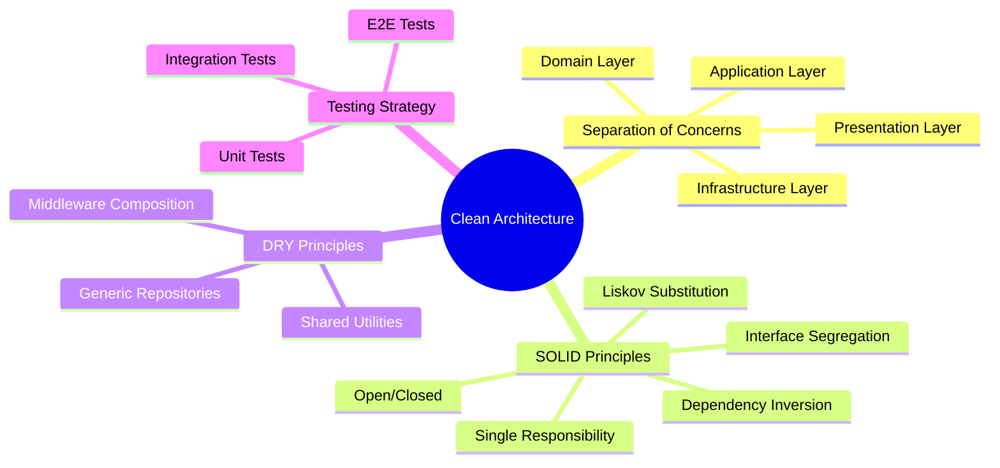

---

## 2. Layer Definitions

### 2.1 Architecture Overview

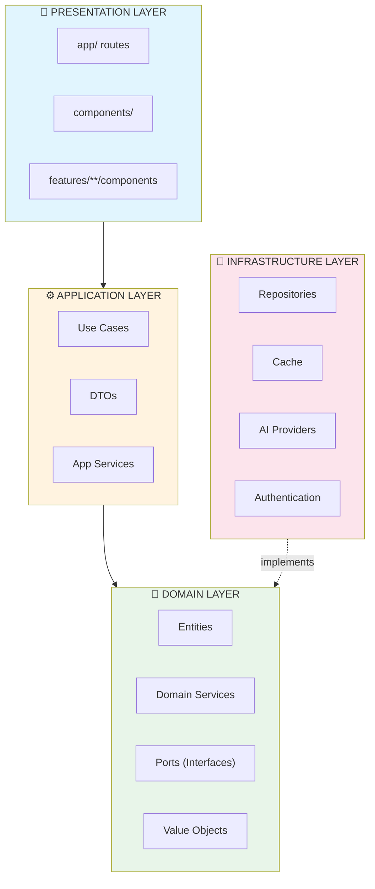

### 2.2 Layer Responsibilities

#### Presentation Layer
| Responsibility | ✅ SHOULD | ❌ SHOULD NOT |
|----------------|-----------|---------------|
| HTTP handling | Parse request, format response | Contain business logic |
| UI rendering | Display data, handle interactions | Access database directly |
| Input validation | Validate request shape (Zod) | Validate business rules |
| Error presentation | Format errors for client | Log errors |
| **Max LOC per file** | 50-100 lines | >150 lines |

#### Application Layer
| Responsibility | ✅ SHOULD | ❌ SHOULD NOT |
|----------------|-----------|---------------|
| Orchestration | Coordinate domain operations | Contain business rules |
| Transaction management | Define transaction boundaries | Execute SQL directly |
| DTO mapping | Transform domain ↔ presentation | Know about HTTP |
| Cross-cutting concerns | Apply logging, caching | Implement caching logic |
| **Max LOC per file** | 100-150 lines | >200 lines |

#### Domain Layer
| Responsibility | ✅ SHOULD | ❌ SHOULD NOT |
|----------------|-----------|---------------|
| Business logic | Implement rules and calculations | Access external systems |
| Domain entities | Define core data structures | Know about persistence |
| Validation rules | Validate business constraints | Handle HTTP errors |
| Domain services | Complex multi-entity operations | Depend on infrastructure |
| **Max LOC per file** | 50-200 lines | >300 lines |

#### Infrastructure Layer
| Responsibility | ✅ SHOULD | ❌ SHOULD NOT |
|----------------|-----------|---------------|
| Persistence | Implement repository interfaces | Contain business logic |
| External services | Wrap third-party APIs | Orchestrate operations |
| Caching | Implement cache strategies | Know about presentation |
| Configuration | Load and validate env vars | Make business decisions |
| **Max LOC per file** | 100-200 lines | >300 lines |

### 2.3 Layer Interaction Diagram

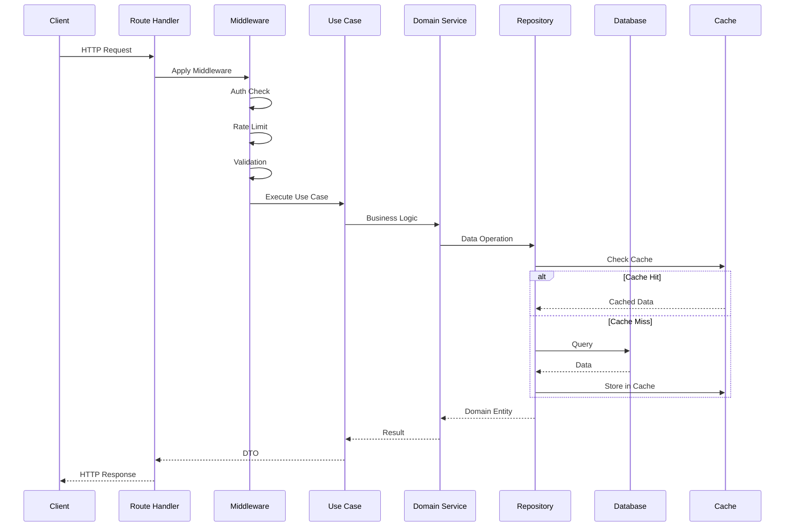

---

## 3. Visual Architecture Diagrams

### 3.1 Layer Dependency Flowchart

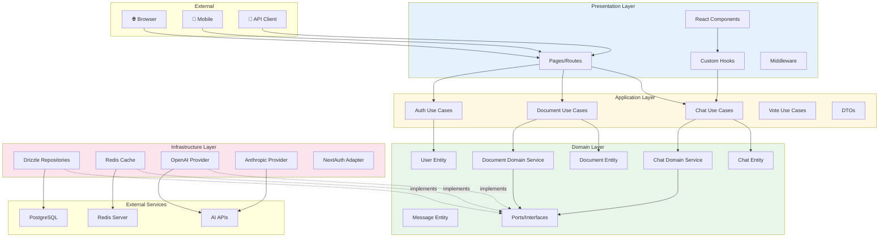

### 3.2 Request Flow Sequence Diagram

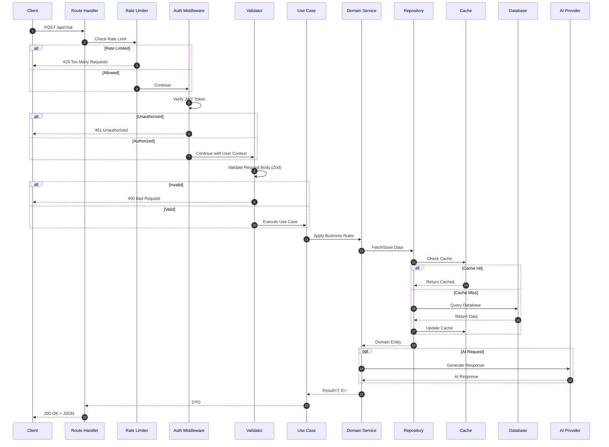

### 3.3 Component Architecture Diagrams

#### 3.3.1 Presentation Layer Components

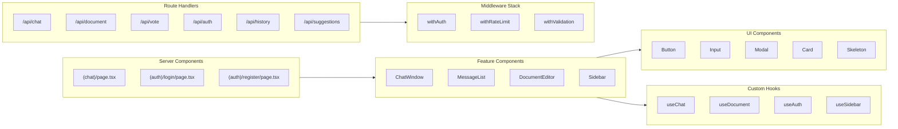

#### 3.3.2 Application Layer Components

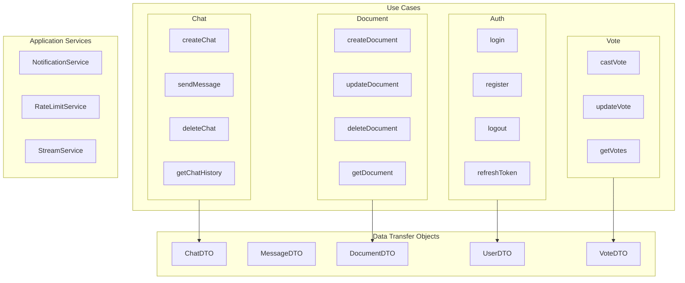

#### 3.3.3 Domain Layer Components

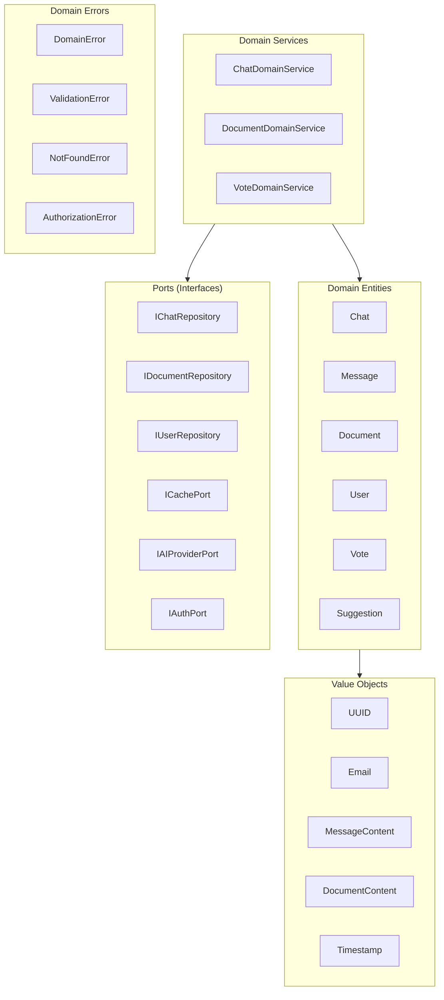

#### 3.3.4 Infrastructure Layer Components

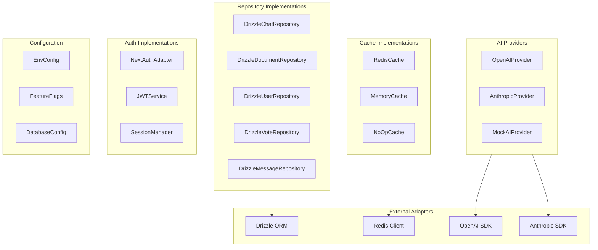

### 3.4 Database Schema ER Diagram

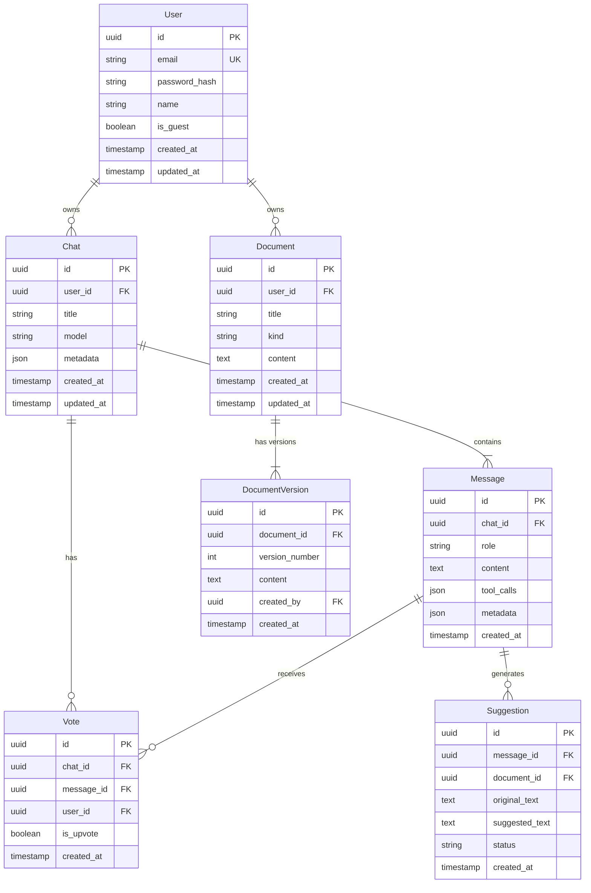

### 3.5 Cache Flow Diagram

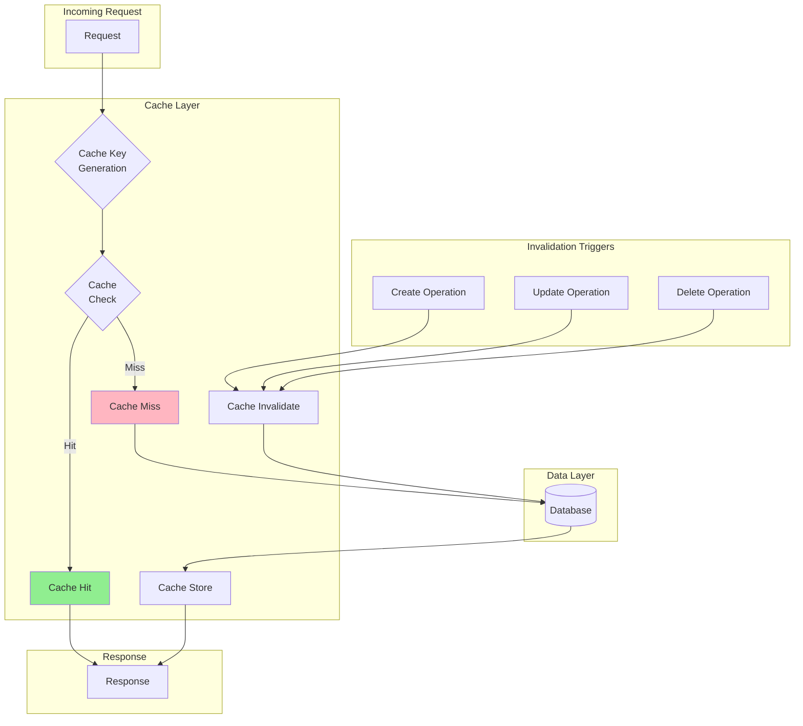

### 3.6 Auth Flow Sequence Diagram

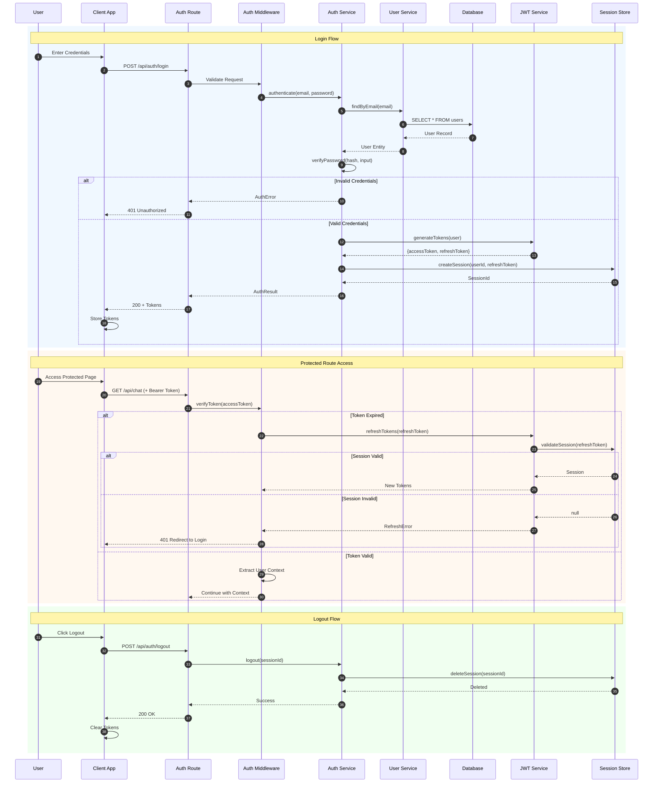

### 3.7 Error Handling Flow

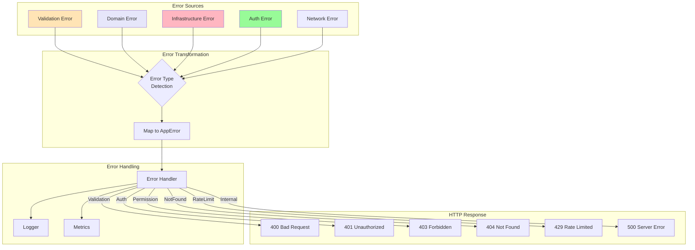

### 3.8 Feature Module Structure

```mermaid
flowchart TB
    subgraph Feature["Feature Module: Chat"]
        subgraph Components["components/"]
            ChatWindow["chat-window.tsx<br/>~150 LOC"]
            MessageList["message-list.tsx<br/>~100 LOC"]
            MessageItem["message-item.tsx<br/>~80 LOC"]
            ChatInput["chat-input.tsx<br/>~120 LOC"]
            ToolResult["tool-result.tsx<br/>~60 LOC"]
        end
        
        subgraph Hooks["hooks/"]
            useChat["use-chat.ts<br/>~80 LOC"]
            useMessages["use-messages.ts<br/>~60 LOC"]
            useStream["use-stream.ts<br/>~100 LOC"]
            useScroll["use-scroll.ts<br/>~40 LOC"]
        end
        
        subgraph Store["store/"]
            ChatStore["chat-store.ts<br/>~120 LOC"]
            MessageStore["message-store.ts<br/>~80 LOC"]
        end
        
        subgraph Types["types/"]
            ChatTypes["chat.types.ts<br/>~50 LOC"]
        end
        
        Index["index.ts<br/>Public API"]
    end
    
    Components --> Hooks
    Hooks --> Store
    Store --> Types
    Index --> Components
    Index --> Hooks
    
    style Feature fill:#E8F5E9
```

### 3.9 State Management Flow

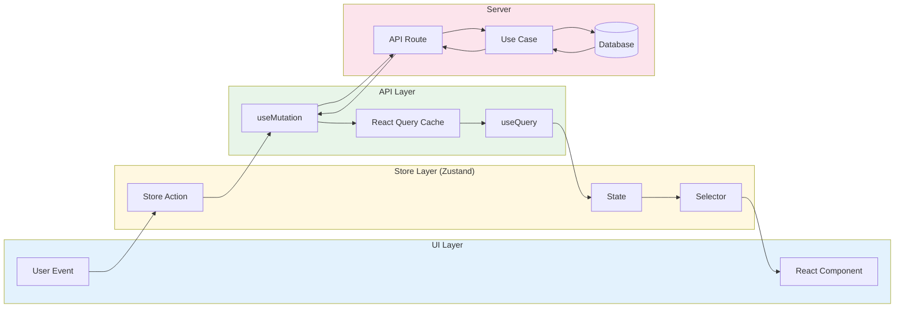

### 3.10 API Endpoint Mapping

```mermaid
flowchart TB
    subgraph API["API Routes"]
        subgraph Chat["/api/chat"]
            ChatGET["GET - List Chats"]
            ChatPOST["POST - Create Chat"]
            ChatDELETE["DELETE - Delete Chat"]
        end
        
        subgraph Message["/api/chat/:id/message"]
            MsgPOST["POST - Send Message"]
            MsgStream["POST - Stream Response"]
        end
        
        subgraph Document["/api/document"]
            DocGET["GET - Get Document"]
            DocPOST["POST - Create Document"]
            DocPATCH["PATCH - Update Document"]
            DocDELETE["DELETE - Delete Document"]
        end
        
        subgraph Vote["/api/vote"]
            VotePOST["POST - Cast Vote"]
            VotePATCH["PATCH - Update Vote"]
        end
        
        subgraph Auth["/api/auth"]
            AuthLogin["POST - Login"]
            AuthRegister["POST - Register"]
            AuthLogout["POST - Logout"]
            AuthRefresh["POST - Refresh Token"]
        end
        
        subgraph History["/api/history"]
            HistGET["GET - Get History"]
        end
        
        subgraph Suggestions["/api/suggestions"]
            SugGET["GET - Get Suggestions"]
            SugPOST["POST - Apply Suggestion"]
        end
    end
    
    subgraph UseCases["Use Cases"]
        UC1["createChat"]
        UC2["sendMessage"]
        UC3["createDocument"]
        UC4["updateVote"]
        UC5["login"]
        UC6["getChatHistory"]
    end
    
    ChatPOST --> UC1
    MsgPOST --> UC2
    DocPOST --> UC3
    VotePATCH --> UC4
    AuthLogin --> UC5
    HistGET --> UC6
```

### 3.11 Migration Phases Gantt Chart

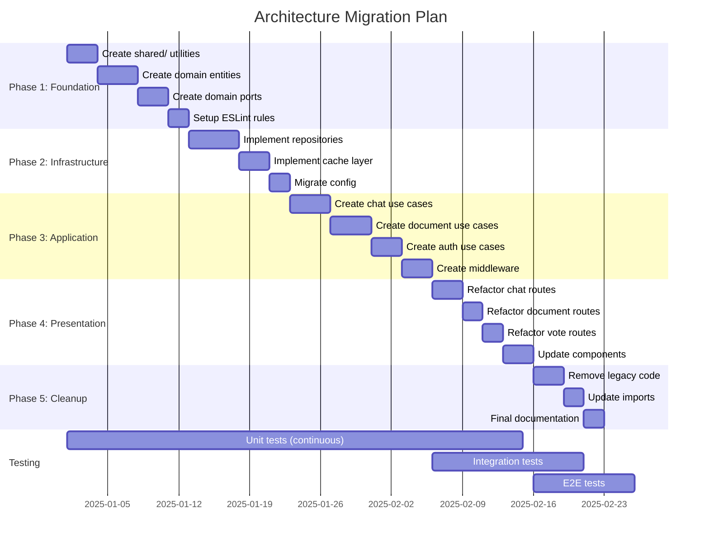

### 3.12 Test Coverage Matrix

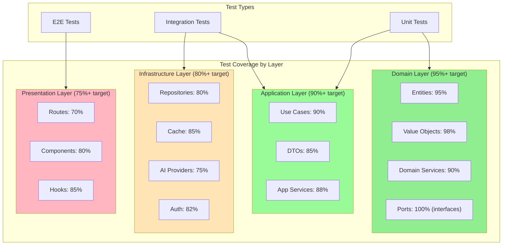

---

## 4. Folder Structure

### 3.1 Optimal Directory Layout

```
nextjs-ai-chatbot/
├── app/                              # Next.js App Router (Presentation)
│   ├── (auth)/                       # Auth route group
│   │   ├── login/page.tsx            # Thin: calls AuthUseCase
│   │   └── register/page.tsx
│   ├── (chat)/                       # Chat route group
│   │   ├── page.tsx                  # Server Component
│   │   └── chat/[id]/page.tsx
│   ├── api/                          # API Routes (thin controllers)
│   │   ├── chat/
│   │   │   └── route.ts              # MAX 50 LOC
│   │   ├── document/
│   │   │   └── route.ts
│   │   └── vote/
│   │       └── route.ts
│   ├── layout.tsx
│   └── globals.css
│
├── src/                              # Layered Architecture
│   ├── application/                  # Application Layer
│   │   ├── use-cases/
│   │   │   ├── chat/
│   │   │   │   ├── create-chat.ts
│   │   │   │   ├── send-message.ts
│   │   │   │   └── delete-chat.ts
│   │   │   ├── document/
│   │   │   │   ├── create-document.ts
│   │   │   │   └── update-document.ts
│   │   │   └── auth/
│   │   │       ├── login.ts
│   │   │       └── register.ts
│   │   ├── dto/
│   │   │   ├── chat.dto.ts
│   │   │   ├── document.dto.ts
│   │   │   └── user.dto.ts
│   │   └── services/
│   │       ├── notification-service.ts
│   │       └── rate-limit-service.ts
│   │
│   ├── domain/                       # Domain Layer
│   │   ├── entities/
│   │   │   ├── chat.ts
│   │   │   ├── message.ts
│   │   │   ├── document.ts
│   │   │   ├── user.ts
│   │   │   └── vote.ts
│   │   ├── services/
│   │   │   ├── chat-domain-service.ts
│   │   │   └── document-domain-service.ts
│   │   ├── ports/                    # Interfaces (Dependency Inversion)
│   │   │   ├── chat-repository.port.ts
│   │   │   ├── document-repository.port.ts
│   │   │   ├── cache.port.ts
│   │   │   └── ai-provider.port.ts
│   │   ├── value-objects/
│   │   │   ├── uuid.ts
│   │   │   ├── email.ts
│   │   │   └── message-content.ts
│   │   └── errors/
│   │       ├── domain-error.ts
│   │       └── validation-error.ts
│   │
│   └── infrastructure/               # Infrastructure Layer
│       ├── repositories/
│       │   ├── drizzle-chat-repository.ts
│       │   ├── drizzle-document-repository.ts
│       │   └── drizzle-user-repository.ts
│       ├── cache/
│       │   ├── redis-cache.ts
│       │   └── memory-cache.ts
│       ├── ai/
│       │   ├── openai-provider.ts
│       │   └── anthropic-provider.ts
│       ├── auth/
│       │   └── nextauth-adapter.ts
│       └── config/
│           ├── env.ts
│           └── feature-flags.ts
│
├── components/                       # Shared UI Components
│   ├── ui/                           # Atomic components
│   │   ├── button.tsx
│   │   └── input.tsx
│   └── common/                       # Composite components
│       ├── error-boundary.tsx
│       └── loading-spinner.tsx
│
├── features/                         # Feature Modules (Vertical Slices)
│   ├── chat/
│   │   ├── components/               # Feature-specific UI
│   │   │   ├── chat-window.tsx
│   │   │   └── message-list.tsx
│   │   ├── hooks/                    # Feature-specific hooks
│   │   │   ├── use-chat.ts
│   │   │   └── use-messages.ts
│   │   └── store/                    # Feature-specific state
│   │       └── chat-store.ts
│   ├── documents/
│   │   ├── components/
│   │   ├── hooks/
│   │   └── store/
│   └── sidebar/
│       ├── components/
│       ├── hooks/
│       └── store/
│
├── shared/                           # Cross-Cutting Utilities
│   ├── lib/                          # Pure utilities
│   │   ├── result.ts                 # Result<T,E> type
│   │   ├── uuid.ts                   # UUID utilities
│   │   └── date.ts                   # Date utilities
│   ├── validation/                   # Shared Zod schemas
│   │   ├── schemas/
│   │   │   ├── chat.schema.ts
│   │   │   └── document.schema.ts
│   │   └── validators.ts
│   ├── errors/                       # Error handling
│   │   ├── app-error.ts
│   │   ├── error-handler.ts
│   │   └── error-codes.ts
│   ├── types/                        # Shared TypeScript types
│   │   ├── api.ts
│   │   └── common.ts
│   └── constants/                    # Application constants
│       ├── config.ts
│       └── limits.ts
│
├── tests/                            # Test files (mirror src/)
│   ├── unit/
│   │   ├── domain/
│   │   ├── application/
│   │   └── infrastructure/
│   ├── integration/
│   └── e2e/
│
└── lib/                              # Legacy (to migrate)
    └── [existing files...]
```

### 3.2 File Naming Conventions

| Layer | Pattern | Example |
|-------|---------|---------|
| Use Cases | `[verb]-[entity].ts` | `create-chat.ts`, `send-message.ts` |
| Entities | `[entity].ts` | `chat.ts`, `document.ts` |
| Ports | `[entity]-[type].port.ts` | `chat-repository.port.ts` |
| Repositories | `[db]-[entity]-repository.ts` | `drizzle-chat-repository.ts` |
| DTOs | `[entity].dto.ts` | `chat.dto.ts` |
| Schemas | `[entity].schema.ts` | `chat.schema.ts` |
| Components | `[component-name].tsx` | `message-list.tsx` |
| Hooks | `use-[name].ts` | `use-chat.ts` |
| Stores | `[name]-store.ts` | `chat-store.ts` |

---

## 4. Dependency Rules

### 4.1 Allowed Dependencies

```
┌─────────────────────────────────────────────────────────────┐
│ PRESENTATION can import:                                │
│   ✅ Application (use cases, DTOs)                      │
│   ✅ Shared (validation, errors, types)                 │
│   ✅ Components                                         │
│   ❌ Domain (entities, services) - INDIRECT ONLY        │
│   ❌ Infrastructure (repositories, cache)               │
└─────────────────────────────────────────────────────────────┘
                              │
                              ▼
┌─────────────────────────────────────────────────────────────┐
│ APPLICATION can import:                                 │
│   ✅ Domain (entities, services, ports)                 │
│   ✅ Shared (validation, errors, types)                 │
│   ❌ Presentation (routes, components)                  │
│   ❌ Infrastructure - via PORTS ONLY                    │
└─────────────────────────────────────────────────────────────┘
                              │
                              ▼
┌─────────────────────────────────────────────────────────────┐
│ DOMAIN can import:                                      │
│   ✅ Shared/lib (pure utilities)                        │
│   ✅ Own entities, value objects, errors                │
│   ❌ Application                                        │
│   ❌ Presentation                                       │
│   ❌ Infrastructure                                     │
└─────────────────────────────────────────────────────────────┘
                              │
                              ▼
┌─────────────────────────────────────────────────────────────┐
│ INFRASTRUCTURE can import:                              │
│   ✅ Domain (implements ports)                          │
│   ✅ Shared (utilities, types)                          │
│   ✅ External libraries (drizzle, redis, etc.)          │
│   ❌ Application                                        │
│   ❌ Presentation                                       │
└─────────────────────────────────────────────────────────────┘
```

### 4.2 ESLint Import Rules

```javascript
// .eslintrc.js
module.exports = {
  rules: {
    'import/no-restricted-paths': [
      'error',
      {
        zones: [
          // Domain cannot import Application, Presentation, Infrastructure
          {
            target: './src/domain/**/*',
            from: './src/application/**/*',
            message: 'Domain layer cannot import from Application layer'
          },
          {
            target: './src/domain/**/*',
            from: './src/infrastructure/**/*',
            message: 'Domain layer cannot import from Infrastructure layer'
          },
          {
            target: './src/domain/**/*',
            from: './app/**/*',
            message: 'Domain layer cannot import from Presentation layer'
          },
          
          // Application cannot import Presentation, Infrastructure (direct)
          {
            target: './src/application/**/*',
            from: './app/**/*',
            message: 'Application layer cannot import from Presentation layer'
          },
          {
            target: './src/application/**/*',
            from: './src/infrastructure/**/*',
            except: ['./src/domain/ports/**/*'],
            message: 'Application layer must use ports, not infrastructure directly'
          },
          
          // Presentation cannot import Infrastructure
          {
            target: './app/**/*',
            from: './src/infrastructure/**/*',
            message: 'Presentation layer cannot import from Infrastructure layer'
          }
        ]
      }
    ]
  }
};
```

---

## 5. SRP Guidelines

### 5.1 Route Handler (Thin Controller)

**BEFORE** (❌ 9+ concerns mixed):
```typescript
// app/api/vote/route.ts - 123 lines, 9 concerns
export async function PATCH(request: Request) {
  // 1. Rate limiting
  const { success } = await rateLimit.limit(ip);
  if (!success) return Response.json({ error: 'Rate limited' }, { status: 429 });
  
  // 2. Authentication
  const session = await getSession();
  if (!session) return Response.json({ error: 'Unauthorized' }, { status: 401 });
  
  // 3. Body parsing
  const body = await request.json();
  
  // 4. Validation
  const result = VoteSchema.safeParse(body);
  if (!result.success) return Response.json({ errors: result.error }, { status: 400 });
  
  // 5. Authorization (ownership check)
  const chat = await db.chat.findUnique({ where: { id: body.chatId } });
  if (chat.userId !== session.user.id) return Response.json({ error: 'Forbidden' }, { status: 403 });
  
  // 6. Business logic
  const existingVote = await db.vote.findFirst({ where: { messageId: body.messageId } });
  if (existingVote) {
    // Update logic...
  } else {
    // Create logic...
  }
  
  // 7. Database operation
  const vote = await db.vote.upsert({ ... });
  
  // 8. Error handling
  // try-catch wrapped around everything
  
  // 9. Response formatting
  return Response.json({ success: true, data: vote });
}
```

**AFTER** (✅ Single responsibility):
```typescript
// app/api/vote/route.ts - 25 lines, 1 concern: HTTP handling
import { withAuth, withRateLimit, withValidation } from '@/shared/middleware';
import { updateVote } from '@/src/application/use-cases/vote/update-vote';
import { VoteSchema } from '@/shared/validation/schemas/vote.schema';

export const PATCH = withRateLimit(
  withAuth(
    withValidation(VoteSchema)(
      async (request, { session, body }) => {
        const result = await updateVote({
          userId: session.user.id,
          messageId: body.messageId,
          chatId: body.chatId,
          isUpvote: body.isUpvote
        });
        
        if (!result.success) {
          return Response.json({ error: result.error.message }, { 
            status: result.error.code 
          });
        }
        
        return Response.json({ success: true, data: result.data });
      }
    )
  )
);
```

### 5.2 Use Case (Single Operation)

**BEFORE** (❌ Multiple responsibilities):
```typescript
// lib/services/vote-service.ts - handles multiple operations
export class VoteService {
  async createVote(...) { /* 50 lines */ }
  async updateVote(...) { /* 60 lines */ }
  async deleteVote(...) { /* 40 lines */ }
  async getVotes(...) { /* 30 lines */ }
  // + error handling, logging, caching all mixed
}
```

**AFTER** (✅ One use case per file):
```typescript
// src/application/use-cases/vote/update-vote.ts
import type { Result } from '@/shared/lib/result';
import type { Vote } from '@/src/domain/entities/vote';
import type { VoteRepository } from '@/src/domain/ports/vote-repository.port';
import { UpdateVoteError } from '@/src/domain/errors/vote-error';

interface UpdateVoteInput {
  userId: string;
  messageId: string;
  chatId: string;
  isUpvote: boolean;
}

export async function updateVote(
  input: UpdateVoteInput,
  deps: { voteRepository: VoteRepository }
): Promise<Result<Vote, UpdateVoteError>> {
  // 1. Check authorization (via domain service)
  const canVote = await deps.voteRepository.canUserVote(input.userId, input.chatId);
  if (!canVote) {
    return { success: false, error: new UpdateVoteError('FORBIDDEN') };
  }
  
  // 2. Execute domain logic
  const vote = await deps.voteRepository.upsertVote(input);
  
  return { success: true, data: vote };
}
```

### 5.3 File Size Limits

| Layer | Max Lines | Max Functions | Reason |
|-------|-----------|---------------|--------|
| Route handler | 50 | 1-2 | Thin controller |
| Use case | 100 | 1 (main) + helpers | Single operation |
| Domain entity | 150 | N/A | All entity logic |
| Domain service | 200 | 3-5 | Related operations |
| Repository | 200 | 5-10 | CRUD + queries |
| Component | 150 | 1 (render) + handlers | Single UI concern |
| Hook | 100 | 1 (main) + helpers | Single state concern |

---

## 6. DRY Implementation

### 6.1 Shared Utilities Location

| Category | Location | Contents |
|----------|----------|----------|
| Pure Functions | `shared/lib/` | `result.ts`, `uuid.ts`, `date.ts` |
| Validation | `shared/validation/` | Zod schemas, validators |
| Error Handling | `shared/errors/` | Error classes, handler |
| Types | `shared/types/` | API types, common types |
| Constants | `shared/constants/` | Config values, limits |

### 6.2 Abstraction Patterns

#### Result Type (DRY Error Handling)
```typescript
// shared/lib/result.ts
export type Result<T, E = AppError> = 
  | { success: true; data: T }
  | { success: false; error: E };

// Usage - replaces 17 duplicate try-catch blocks
const result = await createChat(input);
if (!result.success) {
  return handleError(result.error);
}
return result.data;
```

#### Middleware Composition (DRY Route Logic)
```typescript
// shared/middleware/index.ts
export const withAuth = <T>(handler: AuthenticatedHandler<T>) => 
  async (request: Request) => {
    const session = await getSession();
    if (!session) return unauthorized();
    return handler(request, { session });
  };

export const withValidation = <T>(schema: ZodSchema<T>) => 
  <R>(handler: ValidatedHandler<T, R>) => 
    async (request: Request, context: any) => {
      const body = await request.json();
      const result = schema.safeParse(body);
      if (!result.success) return validationError(result.error);
      return handler(request, { ...context, body: result.data });
    };

// Compose: replaces 10+ duplicate validation blocks
export const PATCH = withRateLimit(withAuth(withValidation(Schema)(handler)));
```

#### Repository Port (DRY Data Access)
```typescript
// src/domain/ports/repository.port.ts
export interface Repository<T, ID> {
  findById(id: ID): Promise<T | null>;
  findAll(filter?: Partial<T>): Promise<T[]>;
  create(entity: Omit<T, 'id'>): Promise<T>;
  update(id: ID, entity: Partial<T>): Promise<T>;
  delete(id: ID): Promise<void>;
}

// Implements once, used everywhere
export interface ChatRepository extends Repository<Chat, string> {
  findByUserId(userId: string): Promise<Chat[]>;
  findWithMessages(chatId: string): Promise<ChatWithMessages | null>;
}
```

---

## 7. Pattern Catalog

### 7.1 Result Type Pattern

```typescript
// shared/lib/result.ts
export type Result<T, E = AppError> = 
  | { success: true; data: T }
  | { success: false; error: E };

export const ok = <T>(data: T): Result<T, never> => ({ success: true, data });
export const err = <E>(error: E): Result<never, E> => ({ success: false, error });

// Chaining
export const map = <T, U, E>(
  result: Result<T, E>, 
  fn: (data: T) => U
): Result<U, E> => 
  result.success ? ok(fn(result.data)) : result;

export const flatMap = <T, U, E>(
  result: Result<T, E>, 
  fn: (data: T) => Result<U, E>
): Result<U, E> => 
  result.success ? fn(result.data) : result;
```

### 7.2 Error Handling Pattern

```typescript
// shared/errors/app-error.ts
export class AppError extends Error {
  constructor(
    public readonly code: ErrorCode,
    message: string,
    public readonly statusCode: number = 500,
    public readonly details?: unknown
  ) {
    super(message);
    this.name = 'AppError';
  }
  
  static validation(message: string, details?: unknown): AppError {
    return new AppError('VALIDATION_ERROR', message, 400, details);
  }
  
  static notFound(entity: string): AppError {
    return new AppError('NOT_FOUND', `${entity} not found`, 404);
  }
  
  static unauthorized(): AppError {
    return new AppError('UNAUTHORIZED', 'Authentication required', 401);
  }
  
  static forbidden(): AppError {
    return new AppError('FORBIDDEN', 'Access denied', 403);
  }
}

// shared/errors/error-handler.ts
export function handleError(error: AppError): Response {
  // Log error
  errorLogger.error(error.code, error.message, error.details);
  
  // Return appropriate response
  return Response.json(
    { error: error.message, code: error.code },
    { status: error.statusCode }
  );
}
```

### 7.3 Validation Pattern

```typescript
// shared/validation/schemas/chat.schema.ts
import { z } from 'zod';

export const CreateChatSchema = z.object({
  title: z.string().min(1).max(200),
  model: z.enum(['gpt-4', 'gpt-3.5-turbo', 'claude-3']).default('gpt-4'),
});

export const SendMessageSchema = z.object({
  chatId: z.string().uuid(),
  content: z.string().min(1).max(10000),
});

export type CreateChatInput = z.infer<typeof CreateChatSchema>;
export type SendMessageInput = z.infer<typeof SendMessageSchema>;

// shared/validation/validators.ts
export function validate<T>(schema: z.ZodSchema<T>, data: unknown): Result<T, AppError> {
  const result = schema.safeParse(data);
  if (!result.success) {
    return err(AppError.validation('Validation failed', result.error.flatten()));
  }
  return ok(result.data);
}
```

### 7.4 Auth Pattern

```typescript
// shared/middleware/auth.ts
import { getSession } from '@/src/infrastructure/auth/nextauth-adapter';
import { AppError } from '@/shared/errors/app-error';

export interface AuthContext {
  session: Session;
  user: User;
}

export function withAuth<T>(
  handler: (request: Request, context: AuthContext) => Promise<T>
) {
  return async (request: Request): Promise<T | Response> => {
    const session = await getSession();
    
    if (!session?.user) {
      return Response.json(
        { error: 'Authentication required' },
        { status: 401 }
      );
    }
    
    return handler(request, { session, user: session.user });
  };
}

// Guard for regular users (not guests)
export function withRegularUser<T>(
  handler: (request: Request, context: AuthContext) => Promise<T>
) {
  return withAuth(async (request, context) => {
    if (context.user.isGuest) {
      return Response.json(
        { error: 'Feature not available for guest users' },
        { status: 403 }
      );
    }
    return handler(request, context);
  });
}
```

### 7.5 Cache Pattern

```typescript
// src/domain/ports/cache.port.ts
export interface CachePort {
  get<T>(key: string): Promise<T | null>;
  set<T>(key: string, value: T, ttlSeconds?: number): Promise<void>;
  delete(key: string): Promise<void>;
  invalidatePattern(pattern: string): Promise<void>;
}

// src/infrastructure/cache/redis-cache.ts
export class RedisCache implements CachePort {
  constructor(private client: Redis) {}
  
  async get<T>(key: string): Promise<T | null> {
    const value = await this.client.get(key);
    return value ? JSON.parse(value) : null;
  }
  
  async set<T>(key: string, value: T, ttlSeconds = 300): Promise<void> {
    await this.client.set(key, JSON.stringify(value), 'EX', ttlSeconds);
  }
  
  async delete(key: string): Promise<void> {
    await this.client.del(key);
  }
  
  async invalidatePattern(pattern: string): Promise<void> {
    const keys = await this.client.keys(pattern);
    if (keys.length > 0) {
      await this.client.del(...keys);
    }
  }
}

// Usage with cache-aside pattern
export async function getChatWithCache(
  chatId: string,
  deps: { cache: CachePort; chatRepo: ChatRepository }
): Promise<Result<Chat, AppError>> {
  // 1. Try cache
  const cached = await deps.cache.get<Chat>(`chat:${chatId}`);
  if (cached) return ok(cached);
  
  // 2. Fetch from database
  const chat = await deps.chatRepo.findById(chatId);
  if (!chat) return err(AppError.notFound('Chat'));
  
  // 3. Cache for next time
  await deps.cache.set(`chat:${chatId}`, chat, 300);
  
  return ok(chat);
}
```

---

## 8. Migration Path

### 8.1 Phase Overview

| Phase | Duration | Focus | Risk |
|-------|----------|-------|------|
| **Phase 1** | Week 1-2 | Foundation (shared/, domain/) | Low |
| **Phase 2** | Week 3-4 | Infrastructure (repositories, cache) | Medium |
| **Phase 3** | Week 5-6 | Application (use cases) | Medium |
| **Phase 4** | Week 7 | Presentation (route refactoring) | High |
| **Phase 5** | Week 8 | Cleanup (remove lib/, legacy) | Low |

### 8.2 Phase 1: Foundation (Week 1-2)

**Goals**:
- Create shared/ directory with core utilities
- Create src/domain/ with entities and ports
- Set up ESLint import rules

**Tasks**:
1. Create `shared/lib/result.ts`
2. Create `shared/validation/` with Zod schemas
3. Create `shared/errors/` with error classes
4. Create `src/domain/entities/` (Chat, Document, User, Vote, Message)
5. Create `src/domain/ports/` (Repository interfaces)
6. Configure ESLint import restrictions

**Files to Create**: ~25 files
**Risk**: Low (additive changes only)

### 8.3 Phase 2: Infrastructure (Week 3-4)

**Goals**:
- Implement repository ports with Drizzle
- Centralize cache implementation
- Migrate config to infrastructure

**Tasks**:
1. Create `src/infrastructure/repositories/` implementing ports
2. Create `src/infrastructure/cache/` (Redis, Memory)
3. Migrate `lib/config/` to `src/infrastructure/config/`
4. Migrate `lib/db/` to `src/infrastructure/repositories/`

**Files to Migrate**: ~15 files
**Risk**: Medium (data layer changes)

### 8.4 Phase 3: Application (Week 5-6)

**Goals**:
- Create use cases for all operations
- Implement middleware composition
- Remove business logic from routes

**Tasks**:
1. Create `src/application/use-cases/chat/`
2. Create `src/application/use-cases/document/`
3. Create `src/application/use-cases/auth/`
4. Create `shared/middleware/` (auth, validation, rate-limit)

**Files to Create**: ~30 files
**Risk**: Medium (logic extraction)

### 8.5 Phase 4: Presentation (Week 7)

**Goals**:
- Refactor route handlers to thin controllers
- Connect to use cases
- Apply middleware composition

**Tasks**:
1. Refactor `app/api/chat/route.ts`
2. Refactor `app/api/document/route.ts`
3. Refactor `app/api/vote/route.ts`
4. Refactor `app/api/suggestions/route.ts`
5. Update feature components to use new patterns

**Files to Modify**: ~15 files
**Risk**: High (public API changes, requires thorough testing)

### 8.6 Phase 5: Cleanup (Week 8)

**Goals**:
- Remove legacy code
- Update imports throughout
- Final documentation

**Tasks**:
1. Remove deprecated `lib/services/`
2. Remove duplicate utilities
3. Update all imports to new locations
4. Update documentation (README, API docs)
5. Final ESLint/TypeScript cleanup

**Files to Delete**: ~30 files
**Risk**: Low (removing unused code)

---

## Appendix A: Architecture Decision Records

| ADR | Decision | Rationale |
|-----|----------|-----------|
| ADR-001 | 4-Layer Clean Architecture | Best balance of SRP compliance and migration effort |
| ADR-002 | `src/` for layers, `app/` for Next.js | Separates business logic from framework code |
| ADR-003 | Result<T,E> over exceptions | Explicit error handling, better type safety |
| ADR-004 | Domain ports for infrastructure | Dependency inversion, testability |
| ADR-005 | Middleware composition | DRY route logic, composable concerns |

## Appendix B: Metrics Before/After

| Metric | Before | After (Target) |
|--------|--------|----------------|
| Route handler LOC | 123 avg | 25 avg |
| Cyclomatic complexity | 12 avg | <5 avg |
| Duplication | ~7,000 LOC | <500 LOC |
| Test coverage | ~70% | >85% |
| Layer bypass violations | 265+ | 0 |
| File count | 200 | 280 (+80) |
| Total LOC | X | X - 6,000 |

---

*Generated by Ouroboros System*
*Layered Architecture Report Version 1.0*
