# Enhanced Layered Architecture Report v2.0

> **Application**: Next.js AI Chatbot
> **Framework**: Next.js 14+ (App Router)
> **Architecture Style**: Clean Architecture (4-Layer)
> **Version**: 2.0 (Enhanced)
> **Last Updated**: 2025-01

---

## Executive Summary

This document provides a comprehensive layered architecture specification for the Next.js AI Chatbot application. It enforces:

- **SRP (Single Responsibility Principle)**: Each module has exactly one reason to change
- **Separation of Concerns**: Clear boundaries between UI, business logic, and data access
- **No Layer Bypass**: Strict top-down dependencies enforced via ESLint
- **DRY (Don't Repeat Yourself)**: Centralized utilities and patterns

---

## 1. Architecture Overview

### 1.1 Layer Dependency Diagram

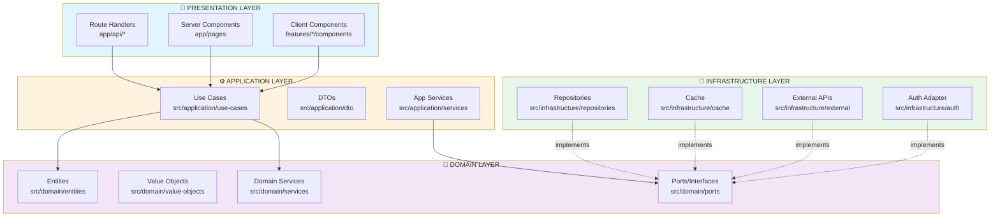

### 1.2 Request Flow Sequence

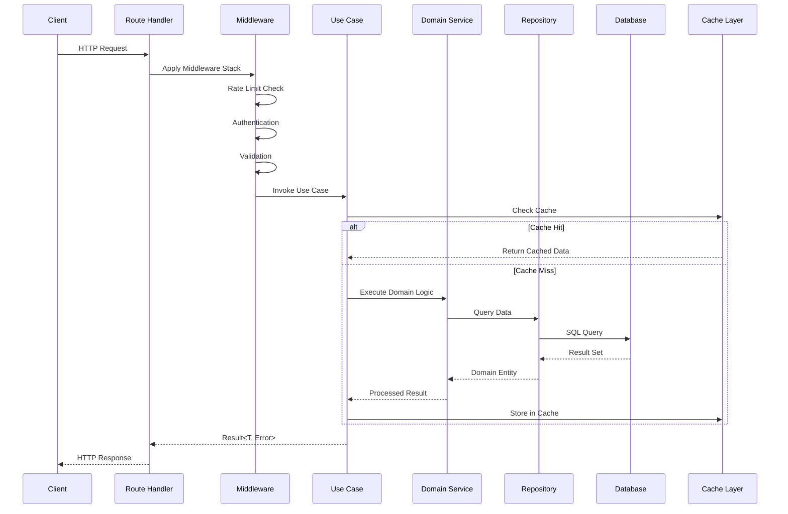

### 1.3 Error Flow Diagram

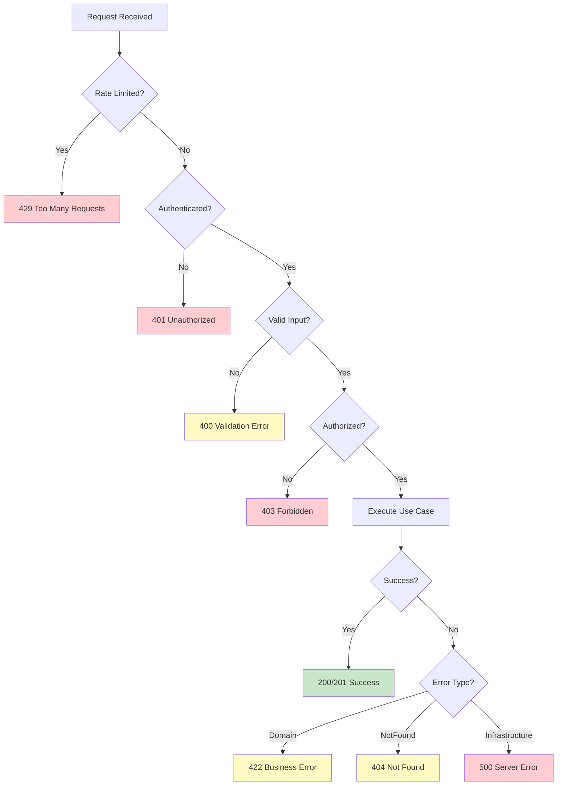

---

## 2. Layer Specifications

### 2.1 Presentation Layer Architecture

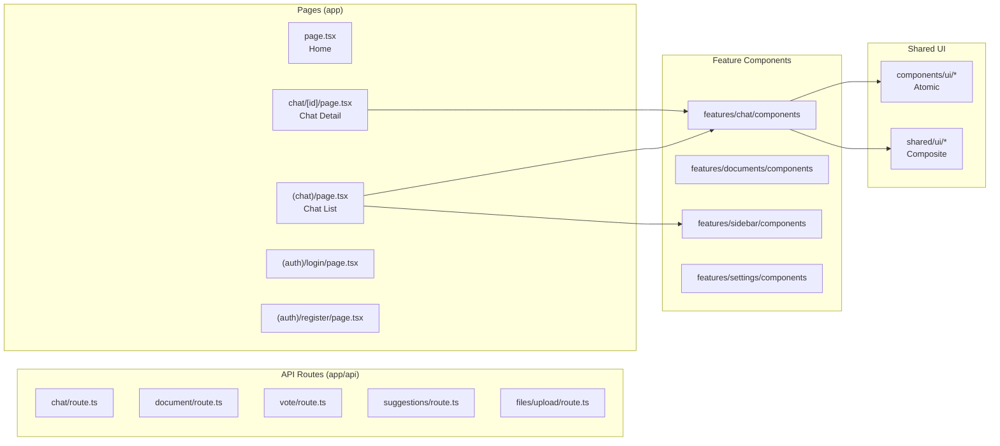

#### 2.1.1 Route Handler Specification

| Route | Method | Handler | Use Case | Max LOC |
|-------|--------|---------|----------|---------|
| `/api/chat` | POST | createChatHandler | CreateChatUseCase | 30 |
| `/api/chat` | GET | listChatsHandler | ListChatsUseCase | 25 |
| `/api/chat/[id]` | GET | getChatHandler | GetChatUseCase | 25 |
| `/api/chat/[id]` | DELETE | deleteChatHandler | DeleteChatUseCase | 25 |
| `/api/chat/[id]/messages` | POST | sendMessageHandler | SendMessageUseCase | 35 |
| `/api/document` | POST | createDocumentHandler | CreateDocumentUseCase | 30 |
| `/api/document/[id]` | GET | getDocumentHandler | GetDocumentUseCase | 25 |
| `/api/document/[id]` | PATCH | updateDocumentHandler | UpdateDocumentUseCase | 30 |
| `/api/vote` | PATCH | updateVoteHandler | UpdateVoteUseCase | 25 |
| `/api/suggestions` | GET | getSuggestionsHandler | GetSuggestionsUseCase | 25 |

### 2.2 Application Layer Architecture

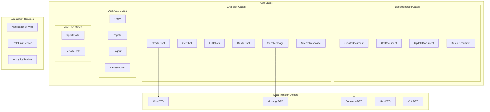

#### 2.2.1 Use Case File Specification

```
src/application/use-cases/
├── chat/
│   ├── create-chat.ts          # 80 LOC, deps: ChatRepository, UserRepository
│   ├── get-chat.ts             # 60 LOC, deps: ChatRepository, CachePort
│   ├── list-chats.ts           # 70 LOC, deps: ChatRepository, CachePort
│   ├── delete-chat.ts          # 50 LOC, deps: ChatRepository, MessageRepository
│   ├── send-message.ts         # 120 LOC, deps: ChatRepo, MessageRepo, AIPort
│   ├── stream-response.ts      # 100 LOC, deps: AIPort, ChatRepository
│   └── index.ts                # 15 LOC, barrel export
├── document/
│   ├── create-document.ts      # 90 LOC, deps: DocumentRepository, StoragePort
│   ├── get-document.ts         # 55 LOC, deps: DocumentRepository, CachePort
│   ├── update-document.ts      # 85 LOC, deps: DocumentRepository
│   ├── delete-document.ts      # 50 LOC, deps: DocumentRepository, StoragePort
│   └── index.ts                # 10 LOC
├── auth/
│   ├── login.ts                # 70 LOC, deps: UserRepository, AuthPort
│   ├── register.ts             # 90 LOC, deps: UserRepository, AuthPort
│   ├── logout.ts               # 30 LOC, deps: SessionRepository
│   ├── refresh-token.ts        # 60 LOC, deps: AuthPort
│   └── index.ts                # 10 LOC
├── vote/
│   ├── update-vote.ts          # 75 LOC, deps: VoteRepository, ChatRepository
│   ├── get-vote-stats.ts       # 50 LOC, deps: VoteRepository, CachePort
│   └── index.ts                # 5 LOC
└── suggestions/
    ├── get-suggestions.ts      # 80 LOC, deps: AIPort, ChatRepository
    └── index.ts                # 5 LOC
```

### 2.3 Domain Layer Architecture

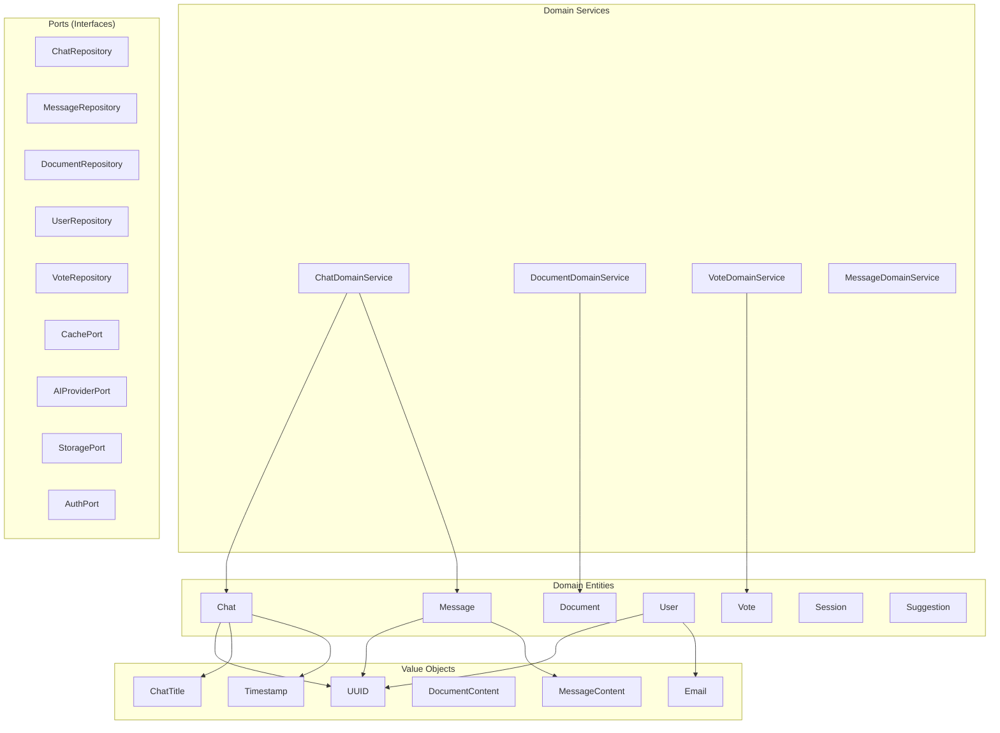

#### 2.3.1 Entity Specifications

| Entity | Properties | Value Objects | Methods | LOC |
|--------|------------|---------------|---------|-----|
| Chat | id, title, userId, model, createdAt, updatedAt | UUID, ChatTitle, Timestamp | validate(), toDTO() | 80 |
| Message | id, chatId, role, content, createdAt | UUID, MessageContent, Timestamp | isFromUser(), isFromAI() | 70 |
| Document | id, title, content, kind, userId, createdAt | UUID, DocumentContent | canEdit(user), toDTO() | 90 |
| User | id, email, name, isGuest, createdAt | UUID, Email | isAuthenticated(), hasAccess(resource) | 75 |
| Vote | id, messageId, chatId, isUpvote | UUID | toggle(), toDTO() | 40 |
| Session | id, userId, token, expiresAt | UUID, Timestamp | isExpired(), refresh() | 50 |

### 2.4 Infrastructure Layer Architecture

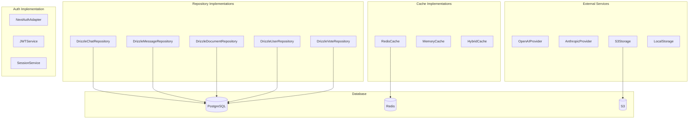

---

## 3. Complete File Architecture

### 3.1 Project Root Structure

```
nextjs-ai-chatbot/
├── 📁 app/                           # Next.js App Router (PRESENTATION)
├── 📁 src/                           # Layered Architecture (CORE)
│   ├── 📁 application/               # Application Layer
│   ├── 📁 domain/                    # Domain Layer
│   └── 📁 infrastructure/            # Infrastructure Layer
├── 📁 features/                      # Vertical Feature Slices
├── 📁 components/                    # Shared UI Components
├── 📁 shared/                        # Cross-Cutting Concerns
├── 📁 tests/                         # Test Suite
├── 📁 lib/                           # Legacy (to migrate)
└── 📁 public/                        # Static Assets
```

### 3.2 App Directory (Presentation)

```
app/
├── 📄 layout.tsx                     # Root layout, providers
├── 📄 page.tsx                       # Home redirect
├── 📄 globals.css                    # Global styles
├── 📄 head.tsx                       # Meta tags
├── 📄 global-error.tsx               # Error boundary
│
├── 📁 (auth)/                        # Auth route group
│   ├── 📄 layout.tsx                 # Auth layout (centered form)
│   ├── 📁 login/
│   │   └── 📄 page.tsx               # Login page (45 LOC)
│   └── 📁 register/
│       └── 📄 page.tsx               # Register page (50 LOC)
│
├── 📁 (chat)/                        # Chat route group
│   ├── 📄 layout.tsx                 # Chat layout with sidebar
│   ├── 📄 page.tsx                   # Chat list (35 LOC)
│   ├── 📄 loading.tsx                # Suspense fallback
│   ├── 📄 error.tsx                  # Error UI
│   └── 📁 chat/
│       └── 📁 [id]/
│           └── 📄 page.tsx           # Chat detail (40 LOC)
│
└── 📁 api/                           # API Routes (thin controllers)
    ├── 📁 chat/
    │   ├── 📄 route.ts               # POST, GET (55 LOC total)
    │   └── 📁 [id]/
    │       ├── 📄 route.ts           # GET, DELETE (45 LOC)
    │       └── 📁 messages/
    │           └── 📄 route.ts       # POST stream (60 LOC)
    ├── 📁 document/
    │   ├── 📄 route.ts               # POST (30 LOC)
    │   └── 📁 [id]/
    │       └── 📄 route.ts           # GET, PATCH, DELETE (70 LOC)
    ├── 📁 vote/
    │   └── 📄 route.ts               # PATCH (25 LOC)
    ├── 📁 suggestions/
    │   └── 📄 route.ts               # GET (25 LOC)
    ├── 📁 files/
    │   └── 📁 upload/
    │       └── 📄 route.ts           # POST (40 LOC)
    ├── 📁 auth/
    │   └── 📁 [...nextauth]/
    │       └── 📄 route.ts           # NextAuth handler (15 LOC)
    ├── 📁 health/
    │   └── 📄 route.ts               # Health check (10 LOC)
    └── 📁 history/
        └── 📄 route.ts               # GET chat history (25 LOC)
```

### 3.3 Source Directory (Core Layers)

```
src/
├── 📁 application/                   # APPLICATION LAYER
│   ├── 📁 use-cases/
│   │   ├── 📁 chat/
│   │   │   ├── 📄 create-chat.ts     # 80 LOC
│   │   │   ├── 📄 get-chat.ts        # 60 LOC
│   │   │   ├── 📄 list-chats.ts      # 70 LOC
│   │   │   ├── 📄 delete-chat.ts     # 50 LOC
│   │   │   ├── 📄 send-message.ts    # 120 LOC
│   │   │   ├── 📄 stream-response.ts # 100 LOC
│   │   │   └── 📄 index.ts           # 15 LOC
│   │   ├── 📁 document/
│   │   │   ├── 📄 create-document.ts # 90 LOC
│   │   │   ├── 📄 get-document.ts    # 55 LOC
│   │   │   ├── 📄 update-document.ts # 85 LOC
│   │   │   ├── 📄 delete-document.ts # 50 LOC
│   │   │   └── 📄 index.ts
│   │   ├── 📁 auth/
│   │   │   ├── 📄 login.ts           # 70 LOC
│   │   │   ├── 📄 register.ts        # 90 LOC
│   │   │   ├── 📄 logout.ts          # 30 LOC
│   │   │   ├── 📄 refresh-token.ts   # 60 LOC
│   │   │   └── 📄 index.ts
│   │   ├── 📁 vote/
│   │   │   ├── 📄 update-vote.ts     # 75 LOC
│   │   │   ├── 📄 get-vote-stats.ts  # 50 LOC
│   │   │   └── 📄 index.ts
│   │   └── 📁 suggestions/
│   │       ├── 📄 get-suggestions.ts # 80 LOC
│   │       └── 📄 index.ts
│   │
│   ├── 📁 dto/
│   │   ├── 📄 chat.dto.ts            # 40 LOC
│   │   ├── 📄 message.dto.ts         # 35 LOC
│   │   ├── 📄 document.dto.ts        # 45 LOC
│   │   ├── 📄 user.dto.ts            # 30 LOC
│   │   ├── 📄 vote.dto.ts            # 20 LOC
│   │   └── 📄 index.ts
│   │
│   └── 📁 services/
│       ├── 📄 notification-service.ts # 60 LOC
│       ├── 📄 rate-limit-service.ts   # 80 LOC
│       ├── 📄 analytics-service.ts    # 70 LOC
│       └── 📄 index.ts
│
├── 📁 domain/                        # DOMAIN LAYER
│   ├── 📁 entities/
│   │   ├── 📄 chat.ts                # 80 LOC
│   │   ├── 📄 message.ts             # 70 LOC
│   │   ├── 📄 document.ts            # 90 LOC
│   │   ├── 📄 user.ts                # 75 LOC
│   │   ├── 📄 vote.ts                # 40 LOC
│   │   ├── 📄 session.ts             # 50 LOC
│   │   ├── 📄 suggestion.ts          # 35 LOC
│   │   └── 📄 index.ts
│   │
│   ├── 📁 value-objects/
│   │   ├── 📄 uuid.ts                # 45 LOC (validation, generation)
│   │   ├── 📄 email.ts               # 40 LOC (validation, normalization)
│   │   ├── 📄 message-content.ts     # 50 LOC (sanitization, limits)
│   │   ├── 📄 document-content.ts    # 55 LOC
│   │   ├── 📄 chat-title.ts          # 30 LOC
│   │   ├── 📄 timestamp.ts           # 35 LOC
│   │   └── 📄 index.ts
│   │
│   ├── 📁 services/
│   │   ├── 📄 chat-domain-service.ts # 150 LOC
│   │   ├── 📄 document-domain-service.ts # 120 LOC
│   │   ├── 📄 vote-domain-service.ts # 80 LOC
│   │   ├── 📄 message-domain-service.ts # 100 LOC
│   │   └── 📄 index.ts
│   │
│   ├── 📁 ports/                     # Interfaces (Dependency Inversion)
│   │   ├── 📄 chat-repository.port.ts # 30 LOC
│   │   ├── 📄 message-repository.port.ts # 25 LOC
│   │   ├── 📄 document-repository.port.ts # 30 LOC
│   │   ├── 📄 user-repository.port.ts # 25 LOC
│   │   ├── 📄 vote-repository.port.ts # 20 LOC
│   │   ├── 📄 cache.port.ts          # 20 LOC
│   │   ├── 📄 ai-provider.port.ts    # 35 LOC
│   │   ├── 📄 storage.port.ts        # 25 LOC
│   │   ├── 📄 auth.port.ts           # 30 LOC
│   │   └── 📄 index.ts
│   │
│   └── 📁 errors/
│       ├── 📄 domain-error.ts        # 60 LOC (base class)
│       ├── 📄 chat-errors.ts         # 40 LOC
│       ├── 📄 document-errors.ts     # 35 LOC
│       ├── 📄 auth-errors.ts         # 45 LOC
│       └── 📄 index.ts
│
└── 📁 infrastructure/                # INFRASTRUCTURE LAYER
    ├── 📁 repositories/
    │   ├── 📄 drizzle-chat-repository.ts # 180 LOC
    │   ├── 📄 drizzle-message-repository.ts # 150 LOC
    │   ├── 📄 drizzle-document-repository.ts # 170 LOC
    │   ├── 📄 drizzle-user-repository.ts # 140 LOC
    │   ├── 📄 drizzle-vote-repository.ts # 100 LOC
    │   └── 📄 index.ts
    │
    ├── 📁 cache/
    │   ├── 📄 redis-cache.ts         # 120 LOC
    │   ├── 📄 memory-cache.ts        # 80 LOC
    │   ├── 📄 hybrid-cache.ts        # 100 LOC (L1+L2)
    │   └── 📄 index.ts
    │
    ├── 📁 ai/
    │   ├── 📄 openai-provider.ts     # 200 LOC
    │   ├── 📄 anthropic-provider.ts  # 180 LOC
    │   ├── 📄 ai-provider-factory.ts # 50 LOC
    │   └── 📄 index.ts
    │
    ├── 📁 storage/
    │   ├── 📄 s3-storage.ts          # 150 LOC
    │   ├── 📄 local-storage.ts       # 80 LOC
    │   └── 📄 index.ts
    │
    ├── 📁 auth/
    │   ├── 📄 nextauth-adapter.ts    # 120 LOC
    │   ├── 📄 jwt-service.ts         # 80 LOC
    │   ├── 📄 session-service.ts     # 100 LOC
    │   └── 📄 index.ts
    │
    ├── 📁 database/
    │   ├── 📄 drizzle-client.ts      # 40 LOC
    │   ├── 📄 schema.ts              # 200 LOC
    │   ├── 📄 migrations/            # SQL migrations
    │   └── 📄 index.ts
    │
    └── 📁 config/
        ├── 📄 env.ts                 # 80 LOC
        ├── 📄 feature-flags.ts       # 50 LOC
        └── 📄 index.ts
```

**TOTAL ESTIMATED LOC for src/**: ~4,500 LOC

---

## 4. Features Directory (Vertical Slices)

### 4.1 Feature Module Diagram

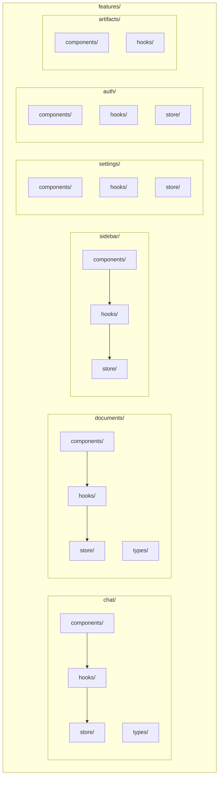

### 4.2 Feature Directory Structure

```
features/
├── 📁 chat/
│   ├── 📁 components/
│   │   ├── 📄 chat-window.tsx        # 120 LOC
│   │   ├── 📄 chat-header.tsx        # 45 LOC
│   │   ├── 📄 message-list.tsx       # 90 LOC
│   │   ├── 📄 message-item.tsx       # 80 LOC
│   │   ├── 📄 message-input.tsx      # 100 LOC
│   │   ├── 📄 chat-empty-state.tsx   # 35 LOC
│   │   ├── 📄 model-selector.tsx     # 60 LOC
│   │   └── 📄 index.ts
│   ├── 📁 hooks/
│   │   ├── 📄 use-chat.ts            # 80 LOC
│   │   ├── 📄 use-messages.ts        # 70 LOC
│   │   ├── 📄 use-streaming.ts       # 90 LOC
│   │   ├── 📄 use-chat-actions.ts    # 60 LOC
│   │   └── 📄 index.ts
│   ├── 📁 store/
│   │   ├── 📄 chat-store.ts          # 100 LOC
│   │   ├── 📄 message-store.ts       # 80 LOC
│   │   └── 📄 index.ts
│   ├── 📁 types/
│   │   ├── 📄 chat.types.ts          # 40 LOC
│   │   └── 📄 index.ts
│   └── 📄 index.ts                   # Barrel export
│
├── 📁 documents/
│   ├── 📁 components/
│   │   ├── 📄 document-editor.tsx    # 150 LOC
│   │   ├── 📄 document-preview.tsx   # 80 LOC
│   │   ├── 📄 document-list.tsx      # 70 LOC
│   │   ├── 📄 document-card.tsx      # 55 LOC
│   │   ├── 📄 document-toolbar.tsx   # 60 LOC
│   │   └── 📄 index.ts
│   ├── 📁 hooks/
│   │   ├── 📄 use-document.ts        # 75 LOC
│   │   ├── 📄 use-document-editor.ts # 90 LOC
│   │   ├── 📄 use-auto-save.ts       # 50 LOC
│   │   └── 📄 index.ts
│   ├── 📁 store/
│   │   ├── 📄 document-store.ts      # 90 LOC
│   │   └── 📄 index.ts
│   ├── 📁 types/
│   │   └── 📄 document.types.ts      # 35 LOC
│   └── 📄 index.ts
│
├── 📁 sidebar/
│   ├── 📁 components/
│   │   ├── 📄 sidebar.tsx            # 100 LOC
│   │   ├── 📄 sidebar-header.tsx     # 45 LOC
│   │   ├── 📄 sidebar-nav.tsx        # 60 LOC
│   │   ├── 📄 sidebar-footer.tsx     # 40 LOC
│   │   ├── 📄 chat-history-list.tsx  # 80 LOC
│   │   ├── 📄 chat-history-item.tsx  # 50 LOC
│   │   └── 📄 index.ts
│   ├── 📁 hooks/
│   │   ├── 📄 use-sidebar.ts         # 50 LOC
│   │   ├── 📄 use-chat-history.ts    # 70 LOC
│   │   └── 📄 index.ts
│   ├── 📁 store/
│   │   ├── 📄 sidebar-store.ts       # 60 LOC
│   │   └── 📄 index.ts
│   └── 📄 index.ts
│
├── 📁 settings/
│   ├── 📁 components/
│   │   ├── 📄 settings-dialog.tsx    # 120 LOC
│   │   ├── 📄 settings-form.tsx      # 100 LOC
│   │   ├── 📄 theme-toggle.tsx       # 40 LOC
│   │   ├── 📄 model-settings.tsx     # 80 LOC
│   │   └── 📄 index.ts
│   ├── 📁 hooks/
│   │   ├── 📄 use-settings.ts        # 60 LOC
│   │   └── 📄 index.ts
│   ├── 📁 store/
│   │   ├── 📄 settings-store.ts      # 70 LOC
│   │   └── 📄 index.ts
│   └── 📄 index.ts
│
├── 📁 auth/
│   ├── 📁 components/
│   │   ├── 📄 login-form.tsx         # 90 LOC
│   │   ├── 📄 register-form.tsx      # 100 LOC
│   │   ├── 📄 auth-provider.tsx      # 60 LOC
│   │   ├── 📄 user-menu.tsx          # 70 LOC
│   │   └── 📄 index.ts
│   ├── 📁 hooks/
│   │   ├── 📄 use-auth.ts            # 80 LOC
│   │   ├── 📄 use-session.ts         # 50 LOC
│   │   └── 📄 index.ts
│   ├── 📁 store/
│   │   ├── 📄 auth-store.ts          # 70 LOC
│   │   └── 📄 index.ts
│   └── 📄 index.ts
│
└── 📁 artifacts/
    ├── 📁 components/
    │   ├── 📄 artifact-viewer.tsx    # 100 LOC
    │   ├── 📄 code-artifact.tsx      # 120 LOC
    │   ├── 📄 document-artifact.tsx  # 80 LOC
    │   └── 📄 index.ts
    ├── 📁 hooks/
    │   ├── 📄 use-artifact.ts        # 60 LOC
    │   └── 📄 index.ts
    └── 📄 index.ts
```

**TOTAL ESTIMATED LOC for features/**: ~3,500 LOC

---

## 5. Shared Directory (Cross-Cutting)

### 5.1 Shared Module Diagram

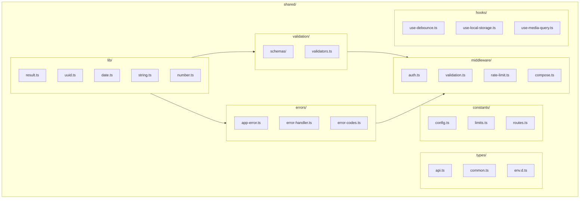

### 5.2 Shared Directory Structure

```
shared/
├── 📁 lib/                           # Pure Utilities (NO side effects)
│   ├── 📄 result.ts                  # 70 LOC - Result<T,E> type
│   ├── 📄 uuid.ts                    # 40 LOC - UUID utilities
│   ├── 📄 date.ts                    # 60 LOC - Date formatting
│   ├── 📄 string.ts                  # 50 LOC - String helpers
│   ├── 📄 number.ts                  # 30 LOC - Number formatting
│   ├── 📄 array.ts                   # 40 LOC - Array helpers
│   ├── 📄 object.ts                  # 45 LOC - Object helpers
│   ├── 📄 async.ts                   # 55 LOC - Async utilities
│   └── 📄 index.ts
│
├── 📁 validation/                    # Zod Schemas
│   ├── 📁 schemas/
│   │   ├── 📄 chat.schema.ts         # 45 LOC
│   │   ├── 📄 document.schema.ts     # 50 LOC
│   │   ├── 📄 message.schema.ts      # 35 LOC
│   │   ├── 📄 user.schema.ts         # 40 LOC
│   │   ├── 📄 vote.schema.ts         # 25 LOC
│   │   ├── 📄 auth.schema.ts         # 45 LOC
│   │   └── 📄 index.ts
│   ├── 📄 validators.ts              # 80 LOC
│   └── 📄 index.ts
│
├── 📁 errors/                        # Error Handling
│   ├── 📄 app-error.ts               # 100 LOC
│   ├── 📄 error-handler.ts           # 80 LOC
│   ├── 📄 error-codes.ts             # 50 LOC
│   ├── 📄 error-boundary.tsx         # 60 LOC
│   └── 📄 index.ts
│
├── 📁 types/                         # TypeScript Types
│   ├── 📄 api.ts                     # 60 LOC
│   ├── 📄 common.ts                  # 40 LOC
│   ├── 📄 env.d.ts                   # 30 LOC
│   └── 📄 index.ts
│
├── 📁 constants/                     # Application Constants
│   ├── 📄 config.ts                  # 50 LOC
│   ├── 📄 limits.ts                  # 30 LOC
│   ├── 📄 routes.ts                  # 40 LOC
│   ├── 📄 models.ts                  # 35 LOC
│   └── 📄 index.ts
│
├── 📁 middleware/                    # Route Middleware
│   ├── 📄 auth.ts                    # 90 LOC
│   ├── 📄 validation.ts              # 70 LOC
│   ├── 📄 rate-limit.ts              # 60 LOC
│   ├── 📄 cors.ts                    # 40 LOC
│   ├── 📄 logging.ts                 # 50 LOC
│   ├── 📄 compose.ts                 # 45 LOC
│   └── 📄 index.ts
│
├── 📁 hooks/                         # Shared React Hooks
│   ├── 📄 use-debounce.ts            # 30 LOC
│   ├── 📄 use-throttle.ts            # 35 LOC
│   ├── 📄 use-local-storage.ts       # 45 LOC
│   ├── 📄 use-media-query.ts         # 30 LOC
│   ├── 📄 use-intersection.ts        # 40 LOC
│   ├── 📄 use-click-outside.ts       # 25 LOC
│   └── 📄 index.ts
│
├── 📁 components/                    # Shared Components
│   ├── 📄 providers.tsx              # 80 LOC (all context providers)
│   ├── 📄 error-boundary.tsx         # 60 LOC
│   └── 📄 index.ts
│
└── 📁 services/                      # Shared Services (Browser)
    ├── 📄 analytics.ts               # 50 LOC
    ├── 📄 logger.ts                  # 70 LOC
    └── 📄 index.ts
```

**TOTAL ESTIMATED LOC for shared/**: ~1,800 LOC

---

## 6. Data Flow Architecture

### 6.1 Complete Data Flow Diagram

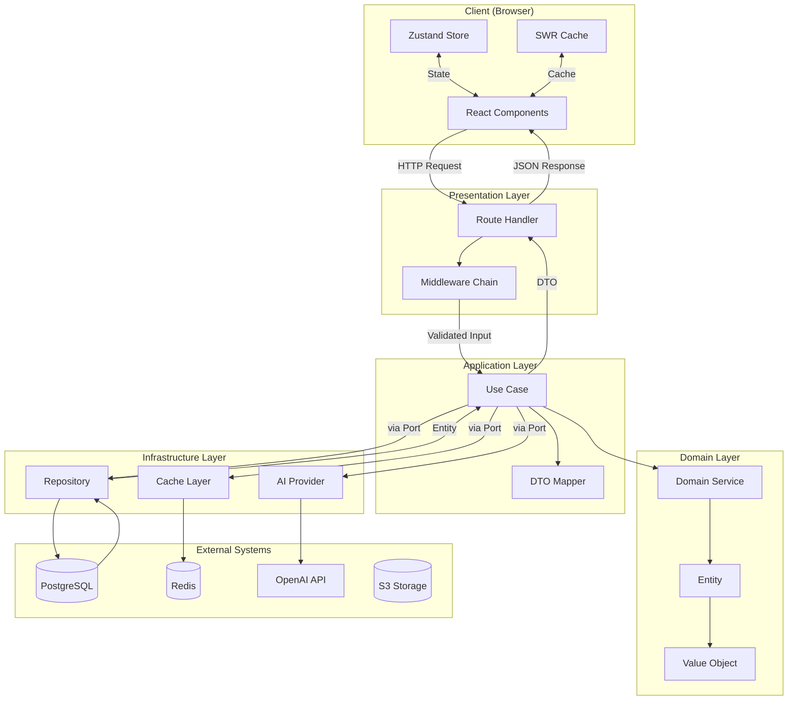

### 6.2 Chat Message Flow

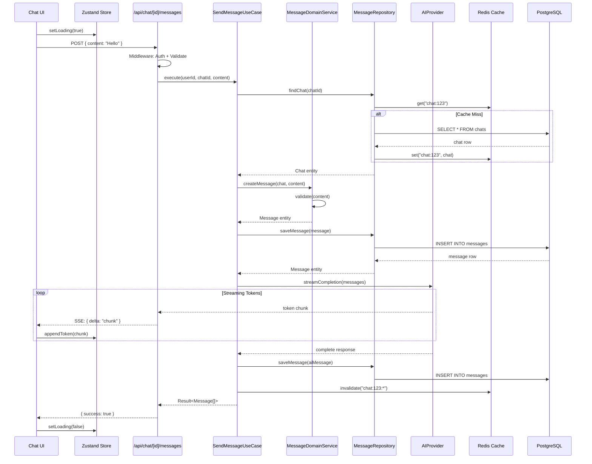

### 6.3 Document Update Flow

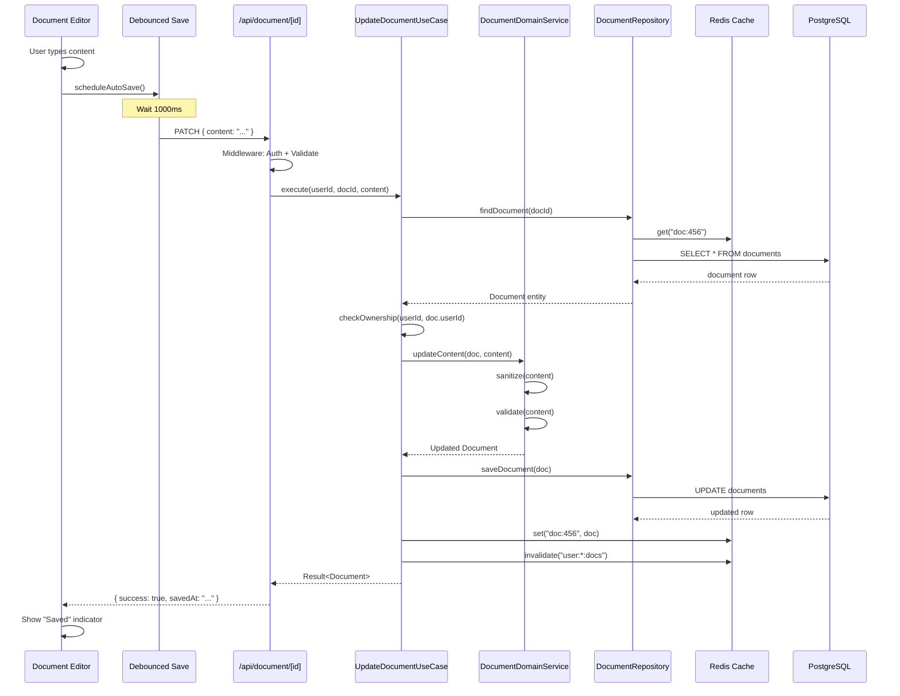

### 6.4 Authentication Flow

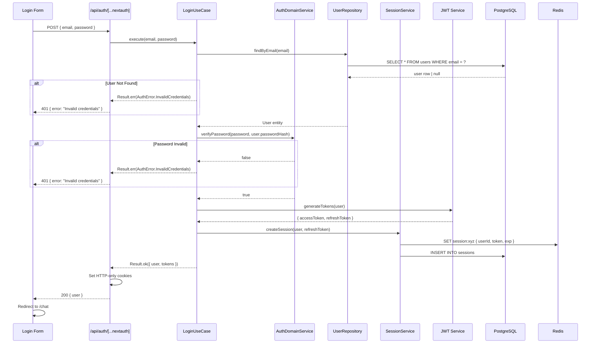

### 6.5 Cache Invalidation Strategy

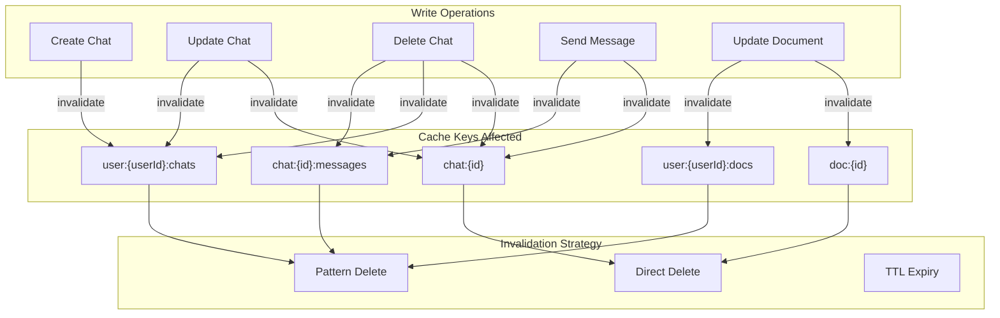

---

## 7. Component Directory (UI)

### 7.1 Component Hierarchy

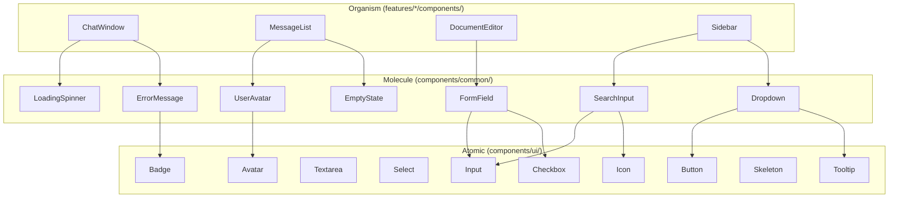

### 7.2 Components Directory Structure

```
components/
├── 📁 ui/                            # Atomic Components (shadcn/ui)
│   ├── 📄 button.tsx                 # 60 LOC
│   ├── 📄 input.tsx                  # 40 LOC
│   ├── 📄 textarea.tsx               # 35 LOC
│   ├── 📄 select.tsx                 # 80 LOC
│   ├── 📄 checkbox.tsx               # 30 LOC
│   ├── 📄 badge.tsx                  # 25 LOC
│   ├── 📄 avatar.tsx                 # 45 LOC
│   ├── 📄 skeleton.tsx               # 20 LOC
│   ├── 📄 tooltip.tsx                # 50 LOC
│   ├── 📄 dialog.tsx                 # 70 LOC
│   ├── 📄 dropdown-menu.tsx          # 90 LOC
│   ├── 📄 scroll-area.tsx            # 40 LOC
│   ├── 📄 separator.tsx              # 15 LOC
│   ├── 📄 card.tsx                   # 35 LOC
│   ├── 📄 alert.tsx                  # 30 LOC
│   └── 📄 index.ts
│
├── 📁 common/                        # Composite Components
│   ├── 📄 form-field.tsx             # 50 LOC
│   ├── 📄 search-input.tsx           # 55 LOC
│   ├── 📄 user-avatar.tsx            # 35 LOC
│   ├── 📄 loading-spinner.tsx        # 25 LOC
│   ├── 📄 error-message.tsx          # 40 LOC
│   ├── 📄 empty-state.tsx            # 45 LOC
│   ├── 📄 confirmation-dialog.tsx    # 60 LOC
│   ├── 📄 theme-provider.tsx         # 40 LOC
│   └── 📄 index.ts
│
└── 📁 ai-elements/                   # AI-Specific Components
    ├── 📄 markdown-renderer.tsx      # 100 LOC
    ├── 📄 code-block.tsx             # 80 LOC
    ├── 📄 thinking-indicator.tsx     # 30 LOC
    └── 📄 index.ts
```

**TOTAL ESTIMATED LOC for components/**: ~1,200 LOC

---

## 8. Testing Architecture

### 8.1 Test Directory Structure

```
tests/
├── 📁 unit/
│   ├── 📁 domain/
│   │   ├── 📁 entities/
│   │   │   ├── 📄 chat.test.ts           # 120 LOC
│   │   │   ├── 📄 message.test.ts        # 100 LOC
│   │   │   ├── 📄 document.test.ts       # 110 LOC
│   │   │   └── 📄 user.test.ts           # 90 LOC
│   │   ├── 📁 value-objects/
│   │   │   ├── 📄 uuid.test.ts           # 60 LOC
│   │   │   ├── 📄 email.test.ts          # 70 LOC
│   │   │   └── 📄 message-content.test.ts # 80 LOC
│   │   └── 📁 services/
│   │       ├── 📄 chat-domain-service.test.ts # 150 LOC
│   │       └── 📄 document-domain-service.test.ts # 130 LOC
│   ├── 📁 application/
│   │   ├── 📁 use-cases/
│   │   │   ├── 📄 create-chat.test.ts    # 140 LOC
│   │   │   ├── 📄 send-message.test.ts   # 160 LOC
│   │   │   └── 📄 update-document.test.ts # 120 LOC
│   │   └── 📁 services/
│   │       └── 📄 rate-limit-service.test.ts # 90 LOC
│   └── 📁 shared/
│       ├── 📄 result.test.ts             # 80 LOC
│       └── 📄 validators.test.ts         # 100 LOC
│
├── 📁 integration/
│   ├── 📁 repositories/
│   │   ├── 📄 chat-repository.test.ts    # 200 LOC
│   │   ├── 📄 message-repository.test.ts # 180 LOC
│   │   └── 📄 document-repository.test.ts # 190 LOC
│   ├── 📁 api/
│   │   ├── 📄 chat-api.test.ts           # 250 LOC
│   │   ├── 📄 document-api.test.ts       # 220 LOC
│   │   └── 📄 auth-api.test.ts           # 200 LOC
│   └── 📁 cache/
│       └── 📄 cache-invalidation.test.ts # 150 LOC
│
├── 📁 e2e/
│   ├── 📄 chat-flow.spec.ts              # 300 LOC
│   ├── 📄 document-flow.spec.ts          # 250 LOC
│   ├── 📄 auth-flow.spec.ts              # 200 LOC
│   └── 📁 fixtures/
│       ├── 📄 users.json
│       └── 📄 chats.json
│
├── 📁 __mocks__/
│   ├── 📄 ai-provider.mock.ts            # 60 LOC
│   ├── 📄 cache.mock.ts                  # 40 LOC
│   └── 📄 storage.mock.ts                # 35 LOC
│
└── 📁 utils/
    ├── 📄 test-db.ts                     # 80 LOC
    ├── 📄 factories.ts                   # 120 LOC
    └── 📄 matchers.ts                    # 50 LOC
```

### 8.2 Test Pyramid

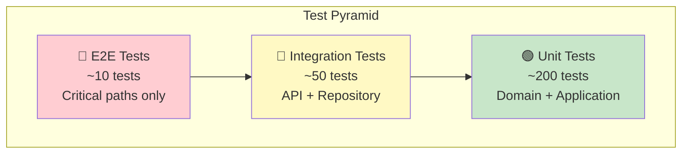

### 8.3 Coverage Matrix

| Layer | Target | Critical Files |
|-------|--------|----------------|
| Domain Entities | 95% | All entities, value objects |
| Domain Services | 90% | All domain services |
| Use Cases | 85% | All use cases |
| Repositories | 80% | Query + mutation methods |
| API Routes | 75% | Happy path + error cases |
| UI Components | 60% | Interactive components |

### 8.4 Testing Patterns

```typescript
// Unit Test Pattern (Use Case)
describe('CreateChatUseCase', () => {
  let useCase: CreateChatUseCase;
  let mockChatRepo: MockChatRepository;
  let mockUserRepo: MockUserRepository;

  beforeEach(() => {
    mockChatRepo = new MockChatRepository();
    mockUserRepo = new MockUserRepository();
    useCase = new CreateChatUseCase(mockChatRepo, mockUserRepo);
  });

  it('should create chat for authenticated user', async () => {
    // Arrange
    const userId = UUID.create();
    const dto = { title: 'Test Chat', model: 'gpt-4' };
    mockUserRepo.findById.mockResolvedValue(Result.ok(mockUser));

    // Act
    const result = await useCase.execute(userId, dto);

    // Assert
    expect(result.isOk()).toBe(true);
    expect(mockChatRepo.save).toHaveBeenCalledWith(
      expect.objectContaining({ title: 'Test Chat' })
    );
  });

  it('should fail for non-existent user', async () => {
    // Arrange
    mockUserRepo.findById.mockResolvedValue(Result.err(new NotFoundError()));

    // Act
    const result = await useCase.execute(UUID.create(), {});

    // Assert
    expect(result.isErr()).toBe(true);
    expect(result.error).toBeInstanceOf(AuthError);
  });
});
```

```typescript
// Integration Test Pattern (Repository)
describe('DrizzleChatRepository', () => {
  let repo: DrizzleChatRepository;
  let testDb: TestDatabase;

  beforeAll(async () => {
    testDb = await TestDatabase.create();
    repo = new DrizzleChatRepository(testDb.client);
  });

  afterAll(async () => {
    await testDb.cleanup();
  });

  beforeEach(async () => {
    await testDb.truncate(['chats', 'messages']);
  });

  it('should persist and retrieve chat', async () => {
    // Arrange
    const chat = ChatFactory.create({ title: 'Test Chat' });

    // Act
    await repo.save(chat);
    const result = await repo.findById(chat.id);

    // Assert
    expect(result.isOk()).toBe(true);
    expect(result.value.title).toBe('Test Chat');
  });
});
```

---

## 9. Pattern Catalog

### 9.1 Result Type Pattern

```typescript
// shared/lib/result.ts
export type Result<T, E = Error> = 
  | { ok: true; value: T }
  | { ok: false; error: E };

export const Result = {
  ok: <T>(value: T): Result<T, never> => ({ ok: true, value }),
  err: <E>(error: E): Result<never, E> => ({ ok: false, error }),
  
  map: <T, U, E>(result: Result<T, E>, fn: (t: T) => U): Result<U, E> =>
    result.ok ? Result.ok(fn(result.value)) : result,
    
  flatMap: <T, U, E>(result: Result<T, E>, fn: (t: T) => Result<U, E>): Result<U, E> =>
    result.ok ? fn(result.value) : result,
    
  unwrap: <T, E>(result: Result<T, E>): T => {
    if (!result.ok) throw result.error;
    return result.value;
  },
  
  unwrapOr: <T, E>(result: Result<T, E>, defaultValue: T): T =>
    result.ok ? result.value : defaultValue,
};
```

### 9.2 Port/Adapter Pattern

```typescript
// Domain Port (Interface)
// src/domain/ports/chat-repository.port.ts
export interface ChatRepositoryPort {
  findById(id: UUID): Promise<Result<Chat, NotFoundError>>;
  findByUserId(userId: UUID): Promise<Result<Chat[], Error>>;
  save(chat: Chat): Promise<Result<void, Error>>;
  delete(id: UUID): Promise<Result<void, Error>>;
}

// Infrastructure Adapter (Implementation)
// src/infrastructure/repositories/drizzle-chat-repository.ts
export class DrizzleChatRepository implements ChatRepositoryPort {
  constructor(private readonly db: DrizzleClient) {}

  async findById(id: UUID): Promise<Result<Chat, NotFoundError>> {
    const row = await this.db.query.chats.findFirst({
      where: eq(chats.id, id.value),
    });
    
    if (!row) {
      return Result.err(new NotFoundError('Chat', id.value));
    }
    
    return Result.ok(ChatMapper.toDomain(row));
  }

  async save(chat: Chat): Promise<Result<void, Error>> {
    try {
      await this.db.insert(chats).values(ChatMapper.toPersistence(chat))
        .onConflictDoUpdate({
          target: chats.id,
          set: ChatMapper.toPersistence(chat),
        });
      return Result.ok(undefined);
    } catch (e) {
      return Result.err(new PersistenceError('Failed to save chat', e));
    }
  }
}
```

### 9.3 Middleware Composition Pattern

```typescript
// shared/middleware/compose.ts
export type Middleware<T> = (context: T, next: () => Promise<void>) => Promise<void>;

export function compose<T>(...middlewares: Middleware<T>[]): Middleware<T> {
  return async (context: T, next: () => Promise<void>) => {
    let index = -1;
    
    async function dispatch(i: number): Promise<void> {
      if (i <= index) throw new Error('next() called multiple times');
      index = i;
      
      const middleware = i < middlewares.length ? middlewares[i] : next;
      await middleware(context, () => dispatch(i + 1));
    }
    
    await dispatch(0);
  };
}

// Usage in route handler
const handler = compose(
  rateLimitMiddleware,
  authMiddleware,
  validationMiddleware(CreateChatSchema),
);
```

### 9.4 Dependency Injection Pattern

```typescript
// src/infrastructure/di/container.ts
export class Container {
  private static instances = new Map<string, unknown>();

  static register<T>(key: string, factory: () => T): void {
    this.instances.set(key, factory());
  }

  static resolve<T>(key: string): T {
    const instance = this.instances.get(key);
    if (!instance) throw new Error(`No registration for ${key}`);
    return instance as T;
  }
}

// Registration
Container.register('chatRepository', () => 
  new DrizzleChatRepository(db)
);
Container.register('createChatUseCase', () =>
  new CreateChatUseCase(
    Container.resolve('chatRepository'),
    Container.resolve('userRepository'),
  )
);

// Resolution in route handler
export async function POST(req: Request) {
  const useCase = Container.resolve<CreateChatUseCase>('createChatUseCase');
  // ...
}
```

---

## 10. Migration Path

### 10.1 Migration Gantt Chart

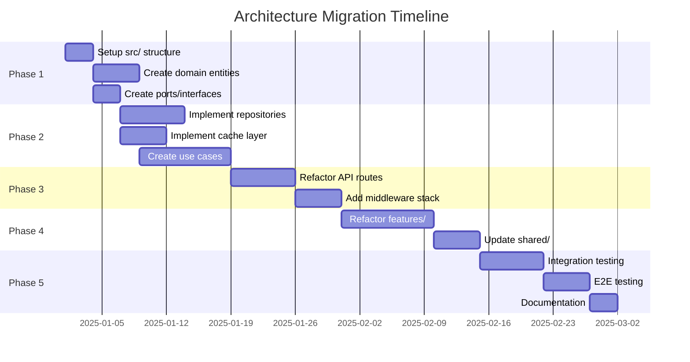

### 10.2 Migration Phases

| Phase | Duration | Focus | Deliverables |
|-------|----------|-------|--------------|
| 1 | 1 week | Domain Foundation | Entities, Value Objects, Ports |
| 2 | 2 weeks | Infrastructure | Repositories, Cache, AI Adapters |
| 3 | 2 weeks | Application Layer | Use Cases, DTOs, Route Refactor |
| 4 | 2 weeks | Presentation | Feature Components, Shared UI |
| 5 | 2 weeks | Quality Assurance | Tests, Documentation, Review |

### 10.3 Phase 1 Breakdown

```
Week 1: Domain Foundation
├── Day 1-2: Project Structure
│   ├── Create src/ directory tree
│   ├── Configure TypeScript paths
│   └── Setup ESLint layer rules
├── Day 3-5: Domain Entities
│   ├── Chat entity + tests
│   ├── Message entity + tests
│   ├── Document entity + tests
│   └── User entity + tests
├── Day 6-7: Value Objects + Ports
│   ├── UUID, Email, Content VOs
│   └── Repository port interfaces
```

### 10.4 Phase 2 Breakdown

```
Week 2-3: Infrastructure Layer
├── Day 1-3: Repository Implementations
│   ├── DrizzleChatRepository
│   ├── DrizzleMessageRepository
│   └── DrizzleDocumentRepository
├── Day 4-5: Cache Layer
│   ├── Redis cache adapter
│   ├── Memory cache adapter
│   └── Hybrid cache (L1+L2)
├── Day 6-7: External Adapters
│   ├── OpenAI provider adapter
│   └── Storage adapter (S3/Local)
├── Day 8-10: Use Case Implementation
│   ├── Chat use cases (6)
│   ├── Document use cases (4)
│   └── Auth use cases (4)
```

### 10.5 Phase 3 Breakdown

```
Week 4-5: Application + Routes
├── Day 1-3: Use Case Completion
│   ├── Vote use cases
│   ├── Suggestion use cases
│   └── DTO mappers
├── Day 4-7: Route Handler Refactor
│   ├── Extract business logic to use cases
│   ├── Implement thin controller pattern
│   └── Add middleware composition
├── Day 8-10: Middleware Stack
│   ├── Rate limiting middleware
│   ├── Validation middleware
│   └── Error handling middleware
```

### 10.6 Phase 4 Breakdown

```
Week 6-7: Feature Refactoring
├── Day 1-4: Chat Feature
│   ├── Extract components to features/chat/
│   ├── Create chat hooks
│   └── Implement chat store
├── Day 5-7: Document Feature
│   ├── Extract components to features/documents/
│   ├── Create document hooks
│   └── Implement document store
├── Day 8-10: Remaining Features
│   ├── Sidebar feature
│   ├── Settings feature
│   └── Auth feature
├── Day 11-12: Shared Updates
│   ├── Move common hooks to shared/
│   └── Update component imports
```

### 10.7 Phase 5 Breakdown

```
Week 8-9: Quality & Documentation
├── Day 1-4: Unit Testing
│   ├── Domain layer tests (target: 95%)
│   ├── Application layer tests (target: 85%)
│   └── Shared utility tests
├── Day 5-7: Integration Testing
│   ├── Repository integration tests
│   ├── API route tests
│   └── Cache invalidation tests
├── Day 8-10: E2E + Documentation
│   ├── Critical path E2E tests
│   ├── Update README.md
│   └── API documentation
├── Day 11-12: Review & Polish
│   ├── Code review
│   ├── Performance audit
│   └── Final documentation
```

---

## 11. Summary Statistics

### 11.1 Architecture Metrics

| Metric | Value |
|--------|-------|
| Total Layers | 4 |
| Total Directories | ~50 |
| Total Files (estimated) | ~180 |
| Total LOC (estimated) | ~11,000 |
| Test Files (estimated) | ~45 |
| Test LOC (estimated) | ~4,500 |

### 11.2 File Count by Layer

| Layer | Directories | Files | LOC |
|-------|-------------|-------|-----|
| Presentation (app/) | 15 | 25 | ~600 |
| Application (src/application/) | 8 | 25 | ~1,500 |
| Domain (src/domain/) | 5 | 25 | ~1,200 |
| Infrastructure (src/infrastructure/) | 7 | 20 | ~1,800 |
| Features | 6 | 50 | ~3,500 |
| Shared | 8 | 30 | ~1,800 |
| Components | 3 | 25 | ~1,200 |
| **TOTAL** | **52** | **200** | **~11,600** |

### 11.3 Diagram Summary

| Diagram Type | Count | Purpose |
|--------------|-------|---------|
| Architecture Diagrams | 4 | Layer structure, dependencies |
| Sequence Diagrams | 5 | Request flows, data flows |
| Flowcharts | 3 | Error handling, cache invalidation |
| Gantt Charts | 1 | Migration timeline |
| Component Hierarchies | 3 | UI structure, feature modules |

### 11.4 Document Statistics

| Section | Diagrams | Tables | Code Blocks |
|---------|----------|--------|-------------|
| 1. Architecture Overview | 3 | 0 | 0 |
| 2. Layer Specifications | 4 | 2 | 0 |
| 3. Complete File Architecture | 0 | 0 | 3 |
| 4. Features Directory | 1 | 0 | 1 |
| 5. Shared Directory | 1 | 0 | 1 |
| 6. Data Flow Architecture | 5 | 0 | 0 |
| 7. Component Directory | 1 | 0 | 1 |
| 8. Testing Architecture | 1 | 1 | 2 |
| 9. Pattern Catalog | 0 | 0 | 4 |
| 10. Migration Path | 1 | 2 | 5 |
| 11. Summary Statistics | 0 | 4 | 0 |
| **TOTAL** | **17** | **9** | **17** |

---

## Appendix A: ESLint Configuration for Layer Enforcement

```javascript
// .eslintrc.js
module.exports = {
  rules: {
    'import/no-restricted-paths': [
      'error',
      {
        zones: [
          // Domain cannot import from Application/Infrastructure/Presentation
          {
            target: './src/domain/**/*',
            from: './src/application/**/*',
            message: 'Domain layer cannot import from Application layer',
          },
          {
            target: './src/domain/**/*',
            from: './src/infrastructure/**/*',
            message: 'Domain layer cannot import from Infrastructure layer',
          },
          {
            target: './src/domain/**/*',
            from: './app/**/*',
            message: 'Domain layer cannot import from Presentation layer',
          },
          // Application cannot import from Infrastructure/Presentation
          {
            target: './src/application/**/*',
            from: './src/infrastructure/**/*',
            message: 'Application layer cannot import from Infrastructure layer',
          },
          {
            target: './src/application/**/*',
            from: './app/**/*',
            message: 'Application layer cannot import from Presentation layer',
          },
          // Infrastructure cannot import from Presentation
          {
            target: './src/infrastructure/**/*',
            from: './app/**/*',
            message: 'Infrastructure layer cannot import from Presentation layer',
          },
        ],
      },
    ],
  },
};
```

---

## Appendix B: TypeScript Path Aliases

```json
// tsconfig.json
{
  "compilerOptions": {
    "baseUrl": ".",
    "paths": {
      "@/domain/*": ["src/domain/*"],
      "@/application/*": ["src/application/*"],
      "@/infrastructure/*": ["src/infrastructure/*"],
      "@/features/*": ["features/*"],
      "@/shared/*": ["shared/*"],
      "@/components/*": ["components/*"],
      "@/app/*": ["app/*"],
      "@/lib/*": ["lib/*"]
    }
  }
}
```

---

**END OF DOCUMENT**

*Enhanced Layered Architecture Report v2.0*
*Total Sections: 11 + 2 Appendices*
*Total Diagrams: 17 Mermaid Diagrams*
*Total Tables: 9 Reference Tables*
*Total Code Blocks: 17 Examples*
*Estimated Total LOC Specification: ~11,600 LOC*
