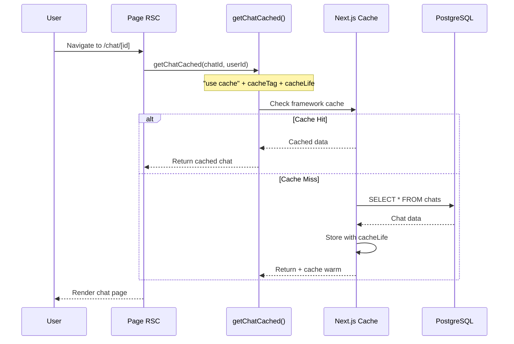
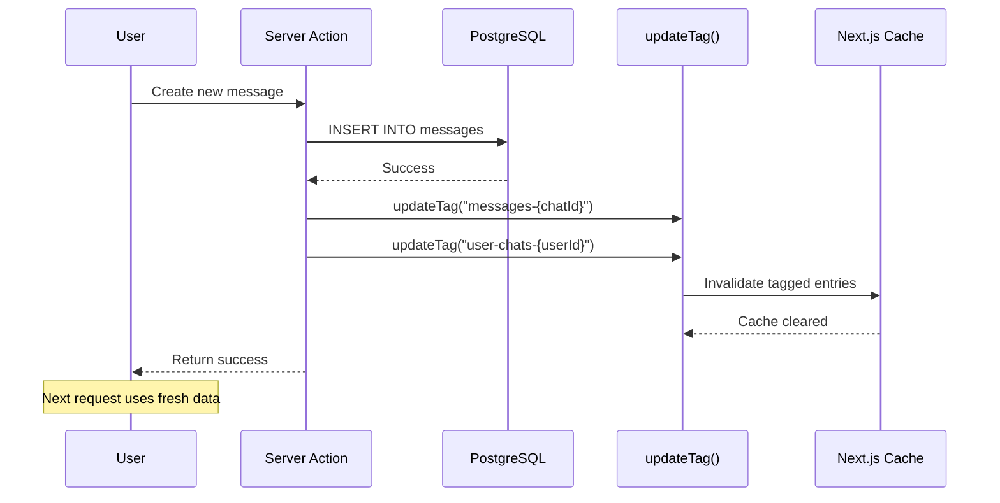
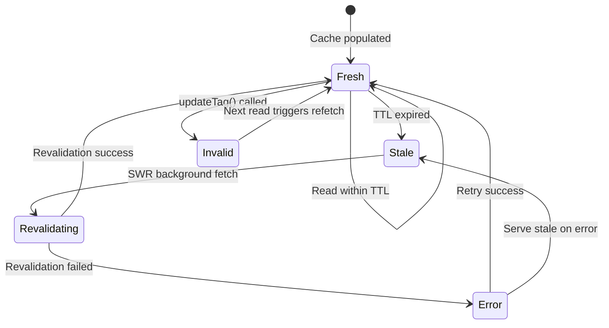

# FINAL Design: Next.js 16.1.0 Optimization

> **Consolidated from**: design.md (v1), design-v3.md  
> **Finalized**: December 24, 2025  
> **Active ADRs**: 11 (ADR-003 invalidated)  
> **Status**: ✅ Approved

---

## Executive Summary

This architecture blueprint defines the technical approach for adopting Next.js 16.1.0 patterns. The design preserves existing functionality while enabling `"use cache"` directives, improved cache invalidation through `updateTag`, and addressing critical security and session management issues.

### Design Principles

1. **Incremental Adoption** - Migrate one layer at a time with feature flags
2. **Cache-First Architecture** - Data functions use cache before DB
3. **Type-Safe Boundaries** - Server/client components separated
4. **Fail-Fast Caching** - Cache failures fall through gracefully

---

## System Architecture

```
┌─────────────────────────────────────────────────────────────────────────────┐
│                          CLIENT (Browser)                                    │
├─────────────────────────────────────────────────────────────────────────────┤
│  ┌─────────────────┐  ┌─────────────────┐  ┌─────────────────────────────┐  │
│  │ Chat Client     │  │ Sidebar         │  │ BroadcastChannel            │  │
│  │ (React 19)      │  │ (Zustand)       │  │ (Session Sync)              │  │
│  └────────┬────────┘  └────────┬────────┘  └─────────────┬───────────────┘  │
│           │                    │                         │                   │
│           └────────────────────┼─────────────────────────┘                   │
│                                ▼                                             │
└────────────────────────────────┬─────────────────────────────────────────────┘
                                 │ HTTP / Server Actions
┌────────────────────────────────┼─────────────────────────────────────────────┐
│                          EDGE LAYER                                          │
├────────────────────────────────┼─────────────────────────────────────────────┤
│  ┌─────────────────────────────▼─────────────────────────────────────────┐   │
│  │                        middleware.ts                                   │   │
│  │  ┌─────────────┐  ┌─────────────────┐  ┌─────────────────────────┐   │   │
│  │  │ Rate Limit  │→│ Session Check    │→│ Security Headers        │   │   │
│  │  │ (fail-close)│  │ (Redis/Supabase) │  │ (CSP, CORS)            │   │   │
│  │  └─────────────┘  └─────────────────┘  └─────────────────────────┘   │   │
│  └───────────────────────────────────────────────────────────────────────┘   │
└──────────────────────────────────────────────────────────────────────────────┘
                                 │
┌────────────────────────────────┼─────────────────────────────────────────────┐
│                        SERVER COMPONENTS LAYER                               │
├────────────────────────────────┼─────────────────────────────────────────────┤
│  ┌─────────────────────────────▼─────────────────────────────────────────┐   │
│  │ Page RSC → getChatCached(chatId, userId)                               │   │
│  │            "use cache" + cacheTag("chat-{id}") + cacheLife("hours")   │   │
│  └───────────────────────────────┬───────────────────────────────────────┘   │
│                                  │                                           │
│  ┌───────────────────────────────▼───────────────────────────────────────┐   │
│  │                    CACHE LAYER (Next.js 16)                            │   │
│  │  ┌─────────────────┐  ┌─────────────────┐  ┌─────────────────────┐    │   │
│  │  │ Framework Cache │→│ Redis (fallback) │→│ Database (fallback) │    │   │
│  │  │ (cacheLife)     │  │ (circuit breaker)│  │ (PostgreSQL)       │    │   │
│  │  └─────────────────┘  └─────────────────┘  └─────────────────────┘    │   │
│  └───────────────────────────────────────────────────────────────────────┘   │
│                                                                              │
│  ┌───────────────────────────────────────────────────────────────────────┐   │
│  │                    SERVER ACTIONS LAYER                                │   │
│  │  ┌─────────────────┐  ┌─────────────────┐  ┌─────────────────────┐    │   │
│  │  │ createChat      │  │ sendMessage      │  │ deleteChat          │    │   │
│  │  │ updateTag()     │  │ updateTag()      │  │ updateTag()         │    │   │
│  │  └─────────────────┘  └─────────────────┘  └─────────────────────┘    │   │
│  └───────────────────────────────────────────────────────────────────────┘   │
└──────────────────────────────────────────────────────────────────────────────┘
```

---

## ADR Index

| ADR | Title | Status | REQs |
|-----|-------|--------|------|
| ADR-001 | Caching Architecture with "use cache" | ✅ Active | REQ-001, REQ-008 |
| ADR-002 | Cache Invalidation Strategy | ✅ Active | REQ-003, REQ-004 |
| ADR-003 | ~~Proxy Migration~~ | ❌ Invalidated | N/A |
| ADR-004 | Component Boundary Optimization | ✅ Active | REQ-007 |
| ADR-005 | generateMetadata for Dynamic Routes | ✅ Active | REQ-006 |
| ADR-006 | cacheLife Profile Configuration | ✅ Active | REQ-002 |
| ADR-007 | Function Signature Patterns | ✅ Active | REQ-005 |
| ADR-008 | Multi-Tab Session Sync | ✅ Active | REQ-011, REQ-025 |
| ADR-009 | Fail-Closed Rate Limiting | ✅ Active | REQ-012 |
| ADR-010 | Cache Invalidation Fallback | ✅ Active | REQ-013 |
| ADR-011 | Cache Tag Naming Convention | ✅ Active | REQ-014 |
| ADR-012 | Redis Circuit Breaker | ✅ Active | REQ-017 |

---

## ADR-001: Caching Architecture with "use cache" Directive

**Status**: ✅ Active | **Covers**: REQ-001, REQ-008

### Context

The project uses `cacheComponents: true` but hasn't adopted `"use cache"` directive. Five cached data files exist in `lib/data/cached/` with manual Redis caching.

### Decision

Adopt `"use cache"` directive in all `lib/data/cached/*.ts` files:

```typescript
import { cacheLife, cacheTag } from "next/cache";

export async function getChatCached(
  chatId: string,
  userId: string
): Promise<Chat | null> {
  "use cache";
  cacheTag(`chat-${chatId}`);
  cacheLife("chatMessages");

  const cached = await getChatFromCache(chatId, userId);
  if (cached) return cachedChatToChat(cached);

  const chat = await getChat(chatId, userId);
  if (chat) createChatInCache(chatToCachedMeta(chat), false).catch(() => {});
  return chat;
}
```

### Cache Profile Mapping

| Data Type | Profile | Rationale |
|-----------|---------|-----------|
| Chat metadata | `chatMessages` | Rarely changes after creation |
| Messages | `chatMessages` | Append-only, stable |
| User chat list | `userChats` | Frequently updated |
| Documents | `documents` | Version-controlled |
| Votes | `hours` (built-in) | Low-frequency updates |
| Suggestions | `suggestions` | Context-dependent |

### Consequences

**Positive**: Automatic deduplication, built-in invalidation, profile-based TTL  
**Negative**: Requires careful tag naming, migration effort for 5 files

---

## ADR-002: Cache Invalidation Strategy

**Status**: ✅ Active | **Covers**: REQ-003, REQ-004

### Context

Next.js 16 provides two invalidation methods:
- `updateTag(tag)` - Server Actions only, immediate
- `revalidateTag(tag, profile)` - Breaking change: requires profile argument

### Decision

**Primary**: Use `updateTag()` in Server Actions for immediate "read-your-writes"  
**Fallback**: Use `revalidateTag(tag, profile)` for Route Handlers and error recovery

```typescript
// Server Action (PRIMARY)
"use server";
import { updateTag } from "next/cache";

export async function createMessageAction(chatId: string, content: string) {
  const message = await saveMessage(chatId, content);
  updateTag(`messages-${chatId}`);
  updateTag(`user-chats-${message.userId}`);
  return message;
}

// Route Handler / Fallback
import { revalidateTag } from "next/cache";

export async function POST(request: Request) {
  // ... mutation logic
  revalidateTag("messages-123", "max"); // Profile argument required
}
```

### revalidateTag Migration

| Old Signature | New Signature |
|---------------|---------------|
| `revalidateTag("user-chats")` | `revalidateTag("user-chats", "max")` |
| `revalidateTag("chat-123")` | `revalidateTag("chat-123", "max")` |

### Invalidation Tag Taxonomy

```
user-chats-{userId}     → User's chat list
chat-{chatId}           → Single chat metadata
messages-{chatId}       → Messages in a chat
documents-{documentId}  → Document content
votes-{chatId}          → Votes on a chat
suggestions-{userId}    → User suggestions
```

---

## ADR-003: Proxy Migration Strategy ❌ INVALIDATED

**Status**: ❌ Invalidated

### Invalidation Reason

Research confirmed:
1. No `unstable_noStore` usage in codebase
2. `middleware.ts` not deprecated in Next.js 16
3. No migration required

**NO ACTION REQUIRED** - Keep existing `middleware.ts` as-is.

---

## ADR-004: Component Boundary Optimization

**Status**: ✅ Active | **Covers**: REQ-007

### Decision

Optimize Suspense boundaries for Core Web Vitals (LCP < 2.5s, CLS < 0.1):

```
┌─────────────────────────────────────────────────────────────────┐
│ SERVER COMPONENTS (RSC) - No "use client"                       │
├─────────────────────────────────────────────────────────────────┤
│ app/layout.tsx              → Root layout, providers            │
│ app/(chat)/layout.tsx       → Chat layout, sidebar state        │
│ app/(chat)/page.tsx         → New chat page                     │
│ app/(chat)/chat/[id]/page.tsx → Existing chat (NEEDS METADATA) │
│ lib/data/cached/*.ts        → All data functions                │
└─────────────────────────────────────────────────────────────────┘

┌─────────────────────────────────────────────────────────────────┐
│ CLIENT COMPONENTS - "use client"                                │
├─────────────────────────────────────────────────────────────────┤
│ chat-layout-client.tsx      → Sidebar toggle, keyboard nav      │
│ features/chat/Chat.tsx      → Chat UI, message input            │
│ features/sidebar/Sidebar.tsx → Chat history, navigation         │
└─────────────────────────────────────────────────────────────────┘
```

### Suspense Boundary Strategy

| Boundary | Fallback Component | Purpose |
|----------|-------------------|---------|
| Root layout | `AppShellFallback` | Minimal shell during auth check |
| Chat layout | `SidebarSkeleton` | Sidebar placeholder |
| Chat page | `loading.tsx` | Chat UI skeleton |

---

## ADR-005: generateMetadata for Dynamic Routes

**Status**: ✅ Active | **Covers**: REQ-006

### Decision

Add `generateMetadata` to dynamic chat route:

```typescript
// app/(chat)/chat/[id]/page.tsx
import type { Metadata } from "next";

export async function generateMetadata({
  params,
}: { params: Promise<{ id: string }> }): Promise<Metadata> {
  const { id } = await params;
  const session = await getSessionCached();

  if (!session?.user) {
    return { title: "Chat" };
  }

  const chat = await getChatCached(id, session.user.id);

  if (!chat) {
    return { title: "Chat Not Found" };
  }

  return {
    title: chat.title || "Chat",
    description: `Chat conversation: ${chat.title}`,
    openGraph: {
      title: chat.title || "Chat",
      type: "article",
    },
  };
}
```

---

## ADR-006: cacheLife Profile Configuration

**Status**: ✅ Active | **Covers**: REQ-002

### Decision

Define 4 custom cacheLife profiles in `next.config.ts`:

```typescript
const nextConfig: NextConfig = {
  experimental: {
    cacheLife: {
      chatMessages: {
        stale: 60,        // Serve stale for 60s
        revalidate: 14400, // Revalidate every 4 hours
        expire: 86400,    // Hard expire after 24 hours
      },
      userChats: {
        stale: 60,
        revalidate: 300,  // 5 minutes
        expire: 7200,     // 2 hours
      },
      documents: {
        stale: 300,       // 5 minutes
        revalidate: 14400,
        expire: 86400,
      },
      suggestions: {
        stale: 60,
        revalidate: 300,
        expire: 3600,     // 1 hour
      },
    },
  },
};
```

### Profile-to-Function Mapping

| Profile | Functions |
|---------|-----------|
| `chatMessages` | `getChatCached`, `getMessagesCached` |
| `userChats` | `getUserChatsCached` |
| `documents` | `getDocumentCached`, `getLatestVersionCached` |
| `suggestions` | `getSuggestionsCached` |
| `hours` (built-in) | `getVoteCached`, `getVotesByChatIdCached` |

---

## ADR-007: Function Signature Patterns for Caching

**Status**: ✅ Active | **Covers**: REQ-005

### Context

`"use cache"` requires all arguments to be serializable. Current `DataContext` objects may not serialize correctly.

### Decision

Refactor all cached read functions to accept primitive serializable arguments:

### Signature Changes

| Function | Before | After |
|----------|--------|-------|
| `getChatCached` | `(chatId, ctx)` | `(chatId, userId)` |
| `getUserChatsCached` | `(ctx)` | `(userId, userType?)` |
| `getChatWithMessagesCached` | `(chatId, ctx)` | `(chatId, userId)` |
| `getMessagesCached` | `(chatId, ctx)` | `(chatId, userId)` |
| `getDocumentCached` | `(docId, ctx)` | `(docId, userId)` |
| `getSuggestionsCached` | `(ctx)` | `(userId)` |
| `getVoteCached` | `(chatId, messageId, ctx)` | `(chatId, messageId, userId)` |

### Call Site Migration

```typescript
// BEFORE
const ctx = createContext(session.user.id, session.user.type);
const chat = await getChatCached(chatId, ctx);

// AFTER
const chat = await getChatCached(chatId, session.user.id);
```

---

## ADR-008: Multi-Tab Session Sync

**Status**: ✅ Active | **Covers**: REQ-011, REQ-025

### Context

Guest session creation races across tabs, orphaning data when Tab B overwrites Tab A's session cookie.

### Decision

Implement BroadcastChannel API with localStorage fallback for Safari <15.4:

```typescript
// lib/auth/session-sync.ts
const CHANNEL_NAME = 'session-sync';

export function createSessionSync() {
  if (typeof BroadcastChannel !== 'undefined') {
    return new BroadcastChannelSync(CHANNEL_NAME);
  }
  return new LocalStorageSync(CHANNEL_NAME);
}

class BroadcastChannelSync {
  private channel: BroadcastChannel;
  
  broadcast(event: SessionEvent) {
    this.channel.postMessage(event);
  }
  
  onMessage(handler: (event: SessionEvent) => void) {
    this.channel.onmessage = (e) => handler(e.data);
  }
}

type SessionEvent = 
  | { type: 'SESSION_LOGIN'; userId: string; timestamp: number }
  | { type: 'SESSION_LOGOUT'; timestamp: number }
  | { type: 'SESSION_REFRESH'; timestamp: number };
```

### Integration

```typescript
// features/auth/components/auth-provider.tsx
function useSessionSync() {
  useEffect(() => {
    const sync = createSessionSync();
    
    sync.onMessage((event) => {
      if (event.type === 'SESSION_LOGOUT') {
        logout();
      } else if (event.type === 'SESSION_LOGIN') {
        refreshSession();
      }
    });
    
    return () => sync.close();
  }, []);
}
```

---

## ADR-009: Fail-Closed Rate Limiting

**Status**: ✅ Active | **Covers**: REQ-012

### Context

Current rate limiting fails open when Redis unavailable, allowing unlimited auth attempts.

### Decision

Fail-closed for sensitive endpoints, fail-open with memory limit for others:

```typescript
// lib/middleware/rate-limit-config.ts
export const SENSITIVE_PATTERNS = ['/api/auth', '/api/files/upload'];

export function shouldFailClosed(pathname: string): boolean {
  return SENSITIVE_PATTERNS.some(p => pathname.startsWith(p));
}

// lib/middleware/rate-limit.ts
if (!limiter) {
  if (shouldFailClosed(pathname)) {
    logger.error('Redis unavailable - blocking sensitive endpoint');
    return { success: false, limit: 0, remaining: 0, reset: Date.now() + 60000 };
  }
  return applyMemoryRateLimit(identifier);
}
```

### Endpoint Classification

| Endpoint Pattern | Classification | Fail Behavior |
|-----------------|----------------|---------------|
| `/api/auth/*` | Sensitive | Fail-Closed (503) |
| `/api/chat` | Standard | Fail-Open with Memory Limit |
| `/api/files/upload` | Sensitive | Fail-Closed (503) |

---

## ADR-010: Cache Invalidation Fallback

**Status**: ✅ Active | **Covers**: REQ-013

### Context

`updateTag()` only works in Server Actions. Route Handlers require alternative approach.

### Decision

Create unified `invalidateCache()` utility:

```typescript
// lib/cache-ops/invalidation.ts
import { updateTag, revalidateTag } from 'next/cache';

export async function invalidateCache(
  tag: string,
  options: { immediate?: boolean } = { immediate: true }
): Promise<void> {
  try {
    if (isServerActionContext()) {
      updateTag(tag);
      return;
    }
  } catch {
    // Not in Server Action context
  }
  
  revalidateTag(tag, options.immediate ? 'max' : 'hours');
}

function isServerActionContext(): boolean {
  // Detection logic based on async context
  return typeof (globalThis as any).__NEXT_PRIVATE_MUTATION === 'function';
}
```

---

## ADR-011: Cache Tag Naming Convention

**Status**: ✅ Active | **Covers**: REQ-014

### Decision

Create centralized `CacheTags` utility:

```typescript
// lib/cache/tags.ts
export const CacheTags = {
  // Entity-specific
  chat: (chatId: string) => `chat-${chatId}`,
  document: (docId: string) => `document-${docId}`,

  // User-scoped
  userChats: (userId: string) => `user-chats-${userId}`,
  userDocuments: (userId: string) => `user-documents-${userId}`,

  // Relationship
  chatMessages: (chatId: string) => `chat-messages-${chatId}`,
  chatVotes: (chatId: string) => `chat-votes-${chatId}`,
  documentVersions: (docId: string) => `document-versions-${docId}`,

  // Suggestions (user + document context)
  suggestions: (docId: string, userId: string) =>
    `suggestions-${docId}-${userId}`,
} as const;
```

### Naming Convention

| Pattern | Example | Use Case |
|---------|---------|----------|
| `{entity}-{id}` | `chat-abc123` | Single entity |
| `user-{entity}-{userId}` | `user-chats-xyz789` | User-scoped list |
| `{parent}-{child}-{parentId}` | `chat-messages-abc123` | Relationship |

---

## ADR-012: Redis Circuit Breaker

**Status**: ✅ Active | **Covers**: REQ-017

### Decision

Implement circuit breaker pattern for Redis connections:

```typescript
// lib/cache/circuit-breaker.ts
interface CircuitBreakerState {
  failures: number;
  lastFailure: number;
  state: 'closed' | 'open' | 'half-open';
}

const FAILURE_THRESHOLD = 5;
const RESET_TIMEOUT = 30000; // 30 seconds

export class RedisCircuitBreaker {
  private state: CircuitBreakerState = {
    failures: 0,
    lastFailure: 0,
    state: 'closed'
  };

  async execute<T>(operation: () => Promise<T>, fallback: () => Promise<T>): Promise<T> {
    if (this.state.state === 'open') {
      if (Date.now() - this.state.lastFailure > RESET_TIMEOUT) {
        this.state.state = 'half-open';
      } else {
        return fallback();
      }
    }

    try {
      const result = await operation();
      this.onSuccess();
      return result;
    } catch (error) {
      this.onFailure();
      return fallback();
    }
  }

  private onSuccess() {
    this.state = { failures: 0, lastFailure: 0, state: 'closed' };
  }

  private onFailure() {
    this.state.failures++;
    this.state.lastFailure = Date.now();
    if (this.state.failures >= FAILURE_THRESHOLD) {
      this.state.state = 'open';
    }
  }
}
```

### Degradation Behavior

| Component | Redis Available | Redis Unavailable |
|-----------|----------------|-------------------|
| Session Cache | Redis (30s TTL) | Database (each request) |
| Chat Cache | Redis + framework | Database + framework |
| Rate Limiting | Upstash Ratelimit | Memory fallback |

---

## Sequence Diagrams

### Cache Hit Flow



### Cache Invalidation Flow



---

## Cache State Diagram



| State | Description | Transitions |
|-------|-------------|-------------|
| Fresh | Cache valid, serving data | → Stale (TTL), → Invalid (mutation) |
| Stale | TTL expired, background revalidate | → Revalidating |
| Invalid | Explicitly invalidated via updateTag | → Fresh (next read) |
| Revalidating | Fetching new data in background | → Fresh, → Error |
| Error | Revalidation failed | → Stale (fallback), → Fresh (retry) |

---

## Files Summary

### Files to Create

| File | Purpose |
|------|---------|
| `lib/cache/tags.ts` | CacheTags utility |
| `lib/cache-ops/invalidation.ts` | Unified invalidation |
| `lib/auth/session-sync.ts` | BroadcastChannel sync |
| `lib/middleware/rate-limit-config.ts` | Endpoint classification |

### Files to Modify

| File | Changes | Risk |
|------|---------|------|
| `next.config.ts` | Add cacheLife profiles | 🟢 Low |
| `lib/data/cached/*.ts` (6 files) | Add "use cache" + refactor signatures | 🟡 Medium |
| `features/*/actions/*.ts` | Add updateTag, migrate revalidateTag | 🟡 Medium |
| `lib/middleware/rate-limit.ts` | Fail-closed for auth | 🟡 Medium |
| `app/(chat)/chat/[id]/page.tsx` | Add generateMetadata | 🟡 Medium |

### Files NOT Modified

| File | Reason |
|------|--------|
| `middleware.ts` | Not deprecated; no migration needed |
| `proxy.ts` | Not creating; no unstable_noStore usage |

---

## Requirements Traceability

| REQ ID | Requirement | ADR | Component |
|--------|-------------|-----|-----------|
| REQ-001 | Adopt "use cache" | ADR-001 | Cached Data Functions |
| REQ-002 | Configure cacheLife | ADR-006 | next.config.ts |
| REQ-003 | Implement updateTag | ADR-002 | Server Actions |
| REQ-004 | Update revalidateTag | ADR-002 | All revalidateTag calls |
| REQ-005 | Refactor signatures | ADR-007 | Cached Data Functions |
| REQ-006 | Add generateMetadata | ADR-005 | Chat Page |
| REQ-007 | Core Web Vitals | ADR-004 | All components |
| REQ-011 | Multi-tab session sync | ADR-008 | Session Sync |
| REQ-012 | Fail-closed rate limiting | ADR-009 | Rate Limit |
| REQ-013 | Invalidation fallback | ADR-010 | invalidation.ts |
| REQ-014 | Tag naming convention | ADR-011 | CacheTags |
| REQ-017 | Redis degradation | ADR-012 | Circuit Breaker |

---

## Risk Assessment

### High Risk

| Risk | Impact | Mitigation |
|------|--------|------------|
| Cache tag collision | Data served to wrong user | Namespace all tags with userId |
| Migration breaks rate limiting | Security vulnerability | Feature flag, canary deployment |
| Cache invalidation missed | Stale data displayed | Audit all mutation points |

### Medium Risk

| Risk | Impact | Mitigation |
|------|--------|------------|
| cacheLife profile too long | Stale data | Start conservative, tune based on metrics |
| generateMetadata slows TTFB | Performance regression | Cache hit should make it fast |
| Suspense boundaries cause CLS | Web Vitals fail | Fixed-size skeleton components |

---

_Consolidated Design Complete: December 24, 2025_
