# Design: Next.js 16.1.0 Optimization

> **Phase**: 3/5 - Design  
> **Input**: [phase0-research-report.md](./phase0-research-report.md), [requirements.md](./requirements.md), [phase0-iteration3-comprehensive.md](./phase0-iteration3-comprehensive.md)  
> **Created**: December 24, 2025  
> **Revised**: December 24, 2025 (v3 - Comprehensive Multi-Perspective)  
> **Status**: 🟢 Approved

---

## Changelog from v2 → v3

| Change      | Description                           | Rationale                                                      |
| ----------- | ------------------------------------- | -------------------------------------------------------------- |
| **ADDED**   | ADR-008 (Multi-Tab Session Sync)      | HIGH RISK: Guest session race condition across tabs            |
| **ADDED**   | ADR-009 (Rate Limiting Strategy)      | HIGH RISK: Security bypass when Redis unavailable              |
| **ADDED**   | ADR-010 (Cache Invalidation Pattern)  | MEDIUM RISK: updateTag only works in Server Actions            |
| **ADDED**   | ADR-011 (Cache Tag Naming Convention) | DX: Prevent tag collisions, enable consistent patterns         |
| **ADDED**   | ADR-012 (Redis Graceful Degradation)  | Ops: Enhanced circuit breaker with fail-closed for auth        |
| **UPDATED** | System diagram                        | Added BroadcastChannel, rate limiter modes, dual invalidation  |
| **UPDATED** | Sequence diagrams                     | Added multi-tab sync, rate limit exceeded, Redis failure flows |
| **UPDATED** | Traceability matrix                   | Aligned with requirements v3 (REQ-011 to REQ-018)              |

### Previous Changes (v1 → v2)

| Change          | Description                     | Rationale                                              |
| --------------- | ------------------------------- | ------------------------------------------------------ |
| **INVALIDATED** | ADR-003 (proxy migration)       | No `unstable_noStore` usage; middleware not deprecated |
| **ADDED**       | ADR-006 (cacheLife profiles)    | Custom profiles required per REQ-002                   |
| **ADDED**       | ADR-007 (function signatures)   | Serializable args required per REQ-005                 |
| **UPDATED**     | ADR-002 (invalidation strategy) | Added revalidateTag breaking change handling           |
| **UPDATED**     | ADR-001 (caching architecture)  | Added custom profile configuration details             |
| **UPDATED**     | Traceability matrix             | Aligned with requirements v2                           |

---

## Overview

This architecture blueprint defines the technical approach for migrating to Next.js 16.1.0 patterns, adopting `"use cache"` directives with `cacheLife`/`cacheTag`, and optimizing the caching layer. The design preserves existing functionality while enabling improved cache invalidation through `updateTag` and ensuring Core Web Vitals compliance.

### Design Principles

1. **Incremental Adoption**: Migrate one layer at a time with feature flags for rollback safety
2. **Cache-First Architecture**: Data functions use cache before DB, with explicit invalidation patterns
3. **Type-Safe Boundaries**: Server/client components separated with clear data contracts
4. **Fail-Fast Caching**: Cache failures fall through gracefully; never block on cache misses

---

## Architecture

### System Diagram

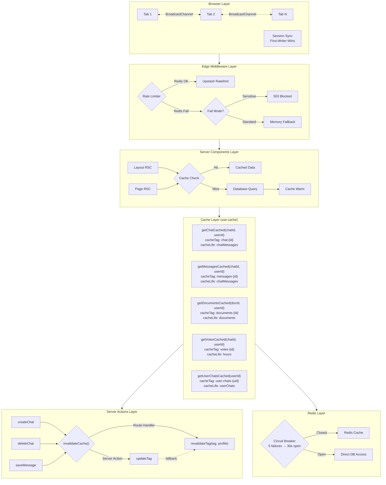

### Component Overview

| Component               | Responsibility                                   | File(s)                         | Covers REQs               |
| ----------------------- | ------------------------------------------------ | ------------------------------- | ------------------------- |
| Cached Data Functions   | Cache-first data fetching with serializable args | `lib/data/cached/*.ts`          | REQ-001, REQ-005          |
| cacheLife Configuration | Custom profile definitions                       | `next.config.ts`                | REQ-002                   |
| Cache Invalidation      | updateTag/revalidateTag orchestration            | `lib/cache-ops/invalidation.ts` | REQ-003, REQ-004, REQ-013 |
| Cache Tags Utility      | Standardized tag generation                      | `lib/cache/tags.ts`             | REQ-014                   |
| Dynamic Metadata        | SEO metadata for chat routes                     | `app/(chat)/chat/[id]/page.tsx` | REQ-006                   |
| Parallel Loader         | Optimized page data loading                      | `lib/data/parallel-loader.ts`   | REQ-007                   |
| Session Sync            | Multi-tab BroadcastChannel sync                  | `lib/auth/session-sync.ts`      | REQ-011                   |
| Rate Limiter            | Fail-closed mode for sensitive endpoints         | `lib/middleware/rate-limit.ts`  | REQ-012                   |
| Circuit Breaker         | Redis failure graceful degradation               | `lib/cache/circuit-breaker.ts`  | REQ-017                   |
| Audit Logger            | Cache invalidation event logging                 | `lib/cache-ops/audit.ts`        | REQ-018                   |

---

## Sequence Diagrams

<!-- Cache-first data flow with "use cache" directive -->

### Happy Path: Cache Hit Flow (REQ-001, REQ-002, REQ-005)

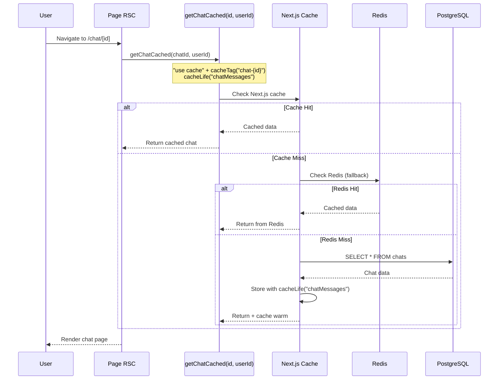

### Cache Invalidation Flow (REQ-003, REQ-004)

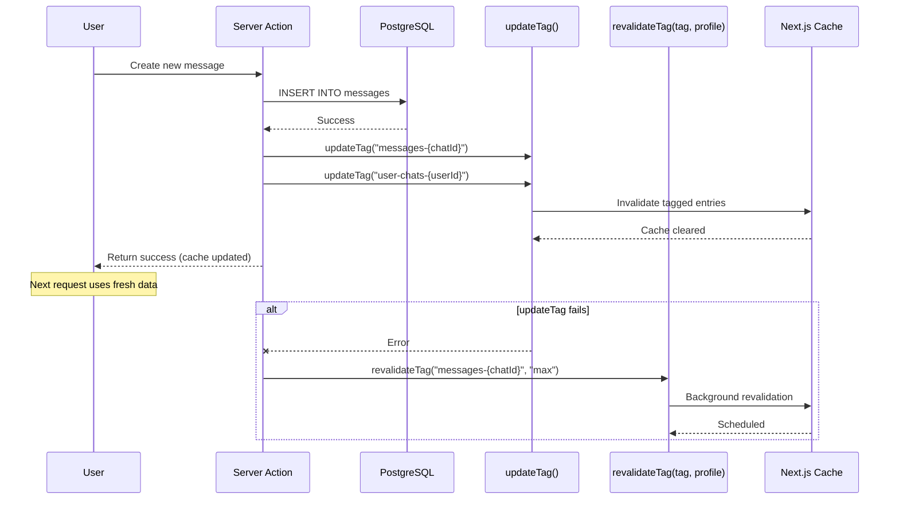

### Error Path: Cache Failure Graceful Degradation

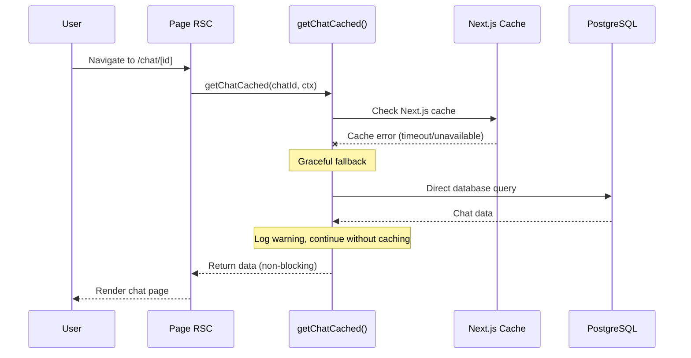

---

## Edge Case Sequence Diagrams (v3)

### Multi-Tab Session Synchronization Flow (REQ-011)

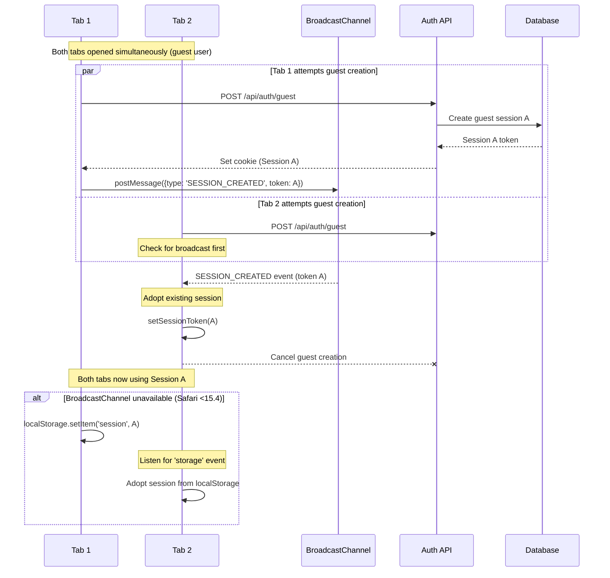

### Rate Limit Exceeded Flow (REQ-012)

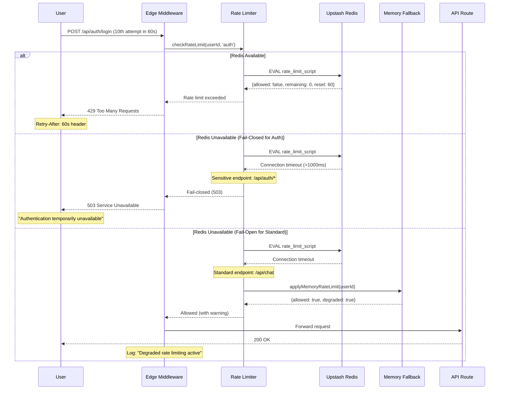

### Redis Failure Circuit Breaker Flow (REQ-017)

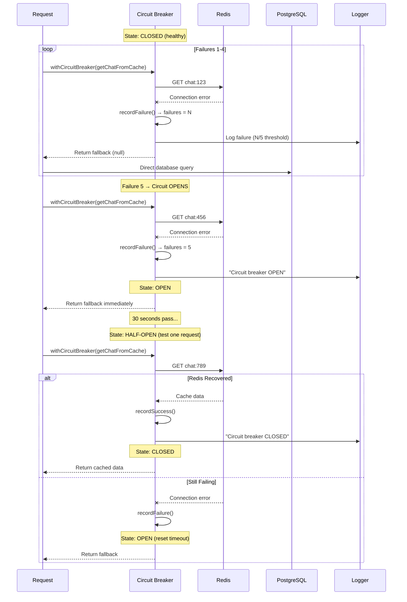

### Cache Invalidation Context Decision Flow (REQ-013)

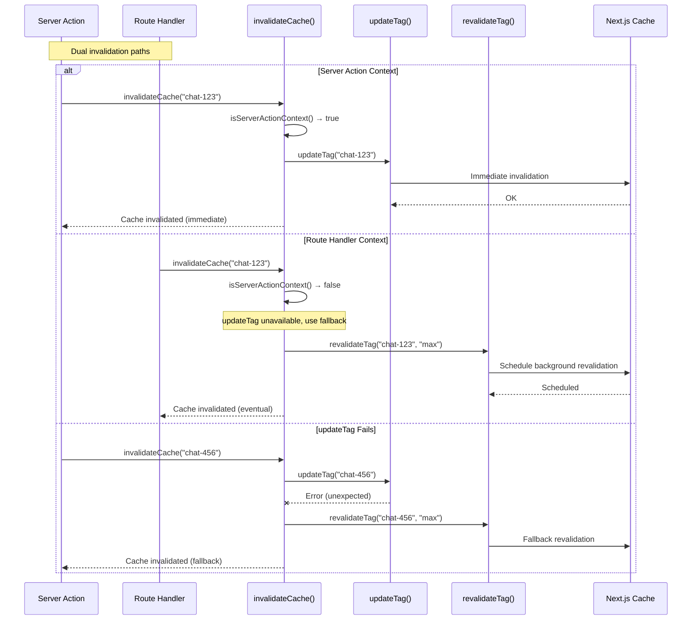

---

## State Diagram

<!-- Cache lifecycle states -->

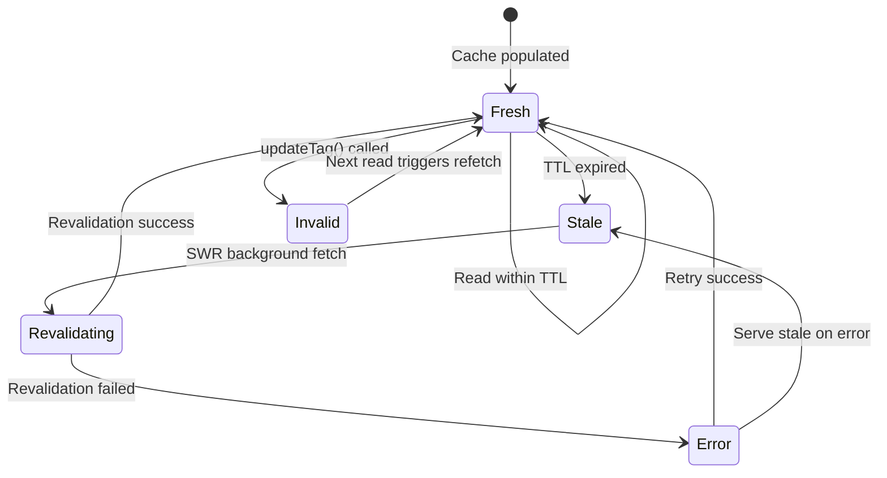

| State        | Description                          | Transitions                         |
| ------------ | ------------------------------------ | ----------------------------------- |
| Fresh        | Cache valid, serving data            | → Stale (TTL), → Invalid (mutation) |
| Stale        | TTL expired, background revalidate   | → Revalidating                      |
| Invalid      | Explicitly invalidated via updateTag | → Fresh (next read)                 |
| Revalidating | Fetching new data in background      | → Fresh, → Error                    |
| Error        | Revalidation failed                  | → Stale (fallback), → Fresh (retry) |

---

## ADR-001: Caching Architecture with "use cache" Directive

**Status**: Proposed  
**Date**: 2025-12-24  
**Author**: Ouroboros Architect

### Context

The project uses `cacheComponents: true` in `next.config.ts` but hasn't adopted the `"use cache"` directive. Five cached data files exist in `lib/data/cached/` with manual Redis caching. Next.js 16.1.0 provides native `"use cache"` with `cacheLife`/`cacheTag` for automatic deduplication and invalidation.

### Decision

Adopt `"use cache"` directive in all `lib/data/cached/*.ts` files with explicit custom cache profiles (see ADR-006 for profile configuration):

```typescript
// lib/data/cached/chat.ts
import { cacheLife, cacheTag } from "next/cache";

export async function getChatCached(
  chatId: string,
  userId: string // Serializable arg per ADR-007
): Promise<Chat | null> {
  "use cache";
  cacheTag(`chat-${chatId}`);
  cacheLife("chatMessages"); // Custom profile (4h revalidate)

  // Existing cache-first logic preserved
  const cached = await getChatFromCache(chatId, userId);
  if (cached) return cachedChatToChat(cached);

  const chat = await getChat(chatId, userId);
  if (chat) createChatInCache(chatToCachedMeta(chat), false).catch(() => {});
  return chat;
}
```

### Cache Profile Mapping (Uses ADR-006 Custom Profiles)

| Data Type      | cacheLife Profile  | stale | revalidate | expire | Rationale                     |
| -------------- | ------------------ | ----- | ---------- | ------ | ----------------------------- |
| Chat metadata  | `chatMessages`     | 60s   | 4h         | 24h    | Rarely changes after creation |
| Messages       | `chatMessages`     | 60s   | 4h         | 24h    | Append-only, stable           |
| User chat list | `userChats`        | 60s   | 5m         | 2h     | New chats created frequently  |
| Documents      | `documents`        | 300s  | 4h         | 24h    | Version-controlled            |
| Votes          | `hours` (built-in) | 5m    | 1h         | 24h    | Low-frequency updates         |
| Suggestions    | `suggestions`      | 60s   | 5m         | 1h     | Context-dependent             |

### Consequences

#### Positive

- **POS-001**: Automatic request deduplication across components
- **POS-002**: Built-in cache invalidation via `updateTag()`
- **POS-003**: Profile-based TTL management (declarative)
- **POS-004**: Works with Turbopack and React Compiler
- **POS-005**: Custom profiles enable domain-specific cache durations

#### Negative

- **NEG-001**: Requires careful tag naming to avoid collisions
- **NEG-002**: Migration effort for 5 existing files
- **NEG-003**: Must configure custom profiles in next.config.ts (ADR-006)

### Alternatives Considered

| Alternative                                     | Rejected Because                                         |
| ----------------------------------------------- | -------------------------------------------------------- |
| Keep manual Redis caching                       | Doesn't leverage Next.js optimization; duplicates effort |
| Use SWR for all caching                         | Client-side only; doesn't work with Server Components    |
| Use route segment `export const revalidate`     | Too coarse-grained; per-route not per-function           |
| Use only built-in profiles (`hours`, `minutes`) | Insufficient granularity for domain-specific needs       |

---

## ADR-002: Cache Invalidation Strategy (updateTag vs revalidateTag)

**Status**: Proposed  
**Date**: 2025-12-24  
**Revised**: 2025-12-24 (v2 - Breaking Change Handling)  
**Author**: Ouroboros Architect

### Context

Next.js 16 provides two cache invalidation methods:

1. `updateTag(tag)` - Server Actions only, immediate "read-your-writes" semantics
2. `revalidateTag(tag, profile)` - **BREAKING CHANGE**: Now requires profile argument

Current codebase uses Redis-based cache invalidation via `lib/cache/invalidation.ts`. Any existing `revalidateTag(tag)` calls will produce deprecation warnings.

### Decision

**Primary Strategy**: Use `updateTag()` in Server Actions for immediate invalidation with "read-your-writes" semantics.

**Fallback Strategy**: Use `revalidateTag(tag, profile)` with explicit profile argument for:

- API routes (where `updateTag` is unavailable)
- Scheduled jobs/webhooks
- Error recovery when `updateTag` fails

```typescript
// Server Action pattern (PRIMARY)
"use server";
import { updateTag } from "next/cache";

export async function createMessageAction(chatId: string, content: string) {
  const message = await saveMessage(chatId, content);

  // Immediate invalidation for read-your-writes
  updateTag(`messages-${chatId}`);
  updateTag(`user-chats-${message.userId}`);

  return message;
}

// API Route / Fallback pattern
import { revalidateTag } from "next/cache";

export async function POST(request: Request) {
  // ... mutation logic

  // BREAKING CHANGE: profile argument required
  revalidateTag("messages-123", "max"); // Immediate for user data
  revalidateTag("public-stats", "hours"); // Gradual for shared data
}
```

### revalidateTag Migration (REQ-004 Breaking Change)

| Old Signature                 | New Signature                         | Profile Choice           |
| ----------------------------- | ------------------------------------- | ------------------------ |
| `revalidateTag("user-chats")` | `revalidateTag("user-chats", "max")`  | User-specific, immediate |
| `revalidateTag("chat-123")`   | `revalidateTag("chat-123", "max")`    | User-specific, immediate |
| `revalidateTag("documents")`  | `revalidateTag("documents", "hours")` | Shared data, gradual     |

### Profile Selection Guide

| Data Sensitivity        | Profile        | Behavior                                        |
| ----------------------- | -------------- | ----------------------------------------------- |
| User-specific mutations | `"max"`        | Immediate propagation, no stale serving         |
| Shared/public data      | `"hours"`      | Background revalidation, stale-while-revalidate |
| High-frequency data     | Custom profile | Use ADR-006 profiles for fine control           |

### Invalidation Tag Taxonomy

```
user-chats-{userId}     → User's chat list
chat-{chatId}           → Single chat metadata
messages-{chatId}       → Messages in a chat
documents-{documentId}  → Document content
votes-{chatId}          → Votes on a chat
suggestions-{userId}    → User suggestions
session-{userId}        → Session data
```

### Consequences

#### Positive

- **POS-001**: Immediate cache update in Server Actions (no stale reads)
- **POS-002**: Granular invalidation (only affected data)
- **POS-003**: Type-safe tag generation with template literals

#### Negative

- **NEG-001**: Must call `updateTag` after every mutation
- **NEG-002**: Tag naming discipline required across team

---

## ADR-003: Proxy Migration Strategy ~~(middleware.ts → proxy.ts)~~

**Status**: ❌ INVALIDATED  
**Date**: 2025-12-24  
**Invalidated**: 2025-12-24  
**Author**: Ouroboros Architect

### Invalidation Reason

Research iteration 2 (phase0-iteration2-research.md) confirmed:

1. **No `unstable_noStore` usage**: Codebase search returned zero matches
2. **middleware.ts not deprecated**: The middleware API remains stable in Next.js 16
3. **proxy.ts migration unnecessary**: No breaking changes requiring migration

### Original Context (Preserved for Reference)

~~`middleware.ts` is deprecated in Next.js 16. Current middleware (334 lines) handles rate limiting, security headers, guest session creation.~~

### Decision

**NO ACTION REQUIRED** - Keep existing `middleware.ts` as-is.

### Impact on Other ADRs

- ADR-001: Unaffected (caching)
- ADR-002: Unaffected (invalidation)
- ADR-004: Unaffected (component boundaries)
- ADR-005: Unaffected (metadata)

---

## ADR-006: cacheLife Profile Configuration (NEW)

**Status**: Proposed  
**Date**: 2025-12-24  
**Author**: Ouroboros Architect  
**Covers**: REQ-002

### Context

Built-in cacheLife profiles (`hours`, `minutes`, `days`, `weeks`, `max`) provide generic durations. Domain-specific data types in this application require custom TTL configurations:

- **Chat messages**: Rarely change after creation → longer cache
- **User chat list**: New chats created frequently → shorter cache
- **Documents**: Version-controlled, stable → longer cache
- **Suggestions**: Context-dependent, changes often → shorter cache

### Decision

Define 4 custom cacheLife profiles in `next.config.ts`:

```typescript
// next.config.ts
const nextConfig: NextConfig = {
  experimental: {
    cacheLife: {
      // Profile: chatMessages - for chat metadata and messages
      chatMessages: {
        stale: 60, // Serve stale for 60s while revalidating
        revalidate: 14400, // Revalidate every 4 hours
        expire: 86400, // Hard expire after 24 hours
      },

      // Profile: userChats - for user's chat list
      userChats: {
        stale: 60, // Serve stale for 60s
        revalidate: 300, // Revalidate every 5 minutes
        expire: 7200, // Hard expire after 2 hours
      },

      // Profile: documents - for document content/versions
      documents: {
        stale: 300, // Serve stale for 5 minutes
        revalidate: 14400, // Revalidate every 4 hours
        expire: 86400, // Hard expire after 24 hours
      },

      // Profile: suggestions - for AI suggestions
      suggestions: {
        stale: 60, // Serve stale for 60s
        revalidate: 300, // Revalidate every 5 minutes
        expire: 3600, // Hard expire after 1 hour
      },
    },
  },
};
```

### Profile-to-Function Mapping

| Profile            | Functions Using It                                                    | Rationale               |
| ------------------ | --------------------------------------------------------------------- | ----------------------- |
| `chatMessages`     | `getChatCached`, `getMessagesCached`, `getChatWithMessagesCached`     | Stable after creation   |
| `userChats`        | `getUserChatsCached`                                                  | Frequently updated list |
| `documents`        | `getDocumentCached`, `getLatestVersionCached`, `getAllVersionsCached` | Version-controlled      |
| `suggestions`      | `getSuggestionsCached`                                                | Context-sensitive       |
| `hours` (built-in) | `getVoteCached`, `getVotesByChatIdCached`                             | Low update frequency    |

### Consequences

#### Positive

- **POS-001**: Domain-specific cache durations optimize freshness vs performance
- **POS-002**: Declarative configuration, easy to tune
- **POS-003**: Consistent behavior across all cached functions
- **POS-004**: Centralized configuration in next.config.ts

#### Negative

- **NEG-001**: Must update next.config.ts before deploying cached functions
- **NEG-002**: Profile names must be coordinated across team

### Alternatives Considered

| Alternative                      | Rejected Because                                   |
| -------------------------------- | -------------------------------------------------- |
| Use only built-in profiles       | Insufficient granularity (e.g., "hours" too broad) |
| Per-function hardcoded durations | Not maintainable, scattered configuration          |
| Environment variable durations   | Complex, harder to reason about                    |

---

## ADR-007: Function Signature Patterns for Caching (NEW)

**Status**: Proposed  
**Date**: 2025-12-24  
**Author**: Ouroboros Architect  
**Covers**: REQ-005

### Context

Current cached functions use `DataContext` object as parameter:

```typescript
// Current signature (problematic)
export async function getChatCached(chatId: string, ctx: DataContext);
```

The `"use cache"` directive requires all function arguments to be **serializable** for cache key generation. `DataContext` contains:

- `userId: string` ✅ Serializable
- `userType: "user" | "guest"` ✅ Serializable
- Additional methods/properties ❌ May not serialize

### Decision

Refactor all cached read functions to accept **primitive serializable arguments**:

```typescript
// NEW signature pattern - all args serializable
export async function getChatCached(
  chatId: string,
  userId: string
): Promise<Chat | null> {
  "use cache";
  cacheTag(`chat-${chatId}`);
  cacheLife("chatMessages");

  // Implementation using primitive args
}

// For functions needing userType
export async function getUserChatsCached(
  userId: string,
  userType: "user" | "guest" = "user"
): Promise<Chat[]> {
  "use cache";
  cacheTag(`user-chats-${userId}`);
  cacheLife("userChats");

  // Implementation
}
```

### Signature Changes

| Function                    | Before                     | After                         |
| --------------------------- | -------------------------- | ----------------------------- |
| `getChatCached`             | `(chatId, ctx)`            | `(chatId, userId)`            |
| `getUserChatsCached`        | `(ctx)`                    | `(userId, userType?)`         |
| `getChatWithMessagesCached` | `(chatId, ctx)`            | `(chatId, userId)`            |
| `getMessagesCached`         | `(chatId, ctx)`            | `(chatId, userId)`            |
| `getDocumentCached`         | `(docId, ctx)`             | `(docId, userId)`             |
| `getLatestVersionCached`    | `(docId, ctx)`             | `(docId, userId)`             |
| `getAllVersionsCached`      | `(docId, ctx)`             | `(docId, userId)`             |
| `getSuggestionsCached`      | `(ctx)`                    | `(userId)`                    |
| `getVoteCached`             | `(chatId, messageId, ctx)` | `(chatId, messageId, userId)` |
| `getVotesByChatIdCached`    | `(chatId, ctx)`            | `(chatId, userId)`            |

### Call Site Migration

```typescript
// BEFORE - using ctx object
const ctx = createContext(session.user.id, session.user.type);
const chat = await getChatCached(chatId, ctx);

// AFTER - using primitive args
const chat = await getChatCached(chatId, session.user.id);
```

### Consequences

#### Positive

- **POS-001**: Cache keys correctly generated from serializable args
- **POS-002**: Simpler function interfaces
- **POS-003**: Better TypeScript inference for cache behavior
- **POS-004**: Enables proper Next.js cache deduplication

#### Negative

- **NEG-001**: Breaking change - all call sites must be updated
- **NEG-002**: Some context information may need to be passed separately
- **NEG-003**: Tests must be updated for new signatures

### Backward Compatibility Strategy

Option A (Recommended): **Direct migration**

- Update all call sites in single PR
- Use TypeScript compiler to find all usages

Option B: **Wrapper functions** (if gradual rollout needed)

```typescript
// Temporary wrapper for gradual migration
export async function getChatCachedCompat(
  chatId: string,
  ctx: DataContext
): Promise<Chat | null> {
  return getChatCached(chatId, ctx.userId);
}
```

---

## ADR-008: Multi-Tab Session Synchronization (BroadcastChannel)

**Status**: Proposed  
**Date**: 2025-12-24  
**Author**: Ouroboros Architect  
**Covers**: REQ-011

### Context

Research identified a HIGH-RISK scenario: when a guest user opens multiple browser tabs simultaneously, each tab races to create its own guest session. This results in:

1. **Session Cookie Overwrite**: Tab B's session overwrites Tab A's cookie
2. **Orphaned Data**: Tab A's chat data becomes inaccessible
3. **User Confusion**: Different tabs show different chat histories

Current behavior:

```
TAB A                     TAB B
  │ No cookie               │ No cookie
  ▼                         ▼
Create guest A            Create guest B
  │                         │
  ▼                         ▼
Set cookie A              Set cookie B (OVERWRITES!)
  │                         │
  ▼                         ▼
Uses session A            Uses session B
(ORPHANED!)               (ACTIVE)
```

### Decision

Implement BroadcastChannel API for cross-tab session coordination with localStorage fallback for Safari <15.4:

```typescript
// lib/auth/session-sync.ts
const SESSION_CHANNEL = "ouroboros-session-sync";
const SESSION_STORAGE_KEY = "ouroboros-session-token";

interface SessionMessage {
  type: "SESSION_CREATED" | "SESSION_DESTROYED";
  token: string;
  timestamp: number;
}

export function createSessionSync() {
  // Primary: BroadcastChannel (modern browsers)
  let channel: BroadcastChannel | null = null;

  try {
    channel = new BroadcastChannel(SESSION_CHANNEL);
  } catch {
    // BroadcastChannel not supported, use localStorage fallback
  }

  return {
    broadcast: (message: SessionMessage) => {
      if (channel) {
        channel.postMessage(message);
      } else {
        // Fallback: localStorage event
        localStorage.setItem(SESSION_STORAGE_KEY, JSON.stringify(message));
      }
    },

    onMessage: (handler: (message: SessionMessage) => void) => {
      if (channel) {
        channel.onmessage = (event) => handler(event.data);
      } else {
        // Fallback: storage event listener
        window.addEventListener("storage", (event) => {
          if (event.key === SESSION_STORAGE_KEY && event.newValue) {
            handler(JSON.parse(event.newValue));
          }
        });
      }
    },

    close: () => {
      channel?.close();
    },
  };
}
```

### Integration with Auth Bootstrap

```typescript
// features/auth/components/auth-bootstrap.tsx
"use client";

import { useEffect, useRef } from "react";
import { createSessionSync } from "@/lib/auth/session-sync";

export function AuthBootstrap({ children }: { children: React.ReactNode }) {
  const syncRef = useRef(createSessionSync());
  const sessionCreatedRef = useRef(false);

  useEffect(() => {
    const sync = syncRef.current;

    // Listen for existing sessions from other tabs
    sync.onMessage((message) => {
      if (message.type === "SESSION_CREATED" && !sessionCreatedRef.current) {
        // Adopt existing session, skip our own creation
        document.cookie = `session=${message.token}; path=/`;
        sessionCreatedRef.current = true;
      }
    });

    // On guest session creation, broadcast to other tabs
    const originalFetch = window.fetch;
    window.fetch = async (input, init) => {
      const response = await originalFetch(input, init);

      if (typeof input === "string" && input.includes("/api/auth/guest")) {
        const cloned = response.clone();
        const data = await cloned.json();
        if (data.token) {
          sync.broadcast({
            type: "SESSION_CREATED",
            token: data.token,
            timestamp: Date.now(),
          });
          sessionCreatedRef.current = true;
        }
      }

      return response;
    };

    return () => {
      sync.close();
      window.fetch = originalFetch;
    };
  }, []);

  return <>{children}</>;
}
```

### Race Condition Resolution: First-Writer-Wins

| Scenario                        | Behavior                                        |
| ------------------------------- | ----------------------------------------------- |
| Tab A creates session first     | Tab B receives broadcast, adopts A's session    |
| Both tabs create simultaneously | First broadcast wins; later tab adopts          |
| Network delay causes duplicate  | Server-side idempotency key prevents duplicates |

### Consequences

#### Positive

- **POS-001**: No orphaned guest data across tabs
- **POS-002**: Consistent user experience in multi-tab scenarios
- **POS-003**: Works with Safari <15.4 via localStorage fallback
- **POS-004**: Minimal performance overhead (event-driven)

#### Negative

- **NEG-001**: Additional client-side code complexity
- **NEG-002**: Requires testing across browser versions
- **NEG-003**: localStorage fallback has same-origin limitation

### Alternatives Considered

| Alternative                 | Rejected Because                                     |
| --------------------------- | ---------------------------------------------------- |
| SharedWorker                | Not supported in Safari; more complex implementation |
| Server-side session locking | Adds latency; doesn't prevent initial race           |
| Cookie-based polling        | Inefficient; doesn't provide real-time sync          |
| IndexedDB sync              | Overkill for session token; more complex             |

---

## ADR-009: Rate Limiting Strategy (Fail-Closed for Sensitive Endpoints)

**Status**: Proposed  
**Date**: 2025-12-24  
**Author**: Ouroboros Architect  
**Covers**: REQ-012

### Context

Current rate limiting implementation fails OPEN by default when Redis is unavailable:

```typescript
// CURRENT (VULNERABLE)
if (!limiter) {
    return { allowed: true, ... }; // DEFAULT: fail-open
}
```

This creates a HIGH security risk: during Redis outages, authentication endpoints become vulnerable to brute-force attacks with unlimited attempts.

Research finding (Phase 0 Iteration 3):

> "Rate limit fail-open (Issue #197). For auth endpoints, this is a security risk."

### Decision

Implement **tiered fail behavior** based on endpoint sensitivity:

```typescript
// lib/middleware/rate-limit-config.ts

/**
 * Endpoint sensitivity classification
 * Sensitive = fail-closed (503 when Redis unavailable)
 * Standard = fail-open with memory fallback
 */
export const ENDPOINT_SENSITIVITY: Record<string, "sensitive" | "standard"> = {
  "/api/auth/login": "sensitive",
  "/api/auth/register": "sensitive",
  "/api/auth/guest": "sensitive",
  "/api/auth/callback": "sensitive",
  "/api/auth/exchange": "sensitive",
  "/api/files/upload": "sensitive",
  "/api/chat": "standard",
  "/api/document": "standard",
  "/api/vote": "standard",
  "/api/history": "standard",
  "/api/suggestions": "standard",
} as const;

/**
 * Memory-based fallback rate limiter
 * Used when Redis is unavailable for non-sensitive endpoints
 */
const memoryLimiter = new Map<string, { count: number; resetAt: number }>();
const MEMORY_LIMIT = 10; // requests per minute
const MEMORY_WINDOW_MS = 60_000;

export function applyMemoryRateLimit(identifier: string): RateLimitResult {
  const now = Date.now();
  const key = `memory:${identifier}`;

  let entry = memoryLimiter.get(key);

  if (!entry || entry.resetAt < now) {
    entry = { count: 0, resetAt: now + MEMORY_WINDOW_MS };
    memoryLimiter.set(key, entry);
  }

  entry.count++;

  return {
    success: entry.count <= MEMORY_LIMIT,
    limit: MEMORY_LIMIT,
    remaining: Math.max(0, MEMORY_LIMIT - entry.count),
    reset: entry.resetAt,
    degraded: true,
  };
}
```

### Rate Limiter Implementation

```typescript
// lib/middleware/rate-limit.ts

import {
  ENDPOINT_SENSITIVITY,
  applyMemoryRateLimit,
} from "./rate-limit-config";

function getSensitivity(pathname: string): "sensitive" | "standard" {
  // Check exact match first
  if (ENDPOINT_SENSITIVITY[pathname]) {
    return ENDPOINT_SENSITIVITY[pathname];
  }

  // Check prefix patterns
  for (const [pattern, sensitivity] of Object.entries(ENDPOINT_SENSITIVITY)) {
    if (pathname.startsWith(pattern)) {
      return sensitivity;
    }
  }

  return "standard"; // Default to standard for unlisted endpoints
}

export async function checkRateLimit(
  identifier: string,
  pathname: string,
  limiterType: LimiterType
): Promise<RateLimitResult> {
  const sensitivity = getSensitivity(pathname);

  try {
    const limiter = await getRateLimiter(limiterType);

    if (!limiter) {
      // Redis unavailable - apply fail policy based on sensitivity
      if (sensitivity === "sensitive") {
        console.error(
          `[SECURITY] Redis unavailable - blocking sensitive endpoint: ${pathname}`
        );
        return {
          success: false,
          limit: 0,
          remaining: 0,
          reset: Date.now() + 60_000,
          blocked: true,
          reason: "service_unavailable",
        };
      }

      // Standard endpoint: use memory fallback
      console.warn(`[DEGRADED] Using memory rate limit for: ${pathname}`);
      return applyMemoryRateLimit(identifier);
    }

    // Normal Redis-based rate limiting
    const result = await limiter.limit(identifier);
    return {
      success: result.success,
      limit: result.limit,
      remaining: result.remaining,
      reset: result.reset,
    };
  } catch (error) {
    // Timeout or error - apply same fail policy
    if (sensitivity === "sensitive") {
      console.error(
        `[SECURITY] Rate limit error - blocking: ${pathname}`,
        error
      );
      return {
        success: false,
        limit: 0,
        remaining: 0,
        reset: Date.now() + 60_000,
        blocked: true,
        reason: "rate_limit_error",
      };
    }

    return applyMemoryRateLimit(identifier);
  }
}
```

### Fail Behavior Matrix

| Endpoint Pattern    | Sensitivity | Redis OK     | Redis Unavailable        |
| ------------------- | ----------- | ------------ | ------------------------ |
| `/api/auth/*`       | Sensitive   | Normal limit | **503 Blocked**          |
| `/api/files/upload` | Sensitive   | Normal limit | **503 Blocked**          |
| `/api/chat`         | Standard    | Normal limit | Memory fallback (10/min) |
| `/api/document`     | Standard    | Normal limit | Memory fallback (10/min) |
| `/api/*` (other)    | Standard    | Normal limit | Memory fallback (10/min) |

### Consequences

#### Positive

- **POS-001**: Auth endpoints protected even during Redis outages
- **POS-002**: Non-sensitive endpoints continue functioning (degraded)
- **POS-003**: Clear security logging for incident response
- **POS-004**: Configurable per-endpoint sensitivity

#### Negative

- **NEG-001**: Auth endpoints become unavailable during Redis outages
- **NEG-002**: Memory limiter doesn't sync across edge instances
- **NEG-003**: Requires monitoring to detect degraded mode

### Alternatives Considered

| Alternative                         | Rejected Because                            |
| ----------------------------------- | ------------------------------------------- |
| Fail-closed for ALL endpoints       | Too disruptive for non-sensitive operations |
| Fail-open for ALL endpoints         | Security risk for auth endpoints            |
| External rate limiting (Cloudflare) | Adds external dependency; less control      |
| Queue-based throttling              | Complex; adds latency                       |

---

## ADR-010: Cache Invalidation Pattern (Server Actions vs Route Handlers)

**Status**: Proposed  
**Date**: 2025-12-24  
**Author**: Ouroboros Architect  
**Covers**: REQ-013

### Context

Next.js 16 provides two cache invalidation APIs:

| API                           | Context             | Behavior                      |
| ----------------------------- | ------------------- | ----------------------------- |
| `updateTag(tag)`              | Server Actions ONLY | Immediate, "read-your-writes" |
| `revalidateTag(tag, profile)` | Any server context  | Background revalidation       |

The codebase has both Server Actions (`features/*/actions/*.ts`) and Route Handlers (`app/api/*/route.ts`). Using `updateTag` in Route Handlers throws an error.

### Decision

Create unified `invalidateCache()` utility that auto-detects context and uses optimal API:

```typescript
// lib/cache-ops/invalidation.ts
import { updateTag, revalidateTag } from "next/cache";
import { logCacheInvalidation } from "./audit";

// Context detection using async_hooks (server-side)
let isServerAction = false;

export function markServerActionContext() {
  isServerAction = true;
}

export function isServerActionContext(): boolean {
  return isServerAction;
}

export type InvalidationProfile = "max" | "hours" | "days";

export interface InvalidateCacheOptions {
  /** Profile for revalidateTag fallback. Default: 'max' */
  profile?: InvalidationProfile;
  /** Source of invalidation for audit log */
  source?: "server-action" | "route-handler" | "webhook" | "scheduled";
  /** User ID for audit trail */
  userId?: string;
}

/**
 * Unified cache invalidation that works in any context
 *
 * - Server Actions: Uses updateTag() for immediate invalidation
 * - Route Handlers: Uses revalidateTag(tag, profile) as fallback
 * - Automatically falls back if updateTag fails
 *
 * @example
 * // In Server Action
 * await invalidateCache('chat-123');
 *
 * // In Route Handler
 * await invalidateCache('chat-123', { source: 'route-handler' });
 */
export async function invalidateCache(
  tag: string,
  options: InvalidateCacheOptions = {}
): Promise<void> {
  const { profile = "max", source = "server-action", userId } = options;

  // Audit logging (REQ-018)
  logCacheInvalidation({
    tag,
    method: isServerActionContext() ? "updateTag" : "revalidateTag",
    source,
    userId,
    timestamp: new Date().toISOString(),
  });

  try {
    // Attempt updateTag (only works in Server Actions)
    if (isServerActionContext()) {
      updateTag(tag);
      return;
    }
  } catch (error) {
    // Not in Server Action context or updateTag failed
    console.debug(
      `updateTag failed for ${tag}, using revalidateTag fallback`,
      error
    );
  }

  // Fallback: works in Route Handlers and as error recovery
  revalidateTag(tag, profile);
}

/**
 * Invalidate multiple tags atomically
 */
export async function invalidateCacheTags(
  tags: string[],
  options: InvalidateCacheOptions = {}
): Promise<void> {
  await Promise.all(tags.map((tag) => invalidateCache(tag, options)));
}
```

### Usage Examples

```typescript
// Server Action - uses updateTag (immediate)
'use server';
import { invalidateCache, markServerActionContext } from '@/lib/cache-ops/invalidation';

export async function createMessage(chatId: string, content: string) {
  markServerActionContext();

  const message = await db.message.create({ ... });

  await invalidateCache(`chat-messages-${chatId}`, {
    source: 'server-action',
    userId: session.user.id
  });

  return message;
}

// Route Handler - uses revalidateTag (background)
import { invalidateCache } from '@/lib/cache-ops/invalidation';

export async function POST(request: Request) {
  const { chatId } = await request.json();

  await invalidateCache(`chat-${chatId}`, {
    source: 'route-handler',
    profile: 'max'
  });

  return Response.json({ success: true });
}

// Webhook - explicit fallback
export async function handleWebhook(payload: WebhookPayload) {
  await invalidateCache(`user-chats-${payload.userId}`, {
    source: 'webhook',
    profile: 'hours' // Less aggressive for external triggers
  });
}
```

### Consequences

#### Positive

- **POS-001**: Single API for all invalidation contexts
- **POS-002**: Automatic optimal method selection
- **POS-003**: Graceful fallback on errors
- **POS-004**: Built-in audit logging support
- **POS-005**: Type-safe profile selection

#### Negative

- **NEG-001**: Route Handlers don't get immediate "read-your-writes"
- **NEG-002**: Context detection adds small overhead
- **NEG-003**: Developers must understand the behavior difference

### Alternatives Considered

| Alternative                                       | Rejected Because                              |
| ------------------------------------------------- | --------------------------------------------- |
| Always use revalidateTag                          | Loses immediate consistency in Server Actions |
| Separate invalidateImmediate/invalidateBackground | More complex API; easy to use wrong one       |
| Let developers choose manually                    | Error-prone; inconsistent codebase            |

---

## ADR-011: Cache Tag Naming Convention

**Status**: Proposed  
**Date**: 2025-12-24  
**Author**: Ouroboros Architect  
**Covers**: REQ-014

### Context

Without a standardized naming convention, cache tags can:

1. **Collide**: `user-123` vs `chat-123` if both use just IDs
2. **Be unpredictable**: Different developers use different patterns
3. **Break batch invalidation**: Hard to invalidate "all user X's data"

### Decision

Establish hierarchical tag naming schema with type-safe utilities:

```typescript
// lib/cache/tags.ts

/**
 * Cache Tag Naming Convention
 *
 * Pattern: {entity}-{id} or {scope}-{entity}-{id}
 *
 * Examples:
 *   - chat-abc123         (single chat)
 *   - user-chats-usr456   (user's chat list)
 *   - chat-messages-abc123 (messages in chat)
 */

// Type-safe tag builders
export const CacheTags = {
  // ─────────────────────────────────────────────
  // Entity-specific (single resource)
  // ─────────────────────────────────────────────

  /** Single chat metadata: chat-{chatId} */
  chat: (chatId: string) => `chat-${chatId}` as const,

  /** Single document: document-{docId} */
  document: (docId: string) => `document-${docId}` as const,

  // ─────────────────────────────────────────────
  // User-scoped (user's collection)
  // ─────────────────────────────────────────────

  /** User's chat list: user-chats-{userId} */
  userChats: (userId: string) => `user-chats-${userId}` as const,

  /** User's documents: user-documents-{userId} */
  userDocuments: (userId: string) => `user-documents-${userId}` as const,

  /** User's session data: user-session-{userId} */
  userSession: (userId: string) => `user-session-${userId}` as const,

  // ─────────────────────────────────────────────
  // Relationship (parent-child)
  // ─────────────────────────────────────────────

  /** Messages in chat: chat-messages-{chatId} */
  chatMessages: (chatId: string) => `chat-messages-${chatId}` as const,

  /** Votes on chat: chat-votes-{chatId} */
  chatVotes: (chatId: string) => `chat-votes-${chatId}` as const,

  /** Document versions: document-versions-{docId} */
  documentVersions: (docId: string) => `document-versions-${docId}` as const,

  // ─────────────────────────────────────────────
  // Context-scoped (multi-key)
  // ─────────────────────────────────────────────

  /** Suggestions for doc+user: suggestions-{docId}-{userId} */
  suggestions: (docId: string, userId: string) =>
    `suggestions-${docId}-${userId}` as const,
} as const;

// Type for all possible cache tags
export type CacheTag = ReturnType<(typeof CacheTags)[keyof typeof CacheTags]>;

// ─────────────────────────────────────────────
// Batch Invalidation Helpers
// ─────────────────────────────────────────────

/**
 * Get all tags that should be invalidated when a chat is deleted
 */
export function getChatInvalidationTags(
  chatId: string,
  userId: string
): string[] {
  return [
    CacheTags.chat(chatId),
    CacheTags.chatMessages(chatId),
    CacheTags.chatVotes(chatId),
    CacheTags.userChats(userId),
  ];
}

/**
 * Get all tags for user data invalidation (e.g., on logout)
 */
export function getUserInvalidationTags(userId: string): string[] {
  return [
    CacheTags.userChats(userId),
    CacheTags.userDocuments(userId),
    CacheTags.userSession(userId),
  ];
}
```

### Usage Examples

```typescript
// In cached data function
import { cacheTag } from "next/cache";
import { CacheTags } from "@/lib/cache/tags";

export async function getChatCached(chatId: string, userId: string) {
  "use cache";
  cacheTag(CacheTags.chat(chatId)); // → "chat-abc123"
  // ...
}

// In Server Action
import { invalidateCacheTags } from "@/lib/cache-ops/invalidation";
import { getChatInvalidationTags } from "@/lib/cache/tags";

export async function deleteChatAction(chatId: string) {
  "use server";
  const userId = await getCurrentUserId();

  await deleteChat(chatId);

  // Invalidate all related caches atomically
  await invalidateCacheTags(getChatInvalidationTags(chatId, userId));
}
```

### Tag Schema Summary

| Pattern                       | Example                 | Use Case          |
| ----------------------------- | ----------------------- | ----------------- |
| `{entity}-{id}`               | `chat-abc123`           | Single resource   |
| `user-{entity}-{userId}`      | `user-chats-usr456`     | User's collection |
| `{parent}-{child}-{parentId}` | `chat-messages-abc123`  | Relationship data |
| `{entity}-{key1}-{key2}`      | `suggestions-doc1-usr1` | Multi-key context |

### Consequences

#### Positive

- **POS-001**: Type-safe tag generation (TypeScript autocomplete)
- **POS-002**: Consistent naming across codebase
- **POS-003**: Easy batch invalidation with helper functions
- **POS-004**: No accidental tag collisions

#### Negative

- **NEG-001**: Slightly more verbose than raw strings
- **NEG-002**: Requires importing CacheTags utility

### Alternatives Considered

| Alternative            | Rejected Because                       |
| ---------------------- | -------------------------------------- |
| Raw string templates   | Error-prone; no type safety            |
| Enum-based tags        | Too rigid; doesn't support dynamic IDs |
| Nested object notation | Harder to read in cacheTag() calls     |

---

## ADR-012: Redis Failure Graceful Degradation (Circuit Breaker Enhancement)

**Status**: Proposed  
**Date**: 2025-12-24  
**Author**: Ouroboros Architect  
**Covers**: REQ-017

### Context

The existing circuit breaker (`lib/cache/circuit-breaker.ts`) provides basic failure protection:

```typescript
// Current implementation
const CIRCUIT_FAILURE_THRESHOLD = 5;
const CIRCUIT_RESET_TIMEOUT_MS = 30_000;
```

However, the current implementation lacks:

1. **Metric emission** for monitoring/alerting
2. **Half-open state logging** for visibility
3. **Differentiated behavior** per operation type
4. **Integration with rate limiter** (ADR-009)

### Decision

Enhance circuit breaker with structured logging, metrics, and integration hooks:

```typescript
// lib/cache/circuit-breaker.ts (enhanced)
import "server-only";

import {
  CIRCUIT_FAILURE_THRESHOLD,
  CIRCUIT_RESET_TIMEOUT_MS,
} from "./constants";
import type { CircuitBreakerState, CircuitEvent } from "./types";

// ─────────────────────────────────────────────
// State Management
// ─────────────────────────────────────────────

const globalForCircuit = globalThis as unknown as {
  circuitState: CircuitBreakerState;
};

if (!globalForCircuit.circuitState) {
  globalForCircuit.circuitState = {
    failures: 0,
    lastFailure: null,
    isOpen: false,
    openedAt: null,
    halfOpenAttempts: 0,
  };
}

// ─────────────────────────────────────────────
// Event Emission (for monitoring integration)
// ─────────────────────────────────────────────

type CircuitEventHandler = (event: CircuitEvent) => void;
const eventHandlers: CircuitEventHandler[] = [];

export function onCircuitEvent(handler: CircuitEventHandler): () => void {
  eventHandlers.push(handler);
  return () => {
    const idx = eventHandlers.indexOf(handler);
    if (idx > -1) eventHandlers.splice(idx, 1);
  };
}

function emitEvent(event: CircuitEvent): void {
  for (const handler of eventHandlers) {
    try {
      handler(event);
    } catch (e) {
      console.error("Circuit event handler error:", e);
    }
  }
}

// ─────────────────────────────────────────────
// Circuit State Functions
// ─────────────────────────────────────────────

export function getCircuitState(): Readonly<CircuitBreakerState> {
  return { ...globalForCircuit.circuitState };
}

export type CircuitStatus = "closed" | "open" | "half-open";

export function getCircuitStatus(): CircuitStatus {
  const state = globalForCircuit.circuitState;

  if (!state.isOpen) {
    return "closed";
  }

  if (state.lastFailure) {
    const timeSinceFailure = Date.now() - state.lastFailure;
    if (timeSinceFailure >= CIRCUIT_RESET_TIMEOUT_MS) {
      return "half-open";
    }
  }

  return "open";
}

export function isCircuitOpen(): boolean {
  return getCircuitStatus() === "open";
}

// ─────────────────────────────────────────────
// Failure/Success Recording
// ─────────────────────────────────────────────

export function recordFailure(operation: string, error: unknown): void {
  const state = globalForCircuit.circuitState;
  const previousStatus = getCircuitStatus();

  state.failures++;
  state.lastFailure = Date.now();

  const logContext = {
    operation,
    failures: state.failures,
    threshold: CIRCUIT_FAILURE_THRESHOLD,
    status: getCircuitStatus(),
  };

  console.error(`[CircuitBreaker] Cache failure:`, logContext, error);

  emitEvent({
    type: "failure",
    operation,
    failures: state.failures,
    timestamp: Date.now(),
  });

  // Open circuit if threshold reached
  if (state.failures >= CIRCUIT_FAILURE_THRESHOLD && !state.isOpen) {
    state.isOpen = true;
    state.openedAt = Date.now();

    console.warn(`[CircuitBreaker] OPENED after ${state.failures} failures`, {
      resetAfterMs: CIRCUIT_RESET_TIMEOUT_MS,
      operation,
    });

    emitEvent({
      type: "open",
      failures: state.failures,
      timestamp: Date.now(),
    });
  }
}

export function recordSuccess(): void {
  const state = globalForCircuit.circuitState;
  const previousStatus = getCircuitStatus();

  if (state.failures > 0 || state.isOpen) {
    const wasHalfOpen = previousStatus === "half-open";

    state.failures = 0;
    state.isOpen = false;
    state.lastFailure = null;
    state.openedAt = null;
    state.halfOpenAttempts = 0;

    console.info(`[CircuitBreaker] CLOSED (success)`, {
      wasHalfOpen,
      recoveryTimeMs: wasHalfOpen ? Date.now() - (state.openedAt || 0) : null,
    });

    emitEvent({
      type: "close",
      wasHalfOpen,
      timestamp: Date.now(),
    });
  }
}

// ─────────────────────────────────────────────
// Enhanced Wrapper with Logging
// ─────────────────────────────────────────────

export interface CircuitBreakerOptions<T> {
  /** Fallback value when circuit is open */
  fallback: T;
  /** Operation name for logging */
  operation: string;
  /** Timeout for the operation (ms) */
  timeout?: number;
  /** Custom error handler */
  onError?: (error: unknown) => void;
}

export async function withCircuitBreaker<T>(
  options: CircuitBreakerOptions<T>,
  fn: () => Promise<T>
): Promise<T> {
  const { fallback, operation, timeout = 5000, onError } = options;
  const status = getCircuitStatus();

  // Fast path: circuit is fully open
  if (status === "open") {
    console.debug(`[CircuitBreaker] Skipping ${operation} (circuit open)`);
    return fallback;
  }

  // Half-open: allow one test request
  if (status === "half-open") {
    const state = globalForCircuit.circuitState;
    state.halfOpenAttempts++;
    console.info(
      `[CircuitBreaker] Testing ${operation} (half-open, attempt ${state.halfOpenAttempts})`
    );
  }

  try {
    // Execute with timeout
    const result = await Promise.race([
      fn(),
      new Promise<never>((_, reject) =>
        setTimeout(
          () => reject(new Error(`${operation} timeout after ${timeout}ms`)),
          timeout
        )
      ),
    ]);

    recordSuccess();
    return result;
  } catch (error) {
    onError?.(error);
    recordFailure(operation, error);
    return fallback;
  }
}
```

### Types Addition

```typescript
// lib/cache/types.ts (additions)

export interface CircuitBreakerState {
  failures: number;
  lastFailure: number | null;
  isOpen: boolean;
  openedAt: number | null;
  halfOpenAttempts: number;
}

export type CircuitEvent =
  | { type: "failure"; operation: string; failures: number; timestamp: number }
  | { type: "open"; failures: number; timestamp: number }
  | { type: "close"; wasHalfOpen: boolean; timestamp: number };
```

### Monitoring Integration

```typescript
// lib/cache/circuit-monitor.ts

import { onCircuitEvent } from "./circuit-breaker";

// Initialize monitoring (call once at app startup)
export function initCircuitMonitoring(): void {
  onCircuitEvent((event) => {
    switch (event.type) {
      case "open":
        // Alert: Redis circuit breaker opened
        console.error("[ALERT] Redis circuit breaker OPENED", event);
        // TODO: Send to monitoring (Vercel Analytics, Datadog, etc.)
        break;

      case "close":
        console.info("[RECOVERED] Redis circuit breaker closed", event);
        break;

      case "failure":
        if (event.failures >= 3) {
          console.warn("[WARNING] Redis failures increasing", event);
        }
        break;
    }
  });
}
```

### Degradation Behavior Summary

| Component     | Circuit Closed        | Circuit Half-Open | Circuit Open                 |
| ------------- | --------------------- | ----------------- | ---------------------------- |
| Chat Cache    | Redis → DB fallback   | Test 1 request    | Direct DB                    |
| Session Cache | Redis                 | Test 1 request    | Direct DB                    |
| Rate Limiting | Upstash               | Test 1 request    | Memory/Fail-closed (ADR-009) |
| Message Cache | Redis → Next.js cache | Test 1 request    | Next.js cache only           |

### Consequences

#### Positive

- **POS-001**: Structured logging for debugging/alerting
- **POS-002**: Event hooks for monitoring integration
- **POS-003**: Timeout protection prevents hanging requests
- **POS-004**: Half-open visibility for observability
- **POS-005**: Type-safe event handling

#### Negative

- **NEG-001**: Slightly more complex than basic circuit breaker
- **NEG-002**: Event handlers add small overhead
- **NEG-003**: Requires monitoring setup to fully benefit

### Alternatives Considered

| Alternative                    | Rejected Because                             |
| ------------------------------ | -------------------------------------------- |
| Opossum library                | External dependency; our needs are simpler   |
| Per-operation circuit breakers | Complexity; one global breaker is sufficient |
| No circuit breaker             | Risk of cascading failures                   |

---

## ADR-004: Component Boundary Optimization

**Status**: Proposed  
**Date**: 2025-12-24  
**Author**: Ouroboros Architect

### Context

Current architecture uses Server Components effectively but Suspense boundaries need optimization for Core Web Vitals (LCP < 2.5s, CLS < 0.1).

### Decision

#### Server Component Classification

```
┌─────────────────────────────────────────────────────────────────┐
│ SERVER COMPONENTS (RSC) - No "use client"                       │
├─────────────────────────────────────────────────────────────────┤
│ app/layout.tsx              → Root layout, providers            │
│ app/(chat)/layout.tsx       → Chat layout, sidebar state        │
│ app/(chat)/page.tsx         → New chat page                     │
│ app/(chat)/chat/[id]/page.tsx → Existing chat (NEEDS METADATA) │
│ lib/data/cached/*.ts        → All data functions                │
│ lib/data/parallel-loader.ts → Parallel data loading             │
└─────────────────────────────────────────────────────────────────┘

┌─────────────────────────────────────────────────────────────────┐
│ CLIENT COMPONENTS - "use client"                                │
├─────────────────────────────────────────────────────────────────┤
│ chat-layout-client.tsx      → Sidebar toggle, keyboard nav      │
│ features/chat/Chat.tsx      → Chat UI, message input            │
│ features/sidebar/Sidebar.tsx → Chat history, navigation         │
│ lib/cache/use-invalidation.ts → Client-side cache sync          │
└─────────────────────────────────────────────────────────────────┘
```

#### Suspense Boundary Strategy

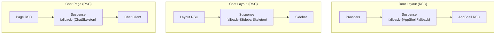

### Suspense Fallback Components

| Boundary    | Fallback Component | Purpose                         |
| ----------- | ------------------ | ------------------------------- |
| Root layout | `AppShellFallback` | Minimal shell during auth check |
| Chat layout | `SidebarSkeleton`  | Sidebar placeholder             |
| Chat page   | `loading.tsx`      | Chat UI skeleton                |

### Consequences

#### Positive

- **POS-001**: Progressive rendering improves LCP
- **POS-002**: Skeleton fallbacks prevent CLS
- **POS-003**: Server Components reduce client JS bundle

#### Negative

- **NEG-001**: Must maintain skeleton components for each boundary

---

## ADR-005: generateMetadata for Dynamic Routes

**Status**: Proposed  
**Date**: 2025-12-24  
**Author**: Ouroboros Architect

### Context

`app/(chat)/chat/[id]/page.tsx` lacks `generateMetadata`, causing suboptimal SEO and social sharing. Chat titles should appear in page metadata.

### Decision

Add `generateMetadata` to dynamic chat route:

```typescript
// app/(chat)/chat/[id]/page.tsx
import type { Metadata } from "next";
import { getChatCached } from "@/lib/data/cached";
import { getSessionCached } from "@/lib/auth";

export async function generateMetadata({
  params,
}: {
  params: Promise<{ id: string }>;
}): Promise<Metadata> {
  const { id } = await params;
  const session = await getSessionCached();

  if (!session?.user) {
    return { title: "Chat" };
  }

  const ctx = createContext(session.user.id, session.user.type);
  const chat = await getChatCached(id, ctx);

  if (!chat) {
    return { title: "Chat Not Found" };
  }

  return {
    title: chat.title || "Chat",
    description: `Chat conversation: ${chat.title}`,
    openGraph: {
      title: chat.title || "Chat",
      type: "article",
    },
  };
}
```

### Consequences

#### Positive

- **POS-001**: Proper page titles in browser tab
- **POS-002**: Social sharing shows chat title
- **POS-003**: SEO improvement for public chats

#### Negative

- **NEG-001**: Additional data fetch in metadata generation (mitigated by cache hit)

---

## Data Fetching Architecture

### Parallel vs Sequential Loading

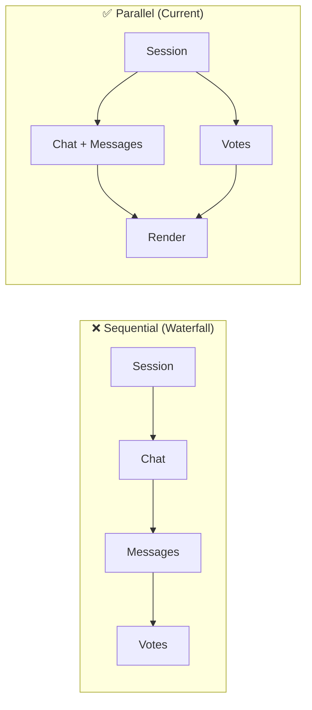

### Current Implementation (lib/data/parallel-loader.ts)

```typescript
export async function loadChatPageData(chatId: string): Promise<ChatPageData> {
  // Step 1: Session (required for userId)
  const session = await getSessionCached();

  if (!session?.user) {
    return { session: null, ctx: null, chatWithMessages: null, votes: [] };
  }

  const ctx = createContext(session.user.id, session.user.type);

  // Step 2: Parallel loading (Promise.allSettled for resilience)
  const [chatResult, votesResult] = await Promise.allSettled([
    getChatWithMessagesCached(chatId, ctx),
    getVotesByChatIdCached(chatId, ctx),
  ]);

  return {
    session,
    ctx,
    chatWithMessages:
      chatResult.status === "fulfilled" ? chatResult.value : null,
    votes: votesResult.status === "fulfilled" ? votesResult.value : [],
  };
}
```

### Server Actions vs Route Handlers

| Use Case          | Approach      | Rationale                                     |
| ----------------- | ------------- | --------------------------------------------- |
| Form submissions  | Server Action | Progressive enhancement, `updateTag()` access |
| Data mutations    | Server Action | Immediate cache invalidation                  |
| File uploads      | Route Handler | Streaming, larger payloads                    |
| External webhooks | Route Handler | No UI trigger needed                          |
| Polling/SSE       | Route Handler | Long-lived connections                        |

---

## Risk Assessment

### High Risk

| Risk                           | Impact                    | Likelihood | Mitigation                                   |
| ------------------------------ | ------------------------- | ---------- | -------------------------------------------- |
| Cache tag collision            | Data served to wrong user | Low        | Namespace all tags: `{entity}-{id}-{userId}` |
| Migration breaks rate limiting | Security vulnerability    | Medium     | Feature flag, canary deployment              |
| Cache invalidation missed      | Stale data displayed      | Medium     | Audit all mutation points, add logging       |

### Medium Risk

| Risk                          | Impact                 | Likelihood | Mitigation                                              |
| ----------------------------- | ---------------------- | ---------- | ------------------------------------------------------- |
| cacheLife profile too long    | Stale data             | Medium     | Start conservative (minutes), increase based on metrics |
| generateMetadata slows TTFB   | Performance regression | Low        | Cache hit should make it fast; monitor                  |
| Suspense boundaries cause CLS | Core Web Vitals fail   | Low        | Fixed-size skeleton components                          |

### Low Risk

| Risk                                | Impact             | Likelihood | Mitigation                        |
| ----------------------------------- | ------------------ | ---------- | --------------------------------- |
| Team unfamiliar with new APIs       | Slower development | Low        | Document patterns, code review    |
| Third-party cache (Redis) conflicts | Duplicate caching  | Low        | Clearly separate concerns in code |

---

## Performance Targets (REQ-007)

| Metric | Target  | Current       | Strategy                        |
| ------ | ------- | ------------- | ------------------------------- |
| LCP    | < 2.5s  | TBD (measure) | Cache-first, Suspense streaming |
| CLS    | < 0.1   | TBD (measure) | Fixed skeleton sizes            |
| FCP    | < 1.8s  | TBD (measure) | Edge session, SSR               |
| TTFB   | < 800ms | TBD (measure) | Cache Components, CDN           |

### Measurement Plan

1. **Baseline**: Run Lighthouse before changes
2. **Per-ADR**: Measure after each ADR implementation
3. **Production**: Set up Core Web Vitals monitoring (Vercel Analytics)

---

## Files Summary

### Files to CREATE

| File                            | Component            | Purpose                          | Est. Lines | ADR     |
| ------------------------------- | -------------------- | -------------------------------- | ---------- | ------- |
| `lib/cache/tags.ts`             | Cache Tags           | Centralized tag generation       | ~80        | ADR-011 |
| `lib/cache-ops/invalidation.ts` | Unified Invalidation | Context-aware cache invalidation | ~100       | ADR-010 |
| `lib/cache-ops/audit.ts`        | Audit Logger         | Cache invalidation event logging | ~50        | REQ-018 |
| `lib/auth/session-sync.ts`      | Session Sync         | BroadcastChannel multi-tab sync  | ~80        | ADR-008 |
| `lib/cache/circuit-monitor.ts`  | Circuit Monitor      | Circuit breaker event handlers   | ~40        | ADR-012 |

### Files to MODIFY

| File                                          | Changes                                  | Risk      | Backup Plan   | ADR              |
| --------------------------------------------- | ---------------------------------------- | --------- | ------------- | ---------------- |
| `next.config.ts`                              | Add cacheLife profiles (ADR-006)         | 🟢 Low    | Revert commit | ADR-006          |
| `lib/data/cached/chat.ts`                     | Add "use cache" + refactor signature     | 🟡 Medium | Revert commit | ADR-001, ADR-007 |
| `lib/data/cached/messages.ts`                 | Add "use cache" + refactor signature     | 🟡 Medium | Revert commit | ADR-001, ADR-007 |
| `lib/data/cached/documents.ts`                | Add "use cache" + refactor signature     | 🟡 Medium | Revert commit | ADR-001, ADR-007 |
| `lib/data/cached/votes.ts`                    | Add "use cache" + refactor signature     | 🟡 Medium | Revert commit | ADR-001, ADR-007 |
| `lib/data/cached/suggestions.ts`              | Add "use cache" + refactor signature     | 🟡 Medium | Revert commit | ADR-001, ADR-007 |
| `app/(chat)/chat/[id]/page.tsx`               | Add generateMetadata                     | 🟡 Medium | Revert commit | ADR-005          |
| `lib/middleware/rate-limit.ts`                | Add fail-closed mode + memory fallback   | 🔴 High   | Feature flag  | ADR-009          |
| `lib/middleware/rate-limit-config.ts`         | Add endpoint sensitivity classification  | 🟡 Medium | Revert commit | ADR-009          |
| `lib/cache/circuit-breaker.ts`                | Enhanced logging + event emission        | 🟡 Medium | Revert commit | ADR-012          |
| `lib/cache/types.ts`                          | Add CircuitBreakerState enhancements     | 🟢 Low    | Revert commit | ADR-012          |
| `features/auth/components/auth-bootstrap.tsx` | Add BroadcastChannel integration         | 🔴 High   | Feature flag  | ADR-008          |
| Server Actions (multiple)                     | Add updateTag calls, use invalidateCache | 🟡 Medium | Revert commit | ADR-002, ADR-010 |
| All call sites of cached functions            | Update to new signatures (ADR-007)       | 🔴 High   | Feature flag  | ADR-007          |

### Files NOT Modified (ADR-003 Invalidated)

| File            | Original Plan       | Status              |
| --------------- | ------------------- | ------------------- |
| `middleware.ts` | Migrate to proxy.ts | ❌ NO CHANGE NEEDED |
| `proxy.ts`      | Create new          | ❌ NOT CREATING     |

---

## Requirements Traceability (v3)

| REQ ID  | Requirement                       | ADR              | Component               | Implementation             | Test Strategy      |
| ------- | --------------------------------- | ---------------- | ----------------------- | -------------------------- | ------------------ |
| REQ-001 | Adopt "use cache" directive       | ADR-001          | Cached Data Functions   | Add directive + tags       | Unit + Performance |
| REQ-002 | Configure cacheLife profiles      | ADR-006          | next.config.ts          | Custom profile config      | Build Verification |
| REQ-003 | Implement updateTag invalidation  | ADR-002          | Server Actions          | Add updateTag calls        | Integration        |
| REQ-004 | Update revalidateTag signature 🔴 | ADR-002 (v2)     | All revalidateTag calls | Add profile argument       | Static Analysis    |
| REQ-005 | Refactor function signatures      | ADR-007          | Cached Data Functions   | Pass userId as arg         | TypeScript + Unit  |
| REQ-006 | Add generateMetadata              | ADR-005          | Chat Page               | Export async metadata      | E2E + SEO audit    |
| REQ-007 | Core Web Vitals targets           | ADR-004          | All components          | Suspense boundaries        | Lighthouse CI      |
| REQ-008 | Data fetch performance            | ADR-001, ADR-006 | Parallel Loader         | Cache profiles             | Performance        |
| REQ-009 | Backward compatibility            | All ADRs         | All components          | Call site updates          | Regression         |
| REQ-010 | Incremental rollout               | ADR-007          | Feature flags           | Wrapper functions          | Staging test       |
| REQ-011 | Multi-Tab Session Sync 🔴         | **ADR-008**      | Session Sync            | BroadcastChannel API       | E2E Multi-tab      |
| REQ-012 | Fail-Closed Rate Limiting 🔴      | **ADR-009**      | Rate Limiter            | Sensitivity classification | Security + Chaos   |
| REQ-013 | Cache Invalidation Fallback       | **ADR-010**      | invalidateCache utility | Dual invalidation pattern  | Integration        |
| REQ-014 | Cache Tag Naming Convention       | **ADR-011**      | CacheTags utility       | Type-safe tag builders     | Static Analysis    |
| REQ-015 | Documentation                     | N/A (docs only)  | docs/caching/           | Decision flowchart         | Code Review        |
| REQ-016 | Loading State Consistency         | ADR-004          | Suspense boundaries     | Skeleton components        | Visual Regression  |
| REQ-017 | Redis Graceful Degradation        | **ADR-012**      | Circuit Breaker         | Enhanced logging + events  | Chaos Engineering  |
| REQ-018 | Cache Invalidation Audit Log      | ADR-010          | Audit Logger            | Structured logging         | Log Analysis       |

### ADR Summary (v3)

| ADR         | Title                                 | Status         | Covers REQs               |
| ----------- | ------------------------------------- | -------------- | ------------------------- |
| ADR-001     | Caching Architecture with "use cache" | Proposed       | REQ-001, REQ-008          |
| ADR-002     | Cache Invalidation Strategy (v2)      | Proposed       | REQ-003, REQ-004          |
| ADR-003     | ~~Proxy Migration~~                   | ❌ INVALIDATED | N/A                       |
| ADR-004     | Component Boundary Optimization       | Proposed       | REQ-007, REQ-016          |
| ADR-005     | generateMetadata for Dynamic Routes   | Proposed       | REQ-006                   |
| ADR-006     | cacheLife Profile Configuration       | Proposed (v2)  | REQ-002                   |
| ADR-007     | Function Signature Patterns           | Proposed (v2)  | REQ-005, REQ-009, REQ-010 |
| **ADR-008** | Multi-Tab Session Synchronization     | **NEW (v3)**   | REQ-011                   |
| **ADR-009** | Rate Limiting Strategy (Fail-Closed)  | **NEW (v3)**   | REQ-012                   |
| **ADR-010** | Cache Invalidation Pattern            | **NEW (v3)**   | REQ-013, REQ-018          |
| **ADR-011** | Cache Tag Naming Convention           | **NEW (v3)**   | REQ-014                   |
| **ADR-012** | Redis Graceful Degradation            | **NEW (v3)**   | REQ-017                   |

---

## Quality Self-Check (v3)

Before marking complete, verify:

- [x] All REQ-XXX are mapped to ADRs in traceability matrix (18 requirements)
- [x] Sequence diagrams show happy path AND error path
- [x] Edge case sequence diagrams for multi-tab, rate limit, Redis failure
- [x] State diagram included (cache lifecycle)
- [x] API contract defined (cache tags, profiles, invalidation utility)
- [x] Security considerations documented (fail-closed, tag namespacing)
- [x] At least 2 alternatives were considered for major decisions
- [x] Trade-offs are documented (both pros and cons)
- [x] Mermaid diagrams render correctly
- [x] File paths are specific (not generic)
- [x] Error handling is defined (graceful fallback, circuit breaker)
- [x] ADR-003 marked as INVALIDATED with explanation
- [x] ADR-006 (cacheLife profiles) created with full format
- [x] ADR-007 (function signatures) created with full format
- [x] ADR-002 updated for revalidateTag breaking change
- [x] System diagram updated (BroadcastChannel, rate limiter modes, dual invalidation)
- [x] **ADR-008 (Multi-Tab Sync)** created with full format ✅
- [x] **ADR-009 (Rate Limiting)** created with full format ✅
- [x] **ADR-010 (Invalidation Pattern)** created with full format ✅
- [x] **ADR-011 (Cache Tag Naming)** created with full format ✅
- [x] **ADR-012 (Redis Degradation)** created with full format ✅
- [x] Traceability matrix covers REQ-011 through REQ-018

---

## → Next Phase

**Output**: This design.md (v3 - Comprehensive Multi-Perspective)  
**Next**: tasks.md (Phase 4)  
**Handoff**: Ready for `ouroboros-tasks` agent

### Changes Summary for Tasks Phase (v3)

| Change Type | Details                      | Task Impact                                         |
| ----------- | ---------------------------- | --------------------------------------------------- |
| **REMOVED** | ADR-003 proxy migration      | Remove proxy migration tasks                        |
| **ADDED**   | ADR-008 Multi-Tab Sync       | Add session-sync.ts creation + auth-bootstrap mod   |
| **ADDED**   | ADR-009 Rate Limiting        | Add rate-limit.ts fail-closed logic + config        |
| **ADDED**   | ADR-010 Invalidation Pattern | Add invalidation.ts utility + update Server Actions |
| **ADDED**   | ADR-011 Cache Tag Naming     | Add tags.ts utility + lint rule                     |
| **ADDED**   | ADR-012 Redis Degradation    | Enhance circuit-breaker.ts + add monitoring         |
| **UPDATED** | ADR-006 cacheLife config     | Add next.config.ts modification task                |
| **UPDATED** | ADR-007 function signatures  | Add signature refactoring tasks (high effort)       |
| **UPDATED** | ADR-002 revalidateTag        | Add revalidateTag migration subtasks                |
| **UPDATED** | System diagram               | No task impact                                      |
| **UPDATED** | Traceability matrix          | Covers 18 requirements (up from 10)                 |

### Wave Breakdown (v3)

| Wave                       | Focus                       | ADRs                      | Estimated Effort |
| -------------------------- | --------------------------- | ------------------------- | ---------------- |
| Wave 1: Foundation         | Config + Tags + Signatures  | ADR-006, ADR-007, ADR-011 | 7h               |
| Wave 1.5: Risk Mitigation  | Session + Rate Limit        | ADR-008, ADR-009          | 5h               |
| Wave 2: Caching            | use cache + Invalidation    | ADR-001, ADR-002, ADR-010 | 11h              |
| Wave 3: Metadata & DX      | generateMetadata + Docs     | ADR-005, (REQ-015)        | 6h               |
| Wave 4: Verification & Ops | Testing + Redis Degradation | ADR-004, ADR-012          | 15h              |
| **Total**                  |                             | 12 ADRs (11 active)       | **~44 hours**    |
