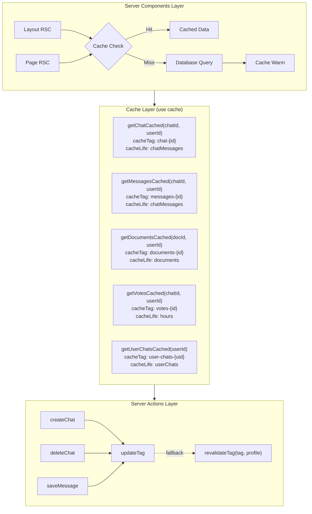
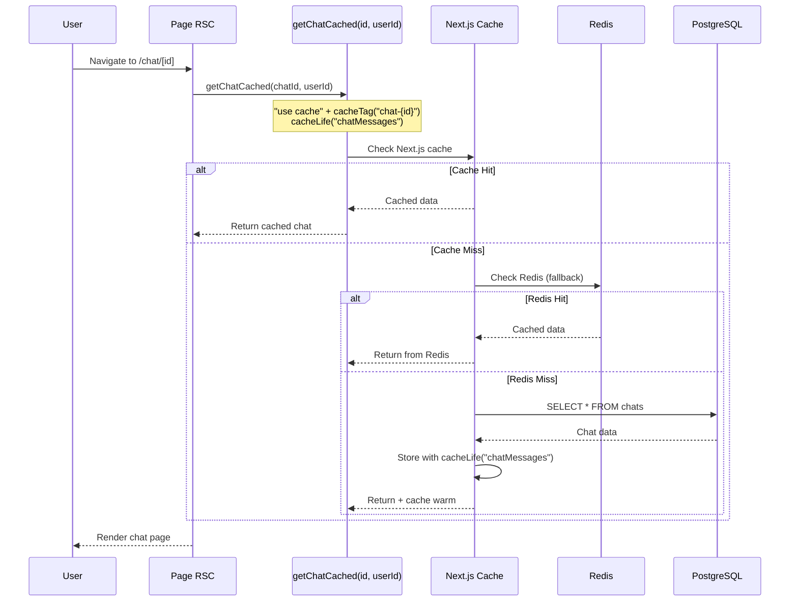
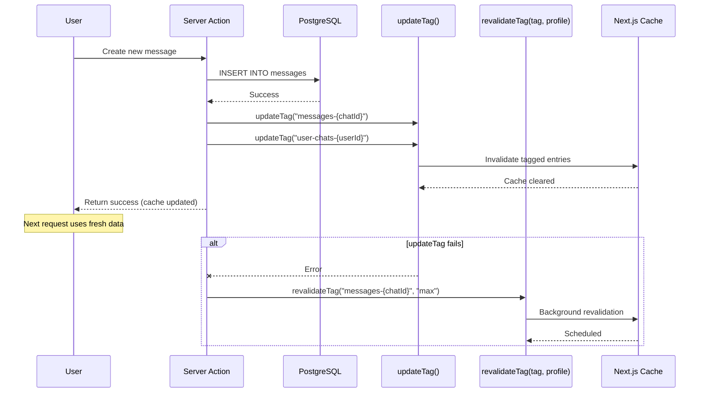
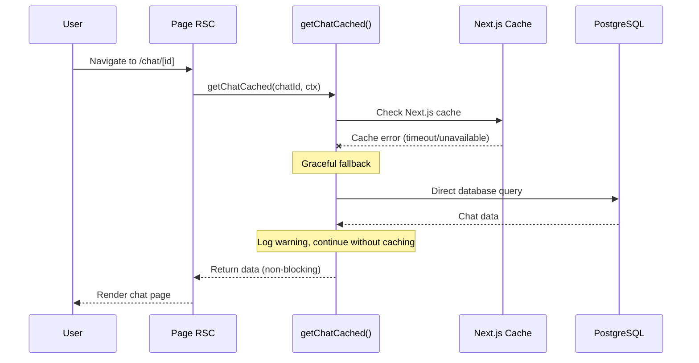
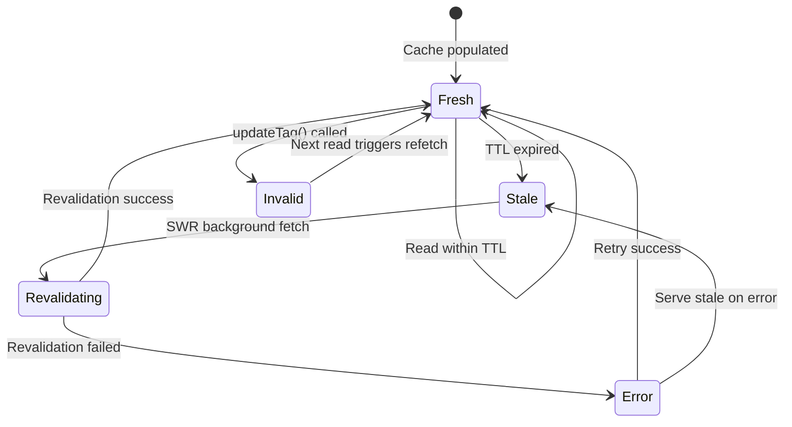
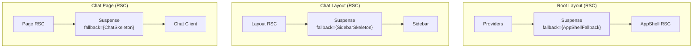
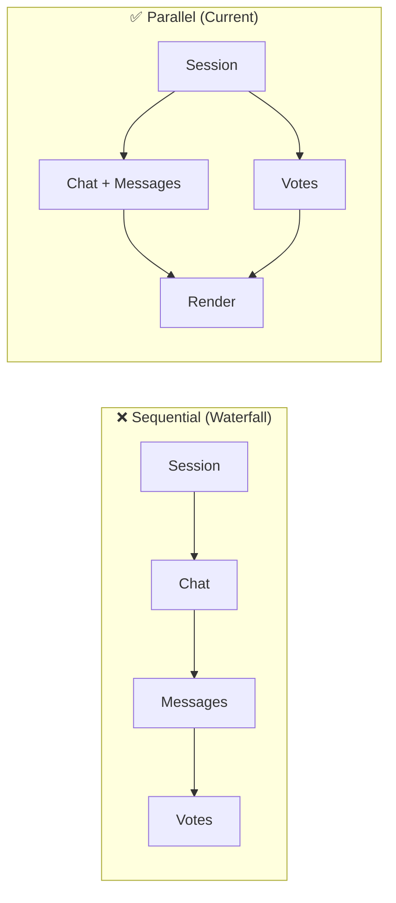

# Design: Next.js 16.1.0 Optimization

> **Phase**: 3/5 - Design  
> **Input**: [phase0-research-report.md](./phase0-research-report.md), [requirements.md](./requirements.md)  
> **Created**: December 24, 2025  
> **Revised**: December 24, 2025 (v2 - Informed Refinement)  
> **Status**: 🟢 Approved

---

## Changelog from v1

| Change          | Description                     | Rationale                                              |
| --------------- | ------------------------------- | ------------------------------------------------------ |
| **INVALIDATED** | ADR-003 (proxy migration)       | No `unstable_noStore` usage; middleware not deprecated |
| **ADDED**       | ADR-006 (cacheLife profiles)    | Custom profiles required per REQ-002                   |
| **ADDED**       | ADR-007 (function signatures)   | Serializable args required per REQ-005                 |
| **UPDATED**     | ADR-002 (invalidation strategy) | Added revalidateTag breaking change handling           |
| **UPDATED**     | ADR-001 (caching architecture)  | Added custom profile configuration details             |
| **UPDATED**     | Traceability matrix             | Aligned with requirements v2                           |

---

## Overview

This architecture blueprint defines the technical approach for migrating to Next.js 16.1.0 patterns, adopting `"use cache"` directives with `cacheLife`/`cacheTag`, and optimizing the caching layer. The design preserves existing functionality while enabling improved cache invalidation through `updateTag` and ensuring Core Web Vitals compliance.

### Design Principles

1. **Incremental Adoption**: Migrate one layer at a time with feature flags for rollback safety
2. **Cache-First Architecture**: Data functions use cache before DB, with explicit invalidation patterns
3. **Type-Safe Boundaries**: Server/client components separated with clear data contracts
4. **Fail-Fast Caching**: Cache failures fall through gracefully; never block on cache misses

---

## Architecture

### System Diagram



### Component Overview

| Component               | Responsibility                                   | File(s)                         | Covers REQs      |
| ----------------------- | ------------------------------------------------ | ------------------------------- | ---------------- |
| Cached Data Functions   | Cache-first data fetching with serializable args | `lib/data/cached/*.ts`          | REQ-001, REQ-005 |
| cacheLife Configuration | Custom profile definitions                       | `next.config.ts`                | REQ-002          |
| Cache Invalidation      | updateTag/revalidateTag orchestration            | `lib/cache-ops/invalidation.ts` | REQ-003, REQ-004 |
| Dynamic Metadata        | SEO metadata for chat routes                     | `app/(chat)/chat/[id]/page.tsx` | REQ-006          |
| Parallel Loader         | Optimized page data loading                      | `lib/data/parallel-loader.ts`   | REQ-007          |

---

## Sequence Diagrams

<!-- Cache-first data flow with "use cache" directive -->

### Happy Path: Cache Hit Flow (REQ-001, REQ-002, REQ-005)



### Cache Invalidation Flow (REQ-003, REQ-004)



### Error Path: Cache Failure Graceful Degradation



---

## State Diagram

<!-- Cache lifecycle states -->



| State        | Description                          | Transitions                         |
| ------------ | ------------------------------------ | ----------------------------------- |
| Fresh        | Cache valid, serving data            | → Stale (TTL), → Invalid (mutation) |
| Stale        | TTL expired, background revalidate   | → Revalidating                      |
| Invalid      | Explicitly invalidated via updateTag | → Fresh (next read)                 |
| Revalidating | Fetching new data in background      | → Fresh, → Error                    |
| Error        | Revalidation failed                  | → Stale (fallback), → Fresh (retry) |

---

## ADR-001: Caching Architecture with "use cache" Directive

**Status**: Proposed  
**Date**: 2025-12-24  
**Author**: Ouroboros Architect

### Context

The project uses `cacheComponents: true` in `next.config.ts` but hasn't adopted the `"use cache"` directive. Five cached data files exist in `lib/data/cached/` with manual Redis caching. Next.js 16.1.0 provides native `"use cache"` with `cacheLife`/`cacheTag` for automatic deduplication and invalidation.

### Decision

Adopt `"use cache"` directive in all `lib/data/cached/*.ts` files with explicit custom cache profiles (see ADR-006 for profile configuration):

```typescript
// lib/data/cached/chat.ts
import { cacheLife, cacheTag } from "next/cache";

export async function getChatCached(
  chatId: string,
  userId: string // Serializable arg per ADR-007
): Promise<Chat | null> {
  "use cache";
  cacheTag(`chat-${chatId}`);
  cacheLife("chatMessages"); // Custom profile (4h revalidate)

  // Existing cache-first logic preserved
  const cached = await getChatFromCache(chatId, userId);
  if (cached) return cachedChatToChat(cached);

  const chat = await getChat(chatId, userId);
  if (chat) createChatInCache(chatToCachedMeta(chat), false).catch(() => {});
  return chat;
}
```

### Cache Profile Mapping (Uses ADR-006 Custom Profiles)

| Data Type      | cacheLife Profile  | stale | revalidate | expire | Rationale                     |
| -------------- | ------------------ | ----- | ---------- | ------ | ----------------------------- |
| Chat metadata  | `chatMessages`     | 60s   | 4h         | 24h    | Rarely changes after creation |
| Messages       | `chatMessages`     | 60s   | 4h         | 24h    | Append-only, stable           |
| User chat list | `userChats`        | 60s   | 5m         | 2h     | New chats created frequently  |
| Documents      | `documents`        | 300s  | 4h         | 24h    | Version-controlled            |
| Votes          | `hours` (built-in) | 5m    | 1h         | 24h    | Low-frequency updates         |
| Suggestions    | `suggestions`      | 60s   | 5m         | 1h     | Context-dependent             |

### Consequences

#### Positive

- **POS-001**: Automatic request deduplication across components
- **POS-002**: Built-in cache invalidation via `updateTag()`
- **POS-003**: Profile-based TTL management (declarative)
- **POS-004**: Works with Turbopack and React Compiler
- **POS-005**: Custom profiles enable domain-specific cache durations

#### Negative

- **NEG-001**: Requires careful tag naming to avoid collisions
- **NEG-002**: Migration effort for 5 existing files
- **NEG-003**: Must configure custom profiles in next.config.ts (ADR-006)

### Alternatives Considered

| Alternative                                     | Rejected Because                                         |
| ----------------------------------------------- | -------------------------------------------------------- |
| Keep manual Redis caching                       | Doesn't leverage Next.js optimization; duplicates effort |
| Use SWR for all caching                         | Client-side only; doesn't work with Server Components    |
| Use route segment `export const revalidate`     | Too coarse-grained; per-route not per-function           |
| Use only built-in profiles (`hours`, `minutes`) | Insufficient granularity for domain-specific needs       |

---

## ADR-002: Cache Invalidation Strategy (updateTag vs revalidateTag)

**Status**: Proposed  
**Date**: 2025-12-24  
**Revised**: 2025-12-24 (v2 - Breaking Change Handling)  
**Author**: Ouroboros Architect

### Context

Next.js 16 provides two cache invalidation methods:

1. `updateTag(tag)` - Server Actions only, immediate "read-your-writes" semantics
2. `revalidateTag(tag, profile)` - **BREAKING CHANGE**: Now requires profile argument

Current codebase uses Redis-based cache invalidation via `lib/cache/invalidation.ts`. Any existing `revalidateTag(tag)` calls will produce deprecation warnings.

### Decision

**Primary Strategy**: Use `updateTag()` in Server Actions for immediate invalidation with "read-your-writes" semantics.

**Fallback Strategy**: Use `revalidateTag(tag, profile)` with explicit profile argument for:

- API routes (where `updateTag` is unavailable)
- Scheduled jobs/webhooks
- Error recovery when `updateTag` fails

```typescript
// Server Action pattern (PRIMARY)
"use server";
import { updateTag } from "next/cache";

export async function createMessageAction(chatId: string, content: string) {
  const message = await saveMessage(chatId, content);

  // Immediate invalidation for read-your-writes
  updateTag(`messages-${chatId}`);
  updateTag(`user-chats-${message.userId}`);

  return message;
}

// API Route / Fallback pattern
import { revalidateTag } from "next/cache";

export async function POST(request: Request) {
  // ... mutation logic

  // BREAKING CHANGE: profile argument required
  revalidateTag("messages-123", "max"); // Immediate for user data
  revalidateTag("public-stats", "hours"); // Gradual for shared data
}
```

### revalidateTag Migration (REQ-004 Breaking Change)

| Old Signature                 | New Signature                         | Profile Choice           |
| ----------------------------- | ------------------------------------- | ------------------------ |
| `revalidateTag("user-chats")` | `revalidateTag("user-chats", "max")`  | User-specific, immediate |
| `revalidateTag("chat-123")`   | `revalidateTag("chat-123", "max")`    | User-specific, immediate |
| `revalidateTag("documents")`  | `revalidateTag("documents", "hours")` | Shared data, gradual     |

### Profile Selection Guide

| Data Sensitivity        | Profile        | Behavior                                        |
| ----------------------- | -------------- | ----------------------------------------------- |
| User-specific mutations | `"max"`        | Immediate propagation, no stale serving         |
| Shared/public data      | `"hours"`      | Background revalidation, stale-while-revalidate |
| High-frequency data     | Custom profile | Use ADR-006 profiles for fine control           |

### Invalidation Tag Taxonomy

```
user-chats-{userId}     → User's chat list
chat-{chatId}           → Single chat metadata
messages-{chatId}       → Messages in a chat
documents-{documentId}  → Document content
votes-{chatId}          → Votes on a chat
suggestions-{userId}    → User suggestions
session-{userId}        → Session data
```

### Consequences

#### Positive

- **POS-001**: Immediate cache update in Server Actions (no stale reads)
- **POS-002**: Granular invalidation (only affected data)
- **POS-003**: Type-safe tag generation with template literals

#### Negative

- **NEG-001**: Must call `updateTag` after every mutation
- **NEG-002**: Tag naming discipline required across team

---

## ADR-003: Proxy Migration Strategy ~~(middleware.ts → proxy.ts)~~

**Status**: ❌ INVALIDATED  
**Date**: 2025-12-24  
**Invalidated**: 2025-12-24  
**Author**: Ouroboros Architect

### Invalidation Reason

Research iteration 2 (phase0-iteration2-research.md) confirmed:

1. **No `unstable_noStore` usage**: Codebase search returned zero matches
2. **middleware.ts not deprecated**: The middleware API remains stable in Next.js 16
3. **proxy.ts migration unnecessary**: No breaking changes requiring migration

### Original Context (Preserved for Reference)

~~`middleware.ts` is deprecated in Next.js 16. Current middleware (334 lines) handles rate limiting, security headers, guest session creation.~~

### Decision

**NO ACTION REQUIRED** - Keep existing `middleware.ts` as-is.

### Impact on Other ADRs

- ADR-001: Unaffected (caching)
- ADR-002: Unaffected (invalidation)
- ADR-004: Unaffected (component boundaries)
- ADR-005: Unaffected (metadata)

---

## ADR-006: cacheLife Profile Configuration (NEW)

**Status**: Proposed  
**Date**: 2025-12-24  
**Author**: Ouroboros Architect  
**Covers**: REQ-002

### Context

Built-in cacheLife profiles (`hours`, `minutes`, `days`, `weeks`, `max`) provide generic durations. Domain-specific data types in this application require custom TTL configurations:

- **Chat messages**: Rarely change after creation → longer cache
- **User chat list**: New chats created frequently → shorter cache
- **Documents**: Version-controlled, stable → longer cache
- **Suggestions**: Context-dependent, changes often → shorter cache

### Decision

Define 4 custom cacheLife profiles in `next.config.ts`:

```typescript
// next.config.ts
const nextConfig: NextConfig = {
  experimental: {
    cacheLife: {
      // Profile: chatMessages - for chat metadata and messages
      chatMessages: {
        stale: 60, // Serve stale for 60s while revalidating
        revalidate: 14400, // Revalidate every 4 hours
        expire: 86400, // Hard expire after 24 hours
      },

      // Profile: userChats - for user's chat list
      userChats: {
        stale: 60, // Serve stale for 60s
        revalidate: 300, // Revalidate every 5 minutes
        expire: 7200, // Hard expire after 2 hours
      },

      // Profile: documents - for document content/versions
      documents: {
        stale: 300, // Serve stale for 5 minutes
        revalidate: 14400, // Revalidate every 4 hours
        expire: 86400, // Hard expire after 24 hours
      },

      // Profile: suggestions - for AI suggestions
      suggestions: {
        stale: 60, // Serve stale for 60s
        revalidate: 300, // Revalidate every 5 minutes
        expire: 3600, // Hard expire after 1 hour
      },
    },
  },
};
```

### Profile-to-Function Mapping

| Profile            | Functions Using It                                                    | Rationale               |
| ------------------ | --------------------------------------------------------------------- | ----------------------- |
| `chatMessages`     | `getChatCached`, `getMessagesCached`, `getChatWithMessagesCached`     | Stable after creation   |
| `userChats`        | `getUserChatsCached`                                                  | Frequently updated list |
| `documents`        | `getDocumentCached`, `getLatestVersionCached`, `getAllVersionsCached` | Version-controlled      |
| `suggestions`      | `getSuggestionsCached`                                                | Context-sensitive       |
| `hours` (built-in) | `getVoteCached`, `getVotesByChatIdCached`                             | Low update frequency    |

### Consequences

#### Positive

- **POS-001**: Domain-specific cache durations optimize freshness vs performance
- **POS-002**: Declarative configuration, easy to tune
- **POS-003**: Consistent behavior across all cached functions
- **POS-004**: Centralized configuration in next.config.ts

#### Negative

- **NEG-001**: Must update next.config.ts before deploying cached functions
- **NEG-002**: Profile names must be coordinated across team

### Alternatives Considered

| Alternative                      | Rejected Because                                   |
| -------------------------------- | -------------------------------------------------- |
| Use only built-in profiles       | Insufficient granularity (e.g., "hours" too broad) |
| Per-function hardcoded durations | Not maintainable, scattered configuration          |
| Environment variable durations   | Complex, harder to reason about                    |

---

## ADR-007: Function Signature Patterns for Caching (NEW)

**Status**: Proposed  
**Date**: 2025-12-24  
**Author**: Ouroboros Architect  
**Covers**: REQ-005

### Context

Current cached functions use `DataContext` object as parameter:

```typescript
// Current signature (problematic)
export async function getChatCached(chatId: string, ctx: DataContext);
```

The `"use cache"` directive requires all function arguments to be **serializable** for cache key generation. `DataContext` contains:

- `userId: string` ✅ Serializable
- `userType: "user" | "guest"` ✅ Serializable
- Additional methods/properties ❌ May not serialize

### Decision

Refactor all cached read functions to accept **primitive serializable arguments**:

```typescript
// NEW signature pattern - all args serializable
export async function getChatCached(
  chatId: string,
  userId: string
): Promise<Chat | null> {
  "use cache";
  cacheTag(`chat-${chatId}`);
  cacheLife("chatMessages");

  // Implementation using primitive args
}

// For functions needing userType
export async function getUserChatsCached(
  userId: string,
  userType: "user" | "guest" = "user"
): Promise<Chat[]> {
  "use cache";
  cacheTag(`user-chats-${userId}`);
  cacheLife("userChats");

  // Implementation
}
```

### Signature Changes

| Function                    | Before                     | After                         |
| --------------------------- | -------------------------- | ----------------------------- |
| `getChatCached`             | `(chatId, ctx)`            | `(chatId, userId)`            |
| `getUserChatsCached`        | `(ctx)`                    | `(userId, userType?)`         |
| `getChatWithMessagesCached` | `(chatId, ctx)`            | `(chatId, userId)`            |
| `getMessagesCached`         | `(chatId, ctx)`            | `(chatId, userId)`            |
| `getDocumentCached`         | `(docId, ctx)`             | `(docId, userId)`             |
| `getLatestVersionCached`    | `(docId, ctx)`             | `(docId, userId)`             |
| `getAllVersionsCached`      | `(docId, ctx)`             | `(docId, userId)`             |
| `getSuggestionsCached`      | `(ctx)`                    | `(userId)`                    |
| `getVoteCached`             | `(chatId, messageId, ctx)` | `(chatId, messageId, userId)` |
| `getVotesByChatIdCached`    | `(chatId, ctx)`            | `(chatId, userId)`            |

### Call Site Migration

```typescript
// BEFORE - using ctx object
const ctx = createContext(session.user.id, session.user.type);
const chat = await getChatCached(chatId, ctx);

// AFTER - using primitive args
const chat = await getChatCached(chatId, session.user.id);
```

### Consequences

#### Positive

- **POS-001**: Cache keys correctly generated from serializable args
- **POS-002**: Simpler function interfaces
- **POS-003**: Better TypeScript inference for cache behavior
- **POS-004**: Enables proper Next.js cache deduplication

#### Negative

- **NEG-001**: Breaking change - all call sites must be updated
- **NEG-002**: Some context information may need to be passed separately
- **NEG-003**: Tests must be updated for new signatures

### Backward Compatibility Strategy

Option A (Recommended): **Direct migration**

- Update all call sites in single PR
- Use TypeScript compiler to find all usages

Option B: **Wrapper functions** (if gradual rollout needed)

```typescript
// Temporary wrapper for gradual migration
export async function getChatCachedCompat(
  chatId: string,
  ctx: DataContext
): Promise<Chat | null> {
  return getChatCached(chatId, ctx.userId);
}
```

---

## ADR-004: Component Boundary Optimization

**Status**: Proposed  
**Date**: 2025-12-24  
**Author**: Ouroboros Architect

### Context

Current architecture uses Server Components effectively but Suspense boundaries need optimization for Core Web Vitals (LCP < 2.5s, CLS < 0.1).

### Decision

#### Server Component Classification

```
┌─────────────────────────────────────────────────────────────────┐
│ SERVER COMPONENTS (RSC) - No "use client"                       │
├─────────────────────────────────────────────────────────────────┤
│ app/layout.tsx              → Root layout, providers            │
│ app/(chat)/layout.tsx       → Chat layout, sidebar state        │
│ app/(chat)/page.tsx         → New chat page                     │
│ app/(chat)/chat/[id]/page.tsx → Existing chat (NEEDS METADATA) │
│ lib/data/cached/*.ts        → All data functions                │
│ lib/data/parallel-loader.ts → Parallel data loading             │
└─────────────────────────────────────────────────────────────────┘

┌─────────────────────────────────────────────────────────────────┐
│ CLIENT COMPONENTS - "use client"                                │
├─────────────────────────────────────────────────────────────────┤
│ chat-layout-client.tsx      → Sidebar toggle, keyboard nav      │
│ features/chat/Chat.tsx      → Chat UI, message input            │
│ features/sidebar/Sidebar.tsx → Chat history, navigation         │
│ lib/cache/use-invalidation.ts → Client-side cache sync          │
└─────────────────────────────────────────────────────────────────┘
```

#### Suspense Boundary Strategy



### Suspense Fallback Components

| Boundary    | Fallback Component | Purpose                         |
| ----------- | ------------------ | ------------------------------- |
| Root layout | `AppShellFallback` | Minimal shell during auth check |
| Chat layout | `SidebarSkeleton`  | Sidebar placeholder             |
| Chat page   | `loading.tsx`      | Chat UI skeleton                |

### Consequences

#### Positive

- **POS-001**: Progressive rendering improves LCP
- **POS-002**: Skeleton fallbacks prevent CLS
- **POS-003**: Server Components reduce client JS bundle

#### Negative

- **NEG-001**: Must maintain skeleton components for each boundary

---

## ADR-005: generateMetadata for Dynamic Routes

**Status**: Proposed  
**Date**: 2025-12-24  
**Author**: Ouroboros Architect

### Context

`app/(chat)/chat/[id]/page.tsx` lacks `generateMetadata`, causing suboptimal SEO and social sharing. Chat titles should appear in page metadata.

### Decision

Add `generateMetadata` to dynamic chat route:

```typescript
// app/(chat)/chat/[id]/page.tsx
import type { Metadata } from "next";
import { getChatCached } from "@/lib/data/cached";
import { getSessionCached } from "@/lib/auth";

export async function generateMetadata({
  params,
}: {
  params: Promise<{ id: string }>;
}): Promise<Metadata> {
  const { id } = await params;
  const session = await getSessionCached();

  if (!session?.user) {
    return { title: "Chat" };
  }

  const ctx = createContext(session.user.id, session.user.type);
  const chat = await getChatCached(id, ctx);

  if (!chat) {
    return { title: "Chat Not Found" };
  }

  return {
    title: chat.title || "Chat",
    description: `Chat conversation: ${chat.title}`,
    openGraph: {
      title: chat.title || "Chat",
      type: "article",
    },
  };
}
```

### Consequences

#### Positive

- **POS-001**: Proper page titles in browser tab
- **POS-002**: Social sharing shows chat title
- **POS-003**: SEO improvement for public chats

#### Negative

- **NEG-001**: Additional data fetch in metadata generation (mitigated by cache hit)

---

## Data Fetching Architecture

### Parallel vs Sequential Loading



### Current Implementation (lib/data/parallel-loader.ts)

```typescript
export async function loadChatPageData(chatId: string): Promise<ChatPageData> {
  // Step 1: Session (required for userId)
  const session = await getSessionCached();

  if (!session?.user) {
    return { session: null, ctx: null, chatWithMessages: null, votes: [] };
  }

  const ctx = createContext(session.user.id, session.user.type);

  // Step 2: Parallel loading (Promise.allSettled for resilience)
  const [chatResult, votesResult] = await Promise.allSettled([
    getChatWithMessagesCached(chatId, ctx),
    getVotesByChatIdCached(chatId, ctx),
  ]);

  return {
    session,
    ctx,
    chatWithMessages:
      chatResult.status === "fulfilled" ? chatResult.value : null,
    votes: votesResult.status === "fulfilled" ? votesResult.value : [],
  };
}
```

### Server Actions vs Route Handlers

| Use Case          | Approach      | Rationale                                     |
| ----------------- | ------------- | --------------------------------------------- |
| Form submissions  | Server Action | Progressive enhancement, `updateTag()` access |
| Data mutations    | Server Action | Immediate cache invalidation                  |
| File uploads      | Route Handler | Streaming, larger payloads                    |
| External webhooks | Route Handler | No UI trigger needed                          |
| Polling/SSE       | Route Handler | Long-lived connections                        |

---

## Risk Assessment

### High Risk

| Risk                           | Impact                    | Likelihood | Mitigation                                   |
| ------------------------------ | ------------------------- | ---------- | -------------------------------------------- |
| Cache tag collision            | Data served to wrong user | Low        | Namespace all tags: `{entity}-{id}-{userId}` |
| Migration breaks rate limiting | Security vulnerability    | Medium     | Feature flag, canary deployment              |
| Cache invalidation missed      | Stale data displayed      | Medium     | Audit all mutation points, add logging       |

### Medium Risk

| Risk                          | Impact                 | Likelihood | Mitigation                                              |
| ----------------------------- | ---------------------- | ---------- | ------------------------------------------------------- |
| cacheLife profile too long    | Stale data             | Medium     | Start conservative (minutes), increase based on metrics |
| generateMetadata slows TTFB   | Performance regression | Low        | Cache hit should make it fast; monitor                  |
| Suspense boundaries cause CLS | Core Web Vitals fail   | Low        | Fixed-size skeleton components                          |

### Low Risk

| Risk                                | Impact             | Likelihood | Mitigation                        |
| ----------------------------------- | ------------------ | ---------- | --------------------------------- |
| Team unfamiliar with new APIs       | Slower development | Low        | Document patterns, code review    |
| Third-party cache (Redis) conflicts | Duplicate caching  | Low        | Clearly separate concerns in code |

---

## Performance Targets (REQ-007)

| Metric | Target  | Current       | Strategy                        |
| ------ | ------- | ------------- | ------------------------------- |
| LCP    | < 2.5s  | TBD (measure) | Cache-first, Suspense streaming |
| CLS    | < 0.1   | TBD (measure) | Fixed skeleton sizes            |
| FCP    | < 1.8s  | TBD (measure) | Edge session, SSR               |
| TTFB   | < 800ms | TBD (measure) | Cache Components, CDN           |

### Measurement Plan

1. **Baseline**: Run Lighthouse before changes
2. **Per-ADR**: Measure after each ADR implementation
3. **Production**: Set up Core Web Vitals monitoring (Vercel Analytics)

---

## Files Summary

### Files to CREATE

| File                | Component  | Purpose                    | Est. Lines |
| ------------------- | ---------- | -------------------------- | ---------- |
| `lib/cache/tags.ts` | Cache Tags | Centralized tag generation | ~50        |

### Files to MODIFY

| File                               | Changes                                    | Risk      | Backup Plan   |
| ---------------------------------- | ------------------------------------------ | --------- | ------------- |
| `next.config.ts`                   | Add cacheLife profiles (ADR-006)           | 🟢 Low    | Revert commit |
| `lib/data/cached/chat.ts`          | Add "use cache" + refactor signature       | 🟡 Medium | Revert commit |
| `lib/data/cached/messages.ts`      | Add "use cache" + refactor signature       | 🟡 Medium | Revert commit |
| `lib/data/cached/documents.ts`     | Add "use cache" + refactor signature       | 🟡 Medium | Revert commit |
| `lib/data/cached/votes.ts`         | Add "use cache" + refactor signature       | 🟡 Medium | Revert commit |
| `lib/data/cached/suggestions.ts`   | Add "use cache" + refactor signature       | 🟡 Medium | Revert commit |
| `app/(chat)/chat/[id]/page.tsx`    | Add generateMetadata                       | 🟡 Medium | Revert commit |
| Server Actions (multiple)          | Add updateTag calls, migrate revalidateTag | 🟡 Medium | Revert commit |
| All call sites of cached functions | Update to new signatures (ADR-007)         | 🔴 High   | Feature flag  |

### Files NOT Modified (ADR-003 Invalidated)

| File            | Original Plan       | Status              |
| --------------- | ------------------- | ------------------- |
| `middleware.ts` | Migrate to proxy.ts | ❌ NO CHANGE NEEDED |
| `proxy.ts`      | Create new          | ❌ NOT CREATING     |

---

## Requirements Traceability

| REQ ID            | Requirement                      | ADR              | Component               | Implementation        | Test Strategy      |
| ----------------- | -------------------------------- | ---------------- | ----------------------- | --------------------- | ------------------ |
| REQ-001           | Adopt "use cache" directive      | ADR-001          | Cached Data Functions   | Add directive + tags  | Unit + Performance |
| REQ-002           | Configure cacheLife profiles     | **ADR-006**      | next.config.ts          | Custom profile config | Build Verification |
| REQ-003           | Implement updateTag invalidation | ADR-002          | Server Actions          | Add updateTag calls   | Integration        |
| REQ-004           | Update revalidateTag signature   | **ADR-002** (v2) | All revalidateTag calls | Add profile argument  | Static Analysis    |
| REQ-005           | Refactor function signatures     | **ADR-007**      | Cached Data Functions   | Pass userId as arg    | TypeScript + Unit  |
| REQ-006           | Add generateMetadata             | ADR-005          | Chat Page               | Export async metadata | E2E + SEO audit    |
| REQ-007           | Core Web Vitals targets          | ADR-004          | All components          | Suspense boundaries   | Lighthouse CI      |
| REQ-008           | Data fetch performance           | ADR-001, ADR-006 | Parallel Loader         | Cache profiles        | Performance        |
| REQ-009           | Backward compatibility           | All ADRs         | All components          | Call site updates     | Regression         |
| REQ-010           | Incremental rollout              | ADR-007          | Feature flags           | Wrapper functions     | Staging test       |
| ~~REQ-001 (old)~~ | ~~Migrate proxy.ts~~             | ~~ADR-003~~      | ~~N/A~~                 | **REMOVED**           | N/A                |

### ADR Summary

| ADR         | Title                                 | Status         | Covers REQs               |
| ----------- | ------------------------------------- | -------------- | ------------------------- |
| ADR-001     | Caching Architecture with "use cache" | Proposed       | REQ-001, REQ-008          |
| ADR-002     | Cache Invalidation Strategy (v2)      | Proposed       | REQ-003, REQ-004          |
| ADR-003     | ~~Proxy Migration~~                   | ❌ INVALIDATED | N/A                       |
| ADR-004     | Component Boundary Optimization       | Proposed       | REQ-007                   |
| ADR-005     | generateMetadata for Dynamic Routes   | Proposed       | REQ-006                   |
| **ADR-006** | cacheLife Profile Configuration       | **NEW**        | REQ-002                   |
| **ADR-007** | Function Signature Patterns           | **NEW**        | REQ-005, REQ-009, REQ-010 |

---

## Quality Self-Check

Before marking complete, verify:

- [x] All REQ-XXX are mapped to ADRs in traceability matrix
- [x] Sequence diagrams show happy path AND error path
- [x] State diagram included (cache lifecycle)
- [x] API contract defined (cache tags, profiles)
- [x] Security considerations documented (tag namespacing)
- [x] At least 2 alternatives were considered for major decisions
- [x] Trade-offs are documented (both pros and cons)
- [x] Mermaid diagrams render correctly
- [x] File paths are specific (not generic)
- [x] Error handling is defined (graceful fallback)
- [x] ADR-003 marked as INVALIDATED with explanation
- [x] ADR-006 (cacheLife profiles) created with full format
- [x] ADR-007 (function signatures) created with full format
- [x] ADR-002 updated for revalidateTag breaking change
- [x] System diagram updated (removed proxy layer, added profile info)

---

## → Next Phase

**Output**: This design.md (v2 - Informed Refinement)  
**Next**: tasks.md (Phase 4)  
**Handoff**: Ready for `ouroboros-tasks` agent

### Changes Summary for Tasks Phase

| Change Type | Details                     | Task Impact                                   |
| ----------- | --------------------------- | --------------------------------------------- |
| **REMOVED** | ADR-003 proxy migration     | Remove proxy migration tasks                  |
| **ADDED**   | ADR-006 cacheLife config    | Add next.config.ts modification task          |
| **ADDED**   | ADR-007 function signatures | Add signature refactoring tasks (high effort) |
| **UPDATED** | ADR-002 revalidateTag       | Add revalidateTag migration subtasks          |
| **UPDATED** | System diagram              | No task impact                                |
| **UPDATED** | Traceability matrix         | No task impact                                |
