# Requirements: Next.js 16.1.0 Optimization

> **Phase**: 2/5 - Requirements  
> **Input**: [phase0-research-report.md](./phase0-research-report.md), [phase0-iteration2-research.md](./phase0-iteration2-research.md), [phase0-iteration3-comprehensive.md](./phase0-iteration3-comprehensive.md)  
> **Created**: December 24, 2025  
> **Revised**: December 24, 2025 (v4 - Exhaustive Deep Dive)  
> **Status**: 🟢 Approved

---

## Changelog from v3 → v4

| Change      | Description                                        | Rationale                                               |
| ----------- | -------------------------------------------------- | ------------------------------------------------------- |
| **ADDED**   | REQ-019 (AuthProvider Context Split)               | Performance: Reduce unnecessary re-renders from auth    |
| **ADDED**   | REQ-020 (SidebarProvider Consolidation)            | DX: Duplicate implementations causing confusion         |
| **ADDED**   | REQ-021 (Auth Route loading.tsx)                   | UX: Missing loading states for login/register           |
| **ADDED**   | REQ-022 (Auth Route error.tsx)                     | UX: Missing error handling for login/register           |
| **ADDED**   | REQ-023 (Loading State Accessibility)              | A11y: Missing ARIA attributes in chat/[id]/loading.tsx  |
| **ADDED**   | REQ-024 (Auth Flow AbortController)                | Race: Login/register flows need cancellation support    |
| **ADDED**   | REQ-025 (BroadcastChannel Session Sync) 🔴         | HIGH: Multi-tab session sync (extends REQ-011)          |
| **ADDED**   | REQ-026 (Auth Error Boundaries)                    | Error: Missing boundaries for auth route error recovery |
| **ADDED**   | REQ-027 (Offline Detection in Loading States)     | UX: Offline state detection for better feedback         |
| **UPDATED** | Edge Cases                                         | Added EC-015 through EC-021 for new scenarios           |
| **UPDATED** | Priority Matrix                                    | Added 9 new requirements to priority assessment         |
| **UPDATED** | Wave allocation                                    | Expanded waves for new requirements                     |

---

## Changelog from v2 → v3

| Change      | Description                                  | Rationale                                                |
| ----------- | -------------------------------------------- | -------------------------------------------------------- |
| **ADDED**   | REQ-011 (Multi-Tab Session Sync)             | HIGH risk: Guest session race condition across tabs      |
| **ADDED**   | REQ-012 (Fail-Closed Rate Limiting)          | HIGH risk: Security bypass when Redis unavailable        |
| **ADDED**   | REQ-013 (Invalidation Fallback Strategy)     | MEDIUM risk: `updateTag()` only works in Server Actions  |
| **ADDED**   | REQ-014 (Cache Tag Naming Convention)        | DX: Prevent tag collisions, enable consistent patterns   |
| **ADDED**   | REQ-015 (Cache Pattern Documentation)        | DX: Internal docs for `updateTag` vs `revalidateTag`     |
| **ADDED**   | REQ-016 (Loading State Consistency)          | UX: Consistent loading behavior across cache scenarios   |
| **ADDED**   | REQ-017 (Redis Failure Graceful Degradation) | Ops: Controlled fallback when Redis is unavailable       |
| **ADDED**   | REQ-018 (Cache Invalidation Audit Log)       | Security: Track cache invalidation for security review   |
| **UPDATED** | REQ-009 (Backward Compatibility)             | Added multi-tab and rate limit regression tests          |
| **UPDATED** | Edge Cases                                   | Added EC-011 through EC-014 for new scenarios            |
| **UPDATED** | Priority Matrix                              | Risk-adjusted priorities based on 8-perspective analysis |

### Previous Changes (v1 → v2)

| Change         | Description                           | Rationale                                                      |
| -------------- | ------------------------------------- | -------------------------------------------------------------- |
| **REMOVED**    | Old REQ-001 (Migrate proxy.ts)        | ADR-003 revised: No `unstable_noStore` usage in codebase       |
| **ELEVATED**   | REQ-004 (revalidateTag, P2 → P1)      | Breaking change: `revalidateTag` now requires profile argument |
| **EXPANDED**   | REQ-002 (cacheLife profiles)          | Added 4 custom profile configurations                          |
| **ADDED**      | REQ-002 (cacheLife Configuration)     | Custom profiles in next.config.ts required                     |
| **ADDED**      | REQ-005 (Function Signature Refactor) | userId must be argument, not context property                  |
| **RENUMBERED** | All requirements                      | Sequential REQ-001 through REQ-010 after proxy removal         |

---

## Introduction

This document defines EARS-format requirements for optimizing the Next.js AI Chatbot application to leverage Next.js 16.1.0 and React 19 features. The optimization addresses deprecated API migrations, new caching patterns, and performance improvements identified in Phase 0 research.

**Core Goals:**

1. Adopt `"use cache"` directive with `cacheLife`/`cacheTag` for optimal data caching
2. Configure custom cacheLife profiles for domain-specific TTLs
3. Update `revalidateTag` calls to use new profile-based signature (breaking change)
4. Refactor cached functions to accept userId as serializable parameter
5. Add `generateMetadata` to dynamic routes for improved SEO

---

## Glossary

| Term            | Definition                                                                                  |
| --------------- | ------------------------------------------------------------------------------------------- |
| EARS            | Easy Approach to Requirements Syntax - structured requirement format                        |
| `"use cache"`   | Next.js 16 directive that marks functions/components for caching                            |
| `cacheLife`     | Next.js 16 API specifying cache duration profiles (`max`, `hours`, `days`, `weeks`, custom) |
| `cacheTag`      | Next.js 16 API for tagging cached data for targeted invalidation                            |
| `revalidateTag` | Cache invalidation API (**breaking change**: now requires profile argument in Next.js 16)   |
| `updateTag`     | New Next.js 16 Server Actions API for immediate cache updates                               |
| Core Web Vitals | Google's metrics: LCP (< 2.5s), FID (< 100ms), CLS (< 0.1)                                  |
| FCP             | First Contentful Paint - time until first content is visible                                |
| TTFB            | Time To First Byte - server response time                                                   |
| DataContext     | Current function parameter pattern (contains userId + userType)                             |
| Serializable    | Data types that can be converted to/from JSON for cache keys                                |

---

## Functional Requirements

<!--
  EARS Notation Reference:
  - WHEN [trigger], THE System SHALL [behavior]
  - WHILE [state], THE System SHALL [ongoing behavior]
  - IF [condition], THEN THE System SHALL [response]
  - WHERE [condition applies]
-->

---

### Category: Caching Requirements

---

### REQ-001: Adopt "use cache" Directive for Data Functions (Priority: P1) 🎯

**Category**: Caching  
**User Story**: As a user, I want chat data to load faster through optimized caching, so that I experience minimal latency when accessing conversations.

**Why P1**: Major performance improvement opportunity. Research shows `cacheComponents: true` is enabled but `"use cache"` directive not adopted.

**Depends On**: REQ-002 (cacheLife Configuration)

**Independent Test**: Data functions return cached results within 10ms on cache hit; cache miss falls back to database with result cached for subsequent requests.

**Verified By**: Unit Test | Performance Test | Integration Test

**Acceptance Criteria** (EARS notation):

1. WHEN `getChatCached()` is called, THE System SHALL use `"use cache"` directive with `cacheTag("chat-{chatId}")`
2. WHEN `getMessagesCached()` is called, THE System SHALL use `"use cache"` directive with `cacheTag("messages-{chatId}")`
3. WHEN `getUserChatsCached()` is called, THE System SHALL use `"use cache"` directive with `cacheTag("user-chats-{userId}")`
4. WHILE cache is valid, THE System SHALL serve cached data without database queries
5. IF database query fails after cache miss, THEN THE System SHALL return graceful error with cached stale data if available

**Target Files**:

- `lib/data/cached/chat.ts` (268 lines)
- `lib/data/cached/messages.ts`
- `lib/data/cached/documents.ts`
- `lib/data/cached/votes.ts`
- `lib/data/cached/suggestions.ts`

---

### REQ-002: Configure Custom cacheLife Profiles (Priority: P1) 🎯

**Category**: Caching  
**User Story**: As a system administrator, I want cache durations to be explicitly defined with domain-specific profiles, so that data freshness is optimized per data type.

**Why P1**: Required foundation for REQ-001; prevents unbounded caching and ensures appropriate freshness per data domain.

**Depends On**: None

**Independent Test**: Custom profiles are recognized by Next.js; cached data expires after specified profile duration.

**Verified By**: Unit Test | Build Verification | Cache Inspection

**Acceptance Criteria** (EARS notation):

1. WHEN next.config.ts is loaded, THE System SHALL define `chatMessages` profile (stale: 60s, revalidate: 4h, expire: 24h)
2. WHEN next.config.ts is loaded, THE System SHALL define `userChats` profile (stale: 60s, revalidate: 5m, expire: 2h)
3. WHEN next.config.ts is loaded, THE System SHALL define `documents` profile (stale: 300s, revalidate: 4h, expire: 24h)
4. WHEN next.config.ts is loaded, THE System SHALL define `suggestions` profile (stale: 60s, revalidate: 5m, expire: 1h)
5. WHERE built-in profile suffices, THE System SHALL use `hours` or `minutes` instead of custom

**Custom Profile Configuration** (next.config.ts):

```typescript
cacheLife: {
  chatMessages: { stale: 60, revalidate: 14400, expire: 86400 },  // 4h revalidate
  userChats: { stale: 60, revalidate: 300, expire: 7200 },        // 5m revalidate
  documents: { stale: 300, revalidate: 14400, expire: 86400 },    // 4h revalidate
  suggestions: { stale: 60, revalidate: 300, expire: 3600 },      // 5m revalidate
}
```

**Profile Mapping**:
| Data Type | Profile | stale | revalidate | expire | Rationale |
|-----------|---------|-------|------------|--------|-----------|
| Chat messages | `chatMessages` | 60s | 4h | 24h | Rarely change after creation |
| User chat list | `userChats` | 60s | 5m | 2h | New chats created frequently |
| Documents | `documents` | 300s | 4h | 24h | Version-controlled, stable |
| Votes | `hours` (built-in) | 5m | 1h | 24h | Low-frequency updates |
| Suggestions | `suggestions` | 60s | 5m | 1h | Context-dependent, changes often |

---

### REQ-003: Implement Cache Invalidation with updateTag (Priority: P1)

**Category**: Caching  
**User Story**: As a user, I want my actions (sending messages, creating chats) to immediately reflect in the UI, so that I have confidence my changes are saved.

**Why P1**: Without proper invalidation, users will see stale data after mutations.

**Depends On**: REQ-001, REQ-002

**Independent Test**: After mutation, subsequent reads return updated data within 100ms.

**Verified By**: Integration Test | E2E Test

**Acceptance Criteria** (EARS notation):

1. WHEN a new message is appended, THE System SHALL call `updateTag("messages-{chatId}")` for immediate cache update
2. WHEN a chat is created, THE System SHALL call `updateTag("user-chats-{userId}")`
3. WHEN a chat is deleted, THE System SHALL call `updateTag("chat-{chatId}")` AND `updateTag("user-chats-{userId}")`
4. WHEN chat visibility changes, THE System SHALL call `updateTag("chat-{chatId}")`
5. IF updateTag fails, THEN THE System SHALL fall back to `revalidateTag(tag, "max")` with profile

**Target Files**:

- `features/chat/actions/message.ts`
- `features/chat/actions/visibility.ts`
- All Server Action files with mutations

---

### REQ-004: Update revalidateTag Signature (Priority: P1) 🎯 **BREAKING CHANGE**

**Category**: Migration  
**User Story**: As a developer, I want all `revalidateTag` calls updated to the new signature, so that cache invalidation behavior is predictable and compliant with Next.js 16.

**Why P1 (elevated from P2)**: **BREAKING CHANGE** - `revalidateTag(tag)` without profile argument is deprecated and will cause runtime warnings. This blocks production deployment.

**Depends On**: REQ-002

**Independent Test**: All `revalidateTag` calls include profile argument; no deprecated usage warnings in build or runtime.

**Verified By**: Static Analysis | Build Verification | Runtime Log Analysis

**Acceptance Criteria** (EARS notation):

1. WHEN `revalidateTag` is called in Server Actions, THE System SHALL include profile argument (`"max"`, `"hours"`, `"days"`)
2. WHEN invalidating user-specific data, THE System SHALL use `revalidateTag(tag, "max")` for immediate propagation
3. WHEN invalidating shared/public data, THE System SHALL use `revalidateTag(tag, "hours")` for gradual propagation
4. WHERE legacy single-argument calls exist, THE System SHALL migrate to two-argument format
5. WHEN build completes, THE System SHALL produce zero deprecation warnings for revalidateTag

**Migration Pattern**:

```typescript
// ❌ Before (deprecated - will warn)
revalidateTag("user-chats");

// ✅ After (compliant)
revalidateTag("user-chats", "max");
```

**Current Usages to Migrate** (verify via grep):

- `features/chat/actions/visibility.ts` - Any `revalidatePath`/`revalidateTag`
- `features/chat/actions/message.ts` - Any `revalidatePath`/`revalidateTag`

---

### REQ-005: Refactor Cached Functions for Serializable Arguments (Priority: P1) 🎯

**Category**: Caching  
**User Story**: As a developer, I want cached functions to accept userId as a direct parameter, so that cache keys are correctly generated and user-specific caching works.

**Why P1**: `"use cache"` requires all arguments to be serializable. Current `DataContext` objects contain non-serializable fields, which will cause cache failures.

**Depends On**: None (can be done in parallel with REQ-002)

**Independent Test**: All cached read functions accept `userId: string` as parameter; cache keys include userId.

**Verified By**: TypeScript Compilation | Unit Test | Integration Test

**Acceptance Criteria** (EARS notation):

1. WHEN `getChatCached()` is called, THE System SHALL accept `(chatId: string, userId: string)` instead of `(chatId: string, ctx: DataContext)`
2. WHEN `getUserChatsCached()` is called, THE System SHALL accept `(userId: string)` instead of `(ctx: DataContext)`
3. WHEN `getMessagesCached()` is called, THE System SHALL accept `(chatId: string, userId: string)` instead of `(chatId: string, ctx: DataContext)`
4. WHILE refactoring signatures, THE System SHALL maintain backward compatibility via wrapper functions if needed
5. WHERE DataContext is still needed for write operations, THE System SHALL keep original signature for mutation functions

**Current Signature** (to refactor):

```typescript
// ❌ Before - ctx not serializable
export async function getChatCached(chatId: string, ctx: DataContext);
export async function getUserChatsCached(ctx: DataContext);
export async function getMessagesCached(chatId: string, ctx: DataContext);
```

**Target Signature**:

```typescript
// ✅ After - all args serializable
export async function getChatCached(chatId: string, userId: string);
export async function getUserChatsCached(userId: string);
export async function getMessagesCached(chatId: string, userId: string);
```

**Files Requiring Refactor**:

- `lib/data/cached/chat.ts`: `getChatCached`, `getUserChatsCached`, `getChatWithMessagesCached`
- `lib/data/cached/messages.ts`: `getMessagesCached`
- `lib/data/cached/documents.ts`: `getDocumentCached`, `getLatestVersionCached`, `getAllVersionsCached`
- `lib/data/cached/suggestions.ts`: `getSuggestionsCached`
- `lib/data/cached/votes.ts`: `getVoteCached`, `getVotesByChatIdCached`

---

### Category: Metadata Requirements

---

### REQ-006: Add generateMetadata to Dynamic Chat Route (Priority: P2)

**Category**: Metadata  
**User Story**: As a user sharing chat links, I want shared chats to have proper titles and descriptions, so that links display correctly on social media and search engines.

**Why P2**: Important for SEO and social sharing but not blocking core functionality.

**Depends On**: REQ-001 (uses cached data)

**Independent Test**: Shared chat URLs display custom metadata in social media previews and search results.

**Verified By**: Manual QA | Lighthouse Audit | Social Media Preview Test

**Acceptance Criteria** (EARS notation):

1. WHEN a chat page is rendered, THE System SHALL generate metadata with chat title from database
2. WHEN chat title is unavailable, THE System SHALL fallback to "AI Chat - [date]" format
3. WHEN generating metadata, THE System SHALL include Open Graph tags for social sharing
4. IF chat is private and user unauthorized, THEN THE System SHALL return generic metadata without revealing chat content
5. WHERE chat has `visibility: "public"`, THE System SHALL include full title and description in metadata

**Implementation**:

```tsx
// app/(chat)/chat/[id]/page.tsx
export async function generateMetadata({
  params,
}: ChatPageProps): Promise<Metadata> {
  const { id } = await params;
  const chat = await getChatCached(id, "metadata-fetch");

  return {
    title: chat?.title || "AI Chat",
    description: `Chat conversation: ${chat?.title || "Untitled"}`,
    openGraph: {
      title: chat?.title || "AI Chat",
      description: `AI-powered conversation`,
      type: "website",
    },
  };
}
```

**Target File**: `app/(chat)/chat/[id]/page.tsx`

---

### Category: Performance Requirements

---

### REQ-007: Core Web Vitals Targets (Priority: P1) 🎯

**Category**: Performance  
**User Story**: As a user, I want the application to load quickly and feel responsive, so that I can start chatting without frustrating delays.

**Why P1**: Performance is critical for user experience and SEO ranking.

**Depends On**: REQ-001, REQ-002, REQ-003

**Independent Test**: Lighthouse performance score ≥ 90; Core Web Vitals pass "Good" threshold.

**Verified By**: Lighthouse Audit | Core Web Vitals Report | Real User Monitoring

**Acceptance Criteria** (EARS notation):

1. WHEN the home page loads, THE System SHALL achieve First Contentful Paint (FCP) < 1.5 seconds
2. WHEN the chat page loads, THE System SHALL achieve Largest Contentful Paint (LCP) < 2.5 seconds
3. WHILE user interacts with chat input, THE System SHALL maintain Interaction to Next Paint (INP) < 200ms
4. WHEN page renders, THE System SHALL achieve Cumulative Layout Shift (CLS) < 0.1
5. WHEN API requests are made, THE System SHALL achieve Time to First Byte (TTFB) < 500ms on cache hit

**Baseline Metrics** (to improve):
| Metric | Current | Target | Improvement |
|--------|---------|--------|-------------|
| FCP | TBD | < 1.5s | Measure post-optimization |
| LCP | TBD | < 2.5s | ~30% improvement target |
| INP | TBD | < 200ms | Maintain React Compiler gains |
| CLS | TBD | < 0.1 | Maintain current |
| TTFB | TBD | < 500ms | Cache-first strategy benefit |

---

### REQ-008: Data Fetch Performance (Priority: P2)

**Category**: Performance  
**User Story**: As a developer, I want data fetching to be optimized, so that database load is reduced and response times are consistent.

**Why P2**: Optimization target after core caching is implemented.

**Depends On**: REQ-002, REQ-003

**Independent Test**: Cache hit rate > 80% for read operations; P95 response time < 100ms for cached data.

**Verified By**: Performance Monitoring | Cache Analytics | Load Testing

**Acceptance Criteria** (EARS notation):

1. WHEN cached data is requested, THE System SHALL return response in < 50ms (P95)
2. WHEN cache miss occurs, THE System SHALL fetch from database and cache result in < 300ms (P95)
3. WHILE under load (100 concurrent users), THE System SHALL maintain < 200ms response time for cached endpoints
4. WHEN parallel data loading is used, THE System SHALL execute all independent fetches concurrently
5. IF database is unavailable, THEN THE System SHALL serve stale cache with "stale" indicator for up to 1 hour

---

### Category: Compatibility Requirements

---

### REQ-009: Backward Compatibility (Priority: P1) 🎯

**Category**: Compatibility  
**User Story**: As a user, I want all existing functionality to continue working after optimization, so that I don't experience regressions.

**Why P1**: Optimizations must not break existing features.

**Depends On**: All other requirements

**Independent Test**: All existing E2E tests pass; no regressions in manual smoke testing.

**Verified By**: E2E Test Suite | Regression Testing | User Acceptance Testing

**Acceptance Criteria** (EARS notation):

1. WHEN any optimization is applied, THE System SHALL maintain all existing functionality
2. WHEN cache is introduced, THE System SHALL support both authenticated and guest user flows
3. WHILE migrating revalidateTag calls, THE System SHALL not change cache invalidation behavior
4. WHEN function signatures change (REQ-005), THE System SHALL update all call sites to match
5. IF any regression is detected, THEN THE implementation SHALL be rolled back and investigated

**Regression Test Coverage**:

- [ ] Guest user chat flow
- [ ] Authenticated user chat flow
- [ ] Message sending/receiving
- [ ] Chat history loading
- [ ] Document creation/versioning
- [ ] Vote and suggestion functionality

---

### REQ-010: Incremental Rollout Support (Priority: P2)

**Category**: Compatibility  
**User Story**: As a developer, I want to roll out optimizations incrementally, so that issues can be caught early without affecting all users.

**Why P2**: Risk mitigation for production deployment.

**Depends On**: None

**Independent Test**: Feature flags control optimization activation; rollback possible within 5 minutes.

**Verified By**: Staging Environment Test | Canary Deployment | Feature Flag Verification

**Acceptance Criteria** (EARS notation):

1. WHEN deploying cache changes, THE System SHALL support A/B testing via feature flags
2. WHEN issues are detected, THE System SHALL allow rollback without code deployment
3. WHILE in rollout phase, THE System SHALL log cache hit/miss rates for monitoring
4. WHERE performance degrades, THE System SHALL automatically disable new cache patterns
5. IF cache errors exceed 1% error rate, THEN THE System SHALL alert and consider auto-rollback

---

## Risk-Based Requirements (v3)

> **Source**: [phase0-iteration3-comprehensive.md](./phase0-iteration3-comprehensive.md) - Critical Risks Identified

---

### Category: Session & Concurrency

---

### REQ-011: Multi-Tab Session Synchronization (Priority: P1) 🔴 **HIGH RISK**

**Category**: Session  
**User Story**: As a guest user with multiple tabs open, I want my session to be synchronized across tabs, so that I don't lose data when one tab overwrites another's session.

**Why P1**: HIGH risk identified in research. Current behavior orphans guest data when multiple tabs race to create sessions.

**Risk Source**: Phase 0 Iteration 3 - Edge Case Analysis

```
TAB A                     TAB B
  │ No cookie               │ No cookie
  ▼                         ▼
Create guest A            Create guest B
  │                         │
  ▼                         ▼
Set cookie A              Set cookie B (OVERWRITES!)
  │                         │
  ▼                         ▼
Uses session A            Uses session B
(ORPHANED!)               (ACTIVE)
```

**Depends On**: None

**Independent Test**: Opening 3 tabs simultaneously results in single consistent session; no orphaned data.

**Verified By**: E2E Test | Manual Multi-Tab Test | Console Error Monitoring

**Acceptance Criteria** (EARS notation):

1. WHEN a guest session is created, THE System SHALL broadcast via BroadcastChannel to other tabs
2. WHEN a tab receives session broadcast, THE System SHALL adopt the existing session instead of creating new
3. WHILE multiple tabs are open, THE System SHALL maintain single source of truth for session
4. IF session creation race occurs, THEN THE System SHALL use first-writer-wins strategy
5. WHEN BroadcastChannel is unavailable (Safari <15.4), THE System SHALL use localStorage event fallback

**Implementation Pattern**:

```typescript
// features/auth/components/auth-bootstrap.tsx
const SESSION_CHANNEL = "ouroboros-session-sync";

function useSessionSync() {
  useEffect(() => {
    const channel = new BroadcastChannel(SESSION_CHANNEL);

    // Listen for existing sessions
    channel.onmessage = (event) => {
      if (event.data.type === "SESSION_CREATED") {
        // Adopt existing session, skip creation
        setSessionToken(event.data.token);
      }
    };

    // Broadcast when creating session
    const onSessionCreate = (token: string) => {
      channel.postMessage({ type: "SESSION_CREATED", token });
    };

    return () => channel.close();
  }, []);
}
```

**Target Files**:

- `features/auth/components/auth-bootstrap.tsx` (new hook)
- `lib/auth/session-sync.ts` (new file)

---

### Category: Security & Rate Limiting

---

### REQ-012: Fail-Closed Rate Limiting for Auth Endpoints (Priority: P1) 🔴 **HIGH RISK**

**Category**: Security  
**User Story**: As a security administrator, I want authentication endpoints to fail closed when rate limiting is unavailable, so that brute force attacks cannot bypass protection during Redis outages.

**Why P1**: HIGH security risk identified. Current implementation fails open by default, allowing unlimited auth attempts when Redis is unavailable.

**Risk Source**: Phase 0 Iteration 3 - Security Analysis (Issue #197)

```typescript
// CURRENT (VULNERABLE)
if (!limiter) {
    return { allowed: true, ... }; // DEFAULT: fail-open
}
```

**Depends On**: None

**Independent Test**: With Redis unavailable, auth endpoints return 503; non-sensitive endpoints continue with degraded limits.

**Verified By**: Integration Test | Chaos Engineering | Security Audit

**Acceptance Criteria** (EARS notation):

1. WHEN Redis is unavailable AND request targets `/api/auth/*`, THE System SHALL return 503 Service Unavailable
2. WHEN Redis is unavailable AND request targets `/api/chat`, THE System SHALL apply in-memory fallback rate limit (10 req/min)
3. WHILE Redis is down, THE System SHALL log rate limit bypass attempts
4. IF rate limit Redis timeout exceeds 1000ms, THEN THE System SHALL treat as unavailable
5. WHERE endpoint is classified as "sensitive", THE System SHALL always fail-closed

**Endpoint Classification**:
| Endpoint Pattern | Classification | Fail Behavior |
|-----------------|----------------|---------------|
| `/api/auth/*` | Sensitive | Fail-Closed (503) |
| `/api/chat` | Standard | Fail-Open with Memory Limit |
| `/api/document` | Standard | Fail-Open with Memory Limit |
| `/api/files/upload` | Sensitive | Fail-Closed (503) |

**Implementation Pattern**:

```typescript
// lib/middleware/rate-limit.ts
const SENSITIVE_PATTERNS = ["/api/auth", "/api/files/upload"];

function shouldFailClosed(pathname: string): boolean {
  return SENSITIVE_PATTERNS.some((p) => pathname.startsWith(p));
}

if (!limiter) {
  if (shouldFailClosed(pathname)) {
    logger.error("Redis unavailable - blocking sensitive endpoint");
    return {
      success: false,
      limit: 0,
      remaining: 0,
      reset: Date.now() + 60000,
    };
  }
  // Apply in-memory fallback for non-sensitive
  return applyMemoryRateLimit(identifier);
}
```

**Target Files**:

- `lib/middleware/rate-limit.ts` (modify checkRateLimit)
- `lib/middleware/rate-limit-config.ts` (add sensitivity classification)

---

### Category: Cache Invalidation

---

### REQ-013: Cache Invalidation Fallback Strategy (Priority: P1)

**Category**: Caching  
**User Story**: As a developer, I want a consistent cache invalidation strategy that works in both Server Actions and Route Handlers, so that cache updates are reliable regardless of context.

**Why P1**: MEDIUM risk - `updateTag()` only works in Server Actions. Route Handlers (e.g., `/api/chat/route.ts`) require fallback.

**Risk Source**: Phase 0 Iteration 3 - DX Analysis

> "updateTag() Context Restriction (MEDIUM) - Only works in Server Actions, not Route Handlers"

**Depends On**: REQ-003, REQ-004

**Independent Test**: Cache invalidation works identically from both Server Action and Route Handler; no stale data in either path.

**Verified By**: Integration Test | Unit Test | Manual Verification

**Acceptance Criteria** (EARS notation):

1. WHEN cache invalidation is needed in Server Action, THE System SHALL use `updateTag(tag)` for immediate update
2. WHEN cache invalidation is needed in Route Handler, THE System SHALL use `revalidateTag(tag, "max")` as fallback
3. WHERE invalidation context is unknown, THE System SHALL use unified `invalidateCache(tag)` utility
4. WHEN `updateTag` fails, THE System SHALL automatically fall back to `revalidateTag(tag, "max")`
5. IF both methods fail, THEN THE System SHALL log error and continue (eventual consistency)

**Implementation Pattern**:

```typescript
// lib/cache-ops/invalidation.ts
import { updateTag, revalidateTag } from "next/cache";

/**
 * Unified cache invalidation that works in any context
 * Attempts updateTag first (optimal), falls back to revalidateTag
 */
export async function invalidateCache(
  tag: string,
  options: { immediate?: boolean } = { immediate: true }
): Promise<void> {
  try {
    // updateTag only works in Server Actions
    if (isServerActionContext()) {
      updateTag(tag);
      return;
    }
  } catch (e) {
    // Not in Server Action context, use fallback
  }

  // Fallback: works in Route Handlers
  revalidateTag(tag, options.immediate ? "max" : "hours");
}
```

**Target Files**:

- `lib/cache-ops/invalidation.ts` (new file)
- `app/api/*/route.ts` (update to use utility)
- `features/*/actions/*.ts` (update to use utility)

---

### REQ-014: Cache Tag Naming Convention (Priority: P2)

**Category**: Caching  
**User Story**: As a developer, I want a consistent cache tag naming convention, so that tags are predictable, don't collide, and are easy to invalidate.

**Why P2**: DX improvement. Prevents tag collisions and enables batch invalidation.

**Risk Source**: Phase 0 Iteration 3 - DX Recommendations

> "Establish naming convention for cache tags: `{entity}-{id}` or `{scope}-{entity}-{id}`"

**Depends On**: REQ-001

**Independent Test**: All cache tags follow documented convention; no collisions in tag namespace.

**Verified By**: Code Review | Lint Rule | Static Analysis

**Acceptance Criteria** (EARS notation):

1. WHEN tagging user-specific cache, THE System SHALL use format `user-{entity}-{userId}` (e.g., `user-chats-abc123`)
2. WHEN tagging entity-specific cache, THE System SHALL use format `{entity}-{id}` (e.g., `chat-xyz789`)
3. WHEN tagging relationship cache, THE System SHALL use format `{parent}-{child}-{parentId}` (e.g., `chat-messages-xyz789`)
4. WHERE batch invalidation is needed, THE System SHALL use hierarchy prefix matching
5. IF developer uses non-conforming tag, THEN ESLint SHALL warn at development time

**Tag Schema**:

```typescript
// lib/cache/tags.ts
export const CacheTags = {
  // Entity-specific
  chat: (chatId: string) => `chat-${chatId}`,
  document: (docId: string) => `document-${docId}`,

  // User-scoped
  userChats: (userId: string) => `user-chats-${userId}`,
  userDocuments: (userId: string) => `user-documents-${userId}`,

  // Relationship
  chatMessages: (chatId: string) => `chat-messages-${chatId}`,
  chatVotes: (chatId: string) => `chat-votes-${chatId}`,
  documentVersions: (docId: string) => `document-versions-${docId}`,

  // Suggestions (user + document context)
  suggestions: (docId: string, userId: string) =>
    `suggestions-${docId}-${userId}`,
} as const;

export type CacheTagKey = keyof typeof CacheTags;
```

**Target Files**:

- `lib/cache/tags.ts` (new file)
- `lib/data/cached/*.ts` (update to use CacheTags)
- `biome.jsonc` or `.eslintrc` (add lint rule)

---

## Perspective-Based Requirements (v3)

> **Source**: [phase0-iteration3-comprehensive.md](./phase0-iteration3-comprehensive.md) - 8 Perspectives

---

### Category: Developer Experience (DX)

---

### REQ-015: Cache Pattern Documentation (Priority: P2)

**Category**: DX  
**User Story**: As a developer, I want clear documentation for when to use `updateTag` vs `revalidateTag`, so that I make correct caching decisions.

**Why P2**: Research identified "Medium learning curve" for new patterns.

**Risk Source**: Phase 0 Iteration 3 - DX Analysis

> "Learning Curve Assessment: `updateTag()` vs `revalidateTag()` - Medium complexity, needs decision matrix"

**Depends On**: REQ-003, REQ-004

**Independent Test**: New developer can correctly choose invalidation method within 5 minutes using docs.

**Verified By**: Code Review | Developer Survey | Onboarding Feedback

**Acceptance Criteria** (EARS notation):

1. WHEN developer needs to invalidate cache, THE System documentation SHALL provide decision flowchart
2. WHEN using `"use cache"` pattern, THE documentation SHALL include code examples for all scenarios
3. WHERE pattern is deprecated, THE documentation SHALL include migration guide
4. IF developer uses deprecated pattern, THEN IDE SHALL show inline documentation link
5. WHEN onboarding new developer, THE documentation SHALL enable self-service understanding

**Documentation Deliverables**:

- `docs/caching/decision-flowchart.md` - When to use which API
- `docs/caching/migration-guide.md` - From legacy to `"use cache"`
- `docs/caching/examples/` - Real code examples
- Inline JSDoc comments in `lib/cache-ops/`

**Target Files**:

- `docs/caching/*.md` (new documentation)
- `lib/cache-ops/*.ts` (JSDoc comments)

---

### Category: User Experience (UX)

---

### REQ-016: Loading State Consistency (Priority: P2)

**Category**: UX  
**User Story**: As a user, I want consistent loading indicators across the app, so that I know when content is loading regardless of cache state.

**Why P2**: Research noted "Cache misses cause 200-500ms delays" - need consistent UX.

**Risk Source**: Phase 0 Iteration 3 - UX Analysis

> "Loading state consistency across cache scenarios"

**Depends On**: REQ-001

**Independent Test**: Same loading skeleton appears whether cache hit or miss; no flash of unstyled content.

**Verified By**: Visual Regression Test | Manual QA | Playwright Screenshot Test

**Acceptance Criteria** (EARS notation):

1. WHEN data is loading (cache hit or miss), THE System SHALL show consistent Suspense skeleton
2. WHEN cache miss causes >100ms delay, THE System SHALL show skeleton (not blank)
3. WHILE streaming response, THE System SHALL show partial content + loading indicator
4. IF cache hit is <50ms, THEN THE System SHALL show content immediately (no skeleton flash)
5. WHERE error occurs, THE System SHALL show error boundary with retry option

**Implementation Pattern**:

```tsx
// Consistent Suspense boundary pattern
<Suspense fallback={<ChatMessagesSkeleton count={10} />}>
  <ChatMessages chatId={chatId} />
</Suspense>
```

**Target Files**:

- `components/ui/skeletons/` (ensure complete skeleton library)
- `app/(chat)/chat/[id]/page.tsx` (proper Suspense boundaries)
- `features/chat/components/` (loading states)

---

### Category: Operations (Ops)

---

### REQ-017: Redis Failure Graceful Degradation (Priority: P1)

**Category**: Operations  
**User Story**: As an operations engineer, I want the application to gracefully degrade when Redis is unavailable, so that users can continue basic operations.

**Why P1**: Circuit breaker exists but behavior varies; need consistent fallback strategy.

**Risk Source**: Phase 0 Iteration 3 - Ops Analysis

> "Redis failure handled via circuit breaker; 30s cache gap acceptable"

**Depends On**: REQ-012

**Independent Test**: With Redis offline, app continues functioning with degraded performance; returns to normal within 30s of Redis recovery.

**Verified By**: Chaos Engineering | Integration Test | Runbook Drill

**Acceptance Criteria** (EARS notation):

1. WHEN Redis connection fails, THE System SHALL open circuit breaker after 5 failures in 10 seconds
2. WHILE circuit breaker is open, THE System SHALL bypass Redis and use database directly
3. WHEN circuit breaker half-opens, THE System SHALL test Redis with single request
4. IF Redis recovers, THEN THE System SHALL close circuit breaker and resume caching
5. WHERE Redis is unavailable, THE System SHALL log degradation state with structured metrics

**Degradation Behavior Matrix**:
| Component | Redis Available | Redis Unavailable |
|-----------|----------------|-------------------|
| Session Cache | Redis (30s TTL) | Database (each request) |
| Chat Cache | Redis + `"use cache"` | Database + `"use cache"` |
| Rate Limiting | Upstash Ratelimit | Memory fallback (REQ-012) |
| Quota Tracking | Redis ZADD | Fail-open with warning |

**Target Files**:

- `lib/cache/circuit-breaker.ts` (verify/enhance)
- `lib/services/session-manager.ts` (ensure fallback)
- `lib/middleware/rate-limit.ts` (memory fallback)

---

### Category: Security

---

### REQ-018: Cache Invalidation Audit Log (Priority: P3)

**Category**: Security  
**User Story**: As a security auditor, I want to review cache invalidation events, so that I can detect unusual patterns or potential cache poisoning attempts.

**Why P3**: Nice-to-have for security posture; not blocking for initial release.

**Risk Source**: Phase 0 Iteration 3 - Security Analysis

> "Audit log for cache invalidation events"

**Depends On**: REQ-003, REQ-013

**Independent Test**: All cache invalidations are logged; logs include user context, tag, and timestamp.

**Verified By**: Log Analysis | Security Audit | SIEM Integration Test

**Acceptance Criteria** (EARS notation):

1. WHEN cache is invalidated, THE System SHALL log event with userId, tag, and method used
2. WHEN bulk invalidation occurs, THE System SHALL log with aggregate count
3. WHERE invalidation rate exceeds threshold (>100/minute), THE System SHALL alert
4. IF unauthorized invalidation attempt detected, THEN THE System SHALL block and alert
5. WHEN reviewing audit logs, THE analyst SHALL be able to filter by user, tag, and time range

**Log Schema**:

```json
{
  "event": "cache.invalidate",
  "timestamp": "2025-12-24T10:30:00Z",
  "userId": "user-abc123",
  "tag": "chat-messages-xyz789",
  "method": "updateTag",
  "source": "server-action",
  "success": true
}
```

**Target Files**:

- `lib/cache-ops/invalidation.ts` (add logging)
- `lib/utils/logger.ts` (structured logging support)

---

## Provider & Architecture Requirements (v4)

> **Source**: Exhaustive Deep Dive - Provider Nesting Analysis

---

### REQ-019: Split AuthProvider into State/Dispatch Contexts (Priority: P2)

**Category**: Performance / Architecture  
**User Story**: As a developer, I want auth context split into separate state and dispatch contexts, so that components only re-render when their specific data changes.

**Why P2**: Performance optimization. Single context causes all consumers to re-render on any auth state change.

**Risk Source**: Deep Dive - Provider Nesting Analysis

> "AuthProvider bundles state + dispatch, causing unnecessary re-renders across the app"

**Depends On**: None

**Independent Test**: Auth dispatch (login/logout) does not cause components only reading auth state to re-render.

**Verified By**: React DevTools Profiler | Integration Test | Performance Test

**Acceptance Criteria** (EARS notation):

1. WHEN AuthProvider mounts, THE System SHALL provide separate `AuthStateContext` and `AuthDispatchContext`
2. WHEN auth dispatch is called, THE System SHALL only re-render components consuming dispatch context
3. WHILE auth state changes, THE System SHALL only re-render components consuming state context
4. WHERE component needs both state and dispatch, THE System SHALL allow consuming both contexts
5. IF legacy `useAuth()` hook is called, THEN THE System SHALL continue working via compatibility wrapper

**Implementation Pattern**:

```typescript
// features/auth/components/auth-provider.tsx
const AuthStateContext = createContext<AuthState | null>(null);
const AuthDispatchContext = createContext<AuthDispatch | null>(null);

export function AuthProvider({ children }: { children: React.ReactNode }) {
  const [state, dispatch] = useReducer(authReducer, initialState);
  
  return (
    <AuthDispatchContext value={dispatch}>
      <AuthStateContext value={state}>
        {children}
      </AuthStateContext>
    </AuthDispatchContext>
  );
}

// Hooks
export function useAuthState() {
  return useContext(AuthStateContext);
}

export function useAuthDispatch() {
  return useContext(AuthDispatchContext);
}

// Backward compatibility
export function useAuth() {
  return { ...useAuthState(), ...useAuthDispatch() };
}
```

**Target Files**:

- `features/auth/components/auth-provider.tsx`
- `features/auth/hooks/use-auth.ts` (add split hooks)

---

### REQ-020: Consolidate Duplicate SidebarProvider Implementations (Priority: P2)

**Category**: DX / Architecture  
**User Story**: As a developer, I want a single source of truth for sidebar state, so that I don't have confusion about which provider to use.

**Why P2**: DX improvement. Multiple implementations cause maintenance burden and potential bugs.

**Risk Source**: Deep Dive - Provider Nesting Analysis

> "Duplicate SidebarProvider implementations found - consolidation needed"

**Depends On**: None

**Independent Test**: Single SidebarProvider export; all imports reference same implementation.

**Verified By**: Static Analysis | Code Review | Import Graph Analysis

**Acceptance Criteria** (EARS notation):

1. WHEN sidebar state is needed, THE System SHALL provide single `SidebarProvider` from canonical location
2. WHEN legacy import path is used, THE System SHALL re-export from canonical location (deprecation path)
3. WHILE consolidating, THE System SHALL maintain all existing functionality
4. WHERE duplicate exists, THE System SHALL remove after verifying all usages migrated
5. IF import from deprecated path, THEN TypeScript/ESLint SHALL warn

**Consolidation Strategy**:

```typescript
// Canonical location: features/sidebar/components/sidebar-provider.tsx
// Re-exports from: components/ui/sidebar.tsx (deprecated)

// features/sidebar/components/sidebar-provider.tsx
export { SidebarProvider, useSidebar } from './sidebar-context';

// components/ui/sidebar.tsx (deprecated re-export)
/** @deprecated Use 'features/sidebar/components/sidebar-provider' instead */
export { SidebarProvider, useSidebar } from '@/features/sidebar/components/sidebar-provider';
```

**Target Files**:

- `features/sidebar/components/sidebar-provider.tsx` (canonical)
- `components/ui/sidebar.tsx` (add deprecation notice)
- All files importing SidebarProvider (update imports)

---

## Loading State Requirements (v4)

> **Source**: Exhaustive Deep Dive - Loading State Analysis

---

### REQ-021: Add Auth Route Loading States (Priority: P2)

**Category**: UX  
**User Story**: As a user navigating to login/register, I want to see a loading indicator, so that I know the page is responding.

**Why P2**: UX improvement. Auth routes currently flash blank during navigation.

**Risk Source**: Deep Dive - Loading State Analysis

> "Auth routes (login, register) missing loading.tsx files"

**Depends On**: None

**Independent Test**: Navigation to /login and /register shows skeleton loading state.

**Verified By**: Visual Regression Test | Playwright Test | Manual QA

**Acceptance Criteria** (EARS notation):

1. WHEN navigating to `/login`, THE System SHALL display `LoginSkeleton` loading state
2. WHEN navigating to `/register`, THE System SHALL display `RegisterSkeleton` loading state
3. WHILE loading auth page, THE System SHALL show form skeleton with appropriate dimensions
4. WHERE auth route has Suspense boundary, THE loading state SHALL integrate seamlessly
5. IF loading exceeds 300ms, THEN skeleton SHALL animate to indicate progress

**Implementation**:

```tsx
// app/(auth)/login/loading.tsx
export default function LoginLoading() {
  return (
    <div className="flex min-h-screen items-center justify-center">
      <div className="w-full max-w-md space-y-6 animate-pulse">
        <div className="h-8 bg-muted rounded w-1/2 mx-auto" />
        <div className="space-y-4">
          <div className="h-10 bg-muted rounded" />
          <div className="h-10 bg-muted rounded" />
          <div className="h-10 bg-muted rounded" />
        </div>
      </div>
    </div>
  );
}
```

**Target Files**:

- `app/(auth)/login/loading.tsx` (new)
- `app/(auth)/register/loading.tsx` (new)

---

### REQ-022: Add Auth Route Error Handling (Priority: P2)

**Category**: UX / Error Handling  
**User Story**: As a user experiencing an error on login/register, I want to see a helpful error message, so that I can understand what went wrong.

**Why P2**: UX improvement. Auth routes need graceful error handling.

**Risk Source**: Deep Dive - Loading State Analysis

> "Auth routes missing error.tsx files for error boundary handling"

**Depends On**: None

**Independent Test**: Thrown error in login/register shows error UI with retry option.

**Verified By**: Error Injection Test | E2E Test | Manual QA

**Acceptance Criteria** (EARS notation):

1. WHEN error occurs in `/login` route, THE System SHALL display error UI with message
2. WHEN error occurs in `/register` route, THE System SHALL display error UI with message
3. WHILE error is displayed, THE System SHALL offer "Try Again" action
4. WHERE error is network-related, THE System SHALL show appropriate offline message
5. IF error is recoverable, THEN "Try Again" SHALL reset the error boundary

**Implementation**:

```tsx
// app/(auth)/login/error.tsx
'use client';

export default function LoginError({
  error,
  reset,
}: {
  error: Error & { digest?: string };
  reset: () => void;
}) {
  return (
    <div className="flex min-h-screen items-center justify-center">
      <div className="text-center space-y-4">
        <h2 className="text-xl font-semibold">Something went wrong</h2>
        <p className="text-muted-foreground">{error.message}</p>
        <button onClick={reset} className="btn btn-primary">
          Try Again
        </button>
      </div>
    </div>
  );
}
```

**Target Files**:

- `app/(auth)/login/error.tsx` (new)
- `app/(auth)/register/error.tsx` (new)

---

### REQ-023: Add Accessibility Attributes to Loading States (Priority: P2)

**Category**: Accessibility (A11y)  
**User Story**: As a screen reader user, I want loading states to be announced, so that I know content is loading.

**Why P2**: A11y compliance. Current chat/[id]/loading.tsx lacks ARIA attributes.

**Risk Source**: Deep Dive - Loading State Analysis

> "chat/[id]/loading.tsx missing accessibility attributes (role, aria-label)"

**Depends On**: None

**Independent Test**: Screen reader announces "Loading chat" when loading state is displayed.

**Verified By**: Axe Audit | Screen Reader Test | Manual A11y QA

**Acceptance Criteria** (EARS notation):

1. WHEN loading state is displayed, THE System SHALL include `role="status"` attribute
2. WHEN loading state is displayed, THE System SHALL include `aria-label="Loading"` attribute
3. WHILE loading, THE System SHALL include `aria-busy="true"` on container
4. WHERE skeleton is animated, THE System SHALL use `aria-hidden="true"` on decorative elements
5. IF loading completes, THEN screen reader SHALL be notified via live region

**Implementation**:

```tsx
// app/(chat)/chat/[id]/loading.tsx
export default function ChatLoading() {
  return (
    <div 
      role="status" 
      aria-label="Loading chat" 
      aria-busy="true"
      className="flex flex-col h-full"
    >
      <div aria-hidden="true" className="animate-pulse">
        {/* Skeleton elements */}
      </div>
      <span className="sr-only">Loading chat conversation...</span>
    </div>
  );
}
```

**Target Files**:

- `app/(chat)/chat/[id]/loading.tsx` (update)
- `app/(auth)/login/loading.tsx` (include in new file)
- `app/(auth)/register/loading.tsx` (include in new file)
- `components/ui/skeletons/*.tsx` (audit all)

---

## Race Condition Requirements (v4)

> **Source**: Exhaustive Deep Dive - Race Condition Analysis

---

### REQ-024: Add AbortController to Auth Flows (Priority: P1)

**Category**: Race Condition / Reliability  
**User Story**: As a user rapidly clicking login/register, I want previous requests to be cancelled, so that I don't get inconsistent state from race conditions.

**Why P1**: Race condition prevention. Double-submit can cause unpredictable behavior.

**Risk Source**: Deep Dive - Race Condition Analysis

> "Login/register flows lack AbortController for request cancellation"

**Depends On**: None

**Independent Test**: Rapid double-click on login only processes last request; previous aborted.

**Verified By**: Integration Test | Manual Rapid-Click Test | Network Tab Analysis

**Acceptance Criteria** (EARS notation):

1. WHEN login form submits, THE System SHALL create AbortController for the request
2. WHEN new login request starts, THE System SHALL abort any pending login request
3. WHILE request is in-flight, THE System SHALL disable submit button
4. IF request is aborted, THEN THE System SHALL not update state from aborted response
5. WHEN component unmounts, THE System SHALL abort pending auth requests

**Implementation Pattern**:

```typescript
// features/auth/actions/login.ts
let abortController: AbortController | null = null;

export async function loginAction(formData: FormData) {
  // Abort previous request
  if (abortController) {
    abortController.abort();
  }
  
  abortController = new AbortController();
  
  try {
    const response = await fetch('/api/auth/login', {
      method: 'POST',
      body: formData,
      signal: abortController.signal,
    });
    
    if (abortController.signal.aborted) {
      return; // Don't process aborted response
    }
    
    return response.json();
  } catch (error) {
    if (error instanceof DOMException && error.name === 'AbortError') {
      return; // Silently handle abort
    }
    throw error;
  } finally {
    abortController = null;
  }
}
```

**Target Files**:

- `features/auth/actions/login.ts`
- `features/auth/actions/register.ts`
- `features/auth/components/login-form.tsx`
- `features/auth/components/register-form.tsx`

---

### REQ-025: Implement BroadcastChannel Multi-Tab Session Sync (Priority: P1) 🔴 **HIGH PRIORITY**

**Category**: Session / Concurrency  
**User Story**: As a user with multiple tabs open, I want my session to stay synchronized, so that I don't experience inconsistent state across tabs.

**Why P1**: HIGH priority identified. Extends REQ-011 with specific implementation details.

**Risk Source**: Deep Dive - Race Condition Analysis (extends REQ-011)

> "Multi-tab session sync needs BroadcastChannel with localStorage fallback"

**Depends On**: REQ-011 (extends)

**Independent Test**: Logout in Tab A immediately logs out Tab B; login in Tab A propagates to Tab B.

**Verified By**: Multi-Tab E2E Test | Manual Test | Browser Compatibility Test

**Acceptance Criteria** (EARS notation):

1. WHEN user logs in, THE System SHALL broadcast `SESSION_LOGIN` event to all tabs
2. WHEN user logs out, THE System SHALL broadcast `SESSION_LOGOUT` event to all tabs
3. WHEN tab receives session event, THE System SHALL update local state within 100ms
4. WHILE BroadcastChannel unavailable (Safari <15.4), THE System SHALL use localStorage events
5. IF tab goes offline then online, THEN THE System SHALL re-sync session state

**Implementation Pattern**:

```typescript
// lib/auth/session-sync.ts
const CHANNEL_NAME = 'session-sync';

export function createSessionSync() {
  // Try BroadcastChannel first
  if (typeof BroadcastChannel !== 'undefined') {
    return new BroadcastChannelSync(CHANNEL_NAME);
  }
  // Fallback to localStorage
  return new LocalStorageSync(CHANNEL_NAME);
}

class BroadcastChannelSync {
  private channel: BroadcastChannel;
  
  constructor(name: string) {
    this.channel = new BroadcastChannel(name);
  }
  
  broadcast(event: SessionEvent) {
    this.channel.postMessage(event);
  }
  
  onMessage(handler: (event: SessionEvent) => void) {
    this.channel.onmessage = (e) => handler(e.data);
  }
  
  close() {
    this.channel.close();
  }
}

// Session events
type SessionEvent = 
  | { type: 'SESSION_LOGIN'; userId: string; timestamp: number }
  | { type: 'SESSION_LOGOUT'; timestamp: number }
  | { type: 'SESSION_REFRESH'; timestamp: number };
```

**Target Files**:

- `lib/auth/session-sync.ts` (new)
- `features/auth/components/auth-provider.tsx` (integrate)
- `features/auth/hooks/use-session-sync.ts` (new hook)

---

## Error Handling Requirements (v4)

> **Source**: Exhaustive Deep Dive - Error Handling Analysis

---

### REQ-026: Add Error Boundaries for Auth Routes (Priority: P2)

**Category**: Error Handling  
**User Story**: As a user, I want auth errors to be caught and handled gracefully, so that I can recover from unexpected issues.

**Why P2**: Error recovery. Auth routes need isolation from error propagation.

**Risk Source**: Deep Dive - Error Handling Analysis

> "Auth routes need error boundaries for graceful error recovery"

**Depends On**: REQ-022

**Independent Test**: Error thrown in auth child component is caught by error boundary, not propagating to parent.

**Verified By**: Error Injection Test | E2E Test | Manual QA

**Acceptance Criteria** (EARS notation):

1. WHEN error occurs in auth route child, THE System SHALL catch at route error boundary
2. WHEN auth error is caught, THE System SHALL display user-friendly message
3. WHILE error boundary is active, THE System SHALL offer recovery options
4. WHERE error is authentication-related, THE System SHALL offer re-login option
5. IF error is transient, THEN "Try Again" SHALL remount the component tree

**Implementation**:

```tsx
// app/(auth)/layout.tsx - add error boundary
import { ErrorBoundary } from '@/components/error-boundary';

export default function AuthLayout({ children }: { children: React.ReactNode }) {
  return (
    <ErrorBoundary
      fallback={({ error, reset }) => (
        <AuthErrorFallback error={error} reset={reset} />
      )}
    >
      {children}
    </ErrorBoundary>
  );
}
```

**Target Files**:

- `app/(auth)/layout.tsx` (add error boundary)
- `components/auth-error-fallback.tsx` (new)

---

## Performance Requirements (v4)

> **Source**: Exhaustive Deep Dive - Performance Analysis

---

### REQ-027: Add Offline Detection to Loading States (Priority: P2)

**Category**: UX / Performance  
**User Story**: As a user on unstable network, I want to know if I'm offline, so that I understand why content isn't loading.

**Why P2**: UX improvement. Loading states should detect and communicate offline status.

**Risk Source**: Deep Dive - Performance Analysis

> "Loading states need offline detection for better user feedback"

**Depends On**: None

**Independent Test**: When offline during load, display "You're offline" message instead of infinite loading.

**Verified By**: Network Throttle Test | Manual Offline Test | PWA Test

**Acceptance Criteria** (EARS notation):

1. WHEN loading state is displayed AND navigator.onLine is false, THE System SHALL show offline message
2. WHEN user goes offline during load, THE System SHALL update to show offline status
3. WHILE offline, THE System SHALL show cached content if available
4. IF user comes back online, THEN THE System SHALL automatically retry loading
5. WHERE offline detection unavailable, THE System SHALL fall back to timeout-based detection

**Implementation Pattern**:

```typescript
// hooks/use-online-status.ts
export function useOnlineStatus() {
  const [isOnline, setIsOnline] = useState(
    typeof navigator !== 'undefined' ? navigator.onLine : true
  );
  
  useEffect(() => {
    const handleOnline = () => setIsOnline(true);
    const handleOffline = () => setIsOnline(false);
    
    window.addEventListener('online', handleOnline);
    window.addEventListener('offline', handleOffline);
    
    return () => {
      window.removeEventListener('online', handleOnline);
      window.removeEventListener('offline', handleOffline);
    };
  }, []);
  
  return isOnline;
}

// Usage in loading.tsx
export default function ChatLoading() {
  const isOnline = useOnlineStatus();
  
  if (!isOnline) {
    return <OfflineIndicator />;
  }
  
  return <ChatSkeleton />;
}
```

**Target Files**:

- `hooks/use-online-status.ts` (new)
- `components/offline-indicator.tsx` (new)
- `app/(chat)/chat/[id]/loading.tsx` (integrate)
- `app/(chat)/loading.tsx` (integrate)

---

## Requirement Dependencies (Updated v4)

```mermaid
graph TD
    subgraph "Wave 1: Foundation"
        REQ-002[REQ-002: cacheLife Config]
        REQ-005[REQ-005: Function Signatures]
        REQ-010[REQ-010: Feature Flags]
        REQ-014[REQ-014: Tag Naming]
        REQ-019[REQ-019: AuthProvider Split]
        REQ-020[REQ-020: SidebarProvider Consolidate]
    end

    subgraph "Wave 1.5: Risk Mitigation"
        REQ-011[REQ-011: Multi-Tab Sync 🔴]
        REQ-012[REQ-012: Fail-Closed Rate Limit 🔴]
        REQ-024[REQ-024: Auth AbortController]
        REQ-025[REQ-025: BroadcastChannel Sync 🔴]
    end

    subgraph "Wave 2: Caching"
        REQ-001[REQ-001: use cache directive]
        REQ-003[REQ-003: updateTag]
        REQ-004[REQ-004: revalidateTag 🔴]
        REQ-013[REQ-013: Invalidation Fallback]
    end

    subgraph "Wave 3: Metadata & DX & UX"
        REQ-006[REQ-006: generateMetadata]
        REQ-015[REQ-015: Documentation]
        REQ-016[REQ-016: Loading States]
        REQ-021[REQ-021: Auth Loading]
        REQ-022[REQ-022: Auth Error]
        REQ-023[REQ-023: A11y Loading]
        REQ-026[REQ-026: Auth Error Boundary]
        REQ-027[REQ-027: Offline Detection]
    end

    subgraph "Wave 4: Verification & Ops"
        REQ-007[REQ-007: Core Web Vitals]
        REQ-008[REQ-008: Data Perf]
        REQ-009[REQ-009: Backward Compat]
        REQ-017[REQ-017: Redis Degradation]
        REQ-018[REQ-018: Audit Log]
    end

    REQ-002 --> REQ-001
    REQ-005 --> REQ-001
    REQ-014 --> REQ-001
    REQ-001 --> REQ-003
    REQ-002 --> REQ-004
    REQ-003 --> REQ-013
    REQ-004 --> REQ-013
    REQ-001 --> REQ-006
    REQ-003 --> REQ-015
    REQ-004 --> REQ-015
    REQ-001 --> REQ-016
    REQ-001 --> REQ-007
    REQ-002 --> REQ-007
    REQ-003 --> REQ-007
    REQ-001 --> REQ-008
    REQ-002 --> REQ-008
    REQ-001 --> REQ-009
    REQ-003 --> REQ-009
    REQ-004 --> REQ-009
    REQ-005 --> REQ-009
    REQ-011 --> REQ-009
    REQ-012 --> REQ-009
    REQ-012 --> REQ-017
    REQ-003 --> REQ-018
    REQ-013 --> REQ-018
    REQ-011 --> REQ-025
    REQ-022 --> REQ-026
    REQ-016 --> REQ-023
    REQ-016 --> REQ-027
```



---

## Requirement Dependency Table (Updated v4)

| REQ ID  | Priority | Depends On                | Blocks                                               | Implementation Wave   |
| ------- | -------- | ------------------------- | ---------------------------------------------------- | --------------------- |
| REQ-001 | P1 🎯    | REQ-002, REQ-005, REQ-014 | REQ-003, REQ-006, REQ-007, REQ-008, REQ-009, REQ-016 | Wave 2                |
| REQ-002 | P1 🎯    | None                      | REQ-001, REQ-004, REQ-007, REQ-008                   | Wave 1 (Foundation)   |
| REQ-003 | P1       | REQ-001, REQ-002          | REQ-007, REQ-009, REQ-013, REQ-015, REQ-018          | Wave 2                |
| REQ-004 | P1 🔴    | REQ-002                   | REQ-009, REQ-013, REQ-015                            | Wave 2 (BREAKING)     |
| REQ-005 | P1 🎯    | None                      | REQ-001, REQ-009                                     | Wave 1 (Foundation)   |
| REQ-006 | P2       | REQ-001                   | REQ-009                                              | Wave 3                |
| REQ-007 | P1 🎯    | REQ-001, REQ-002, REQ-003 | None                                                 | Wave 4 (Verification) |
| REQ-008 | P2       | REQ-001, REQ-002          | None                                                 | Wave 4 (Verification) |
| REQ-009 | P1 🎯    | All (REQ-001 to REQ-012)  | None                                                 | Continuous            |
| REQ-010 | P2       | None                      | None                                                 | Wave 1 (Foundation)   |
| REQ-011 | P1 🔴    | None                      | REQ-009, REQ-025                                     | Wave 1.5 (Risk)       |
| REQ-012 | P1 🔴    | None                      | REQ-009, REQ-017                                     | Wave 1.5 (Risk)       |
| REQ-013 | P1       | REQ-003, REQ-004          | REQ-018                                              | Wave 2                |
| REQ-014 | P2       | None                      | REQ-001                                              | Wave 1 (Foundation)   |
| REQ-015 | P2       | REQ-003, REQ-004          | None                                                 | Wave 3 (DX)           |
| REQ-016 | P2       | REQ-001                   | REQ-023, REQ-027                                     | Wave 3 (UX)           |
| REQ-017 | P1       | REQ-012                   | None                                                 | Wave 4 (Ops)          |
| REQ-018 | P3       | REQ-003, REQ-013          | None                                                 | Wave 4 (Security)     |
| REQ-019 | P2       | None                      | None                                                 | Wave 1 (Foundation)   |
| REQ-020 | P2       | None                      | None                                                 | Wave 1 (Foundation)   |
| REQ-021 | P2       | None                      | None                                                 | Wave 3 (UX)           |
| REQ-022 | P2       | None                      | REQ-026                                              | Wave 3 (UX)           |
| REQ-023 | P2       | REQ-016                   | None                                                 | Wave 3 (A11y)         |
| REQ-024 | P1       | None                      | REQ-009                                              | Wave 1.5 (Risk)       |
| REQ-025 | P1 🔴    | REQ-011                   | REQ-009                                              | Wave 1.5 (Risk)       |
| REQ-026 | P2       | REQ-022                   | None                                                 | Wave 3 (Error)        |
| REQ-027 | P2       | REQ-016                   | None                                                 | Wave 3 (UX)           |

**Legend**: 🎯 = Critical Path | 🔴 = Breaking Change / High Risk

---

## Edge Cases (Updated v4)

| ID     | Scenario                                 | Expected Behavior                              | Related REQ               |
| ------ | ---------------------------------------- | ---------------------------------------------- | ------------------------- |
| EC-001 | Cache unavailable (Redis down)           | Fall back to direct database queries           | REQ-001, REQ-003, REQ-017 |
| EC-002 | Database unavailable                     | Serve stale cache with warning header          | REQ-001, REQ-008          |
| EC-003 | Concurrent cache invalidation            | Last write wins; no race conditions            | REQ-003                   |
| EC-004 | Non-serializable argument passed         | TypeScript error at compile time               | REQ-005                   |
| EC-005 | Cache tag name collision                 | Namespace tags by feature (chat-, user-, doc-) | REQ-001, REQ-014          |
| EC-006 | Private chat metadata request            | Return generic metadata without exposing title | REQ-006                   |
| EC-007 | revalidateTag without profile            | Deprecated warning in build logs               | REQ-004                   |
| EC-008 | Very large chat history (>1000 messages) | Paginate cache; load first 100, lazy load rest | REQ-001, REQ-008          |
| EC-009 | Simultaneous read/write to same chat     | Read-your-writes consistency via updateTag     | REQ-003                   |
| EC-010 | Deployment during active sessions        | Graceful cache transition; no session loss     | REQ-009, REQ-010          |
| EC-011 | **Multi-tab guest session race** 🔴      | BroadcastChannel sync; first-writer-wins       | REQ-011, REQ-025          |
| EC-012 | **Redis unavailable during auth** 🔴     | Fail-closed (503); block sensitive endpoints   | REQ-012                   |
| EC-013 | **updateTag in Route Handler**           | Fallback to revalidateTag(tag, "max")          | REQ-013                   |
| EC-014 | **Cache invalidation from webhook**      | Use invalidateCache utility with logging       | REQ-013, REQ-018          |
| EC-015 | **Rapid double-click login**             | AbortController cancels previous request       | REQ-024                   |
| EC-016 | **Auth error during form submit**        | Error boundary catches; shows retry option     | REQ-022, REQ-026          |
| EC-017 | **User goes offline during load**        | Offline indicator shown; auto-retry on online  | REQ-027                   |
| EC-018 | **Screen reader on loading state**       | Announces "Loading..." via aria-live region    | REQ-023                   |
| EC-019 | **Tab A logout, Tab B active**           | Tab B receives logout broadcast; redirects     | REQ-025                   |
| EC-020 | **Safari <15.4 multi-tab sync**          | Falls back to localStorage events              | REQ-025                   |
| EC-021 | **AuthProvider re-render cascade**       | Split contexts prevent cascade to dispatch     | REQ-019                   |

---

## Non-Functional Requirements

### Performance

| Metric                          | Requirement     | Measurement Method               |
| ------------------------------- | --------------- | -------------------------------- |
| FCP (First Contentful Paint)    | < 1.5s (P75)    | Lighthouse, Real User Monitoring |
| LCP (Largest Contentful Paint)  | < 2.5s (P75)    | Lighthouse, Core Web Vitals      |
| INP (Interaction to Next Paint) | < 200ms (P75)   | Core Web Vitals                  |
| CLS (Cumulative Layout Shift)   | < 0.1           | Lighthouse                       |
| TTFB (Time to First Byte)       | < 500ms (P95)   | Server monitoring                |
| Cache Hit Rate                  | > 80% for reads | Cache analytics                  |
| Cache Response Time             | < 50ms (P95)    | APM monitoring                   |
| DB Fallback Response            | < 300ms (P95)   | APM monitoring                   |

### Security

| Requirement                     | Implementation                                | Verification        |
| ------------------------------- | --------------------------------------------- | ------------------- |
| Cache isolation                 | User-scoped cache keys via userId parameter   | Integration tests   |
| Serializable args only          | TypeScript enforcement in function signatures | Compile-time checks |
| No sensitive data in cache keys | Hash or omit PII from tags                    | Code review         |

### Reliability

| Metric         | Requirement                    | Measurement    |
| -------------- | ------------------------------ | -------------- |
| Availability   | 99.9% uptime                   | Monitoring     |
| Cache Fallback | Graceful degradation           | Chaos testing  |
| Error Rate     | < 0.1% increase post-migration | Error tracking |
| Recovery Time  | < 30 seconds for cache issues  | Incident drill |

### Usability

| Requirement                   | Metric                       | Verification      |
| ----------------------------- | ---------------------------- | ----------------- |
| No perceived latency increase | User satisfaction maintained | A/B testing       |
| Social sharing works          | Metadata visible in previews | Manual QA         |
| Mobile performance            | Same targets as desktop      | Lighthouse mobile |

### Maintainability

| Requirement      | Metric                              | Verification      |
| ---------------- | ----------------------------------- | ----------------- |
| Test Coverage    | > 80% for new code                  | CI pipeline       |
| Documentation    | All cache patterns documented       | Code review       |
| Type Safety      | No `any` types in cache layer       | TypeScript strict |
| Cache Tag Naming | Consistent `{feature}-{id}` pattern | Code review       |

---

## Out of Scope

- ❌ **Proxy.ts Migration** — ADR-003 revised: No `unstable_noStore` usage in codebase, not needed
- ❌ **React 19 Hook Migrations** — `useActionState`, `use` hook adoption deferred to future iteration
- ❌ **View Transitions Implementation** — Already enabled in config, no code changes needed
- ❌ **Context Provider Syntax Update** — `<Context.Provider>` to `<Context>` is React 19 nice-to-have
- ❌ **forwardRef Removal** — React 19 style change, low priority
- ❌ **Database Schema Changes** — No ORM migrations in this optimization phase
- ❌ **New Feature Development** — Focus on optimization, not new functionality
- ❌ **Third-party Service Migrations** — Upstash, Supabase integrations unchanged
- ❌ **Mobile App Considerations** — Web-only optimization scope
- ❌ **Admin Dashboard** — Separate spec required
- ❌ **Analytics Integration** — Performance monitoring setup is separate workstream

---

## Open Questions

- [x] ~~What cache profiles map to which data types?~~ **Resolved**: Defined in REQ-002 with custom profiles
- [x] ~~Should `revalidatePath` calls be migrated too?~~ **Resolved**: Focus on `revalidateTag`; `revalidatePath` remains valid
- [x] ~~Is proxy.ts migration needed?~~ **Resolved**: ADR-003 revised - NOT needed, no `unstable_noStore` usage
- [ ] **Monitoring Setup**: What APM/monitoring tool will be used for cache analytics? (Recommend: Vercel Analytics)
- [ ] **Feature Flag System**: Is there an existing feature flag system or should one be implemented? (Recommend: Vercel Edge Config or environment variables)
- [ ] **Baseline Metrics**: Need to capture current FCP/LCP/INP before optimization starts

---

## Implementation Waves (Updated v4)

### Wave 1: Foundation (Day 1)

| REQ     | Task                                                  | Effort |
| ------- | ----------------------------------------------------- | ------ |
| REQ-002 | Configure custom cacheLife profiles in next.config.ts | 1h     |
| REQ-005 | Refactor cached function signatures (userId as param) | 3h     |
| REQ-010 | Set up feature flags for rollout control              | 2h     |
| REQ-014 | Create CacheTags utility + naming convention          | 1h     |
| REQ-019 | Split AuthProvider into state/dispatch contexts       | 2h     |
| REQ-020 | Consolidate duplicate SidebarProvider implementations | 1h     |

### Wave 1.5: Risk Mitigation (Day 1-2) 🔴

| REQ     | Task                                                  | Effort |
| ------- | ----------------------------------------------------- | ------ |
| REQ-011 | Implement BroadcastChannel multi-tab session sync     | 3h     |
| REQ-012 | Add fail-closed rate limiting for sensitive endpoints | 2h     |
| REQ-024 | Add AbortController to login/register flows           | 2h     |
| REQ-025 | Complete BroadcastChannel implementation + fallback   | 2h     |

### Wave 2: Caching Implementation (Days 2-3)

| REQ     | Task                                               | Effort |
| ------- | -------------------------------------------------- | ------ |
| REQ-001 | Add "use cache" directive to lib/data/cached/\*.ts | 4h     |
| REQ-003 | Implement updateTag in Server Actions              | 3h     |
| REQ-004 | Update revalidateTag signatures (BREAKING)         | 2h     |
| REQ-013 | Create invalidateCache utility with fallback       | 2h     |

### Wave 3: Metadata, DX, UX & A11y (Days 4-5)

| REQ     | Task                                        | Effort |
| ------- | ------------------------------------------- | ------ |
| REQ-006 | Add generateMetadata to chat/[id] page      | 2h     |
| REQ-015 | Create cache pattern documentation          | 2h     |
| REQ-016 | Ensure Suspense loading state consistency   | 2h     |
| REQ-021 | Add loading.tsx to auth routes (login, register) | 1h |
| REQ-022 | Add error.tsx to auth routes (login, register)   | 1h |
| REQ-023 | Add accessibility attributes to loading states   | 1h |
| REQ-026 | Add error boundaries to auth layout              | 1h |
| REQ-027 | Add offline detection to loading states          | 2h |

### Wave 4: Verification & Ops (Days 5-6)

| REQ     | Task                                     | Effort |
| ------- | ---------------------------------------- | ------ |
| REQ-007 | Core Web Vitals testing & measurement    | 4h     |
| REQ-008 | Load testing cache performance           | 3h     |
| REQ-009 | Regression testing all flows (incl. new) | 5h     |
| REQ-017 | Verify Redis degradation behavior        | 2h     |
| REQ-018 | Add cache invalidation audit logging     | 1h     |

**Total Estimated Effort**: ~56 hours (increased from 44h - +12h for new requirements)

---

## Priority Matrix (Updated v4)

| Priority     | Count  | Requirements                                                     | Estimated Effort |
| ------------ | ------ | ---------------------------------------------------------------- | ---------------- |
| P1 (Must) 🎯 | 13     | REQ-001, 002, 003, 004, 005, 007, 009, 011, 012, 013, 017, 024, 025 | 40h              |
| P2 (Should)  | 13     | REQ-006, 008, 010, 014, 015, 016, 019, 020, 021, 022, 023, 026, 027 | 15h              |
| P3 (Could)   | 1      | REQ-018                                                          | 1h               |
| **Total**    | **27** | -                                                                | **~56 hours**    |

### Critical Path (P1 Blocking)

```
                                    ┌─────────────────────────────────────────────────────────────────┐
                                    │     PARALLEL: Risk Mitigation (Extended)                        │
                                    │  REQ-011 + REQ-012 + REQ-024 (Abort) + REQ-025 (Broadcast) 🔴  │
                                    └─────────────────────────────────────────────────────────────────┘
                                                      │
                                                      ▼
REQ-002 (cacheLife) + REQ-005 (signatures) + REQ-014 (tags) + REQ-019/020 (providers) → REQ-001 (use cache)
                                                                      │
                                         ┌────────────────────────────┼────────────────────────────┐
                                         ▼                            ▼                            ▼
                                  REQ-003 (updateTag) ──────→ REQ-013 (fallback)        REQ-016 (loading)
                                         │                                                    │
                                         ▼                                         ┌──────────┴──────────┐
                           ┌─────────────┴─────────────┐                           ▼                    ▼
                           ▼                           ▼                     REQ-023 (A11y)       REQ-027 (Offline)
                    REQ-004 (🔴 BREAKING)       REQ-007 (Web Vitals)
                           │                           │
                           └─────────────┬─────────────┘
                                         ▼
                                  REQ-009 (Compat)
                                         │
                                         ▼
                          ┌──────────────┴──────────────┐
                          ▼                              ▼
                   REQ-017 (Redis Degrade)        REQ-018 (Audit)
```

### Risk-Adjusted Priority Rationale (Updated v4)

| Risk                           | Severity | Requirements Added | Priority |
| ------------------------------ | -------- | ------------------ | -------- |
| Multi-tab session race         | HIGH 🔴  | REQ-011, REQ-025   | P1       |
| Rate limit fail-open           | HIGH 🔴  | REQ-012            | P1       |
| Auth double-submit race        | HIGH     | REQ-024            | P1       |
| updateTag context restriction  | MEDIUM   | REQ-013            | P1       |
| AuthProvider re-render cascade | MEDIUM   | REQ-019            | P2       |
| Duplicate SidebarProvider      | LOW      | REQ-020            | P2       |
| Missing auth loading states    | MEDIUM   | REQ-021            | P2       |
| Missing auth error handling    | MEDIUM   | REQ-022            | P2       |
| Loading accessibility          | MEDIUM   | REQ-023            | P2       |
| Auth error boundaries          | MEDIUM   | REQ-026            | P2       |
| Offline detection              | MEDIUM   | REQ-027            | P2       |
| Cache tag collision            | LOW      | REQ-014            | P2       |
| DX learning curve              | MEDIUM   | REQ-015            | P2       |
| UX loading inconsistency       | MEDIUM   | REQ-016            | P2       |
| Redis failure handling         | MEDIUM   | REQ-017            | P1       |
| Security audit trail           | LOW      | REQ-018            | P3       |

---

## Requirements Summary (v4 - Exhaustive Deep Dive)

| Priority    | Count  | Coverage                                                            | Estimated Effort |
| ----------- | ------ | ------------------------------------------------------------------- | ---------------- |
| P1 (Must)   | 13     | REQ-001-005, 007, 009, 011-013, 017, 024, 025                       | 40h              |
| P2 (Should) | 13     | REQ-006, 008, 010, 014-016, 019-023, 026, 027                       | 15h              |
| P3 (Could)  | 1      | REQ-018                                                             | 1h               |
| **Total**   | **27** | -                                                                   | **~56 hours**    |

**Key Changes from v3 → v4**:

- ➕ REQ-019 (AuthProvider Split) — Performance: Reduce re-render cascade
- ➕ REQ-020 (SidebarProvider Consolidation) — DX: Remove duplicate implementations
- ➕ REQ-021 (Auth Loading States) — UX: Add loading.tsx to login/register
- ➕ REQ-022 (Auth Error States) — UX: Add error.tsx to login/register
- ➕ REQ-023 (Loading Accessibility) — A11y: Add ARIA attributes to loading states
- ➕ REQ-024 (Auth AbortController) — Race: Cancel previous auth requests
- ➕ REQ-025 (BroadcastChannel Sync) 🔴 — HIGH: Complete multi-tab session sync
- ➕ REQ-026 (Auth Error Boundaries) — Error: Graceful auth error recovery
- ➕ REQ-027 (Offline Detection) — UX: Better offline state handling
- 🔄 Wave 3 expanded for DX, UX, A11y requirements
- 📈 Effort increased 44h → 56h (+12h for new requirements)
- 📋 Edge cases expanded from 14 → 21

---

## Quality Self-Check

Before marking complete, verify:

- [x] All requirements have unique IDs (REQ-001 through REQ-027)
- [x] All requirements have P1/P2/P3 priority
- [x] All requirements have "Depends On" field
- [x] All requirements have "Verified By" field
- [x] All requirements have Independent Test description
- [x] All requirements use EARS notation (WHEN/SHALL)
- [x] Dependency graph is accurate (Mermaid + table)
- [x] Edge cases are identified with related REQs (21 edge cases)
- [x] NFRs have measurable metrics
- [x] Out of scope is explicitly defined (11 items)
- [x] No ambiguous language ("fast", "easy", "better") - all metrics specified
- [x] **Breaking changes marked** (REQ-004, REQ-011, REQ-012, REQ-025 🔴)
- [x] **Changelog from v3 → v4 documented**
- [x] **Risk-based requirements from exhaustive deep dive** ✅
- [x] **Provider/Architecture requirements (REQ-019, REQ-020)** ✅
- [x] **Loading/Error state requirements (REQ-021-023, REQ-026-027)** ✅
- [x] **Race condition requirements (REQ-024, REQ-025)** ✅

---

## → Next Phase

**Output**: This requirements.md (v4 - Exhaustive Deep Dive)  
**Next**: design.md (Phase 3) - Requires update for new requirements  
**Handoff**: Ready for `ouroboros-architect` agent

**Architect Focus Areas (Updated v4)**:

1. ~~Proxy.ts migration approach~~ — REMOVED (not needed)
2. Custom cacheLife profile configuration in next.config.ts
3. Function signature refactoring strategy (DataContext → userId)
4. Cache invalidation strategy with updateTag + revalidateTag(tag, profile)
5. Cache tag naming convention (CacheTags utility)
6. Feature flag architecture for incremental rollout
7. Monitoring integration points
8. BroadcastChannel multi-tab session sync architecture (REQ-011, REQ-025)
9. Rate limit fail-closed strategy with endpoint classification (REQ-012)
10. Unified invalidateCache utility design (REQ-013)
11. Redis degradation circuit breaker enhancement (REQ-017)
12. **NEW**: AuthProvider context split pattern (REQ-019)
13. **NEW**: SidebarProvider consolidation strategy (REQ-020)
14. **NEW**: Auth route loading/error boundary hierarchy (REQ-021, REQ-022, REQ-026)
15. **NEW**: Accessibility pattern for loading states (REQ-023)
16. **NEW**: AbortController pattern for auth flows (REQ-024)
17. **NEW**: Offline detection hook architecture (REQ-027)
