# Tasks v4: Next.js 16.1.0 Optimization

> **Phase**: 4/5 - Tasks  
> **Input**: [requirements.md](./requirements.md) (v4), [design-v3.md](./design-v3.md), [phase0-iteration3-comprehensive.md](./phase0-iteration3-comprehensive.md)  
> **Created**: December 24, 2025  
> **Revised**: December 24, 2025 (v4 - Exhaustive Deep Dive + 9 New Tasks)  
> **Status**: ⬜ Not Started

---

## Changelog v3 → v4

| Change      | Description                                       | REQ Source |
| ----------- | ------------------------------------------------- | ---------- |
| **ADDED**   | OPT-040: Split AuthProvider into State/Dispatch   | REQ-019    |
| **ADDED**   | OPT-041: Consolidate SidebarProvider              | REQ-020    |
| **ADDED**   | OPT-042: Add auth route loading.tsx               | REQ-021    |
| **ADDED**   | OPT-043: Add auth route error.tsx                 | REQ-022    |
| **ADDED**   | OPT-044: Add accessibility to loading states      | REQ-023    |
| **ADDED**   | OPT-045: Add AbortController to auth flows        | REQ-024    |
| **ADDED**   | OPT-046: BroadcastChannel session sync 🔴         | REQ-025    |
| **ADDED**   | OPT-047: Auth error boundaries                    | REQ-026    |
| **ADDED**   | OPT-048: Offline detection in loading states      | REQ-027    |
| **UPDATED** | Wave 1: Added architecture tasks (OPT-040, 041)   | -          |
| **UPDATED** | Wave 1.5: New wave for risk+session (OPT-045,046) | -          |
| **UPDATED** | Wave 3: Added UX/A11y tasks (OPT-042-044,047,048) | -          |
| **UPDATED** | Total effort: ~58h → ~60h                         | -          |

---

## Executive Summary

| Metric                 | Value                                  |
| ---------------------- | -------------------------------------- |
| **Total Requirements** | 27 (REQ-001 to REQ-027)                |
| **Active ADRs**        | 11 (ADR-001 to ADR-012, excl. ADR-003) |
| **Total Tasks**        | 48                                     |
| **Total Effort**       | ~60h                                   |
| **Waves**              | 8 (Wave 0–6 + Wave 1.5)                |
| **Critical P0 Tasks**  | 2 (Security blockers)                  |
| **High Priority Tasks**| 3 (OPT-045, OPT-046, OPT-P0-001/002)   |

---

## Task Summary Table

| Task ID        | Title                                | Wave | REQ     | Priority | Effort | Status |
| -------------- | ------------------------------------ | ---- | ------- | -------- | ------ | ------ |
| **OPT-P0-001** | Fix Rate Limit Fail-Open for Auth/AI | 0    | REQ-012 | P0 🔴    | M      | ⬜     |
| **OPT-P0-002** | Add updateTag() to Server Actions    | 0    | REQ-013 | P0 🔴    | M      | ⬜     |
| OPT-001        | Configure cacheLife Profiles         | 1    | REQ-002 | P1       | M      | ⬜     |
| OPT-002        | Refactor chat.ts Signatures          | 1    | REQ-005 | P1       | M      | ⬜     |
| OPT-003        | Refactor messages.ts Signatures      | 1    | REQ-005 | P1       | S      | ⬜     |
| OPT-004        | Refactor documents.ts Signatures     | 1    | REQ-005 | P1       | M      | ⬜     |
| OPT-005        | Refactor votes.ts Signatures         | 1    | REQ-005 | P1       | S      | ⬜     |
| OPT-006        | Refactor suggestions.ts Signatures   | 1    | REQ-005 | P1       | S      | ⬜     |
| OPT-007        | Create CacheTags Utility             | 1    | REQ-014 | P2       | S      | ⬜     |
| **OPT-040**    | Split AuthProvider Contexts          | 1    | REQ-019 | P2       | M      | ⬜     |
| **OPT-041**    | Consolidate SidebarProvider          | 1    | REQ-020 | P2       | M      | ⬜     |
| OPT-008        | Add "use cache" to chat.ts           | 2    | REQ-001 | P1       | M      | ⬜     |
| OPT-009        | Add "use cache" to messages.ts       | 2    | REQ-001 | P1       | M      | ⬜     |
| OPT-010        | Add "use cache" to documents.ts      | 2    | REQ-001 | P1       | M      | ⬜     |
| OPT-011        | Add "use cache" to votes.ts          | 2    | REQ-001 | P1       | S      | ⬜     |
| OPT-012        | Add "use cache" to suggestions.ts    | 2    | REQ-001 | P1       | S      | ⬜     |
| OPT-013        | Implement parallel-loader.ts         | 2    | REQ-007 | P2       | M      | ⬜     |
| OPT-014        | Create invalidation.ts Utility       | 2    | REQ-013 | P1       | M      | ⬜     |
| **OPT-045**    | Add AbortController to Auth Flows    | 1.5  | REQ-024 | P1 🔴    | M      | ⬜     |
| **OPT-046**    | BroadcastChannel Session Sync        | 1.5  | REQ-025 | P1 🔴    | L      | ⬜     |
| OPT-015        | Add updateTag to message.ts          | 3    | REQ-003 | P1       | M      | ⬜     |
| OPT-016        | Add updateTag to visibility.ts       | 3    | REQ-003 | P1       | S      | ⬜     |
| OPT-017        | Migrate revalidateTag Calls          | 3    | REQ-004 | P1       | M      | ⬜     |
| OPT-018        | Add updateTag to document actions    | 3    | REQ-003 | P1       | M      | ⬜     |
| OPT-019        | Add updateTag to vote/suggestion     | 3    | REQ-003 | P1       | S      | ⬜     |
| OPT-020        | Implement Multi-Tab Session Sync     | 4    | REQ-011 | P1       | L      | ⬜     |
| OPT-021        | Implement Redis Circuit Breaker      | 4    | REQ-017 | P1       | M      | ⬜     |
| OPT-022        | Add Graceful Degradation Handling    | 4    | REQ-017 | P1       | M      | ⬜     |
| OPT-023        | Handle Streaming Cache Edge Cases    | 4    | REQ-001 | P2       | M      | ⬜     |
| OPT-024        | Add Error Boundaries for Cache       | 4    | REQ-016 | P2       | M      | ⬜     |
| OPT-025        | Test Concurrent Invalidation         | 4    | REQ-003 | P2       | M      | ⬜     |
| OPT-026        | Add generateMetadata to /chat/[id]   | 5    | REQ-006 | P2       | M      | ⬜     |
| OPT-027        | Create Loading State Skeletons       | 5    | REQ-016 | P2       | M      | ⬜     |
| OPT-028        | Add Cache Pattern Documentation      | 5    | REQ-015 | P2       | M      | ⬜     |
| OPT-029        | Implement Cache Audit Logger         | 5    | REQ-018 | P3       | M      | ⬜     |
| OPT-030        | Add Feature Flag Support             | 5    | REQ-010 | P2       | M      | ⬜     |
| **OPT-042**    | Add Auth Route loading.tsx           | 5    | REQ-021 | P2       | S      | ⬜     |
| **OPT-043**    | Add Auth Route error.tsx             | 5    | REQ-022 | P2       | S      | ⬜     |
| **OPT-044**    | Add A11y Attrs to Loading States     | 5    | REQ-023 | P2       | M      | ⬜     |
| **OPT-047**    | Auth Error Boundaries                | 5    | REQ-026 | P2       | M      | ⬜     |
| **OPT-048**    | Offline Detection in Loading States  | 5    | REQ-027 | P2       | M      | ⬜     |
| OPT-031        | Measure Baseline Web Vitals          | 6    | REQ-007 | P1       | M      | ⬜     |
| OPT-032        | Implement Web Vitals Monitoring      | 6    | REQ-007 | P1       | M      | ⬜     |
| OPT-033        | Run Cache Hit Rate Analysis          | 6    | REQ-008 | P2       | M      | ⬜     |
| OPT-034        | Full Regression Test Suite           | 6    | REQ-009 | P1       | L      | ⬜     |
| OPT-035        | Multi-Tab E2E Tests                  | 6    | REQ-011 | P1       | M      | ⬜     |
| OPT-036        | Rate Limit Chaos Testing             | 6    | REQ-012 | P1       | M      | ⬜     |
| OPT-037        | Final Performance Audit              | 6    | REQ-007 | P1       | L      | ⬜     |

---

## Progress Summary (v4)

| Wave         | Name                        | Tasks  | Effort   | Status | Blocking           |
| ------------ | --------------------------- | ------ | -------- | ------ | ------------------ |
| **Wave 0**   | P0 Security Fixes           | 2      | ~4h      | ⬜     | 🔴 Deploy Blocker  |
| **Wave 1**   | Foundation + Architecture   | 9      | ~10h     | ⬜     | Blocks Wave 1.5+   |
| **Wave 1.5** | Risk Mitigation + Session   | 2      | ~5h      | ⬜     | 🔴 Blocks Wave 2+  |
| **Wave 2**   | Caching Implementation      | 7      | ~12h     | ⬜     | Blocks Wave 3      |
| **Wave 3**   | Cache Invalidation          | 5      | ~8h      | ⬜     | Blocks Wave 4      |
| **Wave 4**   | Edge Cases & Resilience     | 6      | ~10h     | ⬜     | Blocks Wave 5      |
| **Wave 5**   | UX/DX/A11y Polish           | 10     | ~12h     | ⬜     | Blocks Wave 6      |
| **Wave 6**   | Verification & Testing      | 7      | ~11h     | ⬜     | Release Gate       |
| **Total**    |                             | **48** | **~60h** | **0%** |                    |

### Effort Distribution

| Size      | Hours | Count  | Subtotal |
| --------- | ----- | ------ | -------- |
| S         | 0.5h  | 10     | 5h       |
| M         | 1.5h  | 32     | 48h      |
| L         | 3h    | 5      | 15h      |
| **Total** | -     | **48** | **~60h** |

---

## Dependency Graph (v4)

```mermaid
graph TB
    subgraph "Wave 0: P0 Security 🔴"
        P0_001["OPT-P0-001<br/>Rate Limit Fail-Closed"]
        P0_002["OPT-P0-002<br/>updateTag Server Actions"]
    end

    subgraph "Wave 1: Foundation + Architecture"
        OPT001["OPT-001<br/>cacheLife profiles"]
        OPT002["OPT-002<br/>chat.ts signatures"]
        OPT003["OPT-003<br/>messages.ts signatures"]
        OPT004["OPT-004<br/>documents.ts signatures"]
        OPT005["OPT-005<br/>votes.ts signatures"]
        OPT006["OPT-006<br/>suggestions.ts signatures"]
        OPT007["OPT-007<br/>CacheTags utility"]
        OPT040["OPT-040<br/>Split AuthProvider 🆕"]
        OPT041["OPT-041<br/>Consolidate SidebarProvider 🆕"]
    end

    subgraph "Wave 1.5: Risk + Session 🔴"
        OPT045["OPT-045<br/>AbortController Auth 🆕"]
        OPT046["OPT-046<br/>BroadcastChannel Sync 🆕"]
    end

    subgraph "Wave 2: Caching"
        OPT008["OPT-008<br/>use cache chat.ts"]
        OPT009["OPT-009<br/>use cache messages.ts"]
        OPT010["OPT-010<br/>use cache documents.ts"]
        OPT011["OPT-011<br/>use cache votes.ts"]
        OPT012["OPT-012<br/>use cache suggestions.ts"]
        OPT013["OPT-013<br/>parallel-loader"]
        OPT014["OPT-014<br/>invalidation.ts"]
    end

    subgraph "Wave 3: Invalidation"
        OPT015["OPT-015<br/>message.ts updateTag"]
        OPT016["OPT-016<br/>visibility.ts updateTag"]
        OPT017["OPT-017<br/>revalidateTag migration"]
        OPT018["OPT-018<br/>document updateTag"]
        OPT019["OPT-019<br/>vote/suggestion updateTag"]
    end

    subgraph "Wave 4: Edge Cases"
        OPT020["OPT-020<br/>Multi-Tab Sync"]
        OPT021["OPT-021<br/>Circuit Breaker"]
        OPT022["OPT-022<br/>Graceful Degradation"]
        OPT023["OPT-023<br/>Streaming Edge Cases"]
        OPT024["OPT-024<br/>Error Boundaries"]
        OPT025["OPT-025<br/>Concurrent Invalidation"]
    end

    subgraph "Wave 5: UX/DX/A11y"
        OPT026["OPT-026<br/>generateMetadata"]
        OPT027["OPT-027<br/>Loading Skeletons"]
        OPT028["OPT-028<br/>Cache Docs"]
        OPT029["OPT-029<br/>Audit Logger"]
        OPT030["OPT-030<br/>Feature Flags"]
        OPT042["OPT-042<br/>Auth loading.tsx 🆕"]
        OPT043["OPT-043<br/>Auth error.tsx 🆕"]
        OPT044["OPT-044<br/>A11y Loading States 🆕"]
        OPT047["OPT-047<br/>Auth Error Boundaries 🆕"]
        OPT048["OPT-048<br/>Offline Detection 🆕"]
    end

    subgraph "Wave 6: Verification"
        OPT031["OPT-031<br/>Baseline Vitals"]
        OPT032["OPT-032<br/>Vitals Monitoring"]
        OPT033["OPT-033<br/>Cache Hit Analysis"]
        OPT034["OPT-034<br/>Regression Tests"]
        OPT035["OPT-035<br/>Multi-Tab E2E"]
        OPT036["OPT-036<br/>Rate Limit Chaos"]
        OPT037["OPT-037<br/>Final Audit"]
    end

    %% Wave 0 → Wave 1 (P0 must complete first)
    P0_001 --> OPT001
    P0_002 --> OPT014

    %% Wave 1 → Wave 1.5 (Architecture feeds risk mitigation)
    OPT040 --> OPT045
    OPT040 --> OPT046

    %% Wave 1 → Wave 2 (Foundation → Caching)
    OPT001 --> OPT008
    OPT002 --> OPT008
    OPT003 --> OPT009
    OPT004 --> OPT010
    OPT005 --> OPT011
    OPT006 --> OPT012
    OPT007 --> OPT008

    %% Wave 1.5 → Wave 4 (Session sync → Multi-tab)
    OPT046 --> OPT020

    %% Wave 2 → Wave 3 (Caching → Invalidation)
    OPT008 --> OPT015
    OPT009 --> OPT015
    OPT014 --> OPT015
    OPT010 --> OPT018
    OPT011 --> OPT019
    OPT012 --> OPT019

    %% Wave 3 → Wave 4 (Invalidation → Edge Cases)
    OPT015 --> OPT020
    OPT017 --> OPT021
    OPT015 --> OPT025

    %% Wave 4 → Wave 5 (Edge Cases → UX/DX/A11y)
    OPT020 --> OPT027
    OPT008 --> OPT026
    OPT021 --> OPT029
    OPT027 --> OPT044
    OPT042 --> OPT047
    OPT043 --> OPT047
    OPT027 --> OPT048

    %% Wave 5 → Wave 6 (UX/DX/A11y → Verification)
    OPT026 --> OPT031
    OPT027 --> OPT031
    OPT020 --> OPT035
    OPT046 --> OPT035
    P0_001 --> OPT036
    OPT030 --> OPT034
    OPT044 --> OPT034
    OPT048 --> OPT034
```



### Critical Path (Minimum Duration)

```
P0-001 → OPT-001 → OPT-008 → OPT-015 → OPT-020 → OPT-035 → OPT-037
   ↓                  ↓          ↓          ↑
P0-002 → OPT-014 → OPT-017 → OPT-021    OPT-046 (BroadcastChannel)
                                            ↑
                            OPT-040 (AuthProvider Split)

NEW PATH: OPT-040 → OPT-046 → OPT-020 → OPT-035 (Session sync critical)
```

**Critical Path Effort**: ~24h (includes new session sync path)

---

## Wave Allocation Detail

### Wave 0: P0 Security Fixes (~4h) 🔴 DEPLOY BLOCKER

> **MUST complete before ANY deployment. Security risks identified in Phase 0 research.**

| Task ID        | Title                                  | Effort | REQ     | Target Files                   |
| -------------- | -------------------------------------- | ------ | ------- | ------------------------------ |
| **OPT-P0-001** | Fix rate limit fail-open vulnerability | M      | REQ-012 | `lib/middleware/rate-limit.ts` |
| **OPT-P0-002** | Add updateTag() to all Server Actions  | M      | REQ-013 | `features/*/actions/*.ts`      |

### Wave 1: Foundation + Architecture (~10h)

> **Prerequisite for all caching work. Now includes architecture improvements.**

| Task ID     | Title                              | Effort | REQ     | Target Files                            |
| ----------- | ---------------------------------- | ------ | ------- | --------------------------------------- |
| OPT-001     | Configure cacheLife profiles       | M      | REQ-002 | `next.config.ts`                        |
| OPT-002     | Refactor chat.ts signatures        | M      | REQ-005 | `lib/data/cached/chat.ts`               |
| OPT-003     | Refactor messages.ts signatures    | S      | REQ-005 | `lib/data/cached/messages.ts`           |
| OPT-004     | Refactor documents.ts signatures   | M      | REQ-005 | `lib/data/cached/documents.ts`          |
| OPT-005     | Refactor votes.ts signatures       | S      | REQ-005 | `lib/data/cached/votes.ts`              |
| OPT-006     | Refactor suggestions.ts signatures | S      | REQ-005 | `lib/data/cached/suggestions.ts`        |
| OPT-007     | Create CacheTags utility           | S      | REQ-014 | `lib/cache/tags.ts` (new)               |
| **OPT-040** | Split AuthProvider into contexts   | M      | REQ-019 | `features/auth/components/auth-provider.tsx` |
| **OPT-041** | Consolidate SidebarProvider        | M      | REQ-020 | `features/sidebar/`, `components/ui/sidebar.tsx` |

### Wave 1.5: Risk Mitigation + Session Sync (~5h) 🔴 HIGH PRIORITY

> **NEW WAVE: Address critical race conditions and session sync. Blocks Wave 2.**

| Task ID     | Title                              | Effort | REQ     | Target Files                            |
| ----------- | ---------------------------------- | ------ | ------- | --------------------------------------- |
| **OPT-045** | Add AbortController to auth flows  | M      | REQ-024 | `features/auth/actions/*.ts`, `features/auth/components/*-form.tsx` |
| **OPT-046** | BroadcastChannel session sync      | L      | REQ-025 | `lib/auth/session-sync.ts` (new), `features/auth/hooks/use-session-sync.ts` (new) |

### Wave 2: Caching Implementation (~12h)

> **Core "use cache" directive adoption. Enables Next.js 16 native caching.**

| Task ID | Title                             | Effort | REQ     | Target Files                          |
| ------- | --------------------------------- | ------ | ------- | ------------------------------------- |
| OPT-008 | Add "use cache" to chat.ts        | M      | REQ-001 | `lib/data/cached/chat.ts`             |
| OPT-009 | Add "use cache" to messages.ts    | M      | REQ-001 | `lib/data/cached/messages.ts`         |
| OPT-010 | Add "use cache" to documents.ts   | M      | REQ-001 | `lib/data/cached/documents.ts`        |
| OPT-011 | Add "use cache" to votes.ts       | S      | REQ-001 | `lib/data/cached/votes.ts`            |
| OPT-012 | Add "use cache" to suggestions.ts | S      | REQ-001 | `lib/data/cached/suggestions.ts`      |
| OPT-013 | Implement parallel-loader         | M      | REQ-007 | `lib/data/parallel-loader.ts` (new)   |
| OPT-014 | Create invalidation.ts utility    | M      | REQ-013 | `lib/cache-ops/invalidation.ts` (new) |

### Wave 3: Cache Invalidation (~8h)

> **Ensure data freshness. Without this, users see stale data after mutations.**

| Task ID | Title                             | Effort | REQ     | Target Files                                     |
| ------- | --------------------------------- | ------ | ------- | ------------------------------------------------ |
| OPT-015 | Add updateTag to message.ts       | M      | REQ-003 | `features/chat/actions/message.ts`               |
| OPT-016 | Add updateTag to visibility.ts    | S      | REQ-003 | `features/chat/actions/visibility.ts`            |
| OPT-017 | Migrate revalidateTag calls       | M      | REQ-004 | All files with `revalidateTag`                   |
| OPT-018 | Add updateTag to document actions | M      | REQ-003 | `features/documents/actions/*.ts`                |
| OPT-019 | Add updateTag to vote/suggestion  | S      | REQ-003 | `features/chat/actions/vote.ts`, `suggestion.ts` |

### Wave 4: Edge Cases & Resilience (~10h)

> **Handle failure modes and concurrent access patterns.**

| Task ID | Title                             | Effort | REQ     | Target Files                       |
| ------- | --------------------------------- | ------ | ------- | ---------------------------------- |
| OPT-020 | Implement Multi-Tab Session Sync  | L      | REQ-011 | `lib/auth/session-sync.ts` (new)   |
| OPT-021 | Implement Redis Circuit Breaker   | M      | REQ-017 | `lib/cache/circuit-breaker.ts`     |
| OPT-022 | Add graceful degradation handling | M      | REQ-017 | `lib/services/*.ts`                |
| OPT-023 | Handle streaming cache edge cases | M      | REQ-001 | `features/chat/components/*.tsx`   |
| OPT-024 | Add error boundaries for cache    | M      | REQ-016 | `app/(chat)/error.tsx`             |
| OPT-025 | Test concurrent invalidation      | M      | REQ-003 | `__tests__/integration/cache/*.ts` |

### Wave 5: UX/DX/A11y Polish (~12h)

> **User experience improvements, accessibility, and developer documentation.**

| Task ID     | Title                              | Effort | REQ     | Target Files                           |
| ----------- | ---------------------------------- | ------ | ------- | -------------------------------------- |
| OPT-026     | Add generateMetadata to /chat/[id] | M      | REQ-006 | `app/(chat)/chat/[id]/page.tsx`        |
| OPT-027     | Create loading state skeletons     | M      | REQ-016 | `components/ui/skeletons/*.tsx`        |
| OPT-028     | Add cache pattern documentation    | M      | REQ-015 | `docs/caching/*.md` (new)              |
| OPT-029     | Implement cache audit logger       | M      | REQ-018 | `lib/cache-ops/audit.ts` (new)         |
| OPT-030     | Add feature flag support           | M      | REQ-010 | `lib/flags/*.ts`                       |
| **OPT-042** | Add auth route loading.tsx         | S      | REQ-021 | `app/(auth)/login/loading.tsx`, `app/(auth)/register/loading.tsx` |
| **OPT-043** | Add auth route error.tsx           | S      | REQ-022 | `app/(auth)/login/error.tsx`, `app/(auth)/register/error.tsx` |
| **OPT-044** | Add a11y attrs to loading states   | M      | REQ-023 | `app/(chat)/chat/[id]/loading.tsx`, `app/(auth)/*/loading.tsx` |
| **OPT-047** | Auth error boundaries              | M      | REQ-026 | `app/(auth)/layout.tsx`, `components/auth-error-fallback.tsx` |
| **OPT-048** | Offline detection in loading       | M      | REQ-027 | `hooks/use-online-status.ts` (new), `components/offline-indicator.tsx` (new) |

### Wave 6: Verification & Testing (~11h)

> **Release gate. All tasks must pass before deployment.**

| Task ID | Title                           | Effort | REQ     | Target Files                       |
| ------- | ------------------------------- | ------ | ------- | ---------------------------------- |
| OPT-031 | Measure baseline Web Vitals     | M      | REQ-007 | N/A (measurement)                  |
| OPT-032 | Implement Web Vitals monitoring | M      | REQ-007 | `lib/analytics/vitals.ts`          |
| OPT-033 | Run cache hit rate analysis     | M      | REQ-008 | N/A (analysis)                     |
| OPT-034 | Full regression test suite      | L      | REQ-009 | `__tests__/e2e/*.ts`               |
| OPT-035 | Multi-tab E2E tests             | M      | REQ-011 | `__tests__/e2e/multi-tab.ts` (new) |
| OPT-036 | Rate limit chaos testing        | M      | REQ-012 | `__tests__/chaos/*.ts` (new)       |
| OPT-037 | Final performance audit         | L      | REQ-007 | N/A (audit report)                 |

---

## Traceability Matrix (REQ → Task)

| REQ     | Description                      | Wave     | Tasks                                                |
| ------- | -------------------------------- | -------- | ---------------------------------------------------- |
| REQ-001 | Adopt "use cache" directive      | 2        | OPT-008, OPT-009, OPT-010, OPT-011, OPT-012, OPT-023 |
| REQ-002 | Configure cacheLife profiles     | 1        | OPT-001                                              |
| REQ-003 | Implement updateTag invalidation | 3        | OPT-015, OPT-016, OPT-018, OPT-019, OPT-025          |
| REQ-004 | Update revalidateTag signature   | 3        | OPT-017                                              |
| REQ-005 | Refactor function signatures     | 1        | OPT-002, OPT-003, OPT-004, OPT-005, OPT-006          |
| REQ-006 | Add generateMetadata             | 5        | OPT-026                                              |
| REQ-007 | Core Web Vitals targets          | 6        | OPT-031, OPT-032, OPT-037                            |
| REQ-008 | Data fetch performance           | 6        | OPT-013, OPT-033                                     |
| REQ-009 | Backward compatibility           | 6        | OPT-034                                              |
| REQ-010 | Incremental rollout support      | 5        | OPT-030                                              |
| REQ-011 | Multi-tab session sync           | 4, 6     | OPT-020, OPT-035                                     |
| REQ-012 | Fail-closed rate limiting        | 0, 6     | **OPT-P0-001**, OPT-036                              |
| REQ-013 | Invalidation fallback strategy   | 0, 2     | **OPT-P0-002**, OPT-014                              |
| REQ-014 | Cache tag naming convention      | 1        | OPT-007                                              |
| REQ-015 | Cache pattern documentation      | 5        | OPT-028                                              |
| REQ-016 | Loading state consistency        | 4, 5     | OPT-024, OPT-027                                     |
| REQ-017 | Redis graceful degradation       | 4        | OPT-021, OPT-022                                     |
| REQ-018 | Cache invalidation audit log     | 5        | OPT-029                                              |
| REQ-019 | Split AuthProvider contexts      | 1        | **OPT-040**                                          |
| REQ-020 | Consolidate SidebarProvider      | 1        | **OPT-041**                                          |
| REQ-021 | Auth route loading.tsx           | 5        | **OPT-042**                                          |
| REQ-022 | Auth route error.tsx             | 5        | **OPT-043**                                          |
| REQ-023 | Loading state accessibility      | 5        | **OPT-044**                                          |
| REQ-024 | Auth flow AbortController        | 1.5      | **OPT-045**                                          |
| REQ-025 | BroadcastChannel session sync    | 1.5      | **OPT-046**                                          |
| REQ-026 | Auth error boundaries            | 5        | **OPT-047**                                          |
| REQ-027 | Offline detection                | 5        | **OPT-048**                                          |

---

## Agent Assignments Summary

| Agent                 | Task Count | Primary Responsibility                      |
| --------------------- | ---------- | ------------------------------------------- |
| `ouroboros-coder`     | 37         | Implementation, refactoring                 |
| `ouroboros-architect` | 10         | Design review, ADR compliance               |
| `ouroboros-qa`        | 18         | Testing, regression, chaos testing, a11y    |
| `ouroboros-devops`    | 4          | Performance monitoring, deployment          |
| `ouroboros-security`  | 4          | Security review (P0 + AbortController)      |
| `ouroboros-writer`    | 2          | Documentation                               |

---

## Wave 0: P0 Security Fixes 🔴

> **⚠️ DEPLOY BLOCKER**: Complete before any production deployment

---

### Task ID: OPT-P0-001

**Title**: Fix Rate Limit Fail-Open Vulnerability for Auth/AI Endpoints
**Priority**: P0 🔴 **SECURITY BLOCKER**
**Category**: Security
**Feature**: Middleware
**Estimated Effort**: M (1.5h)
**REQ**: REQ-012
**ADR**: ADR-009
**Dependencies**: None
**Assigned Agents**:

- Primary: `ouroboros-coder`
- Review: `ouroboros-security`
- Testing: `ouroboros-qa`

#### Risk Context

**Current Vulnerability**:

```typescript
// lib/middleware/rate-limit.ts (VULNERABLE)
if (!limiter) {
  return { allowed: true, ... }; // ❌ Fails OPEN
}
```

When Redis is unavailable, all endpoints allow unlimited requests - including `/api/auth/*` which enables brute force attacks.

#### Files Affected

- `lib/middleware/rate-limit.ts`
- `lib/middleware/rate-limit-config.ts` (new)

#### Implementation Steps

1. Create endpoint sensitivity classification
2. Implement fail-closed logic for sensitive endpoints
3. Add in-memory fallback for standard endpoints
4. Add logging for rate limit bypass attempts
5. Update middleware to use new logic

#### Code Change

```typescript
// lib/middleware/rate-limit-config.ts (NEW)
export const SENSITIVE_PATTERNS = ["/api/auth", "/api/files/upload"];

export function shouldFailClosed(pathname: string): boolean {
  return SENSITIVE_PATTERNS.some((p) => pathname.startsWith(p));
}

// lib/middleware/rate-limit.ts (UPDATED)
if (!limiter) {
  if (shouldFailClosed(pathname)) {
    logger.error("Redis unavailable - blocking sensitive endpoint", {
      pathname,
    });
    return {
      success: false,
      limit: 0,
      remaining: 0,
      reset: Date.now() + 60000,
    };
  }
  return applyMemoryRateLimit(identifier);
}
```

#### Acceptance Criteria

- [ ] `/api/auth/*` returns 503 when Redis unavailable
- [ ] `/api/chat` uses memory fallback when Redis unavailable
- [ ] Rate limit bypass attempts are logged
- [ ] Existing rate limiting works when Redis available

---

### Task ID: OPT-P0-002

**Title**: Add updateTag() Support to All Server Actions
**Priority**: P0 🔴 **FUNCTIONAL BLOCKER**
**Category**: Caching
**Feature**: Data Layer
**Estimated Effort**: M (1.5h)
**REQ**: REQ-013
**ADR**: ADR-010
**Dependencies**: None
**Assigned Agents**:

- Primary: `ouroboros-coder`
- Review: `ouroboros-architect`
- Testing: `ouroboros-qa`

#### Risk Context

**Issue**: `updateTag()` only works in Server Actions, not Route Handlers. Current codebase mixes both contexts inconsistently.

#### Files Affected

- `lib/cache-ops/invalidation.ts` (new)
- `features/chat/actions/message.ts`
- `features/chat/actions/visibility.ts`
- `features/documents/actions/*.ts`

#### Implementation Steps

1. Create `invalidateCache()` utility that detects context
2. Implement `isServerActionContext()` detection
3. Add fallback to `revalidateTag(tag, "max")` for Route Handlers
4. Update all Server Actions to use unified utility

#### Code Pattern

```typescript
// lib/cache-ops/invalidation.ts (NEW)
import { updateTag, revalidateTag } from "next/cache";

export async function invalidateCache(
  tag: string,
  options: { immediate?: boolean } = { immediate: true }
): Promise<void> {
  try {
    // updateTag only works in Server Actions
    if (isServerActionContext()) {
      updateTag(tag);
      return;
    }
  } catch {
    // Not in Server Action context
  }

  // Fallback: works in Route Handlers
  revalidateTag(tag, options.immediate ? "max" : "hours");
}
```

#### Acceptance Criteria

- [ ] `invalidateCache()` utility created
- [ ] Server Actions use `updateTag()` for immediate updates
- [ ] Route Handlers fall back to `revalidateTag(tag, "max")`
- [ ] No stale data after mutations in either context

---

🔍 **CHECKPOINT Wave 0**: Security blockers resolved

- [ ] Rate limit fails closed for auth endpoints
- [ ] Cache invalidation works in all contexts
- [ ] Security review approved
- [ ] Ready for Wave 1

---

## Wave 1: Foundation

> **Prerequisite for all caching work. No Wave 2+ tasks can start until complete.**

---

### Task ID: OPT-001

**Title**: Configure Custom cacheLife Profiles in next.config.ts
**Priority**: P1 🎯 **BLOCKING**
**Category**: Caching/Configuration
**Feature**: Data Layer
**Estimated Effort**: M (1.5h)
**REQ**: REQ-002
**ADR**: ADR-006
**Dependencies**: None
**Assigned Agents**:

- Primary: `ouroboros-coder`
- Review: `ouroboros-architect`
- Testing: `ouroboros-qa`

#### Files Affected

- `next.config.ts` (Lines: ~20-50)

#### Implementation Steps

1. Open `next.config.ts`
2. Add `cacheLife` configuration under `experimental` object
3. Define 4 custom profiles: `chatMessages`, `userChats`, `documents`, `suggestions`
4. Configure stale/revalidate/expire values per REQ-002 specifications
5. Verify TypeScript types are satisfied

#### Code Change

```typescript
experimental: {
  cacheLife: {
    chatMessages: { stale: 60, revalidate: 14400, expire: 86400 },
    userChats: { stale: 60, revalidate: 300, expire: 7200 },
    documents: { stale: 300, revalidate: 14400, expire: 86400 },
    suggestions: { stale: 60, revalidate: 300, expire: 3600 },
  },
}
```

#### Acceptance Criteria

- [ ] 4 custom cache profiles defined in next.config.ts
- [ ] Build completes without errors (`npm run build`)
- [ ] TypeScript compilation passes
- [ ] Profiles match REQ-002 specification

#### Risk Assessment

| Risk                   | Probability | Impact | Mitigation                   |
| ---------------------- | ----------- | ------ | ---------------------------- |
| Config syntax error    | Low         | High   | Verify with TypeScript types |
| Profile names conflict | Low         | Medium | Use unique namespaced names  |

---

### Task ID: OPT-002

**Title**: Refactor chat.ts Function Signatures (DataContext → userId)
**Priority**: P1 🎯 **BLOCKING**
**Category**: Migration/Caching
**Feature**: Chat
**Estimated Effort**: M (1.5h)
**REQ**: REQ-005
**ADR**: ADR-007
**Dependencies**: None (parallel with OPT-001)
**Assigned Agents**:

- Primary: `ouroboros-coder`
- Review: `ouroboros-architect`
- Testing: `ouroboros-qa`

#### Files Affected

- `lib/data/cached/chat.ts` (268 lines)
- All files importing from `lib/data/cached/chat.ts`

#### Implementation Steps

1. Update `getChatCached(chatId, ctx)` → `getChatCached(chatId, userId)`
2. Update `getUserChatsCached(ctx)` → `getUserChatsCached(userId)`
3. Update `getChatWithMessagesCached(chatId, ctx)` → `getChatWithMessagesCached(chatId, userId)`
4. Extract `userId` from `ctx` in function body
5. Find all call sites using TypeScript compiler errors
6. Update each call site to pass `userId` directly

#### Acceptance Criteria

- [ ] All 3 functions accept `userId: string` as parameter
- [ ] All call sites updated (find via TypeScript errors)
- [ ] No runtime errors in chat flows
- [ ] Unit tests pass

#### Risk Assessment

| Risk               | Probability | Impact | Mitigation                             |
| ------------------ | ----------- | ------ | -------------------------------------- |
| Missing call site  | Medium      | High   | Use TypeScript strict mode to find all |
| Runtime type error | Low         | High   | Add runtime validation                 |

---

### Task ID: OPT-003

**Title**: Refactor messages.ts Function Signatures
**Priority**: P1 🎯
**Category**: Migration/Caching
**Feature**: Chat
**Estimated Effort**: S (0.5h)
**REQ**: REQ-005
**ADR**: ADR-007
**Dependencies**: None (parallel)
**Assigned Agents**:

- Primary: `ouroboros-coder`
- Testing: `ouroboros-qa`

#### Files Affected

- `lib/data/cached/messages.ts`
- Call sites importing `getMessagesCached`

#### Implementation Steps

1. Update `getMessagesCached(chatId, ctx)` → `getMessagesCached(chatId, userId)`
2. Update all call sites

#### Acceptance Criteria

- [ ] Function accepts `(chatId: string, userId: string)`
- [ ] All call sites updated
- [ ] Messages load correctly in chat view

#### Risk Assessment

| Risk                     | Probability | Impact | Mitigation                      |
| ------------------------ | ----------- | ------ | ------------------------------- |
| Breaking message display | Medium      | High   | Test message loading thoroughly |

---

### Task ID: OPT-004

**Title**: Refactor documents.ts Function Signatures
**Priority**: P1
**Category**: Migration/Caching
**Feature**: Documents
**Estimated Effort**: M (1.5h)
**REQ**: REQ-005
**ADR**: ADR-007
**Dependencies**: None (parallel)
**Assigned Agents**:

- Primary: `ouroboros-coder`
- Testing: `ouroboros-qa`

#### Files Affected

- `lib/data/cached/documents.ts`
- Call sites

#### Implementation Steps

1. Update `getDocumentCached(docId, ctx)` → `getDocumentCached(docId, userId)`
2. Update `getLatestVersionCached(docId, ctx)` → `getLatestVersionCached(docId, userId)`
3. Update `getAllVersionsCached(docId, ctx)` → `getAllVersionsCached(docId, userId)`
4. Update all call sites

#### Acceptance Criteria

- [ ] All 3 document functions accept `userId: string`
- [ ] Document viewing works correctly
- [ ] Version history loads correctly

#### Risk Assessment

| Risk                   | Probability | Impact | Mitigation              |
| ---------------------- | ----------- | ------ | ----------------------- |
| Document access broken | Medium      | High   | Test document CRUD flow |

---

### Task ID: OPT-005

**Title**: Refactor votes.ts Function Signatures
**Priority**: P1
**Category**: Migration/Caching
**Feature**: Chat
**Estimated Effort**: S (0.5h)
**REQ**: REQ-005
**ADR**: ADR-007
**Dependencies**: None (parallel)
**Assigned Agents**:

- Primary: `ouroboros-coder`
- Testing: `ouroboros-qa`

#### Files Affected

- `lib/data/cached/votes.ts`
- Call sites

#### Implementation Steps

1. Update `getVoteCached(chatId, messageId, ctx)` → `getVoteCached(chatId, messageId, userId)`
2. Update `getVotesByChatIdCached(chatId, ctx)` → `getVotesByChatIdCached(chatId, userId)`
3. Update all call sites

#### Acceptance Criteria

- [ ] Both vote functions accept `userId: string`
- [ ] Voting functionality works correctly

#### Risk Assessment

| Risk                | Probability | Impact | Mitigation                |
| ------------------- | ----------- | ------ | ------------------------- |
| Vote display broken | Low         | Medium | Test vote display in chat |

---

### Task ID: OPT-006

**Title**: Refactor suggestions.ts Function Signatures
**Priority**: P1
**Category**: Migration/Caching
**Feature**: AI
**Estimated Effort**: S (0.5h)
**REQ**: REQ-005
**ADR**: ADR-007
**Dependencies**: None (parallel)
**Assigned Agents**:

- Primary: `ouroboros-coder`
- Testing: `ouroboros-qa`

#### Files Affected

- `lib/data/cached/suggestions.ts`
- Call sites

#### Implementation Steps

1. Update `getSuggestionsCached(ctx)` → `getSuggestionsCached(userId)`
2. Update all call sites

#### Acceptance Criteria

- [ ] Function accepts `userId: string`
- [ ] Suggestions load correctly

#### Risk Assessment

| Risk               | Probability | Impact | Mitigation              |
| ------------------ | ----------- | ------ | ----------------------- |
| Suggestions broken | Low         | Medium | Test suggestion display |

---

### Task ID: OPT-040 🆕

**Title**: Split AuthProvider into State/Dispatch Contexts
**Priority**: P2
**Category**: Performance/Architecture
**Feature**: Auth
**Estimated Effort**: M (1.5h)
**REQ**: REQ-019
**Dependencies**: None (parallel with OPT-001)
**Assigned Agents**:

- Primary: `ouroboros-coder`
- Review: `ouroboros-architect`
- Testing: `ouroboros-qa`

#### Files Affected

- `features/auth/components/auth-provider.tsx`
- `features/auth/hooks/use-auth.ts`
- All components using `useAuth()`

#### Implementation Steps

1. Create `AuthStateContext` and `AuthDispatchContext` separately
2. Update `AuthProvider` to wrap children with both contexts
3. Create `useAuthState()` hook for state-only consumers
4. Create `useAuthDispatch()` hook for action-only consumers
5. Create backward-compatible `useAuth()` wrapper
6. Update high-frequency re-render components to use split hooks

#### Code Pattern

```typescript
// features/auth/components/auth-provider.tsx
const AuthStateContext = createContext<AuthState | null>(null);
const AuthDispatchContext = createContext<AuthDispatch | null>(null);

export function AuthProvider({ children }: { children: React.ReactNode }) {
  const [state, dispatch] = useReducer(authReducer, initialState);
  
  return (
    <AuthDispatchContext value={dispatch}>
      <AuthStateContext value={state}>
        {children}
      </AuthStateContext>
    </AuthDispatchContext>
  );
}

// Hooks
export function useAuthState() {
  return useContext(AuthStateContext);
}

export function useAuthDispatch() {
  return useContext(AuthDispatchContext);
}

// Backward compatibility
export function useAuth() {
  return { ...useAuthState(), ...useAuthDispatch() };
}
```

#### Acceptance Criteria

- [ ] AuthProvider exports separate state/dispatch contexts
- [ ] `useAuthState()` and `useAuthDispatch()` hooks created
- [ ] `useAuth()` continues to work (backward compat)
- [ ] React DevTools shows reduced re-renders

#### Risk Assessment

| Risk                    | Probability | Impact | Mitigation                          |
| ----------------------- | ----------- | ------ | ----------------------------------- |
| Breaking existing usage | Medium      | High   | Keep useAuth() wrapper              |
| Context undefined error | Low         | Medium | Add null checks in hooks            |

---

### Task ID: OPT-041 🆕

**Title**: Consolidate Duplicate SidebarProvider Implementations
**Priority**: P2
**Category**: DX/Architecture
**Feature**: Sidebar
**Estimated Effort**: M (1.5h)
**REQ**: REQ-020
**Dependencies**: None
**Assigned Agents**:

- Primary: `ouroboros-coder`
- Review: `ouroboros-architect`

#### Files Affected

- `features/sidebar/components/sidebar-provider.tsx` (canonical)
- `components/ui/sidebar.tsx` (to deprecate)
- All files importing SidebarProvider

#### Implementation Steps

1. Audit existing SidebarProvider implementations
2. Merge all functionality into canonical location
3. Add deprecation notice to `components/ui/sidebar.tsx`
4. Update all imports to use canonical path
5. Remove duplicate implementation after migration

#### Code Pattern

```typescript
// features/sidebar/components/sidebar-provider.tsx (canonical)
export { SidebarProvider, useSidebar } from './sidebar-context';

// components/ui/sidebar.tsx (deprecated re-export)
/** @deprecated Use 'features/sidebar/components/sidebar-provider' instead */
export { SidebarProvider, useSidebar } from '@/features/sidebar/components/sidebar-provider';
```

#### Acceptance Criteria

- [ ] Single canonical SidebarProvider location
- [ ] All imports migrated to canonical path
- [ ] Deprecated path shows TSDoc warning
- [ ] All sidebar functionality works

#### Risk Assessment

| Risk                       | Probability | Impact | Mitigation                   |
| -------------------------- | ----------- | ------ | ---------------------------- |
| Import path breaks         | Medium      | Medium | Add re-export for transition |
| Missing functionality      | Low         | High   | Full feature parity audit    |

---

🔍 **CHECKPOINT Wave 1**: Foundation + Architecture complete

- [ ] All cached/\*.ts files have serializable signatures
- [ ] `npm run build` succeeds
- [ ] AuthProvider split into state/dispatch contexts
- [ ] SidebarProvider consolidated
- [ ] Basic smoke test of all features

---

## Wave 1.5: Risk Mitigation + Session Sync 🔴

> **HIGH PRIORITY: Address critical race conditions before proceeding with caching.**

---

### Task ID: OPT-045 🆕

**Title**: Add AbortController to Auth Flows
**Priority**: P1 🔴 **HIGH PRIORITY**
**Category**: Race Condition/Reliability
**Feature**: Auth
**Estimated Effort**: M (1.5h)
**REQ**: REQ-024
**Dependencies**: OPT-040
**Assigned Agents**:

- Primary: `ouroboros-coder`
- Review: `ouroboros-security`
- Testing: `ouroboros-qa`

#### Files Affected

- `features/auth/actions/login.ts`
- `features/auth/actions/register.ts`
- `features/auth/components/login-form.tsx`
- `features/auth/components/register-form.tsx`

#### Implementation Steps

1. Create AbortController instance per auth action
2. Abort previous request when new request starts
3. Disable submit button while request in-flight
4. Handle AbortError gracefully (don't update state)
5. Cleanup on component unmount

#### Code Pattern

```typescript
// features/auth/actions/login.ts
let abortController: AbortController | null = null;

export async function loginAction(formData: FormData) {
  // Abort previous request
  if (abortController) {
    abortController.abort();
  }
  
  abortController = new AbortController();
  
  try {
    const response = await fetch('/api/auth/login', {
      method: 'POST',
      body: formData,
      signal: abortController.signal,
    });
    
    if (abortController.signal.aborted) {
      return; // Don't process aborted response
    }
    
    return response.json();
  } catch (error) {
    if (error instanceof DOMException && error.name === 'AbortError') {
      return; // Silently handle abort
    }
    throw error;
  } finally {
    abortController = null;
  }
}
```

#### Acceptance Criteria

- [ ] Rapid double-click only processes last request
- [ ] Submit button disabled during request
- [ ] No stale state from aborted responses
- [ ] Component unmount aborts pending requests

#### Risk Assessment

| Risk                     | Probability | Impact | Mitigation                  |
| ------------------------ | ----------- | ------ | --------------------------- |
| AbortError not caught    | Low         | Medium | Explicit AbortError handler |
| Memory leak from cleanup | Low         | Low    | Cleanup in finally block    |

---

### Task ID: OPT-046 🆕

**Title**: Implement BroadcastChannel Multi-Tab Session Sync
**Priority**: P1 🔴 **HIGH PRIORITY**
**Category**: Session/Concurrency
**Feature**: Auth
**Estimated Effort**: L (3h)
**REQ**: REQ-025
**Dependencies**: OPT-040
**Assigned Agents**:

- Primary: `ouroboros-coder`
- Review: `ouroboros-architect`
- Testing: `ouroboros-qa`

#### Files Affected

- `lib/auth/session-sync.ts` (new)
- `features/auth/hooks/use-session-sync.ts` (new)
- `features/auth/components/auth-provider.tsx`

#### Implementation Steps

1. Create SessionSync abstraction with BroadcastChannel primary
2. Add localStorage fallback for Safari <15.4
3. Define session event types (login, logout, refresh)
4. Integrate with AuthProvider to broadcast on auth changes
5. Listen for events and update local state
6. Handle offline→online re-sync

#### Code Pattern

```typescript
// lib/auth/session-sync.ts
const CHANNEL_NAME = 'session-sync';

export function createSessionSync() {
  if (typeof BroadcastChannel !== 'undefined') {
    return new BroadcastChannelSync(CHANNEL_NAME);
  }
  return new LocalStorageSync(CHANNEL_NAME);
}

class BroadcastChannelSync {
  private channel: BroadcastChannel;
  
  constructor(name: string) {
    this.channel = new BroadcastChannel(name);
  }
  
  broadcast(event: SessionEvent) {
    this.channel.postMessage(event);
  }
  
  onMessage(handler: (event: SessionEvent) => void) {
    this.channel.onmessage = (e) => handler(e.data);
  }
  
  close() {
    this.channel.close();
  }
}

type SessionEvent = 
  | { type: 'SESSION_LOGIN'; userId: string; timestamp: number }
  | { type: 'SESSION_LOGOUT'; timestamp: number }
  | { type: 'SESSION_REFRESH'; timestamp: number };
```

#### Acceptance Criteria

- [ ] Login in Tab A propagates to Tab B within 100ms
- [ ] Logout in Tab A logs out Tab B immediately
- [ ] Safari <15.4 uses localStorage fallback
- [ ] Offline→online triggers re-sync

#### Risk Assessment

| Risk                       | Probability | Impact | Mitigation                 |
| -------------------------- | ----------- | ------ | -------------------------- |
| BroadcastChannel not avail | Medium      | Medium | localStorage fallback      |
| Message ordering issues    | Low         | Medium | Timestamp-based resolution |

---

🔍 **CHECKPOINT Wave 1.5**: Risk mitigation complete

- [ ] Auth flows have AbortController
- [ ] BroadcastChannel session sync working
- [ ] Multi-tab session test passes
- [ ] Ready for Wave 2

---

## Phase 2: Caching Implementation (Wave 2a) — REQ-001

**Purpose**: Add `"use cache"` directive with `cacheTag` and `cacheLife` to all cached data functions

**Goal**: Adopt Next.js 16 native caching to replace manual Redis caching layer

---

### Task ID: OPT-007

**Title**: Add "use cache" Directive to chat.ts
**Priority**: P1 🎯
**Category**: Caching
**Feature**: Chat
**Estimated Effort**: M (1.5h)
**REQ**: REQ-001
**ADR**: ADR-001
**Dependencies**: OPT-001, OPT-002
**Assigned Agents**:

- Primary: `ouroboros-coder`
- Review: `ouroboros-architect`
- Testing: `ouroboros-qa`

#### Files Affected

- `lib/data/cached/chat.ts` (268 lines)

#### Implementation Steps

1. Add `import { cacheLife, cacheTag } from "next/cache"`
2. Add `"use cache"` directive to `getChatCached()`
3. Add `cacheTag(\`chat-${chatId}\`)` for cache key
4. Add `cacheLife("chatMessages")` for TTL profile
5. Repeat for `getUserChatsCached()` with `cacheTag(\`user-chats-${userId}\`)`and`cacheLife("userChats")`
6. Repeat for `getChatWithMessagesCached()`
7. Remove redundant manual Redis caching if present

#### Code Pattern

```typescript
export async function getChatCached(
  chatId: string,
  userId: string
): Promise<Chat | null> {
  "use cache";
  cacheTag(`chat-${chatId}`);
  cacheLife("chatMessages");

  // Existing logic (now framework handles caching)
  return await getChat(chatId, userId);
}
```

#### Acceptance Criteria

- [ ] All 3 chat functions have `"use cache"` directive
- [ ] All functions have appropriate `cacheTag` calls
- [ ] All functions use correct `cacheLife` profile
- [ ] Cache hits visible in dev mode (`NEXT_PRIVATE_DEBUG_CACHE=1`)

#### Risk Assessment

| Risk                | Probability | Impact | Mitigation                             |
| ------------------- | ----------- | ------ | -------------------------------------- |
| Cache key collision | Low         | High   | Use unique tag format `{feature}-{id}` |
| Stale data served   | Medium      | Medium | Configure appropriate revalidate times |

---

### Task ID: OPT-008

**Title**: Add "use cache" Directive to messages.ts
**Priority**: P1
**Category**: Caching
**Feature**: Chat
**Estimated Effort**: M (1.5h)
**REQ**: REQ-001
**ADR**: ADR-001
**Dependencies**: OPT-001, OPT-003
**Assigned Agents**:

- Primary: `ouroboros-coder`
- Testing: `ouroboros-qa`

#### Files Affected

- `lib/data/cached/messages.ts`

#### Implementation Steps

1. Add cache imports
2. Add `"use cache"` to `getMessagesCached()`
3. Add `cacheTag(\`messages-${chatId}\`)`
4. Add `cacheLife("chatMessages")`

#### Acceptance Criteria

- [ ] `"use cache"` directive in place
- [ ] `cacheTag("messages-{chatId}")` configured
- [ ] Messages load from cache on repeat visits

#### Risk Assessment

| Risk                  | Probability | Impact | Mitigation                              |
| --------------------- | ----------- | ------ | --------------------------------------- |
| Messages not updating | Medium      | High   | Verify updateTag invalidation (Phase 3) |

---

### Task ID: OPT-009

**Title**: Add "use cache" Directive to documents.ts
**Priority**: P1
**Category**: Caching
**Feature**: Documents
**Estimated Effort**: M (1.5h)
**REQ**: REQ-001
**ADR**: ADR-001
**Dependencies**: OPT-001, OPT-004
**Assigned Agents**:

- Primary: `ouroboros-coder`
- Testing: `ouroboros-qa`

#### Files Affected

- `lib/data/cached/documents.ts`

#### Implementation Steps

1. Add cache imports
2. Add `"use cache"` to `getDocumentCached()`
3. Add `cacheTag(\`documents-${docId}\`)`
4. Add `cacheLife("documents")`
5. Repeat for `getLatestVersionCached()`, `getAllVersionsCached()`

#### Acceptance Criteria

- [ ] All 3 document functions have `"use cache"`
- [ ] Document caching works for repeat loads
- [ ] Version history caches correctly

#### Risk Assessment

| Risk                  | Probability | Impact | Mitigation               |
| --------------------- | ----------- | ------ | ------------------------ |
| Version inconsistency | Medium      | Medium | Test version update flow |

---

### Task ID: OPT-010

**Title**: Add "use cache" Directive to votes.ts
**Priority**: P1
**Category**: Caching
**Feature**: Chat
**Estimated Effort**: S (0.5h)
**REQ**: REQ-001
**ADR**: ADR-001
**Dependencies**: OPT-001, OPT-005
**Assigned Agents**:

- Primary: `ouroboros-coder`
- Testing: `ouroboros-qa`

#### Files Affected

- `lib/data/cached/votes.ts`

#### Implementation Steps

1. Add cache imports
2. Add `"use cache"` to `getVoteCached()` and `getVotesByChatIdCached()`
3. Add `cacheTag(\`votes-${chatId}\`)`
4. Add `cacheLife("hours")` (built-in profile)

#### Acceptance Criteria

- [ ] Both vote functions have `"use cache"`
- [ ] Votes cache and display correctly

#### Risk Assessment

| Risk             | Probability | Impact | Mitigation                      |
| ---------------- | ----------- | ------ | ------------------------------- |
| Vote count stale | Low         | Low    | Votes low-frequency, acceptable |

---

### Task ID: OPT-011

**Title**: Add "use cache" Directive to suggestions.ts
**Priority**: P1
**Category**: Caching
**Feature**: AI
**Estimated Effort**: S (0.5h)
**REQ**: REQ-001
**ADR**: ADR-001
**Dependencies**: OPT-001, OPT-006
**Assigned Agents**:

- Primary: `ouroboros-coder`
- Testing: `ouroboros-qa`

#### Files Affected

- `lib/data/cached/suggestions.ts`

#### Implementation Steps

1. Add cache imports
2. Add `"use cache"` to `getSuggestionsCached()`
3. Add `cacheTag(\`suggestions-${userId}\`)`
4. Add `cacheLife("suggestions")`

#### Acceptance Criteria

- [ ] `"use cache"` directive in place
- [ ] Suggestions load from cache

#### Risk Assessment

| Risk              | Probability | Impact | Mitigation                           |
| ----------------- | ----------- | ------ | ------------------------------------ |
| Stale suggestions | Medium      | Low    | Short TTL acceptable for suggestions |

---

🔍 **CHECKPOINT Phase 2**: All cached functions use `"use cache"` directive

- [ ] 5 cached/\*.ts files have `"use cache"` directive
- [ ] Cache debug shows hits (`NEXT_PRIVATE_DEBUG_CACHE=1`)
- [ ] No TypeScript errors

---

## Phase 3: Cache Invalidation (Wave 2b) — REQ-003, REQ-004

**Purpose**: Implement proper cache invalidation with `updateTag` and migrate `revalidateTag` to new signature

⚠️ **BREAKING CHANGE**: REQ-004 requires profile argument on all `revalidateTag` calls

---

### Task ID: OPT-012

**Title**: Implement updateTag in message.ts Server Actions
**Priority**: P1 🎯
**Category**: Caching/Invalidation
**Feature**: Chat
**Estimated Effort**: M (1.5h)
**REQ**: REQ-003
**ADR**: ADR-002
**Dependencies**: OPT-007, OPT-008
**Assigned Agents**:

- Primary: `ouroboros-coder`
- Review: `ouroboros-architect`
- Testing: `ouroboros-qa`

#### Files Affected

- `features/chat/actions/message.ts`

#### Implementation Steps

1. Add `import { updateTag } from "next/cache"`
2. In `saveMessage` action: add `updateTag(\`messages-${chatId}\`)`
3. In `deleteTrailingMessages` action: add `updateTag(\`messages-${chatId}\`)`
4. Add `updateTag(\`user-chats-${userId}\`)` for list invalidation
5. Test read-your-writes: message appears immediately after send

#### Code Pattern

```typescript
"use server";
import { updateTag } from "next/cache";

export async function saveMessageAction(chatId: string, content: string) {
  const message = await saveMessage(chatId, content);

  // Immediate invalidation for read-your-writes
  updateTag(`messages-${chatId}`);
  updateTag(`chat-${chatId}`);

  return message;
}
```

#### Acceptance Criteria

- [ ] `updateTag` called after all message mutations
- [ ] Messages appear immediately after sending (no stale data)
- [ ] Chat list updates when new message sent

#### Risk Assessment

| Risk                 | Probability | Impact | Mitigation                              |
| -------------------- | ----------- | ------ | --------------------------------------- |
| Missing invalidation | Medium      | High   | Audit all mutation paths                |
| updateTag throws     | Low         | Medium | Add try-catch fallback to revalidateTag |

---

### Task ID: OPT-013

**Title**: Implement updateTag in visibility.ts Server Actions
**Priority**: P1
**Category**: Caching/Invalidation
**Feature**: Chat
**Estimated Effort**: S (0.5h)
**REQ**: REQ-003
**ADR**: ADR-002
**Dependencies**: OPT-007
**Assigned Agents**:

- Primary: `ouroboros-coder`
- Testing: `ouroboros-qa`

#### Files Affected

- `features/chat/actions/visibility.ts`

#### Implementation Steps

1. Add `import { updateTag } from "next/cache"`
2. In `updateVisibility` action: add `updateTag(\`chat-${chatId}\`)`
3. Add `updateTag(\`user-chats-${userId}\`)` for list update

#### Acceptance Criteria

- [ ] Visibility changes reflect immediately
- [ ] Chat list shows correct visibility icons

#### Risk Assessment

| Risk             | Probability | Impact | Mitigation                  |
| ---------------- | ----------- | ------ | --------------------------- |
| Visibility stale | Low         | Medium | Test visibility toggle flow |

---

### Task ID: OPT-014

**Title**: Migrate revalidateTag Calls to New Signature (BREAKING)
**Priority**: P1 🔴 **BREAKING CHANGE**
**Category**: Migration
**Feature**: Data Layer
**Estimated Effort**: M (1.5h)
**REQ**: REQ-004
**ADR**: ADR-002
**Dependencies**: OPT-001
**Assigned Agents**:

- Primary: `ouroboros-coder`
- Review: `ouroboros-architect`
- Testing: `ouroboros-qa`

#### Files Affected

- `features/chat/actions/visibility.ts`
- `features/chat/actions/message.ts`
- Any other files with `revalidateTag` calls

#### Implementation Steps

1. Search codebase: `grep -r "revalidateTag(" --include="*.ts"`
2. For each call, determine profile based on data type:
   - User-specific data → `"max"` (immediate)
   - Shared/public data → `"hours"` (gradual)
3. Update signature: `revalidateTag(tag)` → `revalidateTag(tag, "max")`
4. Verify no deprecation warnings in build output

#### Migration Pattern

```typescript
// ❌ Before (deprecated - will warn)
revalidateTag("user-chats");

// ✅ After (compliant)
revalidateTag("user-chats", "max");
```

#### Acceptance Criteria

- [ ] All `revalidateTag` calls have profile argument
- [ ] Build produces ZERO deprecation warnings
- [ ] Cache invalidation behavior unchanged

#### Risk Assessment

| Risk                 | Probability | Impact | Mitigation                          |
| -------------------- | ----------- | ------ | ----------------------------------- |
| Wrong profile choice | Medium      | Medium | Document profile selection criteria |
| Missed call site     | Low         | Medium | Use grep to find all occurrences    |

---

### Task ID: OPT-015

**Title**: Add updateTag to Document Mutations
**Priority**: P1
**Category**: Caching/Invalidation
**Feature**: Documents
**Estimated Effort**: S (0.5h)
**REQ**: REQ-003
**ADR**: ADR-002
**Dependencies**: OPT-009
**Assigned Agents**:

- Primary: `ouroboros-coder`
- Testing: `ouroboros-qa`

#### Files Affected

- `features/artifacts/actions/index.ts` (or document action file)

#### Implementation Steps

1. Add `import { updateTag } from "next/cache"`
2. After document save: `updateTag(\`documents-${docId}\`)`
3. After version create: `updateTag(\`documents-${docId}\`)`

#### Acceptance Criteria

- [ ] Document saves reflect immediately
- [ ] Version history updates on new version

#### Risk Assessment

| Risk                  | Probability | Impact | Mitigation     |
| --------------------- | ----------- | ------ | -------------- |
| Document not updating | Low         | Medium | Test save flow |

---

### Task ID: OPT-016

**Title**: Add Fallback Pattern for updateTag Failures
**Priority**: P2
**Category**: Reliability
**Feature**: Data Layer
**Estimated Effort**: S (0.5h)
**REQ**: REQ-003
**ADR**: ADR-002
**Dependencies**: OPT-012, OPT-014
**Assigned Agents**:

- Primary: `ouroboros-coder`

#### Files Affected

- All Server Action files with `updateTag`

#### Implementation Steps

1. Wrap `updateTag` calls in try-catch
2. On error, fall back to `revalidateTag(tag, "max")`
3. Log warning for monitoring

#### Code Pattern

```typescript
try {
  updateTag(`chat-${chatId}`);
} catch (error) {
  console.warn("updateTag failed, falling back to revalidateTag");
  revalidateTag(`chat-${chatId}`, "max");
}
```

#### Acceptance Criteria

- [ ] All updateTag calls have fallback
- [ ] No silent failures

#### Risk Assessment

| Risk                    | Probability | Impact | Mitigation                 |
| ----------------------- | ----------- | ------ | -------------------------- |
| Performance degradation | Low         | Low    | Monitor fallback frequency |

---

🔍 **CHECKPOINT Phase 3**: Cache invalidation fully implemented

- [ ] All mutations call `updateTag`
- [ ] All `revalidateTag` calls have profile argument
- [ ] Zero deprecation warnings in build
- [ ] Read-your-writes works for all flows

---

## Phase 4: Metadata (Wave 3) — REQ-006

**Purpose**: Add `generateMetadata` for SEO and social sharing

---

### Task ID: OPT-017

**Title**: Add generateMetadata to Chat Dynamic Route
**Priority**: P2
**Category**: Metadata
**Feature**: Chat
**Estimated Effort**: M (1.5h)
**REQ**: REQ-006
**ADR**: ADR-005
**Dependencies**: OPT-007
**Assigned Agents**:

- Primary: `ouroboros-coder`
- Review: `ouroboros-architect`
- Testing: `ouroboros-qa`

#### Files Affected

- `app/(chat)/chat/[id]/page.tsx`

#### Implementation Steps

1. Import `Metadata` type from `next`
2. Import `getChatCached` from cached data layer
3. Add `generateMetadata` async function
4. Fetch chat data using cached function
5. Return metadata object with title, description, openGraph
6. Handle private chat case (generic metadata)

#### Code Pattern

```typescript
import type { Metadata } from "next";
import { getChatCached } from "@/lib/data/cached/chat";
import { getSessionCached } from "@/lib/auth";

export async function generateMetadata({
  params,
}: {
  params: Promise<{ id: string }>;
}): Promise<Metadata> {
  const { id } = await params;
  const session = await getSessionCached();

  if (!session?.user) {
    return { title: "Chat" };
  }

  const chat = await getChatCached(id, session.user.id);

  return {
    title: chat?.title || "AI Chat",
    description: `Chat conversation: ${chat?.title || "Untitled"}`,
    openGraph: {
      title: chat?.title || "AI Chat",
      description: "AI-powered conversation",
      type: "website",
    },
  };
}
```

#### Acceptance Criteria

- [ ] `generateMetadata` function exported from page
- [ ] Chat title appears in browser tab
- [ ] Open Graph tags present for social sharing
- [ ] Private chats show generic metadata

#### Risk Assessment

| Risk                | Probability | Impact | Mitigation                |
| ------------------- | ----------- | ------ | ------------------------- |
| Auth check blocking | Low         | Medium | Use cached session        |
| Metadata fetch slow | Low         | Medium | Already using cached data |

---

### Task ID: OPT-018

**Title**: Add Fallback Metadata for Unauthorized Access
**Priority**: P2
**Category**: Metadata/Security
**Feature**: Chat
**Estimated Effort**: S (0.5h)
**REQ**: REQ-006
**ADR**: ADR-005
**Dependencies**: OPT-017
**Assigned Agents**:

- Primary: `ouroboros-coder`
- Testing: `ouroboros-qa`

#### Files Affected

- `app/(chat)/chat/[id]/page.tsx`

#### Implementation Steps

1. Check visibility field in chat data
2. If `visibility !== 'public'` and user not owner, return generic metadata
3. Never expose chat title/content in metadata for private chats

#### Acceptance Criteria

- [ ] Private chats show "AI Chat" generic title
- [ ] No title leak for unauthorized viewers
- [ ] Public chats show full metadata

#### Risk Assessment

| Risk         | Probability | Impact | Mitigation                    |
| ------------ | ----------- | ------ | ----------------------------- |
| Privacy leak | Low         | High   | Test unauthorized access case |

---

### Task ID: OPT-019

**Title**: Test Social Media Preview
**Priority**: P2
**Category**: Testing
**Feature**: Chat
**Estimated Effort**: S (0.5h)
**REQ**: REQ-006
**ADR**: ADR-005
**Dependencies**: OPT-017, OPT-018
**Assigned Agents**:

- Primary: `ouroboros-qa`

#### Implementation Steps

1. Deploy to preview environment
2. Test Open Graph preview using Facebook Debugger
3. Test Twitter Card preview
4. Verify LinkedIn preview

#### Acceptance Criteria

- [ ] Facebook shows chat title in preview
- [ ] Twitter shows chat title
- [ ] Public vs private handled correctly

#### Risk Assessment

| Risk                      | Probability | Impact | Mitigation                    |
| ------------------------- | ----------- | ------ | ----------------------------- |
| Cache in social platforms | Low         | Low    | Use debugger tools to refresh |

---

🔍 **CHECKPOINT Phase 4**: Metadata fully implemented

- [ ] Chat pages have dynamic metadata
- [ ] Social sharing works correctly
- [ ] Private chats protected

---

## Phase 5: Feature-Level Optimizations

**Purpose**: Additional optimizations identified in feature-level analysis

---

### Task ID: OPT-020

**Title**: Implement Message Format Converter Memoization
**Priority**: P2
**Category**: Performance
**Feature**: Chat
**Estimated Effort**: L (3h)
**REQ**: REQ-008
**Dependencies**: Phase 3 complete
**Assigned Agents**:

- Primary: `ouroboros-coder`
- Review: `ouroboros-architect`

#### Files Affected

- `features/chat/utils/message-format.ts` (or similar)
- Components using message formatting

#### Implementation Steps

1. Identify message format conversion functions
2. Add memoization with `useMemo` or `cache` depending on context
3. Ensure cache key includes message ID and content hash

#### Acceptance Criteria

- [ ] Message format conversion cached
- [ ] No redundant format operations on re-render

#### Risk Assessment

| Risk        | Probability | Impact | Mitigation            |
| ----------- | ----------- | ------ | --------------------- |
| Memory leak | Low         | Medium | Use WeakMap for cache |

---

### Task ID: OPT-021

**Title**: Implement Parallel Title Generation
**Priority**: P2
**Category**: Performance
**Feature**: Chat
**Estimated Effort**: M (1.5h)
**REQ**: REQ-008
**Dependencies**: OPT-007
**Assigned Agents**:

- Primary: `ouroboros-coder`

#### Implementation Steps

1. Identify where chat title is generated
2. Use `Promise.all` for parallel data fetching
3. Avoid sequential awaits where possible

#### Acceptance Criteria

- [ ] Title generation doesn't block message display
- [ ] P95 latency reduced for chat creation

#### Risk Assessment

| Risk           | Probability | Impact | Mitigation                 |
| -------------- | ----------- | ------ | -------------------------- |
| Race condition | Low         | Medium | Test concurrent operations |

---

### Task ID: OPT-022

**Title**: Implement Cache Prewarm on Login
**Priority**: P2
**Category**: Performance
**Feature**: Data Layer
**Estimated Effort**: S (0.5h)
**REQ**: REQ-008
**Dependencies**: OPT-007
**Assigned Agents**:

- Primary: `ouroboros-coder`

#### Files Affected

- Auth callback or session creation

#### Implementation Steps

1. After successful login, call `getUserChatsCached` to prewarm
2. Non-blocking: use `Promise.resolve().then()`

#### Acceptance Criteria

- [ ] User chat list prewarmed on login
- [ ] Login time not impacted

#### Risk Assessment

| Risk         | Probability | Impact | Mitigation              |
| ------------ | ----------- | ------ | ----------------------- |
| Login slower | Low         | Medium | Fire-and-forget pattern |

---

### Task ID: OPT-023

**Title**: Implement Guest Return Semantics
**Priority**: P2
**Category**: Caching
**Feature**: Auth
**Estimated Effort**: M (1.5h)
**REQ**: REQ-008
**Dependencies**: OPT-002
**Assigned Agents**:

- Primary: `ouroboros-coder`
- Testing: `ouroboros-qa`

#### Implementation Steps

1. Review guest session TTL
2. Cache guest chat data with shorter TTL
3. Handle guest-to-user conversion cache invalidation

#### Acceptance Criteria

- [ ] Guest data cached appropriately
- [ ] Conversion to user clears guest cache

#### Risk Assessment

| Risk                                 | Probability | Impact | Mitigation                          |
| ------------------------------------ | ----------- | ------ | ----------------------------------- |
| Guest data persists after conversion | Medium      | Medium | Explicit invalidation on conversion |

---

### Task ID: OPT-024

**Title**: Implement Document Version Auto-Pruning
**Priority**: P3
**Category**: Performance
**Feature**: Documents
**Estimated Effort**: M (1.5h)
**REQ**: REQ-008
**Dependencies**: OPT-009
**Assigned Agents**:

- Primary: `ouroboros-coder`

#### Implementation Steps

1. Add version count check before create
2. If versions > threshold, prune oldest
3. Invalidate version cache after pruning

#### Acceptance Criteria

- [ ] Old versions pruned automatically
- [ ] Version history doesn't grow unbounded

#### Risk Assessment

| Risk      | Probability | Impact | Mitigation                                |
| --------- | ----------- | ------ | ----------------------------------------- |
| Data loss | Medium      | High   | Configurable threshold, soft delete first |

---

### Task ID: OPT-025

**Title**: Implement Sidebar Stale-While-Revalidate
**Priority**: P2
**Category**: Performance
**Feature**: Sidebar
**Estimated Effort**: S (0.5h)
**REQ**: REQ-008
**Dependencies**: OPT-007
**Assigned Agents**:

- Primary: `ouroboros-coder`

#### Implementation Steps

1. Ensure `userChats` profile has stale > 0
2. Verify sidebar uses cached function
3. Test stale data shown during revalidation

#### Acceptance Criteria

- [ ] Sidebar shows stale data immediately
- [ ] Background refresh updates data

#### Risk Assessment

| Risk         | Probability | Impact | Mitigation                  |
| ------------ | ----------- | ------ | --------------------------- |
| Confusing UX | Low         | Low    | SWR pattern well-understood |

---

### Task ID: OPT-026

**Title**: Review Session TTL Configuration
**Priority**: P2
**Category**: Security/Performance
**Feature**: Auth
**Estimated Effort**: S (0.5h)
**REQ**: REQ-008
**Dependencies**: None
**Assigned Agents**:

- Primary: `ouroboros-coder`
- Review: `ouroboros-architect`

#### Implementation Steps

1. Review current session TTL in auth config
2. Compare with cache TTLs for consistency
3. Adjust if session expires before cache

#### Acceptance Criteria

- [ ] Session TTL documented
- [ ] Cache TTL <= Session TTL

#### Risk Assessment

| Risk                   | Probability | Impact | Mitigation                         |
| ---------------------- | ----------- | ------ | ---------------------------------- |
| Cache outlives session | Low         | Medium | Ensure session TTL >= cache expire |

---

### Task ID: OPT-027

**Title**: Add Cache Metrics Logging
**Priority**: P2
**Category**: Monitoring
**Feature**: Data Layer
**Estimated Effort**: M (1.5h)
**REQ**: REQ-010
**Dependencies**: Phase 2 complete
**Assigned Agents**:

- Primary: `ouroboros-coder`
- Review: `ouroboros-devops`

#### Implementation Steps

1. Add hit/miss counters for cache operations
2. Log metrics to monitoring system
3. Create dashboard (if Vercel Analytics available)

#### Acceptance Criteria

- [ ] Cache hit rate visible
- [ ] Cache miss rate tracked
- [ ] Alerting on high miss rate

#### Risk Assessment

| Risk                 | Probability | Impact | Mitigation                        |
| -------------------- | ----------- | ------ | --------------------------------- |
| Performance overhead | Low         | Low    | Sample logging, not every request |

---

### Task ID: OPT-028

**Title**: Implement AI Model Memoization
**Priority**: P3
**Category**: Performance
**Feature**: AI
**Estimated Effort**: M (1.5h)
**REQ**: REQ-008
**Dependencies**: None
**Assigned Agents**:

- Primary: `ouroboros-coder`

#### Implementation Steps

1. Identify AI model initialization
2. Memoize model instances
3. Share across requests where safe

#### Acceptance Criteria

- [ ] Model not re-initialized per request
- [ ] Cold start time reduced

#### Risk Assessment

| Risk            | Probability | Impact | Mitigation           |
| --------------- | ----------- | ------ | -------------------- |
| Memory pressure | Medium      | Medium | Monitor memory usage |

---

### Task ID: OPT-042 🆕

**Title**: Add Auth Route loading.tsx Files
**Priority**: P2
**Category**: UX
**Feature**: Auth
**Estimated Effort**: S (0.5h)
**REQ**: REQ-021
**Dependencies**: None
**Assigned Agents**:

- Primary: `ouroboros-coder`
- Testing: `ouroboros-qa`

#### Files Affected

- `app/(auth)/login/loading.tsx` (new)
- `app/(auth)/register/loading.tsx` (new)

#### Implementation Steps

1. Create loading.tsx for login route
2. Create loading.tsx for register route
3. Use skeleton matching form dimensions
4. Add animation for loading indication

#### Code Pattern

```tsx
// app/(auth)/login/loading.tsx
export default function LoginLoading() {
  return (
    <div className="flex min-h-screen items-center justify-center">
      <div className="w-full max-w-md space-y-6 animate-pulse">
        <div className="h-8 bg-muted rounded w-1/2 mx-auto" />
        <div className="space-y-4">
          <div className="h-10 bg-muted rounded" />
          <div className="h-10 bg-muted rounded" />
          <div className="h-10 bg-muted rounded" />
        </div>
      </div>
    </div>
  );
}
```

#### Acceptance Criteria

- [ ] Login route shows skeleton during navigation
- [ ] Register route shows skeleton during navigation
- [ ] Skeleton matches form dimensions
- [ ] No flash of blank content

#### Risk Assessment

| Risk              | Probability | Impact | Mitigation              |
| ----------------- | ----------- | ------ | ----------------------- |
| Skeleton mismatch | Low         | Low    | Match actual form sizes |

---

### Task ID: OPT-043 🆕

**Title**: Add Auth Route error.tsx Files
**Priority**: P2
**Category**: UX/Error Handling
**Feature**: Auth
**Estimated Effort**: S (0.5h)
**REQ**: REQ-022
**Dependencies**: None
**Assigned Agents**:

- Primary: `ouroboros-coder`
- Testing: `ouroboros-qa`

#### Files Affected

- `app/(auth)/login/error.tsx` (new)
- `app/(auth)/register/error.tsx` (new)

#### Implementation Steps

1. Create error.tsx for login route
2. Create error.tsx for register route
3. Include "Try Again" button with reset function
4. Display user-friendly error message

#### Code Pattern

```tsx
// app/(auth)/login/error.tsx
'use client';

export default function LoginError({
  error,
  reset,
}: {
  error: Error & { digest?: string };
  reset: () => void;
}) {
  return (
    <div className="flex min-h-screen items-center justify-center">
      <div className="text-center space-y-4">
        <h2 className="text-xl font-semibold">Something went wrong</h2>
        <p className="text-muted-foreground">{error.message}</p>
        <button onClick={reset} className="btn btn-primary">
          Try Again
        </button>
      </div>
    </div>
  );
}
```

#### Acceptance Criteria

- [ ] Error in login shows error UI
- [ ] Error in register shows error UI
- [ ] "Try Again" resets error boundary
- [ ] Error message displayed

#### Risk Assessment

| Risk                  | Probability | Impact | Mitigation            |
| --------------------- | ----------- | ------ | --------------------- |
| Generic error message | Low         | Low    | Parse error for hints |

---

### Task ID: OPT-044 🆕

**Title**: Add Accessibility Attributes to Loading States
**Priority**: P2
**Category**: Accessibility (A11y)
**Feature**: All
**Estimated Effort**: M (1.5h)
**REQ**: REQ-023
**Dependencies**: OPT-042
**Assigned Agents**:

- Primary: `ouroboros-coder`
- Review: `ouroboros-qa`

#### Files Affected

- `app/(chat)/chat/[id]/loading.tsx`
- `app/(auth)/login/loading.tsx`
- `app/(auth)/register/loading.tsx`
- `components/ui/skeletons/*.tsx`

#### Implementation Steps

1. Add `role="status"` to loading containers
2. Add `aria-label="Loading"` with context
3. Add `aria-busy="true"` during loading
4. Add `aria-hidden="true"` to decorative skeleton elements
5. Add sr-only text for screen readers

#### Code Pattern

```tsx
// app/(chat)/chat/[id]/loading.tsx
export default function ChatLoading() {
  return (
    <div 
      role="status" 
      aria-label="Loading chat" 
      aria-busy="true"
      className="flex flex-col h-full"
    >
      <div aria-hidden="true" className="animate-pulse">
        {/* Skeleton elements */}
      </div>
      <span className="sr-only">Loading chat conversation...</span>
    </div>
  );
}
```

#### Acceptance Criteria

- [ ] All loading states have `role="status"`
- [ ] All loading states have `aria-label`
- [ ] Screen reader announces loading state
- [ ] Decorative elements hidden from a11y tree

#### Risk Assessment

| Risk                  | Probability | Impact | Mitigation           |
| --------------------- | ----------- | ------ | -------------------- |
| Verbose announcements | Low         | Low    | Test with VoiceOver  |

---

### Task ID: OPT-047 🆕

**Title**: Add Auth Error Boundaries
**Priority**: P2
**Category**: Error Handling
**Feature**: Auth
**Estimated Effort**: M (1.5h)
**REQ**: REQ-026
**Dependencies**: OPT-043
**Assigned Agents**:

- Primary: `ouroboros-coder`
- Review: `ouroboros-architect`
- Testing: `ouroboros-qa`

#### Files Affected

- `app/(auth)/layout.tsx`
- `components/auth-error-fallback.tsx` (new)

#### Implementation Steps

1. Create AuthErrorFallback component
2. Add ErrorBoundary to auth layout
3. Include re-login option for auth errors
4. Log errors for monitoring

#### Code Pattern

```tsx
// app/(auth)/layout.tsx
import { ErrorBoundary } from '@/components/error-boundary';

export default function AuthLayout({ children }: { children: React.ReactNode }) {
  return (
    <ErrorBoundary
      fallback={({ error, reset }) => (
        <AuthErrorFallback error={error} reset={reset} />
      )}
    >
      {children}
    </ErrorBoundary>
  );
}
```

#### Acceptance Criteria

- [ ] Auth layout has error boundary
- [ ] Error in auth child caught by boundary
- [ ] Fallback UI shows recovery options
- [ ] Errors logged for debugging

#### Risk Assessment

| Risk                | Probability | Impact | Mitigation               |
| ------------------- | ----------- | ------ | ------------------------ |
| Error not caught    | Low         | Medium | Test error scenarios     |
| Infinite error loop | Low         | High   | Add error state tracking |

---

### Task ID: OPT-048 🆕

**Title**: Add Offline Detection to Loading States
**Priority**: P2
**Category**: UX/Performance
**Feature**: All
**Estimated Effort**: M (1.5h)
**REQ**: REQ-027
**Dependencies**: OPT-027
**Assigned Agents**:

- Primary: `ouroboros-coder`
- Testing: `ouroboros-qa`

#### Files Affected

- `hooks/use-online-status.ts` (new)
- `components/offline-indicator.tsx` (new)
- `app/(chat)/chat/[id]/loading.tsx`
- `app/(chat)/loading.tsx`

#### Implementation Steps

1. Create useOnlineStatus hook
2. Create OfflineIndicator component
3. Integrate into loading states
4. Auto-retry when back online

#### Code Pattern

```typescript
// hooks/use-online-status.ts
export function useOnlineStatus() {
  const [isOnline, setIsOnline] = useState(
    typeof navigator !== 'undefined' ? navigator.onLine : true
  );
  
  useEffect(() => {
    const handleOnline = () => setIsOnline(true);
    const handleOffline = () => setIsOnline(false);
    
    window.addEventListener('online', handleOnline);
    window.addEventListener('offline', handleOffline);
    
    return () => {
      window.removeEventListener('online', handleOnline);
      window.removeEventListener('offline', handleOffline);
    };
  }, []);
  
  return isOnline;
}

// Usage in loading.tsx
export default function ChatLoading() {
  const isOnline = useOnlineStatus();
  
  if (!isOnline) {
    return <OfflineIndicator />;
  }
  
  return <ChatSkeleton />;
}
```

#### Acceptance Criteria

- [ ] Offline state detected correctly
- [ ] Loading states show offline message
- [ ] Auto-retry on reconnection
- [ ] Works in SSR (no hydration mismatch)

#### Risk Assessment

| Risk                    | Probability | Impact | Mitigation                    |
| ----------------------- | ----------- | ------ | ----------------------------- |
| Hydration mismatch      | Medium      | Medium | Check typeof navigator first  |
| False offline detection | Low         | Low    | Add timeout fallback          |

---

🔍 **CHECKPOINT Wave 5**: UX/DX/A11y Polish complete

- [ ] All identified optimizations implemented
- [ ] Performance improvements measurable

---

## Phase 6: Verification (Wave 4) — REQ-007, REQ-008, REQ-009

**Purpose**: Validate all changes meet requirements and no regressions

---

### Task ID: OPT-029

**Title**: Capture Baseline Web Vitals
**Priority**: P1 🎯
**Category**: Testing
**Feature**: Performance
**Estimated Effort**: S (0.5h)
**REQ**: REQ-007
**Dependencies**: None (can run in parallel with Phase 1)
**Assigned Agents**:

- Primary: `ouroboros-qa`

#### Implementation Steps

1. Run Lighthouse on current production
2. Record FCP, LCP, INP, CLS, TTFB
3. Document baseline in test report

#### Acceptance Criteria

- [ ] Baseline metrics captured
- [ ] Documented for comparison

#### Risk Assessment

| Risk              | Probability | Impact | Mitigation                  |
| ----------------- | ----------- | ------ | --------------------------- |
| Production varies | Medium      | Low    | Run multiple times, average |

---

### Task ID: OPT-030

**Title**: Measure Post-Optimization Web Vitals
**Priority**: P1 🎯
**Category**: Testing
**Feature**: Performance
**Estimated Effort**: M (1.5h)
**REQ**: REQ-007
**Dependencies**: All Phase 2-3 tasks
**Assigned Agents**:

- Primary: `ouroboros-qa`
- Review: `ouroboros-architect`

#### Implementation Steps

1. Deploy to preview/staging
2. Run Lighthouse audit
3. Compare FCP, LCP, INP, CLS, TTFB to baseline
4. Verify targets met (per REQ-007)

#### Targets

| Metric | Target  | Baseline |
| ------ | ------- | -------- |
| FCP    | < 1.5s  | TBD      |
| LCP    | < 2.5s  | TBD      |
| INP    | < 200ms | TBD      |
| CLS    | < 0.1   | TBD      |
| TTFB   | < 500ms | TBD      |

#### Acceptance Criteria

- [ ] All Web Vitals meet "Good" threshold
- [ ] No regression from baseline
- [ ] Report documented

#### Risk Assessment

| Risk            | Probability | Impact | Mitigation                   |
| --------------- | ----------- | ------ | ---------------------------- |
| Targets not met | Medium      | High   | Identify bottleneck, iterate |

---

### Task ID: OPT-031

**Title**: Run Full Regression Test Suite
**Priority**: P1 🎯
**Category**: Testing
**Feature**: All
**Estimated Effort**: L (3h)
**REQ**: REQ-009
**Dependencies**: All implementation tasks
**Assigned Agents**:

- Primary: `ouroboros-qa`

#### Implementation Steps

1. Run existing E2E test suite
2. Run unit tests
3. Manual smoke test of all features
4. Document any failures

#### Test Coverage (REQ-009)

- [ ] Guest user chat flow
- [ ] Authenticated user chat flow
- [ ] Message sending/receiving
- [ ] Chat history loading
- [ ] Document creation/versioning
- [ ] Vote and suggestion functionality

#### Acceptance Criteria

- [ ] All E2E tests pass
- [ ] All unit tests pass
- [ ] Manual smoke test passed
- [ ] No regressions

#### Risk Assessment

| Risk           | Probability | Impact | Mitigation                     |
| -------------- | ----------- | ------ | ------------------------------ |
| Test flakiness | Medium      | Medium | Retry flaky tests, investigate |
| New failures   | Medium      | High   | Fix before merge               |

---

### Task ID: OPT-032

**Title**: Cache Hit Rate Verification
**Priority**: P1
**Category**: Testing
**Feature**: Data Layer
**Estimated Effort**: M (1.5h)
**REQ**: REQ-008
**Dependencies**: OPT-027
**Assigned Agents**:

- Primary: `ouroboros-qa`

#### Implementation Steps

1. Enable cache debug logging
2. Run typical user flows
3. Measure hit/miss ratio
4. Verify > 80% hit rate target

#### Acceptance Criteria

- [ ] Cache hit rate > 80% for read operations
- [ ] P95 response time < 100ms for cached data

#### Risk Assessment

| Risk         | Probability | Impact | Mitigation               |
| ------------ | ----------- | ------ | ------------------------ |
| Low hit rate | Medium      | Medium | Review TTL configuration |

---

### Task ID: OPT-033

**Title**: Load Test Cache Performance
**Priority**: P2
**Category**: Testing
**Feature**: Performance
**Estimated Effort**: M (1.5h)
**REQ**: REQ-008
**Dependencies**: All caching tasks
**Assigned Agents**:

- Primary: `ouroboros-qa`
- Support: `ouroboros-devops`

#### Implementation Steps

1. Set up load test (100 concurrent users)
2. Run test for 5 minutes
3. Monitor response times and error rates
4. Verify < 200ms P95 under load

#### Acceptance Criteria

- [ ] < 200ms P95 response time under load
- [ ] Error rate < 0.1%
- [ ] No memory leaks

#### Risk Assessment

| Risk                 | Probability | Impact | Mitigation                    |
| -------------------- | ----------- | ------ | ----------------------------- |
| Performance degrades | Medium      | High   | Identify bottleneck, optimize |

---

### Task ID: OPT-034

**Title**: Document Cache Configuration
**Priority**: P2
**Category**: Documentation
**Feature**: Data Layer
**Estimated Effort**: S (0.5h)
**REQ**: REQ-009
**Dependencies**: All implementation tasks
**Assigned Agents**:

- Primary: `ouroboros-writer`

#### Implementation Steps

1. Document all cache profiles in README/docs
2. Document cache tag naming convention
3. Document invalidation patterns

#### Acceptance Criteria

- [ ] Cache profiles documented
- [ ] Tag naming documented
- [ ] Invalidation patterns documented

#### Risk Assessment

| Risk                   | Probability | Impact | Mitigation              |
| ---------------------- | ----------- | ------ | ----------------------- |
| Documentation outdated | Medium      | Low    | Link to source of truth |

---

### Task ID: OPT-035

**Title**: Create Rollback Plan
**Priority**: P1
**Category**: Operations
**Feature**: All
**Estimated Effort**: S (0.5h)
**REQ**: REQ-010
**Dependencies**: None
**Assigned Agents**:

- Primary: `ouroboros-devops`
- Review: `ouroboros-architect`

#### Implementation Steps

1. Document feature flag toggles
2. Document rollback procedure
3. Test rollback in staging

#### Acceptance Criteria

- [ ] Rollback procedure documented
- [ ] Rollback tested
- [ ] < 5 minute rollback time

#### Risk Assessment

| Risk           | Probability | Impact | Mitigation            |
| -------------- | ----------- | ------ | --------------------- |
| Rollback fails | Low         | High   | Test in staging first |

---

🔍 **FINAL CHECKPOINT**: All verification complete

- [ ] Web Vitals targets met
- [ ] All tests pass
- [ ] Cache hit rate > 80%
- [ ] Documentation complete
- [ ] Rollback plan ready
- [ ] A11y audit passed
- [ ] Multi-tab E2E tests pass

---

## Sprint Allocation Summary (v4)

### Sprint 0 (Day 0): P0 Security + Architecture

| Task             | Effort  | Assignee  |
| ---------------- | ------- | --------- |
| OPT-P0-001       | M       | coder     |
| OPT-P0-002       | M       | coder     |
| OPT-040          | M       | coder     |
| OPT-041          | M       | coder     |
| **Sprint Total** | **~6h** |           |

### Sprint 1 (Days 1-2): Foundation + Risk Mitigation

| Task             | Effort   | Assignee |
| ---------------- | -------- | -------- |
| OPT-001          | M        | coder    |
| OPT-002          | M        | coder    |
| OPT-003          | S        | coder    |
| OPT-004          | M        | coder    |
| OPT-005          | S        | coder    |
| OPT-006          | S        | coder    |
| OPT-007          | S        | coder    |
| OPT-045          | M        | coder    |
| OPT-046          | L        | coder    |
| **Sprint Total** | **~12h** |          |

### Sprint 2 (Days 3-4): "use cache" Implementation

| Task             | Effort   | Assignee |
| ---------------- | -------- | -------- |
| OPT-008          | M        | coder    |
| OPT-009          | M        | coder    |
| OPT-010          | M        | coder    |
| OPT-011          | S        | coder    |
| OPT-012          | S        | coder    |
| OPT-013          | M        | coder    |
| OPT-014          | M        | coder    |
| **Sprint Total** | **~10h** |          |

### Sprint 3 (Days 5-6): Invalidation + Edge Cases

| Task             | Effort   | Assignee |
| ---------------- | -------- | -------- |
| OPT-015          | M        | coder    |
| OPT-016          | S        | coder    |
| OPT-017          | M        | coder    |
| OPT-018          | M        | coder    |
| OPT-019          | S        | coder    |
| OPT-020          | L        | coder    |
| OPT-021          | M        | coder    |
| **Sprint Total** | **~12h** |          |

### Sprint 4 (Days 7-8): UX/DX/A11y Polish

| Task             | Effort   | Assignee |
| ---------------- | -------- | -------- |
| OPT-026          | M        | coder    |
| OPT-027          | M        | coder    |
| OPT-028          | M        | writer   |
| OPT-042          | S        | coder    |
| OPT-043          | S        | coder    |
| OPT-044          | M        | coder    |
| OPT-047          | M        | coder    |
| OPT-048          | M        | coder    |
| **Sprint Total** | **~12h** |          |

### Sprint 5 (Days 9-10): Verification

| Task             | Effort   | Assignee |
| ---------------- | -------- | -------- |
| OPT-031          | M        | qa       |
| OPT-032          | M        | qa       |
| OPT-033          | M        | qa       |
| OPT-034          | L        | qa       |
| OPT-035          | M        | qa       |
| OPT-036          | M        | qa       |
| OPT-037          | L        | qa       |
| **Sprint Total** | **~11h** |          |

---

## Total Effort Summary (v4)

| Category                   | Tasks  | Effort     |
| -------------------------- | ------ | ---------- |
| P0 Security Fixes          | 2      | 3h         |
| Architecture (New)         | 2      | 3h         |
| Foundation                 | 7      | 7h         |
| Risk Mitigation (New)      | 2      | 5h         |
| "use cache" Implementation | 7      | 10h        |
| Cache Invalidation         | 5      | 8h         |
| Edge Cases & Resilience    | 6      | 10h        |
| UX/DX/A11y (Expanded)      | 10     | 12h        |
| Verification               | 7      | 11h        |
| **Grand Total**            | **48** | **~60h**   |

**Estimated Duration**: 10 working days (with parallelization: ~7 days)

---

## Risk Summary (v4)

| Risk                       | Probability | Impact | Mitigation                           |
| -------------------------- | ----------- | ------ | ------------------------------------ |
| Breaking change regression | Medium      | High   | Comprehensive testing, rollback plan |
| Cache key collision        | Low         | High   | Namespaced tag format                |
| Performance degradation    | Low         | Medium | Baseline comparison, load testing    |
| Missing call site          | Medium      | Medium | TypeScript strict mode               |
| Privacy leak in metadata   | Low         | High   | Test unauthorized access             |
| Multi-tab race condition   | Medium      | High   | BroadcastChannel sync (OPT-046)      |
| Auth flow race condition   | Medium      | Medium | AbortController (OPT-045)            |
| A11y non-compliance        | Low         | Medium | A11y audit in OPT-044                |

---

## Requirements Traceability (v4 - 27 REQs)

| REQ     | Tasks                                | Status |
| ------- | ------------------------------------ | ------ |
| REQ-001 | OPT-008 to OPT-012, OPT-023          | ⬜     |
| REQ-002 | OPT-001                              | ⬜     |
| REQ-003 | OPT-015, OPT-016, OPT-018, OPT-019, OPT-025 | ⬜ |
| REQ-004 | OPT-017                              | ⬜     |
| REQ-005 | OPT-002 to OPT-006                   | ⬜     |
| REQ-006 | OPT-026                              | ⬜     |
| REQ-007 | OPT-031, OPT-032, OPT-037            | ⬜     |
| REQ-008 | OPT-013, OPT-033                     | ⬜     |
| REQ-009 | OPT-034                              | ⬜     |
| REQ-010 | OPT-030                              | ⬜     |
| REQ-011 | OPT-020, OPT-035                     | ⬜     |
| REQ-012 | OPT-P0-001, OPT-036                  | ⬜     |
| REQ-013 | OPT-P0-002, OPT-014                  | ⬜     |
| REQ-014 | OPT-007                              | ⬜     |
| REQ-015 | OPT-028                              | ⬜     |
| REQ-016 | OPT-024, OPT-027                     | ⬜     |
| REQ-017 | OPT-021, OPT-022                     | ⬜     |
| REQ-018 | OPT-029                              | ⬜     |
| REQ-019 | **OPT-040**                          | ⬜     |
| REQ-020 | **OPT-041**                          | ⬜     |
| REQ-021 | **OPT-042**                          | ⬜     |
| REQ-022 | **OPT-043**                          | ⬜     |
| REQ-023 | **OPT-044**                          | ⬜     |
| REQ-024 | **OPT-045**                          | ⬜     |
| REQ-025 | **OPT-046**                          | ⬜     |
| REQ-026 | **OPT-047**                          | ⬜     |
| REQ-027 | **OPT-048**                          | ⬜     |

---

## ADR Compliance

| ADR     | Implementing Tasks               |
| ------- | -------------------------------- |
| ADR-001 | OPT-008 to OPT-012               |
| ADR-002 | OPT-015 to OPT-019               |
| ADR-005 | OPT-026                          |
| ADR-006 | OPT-001                          |
| ADR-007 | OPT-002 to OPT-006               |
| ADR-009 | OPT-P0-001                       |
| ADR-010 | OPT-P0-002, OPT-014              |

---

## Quality Self-Check (v4)

- [x] All tasks have unique IDs (OPT-P0-001/002, OPT-001 through OPT-048)
- [x] All tasks have effort estimates (S/M/L)
- [x] All tasks have file paths
- [x] All tasks have acceptance criteria
- [x] Dependencies are correctly ordered
- [x] Checkpoints exist between waves
- [x] All 27 requirements traced to tasks
- [x] Breaking changes marked (OPT-017 🔴)
- [x] P0 Security blockers identified (OPT-P0-001, OPT-P0-002)
- [x] High priority tasks marked (OPT-045, OPT-046)
- [x] Agent assignments included
- [x] Risk assessment per task
- [x] Sprint allocation complete
- [x] New Wave 1.5 added for risk mitigation

---

## → Next Phase

**Output**: This tasks.md (v4)  
**Next**: validation.md (Phase 5)  
**Handoff**: Ready for `ouroboros-validator` agent
