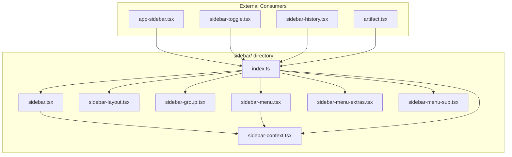
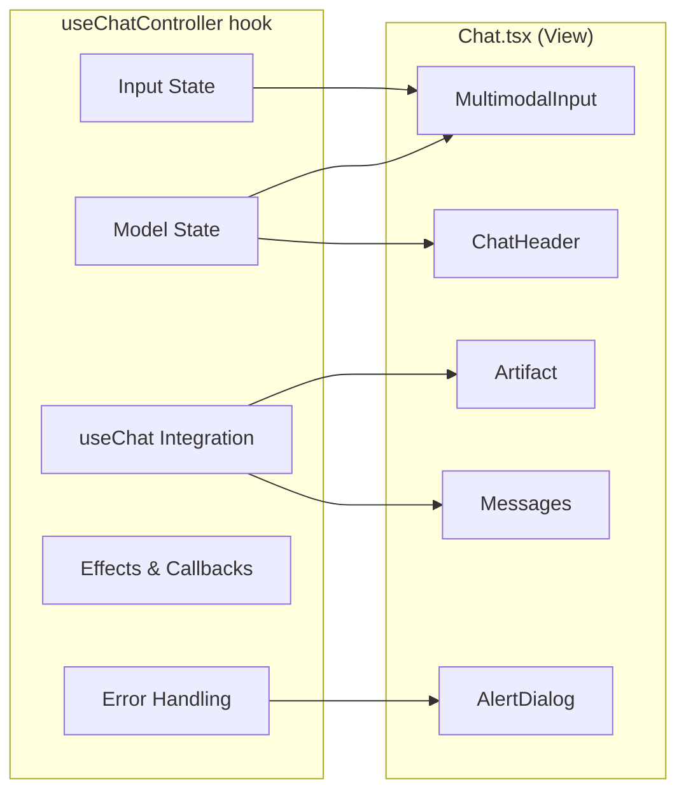

# ADR-002: Phase 3 Architecture Refactoring Design

**Status:** Proposed  
**Date:** 2024-12-17  
**Author:** Ouroboros Architect

---

## Context

Phase 3 focuses on architecture refactoring to improve code organization, maintainability, and testability. This follows successful completion of Phases 1, 2, and 2.5 which achieved ~150KB bundle savings through provider optimization and lazy loading.

### Current State Summary

| Component          | Current State           | Lines | Issue                                 |
| ------------------ | ----------------------- | ----- | ------------------------------------- |
| `sidebar.tsx`      | Monolithic UI component | 814   | All sidebar primitives in single file |
| `SettingsProvider` | Monolithic context      | 85    | All settings in single context        |
| `Chat.tsx`         | Fat component           | 524   | Logic mixed with presentation         |

### Phase 3 Tasks

| Task                                          | Est. Time | Risk   | Priority |
| --------------------------------------------- | --------- | ------ | -------- |
| Split `sidebar.tsx` into modules              | 8 hr      | HIGH   | 1        |
| Split `SettingsProvider` into atomic contexts | 6 hr      | HIGH   | 2        |
| Extract Chat logic to custom hook             | 2 hr      | MEDIUM | 3        |
| Refactor Chat.tsx to thin view layer          | 1.5 hr    | MEDIUM | 4        |

---

## Decision

### Task 1: Split `sidebar.tsx` into Modular Directory Structure

#### Current Implementation Analysis

```
components/ui/sidebar.tsx (814 lines)
├── SidebarContext + useSidebar hook (lines 41-64)
├── SidebarProvider (lines 66-172) - State management
├── Sidebar (lines 174-269) - Main container + mobile Sheet
├── SidebarTrigger (lines 271-295) - Toggle button
├── SidebarRail (lines 297-327) - Resize rail
├── SidebarInset (lines 329-345) - Main content wrapper
├── SidebarInput (lines 347-362) - Input component
├── SidebarHeader (lines 364-376) - Header section
├── SidebarFooter (lines 401-417) - Footer section
├── SidebarSeparator (lines 419-433) - Divider
├── SidebarContent (lines 435-451) - Scrollable content
├── SidebarGroup (lines 453-467) - Group container
├── SidebarGroupLabel (lines 469-493) - Group heading
├── SidebarGroupAction (lines 495-521) - Group action button
├── SidebarGroupContent (lines 523-535) - Group content
├── SidebarMenu (lines 537-549) - Menu list
├── SidebarMenuItem (lines 551-563) - Menu item
├── sidebarMenuButtonVariants + SidebarMenuButton (lines 565-632)
├── SidebarMenuAction (lines 634-671) - Action on menu item
├── SidebarMenuBadge (lines 673-695) - Badge component
├── SidebarMenuSkeleton (lines 697-731) - Loading skeleton
├── SidebarMenuSub (lines 733-749) - Submenu container
├── SidebarMenuSubItem (lines 751-755) - Submenu item
├── SidebarMenuSubButton (lines 757-797) - Submenu button
└── exports (lines 799-814)
```

#### Proposed Directory Structure

```
components/ui/sidebar/
├── index.ts                    # Public exports (barrel file)
├── sidebar-context.tsx         # SidebarContext + useSidebar + SidebarProvider
├── sidebar.tsx                 # Sidebar, SidebarInset, SidebarRail, SidebarTrigger
├── sidebar-layout.tsx          # SidebarHeader, SidebarFooter, SidebarContent, SidebarSeparator
├── sidebar-group.tsx           # SidebarGroup, SidebarGroupLabel, SidebarGroupAction, SidebarGroupContent
├── sidebar-menu.tsx            # SidebarMenu, SidebarMenuItem, SidebarMenuButton, variants
├── sidebar-menu-extras.tsx     # SidebarMenuAction, SidebarMenuBadge, SidebarMenuSkeleton
├── sidebar-menu-sub.tsx        # SidebarMenuSub, SidebarMenuSubItem, SidebarMenuSubButton
├── sidebar-input.tsx           # SidebarInput (could be in sidebar-layout)
└── types.ts                    # Shared types (SidebarContextProps, etc.)
```

#### File Breakdown

##### `sidebar-context.tsx` (~120 lines)

```typescript
// Context, hook, provider, constants
export const SIDEBAR_COOKIE_NAME = "sidebar_state";
export const SIDEBAR_WIDTH = "16rem";
export const SIDEBAR_WIDTH_MOBILE = "18rem";
export const SIDEBAR_WIDTH_ICON = "3rem";
export const SIDEBAR_KEYBOARD_SHORTCUT = "b";

export type SidebarContextProps = { ... };
export const SidebarContext = createContext<SidebarContextProps | null>(null);
export function useSidebar() { ... }
export const SidebarProvider = forwardRef<...>(...);
```

##### `sidebar.tsx` (~170 lines)

```typescript
// Core sidebar components
import { useSidebar, SIDEBAR_WIDTH, SIDEBAR_WIDTH_MOBILE, SIDEBAR_WIDTH_ICON } from "./sidebar-context";

export const Sidebar = forwardRef<...>(...);        // ~95 lines
export const SidebarTrigger = forwardRef<...>(...); // ~25 lines
export const SidebarRail = forwardRef<...>(...);    // ~30 lines
export const SidebarInset = forwardRef<...>(...);   // ~20 lines
```

##### `sidebar-layout.tsx` (~80 lines)

```typescript
// Layout sections
export const SidebarHeader = forwardRef<...>(...);    // ~15 lines
export const SidebarFooter = forwardRef<...>(...);    // ~15 lines
export const SidebarContent = forwardRef<...>(...);   // ~20 lines
export const SidebarSeparator = forwardRef<...>(...); // ~15 lines
export const SidebarInput = forwardRef<...>(...);     // ~15 lines
```

##### `sidebar-group.tsx` (~100 lines)

```typescript
// Group components
export const SidebarGroup = forwardRef<...>(...);        // ~15 lines
export const SidebarGroupLabel = forwardRef<...>(...);   // ~25 lines
export const SidebarGroupAction = forwardRef<...>(...);  // ~30 lines
export const SidebarGroupContent = forwardRef<...>(...); // ~15 lines
```

##### `sidebar-menu.tsx` (~130 lines)

```typescript
// Menu core components + variants
export const sidebarMenuButtonVariants = cva(...);         // ~25 lines
export const SidebarMenu = forwardRef<...>(...);           // ~15 lines
export const SidebarMenuItem = forwardRef<...>(...);       // ~15 lines
export const SidebarMenuButton = forwardRef<...>(...);     // ~60 lines (complex with tooltip)
```

##### `sidebar-menu-extras.tsx` (~90 lines)

```typescript
// Menu supplementary components
const SKELETON_WIDTHS = [...];                             // ~5 lines
export const SidebarMenuAction = forwardRef<...>(...);     // ~35 lines
export const SidebarMenuBadge = forwardRef<...>(...);      // ~20 lines
export const SidebarMenuSkeleton = forwardRef<...>(...);   // ~30 lines
```

##### `sidebar-menu-sub.tsx` (~60 lines)

```typescript
// Submenu components
export const SidebarMenuSub = forwardRef<...>(...);       // ~20 lines
export const SidebarMenuSubItem = forwardRef<...>(...);   // ~5 lines
export const SidebarMenuSubButton = forwardRef<...>(...); // ~35 lines
```

##### `index.ts` (barrel export)

```typescript
// Re-export everything for backward compatibility
export {
  useSidebar,
  SidebarProvider,
  SIDEBAR_COOKIE_NAME,
  type SidebarContextProps,
} from "./sidebar-context";

export { Sidebar, SidebarTrigger, SidebarRail, SidebarInset } from "./sidebar";

export {
  SidebarHeader,
  SidebarFooter,
  SidebarContent,
  SidebarSeparator,
  SidebarInput,
} from "./sidebar-layout";

export {
  SidebarGroup,
  SidebarGroupLabel,
  SidebarGroupAction,
  SidebarGroupContent,
} from "./sidebar-group";

export {
  SidebarMenu,
  SidebarMenuItem,
  SidebarMenuButton,
  sidebarMenuButtonVariants,
} from "./sidebar-menu";

export {
  SidebarMenuAction,
  SidebarMenuBadge,
  SidebarMenuSkeleton,
} from "./sidebar-menu-extras";

export {
  SidebarMenuSub,
  SidebarMenuSubItem,
  SidebarMenuSubButton,
} from "./sidebar-menu-sub";
```

#### Dependency Graph



#### Risk Mitigation

| Risk             | Mitigation                                        |
| ---------------- | ------------------------------------------------- |
| Breaking imports | Barrel file maintains same public API             |
| Missing exports  | Add all current exports to index.ts               |
| Circular deps    | Clear dependency hierarchy (context → components) |
| Displayname loss | Maintain all `.displayName` assignments           |

---

### Task 2: Split SettingsProvider into Atomic Contexts

#### Current Implementation Analysis

```typescript
// settings-provider.tsx (85 lines)
export type AppSettings = {
  sampling: SamplingSettings; // temperature, topP, maxOutputTokens
  systemPrompt: string;
  enableReasoning: boolean;
  streamArtifacts: boolean;
  autoScroll: boolean;
  selectedModelId?: string;
};

export type SettingsStore = {
  settings: AppSettings;
  updateSettings: (updater: (current: AppSettings) => AppSettings) => void;
  resetSettings: () => void;
  setSelectedModelId: (modelId: string | undefined) => void;
};
```

#### Consumer Analysis

| Consumer                | Settings Used                          | Update Pattern        |
| ----------------------- | -------------------------------------- | --------------------- |
| `Chat.tsx`              | `settings` (all), `setSelectedModelId` | Read all, write model |
| `settings-sheet.tsx`    | All settings                           | Read + write all      |
| `useSettingsSnapshot()` | `settings` (read-only)                 | Read only             |

#### Decision: Defer Atomic Split

**Finding:** After analysis, splitting SettingsProvider into atomic contexts is **NOT RECOMMENDED** at this time.

**Reasons:**

1. **Low Consumer Count**: Only 2-3 components use settings
2. **Infrequent Updates**: Settings change rarely (user opens settings panel)
3. **Tightly Related Data**: All settings are conceptually coupled
4. **Over-engineering Risk**: Atomic contexts add complexity without proportional benefit

**Alternative Recommendation:** Keep current implementation with minor improvements:

```typescript
// Add selector hook for targeted reads
export function useSettingsSelector<T>(
  selector: (settings: AppSettings) => T
): T {
  const { settings } = useSettings();
  return selector(settings);
}

// Usage in Chat.tsx - only re-renders when selectedModelId changes
const selectedModelId = useSettingsSelector((s) => s.selectedModelId);
```

#### Future Consideration

If settings consumers grow significantly (10+ components), consider:

```
components/providers/settings/
├── index.ts                    # Public exports
├── settings-context.tsx        # Core context + base provider
├── sampling-context.tsx        # SamplingSettings only
├── behavior-context.tsx        # enableReasoning, streamArtifacts, autoScroll
├── model-context.tsx           # selectedModelId
└── types.ts                    # Shared types
```

---

### Task 3: Extract Chat Logic to Custom Hook

#### Current `Chat.tsx` Analysis

**Lines 1-100: Imports + Props**

- 35+ imports (heavy)
- Complex props interface

**Lines 85-170: State & Callbacks**

```typescript
const [input, setInput] = useState<string>("");
const [usage, setUsage] = useState<AppUsage | undefined>(initialLastContext);
const [showCreditCardAlert, setShowCreditCardAlert] = useState(false);
const [currentModelId, setCurrentModelId] = useState(initialChatModel);
const currentModelIdRef = useRef(currentModelId);
const hasAppliedPersistedModel = useRef(false);
const messagesLengthRef = useRef(0);
const titlePollTimersRef = useRef<ReturnType<typeof setTimeout>[]>([]);

const handleModelChange = useCallback(...);
const getCurrentModel = useCallback(...);
const isVercelGatewayModel = useCallback(...);
```

**Lines 170-280: useChat configuration**

```typescript
const { messages, setMessages, sendMessage, status, stop, regenerate, error, clearError } = useChat({
    // ~100 lines of configuration
    onData: ...,
    onFinish: ...,
    onError: ...,
});
```

**Lines 280-400: Effects**

```typescript
// 7 useEffect hooks for:
- Sync persisted model
- Keep currentModelIdRef in sync
- Cleanup title poll timers
- Keep messagesLengthRef in sync
- Add optimistic chat
- Reset artifact visibility
- Handle query param
```

**Lines 400-524: Render**

- Votes fetching with SWR
- Attachments state
- JSX rendering

#### Proposed Hook: `useChatController`

```typescript
// hooks/use-chat-controller.ts

import type { ChatMessage, Attachment, UserVote } from "@/lib/types";
import type { ModelMetadata } from "@/lib/ai/model-catalog-types";
import type { AppUsage } from "@/lib/usage";
import type { VisibilityType } from "@/components/visibility-selector";

export interface UseChatControllerProps {
  id: string;
  initialMessages: ChatMessage[];
  initialChatModel: string;
  initialVisibilityType: VisibilityType;
  initialLastContext?: AppUsage;
  availableModels?: ModelMetadata[];
}

export interface ChatControllerState {
  // Input state
  input: string;
  setInput: (input: string) => void;
  attachments: Attachment[];
  setAttachments: React.Dispatch<React.SetStateAction<Attachment[]>>;

  // Model state
  currentModelId: string;
  handleModelChange: (modelId: string) => void;

  // Messages state
  messages: ChatMessage[];
  setMessages: React.Dispatch<React.SetStateAction<ChatMessage[]>>;

  // Chat actions
  sendMessage: (message: ChatMessage) => void;
  regenerate: () => void;
  stop: () => void;

  // Status
  status: "idle" | "submitted" | "streaming" | "error";
  chatError: Error | null;
  clearError: () => void;

  // Usage tracking
  usage: AppUsage | undefined;

  // Alert state
  showCreditCardAlert: boolean;
  setShowCreditCardAlert: (show: boolean) => void;

  // Visibility
  visibilityType: VisibilityType;
}

export function useChatController(
  props: UseChatControllerProps
): ChatControllerState {
  // All state management logic moved here
  // ~150 lines of logic
}
```

#### Logic Distribution



#### Hook Implementation Structure

```typescript
// hooks/use-chat-controller.ts (~200 lines)

export function useChatController({
    id,
    initialMessages,
    initialChatModel,
    initialVisibilityType,
    initialLastContext,
    availableModels = [],
}: UseChatControllerProps): ChatControllerState {

    // === External Hooks ===
    const { visibilityType } = useChatVisibility({ chatId: id, initialVisibilityType });
    const setDataStream = useDataStreamDispatch();
    const { settings, setSelectedModelId } = useSettings();
    const { clearNewSessionFlag } = useAuth();
    const { addOptimisticChat, removeOptimisticChat, updateOptimisticChatTitle } = useOptimisticChats();
    const { setArtifact } = useArtifact();

    // === Local State ===
    const [input, setInput] = useState<string>("");
    const [attachments, setAttachments] = useState<Attachment[]>([]);
    const [usage, setUsage] = useState<AppUsage | undefined>(initialLastContext);
    const [showCreditCardAlert, setShowCreditCardAlert] = useState(false);
    const [currentModelId, setCurrentModelId] = useState(initialChatModel);

    // === Refs ===
    const currentModelIdRef = useRef(currentModelId);
    const hasAppliedPersistedModel = useRef(false);
    const messagesLengthRef = useRef(0);
    const titlePollTimersRef = useRef<ReturnType<typeof setTimeout>[]>([]);

    // === Callbacks ===
    const handleModelChange = useCallback(...);
    const getCurrentModel = useCallback(...);
    const isVercelGatewayModel = useCallback(...);

    // === Adaptive Throttle ===
    const optimalThrottle = useMemo(...);

    // === AI SDK Integration ===
    const { messages, setMessages, sendMessage, status, stop, regenerate, error, clearError } = useChat({
        id,
        messages: initialMessages,
        experimental_throttle: optimalThrottle,
        generateId: generateUUID,
        transport: new DefaultChatTransport({ ... }),
        onData: handleDataPart,
        onFinish: handleFinish,
        onError: handleError,
    });

    // === Effects ===
    useEffect(() => { /* sync persisted model */ }, [...]);
    useEffect(() => { /* sync ref */ }, [currentModelId]);
    useEffect(() => { /* cleanup timers */ }, []);
    useEffect(() => { /* sync messages length */ }, [messages.length]);
    useEffect(() => { /* add optimistic chat */ }, [...]);
    useEffect(() => { /* reset artifact */ }, [id]);
    useEffect(() => { /* handle query param */ }, [...]);

    return {
        input, setInput,
        attachments, setAttachments,
        currentModelId, handleModelChange,
        messages, setMessages,
        sendMessage, regenerate, stop,
        status,
        chatError: error,
        clearError,
        usage,
        showCreditCardAlert, setShowCreditCardAlert,
        visibilityType,
    };
}
```

---

### Task 4: Refactor Chat.tsx to Thin View Layer

#### Target Structure

```typescript
// components/chat.tsx (~150 lines, down from 524)

"use client";

import dynamic from "next/dynamic";
import useSWR from "swr";
import { ChatHeader } from "@/components/chat-header";
import { useAuth } from "@/components/providers/auth-provider";
import { useArtifactSelector } from "@/hooks/use-artifact";
import { useChatController } from "@/hooks/use-chat-controller";
import type { UserVote } from "@/lib/types";
import { Messages } from "./messages";
import { MultimodalInput } from "./multimodal-input";
import { CreditCardAlert } from "./credit-card-alert"; // Extract to separate component

const Artifact = dynamic(() => import("./artifact").then((m) => m.Artifact), {
    ssr: false,
});

export function Chat({
    id,
    initialMessages,
    initialChatModel,
    initialVisibilityType,
    isReadonly,
    initialLastContext,
    availableModels = [],
    initialVotes,
}: ChatProps) {
    const controller = useChatController({
        id,
        initialMessages,
        initialChatModel,
        initialVisibilityType,
        initialLastContext,
        availableModels,
    });

    const { session } = useAuth();
    const isGuest = session?.user?.type === "guest";
    const isArtifactVisible = useArtifactSelector((state) => state.isVisible);

    const { data: votes } = useSWR<UserVote[]>(
        `/api/vote?chatId=${id}`,
        null,
        { fallbackData: initialVotes || [], revalidateOnFocus: false, ... }
    );

    return (
        <>
            <div className="overscroll-behavior-contain flex h-dvh min-w-0 touch-pan-y flex-col bg-background">
                <ChatHeader
                    chatId={id}
                    isReadonly={isReadonly}
                    selectedVisibilityType={initialVisibilityType}
                />

                <Messages
                    chatError={controller.chatError}
                    chatId={id}
                    clearError={controller.clearError}
                    isArtifactVisible={isArtifactVisible}
                    isGuest={isGuest}
                    isReadonly={isReadonly}
                    messages={controller.messages}
                    regenerate={controller.regenerate}
                    selectedModelId={controller.currentModelId}
                    setMessages={controller.setMessages}
                    status={controller.status}
                    votes={votes}
                />

                {!isReadonly && (
                    <div className="sticky bottom-0 ...">
                        <MultimodalInput
                            attachments={controller.attachments}
                            availableModels={availableModels}
                            chatId={id}
                            input={controller.input}
                            messages={controller.messages}
                            onModelChange={controller.handleModelChange}
                            selectedModelId={controller.currentModelId}
                            selectedVisibilityType={controller.visibilityType}
                            sendMessage={controller.sendMessage}
                            setAttachments={controller.setAttachments}
                            setInput={controller.setInput}
                            setMessages={controller.setMessages}
                            status={controller.status}
                            stop={controller.stop}
                            usage={controller.usage}
                        />
                    </div>
                )}
            </div>

            <Artifact {...artifactProps} />

            <CreditCardAlert
                open={controller.showCreditCardAlert}
                onOpenChange={controller.setShowCreditCardAlert}
            />
        </>
    );
}
```

#### Benefits

| Metric         | Before          | After           |
| -------------- | --------------- | --------------- |
| Chat.tsx lines | 524             | ~150            |
| Testable units | 1 (integration) | 2 (hook + view) |
| Concerns       | Mixed           | Separated       |
| Reusability    | None            | Hook reusable   |

---

## Consequences

### Positive

- **POS-001**: Sidebar module split enables tree-shaking of unused components
- **POS-002**: Clear file boundaries improve code navigation and ownership
- **POS-003**: useChatController enables unit testing of chat logic
- **POS-004**: Thin Chat.tsx view is easier to reason about
- **POS-005**: Barrel exports maintain backward compatibility

### Negative

- **NEG-001**: More files to manage (sidebar: 1→8 files)
- **NEG-002**: Import path changes require careful migration
- **NEG-003**: useChatController adds ~200 lines in new location
- **NEG-004**: Initial complexity increase during transition

### Mitigations

- **NEG-001**: VS Code navigation (Ctrl+Click) makes multi-file easier
- **NEG-002**: Barrel file preserves `@/components/ui/sidebar` imports
- **NEG-003**: Net code reduction in Chat.tsx offsets new file
- **NEG-004**: Feature flag rollout enables gradual migration

---

## Alternatives Considered

### ALT-001: Keep sidebar.tsx as single file

- **Description**: Accept monolithic structure, add better comments
- **Rejected because**: 814 lines exceeds maintainability threshold, hard to test individual components

### ALT-002: Full SettingsProvider atomic split

- **Description**: Create 5 separate context providers for each setting group
- **Rejected because**: Over-engineering for current consumer count (2-3 components)

### ALT-003: Keep Chat.tsx with inline logic

- **Description**: Use `// region` comments for organization
- **Rejected because**: Prevents unit testing, violates SRP, 524 lines too large

### ALT-004: Use Zustand for chat state

- **Description**: Replace useChatController with Zustand store
- **Rejected because**: AI SDK's useChat already provides state management, would duplicate functionality

---

## Implementation Notes

### Implementation Order

1. **Sidebar split (8 hr)** - Most complex, do first while fresh
2. **useChatController (2 hr)** - Extract logic incrementally
3. **Chat.tsx refactor (1.5 hr)** - Depends on step 2
4. **SettingsProvider selector (0.5 hr)** - Minor improvement only

### Testing Strategy

1. **Before any changes**: Run full E2E suite, save baseline
2. **After sidebar split**: Test all sidebar interactions
3. **After hook extraction**: Unit test useChatController
4. **After Chat refactor**: Full regression test

### Rollback Strategy

Each task in separate PR:

- `refactor/sidebar-modularization`
- `refactor/chat-controller-hook`
- `refactor/chat-view-layer`

Revert specific PR if issues arise.

---

## References

- [ADR-001: Provider Architecture Separation](.ouroboros/specs/provider-architecture/design.md)
- [Provider Separation Plan](.ouroboros/docs/provider-separation-plan.md)
- [React Component Guidelines](https://react.dev/learn/thinking-in-react)

---

## Appendix: Full Dependency Map

### Sidebar Consumers

| File                     | Components Used                                                                                                                                           |
| ------------------------ | --------------------------------------------------------------------------------------------------------------------------------------------------------- |
| `app-sidebar.tsx`        | SidebarHeader, SidebarContent, SidebarFooter, SidebarMenu, SidebarMenuItem, SidebarMenuButton, SidebarGroup, SidebarGroupContent                          |
| `sidebar-toggle.tsx`     | SidebarTrigger, useSidebar                                                                                                                                |
| `sidebar-history.tsx`    | SidebarGroup, SidebarGroupLabel, SidebarGroupContent, SidebarMenu, SidebarMenuItem, SidebarMenuButton, SidebarMenuAction, SidebarMenuSkeleton, useSidebar |
| `artifact.tsx`           | useSidebar                                                                                                                                                |
| `chat-layout-client.tsx` | SidebarProvider, SidebarInset                                                                                                                             |

### Settings Consumers

| File                 | Hook Used                                | Fields Accessed                                |
| -------------------- | ---------------------------------------- | ---------------------------------------------- |
| `chat.tsx`           | `useSettings()`                          | `settings` (all), `setSelectedModelId`         |
| `settings-sheet.tsx` | `useSettings()`, `useSettingsSnapshot()` | All fields + `updateSettings`, `resetSettings` |

### Chat.tsx Dependencies

| Category      | Dependencies                                                                           |
| ------------- | -------------------------------------------------------------------------------------- |
| External      | `@ai-sdk/react`, `ai`, `next/dynamic`, `next/navigation`, `swr`                        |
| UI Components | `ChatHeader`, `Messages`, `MultimodalInput`, `Artifact`, `AlertDialog`                 |
| Providers     | `useAuth`, `useDataStreamDispatch`, `useOptimisticChats`, `useSettings`                |
| Hooks         | `useArtifact`, `useArtifactSelector`, `useChatVisibility`                              |
| Utilities     | `ChatSDKError`, `logError`, `logWarn`, `fetchWithErrorHandlers`, `generateUUID`        |
| Types         | `Attachment`, `ChatMessage`, `UserVote`, `ModelMetadata`, `AppUsage`, `VisibilityType` |
