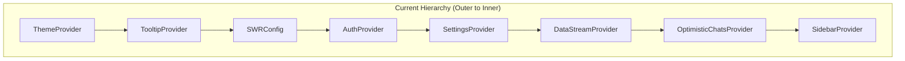
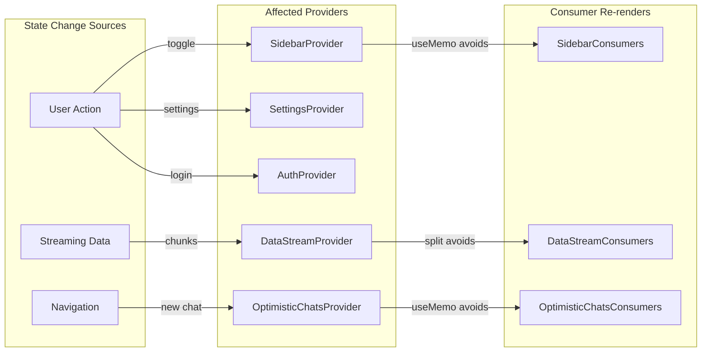
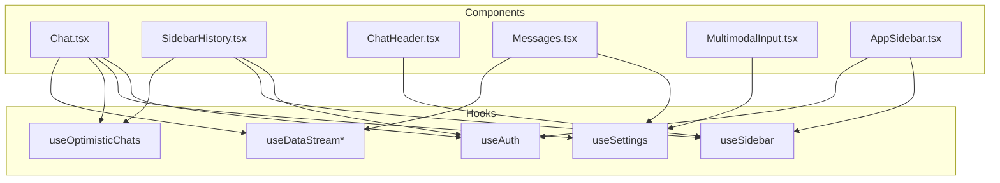

# ADR-001: Provider Architecture Separation and Decoupling Analysis

**Status:** Proposed
**Date:** 2024-12-17
**Author:** Ouroboros Architect

---

## Context

This ADR analyzes the current provider architecture after Phase 1 optimizations to determine if providers are optimally separated and decoupled. The analysis covers coupling, hierarchy, patterns, scoping, and bundle impact.

### Current Architecture

```
┌─────────────────────────────────────────────────────────────────────┐
│                    ROOT LAYOUT (app/layout.tsx)                     │
│  ┌───────────────────────────────────────────────────────────────┐  │
│  │  ThemeProvider                                                │  │
│  │  ├── TooltipProvider                                          │  │
│  │  │   └── SWRConfig                                            │  │
│  │  │       └── AuthProvider (async - server session)            │  │
│  │  │           └── {children}                                   │  │
│  └───────────────────────────────────────────────────────────────┘  │
└─────────────────────────────────────────────────────────────────────┘
                              │
                              ▼
┌─────────────────────────────────────────────────────────────────────┐
│               CHAT LAYOUT CLIENT (chat-layout-client.tsx)           │
│  ┌───────────────────────────────────────────────────────────────┐  │
│  │  SettingsProvider (localStorage)                              │  │
│  │  ├── DataStreamProvider (split context pattern)               │  │
│  │  │   └── OptimisticChatsProvider (useMemo pattern)            │  │
│  │  │       └── SidebarProvider                                  │  │
│  │  │           ├── AppSidebar                                   │  │
│  │  │           └── SidebarInset                                 │  │
│  │  │               └── {children}                               │  │
│  └───────────────────────────────────────────────────────────────┘  │
└─────────────────────────────────────────────────────────────────────┘
```

### Provider Files Analyzed

| Provider                | File                            | Pattern Used        | State Type        |
| ----------------------- | ------------------------------- | ------------------- | ----------------- |
| ThemeProvider           | `theme-provider.tsx`            | next-themes wrapper | External          |
| TooltipProvider         | `@/components/ui/tooltip`       | Radix wrapper       | None              |
| SWRConfig               | External                        | SWR library         | Cache config      |
| AuthProvider            | `auth-provider.tsx`             | useMemo context     | Session + effects |
| SettingsProvider        | `settings-provider.tsx`         | useMemo context     | localStorage sync |
| DataStreamProvider      | `data-stream-provider.tsx`      | **Split context**   | Array state       |
| OptimisticChatsProvider | `optimistic-chats-provider.tsx` | useMemo + useRef    | List + actions    |
| SidebarProvider         | `ui/sidebar.tsx`                | useMemo context     | UI state          |
| MotionProvider          | `motion-provider.tsx`           | LazyMotion wrapper  | None (unused)     |

---

## Analysis Results

### 1. Provider Coupling Analysis

#### Assessment: ✅ **GOOD**

| Coupling Concern                             | Status              | Notes                                                  |
| -------------------------------------------- | ------------------- | ------------------------------------------------------ |
| AuthProvider ↔ SettingsProvider              | ✅ Decoupled        | Auth doesn't depend on settings                        |
| SettingsProvider ↔ DataStreamProvider        | ✅ Decoupled        | No shared state                                        |
| DataStreamProvider ↔ OptimisticChatsProvider | ✅ Decoupled        | Different domains                                      |
| OptimisticChatsProvider ↔ SidebarProvider    | ⚠️ Logical coupling | Both serve sidebar, but Chat.tsx needs OptimisticChats |

**Finding:** Providers are well-separated by domain. No tightly coupled providers that should be merged.

**Anti-pattern Check:**

- ❌ No God Provider (single provider doing everything)
- ❌ No circular dependencies between providers
- ❌ No redundant state duplication

---

### 2. Hierarchy Optimization Analysis

#### Assessment: ⚠️ **NEEDS MINOR IMPROVEMENT**



#### Re-render Analysis

| Provider                | Update Frequency            | Subscribers   | Re-render Impact |
| ----------------------- | --------------------------- | ------------- | ---------------- |
| ThemeProvider           | Rare (user toggle)          | All           | Low              |
| TooltipProvider         | Never (config only)         | All           | None             |
| SWRConfig               | Never (config only)         | All           | None             |
| AuthProvider            | Rare (login/logout)         | 4 components  | Low              |
| SettingsProvider        | Occasional (settings panel) | 3+ components | Medium           |
| DataStreamProvider      | **Frequent** (streaming)    | 3 components  | **High**         |
| OptimisticChatsProvider | Occasional (new chat)       | 2 components  | Medium           |
| SidebarProvider         | Occasional (toggle)         | 5+ components | Medium           |

#### Hierarchy Issues Found

**Issue 1: DataStreamProvider Position**

- DataStreamProvider has frequent updates (streaming data)
- It's positioned ABOVE OptimisticChatsProvider and SidebarProvider
- When dataStream updates, React must check all children for re-renders

**Recommendation:** Move DataStreamProvider closer to its consumers (but already uses split context, mitigating this)

**Issue 2: SettingsProvider localStorage Hydration**

- `useLocalStorage` with `initializeWithValue: false` causes hydration mismatch avoidance
- Initial render uses defaults, then re-renders with localStorage values
- This is necessary behavior, not a bug

---

### 3. Split Context Pattern Analysis

#### Current Implementation: DataStreamProvider ✅ **EXCELLENT**

```typescript
// Split contexts prevent unnecessary re-renders
const DataStreamStateContext = createContext<DataStreamState | null>(null);
const DataStreamDispatchContext = createContext<DataStreamDispatch | null>(null);

// Hooks
export function useDataStreamState(): DataStreamState { ... }
export function useDataStreamDispatch(): DataStreamDispatch { ... }
export function useDataStream() { ... } // Backward compatible
```

**Benefits Observed:**

- Components calling `useDataStreamDispatch()` don't re-render on state changes
- Clear separation of read vs write concerns
- Backward compatible `useDataStream()` for gradual migration

#### Candidates for Split Context Pattern

| Provider                | Should Split? | Rationale                                                         |
| ----------------------- | ------------- | ----------------------------------------------------------------- |
| OptimisticChatsProvider | ⚠️ **MAYBE**  | Actions are stable (useCallback), but state changes on add/update |
| SettingsProvider        | ❌ No         | Updates are infrequent, settings read together                    |
| AuthProvider            | ❌ No         | Session updates are rare (login/logout)                           |
| SidebarProvider         | ❌ No         | All consumers need both state and actions                         |

#### OptimisticChatsProvider Split Analysis

**Current:**

```typescript
const contextValue = useMemo(
  () => ({
    optimisticChats, // State - changes on add/remove
    addOptimisticChat, // Action - stable ref
    updateOptimisticChatTitle, // Action - stable ref
    removeOptimisticChat, // Action - stable ref
  }),
  [
    optimisticChats,
    addOptimisticChat,
    updateOptimisticChatTitle,
    removeOptimisticChat,
  ]
);
```

**Usage Pattern:**

- `Chat.tsx`: Uses actions only (`addOptimisticChat`, `removeOptimisticChat`, `updateOptimisticChatTitle`)
- `SidebarHistory.tsx`: Uses state AND actions (`optimisticChats`, `removeOptimisticChat`)

**Verdict:** Split would benefit Chat.tsx (actions-only consumer). However:

- Chat.tsx already has many re-render sources (useChat, messages, input)
- Marginal improvement vs implementation complexity
- **Recommendation: LOW PRIORITY** - Document for future if profiling shows bottleneck

---

### 4. Scoping Analysis

#### Assessment: ✅ **ALREADY OPTIMAL**

| Provider                | Current Scope | Narrower Possible? | Blocker                            |
| ----------------------- | ------------- | ------------------ | ---------------------------------- |
| ThemeProvider           | Root          | No                 | All components need theme          |
| TooltipProvider         | Root          | No                 | Tooltips everywhere                |
| SWRConfig               | Root          | No                 | Global cache config                |
| AuthProvider            | Root          | No                 | Auth needed app-wide               |
| SettingsProvider        | Chat layout   | No                 | Chat + Settings panel need it      |
| DataStreamProvider      | Chat layout   | Maybe              | Only Chat.tsx area                 |
| OptimisticChatsProvider | Chat layout   | **No**             | Chat.tsx uses it (outside sidebar) |
| SidebarProvider         | Chat layout   | **No**             | ChatHeader.tsx uses useSidebar()   |

**Key Finding:** Previous analysis correctly identified that:

- `OptimisticChatsProvider` cannot be scoped to sidebar because `Chat.tsx` uses `useOptimisticChats()`
- `SidebarProvider` cannot be scoped to sidebar because `ChatHeader.tsx` uses `useSidebar()`

**Theoretical Scoping for DataStreamProvider:**

```
❌ NOT RECOMMENDED - Would require:
1. Moving DataStreamProvider inside Chat.tsx
2. Making DataStreamHandler a sibling instead of parent
3. Prop drilling or ref forwarding
4. Complexity outweighs benefits
```

---

### 5. Bundle Impact Analysis

#### Assessment: ⚠️ **IMPROVEMENT OPPORTUNITIES**

| Provider                | Bundle Contribution | Lazy Loadable?      | Server-Only Possible? |
| ----------------------- | ------------------- | ------------------- | --------------------- |
| ThemeProvider           | ~2KB (next-themes)  | No                  | No                    |
| TooltipProvider         | ~5KB (Radix)        | No (used early)     | No                    |
| SWRConfig               | ~10KB (SWR)         | No (root config)    | No                    |
| AuthProvider            | ~3KB                | No (session needed) | ⚠️ Partial            |
| SettingsProvider        | ~2KB                | No (used early)     | No                    |
| DataStreamProvider      | ~1KB                | **YES**             | No                    |
| OptimisticChatsProvider | ~1KB                | **YES**             | No                    |
| SidebarProvider         | ~8KB (complex UI)   | Already done        | No                    |
| **MotionProvider**      | **~15KB**           | **YES**             | **N/A - UNUSED**      |

#### Critical Finding: Unused MotionProvider

```typescript
// components/providers/motion-provider.tsx
export function MotionProvider({ children }: { children: ReactNode }) {
  return (
    <LazyMotion features={domAnimation} strict>
      {children}
    </LazyMotion>
  );
}
```

**Status:** Defined but NOT USED anywhere in the app.

**Recommendation:**

- **HIGH PRIORITY**: Either integrate or remove MotionProvider
- If animations are planned: Use at component level, not provider level
- If not needed: Delete to reduce bundle (~15KB framer-motion)

#### Server Components Opportunity

**AuthProvider partial server-side:**

```typescript
// Current: Server fetches session, passes to client provider
async function AppShell({ children }) {
  const initialSession = await getAppSession(); // ✅ Server
  return (
    <AuthProvider initialSession={initialSession}>{children}</AuthProvider>
  );
}
```

This is already optimal - session fetching is server-side, only the React context is client-side.

---

## Decision Matrix

| Recommendation                         | Priority | Effort | Impact      | Trade-offs                        |
| -------------------------------------- | -------- | ------ | ----------- | --------------------------------- |
| Remove/integrate MotionProvider        | **HIGH** | Low    | High (15KB) | May need later for animations     |
| Split OptimisticChatsProvider contexts | LOW      | Medium | Low         | Complexity vs marginal perf gain  |
| Move DataStreamProvider position       | SKIP     | N/A    | N/A         | Split context already solves this |
| Narrow provider scopes                 | SKIP     | N/A    | N/A         | Already validated as infeasible   |

---

## Consequences

### Positive

- **POS-001**: Current architecture is well-designed with clear domain separation
- **POS-002**: DataStreamProvider split context is exemplary pattern
- **POS-003**: Provider hierarchy follows logical dependency order
- **POS-004**: useMemo pattern prevents unnecessary context object recreation

### Negative

- **NEG-001**: MotionProvider exists but is unused (dead code)
- **NEG-002**: OptimisticChatsProvider could benefit from split context (minor)
- **NEG-003**: Multiple useEffect in AuthProvider add complexity

---

## Alternatives Considered

### ALT-001: Merge OptimisticChatsProvider into SidebarProvider

- **Description:** Combine optimistic chat state with sidebar state
- **Rejected because:**
  - Violates single responsibility principle
  - Chat.tsx needs optimistic chats but not sidebar state
  - Would create unnecessary coupling

### ALT-002: Global State Library (Zustand/Jotai)

- **Description:** Replace React Context with atomic state library
- **Rejected because:**
  - Current Context implementation is performant
  - Would require significant refactoring
  - Bundle size increase for marginal benefit
  - React 19 improvements will help Context performance

### ALT-003: Hoist DataStreamProvider to Root

- **Description:** Move DataStreamProvider to root layout
- **Rejected because:**
  - Data stream is chat-specific, not app-wide
  - Would pollute global scope
  - Current chat-layout scope is appropriate

---

## Implementation Notes

### Immediate Action: MotionProvider Cleanup

```bash
# Option A: Remove if not needed
rm components/providers/motion-provider.tsx

# Option B: Integrate if animations planned
# Add to chat-layout-client.tsx wrapping animated components
```

### Future Consideration: OptimisticChatsProvider Split

If profiling shows Chat.tsx re-rendering excessively due to optimistic chat updates:

```typescript
// Split into state and dispatch contexts
const OptimisticChatsStateContext = createContext<OptimisticChat[] | null>(null);
const OptimisticChatsDispatchContext = createContext<OptimisticChatsActions | null>(null);

// Separate hooks
export function useOptimisticChatsState() { ... }
export function useOptimisticChatsActions() { ... }
export function useOptimisticChats() { ... } // Backward compatible
```

---

## Architecture Diagrams

### Provider Re-render Flow



### Hook Usage Map



---

## Summary Table

| Area                  | Current State             | Recommendation               | Priority |
| --------------------- | ------------------------- | ---------------------------- | -------- |
| Provider Coupling     | ✅ Good                   | None                         | -        |
| Hierarchy Order       | ✅ Good                   | None                         | -        |
| Split Context Pattern | ✅ Excellent (DataStream) | Consider for OptimisticChats | Low      |
| Provider Scoping      | ✅ Optimal                | None                         | -        |
| Bundle Impact         | ⚠️ Dead code              | Remove MotionProvider        | **High** |
| Overall Architecture  | ✅ Good                   | Minor cleanup only           | -        |

---

## References

- [Provider Architecture Diagram](../.ouroboros/docs/provider-architecture-diagram.md)
- [Provider Separation Plan](../.ouroboros/docs/provider-separation-plan.md)
- [React Context Performance](https://react.dev/learn/scaling-up-with-reducer-and-context)
- [Split Context Pattern](https://kentcdodds.com/blog/how-to-optimize-your-context-value)
