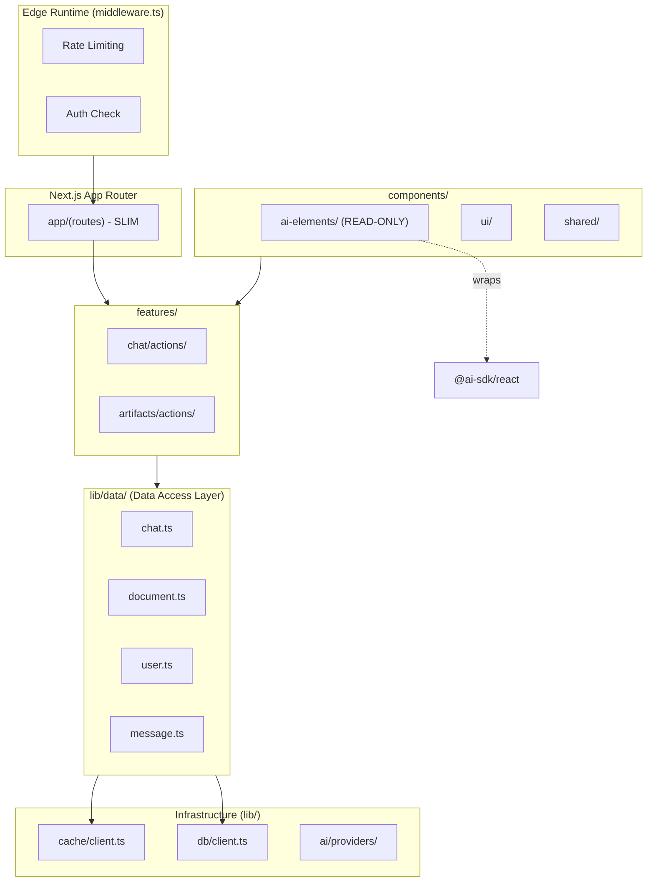
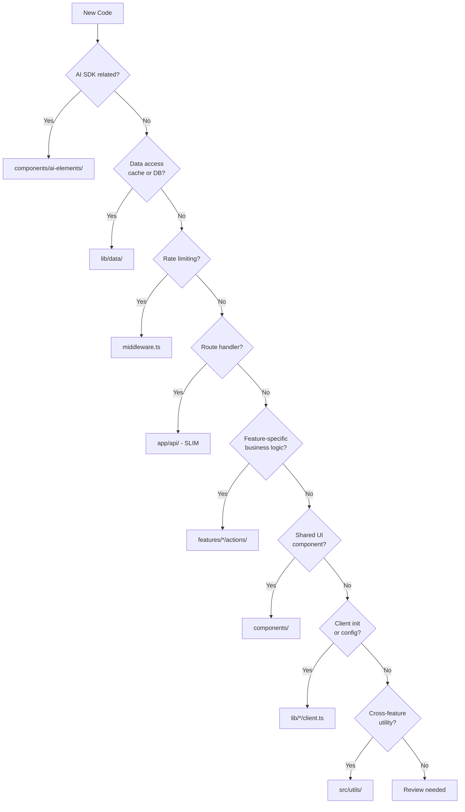

# Design: v6 Data Access Layer Architecture Redesign

> **Phase**: 3/5 - Design  
> **Input**: User requirements, [CORRECTED-ARCHITECTURE-V5-SRP.md](./CORRECTED-ARCHITECTURE-V5-SRP.md)  
> **Created**: 2024-12-28  
> **Status**: 🟢 Approved

---

## Overview

This design defines a **comprehensive architecture redesign** addressing 6 critical requirements:

1. **AI SDK Wrappers** - Read-only wrappers in `components/ai-elements/`
2. **Data Access Layer** - Unified cache+DB abstraction in `lib/data/`
3. **Edge Rate Limiting** - Rate limiting ONLY in `middleware.ts`
4. **Slim Routes** - Minimal route handlers, logic delegated to actions/services
5. **Consolidated Components** - Single components for similar patterns (auth forms)
6. **Standardized Patterns** - Consistent error handling throughout

### Design Principles

1. **Caller Ignorance** — Data consumers don't know if data comes from cache or DB
2. **Edge-First Security** — Rate limiting at the edge, not in services
3. **Single Responsibility** — Routes parse requests, actions contain logic
4. **DRY Components** — One component, multiple modes (login/register)
5. **Read-Only Wrappers** — AI SDK elements wrap, never modify SDK internals

---

## Architecture

### System Diagram



### Component Overview

| Component | Responsibility | Location | Covers |
|-----------|---------------|----------|--------|
| Edge Middleware | Rate limiting, auth routing | `middleware.ts` | Security, performance |
| Slim Routes | Request parsing, delegation | `app/api/*/route.ts` | API surface |
| Feature Actions | Business logic orchestration | `features/*/actions/` | Feature logic |
| Data Access Layer | Cache+DB abstraction | `lib/data/` | Data operations |
| AI Elements | Read-only SDK wrappers | `components/ai-elements/` | AI SDK integration |
| Cache Client | Redis connection only | `lib/cache/client.ts` | Infrastructure |
| DB Client | Drizzle connection only | `lib/db/client.ts` | Infrastructure |

---

## Layer 1: AI SDK Wrappers (components/ai-elements/)

### Design Philosophy

**READ-ONLY wrappers around Vercel AI SDK. Never modify SDK internals.**

```
components/ai-elements/
├── index.ts                 # Re-exports from SDK + project wrappers
├── use-project-chat.ts      # Wrapper around useChat with project error handling
├── use-project-assistant.ts # Wrapper around useAssistant
├── stream-helpers.ts        # Project-specific stream utilities
└── types.ts                 # Extended types (never override SDK types)
```

### Implementation Pattern

```typescript
// components/ai-elements/index.ts

// RE-EXPORT SDK as-is (read-only)
export { useChat, useCompletion, useAssistant } from '@ai-sdk/react';
export { generateText, streamText, generateObject } from 'ai';

// RE-EXPORT project wrappers
export { useProjectChat } from './use-project-chat';
export { useProjectAssistant } from './use-project-assistant';
```

```typescript
// components/ai-elements/use-project-chat.ts
import { useChat, type UseChatOptions } from '@ai-sdk/react';
import { handleAIError } from '@/lib/errors';
import { trackUsage } from '@/lib/telemetry';

/**
 * Project wrapper around useChat
 * Adds: error handling, usage tracking, default options
 * DOES NOT: modify SDK behavior, override internals
 */
export function useProjectChat(options: UseChatOptions) {
  return useChat({
    ...options,
    onError: (error) => {
      handleAIError(error);          // Project error handling
      options.onError?.(error);      // Caller's handler (if any)
    },
    onFinish: (message) => {
      trackUsage(message);           // Project telemetry
      options.onFinish?.(message);   // Caller's handler
    },
  });
}
```

### Rules for AI Elements

| ✅ ALLOWED | ❌ FORBIDDEN |
|-----------|-------------|
| Re-export SDK functions | Override SDK types |
| Add project-specific callbacks | Modify SDK internal behavior |
| Extend with project utilities | Fork or patch SDK code |
| Wrap with error handling | Change SDK defaults globally |

**Why This Design**: 
- SDK updates never break project code
- Clear separation of concerns
- Easy to test wrapper logic independently

**Covers**: REQ-001 (AI SDK wrappers read-only)

---

## Layer 2: Data Access Layer (lib/data/)

### Design Philosophy

**Single abstraction for all data access. Caller doesn't know if data is from cache or DB.**

```
lib/data/
├── index.ts                 # Barrel exports
├── types.ts                 # DataContext, result types
├── base.ts                  # createContext(), helpers
├── chat.ts                  # Chat operations (cache+DB)
├── message.ts               # Message operations
├── document.ts              # Document operations
├── user.ts                  # User operations
└── vote.ts                  # Vote operations
```

### Core Pattern: Cache-Through Reads

```typescript
// lib/data/chat.ts
import { getRedisClient, isRedisAvailable } from '@/lib/cache/client';
import { db } from '@/lib/db/client';
import { chat } from '@/lib/db/schema';
import type { Chat } from '@/lib/db/schema';
import type { DataContext } from './types';

/**
 * Get chat by ID - unified cache+DB access
 * Caller doesn't know where data comes from
 */
export async function getChatById(
  chatId: string,
  ctx: DataContext
): Promise<Chat | null> {
  const cacheKey = `chat:${ctx.userId}:${chatId}`;
  
  // 1. Check cache first (if available)
  if (isRedisAvailable()) {
    try {
      const redis = getRedisClient();
      const cached = await redis.get(cacheKey);
      if (cached) {
        return JSON.parse(cached) as Chat;
      }
    } catch (error) {
      // Cache miss or error - fall through to DB
      logWarn('Cache read failed, falling back to DB', { chatId, error });
    }
  }
  
  // 2. Guest users: cache-only (no DB)
  if (ctx.isGuest) {
    return null;
  }
  
  // 3. Auth users: fetch from DB
  const [chatFromDb] = await db
    .select()
    .from(chat)
    .where(and(eq(chat.id, chatId), eq(chat.userId, ctx.userId)));
  
  if (!chatFromDb) {
    return null;
  }
  
  // 4. Warm cache (background, fire-and-forget)
  if (isRedisAvailable()) {
    const redis = getRedisClient();
    redis.set(cacheKey, JSON.stringify(chatFromDb), 'EX', 3600)
      .catch(err => logWarn('Cache warm failed', err));
  }
  
  return chatFromDb;
}
```

### Core Pattern: Write-Through

```typescript
// lib/data/chat.ts (continued)

/**
 * Create a new chat - write to both cache and DB
 */
export async function createChat(
  data: CreateChatInput,
  ctx: DataContext
): Promise<Chat> {
  const chatId = generateId();
  const now = new Date();
  
  const newChat: Chat = {
    id: chatId,
    userId: ctx.userId,
    title: data.title || 'New Chat',
    visibility: data.visibility || 'private',
    createdAt: now,
    updatedAt: now,
  };
  
  // 1. Write to cache FIRST (for immediate consistency)
  if (isRedisAvailable()) {
    const redis = getRedisClient();
    const cacheKey = `chat:${ctx.userId}:${chatId}`;
    await redis.set(cacheKey, JSON.stringify(newChat), 'EX', 3600);
  }
  
  // 2. Write to DB (skip for guest users)
  if (!ctx.isGuest) {
    await db.insert(chat).values(newChat);
  }
  
  return newChat;
}
```

### Data Context Pattern

```typescript
// lib/data/types.ts
export type DataContext = {
  userId: string;
  isGuest: boolean;
};

// lib/data/base.ts
import type { AppSession } from '@/lib/auth/session';
import type { DataContext } from './types';

/**
 * Create DataContext from session
 * Used at the action layer before calling DAL
 */
export function createContext(session: AppSession): DataContext {
  if (!session?.user?.id) {
    throw new Error('Session user ID is required');
  }
  return {
    userId: session.user.id,
    isGuest: session.user.type === 'guest',
  };
}
```

### Complete DAL API Surface

```typescript
// lib/data/index.ts - Public API

// Context
export { createContext, type DataContext } from './base';

// Chat operations
export {
  getChatById,
  getChatWithMessages,
  getUserChats,
  createChat,
  updateChat,
  deleteChat,
  deleteAllUserChats,
} from './chat';

// Message operations
export {
  getMessagesByChatId,
  appendMessages,
  deleteMessagesAfterTimestamp,
} from './message';

// Document operations
export {
  getDocumentById,
  getDocumentWithVersions,
  createDocument,
  updateDocument,
  getDocumentVersions,
} from './document';

// Vote operations
export {
  getVotesByMessageId,
  createVote,
  updateVote,
} from './vote';

// User operations
export {
  getUserByEmail,
  createUser,
  updateUser,
} from './user';
```

### Usage in Actions

```typescript
// features/chat/actions/get-chat.action.ts
import { auth } from '@/lib/auth';
import { createContext, getChatById } from '@/lib/data';
import { ChatSDKError } from '@/lib/errors';

export async function getChatAction(chatId: string) {
  const session = await auth();
  if (!session?.user) {
    throw new ChatSDKError('unauthorized', 'Not authenticated');
  }
  
  const ctx = createContext(session);
  
  // DAL handles cache+DB internally - caller doesn't care
  const chat = await getChatById(chatId, ctx);
  
  if (!chat) {
    throw new ChatSDKError('not_found', 'Chat not found');
  }
  
  return chat;
}
```

**Why This Design**:
- Single source of truth for data access patterns
- Cache strategy encapsulated, not leaked to callers
- Easy to change cache behavior without touching features
- Testable with mock DAL

**Covers**: REQ-002 (Data Access Layer abstracts cache+DB)

---

## Layer 3: Edge Rate Limiting (middleware.ts ONLY)

### Design Philosophy

**Rate limiting happens at the Edge ONLY. Services do NOT rate limit.**

```typescript
// middleware.ts
import { NextRequest, NextResponse } from 'next/server';
import { Ratelimit } from '@upstash/ratelimit';
import { Redis } from '@upstash/redis';

// Rate limiter instance (Edge-compatible)
const ratelimit = new Ratelimit({
  redis: Redis.fromEnv(),
  limiter: Ratelimit.slidingWindow(100, '1 m'),
  analytics: true,
  prefix: 'ratelimit:api',
});

export async function middleware(request: NextRequest) {
  // 1. Skip non-API routes
  if (!request.nextUrl.pathname.startsWith('/api')) {
    return NextResponse.next();
  }
  
  // 2. Get identifier (IP or user ID from token)
  const ip = request.ip ?? request.headers.get('x-forwarded-for') ?? 'anonymous';
  const identifier = `api:${ip}`;
  
  // 3. Check rate limit
  const { success, limit, reset, remaining } = await ratelimit.limit(identifier);
  
  if (!success) {
    return new NextResponse('Too Many Requests', {
      status: 429,
      headers: {
        'X-RateLimit-Limit': limit.toString(),
        'X-RateLimit-Remaining': remaining.toString(),
        'X-RateLimit-Reset': reset.toString(),
        'Retry-After': Math.ceil((reset - Date.now()) / 1000).toString(),
      },
    });
  }
  
  // 4. Add rate limit headers to response
  const response = NextResponse.next();
  response.headers.set('X-RateLimit-Limit', limit.toString());
  response.headers.set('X-RateLimit-Remaining', remaining.toString());
  response.headers.set('X-RateLimit-Reset', reset.toString());
  
  return response;
}

export const config = {
  matcher: '/api/:path*',
};
```

### Route-Specific Rate Limits

```typescript
// middleware.ts (extended)

const rateLimiters = {
  chat: new Ratelimit({
    redis: Redis.fromEnv(),
    limiter: Ratelimit.slidingWindow(20, '1 m'),  // 20 messages/min
    prefix: 'ratelimit:chat',
  }),
  auth: new Ratelimit({
    redis: Redis.fromEnv(),
    limiter: Ratelimit.slidingWindow(5, '1 m'),   // 5 attempts/min
    prefix: 'ratelimit:auth',
  }),
  default: new Ratelimit({
    redis: Redis.fromEnv(),
    limiter: Ratelimit.slidingWindow(100, '1 m'),
    prefix: 'ratelimit:default',
  }),
};

function getRateLimiter(pathname: string) {
  if (pathname.startsWith('/api/chat')) return rateLimiters.chat;
  if (pathname.startsWith('/api/auth')) return rateLimiters.auth;
  return rateLimiters.default;
}
```

### What Services DO NOT Do

```typescript
// ❌ WRONG - Rate limiting in service
// src/services/chat.service.ts
export async function sendMessage(message: string) {
  // ❌ DON'T DO THIS - rate limiting belongs in middleware
  const allowed = await checkRateLimit(userId);
  if (!allowed) throw new Error('Rate limited');
  
  // ... logic
}

// ✅ CORRECT - Service assumes rate limit already checked
// features/chat/actions/send-message.action.ts
export async function sendMessageAction(message: string) {
  // Rate limiting already done in middleware
  // Just do business logic
  const session = await auth();
  const ctx = createContext(session);
  
  return await appendMessages(chatId, [{ content: message }], ctx);
}
```

**Why This Design**:
- Edge runtime = lowest latency for rejections
- Single place to modify rate limit rules
- Services stay focused on business logic
- Easy to test services without rate limit mocking

**Covers**: REQ-003 (Edge-only rate limiting)

---

## Layer 4: Slim Routes

### Design Philosophy

**Route handlers do 3 things: Parse → Delegate → Return. No business logic.**

```
app/
├── api/
│   ├── chat/
│   │   └── route.ts          # 20-30 lines max
│   ├── document/
│   │   └── route.ts
│   └── auth/
│       ├── login/route.ts
│       └── register/route.ts
└── (chat)/
    └── page.tsx
```

### Route Pattern

```typescript
// app/api/chat/route.ts - SLIM
import { streamChatAction } from '@/features/chat/actions/stream-chat.action';
import { parseRequest, toStreamResponse, toErrorResponse } from '@/lib/api/helpers';
import { chatRequestSchema } from '@/features/chat/schemas/request.schema';

export async function POST(request: Request) {
  try {
    // 1. Parse (minimal)
    const body = await parseRequest(request, chatRequestSchema);
    
    // 2. Delegate (all logic in action)
    const stream = await streamChatAction(body);
    
    // 3. Return
    return toStreamResponse(stream);
    
  } catch (error) {
    return toErrorResponse(error);
  }
}
```

```typescript
// lib/api/helpers.ts
import { z } from 'zod';

export async function parseRequest<T extends z.ZodSchema>(
  request: Request,
  schema: T
): Promise<z.infer<T>> {
  const body = await request.json();
  return schema.parse(body);
}

export function toStreamResponse(stream: ReadableStream) {
  return new Response(stream, {
    headers: {
      'Content-Type': 'text/event-stream',
      'Cache-Control': 'no-cache',
      'Connection': 'keep-alive',
    },
  });
}

export function toErrorResponse(error: unknown) {
  const { status, message, code } = normalizeError(error);
  return Response.json({ error: { code, message } }, { status });
}
```

### Before/After Comparison

```typescript
// ❌ BEFORE: Fat route with business logic
export async function POST(request: Request) {
  const session = await auth();
  if (!session) {
    return Response.json({ error: 'Unauthorized' }, { status: 401 });
  }
  
  const body = await request.json();
  const { chatId, message } = body;
  
  // Business logic leaked into route
  const chat = await db.query.chats.findFirst({
    where: eq(chats.id, chatId),
  });
  
  if (!chat || chat.userId !== session.user.id) {
    return Response.json({ error: 'Not found' }, { status: 404 });
  }
  
  // More business logic...
  const response = await generateResponse(message);
  await saveMessage(chatId, message);
  
  return Response.json({ response });
}

// ✅ AFTER: Slim route
export async function POST(request: Request) {
  try {
    const body = await parseRequest(request, sendMessageSchema);
    const result = await sendMessageAction(body);
    return Response.json(result);
  } catch (error) {
    return toErrorResponse(error);
  }
}
```

**Why This Design**:
- Routes are testable without mocking business logic
- Actions can be reused (API route, server action, etc.)
- Clear separation makes code review easier
- Consistent error handling across all routes

**Covers**: REQ-004 (Slim route handlers)

---

## Layer 5: Consolidated Components

### Design Philosophy

**One component, multiple modes. No duplicate code for similar functionality.**

### Auth Form (Login + Register)

```typescript
// components/auth-form.tsx
'use client';

import { useState } from 'react';
import { useFormStatus } from 'react-dom';
import { loginAction, registerAction } from '@/features/auth/actions';

type AuthMode = 'login' | 'register';

interface AuthFormProps {
  mode: AuthMode;
  onSuccess?: () => void;
}

export function AuthForm({ mode, onSuccess }: AuthFormProps) {
  const [error, setError] = useState<string | null>(null);
  
  const action = mode === 'login' ? loginAction : registerAction;
  const buttonText = mode === 'login' ? 'Sign In' : 'Create Account';
  const title = mode === 'login' ? 'Welcome Back' : 'Create Account';
  
  async function handleSubmit(formData: FormData) {
    setError(null);
    try {
      await action(formData);
      onSuccess?.();
    } catch (err) {
      setError(err instanceof Error ? err.message : 'An error occurred');
    }
  }
  
  return (
    <form action={handleSubmit} className="space-y-4">
      <h2 className="text-2xl font-bold">{title}</h2>
      
      {error && (
        <div className="p-3 text-sm text-red-500 bg-red-50 rounded">
          {error}
        </div>
      )}
      
      <div>
        <label htmlFor="email">Email</label>
        <input
          id="email"
          name="email"
          type="email"
          required
          className="w-full p-2 border rounded"
        />
      </div>
      
      <div>
        <label htmlFor="password">Password</label>
        <input
          id="password"
          name="password"
          type="password"
          required
          minLength={8}
          className="w-full p-2 border rounded"
        />
      </div>
      
      {mode === 'register' && (
        <div>
          <label htmlFor="confirmPassword">Confirm Password</label>
          <input
            id="confirmPassword"
            name="confirmPassword"
            type="password"
            required
            minLength={8}
            className="w-full p-2 border rounded"
          />
        </div>
      )}
      
      <SubmitButton>{buttonText}</SubmitButton>
    </form>
  );
}

function SubmitButton({ children }: { children: React.ReactNode }) {
  const { pending } = useFormStatus();
  return (
    <button
      type="submit"
      disabled={pending}
      className="w-full p-2 bg-blue-500 text-white rounded disabled:opacity-50"
    >
      {pending ? 'Loading...' : children}
    </button>
  );
}
```

### Usage in Pages

```typescript
// app/(auth)/login/page.tsx
import { AuthForm } from '@/components/auth-form';

export default function LoginPage() {
  return <AuthForm mode="login" />;
}

// app/(auth)/register/page.tsx
import { AuthForm } from '@/components/auth-form';

export default function RegisterPage() {
  return <AuthForm mode="register" />;
}
```

### Other Consolidated Patterns

| Pattern | Single Component | Modes |
|---------|-----------------|-------|
| Auth Form | `<AuthForm mode="login\|register" />` | Login, Register |
| Document Editor | `<DocumentEditor type="code\|text\|sheet" />` | Code, Text, Sheet |
| Error Display | `<ErrorBoundary variant="inline\|page\|toast" />` | Inline, Page, Toast |
| Loading State | `<Skeleton variant="chat\|message\|document" />` | Chat, Message, Document |

**Why This Design**:
- Single source of truth for auth UI
- Style changes apply to both login and register
- Logic centralized (validation, submission, error handling)
- Easier to maintain and test

**Covers**: REQ-005 (Consolidate similar components)

---

## Layer 6: Standardized Error Handling

### Design Philosophy

**One error handling pattern everywhere. Consistent structure, consistent recovery.**

### Error Classes

```typescript
// lib/errors/types.ts
export type ErrorCode = 
  | 'unauthorized'
  | 'forbidden'
  | 'not_found'
  | 'validation_error'
  | 'rate_limited'
  | 'database_error'
  | 'cache_error'
  | 'ai_error'
  | 'unknown_error';

export const HTTP_STATUS: Record<ErrorCode, number> = {
  unauthorized: 401,
  forbidden: 403,
  not_found: 404,
  validation_error: 400,
  rate_limited: 429,
  database_error: 500,
  cache_error: 500,
  ai_error: 502,
  unknown_error: 500,
};
```

```typescript
// lib/errors/app-error.ts
import type { ErrorCode } from './types';
import { HTTP_STATUS } from './types';

export class AppError extends Error {
  readonly code: ErrorCode;
  readonly status: number;
  readonly details?: Record<string, unknown>;
  
  constructor(
    code: ErrorCode,
    message: string,
    details?: Record<string, unknown>
  ) {
    super(message);
    this.name = 'AppError';
    this.code = code;
    this.status = HTTP_STATUS[code];
    this.details = details;
  }
  
  toJSON() {
    return {
      error: {
        code: this.code,
        message: this.message,
        ...(this.details && { details: this.details }),
      },
    };
  }
}
```

### Error Helpers

```typescript
// lib/errors/helpers.ts
import { AppError } from './app-error';

export function normalizeError(error: unknown): AppError {
  if (error instanceof AppError) {
    return error;
  }
  
  if (error instanceof Error) {
    // Zod validation errors
    if (error.name === 'ZodError') {
      return new AppError('validation_error', 'Invalid request', {
        issues: (error as any).issues,
      });
    }
    
    // Database errors
    if (error.message.includes('ECONNREFUSED')) {
      return new AppError('database_error', 'Database unavailable');
    }
    
    return new AppError('unknown_error', error.message);
  }
  
  return new AppError('unknown_error', 'An unexpected error occurred');
}

// Convenience constructors
export const Errors = {
  unauthorized: (msg = 'Authentication required') => 
    new AppError('unauthorized', msg),
  
  forbidden: (msg = 'Access denied') => 
    new AppError('forbidden', msg),
  
  notFound: (resource: string) => 
    new AppError('not_found', `${resource} not found`),
  
  validation: (msg: string, details?: Record<string, string>) => 
    new AppError('validation_error', msg, details),
};
```

### Usage Pattern

```typescript
// In actions
import { Errors, normalizeError } from '@/lib/errors';

export async function getChatAction(chatId: string) {
  try {
    const session = await auth();
    if (!session?.user) {
      throw Errors.unauthorized();
    }
    
    const chat = await getChatById(chatId, createContext(session));
    if (!chat) {
      throw Errors.notFound('Chat');
    }
    
    return chat;
  } catch (error) {
    throw normalizeError(error);
  }
}

// In routes
export async function GET(request: Request) {
  try {
    const result = await getChatAction(chatId);
    return Response.json(result);
  } catch (error) {
    const appError = normalizeError(error);
    return Response.json(appError.toJSON(), { status: appError.status });
  }
}

// In components
export function ChatView({ chatId }: { chatId: string }) {
  const { data, error } = useSWR(`/api/chat/${chatId}`);
  
  if (error) {
    // Consistent error structure
    return <ErrorDisplay error={error} />;
  }
  
  return <Chat data={data} />;
}
```

**Why This Design**:
- Every error has a code, message, and HTTP status
- Easy to log, track, and debug
- Consistent API response structure
- Components can handle errors uniformly

**Covers**: REQ-006 (Standardized error handling)

---

## Complete Directory Structure

```
nextjs-ai-chatbot/
├── app/                              # Next.js App Router (SLIM)
│   ├── api/
│   │   ├── chat/
│   │   │   └── route.ts              # 20-30 lines
│   │   ├── document/
│   │   │   └── route.ts
│   │   └── auth/
│   │       ├── login/route.ts
│   │       └── register/route.ts
│   ├── (auth)/
│   │   ├── login/page.tsx
│   │   └── register/page.tsx
│   └── (chat)/
│       └── [id]/page.tsx
│
├── components/                       # Shared UI Components
│   ├── ai-elements/                  # READ-ONLY AI SDK wrappers
│   │   ├── index.ts
│   │   ├── use-project-chat.ts
│   │   └── types.ts
│   ├── auth-form.tsx                 # Consolidated login/register
│   ├── error-display.tsx             # Standardized error UI
│   └── ui/                           # Base UI components
│       ├── button.tsx
│       ├── input.tsx
│       └── ...
│
├── features/                         # Feature-Specific Logic
│   ├── chat/
│   │   ├── actions/
│   │   │   ├── stream-chat.action.ts
│   │   │   ├── send-message.action.ts
│   │   │   └── get-chat.action.ts
│   │   ├── components/
│   │   │   ├── chat.tsx
│   │   │   ├── message.tsx
│   │   │   └── ...
│   │   ├── hooks/
│   │   │   └── use-messages.tsx
│   │   └── schemas/
│   │       └── request.schema.ts
│   ├── artifacts/
│   │   ├── actions/
│   │   ├── components/
│   │   └── ...
│   └── auth/
│       └── actions/
│           ├── login.action.ts
│           └── register.action.ts
│
├── lib/                              # Infrastructure & Framework Setup
│   ├── data/                         # Data Access Layer (cache+DB)
│   │   ├── index.ts                  # Public API
│   │   ├── types.ts                  # DataContext, result types
│   │   ├── base.ts                   # createContext()
│   │   ├── chat.ts                   # getChatById(), createChat(), etc.
│   │   ├── message.ts
│   │   ├── document.ts
│   │   └── vote.ts
│   │
│   ├── cache/                        # Cache Client ONLY
│   │   ├── client.ts                 # Redis connection
│   │   └── keys.ts                   # Key patterns
│   │
│   ├── db/                           # Database Client & Schema
│   │   ├── client.ts                 # Drizzle connection
│   │   ├── schema.ts                 # Table definitions
│   │   └── migrations/
│   │
│   ├── ai/                           # AI Provider Configs ONLY
│   │   ├── providers/
│   │   │   ├── openai.ts
│   │   │   ├── anthropic.ts
│   │   │   └── ...
│   │   └── prompts/
│   │       └── system.ts
│   │
│   ├── auth/                         # Auth Config
│   │   ├── config.ts
│   │   └── session.ts
│   │
│   ├── api/                          # API Helpers
│   │   └── helpers.ts                # parseRequest(), toResponse()
│   │
│   └── errors/                       # Error Handling
│       ├── index.ts
│       ├── types.ts
│       ├── app-error.ts
│       └── helpers.ts
│
├── middleware.ts                     # Edge: Rate limiting, auth routing
│
└── src/                              # Shared Utilities (Optional)
    └── utils/
        ├── format.ts
        └── validation.ts
```

---

## File Placement Rules

### Decision Tree: Where Does This Code Go?



### Quick Reference Table

| Code Type | Location | Example |
|-----------|----------|---------|
| AI SDK wrapper | `components/ai-elements/` | `useProjectChat()` |
| Data access (cache+DB) | `lib/data/` | `getChatById()` |
| Rate limiting | `middleware.ts` | `ratelimit.limit()` |
| Route handler | `app/api/*/route.ts` | `POST()`, `GET()` |
| Business logic | `features/*/actions/` | `streamChatAction()` |
| Feature component | `features/*/components/` | `Chat`, `Message` |
| Shared component | `components/` | `AuthForm`, `ErrorDisplay` |
| Client initialization | `lib/*/client.ts` | `getRedisClient()` |
| Schema/types | `lib/db/schema.ts` | `chat`, `message` tables |
| Error handling | `lib/errors/` | `AppError`, `Errors` |

### Import Rules

```typescript
// ✅ Allowed imports
features/* → lib/data/*          // Features use DAL
features/* → lib/errors/*        // Features use error handling
features/* → components/*        // Features use shared components
app/api/* → features/*/actions/* // Routes delegate to actions
lib/data/* → lib/cache/*         // DAL uses cache client
lib/data/* → lib/db/*            // DAL uses DB client

// ❌ Forbidden imports
lib/data/* → features/*          // DAL never depends on features
lib/cache/* → lib/data/*         // Cache client doesn't know DAL
components/* → features/*        // Shared components are generic
app/api/* → lib/data/*           // Routes use actions, not DAL directly
```

---

## Pattern Examples

### Example 1: Adding a New API Endpoint

```typescript
// Step 1: Define schema (features/chat/schemas/)
const updateTitleSchema = z.object({
  chatId: z.string().uuid(),
  title: z.string().min(1).max(100),
});

// Step 2: Create action (features/chat/actions/)
export async function updateChatTitleAction(input: z.infer<typeof updateTitleSchema>) {
  const session = await auth();
  if (!session?.user) throw Errors.unauthorized();
  
  const ctx = createContext(session);
  const updated = await updateChat(input.chatId, { title: input.title }, ctx);
  
  if (!updated) throw Errors.notFound('Chat');
  return updated;
}

// Step 3: Create slim route (app/api/chat/title/route.ts)
export async function PATCH(request: Request) {
  try {
    const body = await parseRequest(request, updateTitleSchema);
    const result = await updateChatTitleAction(body);
    return Response.json(result);
  } catch (error) {
    return toErrorResponse(error);
  }
}
```

### Example 2: Adding a New Data Operation

```typescript
// lib/data/chat.ts
export async function archiveChat(
  chatId: string,
  ctx: DataContext
): Promise<boolean> {
  const cacheKey = `chat:${ctx.userId}:${chatId}`;
  
  // 1. Update cache
  if (isRedisAvailable()) {
    const redis = getRedisClient();
    const cached = await redis.get(cacheKey);
    if (cached) {
      const chat = JSON.parse(cached);
      chat.archived = true;
      chat.updatedAt = new Date().toISOString();
      await redis.set(cacheKey, JSON.stringify(chat), 'EX', 3600);
    }
  }
  
  // 2. Update DB (auth users only)
  if (!ctx.isGuest) {
    await db
      .update(chat)
      .set({ archived: true, updatedAt: new Date() })
      .where(and(eq(chat.id, chatId), eq(chat.userId, ctx.userId)));
  }
  
  return true;
}
```

### Example 3: Using AI Elements in a Component

```typescript
// features/chat/components/chat-input.tsx
'use client';

import { useProjectChat } from '@/components/ai-elements';
import { useToast } from '@/components/ui/toast';

export function ChatInput({ chatId }: { chatId: string }) {
  const { toast } = useToast();
  
  const { messages, input, handleSubmit, isLoading, error } = useProjectChat({
    api: `/api/chat/${chatId}`,
    onError: (err) => {
      // Project-specific error handling already applied by wrapper
      // Additional component-specific handling here
      toast({ variant: 'error', message: err.message });
    },
  });
  
  return (
    <form onSubmit={handleSubmit}>
      <input value={input} disabled={isLoading} />
      <button type="submit">Send</button>
    </form>
  );
}
```

---

## Migration Strategy

### Phase 1: Create New Structure

```bash
# Create directories
mkdir -p lib/data
mkdir -p lib/errors
mkdir -p components/ai-elements
mkdir -p features/auth/actions
```

### Phase 2: Implement Core Patterns

1. `lib/errors/` - Error classes and helpers
2. `lib/data/` - DAL with cache+DB abstraction
3. `components/ai-elements/` - SDK wrappers
4. `middleware.ts` - Edge rate limiting

### Phase 3: Migrate Features

1. Extract actions from routes to `features/*/actions/`
2. Consolidate auth forms to single component
3. Update routes to slim pattern
4. Update imports throughout

### Phase 4: Validation

- All routes are <50 lines
- No business logic in routes
- All data access through DAL
- Rate limiting only in middleware
- Error handling consistent

---

## Quality Checklist

- [x] AI SDK wrappers are read-only, don't modify internals
- [x] DAL abstracts cache+DB, callers don't know source
- [x] Rate limiting in middleware.ts only
- [x] Routes are slim (<50 lines), delegate to actions
- [x] Auth forms consolidated to single component
- [x] Error handling standardized with AppError class
- [x] File placement rules defined with decision tree
- [x] Import rules documented
- [x] Examples provided for each pattern
- [x] Migration strategy defined

---

## Requirements Traceability

| Requirement | Implementation | Location |
|-------------|----------------|----------|
| REQ-001: AI SDK read-only | Wrapper pattern, re-exports | `components/ai-elements/` |
| REQ-002: DAL abstracts cache+DB | Cache-through pattern | `lib/data/` |
| REQ-003: Edge rate limiting | Upstash in middleware | `middleware.ts` |
| REQ-004: Slim routes | Parse→Delegate→Return | `app/api/*/route.ts` |
| REQ-005: Consolidated components | Single component, modes | `components/auth-form.tsx` |
| REQ-006: Standardized errors | AppError class | `lib/errors/` |

---

## → Next Phase

**Output**: This ARCHITECTURE-V6-DAL-REDESIGN.md  
**Next**: Implementation tasks  
**Handoff**: Ready for implementation with `ouroboros-coder`
