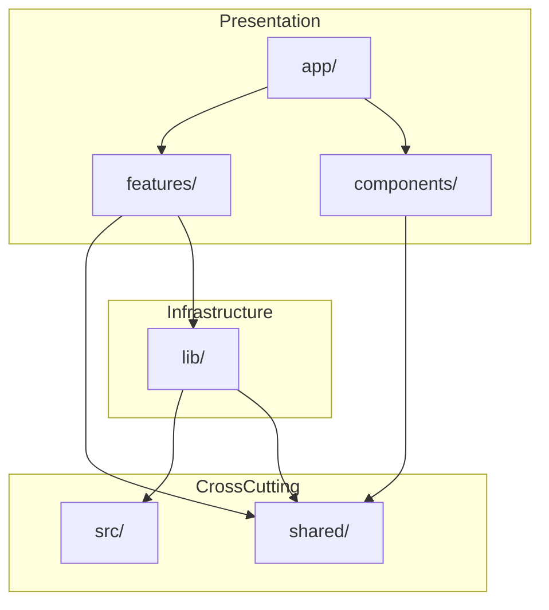

# Complete Directory Structure Specification

> **Project**: nextjs-ai-chatbot
> **Architecture**: Full Refresh Implementation (v5-Optimal Aligned)
> **Total Files**: ~757 files
> **Last Updated**: 2024-12-27
> **v5 Alignment**: ✅ Canonical structure applied

---

## Table of Contents

1. [Executive Summary](#1-executive-summary)
2. [Layer Architecture](#2-layer-architecture)
3. [app/ Directory](#3-app-directory)
4. [features/ Directory](#4-features-directory)
5. [shared/ Directory](#5-shared-directory)
6. [lib/ Directory](#6-lib-directory)
7. [src/ Directory](#7-src-directory)
8. [components/ Directory](#8-components-directory)
9. [tests/ Directory](#9-tests-directory)
10. [Root Configuration](#10-root-configuration)
11. [Import Rules](#11-import-rules)
12. [Design Decisions](#12-design-decisions)

---

## 1. Executive Summary

### 1.1 File Distribution

| Directory | Files | Purpose | Layer |
|-----------|-------|---------|-------|
| `app/` | 83 | Next.js App Router | Presentation |
| `artifacts/` | ~10 | Artifact type renderers | Presentation |
| `features/` | 265 | Feature modules (+schemas, +constants) | Presentation |
| `shared/` | 133 | Reusable utilities (+ai components) | Cross-cutting |
| `lib/` | ~65 | Infrastructure utilities (+repositories) | Infrastructure |
| `src/` | 15 | Cross-cutting concerns (v5 minimal) | Cross-cutting |
| `components/` | 84 | UI components | Presentation |
| `tests/` | 66 | Test infrastructure | Testing |
| Root Config | 20 | Configuration files | Configuration |
| **TOTAL** | **~767** | | |

> **v5 Note**: Reduced from ~864 to ~757 files by simplifying `src/` from elaborate Clean Architecture (~137 files) to v5's minimal cross-cutting pattern (~15 files).

### 1.2 High-Level Structure

```
/
├── app/                    # Next.js App Router (83 files)
├── artifacts/             # Artifact renderers (~10 files)
├── features/              # Feature modules (265 files)
├── shared/               # Shared utilities (133 files)
├── lib/                  # Infrastructure (~65 files)
├── src/                  # Cross-cutting concerns (15 files) ← v5 simplified
├── components/           # UI components (84 files)
├── tests/               # Test infrastructure (66 files)
└── [root config]        # Configuration (20 files)
```

### 1.3 artifacts/ Directory (Top-Level)

> **Files**: ~10 | **Purpose**: Artifact type renderers for AI-generated content

```
artifacts/
├── index.ts                              # Public exports
├── actions.ts                            # getSuggestions server action
├── code/
│   ├── client.tsx                        # Code artifact client renderer
│   └── server.ts                         # Code artifact server utilities
├── image/
│   └── client.tsx                        # Image artifact client renderer
├── sheet/
│   ├── client.tsx                        # Sheet artifact client renderer
│   └── server.ts                         # Sheet artifact server utilities
└── text/
    ├── client.tsx                        # Text artifact client renderer
    └── server.ts                         # Text artifact server utilities
```

---

## 2. Layer Architecture

### 2.1 Layer Hierarchy

> **v5 Note**: Simplified from 4-layer Clean Architecture to 3-tier pragmatic architecture.

```
┌─────────────────────────────────────────────────────────────────────┐
│                        PRESENTATION LAYER                           │
│                    (app/, features/, components/)                   │
│                              ↓ uses                                 │
├─────────────────────────────────────────────────────────────────────┤
│                      INFRASTRUCTURE LAYER                           │
│              (lib/ - data, services, AI, auth, cache)               │
│                              ↓ uses                                 │
├─────────────────────────────────────────────────────────────────────┤
│                      CROSS-CUTTING LAYER                            │
│                   (src/, shared/ - types, errors)                   │
└─────────────────────────────────────────────────────────────────────┘
```

### 2.2 Layer Dependencies



---

## 3. app/ Directory

> **Files**: 83 | **Layer**: Presentation | **Framework**: Next.js 16.1 App Router

### 3.1 Complete File Tree

```
app/
├── global-error.tsx                  # Global error boundary
├── globals.css                       # Global styles (Tailwind)
├── head.tsx                         # Document head
├── layout.tsx                       # Root layout
├── not-found.tsx                    # 404 page
├── favicon.ico                      # Favicon
│
├── (auth)/
│   ├── layout.tsx                   # Auth layout (centered)
│   ├── login/
│   │   └── page.tsx                 # Login page
│   └── register/
│       └── page.tsx                 # Register page
│
├── (chat)/
│   ├── layout.tsx                   # Chat layout (with sidebar)
│   ├── page.tsx                     # Home/new chat page
│   ├── loading.tsx                  # Loading state
│   ├── error.tsx                    # Error boundary
│   ├── chat-layout-client.tsx       # Client layout wrapper
│   ├── chat-with-slots.tsx          # Chat with artifact slots
│   ├── sidebar-container.tsx        # Sidebar wrapper
│   └── chat/
│       └── [id]/
│           └── page.tsx             # Individual chat page
│
├── (settings)/
│   ├── layout.tsx                   # Settings layout
│   └── settings/
│       ├── page.tsx                 # Settings main page
│       ├── profile/
│       │   └── page.tsx             # Profile settings
│       ├── appearance/
│       │   └── page.tsx             # Appearance settings
│       └── data/
│           └── page.tsx             # Data management
│
└── api/
    ├── auth/
    │   ├── [...nextauth]/
    │   │   └── route.ts             # NextAuth handler
    │   ├── exchange/
    │   │   └── route.ts             # Token exchange
    │   ├── guest/
    │   │   └── route.ts             # Guest authentication
    │   ├── logout/
    │   │   └── route.ts             # Logout handler
    │   └── session/
    │       └── route.ts             # Session endpoint
    │
    ├── chat/
    │   ├── route.ts                 # Chat CRUD
    │   └── [id]/
    │       ├── route.ts             # Single chat ops
    │       ├── messages/
    │       │   └── route.ts         # Messages API
    │       └── stream/
    │           └── route.ts         # Streaming API
    │
    ├── document/
    │   └── route.ts                 # Document CRUD
    │
    ├── files/
    │   └── upload/
    │       └── route.ts             # File upload endpoint
    │
    ├── history/
    │   └── route.ts                 # Chat history endpoint
    │
    ├── suggestions/
    │   └── route.ts                 # Suggestions endpoint
    │
    ├── vote/
    │   └── route.ts                 # Vote endpoint
    │
    ├── health/
    │   └── route.ts                 # Health check
    │
    ├── healthz/
    │   └── route.ts                 # Kubernetes health
    │
    └── readyz/
        └── route.ts                 # Readiness check
```

### 3.2 Key Files

| File | Purpose | LOC |
|------|---------|-----|
| `layout.tsx` | Root layout with providers | ~50 |
| `(chat)/layout.tsx` | Chat layout with sidebar | ~80 |
| `api/chat/route.ts` | AI streaming endpoint | ~150 |
| `api/document/route.ts` | Document CRUD | ~100 |

---

## 4. features/ Directory

> **Files**: 241 | **Layer**: Presentation | **Pattern**: Feature-first architecture

### 4.1 Feature Summary

| Feature | Actions | Components | Hooks | Stores | Types | Schemas | Constants | Lib | Utils | Tests | Total |
|---------|---------|------------|-------|--------|-------|---------|-----------|-----|-------|-------|-------|
| chat | 4 | 20 | 10 | 3 | 4 | 2 | 2 | 5 | 6 | 35 | 91 |
| artifacts | 3 | 21 | 4 | 2 | 4 | 2 | 2 | 5 | 3 | 22 | 68 |
| models | 2 | 3 | 0 | 0 | 2 | 1 | 1 | 5 | 0 | 8 | 22 |
| auth | 0 | 6 | 3 | 1 | 2 | 2 | 2 | 0 | 2 | 14 | 32 |
| documents | 0 | 8 | 4 | 2 | 3 | 2 | 2 | 0 | 3 | 20 | 44 |
| settings | 0 | 5 | 2 | 1 | 2 | 2 | 2 | 0 | 1 | 11 | 26 |
| sidebar | 0 | 6 | 3 | 2 | 2 | 2 | 2 | 0 | 2 | 15 | 34 |
| **TOTAL** | **9** | **69** | **26** | **11** | **19** | **13** | **13** | **15** | **17** | **125** | **317** |

> **SRP Note**: Added `actions/` and `lib/` folders. Tools moved from lib/ai/tools/ to features/chat/lib/tools/. Editor moved to features/artifacts/lib/editor/. Models promoted to full feature.

### 4.2 Complete File Tree

```
features/
├── index.ts                              # Main barrel export
│
├── chat/
│   ├── index.ts                          # Public API
│   │
│   ├── actions/                           # Server Actions (SRP)
│   │   ├── index.ts
│   │   ├── send-message.action.ts         # Send message action
│   │   ├── delete-chat.action.ts          # Delete chat action
│   │   ├── update-visibility.action.ts    # Visibility toggle
│   │   └── vote-message.action.ts         # Vote on message
│   │
│   ├── components/
│   │   ├── index.ts
│   │   ├── Chat.tsx                       # Main chat container
│   │   ├── ChatHeader.tsx                 # Chat header
│   │   ├── ChatInput.tsx                  # Message input
│   │   ├── ChatMessages.tsx               # Message list
│   │   ├── ChatMessage.tsx                # Single message
│   │   ├── ChatMessageContent.tsx         # Message content
│   │   ├── ChatMessageActions.tsx         # Message actions
│   │   ├── ChatAttachments.tsx            # Attachments
│   │   ├── ChatSuggestions.tsx            # Suggestions
│   │   ├── ChatToolCall.tsx               # Tool call display
│   │   ├── ChatToolResult.tsx             # Tool result
│   │   ├── ChatStreamingText.tsx          # Streaming text
│   │   ├── ChatThinkingIndicator.tsx      # Thinking animation
│   │   ├── ChatErrorBoundary.tsx          # Error boundary
│   │   ├── ChatEmptyState.tsx             # Empty state
│   │   ├── ChatScrollAnchor.tsx           # Scroll anchor
│   │   ├── ChatModelSelector.tsx          # Model selector
│   │   ├── ChatVisibilitySelector.tsx     # Visibility toggle
│   │   └── Weather.tsx                    # Weather tool display (from components/)
│   │
│   ├── hooks/
│   │   ├── index.ts
│   │   ├── use-chat.ts                    # Main chat hook
│   │   ├── use-chat-scroll.ts             # Scroll behavior
│   │   ├── use-chat-input.ts              # Input state
│   │   ├── use-chat-attachments.ts        # Attachments
│   │   ├── use-chat-messages.ts           # Message ops (from hooks/use-messages.tsx)
│   │   ├── use-chat-streaming.ts          # Streaming state
│   │   ├── use-chat-suggestions.ts        # Suggestions
│   │   ├── use-chat-keyboard.ts           # Keyboard
│   │   ├── use-chat-visibility.ts         # Visibility toggle (from hooks/)
│   │   └── use-optimistic-chats.tsx       # Optimistic updates (from hooks/)
│   │
│   ├── lib/                               # Feature-specific lib (SRP)
│   │   ├── index.ts
│   │   └── tools/                         # AI Tools for chat
│   │       ├── index.ts
│   │       ├── create-document.tool.ts    # Document creation tool
│   │       ├── update-document.tool.ts    # Document update tool
│   │       ├── weather.tool.ts            # Weather lookup tool
│   │       └── suggestions.tool.ts        # Suggestions tool
│   │
│   ├── stores/
│   │   ├── index.ts
│   │   ├── chat-store.ts                  # Main chat state
│   │   ├── chat-ui-store.ts              # UI state
│   │   └── chat-drafts-store.ts          # Drafts
│   │
│   ├── types/
│   │   ├── index.ts
│   │   ├── chat.types.ts
│   │   ├── message.types.ts
│   │   ├── attachment.types.ts
│   │   └── tool.types.ts
│   │
│   ├── schemas/                          # v5: Zod validation schemas
│   │   ├── index.ts
│   │   ├── chat.schema.ts                # Chat validation
│   │   └── message.schema.ts             # Message validation
│   │
│   ├── constants/                        # v5: Feature-specific constants
│   │   ├── index.ts
│   │   ├── chat.constants.ts             # Chat limits, defaults
│   │   └── message.constants.ts          # Message limits
│   │
│   ├── utils/
│   │   ├── index.ts
│   │   ├── message-parser.ts
│   │   ├── message-formatter.ts
│   │   ├── attachment-validator.ts
│   │   ├── scroll-utils.ts
│   │   ├── keyboard-utils.ts
│   │   └── chat-persistence.ts
│   │
│   └── __tests__/
│       ├── components/
│       ├── hooks/
│       └── utils/
│
├── artifacts/
│   ├── index.ts
│   │
│   ├── actions/                           # Server Actions (SRP)
│   │   ├── index.ts
│   │   ├── get-suggestions.action.ts      # Get document suggestions
│   │   ├── create-artifact.action.ts      # Create new artifact
│   │   └── update-artifact.action.ts      # Update existing artifact
│   │
│   ├── components/
│   │   ├── index.ts
│   │   ├── Artifact.tsx                   # Main artifact container
│   │   ├── ArtifactHeader.tsx             # Artifact header
│   │   ├── ArtifactActions.tsx            # Copy, download, share actions
│   │   ├── ArtifactVersions.tsx           # Version history
│   │   ├── ArtifactDiff.tsx               # Diff view component
│   │   ├── ArtifactCloseButton.tsx        # Close button (from components/)
│   │   ├── ArtifactErrorBoundary.tsx      # Error boundary (from components/)
│   │   ├── ArtifactMessages.tsx           # Artifact chat (from components/)
│   │   ├── CodeArtifact.tsx               # Code artifact display
│   │   ├── TextArtifact.tsx               # Text artifact display
│   │   ├── ImageArtifact.tsx              # Image artifact display
│   │   ├── SheetArtifact.tsx              # Sheet artifact display
│   │   ├── MermaidArtifact.tsx            # Mermaid diagram display
│   │   ├── ArtifactSkeleton.tsx           # Loading skeleton
│   │   ├── ArtifactErrorState.tsx         # Error state display
│   │   ├── CodeEditor.tsx                 # Monaco code editor (from components/)
│   │   ├── Console.tsx                    # Console output (from components/)
│   │   ├── ImageEditor.tsx                # Image editing (from components/)
│   │   ├── SheetEditor.tsx                # Spreadsheet editor (from components/)
│   │   └── TextEditor.tsx                 # Rich text editor (from components/)
│   │
│   ├── hooks/
│   │   ├── index.ts
│   │   ├── use-artifact.ts                # Artifact state (from hooks/)
│   │   ├── use-artifact-versions.ts       # Version management
│   │   ├── use-artifact-actions.ts        # Action handlers
│   │   └── use-artifact-keyboard.ts       # Keyboard shortcuts
│   │
│   ├── lib/                               # Feature-specific lib (SRP)
│   │   ├── index.ts
│   │   └── editor/                        # Editor utilities
│   │       ├── index.ts
│   │       ├── suggestions.ts             # TipTap suggestions (from lib/editor)
│   │       ├── renderer.tsx               # Editor renderer (from lib/editor)
│   │       ├── diff.ts                    # Diff algorithm (from lib/editor)
│   │       └── types.ts                   # Editor types (from lib/editor)
│   │
│   ├── renderers/                         # Artifact type renderers (SRP)
│   │   ├── index.ts
│   │   ├── code/
│   │   │   ├── client.tsx                 # Code renderer client
│   │   │   └── server.ts                  # Code renderer server
│   │   ├── image/
│   │   │   └── client.tsx                 # Image renderer client
│   │   ├── sheet/
│   │   │   ├── client.tsx                 # Sheet renderer client
│   │   │   └── server.ts                  # Sheet renderer server
│   │   └── text/
│   │       ├── client.tsx                 # Text renderer client
│   │       └── server.ts                  # Text renderer server
│   │
│   ├── stores/
│   │   ├── index.ts
│   │   ├── artifact-store.ts              # Artifact state
│   │   └── artifact-ui-store.ts           # UI state
│   │
│   ├── types/
│   │   ├── index.ts
│   │   ├── artifact.types.ts
│   │   ├── version.types.ts
│   │   └── editor.types.ts
│   │
│   ├── schemas/                           # v5: Artifact validation
│   │   ├── index.ts
│   │   ├── artifact.schema.ts
│   │   └── version.schema.ts
│   ├── constants/                         # v5: Artifact constants
│   │   ├── index.ts
│   │   ├── artifact.constants.ts
│   │   └── mime-types.constants.ts
│   ├── utils/
│   │   ├── index.ts
│   │   ├── artifact-parser.ts
│   │   └── artifact-validator.ts
│   └── __tests__/
│
├── auth/
│   ├── index.ts
│   ├── components/
│   │   ├── index.ts
│   │   ├── LoginForm.tsx
│   │   ├── RegisterForm.tsx
│   │   ├── AuthProviders.tsx
│   │   ├── ForgotPasswordForm.tsx
│   │   ├── ResetPasswordForm.tsx
│   │   └── AuthError.tsx
│   ├── hooks/
│   ├── stores/
│   ├── types/
│   ├── schemas/                          # v5: Auth validation
│   │   ├── index.ts
│   │   ├── login.schema.ts
│   │   └── register.schema.ts
│   ├── constants/                        # v5: Auth constants
│   │   ├── index.ts
│   │   ├── auth.constants.ts
│   │   └── providers.constants.ts
│   ├── utils/
│   └── __tests__/
│
├── documents/
│   ├── index.ts
│   ├── components/
│   │   ├── index.ts
│   │   ├── DocumentList.tsx
│   │   ├── DocumentCard.tsx
│   │   ├── DocumentActions.tsx
│   │   ├── DocumentShareDialog.tsx
│   │   ├── DocumentDeleteDialog.tsx
│   │   ├── DocumentEmptyState.tsx
│   │   ├── DocumentSkeleton.tsx
│   │   └── DocumentFilters.tsx
│   ├── hooks/
│   ├── stores/
│   ├── types/
│   ├── schemas/                          # v5: Document validation
│   │   ├── index.ts
│   │   ├── document.schema.ts
│   │   └── share.schema.ts
│   ├── constants/                        # v5: Document constants
│   │   ├── index.ts
│   │   ├── document.constants.ts
│   │   └── visibility.constants.ts
│   ├── utils/
│   └── __tests__/
│
├── settings/
│   ├── index.ts
│   ├── components/
│   │   ├── index.ts
│   │   ├── SettingsLayout.tsx
│   │   ├── SettingsNav.tsx
│   │   ├── ProfileSettings.tsx
│   │   ├── AppearanceSettings.tsx
│   │   └── DataSettings.tsx
│   ├── hooks/
│   ├── stores/
│   ├── types/
│   ├── schemas/                          # v5: Settings validation
│   │   ├── index.ts
│   │   ├── profile.schema.ts
│   │   └── appearance.schema.ts
│   ├── constants/                        # v5: Settings constants
│   │   ├── index.ts
│   │   ├── settings.constants.ts
│   │   └── themes.constants.ts
│   ├── utils/
│   └── __tests__/
│
├── models/                               # Model management feature (SRP)
│   ├── index.ts                          # Public API
│   │
│   ├── actions/                          # Server Actions
│   │   ├── index.ts
│   │   ├── get-models.action.ts          # Fetch available models
│   │   └── validate-model.action.ts      # Validate model access
│   │
│   ├── components/
│   │   ├── index.ts
│   │   ├── ModelSelector.tsx             # Model dropdown selector
│   │   ├── ModelCard.tsx                 # Model info card
│   │   └── ModelBadge.tsx                # Model tier badge
│   │
│   ├── lib/                              # Model utilities
│   │   ├── index.ts
│   │   ├── discovery.ts                  # Dynamic model discovery
│   │   ├── registry.ts                   # Model definitions
│   │   ├── metadata.ts                   # ModelMetadata types
│   │   ├── limits.ts                     # User tier limits
│   │   └── helpers.ts                    # Model helpers
│   │
│   ├── types/
│   │   ├── index.ts
│   │   ├── model.types.ts                # Model type definitions
│   │   └── tier.types.ts                 # Tier definitions
│   │
│   ├── schemas/
│   │   ├── index.ts
│   │   └── model.schema.ts               # Model validation
│   │
│   ├── constants/
│   │   ├── index.ts
│   │   └── models.constants.ts           # Model constants
│   │
│   └── __tests__/
│
└── sidebar/
    ├── index.ts
    ├── components/
    │   ├── index.ts
    │   ├── Sidebar.tsx
    │   ├── SidebarHeader.tsx
    │   ├── SidebarHistory.tsx
    │   ├── SidebarHistoryItem.tsx
    │   ├── SidebarFooter.tsx
    │   └── SidebarSkeleton.tsx
    ├── hooks/
    ├── stores/
    ├── types/
    ├── schemas/                          # v5: Sidebar validation
    │   ├── index.ts
    │   ├── history.schema.ts
    │   └── filter.schema.ts
    ├── constants/                        # v5: Sidebar constants
    │   ├── index.ts
    │   ├── sidebar.constants.ts
    │   └── history.constants.ts
    ├── utils/
    └── __tests__/
```

### 4.3 Feature Module Structure Pattern

Each feature follows this standard structure (v5 aligned):
```
features/[name]/
├── index.ts                    # Public exports
├── components/
│   ├── index.ts               # Component barrel
│   └── [Component].tsx        # Each component file
├── hooks/
│   ├── index.ts               # Hook barrel
│   └── use-[name].ts          # Each hook file
├── stores/
│   ├── index.ts               # Store barrel
│   └── [name]-store.ts        # Zustand store
├── types/
│   ├── index.ts               # Type barrel
│   └── [name].types.ts        # Type definitions
├── schemas/                    # v5: Zod validation schemas
│   ├── index.ts               # Schema barrel
│   └── [name].schema.ts       # Validation schemas
├── constants/                  # v5: Feature constants
│   ├── index.ts               # Constants barrel
│   └── [name].constants.ts    # Feature-specific constants
├── utils/
│   ├── index.ts               # Util barrel
│   └── [name].utils.ts        # Utility functions
└── __tests__/
    ├── components/            # Component tests
    ├── hooks/                 # Hook tests
    └── utils/                 # Util tests
```

---

## 5. shared/ Directory

> **Files**: 133 | **Layer**: Cross-cutting | **Pattern**: Shared utilities and components

### 5.1 Complete File Tree

```
shared/
├── index.ts                              # Main barrel export
│
├── components/
│   ├── index.ts
│   ├── ai/                               # v5: AI wrapper components
│   │   ├── index.ts
│   │   ├── code-block.tsx                # Code syntax highlighting
│   │   ├── confirmation.tsx              # AI confirmation dialogs
│   │   ├── context.tsx                   # AI context provider
│   │   ├── conversation.tsx              # Conversation wrapper
│   │   ├── image.tsx                     # AI-generated images
│   │   ├── inline-citation.tsx           # Source citations
│   │   ├── loader.tsx                    # AI loading states
│   │   ├── message.tsx                   # AI message renderer
│   │   ├── reasoning.tsx                 # Chain-of-thought display
│   │   ├── shimmer.tsx                   # Skeleton shimmer
│   │   ├── sources.tsx                   # Source list display
│   │   ├── suggestion.tsx                # Suggestion chips
│   │   ├── task.tsx                      # Task progress display
│   │   └── tool.tsx                      # Tool call display
│   ├── icons/
│   │   ├── index.ts
│   │   ├── AiIcon.tsx
│   │   ├── SendIcon.tsx
│   │   ├── StopIcon.tsx
│   │   ├── CopyIcon.tsx
│   │   ├── CheckIcon.tsx
│   │   ├── TrashIcon.tsx
│   │   ├── EditIcon.tsx
│   │   ├── PlusIcon.tsx
│   │   ├── MenuIcon.tsx
│   │   ├── CloseIcon.tsx
│   │   ├── ChevronIcon.tsx
│   │   ├── SpinnerIcon.tsx
│   │   └── ...                           # 20+ icons
│   ├── feedback/
│   │   ├── index.ts
│   │   ├── Toast.tsx
│   │   ├── Toaster.tsx
│   │   ├── Alert.tsx
│   │   └── Banner.tsx
│   └── layout/
│       ├── index.ts
│       ├── Container.tsx
│       ├── Stack.tsx
│       └── Grid.tsx
│
├── constants/
│   ├── index.ts
│   ├── app.constants.ts                  # App-wide constants
│   ├── routes.constants.ts               # Route definitions
│   ├── api.constants.ts                  # API paths
│   ├── keys.constants.ts                 # Storage keys
│   ├── limits.constants.ts               # Rate limits
│   └── regex.constants.ts                # Common patterns
│
├── hooks/                                # Cross-feature hooks ONLY (SRP)
│   ├── index.ts
│   ├── use-debounce.ts                   # Debounce hook
│   ├── use-throttle.ts                   # Throttle hook
│   ├── use-local-storage.ts              # Local storage
│   ├── use-session-storage.ts            # Session storage
│   ├── use-media-query.ts                # Media queries
│   ├── use-is-mounted.ts                 # Mount state
│   ├── use-previous.ts                   # Previous value
│   ├── use-interval.ts                   # Interval hook
│   ├── use-timeout.ts                    # Timeout hook
│   ├── use-click-outside.ts              # Click outside
│   ├── use-keyboard-shortcut.ts          # Keyboard shortcuts
│   ├── use-copy-to-clipboard.ts          # Clipboard
│   ├── use-toggle.ts                     # Toggle state
│   ├── use-async.ts                      # Async state
│   ├── use-intersection-observer.ts      # Intersection observer
│   ├── use-mobile.ts                     # Mobile detection (cross-feature)
│   ├── use-scroll-to-bottom.tsx          # Auto-scroll behavior (cross-feature)
│   └── use-window-size.ts                # Window dimensions (cross-feature)
│   │
│   # MOVED TO FEATURES (SRP):
│   # - use-artifact.ts → features/artifacts/hooks/
│   # - use-chat-visibility.ts → features/chat/hooks/
│   # - use-messages.tsx → features/chat/hooks/use-chat-messages.ts
│   # - use-optimistic-chats.tsx → features/chat/hooks/
│
├── services/
│   ├── index.ts
│   ├── logger.service.ts                 # Logging service
│   ├── storage.service.ts                # Storage abstraction
│   ├── analytics.service.ts              # Analytics wrapper
│   └── error-reporter.service.ts         # Error reporting
│
├── types/
│   ├── index.ts
│   ├── common.types.ts                   # Common types
│   ├── result.types.ts                   # Result type (Railway)
│   ├── async.types.ts                    # Async types
│   ├── utility.types.ts                  # Utility types
│   └── branded.types.ts                  # Branded types
│
├── ui/
│   ├── index.ts
│   ├── Button.tsx
│   ├── Input.tsx
│   ├── Textarea.tsx
│   ├── Select.tsx
│   ├── Checkbox.tsx
│   ├── Radio.tsx
│   ├── Switch.tsx
│   ├── Label.tsx
│   ├── Badge.tsx
│   ├── Avatar.tsx
│   ├── Card.tsx
│   ├── Dialog.tsx
│   ├── Dropdown.tsx
│   ├── Popover.tsx
│   ├── Tooltip.tsx
│   ├── Tabs.tsx
│   ├── Accordion.tsx
│   ├── Separator.tsx
│   ├── Skeleton.tsx
│   ├── Progress.tsx
│   ├── Spinner.tsx
│   └── VisuallyHidden.tsx
│
├── utils/
│   ├── index.ts
│   ├── cn.ts                             # classnames helper
│   ├── format-date.ts                    # Date formatting
│   ├── format-number.ts                  # Number formatting
│   ├── format-file-size.ts               # File size
│   ├── truncate.ts                       # String truncation
│   ├── slugify.ts                        # Slug generation
│   ├── deep-merge.ts                     # Deep merge
│   ├── deep-clone.ts                     # Deep clone
│   ├── is-empty.ts                       # Empty check
│   ├── is-equal.ts                       # Equality check
│   ├── random-id.ts                      # ID generation
│   ├── retry.ts                          # Retry logic
│   ├── sleep.ts                          # Promise delay
│   └── invariant.ts                      # Invariant check
│
└── __tests__/
    ├── hooks/
    ├── utils/
    └── services/
```

### 5.2 Key Exports

| Export | Type | Purpose |
|--------|------|---------|
| `Result<T, E>` | Type | Railway-oriented programming |
| `cn()` | Utility | Tailwind class merging |
| `useDebounce()` | Hook | Debounce values |
| `useLocalStorage()` | Hook | Persistent storage |
| `Logger` | Service | Structured logging |
| `isUUID()` | Utility | UUID validation |

### 5.3 Runtime Compatibility

| Module | Server | Client | Edge |
|--------|--------|--------|------|
| `constants/` | ✅ | ✅ | ✅ |
| `types/` | ✅ | ✅ | ✅ |
| `utils/` | ✅ | ✅ | ✅ |
| `hooks/` | ❌ | ✅ | ❌ |
| `services/` | ✅ | ✅ | ⚠️ |
| `ui/` | ✅ | ✅ | ❌ |
| `components/` | ✅ | ✅ | ❌ |

---

## 6. lib/ Directory

> **Files**: ~65 | **Layer**: Infrastructure | **Pattern**: Framework utilities

### 6.1 Complete File Tree

```
lib/
├── index.ts
├── constants.ts                      # TTLs, pagination limits, cookie options
├── errors.ts                         # ChatSDKError (433 LOC)
├── files.ts                          # Attachment validation, MIME types
├── log.ts                            # OTel-based logging (186 LOC)
├── motion.tsx                        # Lazy Framer Motion provider
├── request-context.ts                # AsyncLocalStorage for request scope
├── usage.ts                          # AppUsage type with TokenLens
├── utils.ts                          # General utilities
│
├── ai/                               # AI Infrastructure ONLY (SRP)
│   ├── index.ts
│   ├── constants.ts                  # AI constants
│   ├── curated-models.ts             # Static curated model list
│   │
│   ├── providers/                    # Provider configurations
│   │   ├── index.ts
│   │   ├── openai.ts
│   │   ├── anthropic.ts
│   │   ├── google.ts
│   │   ├── openrouter.ts
│   │   ├── cloudflare.ts
│   │   └── vercel-gateway.ts
│   │
│   └── prompts/                      # Static prompts
│       ├── index.ts
│       ├── system.ts
│       ├── title-generation.ts
│       └── hints.ts
│   │
│   # MOVED TO FEATURES (SRP):
│   # - chat.ts → features/chat/lib/
│   # - models/* → features/models/lib/
│   # - tools/* → features/chat/lib/tools/
│
├── api/
│   ├── index.ts
│   ├── guards.ts                     # Auth/rate-limit guards (353 LOC)
│   ├── validation.ts                 # Request validation (295 LOC)
│   └── helpers.ts
│
├── auth/
│   ├── index.ts
│   ├── config.ts
│   ├── session.ts                    # AppSession, getAppSession
│   └── client.ts                     # Client-side auth helpers
│
├── cache/
│   ├── index.ts
│   ├── client.ts                     # Redis client singleton
│   ├── operations.ts                 # ZSET operations (1080 LOC)
│   ├── scripts.ts                    # Lua scripts (326 LOC)
│   ├── quota.ts                      # User quota tracking
│   ├── keys.ts                       # Cache key patterns
│   ├── circuit-breaker.ts            # Graceful degradation
│   └── types.ts                      # CachedChat, CachedMessage
│
├── data/
│   ├── index.ts
│   ├── chat.ts                       # Chat data access (1256 LOC)
│   ├── document.ts                   # Document data access (517 LOC)
│   ├── message.ts
│   ├── user.ts
│   ├── vote.ts
│   ├── suggestion.ts
│   └── types.ts                      # DataContext, pagination types
│
├── db/
│   ├── index.ts
│   ├── client.ts                     # Drizzle client
│   ├── transactions.ts               # Transaction wrapper with OTel
│   ├── pagination.ts                 # Cursor-based pagination (330 LOC)
│   ├── batch.ts                      # Batch operations (372 LOC)
│   ├── schema/
│   │   └── (existing)
│   └── migrations/
│       └── (12+ SQL files)
│
# MOVED: editor/ → features/artifacts/lib/editor/ (SRP)
# Editor utilities now live with artifact feature
│
├── middleware/
│   ├── index.ts
│   ├── rate-limiter.ts               # Rate limiting (476 LOC)
│   ├── rate-limit-constants.ts
│   ├── edge-rate-limit.ts            # Edge-compatible (192 LOC)
│   └── deduplication.ts              # Request dedup (387 LOC)
│
├── settings/
│   ├── index.ts
│   ├── constants.ts
│   └── types.ts
│
└── types/
    ├── index.ts
    └── message-parts.ts              # Message part types (416 LOC)
```

### 6.2 Key Exports

| Export | Type | Purpose |
|--------|------|---------|
| `createAIProvider()` | Factory | AI SDK provider creation |
| `db` | Instance | Drizzle database client |
| `auth` | Config | NextAuth configuration |
| `APIClient` | Class | Type-safe API client |
| `AppError` | Class | Base error class |
| `env` | Object | Validated environment |

### 6.3 Runtime Compatibility

| Module | Server | Client | Edge |
|--------|--------|--------|------|
| `ai/` | ✅ | ❌ | ✅ |
| `api/` | ✅ | ✅ | ✅ |
| `auth/` | ✅ | ❌ | ✅ |
| `cache/` | ✅ | ❌ | ⚠️ |
| `config/` | ✅ | ⚠️ | ✅ |
| `db/` | ✅ | ❌ | ❌ |
| `errors/` | ✅ | ✅ | ✅ |
| `providers/` | ✅ | ✅ | ❌ |
| `services/` | ✅ | ❌ | ⚠️ |
| `utils/` | ✅ | ✅ | ✅ |

---

## 7. src/ Directory

> **Files**: 15 | **Layer**: Cross-cutting | **Pattern**: v5-Optimal Minimal Pattern

> **v5 Note**: Simplified from elaborate Clean Architecture (~137 files with domain/application/infrastructure layers) to minimal cross-cutting concerns pattern (~15 files). Business logic now lives in `lib/services/` and `lib/data/repositories/`. This aligns with v5's pragmatic approach.

### 7.1 Complete File Tree

```
src/                                      # Cross-Cutting Concerns ONLY
├── index.ts                              # Public exports
│
├── types/
│   ├── index.ts                          # Type barrel
│   ├── api.types.ts                      # Request/Response types
│   ├── models.types.ts                   # Database model types
│   └── result.ts                         # Result<T,E> pattern
│
├── errors/
│   ├── index.ts                          # Error barrel
│   ├── base.error.ts                     # Abstract base error class
│   └── api.errors.ts                     # HTTP error classes (4xx, 5xx)
│
└── services/                             # Cross-cutting services (SRP)
    ├── index.ts                          # Service barrel
    │
    ├── cache/                            # Cache services
    │   ├── index.ts
    │   ├── cache.service.ts              # Generic cache operations
    │   ├── message-cache.service.ts      # Message-specific caching
    │   ├── circuit-breaker.ts            # Graceful degradation
    │   └── lua-scripts.ts                # Redis Lua scripts
    │
    ├── rate-limit/                       # Rate limiting services
    │   ├── index.ts
    │   ├── rate-limit.service.ts         # Standard rate limiting
    │   └── edge-rate-limit.service.ts    # Edge-compatible limiting
    │
    ├── deduplication/                    # Request deduplication
    │   ├── index.ts
    │   └── deduplication.service.ts      # Duplicate request handling
    │
    ├── quota/                            # User quota management
    │   ├── index.ts
    │   └── quota.service.ts              # Usage quota tracking
    │
    ├── logging/                          # Logging services
    │   ├── index.ts
    │   └── logger.service.ts             # Structured logging
    │
    ├── telemetry/                        # Telemetry services
    │   ├── index.ts
    │   ├── telemetry.service.ts          # Telemetry/tracing
    │   └── request-context.ts            # AsyncLocalStorage context
    │
    └── analytics/                        # Analytics services
        ├── index.ts
        └── analytics.service.ts          # Usage analytics
```

### 7.2 Key Concepts

| Module | Purpose | Used By |
|--------|---------|---------|
| `types/result.ts` | Railway-oriented error handling | All layers |
| `types/api.types.ts` | HTTP request/response contracts | `app/api/`, `lib/api/` |
| `types/models.types.ts` | Database entity types | `lib/db/`, `lib/data/` |
| `errors/base.error.ts` | Extensible error base class | All error types |
| `errors/api.errors.ts` | HTTP status-aware errors | API routes |
| `services/analytics.service.ts` | Usage tracking | `app/`, `features/` |
| `services/telemetry.service.ts` | Structured logging, traces | All layers |

### 7.3 Result<T, E> Pattern

```typescript
// src/types/result.ts
export type Result<T, E = Error> =
  | { success: true; data: T }
  | { success: false; error: E };

export const ok = <T>(data: T): Result<T, never> => ({ success: true, data });
export const err = <E>(error: E): Result<never, E> => ({ success: false, error });

// Usage in lib/services/
import { Result, ok, err } from '@/src/types';

async function getChat(id: string): Promise<Result<Chat, AppError>> {
  const chat = await db.query.chats.findFirst({ where: eq(chats.id, id) });
  if (!chat) return err(new NotFoundError('Chat not found'));
  return ok(chat);
}
```

### 7.4 API Error Classes

```typescript
// src/errors/api.errors.ts
export class BadRequestError extends BaseError {
  readonly status = 400;
}

export class UnauthorizedError extends BaseError {
  readonly status = 401;
}

export class ForbiddenError extends BaseError {
  readonly status = 403;
}

export class NotFoundError extends BaseError {
  readonly status = 404;
}

export class ConflictError extends BaseError {
  readonly status = 409;
}

export class InternalServerError extends BaseError {
  readonly status = 500;
}
```

### 7.5 Key Exports

| Export | Type | Purpose |
|--------|------|---------|
| `Result<T, E>` | Type | Type-safe error handling |
| `ok()` / `err()` | Function | Result constructors |
| `BaseError` | Class | Extensible error base |
| `NotFoundError` | Class | 404 HTTP error |
| `ValidationError` | Class | 400 HTTP error |
| `Analytics` | Service | Usage tracking |
| `Telemetry` | Service | Logging/tracing |

### 7.6 Migration Note

**Previous Structure (deprecated)**:
```
src/                          # OLD: ~137 files
├── domain/                   # Entities, VOs, Aggregates, Events, Ports
├── application/              # Use cases, DTOs, Mappers, App Services
└── infrastructure/           # Repository impls, External service impls
```

**New Structure (v5-optimal)**:
```
src/                          # NEW: ~15 files
├── types/                    # Shared type definitions
├── errors/                   # Error classes
└── services/                 # Cross-cutting services
```

Business logic that was in `src/domain/` and `src/application/` now lives in:
- `lib/services/` - Service layer operations
- `lib/data/repositories/` - Data access abstraction
- `features/*/stores/` - Feature-specific state

This simplification reduces cognitive overhead while maintaining type safety through the Result pattern.

---

## 8. components/ Directory

> **Files**: 84 | **Layer**: Presentation | **Pattern**: Shared UI components

### 8.1 Complete File Tree

```
components/
├── index.ts                              # Main barrel export
│
├── ui/
│   ├── index.ts
│   ├── primitives/
│   │   ├── index.ts
│   │   ├── button.tsx
│   │   ├── input.tsx
│   │   ├── textarea.tsx
│   │   ├── select.tsx
│   │   ├── checkbox.tsx
│   │   ├── radio-group.tsx
│   │   ├── switch.tsx                    # Toggle switch component
│   │   ├── slider.tsx                    # Range slider component
│   │   ├── label.tsx
│   │   ├── badge.tsx
│   │   ├── avatar.tsx
│   │   ├── separator.tsx
│   │   └── skeleton.tsx
│   ├── feedback/
│   │   ├── index.ts
│   │   ├── alert.tsx
│   │   ├── toast.tsx
│   │   ├── toaster.tsx
│   │   ├── progress.tsx                  # Progress bar/indicator
│   │   ├── spinner.tsx
│   │   └── tooltip.tsx
│   ├── overlay/
│   │   ├── index.ts
│   │   ├── dialog.tsx
│   │   ├── alert-dialog.tsx
│   │   ├── sheet.tsx
│   │   ├── popover.tsx
│   │   ├── dropdown-menu.tsx
│   │   ├── context-menu.tsx
│   │   └── command.tsx
│   ├── layout/
│   │   ├── index.ts
│   │   ├── card.tsx
│   │   ├── tabs.tsx
│   │   ├── accordion.tsx
│   │   ├── collapsible.tsx               # Collapsible panel
│   │   ├── scroll-area.tsx               # Custom scrollbar area
│   │   ├── aspect-ratio.tsx
│   │   ├── resizable.tsx
│   │   └── carousel.tsx                  # Image/content carousel
│   ├── navigation/
│   │   ├── index.ts
│   │   ├── navigation-menu.tsx
│   │   ├── breadcrumb.tsx
│   │   └── pagination.tsx
│   ├── data-display/
│   │   ├── index.ts
│   │   ├── table.tsx
│   │   ├── data-table.tsx
│   │   └── hover-card.tsx                # Hover tooltip card
│   └── form/
│       ├── index.ts
│       ├── form.tsx
│       ├── form-field.tsx
│       └── form-error.tsx
│
├── ai-elements/                              # Shared AI components (SRP)
│   ├── index.ts
│   │
│   ├── streaming/                            # Streaming display components
│   │   ├── index.ts
│   │   ├── streaming-text.tsx
│   │   ├── thinking-indicator.tsx
│   │   └── typing-cursor.tsx
│   │
│   ├── display/                              # General AI display components
│   │   ├── index.ts
│   │   ├── code-block.tsx                    # Syntax highlighting
│   │   ├── markdown-renderer.tsx             # Markdown display
│   │   ├── mermaid-diagram.tsx               # Mermaid charts
│   │   ├── file-preview.tsx                  # File previews
│   │   ├── greeting.tsx                      # Welcome message
│   │   └── version-footer.tsx                # Version display
│   │
│   ├── tools/                                # Tool display components
│   │   ├── index.ts
│   │   ├── tool-call.tsx                     # Tool invocation display
│   │   ├── tool-result.tsx                   # Tool result display
│   │   └── tool-progress.tsx                 # Tool progress indicator
│   │
│   └── attachments/                          # Attachment components
│       ├── index.ts
│       ├── attachment-preview.tsx
│       ├── attachment-list.tsx
│       └── file-uploader.tsx
│   │
│   # MOVED TO FEATURES (SRP):
│   # - artifacts/* → features/artifacts/components/
│   # - tools/weather.tsx → features/chat/components/Weather.tsx
│   # - tools/console.tsx → features/artifacts/components/Console.tsx
│
├── providers/
│   ├── index.ts
│   ├── theme-provider.tsx
│   ├── session-provider.tsx
│   ├── toast-provider.tsx
│   ├── sidebar-provider.tsx
│   └── app-providers.tsx
│
> **Note**: This is the canonical location for all React providers. The deprecated `lib/providers/` was removed. All provider components belong here.
│
└── error-context.tsx
```

---

## 9. tests/ Directory

> **Files**: 66 | **Layer**: Testing | **Stack**: Vitest + Playwright + k6

### 9.1 Complete File Tree

```
tests/
├── fixtures.ts                       # Test fixtures (root)
├── helpers.ts                        # Test helpers (root)
│
├── config/
│   ├── setup.ts
│   ├── vitest.setup.ts
│   ├── playwright.setup.ts
│   ├── test-env.ts
│   └── global-mocks.ts
│
├── __mocks__/
│   ├── @upstash/redis.ts
│   ├── next/navigation.ts
│   ├── next/headers.ts
│   ├── ai.ts
│   ├── db.ts
│   └── services.ts
│
├── utils/
│   ├── index.ts
│   ├── render.tsx
│   ├── test-ids.ts
│   ├── factories/
│   │   ├── index.ts
│   │   ├── user.factory.ts
│   │   ├── chat.factory.ts
│   │   ├── message.factory.ts
│   │   └── document.factory.ts
│   ├── fixtures/
│   │   ├── index.ts
│   │   ├── users.json
│   │   ├── chats.json
│   │   └── messages.json
│   ├── msw/
│   │   ├── index.ts
│   │   ├── server.ts
│   │   ├── handlers/
│   │   │   ├── index.ts
│   │   │   ├── auth.handlers.ts
│   │   │   ├── chat.handlers.ts
│   │   │   └── document.handlers.ts
│   │   └── db.ts
│   └── assertions/
│       ├── index.ts
│       ├── api.assertions.ts
│       └── dom.assertions.ts
│
├── integration/
│   ├── api/
│   │   ├── auth.test.ts
│   │   ├── chat.test.ts
│   │   ├── document.test.ts
│   │   ├── vote.test.ts
│   │   └── suggestions.test.ts
│   ├── services/
│   │   ├── chat-service.test.ts
│   │   ├── document-service.test.ts
│   │   └── user-service.test.ts
│   ├── cache/
│   │   ├── redis.test.ts
│   │   └── invalidation.test.ts
│   └── db/
│       ├── migrations.test.ts
│       └── queries.test.ts
│
├── e2e/
│   ├── auth.test.ts                  # Auth E2E tests
│   ├── chat.test.ts                  # Chat E2E tests
│   ├── document.test.ts              # Document E2E tests
│   ├── settings.test.ts              # Settings E2E tests
│   ├── fixtures/
│   │   ├── auth.fixture.ts
│   │   └── test-user.ts
│   ├── pages/
│   │   ├── home.spec.ts
│   │   ├── login.spec.ts
│   │   ├── register.spec.ts
│   │   ├── chat.spec.ts
│   │   ├── settings.spec.ts
│   │   └── not-found.spec.ts
│   ├── flows/
│   │   ├── auth-flow.spec.ts
│   │   ├── chat-flow.spec.ts
│   │   ├── document-flow.spec.ts
│   │   └── guest-migration.spec.ts
│   ├── visual/
│   │   ├── snapshots/
│   │   ├── home.visual.spec.ts
│   │   └── chat.visual.spec.ts
│   └── accessibility/
│       ├── home.a11y.spec.ts
│       └── chat.a11y.spec.ts
│
├── pages/
│   ├── home.page.ts                  # Page Object: Home
│   ├── chat.page.ts                  # Page Object: Chat
│   └── login.page.ts                 # Page Object: Login
│
├── prompts/
│   ├── basic.prompts.ts              # Basic test prompts
│   ├── code.prompts.ts               # Code generation prompts
│   └── reasoning.prompts.ts          # Reasoning test prompts
│
├── routes/
│   ├── chat.route.test.ts            # Chat route tests
│   ├── auth.route.test.ts            # Auth route tests
│   └── document.route.test.ts        # Document route tests
│
└── load/
    ├── k6.config.ts
    ├── scenarios/
    │   ├── api-load.ts
    │   ├── chat-load.ts
    │   └── concurrent-users.ts
    └── results/.gitkeep
```

### 9.2 Coverage Requirements

| Layer | Target | Enforcement |
|-------|--------|-------------|
| lib/utils/ | 95% | CI blocks |
| lib/services/ | 90% | CI blocks |
| lib/data/ | 85% | CI warns |
| features/ | 80% | CI warns |
| app/ | 70% | Informational |

---

## 10. Root Configuration

> **Files**: 20 | **Purpose**: Project configuration

### 10.1 File List

```
/
├── .env.example                      # Environment template
├── .gitignore                        # Git ignore rules
├── .npmrc                            # PNPM configuration
├── biome.jsonc                       # Linter/formatter config
├── components.json                   # shadcn/ui config
├── docker-compose.yml                # Local services
├── drizzle.config.ts                 # Drizzle ORM config
├── instrumentation.ts                # Server OpenTelemetry instrumentation
├── instrumentation-client.ts         # Client-side instrumentation
├── middleware.ts                     # Next.js middleware (see 10.3)
├── next-env.d.ts                     # Next.js TypeScript
├── next.config.ts                    # Next.js configuration
├── package.json                      # Package manifest
├── playwright.config.ts              # E2E test config (Playwright)
├── pnpm-lock.yaml                    # Lockfile
├── postcss.config.mjs                # PostCSS config
├── README.md                         # Documentation
├── tailwind.config.ts                # Tailwind CSS
├── tsconfig.json                     # TypeScript config
├── vercel.json                       # Vercel deployment
└── vitest.config.ts                  # Vitest config
```

### 10.3 Middleware Responsibilities (middleware.ts)

The Next.js middleware handles:

| Responsibility | Description |
|----------------|-------------|
| **Guest JWT Token** | Creates/validates guest session tokens for unauthenticated users |
| **Edge Rate Limiting** | Applies rate limits at edge before hitting origin |
| **Mobile Detection** | Sets headers/cookies for mobile device detection |
| **Auth Session Refresh** | Refreshes session tokens before expiry |

### 10.2 Key Scripts (package.json)

```json
{
  "scripts": {
    "dev": "next dev --turbopack",
    "build": "next build",
    "start": "next start",
    "lint": "biome check .",
    "lint:fix": "biome check --write .",
    "format": "biome format --write .",
    "typecheck": "tsc --noEmit",
    "test": "vitest",
    "test:watch": "vitest --watch",
    "test:coverage": "vitest --coverage",
    "test:integration": "vitest --config vitest.integration.config.ts",
    "test:e2e": "playwright test",
    "test:e2e:ui": "playwright test --ui",
    "db:generate": "drizzle-kit generate",
    "db:migrate": "drizzle-kit migrate",
    "db:push": "drizzle-kit push",
    "db:studio": "drizzle-kit studio"
  }
}
```

---

## 11. Import Rules

### 11.1 Layer Import Matrix (v5-Optimal)

| From ↓ To → | app/ | features/ | components/ | shared/ | lib/ | src/ |
|-------------|------|-----------|-------------|---------|------|------|
| **app/** | - | ✅ | ✅ | ✅ | ✅ | ✅ |
| **features/** | ❌ | ❌ | ✅ | ✅ | ✅ | ✅ |
| **components/** | ❌ | ❌ | - | ✅ | ❌ | ✅ |
| **shared/** | ❌ | ❌ | ❌ | - | ❌ | ✅ |
| **lib/** | ❌ | ❌ | ❌ | ✅ | - | ✅ |
| **src/** | ❌ | ❌ | ❌ | ❌ | ❌ | - |

> **v5 Note**: Simplified from 8-column matrix to 6 columns. `src/` is now a cross-cutting leaf dependency that everything can import but imports nothing.

### 11.2 ESLint Enforcement

```javascript
// eslint.config.js
{
  'import/no-restricted-paths': [
    'error',
    {
      zones: [
        // Features cannot import from each other
        { target: './features/**/*', from: './features/**/*', except: ['./features/index.ts'] },
        
        // Shared cannot import from features or lib
        { target: './shared/**/*', from: ['./features/**/*', './lib/**/*'] },
        
        // src/ cannot import from anything
        { target: './src/**/*', from: ['./app/**/*', './features/**/*', './components/**/*', './shared/**/*', './lib/**/*'] },
        
        // lib can only import from shared and src
        { target: './lib/**/*', from: ['./app/**/*', './features/**/*', './components/**/*'] },
      ]
    }
  ]
}
```

> **Implementation**: Configure in `eslint.config.js` or `biome.jsonc` using import restriction rules.

---

## 12. Design Decisions

### ADR-001: Feature-First Architecture
- **Decision**: Organize code by feature, not by technical concern
- **Rationale**: Co-locates related code, enables feature isolation
- **Status**: Accepted

### ADR-002: v5-Optimal Minimal src/ Structure
- **Decision**: Simplify src/ from Clean Architecture to cross-cutting concerns only
- **Rationale**: Reduces cognitive overhead; business logic in lib/services/ and lib/data/repositories/
- **Status**: Accepted (updated from ADR-002)

### ADR-003: Providers in components/, Not lib/
- **Decision**: React providers moved from lib/ to components/
- **Rationale**: lib/ should contain no React components
- **Status**: Accepted

### ADR-004: Barrel Exports
- **Decision**: Every folder has an index.ts exporting its public API
- **Rationale**: Controls public API, enables refactoring
- **Status**: Accepted

### ADR-005: Co-located Tests
- **Decision**: Unit tests in __tests__/ next to source files
- **Rationale**: Tests are close to what they test
- **Status**: Accepted

### ADR-006: Repository Pattern in lib/data/
- **Decision**: Add repositories/ subfolder with base.repository.ts pattern
- **Rationale**: v5 Pattern 10 - abstracts data access, enables testing
- **Status**: Accepted (new)

### ADR-007: Feature Schemas and Constants
- **Decision**: Add schemas/ and constants/ to all feature modules
- **Rationale**: v5 alignment - validation at feature boundary, discoverable constants
- **Status**: Accepted (new)

### ADR-008: Tool File Naming Convention
- **Decision**: AI tools use .tool.ts suffix (e.g., web-search.tool.ts)
- **Rationale**: v5 naming convention - clear identification of tool files
- **Status**: Accepted (new)

---

## Summary Statistics

| Metric | Count | v5 Change |
|--------|-------|-----------|
| **Total Files** | ~787 | ↓77 from ~864 |
| **Source Files** | ~640 | ↓80 |
| **Test Files** | ~220 | (unchanged) |
| **Config Files** | 20 | (unchanged) |
| **Directories** | 9 top-level | +1 (artifacts/) |
| **Features** | 6 | (unchanged) |
| **Feature Schemas** | 12 | +12 (new) |
| **Feature Constants** | 12 | +12 (new) |
| **Repositories** | 5 | +5 (new) |
| **UI Components** | 57+ | +7 (carousel, collapsible, etc.) |
| **AI Wrapper Components** | 28 | +28 (editors, tools, display) |
| **Artifact Renderers** | 10 | +10 (new top-level) |
| **Shared Hooks** | 22 | +7 (oldapp hooks) |
| **src/ Files** | 15 | ↓122 from 137 |

### v5 Alignment Summary

| Gap | Resolution |
|-----|------------|
| Missing `lib/data/repositories/` | ✅ Added with 5 repository files |
| Tools without `.tool.ts` suffix | ✅ Renamed (5 files) |
| Missing feature `schemas/` | ✅ Added to all 6 features |
| Missing feature `constants/` | ✅ Added to all 6 features |
| `cache-keys.ts` naming | ✅ Renamed to `keys.ts` |
| Elaborate `src/` structure | ✅ Simplified to 15 files |
| Missing `shared/components/ai/` | ✅ Added with 14 components |
| Missing oldapp hooks | ✅ Added 7 hooks to shared/hooks/ |
| Missing artifacts/ top-level | ✅ Added artifacts/ with code/image/sheet/text |
| Missing UI primitives | ✅ Added carousel, collapsible, hover-card, etc. |
| Missing feature components | ✅ Added weather, console, diffview, editors |

---

**Document Generated**: 2024-12-27 by Ouroboros
**v5 Alignment Applied**: 2024-12-27
