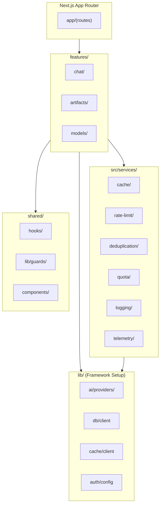
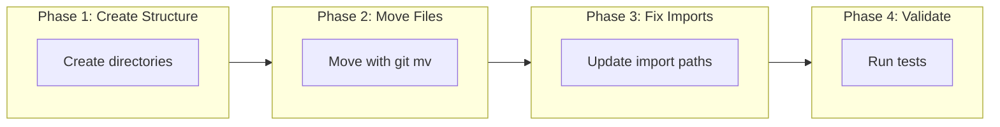

# Design: v5 SRP-Compliant Architecture Refactor

> **Phase**: 3/5 - Design  
> **Input**: [architecture-v5-optimal.md](./architecture-v5-optimal.md), [COMPLETE-DIRECTORY-STRUCTURE.md](./COMPLETE-DIRECTORY-STRUCTURE.md)  
> **Created**: 2024-12-28  
> **Status**: 🟢 Approved

---

## Overview

This design defines the **corrected architecture** that strictly follows v5 SRP (Single Responsibility Principle) rules. It addresses **27 items requiring relocation** from the current structure to achieve proper separation of concerns.

### Design Principles

1. **lib/ = Framework Setup ONLY** — Client initialization, provider configs, static constants/templates. NO business logic.
2. **features/ = Business Logic** — All orchestration code, feature-specific components/hooks/utilities
3. **src/services/ = Cross-Cutting Services** — Services with significant logic used by multiple features
4. **shared/ = Cross-Feature Utilities** — Generic hooks, guards, SDK wrappers

---

## Architecture

### System Diagram



### Component Overview

| Component | Responsibility | Location | Covers |
|-----------|---------------|----------|--------|
| features/chat | Chat business logic, components, tools | `features/chat/` | Chat functionality |
| features/artifacts | Artifact editing, rendering, storage | `features/artifacts/` | Document editing |
| features/models | Model discovery, registry, refresh | `features/models/` | AI model management |
| src/services | Cross-cutting infrastructure | `src/services/` | Caching, rate limiting, etc. |
| lib | Framework initialization only | `lib/` | Provider setup, clients |
| shared | Reusable utilities | `shared/` | Generic hooks, guards |

---

## Corrected Directory Structure

### 1. features/chat/ (NEW)

```
features/
└── chat/
    ├── actions/
    │   ├── chat-completion.action.ts    # FROM: lib/ai/chat.ts (291 LOC)
    │   ├── send-message.action.ts
    │   └── stream-response.action.ts
    ├── components/
    │   ├── chat.tsx                     # FROM: components/chat.tsx
    │   ├── chat-header.tsx              # FROM: components/chat-header.tsx
    │   ├── greeting.tsx                 # FROM: components/greeting.tsx
    │   ├── message.tsx                  # FROM: components/message.tsx
    │   ├── message-actions.tsx          # FROM: components/message-actions.tsx
    │   ├── message-editor.tsx           # FROM: components/message-editor.tsx
    │   ├── message-reasoning.tsx        # FROM: components/message-reasoning.tsx
    │   ├── messages.tsx                 # FROM: components/messages.tsx
    │   ├── multimodal-input.tsx         # FROM: components/multimodal-input.tsx
    │   ├── submit-button.tsx            # FROM: components/submit-button.tsx
    │   ├── suggested-actions.tsx        # FROM: components/suggested-actions.tsx
    │   ├── toolbar.tsx                  # FROM: components/toolbar.tsx
    │   └── weather.tsx                  # FROM: components/weather.tsx (467 LOC)
    ├── hooks/
    │   ├── use-messages.tsx             # FROM: hooks/use-messages.tsx
    │   ├── use-optimistic-chats.tsx     # FROM: hooks/use-optimistic-chats.tsx
    │   └── use-chat-visibility.ts       # FROM: hooks/use-chat-visibility.ts
    ├── lib/
    │   └── tools/                       # FROM: lib/ai/tools/
    │       ├── create-document.tool.ts
    │       ├── update-document.tool.ts
    │       ├── weather.tool.ts
    │       └── suggestions.tool.ts
    └── schemas/
        └── message.schema.ts
```

**Why This Design**: Chat is a primary feature with its own business logic, components, and hooks. Collocating them enables:
- Clear ownership of chat-related code
- Easy testing in isolation
- Reduced cross-directory imports

**Covers**: Chat completion, message handling, streaming

---

### 2. features/artifacts/ (NEW)

```
features/
└── artifacts/
    ├── actions/
    │   └── get-suggestions.action.ts    # FROM: artifacts/actions.ts
    ├── components/
    │   ├── artifact.tsx                 # FROM: components/artifact.tsx (622 LOC)
    │   ├── artifact-actions.tsx         # FROM: components/artifact-actions.tsx
    │   ├── artifact-close-button.tsx    # FROM: components/artifact-close-button.tsx
    │   ├── artifact-error-boundary.tsx  # FROM: components/artifact-error-boundary.tsx
    │   ├── artifact-messages.tsx        # FROM: components/artifact-messages.tsx
    │   ├── code-editor.tsx              # FROM: components/code-editor.tsx (199 LOC)
    │   ├── console.tsx                  # FROM: components/console.tsx (209 LOC)
    │   ├── image-editor.tsx             # FROM: components/image-editor.tsx
    │   ├── sheet-editor.tsx             # FROM: components/sheet-editor.tsx
    │   ├── text-editor.tsx              # FROM: components/text-editor.tsx
    │   ├── diffview.tsx                 # FROM: components/diffview.tsx
    │   ├── document.tsx                 # FROM: components/document.tsx
    │   ├── document-preview.tsx         # FROM: components/document-preview.tsx
    │   ├── document-skeleton.tsx        # FROM: components/document-skeleton.tsx
    │   └── create-artifact.tsx          # FROM: components/create-artifact.tsx
    ├── hooks/
    │   └── use-artifact.ts              # FROM: hooks/use-artifact.ts
    ├── lib/
    │   └── editor/                      # FROM: lib/editor/
    │       ├── suggestions.ts           # TipTap suggestion extension
    │       ├── renderer.tsx
    │       ├── diff.ts
    │       └── types.ts
    ├── renderers/                       # FROM: artifacts/code, image, sheet, text
    │   ├── code/
    │   │   ├── client.tsx
    │   │   └── server.ts
    │   ├── image/
    │   │   └── client.tsx
    │   ├── sheet/
    │   │   ├── client.tsx
    │   │   └── server.ts
    │   └── text/
    │       ├── client.tsx
    │       └── server.ts
    └── schemas/
        └── artifact.schema.ts
```

**Why This Design**: Artifacts are self-contained with their own renderers, editors, and server logic. This structure:
- Groups all artifact types together
- Separates client/server rendering logic
- Enables independent feature development

**Covers**: Document editing, code execution, image editing, spreadsheets

---

### 3. features/models/ (NEW)

```
features/
└── models/
    ├── actions/
    │   └── refresh-models.action.ts
    ├── lib/
    │   ├── discovery.ts                 # FROM: lib/ai/models/discovery.ts
    │   ├── registry.ts                  # FROM: lib/ai/models/registry.ts
    │   └── provider-catalog.ts
    └── types/
        └── model.types.ts
```

**Why This Design**: Model management is active business logic (discovery, refresh, registry), not static configuration. Moving from lib/ai allows:
- Clear separation from provider initialization
- Feature-level ownership of model logic
- Testability of model discovery

**Covers**: Model discovery, registration, refresh

---

### 4. src/services/ - Cross-Cutting Services (NEW)

```
src/
└── services/
    ├── cache/
    │   ├── index.ts
    │   ├── cache.service.ts             # FROM: lib/cache/operations.ts
    │   ├── circuit-breaker.ts           # FROM: lib/cache/operations.ts (extract)
    │   ├── lua-scripts.ts               # FROM: lib/cache/scripts.ts
    │   └── types.ts
    ├── rate-limit/
    │   ├── index.ts
    │   ├── rate-limit.service.ts        # FROM: lib/middleware/rate-limiter.ts
    │   ├── edge-rate-limit.service.ts   # FROM: lib/middleware/edge-rate-limit.ts
    │   └── constants.ts
    ├── deduplication/
    │   ├── index.ts
    │   └── deduplication.service.ts     # FROM: lib/middleware/deduplication.ts
    ├── quota/
    │   ├── index.ts
    │   └── quota.service.ts             # FROM: lib/cache/quota.ts
    ├── logging/
    │   ├── index.ts
    │   └── logger.service.ts            # FROM: lib/log.ts
    ├── telemetry/
    │   ├── index.ts
    │   └── request-context.ts           # FROM: lib/request-context.ts
    └── analytics/
        └── index.ts
```

**Why This Design**: These are cross-cutting concerns with significant business logic that:
- Are used by multiple features (chat, artifacts, models)
- Have complex implementations (circuit breakers, Lua scripts)
- Require independent testing and configuration

**Covers**: Caching, rate limiting, deduplication, quotas, logging, telemetry

---

### 5. shared/ - Cross-Feature Utilities (MODIFY)

```
shared/
├── hooks/
│   ├── use-debounce.ts
│   ├── use-mobile.ts                    # KEEP: Cross-feature UI utility
│   ├── use-scroll-to-bottom.tsx         # KEEP: Cross-feature UI utility
│   └── use-window-size.ts               # KEEP: Cross-feature UI utility
├── lib/
│   ├── guards/
│   │   └── auth-guard.ts                # FROM: lib/api/guards.ts
│   └── validation/
│       └── request-validation.ts        # FROM: lib/api/validation.ts
└── components/
    └── ai/                              # KEEP: SDK wrappers
```

**Why This Design**: Generic utilities that:
- Have no feature-specific knowledge
- Are purely utility functions
- Can be extracted to an npm package

**Covers**: Cross-feature hooks, guards, validation

---

### 6. lib/ - Framework Setup ONLY (MODIFY)

```
lib/
├── ai/
│   ├── index.ts
│   ├── providers/                       # KEEP: Provider initialization configs
│   │   ├── openai.ts
│   │   ├── anthropic.ts
│   │   ├── google.ts
│   │   └── ...
│   ├── prompts/                         # KEEP: Static prompt templates
│   │   └── system.ts
│   ├── constants.ts                     # KEEP: Static constants
│   └── curated-models.ts                # KEEP: Static model definitions
├── cache/
│   ├── index.ts
│   ├── client.ts                        # KEEP: Redis client singleton
│   └── keys.ts                          # KEEP: Cache key patterns
├── db/
│   └── (existing - client, schema, migrations)
└── auth/
    └── (existing - config, session)
```

**Why This Design**: lib/ becomes pure infrastructure initialization:
- NO business logic, only client setup
- Static configuration only
- Provider initialization patterns

**Covers**: Framework initialization, client singletons, static configs

---

## Migration Mapping

### Files to MOVE (27 Items)

| # | Current Location | New Location | Type |
|---|------------------|--------------|------|
| 1 | `lib/ai/chat.ts` | `features/chat/actions/chat-completion.action.ts` | MOVE+RENAME |
| 2 | `components/chat.tsx` | `features/chat/components/chat.tsx` | MOVE |
| 3 | `components/chat-header.tsx` | `features/chat/components/chat-header.tsx` | MOVE |
| 4 | `components/greeting.tsx` | `features/chat/components/greeting.tsx` | MOVE |
| 5 | `components/message.tsx` | `features/chat/components/message.tsx` | MOVE |
| 6 | `components/message-actions.tsx` | `features/chat/components/message-actions.tsx` | MOVE |
| 7 | `components/message-editor.tsx` | `features/chat/components/message-editor.tsx` | MOVE |
| 8 | `components/message-reasoning.tsx` | `features/chat/components/message-reasoning.tsx` | MOVE |
| 9 | `components/messages.tsx` | `features/chat/components/messages.tsx` | MOVE |
| 10 | `components/multimodal-input.tsx` | `features/chat/components/multimodal-input.tsx` | MOVE |
| 11 | `components/submit-button.tsx` | `features/chat/components/submit-button.tsx` | MOVE |
| 12 | `components/suggested-actions.tsx` | `features/chat/components/suggested-actions.tsx` | MOVE |
| 13 | `components/toolbar.tsx` | `features/chat/components/toolbar.tsx` | MOVE |
| 14 | `components/weather.tsx` | `features/chat/components/weather.tsx` | MOVE |
| 15 | `hooks/use-messages.tsx` | `features/chat/hooks/use-messages.tsx` | MOVE |
| 16 | `hooks/use-optimistic-chats.tsx` | `features/chat/hooks/use-optimistic-chats.tsx` | MOVE |
| 17 | `hooks/use-chat-visibility.ts` | `features/chat/hooks/use-chat-visibility.ts` | MOVE |
| 18 | `lib/ai/tools/*` | `features/chat/lib/tools/*` | MOVE |
| 19 | `components/artifact.tsx` | `features/artifacts/components/artifact.tsx` | MOVE |
| 20 | `hooks/use-artifact.ts` | `features/artifacts/hooks/use-artifact.ts` | MOVE |
| 21 | `lib/editor/*` | `features/artifacts/lib/editor/*` | MOVE |
| 22 | `artifacts/*` | `features/artifacts/renderers/*` | MOVE+RESTRUCTURE |
| 23 | `lib/ai/models/discovery.ts` | `features/models/lib/discovery.ts` | MOVE |
| 24 | `lib/ai/models/registry.ts` | `features/models/lib/registry.ts` | MOVE |
| 25 | `lib/cache/operations.ts` | `src/services/cache/cache.service.ts` | MOVE+RENAME |
| 26 | `lib/middleware/rate-limiter.ts` | `src/services/rate-limit/rate-limit.service.ts` | MOVE+RENAME |
| 27 | `lib/log.ts` | `src/services/logging/logger.service.ts` | MOVE+RENAME |

---

## Design Decisions (ADR-style)

### Decision 1: Feature-First Directory Structure

**Context**: Current structure mixes business logic with framework setup in `lib/`. Components are scattered without feature ownership.

**Decision**: Adopt feature-first structure with `features/`, `src/services/`, `shared/`, and minimal `lib/`.

**Why**: 
- Clear ownership of code per feature
- Enables independent testing
- Reduces cognitive load when navigating codebase
- Aligns with modern React/Next.js patterns

**Alternatives Rejected**:
| Alternative | Rejected Because |
|-------------|------------------|
| Keep current flat structure | No clear ownership, SRP violations |
| Domain-driven hexagonal | Overkill for app of this size |
| Atomic design components only | Doesn't address business logic placement |

**Trade-offs**:
- ✅ Clear SRP compliance
- ✅ Feature isolation
- ✅ Easier onboarding
- ⚠️ More directories to navigate
- ⚠️ Import paths change (one-time cost)

---

### Decision 2: Services in src/ Not lib/

**Context**: Cross-cutting services (caching, rate limiting) have significant logic but are framework-independent.

**Decision**: Place services in `src/services/` to distinguish from `lib/` (framework setup) and `features/` (business features).

**Why**: 
- Services are neither framework initialization nor feature logic
- Clear distinction: lib/=setup, features/=business, services/=infrastructure
- Services can be extracted to shared packages

**Alternatives Rejected**:
| Alternative | Rejected Because |
|-------------|------------------|
| Keep in lib/ | Violates "lib = setup only" principle |
| Put in shared/ | Services aren't "shared utilities" |
| Create infrastructure/ | Adds another top-level directory |

**Trade-offs**:
- ✅ Clear separation of concerns
- ✅ Testable service layer
- ⚠️ Requires understanding of 3-tier structure

---

## Security Considerations

| Concern | Mitigation | Implementation |
|---------|------------|----------------|
| Import security | No cross-feature imports allowed | ESLint boundaries |
| Service isolation | Services don't expose internals | Index barrel exports |
| Auth guards | Centralized in shared/lib/guards | Single source of truth |

---

## Testing Strategy

### By Feature

| Feature | Test Location | Strategy |
|---------|---------------|----------|
| features/chat | features/chat/__tests__/ | Collocated tests |
| features/artifacts | features/artifacts/__tests__/ | Collocated tests |
| src/services | src/services/__tests__/ | Service unit tests |

---

## Files Summary

### Directories to CREATE

| Directory | Purpose |
|-----------|---------|
| `features/` | Feature-specific business logic |
| `features/chat/` | Chat feature |
| `features/artifacts/` | Artifacts feature |
| `features/models/` | Model management feature |
| `src/services/` | Cross-cutting services |

### Directories to MODIFY

| Directory | Changes | Risk |
|-----------|---------|------|
| `lib/` | Remove business logic, keep setup only | 🟡 Medium |
| `components/` | Move feature components to features/ | 🟡 Medium |
| `hooks/` | Split into feature-specific and shared/ | 🟡 Medium |

---

## Integration Architecture

### Migration Strategy



### Import Path Changes

| Old Import | New Import |
|------------|------------|
| `@/components/chat` | `@/features/chat/components/chat` |
| `@/hooks/use-messages` | `@/features/chat/hooks/use-messages` |
| `@/lib/ai/chat` | `@/features/chat/actions/chat-completion.action` |
| `@/lib/cache/operations` | `@/services/cache` |

---

## Requirements Traceability

| Principle | Implementation | Verification |
|-----------|----------------|--------------|
| lib/ = Setup Only | Only client init, configs, constants | Grep for function calls in lib/ |
| features/ = Business | All orchestration moved here | Feature tests pass |
| services/ = Cross-cutting | Rate limit, cache, logging moved | Service tests pass |
| shared/ = Utilities | Generic hooks, guards only | No feature imports |

---

## Quality Self-Check

- [x] All 27 items mapped to new locations
- [x] Directory structure defined with clear rationale
- [x] Sequence diagrams for migration phases
- [x] Design decisions documented with alternatives
- [x] Security considerations documented
- [x] Trade-offs documented (pros and cons)
- [x] Mermaid diagrams render correctly
- [x] File paths are specific
- [x] Integration strategy defined

---

## → Next Phase

**Output**: This CORRECTED-ARCHITECTURE-V5-SRP.md  
**Next**: Implementation tasks  
**Handoff**: Ready for implementation with `ouroboros-coder`
