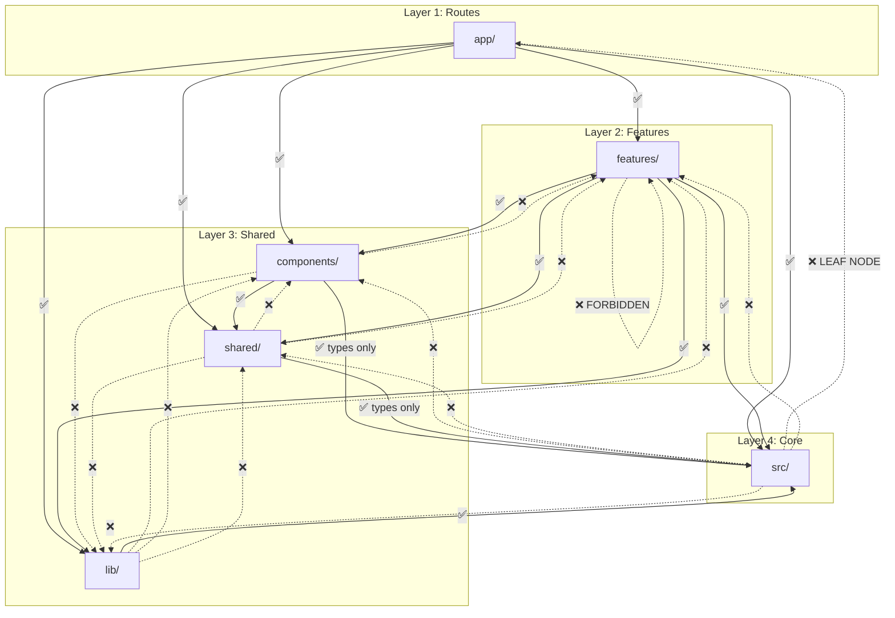

# Architecture v5: OPTIMAL (Right-Sized Clean Architecture)

> **⭐ CANONICAL ARCHITECTURE** - Adopted 2024-12-27

> **Phase**: Design Specification  
> **Input**: Architecture v4 Hybrid Analysis, SDK Wrapper Pattern Analysis  
> **Created**: 2024-12-27  
> **Status**: 🟢 Approved

---

## Overview

Architecture v5 builds on v4's hybrid approach but introduces:
- **Strong SRP** with explicit responsibility boundaries
- **SDK Wrapper Pattern** for AI elements (read-only SDK, editable wrappers)
- **DRY Pattern Catalog** with centralized types, errors, and utilities
- **Standardized File Naming** for consistency across the codebase
- **Schemas per Feature** with Zod validation at API boundaries
- **Result Type** for explicit error handling

**Philosophy**: "Every file has ONE job. Every pattern has ONE source. Every layer has ONE direction."

### Design Principles

1. **Single Responsibility**: Each file/folder owns exactly one concern
2. **SDK Isolation**: Never edit SDK files; extend via wrappers
3. **DRY Centralization**: Types, errors, and patterns defined once
4. **Standardized Naming**: Predictable file locations and names
5. **Explicit Boundaries**: Clear layer dependencies, no violations

---

## SRP Responsibility Matrix

| Layer | Single Responsibility | What Goes Here | What Does NOT |
|-------|----------------------|----------------|---------------|
| `app/` | Route definitions + page shells | `page.tsx`, `layout.tsx`, `error.tsx`, `loading.tsx` | Business logic, state management |
| `features/X/actions/` | Business logic orchestration | Server Actions calling services/DB | UI code, React hooks |
| `features/X/components/` | Feature-specific UI | Components only used in this feature | Shared components, business logic |
| `features/X/hooks/` | Feature-specific state | Zustand stores, feature hooks | Generic hooks |
| `features/X/schemas/` | Validation schemas | Zod schemas for API boundaries | Type definitions |
| `features/X/lib/` | Feature utilities | Feature-specific helpers | Cross-feature utilities |
| `components/ui/` | Generic primitives | Button, Input, Card, Dialog | Business logic, feature-specific code |
| `components/ai-elements/` | SDK-provided (READ-ONLY) | SDK components | ANY edits (will be overwritten) |
| `shared/components/ai/` | AI element wrappers | Customized SDK wrappers | SDK originals |
| `shared/hooks/` | Cross-feature hooks | useDebounce, useQuery, useLocalStorage | Feature-specific hooks |
| `shared/components/` | Cross-feature UI | ErrorBoundary, LoadingState, Skeleton | Feature-specific UI |
| `lib/` | Framework setup | AI SDK, Drizzle, Redis, Auth configs | Business logic |
| `src/types/` | Cross-cutting types | API response types, Result<T,E>, model types | Feature-specific types |
| `src/errors/` | Error class hierarchy | AppError, NotFoundError, ValidationError | Error messages (use in features) |
| `src/services/` | Cross-feature services | Analytics, Logging, Telemetry | Feature-specific services |

---

## Clean Separation Diagram

```
┌─────────────────────────────────────────────────────────────────────────┐
│                                  app/                                    │
│            Route definitions + page shells ONLY (thin layer)             │
│     ┌─────────┐  ┌─────────┐  ┌─────────┐  ┌─────────┐                  │
│     │(auth)/  │  │ (chat)/ │  │  api/   │  │ layout  │                  │
│     └────┬────┘  └────┬────┘  └────┬────┘  └─────────┘                  │
└──────────┼────────────┼────────────┼────────────────────────────────────┘
           │            │            │
           ▼            ▼            ▼
┌─────────────────────────────────────────────────────────────────────────┐
│                              features/                                   │
│                    Business logic lives HERE                             │
│  ┌──────────────┐  ┌──────────────┐  ┌──────────────┐                   │
│  │    chat/     │  │    auth/     │  │  documents/  │  ...              │
│  │ ├─ actions/  │  │ ├─ actions/  │  │ ├─ actions/  │                   │
│  │ ├─ components│  │ ├─ components│  │ ├─ components│                   │
│  │ ├─ hooks/    │  │ ├─ hooks/    │  │ ├─ hooks/    │                   │
│  │ ├─ schemas/  │  │ ├─ schemas/  │  │ ├─ schemas/  │                   │
│  │ └─ lib/      │  │ └─ lib/      │  │ └─ lib/      │                   │
│  └──────────────┘  └──────────────┘  └──────────────┘                   │
└────────────────────────────┬────────────────────────────────────────────┘
                             │
           ┌─────────────────┼─────────────────┐
           ▼                 ▼                 ▼
┌─────────────────┐ ┌─────────────────┐ ┌─────────────────┐
│   components/   │ │     shared/     │ │       lib/      │
│  Reusable UI    │ │ Cross-cutting   │ │  Framework cfg  │
│  (no business)  │ │  utilities +    │ │  (ai, db, auth) │
│                 │ │  AI wrappers    │ │                 │
│ ├─ ui/          │ │ ├─ components/  │ │ ├─ ai/          │
│ └─ ai-elements/ │ │ │  └─ ai/       │ │ ├─ db/          │
│    (READ-ONLY)  │ │ ├─ hooks/       │ │ ├─ cache/       │
│                 │ │ └─ constants/   │ │ └─ auth/        │
└─────────────────┘ └─────────────────┘ └─────────────────┘
           │                 │                 │
           └─────────────────┼─────────────────┘
                             ▼
┌─────────────────────────────────────────────────────────────────────────┐
│                                src/                                      │
│         Cross-cutting Types, Errors, Result<T,E>, Services               │
│  ┌─────────────┐  ┌─────────────┐  ┌─────────────┐                      │
│  │   types/    │  │   errors/   │  │  services/  │                      │
│  │ api.types   │  │ base.error  │  │  analytics  │                      │
│  │ models      │  │ api.errors  │  │  telemetry  │                      │
│  │ result.ts   │  │             │  │             │                      │
│  └─────────────┘  └─────────────┘  └─────────────┘                      │
└─────────────────────────────────────────────────────────────────────────┘
```

---

## SDK Wrapper Pattern Specification

### Critical Rule

> ⚠️ **NEVER edit files in `components/ai-elements/`**  
> These files are SDK-provided and will be overwritten on updates.  
> **Always edit wrappers in `shared/components/ai/`**

### Directory Structure

```
components/
├── ai-elements/                      # SDK (READ-ONLY, auto-updated)
│   ├── artifact.tsx                  # SDK original
│   ├── canvas.tsx                    # SDK original
│   ├── chain-of-thought.tsx          # SDK original
│   ├── code-block.tsx                # SDK original
│   ├── confirmation.tsx              # SDK original
│   ├── context.tsx                   # SDK original
│   ├── conversation.tsx              # SDK original
│   ├── image.tsx                     # SDK original
│   ├── inline-citation.tsx           # SDK original
│   ├── loader.tsx                    # SDK original
│   ├── message.tsx                   # SDK original
│   ├── reasoning.tsx                 # SDK original
│   ├── shimmer.tsx                   # SDK original
│   ├── sources.tsx                   # SDK original
│   ├── suggestion.tsx                # SDK original
│   ├── task.tsx                      # SDK original
│   ├── tool.tsx                      # SDK original
│   └── ...                           # (31 SDK components total)
│
shared/
├── components/
│   └── ai/                           # WRAPPERS (edit these!)
│       ├── index.ts                  # Re-exports all wrappers
│       ├── code-block.tsx            # Wraps ai-elements/code-block
│       ├── confirmation.tsx          # Wraps ai-elements/confirmation
│       ├── context.tsx               # Wraps ai-elements/context
│       ├── conversation.tsx          # Wraps ai-elements/conversation
│       ├── image.tsx                 # Wraps ai-elements/image
│       ├── inline-citation.tsx       # Wraps ai-elements/inline-citation
│       ├── loader.tsx                # Wraps ai-elements/loader
│       ├── message.tsx               # Wraps ai-elements/message
│       ├── reasoning.tsx             # Wraps ai-elements/reasoning
│       ├── shimmer.tsx               # Wraps ai-elements/shimmer
│       ├── sources.tsx               # Wraps ai-elements/sources
│       ├── suggestion.tsx            # Wraps ai-elements/suggestion
│       ├── task.tsx                  # Wraps ai-elements/task
│       └── tool.tsx                  # Wraps ai-elements/tool
```

### Wrapper Pattern Example

```typescript
// shared/components/ai/code-block.tsx
'use client';

import {
  CodeBlock as SdkCodeBlock,
  type CodeBlockProps as SdkCodeBlockProps,
} from '@/components/ai-elements/code-block';
import { cn } from '@/lib/utils';

export interface CodeBlockProps extends SdkCodeBlockProps {
  // Add custom props here
  showLineNumbers?: boolean;
  highlightLines?: number[];
}

export function CodeBlock({
  className,
  showLineNumbers = true,
  highlightLines = [],
  ...props
}: CodeBlockProps) {
  return (
    <SdkCodeBlock
      className={cn(
        'custom-code-block',
        showLineNumbers && 'with-line-numbers',
        className
      )}
      data-highlight-lines={highlightLines.join(',')}
      {...props}
    />
  );
}
```

### Import Rules for AI Components

```typescript
// ❌ WRONG - Never import SDK directly in features
import { CodeBlock } from '@/components/ai-elements/code-block';
import { Message } from '@/components/ai-elements/message';

// ✅ CORRECT - Always use wrapper
import { CodeBlock, Message } from '@/shared/components/ai';

// ✅ CORRECT - Individual import from wrapper
import { CodeBlock } from '@/shared/components/ai/code-block';
```

### Barrel Export (shared/components/ai/index.ts)

```typescript
// shared/components/ai/index.ts

// Re-export all wrappers with consistent naming
export { CodeBlock, type CodeBlockProps } from './code-block';
export { Confirmation, type ConfirmationProps } from './confirmation';
export { AIContext, type AIContextProps } from './context';
export { Conversation, type ConversationProps } from './conversation';
export { AIImage, type AIImageProps } from './image';
export { InlineCitation, type InlineCitationProps } from './inline-citation';
export { Loader, type LoaderProps } from './loader';
export { Message, type MessageProps } from './message';
export { Reasoning, type ReasoningProps } from './reasoning';
export { Shimmer, type ShimmerProps } from './shimmer';
export { Sources, type SourcesProps } from './sources';
export { Suggestion, type SuggestionProps } from './suggestion';
export { Task, type TaskProps } from './task';
export { Tool, type ToolProps } from './tool';
```

---

## DRY Pattern Catalog

### Pattern 1: Error Classes (Single Source)

**Location**: `src/errors/`

```typescript
// src/errors/base.error.ts
export class AppError extends Error {
  constructor(
    message: string,
    public readonly code: string,
    public readonly statusCode: number = 500,
    public readonly details?: Record<string, unknown>
  ) {
    super(message);
    this.name = this.constructor.name;
    Error.captureStackTrace(this, this.constructor);
  }

  toJSON() {
    return {
      name: this.name,
      code: this.code,
      message: this.message,
      statusCode: this.statusCode,
      details: this.details,
    };
  }
}

// src/errors/api.errors.ts
export class NotFoundError extends AppError {
  constructor(resource: string, id: string) {
    super(`${resource} not found: ${id}`, 'NOT_FOUND', 404, { resource, id });
  }
}

export class ValidationError extends AppError {
  constructor(message: string, fields?: Record<string, string>) {
    super(message, 'VALIDATION_ERROR', 400, { fields });
  }
}

export class UnauthorizedError extends AppError {
  constructor(message = 'Authentication required') {
    super(message, 'UNAUTHORIZED', 401);
  }
}

export class ForbiddenError extends AppError {
  constructor(message = 'Access denied') {
    super(message, 'FORBIDDEN', 403);
  }
}

export class ConflictError extends AppError {
  constructor(message: string, conflictWith?: string) {
    super(message, 'CONFLICT', 409, { conflictWith });
  }
}

export class RateLimitError extends AppError {
  constructor(retryAfterSeconds: number) {
    super('Rate limit exceeded', 'RATE_LIMITED', 429, { retryAfterSeconds });
  }
}

// src/errors/index.ts
export * from './base.error';
export * from './api.errors';
```

**Usage Everywhere**:
```typescript
import { NotFoundError, ValidationError } from '@/src/errors';

// In any feature
if (!chat) throw new NotFoundError('Chat', chatId);
if (!input.trim()) throw new ValidationError('Message cannot be empty');
```

---

### Pattern 2: API Response Types (Consistent Shapes)

**Location**: `src/types/api.types.ts`

```typescript
// src/types/api.types.ts

/** Standard API success response */
export interface ApiResponse<T> {
  success: true;
  data: T;
  meta?: {
    timestamp: string;
    requestId?: string;
  };
}

/** Standard API error response */
export interface ApiErrorResponse {
  success: false;
  error: {
    code: string;
    message: string;
    details?: Record<string, unknown>;
  };
  meta?: {
    timestamp: string;
    requestId?: string;
  };
}

/** Paginated response wrapper */
export interface PaginatedResponse<T> {
  success: true;
  data: T[];
  pagination: {
    page: number;
    pageSize: number;
    totalItems: number;
    totalPages: number;
    hasNextPage: boolean;
    hasPrevPage: boolean;
  };
  meta?: {
    timestamp: string;
  };
}

/** Union type for any API response */
export type ApiResult<T> = ApiResponse<T> | ApiErrorResponse;
```

---

### Pattern 3: Result Type (Explicit Error Handling)

**Location**: `src/types/result.ts`

```typescript
// src/types/result.ts

/** Success result */
export interface Ok<T> {
  ok: true;
  value: T;
}

/** Failure result */
export interface Err<E> {
  ok: false;
  error: E;
}

/** Result type for operations that can fail */
export type Result<T, E = Error> = Ok<T> | Err<E>;

/** Create a success result */
export function ok<T>(value: T): Ok<T> {
  return { ok: true, value };
}

/** Create an error result */
export function err<E>(error: E): Err<E> {
  return { ok: false, error };
}

/** Type guard for success */
export function isOk<T, E>(result: Result<T, E>): result is Ok<T> {
  return result.ok === true;
}

/** Type guard for error */
export function isErr<T, E>(result: Result<T, E>): result is Err<E> {
  return result.ok === false;
}

/** Unwrap a result or throw */
export function unwrap<T, E>(result: Result<T, E>): T {
  if (isOk(result)) return result.value;
  throw result.error;
}

/** Unwrap a result with default value */
export function unwrapOr<T, E>(result: Result<T, E>, defaultValue: T): T {
  return isOk(result) ? result.value : defaultValue;
}
```

**Usage**:
```typescript
import { Result, ok, err, isOk } from '@/src/types/result';
import { ValidationError } from '@/src/errors';

async function parseMessage(content: string): Result<ParsedMessage, ValidationError> {
  if (!content.trim()) {
    return err(new ValidationError('Message cannot be empty'));
  }
  return ok({ content: content.trim(), tokens: countTokens(content) });
}

// In consumer
const result = await parseMessage(input);
if (isOk(result)) {
  console.log(result.value.tokens);
} else {
  console.error(result.error.message);
}
```

---

### Pattern 4: DB Model Types (Derived from Drizzle)

**Location**: `src/types/models.types.ts`

```typescript
// src/types/models.types.ts
import type { InferSelectModel, InferInsertModel } from 'drizzle-orm';
import type { user, chat, message, document, vote, suggestion } from '@/lib/db/schema';

// Inferred types from Drizzle schema
export type User = InferSelectModel<typeof user>;
export type NewUser = InferInsertModel<typeof user>;

export type Chat = InferSelectModel<typeof chat>;
export type NewChat = InferInsertModel<typeof chat>;

export type Message = InferSelectModel<typeof message>;
export type NewMessage = InferInsertModel<typeof message>;

export type Document = InferSelectModel<typeof document>;
export type NewDocument = InferInsertModel<typeof document>;

export type Vote = InferSelectModel<typeof vote>;
export type NewVote = InferInsertModel<typeof vote>;

export type Suggestion = InferSelectModel<typeof suggestion>;
export type NewSuggestion = InferInsertModel<typeof suggestion>;

// Common model interfaces
export interface WithTimestamps {
  createdAt: Date;
  updatedAt: Date;
}

export interface WithUser {
  userId: string;
}
```

---

### Pattern 5: Validation Schemas per Feature

**Location**: `features/*/schemas/`

```typescript
// features/chat/schemas/message.schema.ts
import { z } from 'zod';

export const sendMessageSchema = z.object({
  chatId: z.string().uuid('Invalid chat ID'),
  content: z.string().min(1, 'Message cannot be empty').max(32000, 'Message too long'),
  attachments: z.array(z.object({
    type: z.enum(['image', 'file']),
    url: z.string().url(),
    name: z.string(),
  })).optional(),
});

export type SendMessageInput = z.infer<typeof sendMessageSchema>;

// features/chat/schemas/chat.schema.ts
export const createChatSchema = z.object({
  title: z.string().min(1).max(200).optional(),
  model: z.enum(['gpt-4', 'gpt-4-turbo', 'gpt-3.5-turbo']).default('gpt-4'),
});

export type CreateChatInput = z.infer<typeof createChatSchema>;

// features/chat/schemas/index.ts
export * from './message.schema';
export * from './chat.schema';
```

---

### Pattern 6: SWR Query Hooks (Reusable)

**Location**: `shared/hooks/`

```typescript
// shared/hooks/use-query.ts
import useSWR, { type SWRConfiguration } from 'swr';

const defaultFetcher = async (url: string) => {
  const res = await fetch(url);
  if (!res.ok) {
    const error = await res.json();
    throw new Error(error.message || 'Request failed');
  }
  return res.json();
};

export function useQuery<T>(
  key: string | null,
  options?: SWRConfiguration<T>
) {
  return useSWR<T>(key, defaultFetcher, {
    revalidateOnFocus: false,
    ...options,
  });
}

// shared/hooks/use-mutation.ts
import { useState, useCallback } from 'react';
import type { Result } from '@/src/types/result';
import { ok, err } from '@/src/types/result';

interface MutationState<T> {
  data: T | null;
  error: Error | null;
  isLoading: boolean;
}

export function useMutation<TInput, TOutput>(
  mutationFn: (input: TInput) => Promise<TOutput>
) {
  const [state, setState] = useState<MutationState<TOutput>>({
    data: null,
    error: null,
    isLoading: false,
  });

  const mutate = useCallback(async (input: TInput): Promise<Result<TOutput, Error>> => {
    setState({ data: null, error: null, isLoading: true });
    try {
      const data = await mutationFn(input);
      setState({ data, error: null, isLoading: false });
      return ok(data);
    } catch (e) {
      const error = e instanceof Error ? e : new Error('Unknown error');
      setState({ data: null, error, isLoading: false });
      return err(error);
    }
  }, [mutationFn]);

  return { ...state, mutate };
}
```

---

### Pattern 7: Error Boundaries (Reusable)

**Location**: `shared/components/error-boundary.tsx`

```typescript
// shared/components/error-boundary.tsx
'use client';

import { Component, type ReactNode } from 'react';

interface Props {
  children: ReactNode;
  fallback?: ReactNode;
  onError?: (error: Error, errorInfo: React.ErrorInfo) => void;
}

interface State {
  hasError: boolean;
  error: Error | null;
}

export class ErrorBoundary extends Component<Props, State> {
  constructor(props: Props) {
    super(props);
    this.state = { hasError: false, error: null };
  }

  static getDerivedStateFromError(error: Error): State {
    return { hasError: true, error };
  }

  componentDidCatch(error: Error, errorInfo: React.ErrorInfo) {
    this.props.onError?.(error, errorInfo);
  }

  render() {
    if (this.state.hasError) {
      return this.props.fallback ?? <DefaultErrorFallback error={this.state.error} />;
    }
    return this.props.children;
  }
}

function DefaultErrorFallback({ error }: { error: Error | null }) {
  return (
    <div className="flex flex-col items-center justify-center p-8 text-center">
      <h2 className="text-lg font-semibold text-red-600">Something went wrong</h2>
      <p className="mt-2 text-sm text-muted-foreground">{error?.message}</p>
    </div>
  );
}
```

---

### Pattern 8: Loading States (Consistent UI)

**Location**: `shared/components/loading.tsx`

```typescript
// shared/components/loading.tsx
import { Loader2 } from 'lucide-react';
import { cn } from '@/lib/utils';

interface LoadingProps {
  size?: 'sm' | 'md' | 'lg';
  text?: string;
  className?: string;
}

const sizeClasses = {
  sm: 'h-4 w-4',
  md: 'h-6 w-6',
  lg: 'h-8 w-8',
};

export function Loading({ size = 'md', text, className }: LoadingProps) {
  return (
    <div className={cn('flex items-center justify-center gap-2', className)}>
      <Loader2 className={cn('animate-spin', sizeClasses[size])} />
      {text && <span className="text-sm text-muted-foreground">{text}</span>}
    </div>
  );
}

export function LoadingPage() {
  return (
    <div className="flex h-full min-h-[400px] items-center justify-center">
      <Loading size="lg" text="Loading..." />
    </div>
  );
}

export function LoadingInline() {
  return <Loading size="sm" />;
}
```

---

### Pattern 9: Cache Key Definitions (Centralized)

**Location**: `lib/cache/keys.ts`

```typescript
// lib/cache/keys.ts
export const cacheKeys = {
  // User-scoped keys
  userChats: (userId: string) => `user:${userId}:chats` as const,
  userProfile: (userId: string) => `user:${userId}:profile` as const,
  
  // Chat-scoped keys
  chatDetail: (chatId: string) => `chat:${chatId}` as const,
  chatMessages: (chatId: string) => `chat:${chatId}:messages` as const,
  
  // Document-scoped keys
  document: (docId: string) => `doc:${docId}` as const,
  
  // Global keys
  models: () => 'config:models' as const,
} as const;

export type CacheKey = ReturnType<(typeof cacheKeys)[keyof typeof cacheKeys]>;
```

**Usage**:
```typescript
import { cacheKeys } from '@/lib/cache/keys';

// Set cache
await redis.set(cacheKeys.userChats(userId), chats, { ex: 300 });

// Get cache
const cached = await redis.get(cacheKeys.chatDetail(chatId));

// Invalidate
await redis.del(cacheKeys.userChats(userId));
```

---

### Pattern 10: Repository Pattern (Data Access Abstraction)

**Location**: `lib/data/repositories/`

The Repository Pattern abstracts cache and database complexity behind a simple interface. Consumers call `repository.method()` without knowing about caching strategy.

#### Repository Structure

```
lib/
├── data/
│   ├── index.ts                      # Public API
│   └── repositories/
│       ├── index.ts                  # Repository exports
│       ├── base.repository.ts        # Abstract base with caching
│       ├── chat.repository.ts        # Chat data access
│       ├── message.repository.ts     # Message data access
│       ├── document.repository.ts    # Document data access
│       └── user.repository.ts        # User data access
```

#### Base Repository (Abstract)

```typescript
// lib/data/repositories/base.repository.ts
import { redis } from '@/lib/cache/redis';
import { db } from '@/lib/db';

export abstract class BaseRepository<T, CreateInput, UpdateInput> {
  protected abstract readonly entityName: string;
  protected abstract readonly cacheTTL: number;
  
  // Cache key generator (override in subclass)
  protected abstract getCacheKey(id: string): string;
  
  // Database operations (override in subclass)
  protected abstract dbFindById(id: string): Promise<T | null>;
  protected abstract dbFindMany(filter: Record<string, unknown>): Promise<T[]>;
  protected abstract dbCreate(input: CreateInput): Promise<T>;
  protected abstract dbUpdate(id: string, input: UpdateInput): Promise<T>;
  protected abstract dbDelete(id: string): Promise<void>;
  
  // Cached findById
  async findById(id: string): Promise<T | null> {
    const cacheKey = this.getCacheKey(id);
    
    // Check L2 cache
    const cached = await redis.get<T>(cacheKey);
    if (cached) return cached;
    
    // Query L3 database
    const entity = await this.dbFindById(id);
    if (!entity) return null;
    
    // Populate L2 cache
    await redis.set(cacheKey, entity, { ex: this.cacheTTL });
    
    return entity;
  }
  
  // Create with cache invalidation
  async create(input: CreateInput): Promise<T> {
    const entity = await this.dbCreate(input);
    // Invalidate related caches (override in subclass for specifics)
    return entity;
  }
  
  // Update with cache invalidation
  async update(id: string, input: UpdateInput): Promise<T> {
    const entity = await this.dbUpdate(id, input);
    await redis.del(this.getCacheKey(id));
    return entity;
  }
  
  // Delete with cache invalidation
  async delete(id: string): Promise<void> {
    await this.dbDelete(id);
    await redis.del(this.getCacheKey(id));
  }
}
```

#### Message Repository Example

```typescript
// lib/data/repositories/message.repository.ts
import { eq, desc } from 'drizzle-orm';
import { db } from '@/lib/db';
import { messages } from '@/lib/db/schema';
import { cacheKeys } from '@/lib/cache/keys';
import { redis } from '@/lib/cache/redis';
import { BaseRepository } from './base.repository';
import type { Message, NewMessage } from '@/src/types/models.types';

class MessageRepository extends BaseRepository<Message, NewMessage, Partial<Message>> {
  protected readonly entityName = 'message';
  protected readonly cacheTTL = 300; // 5 minutes
  
  protected getCacheKey(id: string) {
    return `message:${id}`;
  }
  
  protected async dbFindById(id: string) {
    return db.query.messages.findFirst({
      where: eq(messages.id, id),
    });
  }
  
  protected async dbFindMany(filter: { chatId?: string }) {
    return db.query.messages.findMany({
      where: filter.chatId ? eq(messages.chatId, filter.chatId) : undefined,
      orderBy: desc(messages.createdAt),
    });
  }
  
  protected async dbCreate(input: NewMessage) {
    const [message] = await db.insert(messages).values(input).returning();
    return message;
  }
  
  protected async dbUpdate(id: string, input: Partial<Message>) {
    const [message] = await db
      .update(messages)
      .set(input)
      .where(eq(messages.id, id))
      .returning();
    return message;
  }
  
  protected async dbDelete(id: string) {
    await db.delete(messages).where(eq(messages.id, id));
  }
  
  // Custom method: Find messages by chat (with caching)
  async findByChat(chatId: string): Promise<Message[]> {
    const cacheKey = cacheKeys.chatMessages(chatId);
    
    const cached = await redis.get<Message[]>(cacheKey);
    if (cached) return cached;
    
    const msgs = await this.dbFindMany({ chatId });
    await redis.set(cacheKey, msgs, { ex: this.cacheTTL });
    
    return msgs;
  }
  
  // Override create to invalidate chat messages cache
  async create(input: NewMessage): Promise<Message> {
    const message = await super.create(input);
    await redis.del(cacheKeys.chatMessages(input.chatId));
    return message;
  }
}

export const messageRepository = new MessageRepository();
```

#### Usage in Server Actions

```typescript
// features/chat/actions/get-messages.action.ts
import { messageRepository } from '@/lib/data/repositories';

export async function getMessages(chatId: string) {
  // Simple call - caching is abstracted
  return messageRepository.findByChat(chatId);
}

// features/chat/actions/send-message.action.ts
export async function sendMessage(input: SendMessageInput) {
  const validated = sendMessageSchema.parse(input);
  
  // Simple call - cache invalidation is automatic
  const message = await messageRepository.create({
    chatId: validated.chatId,
    role: 'user',
    content: validated.content,
  });
  
  return message;
}
```

#### Benefits

| Aspect | Without Repository | With Repository |
|--------|-------------------|------------------|
| Cache logic | Scattered in actions | Centralized in repository |
| Cache invalidation | Manual, easy to forget | Automatic on write |
| DB queries | Duplicated per action | Single source of truth |
| Testing | Need to mock cache + DB | Mock repository only |
| Complexity | Visible in business logic | Hidden behind interface |

#### Repository File Count

| Repository | Purpose |
|------------|----------|
| `base.repository.ts` | Abstract base with caching |
| `chat.repository.ts` | Chat CRUD + list |
| `message.repository.ts` | Message CRUD + by-chat |
| `document.repository.ts` | Document CRUD |
| `user.repository.ts` | User profile access |

**Total: 5 files in `lib/data/repositories/`**

---

## Standardization Rules

### File Naming Conventions

| Type | Pattern | Example |
|------|---------|---------|
| Components | `kebab-case.tsx` | `chat-input.tsx`, `message-list.tsx` |
| Hooks | `use-kebab-case.ts` | `use-chat-state.ts`, `use-scroll.ts` |
| Server Actions | `kebab-case.action.ts` | `send-message.action.ts`, `create-chat.action.ts` |
| Types | `kebab-case.types.ts` | `chat.types.ts`, `api.types.ts` |
| Services | `kebab-case.service.ts` | `analytics.service.ts` |
| Schemas | `kebab-case.schema.ts` | `message.schema.ts` |
| Constants | `kebab-case.constants.ts` | `chat.constants.ts` |
| Utils | `kebab-case.ts` or `kebab-case.utils.ts` | `format-date.ts`, `string.utils.ts` |

### Export Pattern Rules

```typescript
// ✅ CORRECT: Named exports only
export function ChatInput() { ... }
export function ChatMessage() { ... }
export type ChatState = { ... }

// ❌ WRONG: No default exports
export default function ChatInput() { ... }  // DON'T

// ✅ CORRECT: Barrel re-exports
// features/chat/components/index.ts
export { ChatInput } from './chat-input';
export { ChatMessage } from './chat-message';
export { ChatList } from './chat-list';

// ✅ CORRECT: Type re-exports
export type { ChatState } from './chat-state.types';
```

### Folder Index Files

Every folder must have an `index.ts`:

```typescript
// features/chat/index.ts (public API)
export * from './actions';
export * from './components';
export * from './hooks';
export * from './schemas';
// Note: Don't export lib/ - it's internal

// features/chat/actions/index.ts
export { sendMessage } from './send-message.action';
export { createChat } from './create-chat.action';
export { deleteChat } from './delete-chat.action';

// features/chat/schemas/index.ts
export * from './message.schema';
export * from './chat.schema';
```

---

## Import Rules Diagram



### Import Rules Table

| From | Can Import | Cannot Import |
|------|------------|---------------|
| `app/` | features/, components/, shared/, lib/, src/ | - |
| `features/X/` | components/, shared/, lib/, src/ | `features/Y/` ❌ |
| `components/` | shared/, src/types/ | features/, lib/, src/errors/, src/services/ |
| `shared/` | src/types/, src/errors/ | features/, lib/, components/ |
| `lib/` | src/ | features/, components/, shared/ |
| `src/` | **Nothing** | All (pure leaf node) |

### AI Component Import Rule

```typescript
// ❌ NEVER - SDK direct import
import { Message } from '@/components/ai-elements/message';

// ✅ ALWAYS - Wrapper import
import { Message } from '@/shared/components/ai';
```

---

## Complete Directory Structure

```
/
├── app/                              # Next.js App Router (routes only)
│   ├── (auth)/                       # Auth route group
│   │   ├── layout.tsx
│   │   ├── login/
│   │   │   └── page.tsx
│   │   └── register/
│   │       └── page.tsx
│   ├── (chat)/                       # Chat route group
│   │   ├── layout.tsx
│   │   ├── page.tsx
│   │   ├── loading.tsx
│   │   ├── error.tsx
│   │   └── chat/
│   │       └── [id]/
│   │           └── page.tsx
│   ├── api/                          # API routes
│   │   ├── auth/
│   │   ├── chat/
│   │   ├── document/
│   │   ├── health/
│   │   └── vote/
│   ├── layout.tsx
│   ├── globals.css
│   └── error.tsx
│
├── features/                         # Feature-first organization (PRIMARY)
│   ├── index.ts                      # Re-exports all features
│   │
│   ├── auth/
│   │   ├── index.ts
│   │   ├── actions/
│   │   │   ├── index.ts
│   │   │   ├── sign-in.action.ts
│   │   │   ├── sign-out.action.ts
│   │   │   └── register.action.ts
│   │   ├── components/
│   │   │   ├── index.ts
│   │   │   ├── login-form.tsx
│   │   │   └── register-form.tsx
│   │   ├── hooks/
│   │   │   ├── index.ts
│   │   │   └── use-auth.ts
│   │   ├── schemas/
│   │   │   ├── index.ts
│   │   │   └── auth.schema.ts
│   │   └── constants/                # Feature-specific constants
│   │       ├── index.ts
│   │       └── auth.constants.ts
│   │
│   ├── chat/
│   │   ├── index.ts
│   │   ├── actions/
│   │   │   ├── index.ts
│   │   │   ├── send-message.action.ts
│   │   │   ├── create-chat.action.ts
│   │   │   ├── delete-chat.action.ts
│   │   │   └── stream-response.action.ts
│   │   ├── components/
│   │   │   ├── index.ts
│   │   │   ├── chat-input.tsx
│   │   │   ├── chat-list.tsx
│   │   │   ├── chat-message.tsx
│   │   │   ├── chat-header.tsx
│   │   │   └── message-actions.tsx
│   │   ├── hooks/
│   │   │   ├── index.ts
│   │   │   ├── use-chat-state.ts
│   │   │   ├── use-chat-scroll.ts
│   │   │   └── use-message-stream.ts
│   │   ├── schemas/
│   │   │   ├── index.ts
│   │   │   ├── message.schema.ts
│   │   │   └── chat.schema.ts
│   │   ├── constants/                # Feature-specific constants
│   │   │   ├── index.ts
│   │   │   └── chat.constants.ts
│   │   └── lib/
│   │       ├── index.ts
│   │       ├── message-parser.ts
│   │       └── token-counter.ts
│   │
│   ├── documents/
│   │   ├── index.ts
│   │   ├── actions/
│   │   ├── components/
│   │   ├── hooks/
│   │   ├── schemas/
│   │   └── constants/                # Feature-specific constants
│   │       ├── index.ts
│   │       └── documents.constants.ts
│   │
│   ├── artifacts/
│   │   ├── index.ts
│   │   ├── actions/
│   │   ├── components/
│   │   ├── hooks/
│   │   ├── schemas/
│   │   └── constants/                # Feature-specific constants
│   │       ├── index.ts
│   │       └── artifacts.constants.ts
│   │
│   ├── sidebar/
│   │   ├── index.ts
│   │   ├── actions/
│   │   ├── components/
│   │   ├── hooks/
│   │   └── constants/                # Feature-specific constants
│   │       ├── index.ts
│   │       └── sidebar.constants.ts
│   │
│   └── settings/
│       ├── index.ts
│       ├── actions/
│       ├── components/
│       ├── hooks/
│       ├── schemas/
│       └── constants/                # Feature-specific constants
│           ├── index.ts
│           └── settings.constants.ts
│
├── components/                       # Shared UI (no business logic)
│   ├── ui/                           # Primitives
│   │   ├── index.ts
│   │   ├── button.tsx
│   │   ├── input.tsx
│   │   ├── dialog.tsx
│   │   ├── dropdown-menu.tsx
│   │   ├── card.tsx
│   │   ├── avatar.tsx
│   │   ├── badge.tsx
│   │   ├── tooltip.tsx
│   │   └── ...
│   │
│   └── ai-elements/                  # SDK (READ-ONLY!)
│       ├── artifact.tsx
│       ├── canvas.tsx
│       ├── chain-of-thought.tsx
│       ├── code-block.tsx
│       ├── confirmation.tsx
│       ├── context.tsx
│       ├── conversation.tsx
│       ├── image.tsx
│       ├── inline-citation.tsx
│       ├── loader.tsx
│       ├── message.tsx
│       ├── reasoning.tsx
│       ├── shimmer.tsx
│       ├── sources.tsx
│       ├── suggestion.tsx
│       ├── task.tsx
│       ├── tool.tsx
│       └── ...                       # (31 SDK components)
│
├── shared/                           # Cross-cutting utilities
│   ├── components/
│   │   ├── index.ts
│   │   ├── error-boundary.tsx
│   │   ├── error-fallback.tsx
│   │   ├── loading.tsx
│   │   ├── skeleton.tsx
│   │   ├── empty-state.tsx
│   │   ├── connection-status.tsx
│   │   │
│   │   └── ai/                       # AI Wrappers (EDIT THESE!)
│   │       ├── index.ts
│   │       ├── code-block.tsx
│   │       ├── confirmation.tsx
│   │       ├── context.tsx
│   │       ├── conversation.tsx
│   │       ├── image.tsx
│   │       ├── inline-citation.tsx
│   │       ├── loader.tsx
│   │       ├── message.tsx
│   │       ├── reasoning.tsx
│   │       ├── shimmer.tsx
│   │       ├── sources.tsx
│   │       ├── suggestion.tsx
│   │       ├── task.tsx
│   │       └── tool.tsx
│   │
│   ├── hooks/
│   │   ├── index.ts
│   │   ├── use-query.ts
│   │   ├── use-mutation.ts
│   │   ├── use-debounce.ts
│   │   ├── use-local-storage.ts
│   │   ├── use-media-query.ts
│   │   └── use-intersection-observer.ts
│   │
│   ├── constants/
│   │   ├── index.ts
│   │   └── app.constants.ts
│   │
│   ├── types/
│   │   ├── index.ts
│   │   └── shared.types.ts
│   │
│   └── services/
│       ├── index.ts
│       └── storage.service.ts
│
├── lib/                              # Framework integrations
│   ├── index.ts
│   ├── utils.ts
│   │
│   ├── ai/
│   │   ├── index.ts
│   │   ├── provider.ts
│   │   ├── models.ts
│   │   ├── prompts.ts
│   │   └── tools/                    # AI tool definitions
│   │       ├── index.ts              # Tool registry
│   │       ├── web-search.tool.ts    # Web search tool
│   │       ├── calculator.tool.ts    # Calculator tool
│   │       └── code-exec.tool.ts     # Code execution tool
│   │
│   ├── db/
│   │   ├── index.ts
│   │   ├── schema.ts
│   │   ├── client.ts
│   │   └── queries/
│   │       ├── index.ts
│   │       ├── chat.queries.ts
│   │       ├── message.queries.ts
│   │       └── user.queries.ts
│   │
│   ├── cache/
│   │   ├── index.ts
│   │   ├── redis.ts
│   │   └── keys.ts                   # Cache key definitions
│   │
│   ├── data/                         # Data access layer
│   │   ├── index.ts                  # Public API
│   │   └── repositories/
│   │       ├── index.ts              # Repository exports
│   │       ├── base.repository.ts    # Abstract base with caching
│   │       ├── chat.repository.ts    # Chat data access
│   │       ├── message.repository.ts # Message data access
│   │       ├── document.repository.ts# Document data access
│   │       └── user.repository.ts    # User data access
│   │
│   ├── auth/
│   │   ├── index.ts
│   │   ├── config.ts
│   │   └── session.ts
│   │
│   └── config/
│       ├── index.ts
│       └── env.ts
│
├── src/                              # Cross-cutting concerns (MINIMAL)
│   ├── types/
│   │   ├── index.ts
│   │   ├── api.types.ts
│   │   ├── models.types.ts
│   │   └── result.ts
│   │
│   ├── errors/
│   │   ├── index.ts
│   │   ├── base.error.ts
│   │   └── api.errors.ts
│   │
│   └── services/
│       ├── index.ts
│       ├── analytics.service.ts
│       └── telemetry.service.ts
│
└── tests/                            # Test files
    ├── __mocks__/
    ├── config/
    ├── e2e/
    ├── integration/
    ├── unit/
    │   ├── features/
    │   ├── components/
    │   └── schemas/                  # Schema validation tests
    └── utils/
```

---

## File Count Targets

| Directory | v4 Count | v5 Target | Change | Notes |
|-----------|----------|-----------|--------|-------|
| app/ | 83 | ~70 | -13 | Thinner route shells |
| features/ | 241 | ~262 | +21 | +schemas/ +constants/ folders per feature |
| components/ | 84 | ~60 | -24 | SDK only, primitives only |
| shared/ | 119 | ~130 | +11 | +AI wrappers |
| lib/ | 114 | ~111 | -3 | Framework config only, +tools/ +keys.ts +repositories/ |
| src/ | 10 | ~15 | +5 | +Result type, +telemetry |
| tests/ | 66 | ~70 | +4 | +schema validation tests |
| **TOTAL** | ~420 | **~423** | **+3** | Optimized with Repository Pattern |

### Reduction Summary

- **App Layer**: Removed business logic → features/
- **Components**: SDK isolation, no wrappers mixed with SDK
- **Shared**: Consolidated AI wrappers
- **Lib**: Removed business logic → features/
- **Src**: Added Result type pattern

---

## Code Consistency Checklist

### Feature Folder Checklist

Every feature MUST have:

```
✅ features/X/
├── ✅ index.ts              # Public API barrel
├── ✅ actions/
│   └── ✅ index.ts          # Server Actions
├── ✅ components/
│   └── ✅ index.ts          # Feature UI
├── ✅ hooks/
│   └── ✅ index.ts          # Feature state
├── ✅ schemas/
│   └── ✅ index.ts          # Zod validation
└── ⚪ lib/                  # (Optional) utilities
    └── ⚪ index.ts
```

### Code Pattern Checklist

| Pattern | Location | Required |
|---------|----------|----------|
| Error classes | `src/errors/` | ✅ Always import from here |
| Result type | `src/types/result.ts` | ✅ Use for fallible operations |
| API types | `src/types/api.types.ts` | ✅ Use for API responses |
| Zod schemas | `features/*/schemas/` | ✅ Validate at boundaries |
| AI components | `shared/components/ai/` | ✅ Never import SDK directly |

### File Naming Checklist

| Check | Rule |
|-------|------|
| ☐ | Component files: `kebab-case.tsx` |
| ☐ | Hook files: `use-kebab-case.ts` |
| ☐ | Action files: `kebab-case.action.ts` |
| ☐ | Type files: `kebab-case.types.ts` |
| ☐ | Schema files: `kebab-case.schema.ts` |
| ☐ | Service files: `kebab-case.service.ts` |
| ☐ | All folders have `index.ts` |
| ☐ | Named exports only (no default) |

### Import Checklist

| Check | Rule |
|-------|------|
| ☐ | Never import between `features/X` and `features/Y` |
| ☐ | Never import SDK directly (use `shared/components/ai/`) |
| ☐ | `src/` imports nothing |
| ☐ | `lib/` doesn't import from features/ |
| ☐ | Use path aliases: `@/features/`, `@/shared/`, etc. |

---

## Design Decisions Summary

### Decision 1: SDK Wrapper Pattern

**Context**: AI SDK components are externally provided and can be updated.

**Decision**: Create wrapper layer in `shared/components/ai/` that imports from `components/ai-elements/`.

**Alternatives Rejected**:
| Alternative | Rejected Because |
|-------------|------------------|
| Edit SDK directly | Updates overwrite changes |
| Copy SDK to shared/ | Duplication, version drift |
| No wrappers | Can't customize, no type safety |

**Trade-offs**:
- ✅ Customizations preserved on SDK update
- ✅ Type-safe extension points
- ⚠️ One extra import layer

---

### Decision 2: Result<T, E> Type

**Context**: Operations can fail; need explicit error handling without exceptions everywhere.

**Decision**: Add `src/types/result.ts` with `Result<T, E>` pattern.

**Alternatives Rejected**:
| Alternative | Rejected Because |
|-------------|------------------|
| Try/catch everywhere | Implicit, easy to miss |
| Return null | Loses error information |
| Return {data, error} | Less type-safe |

**Trade-offs**:
- ✅ Explicit error handling
- ✅ Type-safe unwrapping
- ⚠️ More verbose call sites

---

### Decision 3: Schemas per Feature

**Context**: Validation logic duplicated or inconsistent.

**Decision**: Each feature has `schemas/` folder with Zod schemas.

**Alternatives Rejected**:
| Alternative | Rejected Because |
|-------------|------------------|
| Central schemas folder | Violates feature-first |
| Inline validation | Duplication, inconsistency |
| No Zod | Manual validation errors |

**Trade-offs**:
- ✅ Feature-scoped validation
- ✅ Type inference from schemas
- ⚠️ More folders per feature

---

## ESLint Boundary Rules

```javascript
// eslint.config.js (add to existing)
{
  rules: {
    'import/no-restricted-paths': [
      'error',
      {
        zones: [
          // features/ cannot import from other features/
          {
            target: './features/*/**',
            from: './features/!(${feature})/**',
            message: 'Features cannot import from other features',
          },
          // components/ cannot import from features/
          {
            target: './components/**',
            from: './features/**',
            message: 'Components cannot import from features',
          },
          // shared/ cannot import from features/
          {
            target: './shared/**',
            from: './features/**',
            message: 'Shared cannot import from features',
          },
          // lib/ cannot import from features/
          {
            target: './lib/**',
            from: './features/**',
            message: 'Lib cannot import from features',
          },
          // src/ cannot import from anything
          {
            target: './src/**',
            from: ['./features/**', './components/**', './shared/**', './lib/**', './app/**'],
            message: 'Src is a leaf node and cannot import from other layers',
          },
          // No direct SDK imports in features
          {
            target: './features/**',
            from: './components/ai-elements/**',
            message: 'Use shared/components/ai wrappers instead of SDK directly',
          },
        ],
      },
    ],
  },
}
```

---

## Requirements Traceability

| REQ ID | Requirement | Implementation |
|--------|-------------|----------------|
| SRP-001 | Clear responsibility boundaries | SRP Responsibility Matrix |
| SRP-002 | Thin app/ layer | Route shells only |
| SRP-003 | SDK isolation | components/ai-elements READ-ONLY |
| DRY-001 | Centralized error classes | src/errors/ |
| DRY-002 | Centralized API types | src/types/api.types.ts |
| DRY-003 | Result type pattern | src/types/result.ts |
| DRY-004 | Validation schemas | features/*/schemas/ |
| STD-001 | File naming conventions | Standardization Rules section |
| STD-002 | Export patterns | Named exports, barrel files |
| SDK-001 | Wrapper pattern | shared/components/ai/ |
| SDK-002 | Import rules | ESLint boundary enforcement |

---

## Quality Self-Check

- [x] SRP responsibility table defined
- [x] Clean separation diagram created
- [x] SDK wrapper pattern fully specified
- [x] DRY pattern catalog with 10 patterns
- [x] File naming conventions documented
- [x] Export pattern rules defined
- [x] Import rules diagram with Mermaid
- [x] Directory structure complete
- [x] File count targets calculated
- [x] Code consistency checklist created
- [x] ESLint boundary rules defined
- [x] At least 2 alternatives per decision
- [x] Trade-offs documented

---

## Optional Simplification: Merge src/ into lib/

> **Status**: OPTIONAL - Implement if team finds `src/` vs `lib/` distinction confusing.

### Current Structure (v5)

```
lib/                              # Framework integrations
├── ai/
├── db/
├── cache/
└── auth/

src/                              # Cross-cutting concerns
├── types/
├── errors/
└── services/
```

### Merged Structure (Alternative)

```
lib/                              # All utilities
├── ai/                           # Framework: AI SDK
├── db/                           # Framework: Drizzle
├── cache/                        # Framework: Redis
├── auth/                         # Framework: Auth.js
├── types/                        # ← merged from src/
│   ├── index.ts
│   ├── api.types.ts
│   ├── models.types.ts
│   └── result.ts
├── errors/                       # ← merged from src/
│   ├── index.ts
│   ├── base.error.ts
│   └── api.errors.ts
└── services/                     # ← merged from src/
    ├── index.ts
    ├── analytics.service.ts
    └── telemetry.service.ts
```

### When to Choose Each

| Scenario | Recommendation |
|----------|----------------|
| Team prefers explicit separation | Keep `src/` separate |
| AI agents confused by two folders | Merge into `lib/` |
| New devs ask "what's the difference?" | Merge into `lib/` |
| Following Clean Architecture strictly | Keep `src/` separate |

### Migration Steps (If Merging)

1. Move `src/types/` → `lib/types/`
2. Move `src/errors/` → `lib/errors/`
3. Move `src/services/` → `lib/services/`
4. Update all imports: `@/src/` → `@/lib/`
5. Delete empty `src/` folder
6. Update ESLint rules to remove `src/` paths

### Impact on File Count

| Directory | Before Merge | After Merge |
|-----------|--------------|-------------|
| lib/ | ~104 | ~119 |
| src/ | ~15 | 0 |
| **Net Change** | - | 0 (just reorganized) |

---

## 11. Oldapp Feature Parity (SRP-Compliant Placements)

### 11.1 Migration Summary

All oldapp functionality preserved with CORRECT layer placement per SRP Matrix:

| Layer | Purpose | Content |
|-------|---------|---------|
| `features/` | Business logic per feature | Actions, feature components, hooks |
| `src/services/` | Cross-cutting services | Cache, rate-limit, logging |
| `shared/` | Cross-feature utilities | Generic hooks, guards |
| `lib/` | Framework setup ONLY | Clients, configs, constants |

### 11.2 features/chat/ (FROM: lib/ai/ + components/)

**Purpose**: All chat-related business logic, UI, and tools.

```
features/chat/
├── actions/
│   ├── chat-completion.action.ts    # lib/ai/chat.ts → orchestration logic
│   ├── send-message.action.ts
│   └── stream-response.action.ts
├── components/
│   ├── chat.tsx                     # components/chat.tsx
│   ├── chat-header.tsx
│   ├── greeting.tsx
│   ├── message.tsx
│   ├── message-actions.tsx
│   ├── message-editor.tsx
│   ├── message-reasoning.tsx
│   ├── messages.tsx
│   ├── multimodal-input.tsx
│   ├── submit-button.tsx
│   ├── suggested-actions.tsx
│   ├── toolbar.tsx
│   └── weather.tsx                  # Weather display component
├── hooks/
│   ├── use-messages.tsx             # hooks/use-messages.tsx
│   ├── use-optimistic-chats.tsx
│   └── use-chat-visibility.ts
├── lib/
│   └── tools/                       # lib/ai/tools/*
│       ├── create-document.tool.ts
│       ├── update-document.tool.ts
│       ├── weather.tool.ts
│       └── suggestions.tool.ts
└── schemas/
    └── message.schema.ts
```

**Key Files**:
| File | LOC | Origin | Contains |
|------|-----|--------|----------|
| chat-completion.action.ts | ~300 | lib/ai/chat.ts | Multi-provider chat orchestration |
| weather.tsx | ~470 | components/weather.tsx | Weather UI + visualization |
| use-messages.tsx | ~150 | hooks/use-messages.tsx | Message state management |

### 11.3 features/artifacts/ (FROM: artifacts/ + components/ + lib/editor/)

**Purpose**: All artifact-related functionality.

```
features/artifacts/
├── actions/
│   └── get-suggestions.action.ts    # artifacts/actions.ts
├── components/
│   ├── artifact.tsx                 # components/artifact.tsx (622 LOC)
│   ├── artifact-actions.tsx
│   ├── artifact-close-button.tsx
│   ├── artifact-error-boundary.tsx
│   ├── artifact-messages.tsx
│   ├── code-editor.tsx              # components/code-editor.tsx (199 LOC)
│   ├── console.tsx                  # components/console.tsx (209 LOC)
│   ├── image-editor.tsx
│   ├── sheet-editor.tsx
│   ├── text-editor.tsx
│   ├── diffview.tsx
│   ├── document.tsx
│   ├── document-preview.tsx
│   ├── document-skeleton.tsx
│   └── create-artifact.tsx
├── hooks/
│   └── use-artifact.ts              # hooks/use-artifact.ts
├── lib/
│   └── editor/                      # lib/editor/*
│       ├── suggestions.ts
│       ├── renderer.tsx
│       ├── diff.ts
│       └── types.ts
├── renderers/                       # artifacts/code|image|sheet|text/
│   ├── code/
│   │   ├── client.tsx
│   │   └── server.ts
│   ├── image/
│   │   └── client.tsx
│   ├── sheet/
│   │   ├── client.tsx
│   │   └── server.ts
│   └── text/
│       ├── client.tsx
│       └── server.ts
└── schemas/
    └── artifact.schema.ts
```

### 11.4 features/models/ (FROM: lib/ai/models/)

**Purpose**: Model discovery, catalog, and provider management.

```
features/models/
├── actions/
│   └── refresh-models.action.ts
├── lib/
│   ├── discovery.ts                 # lib/ai/models/discovery.ts (408 LOC)
│   ├── registry.ts                  # lib/ai/models/registry.ts
│   └── provider-catalog.ts
├── components/
│   └── model-selector.tsx           # components/model-selector.tsx
└── types/
    └── model.types.ts
```

### 11.5 src/services/ (FROM: lib/cache/ + lib/middleware/)

**Purpose**: Cross-cutting infrastructure services.

```
src/services/
├── cache/
│   ├── index.ts
│   ├── cache.service.ts             # lib/cache/operations.ts logic
│   ├── message-cache.service.ts     # lib/cache/messages.ts (1080 LOC)
│   ├── circuit-breaker.ts           # Extracted from messages.ts
│   ├── lua-scripts.ts               # lib/cache/scripts.ts
│   └── types.ts
├── rate-limit/
│   ├── index.ts
│   ├── rate-limit.service.ts        # lib/middleware/rate-limiter.ts (476 LOC)
│   ├── edge-rate-limit.service.ts   # lib/middleware/edge-rate-limit.ts
│   └── constants.ts
├── deduplication/
│   ├── index.ts
│   └── deduplication.service.ts     # lib/middleware/deduplication.ts
├── quota/
│   ├── index.ts
│   └── quota.service.ts             # lib/cache/quotas.ts (186 LOC)
├── logging/
│   ├── index.ts
│   └── logger.service.ts            # lib/log.ts
├── telemetry/
│   ├── index.ts
│   └── request-context.ts           # lib/request-context.ts
└── analytics/
    └── index.ts
```

**Key Services**:
| Service | LOC | Origin | Contains |
|---------|-----|--------|----------|
| message-cache.service.ts | ~1080 | lib/cache/messages.ts | Full message cache with versioning |
| rate-limit.service.ts | ~476 | lib/middleware/rate-limiter.ts | Sliding window rate limiting |
| circuit-breaker.ts | ~200 | Extracted | Circuit breaker pattern |

### 11.6 shared/hooks/ (Cross-Feature Utilities)

**Purpose**: Generic hooks used across multiple features.

```
shared/hooks/
├── use-debounce.ts
├── use-mobile.ts                    # hooks/use-mobile.ts (unchanged)
├── use-scroll-to-bottom.tsx         # hooks/use-scroll-to-bottom.tsx
└── use-window-size.ts               # hooks/use-window-size.ts
```

### 11.7 lib/ (Framework Setup ONLY)

**Purpose**: Client initialization, configs, constants. NO business logic.

```
lib/
├── ai/
│   ├── index.ts                     # Provider exports
│   ├── providers/                   # Provider initialization
│   │   ├── openai.ts
│   │   ├── anthropic.ts
│   │   ├── google.ts
│   │   ├── xai.ts
│   │   └── groq.ts
│   ├── prompts/                     # Static prompts (templates only)
│   │   └── system.ts
│   ├── constants.ts                 # Static constants
│   └── curated-models.ts            # Static model definitions
├── cache/
│   ├── index.ts
│   ├── client.ts                    # Redis client singleton
│   └── keys.ts                      # Cache key patterns
├── db/
│   ├── index.ts
│   ├── client.ts                    # Drizzle client
│   ├── schema.ts                    # Schema definitions
│   └── migrations/
└── auth/
    ├── index.ts
    ├── config.ts                    # Auth.js config
    └── session.ts                   # Session utilities
```

### 11.8 SRP Compliance Matrix (Post-Migration)

| Item | Old Location | New Location | SRP Layer |
|------|-------------|--------------|-----------|
| chat.ts (orchestration) | lib/ai/chat.ts | features/chat/actions/ | Application |
| model discovery | lib/ai/models/ | features/models/lib/ | Application |
| AI tools | lib/ai/tools/ | features/chat/lib/tools/ | Application |
| messages cache | lib/cache/messages.ts | src/services/cache/ | Infrastructure |
| rate limiter | lib/middleware/rate-limiter.ts | src/services/rate-limit/ | Infrastructure |
| deduplication | lib/middleware/deduplication.ts | src/services/deduplication/ | Infrastructure |
| quota tracking | lib/cache/quotas.ts | src/services/quota/ | Infrastructure |
| logging | lib/log.ts | src/services/logging/ | Infrastructure |
| request context | lib/request-context.ts | src/services/telemetry/ | Infrastructure |
| artifact components | components/artifact*.tsx | features/artifacts/components/ | Presentation |
| chat components | components/chat*.tsx | features/chat/components/ | Presentation |
| use-artifact | hooks/use-artifact.ts | features/artifacts/hooks/ | Presentation |
| use-messages | hooks/use-messages.tsx | features/chat/hooks/ | Presentation |
| editor lib | lib/editor/ | features/artifacts/lib/editor/ | Application |

### 11.9 What Stays in lib/

Only these items remain in lib/ (framework setup):
- **lib/ai/providers/**: Provider initialization configs
- **lib/ai/prompts/**: Static prompt templates
- **lib/ai/constants.ts**: Static constants
- **lib/ai/curated-models.ts**: Static model list
- **lib/cache/client.ts**: Redis client singleton
- **lib/cache/keys.ts**: Cache key pattern definitions
- **lib/db/**: Database client, schema, migrations
- **lib/auth/**: Auth.js config and session

### 11.10 Migration Priority

| Priority | Items | Effort |
|----------|-------|--------|
| P1 | src/services/* (cache, rate-limit) | 8h |
| P2 | features/chat/ (actions, tools) | 6h |
| P3 | features/artifacts/ (components, renderers) | 4h |
| P4 | features/models/ | 2h |
| P5 | shared/hooks/ | 1h |

---

## 12. Feature Parity Checklist

| Category | Files | Status |
|----------|-------|--------|
| AI Infrastructure | 20+ | Required |
| Cache System | 8 | Required |
| Middleware | 4 | Required |
| Database Utils | 5 | Required |
| API Utils | 4 | Required |
| Observability | 3 | Required |
| Artifacts | 8 | Required |
| Editor | 5 | Required |
| Components | 15+ | Required |
| Hooks | 7 | Required |
| API Routes | 8 | Required |
| UI Primitives | 7 | Required |
| Settings | 4 | Required |
| Auth Extensions | 3 | Required |
| Types | 2 | Required |
| Utilities | 4 | Required |
| Tests | 13+ | Required |

**Total Missing Files: ~120 files**

---

## Summary

**Architecture v5: OPTIMAL** provides:

1. **Strong SRP** with explicit responsibility matrix
2. **SDK Wrapper Pattern** protecting SDK from edits
3. **DRY Catalog** with 10 centralized patterns
4. **Standardized Naming** for predictable codebase
5. **Result Type** for explicit error handling
6. **Schemas per Feature** for validated inputs
7. **ESLint Boundaries** for enforced import rules

| Metric | v4 | v5 | Change |
|--------|-----|-----|--------|
| Total Files | ~420 | ~400 | -5% |
| SRP Violations | Some | Minimal | Enforced |
| DRY Patterns | Implicit | 10 Documented | +Catalog |
| SDK Safety | None | Wrapper Layer | Protected |
| Naming | Mixed | Standardized | Consistent |

**Best For**: Teams wanting clean architecture with practical patterns and SDK safety.

---

## → Next Phase

**Output**: This architecture-v5-optimal.md  
**Next**: Implementation planning with migration steps  
**Handoff**: Ready for implementation phase
