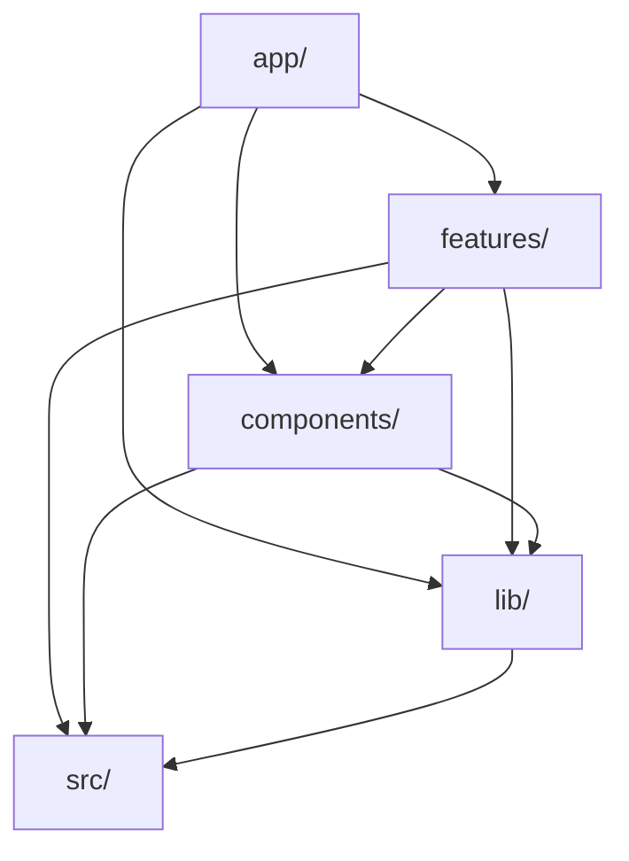

# Architecture v6 Final

> **Status**: Canonical specification for next-app migration
> **Last Updated**: 2024-12-28  
> **Sections**: 29 (in 5 parts)
> **See also**: [directory-structure-v6.md](directory-structure-v6.md), [architecture-v6-decisions.md](architecture-v6-decisions.md)

---

## Part I: Foundation

*Establishes the conceptual model and physical structure*

---

## 1. Layer Overview

```
┌─────────────────────────────────────────────────────────────┐
│ EDGE (middleware.ts)                                        │
│ ├── Rate Limiting (Upstash @upstash/ratelimit)             │
│ ├── Auth Check                                              │
│ └── Request Routing                                         │
├─────────────────────────────────────────────────────────────┤
│ ROUTES (app/api/*/route.ts) - SLIM                         │
│ ├── Parse Request                                           │
│ ├── Call Action                                             │
│ └── Return Response                                         │
├─────────────────────────────────────────────────────────────┤
│ ACTIONS (features/*/actions/) - Business Logic             │
│ ├── Orchestration                                           │
│ ├── Validation                                              │
│ └── Data Coordination                                       │
├─────────────────────────────────────────────────────────────┤
│ DATA ACCESS LAYER (lib/data/)                               │
│ ├── getChatById(), saveMessage(), etc.                      │
│ ├── Internal: Cache → DB fallback                           │
│ └── Caller-agnostic data source                             │
├─────────────────────────────────────────────────────────────┤
│ INFRASTRUCTURE                                               │
│ ├── lib/db/ - Drizzle client + schema                       │
│ ├── lib/cache/ - Redis client                               │
│ └── lib/ai/ - Provider configs                              │
└─────────────────────────────────────────────────────────────┘
```

---

## 2. SRP Responsibility Matrix

| Layer | Responsibility | Examples |
|-------|---------------|----------|
| **app/** | Routes, layouts, page components | `page.tsx`, `layout.tsx` |
| **features/** | Feature-specific business logic | Actions, feature components, hooks |
| **components/** | Shared UI components | `ui/`, `ai-elements/`, `ai/`, `auth-form.tsx` |
| **lib/** | Infrastructure setup | Clients, configs, schemas |
| **lib/data/** | Data access abstraction | `getChatById()`, `saveMessage()` |
| **src/** | Shared utilities, types, errors | `types/`, `utils/`, `errors/` |

### Layer Import Rules



| Layer | Can Import From |
|-------|-----------------|
| `app/` | features, components, lib, src |
| `features/` | components, lib, src, other features (actions only) |
| `components/` | lib, src |
| `lib/` | src |
| `src/` | Nothing (base layer) |

---

## 3. Complete Directory Structure

```
nextjs-ai-chatbot/
├── app/                              # Next.js App Router
│   ├── (auth)/                       # Auth routes (grouped)
│   │   ├── login/page.tsx
│   │   ├── register/page.tsx
│   │   └── layout.tsx
│   ├── (chat)/                       # Chat routes (grouped)
│   │   ├── page.tsx
│   │   ├── [id]/page.tsx
│   │   └── layout.tsx
│   ├── api/
│   │   ├── chat/route.ts             # SLIM: ~15 lines
│   │   ├── history/route.ts          # SLIM: ~15 lines
│   │   └── auth/[...nextauth]/route.ts
│   ├── layout.tsx
│   └── globals.css
│
├── features/                         # Feature modules
│   ├── chat/
│   │   ├── actions/
│   │   │   ├── stream-chat.action.ts
│   │   │   └── save-message.action.ts
│   │   ├── components/
│   │   │   ├── chat.tsx
│   │   │   ├── messages.tsx
│   │   │   ├── message.tsx
│   │   │   └── input.tsx
│   │   ├── hooks/
│   │   │   └── use-messages.ts
│   │   ├── schemas/                  # Zod validation schemas
│   │   └── lib/
│   │
│   ├── artifacts/
│   │   ├── types/
│   │   │   ├── artifact.ts
│   │   │   └── handlers.ts
│   │   ├── components/
│   │   │   ├── artifact-panel.tsx
│   │   │   ├── artifact-close.tsx
│   │   │   ├── artifact-actions.tsx
│   │   │   ├── artifact-error-boundary.tsx
│   │   │   ├── create-artifact.tsx
│   │   │   ├── preview-attachment.tsx
│   │   │   ├── document-preview.tsx
│   │   │   ├── document-skeleton.tsx
│   │   │   └── editors/
│   │   │       ├── text-editor.tsx
│   │   │       ├── code-editor.tsx
│   │   │       ├── image-editor.tsx
│   │   │       └── sheet-editor.tsx
│   │   ├── handlers/
│   │   │   ├── base.handler.ts
│   │   │   ├── text.handler.ts
│   │   │   ├── code.handler.ts
│   │   │   ├── image.handler.ts
│   │   │   └── sheet.handler.ts
│   │   ├── hooks/
│   │   │   ├── use-artifact.ts
│   │   │   └── use-artifact-selector.ts
│   │   ├── actions/
│   │   │   ├── create-artifact.action.ts
│   │   │   ├── update-artifact.action.ts
│   │   │   └── get-suggestions.action.ts
│   │   └── schemas/
│   │       └── artifact.schema.ts
│   │
│   ├── auth/
│   │   └── actions/
│   │       ├── login.action.ts
│   │       └── register.action.ts
│   │
├── components/                       # Shared components
│   ├── ai-elements/                  # Read-only AI primitives (30 files) - NEVER MODIFY
│   ├── ai/                           # Project AI wrappers (15 modules)
│   │   ├── chat/                     # conversation, message, prompt-input
│   │   ├── reasoning/                # chain-of-thought, reasoning
│   │   ├── tools/                    # tool, confirmation
│   │   ├── content/                  # code, image, web-preview
│   │   ├── canvas/                   # canvas, node, edge, etc.
│   │   ├── citations/                # inline-citation, sources
│   │   ├── workflow/                 # plan, task, queue, checkpoint
│   │   ├── artifacts/                # artifact container
│   │   ├── integration/              # context-bar, model-selector
│   │   └── utilities/                # loader, lazy, shimmer
│   ├── ui/                           # shadcn/ui components
│   │   ├── button.tsx
│   │   ├── input.tsx
│   │   └── ...
│   ├── auth-form.tsx                 # Consolidated auth form
│   ├── theme-provider.tsx
│   └── sidebar.tsx
│
├── lib/                              # Infrastructure
│   ├── data/                         # Repository Pattern
│   │   ├── index.ts
│   │   ├── repositories/
│   │   │   ├── index.ts
│   │   │   ├── base.repository.ts
│   │   │   ├── chat.repository.ts
│   │   │   ├── message.repository.ts
│   │   │   ├── user.repository.ts
│   │   │   └── artifact.repository.ts
│   │   ├── queries/
│   │   │   ├── index.ts
│   │   │   ├── chat.queries.ts
│   │   │   └── message.queries.ts
│   │   └── types.ts
│   │
│   ├── db/                           # Database
│   │   ├── index.ts
│   │   ├── client.ts
│   │   ├── schema.ts
│   │   └── migrations/
│   │
│   ├── cache/                        # Cache client
│   │   ├── index.ts
│   │   └── client.ts
│   │
│   ├── ai/                           # AI provider configs
│   │   ├── index.ts
│   │   ├── providers.ts
│   │   └── prompts.ts
│   │
│   ├── auth/                         # Auth config
│   │   ├── index.ts
│   │   └── config.ts
│   │
│   ├── errors/                       # Error handling
│   │   ├── index.ts
│   │   ├── app-error.ts
│   │   └── handlers.ts
│   │
│   └── hooks/                        # Shared hooks (use-debounce, etc.)
│
├── middleware.ts                     # Edge: Rate limiting, auth
│
├── src/                              # Shared utilities
│   ├── types/
│   │   ├── index.ts
│   │   └── api.types.ts
│   └── utils/
│       └── index.ts
│
└── public/
```

---

## 4. File Placement Decision Tree

```
Is it AI Chat UI component?
├── YES: Read-only primitive from source? → src/components/ai-elements/
├── YES: Project wrapper with actions/state? → src/components/ai/
└── NO: ↓

Is it data access (CRUD)?
├── YES → lib/data/
└── NO: ↓

Is it a feature with UI + actions?
├── YES → features/[name]/
└── NO: ↓

Is it shared UI component?
├── YES → components/
└── NO: ↓

Is it infrastructure (client setup)?
├── YES → lib/[db|cache|auth|ai]/
└── NO: ↓

Is it shared utility/type?
├── YES → src/[utils|types]/
└── NO: ↓

Is it error handling?
├── YES → lib/errors/
└── NO: ↓

Is it edge logic (rate limit, auth check)?
├── YES → middleware.ts
└── NO: Ask architect
```

---

*End of Part I. Continue to Part II: Architecture Patterns*

---

## Part II: Architecture Patterns

*Core patterns that define how the system works*

---

## 5. Repository Pattern (lib/data/)

### Purpose
Abstract data access with separate read/write interfaces. Optimize caching per operation type.

### Structure
```
lib/data/
├── repositories/
│   ├── index.ts                      # Export all repositories
│   ├── base.repository.ts            # Abstract base class
│   ├── chat.repository.ts            # ChatRepository
│   ├── message.repository.ts         # MessageRepository
│   ├── user.repository.ts            # UserRepository
│   └── artifact.repository.ts        # ArtifactRepository (unified from Document)
├── queries/
│   ├── index.ts
│   ├── chat.queries.ts               # Complex queries (joins)
│   └── message.queries.ts
└── index.ts
```

> **Note**: The `artifacts` table (database) unifies what was previously called "documents". See ADR-019 for rationale.

### Base Repository Pattern

```typescript
// lib/data/repositories/base.repository.ts
interface Identifiable {
  id: string
}

interface IReadRepository<T> {
  findById(id: string): Promise<T | null>
  findMany(options?: FindManyOptions): Promise<T[]>
  exists(id: string): Promise<boolean>
  count(options?: CountOptions): Promise<number>
}

interface IWriteRepository<T, TCreate, TUpdate> {
  create(data: TCreate): Promise<T>
  createMany(data: TCreate[]): Promise<T[]>
  update(id: string, data: TUpdate): Promise<T>
  delete(id: string): Promise<void>
  deleteMany(ids: string[]): Promise<void>
}

abstract class BaseRepository<
  T extends Identifiable,
  TCreate,
  TUpdate
> implements IReadRepository<T>, IWriteRepository<T, TCreate, TUpdate> {
  
  protected abstract cacheKey(id: string): string
  protected abstract cacheListKey(): string
  protected abstract ttl: number        // Entity TTL
  protected abstract listTtl: number    // List TTL (stale faster)

  // Read operations (cache-through)
  async findById(id: string): Promise<T | null> {
    const cached = await cache.get<T>(this.cacheKey(id))
    if (cached) return cached
    
    const result = await this.doFindById(id)
    if (result) {
      await cache.set(this.cacheKey(id), result, { ex: this.ttl })
    }
    return result
  }

  async exists(id: string): Promise<boolean> {
    return (await this.findById(id)) !== null
  }

  // Write operations (write-through with invalidation)
  async create(data: TCreate): Promise<T> {
    const result = await this.doCreate(data)
    await cache.set(this.cacheKey(result.id), result, { ex: this.ttl })
    await this.invalidateListCache()
    return result
  }

  async update(id: string, data: TUpdate): Promise<T> {
    const result = await this.doUpdate(id, data)
    await cache.set(this.cacheKey(id), result, { ex: this.ttl })
    await this.invalidateListCache()
    return result
  }

  async delete(id: string): Promise<void> {
    await this.doDelete(id)
    await cache.del(this.cacheKey(id))
    await this.invalidateListCache()
  }

  protected async invalidateListCache(): Promise<void> {
    await cache.del(this.cacheListKey())
  }

  // Abstract methods for DB operations
  protected abstract doFindById(id: string): Promise<T | null>
  protected abstract doCreate(data: TCreate): Promise<T>
  protected abstract doUpdate(id: string, data: TUpdate): Promise<T>
  protected abstract doDelete(id: string): Promise<void>
}
```

### Chat Repository Example

```typescript
// lib/data/repositories/chat.repository.ts
import { db } from '@/lib/db'
import { chats } from '@/lib/db/schema'
import type { Chat, NewChat, UpdateChat } from '@/src/types'
import { eq } from 'drizzle-orm'

class ChatRepository extends BaseRepository<Chat, NewChat, UpdateChat> {
  protected cacheKey = (id: string) => `chat:${id}`
  protected cacheListKey = () => 'chats:list'
  protected ttl = 3600      // 1 hour
  protected listTtl = 300   // 5 minutes

  protected async doFindById(id: string) {
    return db.query.chats.findFirst({ where: eq(chats.id, id) })
  }

  protected async doCreate(data: NewChat) {
    const [chat] = await db.insert(chats).values(data).returning()
    return chat
  }

  protected async doUpdate(id: string, data: UpdateChat) {
    const [chat] = await db
      .update(chats)
      .set(data)
      .where(eq(chats.id, id))
      .returning()
    return chat
  }

  protected async doDelete(id: string) {
    await db.delete(chats).where(eq(chats.id, id))
  }

  // Custom methods
  async findByUserId(userId: string): Promise<Chat[]> {
    const cacheKey = `chats:user:${userId}`
    const cached = await cache.get<Chat[]>(cacheKey)
    if (cached) return cached

    const result = await db.query.chats.findMany({
      where: eq(chats.userId, userId),
      orderBy: (chats, { desc }) => [desc(chats.createdAt)]
    })
    await cache.set(cacheKey, result, { ex: this.listTtl })
    return result
  }
}

export const chatRepository = new ChatRepository()
```

### Usage

```typescript
// In action
import { chatRepository } from '@/lib/data'

export async function getChatAction(id: string) {
  const chat = await chatRepository.findById(id)
  if (!chat) throw AppError.notFound('Chat')
  return chat
}

export async function createChatAction(data: NewChat) {
  return chatRepository.create(data)
}
```

### Rules
- ✅ All data access through repositories
- ✅ Use cache-through for reads
- ✅ Invalidate cache on writes
- ✅ Separate TTLs for entities vs lists
- ❌ Never access DB directly from actions/routes

---

## 6. Route-Specific Rate Limiting (Edge)

### Purpose
Different API routes have different usage patterns. Rate limiting at edge with per-route configuration.

### Configuration

```typescript
// lib/rate-limit/config.ts
import type { Duration } from '@upstash/ratelimit'

interface RateLimitRoute {
  requests: number
  window: Duration
  failClosed?: boolean  // Block on Redis failure? (default: false)
}

export const rateLimitConfig = {
  // Default for unmatched routes
  default: { requests: 60, window: '1m' } as RateLimitRoute,
  
  // Route-specific limits
  routes: {
    '/api/chat': { requests: 10, window: '1m' },
    '/api/upload': { requests: 3, window: '1m' },
    '/api/history': { requests: 30, window: '1m' },
    '/api/auth/*': { requests: 5, window: '1m', failClosed: true },
    '/api/suggestions': { requests: 30, window: '1m' },
    '/api/vote': { requests: 30, window: '1m' },
    '/api/chat/*/messages': { requests: 30, window: '1m' },
    '/api/chat/*/reconnect': { requests: 10, window: '1m' },
    '/api/files/upload': { requests: 3, window: '1m' },
  } as Record<string, RateLimitRoute>,
  
  // Bypass rate limiting
  bypass: ['/api/health'],
  
  // IP whitelist (dev/CI)
  ipWhitelist: ['127.0.0.1', '::1'],
} as const
```

### Middleware Implementation

```typescript
// middleware.ts
import { NextResponse, type NextRequest } from 'next/server'
import { Ratelimit } from '@upstash/ratelimit'
import { Redis } from '@upstash/redis'
import { rateLimitConfig } from '@/lib/rate-limit/config'

const redis = Redis.fromEnv()
const limiters = new Map<string, Ratelimit>()

function getRateLimiter(path: string): Ratelimit | null {
  // Bypass check
  if (rateLimitConfig.bypass.includes(path)) return null

  // Find matching config
  let config = rateLimitConfig.routes[path]
  let key = path

  // Wildcard match
  if (!config) {
    for (const [pattern, routeConfig] of Object.entries(rateLimitConfig.routes)) {
      if (pattern.endsWith('/*') && path.startsWith(pattern.slice(0, -2))) {
        config = routeConfig
        key = pattern
        break
      }
    }
  }

  // Fall back to default
  if (!config) {
    config = rateLimitConfig.default
    key = 'default'
  }

  // Get or create limiter
  if (!limiters.has(key)) {
    limiters.set(key, new Ratelimit({
      redis,
      limiter: Ratelimit.slidingWindow(config.requests, config.window),
      prefix: `ratelimit:${key}`,
    }))
  }

  return limiters.get(key)!
}

export async function middleware(request: NextRequest) {
  // Only rate limit API routes
  if (!request.nextUrl.pathname.startsWith('/api/')) {
    return NextResponse.next()
  }

  // IP whitelist check
  const ip = request.headers.get('x-forwarded-for') ?? '127.0.0.1'
  if (rateLimitConfig.ipWhitelist.includes(ip)) {
    return NextResponse.next()
  }

  // ... rate limit check continues
}
```

### Rules
- ✅ Configure per-route limits in config
- ✅ Use wildcard patterns for route groups
- ✅ Bypass health endpoints
- ✅ Whitelist dev/CI IPs
- ❌ Never duplicate rate limit logic per route

---

## 7. Slim Routes

### Purpose
Minimal route handlers. Parse, delegate, return.

### Pattern
```typescript
// BEFORE (bloated)
export async function POST(request: Request) {
  const session = await auth()
  if (!session) return unauthorized()
  
  const body = await request.json()
  const validated = schema.parse(body)
  
  // 50+ lines of business logic...
  const result = await doComplexThing(validated)
  
  return Response.json(result)
}

// AFTER (slim)
'use server'

export async function POST(request: Request) {
  const body = await request.json()
  return streamChatAction(body)
}
```

### Structure
```
app/api/
├── auth/
│   ├── callback/route.ts          # OAuth token exchange (GET)
│   ├── guest/route.ts              # Guest JWT creation (POST)
│   ├── logout/route.ts             # Session termination (POST)
│   └── [...nextauth]/route.ts      # NextAuth handlers
├── chat/
│   ├── route.ts                    # Main chat streaming (POST)
│   └── [id]/
│       ├── messages/route.ts       # Paginated message fetch (GET)
│       └── reconnect/route.ts      # SSE reconnection (GET)
├── artifact/route.ts               # Artifact CRUD
├── files/
│   └── upload/route.ts             # File uploads - Vercel Blob (POST)
├── health/route.ts                 # Health check endpoint (GET)
├── history/route.ts                # Chat history listing (GET)
├── suggestions/route.ts            # AI suggestions (GET)
└── vote/route.ts                   # Message voting (POST/PATCH)
```

### Validation Pattern
```typescript
// lib/api/validation.ts
import { z, ZodSchema } from 'zod'
import { AppError } from '@/lib/errors'

export async function validateBody<T>(
  schema: ZodSchema<T>,
  body: unknown
): Promise<T> {
  const result = schema.safeParse(body)
  if (!result.success) {
    throw AppError.validation('Invalid request body', {
      errors: result.error.flatten().fieldErrors
    })
  }
  return result.data
}
```

### Response Utilities
```typescript
// lib/api/utils.ts
import type { ApiResponse } from '@/src/types'

export function createApiResponse<T>(
  data: T,
  status: number = 200
): Response {
  return Response.json(
    {
      data,
      meta: { timestamp: new Date().toISOString() }
    } satisfies ApiResponse<T>,
    { status }
  )
}

export async function parseBody<T>(request: Request): Promise<T> {
  try {
    return await request.json()
  } catch {
    throw AppError.validation('Invalid JSON body')
  }
}
```

### Usage in Routes
```typescript
// app/api/chat/route.ts
import { ensureAuth, validateBody, createApiResponse } from '@/lib/api'
import { chatSchema } from '@/lib/api/schemas'

export async function POST(request: Request) {
  const user = await ensureAuth(request)
  const body = await validateBody(chatSchema, await request.json())
  const result = await streamChatAction({ ...body, userId: user.id })
  return createApiResponse(result)
}
```

### Rules
- ✅ Use guards for authentication/authorization
- ✅ Use validateBody for Zod validation
- ✅ Use createApiResponse for consistent responses
- ❌ Never throw raw errors from routes

---

## 8. Data Streaming Pattern

### Purpose
Handle SSE data streams from `/api/chat` using a Provider/Handler pattern for clean separation of concerns.

### Components

#### DataStreamProvider
- Creates React context for stream state
- Manages SSE connection lifecycle
- Exposes hooks: `useDataStream()`, `useStreamStatus()`
- Handles reconnection logic

#### DataStreamHandler
- Consumes SSE events from `/api/chat`
- Processes different event types (text, tool_call, artifact, reasoning)
- Updates artifact and message state via context
- Coordinates with `useChat()` from AI SDK

### Pattern
```tsx
// app/(chat)/layout.tsx or chat component
<DataStreamProvider>
  <DataStreamHandler />
  <Chat>
    <Messages />
    <MultimodalInput />
  </Chat>
</DataStreamProvider>
```

### Event Types Handled
| Event | Handler | State Update |
|-------|---------|-------------|
| `text` | Append to message | Message content |
| `tool_call` | Execute tool | Tool results |
| `artifact` | Create/update artifact | Artifact state |
| `reasoning` | Display CoT | Reasoning display |
| `error` | Error handling | Error state |

### Rules
- ✅ Provider wraps entire chat UI
- ✅ Handler is a child of Provider
- ✅ Use context hooks for stream state
- ❌ Never access stream state outside Provider

---

## 9. Consolidated Components

### Purpose
Single component handles multiple modes. DRY principle.

### Pattern
```typescript
// components/auth-form.tsx
'use client'

import { useState } from 'react'
import { useRouter } from 'next/navigation'
import { loginAction, registerAction } from '@/features/auth/actions'

interface AuthFormProps {
  mode: 'login' | 'register'
}

export function AuthForm({ mode }: AuthFormProps) {
  const router = useRouter()
  const [error, setError] = useState<string | null>(null)
  const [loading, setLoading] = useState(false)

  const action = mode === 'login' ? loginAction : registerAction
  const buttonText = mode === 'login' ? 'Sign In' : 'Create Account'
  const switchText = mode === 'login' 
    ? 'Need an account? Register' 
    : 'Have an account? Sign in'
  const switchHref = mode === 'login' ? '/register' : '/login'

  async function handleSubmit(formData: FormData) {
    setLoading(true)
    setError(null)

    const result = await action(formData)
    
    if (result.error) {
      setError(result.error)
      setLoading(false)
      return
    }

    router.push('/')
  }

  return (
    <form action={handleSubmit}>
      <input type="email" name="email" required />
      <input type="password" name="password" required />
      {error && <p className="error">{error}</p>}
      <button type="submit" disabled={loading}>
        {loading ? 'Loading...' : buttonText}
      </button>
      <a href={switchHref}>{switchText}</a>
    </form>
  )
}
```

### Usage
```typescript
// app/(auth)/login/page.tsx
import { AuthForm } from '@/components/auth-form'
export default function LoginPage() {
  return <AuthForm mode="login" />
}

// app/(auth)/register/page.tsx
import { AuthForm } from '@/components/auth-form'
export default function RegisterPage() {
  return <AuthForm mode="register" />
}
```

---

## 10. Standardized Error Handling

### Purpose
Consistent error handling throughout the codebase.

### Structure
```
lib/errors/
├── index.ts              # Main exports
├── app-error.ts          # AppError class
├── codes.ts              # Error codes enum
└── handlers.ts           # Error handlers
```

### Pattern
```typescript
// lib/errors/app-error.ts
export enum ErrorCode {
  UNAUTHORIZED = 'UNAUTHORIZED',
  FORBIDDEN = 'FORBIDDEN',
  NOT_FOUND = 'NOT_FOUND',
  VALIDATION = 'VALIDATION',
  RATE_LIMITED = 'RATE_LIMITED',
  AI_ERROR = 'AI_ERROR',
  DATABASE_ERROR = 'DATABASE_ERROR',
  CACHE_ERROR = 'CACHE_ERROR',
}

export class AppError extends Error {
  constructor(
    public code: ErrorCode,
    message: string,
    public statusCode: number = 500,
    public details?: Record<string, unknown>
  ) {
    super(message)
    this.name = 'AppError'
  }

  static unauthorized(message = 'Unauthorized') {
    return new AppError(ErrorCode.UNAUTHORIZED, message, 401)
  }

  static notFound(resource: string) {
    return new AppError(ErrorCode.NOT_FOUND, `${resource} not found`, 404)
  }

  static validation(message: string, details?: Record<string, unknown>) {
    return new AppError(ErrorCode.VALIDATION, message, 400, details)
  }

  toResponse(): Response {
    return Response.json(
      { error: this.message, code: this.code, details: this.details },
      { status: this.statusCode }
    )
  }
}

// lib/errors/handlers.ts
export function handleAIError(error: unknown): never {
  console.error('[AI Error]', error)
  throw AppError.aiError('AI service error')
}
```

### Usage
```typescript
// In action
if (!session) throw AppError.unauthorized()
if (!chat) throw AppError.notFound('Chat')

// In route handler
try {
  return await someAction()
} catch (error) {
  if (error instanceof AppError) {
    return error.toResponse()
  }
  throw error
}
```

---

## 11. AI Content Wrapper Pattern

### Overview
The 31 components in `src/components/ai/` are **UI wrappers** that display AI-related content. They:
- Wrap AI responses with consistent styling
- Handle streaming states for real-time updates
- Provide compound component API (Trigger + Content)
- Are **NOT** wrappers around Vercel AI SDK hooks

### 11.1 Two-Layer Architecture

The AI UI components follow a **read-only primitives + project wrappers** pattern:

**Layer 1: AI Elements (Read-Only Primitives)**
```
src/components/ai-elements/           # 30 files - NEVER MODIFY
├── artifact.tsx                  # Artifact container
├── canvas.tsx                    # ReactFlow canvas
├── chain-of-thought.tsx          # Thinking steps
├── message.tsx                   # Chat message
├── prompt-input.tsx              # Chat input (1450 LOC)
├── reasoning.tsx                 # AI reasoning
├── tool.tsx                      # Tool invocations
├── ... (23 more files)
└── index.ts                      # Barrel export
```

**Layer 2: AI Wrappers (Project Logic)**
```
src/components/ai/                    # Project wrappers
├── message/ai-message.tsx        # Wraps ai-elements/message + adds actions
├── chat-input/ai-chat-input.tsx  # Wraps ai-elements/prompt-input + form logic
├── thinking/ai-thinking.tsx      # Wraps ai-elements/chain-of-thought
├── tool/ai-tool-call.tsx         # Wraps ai-elements/tool + registry
└── ... (31 wrapper modules)
```

**Rules:**
- `ai-elements/` is READ-ONLY - copy from source, never modify
- `ai/` wrappers add: actions, state integration, hooks, error boundaries
- Application code imports from `@/components/ai`, never from `ai-elements` directly
- See ADR-020 for rationale

### What They Wrap

| Category | Wraps | Example |
|----------|-------|--------|
| chat/ | Chat messages | `<Message><MessageContent /></Message>` |
| reasoning/ | AI thinking/CoT | `<Reasoning><ReasoningContent /></Reasoning>` |
| tools/ | Tool call results | `<Tool><ToolResult /></Tool>` |
| content/ | Generated content | `<Code><CodeBlock /></Code>` |
| canvas/ | Visual workflows | `<Canvas><Node /><Edge /></Canvas>` |

### Wrapper Pattern
```typescript
// Example: Message component wraps AI message display
<Message role="assistant" isStreaming={true}>
  <MessageContent>{content}</MessageContent>
  <MessageActions />
</Message>

// NOT this (not wrapping AI SDK):
// useChat() ← This is used directly from @ai-sdk/react
```

### Structure
```
src/components/ai/
├── chat/             # conversation, message, prompt-input
├── reasoning/        # chain-of-thought, reasoning
├── tools/            # tool, confirmation
├── content/          # code, image, web-preview
├── canvas/           # ReactFlow wrappers
├── citations/        # inline-citation, sources
├── workflow/         # plan, task, queue, checkpoint
├── artifacts/        # artifact container
├── integration/      # context-bar, model-selector
└── utilities/        # loader, lazy, shimmer
```

### Rules
- ✅ Import from `@ai-sdk/react`, `ai` for types
- ✅ Create UI wrappers that display AI content consistently
- ❌ Never wrap SDK hooks (use them directly)
- ❌ Never modify SDK source code

---

## 12. Design Decisions

### Decision 1: Jotai over Zustand

**Context**: Need client-side state management for settings, UI state.

**Decision**: Use Jotai with atom-based architecture.

**Alternatives Considered**:
1. Zustand → More boilerplate for simple state
2. React Context → Re-render issues at scale

**Trade-offs**:
- ✅ Atomic updates (minimal re-renders)
- ✅ atomWithStorage built-in
- ❌ Learning curve for team

### Decision 2: Single AuthForm Component

**Context**: Login and register forms share 90% of code.

**Decision**: Single `AuthForm` with `mode` prop.

**Alternatives Considered**:
1. Separate components → Code duplication
2. HOC wrapper → More complexity

**Trade-offs**:
- ✅ DRY code
- ✅ Consistent behavior
- ❌ Slightly more complex props

### Decision 3: Edge-Only Rate Limiting

**Context**: Rate limiting needs to be fast and reliable.

**Decision**: Rate limit ONLY in `middleware.ts` using Upstash.

**Alternatives Considered**:
1. Per-route rate limiting → Duplicated logic
2. Service layer rate limiting → Higher latency

**Trade-offs**:
- ✅ Lowest latency (edge)
- ✅ Single location
- ❌ Less granular control per route

---

## 13. Pattern Catalog

| Pattern | Location | Purpose |
|---------|----------|---------|
| AI Primitives | src/components/ai-elements/ | 30 read-only UI primitives |
| AI Wrappers | src/components/ai/ | ~31 project wrapper modules |
| Data Access Layer | lib/data/ | Cache-through data abstraction |
| Edge Rate Limit | middleware.ts | Upstash rate limiting |
| Slim Routes | app/api/*/route.ts | Parse→Delegate→Return |
| Consolidated Form | components/auth-form.tsx | Single form, multiple modes |
| AppError | lib/errors/ | Consistent error handling |
| Feature Module | features/[name]/ | Colocated actions/components/hooks |

---

## 14. DRY Pattern Catalog

### Pattern 1: Error Classes

See [Section 10: Standardized Error Handling](#10-standardized-error-handling) for the `AppError` class implementation.

**Usage Example:**
```typescript
// In action
if (!session) throw AppError.unauthorized()
if (!chat) throw AppError.notFound('Chat')
```

### Pattern 2: Result Type

```typescript
// src/types/result.ts
export type Result<T, E = AppError> = 
  | { ok: true; value: T }
  | { ok: false; error: E }

export function ok<T>(value: T): Result<T, never> {
  return { ok: true, value }
}

export function err<E>(error: E): Result<never, E> {
  return { ok: false, error }
}

export function isOk<T, E>(result: Result<T, E>): result is { ok: true; value: T } {
  return result.ok
}

export function unwrap<T, E>(result: Result<T, E>): T {
  if (result.ok) return result.value
  throw result.error
}
```

### Pattern 3: API Response Types

```typescript
// src/types/api.types.ts
export interface ApiResponse<T> {
  data: T
  meta?: {
    timestamp: string
    requestId?: string
  }
}

export interface ApiError {
  error: string
  code: ErrorCode
  details?: Record<string, unknown>
}

export interface PaginatedResponse<T> extends ApiResponse<T[]> {
  pagination: {
    page: number
    pageSize: number
    total: number
    hasMore: boolean
  }
}
```

### Pattern 4: Model Types from Drizzle

```typescript
// src/types/models.types.ts
import type { InferSelectModel, InferInsertModel } from 'drizzle-orm'
import * as schema from '@/lib/db/schema'

// Select types (read)
export type Chat = InferSelectModel<typeof schema.chats>
export type Message = InferSelectModel<typeof schema.messages>
export type User = InferSelectModel<typeof schema.users>
export type Document = InferSelectModel<typeof schema.documents>

// Insert types (write)
export type NewChat = InferInsertModel<typeof schema.chats>
export type NewMessage = InferInsertModel<typeof schema.messages>
export type NewUser = InferInsertModel<typeof schema.users>
export type NewDocument = InferInsertModel<typeof schema.documents>
```

### Pattern 5: Validation Schemas (Per Feature)

```typescript
// features/chat/schemas/message.schema.ts
import { z } from 'zod'

export const messageSchema = z.object({
  role: z.enum(['user', 'assistant', 'system']),
  content: z.string().min(1).max(100000),
  chatId: z.string().uuid(),
})

export const sendMessageSchema = messageSchema.omit({ role: true })

export type MessageInput = z.infer<typeof messageSchema>
export type SendMessageInput = z.infer<typeof sendMessageSchema>
```

### Pattern 6: Cache Key Definitions

```typescript
// lib/cache/keys.ts
export const cacheKeys = {
  chat: (id: string) => `chat:${id}` as const,
  messages: (chatId: string) => `messages:${chatId}` as const,
  user: (id: string) => `user:${id}` as const,
  userChats: (userId: string) => `user:${userId}:chats` as const,
  document: (id: string) => `document:${id}` as const,
  rateLimit: (ip: string) => `ratelimit:${ip}` as const,
} as const

export type CacheKey = ReturnType<typeof cacheKeys[keyof typeof cacheKeys]>
```

### Pattern 7: Feature Folder Structure

Each feature MUST have:
```
features/[name]/
├── actions/          # Server actions
├── components/       # Feature-specific components
├── hooks/            # Feature-specific hooks
├── schemas/          # Zod validation schemas
└── lib/              # Feature-specific utilities (optional)
```

### Pattern 8: AI Elements (Read-Only Primitives)

`src/components/ai-elements/` contains 30 read-only UI primitives imported from external source.

**Why DRY**: Shared foundation across projects - edit once at source, copy to consumers.

**Rule**: COPY-ONLY. Never modify files in `ai-elements/`. Project logic goes in `src/components/ai/` wrappers.

**Structure**:
| Category | Files | Purpose |
|----------|-------|---------|
| artifact.tsx | 1 | Artifact container |
| canvas.tsx | 1 | ReactFlow canvas |
| message.tsx | 1 | Chat message compound |
| prompt-input.tsx | 1 | Chat input (~1450 LOC) |
| ... | 26 | Other primitives |

---

## 15. What NOT to Do

| Anti-Pattern | Why Bad | Do Instead |
|--------------|---------|------------|
| DB in routes | Couples routing to data | Use repositories via actions |
| Business logic in components | Untestable, hard to reuse | Extract to actions |
| Direct cache access | Cache strategy scattered | Use repository cache-through |
| Inline rate limiting | Duplicated, inconsistent | Use middleware config |
| Throwing raw errors | Inconsistent responses | Use AppError classes |

---

*End of Part II. Continue to Part III: Implementation Details*

---

## Part III: Implementation Details

*Specific implementation patterns and component details*

---

## 16. AI Chat Primitives (src/components/ai/)

> **Two-Layer Architecture**: These primitives live in `src/components/ai-elements/` (read-only).
> Project wrappers in `src/components/ai/` import from them and add actions/state.
> See §11.1 for the full pattern.

### Purpose
**Wrapper components** for AI-related content display. These 31 compound components wrap:
- AI responses (messages, reasoning, tool calls)
- AI-generated content (code, images, documents)
- AI workflows (canvas, plans, tasks)
- AI integrations (model selector, context tracking)

They are NOT wrappers around Vercel AI SDK. Instead, they are **UI wrappers** that present AI-related content with consistent patterns using React Context + compound component architecture.

### Structure
```
src/components/ai/
├── chat/                             # Core chat primitives
│   ├── conversation.tsx              # Scrollable chat container
│   ├── message.tsx                   # Message with branching (446 LOC)
│   └── prompt-input.tsx              # Full-featured input (1450 LOC)
│
├── reasoning/                        # AI reasoning display
│   ├── chain-of-thought.tsx          # Collapsible CoT (236 LOC)
│   └── reasoning.tsx                 # Streaming reasoning (204 LOC)
│
├── tools/                            # Tool call UI
│   ├── tool.tsx                      # Tool visualization with status (175 LOC)
│   └── confirmation.tsx              # Human-in-the-loop (189 LOC)
│
├── content/                          # Content renderers
│   ├── code-block.tsx                # Syntax-highlighted code (204 LOC)
│   ├── image.tsx                     # AI-generated images (120 LOC)
│   └── web-preview.tsx               # Iframe preview (269 LOC)
│
├── canvas/                           # ReactFlow wrappers
│   ├── canvas.tsx                    # Main canvas (22 LOC)
│   ├── node.tsx                      # Node wrapper (73 LOC)
│   ├── edge.tsx                      # Edge rendering (150 LOC)
│   ├── connection.tsx                # Connection lines (28 LOC)
│   ├── controls.tsx                  # Zoom/pan (18 LOC)
│   ├── panel.tsx                     # Canvas panels (16 LOC)
│   └── toolbar.tsx                   # Node toolbar (17 LOC)
│
├── citations/                        # Citation handling
│   ├── inline-citation.tsx           # Inline citations (299 LOC)
│   └── sources.tsx                   # Sources list (72 LOC)
│
├── workflow/                         # Planning & workflow
│   ├── plan.tsx                      # Plan display (130 LOC)
│   ├── task.tsx                      # Task items (85 LOC)
│   ├── queue.tsx                     # Message queue (280 LOC)
│   └── checkpoint.tsx                # Checkpoints (67 LOC)
│
├── artifacts/                        # Artifact containers
│   └── artifact.tsx                  # Artifact with actions (148 LOC)
│
├── integration/                      # External integrations
│   ├── context.tsx                   # Token usage (430 LOC)
│   ├── model-selector.tsx            # Model selection (206 LOC)
│   └── open-in-chat.tsx              # Open in external AI (368 LOC)
│
└── utilities/                        # Shared utilities
    ├── loader.tsx                    # Animated spinner (90 LOC)
    ├── lazy.tsx                      # Dynamic imports (116 LOC)
    ├── shimmer.tsx                   # Streaming shimmer (58 LOC)
    └── suggestion.tsx                # Suggested prompts (57 LOC)
```

### Component Pattern
All elements follow a **compound component pattern**:

```typescript
// Pattern: Context + Provider + Composable Children
<Reasoning isStreaming={true}>
  <ReasoningTrigger />
  <ReasoningContent>{markdown}</ReasoningContent>
</Reasoning>

// Pattern: Controlled/Uncontrolled support
<ChainOfThought open={isOpen} onOpenChange={setIsOpen}>
  <ChainOfThoughtTrigger>Show reasoning</ChainOfThoughtTrigger>
  <ChainOfThoughtContent>{thinkingSteps}</ChainOfThoughtContent>
</ChainOfThought>
```

### Key Characteristics
- **React Context** for internal state sharing
- **Composable** - parts can be used independently
- **Memoized** where performance-critical
- **Accessible** - ARIA labels, keyboard support
- **Streaming-aware** - Handle streaming states (Reasoning, Message)

### Dependencies
- `@xyflow/react` - Canvas/flow visualization
- `shiki` - Code syntax highlighting
- `streamdown` - Streaming markdown rendering
- `ai` - AI SDK types (Message, ToolResult)
- `tokenlens` - Token counting

### Rules
- ✅ Use compound component pattern
- ✅ Import from `@ai-sdk/react`, `ai` for types
- ✅ Create UI wrappers that display AI content consistently
- ❌ Never wrap SDK hooks (use them directly)
- ❌ Never modify SDK source code

---

## 17. API Utilities (lib/api/)

### Purpose
Request guards, validation schemas, and standardized response utilities for API routes.

### Structure
```
lib/api/
├── guards.ts              # Request guards (ensureAuth, ensureOwner, ensureGuest)
├── schemas.ts             # Zod validation schemas for API routes
├── utils.ts               # API utilities (parseBody, createResponse)
└── validation.ts          # Request validation helpers
```

### Guards Pattern
```typescript
// lib/api/guards.ts
import { auth } from '@/lib/auth'
import { AppError } from '@/lib/errors'

export async function ensureAuth(request: Request) {
  const session = await auth()
  if (!session?.user) {
    throw AppError.unauthorized('Authentication required')
  }
  return session.user
}

export async function ensureOwner(userId: string, resourceId: string) {
  const resource = await getResourceById(resourceId)
  if (resource?.userId !== userId) {
    throw AppError.forbidden('Not resource owner')
  }
  return resource
}

export function ensureGuest() {
  // Guest validation logic
}
```

### Route Limits Reference

| Route | Method | Limit | Window | Reason |
|-------|--------|-------|--------|--------|
| `/api/auth/callback` | GET | 5 | 1 min | OAuth token exchange |
| `/api/auth/guest` | POST | 5 | 1 min | Guest JWT creation |
| `/api/auth/logout` | POST | 5 | 1 min | Session termination |
| `/api/auth/*` | * | 5 | 1 min | Prevent brute force |
| `/api/chat` | POST | 10 | 1 min | AI calls are expensive |
| `/api/chat/[id]/messages` | GET | 30 | 1 min | Paginated message fetch |
| `/api/chat/[id]/reconnect` | GET | 10 | 1 min | SSE stream reconnection |
| `/api/artifact` | * | 60 | 1 min | Artifact CRUD |
| `/api/files/upload` | POST | 3 | 1 min | Vercel Blob uploads |
| `/api/health` | GET | bypass | - | Health check endpoint |
| `/api/history` | GET | 30 | 1 min | Frequent polling |
| `/api/suggestions` | GET | 30 | 1 min | AI-generated suggestions |
| `/api/vote` | POST/PATCH | 30 | 1 min | Message upvote/downvote |
| default | * | 60 | 1 min | General API access |

### Rules
- ✅ Configure limits per route type
- ✅ Use wildcard patterns for route groups
- ✅ Include bypass list for health checks
- ✅ Return proper rate limit headers
- ❌ No rate limiting in services (edge only)

---

## 18. Settings Types (lib/settings/)

### Purpose
Type definitions and default values for user-configurable settings (sampling, prompts, model preferences).

### Structure
```
lib/settings/
├── types.ts               # Settings type definitions
└── defaults.ts            # Default settings values
```

### Types
```typescript
// lib/settings/types.ts
export interface SamplingSettings {
  temperature: number       // 0-2, default 0.7
  topP: number              // 0-1, default 1
  topK?: number             // Optional, provider-specific
  maxTokens: number         // Max output tokens
  frequencyPenalty?: number // 0-2, reduces repetition
  presencePenalty?: number  // 0-2, encourages new topics
}

export interface SystemPromptSettings {
  enabled: boolean
  content: string           // Custom system prompt
  appendDefault: boolean    // Append to default prompt
}

export interface ModelSettings {
  defaultModel: string      // Model ID
  fallbackModel?: string    // Fallback if default unavailable
  preferredProvider?: string // 'openai' | 'anthropic' | 'google'
}

export interface UserSettings {
  sampling: SamplingSettings
  systemPrompt: SystemPromptSettings
  model: ModelSettings
  ui: UISettings
}
```

### Defaults
```typescript
// lib/settings/defaults.ts
import type { UserSettings, SamplingSettings, SystemPromptSettings, ModelSettings } from './types'

export const DEFAULT_SAMPLING: SamplingSettings = {
  temperature: 0.7,
  topP: 1,
  maxTokens: 4096,
}

export const DEFAULT_SYSTEM_PROMPT: SystemPromptSettings = {
  enabled: false,
  content: '',
  appendDefault: true,
}

export const DEFAULT_MODEL: ModelSettings = {
  defaultModel: 'gpt-4o',
  fallbackModel: 'gpt-4o-mini',
}

export const DEFAULT_SETTINGS: UserSettings = {
  sampling: DEFAULT_SAMPLING,
  systemPrompt: DEFAULT_SYSTEM_PROMPT,
  model: DEFAULT_MODEL,
  ui: DEFAULT_UI,
}
```

### Rules
- ✅ All settings have type definitions
- ✅ All settings have sensible defaults
- ✅ Settings are serializable (for storage)
- ❌ No side effects in settings modules

---

## 19. UI State (lib/ui/)

### Purpose
UI configuration constants, state atoms, and React context for settings.

### Structure
```
lib/ui/
├── constants.ts           # UI configuration constants
├── state.ts               # UI state atoms (using jotai)
└── settings-context.tsx   # Settings React context
```

### Constants
```typescript
// lib/ui/constants.ts
export const UI_CONSTANTS = {
  breakpoints: {
    sm: 640,
    md: 768,
    lg: 1024,
    xl: 1280,
  },
  animation: {
    fast: 150,
    normal: 300,
    slow: 500,
  },
  sizing: {
    sidebarWidth: 280,
    maxChatWidth: 768,
    inputMaxHeight: 200,
  },
  z: {
    modal: 50,
    dropdown: 40,
    header: 30,
    sidebar: 20,
  },
} as const
```

### State Atoms (Jotai)
```typescript
// lib/ui/state.ts
import { atom } from 'jotai'
import { atomWithStorage } from 'jotai/utils'
import type { UserSettings } from '@/lib/settings/types'
import { DEFAULT_SETTINGS } from '@/lib/settings/defaults'

export const settingsAtom = atomWithStorage<UserSettings>(
  'user-settings',
  DEFAULT_SETTINGS
)

export const sidebarOpenAtom = atom<boolean>(true)
export const themeAtom = atomWithStorage<'light' | 'dark' | 'system'>(
  'theme',
  'system'
)
```

### Settings Context
```tsx
// lib/ui/settings-context.tsx
'use client'

import { createContext, useContext, ReactNode } from 'react'
import { useAtom } from 'jotai'
import { settingsAtom } from './state'
import type { UserSettings } from '@/lib/settings/types'

interface SettingsContextValue {
  settings: UserSettings
  updateSettings: (updates: Partial<UserSettings>) => void
  resetSettings: () => void
}

const SettingsContext = createContext<SettingsContextValue | null>(null)

export function SettingsProvider({ children }: { children: ReactNode }) {
  const [settings, setSettings] = useAtom(settingsAtom)

  const updateSettings = (updates: Partial<UserSettings>) => {
    setSettings(prev => ({ ...prev, ...updates }))
  }

  const resetSettings = () => {
    setSettings(DEFAULT_SETTINGS)
  }

  return (
    <SettingsContext.Provider value={{ settings, updateSettings, resetSettings }}>
      {children}
    </SettingsContext.Provider>
  )
}

export function useSettings() {
  const context = useContext(SettingsContext)
  if (!context) throw new Error('useSettings must be used within SettingsProvider')
  return context
}
```

### Rules
- ✅ Use Jotai for global UI state
- ✅ Use atomWithStorage for persistence
- ✅ Provide context for complex state access
- ❌ No business logic in UI state modules

---

## 20. Hooks Reference

### Shared Hooks (lib/hooks/)

| Hook | Purpose | Returns |
|------|---------|--------|
| `useDebounce` | Debounced value | `T` |
| `useLocalStorage` | Persistent state | `[T, SetState<T>]` |
| `useMediaQuery` | Responsive detection | `boolean` |
| `useMobile` | Mobile viewport detection | `boolean` |
| `useScrollToBottom` | Auto-scroll behavior | `{ containerRef, scrollToBottom, isAtBottom }` |
| `useWindowSize` | Window dimensions | `{ width, height }` |

### Feature Hooks

| Hook | Feature | Purpose |
|------|---------|--------|
| `useArtifact` | artifacts | Artifact state management |
| `useArtifactSelector` | artifacts | Select specific artifact state |
| `useChatVisibility` | chat | Chat visibility state |
| `useMessages` | chat | Message list state + scroll |
| `useOptimisticChats` | chat | Optimistic chat list updates |
| `useDataStream` | chat | Data stream context access |

---

## 21. Services Architecture

### src/services/ (Cross-Cutting)

```
src/services/
├── analytics/
│   └── analytics.service.ts      # Analytics tracking
├── telemetry/
│   └── telemetry.service.ts      # Request telemetry
└── storage/
    └── storage.service.ts        # File storage abstraction
```

### Service Pattern

```typescript
// src/services/analytics/analytics.service.ts
class AnalyticsService {
  private static instance: AnalyticsService

  static getInstance(): AnalyticsService {
    if (!AnalyticsService.instance) {
      AnalyticsService.instance = new AnalyticsService()
    }
    return AnalyticsService.instance
  }

  track(event: string, properties?: Record<string, unknown>) {
    // Implementation
  }
}

export const analytics = AnalyticsService.getInstance()
```

---

*End of Part III. Continue to Part IV: Operations*

---

## Part IV: Operations

*Runtime operations, enforcement, and testing*

---

## 22. Standardization Rules

### File Naming

| Type | Pattern | Example |
|------|---------|---------|
| Component | `kebab-case.tsx` | `auth-form.tsx` |
| Action | `kebab-case.action.ts` | `stream-chat.action.ts` |
| Hook | `use-kebab-case.ts` | `use-messages.ts` |
| Schema | `kebab-case.schema.ts` | `message.schema.ts` |
| Type | `kebab-case.types.ts` | `api.types.ts` |
| Utility | `kebab-case.ts` | `format.ts` |
| Service | `kebab-case.service.ts` | `cache.service.ts` |

### Export Pattern

```typescript
// ✅ CORRECT: Named exports only
export function AuthForm() { }
export const authFormSchema = z.object({})

// ❌ WRONG: Default exports
export default function AuthForm() { }
```

### Barrel Files

Every folder MUST have `index.ts`:
```typescript
// features/chat/index.ts
export * from './actions'
export * from './components'
export * from './hooks'
export * from './schemas'
```

---

## 23. ESLint Boundary Rules

```javascript
// eslint.config.js
export default [
  {
    rules: {
      'no-restricted-imports': [
        'error',
        {
          patterns: [
            // app/ cannot import from other app/ routes
            { group: ['@/app/*'], message: 'Use features/ or components/' },
            // features/ cannot import from app/
            { group: ['@/app/*'], from: '@/features/*' },
            // components/ cannot import from features/ or app/
            { group: ['@/app/*', '@/features/*'], from: '@/components/*' },
            // lib/ cannot import from app/, features/, components/
            { group: ['@/app/*', '@/features/*', '@/components/*'], from: '@/lib/*' },
            // src/ cannot import from anything above
            { group: ['@/app/*', '@/features/*', '@/components/*', '@/lib/*'], from: '@/src/*' },
          ]
        }
      ]
    }
  }
]
```

---

## 24. Testing Patterns

### Test File Locations

| Test Type | Location | Pattern |
|-----------|----------|---------|
| Unit tests | Colocated with source | `*.test.ts` |
| Integration | `tests/integration/` | `*.test.ts` |
| E2E | `tests/e2e/` | `*.spec.ts` |

### Example Structure
```
features/chat/
├── actions/
│   ├── stream-chat.action.ts
│   └── stream-chat.action.test.ts   # Unit test

tests/
├── integration/
│   └── chat-flow.test.ts            # Integration
└── e2e/
    └── chat.spec.ts                 # E2E with Playwright
```

### Test Utilities
```
src/test/
├── setup.ts                         # Vitest setup
├── mocks/                           # Shared mocks
│   ├── db.ts
│   └── cache.ts
└── fixtures/                        # Test data
    └── chat.fixtures.ts
```

---

*End of Part IV. Continue to Part V: Migration & Appendix*

---

## Part V: Migration & Appendix

*Migration guides and reference material*

---

## 25. Migration Checklist

- [ ] Create lib/data/ with cache-through pattern
- [ ] Move cache/DB logic into lib/data/
- [ ] Create lib/errors/app-error.ts
- [ ] Consolidate auth forms
- [ ] Slim down all route handlers
- [ ] Move rate limiting to middleware.ts only
- [ ] Create src/components/ai/ primitives from oldapp/components/elements/

---

## 26. Oldapp Feature Parity

### 26.1 Migration Mapping

| Old Location | New Location | Files |
|--------------|--------------|-------|
| `components/elements/` | `src/components/ai/` | 31 files |
| `lib/ai/chat.ts` | `features/chat/actions/` | 1 file |
| `lib/ai/tools/` | `features/chat/lib/tools/` | 4 files |
| `lib/cache/messages.ts` | `lib/data/messages.ts` | 1 file |
| `lib/middleware/rate-limiter.ts` | `middleware.ts` | 1 file |
| `hooks/use-artifact.ts` | `features/artifact/hooks/` | 1 file |
| `hooks/use-messages.tsx` | `features/chat/hooks/` | 1 file |
| `artifacts/code/` | `features/artifact/renderers/code/` | 2 files |
| `artifacts/text/` | `features/artifact/renderers/text/` | 2 files |
| `artifacts/image/` | `features/artifact/renderers/image/` | 1 file |
| `artifacts/sheet/` | `features/artifact/renderers/sheet/` | 2 files |
| `lib/editor/` | `features/artifact/lib/editor/` | 4 files |

### 26.2 AI Chat Primitives (31 files)

**Source**: `archive/oldapp/components/elements/`  
**Target**: `src/components/ai-elements/` (read-only primitives)  
**Wrappers**: `src/components/ai/` (project-specific logic)  
**Pattern**: See §11.1 for Two-Layer Architecture

From `archive/oldapp/components/elements/`:

| Category | Components |
|----------|------------|
| chat/ | conversation, message, prompt-input |
| reasoning/ | chain-of-thought, reasoning |
| tools/ | tool, confirmation |
| content/ | code, image, web-preview |
| canvas/ | canvas, node, edge, connection, controls, panel, toolbar |
| citations/ | inline-citation, sources |
| workflow/ | plan, task, queue, checkpoint |
| artifacts/ | artifact |
| integration/ | context-bar, model-selector, open-in-chat |
| utilities/ | loader, lazy, shimmer, suggestions |

### 26.3 Artifact Renderers

```
features/artifact/renderers/
├── code/
│   ├── client.tsx
│   └── server.ts
├── text/
│   ├── client.tsx
│   └── server.ts
├── image/
│   └── client.tsx
└── sheet/
    ├── client.tsx
    └── server.ts
```

### 26.4 AI Tools (Chat Feature)

```
features/chat/lib/tools/
├── weather.tool.ts
├── create-document.tool.ts
├── update-document.tool.ts
└── suggestions.tool.ts
```

---

## 27. Quality Checklist

- [ ] All features have `actions/`, `components/`, `hooks/`, `schemas/`
- [ ] All files follow naming conventions
- [ ] All exports are named (no default exports)
- [ ] All folders have `index.ts` barrel files
- [ ] All data access goes through `lib/data/`
- [ ] All rate limiting is in `middleware.ts`
- [ ] All routes are slim (< 20 lines)
- [ ] All error handling uses `AppError`
- [ ] All API responses use `ApiResponse<T>`
- [ ] All cache keys use `cacheKeys` constants
- [ ] All validation uses Zod schemas
- [ ] All components follow compound pattern where applicable

---

## 28. File Count Summary

| Directory | Files |
|-----------|-------|
| app/ | ~25 |
| features/ | ~85 |
| components/ | ~85 |
|   ├── ai-elements/ | 30 |
|   ├── ai/ | ~25 |
|   └── ui/, other/ | ~30 |
| lib/ | ~55 |
| src/ | ~30 |
| **Total** | **~274** |

---

## 29. Glossary

| Abbreviation | Meaning |
|--------------|---------|
| AI Elements | Read-only UI primitives in `src/components/ai-elements/`. Copy from source, never modify. |
| AI Wrappers | Project wrappers in `src/components/ai/` that import from AI Elements and add project logic. |
| ADR | Architecture Decision Record |
| API | Application Programming Interface |
| CoT | Chain of Thought (AI reasoning) |
| CQRS | Command Query Responsibility Segregation |
| DAL | Data Access Layer |
| DRY | Don't Repeat Yourself |
| LOC | Lines of Code |
| SDK | Software Development Kit |
| SRP | Single Responsibility Principle |
| TTL | Time To Live (cache expiry) |

---

*End of Architecture v6 Final Specification*