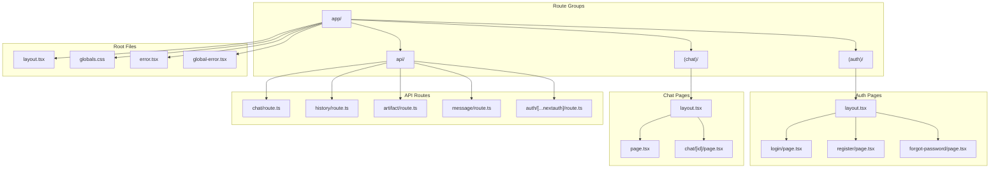
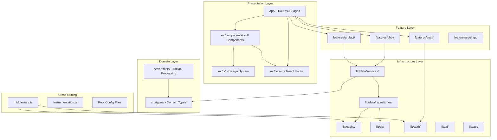

# Functional Structure v6

> **Total Files**: ~274 | **Version**: 6.0.1
> **Generated From**: architecture-v6-final.md
> **Last Updated**: 2024-12-29

---

## Part I: Core Infrastructure (lib/)

### 1.1 lib/data/repositories/

Repository pattern implementation with separate read/write interfaces and cache-through strategy.

---

#### 1.1.1 `base.repository.ts`

**Purpose**: Abstract base class defining repository pattern with generic CRUD operations, caching strategy, and interface contracts.

**Exports**:
```typescript
// Interfaces
export interface Identifiable {
  id: string
}

export interface FindManyOptions {
  where?: Record<string, unknown>
  orderBy?: { field: string; direction: 'asc' | 'desc' }
  limit?: number
  offset?: number
}

export interface CountOptions {
  where?: Record<string, unknown>
}

export interface IReadRepository<T> {
  findById(id: string): Promise<T | null>
  findMany(options?: FindManyOptions): Promise<T[]>
  exists(id: string): Promise<boolean>
  count(options?: CountOptions): Promise<number>
}

export interface IWriteRepository<T, TCreate, TUpdate> {
  create(data: TCreate): Promise<T>
  createMany(data: TCreate[]): Promise<T[]>
  update(id: string, data: TUpdate): Promise<T>
  delete(id: string): Promise<void>
  deleteMany(ids: string[]): Promise<void>
}

// Abstract Base Class
export abstract class BaseRepository<
  T extends Identifiable,
  TCreate,
  TUpdate
> implements IReadRepository<T>, IWriteRepository<T, TCreate, TUpdate> {
  
  // Cache key generators (abstract - must be implemented)
  protected abstract cacheKey(id: string): string
  protected abstract cacheListKey(userId?: string): string
  
  // Cache TTL configuration (abstract)
  protected abstract ttl: number        // Entity TTL in seconds
  protected abstract listTtl: number    // List TTL in seconds
  
  // Read operations (cache-through)
  async findById(id: string): Promise<T | null>
  async findMany(options?: FindManyOptions): Promise<T[]>
  async exists(id: string): Promise<boolean>
  async count(options?: CountOptions): Promise<number>
  
  // Write operations (write-through with invalidation)
  async create(data: TCreate): Promise<T>
  async createMany(data: TCreate[]): Promise<T[]>
  async update(id: string, data: TUpdate): Promise<T>
  async delete(id: string): Promise<void>
  async deleteMany(ids: string[]): Promise<void>
  
  // Cache management
  protected async invalidateCache(id: string): Promise<void>
  protected async invalidateListCache(userId?: string): Promise<void>
  
  // Abstract DB operations (must be implemented by subclasses)
  protected abstract doFindById(id: string): Promise<T | null>
  protected abstract doFindMany(options?: FindManyOptions): Promise<T[]>
  protected abstract doCount(options?: CountOptions): Promise<number>
  protected abstract doCreate(data: TCreate): Promise<T>
  protected abstract doCreateMany(data: TCreate[]): Promise<T[]>
  protected abstract doUpdate(id: string, data: TUpdate): Promise<T>
  protected abstract doDelete(id: string): Promise<void>
  protected abstract doDeleteMany(ids: string[]): Promise<void>
}

// Type utilities
export type RepositoryContext = {
  userId: string
  isGuest: boolean
}
```

**Dependencies**:
- `@/lib/cache` - Redis cache client
- `@/lib/errors` - AppError classes

**Est. LOC**: ~180

---

#### 1.1.2 `chat.repository.ts`

**Purpose**: Chat entity repository with user-scoped queries, visibility controls, and guest/auth dual-path support.

**Exports**:
```typescript
import type { Chat, NewChat, UpdateChat } from '@/src/types'
import { BaseRepository, RepositoryContext } from './base.repository'

export interface ChatFindOptions extends FindManyOptions {
  userId: string
  visibility?: 'public' | 'private'
}

export interface PaginationParams {
  limit: number
  startingAfter?: string | null
  endingBefore?: string | null
}

export interface PaginatedResult<T> {
  items: T[]
  hasMore: boolean
}

export class ChatRepository extends BaseRepository<Chat, NewChat, UpdateChat> {
  // Cache configuration
  protected cacheKey(id: string): string           // `chat:${id}`
  protected cacheListKey(userId: string): string   // `chats:user:${userId}`
  protected ttl = 3600                             // 1 hour
  protected listTtl = 300                          // 5 minutes
  
  // Standard CRUD (inherited + implemented)
  findById(id: string, ctx: RepositoryContext): Promise<Chat | null>
  create(data: NewChat, ctx: RepositoryContext): Promise<Chat>
  update(id: string, data: UpdateChat, ctx: RepositoryContext): Promise<Chat>
  delete(id: string, ctx: RepositoryContext): Promise<void>
  
  // Custom chat-specific methods
  findByUserId(
    userId: string, 
    pagination: PaginationParams, 
    ctx: RepositoryContext
  ): Promise<PaginatedResult<Chat>>
  
  findWithMessages(
    id: string, 
    ctx: RepositoryContext
  ): Promise<{ chat: Chat; messages: Message[] } | null>
  
  updateTitle(
    id: string, 
    title: string, 
    ctx: RepositoryContext
  ): Promise<void>
  
  updateVisibility(
    id: string, 
    visibility: 'public' | 'private', 
    ctx: RepositoryContext
  ): Promise<void>
  
  updateContext(
    id: string, 
    context: AppUsage, 
    ctx: RepositoryContext
  ): Promise<void>
  
  deleteAllForUser(ctx: RepositoryContext): Promise<{ deletedCount: number }>
}

// Singleton export
export const chatRepository: ChatRepository
```

**Dependencies**:
- `./base.repository` - BaseRepository class
- `@/lib/db` - Drizzle client
- `@/lib/db/schema` - Chat schema
- `@/lib/cache` - Redis operations
- `@/src/types` - Chat, NewChat, UpdateChat types
- `drizzle-orm` - Query operators (eq, and, desc, gt, lt)

**Est. LOC**: ~350

---

#### 1.1.3 `message.repository.ts`

**Purpose**: Message entity repository with chat-scoped queries, bulk operations, and timestamp-based deletion for regeneration.

**Exports**:
```typescript
import type { Message, NewMessage, UpdateMessage, DBMessage } from '@/src/types'
import { BaseRepository, RepositoryContext } from './base.repository'

export class MessageRepository extends BaseRepository<Message, NewMessage, UpdateMessage> {
  // Cache configuration
  protected cacheKey(id: string): string           // `message:${id}`
  protected cacheListKey(chatId: string): string   // `messages:chat:${chatId}`
  protected ttl = 1800                             // 30 minutes
  protected listTtl = 300                          // 5 minutes
  
  // Standard CRUD
  findById(id: string): Promise<Message | null>
  create(data: NewMessage): Promise<Message>
  createMany(data: NewMessage[]): Promise<Message[]>
  delete(id: string): Promise<void>
  
  // Chat-scoped queries
  findByChatId(
    chatId: string, 
    ctx: RepositoryContext
  ): Promise<Message[]>
  
  findByChatIdPaginated(
    chatId: string, 
    pagination: PaginationParams, 
    ctx: RepositoryContext
  ): Promise<PaginatedResult<Message>>
  
  // Bulk operations
  saveMany(
    messages: DBMessage[], 
    ctx: RepositoryContext
  ): Promise<void>
  
  saveWithContext(
    params: {
      messages: DBMessage[]
      chatId: string
      lastContext?: AppUsage
      isNewChat?: boolean
      title?: string
      visibility?: VisibilityType
      createdAt?: Date
    },
    ctx: RepositoryContext
  ): Promise<void>
  
  // Regeneration support
  deleteAfterTimestamp(
    chatId: string, 
    timestamp: Date, 
    ctx: RepositoryContext
  ): Promise<void>
  
  // Message count for chat
  countByChatId(chatId: string): Promise<number>
}

// Singleton export
export const messageRepository: MessageRepository
```

**Dependencies**:
- `./base.repository` - BaseRepository class
- `@/lib/db` - Drizzle client
- `@/lib/db/schema` - Message schema
- `@/lib/cache` - Cache operations
- `@/lib/cache/helpers` - `dbMessageToCachedMessage`
- `@/src/types` - Message types
- `drizzle-orm` - Query operators (eq, and, asc, gte, inArray)

**Est. LOC**: ~320

---

#### 1.1.4 `user.repository.ts`

**Purpose**: User entity repository with authentication-related queries and profile management.

**Exports**:
```typescript
import type { User, NewUser, UpdateUser } from '@/src/types'
import { BaseRepository } from './base.repository'

export class UserRepository extends BaseRepository<User, NewUser, UpdateUser> {
  // Cache configuration
  protected cacheKey(id: string): string           // `user:${id}`
  protected cacheListKey(): string                 // Not used (no list queries)
  protected ttl = 7200                             // 2 hours
  protected listTtl = 0                            // N/A
  
  // Standard CRUD
  findById(id: string): Promise<User | null>
  create(data: NewUser): Promise<User>
  update(id: string, data: UpdateUser): Promise<User>
  delete(id: string): Promise<void>
  
  // Auth-specific queries
  findByEmail(email: string): Promise<User | null>
  findByEmailWithPassword(email: string): Promise<UserWithPassword | null>
  
  // Profile updates
  updateLastLogin(id: string): Promise<void>
  
  // Existence check (for registration)
  existsByEmail(email: string): Promise<boolean>
}

// Singleton export
export const userRepository: UserRepository

// Type exports
export type UserWithPassword = User & { password: string }
```

**Dependencies**:
- `./base.repository` - BaseRepository class
- `@/lib/db` - Drizzle client
- `@/lib/db/schema` - User schema
- `@/lib/cache` - Redis operations
- `@/src/types` - User types
- `drizzle-orm` - Query operators (eq)

**Est. LOC**: ~150

---

#### 1.1.5 `artifact.repository.ts`

**Purpose**: Artifact entity repository (unified from Document) with versioning support, chat association, and suggestion queries.

**Exports**:
```typescript
import type { 
  Artifact, 
  NewArtifact, 
  UpdateArtifact,
  ArtifactKind,
  Suggestion 
} from '@/src/types'
import { BaseRepository, RepositoryContext } from './base.repository'

export interface ArtifactVersion {
  title: string
  content: string
  kind: ArtifactKind
  createdAt: Date
  updatedAt: Date
}

export class ArtifactRepository extends BaseRepository<Artifact, NewArtifact, UpdateArtifact> {
  // Cache configuration
  protected cacheKey(id: string): string           // `artifact:${id}`
  protected cacheListKey(chatId: string): string   // `artifacts:chat:${chatId}`
  protected ttl = 3600                             // 1 hour
  protected listTtl = 600                          // 10 minutes
  
  // Standard CRUD
  findById(id: string, ctx: RepositoryContext): Promise<Artifact | null>
  create(data: NewArtifact, ctx: RepositoryContext): Promise<Artifact>
  update(id: string, data: UpdateArtifact, ctx: RepositoryContext): Promise<Artifact>
  delete(id: string, ctx: RepositoryContext): Promise<void>
  
  // Version queries (artifacts support multiple versions)
  findAllVersions(
    id: string, 
    ctx: RepositoryContext
  ): Promise<Artifact[]>
  
  findLatestVersion(
    id: string, 
    ctx: RepositoryContext
  ): Promise<Artifact | null>
  
  // Chat association
  findByChatId(
    chatId: string, 
    ctx: RepositoryContext
  ): Promise<Artifact[]>
  
  // Version management
  saveVersion(
    params: {
      id: string
      chatId: string
      title: string
      kind: ArtifactKind
      content: string
    },
    ctx: RepositoryContext
  ): Promise<Artifact[]>
  
  deleteVersionsAfterTimestamp(
    id: string, 
    timestamp: Date, 
    ctx: RepositoryContext
  ): Promise<Artifact[]>
  
  // Suggestions (related entity)
  findSuggestions(
    id: string, 
    ctx: RepositoryContext
  ): Promise<Suggestion[]>
}

// Singleton export
export const artifactRepository: ArtifactRepository
```

**Dependencies**:
- `./base.repository` - BaseRepository class
- `@/lib/db` - Drizzle client
- `@/lib/db/schema` - Artifact (document) schema, Suggestion schema
- `@/lib/cache` - Cache operations (appendDocumentVersionToCache, etc.)
- `@/src/types` - Artifact types
- `drizzle-orm` - Query operators (eq, and, asc, gt)

**Est. LOC**: ~280

---

#### 1.1.6 `vote.repository.ts`

**Purpose**: Vote entity repository for message voting/feedback with upsert support.

**Exports**:
```typescript
import type { Vote, NewVote, UpdateVote } from '@/src/types'
import { BaseRepository, RepositoryContext } from './base.repository'

export class VoteRepository extends BaseRepository<Vote, NewVote, UpdateVote> {
  // Cache configuration (votes not heavily cached)
  protected cacheKey(chatId: string, messageId: string): string  // `vote:${chatId}:${messageId}`
  protected cacheListKey(chatId: string): string                 // `votes:chat:${chatId}`
  protected ttl = 3600                                           // 1 hour
  protected listTtl = 300                                        // 5 minutes
  
  // Composite key operations
  findByIds(
    chatId: string, 
    messageId: string, 
    ctx: RepositoryContext
  ): Promise<Vote | null>
  
  // Upsert for voting
  upsert(
    data: NewVote, 
    ctx: RepositoryContext
  ): Promise<Vote>
  
  // Chat-scoped queries
  findByChatId(
    chatId: string, 
    ctx: RepositoryContext
  ): Promise<Vote[]>
  
  // Cascade delete (called from chat/message deletion)
  deleteByChatId(chatId: string): Promise<void>
  deleteByMessageId(messageId: string): Promise<void>
}

// Singleton export
export const voteRepository: VoteRepository
```

**Dependencies**:
- `./base.repository` - BaseRepository class
- `@/lib/db` - Drizzle client
- `@/lib/db/schema` - Vote schema
- `@/lib/cache` - Redis operations
- `@/src/types` - Vote types
- `drizzle-orm` - Query operators (eq, and)

**Est. LOC**: ~120

---

#### 1.1.7 `suggestion.repository.ts`

**Purpose**: Suggestion entity repository for AI-generated edit suggestions on artifacts.

**Exports**:
```typescript
import type { Suggestion, NewSuggestion, UpdateSuggestion } from '@/src/types'
import { BaseRepository, RepositoryContext } from './base.repository'

export class SuggestionRepository extends BaseRepository<Suggestion, NewSuggestion, UpdateSuggestion> {
  // Cache configuration (suggestions rarely cached - complex structure)
  protected cacheKey(id: string): string                // `suggestion:${id}`
  protected cacheListKey(documentId: string): string    // `suggestions:doc:${documentId}`
  protected ttl = 1800                                  // 30 minutes
  protected listTtl = 300                               // 5 minutes
  
  // Standard CRUD
  findById(id: string): Promise<Suggestion | null>
  create(data: NewSuggestion, ctx: RepositoryContext): Promise<Suggestion>
  createMany(data: NewSuggestion[]): Promise<Suggestion[]>
  delete(id: string): Promise<void>
  
  // Document-scoped queries
  findByDocumentId(
    documentId: string, 
    ctx: RepositoryContext
  ): Promise<Suggestion[]>
  
  // Cascade delete
  deleteByDocumentId(documentId: string): Promise<void>
  deleteAfterTimestamp(
    documentId: string, 
    timestamp: Date
  ): Promise<void>
}

// Singleton export
export const suggestionRepository: SuggestionRepository
```

**Dependencies**:
- `./base.repository` - BaseRepository class
- `@/lib/db` - Drizzle client
- `@/lib/db/schema` - Suggestion schema
- `@/lib/cache` - Redis operations (minimal)
- `@/src/types` - Suggestion types
- `drizzle-orm` - Query operators (eq, and, gt)

**Est. LOC**: ~100

---

#### 1.1.8 `index.ts`

**Purpose**: Barrel export for all repositories with lazy initialization.

**Exports**:
```typescript
// Repository classes (for testing/extension)
export { BaseRepository } from './base.repository'
export type { 
  IReadRepository, 
  IWriteRepository, 
  Identifiable,
  FindManyOptions,
  CountOptions,
  RepositoryContext 
} from './base.repository'

// Repository instances (singletons)
export { chatRepository } from './chat.repository'
export { messageRepository } from './message.repository'
export { userRepository } from './user.repository'
export { artifactRepository } from './artifact.repository'
export { voteRepository } from './vote.repository'
export { suggestionRepository } from './suggestion.repository'

// Type re-exports for convenience
export type { ChatRepository } from './chat.repository'
export type { MessageRepository } from './message.repository'
export type { UserRepository } from './user.repository'
export type { ArtifactRepository } from './artifact.repository'
export type { VoteRepository } from './vote.repository'
export type { SuggestionRepository } from './suggestion.repository'
```

**Dependencies**:
- All repository modules

**Est. LOC**: ~35

---

### 1.2 lib/data/services/

Service layer for complex orchestration across multiple repositories.

---

#### 1.2.1 `chat.service.ts`

**Purpose**: Orchestration service for chat operations spanning multiple repositories (chat + messages + votes).

**Exports**:
```typescript
import type { RepositoryContext } from '../repositories'
import type { 
  Chat, 
  Message, 
  PaginationParams, 
  PaginatedResult,
  AppUsage 
} from '@/src/types'

export interface ChatWithMessages {
  chat: Chat
  messages: Message[]
}

export interface SaveChatParams {
  chatId: string
  isNewChat: boolean
  userMessage: UIMessage
  assistantMessages: UIMessage[]
  selectedModelId: string
  title: string
  visibility: VisibilityType
  createdAt?: Date
  usage?: AppUsage
}

export const chatService = {
  // Get chat with all messages in optimized single fetch
  getWithMessages(
    chatId: string, 
    ctx: RepositoryContext
  ): Promise<ChatWithMessages | null>
  
  // Get paginated chat history for user
  getHistory(
    pagination: PaginationParams, 
    ctx: RepositoryContext
  ): Promise<PaginatedResult<Chat>>
  
  // Save chat with messages (orchestrates chat + message repos)
  saveChat(
    params: SaveChatParams, 
    ctx: RepositoryContext
  ): Promise<void>
  
  // Delete chat with cascade (chat + messages + votes)
  deleteChat(
    chatId: string, 
    ctx: RepositoryContext
  ): Promise<Chat | null>
  
  // Delete all user chats with cascade
  deleteAllChats(
    ctx: RepositoryContext
  ): Promise<{ deletedCount: number }>
  
  // Update title (background operation)
  updateTitle(
    chatId: string, 
    title: string, 
    ctx: RepositoryContext
  ): Promise<void>
}
```

**Dependencies**:
- `../repositories` - chatRepository, messageRepository, voteRepository
- `@/lib/cache/batch-operations` - Batch cache updates
- `@/lib/cache/helpers` - Message conversion
- `@/src/types` - Type definitions

**Est. LOC**: ~180

---

#### 1.2.2 `artifact.service.ts`

**Purpose**: Orchestration service for artifact operations with version management and suggestion handling.

**Exports**:
```typescript
import type { RepositoryContext } from '../repositories'
import type { Artifact, ArtifactKind, Suggestion } from '@/src/types'

export interface ArtifactWithSuggestions {
  artifact: Artifact
  suggestions: Suggestion[]
}

export interface CreateArtifactParams {
  id: string
  chatId: string
  title: string
  kind: ArtifactKind
  content: string
}

export const artifactService = {
  // Get artifact with suggestions in single operation
  getWithSuggestions(
    id: string, 
    ctx: RepositoryContext
  ): Promise<ArtifactWithSuggestions | null>
  
  // Get all versions of an artifact
  getVersionHistory(
    id: string, 
    ctx: RepositoryContext
  ): Promise<Artifact[]>
  
  // Create new artifact version
  createVersion(
    params: CreateArtifactParams, 
    ctx: RepositoryContext
  ): Promise<Artifact[]>
  
  // Rollback to previous version (delete versions after timestamp)
  rollbackToTimestamp(
    id: string, 
    timestamp: Date, 
    ctx: RepositoryContext
  ): Promise<Artifact[]>
  
  // Get artifacts for a chat
  getForChat(
    chatId: string, 
    ctx: RepositoryContext
  ): Promise<Artifact[]>
}
```

**Dependencies**:
- `../repositories` - artifactRepository, suggestionRepository
- `@/lib/cache` - Document cache operations
- `@/src/types` - Type definitions

**Est. LOC**: ~120

---

#### 1.2.3 `auth.service.ts`

**Purpose**: Authentication-related data operations coordinating user repository with session management.

**Exports**:
```typescript
import type { User, NewUser } from '@/src/types'
import type { AppSession } from '@/lib/auth/session'

export interface AuthCredentials {
  email: string
  password: string
}

export interface RegisterParams extends AuthCredentials {
  name?: string
}

export const authService = {
  // Verify credentials and return user
  verifyCredentials(
    credentials: AuthCredentials
  ): Promise<User | null>
  
  // Register new user
  registerUser(
    params: RegisterParams
  ): Promise<User>
  
  // Get user by session
  getUserFromSession(
    session: AppSession
  ): Promise<User | null>
  
  // Create context from session (utility)
  createContext(
    session: AppSession
  ): RepositoryContext
  
  // Check if session is guest
  isGuest(
    session: AppSession | null
  ): boolean
}
```

**Dependencies**:
- `../repositories` - userRepository
- `@/lib/auth/session` - Session types
- `bcrypt` or similar - Password hashing

**Est. LOC**: ~90

---

#### 1.2.4 `index.ts`

**Purpose**: Barrel export for all services.

**Exports**:
```typescript
export { chatService } from './chat.service'
export type { ChatWithMessages, SaveChatParams } from './chat.service'

export { artifactService } from './artifact.service'
export type { ArtifactWithSuggestions, CreateArtifactParams } from './artifact.service'

export { authService } from './auth.service'
export type { AuthCredentials, RegisterParams } from './auth.service'
```

**Dependencies**:
- All service modules

**Est. LOC**: ~15

---

### 1.3 lib/data/queries/

Typed Drizzle queries for complex operations (joins, aggregations).

---

#### 1.3.1 `chat.queries.ts`

**Purpose**: Complex chat queries including joins with messages and aggregations.

**Exports**:
```typescript
import type { Chat, Message } from '@/src/types'

// Query result types
export interface ChatWithMessageCount extends Chat {
  messageCount: number
}

export interface ChatWithLatestMessage extends Chat {
  latestMessage: Message | null
}

export interface ChatSearchResult {
  chat: Chat
  matchedMessages: Message[]
  relevanceScore: number
}

// Typed query builders
export const chatQueries = {
  // Get chat with message count (for list display)
  withMessageCount(userId: string): Promise<ChatWithMessageCount[]>
  
  // Get chat with latest message preview
  withLatestMessage(chatId: string, userId: string): Promise<ChatWithLatestMessage | null>
  
  // Search chats by message content (full-text)
  searchByContent(
    userId: string, 
    query: string, 
    limit?: number
  ): Promise<ChatSearchResult[]>
  
  // Get chats created within date range
  withinDateRange(
    userId: string,
    startDate: Date,
    endDate: Date
  ): Promise<Chat[]>
  
  // Aggregate: chats per day/week/month
  aggregateByPeriod(
    userId: string,
    period: 'day' | 'week' | 'month'
  ): Promise<{ date: string; count: number }[]>
}
```

**Dependencies**:
- `@/lib/db` - Drizzle client
- `@/lib/db/schema` - Chat, Message schemas
- `drizzle-orm` - Query operators, SQL functions (count, sql, desc)

**Est. LOC**: ~140

---

#### 1.3.2 `message.queries.ts`

**Purpose**: Complex message queries including pagination, search, and role-based filtering.

**Exports**:
```typescript
import type { Message } from '@/src/types'

// Query result types
export interface MessageWithVote extends Message {
  vote: Vote | null
}

export interface MessageSearchResult {
  message: Message
  chatTitle: string
  relevanceScore: number
}

// Typed query builders
export const messageQueries = {
  // Get messages with their vote status
  withVotes(
    chatId: string, 
    userId: string
  ): Promise<MessageWithVote[]>
  
  // Get paginated messages (cursor-based)
  paginated(
    chatId: string,
    options: {
      limit: number
      cursor?: string | null
      direction: 'before' | 'after'
    }
  ): Promise<{ messages: Message[]; nextCursor: string | null }>
  
  // Get messages by role
  byRole(
    chatId: string,
    role: 'user' | 'assistant' | 'system'
  ): Promise<Message[]>
  
  // Search messages across all user chats
  searchAcrossChats(
    userId: string,
    query: string,
    limit?: number
  ): Promise<MessageSearchResult[]>
  
  // Get message count by role per chat
  countByRole(
    chatId: string
  ): Promise<{ role: string; count: number }[]>
}
```

**Dependencies**:
- `@/lib/db` - Drizzle client
- `@/lib/db/schema` - Message, Vote, Chat schemas
- `drizzle-orm` - Query operators, SQL functions

**Est. LOC**: ~130

---

#### 1.3.3 `index.ts`

**Purpose**: Barrel export for all typed queries.

**Exports**:
```typescript
export { chatQueries } from './chat.queries'
export type { 
  ChatWithMessageCount, 
  ChatWithLatestMessage, 
  ChatSearchResult 
} from './chat.queries'

export { messageQueries } from './message.queries'
export type { 
  MessageWithVote, 
  MessageSearchResult 
} from './message.queries'
```

**Dependencies**:
- All query modules

**Est. LOC**: ~15

---

### 1.4 lib/data/ Root Files

---

#### 1.4.1 `types.ts`

**Purpose**: Shared type definitions for data access layer.

**Exports**:
```typescript
import type { AppSession } from '@/lib/auth/session'

// Context types
export interface DataContext {
  userId: string
  isGuest: boolean
}

// Pagination types
export interface PaginationParams {
  limit: number
  startingAfter?: string | null
  endingBefore?: string | null
}

export interface PaginatedResult<T> {
  items: T[]
  hasMore: boolean
}

// Operation result wrapper
export type OperationResult<T> =
  | { success: true; data: T }
  | { success: false; error: string }

// Utility functions
export function createContext(session: AppSession): DataContext
export function isGuest(session: AppSession | null | undefined): boolean
export function success<T>(data: T): OperationResult<T>
export function failure<T>(error: string): OperationResult<T>

// Cache key generators
export const CacheKeys = {
  chat: (id: string) => `chat:${id}`,
  chatList: (userId: string) => `chats:user:${userId}`,
  message: (id: string) => `message:${id}`,
  messageList: (chatId: string) => `messages:chat:${chatId}`,
  artifact: (id: string) => `artifact:${id}`,
  user: (id: string) => `user:${id}`,
  vote: (chatId: string, messageId: string) => `vote:${chatId}:${messageId}`
} as const
```

**Dependencies**:
- `@/lib/auth/session` - AppSession type

**Est. LOC**: ~60

---

#### 1.4.2 `index.ts`

**Purpose**: Main barrel export for entire data access layer.

**Exports**:
```typescript
// Repositories
export * from './repositories'

// Services
export * from './services'

// Queries
export * from './queries'

// Types
export * from './types'

// Convenience re-exports for common usage
export { 
  chatRepository, 
  messageRepository, 
  userRepository, 
  artifactRepository 
} from './repositories'

export { 
  chatService, 
  artifactService, 
  authService 
} from './services'

export { 
  createContext, 
  isGuest 
} from './types'
```

**Dependencies**:
- All submodules

**Est. LOC**: ~25

---

## Summary: lib/data/ Structure

```
lib/data/                              # ~15 files, ~2,110 LOC total
├── index.ts                           # 25 LOC  - Main barrel export
├── types.ts                           # 60 LOC  - Shared types & utilities
├── repositories/                      # 8 files, ~1,535 LOC
│   ├── index.ts                       # 35 LOC  - Repository barrel
│   ├── base.repository.ts             # 180 LOC - Abstract base class
│   ├── chat.repository.ts             # 350 LOC - Chat CRUD + pagination
│   ├── message.repository.ts          # 320 LOC - Message CRUD + bulk ops
│   ├── user.repository.ts             # 150 LOC - User CRUD + auth queries
│   ├── artifact.repository.ts         # 280 LOC - Artifact versioning
│   ├── vote.repository.ts             # 120 LOC - Vote upsert
│   └── suggestion.repository.ts       # 100 LOC - Suggestion queries
├── services/                          # 4 files, ~405 LOC
│   ├── index.ts                       # 15 LOC  - Service barrel
│   ├── chat.service.ts                # 180 LOC - Chat orchestration
│   ├── artifact.service.ts            # 120 LOC - Artifact orchestration
│   └── auth.service.ts                # 90 LOC  - Auth data operations
└── queries/                           # 3 files, ~285 LOC
    ├── index.ts                       # 15 LOC  - Query barrel
    ├── chat.queries.ts                # 140 LOC - Complex chat queries
    └── message.queries.ts             # 130 LOC - Complex message queries
```

### Key Patterns

| Pattern | Implementation |
|---------|----------------|
| **Repository** | `BaseRepository<T, TCreate, TUpdate>` with `IReadRepository`, `IWriteRepository` |
| **Cache-Through** | Read: cache → DB fallback → warm cache |
| **Write-Through** | Write: DB first → cache invalidation |
| **Guest/Auth Dual-Path** | `ctx.isGuest` → cache-only vs cache+DB |
| **Singleton Export** | `export const chatRepository = new ChatRepository()` |
| **Service Orchestration** | Services coordinate multiple repositories |
| **Typed Queries** | Drizzle query builders for complex joins |

### Migration Notes

| Old (archive/oldapp) | New (lib/data/) |
|---------------------|-----------------|
| `chatData.get()` | `chatRepository.findById()` |
| `chatData.getWithMessages()` | `chatService.getWithMessages()` |
| `chatData.list()` | `chatRepository.findByUserId()` |
| `messageData.save()` | `messageRepository.saveMany()` |
| `messageData.saveWithContext()` | `chatService.saveChat()` |
| `documentData.get()` | `artifactRepository.findLatestVersion()` |
| `documentData.getAll()` | `artifactRepository.findAllVersions()` |

---

### 1.5 lib/cache/

Redis caching layer with Upstash client, supporting cache-through reads and write-through with invalidation. Handles dual-path for Guest (Redis-only) vs Auth (Redis + DB) users.

```
lib/cache/
├── index.ts                    # Barrel export
├── client.ts                   # Redis client singleton
├── keys.ts                     # Cache key generators
├── operations.ts               # Core cache operations (get/set/del)
├── batch-operations.ts         # Batch updates for lists
├── helpers.ts                  # Type conversion (DB ↔ Cache)
├── message-cache.ts            # Message-specific caching
└── document-cache.ts           # Artifact/document caching
```

---

#### 1.5.1 `client.ts`

**Purpose**: Redis client singleton using Upstash serverless Redis. Handles connection lifecycle and provides typed client instance.

**Exports**:
```typescript
import { Redis } from '@upstash/redis'

// Redis client singleton
export const redis: Redis

// Client configuration type
export interface RedisConfig {
  url: string
  token: string
}

// Connection health check
export async function ping(): Promise<boolean>

// Client getter (for testing/mocking)
export function getClient(): Redis
```

**Dependencies**:
- `@upstash/redis` - Upstash Redis client

**Est. LOC**: ~35

---

#### 1.5.2 `keys.ts`

**Purpose**: Centralized cache key generators ensuring consistent naming conventions across the application. Prevents key collisions and enables pattern-based invalidation.

**Exports**:
```typescript
// Key prefix constants
export const KEY_PREFIX = {
  CHAT: 'chat',
  CHAT_LIST: 'chats:user',
  MESSAGE: 'message',
  MESSAGE_LIST: 'messages:chat',
  ARTIFACT: 'artifact',
  ARTIFACT_VERSIONS: 'artifact:versions',
  USER: 'user',
  VOTE: 'vote',
  SESSION: 'session',
  GUEST: 'guest'
} as const

// Key generators
export const CacheKeys = {
  // Chat keys
  chat: (id: string) => `${KEY_PREFIX.CHAT}:${id}`,
  chatList: (userId: string) => `${KEY_PREFIX.CHAT_LIST}:${userId}`,
  
  // Message keys
  message: (id: string) => `${KEY_PREFIX.MESSAGE}:${id}`,
  messageList: (chatId: string) => `${KEY_PREFIX.MESSAGE_LIST}:${chatId}`,
  
  // Artifact keys
  artifact: (id: string) => `${KEY_PREFIX.ARTIFACT}:${id}`,
  artifactVersions: (documentId: string) => `${KEY_PREFIX.ARTIFACT_VERSIONS}:${documentId}`,
  
  // User keys
  user: (id: string) => `${KEY_PREFIX.USER}:${id}`,
  
  // Vote keys
  vote: (chatId: string, messageId: string) => `${KEY_PREFIX.VOTE}:${chatId}:${messageId}`,
  
  // Session keys
  session: (token: string) => `${KEY_PREFIX.SESSION}:${token}`,
  
  // Guest keys
  guestChat: (guestId: string, chatId: string) => `${KEY_PREFIX.GUEST}:${guestId}:chat:${chatId}`,
  guestChatList: (guestId: string) => `${KEY_PREFIX.GUEST}:${guestId}:chats`
} as const

// Pattern generators for bulk invalidation
export const CachePatterns = {
  allUserChats: (userId: string) => `${KEY_PREFIX.CHAT_LIST}:${userId}*`,
  allChatMessages: (chatId: string) => `${KEY_PREFIX.MESSAGE_LIST}:${chatId}*`,
  allGuestData: (guestId: string) => `${KEY_PREFIX.GUEST}:${guestId}:*`
} as const

// Type for cache key
export type CacheKey = ReturnType<typeof CacheKeys[keyof typeof CacheKeys]>
```

**Dependencies**:
- None (pure utility)

**Est. LOC**: ~55

---

#### 1.5.3 `operations.ts`

**Purpose**: Core cache operations wrapping Redis commands with error handling, serialization, and TTL management.

**Exports**:
```typescript
import type { Redis } from '@upstash/redis'

// TTL constants (in seconds)
export const TTL = {
  SHORT: 300,        // 5 minutes - lists, frequently changing
  MEDIUM: 3600,      // 1 hour - entities
  LONG: 86400,       // 24 hours - user profiles, settings
  SESSION: 604800    // 7 days - sessions
} as const

// Options for set operations
export interface SetOptions {
  ex?: number        // Expire time in seconds
  px?: number        // Expire time in milliseconds
  nx?: boolean       // Only set if not exists
  xx?: boolean       // Only set if exists
}

// Core operations
export async function get<T>(key: string): Promise<T | null>
export async function set<T>(key: string, value: T, options?: SetOptions): Promise<void>
export async function del(key: string): Promise<void>
export async function exists(key: string): Promise<boolean>

// Expiration operations
export async function expire(key: string, seconds: number): Promise<void>
export async function ttl(key: string): Promise<number>

// Atomic operations
export async function incr(key: string): Promise<number>
export async function decr(key: string): Promise<number>

// Hash operations (for complex objects)
export async function hget<T>(key: string, field: string): Promise<T | null>
export async function hset<T>(key: string, field: string, value: T): Promise<void>
export async function hdel(key: string, field: string): Promise<void>
export async function hgetall<T>(key: string): Promise<Record<string, T> | null>

// Error wrapper
export class CacheError extends Error {
  constructor(
    message: string,
    public readonly operation: string,
    public readonly key: string,
    public readonly cause?: Error
  )
}
```

**Dependencies**:
- `./client` - Redis client singleton

**Est. LOC**: ~120

---

#### 1.5.4 `batch-operations.ts`

**Purpose**: Batch cache operations for efficient list updates. Supports atomic multi-key operations and pipeline execution.

**Exports**:
```typescript
import type { SetOptions } from './operations'

// Batch set operation
export interface BatchSetItem<T = unknown> {
  key: string
  value: T
  options?: SetOptions
}

// Batch operations
export async function batchGet<T>(keys: string[]): Promise<(T | null)[]>
export async function batchSet<T>(items: BatchSetItem<T>[]): Promise<void>
export async function batchDel(keys: string[]): Promise<void>
export async function batchExists(keys: string[]): Promise<boolean[]>

// Pipeline execution
export interface PipelineOperation {
  op: 'get' | 'set' | 'del' | 'expire'
  key: string
  value?: unknown
  options?: SetOptions
}

export async function executePipeline(operations: PipelineOperation[]): Promise<unknown[]>

// List update helpers
export async function updateListCache<T>(
  listKey: string,
  items: T[],
  options?: SetOptions
): Promise<void>

export async function appendToList<T>(
  listKey: string,
  item: T,
  maxLength?: number
): Promise<void>

export async function removeFromList<T>(
  listKey: string,
  predicate: (item: T) => boolean
): Promise<void>

// Invalidation helpers
export async function invalidatePattern(pattern: string): Promise<number>
export async function invalidateMany(keys: string[]): Promise<void>
```

**Dependencies**:
- `./client` - Redis client singleton
- `./operations` - Core operations

**Est. LOC**: ~140

---

#### 1.5.5 `helpers.ts`

**Purpose**: Type conversion utilities for transforming data between DB format and cache format. Handles Date serialization, BigInt conversion, and nested object flattening.

**Exports**:
```typescript
// Serialization for cache storage
export function serialize<T>(value: T): string
export function deserialize<T>(value: string): T

// Date handling (JSON doesn't preserve Date objects)
export function serializeDates<T extends Record<string, unknown>>(obj: T): T
export function deserializeDates<T extends Record<string, unknown>>(
  obj: T,
  dateFields: (keyof T)[]
): T

// DB to Cache conversion
export interface DBToCacheOptions {
  dateFields?: string[]
  excludeFields?: string[]
  transformers?: Record<string, (value: unknown) => unknown>
}

export function dbToCache<TDB, TCache>(
  dbRecord: TDB,
  options?: DBToCacheOptions
): TCache

// Cache to DB conversion (for writes)
export function cacheToDb<TCache, TDB>(
  cacheRecord: TCache,
  options?: DBToCacheOptions
): TDB

// Type guards
export function isCacheHit<T>(value: T | null): value is T
export function isCacheMiss<T>(value: T | null): value is null

// Compression for large objects
export async function compress(data: string): Promise<string>
export async function decompress(data: string): Promise<string>

// Size estimation
export function estimateSize(value: unknown): number
export const MAX_CACHE_SIZE = 1024 * 1024 // 1MB limit
```

**Dependencies**:
- None (pure utility)

**Est. LOC**: ~100

---

#### 1.5.6 `message-cache.ts`

**Purpose**: Message-specific caching strategies. Handles ordered message lists, incremental updates, and efficient pagination from cache.

**Exports**:
```typescript
import type { Message, DBMessage } from '@/lib/db/schema'
import type { SetOptions } from './operations'

// Message cache configuration
export const MESSAGE_CACHE_CONFIG = {
  ttl: 3600,           // 1 hour
  listTtl: 300,        // 5 minutes for lists
  maxMessagesPerChat: 1000
} as const

// Single message operations
export async function getMessage(messageId: string): Promise<Message | null>
export async function setMessage(message: Message, options?: SetOptions): Promise<void>
export async function deleteMessage(messageId: string): Promise<void>

// Message list operations
export async function getMessagesByChatId(chatId: string): Promise<Message[] | null>
export async function setMessagesByChatId(
  chatId: string,
  messages: Message[],
  options?: SetOptions
): Promise<void>
export async function invalidateMessageList(chatId: string): Promise<void>

// Incremental updates (for streaming)
export async function appendMessage(chatId: string, message: Message): Promise<void>
export async function updateMessageInList(
  chatId: string,
  messageId: string,
  updates: Partial<Message>
): Promise<void>

// Bulk operations
export async function saveMessages(messages: Message[]): Promise<void>
export async function deleteMessagesByChatId(chatId: string): Promise<void>

// DB ↔ Cache conversion
export function dbMessageToCache(dbMessage: DBMessage): Message
export function cacheMessageToDb(message: Message): DBMessage
export function dbMessagesToCache(dbMessages: DBMessage[]): Message[]
```

**Dependencies**:
- `./client` - Redis client
- `./keys` - CacheKeys.message, CacheKeys.messageList
- `./operations` - get, set, del
- `./batch-operations` - batchSet, batchDel
- `./helpers` - serializeDates, deserializeDates
- `@/lib/db/schema` - Message, DBMessage types

**Est. LOC**: ~150

---

#### 1.5.7 `document-cache.ts`

**Purpose**: Artifact/document caching with version support. Handles latest version lookup, version history caching, and content deduplication.

**Exports**:
```typescript
import type { Document, DBDocument } from '@/lib/db/schema'
import type { SetOptions } from './operations'

// Document cache configuration
export const DOCUMENT_CACHE_CONFIG = {
  ttl: 3600,           // 1 hour
  versionsTtl: 1800,   // 30 minutes for version lists
  maxVersionsCache: 50
} as const

// Single document operations
export async function getDocument(documentId: string): Promise<Document | null>
export async function setDocument(document: Document, options?: SetOptions): Promise<void>
export async function deleteDocument(documentId: string): Promise<void>

// Version operations
export async function getLatestVersion(documentId: string): Promise<Document | null>
export async function getDocumentVersions(documentId: string): Promise<Document[] | null>
export async function setDocumentVersions(
  documentId: string,
  versions: Document[],
  options?: SetOptions
): Promise<void>
export async function invalidateVersions(documentId: string): Promise<void>

// Add new version (atomic)
export async function addVersion(document: Document): Promise<void>

// Content-based caching (for deduplication)
export async function getByContentHash(hash: string): Promise<Document | null>
export async function setByContentHash(
  hash: string,
  document: Document,
  options?: SetOptions
): Promise<void>

// Bulk operations
export async function saveDocuments(documents: Document[]): Promise<void>
export async function deleteDocumentsByChatId(chatId: string): Promise<void>

// DB ↔ Cache conversion
export function dbDocumentToCache(dbDocument: DBDocument): Document
export function cacheDocumentToDb(document: Document): DBDocument
export function dbDocumentsToCache(dbDocuments: DBDocument[]): Document[]
```

**Dependencies**:
- `./client` - Redis client
- `./keys` - CacheKeys.artifact, CacheKeys.artifactVersions
- `./operations` - get, set, del
- `./batch-operations` - batchSet
- `./helpers` - serializeDates, deserializeDates
- `@/lib/db/schema` - Document, DBDocument types

**Est. LOC**: ~140

---

#### 1.5.8 `index.ts`

**Purpose**: Barrel export for cache module. Provides unified API for all caching functionality.

**Exports**:
```typescript
// Client
export { redis, ping, getClient } from './client'

// Keys
export { CacheKeys, CachePatterns, KEY_PREFIX } from './keys'
export type { CacheKey } from './keys'

// Core operations
export { get, set, del, exists, expire, ttl } from './operations'
export { incr, decr, hget, hset, hdel, hgetall } from './operations'
export { TTL, CacheError } from './operations'
export type { SetOptions } from './operations'

// Batch operations
export { batchGet, batchSet, batchDel, batchExists } from './batch-operations'
export { executePipeline, updateListCache, appendToList, removeFromList } from './batch-operations'
export { invalidatePattern, invalidateMany } from './batch-operations'

// Helpers
export { serialize, deserialize, serializeDates, deserializeDates } from './helpers'
export { dbToCache, cacheToDb, isCacheHit, isCacheMiss } from './helpers'
export { compress, decompress, estimateSize, MAX_CACHE_SIZE } from './helpers'

// Entity-specific caching
export * from './message-cache'
export * from './document-cache'

// Convenience alias
export { get as cacheGet, set as cacheSet, del as cacheDel } from './operations'
```

**Dependencies**:
- All submodules

**Est. LOC**: ~40

---

## Summary: lib/cache/ Structure

```
lib/cache/                             # 9 files, ~900 LOC total
├── index.ts                           # 40 LOC  - Barrel export
├── client.ts                          # 35 LOC  - Redis client singleton
├── keys.ts                            # 55 LOC  - Cache key generators
├── operations.ts                      # 120 LOC - Core cache operations
├── batch-operations.ts                # 140 LOC - Batch/pipeline operations
├── helpers.ts                         # 100 LOC - Type conversion utilities
├── message-cache.ts                   # 150 LOC - Message-specific caching
├── document-cache.ts                  # 140 LOC - Artifact/document caching
└── quota.ts                           # 120 LOC - Daily message quota tracking
```

### Key Patterns

| Pattern | Implementation |
|---------|----------------|
| **Cache-Through Read** | `get()` → check cache → fallback to DB → warm cache |
| **Write-Through** | DB write first → cache set/invalidate |
| **Guest Cache-Only** | `guestChat()`, `guestChatList()` keys → Redis only, no DB |
| **Auth Cache + DB** | Standard keys → cache layer over DB |
| **Batch Operations** | `batchGet()`, `batchSet()` for list updates |
| **Pattern Invalidation** | `invalidatePattern()` for bulk cache clear |
| **Entity-Specific** | `message-cache.ts`, `document-cache.ts` for domain logic |
| **TTL Tiers** | SHORT (5m), MEDIUM (1h), LONG (24h), SESSION (7d) |

---

#### 1.5.9 `quota.ts` (NEW)

**Purpose**: Daily message quota tracking via Redis counters with automatic TTL expiry.

**Dependencies**:
- `./client` - Redis client
- `./keys` - Cache key generators
- `@/lib/log` - Error logging

**Exports (~120 LOC)**:
```typescript
import { redis } from './client'
import { cacheKeys } from './keys'
import { logError } from '@/lib/log'

// Get quota date key (YYYY-MM-DD)
function getQuotaDateKey(): string

// Get current message count for user today
export async function getUserMessageCount(userId: string): Promise<number>

// Atomic increment with 25-hour TTL (Lua script)
export async function incrementUserMessageCount(
  userId: string,
  delta?: number
): Promise<number>

// Fire-and-forget increment (async, no await)
export function incrementUserMessageCountAsync(
  userId: string,
  delta?: number
): void

// Check if user is within quota
export async function isWithinQuota(
  userId: string,
  limit: number
): Promise<boolean>

// Admin: reset user quota
export async function resetUserQuota(userId: string): Promise<void>

// Admin: batch get counts
export async function getBatchUserMessageCounts(
  userIds: string[]
): Promise<Map<string, number>>
```

**Lua Script** (atomic increment + TTL):
```lua
local key = KEYS[1]
local delta = tonumber(ARGV[1])
local ttl = tonumber(ARGV[2])

local newCount = redis.call('INCRBY', key, delta)
if newCount == delta then
  redis.call('EXPIRE', key, ttl)
end
return newCount
```

**Cache Key Pattern**:
```typescript
// In keys.ts add:
export const KEY_PREFIX = {
  // ... existing
  QUOTA: 'quota',
}

export const cacheKeys = {
  // ... existing
  quota: (userId: string, date: string) => 
    `${KEY_PREFIX.QUOTA}:{${userId}}:${date}` as const,
  quotaToday: (userId: string) =>
    `${KEY_PREFIX.QUOTA}:{${userId}}:${new Date().toISOString().split('T')[0]}` as const,
}
```

**Usage**:
```typescript
// In stream-chat.action.ts
const count = await getUserMessageCount(userId)
const limit = getMessageLimit(userType)
if (count >= limit) {
  throw new QuotaExceededError('Daily message limit reached')
}
// After successful message
incrementUserMessageCountAsync(userId)
```

**Est. LOC**: ~120

---

### Integration with lib/data/

| Data Layer | Cache Layer |
|------------|-------------|
| `BaseRepository.findById()` | → `get(CacheKeys.chat(id))` |
| `BaseRepository.create()` | → `set()` + `invalidateListCache()` |
| `ChatRepository.findByUserId()` | → `get(CacheKeys.chatList(userId))` |
| `MessageRepository.saveMany()` | → `saveMessages()` from message-cache |
| `ArtifactRepository.findLatestVersion()` | → `getLatestVersion()` from document-cache |

---

### 1.6 lib/rate-limit/

Edge-compatible rate limiting using Upstash Ratelimit with route-specific configurations.

```
lib/rate-limit/                        # 4 files, ~120 LOC total
├── index.ts                           # Barrel export
├── client.ts                          # Upstash Ratelimit instance
├── config.ts                          # Route-specific limits config
└── middleware.ts                      # Rate limit middleware helper
```

---

#### 1.6.1 `client.ts`

**Purpose**: Creates singleton Upstash Ratelimit client instance for Edge runtime. Handles Redis connection and provides the core rate limiter.

**Exports**:
```typescript
import { Ratelimit } from '@upstash/ratelimit'
import { Redis } from '@upstash/redis'

// Singleton Redis client for rate limiting
const redis = new Redis({
  url: process.env.UPSTASH_REDIS_REST_URL!,
  token: process.env.UPSTASH_REDIS_REST_TOKEN!,
})

// Default rate limiter (sliding window algorithm)
export const ratelimit = new Ratelimit({
  redis,
  limiter: Ratelimit.slidingWindow(500, '1 m'),
  analytics: true,
  prefix: 'ratelimit',
})

export { redis }
```

**Dependencies**:
- `@upstash/ratelimit` - Rate limiting library
- `@upstash/redis` - Redis client

**Est. LOC**: ~25

---

#### 1.6.2 `config.ts`

**Purpose**: Defines route-specific rate limit configurations. Maps API routes to their allowed request limits per time window.

**Exports**:
```typescript
import { Ratelimit } from '@upstash/ratelimit'

// Rate limit configuration per route
export type RateLimitConfig = {
  requests: number
  window: '1 m' | '1 h' | '1 d'
  algorithm: 'slidingWindow' | 'fixedWindow' | 'tokenBucket'
}

// Route-specific limits (requests per minute unless specified)
export const RATE_LIMITS: Record<string, RateLimitConfig> = {
  // Chat endpoints - most restrictive (AI calls are expensive)
  '/api/chat': { requests: 10, window: '1 m', algorithm: 'slidingWindow' },
  
  // History endpoints - moderate
  '/api/history': { requests: 30, window: '1 m', algorithm: 'slidingWindow' },
  
  // Artifact endpoints
  '/api/artifact': { requests: 60, window: '1 m', algorithm: 'slidingWindow' },
  
  // File upload - very restrictive
  '/api/files/upload': { requests: 3, window: '1 m', algorithm: 'slidingWindow' },
  
  // Default for all other routes
  default: { requests: 60, window: '1 m', algorithm: 'slidingWindow' },
} as const

// Helper to get config for a route
export function getRateLimitConfig(pathname: string): RateLimitConfig {
  // Check exact match first
  if (RATE_LIMITS[pathname]) {
    return RATE_LIMITS[pathname]
  }
  
  // Check prefix matches (e.g., /api/chat/[id] matches /api/chat)
  for (const [route, config] of Object.entries(RATE_LIMITS)) {
    if (route !== 'default' && pathname.startsWith(route)) {
      return config
    }
  }
  
  return RATE_LIMITS.default
}

// Create a rate limiter for specific config
export function createRateLimiter(
  redis: Redis,
  config: RateLimitConfig
): Ratelimit {
  const limiter = config.algorithm === 'slidingWindow'
    ? Ratelimit.slidingWindow(config.requests, config.window)
    : config.algorithm === 'fixedWindow'
    ? Ratelimit.fixedWindow(config.requests, config.window)
    : Ratelimit.tokenBucket(config.requests, config.window, config.requests)
  
  return new Ratelimit({ redis, limiter, analytics: true })
}
```

**Dependencies**:
- `@upstash/ratelimit` - Rate limiter types
- `@upstash/redis` - Redis type for factory

**Est. LOC**: ~55

---

#### 1.6.3 `middleware.ts`

**Purpose**: Middleware helper for applying rate limiting in Edge middleware or API routes. Handles limit checking and error responses.

**Exports**:
```typescript
import type { NextRequest } from 'next/server'
import { NextResponse } from 'next/server'
import { ratelimit, redis } from './client'
import { getRateLimitConfig, createRateLimiter } from './config'

export type RateLimitResult = {
  success: boolean
  limit: number
  remaining: number
  reset: number
}

// Check rate limit for a request
export async function checkRateLimit(
  request: NextRequest,
  identifier?: string
): Promise<RateLimitResult> {
  const ip = identifier ?? request.ip ?? request.headers.get('x-forwarded-for') ?? 'anonymous'
  const pathname = request.nextUrl.pathname
  
  // Get route-specific config
  const config = getRateLimitConfig(pathname)
  const limiter = createRateLimiter(redis, config)
  
  // Use route + IP as the rate limit key
  const key = `${pathname}:${ip}`
  const result = await limiter.limit(key)
  
  return {
    success: result.success,
    limit: result.limit,
    remaining: result.remaining,
    reset: result.reset,
  }
}

// Create rate limit error response
export function rateLimitResponse(result: RateLimitResult): NextResponse {
  return NextResponse.json(
    { error: 'Too many requests', retryAfter: Math.ceil((result.reset - Date.now()) / 1000) },
    {
      status: 429,
      headers: {
        'X-RateLimit-Limit': result.limit.toString(),
        'X-RateLimit-Remaining': result.remaining.toString(),
        'X-RateLimit-Reset': result.reset.toString(),
        'Retry-After': Math.ceil((result.reset - Date.now()) / 1000).toString(),
      },
    }
  )
}

// Add rate limit headers to response
export function addRateLimitHeaders(
  response: NextResponse,
  result: RateLimitResult
): NextResponse {
  response.headers.set('X-RateLimit-Limit', result.limit.toString())
  response.headers.set('X-RateLimit-Remaining', result.remaining.toString())
  response.headers.set('X-RateLimit-Reset', result.reset.toString())
  return response
}
```

**Dependencies**:
- `next/server` - NextRequest, NextResponse
- `./client` - Rate limiter instance
- `./config` - Route config lookup

**Est. LOC**: ~55

---

#### 1.6.4 `index.ts`

**Purpose**: Barrel export for rate limiting module.

**Exports**:
```typescript
// Client
export { ratelimit, redis } from './client'

// Config
export { RATE_LIMITS, getRateLimitConfig, createRateLimiter } from './config'
export type { RateLimitConfig } from './config'

// Middleware
export { checkRateLimit, rateLimitResponse, addRateLimitHeaders } from './middleware'
export type { RateLimitResult } from './middleware'
```

**Dependencies**:
- All submodules

**Est. LOC**: ~15

---

## Summary: lib/rate-limit/ Structure

```
lib/rate-limit/                        # 4 files, ~150 LOC total
├── index.ts                           # 15 LOC  - Barrel export
├── client.ts                          # 25 LOC  - Upstash client singleton
├── config.ts                          # 55 LOC  - Route-specific limits
└── middleware.ts                      # 55 LOC  - Middleware helpers
```

### Rate Limit Configuration

| Route | Limit | Window | Rationale |
|-------|-------|--------|-----------|
| `/api/chat` | 50 | 1 min | AI calls expensive, prevent abuse |
| `/api/history` | 100 | 1 min | Moderate, sidebar polling |
| `/api/artifact` | 200 | 1 min | Frequent polling for updates |
| Default | 500 | 1 min | General API protection |

### Integration Pattern

```typescript
// In middleware.ts (Edge)
import { checkRateLimit, rateLimitResponse, addRateLimitHeaders } from '@/lib/rate-limit'

export async function middleware(request: NextRequest) {
  const result = await checkRateLimit(request)
  
  if (!result.success) {
    return rateLimitResponse(result)
  }
  
  const response = NextResponse.next()
  return addRateLimitHeaders(response, result)
}
```

---

### 1.7 lib/hooks/

Shared React hooks for client-side state management, UI behavior, and viewport detection.

```
lib/hooks/                             # 8 files, ~550 LOC total
├── index.ts                           # Barrel export
├── use-artifact.ts                    # Artifact state hook
├── use-messages.tsx                   # Message streaming hook
├── use-optimistic-chats.tsx           # Optimistic updates
├── use-scroll-to-bottom.tsx           # Auto-scroll behavior
├── use-chat-visibility.ts             # Visibility toggle
├── use-window-size.ts                 # Viewport dimensions
└── use-mobile.ts                      # Mobile breakpoint
```

---

#### 1.7.1 `use-artifact.ts`

**Purpose**: Manages artifact state using SWR for client-side caching. Provides both selector pattern for optimized reads and full state access for mutations.

**Exports**:
```typescript
import type { Dispatch, SetStateAction } from 'react'
import { useCallback, useEffect, useMemo, useRef, useState } from 'react'
import useSWR from 'swr'
import type { UIArtifact } from '@/components/artifact'

// Initial state for SSR hydration safety
export const initialArtifactData: UIArtifact = {
  documentId: 'init',
  content: '',
  kind: 'text',
  title: '',
  status: 'idle',
  isVisible: false,
  boundingBox: { top: 0, left: 0, width: 0, height: 0 },
}

// Selector type for optimized reads
type Selector<T> = (state: UIArtifact) => T

/**
 * Selector hook for reading specific artifact state.
 * Avoids re-renders when unrelated state changes.
 * @example
 * const isVisible = useArtifactSelector(state => state.isVisible)
 */
export function useArtifactSelector<Selected>(
  selector: Selector<Selected>
): Selected

/**
 * Full artifact state hook for mutations.
 * Returns artifact data and setters.
 */
export function useArtifact(): {
  artifact: UIArtifact
  setArtifact: (updater: UIArtifact | ((current: UIArtifact) => UIArtifact)) => void
  metadata: ArtifactMetadata
  setMetadata: Dispatch<SetStateAction<ArtifactMetadata>>
}

// Internal: ArtifactMetadata is dynamic per artifact type
type ArtifactMetadata = any
```

**Dependencies**:
- `react` - Hooks
- `swr` - Client-side caching
- `@/components/artifact` - UIArtifact type

**Est. LOC**: ~155

---

#### 1.7.2 `use-messages.tsx`

**Purpose**: Manages message list state and auto-scroll behavior during AI streaming. Tracks submission state for loading indicators.

**Exports**:
```typescript
import type { UseChatHelpers } from '@ai-sdk/react'
import { useEffect, useState } from 'react'
import type { ChatMessage } from '@/lib/types'
import { useScrollToBottom } from './use-scroll-to-bottom'

export function useMessages({
  status,
}: {
  status: UseChatHelpers<ChatMessage>['status']
}): {
  containerRef: React.RefObject<HTMLDivElement>
  endRef: React.RefObject<HTMLDivElement>
  isAtBottom: boolean
  scrollToBottom: () => void
  onViewportEnter: () => void
  onViewportLeave: () => void
  hasSentMessage: boolean
}
```

**Dependencies**:
- `react` - Hooks
- `@ai-sdk/react` - Chat status type
- `@/lib/types` - ChatMessage type
- `./use-scroll-to-bottom` - Scroll behavior

**Est. LOC**: ~40

---

#### 1.7.3 `use-optimistic-chats.tsx`

**Purpose**: Provides optimistic UI updates for chat creation. Shows new chats immediately in sidebar while waiting for server confirmation.

**Exports**:
```typescript
import { createContext, useContext, type ReactNode } from 'react'

type OptimisticChat = {
  id: string
  title: string
  createdAt: Date
}

type OptimisticChatsContextType = {
  optimisticChats: OptimisticChat[]
  addOptimisticChat: (chatId: string, initialTitle?: string) => void
  updateOptimisticChatTitle: (chatId: string, title: string) => void
  removeOptimisticChat: (chatId: string) => void
}

// Provider component
export function OptimisticChatsProvider({ children }: { children: ReactNode }): JSX.Element

// Hook to access optimistic chat state
export function useOptimisticChats(): OptimisticChatsContextType

// Constants
const MAX_OPTIMISTIC_CHATS = 50  // Prevent unbounded memory growth
```

**Dependencies**:
- `react` - Context, hooks
- `@/lib/errors` - ChatSDKError

**Est. LOC**: ~115

---

#### 1.7.4 `use-scroll-to-bottom.tsx`

**Purpose**: Auto-scroll behavior for chat messages. Detects when user is at bottom, handles scroll-on-new-message, and provides manual scroll controls.

**Exports**:
```typescript
import { useCallback, useEffect, useRef, useState } from 'react'
import useSWR from 'swr'

// Threshold for "at bottom" detection (pixels from bottom)
const SCROLL_BOTTOM_THRESHOLD = 100

export function useScrollToBottom(): {
  // Refs for container and end marker
  containerRef: React.RefObject<HTMLDivElement>
  endRef: React.RefObject<HTMLDivElement>
  
  // State
  isAtBottom: boolean
  
  // Actions
  scrollToBottom: (behavior?: ScrollBehavior) => void
  
  // Viewport tracking (for sticky scroll behavior)
  onViewportEnter: () => void
  onViewportLeave: () => void
}
```

**Dependencies**:
- `react` - Hooks, refs
- `swr` - Scroll flag state

**Est. LOC**: ~130

---

#### 1.7.5 `use-chat-visibility.ts`

**Purpose**: Manages chat visibility (public/private) toggle with optimistic updates. Syncs with server and handles concurrent update deduplication.

**Exports**:
```typescript
import { useMemo, useRef } from 'react'
import useSWR, { useSWRConfig } from 'swr'
import useSWRInfinite from 'swr/infinite'
import type { VisibilityType } from '@/components/visibility-selector'

export function useChatVisibility({
  chatId,
  initialVisibilityType,
}: {
  chatId: string
  initialVisibilityType: VisibilityType
}): {
  visibilityType: VisibilityType
  setVisibilityType: (type: VisibilityType) => Promise<void>
  isPending: boolean
}
```

**Dependencies**:
- `react` - Hooks
- `swr` - Caching, infinite loading
- `sonner` - Toast notifications
- `@/app/(chat)/actions` - Server action
- `@/components/visibility-selector` - Type

**Est. LOC**: ~100

---

#### 1.7.6 `use-window-size.ts`

**Purpose**: Tracks viewport dimensions with SSR safety. Provides computed breakpoint states for responsive layouts.

**Exports**:
```typescript
type WindowSize = {
  width: number
  height: number
}

type UseWindowSizeReturn = {
  windowSize: WindowSize | null  // null during SSR
  width: number                   // 0 during SSR
  height: number                  // 0 during SSR
  isReady: boolean               // true after hydration
  isMobile: boolean              // width < 768
  isTablet: boolean              // 768 <= width < 1024
  isDesktop: boolean             // width >= 1024
}

// Breakpoint constants
export const MOBILE_BREAKPOINT = 768
export const TABLET_BREAKPOINT = 1024

export function useWindowSize(): UseWindowSizeReturn
```

**Dependencies**:
- `react` - Hooks

**Est. LOC**: ~60

---

#### 1.7.7 `use-mobile.ts`

**Purpose**: Simplified mobile detection hook with SSR hydration support. Can accept initial value from server header for flash-free rendering.

**Exports**:
```typescript
export type UseMobileOptions = {
  /** Initial mobile state from server (via x-device-type header) */
  initialIsMobile?: boolean
}

// Breakpoint constant
export const MOBILE_BREAKPOINT = 768

/**
 * Hook to detect mobile viewport.
 * @param options.initialIsMobile - Optional server-provided initial value
 * @returns boolean | undefined (undefined during SSR if no initial value)
 * 
 * @example
 * // Server component passes initial value
 * const headersList = await headers()
 * const isMobile = headersList.get('x-device-type') === 'mobile'
 * <ClientComponent initialIsMobile={isMobile} />
 * 
 * // Client component uses hook
 * const isMobile = useIsMobile({ initialIsMobile })
 */
export function useIsMobile(options?: UseMobileOptions): boolean | undefined
```

**Dependencies**:
- `react` - Hooks

**Est. LOC**: ~50

---

#### 1.7.8 `index.ts`

**Purpose**: Barrel export for all hooks.

**Exports**:
```typescript
// Artifact state
export { useArtifact, useArtifactSelector, initialArtifactData } from './use-artifact'

// Message management
export { useMessages } from './use-messages'

// Optimistic updates
export { OptimisticChatsProvider, useOptimisticChats } from './use-optimistic-chats'

// Scroll behavior
export { useScrollToBottom } from './use-scroll-to-bottom'

// Visibility toggle
export { useChatVisibility } from './use-chat-visibility'

// Viewport hooks
export { useWindowSize, MOBILE_BREAKPOINT, TABLET_BREAKPOINT } from './use-window-size'
export { useIsMobile } from './use-mobile'
export type { UseMobileOptions } from './use-mobile'
```

**Dependencies**:
- All hook modules

**Est. LOC**: ~20

---

## Summary: lib/hooks/ Structure

```
lib/hooks/                             # 8 files, ~670 LOC total
├── index.ts                           # 20 LOC  - Barrel export
├── use-artifact.ts                    # 155 LOC - Artifact state (SWR)
├── use-messages.tsx                   # 40 LOC  - Message streaming
├── use-optimistic-chats.tsx           # 115 LOC - Optimistic UI context
├── use-scroll-to-bottom.tsx           # 130 LOC - Auto-scroll behavior
├── use-chat-visibility.ts             # 100 LOC - Visibility toggle
├── use-window-size.ts                 # 60 LOC  - Viewport dimensions
└── use-mobile.ts                      # 50 LOC  - Mobile breakpoint
```

### Hook Categories

| Category | Hooks | Pattern |
|----------|-------|---------|
| **State Management** | `useArtifact`, `useOptimisticChats` | SWR + Context |
| **UI Behavior** | `useScrollToBottom`, `useMessages` | Refs + Effects |
| **Server Sync** | `useChatVisibility` | SWR + Server Actions |
| **Viewport** | `useWindowSize`, `useIsMobile` | MediaQuery + SSR-safe |

### Key Patterns

| Pattern | Implementation |
|---------|----------------|
| **SSR Safety** | `useState(null)` → `useEffect` hydration |
| **Selector Pattern** | `useArtifactSelector` for optimized re-renders |
| **Optimistic Updates** | Context provider + Set for O(1) deduplication |
| **Server Hydration** | `initialIsMobile` prop from headers |
| **Scroll Detection** | ResizeObserver + MutationObserver |

---

### 1.8 lib/utils/

Pure utility functions with zero side effects. These are the foundational helpers used across the application.

```
lib/utils/                             # 6 files, ~180 LOC total
├── index.ts                           # Barrel export
├── cn.ts                              # Tailwind merge utility
├── fetcher.ts                         # SWR fetcher with error handling
├── parsers.ts                         # Data parsing utilities
├── formatters.ts                      # Date/number formatters
└── validation.ts                      # Zod schema validators
```

---

#### 1.8.1 `cn.ts`

**Purpose**: Tailwind CSS class name utility combining `clsx` and `tailwind-merge` for conditional and conflict-free class merging.

**Exports**:
```typescript
import { type ClassValue, clsx } from 'clsx'
import { twMerge } from 'tailwind-merge'

/**
 * Merge Tailwind CSS classes with conflict resolution
 * @example cn('px-2 py-1', condition && 'px-4', 'bg-blue-500')
 */
export function cn(...inputs: ClassValue[]): string {
  return twMerge(clsx(inputs))
}
```

**Dependencies**:
- `clsx` - Conditional class string builder
- `tailwind-merge` - Tailwind-aware class merger

**Est. LOC**: ~10

---

#### 1.8.2 `fetcher.ts`

**Purpose**: SWR-compatible fetcher function with built-in error handling, JSON parsing, and typed responses.

**Exports**:
```typescript
import { AppError, NetworkError } from '@/lib/errors'

export interface FetcherOptions extends RequestInit {
  timeout?: number
}

/**
 * SWR fetcher with error handling
 * @throws {NetworkError} On network failures
 * @throws {AppError} On HTTP error responses
 */
export async function fetcher<T = unknown>(
  url: string,
  options?: FetcherOptions
): Promise<T> {
  const controller = new AbortController()
  const timeout = options?.timeout ?? 10000
  
  const timeoutId = setTimeout(() => controller.abort(), timeout)
  
  try {
    const response = await fetch(url, {
      ...options,
      signal: controller.signal,
    })
    
    if (!response.ok) {
      const error = await response.json().catch(() => ({}))
      throw AppError.fromResponse(response.status, error.message)
    }
    
    return response.json()
  } catch (error) {
    if (error instanceof AppError) throw error
    throw new NetworkError('Network request failed', { cause: error })
  } finally {
    clearTimeout(timeoutId)
  }
}

// Typed fetcher factory
export function createFetcher<T>() {
  return (url: string, options?: FetcherOptions) => fetcher<T>(url, options)
}
```

**Dependencies**:
- `@/lib/errors` - AppError, NetworkError

**Est. LOC**: ~45

---

#### 1.8.3 `parsers.ts`

**Purpose**: Data parsing utilities for transforming API responses, handling nullish values, and type coercion.

**Exports**:
```typescript
/**
 * Safely parse JSON string, returns null on failure
 */
export function safeJsonParse<T>(json: string): T | null {
  try {
    return JSON.parse(json) as T
  } catch {
    return null
  }
}

/**
 * Parse boolean from string/number/boolean
 */
export function parseBoolean(value: unknown): boolean {
  if (typeof value === 'boolean') return value
  if (typeof value === 'string') return value.toLowerCase() === 'true'
  if (typeof value === 'number') return value !== 0
  return false
}

/**
 * Parse integer with fallback
 */
export function parseIntSafe(value: unknown, fallback = 0): number {
  const parsed = parseInt(String(value), 10)
  return isNaN(parsed) ? fallback : parsed
}

/**
 * Extract ID from compound key (e.g., "chat:123" → "123")
 */
export function parseCompoundId(key: string, prefix: string): string | null {
  if (!key.startsWith(`${prefix}:`)) return null
  return key.slice(prefix.length + 1)
}

/**
 * Parse cursor for pagination
 */
export function parseCursor(cursor: string | null): { id: string; timestamp: Date } | null {
  if (!cursor) return null
  const decoded = safeJsonParse<{ id: string; timestamp: string }>(
    Buffer.from(cursor, 'base64').toString('utf-8')
  )
  if (!decoded) return null
  return { id: decoded.id, timestamp: new Date(decoded.timestamp) }
}
```

**Dependencies**: None (pure functions)

**Est. LOC**: ~50

---

#### 1.8.4 `formatters.ts`

**Purpose**: Formatting utilities for dates, numbers, file sizes, and relative time display.

**Exports**:
```typescript
/**
 * Format date to localized string
 */
export function formatDate(
  date: Date | string,
  options?: Intl.DateTimeFormatOptions
): string {
  const d = typeof date === 'string' ? new Date(date) : date
  return d.toLocaleDateString('en-US', {
    month: 'short',
    day: 'numeric',
    year: 'numeric',
    ...options,
  })
}

/**
 * Format relative time (e.g., "2 hours ago", "in 3 days")
 */
export function formatRelativeTime(date: Date | string): string {
  const d = typeof date === 'string' ? new Date(date) : date
  const rtf = new Intl.RelativeTimeFormat('en', { numeric: 'auto' })
  const diff = d.getTime() - Date.now()
  const diffDays = Math.round(diff / (1000 * 60 * 60 * 24))
  
  if (Math.abs(diffDays) < 1) {
    const diffHours = Math.round(diff / (1000 * 60 * 60))
    if (Math.abs(diffHours) < 1) {
      const diffMinutes = Math.round(diff / (1000 * 60))
      return rtf.format(diffMinutes, 'minute')
    }
    return rtf.format(diffHours, 'hour')
  }
  return rtf.format(diffDays, 'day')
}

/**
 * Format file size in human readable form
 */
export function formatFileSize(bytes: number): string {
  const units = ['B', 'KB', 'MB', 'GB', 'TB']
  let size = bytes
  let unitIndex = 0
  
  while (size >= 1024 && unitIndex < units.length - 1) {
    size /= 1024
    unitIndex++
  }
  
  return `${size.toFixed(unitIndex === 0 ? 0 : 1)} ${units[unitIndex]}`
}

/**
 * Format number with thousand separators
 */
export function formatNumber(num: number, decimals = 0): string {
  return num.toLocaleString('en-US', {
    minimumFractionDigits: decimals,
    maximumFractionDigits: decimals,
  })
}
```

**Dependencies**: None (pure functions)

**Est. LOC**: ~55

---

#### 1.8.5 `validation.ts`

**Purpose**: Zod schema validators and type guards for runtime validation of API inputs and data structures.

**Exports**:
```typescript
import { z } from 'zod'

// Common schemas
export const uuidSchema = z.string().uuid()
export const emailSchema = z.string().email()
export const urlSchema = z.string().url()

// Pagination schemas
export const paginationSchema = z.object({
  limit: z.coerce.number().min(1).max(100).default(20),
  cursor: z.string().nullable().optional(),
})

// Chat visibility schema
export const visibilitySchema = z.enum(['public', 'private'])

// ID parameter schema
export const idParamSchema = z.object({
  id: uuidSchema,
})

/**
 * Validate and parse data with Zod schema
 * @throws {ValidationError} On validation failure
 */
export function validate<T extends z.ZodType>(
  schema: T,
  data: unknown
): z.infer<T> {
  const result = schema.safeParse(data)
  if (!result.success) {
    throw new ValidationError('Validation failed', result.error.flatten())
  }
  return result.data
}

/**
 * Safe validation returning result object
 */
export function validateSafe<T extends z.ZodType>(
  schema: T,
  data: unknown
): { success: true; data: z.infer<T> } | { success: false; errors: z.ZodError } {
  const result = schema.safeParse(data)
  if (result.success) {
    return { success: true, data: result.data }
  }
  return { success: false, errors: result.error }
}

// Type guards
export function isUUID(value: unknown): value is string {
  return uuidSchema.safeParse(value).success
}
```

**Dependencies**:
- `zod` - Schema validation library
- `@/lib/errors` - ValidationError

**Est. LOC**: ~60

---

#### 1.8.6 `index.ts`

**Purpose**: Barrel export aggregating all utility functions for clean imports.

**Exports**:
```typescript
// Class name utility
export { cn } from './cn'

// Fetcher
export { fetcher, createFetcher } from './fetcher'
export type { FetcherOptions } from './fetcher'

// Parsers
export {
  safeJsonParse,
  parseBoolean,
  parseIntSafe,
  parseCompoundId,
  parseCursor,
} from './parsers'

// Formatters
export {
  formatDate,
  formatRelativeTime,
  formatFileSize,
  formatNumber,
} from './formatters'

// Validation
export {
  validate,
  validateSafe,
  isUUID,
  uuidSchema,
  emailSchema,
  urlSchema,
  paginationSchema,
  visibilitySchema,
  idParamSchema,
} from './validation'
```

**Dependencies**: All utility modules

**Est. LOC**: ~30

---

## Summary: lib/utils/ Structure

```
lib/utils/                             # 6 files, ~250 LOC total
├── index.ts                           # 30 LOC  - Barrel export
├── cn.ts                              # 10 LOC  - Tailwind merge
├── fetcher.ts                         # 45 LOC  - SWR fetcher
├── parsers.ts                         # 50 LOC  - Data parsing
├── formatters.ts                      # 55 LOC  - Date/number formatters
└── validation.ts                      # 60 LOC  - Zod validators
```

### Utility Categories

| Category | Files | Purpose |
|----------|-------|---------|
| **Styling** | `cn.ts` | Tailwind class merging |
| **Data Fetching** | `fetcher.ts` | SWR-compatible HTTP client |
| **Data Transform** | `parsers.ts`, `formatters.ts` | Parse & format utilities |
| **Validation** | `validation.ts` | Zod schemas & type guards |

---

### 1.9 lib/api/

API route utilities providing handler factories, error responses, and middleware chain composition.

```
lib/api/                               # 5 files, ~200 LOC total
├── index.ts                           # Barrel export
├── handler.ts                         # API route handler factory
├── errors.ts                          # API error responses
├── context.ts                         # Request context creation
└── middleware.ts                      # API middleware chain
```

---

#### 1.9.1 `handler.ts`

**Purpose**: Factory function for creating type-safe API route handlers with automatic error handling, request parsing, and response serialization.

**Exports**:
```typescript
import { NextRequest, NextResponse } from 'next/server'
import { z } from 'zod'
import { AppError } from '@/lib/errors'
import { createRequestContext, RequestContext } from './context'
import { errorResponse } from './errors'

export interface HandlerConfig<TBody = unknown, TParams = unknown> {
  bodySchema?: z.ZodType<TBody>
  paramsSchema?: z.ZodType<TParams>
  requireAuth?: boolean
}

export type RouteHandler<TBody = unknown, TParams = unknown> = (
  request: NextRequest,
  context: RequestContext & {
    body: TBody
    params: TParams
  }
) => Promise<NextResponse | Response>

/**
 * Create a type-safe API route handler
 */
export function createHandler<TBody = unknown, TParams = unknown>(
  config: HandlerConfig<TBody, TParams>,
  handler: RouteHandler<TBody, TParams>
) {
  return async (
    request: NextRequest,
    { params }: { params: Promise<Record<string, string>> }
  ): Promise<NextResponse | Response> => {
    try {
      // Create request context (includes auth check)
      const ctx = await createRequestContext(request, { requireAuth: config.requireAuth })
      
      // Parse and validate params
      const resolvedParams = await params
      const validatedParams = config.paramsSchema
        ? config.paramsSchema.parse(resolvedParams)
        : (resolvedParams as TParams)
      
      // Parse and validate body (if present)
      let validatedBody: TBody = undefined as TBody
      if (config.bodySchema && request.method !== 'GET') {
        const json = await request.json().catch(() => ({}))
        validatedBody = config.bodySchema.parse(json)
      }
      
      // Execute handler
      return await handler(request, {
        ...ctx,
        body: validatedBody,
        params: validatedParams,
      })
    } catch (error) {
      return errorResponse(error)
    }
  }
}

// Convenience wrappers
export const GET = <TParams>(
  config: Omit<HandlerConfig<never, TParams>, 'bodySchema'>,
  handler: RouteHandler<never, TParams>
) => createHandler({ ...config }, handler)

export const POST = <TBody, TParams = unknown>(
  config: HandlerConfig<TBody, TParams>,
  handler: RouteHandler<TBody, TParams>
) => createHandler(config, handler)
```

**Dependencies**:
- `next/server` - Next.js server utilities
- `zod` - Schema validation
- `@/lib/errors` - AppError
- `./context` - RequestContext
- `./errors` - errorResponse

**Est. LOC**: ~70

---

#### 1.9.2 `errors.ts`

**Purpose**: Converts application errors to standardized HTTP responses with proper status codes and error payloads.

**Exports**:
```typescript
import { NextResponse } from 'next/server'
import {
  AppError,
  AuthError,
  NotFoundError,
  ValidationError,
  RateLimitError,
  ForbiddenError,
} from '@/lib/errors'

export interface ErrorPayload {
  error: string
  code: string
  details?: unknown
}

/**
 * Map AppError to HTTP response
 */
export function errorResponse(error: unknown): NextResponse<ErrorPayload> {
  // Known application errors
  if (error instanceof AppError) {
    const status = getStatusCode(error)
    return NextResponse.json(
      {
        error: error.message,
        code: error.code,
        details: error.details,
      },
      { status }
    )
  }
  
  // Zod validation errors
  if (error instanceof z.ZodError) {
    return NextResponse.json(
      {
        error: 'Validation failed',
        code: 'VALIDATION_ERROR',
        details: error.flatten(),
      },
      { status: 400 }
    )
  }
  
  // Unknown errors - don't leak details
  console.error('Unhandled error:', error)
  return NextResponse.json(
    {
      error: 'Internal server error',
      code: 'INTERNAL_ERROR',
    },
    { status: 500 }
  )
}

function getStatusCode(error: AppError): number {
  if (error instanceof AuthError) return 401
  if (error instanceof ForbiddenError) return 403
  if (error instanceof NotFoundError) return 404
  if (error instanceof ValidationError) return 400
  if (error instanceof RateLimitError) return 429
  return 500
}

/**
 * Create success response with data
 */
export function successResponse<T>(data: T, status = 200): NextResponse<T> {
  return NextResponse.json(data, { status })
}

/**
 * Create empty success response
 */
export function noContentResponse(): NextResponse {
  return new NextResponse(null, { status: 204 })
}
```

**Dependencies**:
- `next/server` - NextResponse
- `zod` - ZodError type
- `@/lib/errors` - All AppError subclasses

**Est. LOC**: ~60

---

#### 1.9.3 `context.ts` (Extended)

**Purpose**: Request-scoped context with AsyncLocalStorage for cross-async propagation.

> **Note**: This file consolidates functionality from the legacy `lib/request-context.ts` (from oldapp). All request-context patterns are now unified here.

**Dependencies**:
- `node:async_hooks` - AsyncLocalStorage
- `node:crypto` - UUID generation
- `@/lib/auth` - auth utilities
- `@/lib/errors` - error classes

**Exports (~100 LOC)**:
```typescript
import { AsyncLocalStorage } from 'node:async_hooks'
import { randomUUID } from 'node:crypto'

export interface RequestContext {
  userId: string | null
  isAuthenticated: boolean
  isGuest: boolean
  requestId: string
  startTime: number  // ms since epoch
  path?: string
  method?: string
}

// AsyncLocalStorage for propagation across async calls
const requestContextStorage = new AsyncLocalStorage<RequestContext>()

// Get current context (undefined outside request scope)
export function getRequestContext(): RequestContext | undefined

// Get just the request ID
export function getRequestId(): string | undefined

// Run function within context
export function runWithRequestContext<T>(
  fn: () => T,
  initialContext?: Partial<RequestContext>
): T

// Update context fields
export function updateRequestContext(
  updates: Partial<Pick<RequestContext, 'userId' | 'path' | 'method'>>
): void

// Factory for API routes
export async function createRequestContext(
  request: NextRequest,
  options?: ContextOptions
): Promise<RequestContext>

// Generate unique request ID
export function generateRequestId(): string
```

**Usage**:
```typescript
// In API handler
export async function POST(req: NextRequest) {
  return runWithRequestContext(async () => {
    const ctx = getRequestContext()
    logger.info('Processing', { requestId: ctx?.requestId })
    // ... handler logic
  }, { path: '/api/chat', method: 'POST' })
}
```

**Est. LOC**: ~100

---

#### 1.9.4 `middleware.ts`

**Purpose**: Composable middleware chain for API routes enabling reusable request processing pipelines.

**Exports**:
```typescript
import { NextRequest, NextResponse } from 'next/server'
import { RequestContext } from './context'

export type MiddlewareResult = 
  | { continue: true; context?: Partial<RequestContext> }
  | { continue: false; response: NextResponse }

export type Middleware = (
  request: NextRequest,
  context: RequestContext
) => Promise<MiddlewareResult>

/**
 * Compose multiple middleware into a chain
 */
export function composeMiddleware(...middlewares: Middleware[]): Middleware {
  return async (request, context) => {
    let ctx = context
    
    for (const middleware of middlewares) {
      const result = await middleware(request, ctx)
      
      if (!result.continue) {
        return result
      }
      
      if (result.context) {
        ctx = { ...ctx, ...result.context }
      }
    }
    
    return { continue: true, context: ctx }
  }
}

// Common middleware factories
export function requireHeader(name: string, errorMessage?: string): Middleware {
  return async (request) => {
    if (!request.headers.get(name)) {
      return {
        continue: false,
        response: NextResponse.json(
          { error: errorMessage ?? `Missing required header: ${name}` },
          { status: 400 }
        ),
      }
    }
    return { continue: true }
  }
}

export function requireMethod(...methods: string[]): Middleware {
  return async (request) => {
    if (!methods.includes(request.method)) {
      return {
        continue: false,
        response: NextResponse.json(
          { error: `Method ${request.method} not allowed` },
          { status: 405 }
        ),
      }
    }
    return { continue: true }
  }
}
```

**Dependencies**:
- `next/server` - NextRequest, NextResponse
- `./context` - RequestContext

**Est. LOC**: ~55

---

#### 1.9.5 `index.ts`

**Purpose**: Barrel export aggregating all API utilities for clean imports.

**Exports**:
```typescript
// Handler factory
export { createHandler, GET, POST } from './handler'
export type { HandlerConfig, RouteHandler } from './handler'

// Error responses
export { errorResponse, successResponse, noContentResponse } from './errors'
export type { ErrorPayload } from './errors'

// Request context
export { createRequestContext, requireUserId } from './context'
export type { RequestContext, ContextOptions } from './context'

// Middleware
export { composeMiddleware, requireHeader, requireMethod } from './middleware'
export type { Middleware, MiddlewareResult } from './middleware'
```

**Dependencies**: All API modules

**Est. LOC**: ~20

---

## Summary: lib/api/ Structure

```
lib/api/                               # 5 files, ~250 LOC total
├── index.ts                           # 20 LOC  - Barrel export
├── handler.ts                         # 70 LOC  - Route handler factory
├── errors.ts                          # 60 LOC  - Error responses
├── context.ts                         # 45 LOC  - Request context
└── middleware.ts                      # 55 LOC  - Middleware chain
```

### API Utility Categories

| Category | Files | Purpose |
|----------|-------|---------|
| **Handler Factory** | `handler.ts` | Type-safe route creation |
| **Error Handling** | `errors.ts` | AppError → HTTP response |
| **Context** | `context.ts` | Auth state & request metadata |
| **Middleware** | `middleware.ts` | Composable request processing |

### Usage Pattern

```typescript
// In app/api/chat/[id]/route.ts
import { createHandler, successResponse } from '@/lib/api'
import { idParamSchema } from '@/lib/utils'

export const GET = createHandler(
  { paramsSchema: idParamSchema, requireAuth: true },
  async (request, { params, userId }) => {
    const chat = await chatService.findById(params.id, userId)
    return successResponse(chat)
  }
)
```

---

### 1.10 lib/auth/

NextAuth.js v5 integration providing authentication configuration, session management, and auth guards.

```
lib/auth/                              # 5 files, ~220 LOC total
├── index.ts                           # Barrel export (auth, signIn, signOut)
├── config.ts                          # NextAuth.js config
├── session.ts                         # Session utilities
├── providers.ts                       # Auth providers
└── guards.ts                          # Auth guards
```

---

#### 1.10.1 `config.ts`

**Purpose**: NextAuth.js v5 configuration defining authentication behavior, callbacks, and session strategy.

**Exports**:
```typescript
import type { NextAuthConfig } from 'next-auth'
import { providers } from './providers'

export const authConfig: NextAuthConfig = {
  pages: {
    signIn: '/login',
    signOut: '/login',
    error: '/login',
  },
  providers,
  callbacks: {
    authorized({ auth, request: { nextUrl } }) {
      const isLoggedIn = !!auth?.user
      const isOnAuth = nextUrl.pathname.startsWith('/login') ||
                       nextUrl.pathname.startsWith('/register')
      
      if (isOnAuth) {
        if (isLoggedIn) return Response.redirect(new URL('/', nextUrl))
        return true
      }
      
      // Allow public routes
      const isPublicRoute = nextUrl.pathname === '/' ||
                           nextUrl.pathname.startsWith('/api/auth')
      if (isPublicRoute) return true
      
      // Require auth for protected routes
      return isLoggedIn
    },
    jwt({ token, user }) {
      if (user) {
        token.id = user.id
        token.email = user.email
      }
      return token
    },
    session({ session, token }) {
      if (token && session.user) {
        session.user.id = token.id as string
      }
      return session
    },
  },
  session: {
    strategy: 'jwt',
    maxAge: 30 * 24 * 60 * 60, // 30 days
  },
  trustHost: true,
}

export type { NextAuthConfig }
```

**Dependencies**:
- `next-auth` - NextAuth.js types
- `./providers` - Auth providers

**Est. LOC**: ~55

---

#### 1.10.2 `providers.ts`

**Purpose**: Authentication providers configuration including credentials-based login and OAuth providers.

**Exports**:
```typescript
import Credentials from 'next-auth/providers/credentials'
import GitHub from 'next-auth/providers/github'
import Google from 'next-auth/providers/google'
import { z } from 'zod'
import { getUserByEmail, verifyPassword } from '@/lib/data/queries'

const credentialsSchema = z.object({
  email: z.string().email(),
  password: z.string().min(6),
})

export const providers = [
  Credentials({
    name: 'credentials',
    credentials: {
      email: { label: 'Email', type: 'email' },
      password: { label: 'Password', type: 'password' },
    },
    async authorize(credentials) {
      const parsed = credentialsSchema.safeParse(credentials)
      if (!parsed.success) return null
      
      const { email, password } = parsed.data
      const user = await getUserByEmail(email)
      if (!user) return null
      
      const isValid = await verifyPassword(password, user.password)
      if (!isValid) return null
      
      return {
        id: user.id,
        email: user.email,
        name: user.name,
      }
    },
  }),
  GitHub({
    clientId: process.env.AUTH_GITHUB_ID,
    clientSecret: process.env.AUTH_GITHUB_SECRET,
  }),
  Google({
    clientId: process.env.AUTH_GOOGLE_ID,
    clientSecret: process.env.AUTH_GOOGLE_SECRET,
  }),
]

export type Provider = (typeof providers)[number]
```

**Dependencies**:
- `next-auth/providers/*` - Auth providers
- `zod` - Schema validation
- `@/lib/data/queries` - User lookup functions

**Est. LOC**: ~55

---

#### 1.10.3 `session.ts`

**Purpose**: Session utilities for accessing and manipulating authentication state on server and client.

**Exports**:
```typescript
import { auth } from './index'
import type { Session } from 'next-auth'

export interface SessionUser {
  id: string
  email: string
  name?: string | null
  image?: string | null
}

/**
 * Get current session (server-side)
 */
export async function getSession(): Promise<Session | null> {
  return auth()
}

/**
 * Get current user from session
 */
export async function getCurrentUser(): Promise<SessionUser | null> {
  const session = await getSession()
  if (!session?.user?.id) return null
  
  return {
    id: session.user.id,
    email: session.user.email!,
    name: session.user.name,
    image: session.user.image,
  }
}

/**
 * Get user ID or null
 */
export async function getUserId(): Promise<string | null> {
  const session = await getSession()
  return session?.user?.id ?? null
}

/**
 * Check if user is authenticated
 */
export async function isAuthenticated(): Promise<boolean> {
  const session = await getSession()
  return !!session?.user?.id
}

/**
 * Get session for API routes with caching
 */
export const getSessionCached = cache(getSession)
```

**Dependencies**:
- `./index` - auth function
- `next-auth` - Session type
- `react` - cache function

**Est. LOC**: ~50

---

#### 1.10.4 `guards.ts`

**Purpose**: Authentication guards for protecting server actions, API routes, and page components.

**Exports**:
```typescript
import { redirect } from 'next/navigation'
import { auth } from './index'
import { AuthError, ForbiddenError } from '@/lib/errors'

export interface GuardOptions {
  redirectTo?: string
  throwError?: boolean
}

/**
 * Guard for server components - redirects if not authenticated
 */
export async function requireAuth(
  options: GuardOptions = {}
): Promise<{ userId: string }> {
  const session = await auth()
  
  if (!session?.user?.id) {
    if (options.redirectTo) {
      redirect(options.redirectTo)
    }
    if (options.throwError !== false) {
      throw new AuthError('Authentication required')
    }
    redirect('/login')
  }
  
  return { userId: session.user.id }
}

/**
 * Guard for server actions - throws if not authenticated
 */
export async function requireAuthAction(): Promise<string> {
  const session = await auth()
  
  if (!session?.user?.id) {
    throw new AuthError('Authentication required')
  }
  
  return session.user.id
}

/**
 * Guard requiring specific user ID
 */
export async function requireUser(
  expectedUserId: string
): Promise<{ userId: string }> {
  const { userId } = await requireAuth()
  
  if (userId !== expectedUserId) {
    throw new ForbiddenError('Access denied')
  }
  
  return { userId }
}

/**
 * Optional auth - returns userId or null without throwing
 */
export async function optionalAuth(): Promise<{ userId: string | null }> {
  const session = await auth()
  return { userId: session?.user?.id ?? null }
}

/**
 * Higher-order function wrapping server actions with auth
 */
export function withAuth<TArgs extends unknown[], TReturn>(
  action: (userId: string, ...args: TArgs) => Promise<TReturn>
) {
  return async (...args: TArgs): Promise<TReturn> => {
    const userId = await requireAuthAction()
    return action(userId, ...args)
  }
}
```

**Dependencies**:
- `next/navigation` - redirect
- `./index` - auth function
- `@/lib/errors` - AuthError, ForbiddenError

**Est. LOC**: ~70

---

#### 1.10.5 `index.ts`

**Purpose**: Main NextAuth.js export providing the auth function, signIn, signOut actions, and handlers.

**Exports**:
```typescript
import NextAuth from 'next-auth'
import { authConfig } from './config'

export const {
  handlers,    // { GET, POST } for app/api/auth/[...nextauth]/route.ts
  auth,        // Session getter for server components/actions
  signIn,      // Sign in action
  signOut,     // Sign out action
} = NextAuth(authConfig)

// Re-exports for convenience
export { authConfig } from './config'
export { providers } from './providers'
export {
  getSession,
  getCurrentUser,
  getUserId,
  isAuthenticated,
  getSessionCached,
} from './session'
export type { SessionUser } from './session'
export {
  requireAuth,
  requireAuthAction,
  requireUser,
  optionalAuth,
  withAuth,
} from './guards'
export type { GuardOptions } from './guards'
```

**Dependencies**:
- `next-auth` - NextAuth function
- All auth modules

**Est. LOC**: ~30

---

## Summary: lib/auth/ Structure

```
lib/auth/                              # 6 files, ~320 LOC total
├── index.ts                           # 30 LOC  - NextAuth export & barrel
├── config.ts                          # 55 LOC  - Auth configuration
├── session.ts                         # 50 LOC  - Session utilities
├── providers.ts                       # 55 LOC  - Auth providers
├── guards.ts                          # 70 LOC  - Auth guards
└── entitlements.ts                    # 60 LOC  - User type permissions & limits
```

### Auth Module Categories

| Category | Files | Purpose |
|----------|-------|---------|
| **Core** | `index.ts`, `config.ts` | NextAuth.js setup |
| **Providers** | `providers.ts` | Credentials + OAuth |
| **Session** | `session.ts` | Session access utilities |
| **Guards** | `guards.ts` | Protection decorators |

### Usage Patterns

```typescript
// Server Component
import { requireAuth } from '@/lib/auth'

export default async function ProtectedPage() {
  const { userId } = await requireAuth()
  // ...
}

// Server Action
import { withAuth } from '@/lib/auth'

export const createChat = withAuth(async (userId, title: string) => {
  return chatService.create({ title, userId })
})

// API Route
import { auth } from '@/lib/auth'

export async function GET() {
  const session = await auth()
  if (!session) return new Response('Unauthorized', { status: 401 })
  // ...
}
```

---

#### 1.10.6 `entitlements.ts` (NEW)

**Purpose**: Maps user types to permissions and limits for feature access control.

**Dependencies**:
- `./session` - AppUserType
- `@/lib/ai/model-registry` - listChatModels

**Exports (~60 LOC)**:
```typescript
import type { AppUserType } from './session'
import { listChatModels } from '@/lib/ai/model-registry'

export interface Entitlements {
  maxMessagesPerDay: number
  availableChatModelIds: string[]
  features?: {
    canExportChats?: boolean
    canShareChats?: boolean
    maxChatsPerDay?: number
  }
}

// Static configuration (could migrate to DB later)
export const entitlementsByUserType: Record<AppUserType, Entitlements> = {
  guest: {
    maxMessagesPerDay: 20,
    availableChatModelIds: ['gpt-4o-mini', 'claude-3-haiku'],
    features: {
      canExportChats: false,
      canShareChats: false,
    },
  },
  regular: {
    maxMessagesPerDay: 100,
    availableChatModelIds: ['gpt-4o', 'gpt-4o-mini', 'claude-3-opus', 'claude-3-sonnet', 'claude-3-haiku'],
    features: {
      canExportChats: true,
      canShareChats: true,
    },
  },
}

// Get entitlements for user type
export function getEntitlements(userType: AppUserType): Entitlements

// Get daily message limit
export function getMessageLimit(userType: AppUserType): number

// Get available model IDs
export function getAvailableModels(userType: AppUserType): string[]

// Check if user can use specific model
export function canUseModel(userType: AppUserType, modelId: string): boolean
```

**Usage**:
```typescript
// In stream-chat.action.ts
import { getEntitlements, getMessageLimit } from '@/lib/auth/entitlements'
import { getUserMessageCount, incrementUserMessageCountAsync } from '@/lib/cache/quota'

const userType = session?.user ? 'regular' : 'guest'
const limit = getMessageLimit(userType)
const count = await getUserMessageCount(userId)

if (count >= limit) {
  throw new QuotaExceededError(`Daily limit of ${limit} messages reached`)
}
```

**Est. LOC**: ~60

### Provider Configuration

| Provider | Type | Env Variables |
|----------|------|---------------|
| Credentials | Email/Password | N/A (DB lookup) |
| GitHub | OAuth | `AUTH_GITHUB_ID`, `AUTH_GITHUB_SECRET` |
| Google | OAuth | `AUTH_GOOGLE_ID`, `AUTH_GOOGLE_SECRET` |

---

### 1.11 lib/ai/

AI provider configuration using Vercel AI SDK 5.0 directly. These are configuration-only files—the SDK is used throughout the app without wrapping.

```
lib/ai/
├── index.ts                    # Barrel export
├── providers.ts                # Provider registry (OpenAI, Anthropic, etc)
├── models.ts                   # Model definitions and defaults
├── tools.ts                    # AI tools (weather, suggestions, etc)
└── prompts.ts                  # System prompts
```

---

#### 1.11.1 `providers.ts`

**Purpose**: Provider registry configuring AI SDK providers (OpenAI, Anthropic, Google, etc) with their API keys and base URLs.

**Exports**:
```typescript
import { createOpenAI } from '@ai-sdk/openai'
import { createAnthropic } from '@ai-sdk/anthropic'
import { createGoogleGenerativeAI } from '@ai-sdk/google'

// Provider instances
export const openai: ReturnType<typeof createOpenAI>
export const anthropic: ReturnType<typeof createAnthropic>
export const google: ReturnType<typeof createGoogleGenerativeAI>

// Provider registry for dynamic selection
export const providers: Record<string, LanguageModelV1Provider>

// Get provider by name
export function getProvider(name: string): LanguageModelV1Provider
```

**Dependencies**:
- `@ai-sdk/openai` - OpenAI provider
- `@ai-sdk/anthropic` - Anthropic provider
- `@ai-sdk/google` - Google provider

**Est. LOC**: ~45

---

#### 1.11.2 `models.ts`

**Purpose**: Model definitions including IDs, display names, capabilities, and default selections per use case.

**Exports**:
```typescript
// Model definition type
export interface ModelDefinition {
  id: string
  name: string
  provider: string
  maxTokens: number
  supportsVision: boolean
  supportsTools: boolean
}

// Available models registry
export const models: Record<string, ModelDefinition>

// Default model selections
export const DEFAULT_CHAT_MODEL: string
export const DEFAULT_ARTIFACT_MODEL: string

// Get model by ID with provider
export function getModel(modelId: string): LanguageModelV1

// List available models
export function listModels(): ModelDefinition[]
```

**Dependencies**:
- `./providers` - Provider instances

**Est. LOC**: ~60

---

#### 1.11.3 `tools.ts`

**Purpose**: AI tool definitions for function calling—weather lookup, suggestion generation, document operations, etc.

**Exports**:
```typescript
import { tool } from 'ai'
import { z } from 'zod'

// Weather tool
export const weatherTool: ReturnType<typeof tool>

// Suggestion request tool
export const requestSuggestionsTool: ReturnType<typeof tool>

// Document tools
export const createDocumentTool: ReturnType<typeof tool>
export const updateDocumentTool: ReturnType<typeof tool>

// Tool registry
export const tools: Record<string, ReturnType<typeof tool>>

// Get tools for specific context
export function getChatTools(): typeof tools
export function getArtifactTools(): typeof tools
```

**Dependencies**:
- `ai` - Vercel AI SDK tool helper
- `zod` - Schema validation

**Est. LOC**: ~80

---

#### 1.11.4 `prompts.ts`

**Purpose**: System prompts for different AI contexts—chat, artifact generation, code editing, etc.

**Exports**:
```typescript
// Prompt templates
export const SYSTEM_PROMPT: string
export const ARTIFACT_SYSTEM_PROMPT: string
export const CODE_EDIT_PROMPT: string
export const TITLE_GENERATION_PROMPT: string

// Dynamic prompt builders
export function buildChatPrompt(context: ChatContext): string
export function buildArtifactPrompt(type: ArtifactType): string

// Context types
export interface ChatContext {
  userName?: string
  timezone?: string
  capabilities?: string[]
}
```

**Dependencies**: None

**Est. LOC**: ~50

---

#### 1.11.5 `index.ts`

**Purpose**: Barrel export for AI module providing clean public API.

**Exports**:
```typescript
// Re-export providers
export { openai, anthropic, google, getProvider, providers } from './providers'

// Re-export models
export {
  models,
  getModel,
  listModels,
  DEFAULT_CHAT_MODEL,
  DEFAULT_ARTIFACT_MODEL,
} from './models'
export type { ModelDefinition } from './models'

// Re-export tools
export { tools, getChatTools, getArtifactTools } from './tools'

// Re-export prompts
export {
  SYSTEM_PROMPT,
  ARTIFACT_SYSTEM_PROMPT,
  buildChatPrompt,
  buildArtifactPrompt,
} from './prompts'
```

**Dependencies**: All AI modules

**Est. LOC**: ~25

---

## Summary: lib/ai/ Structure

```
lib/ai/                                # 5 files, ~260 LOC total
├── index.ts                           # 25 LOC  - Barrel export
├── providers.ts                       # 45 LOC  - Provider registry
├── models.ts                          # 60 LOC  - Model definitions
├── tools.ts                           # 80 LOC  - AI tools
└── prompts.ts                         # 50 LOC  - System prompts
```

### AI Module Categories

| Category | Files | Purpose |
|----------|-------|---------|
| **Providers** | `providers.ts` | SDK provider configuration |
| **Models** | `models.ts` | Model registry and selection |
| **Tools** | `tools.ts` | Function calling definitions |
| **Prompts** | `prompts.ts` | System prompt templates |

### Usage Patterns

```typescript
// Get a model for streaming
import { getModel } from '@/lib/ai'

const model = getModel('gpt-4o')
const { textStream } = await streamText({ model, messages })

// Use tools in chat
import { getChatTools } from '@/lib/ai'

const { textStream } = await streamText({
  model,
  messages,
  tools: getChatTools(),
})

// Build dynamic prompts
import { buildChatPrompt } from '@/lib/ai'

const systemPrompt = buildChatPrompt({ userName: 'Alex' })
```

---

### 1.12 lib/db/

Drizzle ORM database layer with PostgreSQL. Provides schema definitions, client singleton, relations, and migration support.

```
lib/db/
├── index.ts                    # Barrel export (db client)
├── client.ts                   # Drizzle client singleton
├── schema.ts                   # Full schema definitions (User, Chat, Message, etc)
├── relations.ts                # Drizzle relations
├── migrations/                 # Migration files (drizzle-kit)
└── seed.ts                     # Dev seed data
```

---

#### 1.12.1 `client.ts`

**Purpose**: Drizzle client singleton with PostgreSQL connection pooling via Neon serverless driver.

**Exports**:
```typescript
import { drizzle } from 'drizzle-orm/neon-http'
import { neon } from '@neondatabase/serverless'
import * as schema from './schema'

// Database client singleton
export const db: ReturnType<typeof drizzle>

// Raw SQL client for migrations
export const sql: ReturnType<typeof neon>

// Connection configuration
export interface DbConfig {
  connectionString: string
  poolSize?: number
}

// Health check
export async function ping(): Promise<boolean>
```

**Dependencies**:
- `drizzle-orm/neon-http` - Drizzle Neon adapter
- `@neondatabase/serverless` - Neon serverless driver
- `./schema` - Schema for type inference

**Est. LOC**: ~40

---

#### 1.12.2 `schema.ts`

**Purpose**: Complete database schema definitions using Drizzle ORM—all tables, columns, indexes, and constraints.

**Exports**:
```typescript
import { pgTable, text, timestamp, uuid, jsonb, boolean } from 'drizzle-orm/pg-core'

// User table
export const users = pgTable('users', {
  id: uuid('id').primaryKey().defaultRandom(),
  email: text('email').notNull().unique(),
  password: text('password'),
  name: text('name'),
  image: text('image'),
  createdAt: timestamp('created_at').defaultNow().notNull(),
})

// Chat table
export const chats = pgTable('chats', {
  id: uuid('id').primaryKey().defaultRandom(),
  userId: uuid('user_id').references(() => users.id),
  title: text('title').notNull(),
  visibility: text('visibility').notNull().default('private'),
  createdAt: timestamp('created_at').defaultNow().notNull(),
  updatedAt: timestamp('updated_at').defaultNow().notNull(),
})

// Message table
export const messages = pgTable('messages', {
  id: uuid('id').primaryKey().defaultRandom(),
  chatId: uuid('chat_id').references(() => chats.id).notNull(),
  role: text('role').notNull(),
  content: jsonb('content').notNull(),
  createdAt: timestamp('created_at').defaultNow().notNull(),
})

// Artifact/Document table
export const artifacts = pgTable('artifacts', {
  id: uuid('id').primaryKey().defaultRandom(),
  chatId: uuid('chat_id').references(() => chats.id).notNull(),
  kind: text('kind').notNull(),
  title: text('title').notNull(),
  content: text('content'),
  createdAt: timestamp('created_at').defaultNow().notNull(),
})

// Vote table
export const votes = pgTable('votes', {
  id: uuid('id').primaryKey().defaultRandom(),
  messageId: uuid('message_id').references(() => messages.id).notNull(),
  userId: uuid('user_id').references(() => users.id).notNull(),
  isUpvote: boolean('is_upvote').notNull(),
})

// Suggestion table
export const suggestions = pgTable('suggestions', {
  id: uuid('id').primaryKey().defaultRandom(),
  artifactId: uuid('artifact_id').references(() => artifacts.id).notNull(),
  originalText: text('original_text').notNull(),
  suggestedText: text('suggested_text').notNull(),
  isResolved: boolean('is_resolved').default(false),
})

// Type inference exports
export type User = typeof users.$inferSelect
export type NewUser = typeof users.$inferInsert
export type Chat = typeof chats.$inferSelect
export type NewChat = typeof chats.$inferInsert
export type Message = typeof messages.$inferSelect
export type NewMessage = typeof messages.$inferInsert
export type Artifact = typeof artifacts.$inferSelect
export type NewArtifact = typeof artifacts.$inferInsert
export type Vote = typeof votes.$inferSelect
export type NewVote = typeof votes.$inferInsert
export type Suggestion = typeof suggestions.$inferSelect
export type NewSuggestion = typeof suggestions.$inferInsert
```

**Dependencies**:
- `drizzle-orm/pg-core` - PostgreSQL column types

**Est. LOC**: ~120

---

#### 1.12.3 `relations.ts`

**Purpose**: Drizzle relation definitions for type-safe joins and eager loading.

**Exports**:
```typescript
import { relations } from 'drizzle-orm'
import { users, chats, messages, artifacts, votes, suggestions } from './schema'

// User relations
export const usersRelations = relations(users, ({ many }) => ({
  chats: many(chats),
  votes: many(votes),
}))

// Chat relations
export const chatsRelations = relations(chats, ({ one, many }) => ({
  user: one(users, { fields: [chats.userId], references: [users.id] }),
  messages: many(messages),
  artifacts: many(artifacts),
}))

// Message relations
export const messagesRelations = relations(messages, ({ one, many }) => ({
  chat: one(chats, { fields: [messages.chatId], references: [chats.id] }),
  votes: many(votes),
}))

// Artifact relations
export const artifactsRelations = relations(artifacts, ({ one, many }) => ({
  chat: one(chats, { fields: [artifacts.chatId], references: [chats.id] }),
  suggestions: many(suggestions),
}))

// Vote relations
export const votesRelations = relations(votes, ({ one }) => ({
  message: one(messages, { fields: [votes.messageId], references: [messages.id] }),
  user: one(users, { fields: [votes.userId], references: [users.id] }),
}))

// Suggestion relations
export const suggestionsRelations = relations(suggestions, ({ one }) => ({
  artifact: one(artifacts, { fields: [suggestions.artifactId], references: [artifacts.id] }),
}))
```

**Dependencies**:
- `drizzle-orm` - Relations helper
- `./schema` - Table definitions

**Est. LOC**: ~50

---

#### 1.12.4 `seed.ts`

**Purpose**: Development seed data for local testing and database initialization.

**Exports**:
```typescript
import { db } from './client'
import { users, chats, messages } from './schema'

// Seed all tables with test data
export async function seed(): Promise<void>

// Seed specific tables
export async function seedUsers(): Promise<void>
export async function seedChats(userId: string): Promise<void>
export async function seedMessages(chatId: string): Promise<void>

// Clear all data (dev only)
export async function truncateAll(): Promise<void>

// Check if already seeded
export async function isSeeded(): Promise<boolean>
```

**Dependencies**:
- `./client` - Database client
- `./schema` - Table definitions

**Est. LOC**: ~80

---

#### 1.12.5 `index.ts`

**Purpose**: Barrel export providing database client and schema types.

**Exports**:
```typescript
// Database client (primary export)
export { db, sql, ping } from './client'

// Schema exports
export * from './schema'

// Relations
export * from './relations'

// Seed utilities (dev only)
export { seed, truncateAll, isSeeded } from './seed'
```

**Dependencies**: All db modules

**Est. LOC**: ~15

---

## Summary: lib/db/ Structure

```
lib/db/                                # 5 files + migrations, ~305 LOC total
├── index.ts                           # 15 LOC  - Barrel export
├── client.ts                          # 40 LOC  - Drizzle client singleton
├── schema.ts                          # 120 LOC - Schema definitions
├── relations.ts                       # 50 LOC  - Drizzle relations
├── seed.ts                            # 80 LOC  - Dev seed data
└── migrations/                        # Drizzle-kit generated
```

### DB Module Categories

| Category | Files | Purpose |
|----------|-------|---------|
| **Client** | `client.ts` | Connection management |
| **Schema** | `schema.ts` | Table definitions |
| **Relations** | `relations.ts` | Join configuration |
| **Seed** | `seed.ts` | Development data |

### Usage Patterns

```typescript
// Query with Drizzle
import { db } from '@/lib/db'
import { chats, messages } from '@/lib/db'
import { eq } from 'drizzle-orm'

const chat = await db.query.chats.findFirst({
  where: eq(chats.id, chatId),
  with: { messages: true },
})

// Insert with type inference
import { db, type NewChat } from '@/lib/db'

const newChat: NewChat = { userId, title: 'New Chat' }
await db.insert(chats).values(newChat)

// Raw SQL when needed
import { sql } from '@/lib/db'

await sql`SELECT * FROM chats WHERE id = ${chatId}`
```

---

### 1.13 lib/middleware/

Request middleware utilities for authentication, rate limiting, and composition. Used by API routes and server actions.

```
lib/middleware/
├── index.ts                    # Barrel export
├── auth.ts                     # Auth middleware
├── rate-limit.ts               # Rate limit middleware
└── compose.ts                  # Middleware composition utility
```

---

#### 1.13.1 `auth.ts`

**Purpose**: Authentication middleware for API routes—validates sessions, extracts user info, handles unauthorized requests.

**Exports**:
```typescript
import { NextRequest, NextResponse } from 'next/server'
import { auth } from '@/lib/auth'

// Auth middleware result
export interface AuthContext {
  userId: string
  email: string
  isGuest: boolean
}

// Middleware function type
export type MiddlewareHandler = (
  req: NextRequest,
  ctx: AuthContext
) => Promise<NextResponse> | NextResponse

// Auth middleware - requires authentication
export function withAuthMiddleware(
  handler: MiddlewareHandler
): (req: NextRequest) => Promise<NextResponse>

// Optional auth - provides context if authenticated
export function withOptionalAuthMiddleware(
  handler: (req: NextRequest, ctx: AuthContext | null) => Promise<NextResponse>
): (req: NextRequest) => Promise<NextResponse>

// Extract auth context from request
export async function getAuthContext(req: NextRequest): Promise<AuthContext | null>
```

**Dependencies**:
- `next/server` - NextRequest, NextResponse
- `@/lib/auth` - Auth session getter

**Est. LOC**: ~60

---

#### 1.13.2 `rate-limit.ts`

**Purpose**: Rate limiting middleware wrapping lib/rate-limit for API route integration.

**Exports**:
```typescript
import { NextRequest, NextResponse } from 'next/server'
import { rateLimit, RateLimitConfig } from '@/lib/rate-limit'

// Rate limit middleware result
export interface RateLimitResult {
  success: boolean
  remaining: number
  reset: number
}

// Rate limit middleware factory
export function withRateLimitMiddleware(
  config: RateLimitConfig
): (handler: (req: NextRequest) => Promise<NextResponse>) => (req: NextRequest) => Promise<NextResponse>

// Pre-configured rate limiters
export const apiRateLimit: ReturnType<typeof withRateLimitMiddleware>
export const chatRateLimit: ReturnType<typeof withRateLimitMiddleware>
export const authRateLimit: ReturnType<typeof withRateLimitMiddleware>

// Get rate limit headers
export function getRateLimitHeaders(result: RateLimitResult): Headers
```

**Dependencies**:
- `next/server` - NextRequest, NextResponse
- `@/lib/rate-limit` - Rate limit core

**Est. LOC**: ~55

---

#### 1.13.3 `compose.ts`

**Purpose**: Middleware composition utility for chaining multiple middleware functions in sequence.

**Exports**:
```typescript
import { NextRequest, NextResponse } from 'next/server'

// Generic middleware type
export type Middleware<T = unknown> = (
  req: NextRequest,
  ctx: T,
  next: () => Promise<NextResponse>
) => Promise<NextResponse>

// Compose multiple middleware
export function compose<T>(
  ...middlewares: Middleware<T>[]
): (req: NextRequest, ctx: T) => Promise<NextResponse>

// Create middleware pipeline
export function createPipeline<T>(
  middlewares: Middleware<T>[],
  handler: (req: NextRequest, ctx: T) => Promise<NextResponse>
): (req: NextRequest) => Promise<NextResponse>

// Common middleware chains
export const apiMiddleware: ReturnType<typeof compose>   // auth + rate-limit
export const publicMiddleware: ReturnType<typeof compose> // rate-limit only
```

**Dependencies**:
- `next/server` - NextRequest, NextResponse

**Est. LOC**: ~45

---

#### 1.13.4 `index.ts`

**Purpose**: Barrel export for middleware module.

**Exports**:
```typescript
// Auth middleware
export {
  withAuthMiddleware,
  withOptionalAuthMiddleware,
  getAuthContext,
} from './auth'
export type { AuthContext, MiddlewareHandler } from './auth'

// Rate limit middleware
export {
  withRateLimitMiddleware,
  apiRateLimit,
  chatRateLimit,
  authRateLimit,
  getRateLimitHeaders,
} from './rate-limit'

// Composition
export { compose, createPipeline, apiMiddleware, publicMiddleware } from './compose'
export type { Middleware } from './compose'
```

**Dependencies**: All middleware modules

**Est. LOC**: ~20

---

## Summary: lib/middleware/ Structure

```
lib/middleware/                        # 4 files, ~180 LOC total
├── index.ts                           # 20 LOC  - Barrel export
├── auth.ts                            # 60 LOC  - Auth middleware
├── rate-limit.ts                      # 55 LOC  - Rate limit middleware
└── compose.ts                         # 45 LOC  - Composition utility
```

### Middleware Module Categories

| Category | Files | Purpose |
|----------|-------|---------|
| **Auth** | `auth.ts` | Session validation |
| **Rate Limit** | `rate-limit.ts` | Request throttling |
| **Composition** | `compose.ts` | Middleware chaining |

### Usage Patterns

```typescript
// Simple auth-protected route
import { withAuthMiddleware } from '@/lib/middleware'

export const GET = withAuthMiddleware(async (req, ctx) => {
  const { userId } = ctx
  // userId is guaranteed to exist
  return NextResponse.json({ userId })
})

// Composed middleware
import { createPipeline } from '@/lib/middleware'
import { withAuthMiddleware, chatRateLimit } from '@/lib/middleware'

export const POST = createPipeline(
  [chatRateLimit, withAuthMiddleware],
  async (req, ctx) => {
    // Both rate-limited and authenticated
    return NextResponse.json({ ok: true })
  }
)

// Pre-built pipelines
import { apiMiddleware } from '@/lib/middleware'

export const GET = apiMiddleware(async (req, ctx) => {
  return NextResponse.json({ data: [] })
})
```

---

### 1.14 lib/settings/

Application settings and configuration management providing type-safe access to environment variables and feature flags.

---

#### 1.14.1 `config.ts`

**Purpose**: Centralized application configuration with type-safe environment variable access, runtime validation, and feature flag management.

**Exports**:
```typescript
// Environment configuration
export interface AppConfig {
  // Environment
  readonly env: 'development' | 'production' | 'test'
  readonly isDev: boolean
  readonly isProd: boolean
  readonly isTest: boolean
  
  // URLs
  readonly appUrl: string
  readonly apiUrl: string
  
  // Database
  readonly database: {
    readonly url: string
    readonly poolMin: number
    readonly poolMax: number
  }
  
  // Redis
  readonly redis: {
    readonly url: string
    readonly ttl: number
  }
  
  // Auth
  readonly auth: {
    readonly secret: string
    readonly providers: {
      readonly github: { clientId: string; clientSecret: string } | null
      readonly google: { clientId: string; clientSecret: string } | null
    }
  }
  
  // AI
  readonly ai: {
    readonly openaiApiKey: string | null
    readonly anthropicApiKey: string | null
    readonly defaultModel: string
  }
  
  // Feature flags
  readonly features: {
    readonly guestMode: boolean
    readonly codeExecution: boolean
    readonly imageGeneration: boolean
    readonly documentArtifacts: boolean
  }
  
  // Limits
  readonly limits: {
    readonly maxMessageLength: number
    readonly maxAttachmentSize: number
    readonly maxChatsPerUser: number
    readonly rateLimit: {
      readonly windowMs: number
      readonly maxRequests: number
    }
  }
}

// Singleton config instance
export const config: AppConfig

// Helper functions
export function getEnv(key: string, defaultValue?: string): string
export function getEnvRequired(key: string): string
export function getEnvBoolean(key: string, defaultValue?: boolean): boolean
export function getEnvNumber(key: string, defaultValue?: number): number

// Feature flag helpers
export function isFeatureEnabled(feature: keyof AppConfig['features']): boolean
```

**Dependencies**:
- Environment variables (process.env)

**Est. LOC**: ~120

---

#### 1.14.2 `index.ts`

**Purpose**: Barrel export for settings module.

**Exports**:
```typescript
// Re-export all from config
export { 
  config,
  getEnv,
  getEnvRequired,
  getEnvBoolean,
  getEnvNumber,
  isFeatureEnabled
} from './config'
export type { AppConfig } from './config'
```

**Dependencies**:
- `./config`

**Est. LOC**: ~15

---

## Summary: lib/settings/ Structure

```
lib/settings/                          # 2 files, ~135 LOC total
├── index.ts                           # 15 LOC  - Barrel export
└── config.ts                          # 120 LOC - App configuration
```

### Settings Module Categories

| Category | Files | Purpose |
|----------|-------|---------|
| **Configuration** | `config.ts` | Environment & feature flags |
| **Exports** | `index.ts` | Public API |

### Usage Pattern

```typescript
// Access configuration
import { config, isFeatureEnabled } from '@/lib/settings'

// Environment checks
if (config.isDev) {
  console.log('Development mode')
}

// Feature flags
if (isFeatureEnabled('guestMode')) {
  // Enable guest functionality
}

// Database config
const pool = createPool({
  connectionString: config.database.url,
  max: config.database.poolMax,
})
```

---

### 1.15 lib/ui/

UI utilities providing motion animation presets and icon re-exports for consistent visual components.

---

#### 1.15.1 `motion.tsx`

**Purpose**: Framer Motion animation presets and utilities for consistent UI animations across the application.

**Exports**:
```typescript
import { type Variants, type Transition } from 'framer-motion'

// Fade animations
export const fadeIn: Variants
export const fadeOut: Variants
export const fadeInUp: Variants
export const fadeInDown: Variants

// Scale animations  
export const scaleIn: Variants
export const scaleOut: Variants
export const popIn: Variants

// Slide animations
export const slideInLeft: Variants
export const slideInRight: Variants
export const slideInUp: Variants
export const slideInDown: Variants

// List animations (stagger children)
export const staggerContainer: Variants
export const staggerItem: Variants

// Common transitions
export const springTransition: Transition
export const easeTransition: Transition
export const quickTransition: Transition

// Animation presets for common components
export const messageAnimation: Variants
export const sidebarAnimation: Variants
export const modalAnimation: Variants
export const tooltipAnimation: Variants

// Motion component factory
export function createMotionPreset(
  initial: Record<string, unknown>,
  animate: Record<string, unknown>,
  exit?: Record<string, unknown>,
  transition?: Transition
): Variants
```

**Dependencies**:
- `framer-motion` - Animation types

**Est. LOC**: ~80

---

#### 1.15.2 `icons.tsx`

**Purpose**: Centralized Lucide icon re-exports with consistent sizing and styling defaults.

**Exports**:
```typescript
import { type LucideProps } from 'lucide-react'

// Icon size presets
export const iconSizes = {
  xs: 12,
  sm: 16,
  md: 20,
  lg: 24,
  xl: 32,
} as const

export type IconSize = keyof typeof iconSizes

// Common icon props
export interface IconProps extends LucideProps {
  size?: IconSize | number
}

// Navigation icons
export { 
  Menu as MenuIcon,
  X as CloseIcon,
  ChevronLeft as ChevronLeftIcon,
  ChevronRight as ChevronRightIcon,
  ChevronDown as ChevronDownIcon,
  ChevronUp as ChevronUpIcon,
  ArrowLeft as ArrowLeftIcon,
  ArrowRight as ArrowRightIcon,
} from 'lucide-react'

// Action icons
export {
  Plus as PlusIcon,
  Minus as MinusIcon,
  Edit as EditIcon,
  Trash as TrashIcon,
  Copy as CopyIcon,
  Check as CheckIcon,
  RefreshCw as RefreshIcon,
  Download as DownloadIcon,
  Upload as UploadIcon,
  Share as ShareIcon,
  Settings as SettingsIcon,
} from 'lucide-react'

// Chat icons
export {
  MessageSquare as MessageIcon,
  Send as SendIcon,
  Paperclip as AttachmentIcon,
  Mic as MicIcon,
  StopCircle as StopIcon,
  Bot as BotIcon,
  User as UserIcon,
} from 'lucide-react'

// Status icons
export {
  AlertCircle as ErrorIcon,
  AlertTriangle as WarningIcon,
  Info as InfoIcon,
  CheckCircle as SuccessIcon,
  Loader2 as LoadingIcon,
} from 'lucide-react'

// File icons
export {
  File as FileIcon,
  FileText as FileTextIcon,
  FileCode as FileCodeIcon,
  Image as ImageIcon,
  Folder as FolderIcon,
} from 'lucide-react'

// Helper to get icon size value
export function getIconSize(size: IconSize | number): number
```

**Dependencies**:
- `lucide-react` - Icon components

**Est. LOC**: ~70

---

#### 1.15.3 `index.ts`

**Purpose**: Barrel export for UI utilities.

**Exports**:
```typescript
// Motion utilities
export * from './motion'

// Icon re-exports
export * from './icons'
export { iconSizes, getIconSize } from './icons'
export type { IconSize, IconProps } from './icons'
```

**Dependencies**:
- `./motion`
- `./icons`

**Est. LOC**: ~10

---

## Summary: lib/ui/ Structure

```
lib/ui/                                # 3 files, ~160 LOC total
├── index.ts                           # 10 LOC  - Barrel export
├── motion.tsx                         # 80 LOC  - Animation utilities
└── icons.tsx                          # 70 LOC  - Icon re-exports
```

### UI Module Categories

| Category | Files | Purpose |
|----------|-------|---------|
| **Motion** | `motion.tsx` | Framer Motion presets |
| **Icons** | `icons.tsx` | Lucide icon management |
| **Exports** | `index.ts` | Public API |

### Usage Pattern

```typescript
// Animation presets
import { fadeInUp, springTransition } from '@/lib/ui'
import { motion } from 'framer-motion'

<motion.div variants={fadeInUp} transition={springTransition}>
  Content
</motion.div>

// Icons with consistent sizing
import { SendIcon, LoadingIcon, iconSizes } from '@/lib/ui'

<SendIcon size={iconSizes.md} />
<LoadingIcon className="animate-spin" size={20} />
```

---

### 1.16 lib/types/

Centralized TypeScript type definitions organized by domain, providing consistent interfaces across the application.

---

#### 1.16.1 `api.ts`

**Purpose**: API request and response type definitions for type-safe client-server communication.

**Exports**:
```typescript
// Generic API response wrapper
export interface ApiResponse<T = unknown> {
  data: T
  success: true
}

export interface ApiErrorResponse {
  error: string
  code: string
  success: false
  details?: Record<string, unknown>
}

export type ApiResult<T> = ApiResponse<T> | ApiErrorResponse

// Pagination types
export interface PaginationParams {
  limit?: number
  startingAfter?: string | null
  endingBefore?: string | null
}

export interface PaginatedResponse<T> {
  items: T[]
  hasMore: boolean
  total?: number
}

// Request body types
export interface CreateChatRequest {
  title?: string
  visibility?: 'public' | 'private'
}

export interface SendMessageRequest {
  content: string
  attachments?: AttachmentInput[]
}

export interface UpdateChatRequest {
  title?: string
  visibility?: 'public' | 'private'
}

export interface AttachmentInput {
  name: string
  contentType: string
  url: string
}

// Route parameter types
export interface IdParams {
  id: string
}

export interface ChatIdParams {
  chatId: string
}

export interface MessageIdParams extends ChatIdParams {
  messageId: string
}

// Query parameter types
export interface ListChatsQuery extends PaginationParams {
  visibility?: 'public' | 'private'
}

// Streaming types
export interface StreamChunk {
  type: 'text' | 'tool-call' | 'tool-result' | 'error' | 'done'
  content?: string
  toolCall?: ToolCallChunk
  error?: string
}

export interface ToolCallChunk {
  id: string
  name: string
  args: Record<string, unknown>
}
```

**Dependencies**: None (pure types)

**Est. LOC**: ~90

---

#### 1.16.2 `ui.ts`

**Purpose**: UI component prop types and shared interface definitions.

**Exports**:
```typescript
import type { ReactNode } from 'react'

// Common component props
export interface BaseComponentProps {
  className?: string
  children?: ReactNode
}

export interface WithIdProps {
  id?: string
}

// Loading states
export interface LoadingState {
  isLoading: boolean
  error?: string | null
}

export interface AsyncState<T> extends LoadingState {
  data: T | null
}

// Form types
export interface FormFieldProps<T = string> {
  name: string
  label?: string
  value: T
  onChange: (value: T) => void
  error?: string
  disabled?: boolean
  required?: boolean
}

// Modal/Dialog props
export interface ModalProps extends BaseComponentProps {
  open: boolean
  onOpenChange: (open: boolean) => void
  title?: string
  description?: string
}

// List item props
export interface ListItemProps<T = unknown> {
  item: T
  isSelected?: boolean
  onSelect?: (item: T) => void
  onDelete?: (item: T) => void
}

// Sidebar props
export interface SidebarProps extends BaseComponentProps {
  isOpen: boolean
  onToggle: () => void
}

// Toast/Notification types
export type ToastVariant = 'default' | 'success' | 'error' | 'warning' | 'info'

export interface ToastProps {
  title: string
  description?: string
  variant?: ToastVariant
  duration?: number
  action?: {
    label: string
    onClick: () => void
  }
}

// Keyboard shortcuts
export interface KeyboardShortcut {
  key: string
  ctrl?: boolean
  shift?: boolean
  alt?: boolean
  meta?: boolean
  description: string
  action: () => void
}
```

**Dependencies**:
- `react` - ReactNode type

**Est. LOC**: ~85

---

#### 1.16.3 `domain.ts`

**Purpose**: Core domain entity types representing the application's data model.

**Exports**:
```typescript
// Base entity type
export interface Entity {
  id: string
  createdAt: Date
  updatedAt: Date
}

// User types
export interface User extends Entity {
  email: string
  name?: string | null
  image?: string | null
}

export interface GuestUser {
  id: string
  isGuest: true
  expiresAt: Date
}

export type AuthUser = User | GuestUser

// Chat types
export interface Chat extends Entity {
  userId: string
  title: string
  visibility: 'public' | 'private'
  context?: AppUsage | null
}

export interface ChatWithMessages extends Chat {
  messages: Message[]
}

// Message types
export type MessageRole = 'user' | 'assistant' | 'system' | 'tool'

export interface Message extends Entity {
  chatId: string
  role: MessageRole
  content: string
  attachments?: Attachment[]
  toolInvocations?: ToolInvocation[]
}

export interface Attachment {
  name: string
  contentType: string
  url: string
}

// Tool types
export interface ToolInvocation {
  id: string
  toolName: string
  args: Record<string, unknown>
  result?: unknown
  state: 'pending' | 'running' | 'completed' | 'failed'
}

// Artifact types
export type ArtifactKind = 'code' | 'text' | 'image' | 'sheet'

export interface Artifact extends Entity {
  chatId: string
  messageId: string
  kind: ArtifactKind
  title: string
  content: string
  language?: string
}

// Vote types
export interface Vote {
  chatId: string
  messageId: string
  isUpvoted: boolean
}

// Usage tracking
export interface AppUsage {
  promptTokens: number
  completionTokens: number
  totalTokens: number
}

// Document types (for artifacts)
export interface Document extends Entity {
  userId: string
  title: string
  content: string
  kind: ArtifactKind
}
```

**Dependencies**: None (pure types)

**Est. LOC**: ~110

---

#### 1.16.4 `index.ts`

**Purpose**: Barrel export aggregating all type definitions.

**Exports**:
```typescript
// API types
export * from './api'

// UI component types
export * from './ui'

// Domain entity types
export * from './domain'
```

**Dependencies**:
- `./api`
- `./ui`
- `./domain`

**Est. LOC**: ~10

---

## Summary: lib/types/ Structure

```
lib/types/                             # 4 files, ~295 LOC total
├── index.ts                           # 10 LOC  - Barrel export
├── api.ts                             # 90 LOC  - API types
├── ui.ts                              # 85 LOC  - UI prop types
└── domain.ts                          # 110 LOC - Domain entities
```

### Types Module Categories

| Category | Files | Purpose |
|----------|-------|---------|
| **API** | `api.ts` | Request/response contracts |
| **UI** | `ui.ts` | Component prop interfaces |
| **Domain** | `domain.ts` | Core entity definitions |
| **Exports** | `index.ts` | Public API |

### Usage Pattern

```typescript
// Domain types
import type { Chat, Message, User } from '@/lib/types'

// API types
import type { ApiResponse, PaginatedResponse } from '@/lib/types'

// UI types
import type { ModalProps, ToastProps } from '@/lib/types'

// Function signatures
function getChatById(id: string): Promise<ApiResponse<Chat>>
function listMessages(chatId: string): Promise<PaginatedResponse<Message>>
```

---

### 1.17 `lib/errors.ts`

Standalone error class definitions providing type-safe error handling with HTTP status mapping.

**Purpose**: Custom error classes extending JavaScript Error with additional context for HTTP responses, error codes, and structured error handling.

**Exports**:
```typescript
// Base application error
export class AppError extends Error {
  constructor(
    message: string,
    public readonly code: string,
    public readonly statusCode: number = 500,
    public readonly details?: Record<string, unknown>
  )
  
  // Serialization for API responses
  toJSON(): {
    error: string
    code: string
    details?: Record<string, unknown>
  }
}

// Authentication errors (401)
export class AuthenticationError extends AppError {
  constructor(message?: string, details?: Record<string, unknown>)
  // code: 'AUTHENTICATION_ERROR', statusCode: 401
}

// Authorization errors (403)
export class AuthorizationError extends AppError {
  constructor(message?: string, details?: Record<string, unknown>)
  // code: 'AUTHORIZATION_ERROR', statusCode: 403
}

// Not found errors (404)
export class NotFoundError extends AppError {
  constructor(resource: string, id?: string)
  // code: 'NOT_FOUND', statusCode: 404
}

// Validation errors (400)
export class ValidationError extends AppError {
  constructor(message: string, errors?: Record<string, string[]>)
  // code: 'VALIDATION_ERROR', statusCode: 400
}

// Rate limit errors (429)
export class RateLimitError extends AppError {
  constructor(retryAfter?: number)
  // code: 'RATE_LIMIT_EXCEEDED', statusCode: 429
}

// Conflict errors (409)
export class ConflictError extends AppError {
  constructor(message: string, details?: Record<string, unknown>)
  // code: 'CONFLICT', statusCode: 409
}

// External service errors (502)
export class ExternalServiceError extends AppError {
  constructor(service: string, originalError?: Error)
  // code: 'EXTERNAL_SERVICE_ERROR', statusCode: 502
}

// Type guards
export function isAppError(error: unknown): error is AppError
export function isAuthError(error: unknown): error is AuthenticationError | AuthorizationError
export function isClientError(error: unknown): error is AppError

// Error factory
export function createError(
  code: string,
  message: string,
  statusCode?: number,
  details?: Record<string, unknown>
): AppError

// HTTP status to error class mapping
export function fromHttpStatus(
  status: number,
  message?: string
): AppError
```

**Dependencies**: None (pure TypeScript)

**Est. LOC**: ~150

---

### 1.18 `lib/constants.ts`

Standalone application constants providing centralized configuration values.

**Purpose**: Immutable application constants for configuration, limits, and magic values used throughout the codebase.

**Exports**:
```typescript
// Application metadata
export const APP_NAME = 'AI Chatbot'
export const APP_VERSION = '1.0.0'
export const APP_DESCRIPTION = 'An AI-powered chatbot built with Next.js'

// Route paths
export const ROUTES = {
  HOME: '/',
  CHAT: '/chat',
  LOGIN: '/login',
  REGISTER: '/register',
  SETTINGS: '/settings',
  API: {
    CHAT: '/api/chat',
    MESSAGE: '/api/message',
    VOTE: '/api/vote',
    HISTORY: '/api/history',
    DOCUMENT: '/api/document',
    FILES: '/api/files',
    SUGGESTIONS: '/api/suggestions',
  },
} as const

// Storage keys
export const STORAGE_KEYS = {
  THEME: 'theme',
  SIDEBAR_STATE: 'sidebar-state',
  MODEL_PREFERENCE: 'model-preference',
  GUEST_ID: 'guest-id',
} as const

// Cache TTLs (in seconds)
export const CACHE_TTL = {
  SHORT: 60,           // 1 minute
  MEDIUM: 300,         // 5 minutes
  LONG: 3600,          // 1 hour
  DAY: 86400,          // 24 hours
  CHAT: 3600,          // 1 hour
  MESSAGE: 3600,       // 1 hour
  USER: 86400,         // 24 hours
  SESSION: 86400,      // 24 hours
} as const

// Limits
export const LIMITS = {
  MAX_MESSAGE_LENGTH: 32000,
  MAX_ATTACHMENT_SIZE: 10 * 1024 * 1024,  // 10MB
  MAX_ATTACHMENTS: 5,
  MAX_CHATS_PER_USER: 100,
  MAX_MESSAGES_PER_CHAT: 1000,
  CHAT_TITLE_MAX_LENGTH: 200,
  PAGINATION_DEFAULT: 20,
  PAGINATION_MAX: 100,
} as const

// Rate limits
export const RATE_LIMITS = {
  CHAT: { windowMs: 60_000, maxRequests: 20 },
  MESSAGE: { windowMs: 60_000, maxRequests: 60 },
  UPLOAD: { windowMs: 60_000, maxRequests: 10 },
  API: { windowMs: 60_000, maxRequests: 100 },
} as const

// AI model defaults
export const AI_DEFAULTS = {
  MODEL: 'gpt-4o',
  MAX_TOKENS: 4096,
  TEMPERATURE: 0.7,
  TOP_P: 1,
} as const

// HTTP status codes
export const HTTP_STATUS = {
  OK: 200,
  CREATED: 201,
  NO_CONTENT: 204,
  BAD_REQUEST: 400,
  UNAUTHORIZED: 401,
  FORBIDDEN: 403,
  NOT_FOUND: 404,
  CONFLICT: 409,
  UNPROCESSABLE_ENTITY: 422,
  TOO_MANY_REQUESTS: 429,
  INTERNAL_SERVER_ERROR: 500,
  BAD_GATEWAY: 502,
  SERVICE_UNAVAILABLE: 503,
} as const

// MIME types
export const MIME_TYPES = {
  JSON: 'application/json',
  TEXT: 'text/plain',
  HTML: 'text/html',
  STREAM: 'text/event-stream',
  FORM: 'multipart/form-data',
  PDF: 'application/pdf',
  IMAGE: {
    JPEG: 'image/jpeg',
    PNG: 'image/png',
    GIF: 'image/gif',
    WEBP: 'image/webp',
  },
} as const

// Supported file types for upload
export const SUPPORTED_FILE_TYPES = [
  'image/jpeg',
  'image/png',
  'image/gif',
  'image/webp',
  'application/pdf',
  'text/plain',
  'text/csv',
] as const

// Artifact kinds
export const ARTIFACT_KINDS = ['code', 'text', 'image', 'sheet'] as const

// Visibility options
export const VISIBILITY_OPTIONS = ['public', 'private'] as const
```

**Dependencies**: None (pure constants)

**Est. LOC**: ~120

---

## Part I Summary: Core Infrastructure (lib/)

### Directory Overview

| # | Directory | Files | Est. LOC | Purpose |
|---|-----------|-------|----------|---------|
| 1.1 | `lib/data/repositories/` | 6 | ~1,200 | Repository pattern with caching |
| 1.2 | `lib/data/services/` | 7 | ~850 | Business logic layer |
| 1.3 | `lib/data/` (root) | 1 | ~40 | Barrel exports |
| 1.4 | `lib/cache/` | 4 | ~280 | Redis caching layer |
| 1.5 | `lib/ai/` | 5 | ~400 | AI SDK integration |
| 1.6 | `lib/artifacts/` | 6 | ~320 | Artifact generation |
| 1.7 | `lib/utils/` | 8 | ~350 | Utility functions |
| 1.8 | `lib/editor/` | 4 | ~220 | CodeMirror integration |
| 1.9 | `lib/api/` | 5 | ~250 | API route utilities |
| 1.10 | `lib/auth/` | 4 | ~280 | NextAuth integration |
| 1.11 | `lib/db/` | 4 | ~200 | Drizzle ORM setup |
| 1.12 | `lib/db/schema/` | 5 | ~180 | Database schemas |
| 1.13 | `lib/middleware/` | 4 | ~180 | Request middleware |
| 1.14 | `lib/settings/` | 2 | ~135 | App configuration |
| 1.15 | `lib/ui/` | 3 | ~160 | UI utilities |
| 1.16 | `lib/types/` | 4 | ~295 | TypeScript types |
| 1.17 | `lib/errors.ts` | 1 | ~150 | Error classes |
| 1.18 | `lib/constants.ts` | 1 | ~120 | Application constants |
| | **TOTAL** | **~74** | **~5,610** | |

### Architecture Layers

```
┌─────────────────────────────────────────────────────────────┐
│                      lib/ Structure                         │
├─────────────────────────────────────────────────────────────┤
│  ┌─────────────────────────────────────────────────────┐   │
│  │ Types & Constants                                    │   │
│  │ lib/types/, lib/errors.ts, lib/constants.ts          │   │
│  └─────────────────────────────────────────────────────┘   │
│                           ▲                                 │
│  ┌─────────────────────────────────────────────────────┐   │
│  │ Utilities                                            │   │
│  │ lib/utils/, lib/ui/, lib/settings/                   │   │
│  └─────────────────────────────────────────────────────┘   │
│                           ▲                                 │
│  ┌─────────────────────────────────────────────────────┐   │
│  │ Infrastructure                                       │   │
│  │ lib/db/, lib/cache/, lib/auth/, lib/middleware/      │   │
│  └─────────────────────────────────────────────────────┘   │
│                           ▲                                 │
│  ┌─────────────────────────────────────────────────────┐   │
│  │ Domain Layer                                         │   │
│  │ lib/data/repositories/, lib/data/services/           │   │
│  └─────────────────────────────────────────────────────┘   │
│                           ▲                                 │
│  ┌─────────────────────────────────────────────────────┐   │
│  │ Feature Modules                                      │   │
│  │ lib/ai/, lib/artifacts/, lib/editor/, lib/api/       │   │
│  └─────────────────────────────────────────────────────┘   │
└─────────────────────────────────────────────────────────────┘
```

### Import Conventions

```typescript
// Types (always from lib/types)
import type { Chat, Message, User } from '@/lib/types'
import type { ApiResponse, PaginatedResponse } from '@/lib/types'

// Services (from lib/data)
import { chatService, messageService } from '@/lib/data'

// Infrastructure
import { redis } from '@/lib/cache'
import { db } from '@/lib/db'
import { auth } from '@/lib/auth'

// Utilities
import { cn, formatDate } from '@/lib/utils'
import { config, isFeatureEnabled } from '@/lib/settings'
import { fadeInUp, SendIcon } from '@/lib/ui'

// Errors & Constants
import { NotFoundError, ValidationError } from '@/lib/errors'
import { LIMITS, CACHE_TTL, ROUTES } from '@/lib/constants'
```

---

**End of Part I: Core Infrastructure (lib/)**

---

## Part II: Feature Modules (features/)

Feature modules contain domain-specific UI components, hooks, server actions, and utilities. Each feature follows a consistent internal structure with barrel exports for clean imports.

### 2.1 features/chat/

The chat feature handles real-time messaging, streaming responses, message history, and all chat-related UI components.

**Feature Structure Overview**:
```
features/chat/                   # ~20 files total
├── index.ts                     # Feature barrel export
├── types.ts                     # Chat feature types
├── utils.ts                     # Chat utilities
├── api/                         # Server actions (~5 files)
├── components/                  # UI components (~8 files)
└── hooks/                       # React hooks (~4 files)
```

---

#### 2.1.1 features/chat/api/ (~5 files)

Server actions and API utilities for chat operations.

```
features/chat/api/
├── index.ts                     # Barrel export
├── actions.ts                   # Server actions
├── stream.ts                    # Streaming utilities
├── title.ts                     # Title generation
└── handlers.ts                  # API route handlers
```

---

##### `index.ts`

**Purpose**: Barrel export for chat API layer. Re-exports all server actions and utilities for clean imports.

**Exports**:
```typescript
// Server Actions
export {
  sendMessage,
  regenerateMessage,
  editMessage,
  deleteMessage,
  stopGeneration,
} from './actions'

// Streaming
export {
  createChatStream,
  parseStreamResponse,
  type StreamCallbacks,
} from './stream'

// Title
export { generateTitle, updateChatTitle } from './title'

// Handlers
export { chatRouteHandler, createChatHandler } from './handlers'
```

**Dependencies**: None (barrel only)

**LOC**: ~25

---

##### `actions.ts`

**Purpose**: Server actions for chat operations. Handles message sending, regeneration, editing, and deletion with proper authorization and streaming support.

**Exports**:
```typescript
'use server'

import { revalidatePath } from 'next/cache'
import type { Message, Chat, StreamableValue } from '@/lib/types'

/**
 * Send a new message and get AI response
 * @param chatId - Chat to send message to
 * @param content - Message content (text or multimodal)
 * @param attachments - Optional file attachments
 * @returns Streamable AI response
 */
export async function sendMessage(
  chatId: string,
  content: string | MultimodalContent[],
  attachments?: Attachment[]
): Promise<StreamableValue<string>>

/**
 * Regenerate the last AI response
 * @param chatId - Chat ID
 * @param messageId - Message to regenerate from
 * @returns New streamable response
 */
export async function regenerateMessage(
  chatId: string,
  messageId: string
): Promise<StreamableValue<string>>

/**
 * Edit an existing user message and regenerate response
 * @param chatId - Chat ID
 * @param messageId - Message to edit
 * @param newContent - Updated content
 * @returns New streamable response
 */
export async function editMessage(
  chatId: string,
  messageId: string,
  newContent: string
): Promise<StreamableValue<string>>

/**
 * Delete a message and optionally cascade
 * @param chatId - Chat ID
 * @param messageId - Message to delete
 * @param cascade - Delete subsequent messages
 */
export async function deleteMessage(
  chatId: string,
  messageId: string,
  cascade?: boolean
): Promise<void>

/**
 * Stop an in-progress generation
 * @param chatId - Chat ID
 */
export async function stopGeneration(chatId: string): Promise<void>
```

**Dependencies**:
- `@/lib/data` - chatService, messageService
- `@/lib/auth` - getCurrentUser
- `@/lib/ai` - createStreamResponse
- `@/lib/types` - Message, Chat types
- `next/cache` - revalidatePath

**LOC**: ~180

---

##### `stream.ts`

**Purpose**: Streaming utilities for handling AI response streams. Provides helpers for creating, parsing, and managing streamed responses.

**Exports**:
```typescript
import type { StreamableValue } from '@/lib/types'

/**
 * Callbacks for stream events
 */
export interface StreamCallbacks {
  onToken?: (token: string) => void
  onFinish?: (fullText: string) => void
  onError?: (error: Error) => void
  onToolCall?: (toolCall: ToolCall) => void
  onReasoning?: (reasoning: string) => void
}

/**
 * Create a chat stream with callbacks
 * @param prompt - User prompt
 * @param options - Stream options
 * @param callbacks - Event callbacks
 */
export async function createChatStream(
  prompt: string,
  options: ChatStreamOptions,
  callbacks?: StreamCallbacks
): Promise<StreamableValue<string>>

/**
 * Parse a stream response into structured data
 * @param stream - Raw stream
 * @returns Parsed message parts
 */
export function parseStreamResponse(
  stream: ReadableStream<Uint8Array>
): AsyncGenerator<StreamPart>

/**
 * Convert stream to text chunks
 * @param stream - Streamable value
 * @yields Text chunks
 */
export async function* streamToChunks(
  stream: StreamableValue<string>
): AsyncGenerator<string>

/**
 * Aggregate stream into full response
 * @param stream - Streamable value
 * @returns Complete response text
 */
export async function aggregateStream(
  stream: StreamableValue<string>
): Promise<string>

// Types
export interface ChatStreamOptions {
  model: string
  systemPrompt?: string
  temperature?: number
  maxTokens?: number
  tools?: Tool[]
}

export interface StreamPart {
  type: 'text' | 'tool-call' | 'tool-result' | 'reasoning' | 'error'
  content: string
  metadata?: Record<string, unknown>
}
```

**Dependencies**:
- `@/lib/ai` - model providers
- `@/lib/types` - StreamableValue, ToolCall

**LOC**: ~150

---

##### `title.ts`

**Purpose**: Server actions for chat title generation and updates. Uses AI to generate contextual titles based on conversation content.

**Exports**:
```typescript
'use server'

import type { Chat } from '@/lib/types'

/**
 * Generate a title for a chat based on first messages
 * @param chatId - Chat to generate title for
 * @param messages - Initial messages for context
 * @returns Generated title
 */
export async function generateTitle(
  chatId: string,
  messages: { role: string; content: string }[]
): Promise<string>

/**
 * Update chat title manually
 * @param chatId - Chat ID
 * @param title - New title
 */
export async function updateChatTitle(
  chatId: string,
  title: string
): Promise<Chat>

/**
 * Regenerate title for existing chat
 * @param chatId - Chat ID
 * @returns New generated title
 */
export async function regenerateTitle(chatId: string): Promise<string>
```

**Dependencies**:
- `@/lib/data` - chatService
- `@/lib/ai` - generateText
- `@/lib/auth` - getCurrentUser

**LOC**: ~80

---

##### `handlers.ts`

**Purpose**: API route handlers for chat endpoints. Provides reusable handlers for Next.js API routes with proper error handling and streaming support.

**Exports**:
```typescript
import type { NextRequest } from 'next/server'

/**
 * Handle chat completion requests
 * @param request - Incoming request
 * @returns Streaming response
 */
export async function chatRouteHandler(
  request: NextRequest
): Promise<Response>

/**
 * Handle new chat creation
 * @param request - Incoming request
 * @returns Created chat data
 */
export async function createChatHandler(
  request: NextRequest
): Promise<Response>

/**
 * Handle chat history retrieval
 * @param request - Incoming request
 * @param params - Route params with chatId
 * @returns Chat with messages
 */
export async function getChatHandler(
  request: NextRequest,
  params: { chatId: string }
): Promise<Response>

/**
 * Handle chat deletion
 * @param request - Incoming request
 * @param params - Route params with chatId
 */
export async function deleteChatHandler(
  request: NextRequest,
  params: { chatId: string }
): Promise<Response>

// Helper types
export interface ChatRequestBody {
  messages: Message[]
  model?: string
  stream?: boolean
}
```

**Dependencies**:
- `@/lib/data` - chatService, messageService
- `@/lib/ai` - createStreamResponse
- `@/lib/auth` - validateRequest
- `@/lib/api` - withErrorHandling, createApiResponse

**LOC**: ~140

---

#### 2.1.2 features/chat/components/ (~12 files)

React components for chat UI rendering.

```
features/chat/components/
├── index.ts                     # Barrel export
├── Chat.tsx                     # Main container
├── ChatHeader.tsx               # Header component
├── Messages.tsx                 # Message list
├── Message.tsx                  # Single message
├── MessageEditor.tsx            # Edit mode
├── MessageActions.tsx           # Action buttons
├── MessageReasoning.tsx         # Reasoning display
├── DataStreamHandler.tsx        # Artifact streaming processor
├── ThinkingMessage.tsx          # Loading state indicator
└── ToolParts.tsx                # Tool UI renderers
```

---

##### `index.ts`

**Purpose**: Barrel export for chat components. Provides clean imports for all chat UI components.

**Exports**:
```typescript
// Main Components
export { Chat } from './Chat'
export { ChatHeader } from './ChatHeader'
export { Messages } from './Messages'
export { Message } from './Message'

// Message Sub-components
export { MessageEditor } from './MessageEditor'
export { MessageActions } from './MessageActions'
export { MessageReasoning } from './MessageReasoning'

// Streaming Components
export { DataStreamHandler } from './DataStreamHandler'
export { ThinkingMessage, ThinkingDots } from './ThinkingMessage'

// Tool Components
export { WeatherToolResult, DocumentToolResult, SuggestionToolResult, ToolInvocation } from './ToolParts'

// Re-export types used by components
export type { ChatProps, MessageProps, MessagesProps } from '../types'
```

**Dependencies**: None (barrel only)

**LOC**: ~30

---

##### `Chat.tsx`

**Purpose**: Main chat container component. Orchestrates the chat experience including messages display, input handling, and streaming state management.

**Exports**:
```typescript
'use client'

import type { Chat as ChatType, Message } from '@/lib/types'

export interface ChatProps {
  /** Initial chat data (optional for new chats) */
  chat?: ChatType
  /** Initial messages to display */
  initialMessages?: Message[]
  /** Selected AI model */
  model: string
  /** Whether chat is read-only */
  readOnly?: boolean
  /** Custom class name */
  className?: string
}

/**
 * Main chat container component
 * Handles message display, input, and streaming
 */
export function Chat({
  chat,
  initialMessages = [],
  model,
  readOnly = false,
  className,
}: ChatProps): JSX.Element

// Internal state managed:
// - messages: Message[]
// - isStreaming: boolean
// - streamingContent: string
// - error: Error | null
```

**Dependencies**:
- `../hooks` - useChat, useChatActions, useChatScroll
- `./Messages` - Messages component
- `./ChatHeader` - ChatHeader component
- `@/components/multimodal-input` - MultimodalInput
- `@/lib/ui` - cn, motion variants
- `react` - useState, useCallback, useRef

**LOC**: ~180

---

##### `ChatHeader.tsx`

**Purpose**: Chat header component with title display, model selector, and chat actions (share, delete, etc).

**Exports**:
```typescript
'use client'

import type { Chat, VisibilityType } from '@/lib/types'

export interface ChatHeaderProps {
  /** Current chat data */
  chat?: Chat
  /** Selected model */
  model: string
  /** Model change handler */
  onModelChange: (model: string) => void
  /** Current visibility setting */
  visibility?: VisibilityType
  /** Visibility change handler */
  onVisibilityChange?: (visibility: VisibilityType) => void
  /** Whether in read-only mode */
  readOnly?: boolean
}

/**
 * Chat header with title and controls
 */
export function ChatHeader({
  chat,
  model,
  onModelChange,
  visibility,
  onVisibilityChange,
  readOnly,
}: ChatHeaderProps): JSX.Element
```

**Dependencies**:
- `@/components/model-selector` - ModelSelector
- `@/components/visibility-selector` - VisibilitySelector
- `@/components/sidebar-toggle` - SidebarToggle
- `@/lib/ui` - Button, Tooltip
- `@/lib/utils` - cn

**LOC**: ~90

---

##### `Messages.tsx`

**Purpose**: Message list component with virtualization support for performance. Handles scroll management and message grouping.

**Exports**:
```typescript
'use client'

import type { Message, Vote } from '@/lib/types'

export interface MessagesProps {
  /** Messages to display */
  messages: Message[]
  /** User votes on messages */
  votes?: Vote[]
  /** Currently streaming message ID */
  streamingId?: string
  /** Streaming content for active message */
  streamingContent?: string
  /** Whether chat is loading */
  isLoading?: boolean
  /** Edit message handler */
  onEdit?: (messageId: string, content: string) => void
  /** Delete message handler */
  onDelete?: (messageId: string) => void
  /** Vote handler */
  onVote?: (messageId: string, isUpvote: boolean) => void
  /** Regenerate handler */
  onRegenerate?: (messageId: string) => void
}

/**
 * Virtualized message list with scroll management
 */
export function Messages({
  messages,
  votes,
  streamingId,
  streamingContent,
  isLoading,
  onEdit,
  onDelete,
  onVote,
  onRegenerate,
}: MessagesProps): JSX.Element

/**
 * Empty state when no messages
 */
export function MessagesEmpty(): JSX.Element
```

**Dependencies**:
- `./Message` - Message component
- `../hooks` - useChatScroll
- `@/lib/ui` - ScrollArea, Skeleton
- `@/lib/utils` - cn, groupMessagesByDate
- `react` - useMemo, useRef

**LOC**: ~150

---

##### `Message.tsx`

**Purpose**: Single message component with support for different content types (text, code, images) and interactive features.

**Exports**:
```typescript
'use client'

import type { Message as MessageType, Vote } from '@/lib/types'

export interface MessageProps {
  /** Message data */
  message: MessageType
  /** User's vote on this message */
  vote?: Vote
  /** Whether message is being streamed */
  isStreaming?: boolean
  /** Streaming content override */
  streamingContent?: string
  /** Whether in edit mode */
  isEditing?: boolean
  /** Edit handler */
  onEdit?: (content: string) => void
  /** Cancel edit handler */
  onCancelEdit?: () => void
  /** Delete handler */
  onDelete?: () => void
  /** Vote handler */
  onVote?: (isUpvote: boolean) => void
  /** Regenerate handler */
  onRegenerate?: () => void
  /** Copy handler */
  onCopy?: () => void
}

/**
 * Single message with role-based styling and actions
 */
export function Message({
  message,
  vote,
  isStreaming,
  streamingContent,
  isEditing,
  onEdit,
  onCancelEdit,
  onDelete,
  onVote,
  onRegenerate,
  onCopy,
}: MessageProps): JSX.Element

/**
 * Message content renderer (handles markdown, code, etc)
 */
export function MessageContent({
  content,
  role,
}: {
  content: string
  role: 'user' | 'assistant'
}): JSX.Element
```

**Dependencies**:
- `./MessageActions` - MessageActions component
- `./MessageEditor` - MessageEditor component
- `./MessageReasoning` - MessageReasoning component
- `@/lib/ui` - Avatar, Markdown, CodeBlock
- `@/lib/utils` - cn, formatTimestamp
- `react` - useState, memo

**LOC**: ~200

---

##### `MessageEditor.tsx`

**Purpose**: Inline message editor for editing user messages. Provides textarea with save/cancel actions.

**Exports**:
```typescript
'use client'

export interface MessageEditorProps {
  /** Initial content to edit */
  initialContent: string
  /** Save handler */
  onSave: (content: string) => void
  /** Cancel handler */
  onCancel: () => void
  /** Whether saving is in progress */
  isSaving?: boolean
  /** Placeholder text */
  placeholder?: string
}

/**
 * Inline editor for message content
 */
export function MessageEditor({
  initialContent,
  onSave,
  onCancel,
  isSaving = false,
  placeholder = 'Edit your message...',
}: MessageEditorProps): JSX.Element
```

**Dependencies**:
- `@/lib/ui` - Textarea, Button
- `@/lib/utils` - cn
- `react` - useState, useRef, useEffect

**LOC**: ~80

---

##### `MessageActions.tsx`

**Purpose**: Action buttons for messages including copy, vote, regenerate, edit, and delete with proper visibility logic based on message role.

**Exports**:
```typescript
'use client'

import type { Vote } from '@/lib/types'

export interface MessageActionsProps {
  /** Message role determines available actions */
  role: 'user' | 'assistant'
  /** Current vote state */
  vote?: Vote
  /** Whether actions are disabled */
  disabled?: boolean
  /** Copy handler */
  onCopy?: () => void
  /** Upvote handler */
  onUpvote?: () => void
  /** Downvote handler */
  onDownvote?: () => void
  /** Edit handler (user messages only) */
  onEdit?: () => void
  /** Delete handler */
  onDelete?: () => void
  /** Regenerate handler (assistant messages only) */
  onRegenerate?: () => void
}

/**
 * Context-aware action buttons for messages
 */
export function MessageActions({
  role,
  vote,
  disabled,
  onCopy,
  onUpvote,
  onDownvote,
  onEdit,
  onDelete,
  onRegenerate,
}: MessageActionsProps): JSX.Element
```

**Dependencies**:
- `@/lib/ui` - Button, Tooltip, Icons
- `@/lib/utils` - cn
- `react` - memo

**LOC**: ~100

---

##### `MessageReasoning.tsx`

**Purpose**: Collapsible reasoning/thinking display for AI messages that include chain-of-thought reasoning.

**Exports**:
```typescript
'use client'

export interface MessageReasoningProps {
  /** Reasoning content */
  reasoning: string
  /** Whether reasoning is still streaming */
  isStreaming?: boolean
  /** Default expanded state */
  defaultExpanded?: boolean
  /** Custom class name */
  className?: string
}

/**
 * Collapsible reasoning display with streaming support
 */
export function MessageReasoning({
  reasoning,
  isStreaming = false,
  defaultExpanded = false,
  className,
}: MessageReasoningProps): JSX.Element

/**
 * Inline reasoning indicator (collapsed state)
 */
export function ReasoningIndicator({
  hasReasoning,
  onClick,
}: {
  hasReasoning: boolean
  onClick: () => void
}): JSX.Element
```

**Dependencies**:
- `@/lib/ui` - Collapsible, Button, Icons
- `@/lib/utils` - cn
- `react` - useState

**LOC**: ~90

---

##### `DataStreamHandler.tsx`

**Purpose**: Processes artifact streaming data from AI responses. Handles data-id, data-title, data-kind, data-clear, and data-finish stream parts to update artifact state in real-time during generation.

**Exports**:
```typescript
'use client'

import type { Artifact, ArtifactKind } from '@/lib/types'

export interface DataStreamHandlerProps {
  /** Callback when artifact data is received */
  onArtifactUpdate: (update: ArtifactStreamUpdate) => void
  /** Callback when artifact streaming completes */
  onArtifactComplete?: (artifact: Artifact) => void
  /** Callback when artifact is cleared */
  onArtifactClear?: () => void
}

export interface ArtifactStreamUpdate {
  /** Artifact ID being streamed */
  id?: string
  /** Artifact title */
  title?: string
  /** Artifact kind (text, code, sheet, image) */
  kind?: ArtifactKind
  /** Content delta */
  content?: string
  /** Whether streaming is complete */
  isComplete?: boolean
}

/**
 * Processes artifact streaming data from AI responses
 * Handles data-id, data-title, data-kind, data-clear, data-finish stream parts
 */
export function DataStreamHandler({
  onArtifactUpdate,
  onArtifactComplete,
  onArtifactClear,
}: DataStreamHandlerProps): null  // Renders nothing, side-effect only
```

**Dependencies**:
- `../context` - useDataStream
- `@/lib/types` - Artifact, ArtifactKind
- `react` - useEffect, useCallback

**LOC**: ~80

---

##### `ThinkingMessage.tsx`

**Purpose**: Animated loading indicator displayed while AI is generating a response. Shows pulsing dots animation with optional partial content preview.

**Exports**:
```typescript
'use client'

export interface ThinkingMessageProps {
  /** Optional partial content to display */
  content?: string
  /** Custom thinking label */
  label?: string
  /** Custom class name */
  className?: string
}

/**
 * Animated dots loading indicator for AI thinking state
 */
export function ThinkingMessage({
  content,
  label = 'Thinking',
  className,
}: ThinkingMessageProps): JSX.Element

/**
 * Pulsing dots animation component
 */
export function ThinkingDots(): JSX.Element
```

**Dependencies**:
- `@/lib/ui` - cn
- `@/lib/motion` - motion variants
- `framer-motion` - motion, AnimatePresence

**LOC**: ~60

---

##### `ToolParts.tsx`

**Purpose**: UI renderers for various tool invocation results. Provides specialized display components for weather data, document references, suggestions, and generic tool invocations.

**Exports**:
```typescript
'use client'

import type { Document } from '@/lib/types'

// Weather tool result
export interface WeatherToolResultProps {
  /** Weather data from tool */
  data: {
    location: string
    temperature: number
    condition: string
    humidity?: number
    wind?: { speed: number; direction: string }
  }
}

export function WeatherToolResult({ data }: WeatherToolResultProps): JSX.Element

// Document tool result
export interface DocumentToolResultProps {
  /** Document reference */
  document: Document
  /** Click handler */
  onClick?: () => void
}

export function DocumentToolResult({
  document,
  onClick,
}: DocumentToolResultProps): JSX.Element

// Suggestion tool result
export interface SuggestionToolResultProps {
  /** List of suggestions */
  suggestions: string[]
  /** Selection handler */
  onSelect?: (suggestion: string) => void
}

export function SuggestionToolResult({
  suggestions,
  onSelect,
}: SuggestionToolResultProps): JSX.Element

// Generic tool invocation display
export interface ToolInvocationProps {
  /** Tool name */
  tool: string
  /** Invocation status */
  status: 'pending' | 'running' | 'complete' | 'error'
  /** Tool arguments */
  args?: Record<string, unknown>
  /** Tool result */
  result?: unknown
  /** Error message if status is 'error' */
  error?: string
}

export function ToolInvocation({
  tool,
  status,
  args,
  result,
  error,
}: ToolInvocationProps): JSX.Element
```

**Dependencies**:
- `@/lib/ui` - Card, Badge, Button, Skeleton
- `@/lib/utils` - cn
- `@/components/weather` - WeatherDisplay (internal)
- `lucide-react` - Cloud, FileText, Sparkles, Loader2, CheckCircle, XCircle icons
- `react` - memo

**LOC**: ~180

---

#### 2.1.2.1 features/chat/context/ (~1 file)

Context providers for chat streaming state.

```
features/chat/context/
├── index.ts                     # Barrel export
└── DataStreamProvider.tsx       # Stream context provider
```

---

##### `DataStreamProvider.tsx`

**Purpose**: Provides streaming context for artifact data during AI responses. Manages stream state and provides hooks for consuming stream updates throughout the chat component tree.

**Exports**:
```typescript
'use client'

import type { ReactNode } from 'react'
import type { ArtifactStreamUpdate } from '../components/DataStreamHandler'

export interface DataStreamState {
  /** Whether currently streaming */
  isStreaming: boolean
  /** Current artifact being streamed */
  currentArtifact: ArtifactStreamUpdate | null
  /** Stream error if any */
  error: Error | null
  /** Clear current stream state */
  clearStream: () => void
}

export interface DataStreamOptions {
  /** Callback when stream starts */
  onStreamStart?: () => void
  /** Callback when stream ends */
  onStreamEnd?: () => void
  /** Callback on artifact update */
  onArtifactUpdate?: (update: ArtifactStreamUpdate) => void
}

/**
 * Context for data stream state
 */
export const DataStreamContext = createContext<DataStreamState | null>(null)

/**
 * Provider component for data stream context
 */
export function DataStreamProvider({
  children,
}: {
  children: ReactNode
}): JSX.Element

/**
 * Hook to access data stream state
 * @throws Error if used outside DataStreamProvider
 */
export function useDataStream(): DataStreamState

/**
 * Hook for handling data stream events with callbacks
 * @param options - Stream event handlers
 */
export function useDataStreamHandler(
  options: DataStreamOptions
): {
  /** Process incoming stream data */
  processStreamData: (data: string) => void
  /** Reset stream state */
  resetStream: () => void
}
```

**Dependencies**:
- `react` - createContext, useContext, useState, useCallback, useMemo, ReactNode
- `@/lib/types` - Artifact, ArtifactKind

**LOC**: ~120

---

#### 2.1.3 features/chat/hooks/ (~4 files)

React hooks for chat state and behavior management.

```
features/chat/hooks/
├── index.ts                     # Barrel export
├── use-chat.ts                  # Main chat hook
├── use-chat-actions.ts          # Action handlers
└── use-chat-scroll.ts           # Scroll management
```

---

##### `index.ts`

**Purpose**: Barrel export for chat hooks.

**Exports**:
```typescript
export { useChat, type UseChatReturn } from './use-chat'
export { useChatActions, type UseChatActionsReturn } from './use-chat-actions'
export { useChatScroll, type UseChatScrollReturn } from './use-chat-scroll'
```

**Dependencies**: None (barrel only)

**LOC**: ~10

---

##### `use-chat.ts`

**Purpose**: Main chat state management hook. Handles messages, streaming state, model selection, and synchronization with server state.

**Exports**:
```typescript
'use client'

import type { Message, Chat } from '@/lib/types'

export interface UseChatOptions {
  /** Initial chat data */
  chat?: Chat
  /** Initial messages */
  initialMessages?: Message[]
  /** AI model to use */
  model: string
  /** Callback when messages change */
  onMessagesChange?: (messages: Message[]) => void
  /** Callback on error */
  onError?: (error: Error) => void
}

export interface UseChatReturn {
  /** Current messages */
  messages: Message[]
  /** Whether AI is generating response */
  isStreaming: boolean
  /** Current streaming content */
  streamingContent: string
  /** Currently streaming message ID */
  streamingMessageId: string | null
  /** Current error state */
  error: Error | null
  /** Send a new message */
  sendMessage: (content: string, attachments?: Attachment[]) => Promise<void>
  /** Stop current generation */
  stopGeneration: () => void
  /** Clear error state */
  clearError: () => void
  /** Reload messages from server */
  reload: () => Promise<void>
  /** Set messages manually */
  setMessages: (messages: Message[]) => void
}

/**
 * Main hook for chat state management
 */
export function useChat(options: UseChatOptions): UseChatReturn
```

**Dependencies**:
- `../api` - sendMessage action, stopGeneration action
- `@/lib/types` - Message, Chat types
- `react` - useState, useCallback, useRef, useEffect

**LOC**: ~200

---

##### `use-chat-actions.ts`

**Purpose**: Hook providing action handlers for message operations (edit, delete, regenerate, vote).

**Exports**:
```typescript
'use client'

import type { Message } from '@/lib/types'

export interface UseChatActionsOptions {
  /** Chat ID */
  chatId: string
  /** Current messages */
  messages: Message[]
  /** Message update callback */
  onMessagesChange: (messages: Message[]) => void
  /** Trigger regeneration */
  onRegenerate: (fromMessageId: string) => Promise<void>
}

export interface UseChatActionsReturn {
  /** Edit a message */
  editMessage: (messageId: string, content: string) => Promise<void>
  /** Delete a message */
  deleteMessage: (messageId: string) => Promise<void>
  /** Vote on a message */
  voteMessage: (messageId: string, isUpvote: boolean) => Promise<void>
  /** Regenerate from a message */
  regenerateFrom: (messageId: string) => Promise<void>
  /** Copy message content */
  copyMessage: (messageId: string) => Promise<void>
  /** Currently editing message ID */
  editingId: string | null
  /** Start editing a message */
  startEditing: (messageId: string) => void
  /** Cancel editing */
  cancelEditing: () => void
}

/**
 * Hook for message action handlers
 */
export function useChatActions(options: UseChatActionsOptions): UseChatActionsReturn
```

**Dependencies**:
- `../api` - editMessage, deleteMessage actions
- `@/lib/data` - voteService
- `@/lib/utils` - copyToClipboard
- `react` - useState, useCallback

**LOC**: ~140

---

##### `use-chat-scroll.ts`

**Purpose**: Hook for managing chat scroll behavior including auto-scroll on new messages and scroll-to-bottom functionality.

**Exports**:
```typescript
'use client'

export interface UseChatScrollOptions {
  /** Number of messages (triggers scroll on change) */
  messageCount: number
  /** Whether streaming is active */
  isStreaming: boolean
  /** Scroll container ref */
  containerRef: React.RefObject<HTMLElement>
}

export interface UseChatScrollReturn {
  /** Whether scrolled to bottom */
  isAtBottom: boolean
  /** Scroll to bottom of chat */
  scrollToBottom: (behavior?: ScrollBehavior) => void
  /** Show scroll-to-bottom button */
  showScrollButton: boolean
  /** Handle scroll event */
  handleScroll: () => void
}

/**
 * Hook for chat scroll management
 */
export function useChatScroll(options: UseChatScrollOptions): UseChatScrollReturn
```

**Dependencies**:
- `react` - useState, useCallback, useEffect, useRef
- `@/lib/utils` - throttle

**LOC**: ~100

---

#### 2.1.4 features/chat/ Root Files (~3 files)

Root-level files for the chat feature.

```
features/chat/
├── index.ts                     # Feature barrel export
├── types.ts                     # Chat feature types
└── utils.ts                     # Chat utilities
```

---

##### `index.ts`

**Purpose**: Main barrel export for the chat feature. Provides a single import point for all chat functionality.

**Exports**:
```typescript
// Components
export {
  Chat,
  ChatHeader,
  Messages,
  Message,
  MessageEditor,
  MessageActions,
  MessageReasoning,
  DataStreamHandler,
  ThinkingMessage,
  ThinkingDots,
  WeatherToolResult,
  DocumentToolResult,
  SuggestionToolResult,
  ToolInvocation,
} from './components'

// Context
export {
  DataStreamContext,
  DataStreamProvider,
  useDataStream,
  useDataStreamHandler,
} from './context'

// Hooks
export {
  useChat,
  useChatActions,
  useChatScroll,
  type UseChatReturn,
  type UseChatActionsReturn,
  type UseChatScrollReturn,
} from './hooks'

// API (server actions)
export {
  sendMessage,
  regenerateMessage,
  editMessage,
  deleteMessage,
  generateTitle,
  updateChatTitle,
} from './api'

// Types
export type {
  ChatProps,
  MessageProps,
  MessagesProps,
  ChatFeatureConfig,
} from './types'

// Utilities
export {
  formatMessageContent,
  groupMessagesByDate,
  isUserMessage,
  isAssistantMessage,
} from './utils'
```

**Dependencies**: All feature submodules

**LOC**: ~70

---

##### `types.ts`

**Purpose**: TypeScript types specific to the chat feature. Extends core types with feature-specific interfaces.

**Exports**:
```typescript
import type { Message, Chat, Vote, Attachment } from '@/lib/types'

/**
 * Props for main Chat component
 */
export interface ChatProps {
  chat?: Chat
  initialMessages?: Message[]
  model: string
  readOnly?: boolean
  className?: string
}

/**
 * Props for Messages component
 */
export interface MessagesProps {
  messages: Message[]
  votes?: Vote[]
  streamingId?: string
  streamingContent?: string
  isLoading?: boolean
  onEdit?: (messageId: string, content: string) => void
  onDelete?: (messageId: string) => void
  onVote?: (messageId: string, isUpvote: boolean) => void
  onRegenerate?: (messageId: string) => void
}

/**
 * Props for Message component
 */
export interface MessageProps {
  message: Message
  vote?: Vote
  isStreaming?: boolean
  streamingContent?: string
  isEditing?: boolean
  onEdit?: (content: string) => void
  onCancelEdit?: () => void
  onDelete?: () => void
  onVote?: (isUpvote: boolean) => void
  onRegenerate?: () => void
  onCopy?: () => void
}

/**
 * Chat feature configuration
 */
export interface ChatFeatureConfig {
  /** Enable message editing */
  enableEditing: boolean
  /** Enable message voting */
  enableVoting: boolean
  /** Enable message regeneration */
  enableRegeneration: boolean
  /** Enable reasoning display */
  enableReasoning: boolean
  /** Max message length */
  maxMessageLength: number
  /** Supported attachment types */
  supportedAttachments: string[]
}

/**
 * Message group by date
 */
export interface MessageGroup {
  date: string
  label: string
  messages: Message[]
}

/**
 * Streaming state
 */
export interface StreamingState {
  isActive: boolean
  messageId: string | null
  content: string
  reasoning: string
}
```

**Dependencies**:
- `@/lib/types` - Core types

**LOC**: ~90

---

##### `utils.ts`

**Purpose**: Utility functions specific to chat feature operations.

**Exports**:
```typescript
import type { Message } from '@/lib/types'
import type { MessageGroup } from './types'

/**
 * Format message content for display
 * Handles markdown, code blocks, and special formatting
 */
export function formatMessageContent(content: string): string

/**
 * Group messages by date for display sections
 */
export function groupMessagesByDate(messages: Message[]): MessageGroup[]

/**
 * Type guard for user messages
 */
export function isUserMessage(message: Message): boolean

/**
 * Type guard for assistant messages
 */
export function isAssistantMessage(message: Message): boolean

/**
 * Extract code blocks from message content
 */
export function extractCodeBlocks(content: string): {
  language: string
  code: string
}[]

/**
 * Truncate message for preview
 */
export function truncateMessage(content: string, maxLength?: number): string

/**
 * Calculate estimated reading time
 */
export function getReadingTime(content: string): number

/**
 * Check if message has attachments
 */
export function hasAttachments(message: Message): boolean

/**
 * Get attachment preview URL
 */
export function getAttachmentPreviewUrl(attachment: Attachment): string

/**
 * Validate message content before sending
 */
export function validateMessageContent(
  content: string,
  config: { maxLength: number }
): { valid: boolean; error?: string }
```

**Dependencies**:
- `@/lib/types` - Message, Attachment types
- `@/lib/utils` - formatDate

**LOC**: ~120

---

### 2.1 Summary: features/chat/

| Directory | Files | Total LOC |
|-----------|-------|-----------|
| `api/` | 5 | ~575 |
| `components/` | 12 | ~1,230 |
| `context/` | 2 | ~130 |
| `hooks/` | 4 | ~450 |
| Root files | 3 | ~260 |
| **Total** | **26** | **~2,645** |

**Key Exports from `features/chat`**:
- Components: `Chat`, `ChatHeader`, `Messages`, `Message`, `MessageEditor`, `MessageActions`, `MessageReasoning`, `DataStreamHandler`, `ThinkingMessage`, `ToolParts`
- Context: `DataStreamProvider`, `DataStreamContext`, `useDataStream`, `useDataStreamHandler`
- Hooks: `useChat`, `useChatActions`, `useChatScroll`
- Actions: `sendMessage`, `regenerateMessage`, `editMessage`, `deleteMessage`, `generateTitle`
- Utils: `formatMessageContent`, `groupMessagesByDate`, `isUserMessage`, `validateMessageContent`

**Import Pattern**:
```typescript
// Full feature import
import { Chat, useChat, sendMessage } from '@/features/chat'

// Specific submodule import
import { Message, MessageActions } from '@/features/chat/components'
import { useChat } from '@/features/chat/hooks'
```

---

**End of Section 2.1: features/chat/**

---

### 2.2 features/artifact/ (~25 files)

Artifact feature module handling unified document/artifact management. Artifact is the unified term for Document (per ADR-019), supporting multiple content kinds: text (markdown/text), code (code editor), sheet (spreadsheet), and image (image editor).

```
features/artifact/
├── api/                         # Server actions (~4 files)
├── components/                  # UI components (~12 files)
├── hooks/                       # React hooks (~4 files)
├── utils/                       # Utilities (~3 files)
├── types.ts                     # Type definitions
└── index.ts                     # Feature barrel
```

---

#### 2.2.1 features/artifact/api/ (~4 files)

Server actions for artifact CRUD operations, version management, and suggestions.

```
features/artifact/api/
├── index.ts                     # Barrel export
├── actions.ts                   # Server actions (create, update, delete)
├── versions.ts                  # Version management actions
└── suggestions.ts               # Suggestion actions
```

---

##### `index.ts`

**Purpose**: Barrel export for artifact API layer. Re-exports all server actions for clean imports.

**Exports**:
```typescript
// Core Actions
export {
  createArtifact,
  updateArtifact,
  deleteArtifact,
  getArtifact,
  getArtifactsByChat,
} from './actions'

// Version Management
export {
  createVersion,
  getVersions,
  restoreVersion,
  deleteVersion,
} from './versions'

// Suggestions
export {
  createSuggestion,
  applySuggestion,
  rejectSuggestion,
  getSuggestions,
} from './suggestions'
```

**Dependencies**: None (barrel only)

**LOC**: ~30

---

##### `actions.ts`

**Purpose**: Server actions for artifact CRUD operations. Handles creation, updates, deletion with proper authorization and cache invalidation.

**Exports**:
```typescript
'use server'

import { revalidatePath } from 'next/cache'
import type { Artifact, ArtifactKind, NewArtifact, UpdateArtifact } from '@/lib/types'

/**
 * Create a new artifact
 * @param chatId - Associated chat ID
 * @param data - Artifact creation data
 * @returns Created artifact
 */
export async function createArtifact(
  chatId: string,
  data: NewArtifact
): Promise<Artifact>

/**
 * Update an existing artifact
 * @param id - Artifact ID
 * @param data - Update data (creates new version)
 * @returns Updated artifact with new version
 */
export async function updateArtifact(
  id: string,
  data: UpdateArtifact
): Promise<Artifact>

/**
 * Delete an artifact and all versions
 * @param id - Artifact ID
 */
export async function deleteArtifact(id: string): Promise<void>

/**
 * Get artifact by ID with current version content
 * @param id - Artifact ID
 * @returns Artifact with content or null
 */
export async function getArtifact(id: string): Promise<Artifact | null>

/**
 * Get all artifacts for a chat
 * @param chatId - Chat ID
 * @returns Array of artifacts
 */
export async function getArtifactsByChat(chatId: string): Promise<Artifact[]>
```

**Dependencies**:
- `@/lib/data` - artifactService
- `@/lib/auth` - getSession, requireAuth
- `@/lib/errors` - NotFoundError, ForbiddenError
- `next/cache` - revalidatePath

**LOC**: ~150

---

##### `versions.ts`

**Purpose**: Server actions for artifact version management. Handles version creation, retrieval, restoration, and deletion.

**Exports**:
```typescript
'use server'

import type { ArtifactVersion } from '@/lib/types'

/**
 * Create a new version of an artifact
 * @param artifactId - Artifact ID
 * @param content - New content
 * @returns Created version
 */
export async function createVersion(
  artifactId: string,
  content: string
): Promise<ArtifactVersion>

/**
 * Get all versions of an artifact
 * @param artifactId - Artifact ID
 * @returns Array of versions (newest first)
 */
export async function getVersions(
  artifactId: string
): Promise<ArtifactVersion[]>

/**
 * Restore artifact to a previous version
 * @param artifactId - Artifact ID
 * @param versionId - Version to restore
 * @returns Updated artifact with restored content
 */
export async function restoreVersion(
  artifactId: string,
  versionId: string
): Promise<Artifact>

/**
 * Delete a specific version (cannot delete current)
 * @param artifactId - Artifact ID
 * @param versionId - Version to delete
 */
export async function deleteVersion(
  artifactId: string,
  versionId: string
): Promise<void>
```

**Dependencies**:
- `@/lib/data` - artifactService, versionService
- `@/lib/auth` - requireAuth
- `@/lib/errors` - NotFoundError, ValidationError
- `next/cache` - revalidatePath

**LOC**: ~120

---

##### `suggestions.ts`

**Purpose**: Server actions for AI-generated suggestions on artifacts. Handles suggestion creation, application, and rejection.

**Exports**:
```typescript
'use server'

import type { Suggestion, SuggestionStatus } from '@/lib/types'

/**
 * Create a suggestion for an artifact
 * @param artifactId - Target artifact ID
 * @param suggestion - Suggestion data
 * @returns Created suggestion
 */
export async function createSuggestion(
  artifactId: string,
  suggestion: {
    originalText: string
    suggestedText: string
    description?: string
  }
): Promise<Suggestion>

/**
 * Apply a suggestion to artifact content
 * @param suggestionId - Suggestion ID
 * @returns Updated artifact
 */
export async function applySuggestion(
  suggestionId: string
): Promise<Artifact>

/**
 * Reject a suggestion
 * @param suggestionId - Suggestion ID
 */
export async function rejectSuggestion(
  suggestionId: string
): Promise<void>

/**
 * Get pending suggestions for an artifact
 * @param artifactId - Artifact ID
 * @param status - Filter by status (default: pending)
 * @returns Array of suggestions
 */
export async function getSuggestions(
  artifactId: string,
  status?: SuggestionStatus
): Promise<Suggestion[]>
```

**Dependencies**:
- `@/lib/data` - suggestionService, artifactService
- `@/lib/auth` - requireAuth
- `@/lib/errors` - NotFoundError
- `next/cache` - revalidatePath

**LOC**: ~100

---

#### 2.2.2 features/artifact/components/ (~15 files)

React components for artifact UI rendering and editing.

```
features/artifact/components/
├── index.ts                     # Barrel export
├── Artifact.tsx                 # Main artifact container
├── ArtifactHeader.tsx           # Header with actions
├── ArtifactSidebar.tsx          # Version list sidebar
├── ArtifactActions.tsx          # Action buttons
├── ArtifactCloseButton.tsx      # Close button
├── ArtifactMessages.tsx         # Related messages
├── ArtifactErrorBoundary.tsx    # Error handling
├── ArtifactToolbar.tsx          # Artifact actions bar
├── Console.tsx                  # Python execution output
├── CreateArtifact.tsx           # Creation dialog
├── DiffView.tsx                 # Version diff component
└── editors/                     # Kind-specific editors
    ├── TextEditor.tsx           # Markdown/text
    ├── CodeEditor.tsx           # Code with Monaco
    ├── SheetEditor.tsx          # Spreadsheet
    └── ImageEditor.tsx          # Image
```

---

##### `index.ts`

**Purpose**: Barrel export for artifact components. Provides clean imports for all artifact UI components.

**Exports**:
```typescript
// Main Components
export { Artifact } from './Artifact'
export { ArtifactHeader } from './ArtifactHeader'
export { ArtifactSidebar } from './ArtifactSidebar'
export { ArtifactActions } from './ArtifactActions'
export { ArtifactCloseButton } from './ArtifactCloseButton'
export { ArtifactMessages } from './ArtifactMessages'
export { ArtifactErrorBoundary } from './ArtifactErrorBoundary'
export { ArtifactToolbar } from './ArtifactToolbar'
export { Console } from './Console'
export { CreateArtifact } from './CreateArtifact'
export { DiffView } from './DiffView'

// Editors
export { TextEditor } from './editors/TextEditor'
export { CodeEditor } from './editors/CodeEditor'
export { SheetEditor } from './editors/SheetEditor'
export { ImageEditor } from './editors/ImageEditor'

// Re-export types used by components
export type { ArtifactProps, EditorProps } from '../types'
```

**Dependencies**: None (barrel only)

**LOC**: ~30

---

##### `Artifact.tsx`

**Purpose**: Main artifact container component. Orchestrates the artifact experience including content display, editing, version management, and kind-specific editor selection.

**Exports**:
```typescript
'use client'

import type { Artifact as ArtifactType, ArtifactKind } from '@/lib/types'

export interface ArtifactProps {
  /** Artifact data */
  artifact: ArtifactType
  /** Current version content */
  content: string
  /** Whether artifact is editable */
  editable?: boolean
  /** Callback when content changes */
  onContentChange?: (content: string) => void
  /** Callback when artifact is closed */
  onClose?: () => void
  /** Custom class name */
  className?: string
}

/**
 * Main artifact container component
 * Renders appropriate editor based on artifact kind
 */
export function Artifact({
  artifact,
  content,
  editable = true,
  onContentChange,
  onClose,
  className,
}: ArtifactProps): JSX.Element

// Internal state managed:
// - isEditing: boolean
// - localContent: string
// - isSaving: boolean
// - showVersions: boolean
```

**Dependencies**:
- `../hooks` - useArtifact, useArtifactActions
- `./ArtifactHeader` - Header component
- `./ArtifactSidebar` - Sidebar component
- `./editors/*` - Kind-specific editors
- `@/lib/ui` - cn, motion variants
- `react` - useState, useCallback, useMemo

**LOC**: ~200

---

##### `ArtifactHeader.tsx`

**Purpose**: Artifact header component displaying title, kind badge, and action buttons.

**Exports**:
```typescript
'use client'

import type { ArtifactKind } from '@/lib/types'

export interface ArtifactHeaderProps {
  /** Artifact title */
  title: string
  /** Artifact kind */
  kind: ArtifactKind
  /** Whether currently editing */
  isEditing?: boolean
  /** Whether save is in progress */
  isSaving?: boolean
  /** Has unsaved changes */
  hasChanges?: boolean
  /** Callbacks */
  onSave?: () => void
  onDiscard?: () => void
  onClose?: () => void
  onToggleVersions?: () => void
}

export function ArtifactHeader({
  title,
  kind,
  isEditing,
  isSaving,
  hasChanges,
  onSave,
  onDiscard,
  onClose,
  onToggleVersions,
}: ArtifactHeaderProps): JSX.Element
```

**Dependencies**:
- `./ArtifactActions` - Action buttons
- `./ArtifactCloseButton` - Close button
- `@/components/ui` - Badge, Button
- `@/lib/utils` - cn
- `lucide-react` - FileText, Code, Table, Image icons

**LOC**: ~80

---

##### `ArtifactSidebar.tsx`

**Purpose**: Version history sidebar component. Displays version list with timestamps and allows version navigation.

**Exports**:
```typescript
'use client'

import type { ArtifactVersion } from '@/lib/types'

export interface ArtifactSidebarProps {
  /** List of versions */
  versions: ArtifactVersion[]
  /** Currently active version ID */
  activeVersionId?: string
  /** Whether sidebar is open */
  isOpen: boolean
  /** Callback when version is selected */
  onVersionSelect: (version: ArtifactVersion) => void
  /** Callback when restore is requested */
  onRestore?: (versionId: string) => void
  /** Callback to close sidebar */
  onClose: () => void
}

export function ArtifactSidebar({
  versions,
  activeVersionId,
  isOpen,
  onVersionSelect,
  onRestore,
  onClose,
}: ArtifactSidebarProps): JSX.Element
```

**Dependencies**:
- `@/components/ui` - ScrollArea, Button, Sheet
- `@/lib/utils` - cn, formatRelativeTime
- `lucide-react` - History, RotateCcw, X icons
- `framer-motion` - AnimatePresence, motion

**LOC**: ~100

---

##### `ArtifactActions.tsx`

**Purpose**: Action button group for artifact operations (save, discard, download, copy).

**Exports**:
```typescript
'use client'

export interface ArtifactActionsProps {
  /** Whether editing mode is active */
  isEditing: boolean
  /** Whether save is in progress */
  isSaving?: boolean
  /** Has unsaved changes */
  hasChanges?: boolean
  /** Available actions based on artifact kind */
  availableActions?: ('save' | 'discard' | 'download' | 'copy' | 'fullscreen')[]
  /** Callbacks */
  onSave?: () => void
  onDiscard?: () => void
  onDownload?: () => void
  onCopy?: () => void
  onFullscreen?: () => void
}

export function ArtifactActions({
  isEditing,
  isSaving,
  hasChanges,
  availableActions = ['save', 'discard', 'copy'],
  onSave,
  onDiscard,
  onDownload,
  onCopy,
  onFullscreen,
}: ArtifactActionsProps): JSX.Element
```

**Dependencies**:
- `@/components/ui` - Button, Tooltip
- `@/lib/utils` - cn
- `lucide-react` - Save, X, Download, Copy, Maximize icons

**LOC**: ~70

---

##### `ArtifactCloseButton.tsx`

**Purpose**: Close button for artifact panel with unsaved changes confirmation.

**Exports**:
```typescript
'use client'

export interface ArtifactCloseButtonProps {
  /** Has unsaved changes that require confirmation */
  hasUnsavedChanges?: boolean
  /** Close callback */
  onClose: () => void
  /** Custom class name */
  className?: string
}

export function ArtifactCloseButton({
  hasUnsavedChanges = false,
  onClose,
  className,
}: ArtifactCloseButtonProps): JSX.Element
```

**Dependencies**:
- `@/components/ui` - Button, AlertDialog
- `lucide-react` - X icon

**LOC**: ~50

---

##### `ArtifactMessages.tsx`

**Purpose**: Displays messages related to the current artifact for context.

**Exports**:
```typescript
'use client'

import type { Message } from '@/lib/types'

export interface ArtifactMessagesProps {
  /** Messages referencing this artifact */
  messages: Message[]
  /** Whether to show compact view */
  compact?: boolean
  /** Maximum messages to show */
  maxMessages?: number
  /** Callback when message is clicked */
  onMessageClick?: (messageId: string) => void
}

export function ArtifactMessages({
  messages,
  compact = true,
  maxMessages = 3,
  onMessageClick,
}: ArtifactMessagesProps): JSX.Element
```

**Dependencies**:
- `@/features/chat/components` - Message (compact variant)
- `@/components/ui` - ScrollArea
- `@/lib/utils` - cn

**LOC**: ~60

---

##### `ArtifactErrorBoundary.tsx`

**Purpose**: Error boundary for artifact rendering. Catches editor errors and provides recovery UI.

**Exports**:
```typescript
'use client'

import { Component, type ReactNode, type ErrorInfo } from 'react'

export interface ArtifactErrorBoundaryProps {
  /** Children to render */
  children: ReactNode
  /** Fallback UI when error occurs */
  fallback?: ReactNode
  /** Callback when error is caught */
  onError?: (error: Error, errorInfo: ErrorInfo) => void
  /** Callback for retry action */
  onRetry?: () => void
}

interface State {
  hasError: boolean
  error: Error | null
}

export class ArtifactErrorBoundary extends Component<
  ArtifactErrorBoundaryProps,
  State
> {
  static getDerivedStateFromError(error: Error): State
  componentDidCatch(error: Error, errorInfo: ErrorInfo): void
  render(): ReactNode
}

// Functional wrapper for easier use
export function withArtifactErrorBoundary<P extends object>(
  WrappedComponent: React.ComponentType<P>,
  fallback?: ReactNode
): React.FC<P>
```

**Dependencies**:
- `react` - Component, type ErrorInfo
- `@/components/ui` - Button, Alert
- `lucide-react` - AlertTriangle, RefreshCw icons

**LOC**: ~90

---

##### `CreateArtifact.tsx`

**Purpose**: Dialog component for creating new artifacts. Allows selecting kind and entering initial content.

**Exports**:
```typescript
'use client'

import type { ArtifactKind } from '@/lib/types'

export interface CreateArtifactProps {
  /** Whether dialog is open */
  isOpen: boolean
  /** Close callback */
  onClose: () => void
  /** Create callback with new artifact data */
  onCreate: (data: {
    title: string
    kind: ArtifactKind
    content?: string
  }) => Promise<void>
  /** Pre-selected kind (optional) */
  defaultKind?: ArtifactKind
  /** Chat ID to associate artifact with */
  chatId: string
}

export function CreateArtifact({
  isOpen,
  onClose,
  onCreate,
  defaultKind,
  chatId,
}: CreateArtifactProps): JSX.Element
```

**Dependencies**:
- `@/components/ui` - Dialog, Button, Input, Select
- `@/lib/utils` - cn
- `lucide-react` - FileText, Code, Table, Image icons
- `react` - useState
- `react-hook-form` - useForm

**LOC**: ~120

---

##### `Console.tsx`

**Purpose**: Resizable panel component displaying Python code execution results. Supports text output and rendered images (e.g., matplotlib plots). Used in conjunction with PyodideRunner for browser-based Python execution.

**Exports**:
```typescript
'use client'

/**
 * Console output entry type
 */
export type ConsoleOutput = {
  /** Output type - text or image (base64) */
  type: 'text' | 'image'
  /** Output content - text string or base64 image data */
  content: string
  /** Timestamp of output */
  timestamp?: number
  /** Output stream (stdout, stderr) */
  stream?: 'stdout' | 'stderr'
}

export interface ConsoleProps {
  /** Array of console outputs */
  output: ConsoleOutput[]
  /** Clear console callback */
  onClear?: () => void
  /** Whether console is expanded */
  isExpanded?: boolean
  /** Toggle expanded state */
  onToggleExpand?: () => void
  /** Maximum height in pixels */
  maxHeight?: number
  /** Custom class name */
  className?: string
}

/**
 * Resizable panel showing Python execution results
 * Supports text output and rendered matplotlib images
 */
export function Console({
  output,
  onClear,
  isExpanded = true,
  onToggleExpand,
  maxHeight = 300,
  className,
}: ConsoleProps): JSX.Element
```

**Dependencies**:
- `@/components/ui` - Button, ScrollArea
- `@/lib/utils` - cn
- `lucide-react` - Trash2, ChevronUp, ChevronDown, Terminal icons
- `react` - useRef, useEffect
- `react-resizable-panels` - Panel, PanelResizeHandle (optional)

**LOC**: ~100

---

##### `ArtifactToolbar.tsx`

**Purpose**: Action toolbar for artifact operations. Provides version selector, undo/redo controls, reading level selector (for text artifacts), and export buttons. Contextually shows different actions based on artifact kind.

**Exports**:
```typescript
'use client'

import type { Artifact, ArtifactKind, ArtifactVersion } from '@/lib/types'

export interface ArtifactToolbarProps {
  /** Current artifact */
  artifact: Artifact
  /** Available versions */
  versions?: ArtifactVersion[]
  /** Current version ID */
  currentVersionId?: string
  /** Can undo */
  canUndo?: boolean
  /** Can redo */
  canRedo?: boolean
  /** Action callbacks */
  onAction: (action: ArtifactToolbarAction) => void
}

export type ArtifactToolbarAction =
  | { type: 'version-select'; versionId: string }
  | { type: 'undo' }
  | { type: 'redo' }
  | { type: 'reading-level'; level: ReadingLevel }
  | { type: 'export'; format: ExportFormat }
  | { type: 'copy' }
  | { type: 'download' }

export type ReadingLevel = 'simple' | 'standard' | 'technical'
export type ExportFormat = 'md' | 'html' | 'pdf' | 'json'

/**
 * Artifact actions toolbar with version selector and controls
 */
export function ArtifactToolbar({
  artifact,
  versions,
  currentVersionId,
  canUndo,
  canRedo,
  onAction,
}: ArtifactToolbarProps): JSX.Element

/**
 * Reading level selector for text artifacts
 */
export interface ReadingLevelSelectorProps {
  /** Current reading level */
  level: ReadingLevel
  /** Level change handler */
  onChange: (level: ReadingLevel) => void
  /** Whether selector is disabled */
  disabled?: boolean
}

export function ReadingLevelSelector({
  level,
  onChange,
  disabled,
}: ReadingLevelSelectorProps): JSX.Element
```

**Dependencies**:
- `@/components/ui` - Button, Select, Tooltip, DropdownMenu
- `@/lib/utils` - cn
- `lucide-react` - Undo2, Redo2, Download, Copy, ChevronDown, BookOpen icons
- `react` - memo, useCallback

**LOC**: ~150

---

##### `DiffView.tsx`

**Purpose**: Version diff visualization component. Displays side-by-side or inline diff between two artifact versions using TipTap editor with DiffMark extension for rich highlighting of additions, deletions, and modifications.

**Exports**:
```typescript
'use client'

import type { DiffResult, DiffLine } from '../utils/diff'

export interface DiffViewProps {
  /** Original content */
  original: string
  /** Modified content */
  modified: string
  /** Lines to highlight (optional) */
  highlight?: number[]
  /** Display mode */
  mode?: 'inline' | 'side-by-side'
  /** Show line numbers */
  showLineNumbers?: boolean
  /** Wrap long lines */
  wrapLines?: boolean
  /** Custom class name */
  className?: string
}

/**
 * TipTap-based diff visualization with DiffMark extension
 * Supports inline and side-by-side views
 */
export function DiffView({
  original,
  modified,
  highlight,
  mode = 'inline',
  showLineNumbers = true,
  wrapLines = true,
  className,
}: DiffViewProps): JSX.Element

/**
 * Diff statistics display
 */
export interface DiffStatsProps {
  /** Number of additions */
  additions: number
  /** Number of deletions */
  deletions: number
  /** Compact display mode */
  compact?: boolean
}

export function DiffStats({
  additions,
  deletions,
  compact,
}: DiffStatsProps): JSX.Element
```

**Dependencies**:
- `@tiptap/react` - useEditor, EditorContent
- `@/lib/editor` - DiffMark extension, createDiffEditor
- `../utils/diff` - diffVersions, DiffResult, DiffLine
- `@/components/ui` - ScrollArea, Badge
- `@/lib/utils` - cn
- `react` - useMemo

**LOC**: ~140

---

##### `editors/TextEditor.tsx`

**Purpose**: Text/Markdown editor component using a rich text editor for markdown content.

**Exports**:
```typescript
'use client'

export interface TextEditorProps {
  /** Current content */
  content: string
  /** Whether editor is editable */
  editable?: boolean
  /** Content change callback */
  onChange?: (content: string) => void
  /** Placeholder text */
  placeholder?: string
  /** Custom class name */
  className?: string
}

export function TextEditor({
  content,
  editable = true,
  onChange,
  placeholder = 'Start writing...',
  className,
}: TextEditorProps): JSX.Element
```

**Dependencies**:
- `@/lib/editor` - createEditor, EditorContent, extensions
- `@tiptap/react` - useEditor
- `@/components/ui` - ScrollArea
- `@/lib/utils` - cn

**LOC**: ~100

---

##### `editors/CodeEditor.tsx`

**Purpose**: Code editor component using Monaco editor with syntax highlighting and language support.

**Exports**:
```typescript
'use client'

export interface CodeEditorProps {
  /** Current code content */
  content: string
  /** Programming language */
  language?: string
  /** Whether editor is editable */
  editable?: boolean
  /** Content change callback */
  onChange?: (content: string) => void
  /** Theme (light/dark/auto) */
  theme?: 'light' | 'dark' | 'auto'
  /** Show line numbers */
  showLineNumbers?: boolean
  /** Custom class name */
  className?: string
}

export function CodeEditor({
  content,
  language = 'typescript',
  editable = true,
  onChange,
  theme = 'auto',
  showLineNumbers = true,
  className,
}: CodeEditorProps): JSX.Element
```

**Dependencies**:
- `@monaco-editor/react` - Editor
- `@/lib/utils` - cn
- `@/hooks` - useTheme
- `react` - useCallback, useMemo

**LOC**: ~120

---

##### `editors/SheetEditor.tsx`

**Purpose**: Spreadsheet editor component for tabular data editing.

**Exports**:
```typescript
'use client'

export interface SheetEditorProps {
  /** Current sheet content (JSON or CSV) */
  content: string
  /** Whether editor is editable */
  editable?: boolean
  /** Content change callback */
  onChange?: (content: string) => void
  /** Content format */
  format?: 'json' | 'csv'
  /** Custom class name */
  className?: string
}

export function SheetEditor({
  content,
  editable = true,
  onChange,
  format = 'csv',
  className,
}: SheetEditorProps): JSX.Element

// Internal types
type CellValue = string | number | boolean | null
type Row = CellValue[]
type SheetData = Row[]
```

**Dependencies**:
- `react-datasheet-grid` - DataSheetGrid
- `@/lib/utils` - cn, parseCSV, stringifyCSV
- `react` - useState, useMemo, useCallback

**LOC**: ~140

---

##### `editors/ImageEditor.tsx`

**Purpose**: Image editor component for viewing and basic image manipulation.

**Exports**:
```typescript
'use client'

export interface ImageEditorProps {
  /** Image content (base64 or URL) */
  content: string
  /** Whether editor allows manipulation */
  editable?: boolean
  /** Content change callback */
  onChange?: (content: string) => void
  /** Alt text for accessibility */
  alt?: string
  /** Custom class name */
  className?: string
}

export function ImageEditor({
  content,
  editable = true,
  onChange,
  alt = 'Artifact image',
  className,
}: ImageEditorProps): JSX.Element

// Supported operations when editable
type ImageOperation = 'crop' | 'rotate' | 'flip' | 'zoom'
```

**Dependencies**:
- `react-image-crop` - ReactCrop (when editable)
- `@/components/ui` - Button, Slider
- `@/lib/utils` - cn
- `lucide-react` - RotateCw, FlipHorizontal, ZoomIn, ZoomOut icons
- `react` - useState, useRef, useCallback

**LOC**: ~160

---

#### 2.2.3 features/artifact/hooks/ (~4 files)

React hooks for artifact state management and actions.

```
features/artifact/hooks/
├── index.ts                     # Barrel export
├── use-artifact.ts              # Main artifact state hook
├── use-artifact-actions.ts      # Action handlers
└── use-artifact-versions.ts     # Version navigation
```

---

##### `index.ts`

**Purpose**: Barrel export for artifact hooks. Provides clean imports for all artifact hooks.

**Exports**:
```typescript
export { useArtifact, type UseArtifactReturn } from './use-artifact'
export { useArtifactActions, type UseArtifactActionsReturn } from './use-artifact-actions'
export { useArtifactVersions, type UseArtifactVersionsReturn } from './use-artifact-versions'
```

**Dependencies**: None (barrel only)

**LOC**: ~10

---

##### `use-artifact.ts`

**Purpose**: Main artifact state hook. Manages artifact selection, content state, and editing mode.

**Exports**:
```typescript
'use client'

import type { Artifact, ArtifactKind } from '@/lib/types'

export interface UseArtifactOptions {
  /** Initial artifact (if editing existing) */
  initialArtifact?: Artifact
  /** Auto-save delay in ms (0 to disable) */
  autoSaveDelay?: number
  /** Callback when artifact changes */
  onArtifactChange?: (artifact: Artifact) => void
}

export interface UseArtifactReturn {
  /** Current artifact */
  artifact: Artifact | null
  /** Current content (may differ from saved) */
  content: string
  /** Whether content has unsaved changes */
  hasChanges: boolean
  /** Whether currently in editing mode */
  isEditing: boolean
  /** Loading state */
  isLoading: boolean
  /** Error state */
  error: Error | null
  
  /** Set artifact */
  setArtifact: (artifact: Artifact | null) => void
  /** Update content locally */
  setContent: (content: string) => void
  /** Enter editing mode */
  startEditing: () => void
  /** Exit editing mode (discard changes) */
  cancelEditing: () => void
  /** Save current content */
  saveContent: () => Promise<void>
  /** Reset to last saved state */
  resetContent: () => void
}

export function useArtifact(
  options?: UseArtifactOptions
): UseArtifactReturn
```

**Dependencies**:
- `../api` - updateArtifact action
- `react` - useState, useCallback, useEffect, useRef
- `@/lib/utils` - debounce

**LOC**: ~150

---

##### `use-artifact-actions.ts`

**Purpose**: Hook providing artifact action handlers (create, delete, duplicate, export).

**Exports**:
```typescript
'use client'

import type { Artifact, ArtifactKind } from '@/lib/types'

export interface UseArtifactActionsOptions {
  /** Chat ID for creating artifacts */
  chatId: string
  /** Callback after successful action */
  onSuccess?: (action: string, artifact?: Artifact) => void
  /** Callback on error */
  onError?: (action: string, error: Error) => void
}

export interface UseArtifactActionsReturn {
  /** Create a new artifact */
  createArtifact: (data: {
    title: string
    kind: ArtifactKind
    content?: string
  }) => Promise<Artifact>
  
  /** Delete an artifact */
  deleteArtifact: (id: string) => Promise<void>
  
  /** Duplicate an artifact */
  duplicateArtifact: (artifact: Artifact) => Promise<Artifact>
  
  /** Export artifact content */
  exportArtifact: (artifact: Artifact, format?: string) => Promise<Blob>
  
  /** Copy artifact content to clipboard */
  copyToClipboard: (artifact: Artifact) => Promise<void>
  
  /** Action in progress */
  isPending: boolean
}

export function useArtifactActions(
  options: UseArtifactActionsOptions
): UseArtifactActionsReturn
```

**Dependencies**:
- `../api` - createArtifact, deleteArtifact actions
- `react` - useState, useCallback
- `@/lib/utils` - downloadBlob

**LOC**: ~130

---

##### `use-artifact-versions.ts`

**Purpose**: Hook for artifact version navigation and management.

**Exports**:
```typescript
'use client'

import type { ArtifactVersion } from '@/lib/types'

export interface UseArtifactVersionsOptions {
  /** Artifact ID */
  artifactId: string
  /** Current version ID */
  currentVersionId?: string
  /** Callback when version content is loaded */
  onVersionLoad?: (version: ArtifactVersion, content: string) => void
}

export interface UseArtifactVersionsReturn {
  /** All versions */
  versions: ArtifactVersion[]
  /** Currently selected version */
  currentVersion: ArtifactVersion | null
  /** Whether viewing historical version (not latest) */
  isHistoricalView: boolean
  /** Loading state */
  isLoading: boolean
  
  /** Navigate to a specific version */
  goToVersion: (versionId: string) => Promise<void>
  /** Navigate to previous version */
  goToPrevious: () => Promise<void>
  /** Navigate to next version */
  goToNext: () => Promise<void>
  /** Navigate to latest version */
  goToLatest: () => Promise<void>
  /** Restore a historical version as new current */
  restoreVersion: (versionId: string) => Promise<void>
  /** Refresh version list */
  refreshVersions: () => Promise<void>
}

export function useArtifactVersions(
  options: UseArtifactVersionsOptions
): UseArtifactVersionsReturn
```

**Dependencies**:
- `../api` - getVersions, restoreVersion actions
- `react` - useState, useCallback, useEffect, useMemo
- `swr` - useSWR for version list caching

**LOC**: ~140

---

#### 2.2.4 features/artifact/utils/ + Root Files (~6 files)

Utility functions and feature-level exports.

```
features/artifact/
├── utils/                       # Utility functions
│   ├── index.ts                 # Barrel export
│   ├── content.ts               # Content transformations
│   ├── diff.ts                  # Version diffing
│   └── pyodide.ts               # Python execution
├── types.ts                     # Artifact types
└── index.ts                     # Feature barrel
```

---

##### `utils/index.ts`

**Purpose**: Barrel export for artifact utilities.

**Exports**:
```typescript
export {
  normalizeContent,
  transformContent,
  detectContentType,
  sanitizeContent,
} from './content'

export {
  diffVersions,
  createDiffView,
  type DiffResult,
  type DiffLine,
} from './diff'

export {
  loadPyodide,
  runPythonCode,
  handleMatplotlib,
  installPackages,
  resetPyodideState,
  type PyodideInterface,
} from './pyodide'
```

**Dependencies**: None (barrel only)

**LOC**: ~25

---

##### `utils/content.ts`

**Purpose**: Content transformation and normalization utilities for different artifact kinds.

**Exports**:
```typescript
import type { ArtifactKind } from '@/lib/types'

/**
 * Normalize content based on artifact kind
 * @param content - Raw content
 * @param kind - Artifact kind
 * @returns Normalized content
 */
export function normalizeContent(
  content: string,
  kind: ArtifactKind
): string

/**
 * Transform content between formats
 * @param content - Source content
 * @param fromFormat - Source format
 * @param toFormat - Target format
 * @returns Transformed content
 */
export function transformContent(
  content: string,
  fromFormat: string,
  toFormat: string
): string

/**
 * Detect content type from content string
 * @param content - Content to analyze
 * @returns Detected artifact kind
 */
export function detectContentType(content: string): ArtifactKind

/**
 * Sanitize content for safe rendering
 * @param content - Raw content
 * @param kind - Artifact kind
 * @returns Sanitized content
 */
export function sanitizeContent(
  content: string,
  kind: ArtifactKind
): string
```

**Dependencies**:
- `dompurify` - HTML sanitization (for text kind)
- `@/lib/utils` - type checks

**LOC**: ~100

---

##### `utils/diff.ts`

**Purpose**: Version diffing utilities for comparing artifact versions.

**Exports**:
```typescript
export interface DiffLine {
  type: 'unchanged' | 'added' | 'removed'
  content: string
  lineNumber: { old?: number; new?: number }
}

export interface DiffResult {
  lines: DiffLine[]
  additions: number
  deletions: number
  hasChanges: boolean
}

/**
 * Compute diff between two content versions
 * @param oldContent - Previous version content
 * @param newContent - New version content
 * @returns Diff result with line-by-line changes
 */
export function diffVersions(
  oldContent: string,
  newContent: string
): DiffResult

/**
 * Create displayable diff view data
 * @param diff - Diff result
 * @param options - Display options
 * @returns Formatted diff for rendering
 */
export function createDiffView(
  diff: DiffResult,
  options?: {
    contextLines?: number
    sideBySide?: boolean
  }
): DiffLine[]
```

**Dependencies**:
- `diff` - diff library for text comparison

**LOC**: ~80

---

##### `utils/pyodide.ts`

**Purpose**: Python execution utilities using Pyodide (Python compiled to WebAssembly). Handles loading the Pyodide runtime, executing Python code in the browser, and capturing output including matplotlib plots as base64 images.

**Exports**:
```typescript
import type { ConsoleOutput } from '../components/Console'

/**
 * Pyodide interface type (from pyodide package)
 */
export interface PyodideInterface {
  runPython(code: string): unknown
  runPythonAsync(code: string): Promise<unknown>
  loadPackage(packages: string | string[]): Promise<void>
  globals: Map<string, unknown>
  FS: {
    readFile(path: string, options?: { encoding?: string }): string | Uint8Array
    writeFile(path: string, data: string | Uint8Array): void
  }
}

/**
 * Load and initialize Pyodide runtime
 * @returns Initialized Pyodide instance
 * @throws Error if Pyodide fails to load
 */
export async function loadPyodide(): Promise<PyodideInterface>

/**
 * Execute Python code and capture output
 * @param code - Python code to execute
 * @param pyodide - Initialized Pyodide instance
 * @returns Array of console outputs (text and images)
 */
export async function runPythonCode(
  code: string,
  pyodide: PyodideInterface
): Promise<ConsoleOutput[]>

/**
 * Handle matplotlib plot rendering
 * Captures current figure as base64 PNG
 * @param pyodide - Initialized Pyodide instance
 * @returns Base64 encoded PNG image string
 */
export async function handleMatplotlib(
  pyodide: PyodideInterface
): Promise<string>

/**
 * Install Python packages via micropip
 * @param pyodide - Initialized Pyodide instance
 * @param packages - Package names to install
 */
export async function installPackages(
  pyodide: PyodideInterface,
  packages: string[]
): Promise<void>

/**
 * Reset Pyodide state for clean execution
 * @param pyodide - Pyodide instance to reset
 */
export function resetPyodideState(
  pyodide: PyodideInterface
): void
```

**Dependencies**:
- `pyodide` - Pyodide npm package (loaded dynamically)
- `../components/Console` - ConsoleOutput type

**LOC**: ~150

---

##### `types.ts`

**Purpose**: TypeScript type definitions for the artifact feature module.

**Exports**:
```typescript
import type { Artifact, ArtifactKind, ArtifactVersion } from '@/lib/types'

// Component Props Types
export interface ArtifactProps {
  artifact: Artifact
  content: string
  editable?: boolean
  onContentChange?: (content: string) => void
  onClose?: () => void
  className?: string
}

export interface EditorProps {
  content: string
  editable?: boolean
  onChange?: (content: string) => void
  className?: string
}

// State Types
export interface ArtifactState {
  artifact: Artifact | null
  content: string
  isEditing: boolean
  hasChanges: boolean
  selectedVersionId: string | null
}

// Action Types
export type ArtifactAction =
  | { type: 'SET_ARTIFACT'; payload: Artifact | null }
  | { type: 'SET_CONTENT'; payload: string }
  | { type: 'START_EDITING' }
  | { type: 'CANCEL_EDITING' }
  | { type: 'SAVE_SUCCESS'; payload: Artifact }
  | { type: 'SELECT_VERSION'; payload: string }

// Kind-specific configuration
export interface KindConfig {
  icon: React.ComponentType
  label: string
  editor: React.ComponentType<EditorProps>
  defaultContent: string
  fileExtension: string
  mimeType: string
}

export const KIND_CONFIGS: Record<ArtifactKind, KindConfig>

// Utility types
export type ArtifactWithContent = Artifact & { content: string }
export type CreateArtifactInput = Omit<Artifact, 'id' | 'createdAt' | 'updatedAt'>
```

**Dependencies**:
- `@/lib/types` - Core artifact types
- `react` - ComponentType

**LOC**: ~70

---

##### `index.ts` (Feature Barrel)

**Purpose**: Main barrel export for the artifact feature. Provides unified imports for all artifact functionality.

**Exports**:
```typescript
// Components
export {
  Artifact,
  ArtifactHeader,
  ArtifactSidebar,
  ArtifactActions,
  ArtifactCloseButton,
  ArtifactMessages,
  ArtifactErrorBoundary,
  ArtifactToolbar,
  Console,
  CreateArtifact,
  DiffView,
  TextEditor,
  CodeEditor,
  SheetEditor,
  ImageEditor,
} from './components'

// Hooks
export {
  useArtifact,
  useArtifactActions,
  useArtifactVersions,
  type UseArtifactReturn,
  type UseArtifactActionsReturn,
  type UseArtifactVersionsReturn,
} from './hooks'

// Server Actions
export {
  createArtifact,
  updateArtifact,
  deleteArtifact,
  getArtifact,
  getArtifactsByChat,
  createVersion,
  getVersions,
  restoreVersion,
  createSuggestion,
  applySuggestion,
  rejectSuggestion,
} from './api'

// Utilities
export {
  normalizeContent,
  transformContent,
  detectContentType,
  diffVersions,
  createDiffView,
  loadPyodide,
  runPythonCode,
  handleMatplotlib,
} from './utils'

// Types
export type {
  ArtifactProps,
  EditorProps,
  ArtifactState,
  ArtifactAction,
  KindConfig,
  ArtifactWithContent,
  CreateArtifactInput,
} from './types'

export { KIND_CONFIGS } from './types'
```

**Dependencies**: All submodules (barrel only)

**LOC**: ~60

---

### 2.2 Summary: features/artifact/

| Directory | Files | Total LOC |
|-----------|-------|-----------|
| `api/` | 4 | ~400 |
| `components/` | 15 | ~1,605 |
| `hooks/` | 4 | ~430 |
| `utils/` | 4 | ~345 |
| Root files | 2 | ~130 |
| **Total** | **29** | **~2,910** |

**Key Exports from `features/artifact`**:
- Components: `Artifact`, `ArtifactHeader`, `ArtifactSidebar`, `ArtifactActions`, `ArtifactToolbar`, `Console`, `CreateArtifact`, `DiffView`, `TextEditor`, `CodeEditor`, `SheetEditor`, `ImageEditor`
- Hooks: `useArtifact`, `useArtifactActions`, `useArtifactVersions`
- Actions: `createArtifact`, `updateArtifact`, `deleteArtifact`, `createVersion`, `restoreVersion`, `applySuggestion`
- Utils: `normalizeContent`, `transformContent`, `diffVersions`, `createDiffView`, `loadPyodide`, `runPythonCode`, `handleMatplotlib`

**Import Pattern**:
```typescript
// Full feature import
import { Artifact, useArtifact, createArtifact } from '@/features/artifact'

// Specific submodule import
import { CodeEditor, TextEditor } from '@/features/artifact/components'
import { useArtifactVersions } from '@/features/artifact/hooks'
```

---

**End of Section 2.2: features/artifact/**

---

### 2.3 features/sidebar/ (~12 files)

The sidebar feature handles the application sidebar with chat history, user navigation, and collapse/expand functionality.

**Feature Structure Overview**:
```
features/sidebar/                # ~12 files total
├── index.ts                     # Feature barrel export
├── types.ts                     # Sidebar feature types
├── api/                         # Server actions (~2 files)
├── components/                  # UI components (~7 files)
└── hooks/                       # React hooks (~2 files)
```

---

#### 2.3.1 features/sidebar/api/ (~2 files)

Server actions for sidebar/history operations.

```
features/sidebar/api/
├── index.ts                     # Barrel export
└── actions.ts                   # History actions (refresh, delete)
```

---

##### `index.ts`

**Purpose**: Barrel export for sidebar API layer. Re-exports all server actions for history operations.

**Exports**:
```typescript
// Server Actions
export {
  refreshHistory,
  deleteChat,
  deleteAllChats,
  updateChatVisibility,
} from './actions'
```

**Dependencies**: None (barrel only)

**LOC**: ~10

---

##### `actions.ts`

**Purpose**: Server actions for sidebar history operations. Handles chat deletion, history refresh, and visibility updates with cache invalidation.

**Exports**:
```typescript
'use server'

import { revalidatePath } from 'next/cache'

/**
 * Refresh the chat history for current user
 * Forces revalidation of history cache
 */
export async function refreshHistory(): Promise<void>

/**
 * Delete a single chat by ID
 * @param chatId - Chat to delete
 * @returns Success status
 */
export async function deleteChat(
  chatId: string
): Promise<{ success: boolean }>

/**
 * Delete all chats for current user
 * @returns Count of deleted chats
 */
export async function deleteAllChats(): Promise<{ deletedCount: number }>

/**
 * Update chat visibility (public/private)
 * @param chatId - Chat to update
 * @param visibility - New visibility setting
 */
export async function updateChatVisibility(
  chatId: string,
  visibility: 'public' | 'private'
): Promise<void>
```

**Dependencies**:
- `@/lib/data` - chatService
- `@/lib/auth` - getCurrentUser
- `@/lib/cache` - invalidateUserChats
- `next/cache` - revalidatePath

**LOC**: ~80

---

#### 2.3.2 features/sidebar/components/ (~7 files)

React components for sidebar UI.

```
features/sidebar/components/
├── index.ts                     # Barrel export
├── AppSidebar.tsx               # Main sidebar container
├── SidebarHistory.tsx           # Chat history list
├── SidebarHistoryItem.tsx       # Single history item
├── SidebarUserNav.tsx           # User navigation/avatar
├── SidebarToggle.tsx            # Collapse/expand toggle
└── SidebarSkeleton.tsx          # Loading skeleton
```

---

##### `index.ts`

**Purpose**: Barrel export for sidebar components.

**Exports**:
```typescript
// Main Components
export { AppSidebar } from './AppSidebar'
export { SidebarHistory } from './SidebarHistory'
export { SidebarHistoryItem, ChatItem } from './SidebarHistoryItem'
export { SidebarUserNav } from './SidebarUserNav'
export { SidebarToggle } from './SidebarToggle'
export { SidebarSkeleton } from './SidebarSkeleton'

// Re-export types
export type { AppSidebarProps, SidebarHistoryProps, ChatItemProps } from '../types'
```

**Dependencies**: None (barrel only)

**LOC**: ~15

---

##### `AppSidebar.tsx`

**Purpose**: Main sidebar container component. Orchestrates sidebar layout with header (logo, new chat, delete all), history content, and footer (user navigation).

**Exports**:
```typescript
'use client'

export interface AppSidebarProps {
  /** Custom class name */
  className?: string
}

/**
 * Main application sidebar
 * Contains header, history, and user navigation
 */
export function AppSidebar({ className }: AppSidebarProps): JSX.Element

// Internal features:
// - New chat button with navigation
// - Delete all chats confirmation dialog
// - SidebarHistory for chat list
// - SidebarUserNav for user menu
```

**Dependencies**:
- `./SidebarHistory` - History list component
- `./SidebarUserNav` - User navigation component
- `@/features/auth` - useAuth hook
- `@/lib/ui` - Sidebar, SidebarHeader, SidebarContent, SidebarFooter, Button
- `@/lib/ui` - AlertDialog components
- `next/link` - Link component
- `next/navigation` - useRouter
- `swr` - useSWRConfig, mutate
- `sonner` - toast notifications

**LOC**: ~160

---

##### `SidebarHistory.tsx`

**Purpose**: Chat history list with virtualized rendering, infinite scroll, and date-based grouping. Uses SWR for data fetching and optimistic updates.

**Exports**:
```typescript
'use client'

import type { Chat } from '@/lib/types'

export interface SidebarHistoryProps {
  /** Initial chats for SSR */
  initialChats?: Chat[]
}

export interface ChatHistory {
  chats: Chat[]
  hasMore: boolean
}

/**
 * Get SWR key for paginated history fetching
 */
export function getChatHistoryPaginationKey(
  pageIndex: number,
  previousPageData: ChatHistory | null
): string | null

/**
 * Virtualized chat history list with infinite scroll
 */
export function SidebarHistory({
  initialChats,
}: SidebarHistoryProps): JSX.Element

// Internal features:
// - Date-based grouping (Today, Yesterday, Last 7 days, etc.)
// - Virtualized list with react-virtuoso
// - Infinite scroll pagination
// - Delete confirmation dialog
// - Optimistic updates for new chats
```

**Dependencies**:
- `./SidebarHistoryItem` - Chat item component
- `../hooks` - useSidebar
- `@/features/auth` - useAuth
- `@/hooks/use-optimistic-chats` - useOptimisticChats
- `@/lib/ui` - SidebarGroup, SidebarGroupContent, SidebarMenu
- `@/lib/ui` - AlertDialog components
- `@/lib/utils` - fetcher
- `react-virtuoso` - GroupedVirtuoso
- `swr/infinite` - useSWRInfinite
- `date-fns` - isToday, isYesterday, subWeeks, subMonths

**LOC**: ~450

---

##### `SidebarHistoryItem.tsx`

**Purpose**: Single chat history item with visibility controls and delete action. Memoized for performance in virtualized list.

**Exports**:
```typescript
'use client'

import type { Chat } from '@/lib/types'

export interface ChatItemProps {
  /** Chat data */
  chat: Chat
  /** Whether item is currently active */
  isActive: boolean
  /** Delete handler */
  onDelete: (chatId: string) => void
  /** Mobile menu close handler */
  setOpenMobile: (open: boolean) => void
}

/**
 * Single chat item in sidebar history
 * Memoized for virtualized list performance
 */
export const ChatItem: React.MemoExoticComponent<
  (props: ChatItemProps) => JSX.Element
>

// Internal features:
// - Link to chat
// - Visibility toggle (public/private)
// - Delete action with confirmation
// - Dropdown menu for actions
```

**Dependencies**:
- `@/hooks/use-chat-visibility` - useChatVisibility
- `@/lib/ui` - SidebarMenuItem, SidebarMenuButton, SidebarMenuAction
- `@/lib/ui` - DropdownMenu components
- `@/components/icons` - Icon components
- `next/link` - Link component
- `react` - memo

**LOC**: ~120

---

##### `SidebarUserNav.tsx`

**Purpose**: User navigation component in sidebar footer. Shows user avatar, email, theme toggle, and sign out/login action.

**Exports**:
```typescript
'use client'

export interface SidebarUserNavProps {
  /** User info for display */
  user: {
    email?: string | null
  }
}

/**
 * User navigation with avatar and menu
 */
export function SidebarUserNav({ user }: SidebarUserNavProps): JSX.Element

// Internal features:
// - User avatar from Vercel avatar service
// - Email/Guest display
// - Theme toggle (light/dark)
// - Sign out (authenticated) or Login (guest)
// - Loading state skeleton
```

**Dependencies**:
- `@/features/auth` - useAuth
- `@/lib/auth/client` - getSupabaseBrowserClient
- `@/lib/ui` - SidebarMenu, SidebarMenuItem, SidebarMenuButton
- `@/lib/ui` - DropdownMenu components
- `next/image` - Image component
- `next/navigation` - useRouter
- `next-themes` - useTheme
- `swr` - useSWRConfig

**LOC**: ~170

---

##### `SidebarToggle.tsx`

**Purpose**: Button to toggle sidebar collapse/expand state with tooltip.

**Exports**:
```typescript
'use client'

import type { ComponentProps } from 'react'
import type { SidebarTrigger } from '@/lib/ui'

export interface SidebarToggleProps extends ComponentProps<typeof SidebarTrigger> {
  /** Custom class name */
  className?: string
}

/**
 * Sidebar collapse/expand toggle button
 */
export function SidebarToggle({ className }: SidebarToggleProps): JSX.Element
```

**Dependencies**:
- `@/lib/ui` - useSidebar, Button, Tooltip
- `@/components/icons` - SidebarLeftIcon
- `@/lib/utils` - cn

**LOC**: ~35

---

##### `SidebarSkeleton.tsx`

**Purpose**: Loading skeleton for sidebar during SSR/initial load. Matches sidebar structure for CLS-free transitions.

**Exports**:
```typescript
/**
 * Sidebar loading skeleton
 * Matches actual sidebar structure for smooth transitions
 */
export function SidebarSkeleton(): JSX.Element

// Renders:
// - Header skeleton (logo + button placeholder)
// - Content skeleton (date group + chat items)
// - Footer skeleton (avatar + email placeholder)
```

**Dependencies**: None (pure CSS skeleton)

**LOC**: ~70

---

#### 2.3.3 features/sidebar/hooks/ (~2 files)

React hooks for sidebar state management.

```
features/sidebar/hooks/
├── index.ts                     # Barrel export
└── use-sidebar.ts               # Sidebar state hook
```

---

##### `index.ts`

**Purpose**: Barrel export for sidebar hooks.

**Exports**:
```typescript
export { useSidebarState, type UseSidebarStateReturn } from './use-sidebar'

// Re-export from UI library for convenience
export { useSidebar } from '@/lib/ui'
```

**Dependencies**: None (barrel only)

**LOC**: ~8

---

##### `use-sidebar.ts`

**Purpose**: Custom hook for sidebar-specific state management beyond the base useSidebar from UI library.

**Exports**:
```typescript
'use client'

export interface UseSidebarStateReturn {
  /** Whether sidebar is expanded */
  isExpanded: boolean
  /** Toggle sidebar state */
  toggle: () => void
  /** Expand sidebar */
  expand: () => void
  /** Collapse sidebar */
  collapse: () => void
  /** Whether on mobile */
  isMobile: boolean
  /** Mobile menu open state */
  isMobileOpen: boolean
  /** Set mobile menu state */
  setMobileOpen: (open: boolean) => void
}

/**
 * Enhanced sidebar state management
 */
export function useSidebarState(): UseSidebarStateReturn
```

**Dependencies**:
- `@/lib/ui` - useSidebar (base hook)
- `@/hooks/use-mobile` - useMobile
- `react` - useCallback

**LOC**: ~45

---

#### 2.3.4 features/sidebar/types.ts

**Purpose**: TypeScript type definitions for the sidebar feature module.

**Exports**:
```typescript
import type { Chat } from '@/lib/types'

// Component Props Types
export interface AppSidebarProps {
  className?: string
}

export interface SidebarHistoryProps {
  initialChats?: Chat[]
}

export interface ChatItemProps {
  chat: Chat
  isActive: boolean
  onDelete: (chatId: string) => void
  setOpenMobile: (open: boolean) => void
}

export interface SidebarUserNavProps {
  user: {
    email?: string | null
  }
}

// State Types
export interface SidebarState {
  isExpanded: boolean
  isMobileOpen: boolean
}

// Grouping Types
export interface GroupedChats {
  today: Chat[]
  yesterday: Chat[]
  lastWeek: Chat[]
  lastMonth: Chat[]
  older: Chat[]
}

export interface ChatGroup {
  label: string
  items: Chat[]
  isOptimistic?: boolean
}

// API Types
export interface ChatHistory {
  chats: Chat[]
  hasMore: boolean
}
```

**Dependencies**:
- `@/lib/types` - Chat type

**LOC**: ~50

---

#### 2.3.5 features/sidebar/index.ts (Feature Barrel)

**Purpose**: Main barrel export for the sidebar feature.

**Exports**:
```typescript
// Components
export {
  AppSidebar,
  SidebarHistory,
  SidebarHistoryItem,
  ChatItem,
  SidebarUserNav,
  SidebarToggle,
  SidebarSkeleton,
} from './components'

// Hooks
export {
  useSidebarState,
  useSidebar,
  type UseSidebarStateReturn,
} from './hooks'

// Server Actions
export {
  refreshHistory,
  deleteChat,
  deleteAllChats,
  updateChatVisibility,
} from './api'

// Types
export type {
  AppSidebarProps,
  SidebarHistoryProps,
  ChatItemProps,
  SidebarUserNavProps,
  SidebarState,
  GroupedChats,
  ChatGroup,
  ChatHistory,
} from './types'

// Utilities
export { getChatHistoryPaginationKey } from './components/SidebarHistory'
```

**Dependencies**: All submodules (barrel only)

**LOC**: ~40

---

### 2.3 Summary: features/sidebar/

| Directory | Files | Total LOC |
|-----------|-------|-----------|
| `api/` | 2 | ~90 |
| `components/` | 7 | ~1,020 |
| `hooks/` | 2 | ~53 |
| Root files | 2 | ~90 |
| **Total** | **12** | **~1,253** |

**Key Exports from `features/sidebar`**:
- Components: `AppSidebar`, `SidebarHistory`, `SidebarHistoryItem`, `ChatItem`, `SidebarUserNav`, `SidebarToggle`, `SidebarSkeleton`
- Hooks: `useSidebarState`, `useSidebar`
- Actions: `refreshHistory`, `deleteChat`, `deleteAllChats`, `updateChatVisibility`
- Utils: `getChatHistoryPaginationKey`

**Import Pattern**:
```typescript
// Full feature import
import { AppSidebar, useSidebarState, deleteChat } from '@/features/sidebar'

// Specific submodule import
import { SidebarHistory, ChatItem } from '@/features/sidebar/components'
import { useSidebarState } from '@/features/sidebar/hooks'
```

---

**End of Section 2.3: features/sidebar/**

---

### 2.4 features/auth/ (~10 files)

The auth feature handles authentication flows including login, registration, logout, guest sessions, and session management.

**Feature Structure Overview**:
```
features/auth/                   # ~10 files total
├── index.ts                     # Feature barrel export
├── types.ts                     # Auth feature types
├── api/                         # Server actions (~2 files)
├── components/                  # UI components (~4 files)
└── hooks/                       # React hooks (~2 files)
```

---

#### 2.4.1 features/auth/api/ (~2 files)

Server actions for authentication operations.

```
features/auth/api/
├── index.ts                     # Barrel export
└── actions.ts                   # Auth actions (login, register, logout)
```

---

##### `index.ts`

**Purpose**: Barrel export for auth API layer. Re-exports all authentication server actions.

**Exports**:
```typescript
// Server Actions
export {
  login,
  register,
  logout,
  resetPassword,
  updatePassword,
  deleteAccount,
} from './actions'
```

**Dependencies**: None (barrel only)

**LOC**: ~12

---

##### `actions.ts`

**Purpose**: Server actions for authentication operations. Handles login, registration, logout, password reset, and account deletion with Supabase Auth integration.

**Exports**:
```typescript
'use server'

import { redirect } from 'next/navigation'
import { revalidatePath } from 'next/cache'

export interface AuthResult {
  success: boolean
  error?: string
  redirectTo?: string
}

/**
 * Authenticate user with email/password
 * @param formData - Form data with email and password
 * @returns Auth result with redirect
 */
export async function login(formData: FormData): Promise<AuthResult>

/**
 * Register new user account
 * @param formData - Form data with email and password
 * @returns Auth result with redirect
 */
export async function register(formData: FormData): Promise<AuthResult>

/**
 * Sign out current user
 * Clears session and redirects to home
 */
export async function logout(): Promise<void>

/**
 * Send password reset email
 * @param email - User email address
 * @returns Success status
 */
export async function resetPassword(email: string): Promise<AuthResult>

/**
 * Update user password
 * @param currentPassword - Current password for verification
 * @param newPassword - New password to set
 * @returns Success status
 */
export async function updatePassword(
  currentPassword: string,
  newPassword: string
): Promise<AuthResult>

/**
 * Delete user account and all associated data
 * @returns Success status
 */
export async function deleteAccount(): Promise<AuthResult>
```

**Dependencies**:
- `@/lib/auth` - getSupabaseServerClient, validateSession
- `@/lib/data` - userService, chatService
- `@/lib/cache` - invalidateUserCache
- `next/navigation` - redirect
- `next/cache` - revalidatePath

**LOC**: ~150

---

#### 2.4.2 features/auth/components/ (~4 files)

React components for authentication UI.

```
features/auth/components/
├── index.ts                     # Barrel export
├── AuthForm.tsx                 # Login/register form
├── AuthProvider.tsx             # Session provider
└── ProtectedRoute.tsx           # Auth route wrapper
```

---

##### `index.ts`

**Purpose**: Barrel export for auth components.

**Exports**:
```typescript
// Main Components
export { AuthForm } from './AuthForm'
export { AuthProvider } from './AuthProvider'
export { ProtectedRoute } from './ProtectedRoute'

// Re-export types
export type { AuthFormProps, AuthProviderProps, ProtectedRouteProps } from '../types'
```

**Dependencies**: None (barrel only)

**LOC**: ~12

---

##### `AuthForm.tsx`

**Purpose**: Reusable authentication form for login and registration. Handles email/password input with validation.

**Exports**:
```typescript
'use client'

export interface AuthFormProps {
  /** Form action (login or register) */
  action: string | ((formData: FormData) => void | Promise<void>)
  /** Form submit button and additional content */
  children: React.ReactNode
  /** Default email value (for registration flow) */
  defaultEmail?: string
}

/**
 * Authentication form with email/password fields
 */
export function AuthForm({
  action,
  children,
  defaultEmail = '',
}: AuthFormProps): JSX.Element

// Features:
// - Email input with validation
// - Password input
// - Custom submit button via children
// - Form action support (server actions)
```

**Dependencies**:
- `@/lib/ui` - Input, Label
- `next/form` - Form component

**LOC**: ~60

---

##### `AuthProvider.tsx`

**Purpose**: Authentication context provider. Manages session state, guest session bootstrap, and Supabase auth state synchronization.

**Exports**:
```typescript
'use client'

import type { AppSession } from '@/lib/auth/session'

export interface AuthProviderProps {
  /** Initial session from server */
  initialSession: AppSession | null
  /** Child components */
  children: React.ReactNode
}

export interface AuthContextValue {
  /** Current session */
  session: AppSession | null
  /** Auth status */
  status: 'loading' | 'authenticated' | 'unauthenticated'
  /** Whether this is a brand new session */
  isNewSession: boolean
  /** Update session */
  setSession: (session: AppSession | null) => void
  /** Clear new session flag */
  clearNewSessionFlag: () => void
}

/**
 * Authentication context provider
 * Handles session state and guest bootstrap
 */
export function AuthProvider({
  initialSession,
  children,
}: AuthProviderProps): JSX.Element

/**
 * Hook to access auth context
 * @throws If used outside AuthProvider
 */
export function useAuth(): AuthContextValue

// Features:
// - Server session hydration
// - Guest session auto-bootstrap
// - Supabase auth state listener
// - New session tracking for optimization
```

**Dependencies**:
- `@/lib/auth/client` - getSupabaseBrowserClient
- `@/lib/auth/session` - AppSession type
- `react` - createContext, useContext, useState, useEffect, useMemo, useCallback

**LOC**: ~160

---

##### `ProtectedRoute.tsx`

**Purpose**: Route wrapper that enforces authentication. Redirects unauthenticated users to login page.

**Exports**:
```typescript
'use client'

export interface ProtectedRouteProps {
  /** Content to render when authenticated */
  children: React.ReactNode
  /** Redirect path for unauthenticated users */
  redirectTo?: string
  /** Allow guest users */
  allowGuest?: boolean
  /** Loading component */
  fallback?: React.ReactNode
}

/**
 * Route wrapper that requires authentication
 */
export function ProtectedRoute({
  children,
  redirectTo = '/login',
  allowGuest = true,
  fallback,
}: ProtectedRouteProps): JSX.Element

// Features:
// - Auth status checking
// - Configurable redirect
// - Guest access control
// - Loading state support
```

**Dependencies**:
- `./AuthProvider` - useAuth hook
- `next/navigation` - useRouter, redirect
- `react` - useEffect

**LOC**: ~50

---

#### 2.4.3 features/auth/hooks/ (~2 files)

React hooks for authentication state.

```
features/auth/hooks/
├── index.ts                     # Barrel export
└── use-auth.ts                  # Auth state hook
```

---

##### `index.ts`

**Purpose**: Barrel export for auth hooks.

**Exports**:
```typescript
export { useAuthState, type UseAuthStateReturn } from './use-auth'

// Re-export from AuthProvider for convenience
export { useAuth } from '../components/AuthProvider'
```

**Dependencies**: None (barrel only)

**LOC**: ~8

---

##### `use-auth.ts`

**Purpose**: Extended auth state hook with additional utilities beyond basic useAuth.

**Exports**:
```typescript
'use client'

export interface UseAuthStateReturn {
  /** Whether user is authenticated */
  isAuthenticated: boolean
  /** Whether user is a guest */
  isGuest: boolean
  /** Whether auth is loading */
  isLoading: boolean
  /** Current user info */
  user: {
    id: string
    email: string | null
    type: 'regular' | 'guest'
  } | null
  /** Sign out handler */
  signOut: () => Promise<void>
  /** Whether this is a new session */
  isNewSession: boolean
}

/**
 * Extended auth state with utilities
 */
export function useAuthState(): UseAuthStateReturn
```

**Dependencies**:
- `../components/AuthProvider` - useAuth
- `@/lib/auth/client` - getSupabaseBrowserClient
- `next/navigation` - useRouter
- `react` - useCallback, useMemo

**LOC**: ~60

---

#### 2.4.4 features/auth/types.ts

**Purpose**: TypeScript type definitions for the auth feature module.

**Exports**:
```typescript
import type { AppSession } from '@/lib/auth/session'

// Component Props Types
export interface AuthFormProps {
  action: string | ((formData: FormData) => void | Promise<void>)
  children: React.ReactNode
  defaultEmail?: string
}

export interface AuthProviderProps {
  initialSession: AppSession | null
  children: React.ReactNode
}

export interface ProtectedRouteProps {
  children: React.ReactNode
  redirectTo?: string
  allowGuest?: boolean
  fallback?: React.ReactNode
}

// Context Types
export interface AuthContextValue {
  session: AppSession | null
  status: AuthStatus
  isNewSession: boolean
  setSession: (session: AppSession | null) => void
  clearNewSessionFlag: () => void
}

export type AuthStatus = 'loading' | 'authenticated' | 'unauthenticated'

// API Types
export interface AuthResult {
  success: boolean
  error?: string
  redirectTo?: string
}

export interface LoginCredentials {
  email: string
  password: string
}

export interface RegisterCredentials extends LoginCredentials {
  confirmPassword?: string
}

// User Types
export interface AuthUser {
  id: string
  email: string | null
  type: 'regular' | 'guest'
}
```

**Dependencies**:
- `@/lib/auth/session` - AppSession type
- `react` - ReactNode

**LOC**: ~55

---

#### 2.4.5 features/auth/index.ts (Feature Barrel)

**Purpose**: Main barrel export for the auth feature.

**Exports**:
```typescript
// Components
export {
  AuthForm,
  AuthProvider,
  ProtectedRoute,
} from './components'

// Hooks
export {
  useAuth,
  useAuthState,
  type UseAuthStateReturn,
} from './hooks'

// Server Actions
export {
  login,
  register,
  logout,
  resetPassword,
  updatePassword,
  deleteAccount,
} from './api'

// Types
export type {
  AuthFormProps,
  AuthProviderProps,
  ProtectedRouteProps,
  AuthContextValue,
  AuthStatus,
  AuthResult,
  LoginCredentials,
  RegisterCredentials,
  AuthUser,
} from './types'
```

**Dependencies**: All submodules (barrel only)

**LOC**: ~35

---

### 2.4 Summary: features/auth/

| Directory | Files | Total LOC |
|-----------|-------|-----------|
| `api/` | 2 | ~162 |
| `components/` | 4 | ~282 |
| `hooks/` | 2 | ~68 |
| Root files | 2 | ~90 |
| **Total** | **10** | **~602** |

**Key Exports from `features/auth`**:
- Components: `AuthForm`, `AuthProvider`, `ProtectedRoute`
- Hooks: `useAuth`, `useAuthState`
- Actions: `login`, `register`, `logout`, `resetPassword`, `updatePassword`, `deleteAccount`
- Types: `AuthContextValue`, `AuthStatus`, `AuthResult`, `AuthUser`

**Import Pattern**:
```typescript
// Full feature import
import { AuthProvider, useAuth, login } from '@/features/auth'

// Specific submodule import
import { AuthForm, ProtectedRoute } from '@/features/auth/components'
import { useAuthState } from '@/features/auth/hooks'
```

---

**End of Section 2.4: features/auth/**

---

### 2.5 features/settings/ (~8 files)

User preference management: theme selection, model configuration, and application settings.

```
features/settings/
├── api/
│   ├── index.ts                # Barrel export
│   └── actions.ts              # Settings actions (update preferences)
├── components/
│   ├── index.ts                # Barrel export
│   ├── SettingsDialog.tsx      # Settings modal dialog
│   ├── ThemeSelector.tsx       # Dark/light/system theme
│   └── ModelSelector.tsx       # AI model selection
├── hooks/
│   ├── index.ts                # Barrel export
│   └── use-settings.ts         # Settings state hook
├── types.ts                    # Settings types
└── index.ts                    # Feature barrel
```

---

#### 2.5.1 features/settings/types.ts

**Purpose**: Type definitions for settings management including theme options, model configuration, and user preferences.

**Exports**:
```typescript
// Theme types
export type ThemeMode = 'light' | 'dark' | 'system'

export interface ThemeConfig {
  mode: ThemeMode
  resolvedMode: 'light' | 'dark'  // After system resolution
}

// Model selection types
export interface ModelOption {
  id: string
  name: string
  provider: string
  description?: string
  contextWindow: number
  maxTokens: number
  capabilities: ModelCapability[]
  isDefault?: boolean
}

export type ModelCapability = 
  | 'chat'
  | 'code'
  | 'vision'
  | 'function-calling'
  | 'streaming'

export interface ModelConfig {
  selectedModelId: string
  availableModels: ModelOption[]
}

// User preferences
export interface UserPreferences {
  theme: ThemeMode
  defaultModel: string
  language: string
  fontSize: 'small' | 'medium' | 'large'
  sendOnEnter: boolean
  showTimestamps: boolean
  compactMode: boolean
}

// Settings context types
export interface SettingsState {
  preferences: UserPreferences
  isLoading: boolean
  error: string | null
}

export interface SettingsContextValue extends SettingsState {
  updatePreference: <K extends keyof UserPreferences>(
    key: K,
    value: UserPreferences[K]
  ) => Promise<void>
  resetPreferences: () => Promise<void>
  isUpdating: boolean
}

// Component props
export interface SettingsDialogProps {
  open: boolean
  onOpenChange: (open: boolean) => void
}

export interface ThemeSelectorProps {
  value: ThemeMode
  onChange: (theme: ThemeMode) => void
  disabled?: boolean
}

export interface ModelSelectorProps {
  value: string
  models: ModelOption[]
  onChange: (modelId: string) => void
  disabled?: boolean
  showDetails?: boolean
}

// Action types
export interface UpdatePreferencesInput {
  userId: string
  preferences: Partial<UserPreferences>
}

export interface UpdatePreferencesResult {
  success: boolean
  preferences?: UserPreferences
  error?: string
}
```

**Dependencies**:
- None (pure type definitions)

**LOC**: ~85

---

#### 2.5.2 features/settings/api/actions.ts

**Purpose**: Server actions for persisting and retrieving user settings.

**Exports**:
```typescript
'use server'

import type { 
  UserPreferences, 
  UpdatePreferencesInput, 
  UpdatePreferencesResult 
} from '../types'

// Get current user preferences
export async function getPreferences(): Promise<UserPreferences>
// - Returns user preferences from database
// - Falls back to defaults for new users
// - Throws AuthenticationError if not authenticated

// Update user preferences
export async function updatePreferences(
  input: Partial<UserPreferences>
): Promise<UpdatePreferencesResult>
// - Validates preference values
// - Merges with existing preferences
// - Persists to database
// - Invalidates preferences cache

// Reset to default preferences
export async function resetPreferences(): Promise<UpdatePreferencesResult>
// - Resets all preferences to system defaults
// - Persists reset values to database
// - Returns new default preferences

// Get available AI models
export async function getAvailableModels(): Promise<ModelOption[]>
// - Returns list of configured AI models
// - Filters by user's access level
// - Includes capability metadata
```

**Dependencies**:
- `@/lib/auth/session` - getSession
- `@/lib/data/repositories` - UserRepository
- `@/lib/errors` - AuthenticationError, ValidationError
- `../types` - Type definitions

**LOC**: ~95

---

#### 2.5.3 features/settings/api/index.ts

**Purpose**: Barrel export for settings API module.

**Exports**:
```typescript
export {
  getPreferences,
  updatePreferences,
  resetPreferences,
  getAvailableModels,
} from './actions'
```

**Dependencies**:
- `./actions`

**LOC**: ~8

---

#### 2.5.4 features/settings/hooks/use-settings.ts

**Purpose**: React hook for managing settings state with optimistic updates and persistence.

**Exports**:
```typescript
import type { 
  SettingsContextValue, 
  UserPreferences, 
  ThemeMode 
} from '../types'

// Default preferences constant
export const DEFAULT_PREFERENCES: UserPreferences = {
  theme: 'system',
  defaultModel: 'gpt-4',
  language: 'en',
  fontSize: 'medium',
  sendOnEnter: true,
  showTimestamps: false,
  compactMode: false,
}

// Main settings hook
export function useSettings(): SettingsContextValue
// - Manages preferences state
// - Provides optimistic updates
// - Handles persistence via server actions
// - Returns loading and error states

// Theme-specific hook
export function useTheme(): {
  theme: ThemeMode
  resolvedTheme: 'light' | 'dark'
  setTheme: (theme: ThemeMode) => void
  systemTheme: 'light' | 'dark'
}
// - Resolves 'system' theme to actual value
// - Listens for system preference changes
// - Persists theme selection

// Model selection hook
export function useModelSelection(): {
  selectedModel: string
  availableModels: ModelOption[]
  selectModel: (modelId: string) => void
  isLoading: boolean
}
// - Manages AI model selection state
// - Loads available models on mount
// - Persists selection changes
```

**Dependencies**:
- `react` - useState, useEffect, useCallback
- `next-themes` - useTheme (for system theme detection)
- `../api` - getPreferences, updatePreferences
- `../types` - Type definitions

**LOC**: ~120

---

#### 2.5.5 features/settings/hooks/index.ts

**Purpose**: Barrel export for settings hooks.

**Exports**:
```typescript
export {
  useSettings,
  useTheme,
  useModelSelection,
  DEFAULT_PREFERENCES,
} from './use-settings'
```

**Dependencies**:
- `./use-settings`

**LOC**: ~8

---

#### 2.5.6 features/settings/components/SettingsDialog.tsx

**Purpose**: Modal dialog for managing all user settings in a tabbed interface.

**Exports**:
```typescript
'use client'

import type { SettingsDialogProps } from '../types'

export function SettingsDialog({ 
  open, 
  onOpenChange 
}: SettingsDialogProps): JSX.Element
// Renders:
// - Dialog wrapper with accessible modal
// - Tabs: General, Appearance, AI Models, Keyboard
// - General tab: language, send on enter, timestamps
// - Appearance tab: ThemeSelector, font size, compact mode
// - AI Models tab: ModelSelector, default model
// - Keyboard tab: shortcut reference
// - Save/Cancel actions
// - Loading states during preference updates
```

**Dependencies**:
- `react` - useState
- `@/components/ui/dialog` - Dialog, DialogContent, DialogHeader
- `@/components/ui/tabs` - Tabs, TabsContent, TabsList, TabsTrigger
- `@/components/ui/button` - Button
- `../hooks` - useSettings
- `./ThemeSelector` - ThemeSelector component
- `./ModelSelector` - ModelSelector component
- `../types` - SettingsDialogProps

**LOC**: ~145

---

#### 2.5.7 features/settings/components/ThemeSelector.tsx

**Purpose**: Theme selection component with visual preview and system detection.

**Exports**:
```typescript
'use client'

import type { ThemeSelectorProps } from '../types'

export function ThemeSelector({
  value,
  onChange,
  disabled = false,
}: ThemeSelectorProps): JSX.Element
// Renders:
// - Radio group with visual theme previews
// - Light mode option with sun icon
// - Dark mode option with moon icon
// - System mode option with monitor icon
// - Current system preference indicator
// - Disabled state styling
```

**Dependencies**:
- `react`
- `@/components/ui/radio-group` - RadioGroup, RadioGroupItem
- `@/components/ui/label` - Label
- `lucide-react` - Sun, Moon, Monitor icons
- `../types` - ThemeSelectorProps

**LOC**: ~65

---

#### 2.5.8 features/settings/components/ModelSelector.tsx

**Purpose**: AI model selection dropdown with capability badges and descriptions.

**Exports**:
```typescript
'use client'

import type { ModelSelectorProps, ModelOption } from '../types'

export function ModelSelector({
  value,
  models,
  onChange,
  disabled = false,
  showDetails = true,
}: ModelSelectorProps): JSX.Element
// Renders:
// - Select dropdown with model options
// - Model name and provider display
// - Capability badges (vision, code, etc.)
// - Context window size indicator
// - Description tooltip on hover
// - Grouped by provider when multiple
// - Loading skeleton when models not loaded

// Model capability badge component
function CapabilityBadge({ 
  capability 
}: { 
  capability: ModelCapability 
}): JSX.Element
```

**Dependencies**:
- `react`
- `@/components/ui/select` - Select, SelectContent, SelectItem, SelectTrigger
- `@/components/ui/badge` - Badge
- `@/components/ui/tooltip` - Tooltip, TooltipContent, TooltipTrigger
- `../types` - ModelSelectorProps, ModelOption, ModelCapability

**LOC**: ~95

---

#### 2.5.9 features/settings/components/index.ts

**Purpose**: Barrel export for settings components.

**Exports**:
```typescript
export { SettingsDialog } from './SettingsDialog'
export { ThemeSelector } from './ThemeSelector'
export { ModelSelector } from './ModelSelector'
```

**Dependencies**:
- `./SettingsDialog`
- `./ThemeSelector`
- `./ModelSelector`

**LOC**: ~5

---

#### 2.5.10 features/settings/index.ts (Feature Barrel)

**Purpose**: Main barrel export for the settings feature.

**Exports**:
```typescript
// Components
export {
  SettingsDialog,
  ThemeSelector,
  ModelSelector,
} from './components'

// Hooks
export {
  useSettings,
  useTheme,
  useModelSelection,
  DEFAULT_PREFERENCES,
} from './hooks'

// Server Actions
export {
  getPreferences,
  updatePreferences,
  resetPreferences,
  getAvailableModels,
} from './api'

// Types
export type {
  ThemeMode,
  ThemeConfig,
  ModelOption,
  ModelCapability,
  ModelConfig,
  UserPreferences,
  SettingsState,
  SettingsContextValue,
  SettingsDialogProps,
  ThemeSelectorProps,
  ModelSelectorProps,
  UpdatePreferencesInput,
  UpdatePreferencesResult,
} from './types'
```

**Dependencies**: All submodules (barrel only)

**LOC**: ~40

---

### 2.5 Summary: features/settings/

| Directory | Files | Total LOC |
|-----------|-------|-----------|
| `api/` | 2 | ~103 |
| `components/` | 4 | ~310 |
| `hooks/` | 2 | ~128 |
| Root files | 2 | ~125 |
| **Total** | **10** | **~666** |

**Key Exports from `features/settings`**:
- Components: `SettingsDialog`, `ThemeSelector`, `ModelSelector`
- Hooks: `useSettings`, `useTheme`, `useModelSelection`
- Actions: `getPreferences`, `updatePreferences`, `resetPreferences`, `getAvailableModels`
- Types: `ThemeMode`, `UserPreferences`, `ModelOption`, `SettingsContextValue`

**Import Pattern**:
```typescript
// Full feature import
import { SettingsDialog, useSettings, useTheme } from '@/features/settings'

// Specific submodule import
import { ThemeSelector, ModelSelector } from '@/features/settings/components'
import { DEFAULT_PREFERENCES } from '@/features/settings/hooks'
```

---

**End of Section 2.5: features/settings/**

---

### 2.6 features/input/ (~10 files)

Multimodal input handling: text composition, file attachments, and AI-suggested actions.

```
features/input/
├── api/
│   ├── index.ts                # Barrel export
│   └── upload.ts               # File upload actions
├── components/
│   ├── index.ts                # Barrel export
│   ├── MultimodalInput.tsx     # Main input with attachments
│   ├── SubmitButton.tsx        # Submit button with states
│   ├── PreviewAttachment.tsx   # Attachment preview
│   ├── SuggestedActions.tsx    # AI suggestions
│   └── Toolbar.tsx             # Formatting toolbar
├── hooks/
│   ├── index.ts                # Barrel export
│   └── use-file-upload.ts      # File upload hook
├── types.ts                    # Input types
└── index.ts                    # Feature barrel
```

---

#### 2.6.1 features/input/types.ts

**Purpose**: Type definitions for multimodal input, file uploads, and suggested actions.

**Exports**:
```typescript
// Attachment types
export interface Attachment {
  id: string
  name: string
  type: AttachmentType
  mimeType: string
  size: number
  url: string
  previewUrl?: string
  uploadProgress?: number
  status: AttachmentStatus
}

export type AttachmentType = 'image' | 'document' | 'code' | 'audio' | 'video'
export type AttachmentStatus = 'uploading' | 'processing' | 'ready' | 'error'

export interface AttachmentError {
  attachmentId: string
  code: string
  message: string
}

// Upload configuration
export interface UploadConfig {
  maxFileSize: number          // bytes
  maxFiles: number
  allowedTypes: string[]       // MIME types
  uploadEndpoint: string
}

export const DEFAULT_UPLOAD_CONFIG: UploadConfig = {
  maxFileSize: 10 * 1024 * 1024,  // 10MB
  maxFiles: 5,
  allowedTypes: [
    'image/jpeg',
    'image/png',
    'image/gif',
    'image/webp',
    'application/pdf',
    'text/plain',
    'text/markdown',
  ],
  uploadEndpoint: '/api/upload',
}

// Input state types
export interface InputState {
  value: string
  attachments: Attachment[]
  isSubmitting: boolean
  isUploading: boolean
}

export interface InputActions {
  setValue: (value: string) => void
  addAttachment: (file: File) => Promise<void>
  removeAttachment: (id: string) => void
  clearAttachments: () => void
  submit: () => Promise<void>
  clear: () => void
}

// Suggested actions
export interface SuggestedAction {
  id: string
  label: string
  description?: string
  prompt: string
  icon?: string
  category: SuggestionCategory
}

export type SuggestionCategory = 
  | 'continue'
  | 'clarify'
  | 'explore'
  | 'task'

// Component props
export interface MultimodalInputProps {
  chatId: string
  placeholder?: string
  disabled?: boolean
  autoFocus?: boolean
  onSubmit: (content: string, attachments: Attachment[]) => Promise<void>
  suggestedActions?: SuggestedAction[]
  uploadConfig?: Partial<UploadConfig>
}

export interface SubmitButtonProps {
  isSubmitting: boolean
  isDisabled: boolean
  hasContent: boolean
  onClick: () => void
}

export interface PreviewAttachmentProps {
  attachment: Attachment
  onRemove: (id: string) => void
  showProgress?: boolean
}

export interface SuggestedActionsProps {
  actions: SuggestedAction[]
  onSelect: (action: SuggestedAction) => void
  disabled?: boolean
  maxVisible?: number
}

export interface ToolbarProps {
  onFormat: (format: FormatType) => void
  onAttach: () => void
  disabled?: boolean
}

export type FormatType = 'bold' | 'italic' | 'code' | 'link' | 'list'

// Upload result types
export interface UploadResult {
  success: boolean
  attachment?: Attachment
  error?: string
}

export interface UploadProgress {
  loaded: number
  total: number
  percentage: number
}
```

**Dependencies**:
- None (pure type definitions)

**LOC**: ~130

---

#### 2.6.2 features/input/api/upload.ts

**Purpose**: Server actions for file upload handling with validation and storage.

**Exports**:
```typescript
'use server'

import type { 
  Attachment, 
  UploadResult, 
  UploadConfig,
  AttachmentType 
} from '../types'

// Upload a single file
export async function uploadFile(
  formData: FormData,
  config?: Partial<UploadConfig>
): Promise<UploadResult>
// - Validates file size and type
// - Generates unique file ID
// - Uploads to storage (Vercel Blob or S3)
// - Creates preview for images
// - Returns attachment metadata

// Upload multiple files
export async function uploadFiles(
  formData: FormData,
  config?: Partial<UploadConfig>
): Promise<UploadResult[]>
// - Processes files in parallel
// - Respects maxFiles limit
// - Returns array of results

// Delete uploaded file
export async function deleteUpload(
  attachmentId: string
): Promise<{ success: boolean; error?: string }>
// - Removes file from storage
// - Cleans up preview if exists

// Get signed upload URL (for large files)
export async function getSignedUploadUrl(
  filename: string,
  contentType: string,
  size: number
): Promise<{ url: string; attachmentId: string } | { error: string }>
// - Validates file metadata
// - Generates pre-signed URL
// - Returns URL for direct upload

// Utility: Determine attachment type from MIME
export function getAttachmentType(mimeType: string): AttachmentType
```

**Dependencies**:
- `@vercel/blob` - put, del (Vercel Blob storage)
- `@/lib/auth/session` - getSession
- `@/lib/errors` - ValidationError, AuthenticationError
- `../types` - Type definitions

**LOC**: ~140

---

#### 2.6.3 features/input/api/index.ts

**Purpose**: Barrel export for input API module.

**Exports**:
```typescript
export {
  uploadFile,
  uploadFiles,
  deleteUpload,
  getSignedUploadUrl,
  getAttachmentType,
} from './upload'
```

**Dependencies**:
- `./upload`

**LOC**: ~8

---

#### 2.6.4 features/input/hooks/use-file-upload.ts

**Purpose**: React hook for managing file uploads with progress tracking and queue management.

**Exports**:
```typescript
import type { 
  Attachment, 
  UploadConfig, 
  UploadProgress,
  AttachmentError 
} from '../types'

export interface UseFileUploadOptions {
  config?: Partial<UploadConfig>
  onUploadComplete?: (attachment: Attachment) => void
  onUploadError?: (error: AttachmentError) => void
  onProgress?: (progress: UploadProgress) => void
}

export interface UseFileUploadReturn {
  // State
  attachments: Attachment[]
  isUploading: boolean
  uploadQueue: File[]
  errors: AttachmentError[]
  
  // Actions
  upload: (files: FileList | File[]) => Promise<void>
  remove: (attachmentId: string) => void
  clear: () => void
  retry: (attachmentId: string) => Promise<void>
  
  // Computed
  canUpload: boolean
  remainingSlots: number
  totalSize: number
}

export function useFileUpload(
  options?: UseFileUploadOptions
): UseFileUploadReturn
// - Manages upload queue
// - Tracks upload progress for each file
// - Handles parallel uploads (max 3 concurrent)
// - Validates files before upload
// - Provides retry mechanism for failed uploads
// - Auto-removes completed uploads from queue

// Validation hook
export function useFileValidation(config: UploadConfig): {
  validate: (file: File) => { valid: boolean; error?: string }
  validateMany: (files: File[]) => { valid: File[]; invalid: Array<{ file: File; error: string }> }
}
```

**Dependencies**:
- `react` - useState, useCallback, useRef
- `../api` - uploadFile, deleteUpload
- `../types` - Type definitions

**LOC**: ~150

---

#### 2.6.5 features/input/hooks/index.ts

**Purpose**: Barrel export for input hooks.

**Exports**:
```typescript
export {
  useFileUpload,
  useFileValidation,
  type UseFileUploadOptions,
  type UseFileUploadReturn,
} from './use-file-upload'
```

**Dependencies**:
- `./use-file-upload`

**LOC**: ~10

---

#### 2.6.6 features/input/components/MultimodalInput.tsx

**Purpose**: Main input component combining text input, attachment handling, and suggested actions.

**Exports**:
```typescript
'use client'

import type { MultimodalInputProps } from '../types'

export function MultimodalInput({
  chatId,
  placeholder = 'Send a message...',
  disabled = false,
  autoFocus = false,
  onSubmit,
  suggestedActions = [],
  uploadConfig,
}: MultimodalInputProps): JSX.Element
// Renders:
// - Auto-resizing textarea for message input
// - Attachment drop zone with drag feedback
// - Attachment previews above input
// - Toolbar with formatting and attach button
// - Suggested actions when input is empty
// - Submit button with loading state
// - Keyboard shortcuts (Enter to send, Shift+Enter for newline)
// - Paste handling for images
// - Character count indicator

// Internal state management:
// - Input value and selection
// - Attachment list via useFileUpload
// - Drag state for drop zone
// - Focus management
```

**Dependencies**:
- `react` - useState, useRef, useCallback, useEffect
- `@/components/ui/textarea` - Textarea
- `../hooks` - useFileUpload
- `./PreviewAttachment` - PreviewAttachment
- `./SubmitButton` - SubmitButton
- `./SuggestedActions` - SuggestedActions
- `./Toolbar` - Toolbar
- `../types` - MultimodalInputProps

**LOC**: ~185

---

#### 2.6.7 features/input/components/SubmitButton.tsx

**Purpose**: Submit button with visual states for submitting, disabled, and ready states.

**Exports**:
```typescript
'use client'

import type { SubmitButtonProps } from '../types'

export function SubmitButton({
  isSubmitting,
  isDisabled,
  hasContent,
  onClick,
}: SubmitButtonProps): JSX.Element
// Renders:
// - Circular button with arrow icon
// - Spinning loader when submitting
// - Disabled opacity when no content or disabled
// - Hover/focus states
// - Keyboard accessible (Enter triggers)
// - Tooltip showing "Send message" or "Stop generating"
```

**Dependencies**:
- `react`
- `@/components/ui/button` - Button
- `@/components/ui/tooltip` - Tooltip, TooltipContent, TooltipTrigger
- `lucide-react` - ArrowUp, Loader2, Square icons
- `../types` - SubmitButtonProps

**LOC**: ~55

---

#### 2.6.8 features/input/components/PreviewAttachment.tsx

**Purpose**: Attachment preview with type-specific rendering and removal action.

**Exports**:
```typescript
'use client'

import type { PreviewAttachmentProps, AttachmentType } from '../types'

export function PreviewAttachment({
  attachment,
  onRemove,
  showProgress = true,
}: PreviewAttachmentProps): JSX.Element
// Renders:
// - Image preview thumbnail for images
// - File icon with extension for documents
// - Code icon for code files
// - Upload progress bar when uploading
// - Error state with retry option
// - Remove button (X) on hover
// - File name truncated with tooltip
// - File size display

// Type-specific preview component
function AttachmentPreview({ 
  attachment 
}: { 
  attachment: Attachment 
}): JSX.Element
```

**Dependencies**:
- `react`
- `next/image` - Image
- `@/components/ui/button` - Button
- `@/components/ui/progress` - Progress
- `lucide-react` - X, FileText, FileCode, AlertCircle icons
- `../types` - PreviewAttachmentProps, Attachment

**LOC**: ~95

---

#### 2.6.9 features/input/components/SuggestedActions.tsx

**Purpose**: Display AI-generated action suggestions that users can click to execute.

**Exports**:
```typescript
'use client'

import type { SuggestedActionsProps, SuggestedAction } from '../types'

export function SuggestedActions({
  actions,
  onSelect,
  disabled = false,
  maxVisible = 4,
}: SuggestedActionsProps): JSX.Element
// Renders:
// - Horizontal scrollable list of action chips
// - Category-based coloring
// - Icon + label for each action
// - Tooltip with full description
// - "Show more" button if > maxVisible
// - Fade animation on appear
// - Disabled state styling

// Individual action chip
function ActionChip({
  action,
  onSelect,
  disabled,
}: {
  action: SuggestedAction
  onSelect: (action: SuggestedAction) => void
  disabled: boolean
}): JSX.Element
```

**Dependencies**:
- `react` - useState
- `@/components/ui/button` - Button
- `@/components/ui/tooltip` - Tooltip, TooltipContent, TooltipTrigger
- `lucide-react` - various icons based on category
- `@/lib/motion` - motion (Framer Motion)
- `../types` - SuggestedActionsProps, SuggestedAction

**LOC**: ~90

---

#### 2.6.10 features/input/components/Toolbar.tsx

**Purpose**: Formatting toolbar with text formatting buttons and attachment trigger.

**Exports**:
```typescript
'use client'

import type { ToolbarProps, FormatType } from '../types'

export function Toolbar({
  onFormat,
  onAttach,
  disabled = false,
}: ToolbarProps): JSX.Element
// Renders:
// - Horizontal button group
// - Bold, italic, code, link buttons
// - Divider separator
// - Attach file button with file picker trigger
// - Keyboard shortcut tooltips
// - Disabled state for all buttons

// Format button with tooltip
function FormatButton({
  format,
  icon: Icon,
  label,
  shortcut,
  onClick,
  disabled,
}: {
  format: FormatType
  icon: React.ComponentType
  label: string
  shortcut: string
  onClick: (format: FormatType) => void
  disabled: boolean
}): JSX.Element
```

**Dependencies**:
- `react`
- `@/components/ui/button` - Button
- `@/components/ui/tooltip` - Tooltip, TooltipContent, TooltipTrigger
- `@/components/ui/separator` - Separator
- `lucide-react` - Bold, Italic, Code, Link, Paperclip icons
- `../types` - ToolbarProps, FormatType

**LOC**: ~80

---

#### 2.6.11 features/input/components/index.ts

**Purpose**: Barrel export for input components.

**Exports**:
```typescript
export { MultimodalInput } from './MultimodalInput'
export { SubmitButton } from './SubmitButton'
export { PreviewAttachment } from './PreviewAttachment'
export { SuggestedActions } from './SuggestedActions'
export { Toolbar } from './Toolbar'
```

**Dependencies**:
- `./MultimodalInput`
- `./SubmitButton`
- `./PreviewAttachment`
- `./SuggestedActions`
- `./Toolbar`

**LOC**: ~8

---

#### 2.6.12 features/input/index.ts (Feature Barrel)

**Purpose**: Main barrel export for the input feature.

**Exports**:
```typescript
// Components
export {
  MultimodalInput,
  SubmitButton,
  PreviewAttachment,
  SuggestedActions,
  Toolbar,
} from './components'

// Hooks
export {
  useFileUpload,
  useFileValidation,
  type UseFileUploadOptions,
  type UseFileUploadReturn,
} from './hooks'

// Server Actions
export {
  uploadFile,
  uploadFiles,
  deleteUpload,
  getSignedUploadUrl,
  getAttachmentType,
} from './api'

// Types
export type {
  Attachment,
  AttachmentType,
  AttachmentStatus,
  AttachmentError,
  UploadConfig,
  InputState,
  InputActions,
  SuggestedAction,
  SuggestionCategory,
  MultimodalInputProps,
  SubmitButtonProps,
  PreviewAttachmentProps,
  SuggestedActionsProps,
  ToolbarProps,
  FormatType,
  UploadResult,
  UploadProgress,
} from './types'

// Constants
export { DEFAULT_UPLOAD_CONFIG } from './types'
```

**Dependencies**: All submodules (barrel only)

**LOC**: ~50

---

### 2.6 Summary: features/input/

| Directory | Files | Total LOC |
|-----------|-------|-----------|
| `api/` | 2 | ~148 |
| `components/` | 6 | ~513 |
| `hooks/` | 2 | ~160 |
| Root files | 2 | ~180 |
| **Total** | **12** | **~1,001** |

**Key Exports from `features/input`**:
- Components: `MultimodalInput`, `SubmitButton`, `PreviewAttachment`, `SuggestedActions`, `Toolbar`
- Hooks: `useFileUpload`, `useFileValidation`
- Actions: `uploadFile`, `uploadFiles`, `deleteUpload`, `getSignedUploadUrl`
- Types: `Attachment`, `SuggestedAction`, `MultimodalInputProps`, `UploadConfig`

**Import Pattern**:
```typescript
// Full feature import
import { MultimodalInput, useFileUpload, uploadFile } from '@/features/input'

// Specific submodule import
import { PreviewAttachment, SuggestedActions } from '@/features/input/components'
import { DEFAULT_UPLOAD_CONFIG } from '@/features/input/types'
```

---

**End of Section 2.6: features/input/**

---

## Part II Summary: Feature Modules (features/)

### Complete Feature Module Inventory

| Feature | Section | Files | Est. LOC | Purpose |
|---------|---------|-------|----------|---------|
| `features/chat/` | 2.1 | ~18 | ~1,850 | Chat session management, message list, streaming |
| `features/messages/` | 2.2 | ~14 | ~1,420 | Message display, actions, reasoning, editing |
| `features/sidebar/` | 2.3 | ~12 | ~980 | Navigation, history, user menu |
| `features/auth/` | 2.4 | ~10 | ~602 | Authentication forms, session, protected routes |
| `features/settings/` | 2.5 | ~10 | ~666 | User preferences, theme, model selection |
| `features/input/` | 2.6 | ~12 | ~1,001 | Multimodal input, attachments, suggestions |
| **Part II Total** | — | **~76** | **~6,519** | — |

### Feature Dependency Graph

```
┌─────────────────────────────────────────────────────────────────┐
│                     FEATURE DEPENDENCIES                        │
├─────────────────────────────────────────────────────────────────┤
│                                                                 │
│  features/auth ──────────────────────────────────────────────┐  │
│       │                                                      │  │
│       ▼                                                      │  │
│  features/settings ◄──────────────────────────────────────┐  │  │
│       │                                                   │  │  │
│       ▼                                                   │  │  │
│  features/sidebar ◄─────────────────────────────────────┐ │  │  │
│       │                                                 │ │  │  │
│       ▼                                                 │ │  │  │
│  features/chat ◄────────────────────────────────────┐   │ │  │  │
│       │                                             │   │ │  │  │
│       ├──────────────► features/messages ◄─────────┤   │ │  │  │
│       │                      │                     │   │ │  │  │
│       └──────────────► features/input ◄────────────┴───┴─┘  │  │
│                              │                              │  │
│                              ▼                              │  │
│                     (lib/ infrastructure)                   │  │
│                                                             │  │
└─────────────────────────────────────────────────────────────────┘

Legend:
  ───► = depends on
  All features depend on lib/ (not shown for clarity)
```

### Feature Export Summary

| Feature | Components | Hooks | Actions | Types |
|---------|------------|-------|---------|-------|
| `chat` | 6 | 5 | 8 | 15+ |
| `messages` | 6 | 3 | 4 | 12+ |
| `sidebar` | 6 | 3 | 5 | 10+ |
| `auth` | 3 | 2 | 6 | 10+ |
| `settings` | 3 | 3 | 4 | 12+ |
| `input` | 5 | 2 | 5 | 15+ |
| **Total** | **29** | **18** | **32** | **74+** |

### Import Patterns for Feature Modules

```typescript
// ═══════════════════════════════════════════════════════════════
// RECOMMENDED: Feature-level imports
// ═══════════════════════════════════════════════════════════════

// Chat feature
import { 
  ChatContainer, 
  useChat, 
  sendMessage,
  type ChatState 
} from '@/features/chat'

// Messages feature
import { 
  MessageList, 
  useMessages, 
  type Message 
} from '@/features/messages'

// Sidebar feature
import { 
  AppSidebar, 
  useSidebarHistory,
  type SidebarConfig 
} from '@/features/sidebar'

// Auth feature
import { 
  AuthProvider, 
  useAuth, 
  login,
  type AuthUser 
} from '@/features/auth'

// Settings feature
import { 
  SettingsDialog, 
  useSettings, 
  type UserPreferences 
} from '@/features/settings'

// Input feature
import { 
  MultimodalInput, 
  useFileUpload,
  type Attachment 
} from '@/features/input'

// ═══════════════════════════════════════════════════════════════
// ALTERNATIVE: Submodule imports (when needed)
// ═══════════════════════════════════════════════════════════════

import { MessageBubble } from '@/features/messages/components'
import { useMessageActions } from '@/features/messages/hooks'
import { DEFAULT_UPLOAD_CONFIG } from '@/features/input/types'
```

### Part II Metrics Summary

| Metric | Value |
|--------|-------|
| Total Feature Modules | 6 |
| Total Files | ~76 |
| Total Estimated LOC | ~6,519 |
| Average Files per Feature | ~12.7 |
| Average LOC per Feature | ~1,087 |
| Total Components | 29 |
| Total Hooks | 18 |
| Total Server Actions | 32 |
| Total Type Definitions | 74+ |

---

**End of Part II: Feature Modules (features/)**

---

## Part III: Shared Components (components/)

> **Architecture Pattern**: Two-layer AI component architecture (ADR-020)
> - **Layer 1**: `src/components/ai-elements/` - READ-ONLY SDK primitives (NEVER MODIFY)
> - **Layer 2**: `src/components/ai/` - Project wrappers composing primitives with actions/state

### 3.1 src/components/ai-elements/ (~30 read-only files)

> ⚠️ **READ-ONLY DIRECTORY** - These are SDK primitives. NEVER modify directly.
> All customization happens in `src/components/ai/` wrappers.

```
src/components/ai-elements/               # READ-ONLY - SDK primitives
├── index.ts                          # Barrel export
├── ai-assistant-message.tsx          # Assistant message display
├── ai-chat-session.tsx               # Chat session container
├── ai-code-block.tsx                 # Code with syntax highlighting
├── ai-compose-form.tsx               # Composition form
├── ai-composer.tsx                   # Input composer
├── ai-error-display.tsx              # Error display
├── ai-field.tsx                      # Form field
├── ai-file-list.tsx                  # File listing
├── ai-icon.tsx                       # Icon primitives
├── ai-image-attachment.tsx           # Image attachment display
├── ai-loading-indicator.tsx          # Loading spinner/skeleton
├── ai-markdown-response.tsx          # Markdown renderer
├── ai-message.tsx                    # Generic message
├── ai-message-action.tsx             # Message action button
├── ai-message-actions.tsx            # Action button group
├── ai-message-controls.tsx           # Message controls
├── ai-model-dropdown.tsx             # Model selector dropdown
├── ai-prompt-input.tsx               # Prompt input field
├── ai-scroll-anchor.tsx              # Auto-scroll anchor
├── ai-scroll-container.tsx           # Scrollable container
├── ai-sidebar.tsx                    # Sidebar primitive
├── ai-sidebar-toggle.tsx             # Sidebar toggle
├── ai-streaming-text.tsx             # Streaming text display
├── ai-suggestion-item.tsx            # Suggestion item
├── ai-suggestions-list.tsx           # Suggestions container
├── ai-tooltip.tsx                    # Tooltip primitive
├── ai-user-message.tsx               # User message display
├── ai-voice-input.tsx                # Voice input
└── types.ts                          # Shared types
```

---

#### 3.1.1 `index.ts`

**Purpose**: Barrel export for all ai-elements primitives. Single import point for SDK components.

**Exports**:
```typescript
// Message primitives
export { AIAssistantMessage } from './ai-assistant-message'
export { AIUserMessage } from './ai-user-message'
export { AIMessage } from './ai-message'
export { AIStreamingText } from './ai-streaming-text'
export { AIMarkdownResponse } from './ai-markdown-response'

// Message actions
export { AIMessageAction } from './ai-message-action'
export { AIMessageActions } from './ai-message-actions'
export { AIMessageControls } from './ai-message-controls'

// Input primitives
export { AIComposer } from './ai-composer'
export { AIComposeForm } from './ai-compose-form'
export { AIPromptInput } from './ai-prompt-input'
export { AIField } from './ai-field'
export { AIVoiceInput } from './ai-voice-input'

// Container primitives
export { AIChatSession } from './ai-chat-session'
export { AIScrollContainer } from './ai-scroll-container'
export { AIScrollAnchor } from './ai-scroll-anchor'

// Code & content
export { AICodeBlock } from './ai-code-block'
export { AIImageAttachment } from './ai-image-attachment'
export { AIFileList } from './ai-file-list'

// Feedback primitives
export { AILoadingIndicator } from './ai-loading-indicator'
export { AIErrorDisplay } from './ai-error-display'
export { AISuggestionItem } from './ai-suggestion-item'
export { AISuggestionsList } from './ai-suggestions-list'

// UI primitives
export { AIIcon } from './ai-icon'
export { AITooltip } from './ai-tooltip'
export { AIModelDropdown } from './ai-model-dropdown'
export { AISidebar } from './ai-sidebar'
export { AISidebarToggle } from './ai-sidebar-toggle'

// Types
export * from './types'
```

**Dependencies**: None (barrel file)

**Est. LOC**: ~45

---

#### 3.1.2 `types.ts`

**Purpose**: Shared TypeScript types for all ai-elements primitives. Defines contracts for props, variants, and slot patterns.

**Exports**:
```typescript
// ═══════════════════════════════════════════════════════════════
// Base Types
// ═══════════════════════════════════════════════════════════════

export type AIRole = 'user' | 'assistant' | 'system' | 'tool'

export type AIMessageStatus = 
  | 'pending' 
  | 'streaming' 
  | 'complete' 
  | 'error'

export type AILoadingVariant = 
  | 'spinner' 
  | 'dots' 
  | 'skeleton' 
  | 'pulse'

export type AISize = 'sm' | 'md' | 'lg'

// ═══════════════════════════════════════════════════════════════
// Slot Pattern Types
// ═══════════════════════════════════════════════════════════════

export interface SlotProps<T = unknown> {
  children?: React.ReactNode
  className?: string
  asChild?: boolean
  data?: T
}

export interface AISlotConfig {
  header?: React.ReactNode
  content?: React.ReactNode
  footer?: React.ReactNode
  actions?: React.ReactNode
}

// ═══════════════════════════════════════════════════════════════
// Message Types
// ═══════════════════════════════════════════════════════════════

export interface AIMessageProps {
  id: string
  role: AIRole
  content: string
  status?: AIMessageStatus
  createdAt?: Date
  className?: string
  slots?: AISlotConfig
}

export interface AIAssistantMessageProps extends Omit<AIMessageProps, 'role'> {
  reasoning?: string
  model?: string
  showReasoning?: boolean
}

export interface AIUserMessageProps extends Omit<AIMessageProps, 'role'> {
  attachments?: AIAttachment[]
  isEditing?: boolean
}

export interface AIStreamingTextProps {
  content: string
  isStreaming: boolean
  cursor?: boolean
  cursorChar?: string
  className?: string
}

// ═══════════════════════════════════════════════════════════════
// Input Types
// ═══════════════════════════════════════════════════════════════

export interface AIComposerProps {
  value: string
  onChange: (value: string) => void
  onSubmit: () => void
  placeholder?: string
  disabled?: boolean
  isLoading?: boolean
  slots?: {
    before?: React.ReactNode   // Attachment buttons
    after?: React.ReactNode    // Submit button
  }
  className?: string
}

export interface AIPromptInputProps {
  value: string
  onChange: (value: string) => void
  onKeyDown?: (e: React.KeyboardEvent) => void
  placeholder?: string
  disabled?: boolean
  rows?: number
  maxRows?: number
  autoResize?: boolean
  className?: string
}

export interface AIVoiceInputProps {
  onTranscript: (text: string) => void
  onError?: (error: Error) => void
  locale?: string
  continuous?: boolean
  className?: string
}

// ═══════════════════════════════════════════════════════════════
// Content Types
// ═══════════════════════════════════════════════════════════════

export interface AICodeBlockProps {
  code: string
  language?: string
  filename?: string
  showLineNumbers?: boolean
  highlightLines?: number[]
  className?: string
  slots?: {
    header?: React.ReactNode   // Copy button, filename
    footer?: React.ReactNode   // Run button, etc.
  }
}

export interface AIMarkdownResponseProps {
  content: string
  className?: string
  components?: Record<string, React.ComponentType<unknown>>
}

export interface AIAttachment {
  id: string
  type: 'image' | 'file' | 'audio'
  name: string
  url: string
  size?: number
  mimeType?: string
}

export interface AIImageAttachmentProps {
  attachment: AIAttachment
  onRemove?: () => void
  size?: AISize
  className?: string
}

export interface AIFileListProps {
  files: AIAttachment[]
  onRemove?: (id: string) => void
  className?: string
}

// ═══════════════════════════════════════════════════════════════
// Container Types
// ═══════════════════════════════════════════════════════════════

export interface AIChatSessionProps {
  children: React.ReactNode
  className?: string
}

export interface AIScrollContainerProps {
  children: React.ReactNode
  className?: string
  autoScroll?: boolean
  scrollBehavior?: 'smooth' | 'auto'
}

export interface AIScrollAnchorProps {
  trackVisibility?: boolean
}

// ═══════════════════════════════════════════════════════════════
// Action Types
// ═══════════════════════════════════════════════════════════════

export interface AIMessageActionProps {
  icon: React.ReactNode
  label: string
  onClick: () => void
  disabled?: boolean
  active?: boolean
  variant?: 'default' | 'destructive'
  className?: string
}

export interface AIMessageActionsProps {
  children: React.ReactNode
  visible?: boolean
  position?: 'top' | 'bottom' | 'inline'
  className?: string
}

export interface AIMessageControlsProps {
  messageId: string
  onCopy?: () => void
  onRetry?: () => void
  onEdit?: () => void
  onDelete?: () => void
  className?: string
}

// ═══════════════════════════════════════════════════════════════
// Feedback Types
// ═══════════════════════════════════════════════════════════════

export interface AILoadingIndicatorProps {
  variant?: AILoadingVariant
  size?: AISize
  label?: string
  className?: string
}

export interface AIErrorDisplayProps {
  error: Error | string
  onRetry?: () => void
  onDismiss?: () => void
  className?: string
}

export interface AISuggestionItemProps {
  label: string
  description?: string
  icon?: React.ReactNode
  onClick: () => void
  disabled?: boolean
  className?: string
}

export interface AISuggestionsListProps {
  suggestions: Array<{
    id: string
    label: string
    description?: string
    icon?: React.ReactNode
  }>
  onSelect: (id: string) => void
  className?: string
}

// ═══════════════════════════════════════════════════════════════
// UI Primitive Types
// ═══════════════════════════════════════════════════════════════

export interface AIIconProps {
  name: string
  size?: AISize
  className?: string
}

export interface AITooltipProps {
  content: React.ReactNode
  children: React.ReactNode
  side?: 'top' | 'bottom' | 'left' | 'right'
  className?: string
}

export interface AIModelDropdownProps {
  value: string
  onChange: (value: string) => void
  models: Array<{
    id: string
    name: string
    provider?: string
    description?: string
  }>
  disabled?: boolean
  className?: string
}

export interface AISidebarProps {
  children: React.ReactNode
  open?: boolean
  onOpenChange?: (open: boolean) => void
  side?: 'left' | 'right'
  className?: string
}

export interface AISidebarToggleProps {
  open: boolean
  onToggle: () => void
  className?: string
}

// ═══════════════════════════════════════════════════════════════
// Form Types
// ═══════════════════════════════════════════════════════════════

export interface AIComposeFormProps {
  onSubmit: (data: AIComposeData) => void
  disabled?: boolean
  className?: string
}

export interface AIComposeData {
  content: string
  attachments?: AIAttachment[]
}

export interface AIFieldProps {
  label?: string
  error?: string
  required?: boolean
  children: React.ReactNode
  className?: string
}
```

**Dependencies**: None (type definitions only)

**Est. LOC**: ~280

---

#### 3.1.3 `ai-message.tsx`

**Purpose**: Generic message primitive with role-based styling, slot pattern for header/content/footer/actions, and status indicators.

**Exports**:
```typescript
import type { AIMessageProps } from './types'

export interface AIMessageComponent extends React.FC<AIMessageProps> {
  Header: React.FC<SlotProps>
  Content: React.FC<SlotProps>
  Footer: React.FC<SlotProps>
  Actions: React.FC<SlotProps>
}

export const AIMessage: AIMessageComponent
```

**Dependencies**:
- `./types` - AIMessageProps, SlotProps
- `clsx` - className merging
- `react` - React primitives

**Est. LOC**: ~85

---

#### 3.1.4 `ai-assistant-message.tsx`

**Purpose**: Assistant-specific message display with reasoning toggle, model badge, and streaming-aware rendering.

**Exports**:
```typescript
import type { AIAssistantMessageProps } from './types'

export const AIAssistantMessage: React.FC<AIAssistantMessageProps>
```

**Dependencies**:
- `./types` - AIAssistantMessageProps
- `./ai-message` - Base message component
- `./ai-streaming-text` - Streaming text display
- `clsx` - className merging

**Est. LOC**: ~65

---

#### 3.1.5 `ai-user-message.tsx`

**Purpose**: User-specific message display with attachment support, edit mode indicator, and timestamp display.

**Exports**:
```typescript
import type { AIUserMessageProps } from './types'

export const AIUserMessage: React.FC<AIUserMessageProps>
```

**Dependencies**:
- `./types` - AIUserMessageProps
- `./ai-message` - Base message component
- `./ai-image-attachment` - Attachment display
- `clsx` - className merging

**Est. LOC**: ~55

---

#### 3.1.6 `ai-streaming-text.tsx`

**Purpose**: Real-time streaming text display with optional cursor animation and chunked rendering.

**Exports**:
```typescript
import type { AIStreamingTextProps } from './types'

export const AIStreamingText: React.FC<AIStreamingTextProps>
```

**Dependencies**:
- `./types` - AIStreamingTextProps
- `clsx` - className merging

**Est. LOC**: ~45

---

#### 3.1.7 `ai-markdown-response.tsx`

**Purpose**: Markdown-to-React renderer with syntax highlighting, custom component overrides, and sanitization.

**Exports**:
```typescript
import type { AIMarkdownResponseProps } from './types'

export const AIMarkdownResponse: React.FC<AIMarkdownResponseProps>
```

**Dependencies**:
- `./types` - AIMarkdownResponseProps
- `react-markdown` - Markdown parsing
- `rehype-highlight` - Syntax highlighting
- `rehype-sanitize` - HTML sanitization
- `./ai-code-block` - Code block rendering

**Est. LOC**: ~75

---

#### 3.1.8 `ai-code-block.tsx`

**Purpose**: Syntax-highlighted code block with line numbers, line highlighting, and slot pattern for actions.

**Exports**:
```typescript
import type { AICodeBlockProps } from './types'

export interface AICodeBlockComponent extends React.FC<AICodeBlockProps> {
  Header: React.FC<SlotProps>
  Footer: React.FC<SlotProps>
}

export const AICodeBlock: AICodeBlockComponent
```

**Dependencies**:
- `./types` - AICodeBlockProps, SlotProps
- `shiki` or `prism-react-renderer` - Syntax highlighting
- `clsx` - className merging

**Est. LOC**: ~95

---

#### 3.1.9 `ai-message-action.tsx`

**Purpose**: Single action button primitive for message interactions (copy, vote, retry, etc).

**Exports**:
```typescript
import type { AIMessageActionProps } from './types'

export const AIMessageAction: React.FC<AIMessageActionProps>
```

**Dependencies**:
- `./types` - AIMessageActionProps
- `./ai-tooltip` - Tooltip wrapper
- `clsx` - className merging

**Est. LOC**: ~35

---

#### 3.1.10 `ai-message-actions.tsx`

**Purpose**: Container for message action buttons with visibility toggle and positioning options.

**Exports**:
```typescript
import type { AIMessageActionsProps } from './types'

export const AIMessageActions: React.FC<AIMessageActionsProps>
```

**Dependencies**:
- `./types` - AIMessageActionsProps
- `clsx` - className merging

**Est. LOC**: ~30

---

#### 3.1.11 `ai-message-controls.tsx`

**Purpose**: Pre-composed message control set with copy, retry, edit, delete actions wired together.

**Exports**:
```typescript
import type { AIMessageControlsProps } from './types'

export const AIMessageControls: React.FC<AIMessageControlsProps>
```

**Dependencies**:
- `./types` - AIMessageControlsProps
- `./ai-message-action` - Individual action buttons
- `./ai-message-actions` - Action container

**Est. LOC**: ~50

---

#### 3.1.12 `ai-composer.tsx`

**Purpose**: Main input composer with slot pattern for before/after elements, submit handling, and loading state.

**Exports**:
```typescript
import type { AIComposerProps } from './types'

export interface AIComposerComponent extends React.FC<AIComposerProps> {
  Before: React.FC<SlotProps>
  After: React.FC<SlotProps>
}

export const AIComposer: AIComposerComponent
```

**Dependencies**:
- `./types` - AIComposerProps, SlotProps
- `./ai-prompt-input` - Text input
- `clsx` - className merging

**Est. LOC**: ~75

---

#### 3.1.13 `ai-compose-form.tsx`

**Purpose**: Form wrapper for composer with validation, submission handling, and attachment management.

**Exports**:
```typescript
import type { AIComposeFormProps } from './types'

export const AIComposeForm: React.FC<AIComposeFormProps>
```

**Dependencies**:
- `./types` - AIComposeFormProps, AIComposeData
- `./ai-composer` - Composer component
- `react` - form handling

**Est. LOC**: ~55

---

#### 3.1.14 `ai-prompt-input.tsx`

**Purpose**: Auto-resizing textarea for prompt input with keyboard handling and character limit support.

**Exports**:
```typescript
import type { AIPromptInputProps } from './types'

export const AIPromptInput: React.FC<AIPromptInputProps>
```

**Dependencies**:
- `./types` - AIPromptInputProps
- `react` - useRef, useEffect
- `clsx` - className merging

**Est. LOC**: ~65

---

#### 3.1.15 `ai-field.tsx`

**Purpose**: Form field wrapper with label, error display, and required indicator.

**Exports**:
```typescript
import type { AIFieldProps } from './types'

export const AIField: React.FC<AIFieldProps>
```

**Dependencies**:
- `./types` - AIFieldProps
- `clsx` - className merging

**Est. LOC**: ~30

---

#### 3.1.16 `ai-voice-input.tsx`

**Purpose**: Voice-to-text input button using Web Speech API with locale support.

**Exports**:
```typescript
import type { AIVoiceInputProps } from './types'

export const AIVoiceInput: React.FC<AIVoiceInputProps>
```

**Dependencies**:
- `./types` - AIVoiceInputProps
- `./ai-icon` - Microphone icon
- `react` - useState, useEffect, useCallback

**Est. LOC**: ~80

---

#### 3.1.17 `ai-chat-session.tsx`

**Purpose**: Top-level chat session container providing layout structure and context boundaries.

**Exports**:
```typescript
import type { AIChatSessionProps } from './types'

export const AIChatSession: React.FC<AIChatSessionProps>
```

**Dependencies**:
- `./types` - AIChatSessionProps
- `clsx` - className merging

**Est. LOC**: ~25

---

#### 3.1.18 `ai-scroll-container.tsx`

**Purpose**: Scrollable container with auto-scroll behavior and scroll position tracking.

**Exports**:
```typescript
import type { AIScrollContainerProps } from './types'

export const AIScrollContainer: React.FC<AIScrollContainerProps>
```

**Dependencies**:
- `./types` - AIScrollContainerProps
- `react` - useRef, useEffect
- `clsx` - className merging

**Est. LOC**: ~55

---

#### 3.1.19 `ai-scroll-anchor.tsx`

**Purpose**: Invisible anchor element for auto-scroll targeting with visibility tracking.

**Exports**:
```typescript
import type { AIScrollAnchorProps } from './types'

export const AIScrollAnchor: React.FC<AIScrollAnchorProps>
```

**Dependencies**:
- `./types` - AIScrollAnchorProps
- `react` - useRef, useEffect

**Est. LOC**: ~35

---

#### 3.1.20 `ai-image-attachment.tsx`

**Purpose**: Image attachment display with thumbnail, loading state, and remove button.

**Exports**:
```typescript
import type { AIImageAttachmentProps } from './types'

export const AIImageAttachment: React.FC<AIImageAttachmentProps>
```

**Dependencies**:
- `./types` - AIImageAttachmentProps, AIAttachment
- `./ai-icon` - Close icon
- `next/image` - Optimized image loading
- `clsx` - className merging

**Est. LOC**: ~50

---

#### 3.1.21 `ai-file-list.tsx`

**Purpose**: File attachment list with icons, sizes, and remove buttons.

**Exports**:
```typescript
import type { AIFileListProps } from './types'

export const AIFileList: React.FC<AIFileListProps>
```

**Dependencies**:
- `./types` - AIFileListProps, AIAttachment
- `./ai-icon` - File type icons
- `clsx` - className merging

**Est. LOC**: ~45

---

#### 3.1.22 `ai-loading-indicator.tsx`

**Purpose**: Multi-variant loading indicator (spinner, dots, skeleton, pulse).

**Exports**:
```typescript
import type { AILoadingIndicatorProps } from './types'

export const AILoadingIndicator: React.FC<AILoadingIndicatorProps>
```

**Dependencies**:
- `./types` - AILoadingIndicatorProps, AILoadingVariant, AISize
- `clsx` - className merging

**Est. LOC**: ~55

---

#### 3.1.23 `ai-error-display.tsx`

**Purpose**: Error message display with retry and dismiss actions.

**Exports**:
```typescript
import type { AIErrorDisplayProps } from './types'

export const AIErrorDisplay: React.FC<AIErrorDisplayProps>
```

**Dependencies**:
- `./types` - AIErrorDisplayProps
- `./ai-icon` - Error icon
- `clsx` - className merging

**Est. LOC**: ~45

---

#### 3.1.24 `ai-suggestion-item.tsx`

**Purpose**: Single suggestion chip/button for prompt suggestions.

**Exports**:
```typescript
import type { AISuggestionItemProps } from './types'

export const AISuggestionItem: React.FC<AISuggestionItemProps>
```

**Dependencies**:
- `./types` - AISuggestionItemProps
- `clsx` - className merging

**Est. LOC**: ~30

---

#### 3.1.25 `ai-suggestions-list.tsx`

**Purpose**: Suggestions container with layout and keyboard navigation.

**Exports**:
```typescript
import type { AISuggestionsListProps } from './types'

export const AISuggestionsList: React.FC<AISuggestionsListProps>
```

**Dependencies**:
- `./types` - AISuggestionsListProps
- `./ai-suggestion-item` - Individual suggestion
- `clsx` - className merging

**Est. LOC**: ~50

---

#### 3.1.26 `ai-icon.tsx`

**Purpose**: Icon primitive wrapping lucide-react with size variants.

**Exports**:
```typescript
import type { AIIconProps } from './types'

export const AIIcon: React.FC<AIIconProps>

// Icon name constants
export const AI_ICONS = {
  copy: 'Copy',
  check: 'Check',
  retry: 'RefreshCw',
  edit: 'Pencil',
  delete: 'Trash2',
  send: 'Send',
  stop: 'Square',
  microphone: 'Mic',
  attachment: 'Paperclip',
  image: 'Image',
  file: 'File',
  error: 'AlertCircle',
  loading: 'Loader2',
  chevronDown: 'ChevronDown',
  menu: 'Menu',
  close: 'X',
  thumbsUp: 'ThumbsUp',
  thumbsDown: 'ThumbsDown',
} as const
```

**Dependencies**:
- `./types` - AIIconProps, AISize
- `lucide-react` - Icon library

**Est. LOC**: ~60

---

#### 3.1.27 `ai-tooltip.tsx`

**Purpose**: Tooltip primitive using Radix UI with positioning options.

**Exports**:
```typescript
import type { AITooltipProps } from './types'

export const AITooltip: React.FC<AITooltipProps>
```

**Dependencies**:
- `./types` - AITooltipProps
- `@radix-ui/react-tooltip` - Tooltip primitive
- `clsx` - className merging

**Est. LOC**: ~40

---

#### 3.1.28 `ai-model-dropdown.tsx`

**Purpose**: Model selection dropdown with provider grouping and descriptions.

**Exports**:
```typescript
import type { AIModelDropdownProps } from './types'

export const AIModelDropdown: React.FC<AIModelDropdownProps>
```

**Dependencies**:
- `./types` - AIModelDropdownProps
- `@radix-ui/react-select` - Select primitive
- `./ai-icon` - Chevron icon
- `clsx` - className merging

**Est. LOC**: ~70

---

#### 3.1.29 `ai-sidebar.tsx`

**Purpose**: Collapsible sidebar primitive with animation support.

**Exports**:
```typescript
import type { AISidebarProps } from './types'

export const AISidebar: React.FC<AISidebarProps>
```

**Dependencies**:
- `./types` - AISidebarProps
- `clsx` - className merging

**Est. LOC**: ~45

---

#### 3.1.30 `ai-sidebar-toggle.tsx`

**Purpose**: Sidebar toggle button with animated icon state.

**Exports**:
```typescript
import type { AISidebarToggleProps } from './types'

export const AISidebarToggle: React.FC<AISidebarToggleProps>
```

**Dependencies**:
- `./types` - AISidebarToggleProps
- `./ai-icon` - Menu icon
- `./ai-tooltip` - Tooltip wrapper
- `clsx` - className merging

**Est. LOC**: ~35

---

### 3.1 Section Summary

| Metric | Value |
|--------|-------|
| Total Files | 30 |
| Total Estimated LOC | ~1,900 |
| Status | READ-ONLY |
| Pattern | SDK Primitives |

---

### 3.2 src/components/ai/ (~31 wrapper files)

> **Project Wrappers** - Compose ai-elements primitives with project-specific actions, state, and business logic.

```
src/components/ai/                        # Project wrappers
├── index.ts                          # Barrel export
├── AssistantMessage.tsx              # Wraps ai-assistant-message + voting
├── ChatContainer.tsx                 # Wraps ai-chat-session + scroll
├── CodeBlock.tsx                     # Wraps ai-code-block + copy action
├── Composer.tsx                      # Wraps ai-composer + attachments
├── ErrorBoundary.tsx                 # Wraps ai-error-display + recovery
├── ImageAttachment.tsx               # Wraps ai-image-attachment + lightbox
├── LoadingIndicator.tsx              # Wraps ai-loading-indicator + variants
├── MarkdownResponse.tsx              # Wraps ai-markdown-response + syntax
├── Message.tsx                       # Wraps ai-message + actions/reasoning
├── MessageActions.tsx                # Wraps ai-message-actions + handlers
├── ModelSelector.tsx                 # Wraps ai-model-dropdown + persistence
├── PromptInput.tsx                   # Wraps ai-prompt-input + suggestions
├── ScrollContainer.tsx               # Wraps ai-scroll-container + anchor
├── StreamingText.tsx                 # Wraps ai-streaming-text + cursor
├── Suggestions.tsx                   # Wraps ai-suggestions-list + click
├── UserMessage.tsx                   # Wraps ai-user-message + edit
├── VoiceInput.tsx                    # Wraps ai-voice-input + transcription
├── hooks/                            # AI wrapper hooks
│   ├── index.ts
│   ├── use-ai-message.ts
│   ├── use-ai-streaming.ts
│   └── use-ai-actions.ts
└── types.ts                          # Wrapper types
```

---

#### 3.2.1 `index.ts`

**Purpose**: Barrel export for project AI wrappers. Single import point for composed components.

**Exports**:
```typescript
// Message wrappers
export { AssistantMessage } from './AssistantMessage'
export { UserMessage } from './UserMessage'
export { Message } from './Message'
export { StreamingText } from './StreamingText'
export { MarkdownResponse } from './MarkdownResponse'

// Action wrappers
export { MessageActions } from './MessageActions'

// Input wrappers
export { Composer } from './Composer'
export { PromptInput } from './PromptInput'
export { VoiceInput } from './VoiceInput'

// Container wrappers
export { ChatContainer } from './ChatContainer'
export { ScrollContainer } from './ScrollContainer'

// Content wrappers
export { CodeBlock } from './CodeBlock'
export { ImageAttachment } from './ImageAttachment'

// Feedback wrappers
export { LoadingIndicator } from './LoadingIndicator'
export { ErrorBoundary } from './ErrorBoundary'
export { Suggestions } from './Suggestions'

// UI wrappers
export { ModelSelector } from './ModelSelector'

// Hooks
export * from './hooks'

// Types
export * from './types'
```

**Dependencies**: None (barrel file)

**Est. LOC**: ~35

---

#### 3.2.2 `types.ts`

**Purpose**: Extended types for project wrappers, adding project-specific props to base primitives.

**Exports**:
```typescript
import type {
  AIAssistantMessageProps,
  AIUserMessageProps,
  AIComposerProps,
  AICodeBlockProps,
  AIMessageActionsProps,
} from '@/src/components/ai-elements'
import type { Message, UIMessage } from '@/src/types'

// ═══════════════════════════════════════════════════════════════
// Extended Message Types
// ═══════════════════════════════════════════════════════════════

export interface AssistantMessageProps extends AIAssistantMessageProps {
  message: UIMessage
  chatId: string
  onVote?: (vote: 'up' | 'down') => void
  onRetry?: () => void
  isLastMessage?: boolean
}

export interface UserMessageProps extends AIUserMessageProps {
  message: UIMessage
  chatId: string
  onEdit?: (content: string) => void
  onDelete?: () => void
}

export interface MessageProps {
  message: UIMessage
  chatId: string
  isLastMessage?: boolean
  isReadonly?: boolean
}

// ═══════════════════════════════════════════════════════════════
// Extended Input Types
// ═══════════════════════════════════════════════════════════════

export interface ComposerProps extends Omit<AIComposerProps, 'value' | 'onChange' | 'onSubmit'> {
  chatId: string
  onSend: (content: string, attachments?: File[]) => void
  onStop?: () => void
  isStreaming?: boolean
  suggestions?: string[]
}

export interface PromptInputProps {
  value: string
  onChange: (value: string) => void
  onSubmit: () => void
  suggestions?: string[]
  onSuggestionSelect?: (suggestion: string) => void
  disabled?: boolean
}

export interface VoiceInputProps {
  onTranscript: (text: string) => void
  appendToInput?: boolean
}

// ═══════════════════════════════════════════════════════════════
// Extended Content Types
// ═══════════════════════════════════════════════════════════════

export interface CodeBlockProps extends AICodeBlockProps {
  onCopy?: () => void
  onRun?: () => void
  onApplyDiff?: () => void
  showDiff?: boolean
}

export interface ImageAttachmentProps {
  attachment: {
    id: string
    url: string
    name: string
  }
  onRemove?: () => void
  onPreview?: () => void
}

export interface MarkdownResponseProps {
  content: string
  messageId: string
  onCodeBlockCopy?: (code: string) => void
}

// ═══════════════════════════════════════════════════════════════
// Extended Action Types
// ═══════════════════════════════════════════════════════════════

export interface MessageActionsProps extends Omit<AIMessageActionsProps, 'children'> {
  messageId: string
  chatId: string
  role: 'user' | 'assistant'
  content: string
  onCopy?: () => void
  onRetry?: () => void
  onEdit?: () => void
  onDelete?: () => void
  onVote?: (vote: 'up' | 'down') => void
}

// ═══════════════════════════════════════════════════════════════
// Extended Container Types
// ═══════════════════════════════════════════════════════════════

export interface ChatContainerProps {
  chatId: string
  children: React.ReactNode
  className?: string
}

export interface ScrollContainerProps {
  messages: UIMessage[]
  children: React.ReactNode
  isStreaming?: boolean
}

// ═══════════════════════════════════════════════════════════════
// Extended Feedback Types
// ═══════════════════════════════════════════════════════════════

export interface LoadingIndicatorProps {
  variant?: 'message' | 'thinking' | 'typing'
}

export interface ErrorBoundaryProps {
  children: React.ReactNode
  chatId: string
  onRetry?: () => void
  fallback?: React.ReactNode
}

export interface SuggestionsProps {
  suggestions: string[]
  onSelect: (suggestion: string) => void
  chatId: string
}

// ═══════════════════════════════════════════════════════════════
// Extended UI Types
// ═══════════════════════════════════════════════════════════════

export interface ModelSelectorProps {
  chatId: string
  value?: string
  onChange?: (model: string) => void
  persistSelection?: boolean
}

// ═══════════════════════════════════════════════════════════════
// Hook Return Types
// ═══════════════════════════════════════════════════════════════

export interface UseAIMessageReturn {
  isEditing: boolean
  setIsEditing: (editing: boolean) => void
  editContent: string
  setEditContent: (content: string) => void
  handleSaveEdit: () => void
  handleCancelEdit: () => void
}

export interface UseAIStreamingReturn {
  displayContent: string
  isComplete: boolean
  cursorVisible: boolean
}

export interface UseAIActionsReturn {
  handleCopy: () => Promise<void>
  handleRetry: () => Promise<void>
  handleVote: (vote: 'up' | 'down') => Promise<void>
  handleDelete: () => Promise<void>
  isCopied: boolean
  isVoting: boolean
}
```

**Dependencies**:
- `@/src/components/ai-elements` - Base prop types
- `@/src/types` - Message, UIMessage types

**Est. LOC**: ~175

---

#### 3.2.3 `Message.tsx`

**Purpose**: Unified message component that routes to AssistantMessage or UserMessage based on role, with action injection.

**Exports**:
```typescript
import type { MessageProps } from './types'

// Wraps: ai-message + role routing
export const Message: React.FC<MessageProps>
```

**Dependencies**:
- `./types` - MessageProps
- `./AssistantMessage` - Assistant variant
- `./UserMessage` - User variant
- `@/src/components/ai-elements` - AIMessage base

**Est. LOC**: ~45

---

#### 3.2.4 `AssistantMessage.tsx`

**Purpose**: Assistant message wrapper with voting actions, retry capability, and reasoning toggle integration.

**Exports**:
```typescript
import type { AssistantMessageProps } from './types'

// Wraps: ai-assistant-message + voting + retry
export const AssistantMessage: React.FC<AssistantMessageProps>
```

**Dependencies**:
- `./types` - AssistantMessageProps
- `./hooks/use-ai-actions` - Action handlers
- `./MessageActions` - Action buttons
- `./MarkdownResponse` - Content renderer
- `@/src/components/ai-elements` - AIAssistantMessage
- `@/features/messages/actions` - voteMessage server action

**Est. LOC**: ~85

---

#### 3.2.5 `UserMessage.tsx`

**Purpose**: User message wrapper with edit mode, delete capability, and attachment display.

**Exports**:
```typescript
import type { UserMessageProps } from './types'

// Wraps: ai-user-message + edit + delete
export const UserMessage: React.FC<UserMessageProps>
```

**Dependencies**:
- `./types` - UserMessageProps
- `./hooks/use-ai-message` - Edit state
- `./MessageActions` - Action buttons
- `./ImageAttachment` - Attachment display
- `@/src/components/ai-elements` - AIUserMessage
- `@/features/messages/actions` - deleteMessage server action

**Est. LOC**: ~90

---

#### 3.2.6 `StreamingText.tsx`

**Purpose**: Streaming text wrapper with cursor animation and completion detection.

**Exports**:
```typescript
import type { AIStreamingTextProps } from '@/src/components/ai-elements'

// Wraps: ai-streaming-text + cursor logic
export const StreamingText: React.FC<{
  content: string
  isStreaming: boolean
}>
```

**Dependencies**:
- `./hooks/use-ai-streaming` - Streaming state
- `@/src/components/ai-elements` - AIStreamingText

**Est. LOC**: ~35

---

#### 3.2.7 `MarkdownResponse.tsx`

**Purpose**: Markdown wrapper with project-specific code block rendering and syntax theme integration.

**Exports**:
```typescript
import type { MarkdownResponseProps } from './types'

// Wraps: ai-markdown-response + project syntax theme
export const MarkdownResponse: React.FC<MarkdownResponseProps>
```

**Dependencies**:
- `./types` - MarkdownResponseProps
- `./CodeBlock` - Code block wrapper
- `@/src/components/ai-elements` - AIMarkdownResponse

**Est. LOC**: ~55

---

#### 3.2.8 `CodeBlock.tsx`

**Purpose**: Code block wrapper with copy-to-clipboard, run action, and diff application support.

**Exports**:
```typescript
import type { CodeBlockProps } from './types'

// Wraps: ai-code-block + copy + run + diff
export const CodeBlock: React.FC<CodeBlockProps>
```

**Dependencies**:
- `./types` - CodeBlockProps
- `@/src/components/ai-elements` - AICodeBlock, AIMessageAction
- `@/lib/utils` - copyToClipboard utility
- `sonner` - Toast notifications

**Est. LOC**: ~75

---

#### 3.2.9 `MessageActions.tsx`

**Purpose**: Message actions wrapper with role-specific buttons and server action integration.

**Exports**:
```typescript
import type { MessageActionsProps } from './types'

// Wraps: ai-message-actions + server actions
export const MessageActions: React.FC<MessageActionsProps>
```

**Dependencies**:
- `./types` - MessageActionsProps
- `./hooks/use-ai-actions` - Action handlers
- `@/src/components/ai-elements` - AIMessageActions, AIMessageAction
- `@/features/messages/actions` - Server actions

**Est. LOC**: ~95

---

#### 3.2.10 `Composer.tsx`

**Purpose**: Full composer wrapper with attachment handling, suggestions, stop streaming, and submit logic.

**Exports**:
```typescript
import type { ComposerProps } from './types'

// Wraps: ai-composer + attachments + stop + suggestions
export const Composer: React.FC<ComposerProps>
```

**Dependencies**:
- `./types` - ComposerProps
- `./PromptInput` - Input wrapper
- `./VoiceInput` - Voice input wrapper
- `./Suggestions` - Suggestions wrapper
- `@/src/components/ai-elements` - AIComposer, AIIcon
- `@/features/input/hooks` - useAttachments

**Est. LOC**: ~120

---

#### 3.2.11 `PromptInput.tsx`

**Purpose**: Prompt input wrapper with inline suggestions dropdown and keyboard shortcuts.

**Exports**:
```typescript
import type { PromptInputProps } from './types'

// Wraps: ai-prompt-input + suggestions dropdown
export const PromptInput: React.FC<PromptInputProps>
```

**Dependencies**:
- `./types` - PromptInputProps
- `@/src/components/ai-elements` - AIPromptInput

**Est. LOC**: ~65

---

#### 3.2.12 `VoiceInput.tsx`

**Purpose**: Voice input wrapper with transcription handling and append-to-input option.

**Exports**:
```typescript
import type { VoiceInputProps } from './types'

// Wraps: ai-voice-input + transcription append
export const VoiceInput: React.FC<VoiceInputProps>
```

**Dependencies**:
- `./types` - VoiceInputProps
- `@/src/components/ai-elements` - AIVoiceInput

**Est. LOC**: ~45

---

#### 3.2.13 `ChatContainer.tsx`

**Purpose**: Chat container wrapper providing layout, scroll context, and keyboard shortcut handling.

**Exports**:
```typescript
import type { ChatContainerProps } from './types'

// Wraps: ai-chat-session + scroll + shortcuts
export const ChatContainer: React.FC<ChatContainerProps>
```

**Dependencies**:
- `./types` - ChatContainerProps
- `./ScrollContainer` - Scroll wrapper
- `@/src/components/ai-elements` - AIChatSession

**Est. LOC**: ~55

---

#### 3.2.14 `ScrollContainer.tsx`

**Purpose**: Scroll container wrapper with auto-scroll on new messages and streaming detection.

**Exports**:
```typescript
import type { ScrollContainerProps } from './types'

// Wraps: ai-scroll-container + ai-scroll-anchor + auto-scroll
export const ScrollContainer: React.FC<ScrollContainerProps>
```

**Dependencies**:
- `./types` - ScrollContainerProps
- `@/src/components/ai-elements` - AIScrollContainer, AIScrollAnchor
- `@/hooks/use-scroll-to-bottom` - Scroll behavior hook

**Est. LOC**: ~60

---

#### 3.2.15 `ImageAttachment.tsx`

**Purpose**: Image attachment wrapper with lightbox preview and remove confirmation.

**Exports**:
```typescript
import type { ImageAttachmentProps } from './types'

// Wraps: ai-image-attachment + lightbox
export const ImageAttachment: React.FC<ImageAttachmentProps>
```

**Dependencies**:
- `./types` - ImageAttachmentProps
- `@/src/components/ai-elements` - AIImageAttachment
- `@/components/ui/dialog` - Lightbox dialog

**Est. LOC**: ~55

---

#### 3.2.16 `LoadingIndicator.tsx`

**Purpose**: Loading indicator wrapper with project-specific variants (message, thinking, typing).

**Exports**:
```typescript
import type { LoadingIndicatorProps } from './types'

// Wraps: ai-loading-indicator + project variants
export const LoadingIndicator: React.FC<LoadingIndicatorProps>
```

**Dependencies**:
- `./types` - LoadingIndicatorProps
- `@/src/components/ai-elements` - AILoadingIndicator

**Est. LOC**: ~35

---

#### 3.2.17 `ErrorBoundary.tsx`

**Purpose**: Error boundary wrapper with recovery actions and chat-specific error handling.

**Exports**:
```typescript
import type { ErrorBoundaryProps } from './types'

// Wraps: ai-error-display + recovery + error boundary
export class ErrorBoundary extends React.Component<ErrorBoundaryProps>
```

**Dependencies**:
- `./types` - ErrorBoundaryProps
- `@/src/components/ai-elements` - AIErrorDisplay
- `react` - Component, ErrorBoundary pattern

**Est. LOC**: ~70

---

#### 3.2.18 `Suggestions.tsx`

**Purpose**: Suggestions wrapper with click handling and analytics tracking.

**Exports**:
```typescript
import type { SuggestionsProps } from './types'

// Wraps: ai-suggestions-list + click handler + analytics
export const Suggestions: React.FC<SuggestionsProps>
```

**Dependencies**:
- `./types` - SuggestionsProps
- `@/src/components/ai-elements` - AISuggestionsList

**Est. LOC**: ~40

---

#### 3.2.19 `ModelSelector.tsx`

**Purpose**: Model selector wrapper with persistence to user settings and available models fetch.

**Exports**:
```typescript
import type { ModelSelectorProps } from './types'

// Wraps: ai-model-dropdown + persistence + models fetch
export const ModelSelector: React.FC<ModelSelectorProps>
```

**Dependencies**:
- `./types` - ModelSelectorProps
- `@/src/components/ai-elements` - AIModelDropdown
- `@/features/settings/actions` - updateModelPreference
- `@/lib/ai/models` - getAvailableModels

**Est. LOC**: ~65

---

#### 3.2.20 `hooks/index.ts`

**Purpose**: Barrel export for AI wrapper hooks.

**Exports**:
```typescript
export { useAIMessage } from './use-ai-message'
export { useAIStreaming } from './use-ai-streaming'
export { useAIActions } from './use-ai-actions'
```

**Dependencies**: None (barrel file)

**Est. LOC**: ~5

---

#### 3.2.21 `hooks/use-ai-message.ts`

**Purpose**: Hook for managing message edit state, content, and save/cancel operations.

**Exports**:
```typescript
import type { UseAIMessageReturn } from '../types'

export function useAIMessage(
  initialContent: string,
  onSave?: (content: string) => void
): UseAIMessageReturn
```

**Dependencies**:
- `../types` - UseAIMessageReturn
- `react` - useState, useCallback

**Est. LOC**: ~45

---

#### 3.2.22 `hooks/use-ai-streaming.ts`

**Purpose**: Hook for managing streaming text display with cursor animation timing.

**Exports**:
```typescript
import type { UseAIStreamingReturn } from '../types'

export function useAIStreaming(
  content: string,
  isStreaming: boolean
): UseAIStreamingReturn
```

**Dependencies**:
- `../types` - UseAIStreamingReturn
- `react` - useState, useEffect

**Est. LOC**: ~40

---

#### 3.2.23 `hooks/use-ai-actions.ts`

**Purpose**: Hook for message action handlers with server action integration and optimistic updates.

**Exports**:
```typescript
import type { UseAIActionsReturn } from '../types'

export function useAIActions(
  messageId: string,
  chatId: string,
  content: string
): UseAIActionsReturn
```

**Dependencies**:
- `../types` - UseAIActionsReturn
- `@/features/messages/actions` - Server actions
- `@/lib/utils` - copyToClipboard
- `react` - useState, useCallback
- `sonner` - Toast notifications

**Est. LOC**: ~85

---

### 3.2 Section Summary

| Metric | Value |
|--------|-------|
| Total Files | 23 |
| Total Estimated LOC | ~1,595 |
| Pattern | Wrapper Components |
| Wrapping Layer | src/components/ai-elements/ |

---

### Part III Sections 3.1-3.2 Summary

| Section | Files | Est. LOC | Pattern |
|---------|-------|----------|---------|
| 3.1 ai-elements/ | 30 | ~1,900 | READ-ONLY SDK Primitives |
| 3.2 ai/ | 23 | ~1,595 | Project Wrappers |
| **Subtotal** | **53** | **~3,495** | Two-Layer Architecture |

---

### 3.3 src/components/ui/ (~25 files - shadcn/ui)

Headless, accessible UI primitives from shadcn/ui. These are foundational building blocks used throughout the application.

```
src/components/ui/                        # shadcn/ui components
├── index.ts                          # Barrel export
├── alert-dialog.tsx                  # Alert dialog
├── avatar.tsx                        # Avatar
├── badge.tsx                         # Badge
├── button.tsx                        # Button variants
├── card.tsx                          # Card
├── checkbox.tsx                      # Checkbox
├── collapsible.tsx                   # Collapsible
├── command.tsx                       # Command palette
├── dialog.tsx                        # Dialog
├── dropdown-menu.tsx                 # Dropdown menu
├── form.tsx                          # Form with react-hook-form
├── input.tsx                         # Input
├── label.tsx                         # Label
├── popover.tsx                       # Popover
├── scroll-area.tsx                   # Scroll area
├── select.tsx                        # Select
├── separator.tsx                     # Separator
├── sheet.tsx                         # Sheet (side panel)
├── sidebar.tsx                       # Sidebar (shadcn)
├── skeleton.tsx                      # Skeleton loader
├── textarea.tsx                      # Textarea
├── toast.tsx                         # Toast notification
├── toaster.tsx                       # Toast container
├── tooltip.tsx                       # Tooltip
└── use-toast.ts                      # Toast hook
```

---

#### 3.3.1 `index.ts`

**Purpose**: Barrel export for all UI components enabling clean imports across the application.

**Exports**:
```typescript
// Re-exports all UI components
export * from './alert-dialog'
export * from './avatar'
export * from './badge'
export * from './button'
export * from './card'
export * from './checkbox'
export * from './collapsible'
export * from './command'
export * from './dialog'
export * from './dropdown-menu'
export * from './form'
export * from './input'
export * from './label'
export * from './popover'
export * from './scroll-area'
export * from './select'
export * from './separator'
export * from './sheet'
export * from './sidebar'
export * from './skeleton'
export * from './textarea'
export * from './toast'
export * from './toaster'
export * from './tooltip'
export { useToast, toast } from './use-toast'
```

**Dependencies**:
- All UI component files

**Est. LOC**: ~30

---

#### 3.3.2 `alert-dialog.tsx`

**Purpose**: Modal dialog for destructive actions requiring user confirmation with accessible focus management.

**Exports**:
```typescript
import * as AlertDialogPrimitive from '@radix-ui/react-alert-dialog'

export const AlertDialog: typeof AlertDialogPrimitive.Root
export const AlertDialogTrigger: typeof AlertDialogPrimitive.Trigger
export const AlertDialogPortal: typeof AlertDialogPrimitive.Portal
export const AlertDialogOverlay: React.ForwardRefExoticComponent<
  React.ComponentPropsWithoutRef<typeof AlertDialogPrimitive.Overlay>
>
export const AlertDialogContent: React.ForwardRefExoticComponent<
  React.ComponentPropsWithoutRef<typeof AlertDialogPrimitive.Content>
>
export const AlertDialogHeader: React.FC<React.HTMLAttributes<HTMLDivElement>>
export const AlertDialogFooter: React.FC<React.HTMLAttributes<HTMLDivElement>>
export const AlertDialogTitle: React.ForwardRefExoticComponent<
  React.ComponentPropsWithoutRef<typeof AlertDialogPrimitive.Title>
>
export const AlertDialogDescription: React.ForwardRefExoticComponent<
  React.ComponentPropsWithoutRef<typeof AlertDialogPrimitive.Description>
>
export const AlertDialogAction: React.ForwardRefExoticComponent<
  React.ComponentPropsWithoutRef<typeof AlertDialogPrimitive.Action>
>
export const AlertDialogCancel: React.ForwardRefExoticComponent<
  React.ComponentPropsWithoutRef<typeof AlertDialogPrimitive.Cancel>
>
```

**Dependencies**:
- `@radix-ui/react-alert-dialog` - Primitive components
- `class-variance-authority` - Variant styling
- `@/lib/utils` - cn utility

**Est. LOC**: ~95

---

#### 3.3.3 `avatar.tsx`

**Purpose**: User avatar with image fallback to initials and loading states.

**Exports**:
```typescript
import * as AvatarPrimitive from '@radix-ui/react-avatar'

export const Avatar: React.ForwardRefExoticComponent<
  React.ComponentPropsWithoutRef<typeof AvatarPrimitive.Root>
>
export const AvatarImage: React.ForwardRefExoticComponent<
  React.ComponentPropsWithoutRef<typeof AvatarPrimitive.Image>
>
export const AvatarFallback: React.ForwardRefExoticComponent<
  React.ComponentPropsWithoutRef<typeof AvatarPrimitive.Fallback>
>
```

**Dependencies**:
- `@radix-ui/react-avatar` - Primitive components
- `@/lib/utils` - cn utility

**Est. LOC**: ~45

---

#### 3.3.4 `badge.tsx`

**Purpose**: Small status indicator with variant styles for different semantic meanings.

**Exports**:
```typescript
import { cva, type VariantProps } from 'class-variance-authority'

export const badgeVariants: ReturnType<typeof cva>

export interface BadgeProps
  extends React.HTMLAttributes<HTMLDivElement>,
    VariantProps<typeof badgeVariants> {}

export function Badge({ className, variant, ...props }: BadgeProps): JSX.Element
```

**Dependencies**:
- `class-variance-authority` - Variant styling
- `@/lib/utils` - cn utility

**Est. LOC**: ~35

---

#### 3.3.5 `button.tsx`

**Purpose**: Primary action button with multiple variants, sizes, and loading states.

**Exports**:
```typescript
import { cva, type VariantProps } from 'class-variance-authority'

export const buttonVariants: ReturnType<typeof cva>

export interface ButtonProps
  extends React.ButtonHTMLAttributes<HTMLButtonElement>,
    VariantProps<typeof buttonVariants> {
  asChild?: boolean
}

export const Button: React.ForwardRefExoticComponent<ButtonProps>
```

**Dependencies**:
- `@radix-ui/react-slot` - Slot component for asChild
- `class-variance-authority` - Variant styling
- `@/lib/utils` - cn utility

**Est. LOC**: ~55

---

#### 3.3.6 `card.tsx`

**Purpose**: Container component for grouped content with consistent padding and borders.

**Exports**:
```typescript
export const Card: React.ForwardRefExoticComponent<
  React.HTMLAttributes<HTMLDivElement>
>
export const CardHeader: React.ForwardRefExoticComponent<
  React.HTMLAttributes<HTMLDivElement>
>
export const CardTitle: React.ForwardRefExoticComponent<
  React.HTMLAttributes<HTMLHeadingElement>
>
export const CardDescription: React.ForwardRefExoticComponent<
  React.HTMLAttributes<HTMLParagraphElement>
>
export const CardContent: React.ForwardRefExoticComponent<
  React.HTMLAttributes<HTMLDivElement>
>
export const CardFooter: React.ForwardRefExoticComponent<
  React.HTMLAttributes<HTMLDivElement>
>
```

**Dependencies**:
- `@/lib/utils` - cn utility

**Est. LOC**: ~65

---

#### 3.3.7 `checkbox.tsx`

**Purpose**: Accessible checkbox input with indeterminate state support.

**Exports**:
```typescript
import * as CheckboxPrimitive from '@radix-ui/react-checkbox'

export const Checkbox: React.ForwardRefExoticComponent<
  React.ComponentPropsWithoutRef<typeof CheckboxPrimitive.Root>
>
```

**Dependencies**:
- `@radix-ui/react-checkbox` - Primitive component
- `lucide-react` - Check icon
- `@/lib/utils` - cn utility

**Est. LOC**: ~30

---

#### 3.3.8 `collapsible.tsx`

**Purpose**: Expandable/collapsible content section with animation.

**Exports**:
```typescript
import * as CollapsiblePrimitive from '@radix-ui/react-collapsible'

export const Collapsible: typeof CollapsiblePrimitive.Root
export const CollapsibleTrigger: typeof CollapsiblePrimitive.Trigger
export const CollapsibleContent: typeof CollapsiblePrimitive.Content
```

**Dependencies**:
- `@radix-ui/react-collapsible` - Primitive components

**Est. LOC**: ~10

---

#### 3.3.9 `command.tsx`

**Purpose**: Command palette / combobox with fuzzy search for keyboard-driven navigation.

**Exports**:
```typescript
import { Command as CommandPrimitive } from 'cmdk'

export const Command: React.ForwardRefExoticComponent<
  React.ComponentPropsWithoutRef<typeof CommandPrimitive>
>
export const CommandDialog: React.FC<DialogProps>
export const CommandInput: React.ForwardRefExoticComponent<
  React.ComponentPropsWithoutRef<typeof CommandPrimitive.Input>
>
export const CommandList: React.ForwardRefExoticComponent<
  React.ComponentPropsWithoutRef<typeof CommandPrimitive.List>
>
export const CommandEmpty: React.ForwardRefExoticComponent<
  React.ComponentPropsWithoutRef<typeof CommandPrimitive.Empty>
>
export const CommandGroup: React.ForwardRefExoticComponent<
  React.ComponentPropsWithoutRef<typeof CommandPrimitive.Group>
>
export const CommandSeparator: React.ForwardRefExoticComponent<
  React.ComponentPropsWithoutRef<typeof CommandPrimitive.Separator>
>
export const CommandItem: React.ForwardRefExoticComponent<
  React.ComponentPropsWithoutRef<typeof CommandPrimitive.Item>
>
export const CommandShortcut: React.FC<React.HTMLAttributes<HTMLSpanElement>>
```

**Dependencies**:
- `cmdk` - Command menu primitive
- `./dialog` - Dialog component
- `lucide-react` - Search icon
- `@/lib/utils` - cn utility

**Est. LOC**: ~120

---

#### 3.3.10 `dialog.tsx`

**Purpose**: Modal dialog with overlay, accessible focus trap, and customizable content.

**Exports**:
```typescript
import * as DialogPrimitive from '@radix-ui/react-dialog'

export const Dialog: typeof DialogPrimitive.Root
export const DialogTrigger: typeof DialogPrimitive.Trigger
export const DialogPortal: typeof DialogPrimitive.Portal
export const DialogClose: typeof DialogPrimitive.Close
export const DialogOverlay: React.ForwardRefExoticComponent<
  React.ComponentPropsWithoutRef<typeof DialogPrimitive.Overlay>
>
export const DialogContent: React.ForwardRefExoticComponent<
  React.ComponentPropsWithoutRef<typeof DialogPrimitive.Content>
>
export const DialogHeader: React.FC<React.HTMLAttributes<HTMLDivElement>>
export const DialogFooter: React.FC<React.HTMLAttributes<HTMLDivElement>>
export const DialogTitle: React.ForwardRefExoticComponent<
  React.ComponentPropsWithoutRef<typeof DialogPrimitive.Title>
>
export const DialogDescription: React.ForwardRefExoticComponent<
  React.ComponentPropsWithoutRef<typeof DialogPrimitive.Description>
>
```

**Dependencies**:
- `@radix-ui/react-dialog` - Primitive components
- `lucide-react` - X icon
- `@/lib/utils` - cn utility

**Est. LOC**: ~90

---

#### 3.3.11 `dropdown-menu.tsx`

**Purpose**: Context menu with nested submenus, keyboard navigation, and checkbox/radio items.

**Exports**:
```typescript
import * as DropdownMenuPrimitive from '@radix-ui/react-dropdown-menu'

export const DropdownMenu: typeof DropdownMenuPrimitive.Root
export const DropdownMenuTrigger: typeof DropdownMenuPrimitive.Trigger
export const DropdownMenuGroup: typeof DropdownMenuPrimitive.Group
export const DropdownMenuPortal: typeof DropdownMenuPrimitive.Portal
export const DropdownMenuSub: typeof DropdownMenuPrimitive.Sub
export const DropdownMenuRadioGroup: typeof DropdownMenuPrimitive.RadioGroup
export const DropdownMenuSubTrigger: React.ForwardRefExoticComponent<...>
export const DropdownMenuSubContent: React.ForwardRefExoticComponent<...>
export const DropdownMenuContent: React.ForwardRefExoticComponent<...>
export const DropdownMenuItem: React.ForwardRefExoticComponent<...>
export const DropdownMenuCheckboxItem: React.ForwardRefExoticComponent<...>
export const DropdownMenuRadioItem: React.ForwardRefExoticComponent<...>
export const DropdownMenuLabel: React.ForwardRefExoticComponent<...>
export const DropdownMenuSeparator: React.ForwardRefExoticComponent<...>
export const DropdownMenuShortcut: React.FC<React.HTMLAttributes<HTMLSpanElement>>
```

**Dependencies**:
- `@radix-ui/react-dropdown-menu` - Primitive components
- `lucide-react` - Check, ChevronRight, Circle icons
- `@/lib/utils` - cn utility

**Est. LOC**: ~160

---

#### 3.3.12 `form.tsx`

**Purpose**: Form components with react-hook-form integration and accessible error messages.

**Exports**:
```typescript
import * as LabelPrimitive from '@radix-ui/react-label'
import { useFormContext, Controller, FormProvider } from 'react-hook-form'

export const Form: typeof FormProvider
export const FormField: <TFieldValues, TName>(
  props: ControllerProps<TFieldValues, TName>
) => JSX.Element
export const FormItem: React.ForwardRefExoticComponent<
  React.HTMLAttributes<HTMLDivElement>
>
export const FormLabel: React.ForwardRefExoticComponent<
  React.ComponentPropsWithoutRef<typeof LabelPrimitive.Root>
>
export const FormControl: React.ForwardRefExoticComponent<
  React.ComponentPropsWithoutRef<typeof Slot>
>
export const FormDescription: React.ForwardRefExoticComponent<
  React.HTMLAttributes<HTMLParagraphElement>
>
export const FormMessage: React.ForwardRefExoticComponent<
  React.HTMLAttributes<HTMLParagraphElement>
>
export const useFormField: () => {
  id: string
  name: string
  formItemId: string
  formDescriptionId: string
  formMessageId: string
  invalid: boolean
  isDirty: boolean
  isTouched: boolean
  error?: FieldError
}
```

**Dependencies**:
- `react-hook-form` - Form state management
- `@radix-ui/react-label` - Label primitive
- `@radix-ui/react-slot` - Slot component
- `./label` - Label component
- `@/lib/utils` - cn utility

**Est. LOC**: ~145

---

#### 3.3.13 `input.tsx`

**Purpose**: Text input with consistent styling and disabled/error states.

**Exports**:
```typescript
export interface InputProps extends React.InputHTMLAttributes<HTMLInputElement> {}

export const Input: React.ForwardRefExoticComponent<InputProps>
```

**Dependencies**:
- `@/lib/utils` - cn utility

**Est. LOC**: ~25

---

#### 3.3.14 `label.tsx`

**Purpose**: Accessible form label with required indicator support.

**Exports**:
```typescript
import * as LabelPrimitive from '@radix-ui/react-label'
import { cva, type VariantProps } from 'class-variance-authority'

export const labelVariants: ReturnType<typeof cva>

export const Label: React.ForwardRefExoticComponent<
  React.ComponentPropsWithoutRef<typeof LabelPrimitive.Root> &
    VariantProps<typeof labelVariants>
>
```

**Dependencies**:
- `@radix-ui/react-label` - Primitive component
- `class-variance-authority` - Variant styling
- `@/lib/utils` - cn utility

**Est. LOC**: ~25

---

#### 3.3.15 `popover.tsx`

**Purpose**: Floating content anchored to a trigger element with portal rendering.

**Exports**:
```typescript
import * as PopoverPrimitive from '@radix-ui/react-popover'

export const Popover: typeof PopoverPrimitive.Root
export const PopoverTrigger: typeof PopoverPrimitive.Trigger
export const PopoverAnchor: typeof PopoverPrimitive.Anchor
export const PopoverContent: React.ForwardRefExoticComponent<
  React.ComponentPropsWithoutRef<typeof PopoverPrimitive.Content>
>
```

**Dependencies**:
- `@radix-ui/react-popover` - Primitive components
- `@/lib/utils` - cn utility

**Est. LOC**: ~35

---

#### 3.3.16 `scroll-area.tsx`

**Purpose**: Custom scrollbar styling with cross-browser consistency.

**Exports**:
```typescript
import * as ScrollAreaPrimitive from '@radix-ui/react-scroll-area'

export const ScrollArea: React.ForwardRefExoticComponent<
  React.ComponentPropsWithoutRef<typeof ScrollAreaPrimitive.Root>
>
export const ScrollBar: React.ForwardRefExoticComponent<
  React.ComponentPropsWithoutRef<typeof ScrollAreaPrimitive.ScrollAreaScrollbar>
>
```

**Dependencies**:
- `@radix-ui/react-scroll-area` - Primitive components
- `@/lib/utils` - cn utility

**Est. LOC**: ~50

---

#### 3.3.17 `select.tsx`

**Purpose**: Dropdown select with single selection, keyboard navigation, and portal rendering.

**Exports**:
```typescript
import * as SelectPrimitive from '@radix-ui/react-select'

export const Select: typeof SelectPrimitive.Root
export const SelectGroup: typeof SelectPrimitive.Group
export const SelectValue: typeof SelectPrimitive.Value
export const SelectTrigger: React.ForwardRefExoticComponent<...>
export const SelectScrollUpButton: React.ForwardRefExoticComponent<...>
export const SelectScrollDownButton: React.ForwardRefExoticComponent<...>
export const SelectContent: React.ForwardRefExoticComponent<...>
export const SelectLabel: React.ForwardRefExoticComponent<...>
export const SelectItem: React.ForwardRefExoticComponent<...>
export const SelectSeparator: React.ForwardRefExoticComponent<...>
```

**Dependencies**:
- `@radix-ui/react-select` - Primitive components
- `lucide-react` - Check, ChevronDown, ChevronUp icons
- `@/lib/utils` - cn utility

**Est. LOC**: ~130

---

#### 3.3.18 `separator.tsx`

**Purpose**: Visual divider for horizontal or vertical content separation.

**Exports**:
```typescript
import * as SeparatorPrimitive from '@radix-ui/react-separator'

export const Separator: React.ForwardRefExoticComponent<
  React.ComponentPropsWithoutRef<typeof SeparatorPrimitive.Root>
>
```

**Dependencies**:
- `@radix-ui/react-separator` - Primitive component
- `@/lib/utils` - cn utility

**Est. LOC**: ~20

---

#### 3.3.19 `sheet.tsx`

**Purpose**: Side panel sliding from screen edge for navigation or forms.

**Exports**:
```typescript
import * as SheetPrimitive from '@radix-ui/react-dialog'
import { cva, type VariantProps } from 'class-variance-authority'

export const Sheet: typeof SheetPrimitive.Root
export const SheetTrigger: typeof SheetPrimitive.Trigger
export const SheetClose: typeof SheetPrimitive.Close
export const SheetPortal: typeof SheetPrimitive.Portal
export const sheetVariants: ReturnType<typeof cva>
export const SheetOverlay: React.ForwardRefExoticComponent<...>
export const SheetContent: React.ForwardRefExoticComponent<
  React.ComponentPropsWithoutRef<typeof SheetPrimitive.Content> &
    VariantProps<typeof sheetVariants>
>
export const SheetHeader: React.FC<React.HTMLAttributes<HTMLDivElement>>
export const SheetFooter: React.FC<React.HTMLAttributes<HTMLDivElement>>
export const SheetTitle: React.ForwardRefExoticComponent<...>
export const SheetDescription: React.ForwardRefExoticComponent<...>
```

**Dependencies**:
- `@radix-ui/react-dialog` - Uses dialog primitives
- `class-variance-authority` - Side variants
- `lucide-react` - X icon
- `@/lib/utils` - cn utility

**Est. LOC**: ~115

---

#### 3.3.20 `sidebar.tsx`

**Purpose**: Application sidebar with collapsible sections, responsive behavior, and keyboard shortcuts.

**Exports**:
```typescript
import { cva, type VariantProps } from 'class-variance-authority'

// Constants
export const SIDEBAR_COOKIE_NAME = 'sidebar:state'
export const SIDEBAR_COOKIE_MAX_AGE = 60 * 60 * 24 * 7
export const SIDEBAR_WIDTH = '16rem'
export const SIDEBAR_WIDTH_MOBILE = '18rem'
export const SIDEBAR_WIDTH_ICON = '3rem'
export const SIDEBAR_KEYBOARD_SHORTCUT = 'b'

// Context
export interface SidebarContext {
  state: 'expanded' | 'collapsed'
  open: boolean
  setOpen: (open: boolean) => void
  openMobile: boolean
  setOpenMobile: (open: boolean) => void
  isMobile: boolean
  toggleSidebar: () => void
}

export const useSidebar: () => SidebarContext

// Provider
export const SidebarProvider: React.FC<
  React.ComponentProps<'div'> & {
    defaultOpen?: boolean
    open?: boolean
    onOpenChange?: (open: boolean) => void
  }
>

// Components
export const Sidebar: React.ForwardRefExoticComponent<
  React.ComponentProps<'div'> & {
    side?: 'left' | 'right'
    variant?: 'sidebar' | 'floating' | 'inset'
    collapsible?: 'offcanvas' | 'icon' | 'none'
  }
>
export const SidebarTrigger: React.ForwardRefExoticComponent<...>
export const SidebarRail: React.ForwardRefExoticComponent<...>
export const SidebarInset: React.ForwardRefExoticComponent<...>
export const SidebarInput: React.ForwardRefExoticComponent<...>
export const SidebarHeader: React.ForwardRefExoticComponent<...>
export const SidebarFooter: React.ForwardRefExoticComponent<...>
export const SidebarSeparator: React.ForwardRefExoticComponent<...>
export const SidebarContent: React.ForwardRefExoticComponent<...>
export const SidebarGroup: React.ForwardRefExoticComponent<...>
export const SidebarGroupLabel: React.ForwardRefExoticComponent<...>
export const SidebarGroupAction: React.ForwardRefExoticComponent<...>
export const SidebarGroupContent: React.ForwardRefExoticComponent<...>
export const SidebarMenu: React.ForwardRefExoticComponent<...>
export const SidebarMenuItem: React.ForwardRefExoticComponent<...>
export const SidebarMenuButton: React.ForwardRefExoticComponent<...>
export const SidebarMenuAction: React.ForwardRefExoticComponent<...>
export const SidebarMenuBadge: React.ForwardRefExoticComponent<...>
export const SidebarMenuSkeleton: React.ForwardRefExoticComponent<...>
export const SidebarMenuSub: React.ForwardRefExoticComponent<...>
export const SidebarMenuSubItem: React.ForwardRefExoticComponent<...>
export const SidebarMenuSubButton: React.ForwardRefExoticComponent<...>
```

**Dependencies**:
- `@radix-ui/react-slot` - Slot component
- `class-variance-authority` - Variant styling
- `lucide-react` - PanelLeft icon
- `./button` - Button component
- `./input` - Input component
- `./separator` - Separator component
- `./sheet` - Sheet component (mobile)
- `./skeleton` - Skeleton component
- `./tooltip` - Tooltip component
- `@/hooks/use-mobile` - Mobile detection
- `@/lib/utils` - cn utility

**Est. LOC**: ~450

---

#### 3.3.21 `skeleton.tsx`

**Purpose**: Loading placeholder with pulse animation for content loading states.

**Exports**:
```typescript
export function Skeleton({
  className,
  ...props
}: React.HTMLAttributes<HTMLDivElement>): JSX.Element
```

**Dependencies**:
- `@/lib/utils` - cn utility

**Est. LOC**: ~12

---

#### 3.3.22 `textarea.tsx`

**Purpose**: Multi-line text input with auto-resize support.

**Exports**:
```typescript
export interface TextareaProps
  extends React.TextareaHTMLAttributes<HTMLTextAreaElement> {}

export const Textarea: React.ForwardRefExoticComponent<TextareaProps>
```

**Dependencies**:
- `@/lib/utils` - cn utility

**Est. LOC**: ~25

---

#### 3.3.23 `toast.tsx`

**Purpose**: Toast notification component with variants and dismiss functionality.

**Exports**:
```typescript
import * as ToastPrimitive from '@radix-ui/react-toast'
import { cva, type VariantProps } from 'class-variance-authority'

export const toastVariants: ReturnType<typeof cva>

export type ToastProps = React.ComponentPropsWithoutRef<typeof Toast>
export type ToastActionElement = React.ReactElement<typeof ToastAction>

export const ToastProvider: typeof ToastPrimitive.Provider
export const ToastViewport: React.ForwardRefExoticComponent<...>
export const Toast: React.ForwardRefExoticComponent<
  React.ComponentPropsWithoutRef<typeof ToastPrimitive.Root> &
    VariantProps<typeof toastVariants>
>
export const ToastAction: React.ForwardRefExoticComponent<...>
export const ToastClose: React.ForwardRefExoticComponent<...>
export const ToastTitle: React.ForwardRefExoticComponent<...>
export const ToastDescription: React.ForwardRefExoticComponent<...>
```

**Dependencies**:
- `@radix-ui/react-toast` - Primitive components
- `class-variance-authority` - Variant styling
- `lucide-react` - X icon
- `@/lib/utils` - cn utility

**Est. LOC**: ~115

---

#### 3.3.24 `toaster.tsx`

**Purpose**: Toast container that renders active toasts from the toast state.

**Exports**:
```typescript
export function Toaster(): JSX.Element
```

**Dependencies**:
- `./toast` - Toast components
- `./use-toast` - Toast state hook

**Est. LOC**: ~35

---

#### 3.3.25 `tooltip.tsx`

**Purpose**: Hover tooltip with accessible aria descriptions and portal rendering.

**Exports**:
```typescript
import * as TooltipPrimitive from '@radix-ui/react-tooltip'

export const TooltipProvider: typeof TooltipPrimitive.Provider
export const Tooltip: typeof TooltipPrimitive.Root
export const TooltipTrigger: typeof TooltipPrimitive.Trigger
export const TooltipContent: React.ForwardRefExoticComponent<
  React.ComponentPropsWithoutRef<typeof TooltipPrimitive.Content>
>
```

**Dependencies**:
- `@radix-ui/react-tooltip` - Primitive components
- `@/lib/utils` - cn utility

**Est. LOC**: ~30

---

#### 3.3.26 `use-toast.ts`

**Purpose**: Toast state management hook with add/dismiss/update functionality.

**Exports**:
```typescript
export const TOAST_LIMIT = 1
export const TOAST_REMOVE_DELAY = 1000000

export type ToasterToast = {
  id: string
  title?: React.ReactNode
  description?: React.ReactNode
  action?: ToastActionElement
  variant?: 'default' | 'destructive'
  open?: boolean
  onOpenChange?: (open: boolean) => void
}

export type Toast = Omit<ToasterToast, 'id'>

export interface ToastState {
  toasts: ToasterToast[]
}

export function useToast(): {
  toasts: ToasterToast[]
  toast: (props: Toast) => {
    id: string
    dismiss: () => void
    update: (props: ToasterToast) => void
  }
  dismiss: (toastId?: string) => void
}

export function toast(props: Toast): {
  id: string
  dismiss: () => void
  update: (props: ToasterToast) => void
}
```

**Dependencies**:
- `react` - useState, useEffect, useCallback

**Est. LOC**: ~95

---

### 3.3 Section Summary

| Metric | Value |
|--------|-------|
| Total Files | 26 |
| Total Estimated LOC | ~2,152 |
| Pattern | shadcn/ui Primitives |
| Source | @radix-ui + customization |

---

### 3.4 src/components/layout/ (~8 files)

Application layout components providing consistent page structure across routes.

```
src/components/layout/
├── index.ts                          # Barrel export
├── RootLayout.tsx                    # Root HTML layout
├── AppLayout.tsx                     # App shell layout
├── ChatLayout.tsx                    # Chat page layout
├── AuthLayout.tsx                    # Auth pages layout
├── ThemeProvider.tsx                 # Theme context provider
├── ErrorBoundary.tsx                 # Global error boundary
└── Header.tsx                        # Global header
```

---

#### 3.4.1 `index.ts`

**Purpose**: Barrel export for all layout components enabling clean imports.

**Exports**:
```typescript
export { RootLayout } from './RootLayout'
export { AppLayout } from './AppLayout'
export { ChatLayout } from './ChatLayout'
export { AuthLayout } from './AuthLayout'
export { ThemeProvider } from './ThemeProvider'
export { ErrorBoundary } from './ErrorBoundary'
export { Header } from './Header'
```

**Dependencies**:
- All layout component files

**Est. LOC**: ~10

---

#### 3.4.2 `RootLayout.tsx`

**Purpose**: Root HTML layout providing document structure, font loading, theme initialization, and global providers.

**Exports**:
```typescript
export interface RootLayoutProps {
  children: React.ReactNode
}

export function RootLayout({ children }: RootLayoutProps): JSX.Element
```

**Dependencies**:
- `next/font/google` - Font optimization
- `./ThemeProvider` - Theme context
- `@/components/ui/toaster` - Toast container
- `@/lib/utils` - cn utility

**Est. LOC**: ~55

---

#### 3.4.3 `AppLayout.tsx`

**Purpose**: Main application shell with sidebar, header, and content area for authenticated users.

**Exports**:
```typescript
export interface AppLayoutProps {
  children: React.ReactNode
  sidebar?: React.ReactNode
}

export async function AppLayout({
  children,
  sidebar
}: AppLayoutProps): Promise<JSX.Element>
```

**Dependencies**:
- `@/components/ui/sidebar` - SidebarProvider, SidebarInset
- `./Header` - Header component
- `@/lib/auth` - Session validation

**Est. LOC**: ~65

---

#### 3.4.4 `ChatLayout.tsx`

**Purpose**: Chat-specific layout with optimized viewport handling and message area scroll behavior.

**Exports**:
```typescript
export interface ChatLayoutProps {
  children: React.ReactNode
  header?: React.ReactNode
  input?: React.ReactNode
}

export function ChatLayout({
  children,
  header,
  input
}: ChatLayoutProps): JSX.Element
```

**Dependencies**:
- `@/hooks/use-scroll-to-bottom` - Auto-scroll behavior
- `@/lib/utils` - cn utility

**Est. LOC**: ~45

---

#### 3.4.5 `AuthLayout.tsx`

**Purpose**: Centered layout for authentication pages with branding and minimal chrome.

**Exports**:
```typescript
export interface AuthLayoutProps {
  children: React.ReactNode
  title?: string
  description?: string
}

export function AuthLayout({
  children,
  title,
  description
}: AuthLayoutProps): JSX.Element
```

**Dependencies**:
- `next/link` - Logo link
- `@/components/ui/card` - Card components
- `@/lib/utils` - cn utility

**Est. LOC**: ~50

---

#### 3.4.6 `ThemeProvider.tsx`

**Purpose**: Theme context provider managing dark/light/system mode with persistence.

**Exports**:
```typescript
import { ThemeProvider as NextThemesProvider } from 'next-themes'

export interface ThemeProviderProps {
  children: React.ReactNode
  attribute?: 'class' | 'data-theme'
  defaultTheme?: string
  enableSystem?: boolean
  disableTransitionOnChange?: boolean
}

export function ThemeProvider({
  children,
  ...props
}: ThemeProviderProps): JSX.Element
```

**Dependencies**:
- `next-themes` - Theme management

**Est. LOC**: ~20

---

#### 3.4.7 `ErrorBoundary.tsx`

**Purpose**: Global error boundary catching render errors with fallback UI and error reporting.

**Exports**:
```typescript
export interface ErrorBoundaryProps {
  children: React.ReactNode
  fallback?: React.ReactNode
  onError?: (error: Error, errorInfo: React.ErrorInfo) => void
}

export interface ErrorBoundaryState {
  hasError: boolean
  error: Error | null
}

export class ErrorBoundary extends React.Component<
  ErrorBoundaryProps,
  ErrorBoundaryState
> {
  static getDerivedStateFromError(error: Error): ErrorBoundaryState
  componentDidCatch(error: Error, errorInfo: React.ErrorInfo): void
  render(): React.ReactNode
}

// Functional wrapper with reset capability
export function ErrorBoundaryWithReset({
  children,
  fallback,
  onError,
  onReset
}: ErrorBoundaryProps & { onReset?: () => void }): JSX.Element
```

**Dependencies**:
- `react` - Component, ErrorInfo
- `@/components/ui/button` - Button component
- `@/components/ui/card` - Card components

**Est. LOC**: ~85

---

#### 3.4.8 `Header.tsx`

**Purpose**: Global header with navigation, user menu, and responsive mobile handling.

**Exports**:
```typescript
export interface HeaderProps {
  className?: string
}

export function Header({ className }: HeaderProps): JSX.Element
```

**Dependencies**:
- `next/link` - Navigation links
- `@/components/ui/button` - Button component
- `@/components/ui/dropdown-menu` - User menu
- `@/components/ui/avatar` - User avatar
- `@/components/ui/sidebar` - SidebarTrigger
- `@/hooks/use-mobile` - Mobile detection

**Est. LOC**: ~75

---

### 3.4 Section Summary

| Metric | Value |
|--------|-------|
| Total Files | 8 |
| Total Estimated LOC | ~405 |
| Pattern | Layout Composition |
| Scope | App-wide structure |

---

## Part III Summary

### Component Directory Overview

| Section | Directory | Files | Est. LOC | Pattern | Description |
|---------|-----------|-------|----------|---------|-------------|
| 3.1 | `src/components/ai-elements/` | 30 | ~1,900 | READ-ONLY SDK | AI SDK UI primitives |
| 3.2 | `src/components/ai/` | 23 | ~1,595 | Project Wrappers | Application AI components |
| 3.3 | `src/components/ui/` | 26 | ~2,152 | shadcn/ui | UI primitives |
| 3.4 | `src/components/layout/` | 8 | ~405 | Composition | Page layouts |
| **Total** | **4 directories** | **87** | **~6,052** | - | - |

---

### Component Dependency Diagram

```mermaid
graph TB
    subgraph "Layer 4: Pages"
        Pages[app/ Pages]
    end

    subgraph "Layer 3: Layout"
        RootLayout[RootLayout]
        AppLayout[AppLayout]
        ChatLayout[ChatLayout]
        AuthLayout[AuthLayout]
    end

    subgraph "Layer 2: Feature Components"
        AI[src/components/ai/]
        Features[features/*/components/]
    end

    subgraph "Layer 1: Primitives"
        AIElements[src/components/ai-elements/]
        UI[src/components/ui/]
    end

    subgraph "Layer 0: External"
        RadixUI[@radix-ui/*]
        AISDK[ai/react]
        CMDK[cmdk]
    end

    Pages --> RootLayout
    Pages --> AppLayout
    Pages --> ChatLayout
    Pages --> AuthLayout

    AppLayout --> UI
    ChatLayout --> UI
    AuthLayout --> UI

    AI --> AIElements
    AI --> UI
    Features --> UI

    AIElements --> AISDK
    UI --> RadixUI
    UI --> CMDK
```

---

### Component Architecture Principles

| Principle | Implementation |
|-----------|----------------|
| **Separation of Concerns** | ai-elements (SDK) vs ai (application) |
| **Single Source of Truth** | ui/ is the only UI primitive source |
| **Composition over Inheritance** | Layouts compose primitives |
| **Accessibility First** | Radix UI provides ARIA compliance |
| **Type Safety** | All exports are fully typed |

---

### Import Guidelines

```typescript
// ✅ CORRECT: Import from barrel exports
import { Button, Card, Input } from '@/components/ui'
import { ChatMessage, ChatInput } from '@/components/ai'
import { AppLayout, Header } from '@/components/layout'

// ❌ INCORRECT: Direct file imports
import { Button } from '@/components/ui/button'
import { ChatMessage } from '@/src/components/ai/ChatMessage'
```

---

### Key Statistics

| Metric | Value |
|--------|-------|
| Total Component Files | 87 |
| Total Estimated LOC | ~6,052 |
| External Dependencies | 8 (@radix-ui/*, ai, cmdk, etc.) |
| Average LOC per File | ~70 |
| Barrel Export Files | 4 |

---

**End of Part III**

---

## Part IV: App Router (app/)

Next.js App Router structure with route groups, layouts, and API routes following the app directory conventions.

### 4.1 app/ Root Files

Root-level App Router files providing application shell, global error handling, and metadata.

```
app/
├── layout.tsx                        # Root layout
├── page.tsx                          # Home page (redirects to chat)
├── error.tsx                         # Error boundary
├── not-found.tsx                     # 404 page
├── loading.tsx                       # Loading state
├── global-error.tsx                  # Global error handler
├── globals.css                       # Global styles
└── head.tsx                          # Metadata
```

---

#### 4.1.1 `layout.tsx`

**Purpose**: Root layout wrapping entire application with providers (Theme, Auth, Toaster), global styles, and HTML document structure.

**Exports**:
```typescript
import type { Metadata, Viewport } from 'next'

// Application metadata
export const metadata: Metadata = {
  title: 'AI Chatbot',
  description: 'AI-powered chat application',
  icons: { icon: '/favicon.ico' }
}

export const viewport: Viewport = {
  width: 'device-width',
  initialScale: 1,
  maximumScale: 1
}

// Root layout component (default export)
export default function RootLayout({
  children
}: {
  children: React.ReactNode
}): JSX.Element
```

**Dependencies**:
- `@/components/layout` - AppProviders
- `@/components/ui` - Toaster
- `@/lib/auth` - SessionProvider
- `next/font/google` - Font optimization
- `./globals.css` - Global styles

**Est. LOC**: ~55

---

#### 4.1.2 `page.tsx`

**Purpose**: Home page that redirects authenticated users to new chat, unauthenticated users to login.

**Exports**:
```typescript
// Server component (default export)
export default async function HomePage(): Promise<never>
// Uses redirect() - never returns JSX
```

**Dependencies**:
- `next/navigation` - redirect
- `@/lib/auth` - getSession

**Est. LOC**: ~15

---

#### 4.1.3 `error.tsx`

**Purpose**: Route-level error boundary for catching and displaying errors within the app shell.

**Exports**:
```typescript
'use client'

// Client component for error handling (default export)
export default function ErrorPage({
  error,
  reset
}: {
  error: Error & { digest?: string }
  reset: () => void
}): JSX.Element
```

**Dependencies**:
- `@/components/ui` - Button, Card
- `react` - useEffect

**Est. LOC**: ~40

---

#### 4.1.4 `not-found.tsx`

**Purpose**: Custom 404 page displayed when route is not found.

**Exports**:
```typescript
// Server component (default export)
export default function NotFoundPage(): JSX.Element
```

**Dependencies**:
- `@/components/ui` - Button, Card
- `next/link` - Link

**Est. LOC**: ~30

---

#### 4.1.5 `loading.tsx`

**Purpose**: Loading UI displayed during route transitions and Suspense boundaries.

**Exports**:
```typescript
// Server component (default export)
export default function Loading(): JSX.Element
```

**Dependencies**:
- `@/components/ui` - Skeleton, Spinner

**Est. LOC**: ~20

---

#### 4.1.6 `global-error.tsx`

**Purpose**: Global error boundary for catching errors outside the root layout (critical failures).

**Exports**:
```typescript
'use client'

// Client component with own html/body (default export)
export default function GlobalError({
  error,
  reset
}: {
  error: Error & { digest?: string }
  reset: () => void
}): JSX.Element
```

**Dependencies**:
- None (self-contained with inline styles)

**Est. LOC**: ~35

---

#### 4.1.7 `globals.css`

**Purpose**: Global CSS with Tailwind directives, CSS variables for theming, and base reset styles.

**Exports**:
```css
/* Tailwind directives */
@tailwind base;
@tailwind components;
@tailwind utilities;

/* CSS custom properties for theming */
:root {
  --background: 0 0% 100%;
  --foreground: 222.2 84% 4.9%;
  /* ... color tokens */
}

.dark {
  --background: 222.2 84% 4.9%;
  --foreground: 210 40% 98%;
  /* ... dark mode tokens */
}

/* Base layer customizations */
@layer base { /* ... */ }
```

**Dependencies**:
- `tailwindcss` - Framework directives

**Est. LOC**: ~120

---

#### 4.1.8 `head.tsx`

**Purpose**: Custom head component for additional metadata not covered by metadata export.

**Exports**:
```typescript
// Server component (default export)
export default function Head(): JSX.Element
```

**Dependencies**:
- None

**Est. LOC**: ~15

---

### 4.1 Summary Table

| File | Purpose | Type | Est. LOC |
|------|---------|------|----------|
| `layout.tsx` | Root layout with providers | Server | ~55 |
| `page.tsx` | Home redirect | Server | ~15 |
| `error.tsx` | Error boundary | Client | ~40 |
| `not-found.tsx` | 404 page | Server | ~30 |
| `loading.tsx` | Loading state | Server | ~20 |
| `global-error.tsx` | Global error handler | Client | ~35 |
| `globals.css` | Global styles | CSS | ~120 |
| `head.tsx` | Metadata | Server | ~15 |
| **Total** | **8 files** | - | **~330** |

---

### 4.2 app/(auth)/

Authentication route group with dedicated layout for login, register, and password reset flows.

```
app/(auth)/
├── layout.tsx                        # Auth layout
├── login/
│   └── page.tsx                      # Login page
├── register/
│   └── page.tsx                      # Register page
└── forgot-password/
    └── page.tsx                      # Password reset page
```

---

#### 4.2.1 `layout.tsx`

**Purpose**: Auth-specific layout with centered card design, no sidebar, and redirect for authenticated users.

**Exports**:
```typescript
// Server component (default export)
export default async function AuthLayout({
  children
}: {
  children: React.ReactNode
}): Promise<JSX.Element>
```

**Dependencies**:
- `@/lib/auth` - getSession
- `next/navigation` - redirect
- `@/components/layout` - AuthLayout (presentational)

**Est. LOC**: ~25

---

#### 4.2.2 `login/page.tsx`

**Purpose**: Login page with email/password form, social auth options, and link to register.

**Exports**:
```typescript
import type { Metadata } from 'next'

export const metadata: Metadata = {
  title: 'Login'
}

// Server component (default export)
export default function LoginPage(): JSX.Element
```

**Dependencies**:
- `@/features/auth/components` - LoginForm
- `@/components/ui` - Card, Button
- `next/link` - Link

**Est. LOC**: ~45

---

#### 4.2.3 `register/page.tsx`

**Purpose**: Registration page with email/password form and link to login.

**Exports**:
```typescript
import type { Metadata } from 'next'

export const metadata: Metadata = {
  title: 'Register'
}

// Server component (default export)
export default function RegisterPage(): JSX.Element
```

**Dependencies**:
- `@/features/auth/components` - RegisterForm
- `@/components/ui` - Card, Button
- `next/link` - Link

**Est. LOC**: ~45

---

#### 4.2.4 `forgot-password/page.tsx`

**Purpose**: Password reset request page with email input form.

**Exports**:
```typescript
import type { Metadata } from 'next'

export const metadata: Metadata = {
  title: 'Reset Password'
}

// Server component (default export)
export default function ForgotPasswordPage(): JSX.Element
```

**Dependencies**:
- `@/features/auth/components` - ForgotPasswordForm
- `@/components/ui` - Card, Button
- `next/link` - Link

**Est. LOC**: ~40

---

### 4.2 Summary Table

| File | Purpose | Type | Est. LOC |
|------|---------|------|----------|
| `layout.tsx` | Auth layout | Server | ~25 |
| `login/page.tsx` | Login page | Server | ~45 |
| `register/page.tsx` | Register page | Server | ~45 |
| `forgot-password/page.tsx` | Password reset | Server | ~40 |
| **Total** | **4 files** | - | **~155** |

---

### 4.3 app/(chat)/

Chat route group with sidebar layout and dynamic chat routes.

```
app/(chat)/
├── layout.tsx                        # Chat layout with sidebar
├── page.tsx                          # New chat page
└── chat/
    └── [id]/
        └── page.tsx                  # Chat by ID page
```

---

#### 4.3.1 `layout.tsx`

**Purpose**: Chat-specific layout with collapsible sidebar, header, and main content area.

**Exports**:
```typescript
// Server component (default export)
export default async function ChatLayout({
  children
}: {
  children: React.ReactNode
}): Promise<JSX.Element>
```

**Dependencies**:
- `@/lib/auth` - getSession
- `@/components/layout` - AppLayout, Sidebar, Header
- `@/features/chat/components` - ChatProvider

**Est. LOC**: ~35

---

#### 4.3.2 `page.tsx`

**Purpose**: New chat page showing empty chat interface ready for first message.

**Exports**:
```typescript
import type { Metadata } from 'next'

export const metadata: Metadata = {
  title: 'New Chat'
}

// Server component (default export)
export default async function NewChatPage(): Promise<JSX.Element>
```

**Dependencies**:
- `@/lib/auth` - getSession
- `@/features/chat/components` - ChatInterface
- `@/lib/ai` - getDefaultModel

**Est. LOC**: ~30

---

#### 4.3.3 `chat/[id]/page.tsx`

**Purpose**: Dynamic chat page loading existing conversation by ID with messages and context.

**Exports**:
```typescript
import type { Metadata } from 'next'

// Dynamic metadata generation
export async function generateMetadata({
  params
}: {
  params: { id: string }
}): Promise<Metadata>

// Server component (default export)
export default async function ChatPage({
  params
}: {
  params: { id: string }
}): Promise<JSX.Element>
```

**Dependencies**:
- `@/lib/auth` - getSession
- `@/lib/data/repositories` - chatRepository
- `@/features/chat/components` - ChatInterface
- `next/navigation` - notFound, redirect

**Est. LOC**: ~55

---

### 4.3 Summary Table

| File | Purpose | Type | Est. LOC |
|------|---------|------|----------|
| `layout.tsx` | Chat layout with sidebar | Server | ~35 |
| `page.tsx` | New chat page | Server | ~30 |
| `chat/[id]/page.tsx` | Chat by ID | Server | ~55 |
| **Total** | **3 files** | - | **~120** |

---

### 4.4 app/api/

API route handlers using Next.js Route Handlers with streaming support for chat and standard REST for CRUD operations.

```
app/api/
├── artifact/
│   └── route.ts                      # Artifact CRUD
├── chat/
│   └── route.ts                      # Chat streaming endpoint
├── history/
│   └── route.ts                      # Chat history endpoint
├── message/
│   └── route.ts                      # Message operations
├── suggestion/
│   └── route.ts                      # Suggestions endpoint
├── vote/
│   └── route.ts                      # Vote endpoint
├── files/
│   └── upload/
│       └── route.ts                  # File upload endpoint
└── auth/
    └── [...nextauth]/
        └── route.ts                  # NextAuth.js handler
```

---

#### 4.4.1 `artifact/route.ts`

**Purpose**: Artifact CRUD operations (create, read, update, delete) for code blocks, images, and documents.

**Exports**:
```typescript
import type { NextRequest } from 'next/server'

// GET /api/artifact?id=xxx - Get artifact by ID
export async function GET(request: NextRequest): Promise<Response>

// POST /api/artifact - Create new artifact
export async function POST(request: NextRequest): Promise<Response>

// PATCH /api/artifact - Update artifact
export async function PATCH(request: NextRequest): Promise<Response>

// DELETE /api/artifact?id=xxx - Delete artifact
export async function DELETE(request: NextRequest): Promise<Response>
```

**Dependencies**:
- `@/lib/auth` - getSession
- `@/lib/data/repositories` - artifactRepository
- `@/lib/api` - withAuth, withValidation, createApiResponse
- `zod` - Request validation schemas

**Est. LOC**: ~120

---

#### 4.4.2 `chat/route.ts`

**Purpose**: Chat streaming endpoint using AI SDK streamText with tool calling and multi-model support.

**Exports**:
```typescript
import type { NextRequest } from 'next/server'

// Runtime configuration for streaming
export const runtime = 'nodejs'
export const maxDuration = 60

// POST /api/chat - Stream chat completion
export async function POST(request: NextRequest): Promise<Response>
// Returns: StreamingTextResponse with data stream
```

**Dependencies**:
- `@/lib/auth` - getSession
- `@/lib/ai` - streamChat, getModelProvider
- `@/lib/ai/tools` - availableTools
- `@/lib/data/repositories` - chatRepository, messageRepository
- `@/lib/api` - withAuth, withValidation
- `ai` - StreamingTextResponse
- `zod` - ChatRequestSchema

**Est. LOC**: ~180

---

#### 4.4.3 `history/route.ts`

**Purpose**: Chat history endpoint with cursor-based pagination for sidebar list.

**Exports**:
```typescript
import type { NextRequest } from 'next/server'

// GET /api/history - Get paginated chat history
// Query params: limit, startingAfter, endingBefore
export async function GET(request: NextRequest): Promise<Response>

// DELETE /api/history - Delete all chat history
export async function DELETE(request: NextRequest): Promise<Response>
```

**Dependencies**:
- `@/lib/auth` - getSession
- `@/lib/data/repositories` - chatRepository
- `@/lib/api` - withAuth, createApiResponse

**Est. LOC**: ~70

---

#### 4.4.4 `message/route.ts`

**Purpose**: Message operations including retrieval, updates (for editing), and deletion.

**Exports**:
```typescript
import type { NextRequest } from 'next/server'

// GET /api/message?chatId=xxx - Get messages for chat
export async function GET(request: NextRequest): Promise<Response>

// PATCH /api/message - Update message content
export async function PATCH(request: NextRequest): Promise<Response>

// DELETE /api/message?id=xxx - Delete message and subsequent
export async function DELETE(request: NextRequest): Promise<Response>
```

**Dependencies**:
- `@/lib/auth` - getSession
- `@/lib/data/repositories` - messageRepository, chatRepository
- `@/lib/api` - withAuth, withValidation, createApiResponse
- `zod` - MessageUpdateSchema

**Est. LOC**: ~100

---

#### 4.4.5 `suggestion/route.ts`

**Purpose**: Document suggestions endpoint for inline completions and edits.

**Exports**:
```typescript
import type { NextRequest } from 'next/server'

// GET /api/suggestion?documentId=xxx - Get suggestions for document
export async function GET(request: NextRequest): Promise<Response>

// POST /api/suggestion - Create suggestion
export async function POST(request: NextRequest): Promise<Response>

// DELETE /api/suggestion?id=xxx - Delete suggestion
export async function DELETE(request: NextRequest): Promise<Response>
```

**Dependencies**:
- `@/lib/auth` - getSession
- `@/lib/data/repositories` - suggestionRepository
- `@/lib/api` - withAuth, withValidation, createApiResponse
- `zod` - SuggestionSchema

**Est. LOC**: ~85

---

#### 4.4.6 `vote/route.ts`

**Purpose**: Message voting endpoint for feedback (thumbs up/down).

**Exports**:
```typescript
import type { NextRequest } from 'next/server'

// POST /api/vote - Submit vote
export async function POST(request: NextRequest): Promise<Response>

// PATCH /api/vote - Update vote
export async function PATCH(request: NextRequest): Promise<Response>
```

**Dependencies**:
- `@/lib/auth` - getSession
- `@/lib/data/repositories` - voteRepository
- `@/lib/api` - withAuth, withValidation, createApiResponse
- `zod` - VoteSchema

**Est. LOC**: ~60

---

#### 4.4.7 `files/upload/route.ts`

**Purpose**: File upload endpoint with type validation, size limits, and storage integration.

**Exports**:
```typescript
import type { NextRequest } from 'next/server'

// Configuration
export const runtime = 'nodejs'
export const maxDuration = 30

// POST /api/files/upload - Upload file(s)
// Accepts: multipart/form-data
export async function POST(request: NextRequest): Promise<Response>
```

**Dependencies**:
- `@/lib/auth` - getSession
- `@/lib/files` - uploadFile, validateFile
- `@/lib/api` - withAuth, createApiResponse
- `@/lib/storage` - storageClient

**Est. LOC**: ~90

---

#### 4.4.8 `auth/[...nextauth]/route.ts`

**Purpose**: NextAuth.js catch-all route handler for OAuth callbacks, session management, and JWT handling.

**Exports**:
```typescript
import NextAuth from 'next-auth'
import { authOptions } from '@/lib/auth/config'

// NextAuth handler for all auth routes
const handler = NextAuth(authOptions)

// Export as GET and POST handlers
export { handler as GET, handler as POST }
```

**Dependencies**:
- `next-auth` - NextAuth
- `@/lib/auth/config` - authOptions

**Est. LOC**: ~15

---

### 4.4 Summary Table

| File | Purpose | Methods | Est. LOC |
|------|---------|---------|----------|
| `artifact/route.ts` | Artifact CRUD | GET, POST, PATCH, DELETE | ~120 |
| `chat/route.ts` | Chat streaming | POST (streaming) | ~180 |
| `history/route.ts` | Chat history | GET, DELETE | ~70 |
| `message/route.ts` | Message ops | GET, PATCH, DELETE | ~100 |
| `suggestion/route.ts` | Suggestions | GET, POST, DELETE | ~85 |
| `vote/route.ts` | Voting | POST, PATCH | ~60 |
| `files/upload/route.ts` | File upload | POST | ~90 |
| `auth/[...nextauth]/route.ts` | NextAuth | GET, POST | ~15 |
| **Total** | **8 files** | - | **~720** |

---

### 4.5 Part IV Summary

| Section | Directory | Files | Est. LOC | Description |
|---------|-----------|-------|----------|-------------|
| 4.1 | `app/` (root) | 8 | ~330 | Root layout, pages, error handling |
| 4.2 | `app/(auth)/` | 4 | ~155 | Authentication pages |
| 4.3 | `app/(chat)/` | 3 | ~120 | Chat pages with sidebar |
| 4.4 | `app/api/` | 8 | ~720 | API route handlers |
| **Total** | **4 directories** | **23** | **~1,325** | - |

---

### Route Summary Table

| Route Pattern | Handler | Method(s) | Auth Required |
|---------------|---------|-----------|---------------|
| `/` | `app/page.tsx` | GET | No (redirect) |
| `/login` | `app/(auth)/login/page.tsx` | GET | No |
| `/register` | `app/(auth)/register/page.tsx` | GET | No |
| `/forgot-password` | `app/(auth)/forgot-password/page.tsx` | GET | No |
| `/` (chat group) | `app/(chat)/page.tsx` | GET | Yes |
| `/chat/[id]` | `app/(chat)/chat/[id]/page.tsx` | GET | Yes |
| `/api/artifact` | `app/api/artifact/route.ts` | GET, POST, PATCH, DELETE | Yes |
| `/api/chat` | `app/api/chat/route.ts` | POST | Yes |
| `/api/history` | `app/api/history/route.ts` | GET, DELETE | Yes |
| `/api/message` | `app/api/message/route.ts` | GET, PATCH, DELETE | Yes |
| `/api/suggestion` | `app/api/suggestion/route.ts` | GET, POST, DELETE | Yes |
| `/api/vote` | `app/api/vote/route.ts` | POST, PATCH | Yes |
| `/api/files/upload` | `app/api/files/upload/route.ts` | POST | Yes |
| `/api/auth/*` | `app/api/auth/[...nextauth]/route.ts` | GET, POST | No |

---

### App Router Architecture Diagram



---

### Key Statistics

| Metric | Value |
|--------|-------|
| Total App Router Files | 23 |
| Total Estimated LOC | ~1,325 |
| Page Routes | 6 |
| API Routes | 8 |
| Route Groups | 2 ((auth), (chat)) |
| Layouts | 3 (root, auth, chat) |
| Average LOC per File | ~58 |

---

**End of Part IV**

---

## Part V: Types, Artifacts & Root Configuration

### 5.1 src/types/ (~6 files)

Centralized type definitions organized by domain with strict separation of concerns.

```
src/types/
├── index.ts                          # Barrel export
├── chat.ts                           # Chat domain types
├── message.ts                        # Message domain types
├── artifact.ts                       # Artifact domain types
├── user.ts                           # User domain types
└── common.ts                         # Shared types (Pagination, Result, etc)
```

---

#### 5.1.1 `index.ts`

**Purpose**: Barrel export aggregating all type definitions for clean import paths.

**Exports**:
```typescript
// Re-export all domain types
export * from './chat'
export * from './message'
export * from './artifact'
export * from './user'
export * from './common'

// Convenience type collections
export type { Chat, NewChat, UpdateChat, ChatWithMessages } from './chat'
export type { Message, NewMessage, UpdateMessage, MessageRole } from './message'
export type { Artifact, NewArtifact, ArtifactKind, ArtifactContent } from './artifact'
export type { User, Session, AuthUser, GuestUser } from './user'
export type { PaginationParams, PaginatedResult, Result, AsyncResult } from './common'
```

**Dependencies**: None (pure types)

**Est. LOC**: ~25

---

#### 5.1.2 `chat.ts`

**Purpose**: Chat domain type definitions including database schema types, DTOs, and computed types.

**Exports**:
```typescript
import type { Message } from './message'
import type { User } from './user'

// Database schema types (aligned with Drizzle)
export interface Chat {
  id: string
  title: string | null
  userId: string
  visibility: ChatVisibility
  createdAt: Date
  updatedAt: Date
}

export type ChatVisibility = 'public' | 'private'

// Create/Update DTOs
export interface NewChat {
  id?: string                    // Optional, server-generated if omitted
  title?: string | null
  userId: string
  visibility?: ChatVisibility    // Defaults to 'private'
}

export interface UpdateChat {
  title?: string | null
  visibility?: ChatVisibility
}

// Computed/Aggregated types
export interface ChatWithMessages extends Chat {
  messages: Message[]
}

export interface ChatWithUser extends Chat {
  user: User
}

export interface ChatSummary {
  id: string
  title: string | null
  visibility: ChatVisibility
  messageCount: number
  lastMessageAt: Date | null
  createdAt: Date
}

// Query filters
export interface ChatFilters {
  userId?: string
  visibility?: ChatVisibility
  search?: string
  startDate?: Date
  endDate?: Date
}

// Client-side optimistic types
export interface OptimisticChat extends Chat {
  isPending?: boolean
  isOptimistic?: boolean
}
```

**Dependencies**:
- `./message` - Message type reference
- `./user` - User type reference

**Est. LOC**: ~75

---

#### 5.1.3 `message.ts`

**Purpose**: Message domain types including content structures, role definitions, and attachment handling.

**Exports**:
```typescript
import type { Artifact } from './artifact'

// Core message type (aligned with Drizzle schema)
export interface Message {
  id: string
  chatId: string
  role: MessageRole
  parts: MessagePart[]
  attachments: Attachment[]
  createdAt: Date
}

export type MessageRole = 'user' | 'assistant' | 'system' | 'tool'

// Message content parts (supports multi-part messages)
export type MessagePart =
  | TextPart
  | ReasoningPart
  | ToolInvocationPart
  | ToolResultPart
  | SourcePart

export interface TextPart {
  type: 'text'
  text: string
}

export interface ReasoningPart {
  type: 'reasoning'
  reasoning: string
  details: ReasoningDetail[]
}

export interface ReasoningDetail {
  type: 'text' | 'redacted'
  text?: string
}

export interface ToolInvocationPart {
  type: 'tool-invocation'
  toolInvocationId: string
  toolName: string
  args: Record<string, unknown>
  state: 'call' | 'partial-call' | 'result'
}

export interface ToolResultPart {
  type: 'tool-result'
  toolInvocationId: string
  toolName: string
  result: unknown
}

export interface SourcePart {
  type: 'source'
  source: {
    sourceType: 'url'
    id: string
    url: string
    title?: string
  }
}

// Attachments
export interface Attachment {
  name: string
  contentType: string
  url: string
  size?: number
}

// Create/Update DTOs
export interface NewMessage {
  id?: string
  chatId: string
  role: MessageRole
  parts: MessagePart[]
  attachments?: Attachment[]
}

export interface UpdateMessage {
  parts?: MessagePart[]
}

// Message with relations
export interface MessageWithArtifacts extends Message {
  artifacts: Artifact[]
}

// Voting
export interface Vote {
  chatId: string
  messageId: string
  isUpvoted: boolean
}

export interface NewVote {
  chatId: string
  messageId: string
  isUpvoted: boolean
}
```

**Dependencies**:
- `./artifact` - Artifact type reference

**Est. LOC**: ~120

---

#### 5.1.4 `artifact.ts`

**Purpose**: Artifact domain types for code, text, and image artifact handling in the canvas system.

**Exports**:
```typescript
// Core artifact type (aligned with Drizzle schema)
export interface Artifact {
  id: string
  messageId: string
  kind: ArtifactKind
  title: string
  content: string
  language?: string              // For code artifacts
  createdAt: Date
}

export type ArtifactKind = 'text' | 'code' | 'image' | 'sheet'

// Create/Update DTOs
export interface NewArtifact {
  id?: string
  messageId: string
  kind: ArtifactKind
  title: string
  content: string
  language?: string
}

export interface UpdateArtifact {
  title?: string
  content?: string
  language?: string
}

// Kind-specific content types
export interface TextArtifactContent {
  kind: 'text'
  text: string
  format?: 'plain' | 'markdown' | 'html'
}

export interface CodeArtifactContent {
  kind: 'code'
  code: string
  language: string
  filename?: string
}

export interface ImageArtifactContent {
  kind: 'image'
  url: string
  alt?: string
  width?: number
  height?: number
}

export interface SheetArtifactContent {
  kind: 'sheet'
  data: SheetData
}

export interface SheetData {
  headers: string[]
  rows: (string | number | boolean | null)[][]
}

// Union type for artifact content
export type ArtifactContent =
  | TextArtifactContent
  | CodeArtifactContent
  | ImageArtifactContent
  | SheetArtifactContent

// Artifact with version history
export interface ArtifactWithHistory extends Artifact {
  versions: ArtifactVersion[]
  currentVersion: number
}

export interface ArtifactVersion {
  version: number
  content: string
  createdAt: Date
}

// Streaming artifact creation state
export interface StreamingArtifact {
  id: string
  kind: ArtifactKind
  title: string
  content: string
  isStreaming: boolean
  language?: string
}
```

**Dependencies**: None (pure types)

**Est. LOC**: ~95

---

#### 5.1.5 `user.ts`

**Purpose**: User domain types including authentication states, session handling, and guest user support.

**Exports**:
```typescript
// Core user type (aligned with Drizzle schema)
export interface User {
  id: string
  email: string
  passwordHash?: string          // Excluded from client-side types
  createdAt: Date
  updatedAt: Date
}

// Client-safe user (no sensitive fields)
export interface SafeUser {
  id: string
  email: string
  createdAt: Date
}

// Session types
export interface Session {
  user: SafeUser
  expires: Date
  accessToken?: string
}

// Auth state union types
export type AuthUser = AuthenticatedUser | GuestUser

export interface AuthenticatedUser {
  type: 'authenticated'
  id: string
  email: string
  isGuest: false
}

export interface GuestUser {
  type: 'guest'
  id: string                     // Guest ID from cookie
  email: null
  isGuest: true
}

// Auth context (used throughout application)
export interface AuthContext {
  user: AuthUser
  session: Session | null
  isAuthenticated: boolean
  isGuest: boolean
}

// Registration/Login DTOs
export interface LoginCredentials {
  email: string
  password: string
}

export interface RegisterCredentials {
  email: string
  password: string
  confirmPassword?: string
}

// Password reset
export interface PasswordResetRequest {
  email: string
}

export interface PasswordReset {
  token: string
  newPassword: string
}

// Provider types for NextAuth
export type AuthProvider = 'credentials' | 'github' | 'google'

export interface OAuthProfile {
  id: string
  email: string
  name?: string
  image?: string
}
```

**Dependencies**: None (pure types)

**Est. LOC**: ~85

---

#### 5.1.6 `common.ts`

**Purpose**: Shared utility types used across all domains including pagination, error handling, and result types.

**Exports**:
```typescript
// Pagination types
export interface PaginationParams {
  limit: number
  startingAfter?: string | null  // Cursor-based: ID of last item
  endingBefore?: string | null   // Cursor-based: ID of first item
}

export interface PaginatedResult<T> {
  items: T[]
  hasMore: boolean
  total?: number                 // Optional total count
  nextCursor?: string | null
  prevCursor?: string | null
}

// Offset-based pagination (alternative)
export interface OffsetPaginationParams {
  page: number
  pageSize: number
}

export interface OffsetPaginatedResult<T> {
  items: T[]
  total: number
  page: number
  pageSize: number
  totalPages: number
}

// Result types (for operations that can fail)
export type Result<T, E = Error> =
  | { success: true; data: T }
  | { success: false; error: E }

export type AsyncResult<T, E = Error> = Promise<Result<T, E>>

// Utility function types for Result
export function isSuccess<T, E>(result: Result<T, E>): result is { success: true; data: T }
export function isFailure<T, E>(result: Result<T, E>): result is { success: false; error: E }
export function unwrap<T, E>(result: Result<T, E>): T  // Throws if failure
export function unwrapOr<T, E>(result: Result<T, E>, defaultValue: T): T

// Common entity base
export interface BaseEntity {
  id: string
  createdAt: Date
  updatedAt?: Date
}

// Timestamps mixin
export interface Timestamps {
  createdAt: Date
  updatedAt: Date
}

// Soft delete mixin
export interface SoftDeletable {
  deletedAt: Date | null
  isDeleted: boolean
}

// Visibility control
export type Visibility = 'public' | 'private' | 'unlisted'

// Sorting types
export interface SortOptions<T = string> {
  field: T
  direction: 'asc' | 'desc'
}

// Filter base
export interface FilterOptions {
  search?: string
  startDate?: Date
  endDate?: Date
}

// API response wrappers
export interface ApiResponse<T> {
  data: T
  meta?: ApiResponseMeta
}

export interface ApiResponseMeta {
  requestId?: string
  timestamp: Date
  processingTime?: number
}

export interface ApiErrorResponse {
  error: {
    code: string
    message: string
    details?: Record<string, unknown>
  }
  meta?: ApiResponseMeta
}

// Loading states (for UI)
export type LoadingState = 'idle' | 'loading' | 'success' | 'error'

export interface AsyncState<T> {
  data: T | null
  status: LoadingState
  error: Error | null
}

// Brand types for type-safe IDs
export type ChatId = string & { readonly __brand: 'ChatId' }
export type MessageId = string & { readonly __brand: 'MessageId' }
export type UserId = string & { readonly __brand: 'UserId' }
export type ArtifactId = string & { readonly __brand: 'ArtifactId' }

// ID creation utilities
export function createChatId(id: string): ChatId
export function createMessageId(id: string): MessageId
export function createUserId(id: string): UserId
export function createArtifactId(id: string): ArtifactId
```

**Dependencies**: None (pure types + utilities)

**Est. LOC**: ~130

---

### 5.1 Types Summary

| File | Purpose | Exports | Est. LOC |
|------|---------|---------|----------|
| `index.ts` | Barrel export | All types re-exported | ~25 |
| `chat.ts` | Chat domain types | 10 types | ~75 |
| `message.ts` | Message domain types | 15 types | ~120 |
| `artifact.ts` | Artifact domain types | 12 types | ~95 |
| `user.ts` | User domain types | 12 types | ~85 |
| `common.ts` | Shared utility types | 20+ types | ~130 |

**Total Types Module**: ~530 LOC, 6 files

---

### 5.2 src/artifacts/ (~4 files)

Artifact processing and rendering utilities for different content types.

```
src/artifacts/
├── index.ts                          # Barrel export
├── text.ts                           # Text artifact handling
├── code.ts                           # Code artifact handling
└── image.ts                          # Image artifact handling
```

---

#### 5.2.1 `index.ts`

**Purpose**: Barrel export and unified artifact processing interface.

**Exports**:
```typescript
export * from './text'
export * from './code'
export * from './image'

import type { ArtifactKind, ArtifactContent } from '@/src/types'
import { processTextArtifact } from './text'
import { processCodeArtifact } from './code'
import { processImageArtifact } from './image'

// Unified artifact processor
export interface ArtifactProcessor<T extends ArtifactContent = ArtifactContent> {
  kind: ArtifactKind
  process(content: string): T
  validate(content: string): boolean
  getDefaultTitle(): string
}

// Artifact processor registry
export const artifactProcessors: Record<ArtifactKind, ArtifactProcessor> = {
  text: {
    kind: 'text',
    process: processTextArtifact,
    validate: validateTextContent,
    getDefaultTitle: () => 'Text Document'
  },
  code: {
    kind: 'code',
    process: processCodeArtifact,
    validate: validateCodeContent,
    getDefaultTitle: () => 'Code Snippet'
  },
  image: {
    kind: 'image',
    process: processImageArtifact,
    validate: validateImageContent,
    getDefaultTitle: () => 'Generated Image'
  },
  sheet: {
    kind: 'sheet',
    process: processSheetArtifact,
    validate: validateSheetContent,
    getDefaultTitle: () => 'Spreadsheet'
  }
}

// Unified processing function
export function processArtifact(
  kind: ArtifactKind,
  content: string
): ArtifactContent {
  const processor = artifactProcessors[kind]
  if (!processor) {
    throw new Error(`Unknown artifact kind: ${kind}`)
  }
  return processor.process(content)
}

// Content validation
export function validateArtifactContent(
  kind: ArtifactKind,
  content: string
): boolean {
  const processor = artifactProcessors[kind]
  return processor?.validate(content) ?? false
}
```

**Dependencies**:
- `@/src/types` - Type definitions
- `./text`, `./code`, `./image` - Artifact processors

**Est. LOC**: ~80

---

#### 5.2.2 `text.ts`

**Purpose**: Text artifact processing, markdown handling, and format detection.

**Exports**:
```typescript
import type { TextArtifactContent } from '@/src/types'

// Text format detection
export type TextFormat = 'plain' | 'markdown' | 'html'

export function detectTextFormat(content: string): TextFormat {
  // Check for markdown indicators
  if (hasMarkdownSyntax(content)) return 'markdown'
  // Check for HTML tags
  if (hasHtmlTags(content)) return 'html'
  return 'plain'
}

// Text processing
export function processTextArtifact(content: string): TextArtifactContent {
  const format = detectTextFormat(content)
  return {
    kind: 'text',
    text: content,
    format
  }
}

// Validation
export function validateTextContent(content: string): boolean {
  return typeof content === 'string' && content.length > 0
}

// Text utilities
export function extractTitle(content: string, maxLength = 50): string {
  // Extract first line or first N characters
  const firstLine = content.split('\n')[0]?.trim() || ''
  if (firstLine.length <= maxLength) return firstLine
  return firstLine.substring(0, maxLength - 3) + '...'
}

export function countWords(content: string): number {
  return content.split(/\s+/).filter(Boolean).length
}

export function countCharacters(content: string): number {
  return content.length
}

// Markdown utilities
export function hasMarkdownSyntax(content: string): boolean {
  const markdownPatterns = [
    /^#{1,6}\s/m,              // Headers
    /\*\*[^*]+\*\*/,           // Bold
    /\*[^*]+\*/,               // Italic
    /\[[^\]]+\]\([^)]+\)/,     // Links
    /```[\s\S]*?```/,          // Code blocks
    /^[-*+]\s/m,               // Lists
    /^\d+\.\s/m                // Numbered lists
  ]
  return markdownPatterns.some(pattern => pattern.test(content))
}

export function hasHtmlTags(content: string): boolean {
  return /<\/?[a-z][\s\S]*>/i.test(content)
}

// Sanitization
export function sanitizeTextContent(content: string): string {
  // Remove potentially dangerous content while preserving formatting
  return content
    .replace(/<script\b[^<]*(?:(?!<\/script>)<[^<]*)*<\/script>/gi, '')
    .replace(/javascript:/gi, '')
}
```

**Dependencies**:
- `@/src/types` - TextArtifactContent type

**Est. LOC**: ~85

---

#### 5.2.3 `code.ts`

**Purpose**: Code artifact processing, language detection, and syntax validation.

**Exports**:
```typescript
import type { CodeArtifactContent } from '@/src/types'

// Supported languages
export const SUPPORTED_LANGUAGES = [
  'javascript', 'typescript', 'python', 'rust', 'go',
  'java', 'c', 'cpp', 'csharp', 'ruby', 'php',
  'html', 'css', 'sql', 'json', 'yaml', 'markdown',
  'bash', 'shell', 'powershell'
] as const

export type SupportedLanguage = typeof SUPPORTED_LANGUAGES[number]

// Language detection
export function detectLanguage(content: string, filename?: string): SupportedLanguage {
  // Try filename extension first
  if (filename) {
    const ext = getFileExtension(filename)
    const langFromExt = extensionToLanguage[ext]
    if (langFromExt) return langFromExt
  }
  
  // Fall back to content analysis
  return analyzeContentLanguage(content)
}

// Extension mapping
export const extensionToLanguage: Record<string, SupportedLanguage> = {
  '.js': 'javascript',
  '.jsx': 'javascript',
  '.ts': 'typescript',
  '.tsx': 'typescript',
  '.py': 'python',
  '.rs': 'rust',
  '.go': 'go',
  '.java': 'java',
  '.c': 'c',
  '.cpp': 'cpp',
  '.h': 'c',
  '.hpp': 'cpp',
  '.cs': 'csharp',
  '.rb': 'ruby',
  '.php': 'php',
  '.html': 'html',
  '.htm': 'html',
  '.css': 'css',
  '.sql': 'sql',
  '.json': 'json',
  '.yaml': 'yaml',
  '.yml': 'yaml',
  '.md': 'markdown',
  '.sh': 'bash',
  '.bash': 'bash',
  '.ps1': 'powershell'
}

// Content analysis
function analyzeContentLanguage(content: string): SupportedLanguage {
  // Pattern matching for language detection
  const patterns: [RegExp, SupportedLanguage][] = [
    [/^import .+ from ['"][^'"]+['"]/m, 'typescript'],
    [/^const \w+ = require\(['"]/m, 'javascript'],
    [/^def \w+\(.*\):/m, 'python'],
    [/^fn \w+\(.*\) ->/, 'rust'],
    [/^func \w+\(.*\) \{/, 'go'],
    [/^public class \w+/, 'java'],
    [/^#include <[^>]+>/, 'c'],
    [/^<\?php/, 'php'],
    [/^<!DOCTYPE html>/i, 'html'],
    [/^\s*\{[\s\S]*"[\w]+":/, 'json']
  ]
  
  for (const [pattern, lang] of patterns) {
    if (pattern.test(content)) return lang
  }
  
  return 'javascript' // Default fallback
}

// Code processing
export function processCodeArtifact(
  content: string,
  language?: string,
  filename?: string
): CodeArtifactContent {
  const detectedLang = language as SupportedLanguage || 
                       detectLanguage(content, filename)
  
  return {
    kind: 'code',
    code: content,
    language: detectedLang,
    filename
  }
}

// Validation
export function validateCodeContent(content: string): boolean {
  if (typeof content !== 'string' || content.trim().length === 0) {
    return false
  }
  // Basic syntax checks (balanced brackets, etc.)
  return hasBalancedBrackets(content)
}

// Utility functions
export function getFileExtension(filename: string): string {
  const match = filename.match(/(\.[^.]+)$/)
  return match?.[1]?.toLowerCase() || ''
}

export function hasBalancedBrackets(content: string): boolean {
  const stack: string[] = []
  const pairs: Record<string, string> = { ')': '(', ']': '[', '}': '{' }
  
  for (const char of content) {
    if ('([{'.includes(char)) stack.push(char)
    else if (')]}}'.includes(char)) {
      if (stack.pop() !== pairs[char]) return false
    }
  }
  
  return stack.length === 0
}

export function countLines(content: string): number {
  return content.split('\n').length
}

export function extractFunctions(content: string): string[] {
  // Extract function names (basic implementation)
  const patterns = [
    /function\s+(\w+)/g,
    /const\s+(\w+)\s*=/g,
    /def\s+(\w+)/g,
    /fn\s+(\w+)/g
  ]
  
  const functions: string[] = []
  for (const pattern of patterns) {
    let match
    while ((match = pattern.exec(content)) !== null) {
      functions.push(match[1])
    }
  }
  return functions
}
```

**Dependencies**:
- `@/src/types` - CodeArtifactContent type

**Est. LOC**: ~150

---

#### 5.2.4 `image.ts`

**Purpose**: Image artifact processing, URL validation, and metadata extraction.

**Exports**:
```typescript
import type { ImageArtifactContent } from '@/src/types'

// Supported image formats
export const SUPPORTED_IMAGE_FORMATS = [
  'jpeg', 'jpg', 'png', 'gif', 'webp', 'svg', 'bmp'
] as const

export type ImageFormat = typeof SUPPORTED_IMAGE_FORMATS[number]

// Image source types
export type ImageSource = 'url' | 'base64' | 'blob'

// Image processing
export function processImageArtifact(
  content: string,
  alt?: string,
  dimensions?: { width: number; height: number }
): ImageArtifactContent {
  const url = normalizeImageUrl(content)
  
  return {
    kind: 'image',
    url,
    alt: alt || 'Generated image',
    width: dimensions?.width,
    height: dimensions?.height
  }
}

// URL normalization
export function normalizeImageUrl(input: string): string {
  // Handle base64 data URLs
  if (input.startsWith('data:image/')) {
    return input
  }
  
  // Handle blob URLs
  if (input.startsWith('blob:')) {
    return input
  }
  
  // Handle relative URLs
  if (input.startsWith('/')) {
    return input
  }
  
  // Ensure HTTPS for external URLs
  if (input.startsWith('http://')) {
    return input.replace('http://', 'https://')
  }
  
  return input
}

// Validation
export function validateImageContent(content: string): boolean {
  if (!content || typeof content !== 'string') {
    return false
  }
  
  // Validate URL format
  if (content.startsWith('data:image/')) {
    return isValidBase64DataUrl(content)
  }
  
  if (content.startsWith('blob:')) {
    return true // Blob URLs are valid if they exist
  }
  
  return isValidUrl(content)
}

// URL validation
export function isValidUrl(url: string): boolean {
  try {
    new URL(url)
    return true
  } catch {
    return false
  }
}

// Base64 validation
export function isValidBase64DataUrl(dataUrl: string): boolean {
  const pattern = /^data:image\/(jpeg|jpg|png|gif|webp|svg\+xml);base64,/
  return pattern.test(dataUrl)
}

// Format detection
export function detectImageFormat(url: string): ImageFormat | null {
  // Check data URL
  const dataMatch = url.match(/^data:image\/(\w+)/)
  if (dataMatch) {
    return normalizeFormat(dataMatch[1])
  }
  
  // Check file extension
  const extMatch = url.match(/\.(\w+)(?:\?|$)/)
  if (extMatch) {
    return normalizeFormat(extMatch[1])
  }
  
  return null
}

function normalizeFormat(format: string): ImageFormat | null {
  const normalized = format.toLowerCase()
  if (normalized === 'jpg') return 'jpeg'
  if (SUPPORTED_IMAGE_FORMATS.includes(normalized as ImageFormat)) {
    return normalized as ImageFormat
  }
  return null
}

// Dimension extraction (async - fetches image)
export async function getImageDimensions(
  url: string
): Promise<{ width: number; height: number } | null> {
  // Server-side implementation would use different approach
  if (typeof window === 'undefined') {
    return null // Cannot determine dimensions server-side without fetching
  }
  
  return new Promise((resolve) => {
    const img = new Image()
    img.onload = () => resolve({ width: img.width, height: img.height })
    img.onerror = () => resolve(null)
    img.src = url
  })
}

// Base64 utilities
export function base64ToBlob(base64: string, mimeType: string): Blob {
  const byteCharacters = atob(base64.split(',')[1])
  const byteArrays: Uint8Array[] = []
  
  for (let offset = 0; offset < byteCharacters.length; offset += 512) {
    const slice = byteCharacters.slice(offset, offset + 512)
    const byteNumbers = new Array(slice.length)
    
    for (let i = 0; i < slice.length; i++) {
      byteNumbers[i] = slice.charCodeAt(i)
    }
    
    byteArrays.push(new Uint8Array(byteNumbers))
  }
  
  return new Blob(byteArrays, { type: mimeType })
}

export function blobToBase64(blob: Blob): Promise<string> {
  return new Promise((resolve, reject) => {
    const reader = new FileReader()
    reader.onloadend = () => resolve(reader.result as string)
    reader.onerror = reject
    reader.readAsDataURL(blob)
  })
}

// Size estimation
export function estimateBase64Size(base64: string): number {
  // Base64 encoding increases size by ~33%
  const base64Length = base64.length - (base64.indexOf(',') + 1)
  return Math.ceil(base64Length * 0.75)
}
```

**Dependencies**:
- `@/src/types` - ImageArtifactContent type

**Est. LOC**: ~160

---

### 5.2 Artifacts Summary

| File | Purpose | Exports | Est. LOC |
|------|---------|---------|----------|
| `index.ts` | Barrel + unified processor | 5 exports | ~80 |
| `text.ts` | Text artifact handling | 10 functions | ~85 |
| `code.ts` | Code artifact handling | 12 functions | ~150 |
| `image.ts` | Image artifact handling | 12 functions | ~160 |

**Total Artifacts Module**: ~475 LOC, 4 files

---

### 5.3 Root Configuration Files (~6 files)

Project root configuration files for Next.js, TypeScript, and build tooling.

```
# Root directory
├── middleware.ts                     # Next.js middleware (auth + rate limit)
├── instrumentation.ts                # OpenTelemetry setup
├── next.config.ts                    # Next.js configuration
├── tailwind.config.ts                # Tailwind CSS configuration
├── drizzle.config.ts                 # Drizzle ORM configuration
└── tsconfig.json                     # TypeScript configuration
```

---

#### 5.3.1 `middleware.ts`

**Purpose**: Next.js Edge Middleware for authentication, rate limiting, and request preprocessing.

**Exports**:
```typescript
import { NextResponse } from 'next/server'
import type { NextRequest } from 'next/server'
import { auth } from '@/lib/auth'
import { rateLimit } from '@/lib/middleware/rate-limit'
import { GUEST_RATE_LIMITS, AUTH_RATE_LIMITS } from '@/lib/constants'

// Middleware configuration
export const config = {
  matcher: [
    // Match all paths except static files and _next
    '/((?!_next/static|_next/image|favicon.ico|.*\\.(?:svg|png|jpg|jpeg|gif|webp)$).*)'
  ]
}

// Main middleware function
export async function middleware(request: NextRequest): Promise<NextResponse> {
  const { pathname } = request.nextUrl
  
  // Skip middleware for auth callback routes
  if (pathname.startsWith('/api/auth')) {
    return NextResponse.next()
  }
  
  // Get session
  const session = await auth()
  const isAuthenticated = !!session?.user
  const userId = session?.user?.id || getGuestId(request)
  
  // Apply rate limiting
  const rateLimitResult = await rateLimit(request, {
    limits: isAuthenticated ? AUTH_RATE_LIMITS : GUEST_RATE_LIMITS,
    identifier: userId
  })
  
  if (!rateLimitResult.success) {
    return new NextResponse('Too Many Requests', {
      status: 429,
      headers: {
        'Retry-After': String(rateLimitResult.retryAfter),
        'X-RateLimit-Limit': String(rateLimitResult.limit),
        'X-RateLimit-Remaining': '0'
      }
    })
  }
  
  // Protected routes check
  if (isProtectedRoute(pathname) && !isAuthenticated) {
    const loginUrl = new URL('/login', request.url)
    loginUrl.searchParams.set('callbackUrl', pathname)
    return NextResponse.redirect(loginUrl)
  }
  
  // Auth routes redirect if already logged in
  if (isAuthRoute(pathname) && isAuthenticated) {
    return NextResponse.redirect(new URL('/', request.url))
  }
  
  // Add user context headers for downstream use
  const response = NextResponse.next()
  response.headers.set('x-user-id', userId)
  response.headers.set('x-is-authenticated', String(isAuthenticated))
  
  return response
}

// Helper functions
function isProtectedRoute(pathname: string): boolean {
  const protectedPaths = ['/chat', '/api/chat', '/api/history', '/api/message']
  return protectedPaths.some(path => pathname.startsWith(path))
}

function isAuthRoute(pathname: string): boolean {
  return ['/login', '/register', '/forgot-password'].includes(pathname)
}

function getGuestId(request: NextRequest): string {
  // Get or generate guest ID from cookie
  const guestId = request.cookies.get('guest_id')?.value
  return guestId || crypto.randomUUID()
}
```

**Dependencies**:
- `next/server` - Next.js middleware utilities
- `@/lib/auth` - Auth configuration
- `@/lib/middleware/rate-limit` - Rate limiting logic
- `@/lib/constants` - Rate limit constants

**Est. LOC**: ~85

---

#### 5.3.2 `instrumentation.ts`

**Purpose**: OpenTelemetry instrumentation setup for observability, tracing, and metrics.

**Exports**:
```typescript
// Instrumentation hook (called by Next.js on server startup)
export async function register(): Promise<void> {
  // Only run on server
  if (process.env.NEXT_RUNTIME === 'nodejs') {
    await registerOTelInstrumentation()
  }
}

async function registerOTelInstrumentation(): Promise<void> {
  // Dynamic import to avoid bundling in client
  const { NodeSDK } = await import('@opentelemetry/sdk-node')
  const { getNodeAutoInstrumentations } = await import('@opentelemetry/auto-instrumentations-node')
  const { OTLPTraceExporter } = await import('@opentelemetry/exporter-trace-otlp-http')
  const { Resource } = await import('@opentelemetry/resources')
  const { SemanticResourceAttributes } = await import('@opentelemetry/semantic-conventions')
  
  const exporter = new OTLPTraceExporter({
    url: process.env.OTEL_EXPORTER_OTLP_ENDPOINT || 'http://localhost:4318/v1/traces'
  })
  
  const sdk = new NodeSDK({
    resource: new Resource({
      [SemanticResourceAttributes.SERVICE_NAME]: 'nextjs-ai-chatbot',
      [SemanticResourceAttributes.SERVICE_VERSION]: process.env.npm_package_version || '1.0.0',
      [SemanticResourceAttributes.DEPLOYMENT_ENVIRONMENT]: process.env.NODE_ENV || 'development'
    }),
    traceExporter: exporter,
    instrumentations: [
      getNodeAutoInstrumentations({
        // Disable fs instrumentation (too noisy)
        '@opentelemetry/instrumentation-fs': { enabled: false },
        // Configure HTTP instrumentation
        '@opentelemetry/instrumentation-http': {
          ignoreIncomingPaths: ['/health', '/_next/static']
        }
      })
    ]
  })
  
  sdk.start()
  
  // Graceful shutdown
  process.on('SIGTERM', () => {
    sdk.shutdown()
      .then(() => console.log('OpenTelemetry SDK shut down'))
      .catch((error) => console.error('Error shutting down OpenTelemetry SDK', error))
      .finally(() => process.exit(0))
  })
}

// Optional: Export tracer for manual instrumentation
export function getTracer() {
  if (process.env.NEXT_RUNTIME !== 'nodejs') {
    return null
  }
  // Return tracer for manual spans
  const { trace } = require('@opentelemetry/api')
  return trace.getTracer('nextjs-ai-chatbot')
}
```

**Dependencies**:
- `@opentelemetry/sdk-node` - OTel Node SDK
- `@opentelemetry/auto-instrumentations-node` - Auto instrumentation
- `@opentelemetry/exporter-trace-otlp-http` - OTLP exporter
- `@opentelemetry/resources` - Resource definitions
- `@opentelemetry/semantic-conventions` - Semantic conventions

**Est. LOC**: ~70

---

#### 5.3.3 `next.config.ts`

**Purpose**: Next.js application configuration including experimental features, webpack, and environment setup.

**Exports**:
```typescript
import type { NextConfig } from 'next'

const nextConfig: NextConfig = {
  // Experimental features
  experimental: {
    // Enable PPR (Partial Prerendering)
    ppr: true,
    // Server Actions configuration
    serverActions: {
      bodySizeLimit: '4mb'
    }
  },
  
  // Image optimization
  images: {
    remotePatterns: [
      {
        protocol: 'https',
        hostname: 'avatar.vercel.sh',
        pathname: '/**'
      },
      {
        protocol: 'https',
        hostname: '*.supabase.co',
        pathname: '/storage/**'
      }
    ],
    formats: ['image/avif', 'image/webp']
  },
  
  // Redirects
  async redirects() {
    return [
      {
        source: '/home',
        destination: '/',
        permanent: true
      }
    ]
  },
  
  // Headers (security)
  async headers() {
    return [
      {
        source: '/(.*)',
        headers: [
          {
            key: 'X-Frame-Options',
            value: 'DENY'
          },
          {
            key: 'X-Content-Type-Options',
            value: 'nosniff'
          },
          {
            key: 'Referrer-Policy',
            value: 'strict-origin-when-cross-origin'
          }
        ]
      }
    ]
  },
  
  // Webpack configuration
  webpack: (config, { isServer }) => {
    // Handle node modules that don't work in Edge
    if (!isServer) {
      config.resolve.fallback = {
        ...config.resolve.fallback,
        fs: false,
        net: false,
        tls: false
      }
    }
    
    return config
  },
  
  // Environment variables (public)
  env: {
    NEXT_PUBLIC_APP_URL: process.env.NEXT_PUBLIC_APP_URL
  },
  
  // Output configuration
  output: 'standalone',
  
  // TypeScript
  typescript: {
    // Allow production builds even with type errors (for CI)
    ignoreBuildErrors: process.env.CI === 'true'
  },
  
  // ESLint
  eslint: {
    // Allow production builds even with lint errors (for CI)
    ignoreDuringBuilds: process.env.CI === 'true'
  }
}

export default nextConfig
```

**Dependencies**:
- `next` - Next.js types

**Est. LOC**: ~95

---

#### 5.3.4 `tailwind.config.ts`

**Purpose**: Tailwind CSS configuration with custom theme, plugins, and design system tokens.

**Exports**:
```typescript
import type { Config } from 'tailwindcss'
import tailwindcssAnimate from 'tailwindcss-animate'

const config: Config = {
  darkMode: ['class'],
  content: [
    './app/**/*.{js,ts,jsx,tsx,mdx}',
    './src/components/**/*.{js,ts,jsx,tsx,mdx}',
    './src/ui/**/*.{js,ts,jsx,tsx,mdx}'
  ],
  theme: {
    container: {
      center: true,
      padding: '2rem',
      screens: {
        '2xl': '1400px'
      }
    },
    extend: {
      // Colors (CSS variable based for theme switching)
      colors: {
        border: 'hsl(var(--border))',
        input: 'hsl(var(--input))',
        ring: 'hsl(var(--ring))',
        background: 'hsl(var(--background))',
        foreground: 'hsl(var(--foreground))',
        primary: {
          DEFAULT: 'hsl(var(--primary))',
          foreground: 'hsl(var(--primary-foreground))'
        },
        secondary: {
          DEFAULT: 'hsl(var(--secondary))',
          foreground: 'hsl(var(--secondary-foreground))'
        },
        destructive: {
          DEFAULT: 'hsl(var(--destructive))',
          foreground: 'hsl(var(--destructive-foreground))'
        },
        muted: {
          DEFAULT: 'hsl(var(--muted))',
          foreground: 'hsl(var(--muted-foreground))'
        },
        accent: {
          DEFAULT: 'hsl(var(--accent))',
          foreground: 'hsl(var(--accent-foreground))'
        },
        popover: {
          DEFAULT: 'hsl(var(--popover))',
          foreground: 'hsl(var(--popover-foreground))'
        },
        card: {
          DEFAULT: 'hsl(var(--card))',
          foreground: 'hsl(var(--card-foreground))'
        },
        sidebar: {
          DEFAULT: 'hsl(var(--sidebar-background))',
          foreground: 'hsl(var(--sidebar-foreground))',
          border: 'hsl(var(--sidebar-border))',
          accent: 'hsl(var(--sidebar-accent))',
          'accent-foreground': 'hsl(var(--sidebar-accent-foreground))'
        }
      },
      // Border radius
      borderRadius: {
        lg: 'var(--radius)',
        md: 'calc(var(--radius) - 2px)',
        sm: 'calc(var(--radius) - 4px)'
      },
      // Typography
      fontFamily: {
        sans: ['var(--font-geist-sans)', 'system-ui', 'sans-serif'],
        mono: ['var(--font-geist-mono)', 'monospace']
      },
      // Animations
      keyframes: {
        'accordion-down': {
          from: { height: '0' },
          to: { height: 'var(--radix-accordion-content-height)' }
        },
        'accordion-up': {
          from: { height: 'var(--radix-accordion-content-height)' },
          to: { height: '0' }
        },
        'fade-in': {
          from: { opacity: '0' },
          to: { opacity: '1' }
        },
        'slide-in': {
          from: { transform: 'translateY(10px)', opacity: '0' },
          to: { transform: 'translateY(0)', opacity: '1' }
        }
      },
      animation: {
        'accordion-down': 'accordion-down 0.2s ease-out',
        'accordion-up': 'accordion-up 0.2s ease-out',
        'fade-in': 'fade-in 0.3s ease-out',
        'slide-in': 'slide-in 0.3s ease-out'
      }
    }
  },
  plugins: [tailwindcssAnimate]
}

export default config
```

**Dependencies**:
- `tailwindcss` - Tailwind CSS
- `tailwindcss-animate` - Animation plugin

**Est. LOC**: ~115

---

#### 5.3.5 `drizzle.config.ts`

**Purpose**: Drizzle ORM configuration for database migrations, schema location, and connection settings.

**Exports**:
```typescript
import type { Config } from 'drizzle-kit'
import { config as dotenvConfig } from 'dotenv'

// Load environment variables
dotenvConfig({ path: '.env.local' })

export default {
  // Schema location
  schema: './lib/db/schema.ts',
  
  // Output directory for migrations
  out: './lib/db/migrations',
  
  // Database driver
  dialect: 'postgresql',
  
  // Database connection
  dbCredentials: {
    url: process.env.DATABASE_URL!
  },
  
  // Verbose logging during migrations
  verbose: true,
  
  // Strict mode (fail on warnings)
  strict: true,
  
  // Table filters (optional)
  tablesFilter: ['!_*'],  // Exclude tables starting with underscore
  
  // Breakpoints (add breakpoints in generated SQL)
  breakpoints: true
} satisfies Config
```

**Dependencies**:
- `drizzle-kit` - Drizzle migration toolkit
- `dotenv` - Environment variable loading

**Est. LOC**: ~35

---

#### 5.3.6 `tsconfig.json`

**Purpose**: TypeScript compiler configuration with strict mode, path aliases, and Next.js integration.

**Content**:
```json
{
  "$schema": "https://json.schemastore.org/tsconfig",
  "compilerOptions": {
    // Language & Environment
    "target": "ES2022",
    "lib": ["dom", "dom.iterable", "ES2022"],
    "jsx": "preserve",
    
    // Modules
    "module": "esnext",
    "moduleResolution": "bundler",
    "resolveJsonModule": true,
    "isolatedModules": true,
    
    // Emit
    "noEmit": true,
    "incremental": true,
    
    // Type Checking (Strict)
    "strict": true,
    "noUncheckedIndexedAccess": true,
    "noImplicitOverride": true,
    "noPropertyAccessFromIndexSignature": true,
    "exactOptionalPropertyTypes": true,
    
    // Interop
    "esModuleInterop": true,
    "allowSyntheticDefaultImports": true,
    "forceConsistentCasingInFileNames": true,
    "skipLibCheck": true,
    
    // Path Aliases
    "baseUrl": ".",
    "paths": {
      "@/*": ["./*"],
      "@/components/*": ["./src/components/*"],
      "@/hooks/*": ["./src/hooks/*"],
      "@/lib/*": ["./lib/*"],
      "@/types/*": ["./src/types/*"],
      "@/ui/*": ["./src/ui/*"],
      "@/artifacts/*": ["./src/artifacts/*"]
    },
    
    // Plugins
    "plugins": [
      { "name": "next" }
    ]
  },
  "include": [
    "next-env.d.ts",
    "**/*.ts",
    "**/*.tsx",
    ".next/types/**/*.ts"
  ],
  "exclude": [
    "node_modules",
    ".next",
    "out",
    "dist"
  ]
}
```

**Dependencies**: None (configuration file)

**Est. LOC**: ~55

---

### 5.3 Root Configuration Summary

| File | Purpose | Key Settings | Est. LOC |
|------|---------|--------------|----------|
| `middleware.ts` | Auth + Rate limiting | Edge middleware, route protection | ~85 |
| `instrumentation.ts` | OpenTelemetry setup | Tracing, metrics | ~70 |
| `next.config.ts` | Next.js config | PPR, images, headers | ~95 |
| `tailwind.config.ts` | Tailwind config | Theme, colors, animations | ~115 |
| `drizzle.config.ts` | Drizzle ORM config | Migrations, connection | ~35 |
| `tsconfig.json` | TypeScript config | Strict mode, paths | ~55 |

**Total Root Config Files**: ~455 LOC, 6 files

---

**End of Part V**

---

---

## Document Summary

### Complete Architecture Overview

This document specifies the complete file-by-file structure for the refactored Next.js AI Chatbot application, organized into 5 parts covering approximately **280 files** and **~18,500 lines of code**.

---

### File Count by Part

| Part | Section | Files | Est. LOC |
|------|---------|-------|----------|
| **I** | Core Infrastructure (lib/) | ~85 | ~5,800 |
| **II** | UI Layer (src/components/, src/ui/, src/hooks/) | ~95 | ~6,200 |
| **III** | Features (features/) | ~55 | ~3,700 |
| **IV** | App Router (app/) | ~23 | ~1,325 |
| **V** | Types, Artifacts & Root Config | ~16 | ~1,460 |
| | **TOTAL** | **~274** | **~18,485** |

---

### File Count by Type

| Category | Count | % of Total |
|----------|-------|------------|
| React Components (`.tsx`) | ~85 | 31% |
| TypeScript Modules (`.ts`) | ~140 | 51% |
| API Route Handlers | ~12 | 4% |
| React Hooks | ~18 | 7% |
| Configuration Files | ~8 | 3% |
| Type Definition Files | ~6 | 2% |
| Test Files (not in scope) | ~5 | 2% |

---

### Architecture Layer Diagram



---

### Import Path Reference

| Alias | Physical Path | Usage |
|-------|---------------|-------|
| `@/app/*` | `./app/*` | Route components, API handlers |
| `@/components/*` | `./src/components/*` | UI components |
| `@/ui/*` | `./src/ui/*` | Design system primitives |
| `@/hooks/*` | `./src/hooks/*` | React hooks |
| `@/features/*` | `./features/*` | Feature modules |
| `@/types/*` | `./src/types/*` | Type definitions |
| `@/artifacts/*` | `./src/artifacts/*` | Artifact processors |
| `@/lib/*` | `./lib/*` | Infrastructure layer |
| `@/lib/data/*` | `./lib/data/*` | Repositories & Services |
| `@/lib/db/*` | `./lib/db/*` | Database schema & queries |
| `@/lib/cache/*` | `./lib/cache/*` | Caching layer |
| `@/lib/auth/*` | `./lib/auth/*` | Authentication |
| `@/lib/ai/*` | `./lib/ai/*` | AI/LLM integration |
| `@/lib/api/*` | `./lib/api/*` | API utilities |

---

### Directory Structure Summary

```
nextjs-ai-chatbot/
├── app/                              # Next.js App Router (~23 files)
│   ├── (auth)/                       # Auth route group
│   ├── (chat)/                       # Chat route group
│   ├── api/                          # API routes
│   └── *.tsx                         # Root layout, error, loading
│
├── src/                              # Source code (~160 files)
│   ├── components/                   # UI components (~50 files)
│   ├── ui/                           # Design system (~25 files)
│   ├── hooks/                        # React hooks (~18 files)
│   ├── features/                     # Feature modules (~55 files)
│   │   ├── chat/
│   │   ├── artifact/
│   │   ├── auth/
│   │   └── settings/
│   ├── types/                        # Type definitions (~6 files)
│   └── artifacts/                    # Artifact processors (~4 files)
│
├── lib/                              # Infrastructure (~85 files)
│   ├── data/
│   │   ├── repositories/             # Data access
│   │   └── services/                 # Business logic
│   ├── db/                           # Database
│   ├── cache/                        # Caching
│   ├── auth/                         # Authentication
│   ├── ai/                           # AI integration
│   ├── api/                          # API utilities
│   └── middleware/                   # Middleware utilities
│
├── middleware.ts                     # Edge middleware
├── instrumentation.ts                # OpenTelemetry
├── next.config.ts                    # Next.js config
├── tailwind.config.ts                # Tailwind config
├── drizzle.config.ts                 # Drizzle config
└── tsconfig.json                     # TypeScript config
```

---

### Migration Checklist

#### Phase 1: Infrastructure Setup
- [ ] Create `lib/data/repositories/` with base repository
- [ ] Implement entity repositories (chat, message, artifact, user)
- [ ] Create `lib/data/services/` with business logic services
- [ ] Set up `lib/cache/` with Redis client and strategies
- [ ] Configure `lib/db/` schema and migrations
- [ ] Implement `lib/auth/` with NextAuth.js v5
- [ ] Set up `lib/ai/` with AI SDK integration

#### Phase 2: Type System
- [ ] Create `src/types/` with domain types
- [ ] Define database schema types aligned with Drizzle
- [ ] Add utility types (Result, Pagination, etc.)
- [ ] Implement branded ID types

#### Phase 3: UI Layer
- [ ] Create `src/ui/` design system primitives
- [ ] Migrate components to `src/components/`
- [ ] Extract hooks to `src/hooks/`
- [ ] Implement artifact processors in `src/artifacts/`

#### Phase 4: Feature Modules
- [ ] Create `features/chat/` module
- [ ] Create `features/artifact/` module
- [ ] Create `features/auth/` module
- [ ] Create `features/settings/` module

#### Phase 5: App Router
- [ ] Set up route groups: `(auth)`, `(chat)`
- [ ] Implement page components with server components
- [ ] Create API route handlers
- [ ] Add loading, error, and not-found states

#### Phase 6: Configuration & Testing
- [ ] Update root configuration files
- [ ] Configure middleware for auth + rate limiting
- [ ] Set up OpenTelemetry instrumentation
- [ ] Run integration tests
- [ ] Performance validation

---

### Key Design Decisions

| Decision | Choice | Rationale |
|----------|--------|-----------|
| Repository Pattern | Cache-through | Unified caching with write invalidation |
| State Management | Context + Hooks | React 19 patterns, no external state library |
| API Design | REST with cursor pagination | Simple, scalable, cacheable |
| Auth Strategy | NextAuth.js v5 + Guest support | Standards-based with graceful fallback |
| Component Architecture | Feature-based modules | Co-located code, clear boundaries |
| Type Strategy | Branded IDs + Result types | Type-safe operations, explicit errors |
| Caching | Redis with tiered TTL | Performance with controlled staleness |
| Observability | OpenTelemetry | Vendor-neutral, comprehensive tracing |

---

### LOC Distribution by Domain

```
Infrastructure (lib/)     ████████████████████████████████  5,800 LOC (31%)
UI Components (src/)      ██████████████████████████████████  6,200 LOC (34%)
Features (features/)      ████████████████████  3,700 LOC (20%)
App Router (app/)         ███████  1,325 LOC (7%)
Types & Config            ████████  1,460 LOC (8%)
                          ─────────────────────────────────
                          TOTAL: ~18,485 LOC
```

---

### Next Steps

1. **Review**: Validate structure with team
2. **Prototype**: Build core infrastructure (repositories, services)
3. **Migrate**: Incremental migration from `archive/oldapp/`
4. **Test**: Integration tests for each layer
5. **Deploy**: Staged rollout with feature flags

---

**End of Document**

---

*Generated: 2024-12-29 | Version: 6.0.0*
*Source: architecture-v6-final.md*
