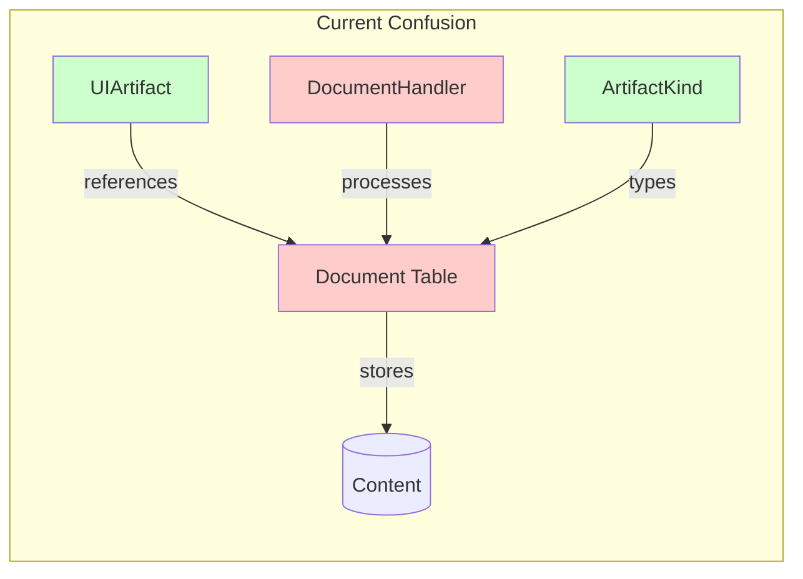
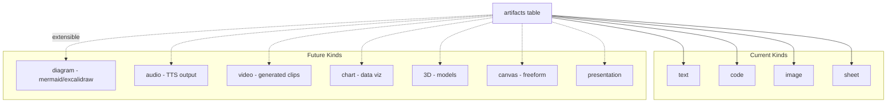
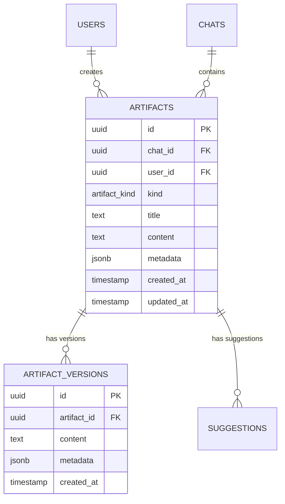

# ADR: Artifact vs Document Naming and Architecture

> **Type**: Architecture Decision Record  
> **Created**: 2024-12-28  
> **Status**: 🟢 Accepted  
> **Recommendation**: **MERGE as "artifacts"**

---

## Executive Summary

**Recommendation**: Merge Document and Artifact into a single **"artifacts"** concept.

| Aspect | Decision |
|--------|----------|
| **Naming** | "Artifact" (matches AI industry terminology) |
| **Database Table** | Single `artifacts` table with `kind` discriminator |
| **Feature Folder** | `features/artifacts/` (unified) |
| **Data Layer** | `lib/data/artifacts/` |

---

## Context

### Current State in oldapp

The existing codebase has two related but confusing concepts:

1. **Document** (`lib/db/schema` → `Document` table)
   - Database entity storing AI-generated content
   - Fields: `id`, `title`, `content`, `kind`, `userId`, `chatId`, `createdAt`
   - Kinds: `text`, `code`, `image`, `sheet`

2. **UIArtifact** (`components/artifact.tsx`)
   - Frontend UI state object
   - Fields: `documentId`, `title`, `content`, `kind`, `status`, `isVisible`, `boundingBox`
   - References `documentId` (tight coupling)

### The Problem



- `Document` used in database/backend
- `Artifact` used in UI/frontend and AI terminology
- `DocumentHandler` processes artifacts (confusing name)
- `ArtifactKind` types are used everywhere

---

## Analysis

### 1. Industry Standards Research

| Product | Term Used | Notes |
|---------|-----------|-------|
| **Claude (Anthropic)** | Artifact | Official feature name |
| **ChatGPT** | Canvas | Similar concept, different name |
| **Cursor** | Composer | Code-focused variant |
| **v0 (Vercel)** | Artifact | Matches Claude |
| **Gemini** | N/A | No direct equivalent |

**Conclusion**: "Artifact" is the emerging standard in AI assistants.

### 2. Naming Analysis

| Name | Pros | Cons |
|------|------|------|
| **Document** | Traditional, familiar | Implies text/files only, not AI-native |
| **Artifact** | AI industry standard, extensible | Slightly technical |
| **Canvas** | Neutral, creative | ChatGPT-specific, may confuse |
| **Content** | Generic | Too generic, no personality |
| **Block** | Notion-like | Different mental model |

### 3. Future Extensibility



---

## Decision: MERGE as "artifacts"

### Why Merge?

1. **Single Source of Truth**: One name, one concept, everywhere
2. **Developer Experience**: No mental mapping between Document↔Artifact
3. **AI Industry Alignment**: Matches Claude, v0, and emerging standards
4. **User-Facing Consistency**: Users see "Artifact" in UI, matches backend

### Why NOT Keep Separate?

| Argument | Counter |
|----------|---------|
| "Separation of concerns" | They're the same concern - AI-generated content |
| "Different lifecycles" | No - both tied to same chat lifecycle |
| "Backend vs Frontend" | Name shouldn't change between layers |

---

## Design Decisions (ADR-style)

### Decision 1: Unified Naming - "Artifact"

**Context**: Two names (Document/Artifact) cause confusion in codebase.

**Decision**: Use "Artifact" everywhere.

**Why**: 
- Matches AI industry terminology (Anthropic, Vercel)
- Users see "Artifact" in UI
- Reduces cognitive load for developers

**Alternatives Rejected**:
| Alternative | Rejected Because |
|-------------|------------------|
| Keep "Document" | Not AI-native, implies text files only |
| Use "Canvas" | ChatGPT-specific, may cause confusion |
| Use "Content" | Too generic, loses meaning |

**Trade-offs**:
- ✅ Single terminology across entire codebase
- ✅ Matches industry standard
- ⚠️ Migration effort from `Document` → `Artifact`

---

### Decision 2: Single Table with Discriminator

**Context**: Should each artifact kind have its own table?

**Decision**: Single `artifacts` table with `kind` discriminator column.

**Why**: 
- All kinds share 90% of fields
- Simpler queries, no JOINs needed
- Easier to add new kinds

**Alternatives Rejected**:
| Alternative | Rejected Because |
|-------------|------------------|
| Table per kind | Over-engineering, sparse tables |
| Inheritance pattern | PostgreSQL inheritance has gotchas |
| JSONB blob | Loses type safety, harder queries |

**Schema**:
```sql
CREATE TYPE artifact_kind AS ENUM ('text', 'code', 'image', 'sheet', 'diagram', 'chart');

CREATE TABLE artifacts (
    id UUID PRIMARY KEY DEFAULT gen_random_uuid(),
    chat_id UUID NOT NULL REFERENCES chats(id) ON DELETE CASCADE,
    user_id UUID NOT NULL REFERENCES users(id),
    kind artifact_kind NOT NULL,
    title TEXT NOT NULL,
    content TEXT,  -- Primary content (text, code, SVG, etc.)
    metadata JSONB,  -- Kind-specific metadata
    created_at TIMESTAMPTZ NOT NULL DEFAULT now(),
    updated_at TIMESTAMPTZ NOT NULL DEFAULT now()
);

-- Versions table for history
CREATE TABLE artifact_versions (
    id UUID PRIMARY KEY DEFAULT gen_random_uuid(),
    artifact_id UUID NOT NULL REFERENCES artifacts(id) ON DELETE CASCADE,
    content TEXT,
    metadata JSONB,
    created_at TIMESTAMPTZ NOT NULL DEFAULT now()
);
```

**Trade-offs**:
- ✅ Simple schema, easy to query
- ✅ No JOINs for basic operations
- ⚠️ `metadata` JSONB loses some type safety (mitigated by Zod schemas)

---

### Decision 3: Unified Feature Folder

**Context**: Where should artifact-related code live?

**Decision**: Single `features/artifacts/` folder with handlers subfolder.

```
features/artifacts/
├── index.ts              # Public exports
├── types/
│   ├── index.ts          # All artifact types
│   ├── artifact.ts       # Core Artifact interface
│   └── kinds.ts          # ArtifactKind union type
├── components/
│   ├── artifact.tsx      # Main artifact display
│   ├── artifact-actions.tsx
│   ├── artifact-messages.tsx
│   └── editors/          # Per-kind editors
│       ├── text-editor.tsx
│       ├── code-editor.tsx
│       ├── image-editor.tsx
│       └── sheet-editor.tsx
├── handlers/             # AI stream handlers per kind
│   ├── index.ts          # Handler registry
│   ├── text.ts
│   ├── code.ts
│   ├── image.ts
│   └── sheet.ts
├── hooks/
│   ├── use-artifact.ts
│   └── use-artifact-selector.ts
├── actions/
│   └── artifact-actions.ts  # Server actions
└── schemas/
    └── artifact.schema.ts    # Zod validation

lib/data/artifacts/       # Data access layer
├── index.ts
├── repository.ts         # CRUD operations
└── cache.ts              # Cache operations
```

**Why This Design**:
- Co-located by feature, not by layer
- Handlers for each kind are discoverable
- Easy to add new kinds (add handler file + editor)

**Alternatives Rejected**:
| Alternative | Rejected Because |
|-------------|------------------|
| Separate `features/documents/` + `features/artifacts/` | Duplicates concept, confusing |
| `lib/artifacts/` only | Mixes UI and data, violates feature structure |
| `components/artifacts/` + `lib/data/documents/` | Name mismatch persists |

---

## Type Definitions

### Core Types

```typescript
// features/artifacts/types/artifact.ts

export type ArtifactKind = 'text' | 'code' | 'image' | 'sheet' | 'diagram' | 'chart';

export type ArtifactStatus = 'idle' | 'streaming' | 'error';

// Database entity (from Drizzle)
export interface Artifact {
  id: string;
  chatId: string;
  userId: string;
  kind: ArtifactKind;
  title: string;
  content: string | null;
  metadata: Record<string, unknown> | null;
  createdAt: Date;
  updatedAt: Date;
}

// UI state (for React components)
export interface UIArtifact {
  id: string;           // Was documentId
  kind: ArtifactKind;
  title: string;
  content: string;
  status: ArtifactStatus;
  isVisible: boolean;
  boundingBox: {
    top: number;
    left: number;
    width: number;
    height: number;
  };
}

// For creating new artifacts
export interface CreateArtifact {
  chatId: string;
  kind: ArtifactKind;
  title: string;
  content?: string;
  metadata?: Record<string, unknown>;
}
```

### Kind-Specific Metadata

```typescript
// features/artifacts/types/metadata.ts

export interface CodeMetadata {
  language: string;
  filename?: string;
  dependencies?: string[];
}

export interface ImageMetadata {
  width: number;
  height: number;
  mimeType: string;
  prompt?: string;
}

export interface SheetMetadata {
  columns: string[];
  rowCount: number;
}

export interface DiagramMetadata {
  diagramType: 'mermaid' | 'excalidraw';
}

// Union for type narrowing
export type ArtifactMetadata = 
  | CodeMetadata 
  | ImageMetadata 
  | SheetMetadata 
  | DiagramMetadata;
```

---

## Migration Path from oldapp

### Phase 1: Schema Migration

```sql
-- Rename table
ALTER TABLE "Document" RENAME TO "artifacts";

-- Rename columns for consistency
ALTER TABLE artifacts RENAME COLUMN "document_kind" TO "kind";

-- Update enum
ALTER TYPE document_kind RENAME TO artifact_kind;

-- Add metadata column if not exists
ALTER TABLE artifacts ADD COLUMN IF NOT EXISTS metadata JSONB;

-- Update suggestions table references
ALTER TABLE "Suggestion" RENAME COLUMN "document_id" TO "artifact_id";
```

### Phase 2: Code Migration

| From | To | Notes |
|------|-----|-------|
| `Document` type | `Artifact` type | Global rename |
| `UIArtifact.documentId` | `UIArtifact.id` | Simpler naming |
| `lib/data/document.ts` | `lib/data/artifacts/repository.ts` | New location |
| `DocumentHandler` | `ArtifactHandler` | Rename |
| `documentHandlersByArtifactKind` | `artifactHandlers` | Cleaner name |
| `document_kind` enum | `artifact_kind` enum | DB enum |

### Phase 3: File Relocations

```
# Old location → New location
archive/oldapp/components/artifact.tsx → features/artifacts/components/artifact.tsx
archive/oldapp/hooks/use-artifact.ts → features/artifacts/hooks/use-artifact.ts
archive/oldapp/lib/data/document.ts → lib/data/artifacts/repository.ts
archive/oldapp/artifacts/* → features/artifacts/handlers/*
archive/oldapp/lib/artifacts/server.ts → features/artifacts/handlers/index.ts
```

---

## Relationship Diagram



---

## Quality Self-Check

- [x] All concepts unified under single name
- [x] Database schema defined
- [x] Directory structure specified
- [x] Type definitions provided
- [x] At least 2 alternatives considered for each decision
- [x] Trade-offs documented
- [x] Migration path from oldapp defined
- [x] Future extensibility addressed

---

## Summary

| Question | Answer |
|----------|--------|
| **Merge or Separate?** | **MERGE** |
| **What to call it?** | **Artifact** |
| **Database schema?** | Single `artifacts` table with `kind` discriminator |
| **Directory structure?** | `features/artifacts/` + `lib/data/artifacts/` |
| **Migration effort?** | Medium - rename + relocate, structure stays similar |

This unification eliminates the Document/Artifact confusion while aligning with AI industry terminology and supporting future artifact kinds.
