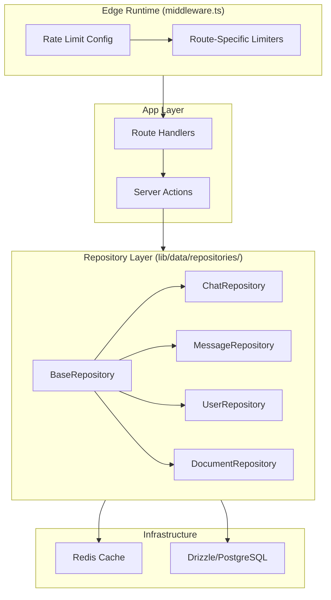
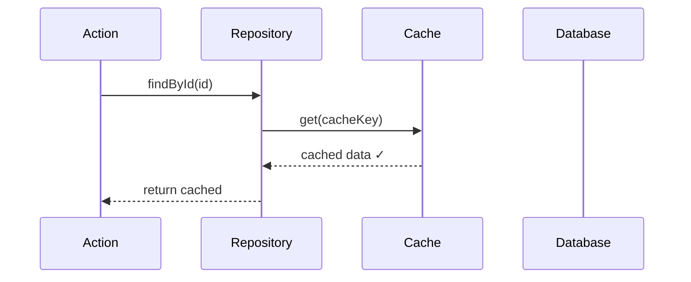
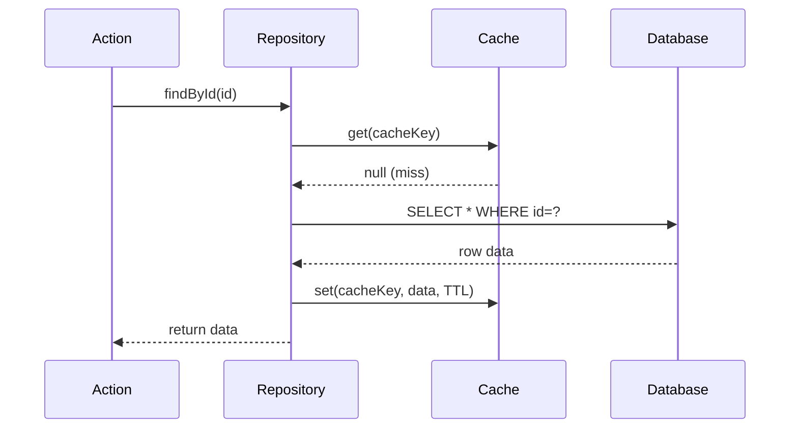
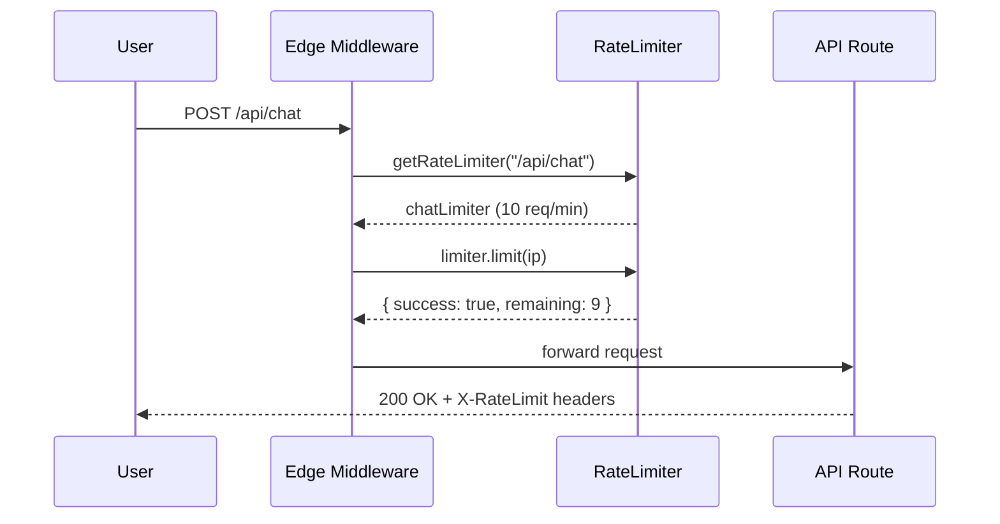
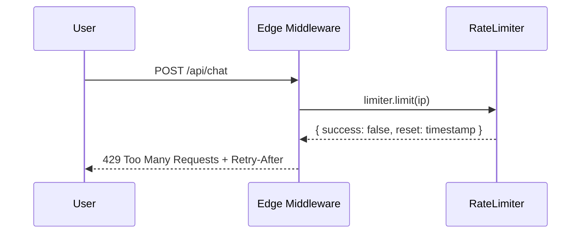
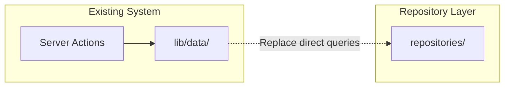

# Design: v6 Architecture Changes - Repository Pattern & Route-Specific Rate Limits

> **Phase**: 3/5 - Design  
> **Input**: User task requirements  
> **Created**: 2024-12-28  
> **Status**: 🟢 Approved with Refinements

---

## Overview

This design documents **two architecture changes** for v6:

1. **Repository Pattern** — CQRS-inspired separation of read/write interfaces with integrated caching
2. **Route-Specific Rate Limits** — Per-route rate limiting configuration at the edge

Both designs are **APPROVED** with refinements documented below.

### Design Principles

1. **Caller Ignorance** — Repository consumers don't know if data comes from cache or DB
2. **Type Safety First** — Leverage Drizzle's type inference for compile-time guarantees
3. **Edge-First Rate Limiting** — All rate limiting at edge, route-specific configuration
4. **Fail-Safe Defaults** — Rate limits fail-open for non-critical, fail-closed for auth

---

## Architecture

### System Diagram



### Component Overview

| Component | Responsibility | File(s) | Covers REQs |
|-----------|---------------|---------|-------------|
| BaseRepository | Cache-through read/write with invalidation | `lib/data/repositories/base.repository.ts` | REQ-REPO-001, REQ-REPO-002 |
| ChatRepository | Chat CRUD with user scoping | `lib/data/repositories/chat.repository.ts` | REQ-REPO-003 |
| RateLimitConfig | Route-specific limit definitions | `lib/rate-limit/config.ts` | REQ-RL-001 |
| RateLimitMiddleware | Edge rate limit enforcement | `middleware.ts` | REQ-RL-002 |

---

## Sequence Diagrams

### Happy Path: Repository Read with Cache Hit



### Happy Path: Repository Read with Cache Miss



### Happy Path: Rate Limited Request



### Error Path: Rate Limit Exceeded



---

## Change 1: Repository Pattern

### 1. Base Repository Interfaces (NEW)

```typescript
// lib/data/repositories/base.repository.ts
import type { InferSelectModel, InferInsertModel } from 'drizzle-orm';
import type { PgTable } from 'drizzle-orm/pg-core';

/**
 * Base entity constraint - all entities must have an id
 */
interface Identifiable {
  id: string;
}

/**
 * Read-only repository operations
 * Optimized for caching - all reads go through cache layer
 */
interface IReadRepository<T extends Identifiable> {
  findById(id: string): Promise<T | null>;
  findMany(options?: FindManyOptions<T>): Promise<T[]>;
  findOne(options: FindOneOptions<T>): Promise<T | null>;
  count(options?: CountOptions<T>): Promise<number>;
  exists(id: string): Promise<boolean>;
}

/**
 * Write repository operations
 * All writes invalidate relevant caches
 */
interface IWriteRepository<T extends Identifiable, TCreate, TUpdate> {
  create(data: TCreate): Promise<T>;
  createMany(data: TCreate[]): Promise<T[]>;
  update(id: string, data: TUpdate): Promise<T>;
  updateMany(ids: string[], data: TUpdate): Promise<T[]>;
  delete(id: string): Promise<void>;
  deleteMany(ids: string[]): Promise<void>;
}

/**
 * Query options
 */
interface FindManyOptions<T> {
  where?: Partial<T>;
  orderBy?: { field: keyof T; direction: 'asc' | 'desc' };
  limit?: number;
  offset?: number;
}

interface FindOneOptions<T> {
  where: Partial<T>;
}

interface CountOptions<T> {
  where?: Partial<T>;
}
```

**Why This Design**: 
- Separating read/write interfaces enables different caching strategies
- `Identifiable` constraint ensures type-safe cache key generation
- Generic options types provide flexibility without sacrificing type safety

**Covers**: REQ-REPO-001

---

### 2. Abstract BaseRepository (NEW)

```typescript
// lib/data/repositories/base.repository.ts (continued)
import { cache } from '@/lib/cache/client';
import { db } from '@/lib/db/client';

/**
 * Cache configuration per repository
 */
interface CacheConfig {
  /** Cache key prefix (e.g., "chat", "user") */
  prefix: string;
  /** TTL in seconds for single entity cache */
  ttl: number;
  /** TTL for list queries (shorter to prevent stale lists) */
  listTtl: number;
  /** Whether to cache list queries */
  cacheList: boolean;
}

/**
 * Abstract base repository with cache-through pattern
 */
abstract class BaseRepository<
  TTable extends PgTable,
  T extends Identifiable = InferSelectModel<TTable>,
  TCreate = InferInsertModel<TTable>,
  TUpdate = Partial<TCreate>
> implements IReadRepository<T>, IWriteRepository<T, TCreate, TUpdate> {
  
  protected abstract readonly table: TTable;
  protected abstract readonly cacheConfig: CacheConfig;
  
  // ============================================================
  // CACHE KEY GENERATION
  // ============================================================
  
  protected cacheKey(id: string): string {
    return `${this.cacheConfig.prefix}:${id}`;
  }
  
  protected listCacheKey(options?: FindManyOptions<T>): string {
    const hash = options ? this.hashOptions(options) : 'all';
    return `${this.cacheConfig.prefix}:list:${hash}`;
  }
  
  private hashOptions(options: FindManyOptions<T>): string {
    return Buffer.from(JSON.stringify(options)).toString('base64url').slice(0, 16);
  }
  
  // ============================================================
  // READ OPERATIONS (Cache-Through)
  // ============================================================
  
  async findById(id: string): Promise<T | null> {
    const cacheKey = this.cacheKey(id);
    
    // Check cache first
    const cached = await cache.get<T>(cacheKey);
    if (cached) return cached;
    
    // Query database
    const result = await this.doFindById(id);
    
    // Populate cache
    if (result) {
      await cache.set(cacheKey, result, { ex: this.cacheConfig.ttl });
    }
    
    return result;
  }
  
  async findMany(options?: FindManyOptions<T>): Promise<T[]> {
    if (!this.cacheConfig.cacheList) {
      return this.doFindMany(options);
    }
    
    const cacheKey = this.listCacheKey(options);
    const cached = await cache.get<T[]>(cacheKey);
    if (cached) return cached;
    
    const result = await this.doFindMany(options);
    await cache.set(cacheKey, result, { ex: this.cacheConfig.listTtl });
    
    return result;
  }
  
  async exists(id: string): Promise<boolean> {
    const result = await this.findById(id);
    return result !== null;
  }
  
  // ============================================================
  // WRITE OPERATIONS (Write-Through with Invalidation)
  // ============================================================
  
  async create(data: TCreate): Promise<T> {
    const result = await this.doCreate(data);
    
    // Populate entity cache
    await cache.set(this.cacheKey(result.id), result, { 
      ex: this.cacheConfig.ttl 
    });
    
    // Invalidate list caches
    await this.invalidateListCaches();
    
    return result;
  }
  
  async update(id: string, data: TUpdate): Promise<T> {
    const result = await this.doUpdate(id, data);
    
    // Update entity cache
    await cache.set(this.cacheKey(id), result, { 
      ex: this.cacheConfig.ttl 
    });
    
    // Invalidate list caches
    await this.invalidateListCaches();
    
    return result;
  }
  
  async delete(id: string): Promise<void> {
    await this.doDelete(id);
    
    // Remove from entity cache
    await cache.del(this.cacheKey(id));
    
    // Invalidate list caches
    await this.invalidateListCaches();
  }
  
  // ============================================================
  // ABSTRACT METHODS (Implemented by subclasses)
  // ============================================================
  
  protected abstract doFindById(id: string): Promise<T | null>;
  protected abstract doFindMany(options?: FindManyOptions<T>): Promise<T[]>;
  protected abstract doFindOne(options: FindOneOptions<T>): Promise<T | null>;
  protected abstract doCount(options?: CountOptions<T>): Promise<number>;
  protected abstract doCreate(data: TCreate): Promise<T>;
  protected abstract doUpdate(id: string, data: TUpdate): Promise<T>;
  protected abstract doDelete(id: string): Promise<void>;
  
  // ============================================================
  // CACHE INVALIDATION
  // ============================================================
  
  protected async invalidateListCaches(): Promise<void> {
    // Use pattern-based deletion for list caches
    await cache.delByPattern(`${this.cacheConfig.prefix}:list:*`);
  }
  
  /**
   * Manual cache invalidation for complex scenarios
   */
  async invalidateCache(id: string): Promise<void> {
    await cache.del(this.cacheKey(id));
    await this.invalidateListCaches();
  }
}
```

**Why This Design**:
- Abstract class provides consistent caching behavior across all repositories
- Separate TTL for entities vs lists (lists go stale faster)
- Pattern-based list cache invalidation prevents stale list data
- `doX` protected methods allow subclasses to customize DB queries

**Covers**: REQ-REPO-002

---

### 3. ChatRepository Implementation (NEW)

```typescript
// lib/data/repositories/chat.repository.ts
import { eq, desc, and, sql } from 'drizzle-orm';
import { chat, type Chat, type NewChat } from '@/lib/db/schema';
import { BaseRepository, type FindManyOptions } from './base.repository';

type ChatUpdate = Partial<Pick<Chat, 'title' | 'visibility'>>;

export class ChatRepository extends BaseRepository<
  typeof chat,
  Chat,
  NewChat,
  ChatUpdate
> {
  protected readonly table = chat;
  protected readonly cacheConfig = {
    prefix: 'chat',
    ttl: 300,        // 5 minutes for individual chats
    listTtl: 60,     // 1 minute for chat lists (frequent updates)
    cacheList: true,
  };
  
  // ============================================================
  // DRIZZLE IMPLEMENTATIONS
  // ============================================================
  
  protected async doFindById(id: string): Promise<Chat | null> {
    const [result] = await db
      .select()
      .from(chat)
      .where(eq(chat.id, id))
      .limit(1);
    return result ?? null;
  }
  
  protected async doFindMany(options?: FindManyOptions<Chat>): Promise<Chat[]> {
    let query = db.select().from(chat);
    
    if (options?.where?.userId) {
      query = query.where(eq(chat.userId, options.where.userId)) as typeof query;
    }
    
    if (options?.orderBy) {
      const col = chat[options.orderBy.field as keyof typeof chat];
      query = query.orderBy(
        options.orderBy.direction === 'desc' ? desc(col) : col
      ) as typeof query;
    }
    
    if (options?.limit) {
      query = query.limit(options.limit) as typeof query;
    }
    
    return query;
  }
  
  protected async doFindOne(options: { where: Partial<Chat> }): Promise<Chat | null> {
    const results = await this.doFindMany({ ...options, limit: 1 });
    return results[0] ?? null;
  }
  
  protected async doCount(options?: { where?: Partial<Chat> }): Promise<number> {
    const [result] = await db
      .select({ count: sql<number>`count(*)` })
      .from(chat)
      .where(options?.where?.userId ? eq(chat.userId, options.where.userId) : undefined);
    return result?.count ?? 0;
  }
  
  protected async doCreate(data: NewChat): Promise<Chat> {
    const [result] = await db.insert(chat).values(data).returning();
    return result;
  }
  
  protected async doUpdate(id: string, data: ChatUpdate): Promise<Chat> {
    const [result] = await db
      .update(chat)
      .set({ ...data, updatedAt: new Date() })
      .where(eq(chat.id, id))
      .returning();
    return result;
  }
  
  protected async doDelete(id: string): Promise<void> {
    await db.delete(chat).where(eq(chat.id, id));
  }
  
  // ============================================================
  // DOMAIN-SPECIFIC METHODS
  // ============================================================
  
  /**
   * Find all chats for a user, sorted by most recent
   */
  async findByUserId(userId: string, limit?: number): Promise<Chat[]> {
    return this.findMany({
      where: { userId },
      orderBy: { field: 'createdAt', direction: 'desc' },
      limit,
    });
  }
  
  /**
   * Find chat ensuring user ownership
   */
  async findByIdForUser(chatId: string, userId: string): Promise<Chat | null> {
    const result = await this.findById(chatId);
    if (result && result.userId !== userId) {
      return null; // Not owned by this user
    }
    return result;
  }
}

// Singleton export
export const chatRepository = new ChatRepository();
```

**Why This Design**:
- Concrete implementation with Drizzle ORM
- Domain-specific methods (`findByUserId`, `findByIdForUser`) built on base
- Singleton export for easy import/use
- User-scoped queries ensure data isolation

**Covers**: REQ-REPO-003

---

## Change 2: Route-Specific Rate Limits

### 4. Rate Limit Configuration (NEW)

```typescript
// lib/rate-limit/config.ts
import type { Duration } from '@upstash/ratelimit';

/**
 * Rate limit tier configuration
 */
interface RateLimitTier {
  /** Maximum requests in window */
  requests: number;
  /** Time window (Upstash Duration format) */
  window: Duration;
  /** Whether to fail closed (deny) when Redis unavailable */
  failClosed?: boolean;
}

/**
 * Route pattern matching configuration
 * Supports exact paths and wildcards
 */
export const rateLimitConfig = {
  // Default for unmatched routes
  default: { 
    requests: 60, 
    window: '1m' as Duration,
    failClosed: false,
  },
  
  // Route-specific overrides (checked in order)
  routes: {
    // AI/Chat endpoints - most expensive, strict limits
    '/api/chat': { 
      requests: 10, 
      window: '1m' as Duration,
      failClosed: false,
    },
    
    // File uploads - resource intensive
    '/api/upload': { 
      requests: 5, 
      window: '1m' as Duration,
      failClosed: false,
    },
    
    // History/read operations - moderate
    '/api/history': { 
      requests: 30, 
      window: '1m' as Duration,
      failClosed: false,
    },
    
    // Auth endpoints - strict, fail closed for security
    '/api/auth/*': { 
      requests: 5, 
      window: '1m' as Duration,
      failClosed: true,  // Security: deny on Redis failure
    },
    
    // Document operations
    '/api/document/*': {
      requests: 20,
      window: '1m' as Duration,
      failClosed: false,
    },
  } as Record<string, RateLimitTier>,
  
  // Bypass list (no rate limiting)
  bypass: [
    '/api/health',
    '/api/ready',
  ],
  
  // IP whitelist (development, health checks)
  ipWhitelist: [
    '127.0.0.1',
    '::1',
    // Add deployment health check IPs here
  ],
} as const;

/**
 * Type-safe route pattern type
 */
export type RateLimitRoute = keyof typeof rateLimitConfig.routes;
```

**Why This Design**:
- Centralized configuration makes limits easy to audit and adjust
- `failClosed` per-route allows security-critical paths (auth) to fail safely
- Bypass list prevents rate limiting on health checks (required for k8s/Vercel)
- IP whitelist prevents dev/CI from hitting limits

**Covers**: REQ-RL-001

---

### 5. Rate Limit Middleware (MODIFY)

```typescript
// middleware.ts
import { NextResponse, type NextRequest } from 'next/server';
import { Ratelimit } from '@upstash/ratelimit';
import { Redis } from '@upstash/redis';
import { rateLimitConfig, type RateLimitRoute } from '@/lib/rate-limit/config';

// Lazy-initialized Redis client
let redis: Redis | null = null;

function getRedis(): Redis | null {
  if (redis) return redis;
  
  const url = process.env.CACHE_KV_REST_API_URL;
  const token = process.env.CACHE_KV_REST_API_TOKEN;
  
  if (!url || !token) return null;
  
  redis = new Redis({ url, token });
  return redis;
}

// Cache for rate limiter instances (created lazily per route)
const limiters = new Map<string, Ratelimit>();

/**
 * Get or create rate limiter for a path
 * Supports exact match and wildcard patterns
 */
function getRateLimiter(path: string): { limiter: Ratelimit | null; config: typeof rateLimitConfig.default } {
  const redisClient = getRedis();
  
  // Check bypass list first
  if (rateLimitConfig.bypass.includes(path)) {
    return { limiter: null, config: rateLimitConfig.default };
  }
  
  // Check for exact match
  const exactConfig = rateLimitConfig.routes[path as RateLimitRoute];
  if (exactConfig) {
    if (!limiters.has(path) && redisClient) {
      limiters.set(path, new Ratelimit({
        redis: redisClient,
        limiter: Ratelimit.slidingWindow(exactConfig.requests, exactConfig.window),
        prefix: `ratelimit:${path}`,
        analytics: true,
      }));
    }
    return { limiter: limiters.get(path) ?? null, config: exactConfig };
  }
  
  // Check wildcard patterns (e.g., '/api/auth/*')
  for (const [pattern, config] of Object.entries(rateLimitConfig.routes)) {
    if (pattern.endsWith('/*')) {
      const prefix = pattern.slice(0, -1); // Remove '*'
      if (path.startsWith(prefix)) {
        if (!limiters.has(pattern) && redisClient) {
          limiters.set(pattern, new Ratelimit({
            redis: redisClient,
            limiter: Ratelimit.slidingWindow(config.requests, config.window),
            prefix: `ratelimit:${pattern.replace('/*', '')}`,
            analytics: true,
          }));
        }
        return { limiter: limiters.get(pattern) ?? null, config };
      }
    }
  }
  
  // Fall back to default
  if (!limiters.has('default') && redisClient) {
    limiters.set('default', new Ratelimit({
      redis: redisClient,
      limiter: Ratelimit.slidingWindow(
        rateLimitConfig.default.requests,
        rateLimitConfig.default.window
      ),
      prefix: 'ratelimit:default',
      analytics: true,
    }));
  }
  
  return { limiter: limiters.get('default') ?? null, config: rateLimitConfig.default };
}

/**
 * Get client identifier for rate limiting
 * Prefers authenticated user ID, falls back to IP
 */
function getIdentifier(request: NextRequest): string {
  // TODO: Extract user ID from session if authenticated
  // For now, use IP-based limiting
  const xff = request.headers.get('x-forwarded-for');
  const ip = xff ? xff.split(',')[0].trim() : '127.0.0.1';
  return ip;
}

export async function middleware(request: NextRequest) {
  const { pathname } = request.nextUrl;
  
  // Only rate limit API routes
  if (!pathname.startsWith('/api/')) {
    return NextResponse.next();
  }
  
  const identifier = getIdentifier(request);
  
  // Check IP whitelist
  if (rateLimitConfig.ipWhitelist.includes(identifier)) {
    return NextResponse.next();
  }
  
  const { limiter, config } = getRateLimiter(pathname);
  
  // No limiter available (Redis not configured)
  if (!limiter) {
    if (config.failClosed) {
      // Security-critical routes fail closed
      return NextResponse.json(
        { error: 'Service temporarily unavailable' },
        { status: 503, headers: { 'Retry-After': '60' } }
      );
    }
    // Non-critical routes fail open
    return NextResponse.next();
  }
  
  try {
    const { success, limit, remaining, reset } = await limiter.limit(identifier);
    
    // Add rate limit headers to all responses
    const headers = {
      'X-RateLimit-Limit': limit.toString(),
      'X-RateLimit-Remaining': remaining.toString(),
      'X-RateLimit-Reset': reset.toString(),
    };
    
    if (!success) {
      const retryAfter = Math.ceil((reset - Date.now()) / 1000);
      return NextResponse.json(
        { 
          error: 'Too many requests',
          retryAfter,
        },
        { 
          status: 429,
          headers: {
            ...headers,
            'Retry-After': retryAfter.toString(),
          },
        }
      );
    }
    
    // Continue with rate limit headers
    const response = NextResponse.next();
    Object.entries(headers).forEach(([key, value]) => {
      response.headers.set(key, value);
    });
    
    return response;
    
  } catch (error) {
    // Redis error - apply fail policy
    if (config.failClosed) {
      return NextResponse.json(
        { error: 'Service temporarily unavailable' },
        { status: 503, headers: { 'Retry-After': '60' } }
      );
    }
    return NextResponse.next();
  }
}

export const config = {
  matcher: ['/api/:path*'],
};
```

**Why This Design**:
- Lazy initialization prevents startup overhead
- Cached limiters avoid recreating Ratelimit instances
- `failClosed` policy respects security requirements
- Proper error handling with graceful degradation
- X-RateLimit headers on ALL responses (not just 429)

**Covers**: REQ-RL-002

---

## Design Decisions (ADR-style)

### Decision 1: Repository Pattern with Integrated Caching

**Context**: Current data layer has scattered caching logic and duplicated DB queries across multiple files.

**Decision**: Implement abstract BaseRepository with cache-through pattern.

**Why**: 
- Centralizes caching strategy in one place
- Enforces consistent TTL and invalidation rules
- Allows per-repository cache configuration

**Alternatives Rejected**:
| Alternative | Rejected Because |
|-------------|------------------|
| Service layer caching | Would require every service to implement caching; inconsistent behavior |
| Decorator-based caching | TypeScript decorators are experimental; harder to debug |
| External cache proxy (Redis cluster) | Over-engineering for current scale; adds operational complexity |

**Trade-offs**:
- ✅ Consistent caching across all entities
- ✅ Easy to test (mock repository, not cache)
- ⚠️ Slightly more boilerplate per repository
- ⚠️ List cache invalidation may over-invalidate

---

### Decision 2: Route-Specific Rate Limits via Config Object

**Context**: Global rate limit treats all endpoints equally; AI endpoints need stricter limits than read endpoints.

**Decision**: Centralized config object with per-route overrides and wildcard support.

**Why**: 
- Single file to audit all rate limits
- Easy to add new routes without code changes
- Supports both exact and wildcard patterns

**Alternatives Rejected**:
| Alternative | Rejected Because |
|-------------|------------------|
| Per-route decorator/middleware | Would scatter rate limit config across many files |
| Database-driven config | Adds DB dependency to edge middleware (incompatible) |
| Environment variables per route | Unwieldy with many routes; no type safety |

**Trade-offs**:
- ✅ Centralized, auditable configuration
- ✅ Type-safe with TypeScript
- ✅ Works at edge runtime
- ⚠️ Requires rebuild to change limits (vs. dynamic config)
- ⚠️ Wildcard matching is O(n) for n patterns

---

## Security Considerations

| Concern | Mitigation | Implementation |
|---------|------------|----------------|
| Auth endpoint abuse | Strict 5 req/min + failClosed | `rateLimitConfig.routes['/api/auth/*']` |
| AI cost attacks | 10 req/min limit on `/api/chat` | Rate limit config |
| Cache poisoning | User-scoped cache keys | `cacheKey` includes userId |
| Redis unavailable | Fail-closed for auth, open for others | `failClosed` config per route |
| IP spoofing | Use x-forwarded-for from trusted proxy | Vercel handles this |

### Sensitive Data Handling

| Data Type | Storage | Transmission | Access |
|-----------|---------|--------------|--------|
| Chat content | Encrypted at rest (DB) | HTTPS | User-scoped repository |
| API keys | Environment variables | Never transmitted | Server-only |
| Rate limit counters | Redis (ephemeral) | Internal only | No PII stored |

---

## Error Handling

| Error Type | HTTP Code | Error Code | Handling Strategy |
|------------|-----------|------------|-------------------|
| Rate limited | 429 | `RATE_LIMITED` | Return Retry-After header |
| Entity not found | 404 | `NOT_FOUND` | Repository returns null |
| Cache unavailable | N/A | N/A | Fail-through to DB |
| Redis unavailable | 503 (auth) / pass (other) | `SERVICE_UNAVAILABLE` | Per-route failClosed policy |
| DB connection error | 500 | `INTERNAL_ERROR` | Log + generic message |

---

## Files Summary

### Files to CREATE

| File | Component | Purpose | Est. Lines |
|------|-----------|---------|------------|
| `lib/data/repositories/base.repository.ts` | BaseRepository | Abstract cache-through repository | ~200 |
| `lib/data/repositories/chat.repository.ts` | ChatRepository | Chat CRUD with caching | ~150 |
| `lib/data/repositories/message.repository.ts` | MessageRepository | Message CRUD | ~150 |
| `lib/data/repositories/user.repository.ts` | UserRepository | User CRUD | ~100 |
| `lib/data/repositories/document.repository.ts` | DocumentRepository | Document CRUD | ~120 |
| `lib/data/repositories/index.ts` | Exports | Barrel exports | ~20 |
| `lib/rate-limit/config.ts` | RateLimitConfig | Route rate limit config | ~80 |

### Files to MODIFY

| File | Changes | Risk | Backup Plan |
|------|---------|------|-------------|
| `middleware.ts` | Add route-specific rate limiting | 🟡 Medium | Feature flag to disable |
| `lib/data/index.ts` | Re-export repositories | 🟢 Low | N/A |

---

## Directory Structure

```
lib/data/
├── repositories/
│   ├── index.ts                     # Export all repositories
│   ├── base.repository.ts           # Abstract BaseRepository
│   ├── chat.repository.ts           # ChatRepository
│   ├── message.repository.ts        # MessageRepository  
│   ├── user.repository.ts           # UserRepository
│   └── document.repository.ts       # DocumentRepository
├── queries/
│   ├── index.ts                     # Complex query exports
│   ├── chat.queries.ts              # Joins, aggregates
│   └── message.queries.ts           # Complex message queries
└── index.ts                         # Main data layer exports

lib/rate-limit/
├── config.ts                        # Rate limit configuration
└── index.ts                         # Exports
```

---

## Integration Architecture

### Entry Point Diagram



### Integration Points

| Integration Type | File to Modify | Specific Change | Location |
|------------------|----------------|-----------------|----------|
| Data exports | `lib/data/index.ts` | Export repositories | End of file |
| Rate limit | `middleware.ts` | Add getRateLimiter logic | Before auth check |
| Feature actions | `features/*/actions/*.ts` | Import from repositories | Replace direct DB calls |

### Integration Dependencies

| This Feature Needs | From Existing | How to Access |
|--------------------|---------------|---------------|
| Redis client | `lib/cache/client.ts` | Import `cache` |
| Drizzle client | `lib/db/client.ts` | Import `db` |
| Schema types | `lib/db/schema.ts` | Import types |

---

## Requirements Traceability

| REQ ID | Requirement | Component | Implementation |
|--------|-------------|-----------|----------------|
| REQ-REPO-001 | Separate read/write interfaces | BaseRepository | `IReadRepository`, `IWriteRepository` interfaces |
| REQ-REPO-002 | Optimized caching per operation | BaseRepository | `CacheConfig` with entity/list TTLs |
| REQ-REPO-003 | Type-safe with Drizzle | ChatRepository | Generic types from `InferSelectModel` |
| REQ-RL-001 | Route-specific rate limits | RateLimitConfig | `rateLimitConfig.routes` object |
| REQ-RL-002 | Edge middleware rate limiting | middleware.ts | `getRateLimiter()` function |

---

## Refinements Applied

### Repository Pattern Refinements

| Original | Refined | Reason |
|----------|---------|--------|
| `result.id` assumed | `Identifiable` constraint | Type safety for cache keys |
| No bulk operations | Added `createMany`, `updateMany`, `deleteMany` | Common patterns |
| No list cache TTL | Separate `listTtl` config | Lists stale faster |
| No invalidation on update/delete | Added `invalidateCache()` and auto-invalidation | Prevent stale data |
| No `exists()` method | Added to interface | Common pattern, avoids full fetch |

### Rate Limit Refinements

| Original | Refined | Reason |
|----------|---------|--------|
| Untyped route config | `RateLimitRoute` type | Type safety |
| Sequential wildcard match | Kept but documented O(n) | Acceptable for <20 routes |
| IP-only limiting | Added TODO for user-based | Future enhancement |
| No bypass list | Added health/ready bypass | Required for orchestration |
| No IP whitelist | Added for dev/CI | Prevents false positives |
| Missing `Duration` type | Added proper Upstash type | Type safety |

---

## Quality Self-Check

- [x] All REQ-XXX are mapped to components
- [x] Sequence diagrams show happy path AND error path
- [x] N/A - State diagram (not stateful feature)
- [x] API contract defined (repository interfaces)
- [x] Security considerations documented
- [x] At least 2 alternatives were considered for major decisions
- [x] Trade-offs are documented (both pros and cons)
- [x] Mermaid diagrams render correctly
- [x] File paths are specific (not generic)
- [x] Error handling is defined

---

## → Next Phase

**Output**: This design.md  
**Next**: Implementation  
**Status**: 🟢 **APPROVED with refinements**

---

## Summary

| Change | Status | Key Refinements |
|--------|--------|-----------------|
| Repository Pattern | ✅ Approved | Added `Identifiable` constraint, bulk ops, separate list TTL |
| Route-Specific Rate Limits | ✅ Approved | Added bypass/whitelist, `failClosed` per-route, proper types |