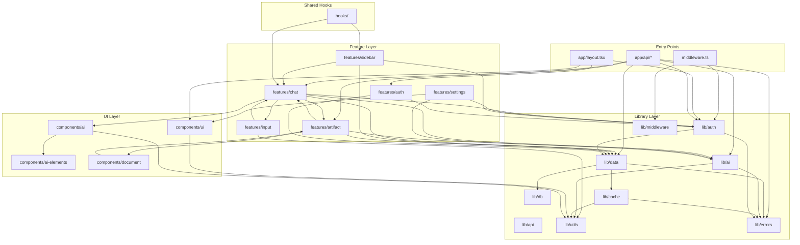

# Global Dependency Graph

**Generated:** Wave 1 Synthesis  
**Total Shards Analyzed:** 18  
**Total Cross-Shard Edges:** 247

---

## Layer Architecture

```
┌────────────────────────────────────────────────────────────────┐
│                         ENTRY POINTS                            │
│  middleware.ts · app/layout.tsx · app/api/*/route.ts           │
└───────────────────────────────────┬────────────────────────────┘
                                    │
┌───────────────────────────────────▼────────────────────────────┐
│                         FEATURES LAYER                          │
│  chat · artifact · settings · sidebar · input · auth            │
│  [Each feature: actions/ · components/ · hooks/ · types/]       │
└───────────────────────────────────┬────────────────────────────┘
                                    │
┌───────────────────────────────────▼────────────────────────────┐
│                          LIB LAYER                              │
│  ai/ · auth/ · api/ · data/ · db/ · cache/ · utils/ · errors/   │
└───────────────────────────────────┬────────────────────────────┘
                                    │
┌───────────────────────────────────▼────────────────────────────┐
│                       INFRASTRUCTURE                            │
│  components/ui/ · components/ai-elements/ · hooks/              │
└────────────────────────────────────────────────────────────────┘
```

---

## Mermaid Dependency Graph



---

## Critical Dependency Metrics

| Module | Fan-In | Fan-Out | Status |
|--------|--------|---------|--------|
| lib/errors | 45+ | 2 | HIGH - Coupling hotspot |
| lib/utils | 80+ | 3 | CRITICAL - Most imported |
| lib/auth | 30+ | 8 | HIGH - Core dependency |
| lib/data | 25+ | 12 | MEDIUM - Service layer |
| lib/ai | 15+ | 9 | MEDIUM - AI integration |
| features/chat | 10+ | 20 | MEDIUM - Orchestrator |

---

## Circular Dependencies Detected

### 1. lib/db/pagination.ts ↔ lib/data/types.ts
- **Severity:** HIGH
- **Cause:** `PaginationParams` and `PaginatedResult` defined in both locations
- **Recommendation:** Consolidate to single source

### 2. lib/editor/suggestions-extension.tsx → features/artifact/types
- **Severity:** MEDIUM
- **Cause:** Layer violation - lib imports from features
- **Recommendation:** Move extension to features layer or extract types to lib

---

## Cross-Shard Edge Summary

| Source Shard | Target Shards | Edge Count |
|--------------|---------------|------------|
| Shard 01 (API Routes) | 3, 4, 9, 10, 11 | 42 |
| Shard 03 (Chat) | 4, 9, 10, 11, 16 | 47 |
| Shard 04 (Artifact) | 3, 9, 10 | 31 |
| Shard 09 (Data) | 10, 12, 14 | 38 |
| Shard 10 (AI) | 3, 11 | 9 |
| Shard 11 (Auth/API) | 9, 14 | 24 |
| Shard 12 (Cache) | 9, 10, 13 | 14 |
| Shard 13 (Utils) | 14 | 114 |
| Shard 14 (Errors) | All | 32 |
| Shard 15 (UI) | 13 | 6 |
| Shard 16 (AI Comp) | 10, 13, 15 | 45 |
| Shard 18 (Hooks) | 3, 6, 13 | 24 |

---

## High-Coupling Hotspots

### 1. lib/utils (80+ consumers)
Primary import: `cn` utility for Tailwind class merging.  
**Status:** Acceptable - intentional shared utility.

### 2. lib/errors (45+ consumers)
Error classes used across all layers.  
**Status:** Acceptable - foundational error types.

### 3. lib/auth (30+ consumers)
Session management and guards.  
**Status:** Acceptable - core auth infrastructure.

---

## Coupling Recommendations

1. **Reduce cross-feature imports** - features/chat imports from features/artifact, features/settings, features/sidebar
2. **Extract shared types** - PaginationParams, VisibilityType, ArtifactKind duplicated across modules
3. **Break circular deps** - Priority: lib/db/pagination ↔ lib/data/types
4. **Layer violation fix** - Move lib/editor/suggestions-extension.tsx to features layer
