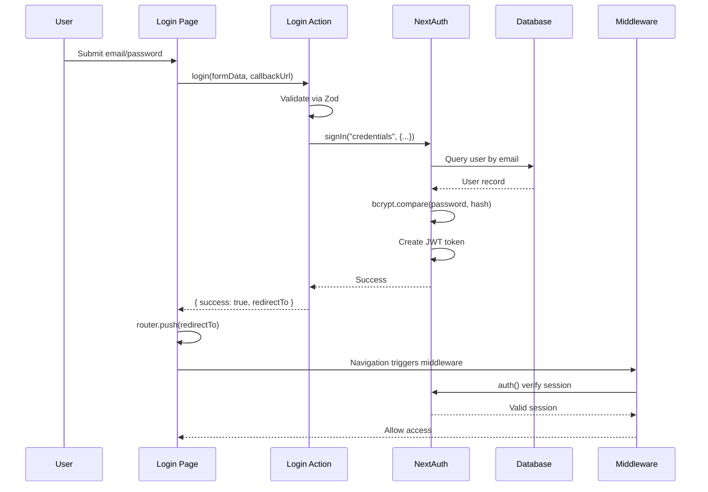
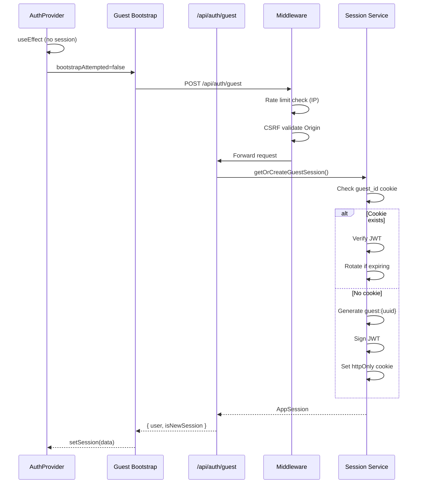
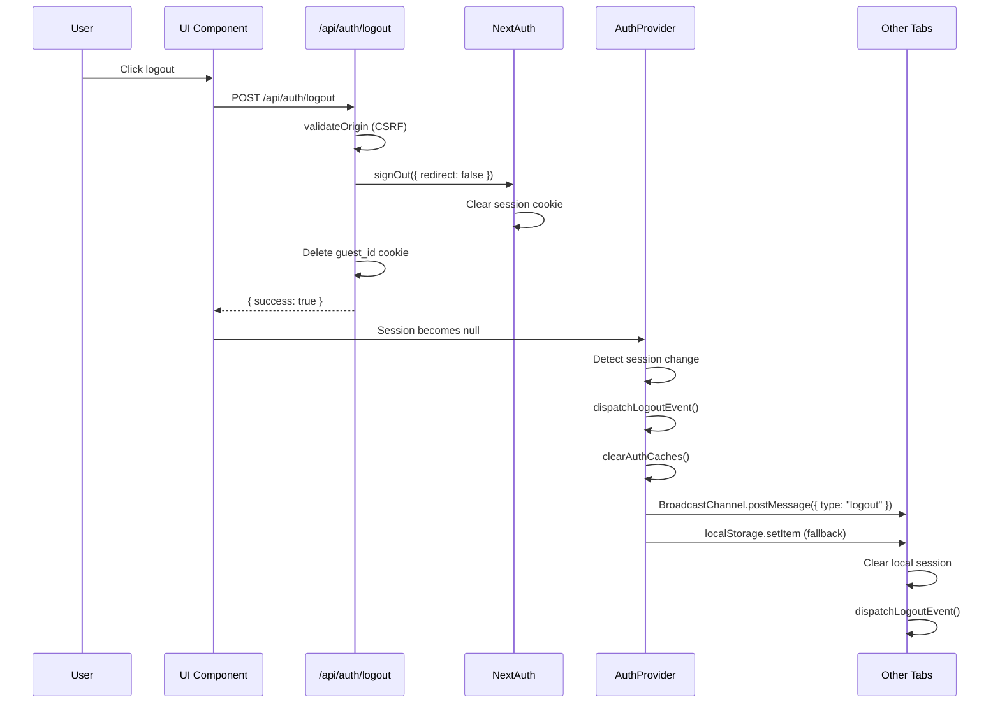
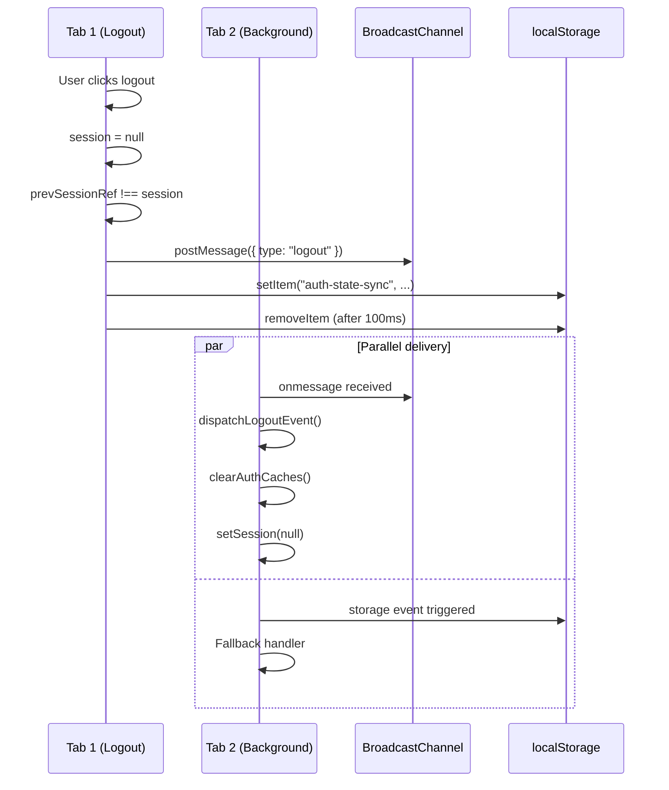

# Process Flow: Authentication

## Entry Points

| Entry Point | Location | Trigger |
|-------------|----------|---------|
| Middleware Check | `middleware.ts:64` | Every request to protected routes |
| Login Page | `app/(auth)/login/page.tsx` | User navigates to `/login` |
| Guest Session Creation | `app/api/auth/guest/route.ts` | Client-side bootstrap on app load |
| Logout | `app/api/auth/logout/route.ts` | User initiates logout |

## Session Management

### Session Creation (Authenticated User)

1. **Login Form Submission** (`login/page.tsx:62`)
   - Calls `login(formData, callbackUrl)` server action
   - Validates credentials via Zod schema

2. **Server Action** (`login.action.ts:44`)
   - Validates input via `loginSchema`
   - Calls NextAuth `signIn("credentials", {...})`
   - NextAuth triggers `authorize()` callback

3. **NextAuth Authorize** (`config.ts:61`)
   - Queries database for user by email
   - Verifies password with bcrypt
   - Returns user object on success

4. **JWT Creation** (`config.ts:177`)
   - JWT callback adds `user.id` to token
   - Session callback exposes `id` in session

### Session Creation (Guest User)

1. **Client Bootstrap** (`auth-provider.tsx:342`)
   - useEffect detects no session + not attempted
   - POST to `/api/auth/guest`

2. **Guest API** (`guest/route.ts:95`)
   - CSRF validation via `validateOrigin()`
   - Rate limiting per IP (defense-in-depth)
   - Calls `getOrCreateGuestSession()`

3. **Guest Session Creation** (`session.ts:388`)
   - Generates UUID with `guest:` prefix
   - Signs JWT with `GUEST_JWT_SECRET`
   - Sets `httpOnly` cookie (7-day TTL)

### Session Validation

**Server-Side** (`session.ts:136`):
```typescript
getSession() → auth() (NextAuth) → getGuestSession() (JWT verify)
```

**Middleware** (`middleware.ts:78`):
```typescript
const session = await auth()
const isAuthenticated = !!session?.user
const userId = session?.user?.id ?? getGuestId(request)
```

### Session Destruction

1. **Logout API** (`logout/route.ts:22`)
   - Validates CSRF via `validateOrigin()`
   - Calls `signOut({ redirect: false })` (NextAuth)
   - Deletes `guest_id` cookie

2. **Client Cleanup** (`auth-provider.tsx:287`)
   - Detects session → null transition
   - Dispatches `auth:logout` event
   - Clears SWR caches
   - Broadcasts to other tabs

## Auth Provider Flow

### State Machine

```
┌─────────────────┐
│ initialSession  │ (from server)
└────────┬────────┘
         │
         ▼
┌─────────────────┐     POST /api/auth/guest    ┌─────────────────┐
│    no session   │────────────────────────────▶│  guest session  │
└─────────────────┘                             └─────────────────┘
         │                                               │
         │ login success                                 │
         ▼                                               ▼
┌─────────────────┐                             ┌─────────────────┐
│ regular session │                             │  session=null   │
└─────────────────┘                             └─────────────────┘
         │                                               ▲
         │ logout                                        │
         └───────────────────────────────────────────────┘
```

### Client-Side State (auth-provider.tsx)

| State | Type | Purpose |
|-------|------|---------|
| `session` | `AppSession \| null` | Current session data |
| `status` | `AuthStatus` | "authenticated" \| "unauthenticated" |
| `isNewSession` | `boolean` | Skip initial history fetch |
| `bootstrapAttempted` | `boolean` | Prevent duplicate guest requests |

### Key Effects

1. **BroadcastChannel Setup** (line 131): Cross-tab auth sync
2. **Storage Event Fallback** (line 213): Browser compatibility
3. **Session Change Broadcast** (line 280): Detect login/logout
4. **Guest Bootstrap** (line 342): Auto-create guest sessions
5. **Window Focus Sync** (line 388): Re-fetch session on focus

## Guest vs Authenticated User Handling

| Aspect | Guest User | Authenticated User |
|--------|------------|-------------------|
| ID Format | `guest:{uuid}` | `{uuid}` |
| Session Source | JWT cookie (`guest_id`) | NextAuth JWT |
| Email | `null` | Provided |
| Chat Access | Own chats only | Own chats only |
| History | Per-browser | Per-account |
| Persistence | 7 days (cookie) | 30 days (session) |
| Token TTL | 1 hour JWT, auto-rotate | 30 days session |

### Session Detection Pattern

```typescript
// session.ts:136
export async function getSession(): Promise<AppSession | null> {
  // Priority: Authenticated > Guest
  const authSession = await auth()  // NextAuth
  if (authSession?.user?.id) {
    return { user: { type: "regular", ... } }
  }
  return getGuestSession()  // JWT from cookie
}
```

## Cross-Tab Synchronization

### Mechanisms

1. **BroadcastChannel API** (primary)
   - Channel: `"auth-state-channel"`
   - Events: `login`, `logout`, `session-update`
   - Real-time message passing

2. **Storage Events** (fallback)
   - Key: `"auth-state-sync"`
   - Works across same-origin tabs
   - Handles browsers without BroadcastChannel

3. **Window Focus** (supplemental)
   - Re-fetches session on tab focus
   - Catches out-of-band changes

### Sync Flow

```
Tab A                    Tab B                    Server
  │                        │                        │
  │──logout──────────────▶│                        │
  │   (BroadcastChannel)  │                        │
  │                        │──clear session         │
  │                        │──dispatch auth:logout  │
  │                        │                        │
  │◀─storage event─────────│                        │
  │   (fallback)           │                        │
```

## Sequence Diagrams

### Login Flow



### Guest Session Flow



### Logout Flow



### Multi-Tab Logout Sync



## Issues Found

### 1. AuthProvider Complexity (Cyclomatic: 12)

**Location**: `auth-provider.tsx`

- 5 useEffect hooks with overlapping responsibilities
- Duplicate session fetch logic in 3 places (lines 147, 180, 238, 391)
- Mixed concerns: bootstrap + sync + broadcast

### 2. Race Condition Risk

**Location**: `auth-provider.tsx:342-381`

```typescript
// Multiple conditions checked without atomicity
if (session || bootstrapAttempted) { return }
```

If guest bootstrap starts before middleware session check completes, duplicate sessions could be attempted.

### 3. Token Rotation Silent Failure

**Location**: `session.ts:351-363`

```typescript
try {
  const rotatedToken = await signGuestToken(payload.sub, secret)
  cookieStore.set(GUEST_COOKIE_NAME, rotatedToken, {...})
} catch {
  // Cookies may not be writable in all contexts
}
```

Rotation failures are silently ignored, potentially leaving users with expired tokens.

### 4. Cross-Tab Sync Edge Case

**Location**: `auth-provider.tsx:280-333`

Logout broadcast happens AFTER session is set to null. If another tab processes the message before this tab finishes cleanup, inconsistent state could occur.

### 5. Multiple Session Fetch Patterns

**Location**: Various

Same pattern repeated 4 times:
```typescript
fetch("/api/auth/session", {...})
  .then(res => res.json())
  .then(data => { ... })
  .catch(() => { /* Ignore errors */ })
```

### 6. Middleware Auth Check Duplication

**Location**: `middleware.ts` and `config.ts`

Both implement `authorized` checks:
- `config.ts:145`: NextAuth authorized callback
- `middleware.ts:105`: Custom `isProtectedPageRoute` check

This creates confusion about which system controls route protection.

## Simplification Opportunities

### 1. Extract Session Fetch Hook

```typescript
// hooks/use-session-sync.ts
export function useSessionSync() {
  const refresh = useCallback(async () => {
    const res = await fetch("/api/auth/session", { credentials: "include" })
    return res.json()
  }, [])
  return { refresh }
}
```

### 2. Consolidate Cross-Tab Sync

Move BroadcastChannel + localStorage + focus sync into dedicated hook:

```typescript
// hooks/use-cross-tab-auth.ts
export function useCrossTabAuth(onLogout, onLogin, onSessionUpdate) {
  // Single effect for all cross-tab mechanisms
}
```

### 3. Simplify AuthProvider

Split into focused components:
- `AuthProvider` - Context + state only
- `GuestBootstrap` - Guest session creation
- `CrossTabSync` - Multi-tab synchronization
- `SessionRefresh` - Focus-based refresh

### 4. Unify Session Validation

Replace dual system:
```typescript
// Current: auth() + getGuestSession()
// Proposed: getSession() only (already handles both)
```

Middleware could use `getSession()` directly instead of `auth()`.

### 5. Add Token Rotation Recovery

```typescript
// session.ts - improve rotation handling
if (shouldRotateGuestToken(payload.exp)) {
  const rotatedToken = await signGuestToken(payload.sub, secret)
  try {
    cookieStore.set(...)
  } catch (e) {
    // Log and return null to force new session
    logWarn("Guest token rotation failed", { error: e })
    return null
  }
}
```

### 6. Centralize Route Protection

Choose one system:
- Option A: Use NextAuth `authorized` callback exclusively
- Option B: Use middleware exclusively (current primary)

Document the chosen approach clearly.
