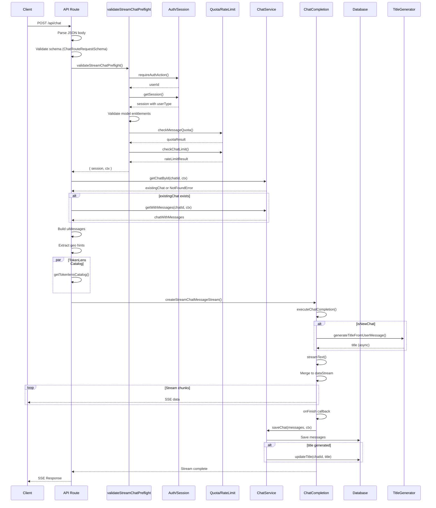

# Process Flow: POST /api/chat

**Generated:** 2026-02-19
**Complexity Score:** 18 (Critical)
**Source File:** `app/api/chat/route.ts`

---

## Entry Point

```typescript
export async function POST(request: Request): Promise<Response>
```

**Location:** `app/api/chat/route.ts:154-543` (389 lines)
**Max Duration:** 60 seconds

**Signature:**
- Input: `Request` object (standard Web API)
- Output: `Response` with SSE stream or error JSON

---

## Execution Steps

### Step 1: Request Body Parsing (L158-171)
```typescript
let rawBody: unknown
try {
    rawBody = await request.json()
} catch {
    throw new ValidationError("Request body must be valid JSON")
}

const parsedBody = ChatRouteRequestSchema.safeParse(rawBody)
if (!parsedBody.success) {
    throw new ValidationError("Invalid chat request body", {
        errors: parsedBody.error.flatten().fieldErrors,
    })
}
```

**Complexity:** 2 branches (JSON parse error, validation error)
**Schema:** `ChatRouteRequestSchema` from `features/chat/schemas/chat.schema.ts`
**Validates:** `id` (UUID), `message`, `selectedChatModel`/`selectedModel`, `selectedVisibilityType`, `settings`

---

### Step 2: Model Selection & Message Construction (L173-197)
```typescript
const body: ChatRouteRequestInput = parsedBody.data
const selectedChatModel = body.selectedChatModel ?? body.selectedModel
const selectedVisibilityType = body.selectedVisibilityType ?? "private"

const message: UIMessage = {
    id: body.message.id ?? generateUUID(),
    role: body.message.role,
    parts: (body.message.parts ?? [
        { type: "text", text: body.message.content ?? "" }
    ]) as UIMessage["parts"],
    ...(body.message.createdAt && { createdAt: body.message.createdAt }),
}
```

**Complexity:** 3 fallback branches
**Notes:** 
- `selectedModel` is a compatibility alias for `selectedChatModel`
- Message can have `parts` array or fall back to `content` string

---

### Step 3: Authentication & Preflight Validation (L199-201)
```typescript
const { session, ctx } = await validateStreamChatPreflight({
    selectedModelId: selectedChatModel,
})
```

**Called Function:** `validateStreamChatPreflight` in `features/chat/actions/stream-chat.action.ts:281-347`

**Preflight Steps (internal to validateStreamChatPreflight):**
1. **Auth Check** (L284): `requireAuthAction()` - throws `UnauthorizedError` if not authenticated
2. **Session Resolution** (L285-289): `getSession()` - gets `AppSession` with user type
3. **Model Validation** (L293-312): 
   - Check `isValidModelId(selectedModelId)` 
   - Check entitlements `availableChatModelIds.includes(selectedModelId)`
   - Throws `ValidationError` if invalid
4. **Daily Quota Check** (L314-328): 
   - `checkMessageQuota(userId, entitlements.maxMessagesPerDay)`
   - Throws `RateLimitError` if exceeded (guests: 20/day, regular: 100/day)
5. **Rate Limit Check** (L330-337):
   - `checkChatLimit(userId)` - 60 requests/minute
   - Throws `RateLimitError` if exceeded

**Returns:** `{ userId, session, ctx: { userId, isGuest } }`

---

### Step 4: Existing Chat Lookup (L203-235)
```typescript
let existingChat = null
try {
    existingChat = await chatService.getChatById(chatId, ctx)
} catch (error) {
    if (error instanceof NotFoundError) {
        // Chat doesn't exist, will create new
    } else if (error instanceof ForbiddenError) {
        throw error
    } else {
        throw error
    }
}

const isNewChat = !existingChat

let chatWithMessages = null
if (existingChat) {
    try {
        chatWithMessages = await chatService.getWithMessages(chatId, ctx)
    } catch (error) {
        if (error instanceof NotFoundError) {
            // Chat doesn't exist
        } else {
            throw error
        }
    }
}
```

**Complexity:** 4 nested try-catch branches
**Service Calls:**
- `chatService.getChatById()` - verifies ownership
- `chatService.getWithMessages()` - fetches messages for context

---

### Step 5: Message Context Building (L237-265)
```typescript
const messagesFromDb = chatWithMessages?.messages ?? []

const uiMessages: UIMessage[] = [
    ...convertToUIMessages(
        messagesFromDb.map((m) => ({
            id: m.id,
            role: m.role,
            parts: m.parts,
            createdAt: m.createdAt,
        })),
    ),
    message, // new user message
]

// Extract geo hints
const geoData = geolocation(request)
const forwardedFor = request.headers.get("x-forwarded-for")
const clientIp = forwardedFor?.split(",")[0]?.trim()
const requestHints = {
    ip: clientIp,
    latitude: geoData.latitude ? Number.parseFloat(geoData.latitude) : undefined,
    longitude: geoData.longitude ? Number.parseFloat(geoData.longitude) : undefined,
    city: geoData.city,
    country: geoData.country,
}
```

**Helper Function:** `convertToUIMessages()` (L72-94) transforms DB messages to AI SDK format

---

### Step 6: Title Preparation (L267-274)
```typescript
const placeholderTitle = isNewChat
    ? generatePlaceholderTitle(message)
    : undefined

let generatedTitlePromise: Promise<string> | null = null
let finalUsageContext: AppUsage | undefined
const tokenlensCatalogPromise = getTokenlensCatalog()
```

**Parallel Operation:** TokenLens catalog fetch runs in background

---

### Step 7: Settings Normalization (L276-306)
```typescript
const normalizedSampling = body.settings?.sampling
    ? {
        ...(body.settings.sampling.temperature !== undefined && {
            temperature: body.settings.sampling.temperature,
        }),
        ...(body.settings.sampling.topP !== undefined && {
            topP: body.settings.sampling.topP,
        }),
        ...(body.settings.sampling.maxOutputTokens !== undefined && {
            maxOutputTokens: body.settings.sampling.maxOutputTokens,
        }),
    }
    : undefined

const chatSettings: ChatSettings | undefined = body.settings
    ? {
        ...(body.settings.systemPrompt !== undefined && {
            systemPrompt: body.settings.systemPrompt,
        }),
        ...(normalizedSampling && Object.keys(normalizedSampling).length > 0 && {
            sampling: normalizedSampling,
        }),
    }
    : undefined
```

**Complexity:** 6 conditional spread operations

---

### Step 8: Stream Creation & AI Completion (L308-532)
```typescript
const stream = createStreamChatMessageStream({
    completion: {
        selectedChatModel,
        requestHints,
        requestBody,
        uiMessages,
        chatId,
        session,
        tokenlensCatalogPromise,
        onUsageCalculated: (usage) => {
            finalUsageContext = usage
            logInfo("AI usage calculated", { ... })
        },
    },
    onBeforeExecute: (dataStream) => {
        if (isNewChat) {
            generatedTitlePromise = generateTitleFromUserMessage({ message })
                .then((title) => {
                    dataStream.write({ type: "data-chatTitle", data: title })
                    return title
                })
                .catch((err) => placeholderTitle ?? "New Chat")
        }
    },
    onExecutionError: (completionError, dataStream) => {
        dataStream.write({ type: "error", errorText: "..." })
    },
    onFinish: async ({ messages }) => {
        // Message persistence (see Step 9)
    },
    onError: (error: unknown) => {
        return "Oops, an error occurred!"
    },
})
```

**Internal Flow in `createStreamChatMessageStream`:**
1. Calls `createUIMessageStream()` from AI SDK
2. Executes `executeChatCompletion()` internally

**AI Completion Flow (`lib/ai/chat-completion.ts:342-540`):**
1. Resolve model from registry (L355)
2. Build provider-specific options for reasoning models (L356)
3. Prepare tools if enabled (L359-371)
4. Build system prompt with `systemPrompt()` (L374-390)
5. Configure `streamText()` with:
   - Model, system prompt, messages
   - Tools, sampling settings, provider options
   - Timeout (55s), smooth streaming
   - Telemetry enabled
6. Merge result to data stream (L533-537)

---

### Step 9: Message Persistence (L389-523)
```typescript
onFinish: async ({ messages }) => {
    // Prepare messages to save
    const messagesToSave: DBMessage[] = [
        // User message
        {
            id: message.id ?? generateUUID(),
            chatId,
            role: "user",
            parts: (message.parts as DBMessage["parts"]) ?? [...],
            attachments: [],
            createdAt: new Date(),
        },
        // Assistant messages
        ...messages.map((m) => ({
            id: m.id ?? generateUUID(),
            chatId,
            role: "assistant" as const,
            parts: (m.parts as DBMessage["parts"]) ?? [],
            attachments: [],
            createdAt: new Date(),
        })),
    ]

    // Save chat and messages
    await chatService.saveChat(
        {
            chatId,
            isNewChat,
            messages: messagesToSave,
            title: initialTitle,
            visibility: selectedVisibilityType,
            ...(finalUsageContext !== undefined && {
                lastContext: finalUsageContext,
            }),
        },
        ctx,
    )
}
```

**Service Layer:** `chatService.saveChat()` delegates to `messageRepository.saveWithContext()`

---

### Step 10: Title Generation (Async) (L458-516)
```typescript
if (isNewChat && generatedTitlePromise) {
    generatedTitlePromise
        .then(async (generatedTitle) => {
            if (generatedTitle && generatedTitle !== initialTitle) {
                const existingChat = await chatService.getChatById(chatId, ctx)
                if (!existingChat) return
                
                await chatService.updateTitle(chatId, generatedTitle, ctx)
            }
        })
        .catch((err) => {
            logWarn("Background title generation promise rejected", { ... })
        })
}
```

**Pattern:** Fire-and-forget background task
**Risk:** Title may fail if chat is deleted quickly

---

### Step 11: Response Streaming (L535)
```typescript
return new Response(stream.pipeThrough(new JsonToSseTransformStream()))
```

**Format:** Server-Sent Events (SSE) via `JsonToSseTransformStream`
**Content-Type:** `text/event-stream`

---

## Error Handling Points

| Location | Error Type | Handler | Response |
|----------|------------|---------|----------|
| L160-164 | JSON parse error | `ValidationError` | 400 Bad Request |
| L166-171 | Schema validation | `ValidationError` | 400 Bad Request |
| L177-179 | Missing model | `ValidationError` | 400 Bad Request |
| L199-201 | Auth/RateLimit (preflight) | Various | See preflight errors |
| L206-215 | Chat access denied | `ForbiddenError` | 403 Forbidden |
| L371-387 | AI init failure | Stream error | SSE error event |
| L517-522 | DB save failure | Log only | Stream completes |
| L524-531 | Stream error | Log + fallback | "Oops, an error occurred!" |
| L536-542 | Global catch | `createChatErrorResponse` | Mapped error response |

### Error Response Mapping (`createChatErrorResponse` L112-144)

| Error Type | HTTP Status | Special Headers |
|------------|-------------|-----------------|
| `ValidationError` | 400 | - |
| `UnauthorizedError` | 401 | - |
| `ForbiddenError` | 403 | - |
| `NotFoundError` | 404 | - |
| `RateLimitError` | 429 | `Retry-After` |
| AI Gateway billing | 400 | Custom message |
| Other | 500 | - |

---

## Complexity Analysis

### Why Complexity = 18

| Factor | Count | Contribution |
|--------|-------|--------------|
| Branch statements (`if`) | 15 | +15 |
| Catch blocks | 3 | +3 |
| Conditional expressions (`?:`) | 8 | +4 |
| Null coalescing (`??`) | 12 | +2 |
| Optional chaining (`?.`) | 6 | +1 |
| Async callbacks | 5 | +2 |
| Nested function calls | 8 | +1 |

### Key Complexity Drivers

1. **Multiple Responsibilities (SRP Violation)**
   - Request validation
   - Authentication orchestration
   - Rate limiting
   - Message context building
   - AI completion
   - DB persistence
   - Title generation
   - Error handling

2. **Deep Nesting**
   - Up to 5 levels of nesting in `onFinish` callback
   - Try-catch within try-catch patterns

3. **Inline Logic**
   - Message preparation inline (L407-432)
   - Settings normalization inline (L276-306)
   - Title generation inline (L458-516)

4. **Mixed Concerns**
   - Geo data extraction in route
   - Usage tracking in route
   - TokenLens catalog fetch in route

---

## Decomposition Recommendation

### Target: Reduce complexity from 18 to <8

#### Extract 1: Request Handler Orchestrator
**File:** `features/chat/lib/chat-request-handler.ts`
```typescript
export async function handleChatPost(request: Request): Promise<Response> {
    const { body, message, selectedModel } = await parseAndValidateRequest(request)
    const { session, ctx } = await validateStreamChatPreflight({ selectedModelId: selectedModel })
    const { isNewChat, existingMessages } = await resolveChatContext(body.id, ctx)
    // ... delegate to stream handler
}
```

#### Extract 2: Message Context Builder
**File:** `features/chat/lib/message-context.ts`
```typescript
export function buildMessageContext(params: {
    existingMessages: Message[]
    newMessage: UIMessage
}): UIMessage[] { ... }
```

#### Extract 3: Request Hints Extractor
**File:** `lib/geo/request-hints.ts`
```typescript
export function extractRequestHints(request: Request): RequestHints { ... }
```

#### Extract 4: Chat Persistence Handler
**File:** `features/chat/lib/chat-persistence.ts`
```typescript
export async function persistChatCompletion(params: {
    chatId: string
    userMessage: UIMessage
    assistantMessages: UIMessage[]
    isNewChat: boolean
    ctx: RepositoryContext
}): Promise<void> { ... }
```

#### Extract 5: Title Generation Flow
**File:** `features/chat/lib/title-generation.ts`
```typescript
export function createTitleGenerationFlow(params: {
    isNewChat: boolean
    message: UIMessage
    placeholderTitle: string
    chatId: string
    ctx: RepositoryContext
}): { promise: Promise<string> | null; cleanup: () => void } { ... }
```

### Proposed File Structure

```
features/chat/
├── actions/
│   ├── stream-chat.action.ts (existing - keep)
│   └── save-chat.action.ts (new - extract persistence)
├── lib/
│   ├── chat-request-handler.ts (new - main orchestrator)
│   ├── message-context.ts (new - message building)
│   ├── chat-persistence.ts (new - DB operations)
│   └── title-generation.ts (new - title flow)
└── schemas/
    └── chat.schema.ts (existing)
```

---

## Sequence Diagram



---

## Issues Found

### Critical Issues

1. **SRP Violation**: Single function handles 8+ distinct responsibilities
   - **Impact**: Hard to test, hard to modify, hard to understand
   - **Location**: Lines 154-543 (389 lines in single function)

2. **Duplicate Validation**: Rate limit checked twice in some paths
   - **Impact**: Unnecessary Redis calls
   - **Location**: `validateStreamChatPreflight` calls both quota and rate limit

3. **Nested Try-Catch Anti-Pattern**: Error handling buried in logic
   - **Impact**: Error handling scattered, hard to trace
   - **Location**: Lines 204-235

### Medium Issues

4. **Inline Object Construction**: Message and settings built inline
   - **Impact**: Reduces readability, hard to unit test
   - **Location**: Lines 407-432 (messagesToSave)

5. **Fire-and-Forget Title Update**: Background promise not awaited
   - **Impact**: Silent failures, potential race conditions
   - **Location**: Lines 458-516

6. **Magic Numbers**: Timeout values, limits hardcoded
   - **Impact**: Hard to tune, not discoverable
   - **Location**: `AI_COMPLETION_TIMEOUT_MS = 55_000`

### Minor Issues

7. **Redundant Helper**: `generateUUID()` wrapper (L99-101)
   - **Recommendation**: Use `crypto.randomUUID()` directly

8. **Duplicate Converter**: `convertToUIMessages` similar to `messageToUIMessage` in reconnect route
   - **Recommendation**: Extract to shared utility

---

## Simplification Opportunities

### High Impact, Low Effort

| Opportunity | Effort | Impact | Priority |
|-------------|--------|--------|----------|
| Extract `generateUUID()` call | 1 min | Low | P3 |
| Move geo extraction to utility | 30 min | Medium | P2 |
| Extract `convertToUIMessages` to shared | 1 hour | Medium | P2 |
| Extract settings normalization | 2 hours | High | P1 |

### High Impact, Medium Effort

| Opportunity | Effort | Impact | Priority |
|-------------|--------|--------|----------|
| Extract persistence to service method | 4 hours | High | P1 |
| Create request orchestrator | 6 hours | Very High | P1 |
| Extract title generation flow | 3 hours | High | P2 |

### Architecture Improvements

1. **Route Thin Pattern**: Route should only:
   - Parse request
   - Call orchestrator
   - Transform response
   - Handle errors

2. **Service Layer**: All DB operations through `chatService`

3. **Background Jobs**: Title generation should be a queue job

4. **Streaming Decoupling**: Consider WebSocket for better control

---

## Metrics Summary

| Metric | Current | Target |
|--------|---------|--------|
| Cyclomatic Complexity | 18 | <8 |
| Lines of Code (POST) | 389 | <100 |
| Responsibilities | 8+ | 1-2 |
| Test Coverage | Unknown | >90% |
| Nesting Depth | 5 | <3 |

---

## Related Files

- `features/chat/actions/stream-chat.action.ts` - Preflight validation
- `lib/ai/chat-completion.ts` - AI execution
- `lib/data/services/chat.service.ts` - Persistence
- `features/chat/schemas/chat.schema.ts` - Validation schemas
- `lib/rate-limit/limits.ts` - Rate limiting
- `lib/cache/quota.ts` - Daily quotas
- `lib/ai/entitlements.ts` - User entitlements
