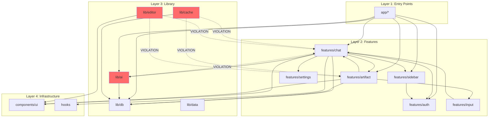

# Architecture Analysis Report

## Layer Map

```
Layer 1: Entry Points (app/*)
    - app/api/* - API routes
    - app/(chat)/* - Chat pages
    - app/(auth)/* - Auth pages

Layer 2: Features (features/*)
    - features/artifact
    - features/auth
    - features/chat
    - features/input
    - features/settings
    - features/sidebar

Layer 3: Library (lib/*)
    - lib/ai - AI integrations
    - lib/cache - Caching utilities
    - lib/db - Database utilities
    - lib/data - Data types and utilities
    - lib/editor - Editor extensions

Layer 4: Infrastructure (components/ui, hooks)
    - components/ui - UI primitives
    - hooks - Shared hooks
```

## Circular Dependencies

### lib/db/pagination.ts ↔ lib/data/types.ts

**Status: FALSE POSITIVE - No circular dependency detected**

- **Analysis:** The dependency flows in one direction only:
  - `lib/db/pagination.ts` → imports `PaginatedResult, PaginationParams` from `lib/data/types.ts`
  - `lib/data/types.ts` → imports schema types from `lib/db/schema.ts` only
  - No back-reference from `lib/data/types.ts` to `lib/db/pagination.ts`

- **Dependency Chain:**
  ```
  lib/db/pagination.ts → lib/data/types.ts → lib/db/schema.ts
  ```

- **Verdict:** Clean unidirectional dependency. No action required.

## Layer Violations

### 1. lib/editor/suggestions-extension.tsx

- **File:** `lib/editor/suggestions-extension.tsx:16-17`
- **Imports:**
  ```typescript
  import type { ArtifactKind } from "@/features/artifact/types"
  import type { StreamingSuggestion } from "@/features/chat/types"
  ```
- **Violation:** lib → features (wrong direction)
- **Severity:** HIGH
- **Resolution Options:**
  1. **Move file to features:** Relocate to `features/artifact/lib/editor/` since it's feature-specific
  2. **Extract types to lib:** Create `lib/editor/types.ts` with shared types
  3. **Use dependency injection:** Pass types through function parameters
- **Recommended:** Option 1 - Move file to `features/artifact/lib/editor/suggestions-extension.tsx`
  - Rationale: The extension is specifically for artifact suggestions, making it feature-specific

### 2. lib/cache/types.ts

- **File:** `lib/cache/types.ts:20-25`
- **Imports:**
  ```typescript
  export type { ArtifactKind } from "@/features/artifact/types"
  export type { VisibilityType } from "@/features/chat/components"
  import type { AppUsage } from "@/features/chat/types"
  ```
- **Violation:** lib → features (wrong direction)
- **Severity:** HIGH
- **Resolution Options:**
  1. **Consolidate types in lib:** Move `ArtifactKind`, `VisibilityType`, `AppUsage` to `lib/types/`
  2. **Keep feature types in features:** Remove re-exports, import directly from features where needed
- **Recommended:** Option 1 - Move shared types to `lib/types/`
  - Rationale: These types are used across multiple layers and should be infrastructure-level

### 3. lib/ai/chat-completion.ts

- **File:** `lib/ai/chat-completion.ts:21`
- **Imports:**
  ```typescript
  import { createChatTools } from "@/features/chat/lib/tools"
  ```
- **Violation:** lib → features (wrong direction)
- **Severity:** CRITICAL
- **Resolution Options:**
  1. **Move tools to lib:** Relocate `createChatTools` to `lib/ai/tools/`
  2. **Invert dependency:** Have features register tools with lib via a registry pattern
  3. **Accept coupling:** Document as intentional architectural exception
- **Recommended:** Option 2 - Implement tool registry pattern
  - Rationale: AI layer should not know about feature implementations

## Cross-Feature Imports

### features/chat imports

| From Feature | Import | File | Necessary? | Alternative |
|--------------|--------|------|------------|-------------|
| artifact | `useArtifact`, `useArtifactSelector`, `initialArtifactData` | chat.tsx:18-22 | Yes | Move to shared hooks or events |
| artifact | `useArtifact`, `useArtifactSelector` | data-stream-handler.tsx:18 | Yes | Use event-based communication |
| artifact | `getArtifactHandler`, `ArtifactKind` | tools/*.tool.ts | Yes | Register handlers via registry |
| auth | `useAuth` | chat.tsx:23 | Yes | Context-based, acceptable |
| settings | `useSettings` | chat.tsx:24 | Yes | Context-based, acceptable |
| sidebar | `useOptimisticChats` | chat.tsx:25 | Yes | Move to shared state |

### features/artifact imports

| From Feature | Import | File | Necessary? | Alternative |
|--------------|--------|------|------------|-------------|
| chat | `Attachment`, `ChatMessage`, `UserVote` | artifact-panel.tsx:36 | Yes | Extract to shared types |
| input | `MultimodalInput` | artifact-panel.tsx:37 | No | Inline or create shared component |
| chat | `Message`, `ThinkingMessage` | artifact-messages.tsx:14 | Yes | Extract to shared components |

### features/sidebar imports

| From Feature | Import | File | Necessary? | Alternative |
|--------------|--------|------|------------|-------------|
| auth | `useAuth`, `useLogoutHandler` | sidebar-user-nav.tsx:32-33 | Yes | Context-based, acceptable |
| auth | `useAuth` | sidebar-history.tsx:34 | Yes | Context-based, acceptable |
| auth | `useAuth` | sidebar.tsx:41 | Yes | Context-based, acceptable |

### features/input imports

| From Feature | Import | File | Necessary? | Alternative |
|--------------|--------|------|------------|-------------|
| chat | `Attachment`, `ChatMessage` | multimodal-input.tsx:28 | Yes | Extract to shared types |

## Dependency Direction Diagram



## Summary Statistics

| Metric | Count |
|--------|-------|
| lib → features violations | 3 files, 7 imports |
| features → features imports | 6 features involved |
| Circular dependencies | 0 (false positive) |

## Recommendations

### High Priority (Critical Architecture)

1. **Implement Tool Registry Pattern**
   - Move tool registration from direct import to registry
   - File: `lib/ai/chat-completion.ts:21`
   - Create: `lib/ai/tools/registry.ts`
   - Allow features to register tools at startup

2. **Create Shared Types Layer**
   - Location: `lib/types/shared.ts`
   - Move: `ArtifactKind`, `AppUsage`, `VisibilityType`, `ChatMessage`, `Attachment`
   - These types are used across 3+ features and lib layers

### Medium Priority (Code Organization)

3. **Relocate Editor Extension**
   - Move `lib/editor/suggestions-extension.tsx` to `features/artifact/lib/editor/`
   - Update all imports
   - This extension is artifact-specific

4. **Reduce Cross-Feature Coupling**
   - Create `lib/types/chat.ts` for shared chat types
   - Create `lib/types/artifact.ts` for shared artifact types
   - Feature-specific types remain in features

### Low Priority (Nice to Have)

5. **Audit Context Usage**
   - Review `useAuth` usage across features
   - Consider centralized auth state via Zustand or React Context
   - Current pattern is acceptable but could be cleaner

6. **Document Architectural Decisions**
   - Add ADR (Architecture Decision Record) for layer boundaries
   - Document intentional cross-feature imports
   - Create dependency rules in linter config

## Action Items

- [ ] Create `lib/types/shared.ts` with extracted types
- [ ] Implement tool registry pattern in `lib/ai/tools/`
- [ ] Move `suggestions-extension.tsx` to features
- [ ] Update `lib/cache/types.ts` to use shared types
- [ ] Add ESLint rule for lib → features import detection
