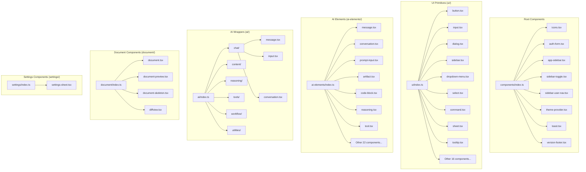
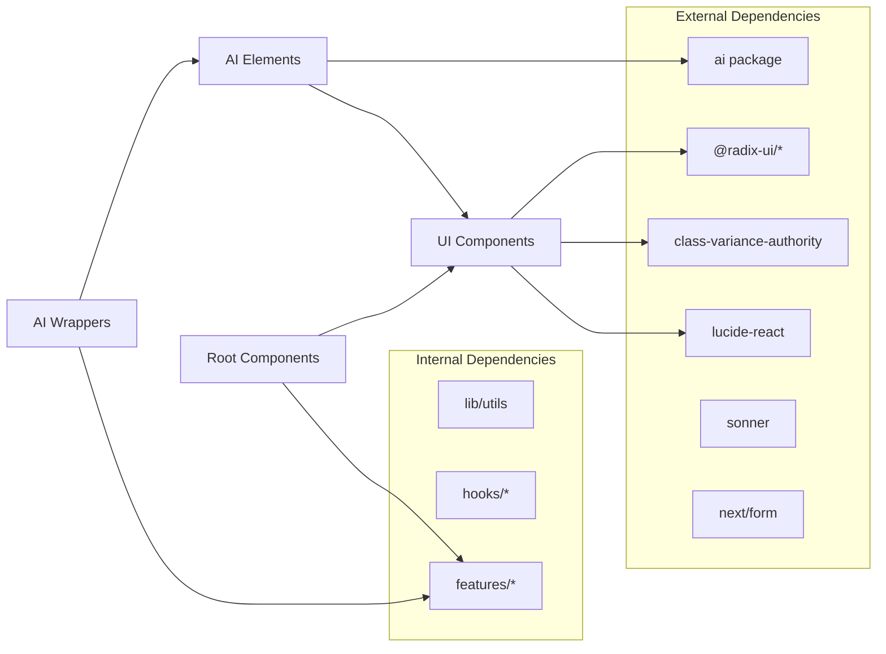

# Components Functional Mapping

## Overview

The `components/` directory contains shared UI components organized into distinct layers:
- **UI Primitives** (`ui/`) - Radix-based shadcn/ui components
- **AI Elements** (`ai-elements/`) - Read-only SDK primitives for AI interfaces
- **AI Wrappers** (`ai/`) - Project-specific compositions of AI elements
- **Document Components** (`document/`) - Document-related components
- **Settings Components** (`settings/`) - Settings sheet components
- **Root Components** - App-level components (icons, auth, sidebar, etc.)

---

## Component Hierarchy



---

## UI Primitives (`components/ui/`)

### Component Inventory

| Component | Source | Variants | Key Props |
|-----------|--------|----------|-----------|
| `Button` | Radix Slot + CVA | default, destructive, outline, secondary, ghost, link | `variant`, `size`, `asChild` |
| `Input` | Custom | - | `type`, `className` |
| `Dialog` | Radix Dialog | - | `open`, `onOpenChange` |
| `Sidebar` | Custom context | sidebar, floating, inset | `side`, `variant`, `collapsible` |
| `DropdownMenu` | Radix Dropdown | - | Standard Radix props |
| `Select` | Radix Select | - | `value`, `onValueChange` |
| `Command` | cmdk | - | Command palette props |
| `Sheet` | Radix Dialog | - | `open`, `onOpenChange`, `side` |
| `Tooltip` | Radix Tooltip | - | Standard Radix props |
| `Alert` | Custom | default, destructive | `variant` |
| `AlertDialog` | Radix Alert Dialog | - | Standard Radix props |
| `Avatar` | Radix Avatar | - | `src`, `fallback` |
| `Badge` | CVA | default, secondary, destructive, outline | `variant` |
| `Card` | Custom | - | Compound components |
| `Carousel` | Embla Carousel | - | Carousel API |
| `Collapsible` | Radix Collapsible | - | `open`, `onOpenChange` |
| `HoverCard` | Radix Hover Card | - | Standard Radix props |
| `InputGroup` | Custom | - | Compound components |
| `Label` | Custom | - | `htmlFor` |
| `Progress` | Radix Progress | - | `value` |
| `ScrollArea` | Radix Scroll Area | - | Standard Radix props |
| `Separator` | Radix Separator | - | `orientation` |
| `Skeleton` | Custom | - | `className` |
| `Slider` | Radix Slider | - | `value`, `onValueChange` |
| `Switch` | Radix Switch | - | `checked`, `onCheckedChange` |
| `Textarea` | Custom | - | Standard textarea props |

### Key Patterns

1. **Variant System**: Uses `class-variance-authority` (CVA) for consistent variant handling
2. **Compound Components**: Many components use compound pattern (Dialog, Sidebar, etc.)
3. **Forward Refs**: All components properly forward refs for DOM access
4. **Barrel Export**: `ui/index.ts` exports all components with types

### Sidebar Component Deep Dive

The [`sidebar.tsx`](components/ui/sidebar.tsx:1) is the most complex UI primitive:

```typescript
// Context-based state management
type SidebarContextProps = {
  state: "expanded" | "collapsed"
  open: boolean
  setOpen: (open: boolean) => void
  openMobile: boolean
  setOpenMobile: (open: boolean) => void
  isMobile: boolean | undefined
  toggleSidebar: () => void
}

// Compound components (25+ exports)
SidebarProvider, Sidebar, SidebarContent, SidebarHeader, SidebarFooter,
SidebarGroup, SidebarMenu, SidebarMenuItem, SidebarMenuButton, SidebarTrigger, etc.
```

---

## AI Elements (`components/ai-elements/`)

### Purpose

Read-only SDK primitives for building AI chat interfaces. These are **foundation components** that should never be modified directly - project-specific customizations go in `components/ai/`.

### Component Categories

#### 1. Message Components (`message.tsx`)

```typescript
// Base message primitives
Message          // Root container with role-based styling
MessageContent   // Content container
MessageActions   // Action button container
MessageAction    // Individual action with tooltip
MessageBranch    // Branch switching for multiple responses
MessageBranchSelector  // UI for selecting branches
MessageAttachments     // Attachment container
MessageAttachment      // Individual attachment display
```

#### 2. Conversation Components (`conversation.tsx`)

```typescript
Conversation           // Root with auto-scroll (use-stick-to-bottom)
ConversationContent    // Message list container
ConversationEmptyState // Empty state display
ConversationScrollButton  // Scroll-to-bottom button
```

#### 3. Prompt Input Components (`prompt-input.tsx`)

A comprehensive 36,000+ character file with:

```typescript
// Context providers
PromptInputProvider
usePromptInputController
useProviderAttachments

// Core components
PromptInput           // Main input component
PromptInputTextarea   // Textarea with auto-resize
PromptInputSubmit     // Submit button

// Attachment handling
PromptInputAttachments  // Attachment preview
PromptInputFilePreview  // Individual file preview

// Action menus
PromptInputActionsMenu  // Dropdown for actions
PromptInputCommandMenu  // Command palette
```

#### 4. Artifact Components (`artifact.tsx`)

```typescript
Artifact           // Root container
ArtifactHeader     // Header with title/actions
ArtifactClose      // Close button
ArtifactTitle      // Title display
ArtifactDescription // Description text
ArtifactActions    // Action button container
ArtifactAction     // Individual action with tooltip
ArtifactContent    // Scrollable content area
```

#### 5. Other AI Elements

| Category | Components |
|----------|------------|
| **Code** | `CodeBlock`, `CodeBlockCopyButton` |
| **Reasoning** | `Reasoning`, `ReasoningStep`, `Thinking` |
| **Tools** | `Tool`, `ToolCall`, `ToolConfirmation` |
| **Workflow** | `Plan`, `Queue`, `Task`, `Checkpoint` |
| **Visualization** | `Node`, `Edge`, `Canvas`, `Panel` |
| **Utilities** | `Loader`, `Shimmer`, `Lazy`, `Suggestion` |
| **Content** | `Image`, `WebPreview`, `Sources`, `InlineCitation` |

---

## AI Wrappers (`components/ai/`)

### Architecture Pattern

```
Layer 1: ai-elements/ (Read-only SDK primitives - NEVER MODIFY)
            |
         v
Layer 2: ai/ (Project wrappers - THIS DIRECTORY)
```

### Wrapper Components

#### 1. Chat Wrappers (`ai/chat/`)

| Wrapper | Base Element | Added Features |
|---------|--------------|----------------|
| `AIMessage` | `Message` | Role-based styling, vote display, memoization |
| `AIChatInput` | `PromptInput` | Form handling, file attachments, suggestions |
| `AIConversation` | `Conversation` | Message rendering, loading states, scroll behavior |

#### 2. Content Wrappers (`ai/content/`)

| Wrapper | Base Element | Added Features |
|---------|--------------|----------------|
| `AICodeBlock` | `CodeBlock` | Copy functionality, language detection |
| `AIImage` | `Image` | Gallery support, lazy loading |
| `AIWebPreview` | `WebPreview` | Artifact preview integration |

#### 3. Tool Wrappers (`ai/tools/`)

| Wrapper | Purpose |
|---------|---------|
| `AIToolCall` | Display tool invocations |
| `AIToolRegistry` | Registry pattern for tool handlers |
| `AIConfirmation` | Tool approval dialogs |

#### 4. Workflow Wrappers (`ai/workflow/`)

| Wrapper | Purpose |
|---------|---------|
| `AIPlan` | Plan display with actions |
| `AIQueue` | Message queue visualization |
| `AITask` | Task tracking display |
| `AICheckpoint` | Workflow checkpoint markers |

---

## Document Components (`components/document/`)

### Component Details

| Component | Purpose | Props |
|-----------|---------|-------|
| `DocumentToolCall` | In-progress document operations | `type`, `args`, `isReadonly` |
| `DocumentToolResult` | Completed document operations | `type`, `result`, `isReadonly` |
| `DocumentPreview` | Preview display | Document content props |
| `DocumentSkeleton` | Loading placeholder | `isInline` |
| `DiffView` | Diff visualization | `oldContent`, `newContent` |

### Integration Points

- Uses [`useArtifact()`](features/artifact/hooks/use-artifact) hook
- Integrates with artifact system for document editing
- Supports create/update/suggest document operations

---

## Root Components

### Icons (`icons.tsx`)

Custom SVG icon components with consistent API:

```typescript
type IconProps = { size?: number } & SVGProps<SVGSVGElement>

// 30+ icons exported
BotIcon, UserIcon, PlusIcon, ChevronDownIcon, CheckCircleFillIcon,
GlobeIcon, LockIcon, ArrowUpIcon, StopIcon, SummarizeIcon,
SidebarLeftIcon, LoaderIcon, CrossIcon, CopyIcon, ThumbUpIcon,
ThumbDownIcon, SparklesIcon, EyeIcon, ShareIcon, CodeIcon, etc.
```

### Auth Form (`auth-form.tsx`)

```typescript
interface AuthFormProps {
  action: string | ((formData: FormData) => void | Promise<void>)
  children: React.ReactNode
  defaultEmail?: string
}
```

Uses Next.js `Form` component with email/password fields.

### Sidebar Components

| Component | Location | Purpose |
|-----------|----------|---------|
| `AppSidebar` | Re-export from `features/sidebar` | Main application sidebar |
| `SidebarToggle` | `components/sidebar-toggle.tsx` | Toggle button with tooltip |
| `SidebarUserNav` | Re-export from `features/sidebar` | User navigation section |

### Other Root Components

| Component | Purpose |
|-----------|---------|
| `ThemeProvider` | Next-themes wrapper for dark mode |
| `toast` | Sonner toast re-export |
| `VersionFooter` | Artifact version navigation |

---

## Component Dependencies



---

## Export Structure

### Main Barrel Export (`components/index.ts`)

```typescript
// UI Components (shadcn/ui primitives)
export * from "./ui"

// AI Element Primitives (read-only SDK)
export * from "./ai-elements"

// AI Wrappers (project-specific compositions)
export * from "./ai"

// Document Components
export * from "./document"

// Settings Components
export * from "./settings"

// Root Components
export { AppSidebar } from "./app-sidebar"
export { AuthForm } from "./auth-form"
export { SidebarToggle } from "./sidebar-toggle"
export { SidebarUserNav } from "./sidebar-user-nav"
export { ThemeProvider } from "./theme-provider"
export { toast } from "./toast"
export { VersionFooter } from "./version-footer"
// Named icon exports
export { ArrowUpIcon, BotIcon, ... } from "./icons"
```

---

## Summary Statistics

| Category | File Count | Export Count |
|----------|------------|--------------|
| UI Primitives | 26 | 100+ |
| AI Elements | 30 | 150+ |
| AI Wrappers | 20 | 80+ |
| Document | 4 | 8 |
| Settings | 1 | 1 |
| Root | 9 | 40+ |
| **Total** | **90** | **380+** |