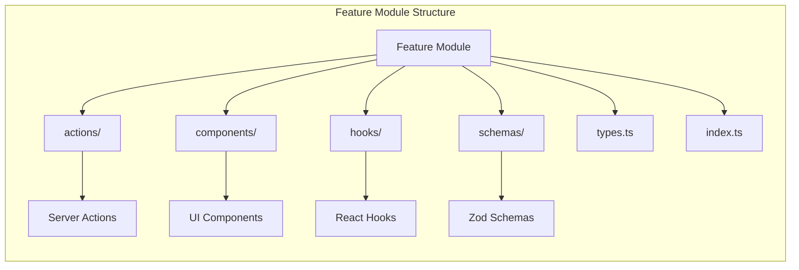
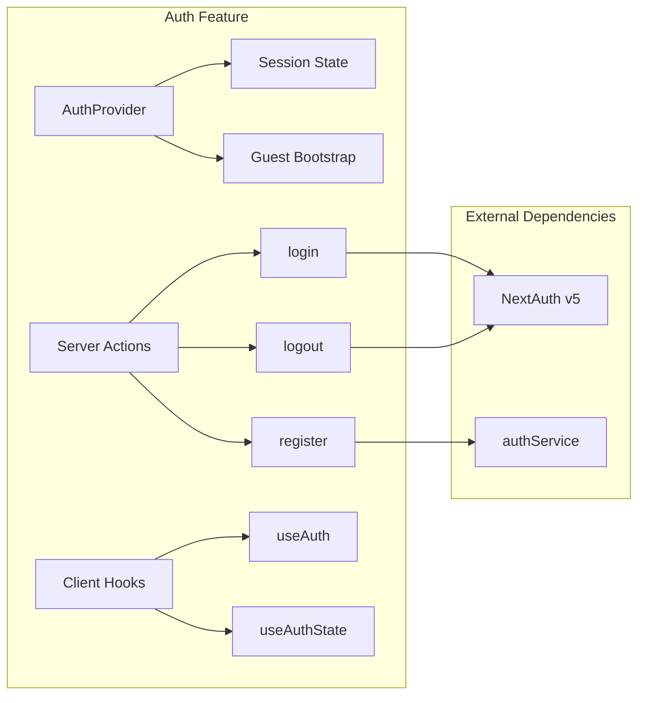
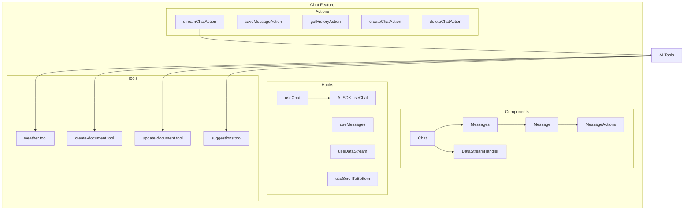
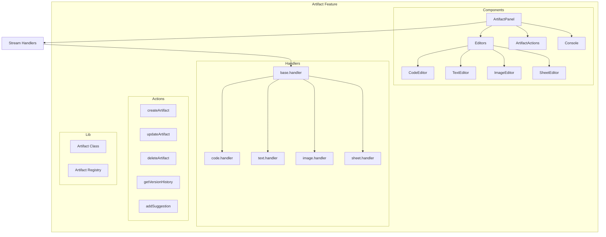
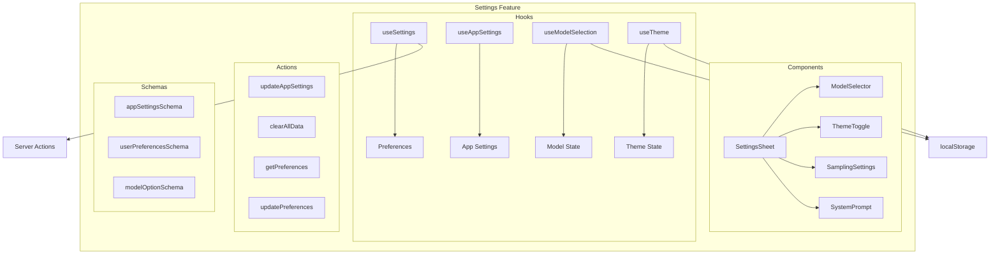
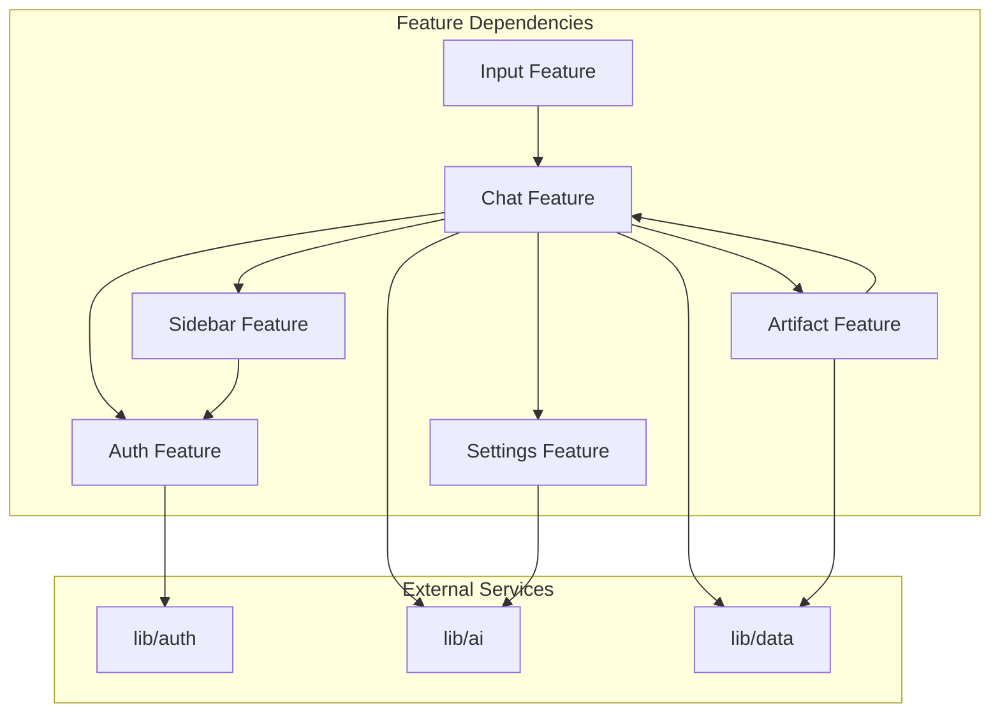

# Feature Modules Functional Mapping

## Overview

This document maps the functional structure of all feature modules in the Next.js AI chatbot application. Each feature module follows a consistent architecture with actions, components, hooks, and schemas.

---

## Feature Module Architecture



---

## 1. Auth Feature (`features/auth/`)

### Public API

| Export | Type | Description |
|--------|------|-------------|
| `AuthProvider` | Component | Context provider for session state |
| `AuthForm` | Component | Login/register form component |
| `ProtectedRoute` | Component | Route guard component |
| `useAuth` | Hook | Access auth context |
| `useAuthState` | Hook | Extended auth state utilities |
| `login` | Action | Server action for authentication |
| `logout` | Action | Server action for sign out |
| `register` | Action | Server action for registration |
| `loginSchema` | Schema | Login validation |
| `registerSchema` | Schema | Registration validation |

### Feature Boundaries



### Responsibilities

1. **Session Management**: Multi-tab sync via BroadcastChannel API
2. **Guest Bootstrap**: Automatic guest session creation for anonymous users
3. **Authentication Flows**: Login, logout, register with redirect support
4. **Route Protection**: ProtectedRoute component for auth guards

### Inter-Feature Dependencies

| Dependency | Direction | Purpose |
|------------|-----------|---------|
| `@/lib/auth/session` | Import | Session type definitions |
| `@/lib/auth` | Import | NextAuth signIn/signOut |
| `@/lib/data/services/auth.service` | Import | User creation service |
| Chat Feature | Consumer | Uses auth state for user info |
| Sidebar Feature | Consumer | Uses auth state for user display |

---

## 2. Chat Feature (`features/chat/`)

### Public API

| Export | Type | Description |
|--------|------|-------------|
| `Chat` | Component | Main chat container |
| `Messages` | Component | Message list display |
| `Message` | Component | Individual message |
| `MessageActions` | Component | Message action buttons |
| `DataStreamHandler` | Component | Stream data processor |
| `useChat` | Hook | Chat state management |
| `useMessages` | Hook | Message state management |
| `useDataStream` | Hook | Stream data management |
| `streamChatAction` | Action | AI streaming action |
| `saveMessageAction` | Action | Message persistence |
| `getHistoryAction` | Action | Chat history retrieval |
| `createChatAction` | Action | Chat creation |
| `deleteChatAction` | Action | Chat deletion |

### Feature Boundaries



### Responsibilities

1. **Message Streaming**: AI response streaming with throttle control
2. **State Management**: Chat state with AI SDK integration
3. **Tool Execution**: AI tool calls (weather, documents, suggestions)
4. **History Management**: Chat history retrieval and pagination
5. **Artifact Integration**: Stream data for artifact rendering

### Inter-Feature Dependencies

| Dependency | Direction | Purpose |
|------------|-----------|---------|
| Auth Feature | Import | User session for auth checks |
| Artifact Feature | Import | Artifact state and streaming |
| Settings Feature | Import | Model selection state |
| Sidebar Feature | Import | Optimistic chat updates |
| Input Feature | Consumer | Receives input submissions |
| `@/lib/ai/registry` | Import | Model registry access |
| `@/lib/data/services/chat.service` | Import | Chat persistence |

---

## 3. Artifact Feature (`features/artifact/`)

### Public API

| Export | Type | Description |
|--------|------|-------------|
| `ArtifactPanel` | Component | Main artifact display panel |
| `ArtifactActions` | Component | Artifact action toolbar |
| `ArtifactClose` | Component | Close button |
| `ArtifactErrorBoundary` | Component | Error handling wrapper |
| `useArtifact` | Hook | Artifact state management |
| `useArtifactSelector` | Hook | Selector-based state reading |
| `createArtifact` | Action | Create artifact |
| `updateArtifact` | Action | Update artifact content |
| `deleteArtifact` | Action | Delete artifact |
| `getArtifact` | Action | Retrieve artifact |
| `getVersionHistory` | Action | Version history retrieval |
| `rollbackToVersion` | Action | Version rollback |
| `addSuggestion` | Action | Add AI suggestion |
| `applySuggestion` | Action | Apply suggestion |
| `Artifact` | Class | Artifact definition class |

### Feature Boundaries



### Responsibilities

1. **Document Management**: Create, update, delete artifacts
2. **Version Control**: Version history and rollback
3. **Editor Components**: Type-specific editors (code, text, image, sheet)
4. **AI Suggestions**: Suggestion management and application
5. **Stream Handling: Real-time content streaming

### Inter-Feature Dependencies

| Dependency | Direction | Purpose |
|------------|-----------|---------|
| Chat Feature | Import | Chat context for artifacts |
| `@/lib/data/services` | Import | Artifact persistence |
| `@/lib/db/schema` | Import | Database types |

---

## 4. Input Feature (`features/input/`)

### Public API

| Export | Type | Description |
|--------|------|-------------|
| `MultimodalInput` | Component | Main input component |
| `AttachmentPreview` | Component | File attachment preview |
| `SubmitButton` | Component | Submit button |
| `SuggestedActions` | Component | AI-suggested prompts |
| `useInput` | Hook | Input state management |
| `useFileUpload` | Hook | File upload management |
| `useFileValidation` | Hook | File validation |
| `validateInput` | Schema | Input validation |
| `validateFileSize` | Schema | File size validation |
| `validateFileType` | Schema | File type validation |

### Feature Boundaries

```mermaid
graph TB
    subgraph "Input Feature"
        direction TB
        
        subgraph "Components"
            INPUT[MultimodalInput] --> TEXTAREA[Textarea]
            INPUT --> ATTACHMENTS[Attachments]
            INPUT --> SUBMIT[SubmitButton]
            INPUT --> SUGGESTED[SuggestedActions]
            ATTACHMENTS --> PREVIEW[AttachmentPreview]
        end
        
        subgraph "Hooks"
            USEINPUT[useInput] --> LOCAL[localStorage]
            USEFILE[useFileUpload] --> UPLOAD[Upload Queue]
            USEFILE --> PROGRESS[Progress Tracking]
            USEVAL[useFileValidation]
        end
        
        subgraph "Schemas"
            INPUT_SCHEMA[InputStateSchema]
            FILE_SCHEMA[AttachmentSchema]
            UPLOAD_SCHEMA[UploadConfigSchema]
        end
    end
    
    INPUT --> CHAT[Chat Feature]
    USEFILE --> API[/api/files/upload]
```

### Responsibilities

1. **Text Input**: Input state with localStorage persistence
2. **File Attachments**: Upload, validation, preview
3. **Suggested Actions**: AI-suggested prompts display
4. **Submit Handling**: Form submission coordination

### Inter-Feature Dependencies

| Dependency | Direction | Purpose |
|------------|-----------|---------|
| Chat Feature | Consumer | Receives input submissions |
| `@/features/chat/types` | Import | Attachment type definition |

---

## 5. Settings Feature (`features/settings/`)

### Public API

| Export | Type | Description |
|--------|------|-------------|
| `SettingsSheet` | Component | Settings panel |
| `ModelSelector` | Component | Model selection dropdown |
| `ThemeToggle` | Component | Theme toggle control |
| `SettingsProvider` | Component | Settings context provider |
| `useSettings` | Hook | Settings state management |
| `useAppSettings` | Hook | App-wide settings |
| `useTheme` | Hook | Theme management |
| `useModelSelection` | Hook | Model selection state |
| `updateAppSettings` | Action | Update settings |
| `clearAllData` | Action | Clear user data |
| `getPreferences` | Action | Get user preferences |
| `updatePreferences` | Action | Update preferences |

### Feature Boundaries



### Responsibilities

1. **Model Selection**: AI model selection with persistence
2. **Theme Management**: Light/dark/system theme control
3. **Sampling Settings**: Temperature, top-p, max tokens
4. **User Preferences**: Language, font size, UI options
5. **Data Management**: Clear data, export data

### Inter-Feature Dependencies

| Dependency | Direction | Purpose |
|------------|-----------|---------|
| Chat Feature | Consumer | Model selection for chat |
| `@/lib/ai/constants` | Import | Default AI settings |
| `@/lib/ai/registry` | Import | Available models |

---

## 6. Sidebar Feature (`features/sidebar/`)

### Public API

| Export | Type | Description |
|--------|------|-------------|
| `AppSidebar` | Component | Main sidebar container |
| `SidebarHistory` | Component | Chat history list |
| `SidebarItem` | Component | Individual chat item |
| `SidebarToggle` | Component | Sidebar toggle button |
| `SidebarUserNav` | Component | User navigation |
| `useSidebarState` | Hook | Sidebar state management |
| `useOptimisticChats` | Hook | Optimistic chat entries |
| `getChatHistory` | Action | History retrieval |
| `deleteChat` | Action | Delete single chat |
| `deleteAllChats` | Action | Delete all chats |

### Feature Boundaries

```mermaid
graph TB
    subgraph "Sidebar Feature"
        direction TB
        
        subgraph "Components"
            SIDEBAR[AppSidebar] --> HISTORY[SidebarHistory]
            HISTORY --> GROUPS[Chat Groups]
            GROUPS --> ITEM[SidebarItem]
            SIDEBAR --> USERNAV[SidebarUserNav]
            SIDEBAR --> TOGGLE[SidebarToggle]
        end
        
        subgraph "Hooks"
            USESIDEBAR[useSidebarState] --> STATE[State]
            USEOPTIM[useOptimisticChats] --> OPTIM[Optimistic Chats]
        end
        
        subgraph "Actions"
            GET_HIST[getChatHistory]
            DEL_CHAT[deleteChat]
            DEL_ALL[deleteAllChats]
        end
        
        subgraph "State"
            OPTIM_PROVIDER[OptimisticChatsProvider]
            OPTIM_CHATS[OptimisticChat[]]
        end
    end
    
    HISTORY --> PAGINATION[Cursor Pagination]
    USEOPTIM --> O1[O(1) Duplicate Detection]
    USEOPTIM --> O2[Memory Bounded 50 entries]
```

### Responsibilities

1. **Chat History**: Display and navigate chat history
2. **Grouping**: Group chats by date (today, yesterday, week, month)
3. **Optimistic Updates**: Immediate UI feedback for new chats
4. **User Navigation**: User profile and logout
5. **Mobile Responsiveness**: Collapsible sidebar for mobile

### Inter-Feature Dependencies

| Dependency | Direction | Purpose |
|------------|-----------|---------|
| Auth Feature | Import | User session for display |
| Chat Feature | Consumer | Chat selection navigation |
| `@/components/ui/sidebar` | Import | Base sidebar component |
| `@/hooks/use-mobile` | Import | Mobile detection |

---

## Inter-Feature Dependency Graph



---

## Summary

| Feature | Actions | Components | Hooks | Schemas |
|---------|---------|------------|-------|---------|
| Auth | 3 | 4 | 3 | 4 |
| Chat | 8 | 10 | 7 | 10+ |
| Artifact | 10+ | 8 | 2 | 15+ |
| Input | 0 | 5 | 3 | 6 |
| Settings | 6 | 5 | 4 | 8 |
| Sidebar | 3 | 6 | 2 | 0 |

### Key Observations

1. **Chat is the central feature** - Most interconnected with other features
2. **Artifact is the most complex** - Many actions, handlers, and editors
3. **Input is self-contained** - Minimal external dependencies
4. **Settings has dual persistence** - localStorage + server actions
5. **Sidebar uses optimistic patterns** - Immediate UI feedback before server confirmation