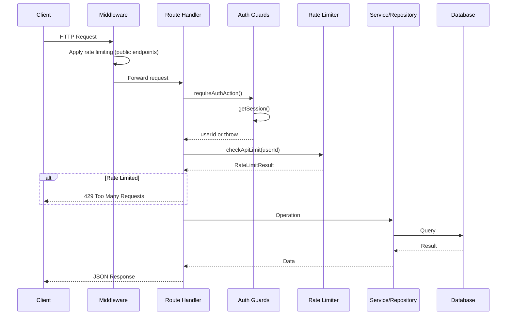
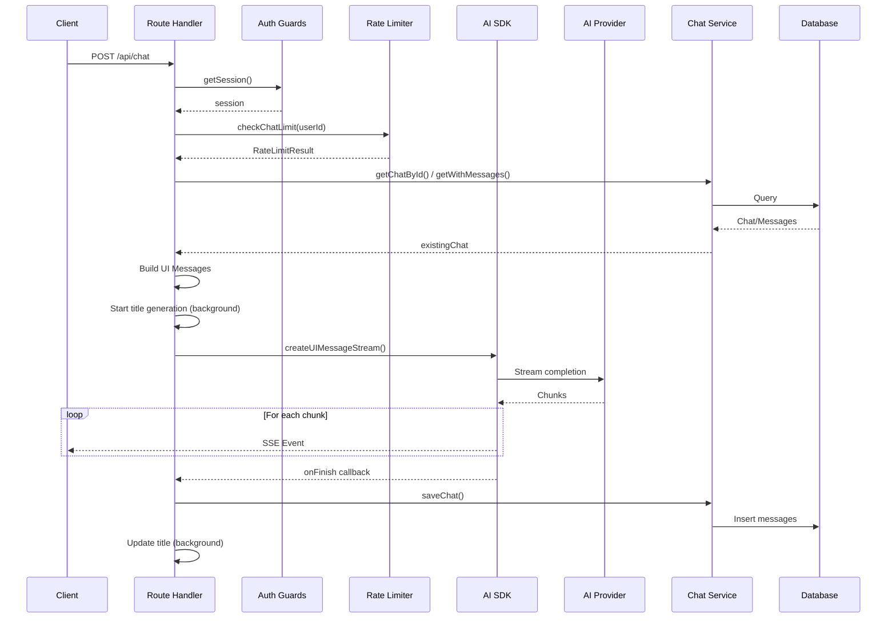
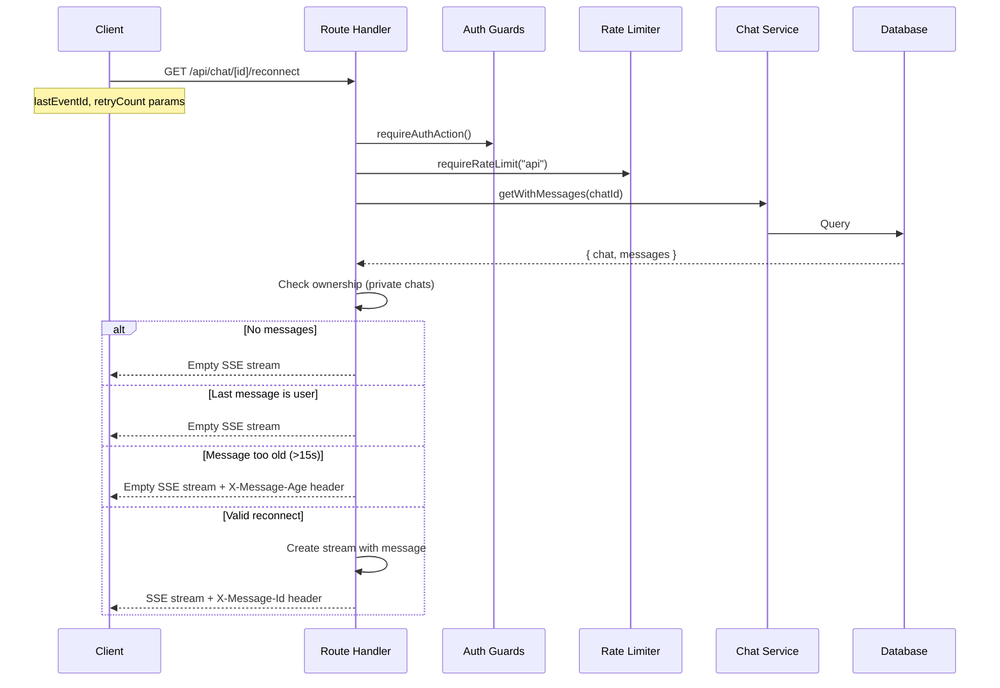
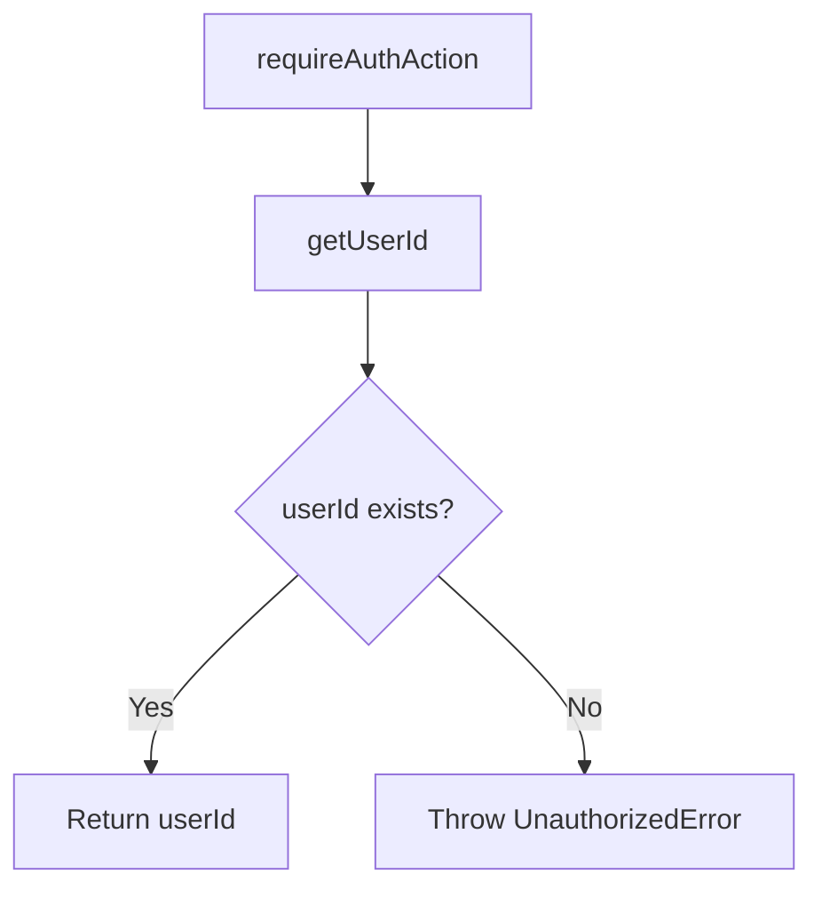
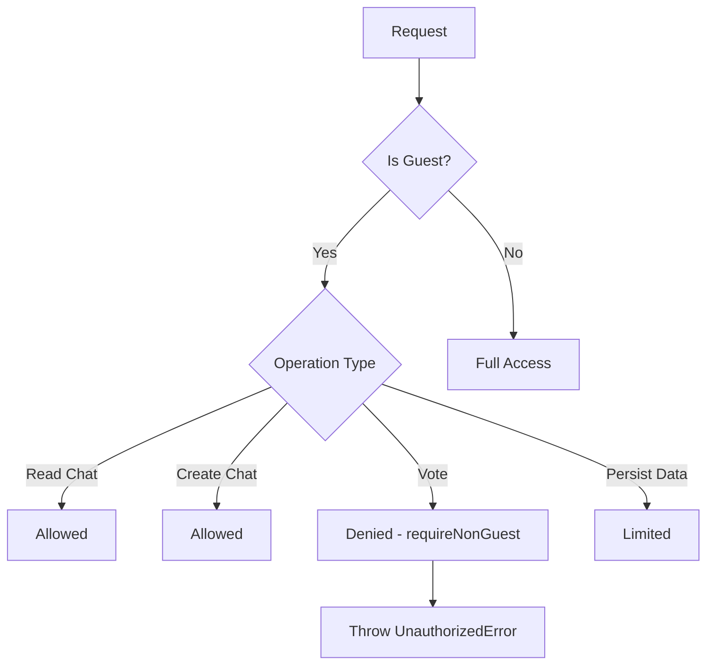
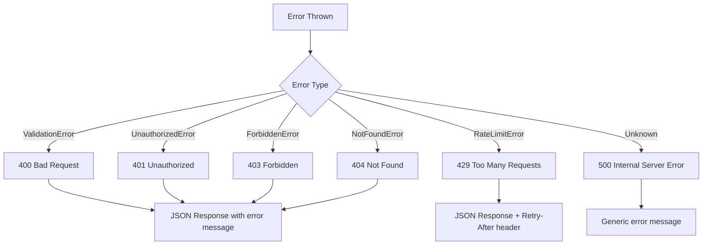
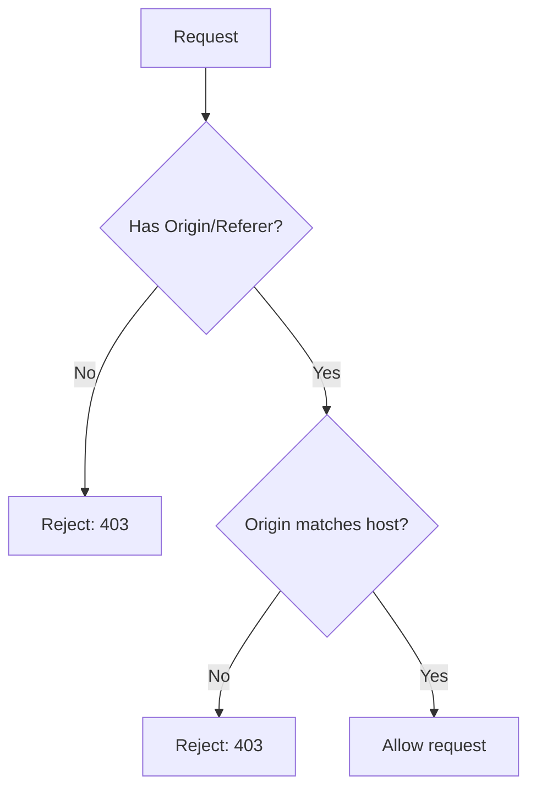
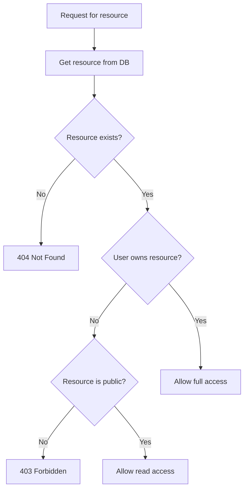
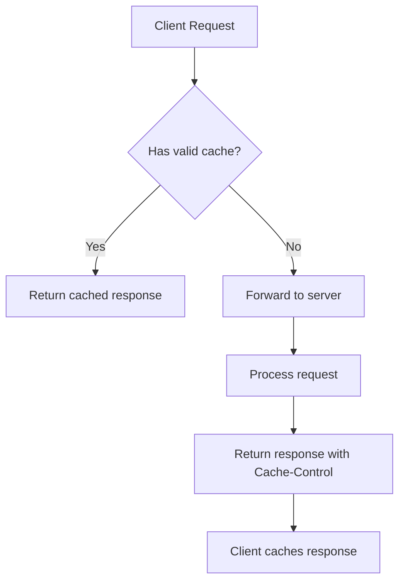

# API Routes Process Flow

## Overview

This document details the request handling flow, authentication/authorization flow, and error handling flow for API routes.

---

## 1. Request Handling Flow

### 1.1 Standard Request Flow



### 1.2 Streaming Request Flow (Chat POST)



### 1.3 Reconnection Flow



---

## 2. Authentication/Authorization Flow

### 2.1 Authentication Patterns

#### Pattern A: Standard Auth Check

```typescript
// Used by most routes
const userId = await requireAuthAction();
```



#### Pattern B: Auth with Session Object

```typescript
// Used when session details needed
const session = await getSession();
if (!session?.user?.id) {
    throw new UnauthorizedError("Authentication required");
}
```

#### Pattern C: Optional Auth

```typescript
// Used for public resources with optional personalization
const { userId, isAuthenticated } = await optionalAuth();
```

#### Pattern D: Non-Guest Required

```typescript
// Used for operations requiring full authentication
await requireAuthAction();
await requireNonGuest();
```

### 2.2 Authorization Patterns

#### Pattern A: Ownership Verification

```typescript
// Direct ownership check
const chat = await chatRepository.findById(chatId);
if (chat.userId !== userId) {
    throw new ForbiddenError("You do not have access to this chat");
}
```

#### Pattern B: Guard Function

```typescript
// Using guard functions
await requireOwnership(resource.userId);
// or
await requireChatAccess(chat);
await requireChatModification(chat);
```

#### Pattern C: Service-Level Verification

```typescript
// Service handles ownership internally
const result = await chatService.deleteChat(chatId, ctx);
// Service throws ForbiddenError if not owner
```

### 2.3 Guest User Handling



**Guest Limitations**:
- Cannot vote on messages (requires persistence)
- Cannot access suggestions (returns empty array)
- Data is ephemeral (session-based)

---

## 3. Error Handling Flow

### 3.1 Error Response Pattern



### 3.2 Error Handling Patterns

#### Pattern A: Centralized Error Helper

```typescript
// Most routes use this pattern
try {
    // ... route logic
} catch (err) {
    return error(err);  // lib/api helper
}
```

The `error()` helper from `lib/api`:
1. Detects error type
2. Sets appropriate HTTP status
3. Formats JSON response
4. Adds relevant headers

#### Pattern B: Manual Error Handling (Chat Route)

```typescript
// Chat route has manual handling for streaming
try {
    // ... logic
} catch (error) {
    if (error instanceof ValidationError) {
        return new Response(JSON.stringify({ error: error.message }), {
            status: 400,
            headers: { "Content-Type": "application/json" },
        });
    }
    if (error instanceof UnauthorizedError) {
        return new Response(/* ... */, { status: 401 });
    }
    // ... more error types
    return new Response(/* ... */, { status: 500 });
}
```

#### Pattern C: Rate Limit Error Handling

```typescript
// Reconnect route pattern
try {
    await requireRateLimit("api", userId);
} catch (err) {
    if (err instanceof RateLimitError) {
        const headers = new Headers();
        headers.set("Retry-After", String(err.details?.retryAfter ?? 60));
        headers.set("X-RateLimit-Reset", String(err.details?.reset));
        return new Response(JSON.stringify({
            success: false,
            error: {
                code: "RATE_LIMIT_EXCEEDED",
                message: err.message,
                statusCode: 429,
            },
        }), { status: 429, headers });
    }
    throw err;
}
```

### 3.3 Error Response Formats

#### Standard Error Response

```json
{
    "success": false,
    "error": "Error message here"
}
```

#### Validation Error Response

```json
{
    "success": false,
    "error": "Invalid request body",
    "details": {
        "field": "chatId",
        "code": "invalid_uuid"
    }
}
```

#### Rate Limit Error Response

```json
{
    "success": false,
    "error": {
        "code": "RATE_LIMIT_EXCEEDED",
        "message": "Too many requests. Please try again later.",
        "statusCode": 429
    }
}
```

Headers:
- `Retry-After: 60`
- `X-RateLimit-Limit: 100`
- `X-RateLimit-Remaining: 0`
- `X-RateLimit-Reset: 1708312345`

---

## 4. Rate Limiting Flow

### 4.1 Rate Limiter Types

| Limiter | Limit | Window | Use Case |
|---------|-------|--------|----------|
| `api` | 100 | 1 minute | Standard API endpoints |
| `strict` | 10 | 1 minute | Destructive operations |
| `chat` | 30 | 1 minute | Chat operations |
| `guest` | 5 | 1 minute | Guest session creation |
| `upload` | 10 | 1 hour | File uploads |
| `public` | 100 | 1 minute | Public endpoints (IP-based) |

### 4.2 Rate Limit Check Patterns

#### Pattern A: Check and Return

```typescript
const rateLimitResult = await checkApiLimit(userId);
if (!rateLimitResult.success) {
    const retryAfterSeconds = getRetryAfter(rateLimitResult.reset);
    return rateLimit(retryAfterSeconds);
}
```

#### Pattern B: Throw on Exceeded

```typescript
await requireRateLimit("api", userId);
// Throws RateLimitError if exceeded
```

### 4.3 Rate Limit Response Headers

All rate-limited responses include:

```
X-RateLimit-Limit: 100
X-RateLimit-Remaining: 95
X-RateLimit-Reset: 1708312345
```

When exceeded:

```
Retry-After: 45
```

---

## 5. Request Validation Flow

### 5.1 Query Parameter Validation

```typescript
// Using Zod schema
const suggestionQuerySchema = z.object({
    artifactId: z.string().uuid(),
});

const parsed = suggestionQuerySchema.safeParse({ artifactId });
if (!parsed.success) {
    return error("Invalid artifactId format");
}
```

### 5.2 Request Body Validation

```typescript
// Using validateBody helper
const body = await validateBody(request, CreateArtifactSchema);
// Throws ValidationError if invalid
```

### 5.3 UUID Validation Patterns

#### Pattern A: Zod Schema

```typescript
const uuidSchema = z.string().uuid();
const result = uuidSchema.safeParse(id);
```

#### Pattern B: Helper Function

```typescript
if (!isValidUUID(id)) {
    return error("Invalid id format: must be a valid UUID");
}
```

#### Pattern C: Regex (Legacy)

```typescript
const uuidRegex = /^[0-9a-f]{8}-[0-9a-f]{4}-[0-9a-f]{4}-[0-9a-f]{4}-[0-9a-f]{12}$/i;
if (!uuidRegex.test(chatId)) {
    throw new ValidationError("Invalid chat ID format");
}
```

---

## 6. Response Building Flow

### 6.1 Success Responses

```typescript
// Simple success
return success({ data });

// With rate limit headers
const response = success(data);
const headers = createRateLimitHeaders(rateLimitResult);
headers.forEach((value, key) => {
    response.headers.set(key, value);
});
return response;
```

### 6.2 Streaming Responses

```typescript
const stream = createUIMessageStream({ execute: ... });
return new Response(stream.pipeThrough(new JsonToSseTransformStream()), {
    headers: {
        "Content-Type": "text/event-stream; charset=utf-8",
        "Cache-Control": "no-cache",
        "Connection": "keep-alive",
    },
});
```

### 6.3 Redirect Responses

```typescript
// Guest GET with redirect
return NextResponse.redirect(new URL(safeRedirectUrl, url.origin));
```

---

## 7. Background Operations

### 7.1 Title Generation (Chat POST)

```mermaid
sequenceDiagram
    participant Route Handler
    participant Title Generator
    participant Stream Writer
    participant Chat Service

    Route Handler->>Title Generator: generateTitleFromUserMessage()
    Note over Title Generator: Non-blocking Promise
    
    Route Handler->>Route Handler: Continue with AI completion
    
    Title Generator-->>Route Handler: Title ready
    alt Stream still open
        Route Handler->>Stream Writer: Write title to stream
    end
    
    Note over Route Handler: onFinish callback
    Route Handler->>Chat Service: saveChat with placeholder title
    
    Title Generator->>Chat Service: updateTitle (background)
```

### 7.2 Usage Tracking

```typescript
onUsageCalculated: (usage) => {
    finalUsageContext = usage;
    logInfo("AI usage calculated", {
        chatId,
        modelId: selectedChatModel,
        inputTokens: usage.inputTokens,
        outputTokens: usage.outputTokens,
        totalTokens: usage.totalTokens,
    });
}
```

---

## 8. Security Flow

### 8.1 CSRF Protection



Applied to:
- `/api/auth/guest` (POST)
- `/api/auth/logout` (POST)

### 8.2 Open Redirect Protection

```typescript
// Only allow relative paths or same-origin URLs
const safeRedirectUrl = getSafeRedirectUrl(redirectUrl, url.origin);
```

### 8.3 Ownership Verification



---

## 9. Caching Flow

### 9.1 Response Cache Headers

| Endpoint | Cache Policy |
|----------|-------------|
| `/api/artifacts` (GET) | `private, max-age=60` |
| `/api/history` (GET) | `private, max-age=30, stale-while-revalidate=60` |
| `/api/suggestions` (GET) | `private, max-age=300` |
| `/api/health` (GET) | `public, max-age=0` |

### 9.2 Cache Flow



---

## Summary

### Key Flow Patterns

1. **Authentication First**: All protected routes check auth before any other operation
2. **Rate Limiting Second**: Rate limits checked immediately after auth
3. **Validation Third**: Request parameters/body validated before processing
4. **Service/Repository Layer**: Business logic delegated to services/repositories
5. **Consistent Error Handling**: Centralized error helper for uniform responses
6. **Background Operations**: Non-critical operations (title generation) run in background

### Flow Optimization Opportunities

1. **Early Rejection**: Auth and rate limit checks should happen before any DB queries
2. **Parallel Operations**: Independent operations can run concurrently
3. **Stream Early**: For streaming endpoints, start stream as early as possible
4. **Cache Headers**: Consistent cache header application across similar endpoints
